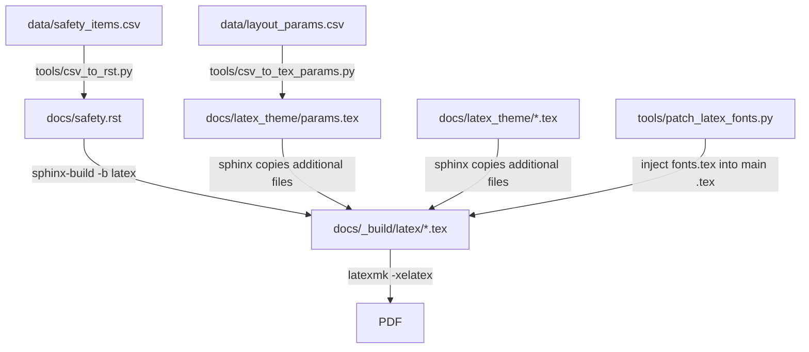

# Auto-Manual Tool

> 目标：把“能跑的 demo”升级为“可解释、可维护、可扩展的排版引擎”。
> 本文档覆盖：整体数据流、分层职责、文件边界、参数体系、构建流程、常见坑、扩展玩法与迭代路线。

---

## 0. 这个仓库是什么

这是一个 **CSV 驱动的工业说明书生成器**：

* 内容来自 CSV（由 CMS 产出）
* 版式来自 LaTeX 主题（参数化）
* 中间通过 Sphinx 把 RST 转 LsaTeX，再编译成 PDF

核心价值：**把“内容”和“排版”解耦**，并把排版尽可能“参数化”，让你能在 CMS 输出 CSV 后，快速产出稳定一致的 PDF，同时保留出版级精调的入口。

---

## 1. 总体数据流

### 1.1 Pipeline（从 CSV 到 PDF）



* `csv_to_rst.py` 负责把内容 CSV 渲染成 RST 主体。
* `csv_to_tex_params.py` 负责把布局 CSV 渲染成 `params.tex`（TeX 宏）。
* Sphinx 负责把 RST 转换成主 `.tex` 并拷贝主题文件到 `_build/latex`。
* `patch_latex_fonts.py` 负责把 `fonts.tex` 注入主 `.tex`，确保字体“压轴生效”。

---

## 2. 分层架构（你现在的引擎骨架）

目前已经在实践的分层模型：

* **L0 参数层**：CSV → TeX 宏（纯数据）
* **L1 类型系统层**：字体/字号/行距/颜色/大写规则（“字怎么长”）
* **L2 工具宏层**：对齐、行距锁死、调试宏等（“怎么排得稳”）
* **L3 组件层**：warning、subbar、two-column、pill 等（“模块怎么搭”）
* **L4 页面布局层**：geometry、页脚、页面模板（“页面怎么放”）
* **L5 出版精调层（Page Fit）**：轻微压缩/微调以“塞页”（“最后 5% 现实适配”）

---

## 3. 仓库关键目录与文件职责

### 3.1 `latex_theme/` 结构

```
latex_theme/
├── assets/
├── colors.tex          ← L0 (品牌色定义：从 params 取色值并 definecolor)
├── params.tex          ← L0 (CSV生成；只定义宏，不写逻辑)
├── type_system.tex     ← L1 (字体/字号/行距/大写策略：只定义 Type macros)
├── tools.tex           ← L2 (稳定性工具宏：对齐/行距锁死/调试)
├── components_base.tex ← L3-base (通用组件基础：list/table/note/rubric等结构)
├── components_safety.tex ← L3 (安全页专属组件：warning/subbar/twocol/h1/lead)
├── layout_core.tex     ← L4-core (页面机制：geometry, fancyhdr基础, 全局段落)
├── layout_templates.tex← L4-template (页面模板：Standard/NoFooter/Cover等组合)
├── theme.tex           ← 入口编排：按顺序 input 各层文件
├── fonts.tex           ← 字体（通过 patch 注入主 tex，保证生效）
└── page_fit.tex        ← L5 (出版精调层：全局/局部压缩的入口)
```

### 3.2 维护规则

* `params.tex`：**只定义宏**（`HBxxx`），不要写任何逻辑。
* `colors.tex`：**只负责 definecolor**，不要写排版结构。
* `type_system.tex`：**只定义 Type Macros**（例如 `\HBTypeWarningTextStart`），不要定义组件。
* `tools.tex`：**只定义工具宏**（例如 lock lines / apply alignment / debug），不要写具体组件结构。
* `components_*.tex`：**只定义结构**（盒子、tabular、tcolorbox 组合），字体/对齐/行距必须调用 L1/L2。
* `layout_*.tex`：只管页面结构、模板组合；页码数字规则最好也放到 L1（可选）。
* `page_fit.tex`：可以“hack”，但必须**可开关**且默认关闭，避免污染品牌系统。

---

## 4. 参数体系（layout_params.csv → params.tex）

### 4.1 `layout_params.csv` 设计原则

整个引擎的“控制台”。

长期遵守：

* key 命名统一前缀：`page_` / `type_` / `comp_` / `brand_color_` / 其它少量特例（如 `section_after_fix`）
* unit 严格枚举：`mm/pt/int/ratio/cmyk/...`（lint 会卡住非法 unit）
* ratio 表示纯比例数字（无单位），适合各种 scale / width ratio 等

### 4.2 `csv_to_tex_params.py` 的规则与输出

该脚本把 CSV 变成：

```tex
\expandafter\def\csname HB<key>\endcsname{<value><unit>}
```

其中 ratio/int/cmyk/none 等 unit 走“raw value”，不会加后缀。

这意味着：**所有上层 TeX 都应该只通过 `\csname HBxxx\endcsname` 读取参数**，不要硬编码数字。

---

## 5. 内容体系（safety_items.csv → safety.rst）

`csv_to_rst.py` 做了两件关键事：

1. 把 `top/bottom` 的条目渲染为 bullet list
2. 把 `lead_top/save_title` 渲染为 `.. raw:: latex` 调用命令（如 `\safetylead{...}`）


**内容层仍然是 RST，但关键排版组件通过 LaTeX 命令注入**，把“内容结构”和“视觉组件”连接起来。

建议长期扩展时也遵循：

* 内容结构优先在 RST（更易 diff、翻译）
* 需要强排版一致性的块，通过 `raw latex` 调用组件命令

---

## 6. 构建系统与“复制规则”

### 6.1 Sphinx 的关键约束

Sphinx 在 latex builder 里：

* 会把 `latex_additional_files` 列表里的文件复制到 `_build/latex` 根目录
* 因此 `\input{...}` 最稳的写法是 **输入文件名**（而不是 `latex_theme/xxx.tex`）


新文件必须同时满足：

1. `theme.tex` 里 `\input{xxx.tex}`
2. `conf_base.py` 的 `latex_additional_files` 里包含 `latex_theme/xxx.tex`

---

## 7. 字体注入机制

在 Sphinx 生成主 tex 后，向主 tex 注入 `\input{fonts.tex}`，从而保证字体设置在最终编译阶段生效。

这是为了对抗：

* Sphinx 模板/cls/宏包后置覆盖字体
* 不同平台字体可用性差异

原则：**fonts.tex 必须“稳定可编译”**，需要 fallback 机制。

---

## 8. 出版级精调层（L5）

需求：

* 品牌样式、H1/H2/H3、品牌色永远不动
* 希望通过微调字距/行距/图像比例，让多两行塞回同一页

### 8.1 L5 的关键设计原则

* 默认关闭（参数=1）
* 只允许微量（0.97–1.00）
* 必须可回退
* 最好可分对象：只压正文，不压标题/警示框

### 8.2 L5 的建议参数命名（避免 lint warning）


---

## 9. 如何扩展到“多产品、多主题”

目前已经非常接近“插件化主题系统”。

建议的扩展方式：

### 9.1 不动核心（base frozen）

* `colors.tex`
* `type_system.tex`
* `tools.tex`
* `components_base.tex`
* `layout_core.tex`

这些当作“平台内核”，尽量冻结。

### 9.2 产品/文档类型做“可插拔组件集”

例如：

* `components_safety.tex`（安全页组件集）
* `cover.tex`（封面页组件集）
* `components_qsg.tex`（快速上手组件集）

然后在 `theme.tex` 里选择 input 哪一个组件集，形成“主题变体”。

### 9.3 参数化优先用于“数值”，而不是“结构”

* **数值类**（pad/size/leading/color/width）应在 CSV
* **结构类**（tabular 结构/box 结构/对齐算法）应在组件层
  否则 CSV 会变成“控制结构的脚本语言”，维护成本会爆炸。

---

## 10. 常见坑与排查手册

### 10.1 新增文件后找不到

现象：`File xxx.tex not found`
排查：

1. `theme.tex` 是否 `\input{xxx.tex}`
2. `conf_base.py` 是否把 `latex_theme/xxx.tex` 加到 `latex_additional_files`

### 10.2 “Missing endcsname inserted”

通常原因：

* `\csname ...\endcsname` 中间出现非法 token
* `\edef` 过度展开把 token 拼坏
  建议：
* 在 L5 等敏感层避免 `\edef`，用延迟展开或在 BeginDocument 执行
* 先在 `_build/latex/params.tex` grep 对应 HB 宏是否存在

### 10.3 行距调不动（tabular 内）

目前实战过：tabular/array 里 TeX 可能触发 `lineskip` fallback
解决：工具宏层提供“锁死行距”宏（lineskip=0, lineskiplimit=0）并在正确作用域调用。

---

## 11. 迭代路线建议

1. **规范化命名**：把 L5 参数升级到 `page_` 前缀
2. **page_fit 分对象压缩**：只压正文/list，不压标题/warning
3. **引入“密度报告”**：构建时输出每页溢出风险（可先用日志统计/盒模型 debug）
4. **组件集插件化**：components_{domain}.tex
5. **主题变体**：theme_{variant}.tex 或通过 conf.py 注入不同的 additional_files

---

## 12. 总结

> 这是一个 CSV 驱动的文档排版引擎：
> 内容由 CMS 输出结构化 CSV，版式由分层 LaTeX 主题参数化控制，通过 Sphinx 将 RST → LaTeX → PDF，实现可维护、可扩展、可出版级精调的自动化说明书生产流水线。
