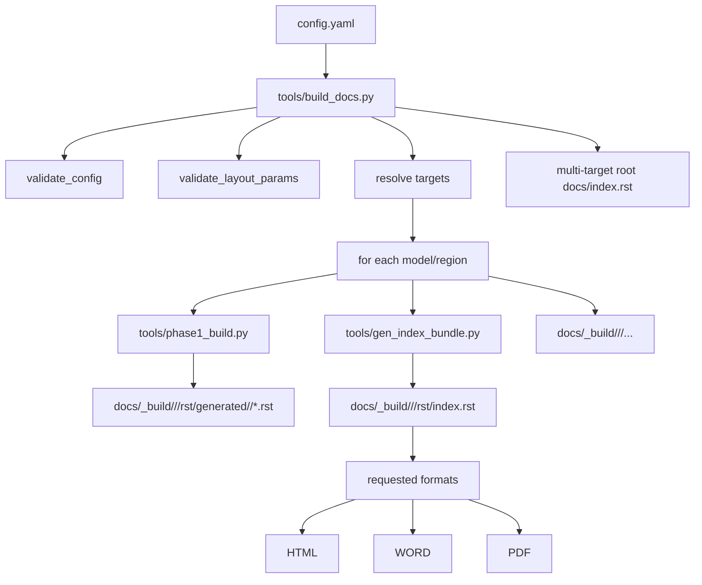

# Auto-Manual Tool

基于 CSV + RST 的说明书构建仓库。  
当前主流程是：`phase1 -> 生成 index.rst -> Sphinx LaTeX -> XeLaTeX PDF`，并支持多种 DOCX 导出。

## 1. 先看结论（当前真实逻辑）

- 用户入口：`build.py`；底层构建器：`tools/build_docs.py`
- `docs/index.rst` 不建议手改；它会自动汇总当前 `docs/_build` 下已存在的 bundle 入口
- `config.yaml` 的 `pages` 决定整本页面顺序
- `pages` 已有 dataclass schema（`tools/config_pages.py`），构建入口不再直接裸读字典
- `csv_page` 目前只支持 `source: phase1`
- 默认 `doc_type` 只支持 `manual_bundle`
- 构建目标解析（model/region/token）已统一收敛到 `tools/utils/targets.py`
- 当前推荐入口是：`python build.py rst|word|html|pdf|all`（CI / Windows / macOS / Linux 共用）
- `python build.py diff-report` 可导出 `docs/_build/JE-1000F` 的 Git 变更表格
- 批量构建由配置文件中的 `build.targets` 驱动
- `spec` 页 `product_name` 按 `Model + Region + Language` 从 `Spec_Master.csv` 解析
- `renderers` 与 `word_bundle` 已拆分为多模块（P1）

---

## 2. 快速开始

### 2.1 安装依赖

```bash
python3 -m venv .venv
source .venv/bin/activate
pip install -r requirements.txt
```

系统依赖：

- PDF 必需：`xelatex`（TeX Live / MiKTeX）
- DOCX 需要：
  - `word_source=latex` 或 `word_source=html`：必需 `pandoc`
  - `word_source=bundle`：
    - Windows：走 Word COM（可不依赖 pandoc）
    - macOS/Linux：走 pandoc

如果你要显式构建 HTML（`build.build_html: true`），请确保安装 `furo` 主题：

```bash
pip install furo
```

### 2.2 生成 LaTeX 参数（首次构建前建议执行）

```bash
python3 tools/csv_to_tex_params.py
```

说明：

- 输入：`data/layout_params.csv`
- 输出：`docs/renderers/latex/params.tex`
- `tools/build_docs.py` **不会**自动重建 `params.tex`
- `python build.py clean`（以及兼容的 `make clean`）会删除 `docs/renderers/latex/params.tex`

### 2.3 Windows 构建命令

当前推荐直接使用根目录的 `build.py`，它会读取配置里的 `build.targets` 并批量构建所有目标：

```powershell
python build.py rst
python build.py word
python build.py html
python build.py pdf
python build.py all
```

说明：

- `python build.py rst` 只生成每个 target 的 RST bundle
- `python build.py word` 会先生成 RST，再导出 Word
- `python build.py html` 会先生成 RST，再导出 HTML
- `python build.py pdf` 会先生成 RST，再导出 PDF
- `python build.py all` 会一次性构建 `html + word + pdf`
- 默认 clean 只清当前 target 的输出目录，并顺带清理该 target 对应的旧布局历史产物

`config.yaml` 示例：

```yaml
build:
  default_region: US
  targets:
    - model: JE-2000F
      region: US
    - model: JE-1000F
      region: US
```

切换配置文件时：

```powershell
python build.py rst --config config.ja.yaml
python build.py word --config config.ja.yaml
```

如果只想构建单个型号，也可以直接指定：

```powershell
python build.py word --config config.yaml --model JE-2000F --region US
```

`Makefile` 仍然保留，但现在只是兼容层；Windows 没有 `make` 也不影响构建。
更完整的 Windows 说明见 `code-as-doc/build_doc_guide.md`。

---

## 3. build_docs 实际执行顺序

`tools/build_docs.py` 当前真实顺序如下：

1. 读取并校验 `config.yaml`
2. 校验 `paths.layout_params_csv`，默认是 `data/layout_params.csv`
3. 解析构建目标：
   - 优先使用 `--model` / `--region`
   - 批量模式使用 `--all-targets` + `build.targets`
   - 单目标默认回退到 `build.default_model` / `build.default_region`
4. 按 target 的 `Model + Region + Language` 从 `Spec_Master.csv` 解析 `product_name`
5. 对 `csv_page` 运行 `tools/phase1_build.py`，输出到 `docs/_build/<model>/<region>/rst/generated/<model>/`
6. 调用 `tools/gen_index_bundle.py`，生成 `docs/_build/<model>/<region>/rst/index.rst`
7. 如果是 `--prepare-only`，到这里结束
8. 按请求格式继续构建：
   - `html`：Sphinx HTML
   - `word`：按 `build.word_source` 导出 DOCX
   - `pdf`：按 PDF backend 导出
9. 最后重写根 `docs/index.rst`，让它指向 `_build/.../rst/index`

补充：

- `build_docs.py` 调用 `validate_config` 时使用 `strict_files=False`
- `cover_pdf` / `rst_include` 这类文件的存在性问题通常会在后续阶段暴露

可视化：


```mermaid
flowchart TD
  A[config.yaml] --> B[tools/build_docs.py]
  B --> C[validate_config]
  B --> D[validate_layout_params]
  B --> E[resolve targets]
  E --> F[for each model/region]
  F --> G[tools/phase1_build.py]
  G --> H[docs/_build/<model>/<region>/rst/generated/<model>/*.rst]
  F --> I[tools/gen_index_bundle.py]
  I --> J[docs/_build/<model>/<region>/rst/index.rst]
  J --> K[requested formats]
  K --> L[HTML]
  K --> M[WORD]
  K --> N[PDF]
  F --> O[docs/_build/<model>/<region>/...]
  B --> P[multi-target root docs/index.rst]
```

---

## 4. ??????`config.yaml`?

`build_docs.py` ??????????

- `build.targets`???????????
- `build.default_model`????
- `build.default_region`????
- `build.main_tex`
- `build.output_pdf`
- `build.xelatex_runs`
- `build.formats`????
- `build.build_word`
- `build.word_source`?`latex | html | bundle`
- `build.word_output`
- `build.word_reference_doc`????? bundle?
- `build.build_html`
- `build.open_pdf / build.open_word / build.open_html`
- `paths.layout_params_csv`
- `paths.spec_master_csv`
- `paths.spec_footnotes_csv`???????????????? CSV?
- `paths.spec_titles_csv`???????????? spec ??????? CSV?
- `tools.patch_fonts`
- `pages`?????????

???

- `--all-targets` ??? `build.targets`
- `--prepare-only` ??? bundle rst?????? Word / HTML / PDF
- `--no-open` ??? `open_pdf/open_word/open_html`
- `doc_type` ????? `manual_bundle`???????

---

## 5. 构建目标解析逻辑

优先级：

1. 命令行 `--model` / `--region`
2. `--all-targets` + `build.targets`
3. `build.default_model` / `build.default_region`

说明：

- 构建目标只由 `model` / `region` 决定
- `build.targets` 是批量构建的唯一声明入口
- `product_name` 从 `Spec_Master.csv` 中 `Row_key=product_name` 的记录解析
- 根 `docs/index.rst` 每次都会被重写成最新入口；单目标时直接 include `_build/<model>/<region>/rst/index`，多目标时写成总目录页

实现上：

- `build_docs.py`、`gen_index_bundle.py`、`word_bundle.py` 统一复用 `tools/utils/targets.py`
- `build.default_model/default_region/build.targets` 的解析语义已经统一
- 同一个 target 在不同构建入口下不会再分叉到不同目录结构

---

## 6. 页面类型与约束（pages DSL）

支持类型：

- `cover_pdf`
- `csv_page`
- `pdf_insert`
- `rst_include`

当前约束：

- `csv_page.source` 仅支持 `phase1`
- `rst_include` 直接 include 指定 rst
- `docs/index.rst` 每次由构建入口重写，用来指向 `_build/.../rst/index`
- `pages` 解析统一走 `tools/config_pages.py`（`CoverPdfPage/CsvPage/PdfInsertPage/RstIncludePage`）

---

## 7. Phase1 真实数据来源

默认路径：

- 页面定义：`data/phase1/page_registry.csv`
- 默认块：`data/phase1/content_blocks.csv`
- 每页块覆盖：`data/phase1/<page_id>_blocks.csv`（如存在则优先）

当前说明：

- `phase1` 不再读取 `product_variables.csv`
- 渲染变量来源为构建参数（`--model/--region`）与 `Spec_Master.csv` 解析出的 `product_name`
- `docs/templates/*.rst`（除 `safety_template.rst/spec_template.rst`）若需要产品名，统一使用：
  - `|PRODUCT_NAME|`
  - `|PRODUCT_NAME_BOLD|`

每页块数据优先级：

1. 若存在 `data/phase1/<page_id>_blocks.csv`，优先使用该页文件
2. 否则回退到 `content_blocks.csv` 里 `page_id=<page_id>` 的块

`spec` 页特殊逻辑（当前已改为单一来源）：

1. 主数据仅使用 `paths.spec_master_csv`
2. 脚注补充仅使用 `paths.spec_footnotes_csv`（可为空禁用）
3. 页面标题/分节标题多语言映射仅使用 `paths.spec_titles_csv`（`title_en` 为主键/默认值，可为空禁用）

渲染器限制：

- 当前注册渲染器只有：`safety`、`spec`、`symbols`
- 若 `csv_page` 指向未注册渲染器，默认会直接报错

---

## 8. DOCX 导出模式（`build.word_source`）

### 8.1 `word_source=latex`

- 输入：`docs/_build/<model>/<region>/latex/<main_tex>`
- 工具：pandoc
- 优点：接近 LaTeX 排版结果

### 8.2 `word_source=html`

- 输入：`docs/_build/<model>/<region>/html/index.html`
- 工具：pandoc
- 若 `build_html=false` 但选择 html 导出，脚本会临时用 `alabaster` 最小主题构建 HTML（避免对 `furo` 强依赖）

### 8.3 `word_source=bundle`

- 输入：`docs/_build/<model>/<region>/rst/` 下的 bundle 内容
- `csv_page`：先走 phase1 生成 `docs/_build/<model>/<region>/rst/generated/<model>/<page>_<lang>.rst`，再读取该 RST 转 HTML
- `rst_include`：读取配置中的 RST 文件转 HTML
- 中间 HTML 产物位于 `docs/_build/<model>/<region>/word/manual_bundle.html`
- 结论：`html / pdf / word(bundle)` 都基于同一份 `rst/generated` 内容源
- 不支持：`pdf_insert`
- 参考模板：`build.word_reference_doc`
  - 支持通配符路径（取排序后的第一个匹配）
- 额外后处理：
  - 导出后会强制补齐 Word 大纲级别（`Heading1/Heading2` 对应 `outlineLvl 0/1`），确保导航层级稳定

---

## 9. 输出文件

- RST bundle：`docs/_build/<model>/<region>/rst/`
- phase1 generated：`docs/_build/<model>/<region>/rst/generated/<model>/`
- HTML：`docs/_build/<model>/<region>/html/`
- DOCX：`docs/_build/<model>/<region>/word/<word_output>`
- PDF：`docs/_build/<model>/<region>/pdf/<output_pdf>`
- LaTeX 中间文件：`docs/_build/<model>/<region>/latex/`
- Word bundle HTML：`docs/_build/<model>/<region>/word/manual_bundle.html`

---

## 10. 常用命令

校验配置：

```powershell
python build.py validate
```

只生成 RST bundle：

```powershell
python build.py rst
```

构建 Word：

```powershell
python build.py word
```

构建 HTML：

```powershell
python build.py html
```

构建 PDF：

```powershell
python build.py pdf
```

一次性构建全部产物：

```powershell
python build.py all
```

导出 `JE-1000F` 版本变更表：

```powershell
python build.py diff-report
python build.py diff-report --from-ref HEAD~3 --to-ref HEAD
```

输出默认位于：

```text
reports/version_tracking/JE-1000F/
```

说明：

- 当前只对 `docs/_build/JE-1000F/*/rst/**/*.rst` 开放 Git 跟踪
- `diff-report` 会导出同一批文件在两个 Git ref 之间的 `CSV + HTML`
- 第一次使用前，需要先把 `JE-1000F` 的 rst 文件加入 Git 并提交一次，作为基线版本

切换配置文件：

```powershell
python build.py word --config config.ja.yaml
```

只构建单个目标：

```powershell
python build.py word --config config.yaml --model JE-2000F --region US
```

如果你需要直接排查底层链路，也可以分别执行：

```powershell
python tools\phase1_build.py --model JE-2000F --region US --page safety,spec --lang en --spec-master-csv data/phase1/Spec_Master.csv --spec-footnotes-csv data/phase1/Spec_Footnotes.csv --spec-titles-csv data/phase1/spec_titles.csv
python tools\gen_index_bundle.py --config config.yaml --model JE-2000F --region US
python tools\word_bundle.py --config config.yaml --model JE-2000F --region US --output manual_demo_en.docx
```

---

## 11. ????????

- `xelatex not found`  
  ?? TeX Live/MiKTeX???? `xelatex` ? PATH ?

- `config uses unsupported '{sku}' token`  
  ????? `{sku}` ?? `{model}` ? `{region}`

- `Word reference doc not found`  
  ?? `build.word_reference_doc` ?????????????

- `Failed to resolve Product Name from Spec_Master.csv`  
  ?? `Spec_Master.csv` ??????? `Model + Region` ? `Row_key=product_name`

- `make : The term 'make' is not recognized ...`  
  直接改用 `python build.py ...`。`Makefile` 现在只是兼容层，不再是唯一入口

- `No content blocks for page_id=...`  
  ?? `content_blocks.csv` ? `<page_id>_blocks.csv`

- `missing renderer for page_id=...`  
  ? `csv_page` ????????????? `safety/spec/symbols`?

- `File params.tex not found`  
  ??? `python3 tools/csv_to_tex_params.py`

- `build_html=true` ?????????? `furo`?  
  ???????? `word_source=html + build_html=false` ???????

- `PDF not found: docs/_build/<model>/<region>/latex/<output_pdf>`  
  `output_pdf` ?? `main_tex` ????????? `main_tex: manual_demo.tex` ?????? `manual_demo.pdf`?

---

## 12. ???????????????

??? `config.yaml` ???

- `build.default_model: JE-2000F`
- `build.default_region: US`
- `build.targets: [{ model: JE-2000F, region: US }]`
- `build.main_tex: manual_demo.tex`
- `build.output_pdf: manual_demo.pdf`
- `build.xelatex_runs: 3`
- `build.build_word: true`
- `build.word_source: bundle`
- `build.word_output: manual_demo_en.docx`
- `build.build_html: false`
- `paths.spec_master_csv: data/phase1/Spec_Master.csv`
- `paths.spec_footnotes_csv: data/phase1/Spec_Footnotes.csv`

????????????? `config.yaml` ????????

---

## 13. 维护规范与仓库卫生（P0/P1）

规范文档：

- 代码规范主文档：`code-as-doc/code_style_guide.md`
- 本次 P0 优化记录：`code-as-doc/code_optimization_log.md`
- 文档维护规范：`code-as-doc/code-as-doc.md`

P1 结构优化（已完成）：

- `tools/phase1/renderers.py` 已拆分为：
  - `tools/phase1/renderers_common.py`
  - `tools/phase1/renderers_safety.py`
  - `tools/phase1/renderers_spec.py`
  - `tools/phase1/renderers_spec_parser.py`
  - `tools/phase1/renderers_symbols.py`
- `tools/word_bundle.py` 已拆分为：
  - `tools/word_bundle_common.py`
  - `tools/word_bundle_html.py`
  - `tools/word_bundle_docx.py`
- `config/pages` schema 已 dataclass 化：`tools/config_pages.py`

仓库卫生规则：

- `docs/_build/`、`__pycache__/`、`.DS_Store` 已加入 `.gitignore`
- 这些目录/文件属于构建产物或缓存，不应进入版本库
- 如果后续发现再次被追踪，先检查 `.gitignore`，再执行 `git rm --cached <path>`
