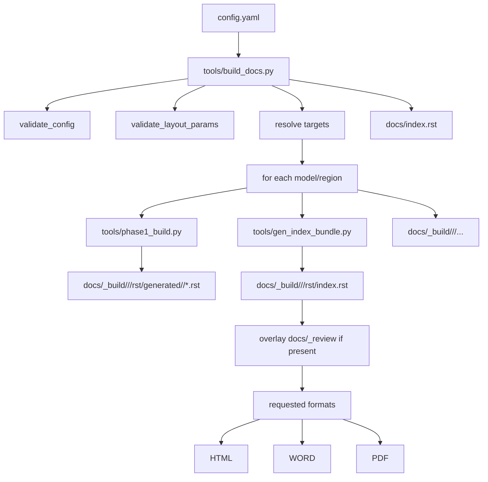

# Auto-Manual Tool

基于 CSV + RST 的说明书构建仓库。

当前主流程已经统一到跨平台入口 [build.py](build.py)，并且采用 review-first 工作方式：

- 先用模板和数据生成 draft
- review 开始后改 [docs/_review/](docs/_review)
- 用 `check / diff-report / publish` 完成质检、修订记录和终稿导出

相关文档：

- 用户工作流：[user-guide/hello_auto-doc.md](user-guide/hello_auto-doc.md)
- 快速示例：[user-guide/quick_start_guide.md](user-guide/quick_start_guide.md)
- 维护文档索引：[code-as-doc/README.md](code-as-doc/README.md)

---

## 1. 先看结论（当前真实逻辑）

- 用户入口是 [build.py](build.py)；底层构建器仍然是 [tools/build_docs.py](tools/build_docs.py)
- `docs/index.rst` 不建议手改；它会自动汇总当前 [docs/_build/](docs/_build) 下已存在的 bundle 入口
- `config.yaml` / `config.ja.yaml` / `config.eu.yaml` 是按模板族共享的配置，不再按型号复制一份 YAML
- `config.pages` 决定整本页面顺序，`pages` 已有 dataclass schema，由 [tools/config_pages.py](tools/config_pages.py) 统一解析
- `csv_page` 当前只支持 `source: phase1`
- 默认 `doc_type` 只支持 `manual_bundle`
- 构建目标解析（`model / region / token`）已统一收敛到 [tools/utils/targets.py](tools/utils/targets.py)
- 当前推荐入口是：`python build.py rst|review|check|sync-review|publish|word|html|pdf|all`
- 版本跟踪推荐对 [docs/_review/](docs/_review) 做 `diff-report`，而不是只盯 `_build`
- 批量构建由配置文件中的 `build.targets` 驱动
- `spec` 页的 `product_name` 按 `Model + Region + Language` 从 [data/phase1/Spec_Master.csv](data/phase1/Spec_Master.csv) 解析
- `renderers` 与 `word_bundle` 已拆分为多模块，review / diff-report / contract 校验已接到主流程上

---

## 2. 快速开始

### 2.1 安装依赖

Windows PowerShell：

```powershell
python -m venv .venv
.venv\Scripts\Activate.ps1
pip install -r requirements.txt
```

macOS / Linux：

```bash
python3 -m venv .venv
source .venv/bin/activate
pip install -r requirements.txt
```

系统依赖：

- PDF 必需：`xelatex`（TeX Live / MiKTeX）
- DOCX 需要：
  - `word_source=latex` 或 `word_source=html`：必需 `pandoc`
  - `word_source=bundle`：
    - Windows：优先走 Word COM，可不依赖 `pandoc`
    - macOS / Linux：走 `pandoc`

如果你是通过 `pip install -r requirements.txt` 安装环境，`furo` 已经会一并安装；如果是手动精简安装环境，请确保额外安装 `furo` 主题。

### 2.2 生成 LaTeX 参数（首次构建前建议执行）

```bash
python3 tools/csv_to_tex_params.py
```

说明：

- 输入：[data/layout_params.csv](data/layout_params.csv)
- 输出：[docs/renderers/latex/params.tex](docs/renderers/latex/params.tex)
- [tools/build_docs.py](tools/build_docs.py) 不会自动重建 `params.tex`
- `python build.py clean` 会删除 [docs/renderers/latex/params.tex](docs/renderers/latex/params.tex)

### 2.3 Windows 构建命令

当前推荐直接使用根目录的 [build.py](build.py)，它会读取配置里的 `build.targets` 并批量构建所有目标：

```powershell
python build.py rst
python build.py word
python build.py html
python build.py pdf
python build.py all
```

说明：

- `python build.py rst` 只生成每个 target 的 RST bundle
- `python build.py word` 会先生成 RST，再导出 Word
- `python build.py html` 会先生成 RST，再导出 HTML
- `python build.py pdf` 会先生成 RST，再导出 PDF
- `python build.py all` 会一次性构建 `html + word + pdf`
- 默认 `clean` 只清当前 target 的输出目录，并顺带清理该 target 对应的旧布局历史产物

`config.yaml` 示例：

```yaml
build:
  default_region: US
  targets:
    - model: JE-2000F
      region: US
    - model: JE-1000F
      region: US
```

切换配置文件时：

```powershell
python build.py rst --config config.ja.yaml
python build.py word --config config.ja.yaml
```

如果只想构建单个型号，也可以直接指定：

```powershell
python build.py word --config config.yaml --model JE-2000F --region US
```

[Makefile](Makefile) 仍然保留，但现在只是兼容层；Windows 没有 `make` 也不影响构建。更完整的 Windows 说明见 [code-as-doc/build_doc_guide.md](code-as-doc/build_doc_guide.md)。

### 2.4 Review-first 流程（推荐）

以 `JE-1000F / JP` 为例：

```powershell
python build.py rst --config config.ja.yaml --model JE-1000F --region JP --source runtime
python build.py review --config config.ja.yaml --model JE-1000F --region JP
python build.py check --config config.ja.yaml --model JE-1000F --region JP
python build.py publish --config config.ja.yaml --model JE-1000F --region JP
```

更完整的用户流程见：

- [user-guide/hello_auto-doc.md](user-guide/hello_auto-doc.md)
- [user-guide/quick_start_guide.md](user-guide/quick_start_guide.md)

---

## 3. build_docs 实际执行顺序

[tools/build_docs.py](tools/build_docs.py) 当前真实顺序如下：

1. 读取并校验 config
2. 校验 `paths.layout_params_csv`，默认是 [data/layout_params.csv](data/layout_params.csv)
3. 解析构建目标：
   - 优先使用 `--model` / `--region`
   - 批量模式使用 `--all-targets` + `build.targets`
   - 单目标默认回退到 `build.default_model` / `build.default_region`
4. 按 target 的 `Model + Region + Language` 从 [data/phase1/Spec_Master.csv](data/phase1/Spec_Master.csv) 解析 `product_name`
5. 对 `csv_page` 运行 [tools/phase1_build.py](tools/phase1_build.py)，输出到 `docs/_build/<model>/<region>/rst/generated/<model>/`
6. 调用 [tools/gen_index_bundle.py](tools/gen_index_bundle.py)，生成 `docs/_build/<model>/<region>/rst/index.rst`
7. 如果 source 是 `auto` 或 `review`，并且对应 review bundle 存在，则把 [docs/_review/](docs/_review) 叠加到 runtime bundle
8. 如果是 `--prepare-only`，到这里结束
9. 按请求格式继续构建：
   - `html`：Sphinx HTML
   - `word`：按 `build.word_source` 导出 DOCX
   - `pdf`：按 PDF backend 导出
10. 最后重写根 [docs/index.rst](docs/index.rst)，让它指向 `_build/.../rst/index`

补充：

- `build_docs.py` 调用 `validate_config` 时使用 `strict_files=False`
- `cover_pdf` / `rst_include` 这类文件的存在性问题通常会在后续阶段暴露
- `check / html / word / pdf` 默认是 `source=auto`，所以 review 存在时会优先使用 review 内容

可视化：


```mermaid
flowchart TD
  A["config.yaml"] --> B["tools/build_docs.py"]
  B --> C["validate_config"]
  B --> D["validate_layout_params"]
  B --> E["resolve targets"]
  E --> F["for each model/region"]
  F --> G["tools/phase1_build.py"]
  G --> H["docs/_build/<model>/<region>/rst/generated/<model>/*.rst"]
  F --> I["tools/gen_index_bundle.py"]
  I --> J["docs/_build/<model>/<region>/rst/index.rst"]
  J --> R["overlay docs/_review if present"]
  R --> K["requested formats"]
  K --> L["HTML"]
  K --> M["WORD"]
  K --> N["PDF"]
  F --> O["docs/_build/<model>/<region>/..."]
  B --> P["docs/index.rst"]
```

---

## 4. `config.yaml` / `config.ja.yaml` / `config.eu.yaml` 关键字段

当前 `build_docs.py` 主要会读取这些字段：

- `build.targets`
- `build.default_model`
- `build.default_region`
- `build.main_tex`
- `build.output_pdf`
- `build.xelatex_runs`
- `build.build_word`
- `build.word_source`：`latex | html | bundle`
- `build.word_output`
- `build.word_reference_doc`
- `build.word_title`
- `build.build_html`
- `build.open_pdf / build.open_word / build.open_html`
- `paths.layout_params_csv`
- `paths.spec_master_csv`
- `paths.spec_footnotes_csv`
- `paths.spec_titles_csv`
- `tools.patch_fonts`
- `pages`

CLI 相关控制：

- `--all-targets`：按 `build.targets` 批量构建
- `--prepare-only`：只生成 bundle rst，不继续导出 Word / HTML / PDF
- `--no-open`：覆盖 `open_pdf / open_word / open_html`
- `--source auto|runtime|review`：控制构建内容来自 runtime 还是 review
- `doc_type` 当前只支持 `manual_bundle`

当前共享配置规则：

- [config.yaml](config.yaml)：EN / US 模板族
- [config.ja.yaml](config.ja.yaml)：JP 模板族
- [config.eu.yaml](config.eu.yaml)：EU 模板族

---

## 5. 构建目标解析逻辑

优先级：

1. 命令行 `--model` / `--region`
2. `--all-targets` + `build.targets`
3. `build.default_model` / `build.default_region`

说明：

- 构建目标只由 `model` / `region` 决定
- `build.targets` 是批量构建的唯一声明入口
- `product_name` 从 [data/phase1/Spec_Master.csv](data/phase1/Spec_Master.csv) 中 `Row_key=product_name` 的记录解析
- 根 [docs/index.rst](docs/index.rst) 每次都会被重写成最新入口；单目标时直接 include `_build/<model>/<region>/rst/index`，多目标时写成总目录页

实现上：

- [tools/build_docs.py](tools/build_docs.py)、[tools/gen_index_bundle.py](tools/gen_index_bundle.py)、[tools/word_bundle.py](tools/word_bundle.py) 统一复用 [tools/utils/targets.py](tools/utils/targets.py)
- `build.default_model / build.default_region / build.targets` 的解析语义已经统一
- 同一个 target 在不同构建入口下不会再分叉到不同目录结构

---

## 6. 页面类型与约束（pages DSL）

支持类型：

- `cover_pdf`
- `csv_page`
- `pdf_insert`
- `rst_include`

当前约束：

- `csv_page.source` 仅支持 `phase1`
- `rst_include` 直接 include 指定 rst
- [docs/index.rst](docs/index.rst) 每次由构建入口重写，用来指向 `_build/.../rst/index`
- `pages` 解析统一走 [tools/config_pages.py](tools/config_pages.py)

---

## 7. Phase1 真实数据来源

默认路径：

- 页面定义：[data/phase1/page_registry.csv](data/phase1/page_registry.csv)
- 默认块：[data/phase1/content_blocks.csv](data/phase1/content_blocks.csv)
- 每页块覆盖：`data/phase1/<page_id>_blocks.csv`（如存在则优先）

当前说明：

- `phase1` 不再读取 `product_variables.csv`
- 渲染变量来源为构建参数（`--model / --region`）与 [Spec_Master.csv](data/phase1/Spec_Master.csv) 解析出的 `product_name`
- 模板页若需要产品名，统一使用：
  - `|PRODUCT_NAME|`
  - `|PRODUCT_NAME_BOLD|`

每页块数据优先级：

1. 若存在 `data/phase1/<page_id>_blocks.csv`，优先使用该页文件
2. 否则回退到 [content_blocks.csv](data/phase1/content_blocks.csv) 中 `page_id=<page_id>` 的块

`spec` 页特殊逻辑（当前已改为单一来源）：

1. 主数据仅使用 `paths.spec_master_csv`
2. 脚注补充仅使用 `paths.spec_footnotes_csv`
3. 页面标题 / 分节标题多语言映射仅使用 `paths.spec_titles_csv`

渲染器限制：

- 当前注册渲染器只有：`safety`、`spec`、`symbols`
- 若 `csv_page` 指向未注册渲染器，默认会直接报错

review 阶段如果你改了数据表，推荐直接：

```powershell
python build.py sync-review --config ... --model ... --region ...
```

而不是默认用 `review --refresh-review` 重刷整包。

---

## 8. DOCX 导出模式（`build.word_source`）

### 8.1 `word_source=latex`

- 输入：`docs/_build/<model>/<region>/latex/<main_tex>`
- 工具：pandoc
- 优点：接近 LaTeX 排版结果

### 8.2 `word_source=html`

- 输入：`docs/_build/<model>/<region>/html/index.html`
- 工具：pandoc
- 若 `build_html=false` 但选择 html 导出，脚本会临时用 `alabaster` 最小主题构建 HTML

### 8.3 `word_source=bundle`

- 输入：`docs/_build/<model>/<region>/rst/` 下的 bundle 内容
- `csv_page`：先走 phase1 生成 `docs/_build/<model>/<region>/rst/generated/<model>/<page>_<lang>.rst`，再读取该 RST 转 HTML
- `rst_include`：读取配置中的 RST 文件转 HTML
- 中间 HTML 产物位于 `docs/_build/<model>/<region>/word/manual_bundle.html`
- `html / pdf / word(bundle)` 当前都基于同一份 `rst/generated` 内容源
- 不支持：`pdf_insert`
- 参考模板：`build.word_reference_doc`
- 导出后会强制补齐 Word 大纲级别，确保导航层级稳定

---

## 9. 输出文件

- RST bundle：`docs/_build/<model>/<region>/rst/`
- phase1 generated：`docs/_build/<model>/<region>/rst/generated/<model>/`
- HTML：`docs/_build/<model>/<region>/html/`
- DOCX：`docs/_build/<model>/<region>/word/<word_output>`
- PDF：`docs/_build/<model>/<region>/pdf/<output_pdf>`
- LaTeX 中间文件：`docs/_build/<model>/<region>/latex/`
- Word bundle HTML：`docs/_build/<model>/<region>/word/manual_bundle.html`
- Review bundle：`docs/_review/<model>/<region>/`
- 修订记录：`reports/version_tracking/<model>/<region>/`

---

## 10. 常用命令

校验配置：

```powershell
python build.py validate
```

只生成 RST bundle：

```powershell
python build.py rst
```

进入 review：

```powershell
python build.py review --config config.ja.yaml --model JE-1000F --region JP
```

同步数据变更到 review：

```powershell
python build.py sync-review --config config.ja.yaml --model JE-1000F --region JP
```

构建 Word：

```powershell
python build.py word
```

构建 HTML：

```powershell
python build.py html
```

构建 PDF：

```powershell
python build.py pdf
```

一次性构建全部产物：

```powershell
python build.py all
```

正式发布：

```powershell
python build.py publish --config config.ja.yaml --model JE-1000F --region JP
```

导出版本变更表：

```powershell
python build.py diff-report --config config.ja.yaml --tracked-root docs/_review/JE-1000F/JP
python build.py diff-report --config config.ja.yaml --tracked-root docs/_review/JE-1000F/JP --from-ref HEAD~1 --to-ref HEAD
```

切换配置文件：

```powershell
python build.py word --config config.ja.yaml
```

只构建单个目标：

```powershell
python build.py word --config config.yaml --model JE-2000F --region US
```

如果你需要直接排查底层链路，也可以分别执行：

```powershell
python tools\phase1_build.py --model JE-2000F --region US --page safety,spec --lang en --spec-master-csv data/phase1/Spec_Master.csv --spec-footnotes-csv data/phase1/Spec_Footnotes.csv --spec-titles-csv data/phase1/spec_titles.csv
python tools\gen_index_bundle.py --config config.yaml --model JE-2000F --region US
python tools\word_bundle.py --config config.yaml --model JE-2000F --region US --output manual_je2000f_us.docx
```

---

## 11. 常见问题

- `xelatex not found`
  - 安装 TeX Live / MiKTeX，并确保 `xelatex` 在 PATH 中

- `Word reference doc not found`
  - 检查 `build.word_reference_doc` 路径是否有效

- `Failed to resolve Product Name from Spec_Master.csv`
  - 检查 [Spec_Master.csv](data/phase1/Spec_Master.csv) 中是否存在对应 `Model + Region + Language` 的 `Row_key=product_name`

- `make : The term 'make' is not recognized ...`
  - 直接改用 `python build.py ...`

- `No content blocks for page_id=...`
  - 检查 [content_blocks.csv](data/phase1/content_blocks.csv) 和 `data/phase1/<page_id>_blocks.csv`

- `missing renderer for page_id=...`
  - 检查 `csv_page` 是否错误指向未注册渲染器

- `File params.tex not found`
  - 重新执行 `python3 tools/csv_to_tex_params.py`

- `build_html=true` 但缺少主题
  - 重新执行 `pip install -r requirements.txt`，或单独安装 `furo`

- review 文本没有跟随参数更新
  - 执行 `python build.py sync-review --config ... --model ... --region ...`

---

## 12. 常用配置片段

一个最小共享配置通常会包含：

```yaml
build:
  default_model: JE-2000F
  default_region: US
  targets:
    - model: JE-2000F
      region: US
  main_tex: manual_demo.tex
  output_pdf: manual_{model_slug}_{region_slug}.pdf
  xelatex_runs: 3
  build_word: true
  word_source: bundle
  word_output: manual_{model_slug}_{region_slug}.docx
  build_html: false

paths:
  spec_master_csv: data/phase1/Spec_Master.csv
  spec_footnotes_csv: data/phase1/Spec_Footnotes.csv
  spec_titles_csv: data/phase1/spec_titles.csv
```

更完整示例请直接看：

- [config.yaml](config.yaml)
- [config.ja.yaml](config.ja.yaml)
- [config.eu.yaml](config.eu.yaml)

---

## 13. 维护规范与仓库卫生

规范文档：

- 代码规范主文档：[code-as-doc/code_style_guide.md](code-as-doc/code_style_guide.md)
- 优化记录：[code-as-doc/code_optimization_log.md](code-as-doc/code_optimization_log.md)
- 文档维护规范：[code-as-doc/code-as-doc.md](code-as-doc/code-as-doc.md)

当前结构优化要点：

- [tools/phase1/renderers.py](tools/phase1/renderers.py) 已拆分为多模块
- [tools/word_bundle.py](tools/word_bundle.py) 已拆分为 `common / html / docx`
- `config/pages` schema 已 dataclass 化
- `review / sync-review / publish / diff-report` 已进入主流程

仓库卫生规则：

- `docs/_build/`、`__pycache__/`、`.DS_Store` 已加入 [.gitignore](.gitignore)
- `docs/_review/` 是 review 工作面，可以按需要提交
- 如果后续发现不该追踪的缓存重新进入版本库，先检查 [.gitignore](.gitignore)，再执行 `git rm --cached <path>`
