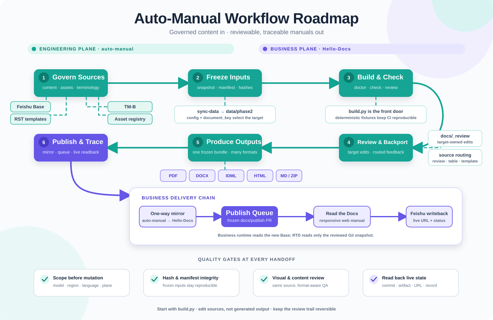

# Auto-Manual

*One source of truth — every market's manual, in every format.*

Auto-Manual 将飞书结构化数据、RST 模板、翻译记忆和受控资产，转换为可评审、
可追溯的多语言说明书，并同源输出 PDF、DOCX、IDML、HTML、Markdown 和 ZIP。

## 工作流路线图



内容源 → 冻结输入 → 构建检查 → 评审回写 → 多格式输出 → 发布追踪。

## 视频演示

<!-- VIDEO_SLOT_START -->
> 视频位已预留。视频就绪后，可用一张封面图链接到 GitHub、Bilibili 或其他播放页。
<!-- VIDEO_SLOT_END -->

## 快速开始

[`build.py`](build.py) 是统一入口。最小 US/EN 验证路径：

```bash
python build.py doctor --config configs/config.us-en.yaml --model JE-1000F --region US
python build.py doctor --data-plane --config configs/config.us-en.yaml --model JE-1000F --region US --data-root tests/fixtures/phase2
python build.py check  --config configs/config.us-en.yaml --model JE-1000F --region US
python build.py review --config configs/config.us-en.yaml --model JE-1000F --region US
```

## 只记住四条规则

- **修改源头，不修改生成物：** 共享内容在 `docs/templates/`，结构化数据在飞书源表，
  评审后的目标专属修改在 `docs/_review/`；不要手改 `docs/_build/`。
- **一个冻结包，多种输出：** 不同格式可以采用不同排版，但不能分叉文案、规格、
  法务内容、术语或资产身份。
- **代码只改工程面：** `auto-manual/main` 单向同步到 `Hello-Docs/main`；不要直接
  修改 Hello-Docs 的工程树。
- **触发不等于完成：** 最终验收必须核对提交、产物、在线 URL 和飞书回读。

## 文档入口

| 想了解什么 | 从这里开始 |
| --- | --- |
| 第一次接手项目 | [`ONBOARDING.md`](ONBOARDING.md) |
| 完整命令和运维流程 | [`code-as-doc/build_doc_guide.md`](code-as-doc/build_doc_guide.md) |
| 当前工作流和编辑规则 | [`user-guide/hello_auto-doc.md`](user-guide/hello_auto-doc.md) |
| 工程面、业务面与飞书 Base | [`user-guide/two_plane_map.md`](user-guide/two_plane_map.md) |
| 最短上手示例 | [`user-guide/quick_start_guide.md`](user-guide/quick_start_guide.md) |
| 长期架构边界 | [`System Evolution Strategy.md`](code-as-doc/architecture/System%20Evolution%20Strategy.md) |
| AI Agent 操作规则 | [`AGENTS.md`](AGENTS.md) |

README 只保留路线图、视频位和最短入口；详细机制由上表中的权威文档维护。
