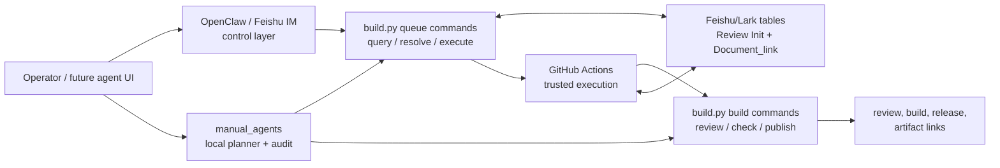

# Control Orchestration Strategy

Updated: 2026-06-06

## 1. Role

This file is the current architecture note for operator control and local
orchestration around the manual production workflow.

Use it to decide how OpenClaw, Feishu IM, `manual_agents`, queue commands,
GitHub Actions, and `build.py` should relate to one another.

Historical detail lives in:

- [`archive/OpenClaw_Control_Layer_Plan.md`](archive/OpenClaw_Control_Layer_Plan.md)
- [`archive/Manual_Agent_Orchestration_Strategy.md`](archive/Manual_Agent_Orchestration_Strategy.md)

Implementation-facing v0.1 agent scope lives in:

- [`../dev/manual_agents_v0_1_spec.md`](../dev/manual_agents_v0_1_spec.md)

## 2. Architecture Decision

Control and orchestration surfaces should make the existing workflow easier to
operate. They must not replace the workflow's authoritative execution or state
layers.

The maintained shape is:

```text
operator / agent UI / Feishu IM
  -> bounded control or planning surface
  -> existing build.py and queue commands
  -> existing Feishu/Lark tables and GitHub workers
  -> existing review, publish, and traceability outputs
```

No control layer should become:

- a new build engine
- a new production queue
- a new content source of truth
- a second owner of `Document_link` or `Review Init`
- a holder for build secrets that currently belong to GitHub Actions

## 3. Current Control Surfaces

| Surface | Role | Writes production state? |
| --- | --- | --- |
| OpenClaw plugin/commands | operator control layer and chat entrypoint | only through existing workflow dispatch / queue path |
| Feishu IM webhook adapter | Feishu message ingress for the same control actions | only through existing queue path |
| `build.py queue-query` | deterministic queue lookup | no |
| `build.py queue-resolve-action` | natural-language or selector resolution into bounded action | no |
| `build.py queue-execute` | bounded workflow dispatch and status reread | through existing GitHub worker and queue writeback |
| `manual_agents` | planned local planner / role orchestration layer | no in v0.1 |
| GitHub Actions workers | trusted remote execution plane | yes, through existing queue/writeback contracts |
| `build.py` | build, review, check, publish, and queue command entrypoint | yes only where existing commands already own it |

## 4. Responsibility Split

### 4.1 Operator Control

OpenClaw and Feishu IM own the conversational/operator surface:

- receive the request
- resolve or ask for a narrower target
- dispatch an approved bounded action
- return run status, artifact links, and failure summaries

They do not own build execution, queue schema, or artifact generation.

### 4.2 Local Agent Planning

`manual_agents` should start as a local planning and audit layer:

- parse local task JSON
- produce allowlisted command plans
- write local audit logs
- use mock clients for local demos
- later wrap queue lookup commands

It must not create a second production queue or write live external systems by
default.

### 4.3 Queue And State

Feishu/Lark tables remain the workflow state surfaces:

- `Review Init` for start-review
- `Document_link` for Build Draft Package and Publish
- `Workflow_action`, `Build_family`, `Git_ref`, `Document link`, `构建结果`,
  and related writeback fields

Queue state remains governed by:

- [`../dev/external_table_contracts.md`](../dev/external_table_contracts.md)
- [`../dev/queue_state_model.md`](../dev/queue_state_model.md)

### 4.4 Execution Plane

GitHub Actions remains the trusted remote production execution plane:

- secret bootstrap
- workflow concurrency
- branch/source checkout
- queue worker execution
- artifact upload
- final writeback
- `openclaw-run-metadata`

Local tools may plan and inspect. Production workers keep the secret-bearing
execution path.

### 4.5 Build Plane

`build.py` remains the public build and queue command entrypoint.

Control surfaces should use existing commands instead of calling low-level
scripts when a public action exists.

## 5. Topology



## 6. Strategic Invariants

1. No parallel production queue.
2. No control-layer-owned content truth.
3. No agent prompt overrides repository contracts.
4. No arbitrary shell execution.
5. No real external write by default.
6. No publish without explicit approval and existing release gates.
7. No movement of build secrets from GitHub Actions into local agent runtime.
8. No MCP or plugin write surface before the CLI/task contract is stable.
9. No queue field change without contract docs and drift fixtures.
10. No output upload should be treated as release approval.

## 7. Publish Control

Publish stays least-privilege.

Rules:

- builder roles build only
- reviewer roles check, diff, and produce manifest evidence
- publisher roles require approval evidence before real publish
- queue-driven publish should prefer `Document_link.Git_ref`
- real publish remains traceable through release manifests and queue writeback

Any future `manual_agents` publish path must satisfy:

- `approval_status=approved`
- `check_passed=true`
- `release_manifest_exists=true`
- explicit `external-write`
- resolved source branch or queue row

## 8. Evolution Stages

### Stage 1: Current OpenClaw Control Layer

OpenClaw and the Feishu IM adapter dispatch existing GitHub workers and report
status through existing queue fields.

No queue rewrite.

### Stage 2: Local Manual Agent Planner

`manual_agents` adds plan-only local task orchestration, command planning, mock
clients, and audit logs.

No external writes.

### Stage 3: Queue-Aware Local Orchestration

`manual_agents` wraps `queue-query` and `queue-resolve-action` for deterministic
planning. `queue-execute` remains explicitly confirmed.

No new production task table.

### Stage 4: Read-Only MCP And Plugin Surface

Expose stable plan/read tools after the CLI schema settles.

Write tools remain deferred.

### Stage 5: Staged External Writes

Only add real connector writes after:

- `external-write` mode exists
- schema drift fixtures pass
- credentials are validated
- approval gates are explicit
- audit logs record write intent and result

## 9. Readiness Gates

Before a control/orchestration feature is treated as production-ready:

- it must use existing queue/build entrypoints
- it must have a deterministic dry-run or plan-only form
- it must fail closed when credentials or approvals are missing
- it must not bypass `Document_link` or `Review Init`
- it must be covered by tests or fixed fixtures
- it must update the owning user/maintainer docs

## 10. Related Documents

- [`System Evolution Strategy.md`](System%20Evolution%20Strategy.md)
- [`Hello_Docs_Architecture.md`](Hello_Docs_Architecture.md)
- [`../dev/manual_agents_v0_1_spec.md`](../dev/manual_agents_v0_1_spec.md)
- [`../dev/external_table_contracts.md`](../dev/external_table_contracts.md)
- [`../dev/queue_state_model.md`](../dev/queue_state_model.md)
- [`../../agent/BOOTSTRAP.md`](../../agent/BOOTSTRAP.md)
- [`../../integrations/openclaw/README.md`](../../integrations/openclaw/README.md)
