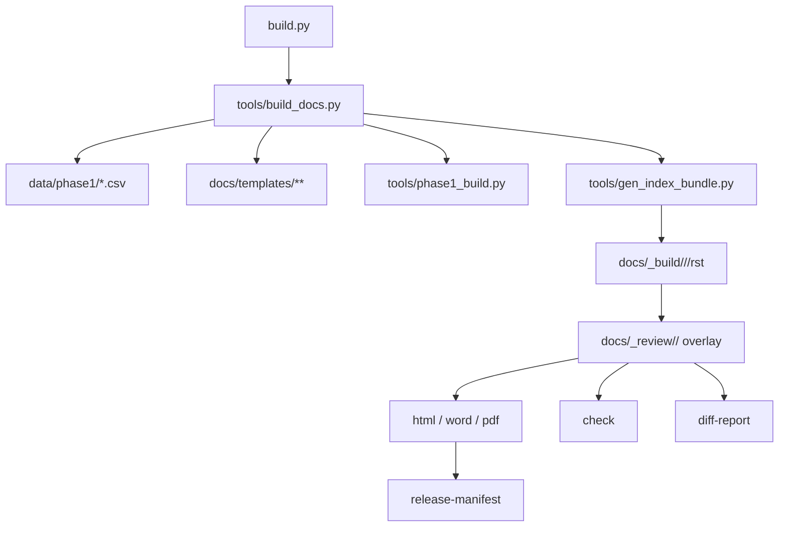

# Current Repository Component Map

Updated: 2026-03-17

## 1. Role

This file maps the current repository components and their ownership boundaries.
It describes how the current repo is organized today.

This file is not:

- the long-term strategy document
- the daily user workflow guide
- the full command reference

Use these documents for those topics:

- long-term strategy: [`System Evolution Strategy.md`](System%20Evolution%20Strategy.md)
- current workflow and editing surfaces: [`../../user-guide/hello_auto-doc.md`](../../user-guide/hello_auto-doc.md)
- maintainer command reference: [`../build_doc_guide.md`](../build_doc_guide.md)

## 2. Current Component Map

### 2.1 Entrypoint Layer

- [`../../build.py`](../../build.py)

Current responsibility:

- top-level action routing
- target-aware command entry
- keeping user-facing command semantics stable

### 2.2 Build Orchestration Layer

- [`../../tools/build_docs.py`](../../tools/build_docs.py)
- [`../../tools/utils/targets.py`](../../tools/utils/targets.py)

Current responsibility:

- resolve targets
- prepare runtime bundles
- coordinate export order

### 2.3 Structured Content Layer

- [`../../data/phase1/Spec_Master.csv`](../../data/phase1/Spec_Master.csv)
- [`../../data/phase1/Spec_Footnotes.csv`](../../data/phase1/Spec_Footnotes.csv)
- [`../../data/phase1/spec_titles.csv`](../../data/phase1/spec_titles.csv)
- [`../../data/phase1/content_blocks.csv`](../../data/phase1/content_blocks.csv)
- [`../../data/phase1/page_registry.csv`](../../data/phase1/page_registry.csv)

Current responsibility:

- product identity
- placeholder values
- block-driven content
- spec section metadata

### 2.4 Shared Seed Layer

- [`../../docs/templates/`](../../docs/templates)
- [`../../tools/phase1_build.py`](../../tools/phase1_build.py)
- [`../../tools/phase1/`](../../tools/phase1)

Current responsibility:

- shared page structure
- CSV-driven page rendering
- first-draft generation before review starts

### 2.5 Runtime Bundle Layer

- [`../../tools/gen_index_bundle.py`](../../tools/gen_index_bundle.py)
- [`../../docs/_build/`](../../docs/_build)

Current responsibility:

- materialize target-specific RST bundles
- assemble generated pages, template pages, assets, and renderers
- provide the bundle consumed by HTML, Word, and PDF export

### 2.6 Review Layer

- [`../../tools/review_bundle.py`](../../tools/review_bundle.py)
- [`../../tools/review_support.py`](../../tools/review_support.py)
- [`../../tools/sync_review.py`](../../tools/sync_review.py)
- [`../../docs/_review/`](../../docs/_review)

Current responsibility:

- seed review bundles
- preserve target-specific editing surfaces
- sync data-driven runtime files back into review when CSV data changes

### 2.7 Validation Layer

- [`../../tools/validate_config.py`](../../tools/validate_config.py)
- [`../../tools/validate_layout_params.py`](../../tools/validate_layout_params.py)
- [`../../tools/check_docs.py`](../../tools/check_docs.py)
- [`../../tools/check_identity_drift.py`](../../tools/check_identity_drift.py)
- [`../../tools/page_contracts.py`](../../tools/page_contracts.py)

Current responsibility:

- config and layout validation
- bundle checks
- stale identity detection
- page contract enforcement

### 2.8 Reporting and Release Layer

- [`../../tools/diff_report.py`](../../tools/diff_report.py)
- [`../../tools/release_manifest.py`](../../tools/release_manifest.py)
- [`../../reports/`](../../reports)

Current responsibility:

- revision tracking
- report generation
- release traceability

### 2.9 Test Layer

- [`../../tests/`](../../tests)

Current responsibility:

- regression coverage for target resolution, bundle generation, review support, validation, and release flow

## 3. Current Interaction Flow

## 4. Ownership Rules

- command behavior changes belong first to [`../../build.py`](../../build.py) and the low-level script it wraps
- target resolution changes belong in shared target helpers, not duplicated across commands
- review lifecycle changes belong in the review support modules and the user workflow docs
- current data-file semantics belong in [`../spec_master_user_guide.md`](../spec_master_user_guide.md)
- long-term architecture changes belong in [`System Evolution Strategy.md`](System%20Evolution%20Strategy.md), not here

## 5. Next Review Trigger

Update this file when the current repository topology changes or when a component takes on a materially different responsibility.
