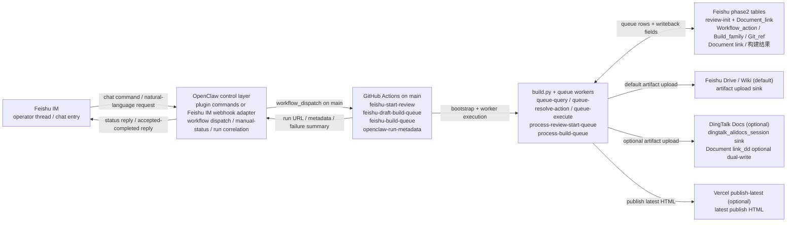
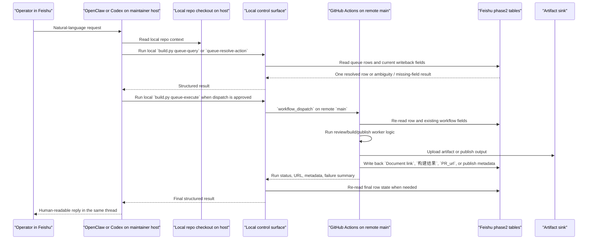
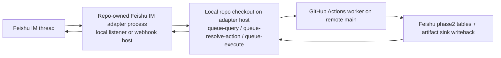
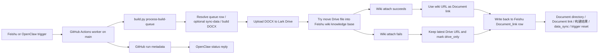
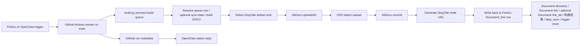

# OpenClaw Control Layer Plan

Updated: 2026-04-13

## 1. Role

This file is the active architecture note for the repository's OpenClaw control layer.
It consolidates the earlier Phase 1 and Phase 2 plans around the implementation that
now exists in the repo.

Scope of this milestone:

- treat OpenClaw as the operator control layer and chat entrypoint
- keep `build.py` and GitHub Actions as the execution plane
- keep Feishu phase2 tables as the source of truth for queue rows and workflow state
- do not use ACP or remote coding sessions in the required path
- do not move build secrets or Feishu writeback logic out of the current GitHub workers

This is intentionally narrower than a general "chat-driven build platform" rollout.
The goal is to simplify operator entry and status visibility without changing the current build semantics.

Current operator and implementation references live in:

- [`../../BOOTSTRAP.md`](../../agent/BOOTSTRAP.md)
- [`../../integrations/openclaw/README.md`](../../integrations/openclaw/README.md)

Current repo package:

- [`../../integrations/openclaw/auto-manual-control-layer/`](../../integrations/openclaw/auto-manual-control-layer)
- [`../../integrations/openclaw/feishu-im-webhook-adapter/`](../../integrations/openclaw/feishu-im-webhook-adapter/)

## 1.1 Current Repo Status

As of 2026-04-12, the repo has moved beyond the original V1-only bridge:

- the GitHub-dispatch OpenClaw bridge exists under [`../../integrations/openclaw/auto-manual-control-layer/`](../../integrations/openclaw/auto-manual-control-layer/)
- the repo-local Phase 2 action surface now exists through `build.py queue-query`, `build.py queue-resolve-action`, and `build.py queue-execute`
- a standalone Feishu IM ingress adapter now exists under [`../../integrations/openclaw/feishu-im-webhook-adapter/`](../../integrations/openclaw/feishu-im-webhook-adapter/)

The remaining gaps are operational, not architectural:

- deployment hardening for the external webhook process
- shared state if multiple adapter instances are introduced
- stable named ingress rollout for long-lived Feishu callbacks

Encrypted Feishu callback support is already repo-owned through the adapter config
and decrypt path in
[`../../integrations/openclaw/feishu-im-webhook-adapter/lib/config.mjs`](../../integrations/openclaw/feishu-im-webhook-adapter/lib/config.mjs)
and
[`../../integrations/openclaw/feishu-im-webhook-adapter/lib/feishu-events.mjs`](../../integrations/openclaw/feishu-im-webhook-adapter/lib/feishu-events.mjs).

## 2. Why This Is The Right First OpenClaw Milestone

The repository already has a working remote flow:

```text
Feishu phase2 tables
  -> GitHub workflow_dispatch or poller wake-up
  -> main-owned GitHub Actions workers
  -> build.py queue commands
  -> build / review / publish outputs
  -> status and document link writeback to Feishu
```

The least risky OpenClaw rollout is not to replace that flow.
It is to put one control layer in front of it so operators have one chat entrypoint for:

- waking the correct worker
- seeing the run URL
- seeing completion or failure summaries
- getting artifact or publish links back into the same thread

Benefits:

- no queue-routing rewrite
- no `build.py` command-surface rewrite
- no new runtime for `pandoc`, `lark-cli`, or Word/PDF export inside OpenClaw
- no duplication of Feishu table semantics in a second control system
- lower operator friction for manual review/build/publish actions

## 3. Target Control Flow

The target flow for V1 is still the same, but the implemented repo topology is now broader because the repo also ships a Feishu IM webhook adapter and an optional DingTalk artifact sink.

### 3.1 Current Implemented Topology



### 3.2 Current Responsibility Split

- Feishu IM owns the operator-facing chat thread and the final reply surface.
- Feishu phase2 tables remain the source of truth for `review-init`, `Document_link`, `Workflow_action`, `Build_family`, `Git_ref`, `Document link`, and `构建结果`.
- OpenClaw owns the bounded control layer: command entry, workflow dispatch, `record_id -> workflow -> run_id` correlation, and `/manual-status`; the repo-local Feishu IM adapter reuses the same action semantics through `build.py queue-query`, `queue-resolve-action`, and `queue-execute`.
- GitHub Actions remains the trusted remote execution plane on `main`, including environment bootstrap, secret usage, workflow concurrency, artifact upload, and `openclaw-run-metadata`.
- `build.py` plus the queue workers remain the business-logic plane: resolve queue intent, read and write Feishu rows, run review-start or build/publish logic, and choose the artifact sink.
- Feishu Drive / Wiki is still the default artifact sink for generated documents.
- DingTalk Docs is now an optional artifact sink for the same queue worker; when enabled, `Document link` stays canonical and `Document link_dd` is only an optional supplemental writeback.
- Vercel is only the publish-latest HTML hosting surface; it is not the queue control plane and it is not the document source of truth.

The target flow for V1 is:

```text
Feishu operator
  -> OpenClaw
  -> GitHub workflow_dispatch on main
  -> existing main-owned GitHub worker
  -> build.py queue command
  -> artifact upload / release output
  -> GitHub run result
  -> OpenClaw thread reply in Feishu
```

In other words:

- OpenClaw becomes the control plane entrypoint
- GitHub Actions remains the execution plane
- Feishu phase2 tables remain the workflow state and writeback system

### 3.2.1 Local Checkout vs Remote `main`

The most common maintainer setup now has two different "places" involved in one operator request:

- the local control surface, which runs on the maintainer host that is currently running OpenClaw or the repo-owned Feishu IM adapter
- the remote execution surface, which stays on GitHub Actions `main`

Short answer to the common operator question:

- `queue-query`, `queue-resolve-action`, `queue-execute`, and the local OpenClaw control-layer CLI run against the local checkout on the current host
- the actual review/build/publish worker still runs remotely by dispatching the repository's GitHub workflow on `main`
- if the target row already carries `Git_ref`, that branch is still the content source used by the remote worker, but the workflow definition itself is still loaded from remote `main`

Current direct-agent path on a maintainer laptop:



Equivalent repo-owned adapter path:



Important difference between the two ingress styles:

- direct OpenClaw or Codex chat on a maintainer laptop can still answer general natural-language questions before or around the bounded repo tool calls
- the repo-owned `feishu-im-webhook-adapter` stays much narrower: it receives text, resolves one bounded action through `queue-resolve-action`, and replies with templated accepted / completed / confirmation / error messages

This means "which `main` is used?" needs to be answered per step:

- local checkout step: whatever branch or checkout currently exists on the maintainer or adapter host
- workflow dispatch step: always the repository default branch, currently `main`
- worker source branch step: the row's `Git_ref` when the existing worker logic expects one, especially for Build Draft Package and Publish

### 3.2.2 Practical Interpretation

For operators and maintainers, the safest mental model is:

1. OpenClaw or the adapter uses the local checkout only as the control plane and lookup layer.
2. GitHub Actions `main` stays the trusted remote execution plane for the actual worker.
3. `Document_link.Git_ref` stays the remote worker's content source when the row points at a review branch.

So a maintainer-hosted OpenClaw session can be "local first" for message understanding and row resolution while still being "remote main" for the real build, review, or publish run.

### 3.3 Post-Build Upload Execution Paths

The document upload path still belongs to the queue worker.
OpenClaw only triggers the run and reports the final run status.

#### 3.3.1 Build -> Feishu knowledge base



Notes:

- this remains the default artifact sink path when `AUTO_MANUAL_ARTIFACT_SINK_PROVIDER=lark_drive`
- the worker uploads to Lark Drive first, then tries to attach the uploaded file into the Feishu wiki knowledge base
- if the wiki attach fails because of permission or container limits, the build still succeeds and `Document link` falls back to the latest Drive URL
- the canonical writeback row is still Feishu `Document_link`

#### 3.3.2 Build -> DingTalk knowledge base



Notes:

- this path is enabled when the active sink resolves to `dingtalk_alidocs_session`
- Feishu still stays the queue control plane, the structured-data source, and the writeback surface
- `Document link` remains the canonical returned link for control-layer replies; `Document link_dd` is only an optional supplemental DingTalk field
- when the row also has `是否上传钉钉`, checked rows use the DingTalk path and unchecked rows fall back to the normal Feishu/wiki upload path

Reference docs:

- [`../build_doc_guide.md`](../build_doc_guide.md)
- [`../../user-guide/hello_auto-doc.md`](../../user-guide/hello_auto-doc.md)
- [`../../user-guide/dingtalk_alidocs_upload_setup_guide.md`](../../user-guide/dingtalk_alidocs_upload_setup_guide.md)

### 3.4 Ownership Boundary

OpenClaw should own:

- operator chat commands
- dispatching the correct GitHub workflow on `main`
- correlating `record_id -> workflow -> run_id`
- replying with run status, artifact links, and publish URLs

GitHub Actions should keep owning:

- environment bootstrap
- secret handling for `FEISHU_*`, `VERCEL_*`, and other build credentials
- execution of `build.py process-review-start-queue`
- execution of `build.py process-build-queue`
- artifact upload, release staging, and Vercel deployment

Feishu phase2 tables should keep owning:

- queue rows
- `Workflow_action`
- `Build_family`
- `Version`
- `Git_ref`
- `Document link`
- `构建结果`

## 4. Explicit Non-Goals

This milestone does not require:

- deploying or using Codex ACP
- letting OpenClaw bypass the bounded local control surface and run arbitrary repo code as the execution plane
- moving `FEISHU_*` secrets into OpenClaw
- replacing Feishu phase2 tables as the state source
- replacing `build.py` queue commands with OpenClaw-native task logic
- adding free-form build commands such as `/build --model ... --region ...`
- changing the current `main`-owned worker rule for Start Review, Build Draft Package, or Publish

## 5. Minimal Operator Command Set

V1 should keep the command set intentionally small.

### 5.1 `/start-review <review_init_record_id>`

Behavior:

- dispatch [`.github/workflows/feishu-start-review.yml`](../../.github/workflows/feishu-start-review.yml) on `main`
- pass:
  - `queue_record_id=<review_init_record_id>`
  - `trigger_source=openclaw`
  - `openclaw_dispatch_nonce=<uuid>`

Rules:

- this command only wakes the existing Start Review worker
- the worker still resolves the actual target from the Feishu row
- success still means the worker writes back `Git_ref` and `PR_url`

### 5.2 `/build-draft <document_link_record_id>`

Behavior:

- dispatch [`.github/workflows/feishu-draft-build-queue.yml`](../../.github/workflows/feishu-draft-build-queue.yml) on `main`
- pass:
  - `queue_record_id=<document_link_record_id>`
  - `trigger_source=openclaw`
  - `openclaw_dispatch_nonce=<uuid>`

Rules:

- only for rows that already represent `Workflow_action = Build Draft Package`
- `Git_ref` must already exist on the target row
- the current worker remains responsible for resolving the review branch source

### 5.3 `/publish <document_link_record_id>`

Behavior:

- dispatch [`.github/workflows/feishu-build-queue.yml`](../../.github/workflows/feishu-build-queue.yml) on `main`
- pass:
  - `queue_record_id=<document_link_record_id>`
  - `trigger_source=openclaw`
  - `openclaw_dispatch_nonce=<uuid>`

Rules:

- only for rows that already represent `Workflow_action = Publish`
- if the row carries `Git_ref`, the current worker still uses that review branch as the real build source
- the previous 5-minute publish poller is kept as a commented workflow fallback, but normal operation should use OpenClaw-triggered `workflow_dispatch`

### 5.4 `/manual-status [run_id|last]`

Behavior:

- return the current status for the most recent tracked run or one explicit GitHub Actions run
- include:
  - workflow name
  - run URL
  - current state
  - artifact link when present
  - publish URL when present

V1 note:

- this command can stay GitHub-only in the first phase
- it does not need direct Feishu-table reads
- the name is intentionally not `/status` because OpenClaw already reserves that built-in command

## 6. Repo Touchpoints

OpenClaw V1 is deliberately thin because the current repo already exposes stable cut points.

Primary dispatch targets:

- [`.github/workflows/feishu-start-review.yml`](../../.github/workflows/feishu-start-review.yml)
- [`.github/workflows/feishu-draft-build-queue.yml`](../../.github/workflows/feishu-draft-build-queue.yml)
- [`.github/workflows/feishu-build-queue.yml`](../../.github/workflows/feishu-build-queue.yml)

Primary execution surface that stays unchanged:

- [`../../build.py`](../../build.py)
- [`../../tools/process_review_start_queue.py`](../../tools/process_review_start_queue.py)
- [`../../tools/process_build_queue.py`](../../tools/process_build_queue.py)
- [`../../scripts/validate_required_env.sh`](../../scripts/validate_required_env.sh)
- [`../../.github/actions/feishu-common-setup/action.yml`](../../.github/actions/feishu-common-setup/action.yml)

Primary documentation that should stay aligned once rollout begins:

- [`../build_doc_guide.md`](../build_doc_guide.md)
- [`../../user-guide/hello_auto-doc.md`](../../user-guide/hello_auto-doc.md)
- [`../../user-guide/quick_start_guide.md`](../../user-guide/quick_start_guide.md)

## 7. Operational Rules

### 7.1 Always Dispatch On `main`

All three GitHub workers intentionally reject non-default-branch dispatches.
OpenClaw should treat this as a hard rule, not a user choice.

### 7.2 Prefer `record_id`-Scoped Runs

When an operator is acting on a specific document row, `queue_record_id` should be treated as required.
Without it, the worker may consume whichever pending rows currently qualify.

### 7.3 Do Not Recreate Queue Semantics In OpenClaw

OpenClaw should not try to infer:

- `Build_family`
- `Workflow_action`
- `Git_ref`
- `Version`
- whether a row is already valid for draft or publish

Those remain Feishu-owned workflow semantics.

### 7.4 Debounce Duplicate Manual Retries

The current GitHub workers use `cancel-in-progress: false`.
OpenClaw should refuse or warn on repeated manual retries when an active run is already in progress for the same workflow and `record_id`.

### 7.5 Machine-Readable Run Metadata

The current repo implementation now writes one small metadata JSON for each worker run and uploads it as:

- `openclaw-run-metadata`

That metadata is the supported Phase 1 bridge for:

- `queue_record_id`
- `openclaw_dispatch_nonce`
- run URL
- publish URL when the publish worker produces one

## 8. Known Risks And Constraints

### 8.1 Start Review Secret Naming Must Stay Aligned

The repo now documents the Start Review worker against `FEISHU_PHASE2_DOCUMENT_LINK_*`.

Keep future setup docs aligned with that naming so OpenClaw onboarding does not drift back toward an obsolete `REVIEW_INIT_*` secret pair.

### 8.2 `trigger_source` Is Provenance, Not Routing

The existing workflows print `trigger_source`, but do not use it for routing or writeback.
OpenClaw should use `queue_record_id` as the real correlation key.

### 8.3 Build Correctness Still Depends On Feishu Row State

OpenClaw can simplify entry, but draft and publish correctness still depends on the row already carrying the right:

- `Workflow_action`
- `Git_ref`
- `Build_family`

That should be surfaced in operator guidance.

## 9. Rollout Phases

### Phase 1: Trigger Bridge

Goal:

- make OpenClaw the single operator entrypoint for Start Review, Build Draft Package, and Publish

Implementation:

- support the four commands in this document
- store only a GitHub token in OpenClaw
- keep all build and Feishu secrets in GitHub Actions

Exit criteria:

- operators can trigger all three worker types from one Feishu/OpenClaw entrypoint
- every manual trigger returns a GitHub run URL immediately

### Phase 2: Status Return Path

Goal:

- reply back into the same Feishu thread with started/completed/failed status

Implementation:

- track `thread_id -> record_id -> workflow -> run_id`
- post completion messages with:
  - result
  - run URL
  - artifact link when present
  - publish URL when present

Exit criteria:

- operators no longer need to open GitHub just to learn whether the action finished

### Phase 3: Control-Layer Guards

Goal:

- add safety without adding a second workflow engine

Implementation:

- reject unknown workflow names
- reject non-`main` dispatch
- require `record_id` for operator-targeted actions
- warn when draft or publish is requested without the expected review-state preconditions

Exit criteria:

- OpenClaw reduces bad dispatches without duplicating Feishu queue routing logic

## 10. Validation Plan

The first validation pass should stay operational, not architectural.

### 10.1 Dispatch Validation

Prove that OpenClaw can trigger:

- Start Review on one explicit `review_init` row
- Build Draft Package on one explicit `Document_link` row
- Publish on one explicit `Document_link` row

Expected result:

- each command creates exactly one GitHub Actions run on `main`
- each run records `trigger_source=openclaw`

### 10.2 Status Validation

Prove that OpenClaw can reply back with:

- run URL
- success/failure state
- artifact link for Start Review and Build Draft Package
- publish URL for Publish when present

### 10.3 No-Semantics-Drift Validation

Confirm that OpenClaw does not change:

- Feishu row writeback fields
- `Document_link.Git_ref` behavior
- the current `main`-owned worker rule
- the commented 5-minute publish poller fallback

## 11. Decision Rule

Do not let OpenClaw absorb build execution, Feishu secrets, or queue-routing logic in V1.

If a future phase needs more than:

- chat entry
- workflow dispatch
- run status feedback

that should be treated as a new design milestone instead of silently expanding this one.
