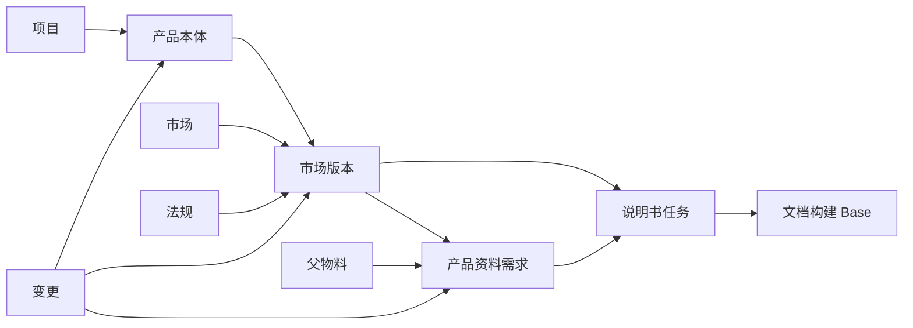

# 产品数据 Base 业务架构

Updated: 2026-08-11

状态：当前业务架构基线。本文定义「产品数据」Base 的业务职责、数据关系和维护边界；字段迁移与系统对接可以分阶段完成，但不得破坏本文的单点维护原则。

## 1. 目标与范围

「产品数据」Base 是说明书及其他产品资料生产的上游业务中枢。它把原来散落在金蝶、PLM、项目表和资料清单里的信息，组织成一条可以追踪的业务链：

> 项目 → 产品本体 → 市场版本 → 资料需求 → 说明书任务 → 变更影响

这套架构的目标不是把所有数据堆进一张大表，而是让每类信息只维护一次，并能被后续资料生产最大程度复用：

- 产品、市场、法规和项目形成可复用的主数据；
- 一个产品可以有多个相互独立的市场版本；
- 一份资料可以同时服务多个市场版本；
- 金蝶和 PLM 的变化能够被识别、评估并追踪到受影响资料；
- 「文档构建」Base 只负责内容与生产，不再重复维护产品业务事实。

本文对应的在线 Base 为[「产品数据」](https://xcn57j1urbe6.feishu.cn/wiki/NAyHw0FEniYuVqkSfhPcJJkQnKc)，Base token 为 `HTidbugodasmdisRHwdcUhYsnne`。

## 2. 与「文档构建」Base 的边界

两个 Base 是上下游关系，不是两套并行台账。

| 业务问题 | 「产品数据」Base | 「文档构建」Base |
| --- | --- | --- |
| 我们有哪些产品、市场和销售版本 | 负责，作为唯一业务来源 | 只接收构建所需的只读投影 |
| 哪些资料需要做、适用于哪些市场版本 | 负责 | 接收已确认的说明书任务 |
| 为什么要改、影响哪些资料 | 负责 | 接收变更后的生产任务 |
| 具体写什么、翻译什么、如何审核 | 不负责 | 负责 |
| 如何构建、发布及回写成品链接 | 不负责 | 负责，并回写结果 |

因此，「文档构建」Base 中确有构建需要的产品、项目、市场字段时，应把它们视为同步得到的只读投影或当次任务快照，而不是第二个人工维护入口。详细系统位置见[双平面地图](../../user-guide/two_plane_map.md)，现有构建源表边界见[外部表契约](../dev/external_table_contracts.md)。

「产品数据」是业务面新增的上游主数据 Base，不复制到旧 phase2 Base，也不进入旧、新「文档构建」Base 的 schema promote；两套 Base 通过后续明确的任务接口衔接。

## 3. 一级模块

Base 按业务过程分为五个目录：

| 目录 | 作用 | 主要使用者 |
| --- | --- | --- |
| `00 数据源后台` | 保存金蝶、PLM 的原始同步结果和同步状态，不作为日常业务编辑区 | 系统管理员、数据管理员 |
| `10 主数据中心` | 维护项目、产品、市场、法规、市场版本和父物料关系 | 产品、项目、数据管理员 |
| `20 说明书生产` | 管理资料需求和说明书任务，是资料团队的主要工作台 | 资料、认证、项目成员 |
| `30 变更中心` | 记录变化原因、影响范围、处理责任和关闭结果 | 项目、产品、资料负责人 |
| `90 历史归档` | 保存已停用、已迁移或只供查询的数据 | 只读查询 |

目录是工作入口，不是新的数据副本。不同角色可以使用自己的视图，但仍然读取同一批底层记录。

## 4. 核心数据关系

核心关系遵循以下原则：

1. 一个项目可以包含多个产品；一个产品只保存与市场无关的本体信息。
2. 一个产品可以有多个市场版本；市场、销售型号、语言、法规和认证都属于市场版本。
3. 一个资料需求或说明书任务可以关联一个或多个市场版本，因此资料与市场版本是多对多关系。
4. 变更记录不复制产品资料，而是关联受影响的产品、市场版本和资料任务。
5. 进入「文档构建」Base 的单位是已确认的说明书任务，而不是未经治理的金蝶或 PLM 原始行。

## 5. 产品的两层模型

### 5.1 产品本体

「产品中心」回答“这是什么产品”。它只维护跨市场稳定的信息：

- 产品系列；
- 标准 Model；
- 产品简称；
- 产品类型；
- 生命周期；
- 所属项目。

这些字段不应随着销售国家、包装语言或认证差异重复建立产品记录。

### 5.2 市场版本

「市场版本」回答“这个产品以什么方式进入某个市场”。它承载：

- 市场；
- 销售型号；
- 语言；
- 法规与认证；
- 包材要求；
- 说明书版本要求；
- 市场状态。

市场版本是产品资料适用范围的最小业务单元。即使多个市场共用资料，市场版本仍需独立存在，以便未来单独处理法规、认证、售后条款、销售状态或包材变化。

## 6. EUUK、USCA 等共用资料的处理

EUUK、USCA 表示“共同出一份资料”，不表示“合并成一个市场”。例如：

- `JE-1000F_EU` 与 `JE-1000F_UK` 保持两个市场版本；
- `JE-1000F_US` 与 `JE-1000F_CA` 保持两个市场版本；
- 同一条说明书任务可以同时关联上述两个市场版本。

「产品资料中心」和「说明书工作台」使用三个业务字段表达共用关系：

| 字段 | 业务含义 | 示例 |
| --- | --- | --- |
| `资料适用组合` | 这份资料覆盖的市场版本组合，作为业务分组名称 | `JE-1000F_EU+UK`、`JE-1000F_US+CA` |
| `共用方式` | 市场之间如何共用资料 | 单市场、多市场共版、通用母版加差异内容 |
| `市场差异说明` | 仍需保留的法规、语言、保修或包装差异 | UK 地址不同；CA 需增加法语内容 |

`资料适用组合` 是资料层的分组标签，不是新的市场主数据，也不能替代「对应市场版本」的正式关联。

当两个市场后来出现实质差异时，应拆分资料任务，而不是拆产品或修改历史市场版本：保留原任务的关系和版本记录，再分别建立后续任务。

## 7. 各表职责与业务主键

业务主键用于跨表识别和未来同步，不等同于飞书内部 `record_id`。字段显示名可以按现状保留，但每张表必须有一个稳定、唯一、不会随名称变化而重建的业务键。

| 表 | 唯一职责 | 业务主键约定 | 主要上游 / 下游 |
| --- | --- | --- | --- |
| 项目中心 | 项目立项和归属 | 项目编号 | 上游项目台账；下游产品中心 |
| 产品中心 | 与市场无关的产品本体 | 标准 Model | 上游项目、PLM；下游市场版本 |
| 市场中心 | 标准市场字典 | 市场代码 | 下游市场版本 |
| 法规中心 | 标准法规与认证字典 | 法规代码 | 下游市场版本 |
| 市场版本 | 产品在具体市场的销售与合规版本 | 市场版本 ID，例如 `JE-1000F_US` | 上游产品/市场/法规；下游资料与说明书 |
| 父物料信息 | 父物料与产品、市场版本的映射 | 父物料编码 | 上游金蝶/PLM；下游产品资料中心 |
| 产品资料中心 | 汇总说明书、彩盒、标签等资料需求 | 资料需求 ID | 上游市场版本/父物料；下游各资料工作台 |
| 说明书工作台 | 管理一份说明书从需求到交付的业务状态 | 说明书任务 ID | 上游资料需求/市场版本；下游文档构建 |
| 变更中心 | 记录一次变更及其影响闭环 | 变更 ID | 上游源表/人工提出；下游受影响资料 |
| 同步监控 | 记录各数据源同步是否健康 | 数据源 + 同步对象 | 上游金蝶/PLM；下游管理员告警 |
| 金蝶源表 | 金蝶数据的原样镜像 | 金蝶源主键 | 下游匹配与变更识别 |
| PLM 源表 | PLM 数据的原样镜像 | PLM 源主键 | 下游匹配与变更识别 |

主键的规则是：不使用名称拼写或飞书记录号承担长期外部标识；同一来源的同步应按业务主键更新原记录，而不是重复新增。

## 8. 说明书工作台

「说明书工作台」是一份说明书任务的业务入口，不是产品主数据的复制表。日常人工只需维护：

- 对应市场版本；
- 资料适用组合、共用方式和市场差异说明；
- 需求状态、责任人、计划时间和业务备注；
- 与「文档构建」任务的对接状态。

产品、市场、项目、语言和法规等可由关联关系得到的字段，应采用 Lookup 只读展示。

当前已经建立只读字段 `市场（自动）`（字段 ID `fldnzcU0h0`）：它从当前记录的「对应市场版本」关联中 Lookup 市场并去重。因此，EU+UK 或 US+CA 的说明书任务可以自然显示多个市场，不需要人工再选一次。

原有 `对应市场` 暂时保留，只用于迁移比对。完成全量一致性验证后，应从日常视图隐藏；后续只维护「对应市场版本」。

## 9. 单点维护规则

| 信息 | 唯一人工维护位置 | 其他表中的处理方式 |
| --- | --- | --- |
| 项目归属 | 项目中心 / 产品中心的正式关联 | Lookup 展示 |
| 标准 Model、产品系列、产品类型 | 产品中心 | Lookup 展示 |
| 市场、销售型号、语言、法规、认证 | 市场版本 | Lookup 展示 |
| 资料共用关系和差异 | 产品资料中心或说明书工作台的任务记录 | 随任务同步到文档构建 |
| 金蝶、PLM 原始字段 | 对应源表自动同步 | 主数据中心只保存治理后的结果和来源关系 |
| 内容、翻译、审核、构建、发布状态 | 文档构建 Base | 产品数据 Base 只接收必要的结果回写 |

Lookup 字段为只读字段，不能作为人工补录入口。如果 Lookup 为空，应修复上游关联或主数据，而不是在下游再建立一个同义手填字段。

## 10. 变更中心的业务闭环

金蝶或 PLM 的变化不能直接改写正在生产或已经发布的说明书。正确流程为：

1. 源表同步发现新增、修改或停用；
2. 根据产品、父物料和市场版本关系判断影响范围；
3. 在「变更中心」形成可追踪的变更事项；
4. 责任人确认是否影响资料、影响哪些市场版本以及生效时间；
5. 对受影响资料创建或更新任务，并送入「文档构建」Base；
6. 构建、审核、发布完成后回写结果，关闭变更。

变更中心至少应能回答：什么变了、从哪里变的、影响谁、谁确认、采取了什么措施、何时关闭。这样实时同步提高的是发现速度，而不会绕过业务判断和审核。

## 11. 金蝶与 PLM 的实时同步边界

未来实时同步仍遵守“源表、主数据、业务任务”三层隔离：

- 金蝶源表和 PLM 源表保存来源事实，原则上只由同步程序写入；
- 主数据中心保存经过匹配、去重和确认的业务对象；
- 说明书生产和变更中心保存人的决定与处理过程。

「同步监控」用于显示每个来源最后成功时间、同步数量、异常数量和处理状态。同步按来源主键更新，重复事件不会产生重复主数据。来源冲突、关键关联缺失或异常删除应进入待处理视图，由数据管理员确认。

即使实现实时同步，以下内容也不应由金蝶或 PLM 自动覆盖：资料适用组合、共用方式、市场差异说明、说明书任务状态、人工影响判断和审核结论。

## 12. 角色工作台

同一套数据按角色提供视图，避免每个团队另建表：

| 角色 | 默认入口 | 重点内容 |
| --- | --- | --- |
| 产品 / 项目 | 产品中心、市场版本 | 产品完整性、上市市场、生命周期 |
| 资料团队 | 产品资料中心、说明书工作台 | 待创建、制作中、待审核、待对接文档构建 |
| 认证 / 法规 | 市场版本、法规中心 | 法规覆盖、市场差异、即将失效项 |
| 变更负责人 | 变更中心 | 待评估、处理中、待验证、已关闭 |
| 数据管理员 | 同步监控、主数据质量视图 | 同步异常、重复项、缺失关联 |
| 管理者 | 汇总看板 | 产品覆盖率、资料完成率、变更关闭周期 |

视图和看板只改变“怎么看”，不能成为独立的数据维护副本。

## 13. 数据质量与迁移策略

迁移期间采用“先关联、再自动化、最后隐藏旧字段”的顺序：

1. 补齐产品、市场版本和资料任务之间的正式关联；
2. 新建 Lookup 字段并与旧手填字段逐条比对；
3. 修复空值、错误关联和重复主数据；
4. 验证一致后隐藏旧字段，停止重复维护；
5. 最后再对接金蝶、PLM 实时同步和文档构建自动派单。

任何重复记录都应先检查下游引用再合并。当前 `JHP-3600A-RC` 的两条产品记录属于待治理项，在引用关系未确认前不得直接删除。

## 14. 当前验收基线

以下数字是 2026-08-11 的迁移基线，用于衡量后续治理进展，不代表最终目标：

| 项目 | 当前值 |
| --- | ---: |
| 产品中心 | 686 |
| 市场版本 | 1,368 |
| 父物料信息 | 2,724 |
| 产品资料中心 | 2,253 |
| 说明书工作台 | 745 |
| 变更中心 | 132 |
| 市场中心 | 27 |
| 法规中心 | 6 |
| 金蝶源表 | 8,069 |
| PLM 源表 | 2,336 |

已验证的结果：

- `JE-1000F_US`、`JE-1000F_EU`、`JE-1000F_JP` 的市场版本均为“使用中”；
- `市场（自动）` 抽样返回 US、CA/US、JP，能够处理多市场共用；
- 日规说明书视图有 11 条，UPS 变更视图有 132 条；
- 待对接「文档构建」视图有 745 条。

仍需治理的质量项：

- 说明书任务：缺版本 616 条、缺产品 126 条、缺市场 2 条、待核验 1 条；
- 产品中心：产品系列缺 686 条、产品简称缺 585 条、所属项目缺 584 条，产品类型和生命周期各缺 9 条；
- 65 个产品尚无市场版本；
- `JHP-3600A-RC` 存在 2 条重复候选记录，需在确认引用后合并。

## 15. 下一阶段

按业务收益和风险排序：

1. 完成说明书任务与市场版本的全量关联，验证并隐藏旧 `对应市场`；
2. 在产品资料中心采用同样的市场 Lookup 和单点维护规则；
3. 补齐产品中心的项目、系列、简称等关键主数据；
4. 治理无市场版本产品和重复产品记录；
5. 定义「产品数据」向「文档构建」的任务同步与结果回写契约；
6. 建立金蝶、PLM 增量同步、异常监控和变更自动识别；
7. 最后建设管理看板，避免在底层关联尚不完整时用汇总数字掩盖数据问题。

## 附录：当前表坐标

| 表 | table_id |
| --- | --- |
| 项目中心 | `tbl4fYRRSoDny1yg` |
| 产品中心 | `tbl2FyelX5evCLpC` |
| 市场中心 | `tbllseycnK2zUuXl` |
| 法规中心 | `tblpay504Ox305Dm` |
| 市场版本 | `tbleRLbeEYlU3r3a` |
| 父物料信息 | `tblSXlZ7qwzgX7RM` |
| 产品资料中心 | `tblS1WUciFYOi8f3` |
| 说明书工作台 | `tblL21o4PhPUB3N8` |
| 变更中心 | `tbl4q3tp2qobAkt2` |
| 同步监控 | `tblCVs5wYYMAUcU1` |
| 金蝶源表 | `tbl4AvzRCD6r4fgw` |
| PLM 源表 | `tblPPjDaBVDcZrCN` |
