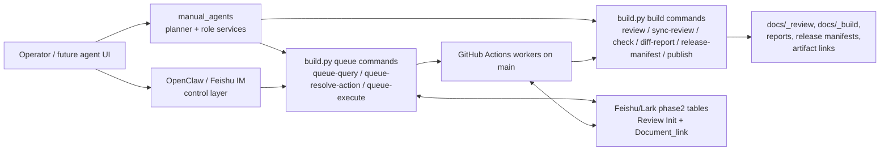

# Manual Agent Orchestration Strategy

Updated: 2026-06-06

## 1. Role

This file is the long-term architecture plan for Manual Production Agents in
this repository.

Use it to decide how agent, skill, connector, MCP, and plugin work should grow
without competing with the existing build, queue, review, and publish system.

Implementation-facing v0.1 scope lives in:

- [`../dev/manual_agents_v0_1_spec.md`](../../dev/manual_agents_v0_1_spec.md)

The stable system-level model remains in:

- [`System Evolution Strategy.md`](../System%20Evolution%20Strategy.md)

This document does not replace the system strategy. It specializes the strategy
for the planned agent orchestration layer.

## 2. Architecture Decision

Manual Production Agents should be a bounded orchestration layer on top of the
current workflow.

They should not become:

- a new build engine
- a new production queue
- a new source of content truth
- a replacement for OpenClaw
- a replacement for GitHub Actions workers
- a second owner of `Document_link` or `Review Init` state

The intended shape is:

```text
Operator / Agent UI
  -> manual_agents planner / role services
  -> existing build.py and queue commands
  -> existing Feishu/Lark tables and GitHub workers
  -> existing review, publish, and traceability outputs
```

## 3. Why This Is A New Architecture Doc

The existing
[`System Evolution Strategy.md`](../System%20Evolution%20Strategy.md)
already defines the stable five-layer direction:

```text
Content Governance -> Snapshot -> Page Assembly -> Build/Render -> Release/Traceability
```

That model still holds. The agent work does not add a sixth source-of-truth
layer. It adds a coordination surface that can help operators and future tools
move through the existing layers safely.

This topic deserves a new architecture note because it has its own long-lived
boundary risks:

- avoiding a parallel queue
- avoiding agent-owned source data
- preserving least-privilege publish behavior
- deciding when MCP and plugins are mature enough to expose
- keeping mock/local behavior separate from real external writes

## 4. North Star

Manual Production Agents should make the manual workflow easier to operate
without changing the authoritative flow.

The long-term goal is:

```text
Structured task intent
  -> bounded role planning
  -> explicit command / queue action
  -> auditable execution
  -> traceable review and release handoff
```

Agents provide planning, guidance, validation, and handoff. Existing build and
queue components remain the execution source of truth.

## 5. Relationship To The Fixed Layer Model

### 5.1 Content Governance

Authoritative content governance remains in CMS or multidimensional tables.

Agents may:

- inspect table contracts
- plan sync actions
- explain missing fields
- use mock clients for local testing

Agents must not:

- become the source of product specs, review state, or publish state
- keep a separate live task database that competes with `Document_link`
- silently write external tables outside the approved queue/writeback path

### 5.2 Snapshot

`data/phase2/` remains the frozen local snapshot surface.

Agents may:

- verify which snapshot a plan would use
- plan `sync-data --dry-run`
- record snapshot paths in audit logs

Agents must not:

- add live synced tables without updating the external table contract
- treat local CSV edits as the final content truth when a Feishu/Lark source
  table owns the data

### 5.3 Page Assembly

Page assembly stays separate from agent orchestration.

Agents may:

- explain assembly contract failures
- plan validation commands
- use fixture-backed pilots

Agents must not:

- move `page_registry.csv` or `content_blocks.csv` into live phase2 ownership
  without a contract migration
- infer page composition from agent prompts instead of declared contracts

### 5.4 Build And Render

`build.py` remains the build and render entrypoint.

Agents may:

- produce allowlisted command plans
- run local commands only in explicit local-execute mode
- summarize failures

Agents must not:

- emit arbitrary shell commands
- bypass `build.py`
- call low-level renderer scripts when the public command supports the action

### 5.5 Release And Traceability

Review, diff, publish, and release manifest outputs remain first-class release
surfaces.

Agents may:

- plan `check`, `diff-report`, and `release-manifest`
- collect pass/fail state
- prepare a publish handoff

Agents must not:

- let builder roles publish
- publish without explicit approval, passing checks, and a release manifest
- treat upload success as release approval

## 6. Current Control Topology



Interpretation:

- `manual_agents` is a local planning and orchestration layer.
- OpenClaw remains the operator control layer for chat and workflow dispatch.
- Queue commands remain the bounded interface to live queue rows.
- GitHub Actions remains the trusted remote execution plane for production
  secrets and remote workers.

## 7. Strategic Invariants

These rules should survive future implementation changes.

1. No parallel production queue.
2. No agent-owned content truth.
3. No publish from builder roles.
4. No real external write by default.
5. No arbitrary shell execution.
6. No schema change without contract docs and drift fixtures.
7. No MCP or plugin exposure before the CLI contract is stable.
8. No movement of build secrets from GitHub Actions into local agent runtime.
9. No live table writeback that bypasses current queue/writeback ownership.
10. No agent prompt should override repository contracts.

## 8. Long-Term Stages

### Stage 0: Spec And Boundary Lock

Purpose:

- narrow the proposal
- define execution modes
- align data contracts
- prevent a second queue from forming

Exit criteria:

- v0.1 spec is accepted
- existing system boundaries are documented
- implementation can start without open architectural ambiguity

### Stage 1: Local Plan-Only CLI

Purpose:

- parse local tasks
- produce deterministic command plans
- write audit logs
- prove role boundaries without running real commands

Allowed outputs:

- JSON plan
- local JSONL audit
- mock result summaries

No external writes.

### Stage 2: Local Execute And Mock Services

Purpose:

- allow explicitly requested local command execution
- write normal local build outputs through `build.py`
- add mock Bitable and mock document clients

Allowed outputs:

- `docs/_build/` through `build.py`
- `.manual_agents/mock_state/`
- `.manual_agents/logs/`

No real external writes.

### Stage 3: Queue-Aware Orchestration

Purpose:

- wrap `queue-query`
- wrap `queue-resolve-action`
- optionally wrap `queue-execute` when explicitly confirmed
- preserve `Document_link` and `Review Init` as production truth

Exit criteria:

- agent task resolution uses existing queue commands
- no new live queue table is introduced
- queue state remains governed by
  [`../dev/queue_state_model.md`](../../dev/queue_state_model.md)

### Stage 4: Read-Only MCP And Skill Packaging

Purpose:

- expose stable planning and inspection tools
- add skill docs and plugin packaging after CLI names settle

First MCP tools should be read-only or plan-only:

- get task
- plan build step
- find artifacts
- read audit log
- explain queue row state

Write tools are deferred.

### Stage 5: Staged External Writes

Purpose:

- add real connector implementations behind strict gates
- support one staging-table write path at a time
- keep failures explicit and recoverable

Required gates:

- `external-write` execution mode
- credentials present and validated
- table contract drift check passes
- publish approval gates pass when relevant
- audit log records the external write intent and result

### Stage 6: Production Assistant Surface

Purpose:

- let operators use an agent or plugin UI as a guided workflow surface
- keep OpenClaw, GitHub Actions, `build.py`, and table contracts as the
  authoritative execution and state layers

The assistant surface should make the workflow easier, not make it less
deterministic.

## 9. Publish Ownership

Publish is a high-risk workflow step and must stay least-privilege.

Long-term publish rules:

- builder roles create build outputs only
- reviewer roles create check/diff/manifest evidence
- publisher roles require approval evidence before any publish
- queue-driven publish should prefer `Document_link.Git_ref` as the source
- real publish should remain traceable through release manifests and queue
  writeback

This prevents "successful build" from being treated as "approved release".

## 10. Data Model Migration Policy

Agent work must not casually change the phase2 data contract.

Before moving any table into or out of `data/phase2/` live ownership:

1. update [`../dev/external_table_contracts.md`](../../dev/external_table_contracts.md)
2. add or update schema drift fixtures
3. update sync/export code
4. update build/read code
5. update user and maintainer docs
6. prove old snapshots fail clearly or remain intentionally compatible

Special current decisions:

- `page_registry.csv` is not moved into live phase2 sync by the agent plan
- `content_blocks.csv` is not made a required live phase2 table by v0.1
- content assembly pilots remain fixture-backed until their own contract
  migration proves readiness

## 11. MCP And Plugin Readiness Gates

Do not create production MCP or plugin write tools until:

- the CLI task schema is stable
- command planning is covered by tests
- path and command allowlisting are covered by tests
- execution modes are implemented and tested
- audit logging exists
- queue-aware behavior uses existing queue commands
- write operations have explicit approval and credential checks

The first MCP/plugin milestone should expose plan-only and read-only tools.

## 12. Open Questions

These should be answered before real external writes:

1. Should a live `ManualJobs` table ever exist, or should local tasks remain only
   a planning input mapped to existing queue rows?
2. If a live task table is introduced, is it an operator request inbox rather
   than workflow state?
3. Which document-library provider is canonical when Feishu Drive, DingTalk,
   and Vercel outputs all exist?
4. What is the exact approval artifact for publish: table field, PR approval,
   manual CLI confirmation, or a combination?
5. Which connector errors are retryable and which require operator repair?

## 13. Success Criteria

The agent strategy is successful when:

1. operators can ask for a plan and understand the next safe action
2. local tasks produce deterministic command plans
3. live queue actions resolve through existing queue commands
4. external writes are explicit, gated, and auditable
5. publish remains separated from build
6. data contract changes remain visible and tested
7. MCP and plugin surfaces expose stable behavior instead of experimental
   internals

## 14. Related Documents

- [`System Evolution Strategy.md`](../System%20Evolution%20Strategy.md)
- [`Hello_Docs_Architecture.md`](../Hello_Docs_Architecture.md)
- [`OpenClaw_Control_Layer_Plan.md`](OpenClaw_Control_Layer_Plan.md)
- [`Content_Data_Model.md`](../Content_Data_Model.md)
- [`../dev/manual_agents_v0_1_spec.md`](../../dev/manual_agents_v0_1_spec.md)
- [`../dev/external_table_contracts.md`](../../dev/external_table_contracts.md)
- [`../dev/queue_state_model.md`](../../dev/queue_state_model.md)
