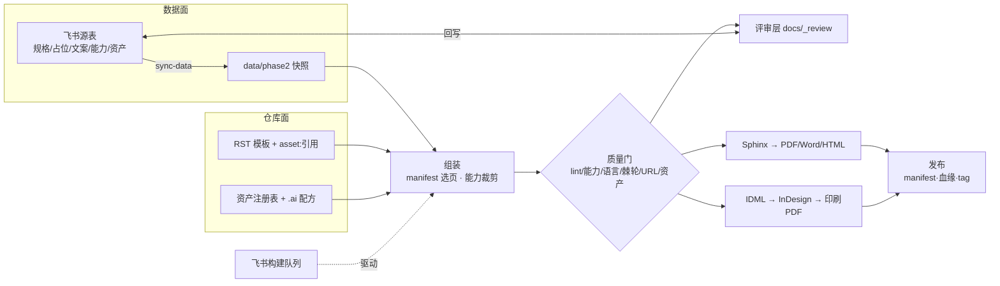

# 系统演进史（骨架与来路）

Updated: 2026-08-13

## 0. 本文角色

回溯性架构叙事：回答"系统为什么长成这样"。与三份既有文档互补、不重叠：

- [`System Evolution Strategy.md`](System%20Evolution%20Strategy.md) 向前看——方向与稳定边界；
- [`../optimization_project.md`](../optimization_project.md) 看现在——执行路线图；
- [`../code_optimization_log.md`](../code_optimization_log.md) 逐笔流水——每次改了什么。

本文只记录**环级**转折（改变生产原则的那一层），细节一律指向流水账与 PR。
受众是接手的维护者：读完 [`ONBOARDING.md`](../../ONBOARDING.md) 的第一小时之后、
翻完整优化日志之前，先用十分钟建立这份心智模型。

维护规则：只有出现新的"环"才更新本文；普通功能与修复不记。

## 1. 一行内核（2026-02-15，`fa988f52`）

第一天的全部系统：

```
CSV(安全条目) + RST 模板(占位符) ──csv_to_rst──> RST ──Sphinx(conf.py)──> LaTeX ──> PDF
```

一页安全说明、一个产品、没有机型/区域维度，构建产物直接提交进仓库。
多机型生成页 02-28 已出现（`15b14df2`）；Word 输出 03-05 才有
（pandoc，`d81da227`——同一提交里 spec 页成为整本构建的结构化入口）；
`build.py` 入口 03-10（`248bed28`，`--region` 参数自出生即有）。

**内核至今未变：结构化数据 × 可复用模板 → 确定性构建。**
之后的每一环都是绕着这一行长出来的——不是替换它，而是把它周围每一处
"人手改产物"替换成"改源 + 过门"。

## 2. 今天的骨架



（图内不含环 5 的双平面拓扑——评审实际发生在 Hello-Docs 镜像侧——
与环 10 的 config 派生元规则，见对应环。）

## 3. 演进十环（按各环成形的顺序）

每环三件事：**动机 → 落点 → 留下的不变量**。

### 环 1 · 目标矩阵（2026-03 ～ 05）

一个产品变一族产品。`tools/utils/targets.py` 与首个语言配置 03-08，
manifest 选页 03-20（`4b4fba7d`），家族配置 `config.us.yaml` 04-04（#41），
`configs/` 归位 05-30（#285）。
**不变量**：一份模板服务所有机型，差异由数据与配置表达——AGENTS 里
"不许每机型一个 config"的规则来自自己的化石（见 §4）。

### 环 2 · 评审层与第一道门（2026-03-11/12）

产物要给人看，人不能直接改产物。`docs/_review/` 03-11，
`review_bundle.py` + `check_docs.py` **同一提交**出生（`9a7a958e`，03-12）。
**不变量**：评审改派生层，构建可重建它；检查与评审天生一对。

### 环 3 · 数据上云 + 队列（2026-04-01，同一提交）

CSV 不再手编。`tools/sync_data.py`、`data/phase2/`、
`.github/workflows/feishu-build-queue.yml`、`tools/process_build_queue.py`
全部来自 **一个提交**（`d90de79c`，#21）。
**不变量**：飞书源表是数据的单一真相，仓库只留可重放的快照；
自动化不是后加的，是数据上云的孪生。

### 环 4 · 回写闭环（2026-06-08 起）

评审改动要回到源头。`cloud_doc_backport.py` 以 diff 报告形态出生
（#343，06-08），次日长出受护栏的写回（#349/#350/#352，06-09），
06-19 补渲染基线库与 seed（#411），06-24 闭环测试（#470）。
**不变量**：改的是源不是产物——所有语言、所有格式随之同步。

### 环 5 · 双平面（2026-06-10 / 07-02）

工程与业务分离。Hello-Docs 镜像同步 #360，两平面地图
[`../../user-guide/two_plane_map.md`](../../user-guide/two_plane_map.md) #526。
**不变量**：auto-manual = 工程面，镜像 = 业务面；代码永不直接 PR 镜像主干。

### 环 6 · 质量门体系（2026-06-07 ～ 07-27）

不过门不出货。content-lint 06-07（#335），能力→章节门 07-12（#649），
语言树一致性 + 警告棘轮 + 印刷 URL 巡检 07-14（I1/I2/I4，#657-659），
资产状态门入 publish 07-27（#722）。
**不变量**：每类"印出去无法撤回"的错误都要有一道构建期的门。

### 环 7 · 印刷线（2026-07-04 ～ 08-06）

Word 之外长出 InDesign 印刷线。IDML 导出 MVP 07-04（#548），
组件化拆包 07-05（#577-585），真 InDesign finalize 07-13（#648），
参考版式契约 07-17（#675），逐页视觉对齐战役 07-26/27（#711-729，
#729 宣告收官），pin 护栏进 CI 07-27（#724），契约 v2 分域
（内容/装配/样式 fail-closed + 快照溯源不阻塞）08-06（#886）。
**不变量**：操作者批准的参考版式是唯一真相，契约哈希钉死每一页；
"绿"必须可以从干净检出复现。

### 环 8 · 资产环（2026-07-15 ～ 28）

图片走同一原则。注册表普查 07-15（#662），`asset_registry.py` #668、
确定性 .ai 入库 `asset_pipeline/` #670；注册表镜像入 sync-data 07-27
（#721），发布血缘 + 资产门 #722，InDesign 包入发布记录 #723，
对象级引线修复取代白补丁 07-28（#734）。
**不变量**：.ai 是源、导出物是投影；每张图有身份（asset: 键）、
有状态（门控）、有哈希（血缘）。

### 环 9 · 发布自证（2026-03-15 ～ 07-31）

发布要能自证用料、可复现归档。这一环生长最慢：`release_manifest.py`
03-15 就有雏形（`6ff0f08d`），
但从"记录"到"自证"用了四个月——工具链指纹 07-13（I3，#656），
资产血缘 + InDesign 包 07-27（#722/#723），版本快照冻结与
字节级重建证明（E1，#818/#820）、不可变发布标签 07-31（#837）。
**不变量**：一次发布能回答"用了哪版数据、哪版工具、哪些字节的图、
给印厂发什么"，且归档可字节复现。

### 环 10 · 规模化（2026-07-30/31，Workstream W）

前九环长完，规模化收敛为切片工程：计划 #748 当日批准，
76 个切片两日内全部落地（约 50 片当天、其余次日；#838/#839 收官对账）。新语言=改注册表零代码、
新区域=一条命令、CI 目标从 configs 自动推导、队列并发有租约语义。
**不变量**：一切随 config 派生——加产线不加代码。

### 尾声

8 月起的工作（Web 发布线、钉钉交付、能力门细化、风格契约 v2、README
重写）都是既有环的加厚而非新环，按 §0 规则不在此展开——见流水账与路线图。

## 4. 三条反直觉的史实

1. **评审层早于数据上云三周**（03-11 vs 04-01）：系统先解决
   "人怎么改"，再解决"数据从哪来"。评审与门是骨架的第一层加固，
   不是后补的流程。
2. **队列与云数据同一提交出生**（`d90de79c`）：自动化从来不是
   锦上添花，"数据在云上"与"构建不用人跑"是同一个决定的两半。
3. **反模式的化石还在历史里**：`config.je1000f.jp.yaml`（03-10）
   早于家族配置（04-04）。AGENTS 的"不许每机型一个 config"不是
   凭空规定，是自己踩过的坑。

## 5. 不变量清单

| 环 | 不变量 | 今天的载体 |
|---|---|---|
| 内核 | 数据×模板→确定性构建 | `build.py` + Sphinx + 快照 |
| 1 | 差异进数据/配置，不进模板副本 | 家族 config + manifest + 能力矩阵 |
| 2 | 改派生层，不改产物 | `docs/_review` + sync-review |
| 3 | 飞书是数据单一真相 | sync-data 快照 + 队列 |
| 4 | 评审改动回源 | cloud_doc_backport + 回写 SOP |
| 5 | 工程/业务两平面 | Hello-Docs 镜像 + two_plane_map |
| 6 | 不过门不出货 | check 门族 + publish 资产门 |
| 7 | 参考版式唯一真相，契约钉死 | reference_layout 契约 + pin 护栏 CI |
| 8 | 图有身份/状态/哈希 | asset: 引用 + 注册表 + 血缘 |
| 9 | 发布可自证、可复现 | release manifest/tag + E1 重建证明 |
| 10 | 加产线不加代码 | 语言注册表 + 一条命令新区域 |
