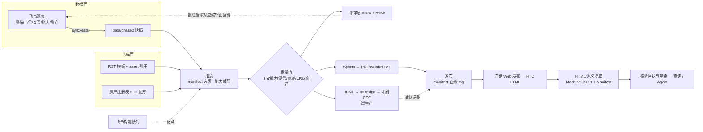

# 系统演进史（骨架与来路）

Updated: 2026-10-04

## 0. 本文角色

回溯性架构叙事：回答"系统为什么长成这样"。与三份既有文档互补、不重叠：

- [`System Evolution Strategy.md`](System%20Evolution%20Strategy.md) 向前看——方向与稳定边界；
- [`../optimization_project.md`](../optimization_project.md) 看现在——执行路线图；
- [`../code_optimization_log.md`](../code_optimization_log.md) 逐笔流水——每次改了什么。

本文只记录**环级**转折（改变生产原则的那一层），细节一律指向流水账与 PR。
受众是接手的维护者：读完 [`ONBOARDING.md`](../../ONBOARDING.md) 的第一小时之后、
翻完整优化日志之前，先用十分钟建立这份心智模型。

维护规则：新增"环"、已记录环的关键验收或收官证据变化时更新本文；普通功能与修复不记。
本文中的数量是注明日期和口径的历史快照，不是实时仪表盘。
已形成的能力、仍在验收的建设、未来方向分别标注；合入不等于部署或线上验收。
截至 2026-10-04，当前最成熟的是 Web 文档的生成、审核、发布与维护链条；
IDML 文件用于印刷版试生产，相关工具和版式测试完成不等于正式印刷交付成熟。

RTD `/workspace/system/` 的「系统演变」读取本文 §7 的同源摘要，
按工作台能力逐步扩展的过程讲述。摘要随历史正文一起维护，不另设网页历史源。
长期方向仍归 Strategy，当前任务状态仍归路线图和执行台账。

## 1. 一行内核（2026-02-15，`fa988f52`）

第一天的全部系统：

```
CSV(安全条目) + RST 模板(占位符) ──csv_to_rst──> RST ──Sphinx(conf.py)──> LaTeX ──> PDF
```

一页安全说明、一个产品、没有机型/区域维度，构建产物直接提交进仓库。
多机型生成页 02-28 已出现（`15b14df2`）；Word 输出 03-05 才有
（pandoc，`d81da227`——同一提交里 spec 页成为整本构建的结构化入口）；
`build.py` 入口 03-10（`248bed28`，`--region` 参数自出生即有）。

**内核至今未变：结构化数据 × 可复用模板 → 确定性构建。**
之后的每一环都是绕着这一行长出来的——不是替换它，而是把它周围每一处
"人手改产物"替换成"改源 + 过门"。

## 2. 生产骨架与新增消费面


```mermaid
flowchart LR
  subgraph 数据面
    F[飞书源表<br/>规格/占位/文案/能力/资产] --sync-data--> S[data/phase2 快照]
  end
  subgraph 仓库面
    T[RST 模板 + asset:引用]
    A[资产注册表 + .ai 配方]
  end
  S --> ASM[组装<br/>manifest 选页 · 能力裁剪]
  T --> ASM
  A --> ASM
  ASM --> G{质量门<br/>lint/能力/语言/棘轮/URL/资产}
  G --> R[评审层 docs/_review]
  R -.批准后按对应编辑面回源.-> F
  G --> OUT1[Sphinx → PDF/Word/HTML]
  G --> OUT2[IDML → InDesign → 印刷PDF<br/>试生产]
  OUT1 --> REL[发布<br/>manifest·血缘·tag]
  OUT2 -.试制记录.-> REL
  Q[飞书构建队列] -.驱动.-> ASM
  REL --> WEB[冻结 Web 发布 → RTD HTML]
  WEB --> MACHINE[HTML 语义提取<br/>Machine JSON + Manifest]
  MACHINE --> READ[核验回执与哈希 → 查询 / Agent]
```

（图内不含环 5 的双平面拓扑——评审实际发生在 Hello-Docs 镜像侧——
与环 10 的 config 派生元规则，见对应环。机读支路是当前的
HTML compatibility 路径；未来的 IR-native 人读/机读同源生成见 §6。）

## 3. 演进十四环（按各环成形的顺序）

每环三件事：**动机 → 落点 → 留下的不变量**。

### 环 1 · 目标矩阵（2026-03 ～ 05）

一个产品变一族产品。`tools/utils/targets.py` 与首个语言配置 03-08，
manifest 选页 03-20（`4b4fba7d`），家族配置 `config.us.yaml` 04-04（#41），
`configs/` 归位 05-30（#285）。
**不变量**：一份模板服务所有机型，差异由数据与配置表达——AGENTS 里
"不许每机型一个 config"的规则来自自己的化石（见 §4）。

### 环 2 · 评审层与第一道门（2026-03-11/12）

产物要给人看，人不能直接改产物。`docs/_review/` 03-11，
`review_bundle.py` + `check_docs.py` **同一提交**出生（`9a7a958e`，03-12）。
**不变量**：评审改派生层，构建可重建它；检查与评审天生一对。

### 环 3 · 数据上云 + 队列（2026-04-01，同一提交）

CSV 不再手编。`tools/sync_data.py`、`data/phase2/`、
`.github/workflows/feishu-build-queue.yml`、`tools/process_build_queue.py`
全部来自 **一个提交**（`d90de79c`，#21）。
**不变量**：飞书源表是数据的单一真相，仓库只留可重放的快照；
自动化不是后加的，是数据上云的孪生。

### 环 4 · 回写闭环（2026-06-08 起）

评审改动要回到源头。`cloud_doc_backport.py` 以 diff 报告形态出生
（#343，06-08），次日长出受护栏的写回（#349/#350/#352，06-09），
06-19 补渲染基线库与 seed（#411），06-24 闭环测试（#470）。
**不变量**：修改最终回到声明的权威源，再按目标重建。
**当前操作边界**：云文档回写先写评审派生层；模板同步和正式源表写入分别走各自
流程与批准门，不能把评审回写理解成自动改源表。具体命令与允许写入的路径
以 [AGENTS.md §3](../../AGENTS.md#3-workflow-rules) 为准。

### 环 5 · 双平面（2026-06-10 / 07-02）

工程与业务分离。Hello-Docs 镜像同步 #360，两平面地图
[`../../user-guide/two_plane_map.md`](../../user-guide/two_plane_map.md) #526。
**不变量**：auto-manual = 工程面，镜像 = 业务面；代码永不直接 PR 镜像主干。

### 环 6 · 质量门体系（2026-06-07 ～ 07-27）

不过门不出货。content-lint 06-07（#335），能力→章节门 07-12（#649），
语言树一致性 + 警告棘轮 + 印刷 URL 巡检 07-14（I1/I2/I4，#657-659），
资产状态门入 publish 07-27（#722）。
**不变量**：每类"印出去无法撤回"的错误都要有一道构建期的门。

### 环 7 · IDML 与印刷试生产（2026-07-04 ～ 08-06，工程建设记录）

Word 之外长出 InDesign 印刷线。IDML 导出 MVP 07-04（#548），
组件化拆包 07-05（#577-585），真 InDesign finalize 07-13（#648），
参考版式契约 07-17（#675），逐页视觉对齐战役 07-26/27（#711-729，
#729 宣告收官），pin 护栏进 CI 07-27（#724），契约 v2 分域
（内容/装配/样式 fail-closed + 快照溯源不阻塞）08-06（#886）。
以上是导出、版式和测试阶段的工程落点；截至 2026-10-04，IDML 仍用于试生产，
不代表已形成成熟的正式印刷交付链条。
**不变量**：操作者批准的参考版式是唯一真相，契约哈希钉死每一页；
"绿"必须可以从干净检出复现。

### 环 8 · 资产环（2026-07-15 ～ 28）

图片走同一原则。注册表普查 07-15（#662），`asset_registry.py` #668、
确定性 .ai 入库 `asset_pipeline/` #670；注册表镜像入 sync-data 07-27
（#721），发布血缘 + 资产门 #722，InDesign 包入发布记录 #723，
对象级引线修复取代白补丁 07-28（#734）。
**不变量**：.ai 是源、导出物是投影；每张图有身份（asset: 键）、
有状态（门控）、有哈希（血缘）。

### 环 9 · 发布自证（2026-03-15 ～ 07-31）

发布要能自证用料、可复现归档。这一环生长最慢：`release_manifest.py`
03-15 就有雏形（`6ff0f08d`），
但从"记录"到"自证"用了四个月——工具链指纹 07-13（I3，#656），
资产血缘 + InDesign 包 07-27（#722/#723），版本快照冻结与
字节级重建证明（E1，#818/#820）、不可变发布标签 07-31（#837）。
**不变量**：一次发布能回答"用了哪版数据、哪版工具、哪些字节的图、
给印厂发什么"，且归档可字节复现。

### 环 10 · 规模化（2026-07-30/31，Workstream W）

前九环长完，规模化收敛为切片工程：计划 #748 当日批准，
76 个切片两日内全部落地（约 50 片当天、其余次日；#838/#839 收官对账）。新语言=改注册表零代码、
新区域=一条命令、CI 目标从 configs 自动推导、队列并发有租约语义。
**不变量**：一切随 config 派生——加产线不加代码。

### 环 11 · 从样式组件化到整本 Web 复用（2026-07 起）

常用版式逐步从每页单独设置，转为可复用的标题、警示框、规格表、符号与 LCD 组件。
7 月印刷侧组件拆包形成边界；[共享样式合同](../../docs/renderers/contracts/STYLE_DEFINITION.md)
与[组件应用指南](../dev/style_component_usage_guide.md)明确由组件统一管理样式，
新型号和语言传入自己的内容与批准的变体，不另复制一套页面绘制代码。
这是样式组件化的起点。随着网页说明书录入量增加，真实型号、语言和手册差异
不断推动共用内容结构与组件完善。Manual IR、ComponentSpec 和产品骨架逐步
承接正文、表格、步骤、组件角色和资产引用；
9 月共享组件准入与原生导入把这些约束用于真实 Web 交付，
14 本手册的集中 rollout 在 09-30 完成（#1339–1342，Hello-Docs #157）。
[rollout 验收](../dev/eu_shared_component_rollout_2026-09.md)
记录了 14 个线上页面对比、217 次图片检查和 28 个桌面/手机案例。
Web 整本样式与组件复用已经形成，整本 IR 共享随网页手册积累持续完善。
现有 Web 入口先构建冻结整本包，再从包生成网页；包可脱离 RST、CSV 重放。
Word 仍逐页转换 RST，IDML 从 prepared RST 另建 IR。三者已有公共组件接口，
但直接消费同一份冻结整本包仍待跨格式迁移；布局、分页和交付分别验收。
代码边界见 [Web 源适配](../../tools/web/document_source.py)、
[Web 整本消费](../../tools/web/document_ir.py)、
[Word/Web 入口分支](../../tools/word/bundle_html.py)与
[IDML 源适配](../../tools/idml/ir_projection.py)。
**不变量**：语义与组件角色由共享契约约束，各 Renderer 对原生格式负责；
声明了组件就要通过准入，不能在另一种语言中静默退化。
稳定边界见 [Strategy §4.6](System%20Evolution%20Strategy.md#46-cross-layer-operations-feedback-and-shared-intake)。

### 环 12 · Web Corpus 与 Workspace（2026-09 ～ 10）

交付对象从一次性的文件变为持续维护的已发布内容集合。
RTD 工作台把手册、语言版本、语料、生产入口和证据放到同一导航中；
冻结目录决定可见的手册，来源登记决定数字从哪来。
#1351 将交付物页变为说明书工作台，#1430 统一外壳，
#1431 在工作入口标出各版本的内容权威源。
机器语料方案保存的 **2026-10-04 线上实测快照** 为 EU 21 个型号、
91 个版本、1,157 个章节；这是该方案的观察口径，不是全站实时计数，
也不同于 TM 的句对数量。
**不变量**：目录、生产状态、内容权威源与验收证据要能分别定位；
工作台展示派生事实，不能成为第二个发布源。
运行契约见 [RTD 工作台](../dev/rtd_manual_portal.md)，
快照口径见 [机读语料方案 §2](../dev/machine_readable_manual_corpus.md#2-当前现实2026-10-04-线上实测)。

### 环 13 · 高速扩张后的工程治理（2026-09-28 ～ 10-03，Workstream Y）

维护与重构贯穿系统建设过程，并非从 09-28 才开始。优化日志已有 03-08
初始重构、04-05～08 构建与队列拆分及质量检查、05-30 集中路径管理等多轮记录。
本环记录 9～10 月的一轮集中治理；RTD 摘要将历次维护作为贯穿全过程的横向路标，
与能力演变阶段分别呈现。

产线增长也带来了复杂函数、门面临时接线、散落模块和环境漂移。
[Workstream Y](../dev/code_quality_iterability_plan.md) 将治理拆成边界清晰的任务，
把复杂度、类型、异常、包结构、测试接线与文档生命周期纳入持续护栏。
历史数字必须带口径：09-28 方案基线为 CC≥50 的函数 31 个；
10-03 清理收官记录为 0（最后批次从 24 降到 0）。
测试中的 facade patch 从 363 降到 11；`tools/` 顶层 `.py` 从 398 降到 183，
保留的 11 处接线有明确理由，模块减少包括迁入包，并不代表删除了相同比例功能。
#1399–1407 的拆分使用真实/随机输入的新旧差分；IDML 四个真实目标的
1,431 个 ZIP 部件保持字节一致。入口迁移与包整理延续到 #1423–1428。
**不变量**：扩建必须受持续约束，重构用行为证据验收；
增加规则文件不等于规则已落实，子项完成也不自动代表整条 Workstream 结案。
详细日期、分项和保留理由见 [优化日志](../code_optimization_log.md)。

### 环 14 · Machine Surface（2026-10-01 起，正在建设）

已发布网页不仅给人读，也开始提供供程序精确检索的语义数据。
[EU 查询契约](../dev/eu_manual_query.md) 建立 HTML 语义提取、
`manual-knowledge.json`、回执核验和有来源引用的查询；
10-04 的 [Machine Corpus 方案](../dev/machine_readable_manual_corpus.md) 将
版本身份、块级来源、生成模式、清单和 freshness 分阶段建设。
#1434 合入身份与来源；#1435 合入逐版本清单与新鲜度校验；
#1436 合入工作台覆盖面板。它们是工程落点，代表手册人工抽查与整体线上验收
仍按方案分别完成，
不能用两个 PR 合入替代整体线上验收。
**不变量**：机读面只能由正式内容派生；当前明确标为 `html_compatibility`，
图片仅消费 alt、不冒充 OCR；机器结论保留版本、章节、块和来源，
并在使用前核验当前部署。它是新的消费面，尚不是知识回流闭环。

## 4. 三条反直觉的史实

1. **评审层早于数据上云三周**（03-11 vs 04-01）：系统先解决
   "人怎么改"，再解决"数据从哪来"。评审与门是骨架的第一层加固，
   不是后补的流程。
2. **队列与云数据同一提交出生**（`d90de79c`）：自动化从来不是
   锦上添花，"数据在云上"与"构建不用人跑"是同一个决定的两半。
3. **反模式的化石还在历史里**：`config.je1000f.jp.yaml`（03-10）
   早于家族配置（04-04）。AGENTS 的"不许每机型一个 config"不是
   凭空规定，是自己踩过的坑。

## 5. 不变量清单

| 环 | 不变量 | 今天的载体 |
|---|---|---|
| 内核 | 数据×模板→确定性构建 | `build.py` + Sphinx + 快照 |
| 1 | 差异进数据/配置，不进模板副本 | 家族 config + manifest + 能力矩阵 |
| 2 | 改派生层，不改产物 | `docs/_review` + sync-review |
| 3 | 飞书是数据单一真相 | sync-data 快照 + 队列 |
| 4 | 评审回写不越过正式源的批准边界 | backport 评审派生层 + 模板同步/源表审批 |
| 5 | 工程/业务两平面 | Hello-Docs 镜像 + two_plane_map |
| 6 | 不过门不出货 | check 门族 + publish 资产门 |
| 7 | 参考版式唯一真相，契约钉死 | reference_layout 契约 + pin 护栏 CI |
| 8 | 图有身份/状态/哈希 | asset: 引用 + 注册表 + 血缘 |
| 9 | 发布可自证、可复现 | release manifest/tag + E1 重建证明 |
| 10 | 加产线不加代码 | 语言注册表 + 一条命令新区域 |
| 11 | 共享语义与组件准入，各格式分别验收 | Manual IR / ComponentSpec / 骨架 / conformance |
| 12 | 内容集合可观察，展示不成为发布源 | 冻结目录 / Workspace / source registry |
| 13 | 工程扩建有持续护栏，重构有行为证据 | Workstream Y / ratchets / 差分验证 |
| 14 | 机读派生，不形成第二内容源 | HTML compatibility / 回执 / 身份与清单 |

## 6. 下一阶段（方向，不计为已完成的历史环）

**Shared IR：从已实现的 Web 整本共享扩展到更多输出端。** Web 整本复用已经实现，
IR 与共享组件随网页手册录入持续完善；
长期线是扩大共同语义的覆盖，让 Web、Word、IDML 和 Machine Surface 直接消费
同一份公共语义，各自负责表达。逐步替换 HTML → Machine 的兼容路径，
用现有机读语料作语义迁移基线，而不是一次重写所有 Renderer。
代表试点、边界与各格式验收仍按 REV-39/REV-40 和独立方案推进。

**Knowledge Feedback：让生产经验回到下一次生产。** 先观察 Safety / Warning /
Compliance 的原文、差异与来源，再形成缺口候选，经人工评审决定适用范围和
批准措辞，最后通过该版本声明的模板/评审/正式源编辑面回流。
机器推断不直接变成安规事实；知识观察、审核与回源属于 Phase 2/3，尚未完成。


```mermaid
flowchart LR
  A[生产说明书] --> B[积累版本语料]
  B --> C[机读内容]
  C -.未来.-> D[观察知识与缺口候选]
  D -.-> E[人工评审与批准]
  E -.-> F[回到声明的正式源]
  F -.-> A
```

## 7. RTD 同源展示摘要

以下是本文面向公众的摘要，不是独立台账。事实变化先更新上面的历史与证据，
再同步这段摘要；构建只读此块，所有文案按纯文本转义。
`stages` 记录九个能力演变阶段；`crosscutting` 记录贯穿全过程的持续工作，
用不编号的横向路标呈现，维护与重构不放入单一时间阶段。
`recorded` 显示为“已完成”，表示该阶段能力已形成，不表示所有产品、格式或后续治理均验收完成；
`ongoing` 显示为“持续开展”，表示已有基础但仍需持续维护和改进；
`in_progress` 和 `planned` 明确区分当前建设与未来方向。数量如需展示，
须写在附日期的历史说明中，不作为实时计数。

<!-- system-evolution:start -->
```yaml
schema: system-evolution/v1
updated_on: 2026-10-04
title: 从一条自动化脚本，到持续演进的说明书工作台
intro: 从自动生成一份说明书开始，逐步串联评审、发布与维护。当前 Web 文档链条最成熟，IDML 印刷版仍在试生产；内容和经验的积累继续支持后续工作。
crosscutting:
  - id: engineering
    period: 贯穿系统建设全过程
    status: ongoing
    title: 持续维护与重构
    metaphor: 随系统建设反复整理，让后续修改与扩展更稳妥
    summary: 在整个系统建设过程中，随功能增加和问题暴露，多次整理代码结构、明确各部分职责、补充测试和自动检查。维护与重构伴随各项能力建设持续开展。
    flow: [3 月 · 初始结构整理, 4 月 · 构建与队列拆分, 5 月 · 统一路径管理, 9～10 月 · 复杂度与模块治理]
    detail: 优化日志记录了 03-08 的初始重构、04-05～08 的入口与构建／队列拆分及质量检查、05-30 的集中路径管理。09-28 至 10-03 是其中一轮集中治理：CC≥50 的函数 31 → 0，测试 facade patch 363 → 11，tools 顶层 .py 398 → 183；模块迁入包，11 处接线有保留理由。这些是各轮历史记录，后续仍继续维护和改进。
    invariant: 每轮重构都要用相应测试、新旧输出或真实目标验证，确认既有行为保持稳定。
    evidence: ["file:auto-manual:code-as-doc/code_optimization_log.md", "file:auto-manual:code-as-doc/dev/code_quality_iterability_plan.md"]
stages:
  - id: kernel
    period: 2026-02 ～ 03
    status: recorded
    title: 自动生成第一份说明书
    metaphor: 数据与模板驱动的确定性构建
    summary: 把安全条目交给数据和模板，让同样的输入稳定生成同样的说明书。
    flow: [CSV + RST 模板, RST, PDF]
    detail: 02-15 的内核先生成 PDF，03-05 才加入 Word。多机型、区域入口随后出现，生产原则开始从手工复制转为确定性构建。
    invariant: 结构化数据 × 可复用模板 → 确定性构建。
    evidence: ["file:auto-manual:code-as-doc/architecture/system_evolution_history.md"]
  - id: targets
    period: 2026-03 ～ 05
    status: recorded
    title: 多产品、多区域、多格式
    metaphor: 用配置表达差异，复用数据与模板
    summary: 同一套构建方法要服务不同产品和市场，差异逐步交给配置、数据与选页规则。
    flow: [数据 + 家族模板, 目标装配, PDF / Word / HTML]
    detail: 从单一目标扩展到型号、区域和语言的组合；家族配置与 manifest 选页减少了逐机型复制模板和配置的需要。
    invariant: 加目标表达差异，优先复用已有结构。
    evidence: ["pr:auto-manual#41", "pr:auto-manual#285"]
  - id: workflow
    period: 2026-03 ～ 07
    status: recorded
    title: 生成后审核，修改后再生成
    metaphor: 从生成文件，扩展到审核和修改的完整流程
    summary: 提交任务后，系统安排说明书生成和检查。审核人员提出修改，按流程确认后再生成说明书；每次修改都有记录。
    flow: [提交生成任务, 生成与检查, 人工审核, 确认修改, 重新生成]
    detail: 最初先让审核人员能在评审文档中提出修改，后来把数据接入飞书，让生成任务按队列自动处理。审核文档中的修改先保留在评审版本；需要更新共用模板或正式数据时，再按对应流程确认，不能直接覆盖正式内容。
    invariant: 修改有记录，更新正式内容须经确认，重新生成后再次检查。
    evidence: ["pr:auto-manual#21", "pr:auto-manual#343", "pr:auto-manual#360", "file:auto-manual:user-guide/two_plane_map.md"]
  - id: production
    period: 2026-07 起
    status: in_progress
    title: 印刷版试生产
    metaphor: 尝试生成 IDML，在 InDesign 中检查排版
    summary: IDML 文件目前用于试生产，还需要检查字体、分页、插图和最终印刷效果。这条链仍在验证和改进，尚未达到 Web 文档链条的成熟度。
    flow: [准备内容与插图, 生成 IDML, InDesign 排版检查, 试制验证]
    detail: 已有 IDML 导出、参考版式、插图管理和版本记录能力，也保留了工程测试证据。这些支持试制，不代表正式印刷交付已完成；排版和最终印刷效果仍需逐项验证。
    invariant: 工具和测试完成不等于交付成熟；试制结果须经过排版与印刷验证。
    evidence: ["pr:auto-manual#548", "pr:auto-manual#722", "pr:auto-manual#837"]
  - id: style_components
    period: 2026-07 起
    status: ongoing
    title: 开始建设可复用的样式组件
    metaphor: 把常用版式整理成组件，供后续页面调用
    summary: 开始把标题、警示框、规格表等常用版式从页面代码中提取出来，由组件统一管理样式。新页面提供自己的文字和数据，逐步减少重复设置版式的工作。
    flow: [整理常用版式, 建立样式组件, 在页面中调用, 逐步扩大复用]
    detail: 这个阶段记录样式组件化建设的起点：7 月印刷侧组件拆包开始明确组件与页面编排的边界。后续共享样式合同和组件应用指南继续完善规则；随着网页手册录入，整本 Web 的内容与组件复用逐步成熟，见整本 IR 共享记录。
    invariant: 页面负责安排组件的位置和顺序，组件负责自己的内部样式。
    evidence: ["file:auto-manual:docs/renderers/contracts/STYLE_DEFINITION.md", "file:auto-manual:code-as-doc/dev/style_component_usage_guide.md", "pr:auto-manual#577"]
  - id: corpus
    period: 2026-08 ～ 10
    status: recorded
    title: Web 文档发布与内容积累
    metaphor: 当前最成熟的文档链条，持续维护已发布内容
    summary: Web 文档已形成生成、审核、发布和持续更新的链条。随着型号和语言版本增加，工作台集中呈现已发布手册的入口、版本与来源。
    flow: [多语言 Web 文档, 发布与更新, 工作台目录, 版本与来源]
    detail: 09-30 的 14 本手册 rollout 留下线上页面与桌面、手机验收证据。10 月工作台继续标出每个版本的内容权威源；发布规模、语料规模和能力成熟度分别呈现。
    invariant: 共享语义约束组件；每个版本仍有自己的权威源与验收证据。
    evidence: ["file:auto-manual:code-as-doc/dev/eu_shared_component_rollout_2026-09.md", "pr:auto-manual#1351", "pr:auto-manual#1431"]
  - id: machine
    period: 2026-10-01 起
    status: in_progress
    title: 让程序和 AI 查找说明书内容
    metaphor: 查到具体内容，也能找到原文出处
    summary: 把网页手册的文字和表格按章节整理，供程序和 AI 查询。例如，查找某型号的充电说明时，可以找到对应原文、章节和手册版本，并附上网页出处。
    flow: [已发布的网页手册, 按章节整理内容, 记录版本与出处, 提供给程序和 AI 查询]
    detail: 目前从已发布的网页整理数据，记录手册版本、章节和原文位置，使用前检查数据是否与当前网页一致。记录版本与出处（#1434）、生成版本清单并检查更新（#1435）、在工作台显示覆盖情况（#1436）的代码已合入；代表手册人工抽查与整体线上验收仍待完成。图片只保留已有的文字说明，不识别图片中的文字。
    invariant: 查询内容来自正式发布的手册；修改仍回到原有文档、模板或数据，再重新生成。
    evidence: ["pr:auto-manual#1434", "pr:auto-manual#1435", "pr:auto-manual#1436", "file:auto-manual:code-as-doc/dev/machine_readable_manual_corpus.md"]
  - id: shared_ir
    period: 2026-09 起 · 随网页手册录入持续完善
    status: ongoing
    title: 随网页手册积累，完善整本 IR 共享
    metaphor: 每录入一份手册，都继续完善共用的内容结构与组件
    summary: Web 版已实现整本样式和组件复用。随着录入的型号、语言和手册增加，共用的正文、表格、步骤和插图处理不断完善，真实手册中的差异也逐步纳入同一套内容结构与组件。
    flow: [录入真实手册, 补齐内容与组件支持, 使用共用体系生成整本网页, 继续完善]
    detail: Web 现有入口先把整本内容、ComponentSpec、素材和所用合同保存到 manual.ir.json，再从这份包生成网页；冻结包可脱离 RST、CSV 重放。样式组件化阶段记录早期起点，这一项记录随后随网页文档积累而完善的整本 IR 共享。Word 目前仍逐页转换 RST，IDML 从 prepared RST 另建 IR；它们已有共享组件接口，直接消费同一份冻结整本包仍是后续扩展，代表试点按 REV-39、REV-40 推进。
    invariant: 共用内容结构与组件，保留各手册原文和必要差异；各格式分别负责排版与验收。
    evidence: ["file:auto-manual:code-as-doc/architecture/System Evolution Strategy.md", "file:auto-manual:code-as-doc/dev/ir_document_closeout.md", "file:auto-manual:tools/web/document_source.py", "file:auto-manual:tools/web/document_ir.py", "file:auto-manual:tools/word/bundle_html.py", "file:auto-manual:tools/idml/ir_projection.py", "file:auto-manual:code-as-doc/dev/manual_revitalization_execution.md"]
  - id: review_experience
    period: 后续规划 · 试点与执行安排待确定
    status: planned
    title: 积累审核经验，支持后续编写
    metaphor: 保存确认过的措辞、修改理由和适用条件
    summary: 逐步把经过确认的译文、术语和修改经验记录下来，保留出处与适用条件，供后续说明书参考。具体范围、试点和执行安排仍需确定。
    flow: [记录确认过的修改, 保留出处与适用条件, 编写时参考, 审核后采用]
    detail: 译文和术语的复用已有台账任务（REV-18、REV-37）。更广泛的经验积累与知识反馈属于机读方案的 Phase 2／3，开工前需要另行立项；尚未形成覆盖全部审核修改的具体执行方案。这项工作独立于 IR 共享建设。
    invariant: 参考已有经验时核对出处与适用条件，经人工审核后再采用。
    evidence: ["file:auto-manual:code-as-doc/dev/manual_revitalization_execution.md", "file:auto-manual:code-as-doc/dev/machine_readable_manual_corpus.md"]
feedback:
  title: 让这次审核的成果，帮助下一次编写
  steps: [编写与生成说明书, 积累已发布内容, 程序查询原文, 找出需要补充或修改的内容, 人工审核, 更新原有文档或数据, 用于后续编写与维护]
  note: 说明书生成、发布和内容查询已有基础。后续规划是积累审核确认的措辞、适用条件和修改经验，经确认后用于后续手册；具体范围、试点和执行安排仍需确定。
```
<!-- system-evolution:end -->
