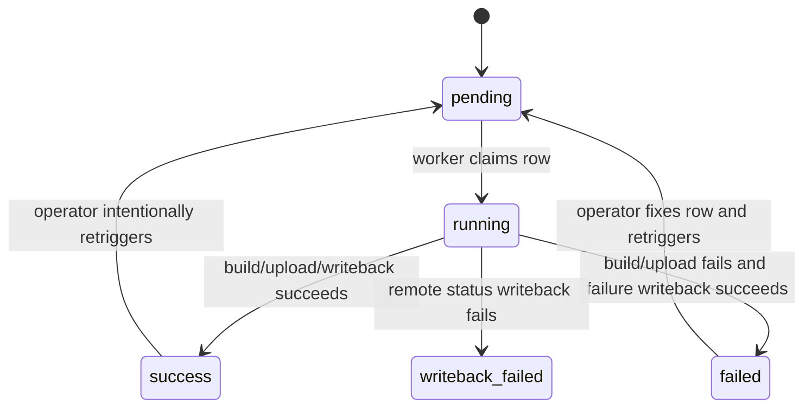

# Queue State Model

Updated: 2026-05-07

This file records the supported queue status model for `Document_link` build
rows. It complements the field-level contract in
[`external_table_contracts.md`](external_table_contracts.md).

## 1. State Flow

## 2. Pending

A build/publish row is pending when:

- `Workflow_action` maps to `Build Draft Package` or `Publish`
- `是否触发文档构建` is enabled with one of `1`, `true`, `y`, or `yes`
- optional row filters such as `--record-id` still match the row

Important rules:

- `是否立即构建` alone is not a build trigger. It wakes the listener, but the
  canonical trigger still has to be enabled.
- Build Draft Package rows must carry `Git_ref` so the worker can build the
  selected review branch content.
- `Doc_phase` is a deprecated compatibility fallback and should not be used for
  new rows.

## 3. Running

When a real worker starts a build attempt, it writes:

- `开始构建时间`: epoch milliseconds from the worker clock
- `构建结果`: a string prefixed with `RUNNING`

The running result should include enough context for operators and control-layer
status lookups:

- `version=<Version>` when available
- `workflow_action=<normalized label>`
- `started_at=<ISO timestamp>`
- `data_sync=<refreshed|skipped|failed>` when known

Running writeback does not clear the trigger fields. The row should still be
inspectable if the worker crashes after claiming the task.

## 4. Success

On success, the worker writes:

- `构建结果`: prefixed with `SUCCESS`
- `Document directory`: local/staged artifact path
- `Document link`: uploaded Feishu Drive/Wiki URL or DingTalk URL
- `Document link_dd`: DingTalk URL when that optional field is enabled
- `data_sync`: `refreshed`, `skipped`, or `failed`
- `是否触发文档构建`: `已构建`
- `是否立即构建`: `false`
- `是否强制刷新数据`: `false`

Only success marks the canonical trigger as done.

## 5. Failed

On failure, the worker writes:

- `构建结果`: prefixed with `FAILED`
- `data_sync`: latest sync decision when known
- `Document directory`: preserved latest local output when available
- `Document link`: preserved latest remote output when available
- `是否立即构建`: `false`
- `是否强制刷新数据`: `false`

Failure writeback intentionally preserves latest usable artifact links when the
worker got far enough to produce them. It does not mark `是否触发文档构建` as
`已构建`.

## 6. Writeback Failed

`writeback_failed` means the worker could not reliably write the final remote
state back to Feishu/Lark. The process should report failure rather than
pretending the queue row reached success.

Operationally:

- inspect GitHub Actions logs or local worker logs
- check Feishu app/bot write permissions
- reconcile the row manually if the artifact was produced but the table update
  failed
- retrigger only after confirming the desired `Workflow_action`, `Git_ref`, and
  artifact target are still correct

## 7. Transition Ownership

Current transition payload assembly lives in:

- [`tools/queue_writeback.py`](../../tools/queue_writeback.py)
- [`tools/queue_group_processing.py`](../../tools/queue_group_processing.py)
- [`tools/process_build_queue.py`](../../tools/process_build_queue.py)

Future queue work should move start/success/failure payload construction and
trigger-clearing rules toward one explicit transition layer, with tests covering
`running`, `success`, `failed`, and `writeback_failed` behavior.
