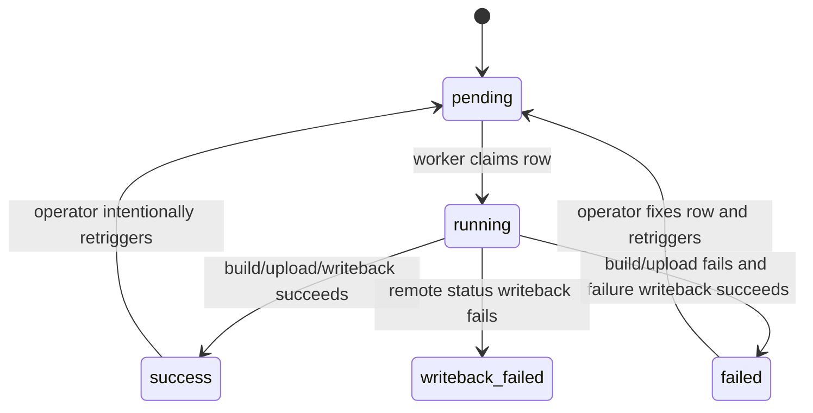

# Queue State Model

Updated: 2026-08-13

This file records the supported queue status model for `Document_link` build
rows. It complements the field-level contract in
[`external_table_contracts.md`](external_table_contracts.md).

## 1. State Flow

```mermaid
stateDiagram-v2
    [*] --> pending
    pending --> running: worker claims row
    running --> success: build/upload/writeback succeeds
    running --> failed: build/upload fails and failure writeback succeeds
    running --> writeback_failed: remote status writeback fails
    failed --> pending: operator fixes row and retriggers
    success --> pending: operator intentionally retriggers
```

## 2. Pending

A build/publish row is pending when:

- `Workflow_action` maps to `Build Draft Package` or `Publish`
- `是否触发文档构建` is enabled with one of `1`, `true`, `y`, or `yes`
- optional row filters such as `--record-id` still match the row
- `构建结果` does not contain an unexpired RUNNING claim lease

Important rules:

- `是否立即构建` alone is not a build trigger. It wakes the listener, but the
  canonical trigger still has to be enabled.
- Build Draft Package rows must carry `Git_ref` so the worker can build the
  selected review branch content.
- `Doc_phase` is a deprecated compatibility fallback and should not be used for
  new rows.

## 3. Running

When a real worker starts a build attempt, it writes:

- `开始构建时间`: epoch milliseconds from the worker clock
- `构建结果`: a string prefixed with `RUNNING`

The running result should include enough context for operators and control-layer
status lookups:

- `version=<Version>` when available
- `workflow_action=<normalized label>`
- `started_at=<ISO timestamp>`
- `data_sync=<pending|skipped>` at claim time
- `claim_token=<opaque worker token>`
- `claim_expires_at=<UTC ISO timestamp>`

The worker writes the same token to every row in a group, then refetches the
records with `view_id=None`. It may start sync/build work only when every row
still carries that token and the two-hour lease is unexpired. A competing token
causes a clean skip; a write or readback transport failure fails the run before
build. Running writeback does not clear the trigger fields, so the row remains
inspectable if the worker crashes. Active leases are excluded from pending
selection and expired leases are reclaimable.

This K12-min contract is deliberately precise about its guarantee boundary:
Feishu `record-upsert` has no compare-and-swap/revision precondition, so token
write plus readback verification is not linearizable storage. GitHub Actions
therefore provides a second ownership boundary:

- Build Draft Package and Publish jobs share
  `feishu-document-queue-<Document_link record_id>`; batch dispatches share the
  conservative `feishu-document-queue-batch` slot.
- Start Review operates on review-init queue identity and uses
  `feishu-review-init-queue-<record_id>` (or its `batch` slot).
- Web Publish owns the global `feishu-web-publish-branch` mutex for its complete
  build, aggregate publish-candidate update, PR maintenance, and `HTML_link`
  writeback transaction.

All groups use `cancel-in-progress: false`, so a newer dispatch waits instead
of cancelling an owner that may still hold a live Feishu lease. The claim
token remains the authoritative row-level guard when a targeted and batch run
overlap or when a workflow is retried outside the same GitHub concurrency key.

## 4. Success

On success, the worker writes:

- `构建结果`: prefixed with `SUCCESS`
- `Document directory`: local/staged artifact path
- phase-aware delivery field:
  - Draft: editable `飞书云文档`, plus frozen `基线文档`
  - Publish: designer handoff ZIP in `idml_file`
  - Web Publish: published manual URL in `HTML_link`
- `Document link_dd`: DingTalk URL when that optional field is enabled
- `data_sync`: `refreshed`, `skipped`, or `failed`
- `是否触发文档构建`: `已构建`
- `是否立即构建`: `false`
- `是否强制刷新数据`: `false`

Only success marks the canonical trigger as done.

## 5. Failed

On failure, the worker writes:

- `构建结果`: prefixed with `FAILED`
- `data_sync`: latest sync decision when known
- `Document directory`: preserved latest local output when available
- the active phase-specific delivery field: preserved latest remote output when
  available
- `是否立即构建`: `false`
- `是否强制刷新数据`: `false`

Failure writeback intentionally preserves latest usable artifact links when the
worker got far enough to produce them. It does not mark `是否触发文档构建` as
`已构建`.

`Document link` is retired and must not be used to decide whether any phase
uploaded successfully. Agent-facing queue output exposes `delivery_kind`,
`delivery_url`, and `delivery_ready`; Draft baseline evidence is reported
separately as `baseline_ready`.

## 6. Writeback Failed

`writeback_failed` means the worker could not reliably write the final remote
state back to Feishu/Lark. The process should report failure rather than
pretending the queue row reached success.

Operationally:

- inspect GitHub Actions logs or local worker logs
- check Feishu app/bot write permissions
- reconcile the row manually if the artifact was produced but the table update
  failed
- retrigger only after confirming the desired `Workflow_action`, `Git_ref`, and
  artifact target are still correct

## 7. Transition Ownership

Current transition payload assembly lives in:

- [`tools/queue_transitions.py`](../../tools/queue_transitions.py)
- [`tools/queue_claims.py`](../../tools/queue_claims.py)
- [`tools/queue_writeback.py`](../../tools/queue_writeback.py)
- [`tools/queue_group_processing.py`](../../tools/queue_group_processing.py)
- [`tools/process_build_queue.py`](../../tools/process_build_queue.py)

Start/success/failure payload construction and trigger-clearing rules now flow
through the explicit transition layer. Future queue work should keep transport
and Feishu/Lark retry behavior outside that layer so `running`, `success`,
`failed`, and `writeback_failed` behavior remains testable without network
state.
