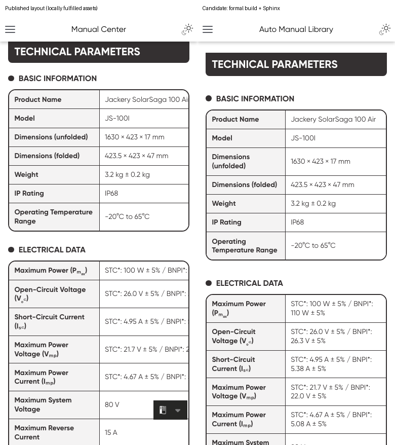
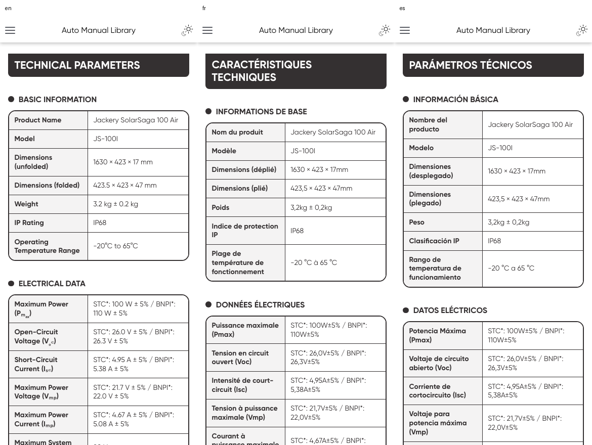
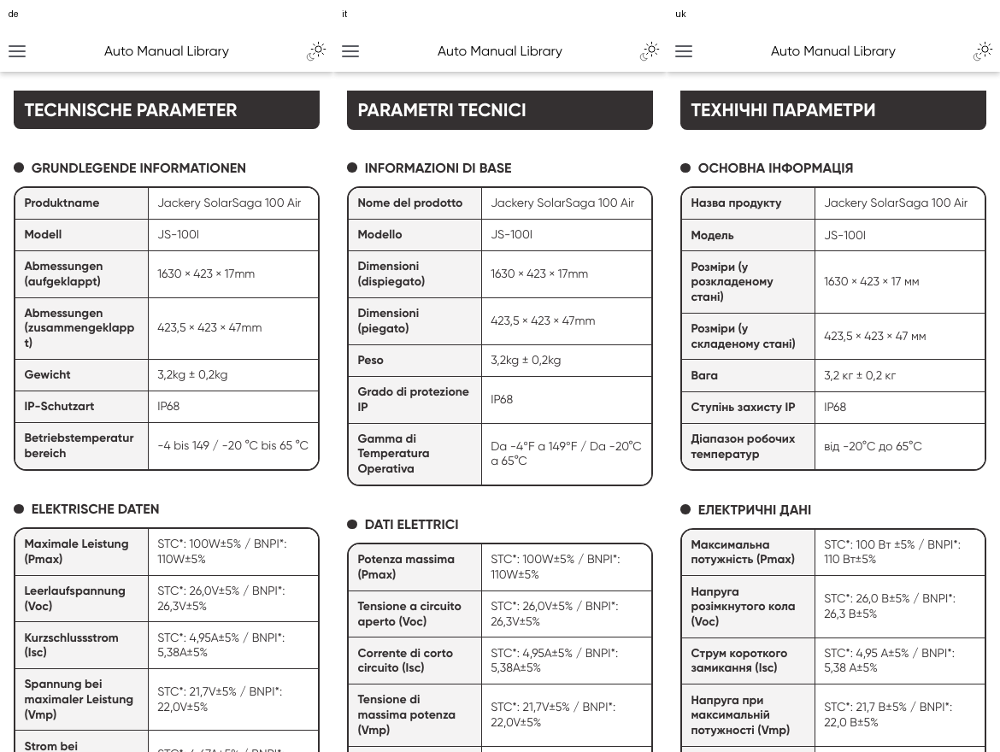
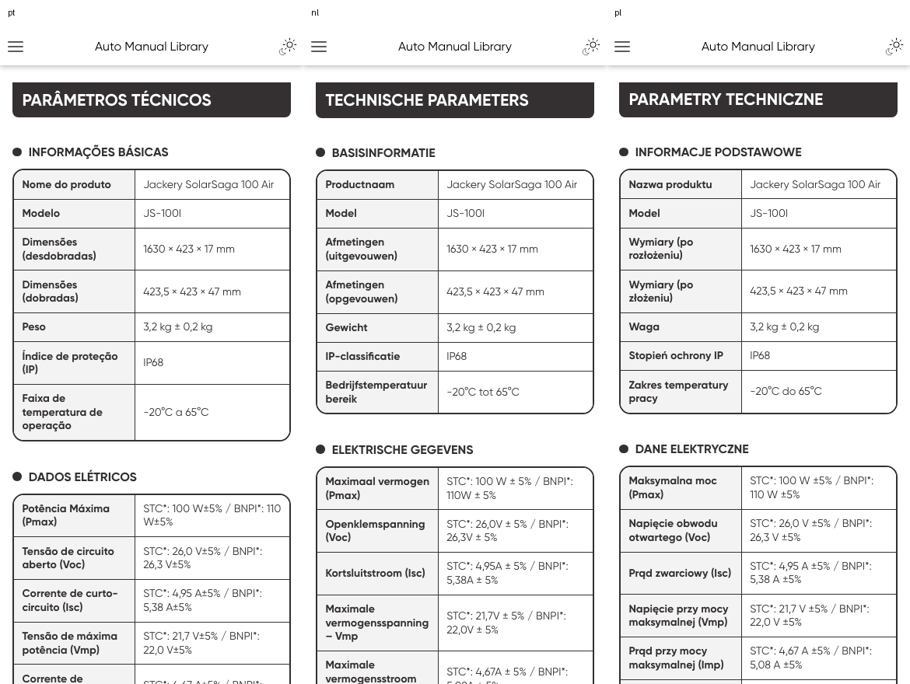

# JS-100I EU nine-language Web candidate

Status: active

The candidate fixes English operation layout and adds `fr/es/de/it/uk/pt/nl/pl`
through the existing Solar@INTL RST/CSV → `build.py md` → manual-ir/v2 → shared
Web/Sphinx route. No alternate renderer, OCR, machine translation or generated
illustration is introduced. The operator authorized publication of this candidate on 2026-10-01; MA-216
covers the engineering merge and the corresponding Git-only Web release. Live
Base writes and asset-registry promotion remain outside this change.

## Source and scope

The native source is `HTS006-EU-9国语言-0928(1).ai`, 87 PDF-compatible pages,
SHA-256 `6fd4533fd713b25d95547afa0d839d7a52c74e6e6e40ebf2228c6c8218cbc92f`.
The master is operator-provided, not a new Git binary. The live Hello-Docs main
publish manifest was rechecked during intake and contained exactly one JS-100I
route: EU/en `2.0-20260927`. This change does not update that route.

| Language | Native physical pages | Structured specification rows |
| --- | --- | ---: |
| en | Existing published English copy; new figures from 7–12 | 21 unchanged |
| fr | 14–22 | 21 |
| es | 23–31 | 21 |
| de | 32, 33, 34, 36–41 | 21 |
| it | 42–50 | 21 |
| uk | 51–59 | 21 |
| pt | 60–68 | 21 |
| nl | 69–77 | 21 |
| pl | 78–86 | 21 |

German pages 34 and 35 are pixel-identical; page 35 is omitted. Printed contents
are not Web chapters. Shared source-authored CE/manufacturer text from page 87
is included unchanged in the eight new warranties. It identifies
**SHENZHEN HELLO TECH ENERGY CO., LTD.** (source typography: `CO.,LTD.`).
English retains its previously approved warranty and technical facts.

The source master and large verification outputs remain local under
`reports/js100i_eu_20260930`; only selected review evidence is part of this change.
The full candidate validation uses engineering main `8a32608a`, including the
upstream configuration, manual-IR, IDML-plan and language-asset validation
refactors. Final integration includes `95f4d900` (an independent Bitable CLI
refactor); all 31 Bitable schema/CLI tests, Ruff and guardrails pass after that
update. The 196 task paths remain unchanged by the main integration.

## Implementation and data boundary

English operations are split into 16 native figures with selectable captions.
The original five Inbox assets and English product view retain their bytes.
The English CSV files and original approved asset recipe also retain their
bytes; the English asset provenance manifest is updated to reflect 22 assets.
Numbered captions escape their RST periods so Pandoc keeps them as captions.

All nine languages use the same 16 shared operation figures. Eight dense product
views retain their localized native labels. The strict
[`manual_js100i_eu_shared_web.json`](../../data/asset_recipes/manual_js100i_eu_shared_web.json)
recipe produces 24 native PDF crops. A recorded derivative stage removes only
identified backdrop paths and rasterizes native SVG through Chromium; this
preserves clipping in connector magnification bubbles. It does not redraw
connectors, cables, arrows, products or logos. All 24 final PNG hashes were
reproduced exactly from a full `asset_intake.py` package. White/gray 12x exports
and sensitive connector/arrow details were inspected. The recipe remains
quarantined; no asset-registry row or promotion contract is changed.

Illustration entries each declare their own master hash and recipe. The old
Inbox/product-view assets are not attributed to the newer master. New figures
are accompanied by an export receipt recording the intermediate PDF, SVG,
removed paths, rasterizer and final PNG hash.

The [source snapshot](../../data/manual_sources/JS-100I/EU/added-locales/2026-09-28/README.md)
contains native field/glyph provenance, localized RST carriers, and eight
separate `phase2/<lang>` directories. Each `--lang` build must use its matching
`--data-root`: `Source_lang` identifies copy provenance, not a Spec_Master row
filter. Notes use the existing localized `Text_<lang>` reader contract; no live
phase2 schema or synchronization fields are added.

The canonical registry recognizes Portuguese (`pt`), Dutch and Polish as offline
output languages with `sync_enabled=False`. Existing sync/TM/status columns and
live queue aliases remain unchanged; `pt-BR` remains distinct. Existing full
registry insertion behavior is still covered by the fake-language test.
Spec_Master source-language validation accepts registered languages while leaving
legacy value lookup precedence unchanged. Language-literal baseline changes record previously present AST literals newly
recognized as language tokens; they do not introduce new consumer language maps.
Content lint uses deterministic local-column fallbacks for these offline
languages; the regression checks both missing tables and planted English residue.
Parity tests separately pin live sync aliases and existing print packs, so Web
registration cannot silently add TM columns or IDML/LaTeX language governance.
Single-language Web projection now selects its matching illustration manifest
from a family binding and rejects a missing selection.

The family fold index adds the new manifest under the existing solar anchor:
42 manifests, six anchors and 36 folded documents round-trip identically. Only
the `page_solar` structure baseline changes. The eight new locale carriers share
the same skeleton; the English product view, notes and warranty retain their
intentional existing structure while unfolding/folding share the new figure layout.

The shared stylesheet lets only two-column specification tables wrap on narrow
screens. A browser regression probe verified 354 px table width inside a 354 px
container; a three-column table retains its existing 576 px minimum width.

## Native-copy audit and source errata

The output audit compares native copy fields with rendered HTML after normalizing
only punctuation/spacing for matching, checks every label/value pair in its
rendered table row, and checks 9 IR pages and 21 rows per new language. All eight
outputs pass. Raw source strings and glyph coordinates remain available for
punctuation-sensitive review. Ligatures and mechanical line wraps are normalized;
French `fonctionne ment` and Spanish `funcionamien to` are joined.

The glyph audit leaves exactly nine classified native lines per new locale:
five Inbox item numbers represented by the five-card component, the microscopic
DC7909/DC8020 adapter marks retained in the Inbox PNG, and STC*/BNPI* column
headings represented explicitly in the flattened value cells. No ordinary body
prose remains uncovered. The provenance record uses `field_path` for its native
copy-location identifier. This replaces the ambiguous generic `key` label that
caused 18 credential-scan false positives in compact coordinate/glyph records;
all 1,081 records retain identical native text, coordinates and glyph IDs. The
extractor and pinned hashes are updated together; scanner rules are unchanged. Dense product-view labels remain in the image and are
also provided as selectable captions.

| Source issue | Candidate handling | Human review boundary |
| --- | --- | --- |
| USB-C bubble says `États-Unis B-C` (fr), `EE. UU. B-C` (es), `DEB-C` (de), `IT B-C` (it), `NLB-C` (nl), `PL B-C` (pl) | Visible captions use USB-C from the same-page device engraving and specification. Original strings remain in source JSON. | Confirm these explicit connector-label corrections before publication. |
| German temperature is `-4 bis149 / -20°C bis65°C` and omits °F | Preserve native wording and values. No inferred unit inserted. | Source owner must decide the correction. |
| German page 35 repeats page 34 | Include one copy; pixel comparison is identical. | No technical content removed. |
| Shared page-87 legal copy is English | Keep it in English, including original manufacturer, address and contact information. | Confirm market/legal suitability and manufacturer identity before release; no substitute entity or translation is invented. |

## Browser evidence

Formal local Sphinx pages were opened in Chromium at **1440×1000** and
**390×844** for every language. All 18 viewports returned HTTP 200, 22 decoded
images, zero page errors, and zero document overflow. Each new locale has three
specification tables with 21 rows. Phone tables are 354 px wide; captions remain
selectable. Desktop and phone chapter/full-page screenshots are retained locally.

[Machine-readable browser summary](assets/js100i-eu-web/browser-summary.json) and
[output-copy audit](assets/js100i-eu-web/output-copy-audit.json) accompany the PR.
The baseline screenshots use published HTML/CSS with SHA-matched local image
fulfillment because the CDN was intermittent; they establish layout differences,
not CDN reliability. Candidate screenshots come from the formal local build.

## Validation and remaining acceptance

Completed checks:

- Nine `build.py check` runs using the matching Git-source snapshots.
- Nine formal `build.py md` outputs and a combined Sphinx build.
- 11 solar target tests, including all eight added language CLI builds.
- 37 registry/validator/projection/source-inventory tests and 56 queue/language tests.
- 48 content-lint, language/print parity, manifest-family and template-structure tests.
- Ruff, maintainability guardrails, documentation links and `git diff --check`.
  The Web loader complexity baseline is tightened from 72 to 68.
- US fixture regression repeated successfully after the final main update.
- Exact 24-PNG reproduction; native-copy/output audit and 18 browser viewports.

The final full `python3 -m unittest -v` run passes on `8a32608a`:
**4,974 tests in 720.707 seconds, 22 skips, zero failures or errors**. Its log is
`reports/js100i_eu_20260930/verified-unittest.log`. All nine formal `check` and
`md` builds, combined Sphinx, eight-locale copy/row audits, 18 browser viewports,
and the US fixture regression were repeated successfully after the main update.

An initial local run exposed a pre-existing JE-1000F native-fixture mismatch:
the temporary AI was `9441d7fe…` instead of frozen source `c38415f5…`. A local
original with the exact required SHA-256 and size was found, the modified bytes
were backed up, and the expected test original was restored atomically. All 27
tests across the four affected frozen-PDF modules now pass. Product provenance,
recipes and tests were not weakened or changed. The recovery receipt and backup
remain local under `reports/js100i_eu_20260930/fixture-recovery`.

The local machine reports existing dependency-lock differences; dependencies
were not upgraded. The US regression check uses the committed `tests/fixtures/phase2`
snapshot because this isolated checkout has no live `data/phase2/Spec_Master.csv`.
A no-data-root probe failed for that missing input; it did not establish a
missing live Base record.

Publication, remote RTD/CDN acceptance, live analytics, native print/IDML layout,
source-owner errata approval and asset-registry promotion remain unverified and
are not claimed by the local Web checks.

## Publication follow-up (2026-10-01)

The original `check-all` failure was the SKIP-count ratchet: the new shared
multilingual config adds one discovered JS-100I/EU target without rows in the
common fixture. Its eight separate Git snapshots remain validated by the locale
CLI tests and formal builds above. The baseline now records 17 instead of 16
skips and names the exact new config; the FAIL allowance is unchanged. The
JE-1000F/EU/uk observation failure is pre-existing and outside this release.
Main integration includes the upstream CN fixture line-ending correction.

The release retains the documented native-copy decisions and source errata.
Online acceptance will be recorded against the final source commit and the
Hello-Docs/Read the Docs deployment; local browser evidence alone does not
confirm publication.
