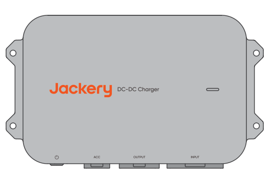
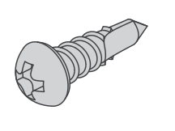
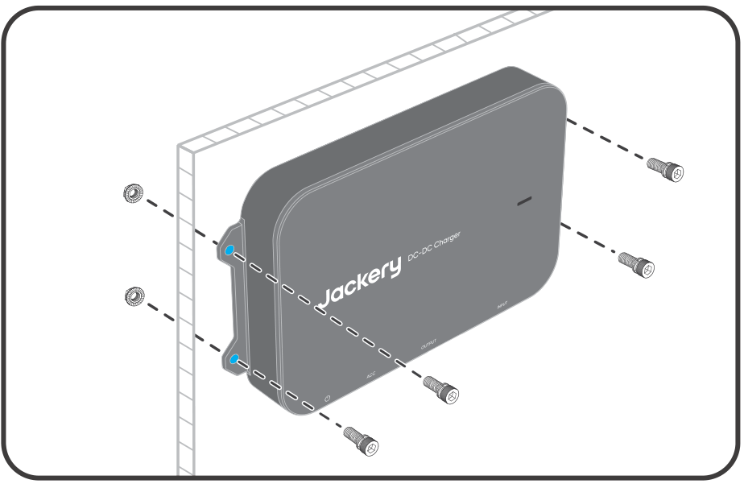

# 1. HAFTUNGSAUSSCHLUSS

Willkommen und vielen Dank, dass Sie sich für den Jackery DC-DC Charger entschieden haben. Dieses Handbuch führt Sie durch die sichere Installation und Verwendung Ihres neuen Produkts. Lesen Sie alle Anweisungen sorgfältig durch, bevor Sie beginnen, und bewahren Sie dieses Handbuch zum späteren Nachschlagen auf. Jackery behält sich das Recht auf die endgültige Auslegung dieses Dokuments und aller zugehörigen Produktdokumente in Übereinstimmung mit gesetzlichen und regulatorischen Anforderungen vor. Bei Aktualisierungen, Überarbeitungen oder einer Einstellung des Produkts beachten Sie bitte die neuesten offiziellen Mitteilungen.

Bitte beachten Sie, dass Folgendes nicht von der Garantie abgedeckt ist:

- Schäden durch Naturereignisse wie Erdbeben, Feuer, Überschwemmungen, Stürme oder Erdrutsche.

- Schäden, die dadurch entstehen, dass das Produkt nicht unter den in diesem Handbuch angegebenen Bedingungen gelagert wird.

- Schäden durch Fahrlässigkeit, unsachgemäße Bedienung, Nichtbeachtung der Anweisungen in diesem Handbuch oder vorsätzlichen Missbrauch.

- Schäden durch unbefugte Demontage des Produkts, Austausch von Teilen oder Änderung des Softwarecodes.

- Schäden durch unsachgemäßen Transport durch den Kunden.

- Schäden oder nachteilige Folgen, die aus Änderungen, Anpassungen oder der Entfernung von Kennzeichnungen entstehen, die nicht den Vorgaben dieses Handbuchs entsprechen.

- Schäden oder nachteilige Auswirkungen, die durch die Verwendung dieses Produkts zur Stromversorgung von tragbaren Powerstations von anderen Marken als Jackery entstehen.

- Personenschäden, Feuer, Geräteausfälle oder andere nachteilige Folgen, die durch die Verwendung dieses Produkts in Bereichen wie Kernenergie, Luftfahrt, Medizin oder anderen sicherheitskritischen Bereichen verursacht werden.

# 2. TECHNISCHE SPEZIFIKATIONEN

## 2. TECHNISCHE SPEZIFIKATIONEN

<figure aria-label="2. TECHNISCHE SPEZIFIKATIONEN" class="hb-spec-table-composition"><table class="hb-spec-table manual-table manual-spec-table"><colgroup><col class="hb-spec-col-label"/><col class="hb-spec-col-value"/></colgroup><tbody><tr><th class="hb-spec-label manual-spec-label" scope="row">Produktname</th><td class="hb-spec-value manual-spec-value">Jackery DC-DC Charger</td></tr><tr><th class="hb-spec-label manual-spec-label" scope="row">Modell</th><td class="hb-spec-value manual-spec-value">JA-AD600A</td></tr><tr><th class="hb-spec-label manual-spec-label" scope="row">DC-Eingang</th><td class="hb-spec-value manual-spec-value">⎓ 11,8 V - 32 V , 60 A</td></tr><tr><th class="hb-spec-label manual-spec-label" scope="row">Ausgangsspannung</th><td class="hb-spec-value manual-spec-value">⎓ 50 V</td></tr><tr><th class="hb-spec-label manual-spec-label" scope="row">Ausgangsstrom</th><td class="hb-spec-value manual-spec-value">12 A max.</td></tr><tr><th class="hb-spec-label manual-spec-label" scope="row">Ausgangsleistung</th><td class="hb-spec-value manual-spec-value">600 W max.</td></tr><tr><th class="hb-spec-label manual-spec-label" scope="row">Betriebstemperatur</th><td class="hb-spec-value manual-spec-value">-20 °C ~ 60 °C</td></tr><tr><th class="hb-spec-label manual-spec-label" scope="row">Betriebsfeuchtigkeit</th><td class="hb-spec-value manual-spec-value">5% ~ 95%</td></tr><tr><th class="hb-spec-label manual-spec-label" scope="row">Lagertemperatur</th><td class="hb-spec-value manual-spec-value">-30 °C ~ 80 °C</td></tr><tr><th class="hb-spec-label manual-spec-label" scope="row">Betriebshöhe</th><td class="hb-spec-value manual-spec-value">≤3000 m</td></tr><tr><th class="hb-spec-label manual-spec-label" scope="row">Schutzart</th><td class="hb-spec-value manual-spec-value">IP40</td></tr><tr><th class="hb-spec-label manual-spec-label" scope="row">Gewicht</th><td class="hb-spec-value manual-spec-value">ca. 1,6 kg</td></tr><tr><th class="hb-spec-label manual-spec-label" scope="row">Abmessungen</th><td class="hb-spec-value manual-spec-value">259×154,5×39,3 mm</td></tr></tbody></table></figure>

# 3. LIEFERUMFANG

<figure aria-label="3. LIEFERUMFANG" class="hb-inbox-composition" data-card-count="9" data-component-id="HB-SPECIAL-INBOX" data-inbox-variant="responsive-card-grid"><ol class="hb-inbox-grid"><li class="hb-inbox-card" data-item-number="1">

A

<strong>Carregador Jackery DC-DC</strong>

</li><li class="hb-inbox-card" data-item-number="2">

B

<strong>6 m Eingangskabel</strong>

Anderson Steckverbinder

</li><li class="hb-inbox-card" data-item-number="3">

C

<strong>Sicherung</strong>

OT-Kabelschuh

</li><li class="hb-inbox-card" data-item-number="4">

D

<strong>1.5 m Ausgangskabel</strong>

Anderson- DC8020Steckverbinder Steckverbinder

</li><li class="hb-inbox-card" data-item-number="5">

E

<strong>6 m ACC-Kabel</strong>

AndersonSteckverbinder

</li><li class="hb-inbox-card" data-item-number="6">

F

<strong>ST5.5Schrauben ×4</strong>

</li><li class="hb-inbox-card" data-item-number="7">

G

<strong>M6Schrauben ×4</strong>

</li><li class="hb-inbox-card" data-item-number="8">

H

<strong>M6Muttern ×4</strong>

</li><li class="hb-inbox-card" data-item-number="9">

I

<strong>Benutzerhandbuch</strong>

</li></ol></figure>

# 4. PRODUKTÜBERSICHT

<figure class="hb-reference-figure hb-base-art-live-copy" data-component-id="HB-SPECIAL-REFERENCE-FIGURE" data-reference-id="product-overview" data-source-fragment-sha256="570e0f53494254d2f6348f8bbfec42ff609be0d4ec4dbcfed19e26c77ecf4f84" data-web-base-art-ref="product_overview_base.png" data-web-presentation-mode="base-art-live-copy" data-web-replace-key="reference.product-overview">

Befestigungs­öffnungStatus­anzeigeEin-/Aus-TasteEingangs­anschlussACC-AnschlussAusgangs­anschluss

</figure>

# 5. WICHTIGE SICHERHEITSHINWEISE

Während des Fahrzeugbetriebs nutzt der Jackery DC-DC Charger die überschüssige Leistung des Generators, um die tragbare Powerstation aufzuladen. Die tatsächliche Ladeleistung hängt von den Fahrbedingungen, dem Fahrzeugmodell und dem allgemeinen Zustand des Fahrzeugs ab.

Für einen sicheren Betrieb sind die folgenden Hinweise unbedingt zu beachten:

- Bewahren Sie dieses Handbuch zum späteren Nachschlagen auf.

- Betreiben oder lagern Sie das Produkt stets unter den in diesem Handbuch angegebenen Bedingungen.

- Lesen Sie alle Anweisungen und Warnhinweise auf diesem Produkt, der Autobatterie und der Jackery Powerstation sowie die jeweiligen Benutzerhandbücher sorgfältig durch.

- Zerlegen Sie das Produkt nicht und tauschen Sie keine Teile ohne Genehmigung aus, da dies zum Erlöschen der Garantie führt und das Produkt beschädigen kann. Wenden Sie sich für den Austausch von Komponenten an den Jackery-Kundendienst.

## Produktkompatibilität

Dieses Produkt ist ausschließlich mit tragbaren Powerstations von Jackery mit DC8020-Eingangsanschluss kompatibel. Die Verwendung von Adaptern, um dieses Produkt an einen DC7909- oder USB-C-Eingangsanschluss einer tragbaren Powerstation anzuschließen, ist strengstens untersagt. Eine solche Verbindung kann zu Geräteschäden, Brand oder sogar Explosion führen und stellt ein ernsthaftes Risiko für die persönliche Sicherheit dar.

- Dieses Produkt ist ausschließlich mit 12V/24V Fahrzeugbatterien kompatibel. Stellen Sie vor der Verwendung des Produkts sicher, dass die Nennspannung Ihres Fahrzeugs 12 V oder 24 V beträgt, und beachten Sie während des Betriebs stets die elektrischen Sicherheitsrichtlinien.

- Dieses Produkt ist mit tragbaren Powerstations von Jackery kompatibel, die über einen DC8020-Eingangsanschluss verfügen. Eine Auswahl kompatibler Modelle finden Sie in der folgenden Tabelle. Für weitere Informationen wenden Sie sich bitte an den Kundendienst oder besuchen Sie die offizielle Jackery-Website.

| Tragbare Powerstation | Kapazität | Ladespannung und -strom | Ladeleistung | Ladezeit(0-100 %) |
|----|----|----|----|----|
| Explorer 1000 Plus 1265 | Wh ca. | 50 V / 8 A ca. | 400 W | ca. 3,5 Stunden |
| Explorer 1000 v2 1070 | Wh ca. | 50 V / 8 A ca. | 400 W | ca. 3,0 Stunden |
| Explorer 2000 Plus 2042 | Wh ca. | 50 V / 12 A | ca. 600 W | ca. 3,7 Stunden |
| Explorer 2000 v2 2042 | Wh ca. | 50 V / 8 A ca. | 400 W | ca. 5,6 Stunden |
| Explorer 3000 Pro 3024 | Wh ca. | 50 V / 12 A | ca. 600 W | ca. 5,5 Stunden |
| Explorer 3000 v2 3072 | Wh ca. | 50 V / 12 A | ca. 600 W | ca. 5,6 Stunden |

Hinweis: Die Ladezeitangaben für dieses Produkt basieren auf simulierten Tests unter konstanten Bedingungen bei 25 °C. Im tatsächlichen Betrieb kann die Ladeleistung je nach Fahrbedingungen, Fahrzeugmodell und allgemeinem Zustand des Fahrzeugs variieren. Die Ladezeiten können zudem durch Änderungen der Umgebungstemperatur beeinflusst werden. Standard-Testbedingungen: Konstant 25 °C Datenquelle: Jackery Labor

Einschalten des Produkts

<ol class="arabic simple">
<li>
Kurz die Ein-/Aus-Taste drücken: Liegt kein ACC-Signal an, kann das Gerät durch kurzes Drücken der Ein-/Aus-Taste eingeschaltet werden.
</li>
<li>
Einschalten über ACC-Signal: Wenn das ACC-Kabel angeschlossen ist, schaltet sich das Gerät automatisch ein, sobald ein ACC-Signal erkannt wird (z. B. nach dem Starten des Fahrzeugs).
</li>
</ol>

Standby und Abschalten

Liegt kein ACC-Signal an oder fällt die Spannung unter den Startschwellwert, wechselt das Produkt in den Standby-Modus. Hält der Standby-Modus länger als 24 Stunden an oder fällt die Spannung unter den Schutzschwellwert, schaltet sich das Gerät automatisch ab. Zum Neustart folgen Sie den oben beschriebenen Schritten. Befindet sich das Gerät im Standby-Modus und liegt kein ACC-Signal an, kann es auch manuell abgeschaltet werden, indem die Ein-/Aus-Taste 3 Sekunden lang gedrückt gehalten wird.

<table class="hb-source-status-table">
<colgroup>
<col style="width: 18.0%"/>
<col style="width: 18.0%"/>
<col style="width: 25.0%"/>
<col style="width: 39.0%"/>
</colgroup>
<thead>
<tr><th class="head">
Statusanzeige
</th>
<th class="head">
Leuchtfarbe
</th>
<th class="head">
Produktstatus
</th>
<th class="head">
Hinweise
</th>
</tr>
</thead>
<tbody>
<tr><td>
Dauerlicht
</td>
<td>
Grün
</td>
<td>
Laden
</td>
<td>
/
</td>
</tr>
<tr><td>
Dauerlicht
</td>
<td>
Rot
</td>
<td>
Störung
</td>
<td>
Wenn Probleme auftreten, wenden Sie sich umgehend an den Jackery-Kundendienst.
</td>
</tr>
<tr><td>
Blinkend
</td>
<td>
Grün
</td>
<td>
Verbindung normal, wartet auf Ladevorgang.
</td>
<td>
Wenn das gleiche Problem nach dem Anschließen der tragbaren Powerstation weiterhin besteht, können folgende Ursachen vorliegen: 1. Instabile Verbindung zwischen Ausgangskabel und der tragbaren Powerstation. 2. Beschädigtes Kabel. 3. Die tragbare Powerstation ist vollständig geladen. Wenn das Problem nach der Fehlerbehebung weiterhin besteht, wenden Sie sich bitte an den Jackery-Kundendienst.
</td>
</tr>
<tr><td>
Kein Licht
</td>
<td>
Keine Farbe
</td>
<td>
Das Produkt ist nicht eingeschaltet.
</td>
<td>
Wenn das Problem nach Abschluss der Verkabelung und dem Starten des Fahrzeugs weiterhin besteht, wenden Sie sich bitte an den Jackery-Kundendienst.
</td>
</tr>
</tbody>
</table>

# 6. FAQ

**F1: Ist für die Installation dieses Produkts eine Fachkraft erforderlich?**

**A:** Um Sicherheit und eine fachgerechte Verkabelung zu gewährleisten, wird empfohlen, die Installation von einer Fachwerkstatt durchführen zu lassen. Laien sollten die Installation nicht selbst durchführen.

**F2: Was sollte bei der monatlichen Wartung des Produkts überprüft werden?**

**A:** 1. Reinigen Sie die Produktoberfläche mit einem trockenen Tuch. Verwenden Sie bei hartnäckigen Verschmutzungen ein verdünntes neutrales Reinigungsmittel. 2. Überprüfen Sie Steckverbinder, Verkabelung, Schrauben und Sicherungen auf Beschädigungen oder Alterungserscheinungen. Wenn Unterstützung erforderlich ist, wenden Sie sich an den Jackery-Kundendienst. 3. Stellen Sie sicher, dass das Produkt sicher installiert ist, und vermeiden Sie direkte Sonneneinstrahlung sowie hohe Umgebungstemperaturen.

**F3: Entlädt dieses Produkt die Fahrzeugbatterie?**

**A:** Um eine übermäßige Entladung der Starterbatterie des Fahrzeugs oder der Bordbatterie eines Wohnmobils zu verhindern, überwacht das Produkt die Spannung an den Batterieklemmen. Fällt die Spannung unter den Startschwellwert, stellt das Produkt den Betrieb automatisch ein. Wenn das Fahrzeug nicht läuft, wechselt das Produkt in den Standby-Modus und schaltet sich nach 24 Stunden automatisch ab.

**F4: Warum funktioniert das Produkt nicht?**

**A:** Some older or specific vehicle models may have a lower system voltage that does not match the product\'s operating voltage. If the product\'s operating voltage is higher than the vehicle\'s system voltage (12 V/24 V) and the product fails to operate after being switched on, please contact Jackery customer service for assistance.

**F5: Erhöht dieses Produkt den Kraftstoffverbrauch?**

**A:** Nein. Das Produkt nutzt die überschüssige Leistung des Generators und arbeitet dadurch effizient, energiesparend und umweltfreundlich.

**F6: Über welche Schutzfunktionen verfügt dieses Produkt?**

**A:** Dieses Produkt verfügt über Überspannungs-, Unterspannungs-, Überstrom-, Überlast-, Kurzschluss- sowie Hoch-/Niedrigtemperaturschutz, um ein sicheres und zuverlässiges Laden zu gewährleisten. Zusätzlich verhindert die intelligente Spannungsüberwachung eine übermäßige Batterieentladung und stellt sicher, dass das Fahrzeug normal gestartet werden kann.

**F7: Warum ist die Ladeleistung instabil?**

**A:** Die Ladeleistung passt sich dynamisch an die Fahr- und Straßenbedingungen des Fahrzeugs an. Dadurch wird die Fahrzeugbatterie geschont und gleichzeitig eine maximale Ladeeffizienz erreicht. Schwankungen der Ladeleistung sind normal.

**F8: Beeinträchtigt das Betriebsgeräusch den Schlaf?**

**A:** Das Produkt ist lüfterlos konstruiert und hat einen Geräuschpegel von unter 40 dB, was den Anforderungen an eine schlafgeeignete Umgebung entspricht.

# 7. PRODUKTINSTALLATION

## 7.1 Installationsdiagramm

<figure class="hb-reference-figure hb-base-art-live-copy" data-component-id="HB-SPECIAL-REFERENCE-FIGURE" data-reference-id="installation-diagram" data-source-fragment-sha256="95c8667e75f8e2daeff13e3894d55566f9968cb3dc356be01a70a290aea63de2" data-web-base-art-ref="installation_diagram_base.png" data-web-presentation-mode="base-art-live-copy" data-web-replace-key="reference.installation-diagram">

Fahrzeug-ACCDC-DC-Ladegerät6 m EingangskabelSicherung1,5 m Ausgangskabel6 m ACC-KabelJackery Tragbare Power Station*Die Verkabelung und Kabelführung sollten entsprechend den tatsächlichen Gegebenheiten des Fahrzeugs erfolgen.

</figure>

## 7.2 Wichtige Sicherheitshinweise

Warning

Befolgen Sie bei der Verwendung dieses Produkts stets die folgenden grundlegenden Vorsichtsmaßnahmen.

- Es wird empfohlen, die Verkabelung von einer Fachkraft durchführen zu lassen.

- Treffen Sie vor der Verkabelung oder dem Anschließen persönliche Schutzmaßnahmen, z. B. durch das Tragen einer Schutzbrille und isolierter Handschuhe, und beachten Sie stets die Sicherheitsrichtlinien für elektrische Arbeiten.

- Schalten Sie das Fahrzeug immer aus, bevor Sie mit elektrischen Arbeiten beginnen.

- Halten Sie das Produkt während der Verwendung trocken.

- Führen Sie keine Fremdkörper in die Anschlüsse des Produkts ein.

- Verwenden Sie das Produkt nicht, wenn die Verkabelung, die Steckverbinder oder das Produkt selbst beschädigt sind.

- Verlegen Sie Kabel nicht in der Nähe hoher Temperaturen, scharfer Gegenstände oder an Stellen, an denen Reibung auftreten kann.

- Sichern Sie die Kabel ordnungsgemäß, um mögliche Probleme durch Verschleiß oder lose Verbindungen zu vermeiden.

- Stellen Sie vor dem Starten des Fahrzeugs und des Produkts sicher, dass die Verkabelung vollständig ist und alle Schrauben und Steckverbinder fest angezogen sind.

- Verwenden Sie dieses Produkt nicht zum Laden beschädigter oder nicht wiederaufladbarer tragbarer Powerstations oder Backup-Batterien.

- Wenn nach dem Starten des Fahrzeugs eine Fehlfunktion des Produkts auftritt, prüfen Sie die Statusanzeige und lesen Sie zur Fehlerbehebung im Handbuch nach.

- Stellen Sie vor dem Einstecken, Abziehen oder Ändern der Verkabelung sicher, dass das Fahrzeug ausgeschaltet, das Produkt ausgeschaltet und die Verbindung getrennt ist.

## 7.3 Im Notfall

- Tragen Sie im Notfall (z. B. bei schweren Aufprallschäden) isolierte Handschuhe und bringen Sie das Produkt in einen offenen Bereich, fern von brennbaren Materialien und Personen. Entsorgen Sie das Produkt gemäß den örtlichen Gesetzen und Vorschriften.

- Wenn das Produkt versehentlich ins Wasser fällt, Regen ausgesetzt wird oder sichtbare Feuchtigkeit auf der Oberfläche aufweist, berühren Sie das Produkt oder das umgebende Wasser nicht direkt. Treffen Sie die erforderlichen Maßnahmen zum Schutz vor Stromschlag und bringen Sie das Produkt an einen sicheren, trockenen und gut belüfteten Ort. Verwenden oder berühren Sie das Produkt erst, wenn es vollständig trocken ist. Wenn Hilfe benötigt wird, wenden Sie sich umgehend an den Jackery Kundendienst.

- Wenn das Produkt in Brand gerät, verwenden Sie die folgenden Löschmethoden in dieser Reihenfolge: Wasser oder Wassernebel, Sand, Löschdecke, Trockenpulver oder einen CO₂-Feuerlöscher.

## 7.4 Vorabprüfungen vor der Installation

1.  Stellen Sie sicher, dass das Fahrzeug vor der Installation ausgeschaltet ist.

2.  Stellen Sie sicher, dass die Systemspannung des Fahrzeugs 12 V oder 24 V beträgt.

3.  Stellen Sie sicher, dass die Ausgangsspannung des Produkts mit der DC-Eingangsspannung der tragbaren Powerstation übereinstimmt.

4.  Ermitteln Sie die Position der Fahrzeugbatterie und stellen Sie sicher, dass ausreichend Platz für die Durchführung des Eingangskabels vorhanden ist.

5.  Wählen Sie eine geeignete Installationsposition. Es wird empfohlen, das Produkt im Kofferraum zu installieren und dabei auf allen Seiten mindestens 20 cm Abstand einzuhalten, um eine Überhitzung bei längerem Betrieb zu vermeiden.

    - Es wird empfohlen, das Produkt auf derselben Seite wie die Batterie zu installieren. Beispiel: Befindet sich die Batterie auf der linken Fahrzeugseite, installieren Sie das Produkt ebenfalls auf der linken Seite.

Das Jackery DC-DC-Ladegerät ist nicht wasserdicht. Um Schäden am Gerät zu vermeiden, installieren Sie es im Fahrzeuginnenraum, um es vor Regen und Warning Feuchtigkeit zu schützen.

6.  Überprüfen Sie die Kabellänge. Das Produkt wird mit einem 6 m langen Eingangskabel geliefert. Stellen Sie sicher, dass diese Länge ausreicht, um von der Fahrzeugbatterie bis zur vorgesehenen Installationsposition des DC-DC-Ladegeräts zu reichen.

7.  Überprüfen Sie die Fahrzeugverkleidungen entlang des Kabelverlaufs. Für eine saubere Kabelführung kann es erforderlich sein, einige Verkleidungsteile zu demontieren und anschließend wieder zu montieren.

8.  Stellen Sie sicher, dass das Produkt vor der Verkabelung und Installation vollständig trocken und unbeschädigt ist.

9.  Bereiten Sie die erforderlichen Werkzeuge vor, darunter einen Kreuzschlitzschraubendreher, einen Innensechskantschlüssel, einen verstellbaren Schraubenschlüssel, ein Werkzeug zum Entfernen von Verkleidungsclips, Kabel, Isolierband, Kabelbinder, Seitenschneider sowie einen Spannungsprüfer.

## 7.5 Verkabelungsschritte

<strong>Vorsichtsmaßnahmen:</strong>

<ul class="simple">
<li>
Stellen Sie sicher, dass alle Kabel fest angeschlossen sind, um Überhitzung oder Kurzschlüsse durch lose Verbindungen zu vermeiden.
</li>
<li>
Achten Sie beim Anschließen des Ringkabelschuhs an die Fahrzeugbatterie auf eine feste Verbindung, um ungewöhnliche Temperaturanstiege zu vermeiden.
</li>
<li>
Stellen Sie sicher, dass das Fahrzeug ausgeschaltet ist.
</li>
</ul>

1

Verbinden Sie den Ringkabelschuh der Sicherung mit dem Pluspol des 6 m langen Eingangskabels (rot) mit einem Drehmoment von 3–4 N·m. Achten Sie auf die korrekte Reihenfolge von Ringkabelschuh, Unterlegscheibe, Federscheibe und Mutter und halten Sie das vorgeschriebene Drehmoment ein. Ein zu geringes Drehmoment kann zu einer lockeren Verbindung und damit zum Schmelzen der Leitungen führen, während ein Drehmoment von über 6 N·m die Sicherung beschädigen kann. Überprüfen Sie während der Installation, dass beide Enden der Sicherungsklemmen① und ② fest angezogen sind. Es wird empfohlen, diese von Hand anzuziehen, bis sie sich nicht weiter drehen lassen. (Bei Verwendung eines elektrischen Schraubendrehers stellen Sie das Drehmoment auf 4 N·m ein.)

<figure class="hb-reference-figure hb-base-art-live-copy" data-component-id="HB-SPECIAL-REFERENCE-FIGURE" data-reference-id="wiring-fuse" data-source-fragment-sha256="0e4882a819fb64554b79b0ad075478480b1140383b9e15c25e6274e8366ecddc" data-web-base-art-ref="file:///Users/pika/Documents/Codex/2026-10-07/kan-x/work/dcdc-eight-source/assets/ja_ad600a_eu_shared/wiring_fuse_base.svg" data-web-presentation-mode="base-art-live-copy" data-web-replace-key="reference.wiring-fuse">

Sicherung3~4 N.m6 m EingangskabelHinweis: Ziehen Sie die Klemmen 1 und 2 mit einem Drehmoment von 3–4 N·m an.UnterlegscheibeFederscheibeMutter

</figure>

2

Verbinden Sie die Ringkabelschuhe des Eingangskabels mit den Plus- und Minuspolen der Fahrzeugbatterie. Stellen Sie sicher, dass das rote Kabel mit dem Pluspol und das schwarze Kabel mit dem Minuspol verbunden ist.

3

Schneiden Sie das nicht konfektionierte Ende des ACC-Kabels ab, legen Sie den Kupferleiter frei und verbinden Sie ihn mit der ACC-Leitung des Fahrzeugs.

※ Beim Anschließen des ACC-Kabels wird empfohlen, vor Beginn der Verkabelung den Fahrzeughersteller zu kontaktieren, falls Sie sich über den Anschlussort oder die Anschlussmethode nicht genau im Klaren sind.

<figure class="hb-reference-figure hb-base-art-live-copy" data-component-id="HB-SPECIAL-REFERENCE-FIGURE" data-reference-id="wiring-acc" data-source-fragment-sha256="e2aff169ecb84e6f7d4536a9b07e6b1501c7fd9afd0496c0a3b07920f96685c3" data-web-base-art-ref="file:///Users/pika/Documents/Codex/2026-10-07/kan-x/work/dcdc-eight-source/assets/ja_ad600a_eu_shared/wiring_acc_base.png" data-web-presentation-mode="base-art-live-copy" data-web-replace-key="reference.wiring-acc">

ACC-KabelFahrzeug-ACC-Kabel

</figure>

## 7.6 Produktinstallation

Überprüfen Sie vor dem Bohren oder Befestigen des DC-DC-Ladegeräts den Bereich hinter der vorgesehenen Montageposition, um Kabelbäume oder andere interne Komponenten nicht zu beschädigen.

Methode 1: Befestigung des Produkts an der Fahrzeugkarosserie.

1

Halten Sie einen Abstand von mindestens 20 cm um das Produkt (oben, unten, links, und rechts) ein.

2

Markieren Sie die Bohrpositionen.

3

Bohren Sie Löcher an den markierten Positionen.

4

Befestigen Sie das Produkt mit selbstschneidenden Schrauben.

Methode 2: Befestigung des Produkts an einer Montageplatte.

1

Markieren Sie die Bohrpositionen auf der Montageplatte.

2

Bohren Sie Löcher an den markierten Positionen.

3

Führen Sie M6-Schrauben durch das Produkt in die Bohrungen ein und ziehen Sie die M6-Muttern fest.

## 7.7 Verbindung des Produkts mit einer tragbaren Powerstation

1.  Verbinden Sie den Anderson-Steckverbinder des Eingangskabels mit dem Eingang des Produkts.

2.  Verbinden Sie den Anderson-Steckverbinder des ACC-Kabels mit dem ACC-Anschluss des Produkts.

3.  Verbinden Sie den Anderson-Steckverbinder des Ausgangskabels mit dem Ausgang des Produkts.

4.  Verbinden Sie den DC8020-Stecker des Ausgangskabels mit der tragbaren Powerstation.

<figure class="hb-reference-figure hb-base-art-live-copy" data-component-id="HB-SPECIAL-REFERENCE-FIGURE" data-reference-id="charger-connection" data-source-fragment-sha256="1e8253772d285d2f7d0dc6c039a7eae2ce0c608605b9bdbf642a5274b01c77ab" data-web-base-art-ref="file:///Users/pika/Documents/Codex/2026-10-07/kan-x/work/dcdc-eight-source/assets/ja_ad600a_eu_shared/connection_base.png" data-web-presentation-mode="base-art-live-copy" data-web-replace-key="reference.charger-connection">

ACC-KabelAusgangskabelEingangskabel mit Sicherung

</figure>

## 7.8 Prüfungen nach der Installation

1.  Überprüfen Sie, ob alle Schrauben im Verkabelungssystem fest angezogen sind.

2.  Überprüfen und sichern Sie alle Kabel, um Verschleiß oder Lockerung durch Fahrzeugbewegungen zu vermeiden.

3.  Stellen Sie vor dem Starten des Fahrzeugs sicher, dass die Verkabelung vollständig ist und sich alle Schrauben und Kabel in einwandfreiem Zustand befinden.

4.  Drücken Sie nach dem Starten des Fahrzeugs kurz die Power-Taste, um das Produkt einzuschalten. Leuchtet die Statusanzeige dauerhaft grün, war die Installation erfolgreich.

## 7.9 Vorsichtsmaßnahmen für den täglichen Gebrauch

- Ziehen Sie beim Trennen des Produkts nicht mit Gewalt an der Verkabelung, um Schäden zu vermeiden. Bei längerer Verwendung kann sich das Außengehäuse des Produkts erwärmen. Vermeiden Sie direkten Kontakt, um Verbrennungen zu vermeiden.

- Prüfen Sie die Verkabelung regelmäßig jeden Monat, um sicherzustellen, dass die OT-Kabelschuhe sicher angeschlossen sind und keine Risse, Abnutzung oder Korrosion an den Kabeln vorhanden sind.

- Reinigen Sie das Produkt mit einem trockenen, weichen Tuch oder Papiertuch. Waschen Sie es nicht direkt mit Wasser ab.

- Achten Sie bei der Verwendung des Produkts darauf, dass in einem Abstand von 20 cm in alle Richtungen keine Gegenstände platziert werden, damit die Wärme keine umliegenden Gegenstände beeinträchtigt.

- Wenn Alterung, Beschädigungen oder andere Probleme am Produkt oder an den Kabeln festgestellt werden, stellen Sie die Verwendung sofort ein und veranlassen Sie eine Reparatur oder einen Austausch.

- Schalten Sie die Stromversorgung aus, wenn das Produkt nicht verwendet wird.

# 8. GARANTIE

Diese Garantie gilt nur für Kunden, die über die offizielle Jackery Website, Jackery-Marken-Drittanbieterplattformen oder lokale autorisierte Händler kaufen.

- Garantiezeit und Details können je nach lokalen Gesetzen, Vorschriften und autorisierten Händlern variieren.

## Eingeschränkte Garantie

Jackery garantiert dem Erstkäufer, dass das Jackery-Produkt bei normaler Nutzung durch den Verbraucher während der geltenden Garantiezeit, die im Abschnitt „Garantiezeit" unten angegeben ist, frei von Verarbeitungs- und Materialfehlern ist, vorbehaltlich der unten aufgeführten Ausschlüsse. Diese Garantieerklärung legt die gesamte und ausschließliche Garantieverpflichtung von Jackery fest. Wir übernehmen keine andere Haftung im Zusammenhang mit dem Verkauf unserer Produkte und ermächtigen auch keine Person, eine solche Haftung in unserem Namen zu übernehmen.

## Garantiezeit

<table class="hb-source-period-table">
<colgroup>
<col style="width: 25.0%"/>
<col style="width: 75.0%"/>
</colgroup>
<tbody>
<tr><td>
<strong>2</strong>

<strong>JAHRE</strong>

Standardgarantie

</td>
<td>
Die Standardgarantiezeit für das Jackery DC-DC-Ladegerät beträgt 24 Monate. Die Garantiezeit beginnt in jedem Fall ab dem Kaufdatum durch den ursprünglichen Verbraucherkäufer. Der Kaufbeleg des ersten Verbraucherkaufs oder ein anderer angemessener dokumentarischer Nachweis ist erforderlich, um das Anfangsdatum der Garantiezeit zu bestimmen.
</td>
</tr>
</tbody>
</table>

## Garantieleistungen

Falls ein Jackery-Produkt während der geltenden Garantiezeit aufgrund eines Verarbeitungs- oder Materialfehlers nicht ordnungsgemäß funktioniert, erbringt Jackery auf eigene Kosten Garantieleistungen gemäß den geltenden lokalen Gesetzen und den regionalen Kundendienstrichtlinien von Jackery. Die Garantieleistungen können die Reparatur, den Ersatz oder den Umtausch des Produkts umfassen. Für jedes reparierte, ersetzte oder umgetauschte Produkt gilt die verbleibende Garantiezeit des ursprünglichen Produkts.

## Beschränkt auf den ursprünglichen Verbraucherkäufer

Die Garantie für das Jackery-Produkt ist auf den ursprünglichen Verbraucherkäufer beschränkt und nicht auf nachfolgende Eigentümer übertragbar.

## Ausschlüsse

Die Garantie von Jackery gilt nicht für:

- Produkte, die missbräuchlich verwendet, zweckentfremdet, verändert, durch einen Unfall beschädigt oder für andere Zwecke als die normale Verbrauchernutzung gemäß der aktuellen Produktliteratur von Jackery verwendet wurden.

- Reparaturversuche durch andere Personen als eine autorisierte Einrichtung.

- Produkte, die über ein Online-Auktionshaus gekauft wurden.

- Die Garantie von Jackery gilt nicht für die Batteriezelle, es sei denn, die Batteriezelle wird von Ihnen innerhalb von sieben Tagen nach dem Kauf des Produkts vollständig aufgeladen und danach mindestens einmal alle 6 Monate.

## Auslegungsrechte

Jackery behält sich das Recht auf die endgültige Auslegung der oben genannten Kundendienst-Richtlinien vor.
