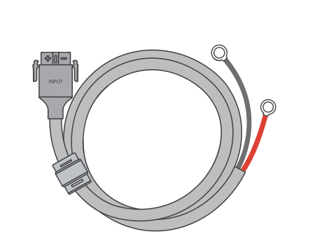
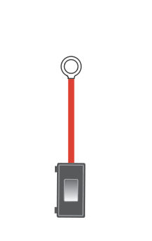
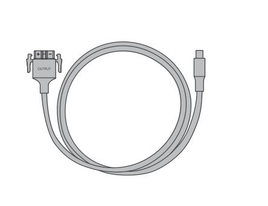
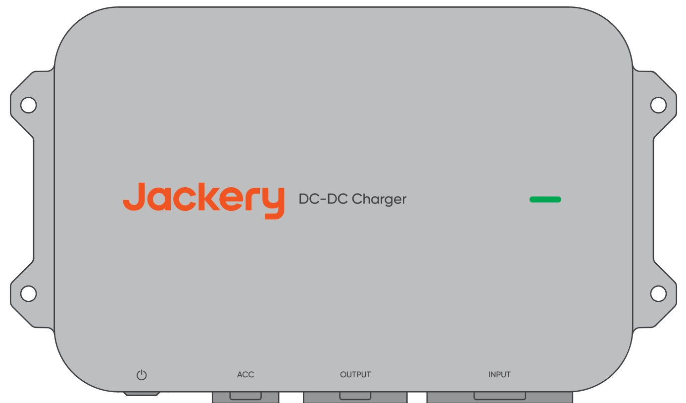
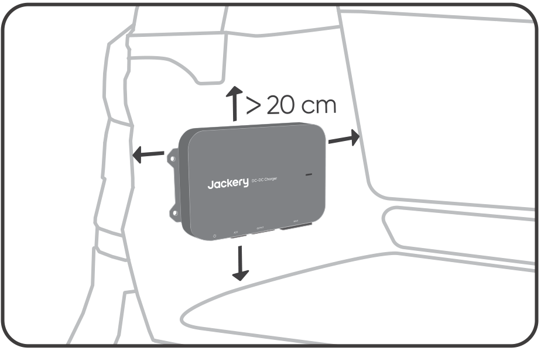
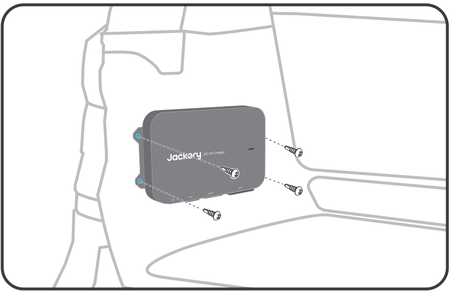
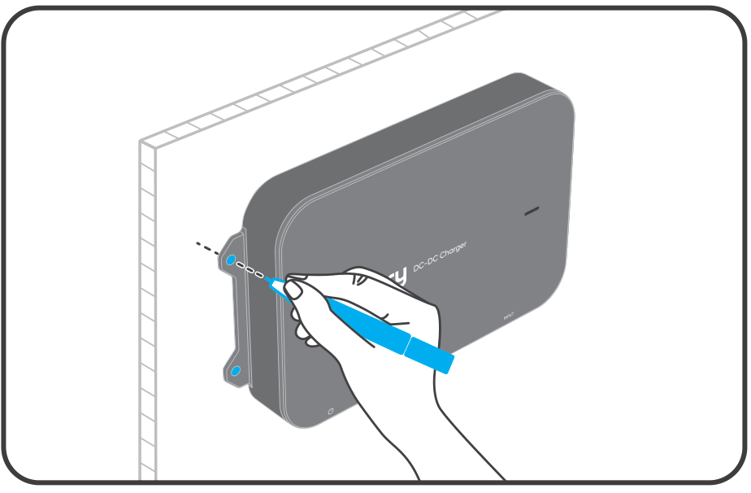

# 1. ESCLUSIONE DI RESPONSABILITÀ

Grazie per aver scelto il Jackery DC-DC Charger. Questo manuale fornisce le istruzioni per installare e utilizzare in sicurezza il nuovo prodotto. Leggere attentamente tutte le istruzioni prima di iniziare e conservare questa guida per consultazioni future. Jackery si riserva il diritto di interpretare in via definitiva il presente documento e tutti i documenti relativi al prodotto in conformità ai requisiti legali e normativi. Per eventuali aggiornamenti, revisioni o cessazioni della produzione o della vendita, fare riferimento agli ultimi annunci ufficiali.

Si noti che quanto segue non è coperto dalla garanzia:

- Danni dovuti a calamità naturali quali terremoti, incendi, inondazioni, tempeste o frane.

- Danni causati dalla conservazione del prodotto in condizioni diverse da quelle specificate nel presente manuale.

- Danni causati da negligenza, uso improprio, mancata osservanza delle istruzioni del manuale o uso intenzionalmente scorretto.

- Danni causati dallo smontaggio non autorizzato del prodotto, dalla sostituzione di parti o dalla modifica del codice software.

- Danni causati da trasporto improprio da parte del cliente.

- Danni o conseguenze negative derivanti da alterazioni, modifiche o rimozione delle etichette in violazione di quanto indicato nel presente manuale.

- Danni o effetti negativi derivanti dall\'uso di questo prodotto per alimentare centrali elettriche portatili di marchi diversi da Jackery.

- Incidenti con lesioni personali, incendi, guasti delle apparecchiature o altre conseguenze negative causati dall\'uso di questo prodotto nei settori dell\'energia nucleare, dell\'aviazione, della medicina o in altri ambiti critici per la sicurezza.

# 2. SPECIFICHE TECNICHE

## 2. SPECIFICHE TECNICHE

<figure aria-label="2. SPECIFICHE TECNICHE" class="hb-spec-table-composition"><table class="hb-spec-table manual-table manual-spec-table"><colgroup><col class="hb-spec-col-label"/><col class="hb-spec-col-value"/></colgroup><tbody><tr><th class="hb-spec-label manual-spec-label" scope="row">Nome del prodotto</th><td class="hb-spec-value manual-spec-value">Jackery DC-DC Charger</td></tr><tr><th class="hb-spec-label manual-spec-label" scope="row">Modello</th><td class="hb-spec-value manual-spec-value">JA-AD600A</td></tr><tr><th class="hb-spec-label manual-spec-label" scope="row">Ingresso CC</th><td class="hb-spec-value manual-spec-value">⎓ 11,8 V-32 V , 60 A</td></tr><tr><th class="hb-spec-label manual-spec-label" scope="row">Tensão de Saída</th><td class="hb-spec-value manual-spec-value">⎓ 50 V</td></tr><tr><th class="hb-spec-label manual-spec-label" scope="row">Corrente di uscita</th><td class="hb-spec-value manual-spec-value">12 A max.</td></tr><tr><th class="hb-spec-label manual-spec-label" scope="row">Potenza di uscita</th><td class="hb-spec-value manual-spec-value">600 W max.</td></tr><tr><th class="hb-spec-label manual-spec-label" scope="row">Temperatura di funzionamento</th><td class="hb-spec-value manual-spec-value">℃ ℃ -20 ~ 60</td></tr><tr><th class="hb-spec-label manual-spec-label" scope="row">Umidità di funzionamento</th><td class="hb-spec-value manual-spec-value">5% ~ 95%</td></tr><tr><th class="hb-spec-label manual-spec-label" scope="row">Temperatura di stoccaggio</th><td class="hb-spec-value manual-spec-value">℃~80 ℃ -30</td></tr><tr><th class="hb-spec-label manual-spec-label" scope="row">Altitudine di funzionamento</th><td class="hb-spec-value manual-spec-value">≤3000m</td></tr><tr><th class="hb-spec-label manual-spec-label" scope="row">Grado di protezione</th><td class="hb-spec-value manual-spec-value">IP40</td></tr><tr><th class="hb-spec-label manual-spec-label" scope="row">Peso</th><td class="hb-spec-value manual-spec-value">Circa 1,6 kg</td></tr><tr><th class="hb-spec-label manual-spec-label" scope="row">Dimensioni</th><td class="hb-spec-value manual-spec-value">259×154,5×39,3 mm</td></tr></tbody></table></figure>

# 3. CONTENUTO DELLA CONFEZIONE

<figure aria-label="3. CONTENUTO DELLA CONFEZIONE" class="hb-inbox-composition" data-card-count="9" data-component-id="HB-SPECIAL-INBOX" data-inbox-variant="responsive-card-grid"><ol class="hb-inbox-grid"><li class="hb-inbox-card" data-item-number="1">

A

<strong>Carregador Jackery DC-DC</strong>

</li><li class="hb-inbox-card" data-item-number="2">

B

<strong>Cavo di ingresso da 6 m</strong>

Connettore Anderson

</li><li class="hb-inbox-card" data-item-number="3">

C

<strong>Fusibile</strong>

Terminale OT

</li><li class="hb-inbox-card" data-item-number="4">

D

<strong>Cavo di uscita da 1,5</strong>

Connettore Connettore Anderson DC8020

</li><li class="hb-inbox-card" data-item-number="5">

E

<strong>m Cavo ACC da 6 m</strong>

Connettore Anderson

</li><li class="hb-inbox-card" data-item-number="6">

F

<strong>Vite ST5,5 ×4</strong>

</li><li class="hb-inbox-card" data-item-number="7">

G

<strong>Bullone M6 ×4</strong>

</li><li class="hb-inbox-card" data-item-number="8">

H

<strong>Dado M6 ×4</strong>

</li><li class="hb-inbox-card" data-item-number="9">

I

<strong>Manuale utente</strong>

</li></ol></figure>

# 4. VISÃO GERAL DO PRODUTO

<figure class="hb-reference-figure hb-base-art-live-copy" data-component-id="HB-SPECIAL-REFERENCE-FIGURE" data-reference-id="product-overview" data-source-fragment-sha256="dc33d6d678f67018c22a1a5c93c0d873de946b4ade9a6287f28cc5f30542ef4b" data-web-base-art-ref="product_overview_base.png" data-web-presentation-mode="base-art-live-copy" data-web-replace-key="reference.product-overview">

Foro di montaggioSpia di statoPulsante di alimentazionePorta di ingressoPorta ACCPorta di uscita

</figure>

# 5. IMPORTANTI ISTRUZIONI DI SICUREZZA

Durante il funzionamento del veicolo, il Jackery DC-DC Charger utilizza la potenza in eccesso del generatore per caricare la centrale elettrica portatile. La potenza di carica effettiva dipende dalle condizioni di guida, dal modello del veicolo e dallo stato generale del veicolo.

Per garantire un funzionamento sicuro, è fondamentale osservare le seguenti linee guida:

- Conservare questo manuale per future consultazioni.

- Utilizzare o conservare sempre il prodotto nelle condizioni specificate nel presente manuale.

- Leggere tutte le istruzioni e le avvertenze relative a questo prodotto, alla batteria dell'auto e alla centrale elettrica portatile Jackery, nonché i rispettivi manuali utente.

- Non smontare il prodotto né sostituirne i componenti senza autorizzazione, poiché ciò invaliderà la garanzia e potrebbe danneggiare il prodotto. Per la sostituzione dei componenti, rivolgersi al servizio clienti Jackery.

## Compatibilità del prodotto

Questo prodotto è compatibile solo con centrali elettriche portatili Jackery dotate di una porta di ingresso DC8020. È severamente vietato utilizzare adattatori per collegare questo prodotto alla porta di ingresso DC7909 o USB-C di una centrale elettrica portatile. Tale collegamento può causare danni al dispositivo, incendi o persino esplosioni, con gravi rischi per la sicurezza personale.

- Questo prodotto è compatibile solo con batterie per auto da 12V/24V. Prima di utilizzare il prodotto, assicurarsi che la tensione nominale del veicolo sia di 12V o 24V e seguire sempre le linee guida di sicurezza elettrica durante l'uso.

- Questo prodotto è compatibile con centrali elettriche portatili Jackery dotate di una porta di ingresso DC8020. Consultare la tabella seguente per alcuni modelli compatibili. Per ulteriori informazioni, contattare il servizio clienti o visitare il sito ufficiale Jackery.

| Centrale elettrica portatile | Capacità corrente | Tensione e di carica | Potenza di carica | Tempo di ricarica (0-100%) |
|----|----|----|----|----|
| Explorer 1000 Plus 1265 | Wh | Circa 50V 8A | Circa 400W | Circa 3,5 ore |
| Explorer 1000 v2 1070 | Wh | Circa 50V 8A | Circa 400W | Circa 3,0 ore |
| Explorer 2000 Plus 2042 | Wh Circa | 50V 12A | Circa 600W | Circa 3,7 ore |
| Explorer 2000 v2 2042 | Wh | Circa 50V 8A | Circa 400W | Circa 3,7 ore |
| Explorer 3000 Pro 3024 | Wh | Circa 50V 8A | Circa 600W | Circa 5,5 ore |
| Explorer 3000 v2 3072 | Wh Circa | 50V 12A | Circa 600W | Circa 5,6 ore |

Nota: I dati relativi al tempo di carica di questo prodotto si basano su test simulati condotti a una temperatura costante di 25°C. Nell'uso effettivo, la potenza di carica può variare in base alle condizioni di guida, al modello del veicolo e al suo stato generale. I tempi di ricarica possono essere influenzati anche da variazioni della temperatura ambiente. Ambiente di prova standard: Costante a 25 °C Fonte dei dati: Jackery Lab

Accensione del prodotto

<ol class="arabic simple">
<li>
Premere brevemente il pulsante di alimentazione: In assenza di segnale ACC, è possibile accendere il dispositivo premendo brevemente il pulsante di alimentazione.
</li>
<li>
Accensione tramite segnale ACC: Se il cavo ACC è collegato, il dispositivo si accende automaticamente quando rileva un segnale ACC in ingresso (ad esempio, dopo l’avvio del veicolo).
</li>
</ol>

Standby e spegnimento

In assenza di segnale ACC in ingresso o se la tensione scende al di sotto della soglia di avvio, il prodotto entra in modalità standby. Se lo standby dura più di 24 ore o la tensione scende sotto la soglia di protezione, il dispositivo si spegnerà automaticamente. Per riavviarlo, seguire gli stessi passaggi descritti sopra. In modalità standby, se non viene rilevato alcun segnale ACC, è possibile spegnere manualmente il dispositivo anche tenendo premuto il pulsante di alimentazione per 3 secondi.

<table class="hb-source-status-table">
<colgroup>
<col style="width: 18.0%"/>
<col style="width: 18.0%"/>
<col style="width: 25.0%"/>
<col style="width: 39.0%"/>
</colgroup>
<thead>
<tr><th class="head">
Stato della spia
</th>
<th class="head">
Colore della spia
</th>
<th class="head">
Stato del prodotto
</th>
<th class="head">
Note
</th>
</tr>
</thead>
<tbody>
<tr><td>
Fisso
</td>
<td>
Verde
</td>
<td>
In carica
</td>
<td>
/
</td>
</tr>
<tr><td>
Fisso
</td>
<td>
Rosso
</td>
<td>
Anomalia
</td>
<td>
Se vengono rilevati problemi, contattare immediatamente il servizio clienti Jackery per assistenza.
</td>
</tr>
<tr><td>
Lampeggiante
</td>
<td>
Verde
</td>
<td>
Connessione normale, in attesa di ricarica.
</td>
<td>
Se lo stesso problema si verifica dopo aver collegato la centrale elettrica portatile, le possibili cause includono: 1. Connessione instabile tra il cavo di uscita e la centrale elettrica portatile. 2. Cavo danneggiato. 3. La centrale elettrica portatile è completamente carica. Se il problema persiste anche dopo aver effettuato la risoluzione dei problemi, contattare l'assistenza clienti di Jackery.
</td>
</tr>
<tr><td>
Nessuna luce
</td>
<td>
Nessun colore
</td>
<td>
Il prodotto è acceso.
</td>
<td>
Se il problema persiste anche dopo aver non completato il cablaggio e avviato il veicolo, contattare il servizio clienti Jackery.
</td>
</tr>
</tbody>
</table>

# 6. Domande frequenti

**D1: L\'installazione di questo prodotto richiede l\'intervento di un professionista?**

**R:** Per garantire la sicurezza e un cablaggio ordinato, si consiglia di far eseguire l'installazione da un'officina specializzata. I non professionisti non devono tentare di installarlo da soli.

**D2: Cosa occorre controllare durante la manutenzione mensile del prodotto?**

**R:** 1. Pulire la superficie del prodotto con un panno asciutto. Per le macchie ostinate, utilizzare un detergente neutro diluito. 2. Controllare che i connettori, i cavi, le viti e i fusibili non presentino danni o segni di usura. Se è necessaria assistenza, contattare il servizio clienti Jackery. 3. Assicurarsi che il prodotto sia installato in modo sicuro ed evitare l\'esposizione alla luce solare diretta e ad ambienti con temperature elevate.

**D3: Questo prodotto scaricherà la batteria del veicolo?**

**R:** Per evitare una scarica eccessiva della batteria di avviamento del veicolo o della batteria di servizio del camper, il prodotto monitora la tensione ai terminali della batteria. Se la tensione scende al di sotto della soglia di avvio, il prodotto interrompe automaticamente il funzionamento. Quando il veicolo non è in funzione, il prodotto entra in modalità standby e si spegne automaticamente dopo 24 ore.

**D4: Perché il prodotto non funziona?**

**R:** Alcuni modelli di veicoli più vecchi o specifici hanno una tensione inferiore, che potrebbe non corrispondere alla tensione operativa del prodotto. Se la tensione è superiore alla tensione di sistema del veicolo (12 V/24 V) e il prodotto non funziona dopo l'accensione, contattare il servizio clienti Jackery per assistenza.

**D5: Questo prodotto aumenta il consumo di carburante?**

**R:** No. Il prodotto utilizza l'energia in eccesso del generatore, risultando efficiente, a risparmio energetico e rispettoso dell\'ambiente.

**D6: Quali funzioni di protezione di sicurezza ha questo prodotto?**

**R:** Questo prodotto include protezioni da sovratensione, sottotensione, sovracorrente, sovraccarico, cortocircuito e temperature elevate/basse per garantire una ricarica sicura e affidabile. Inoltre, la funzione intelligente di rilevamento della tensione previene la scarica eccessiva della batteria, garantendo un avviamento normale del veicolo.

**D7: Perché la potenza di ricarica è instabile?**

**R:** La potenza di ricarica si regola dinamicamente in base alle condizioni di guida del veicolo e dalle condizioni stradali. Ciò contribuisce a proteggere la batteria del veicolo garantendo al contempo la massima efficienza di ricarica. Le fluttuazioni di potenza sono normali.

**D8: Il rumore di funzionamento del prodotto può disturbare il sonno?**

**R:** Il prodotto è progettato senza ventola e il livello di rumorosità è inferiore a 40 dB, conforme agli standard di rumorosità per ambienti di riposo.

# 7. INSTALLAZIONE DEL PRODOTTO

## 7.1 INSTALLAZIONE DEL PRODOTTO

<figure class="hb-reference-figure hb-base-art-live-copy" data-component-id="HB-SPECIAL-REFERENCE-FIGURE" data-reference-id="installation-diagram" data-source-fragment-sha256="de79dd5bed5e35e7271e72c25fea2249a93b38535395e87003b2805eda97ee3a" data-web-base-art-ref="installation_diagram_base.png" data-web-presentation-mode="base-art-live-copy" data-web-replace-key="reference.installation-diagram">

ACC del veicoloDC-DC ChargerCavo di ingresso da 6 mFusibileCavo di uscita da 1,5 mCavo ACC da 6 mCentrale elettrica portatile Jackery* Il cablaggio e la fascettatura dei cavi devono essere eseguiti in base alle condizioni effettive del veicolo.

</figure>

## 7.2 Importanti istruzioni di sicurezza

Warning

Seguire queste precauzioni di sicurezza di base durante l'utilizzo di questo prodotto.

- Si raccomanda di affidare il cablaggio a un professionista.

- Prima di eseguire il cablaggio o il collegamento, adottare misure di protezione personale, ad esempio indossando occhiali di sicurezza e guanti isolanti, e rispettare sempre le indicazioni di sicurezza elettrica.

- Spegnere sempre il veicolo prima di iniziare qualsiasi intervento elettrico.

- Mantenere il prodotto asciutto durante l\'uso.

- Non inserire oggetti estranei nelle porte del prodotto.

- Non utilizzare il prodotto se il cablaggio, i connettori o il prodotto stesso sono danneggiati.

- Evitare di posizionare i cavi vicino a fonti di calore, oggetti taglienti o aree soggette ad attrito.

- Fissare correttamente i cavi per prevenire potenziali problemi causati da usura o collegamenti allentati.

- Prima di avviare il veicolo e il prodotto, verificare che il cablaggio sia completo e che tutte le viti e i connettori siano serrati saldamente.

- Non utilizzare questo prodotto per caricare centrali elettriche portatili danneggiate o non ricaricabili, né batterie di riserva danneggiate o non ricaricabili.

- Se il prodotto presenta anomalie dopo l\'avvio del veicolo, controllare la spia di stato e consultare il manuale per la risoluzione dei problemi.

- Prima di collegare, scollegare o modificare il cablaggio, assicurarsi che il veicolo sia spento, che il prodotto sia spento e il collegamento sia interrotto.

## 7.3 In caso di emergenza

- In caso di emergenza (ad esempio gravi danni da urto), indossare guanti isolanti e spostare il prodotto in un\'area aperta, lontano da materiali infiammabili e persone. Smaltire il prodotto in conformità alle leggi e ai regolamenti locali.

- Se il prodotto cade accidentalmente in acqua, viene esposto alla pioggia o presenta umidità visibile sulla superficie, non toccare direttamente il prodotto né l\'acqua circostante. Adottare le precauzioni necessarie contro le scosse elettriche e spostare il prodotto in un\'area sicura, asciutta e ben ventilata. Non utilizzare né toccare il prodotto finché non è completamente asciutto. Se è necessaria assistenza, contattare immediatamente il servizio clienti Jackery.

- Se il prodotto prende fuoco, utilizzare i seguenti metodi di estinzione nell\'ordine indicato: acqua o acqua nebulizzata, sabbia, coperta antincendio, polvere estinguente a secco o estintore a CO₂.

## 7.4 Controlli preliminari all'installazione

1.  Assicurarsi che il veicolo sia spento prima dell'installazione.

2.  Verificare che la tensione dell\'impianto del veicolo sia 12V o 24V.

3.  Assicurarsi che la tensione di uscita del prodotto corrisponda alla tensione di ingresso CC della centrale elettrica portatile.

4.  Individuare la posizione della batteria del veicolo e assicurarsi che vi sia spazio sufficiente per il passaggio del cavo di ingresso.

5.  Scegliere una posizione di installazione adeguata. Si consiglia di installare il prodotto nel bagagliaio, assicurandosi di avere almeno 20 cm di spazio libero su tutti i lati per evitare il surriscaldamento dovuto a un funzionamento prolungato.

    - Si consiglia di installare il prodotto sullo stesso lato della batteria. Ad esempio, se la batteria si trova sul lato sinistro del veicolo, installare il prodotto sul lato sinistro.

Il Jackery DC-DC charger non è impermeabile. Per evitare danni al dispositivo, installarlo all'interno del veicolo in modo da non esporlo alla pioggia o ad Warning ambienti umidi.

6.  Verificare la lunghezza dei cavi Il prodotto include un cavo di ingresso da 6 metri. Assicurarsi che questa lunghezza sia sufficiente per collegare la batteria del veicolo al punto di installazione previsto per il DC-DC Charger.

7.  Controllare i pannelli del veicolo lungo il percorso del cablaggio. Per garantire una disposizione ordinata del cablaggio, potrebbe essere necessario rimuovere e reinstallare alcuni pannelli del veicolo durante l\'operazione.

8.  Assicurarsi che il prodotto sia completamente asciutto e integro prima di procedere al cablaggio e all'installazione

9.  Preparare gli strumenti necessari, tra cui un cacciavite a croce, una chiave esagonale, una chiave regolabile, uno strumento per la rimozione delle clip dei pannelli, filo, nastro isolante, fascette, tronchesi e un test pen.

## 7.5 Fasi di cablaggio

Precauzioni:

<ul class="simple">
<li>
Assicurarsi che i cavi siano fissati saldamente per evitare temperature elevate o cortocircuiti causati da collegamenti allentati.
</li>
<li>
Quando si collega il terminale OT alla batteria del veicolo, assicurarsi che il collegamento sia sicuro per prevenire aumenti anomali della temperatura.
</li>
<li>
Assicurarsi che il veicolo sia spento.
</li>
</ul>

1

Collegare il terminale OT del fusibile al terminale positivo del cavo di ingresso da 6 m (rosso) con una coppia di 3~4 N·m. Assicurarsi che l'ordine del terminale ad anello, della rondella, della rondella elastica e del dado sia corretto e applicare la coppia richiesta. Una coppia insufficiente può causare un collegamento allentato, con conseguente fusione dei cavi, mentre una coppia superiore a 6 N·m può rompere il fusibile. Durante l’installazione, verificare e assicurarsi che entrambe le estremità dei terminali dei fusibili 1 e 2 siano serrate saldamente. Si raccomanda di serrarle manualmente fino a quando non è più possibile ruotarle. (Se si utilizza un cacciavite elettrico, impostare la coppia a 4 N·m prima del serraggio).

<figure class="hb-reference-figure hb-base-art-live-copy" data-component-id="HB-SPECIAL-REFERENCE-FIGURE" data-reference-id="wiring-fuse" data-source-fragment-sha256="fc2ac49796efd2c7879c3ad2793a7bc070e6d53b2d06155f1b72ab3856a8b5bb" data-web-base-art-ref="file:///Users/pika/Documents/Codex/2026-10-07/kan-x/work/dcdc-release/inbox-wrap-fix/project/data/manual_sources/JA-AD600A/EU/added-locales/native-0924/assets/ja_ad600a_eu_shared/wiring_fuse_base.svg" data-web-presentation-mode="base-art-live-copy" data-web-replace-key="reference.wiring-fuse">

Fusibile3~4 N.mCavo di ingresso da 6 mNota: Serrare i terminali ① e ② con una coppia di 3-4 N·m.RondellaRondella di sicurezzaDado

</figure>

2

Collegare i terminali OT del cavo di ingresso ai terminali positivo e negativo della batteria del veicolo. Assicurarsi che il filo rosso sia collegato al terminale positivo e il filo nero al terminale negativo.

3

Tagliare l’estremità del cavo ACC senza connettore per esporre il filo di rame e collegarlo alla linea ACC del veicolo.

※ Quando si collega il cavo ACC, se non si è certi della posizione del cablaggio o non è chiaro il metodo di collegamento, si consiglia di contattare il produttore del veicolo per una conferma prima di procedere con l’operazione di cablaggio.

<figure class="hb-reference-figure hb-base-art-live-copy" data-component-id="HB-SPECIAL-REFERENCE-FIGURE" data-reference-id="wiring-acc" data-source-fragment-sha256="cf59a5a159e35328e00c2f29839b66308baf10aedf54b0fadd607b88149192be" data-web-base-art-ref="file:///Users/pika/Documents/Codex/2026-10-07/kan-x/work/dcdc-release/inbox-wrap-fix/project/data/manual_sources/JA-AD600A/EU/added-locales/native-0924/assets/ja_ad600a_eu_shared/wiring_acc_base.png" data-web-presentation-mode="base-art-live-copy" data-web-replace-key="reference.wiring-acc">

Cavo ACCCavo ACC del veicolo

</figure>

## 7.6 Cavo ACC del veicolo

Prima di praticare fori o fissare il DC-DC charger, ispezionare l’area dietro il punto di montaggio previsto per evitare di danneggiare eventuali cablaggi o altri componenti interni.

Metodo 1: Fissare il prodotto alla carrozzeria del veicolo.

1

Mantenere uno spazio libero di almeno 20 cm intorno al prodotto (in alto, in basso, a sinistra e a destra).

2

Segnare i punti di foratura.

3

Praticare i fori nei punti segnati.

4

Fissare il prodotto con viti autofilettanti.

Metodo 2: Fissare il prodotto a un pannello di modifica.

1

Segnare i punti di foratura sul pannello di modifica.

2

Praticare i fori nei punti segnati.

3

Inserire i bulloni M6 attraverso il prodotto e nei fori, quindi serrare i dadi M6.

## 7.7 Collegamento del prodotto a una centrale elettrica portatile

1.  Collegare il connettore Anderson del cavo di ingresso alla porta di ingresso del prodotto.

2.  Collegare il connettore Anderson del cavo ACC alla porta ACC del prodotto.

3.  Collegare il connettore Anderson del cavo di uscita alla porta di uscita del prodotto.

4.  Collegare il connettore DC8020 del cavo di uscita alla centrale elettrica portatile.

<figure class="hb-reference-figure hb-base-art-live-copy" data-component-id="HB-SPECIAL-REFERENCE-FIGURE" data-reference-id="charger-connection" data-source-fragment-sha256="88d5ed9cbd345068c91fdd413ca3ab5a8b7badb08e1a74da995d3c4e9196fc41" data-web-base-art-ref="file:///Users/pika/Documents/Codex/2026-10-07/kan-x/work/dcdc-release/inbox-wrap-fix/project/data/manual_sources/JA-AD600A/EU/added-locales/native-0924/assets/ja_ad600a_eu_shared/connection_base.png" data-web-presentation-mode="base-art-live-copy" data-web-replace-key="reference.charger-connection">

Cavo ACCCavo di uscitaCavo di ingresso con fusibile

</figure>

## 7.8 Verifiche dopo l'installazione

1.  Verificare che tutte le viti nel sistema di cablaggio siano serrate saldamente.

2.  Ispezionare e fissare tutti i cablaggi per evitare usura o allentamenti causati dal movimento del veicolo.

3.  Prima di avviare il veicolo, assicurarsi che tutto il cablaggio sia completo e che viti e cavi siano in buone condizioni.

4.  Dopo aver avviato il veicolo, premere brevemente il pulsante di accensione per accendere il prodotto. Se la spia luminosa diventa verde fissa, l'installazione è riuscita.

## 7.9 Precauzioni per l\'uso quotidiano

- Non tirare con forza il cablaggio quando si scollega il prodotto, per evitare danni. L\'uso prolungato del prodotto può causare il riscaldamento dell\'involucro esterno. Evitare il contatto diretto per evitare ustioni.

- Controllare regolarmente il cablaggio ogni mese per verificare che i terminali OT siano collegati saldamente e che i cavi non presentino crepe, usura o corrosione.

- Utilizzare un panno asciutto e morbido o un fazzoletto per pulire il prodotto. Non lavarlo direttamente con acqua.

- Durante l\'uso del prodotto, assicurarsi che non vi siano oggetti nel raggio di 20 cm in qualsiasi direzione, per evitare che il calore influisca sugli elementi circostanti.

- Se si riscontrano segni di usura, danni o altri problemi sul prodotto o sui cavi, interrompere immediatamente l\'uso e richiedere una riparazione o una sostituzione.

- Spegnere il prodotto quando non è in uso.

# 8. GARANZIA

La presente garanzia si applica solo ai clienti che acquistano dal sito Web ufficiale Jackery, da piattaforme di terze parti a marchio Jackery o da rivenditori locali autorizzati.

- Il periodo e i dettagli della garanzia possono variare in base alle leggi locali, ai regolamenti e ai rivenditori autorizzati.

## Garanzia limitata

Jackery garantisce all\'acquirente consumatore originario che il prodotto Jackery sarà privo di difetti di fabbricazione e di materiale durante il normale uso da parte del consumatore per il periodo di garanzia applicabile indicato nella sezione \"Periodo di garanzia\" di seguito, fatti salvi i casi di esclusione indicati di seguito. La presente dichiarazione di garanzia stabilisce l\'intero ed esclusivo obbligo di garanzia di Jackery. Non ci assumeremo, né autorizzeremo alcuna persona ad assumere per nostro conto, qualsiasi altra responsabilità in relazione alla vendita dei nostri prodotti.

## Periodo di garanzia

<table class="hb-source-period-table">
<colgroup>
<col style="width: 25.0%"/>
<col style="width: 75.0%"/>
</colgroup>
<tbody>
<tr><td>
<strong>2</strong>

<strong>ANNI</strong>

Garanzia standard

</td>
<td>
Il periodo di garanzia standard per Jackery DC-DC Charger è di 24 mesi. In ogni caso, il periodo di garanzia decorre dalla data di acquisto da parte dell'acquirente consumatore originale. Per stabilire la data di inizio del periodo di garanzia è necessaria la ricevuta di vendita del primo acquirente consumatore, o altra prova documentale ragionevole.
</td>
</tr>
</tbody>
</table>

## Servizio di assistenza in garanzia

Se un prodotto Jackery presenta un malfunzionamento durante il periodo di garanzia previsto a causa di difetti di fabbricazione o dei materiali, Jackery fornirà l'assistenza in garanzia a proprie spese, in conformità alle leggi locali vigenti e alla politica regionale di assistenza post-vendita di Jackery. L'assistenza in garanzia può includere la riparazione o la sostituzione del prodotto. Qualsiasi prodotto riparato o sostituito sarà coperto per il restante periodo della garanzia originale.

## Limitata all\'acquirente consumatore originale

La garanzia sul prodotto Jackery è limitata all\'acquirente consumatore originale e non è trasferibile ad alcun proprietario successivo.

## Esclusioni

La garanzia Jackery non si applica a:

- Qualsiasi prodotto che sia stato usato in modo improprio, abusato, modificato, danneggiato accidentalmente o utilizzato per qualsiasi scopo diverso dal normale uso da parte del consumatore previsto dalla documentazione di prodotto Jackery vigente.

- Tentativi di riparazione da parte di soggetti diversi da una struttura autorizzata.

- Qualsiasi prodotto acquistato tramite una casa d\'aste online.

- La garanzia Jackery non si applica alla cella della batteria, a meno che la cella della batteria non venga caricata completamente dall\'utente entro sette giorni dall\'acquisto del prodotto e almeno una volta ogni 6 mesi successivamente.

## Diritti di interpretazione

Jackery si riserva il diritto di interpretazione finale della politica post-vendita sopra riportata.
