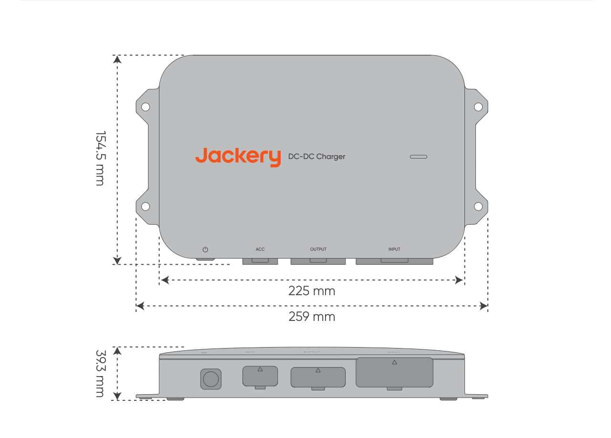
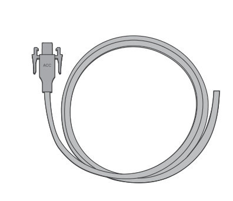
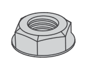
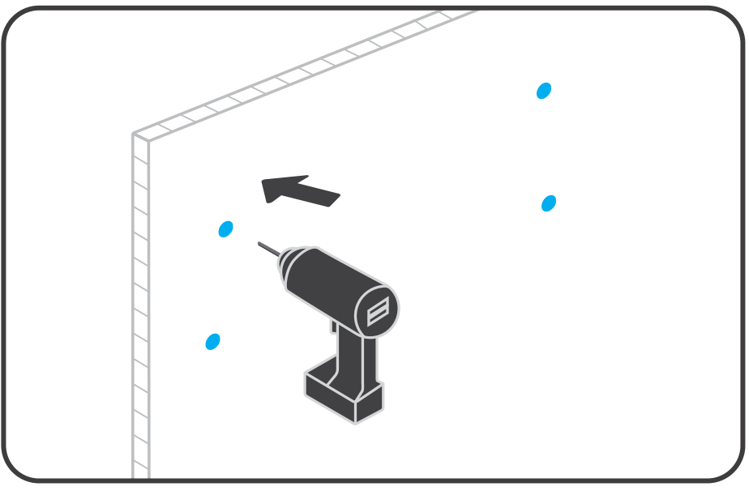

# 1. AVISO LEGAL

Obrigado por adquirir o carregador Jackery DC-DC (doravante denominado \"produto\"). Antes de utilizá-lo, leia atentamente este guia do usuário, siga as instruções para um uso adequado e guarde-o em local seguro. A Jackery detém o direito de interpretação final deste documento e de todos os documentos relacionados ao produto, em conformidade com os requisitos legais e regulatórios. Para atualizações, revisões ou descontinuações, consulte os anúncios oficiais mais recentes.

As seguintes condições não são cobertas pela garantia

- Danos causados por eventos de força maior, como terremotos, incêndios, tempestades, inundações ou deslizamentos de terra.

- Danos causados pelo não armazenamento do produto nas condições especificadas neste manual.

- Danos causados por negligência, operação inadequada, falha em seguir as instruções do manual ou uso indevido intencional.

- Danos causados pelo desmonte não autorizado do produto, substituição de peças ou modificação do software.

- Danos decorrentes do transporte inadequado realizado pelo cliente.

- Danos ou consequências adversas resultantes de ajustes, modificações ou remoção de etiquetas em desacordo com este manual.

- Danos ou efeitos adversos decorrentes do uso deste produto para alimentar estações de energia portáteis que não sejam da Jackery.

- Casos de lesões pessoais, incêndios, falhas de equipamento ou outras consequências adversas resultantes do uso deste produto em energia atômica, aviação, medicina ou outros setores críticos para a segurança.

# 2. ESPECIFICAÇÕES TÉCNICAS

## 2. ESPECIFICAÇÕES TÉCNICAS

<figure aria-label="2. ESPECIFICAÇÕES TÉCNICAS" class="hb-spec-table-composition"><table class="hb-spec-table manual-table manual-spec-table"><colgroup><col class="hb-spec-col-label"/><col class="hb-spec-col-value"/></colgroup><tbody><tr><th class="hb-spec-label manual-spec-label" scope="row">Nome do Produto</th><td class="hb-spec-value manual-spec-value">Jackery DC-DC Charger</td></tr><tr><th class="hb-spec-label manual-spec-label" scope="row">Modelo</th><td class="hb-spec-value manual-spec-value">JA-AD600A</td></tr><tr><th class="hb-spec-label manual-spec-label" scope="row">Entrada CC</th><td class="hb-spec-value manual-spec-value">⎓ 11.8V-32V , 60A</td></tr><tr><th class="hb-spec-label manual-spec-label" scope="row">Tensão de Saída</th><td class="hb-spec-value manual-spec-value">⎓ 50V</td></tr><tr><th class="hb-spec-label manual-spec-label" scope="row">Corrente de Saída</th><td class="hb-spec-value manual-spec-value">12A Máx.</td></tr><tr><th class="hb-spec-label manual-spec-label" scope="row">Potência de saída</th><td class="hb-spec-value manual-spec-value">600W Máx.</td></tr><tr><th class="hb-spec-label manual-spec-label" scope="row">Temperatura de Operação</th><td class="hb-spec-value manual-spec-value">-20℃~60℃</td></tr><tr><th class="hb-spec-label manual-spec-label" scope="row">Umidade de Operação</th><td class="hb-spec-value manual-spec-value">5%~95%</td></tr><tr><th class="hb-spec-label manual-spec-label" scope="row">Temperatura de Armazenamento</th><td class="hb-spec-value manual-spec-value">-30℃~80℃</td></tr><tr><th class="hb-spec-label manual-spec-label" scope="row">Altitude de Operação</th><td class="hb-spec-value manual-spec-value">≤3000m</td></tr><tr><th class="hb-spec-label manual-spec-label" scope="row">Grau de Proteção</th><td class="hb-spec-value manual-spec-value">IP40</td></tr><tr><th class="hb-spec-label manual-spec-label" scope="row">Peso</th><td class="hb-spec-value manual-spec-value">Aproximadamente 1,6 kg</td></tr><tr><th class="hb-spec-label manual-spec-label" scope="row">Dimensões</th><td class="hb-spec-value manual-spec-value">259×154,5×39,3 mm</td></tr></tbody></table></figure>

# 3. CONTEÚDO DA CAIXA

<figure aria-label="3. CONTEÚDO DA CAIXA" class="hb-inbox-composition" data-card-count="9" data-component-id="HB-SPECIAL-INBOX" data-inbox-variant="responsive-card-grid"><ol class="hb-inbox-grid"><li class="hb-inbox-card" data-item-number="1">

A

<strong>Carregador Jackery DC-DC</strong>

</li><li class="hb-inbox-card" data-item-number="2">

B

<strong>Cabo de entrada de 6m</strong>

Conector Anderson

</li><li class="hb-inbox-card" data-item-number="3">

C

<strong>Fusível</strong>

Terminal OT

</li><li class="hb-inbox-card" data-item-number="4">

D

<strong>Cabo de saída de</strong>

Conector Conector Anderson DC8020

</li><li class="hb-inbox-card" data-item-number="5">

E

<strong>1,5m Cabo ACC de 6m</strong>

Conector Anderson

</li><li class="hb-inbox-card" data-item-number="6">

F

<strong>Parafuso ST5,5 ×4</strong>

</li><li class="hb-inbox-card" data-item-number="7">

G

<strong>Parafuso M6 ×4</strong>

</li><li class="hb-inbox-card" data-item-number="8">

H

<strong>Porca M6 ×4</strong>

</li><li class="hb-inbox-card" data-item-number="9">

I

<strong>Guia do Usuário</strong>

</li></ol></figure>

# 4. VISÃO GERAL DO PRODUTO

<figure class="hb-reference-figure hb-base-art-live-copy" data-component-id="HB-SPECIAL-REFERENCE-FIGURE" data-reference-id="product-overview" data-source-fragment-sha256="0a178b58ce8d0e01849d1d256dbe202362f398e39b439d091324b1b9ec60a3dd" data-web-base-art-ref="product_overview_base.png" data-web-presentation-mode="base-art-live-copy" data-web-replace-key="reference.product-overview">

Orifício de MontagemLuz indicadora de StatusBotão de energiaPorta de EntradaPorta ACCPorta de Saída

</figure>

# 5. INSTRUÇÕES DE SEGURANÇA IMPORTANTES

Durante a operação do veículo, o carregador DC-DC utiliza a energia excedente do gerador para carregar a estação de energia portátil. A potência de carregamento real depende das condições de condução, do modelo e do estado geral do veículo.

Para garantir uma operação segura, é fundamental observar o seguinte:

- Guarde este manual para referência futura.

- Sempre utilize ou armazene o produto conforme as condições especificadas neste manual.

- Leia todas as instruções e advertências deste produto, da bateria do carro e da estação de energia Jackery, bem como seus respectivos manuais do usuário.

- Não desmonte o produto nem substitua suas peças sem autorização, pois isso anulará a garantia e poderá danificá-lo. Para substituição de componentes, entre em contato com o suporte ao cliente da Jackery.

## Compatibilidade do Produto

Este produto é compatível apenas com estações de energia portáteis da Jackery que possuem porta de entrada DC8020. É estritamente proibido o uso de adaptadores para conectar este produto a uma porta de entrada DC7909 ou USB-C de uma estação de energia portátil. Essa conexão pode causar danos ao dispositivo, incêndio ou até mesmo explosão, representando sérios riscos à segurança pessoal.

- Este produto é compatível apenas com baterias de carro de 12V/24V. Antes de utilizá-lo, verifique se a voltagem nominal do seu veículo é 12V ou 24V e siga sempre as diretrizes de segurança elétrica durante o uso.

- Este produto é compatível com estações de energia portáteis Jackery equipadas com porta de entrada DC8020. Consulte a tabela abaixo para ver alguns modelos compatíveis. Para mais informações, entre em contato com o suporte ao cliente ou acesse o site oficial da Jackery.

| Estação de Energia Portátil | Capacidade Tensão de | e Corrente Carregamento | Potência de Tempo Carregamento | de Carregamento (0-100%) |
|----|----|----|----|----|
| Explorer 1000 Plus 1265 | Wh | Aproximadamen te: 50V 8A | Aproximadament e 400W | Aproximadame nte 3,5 horas |
| Explorer 1000 v2 1070 | Wh | Aproximadamen te: 50V 8A | Aproximadamente 400W | Aproximadame nte 3,0 horas |
| Explorer 2000 Plus 2042 | Wh te: | Aproximadamen 50V 12A | Aproximadamente 600W | Aproximadame nte 3,7 horas |
| Explorer 2000 v2 2042 | Wh | Aproximadam ente: 50V 8A | Aproximadament e 400W | Aproximadamen te 5,6 horas |
| Explorer 3000 Pro 3024 | Wh nte: | Aproximadame 50V 12A | Aproximadament e 600W | Aproximadame nte 5,5 horas |
| Explorer 3000 v2 3072 | Wh ente: | Aproximadam 50V 12A | Aproximadam ente 600W | Aproximadame nte 5,6 horas |

Observação: Os dados de tempo de carregamento deste produto são baseados em testes simulados realizados a uma temperatura constante de 25°C. Na prática, a potência de carregamento pode variar de acordo com as condições de condução, o modelo do veículo e seu estado geral. O tempo de carregamento também pode ser afetado por variações na temperatura ambiente. Ambiente de Teste Padrão: 25°C constant Fonte dos dados: Laboratório Jackery

Ligar o produto

<ol class="arabic simple">
<li>
Pressione brevemente o botão de energia: na ausência de sinal ACC, você pode ligar o dispositivo pressionando brevemente o botão de energia.
</li>
<li>
Ligação por sinal ACC: se o fio ACC estiver conectado, o dispositivo será ligado automaticamente quando detectar um sinal ACC (por exemplo, após o veículo ser ligado).
</li>
</ol>

Modo de espera e desligamento

Quando não houver sinal ACC ou a tensão cair abaixo do limite de inicialização, o produto entrará em modo de espera. Se o modo de espera durar mais de 24 horas ou se a tensão ficar abaixo do limite de proteção, o dispositivo será desligado automaticamente. Para reiniciá-lo, siga os mesmos passos descritos acima. Enquanto estiver em modo de espera, se não houver sinal ACC, você também pode desligar manualmente o dispositivo pressionando e segurando o botão de energia por 3 segundos.

<table class="hb-source-status-table">
<colgroup>
<col style="width: 18.0%"/>
<col style="width: 18.0%"/>
<col style="width: 25.0%"/>
<col style="width: 39.0%"/>
</colgroup>
<thead>
<tr><th class="head">
Status da Luz
</th>
<th class="head">
Cor da Luz
</th>
<th class="head">
Status do Produto
</th>
<th class="head">
Observações
</th>
</tr>
</thead>
<tbody>
<tr><td>
Sólido
</td>
<td>
Verde
</td>
<td>
Carregamento
</td>
<td>
/
</td>
</tr>
<tr><td>
Sólido
</td>
<td>
Vermelho
</td>
<td>
Anormal
</td>
<td>
Se qualquer problema for detectado, entre em contato imediatamente com o suporte ao cliente da Jackery para obter assistência.
</td>
</tr>
<tr><td>
Piscando
</td>
<td>
Verde
</td>
<td>
Conexão normal, aguardando carregamento.
</td>
<td>
Se o mesmo problema ocorrer após conectar a estação de energia portátil, as possíveis causas incluem: 1. Conexão instável entre o cabo de saída e a estação de energia portátil. 2. Cabo danificado. 3. A estação de energia portátil está completamente carregada. Se o problema persistir após a solução de problemas, entre em contato com o suporte ao cliente da Jackery.
</td>
</tr>
<tr><td>
Sem luz
</td>
<td>
Sem cor
</td>
<td>
O produto não está ligado.
</td>
<td>
Se o problema continuar após a conclusão da fiação e a partida do veículo, entre em contato com o suporte ao cliente da Jackery.
</td>
</tr>
</tbody>
</table>

# 6. PERGUNTAS FREQUENTES

**A instalação deste produto requer um profissional?**

**R:** Para garantir a segurança e uma fiação organizada, recomenda-se que a instalação seja realizada por uma oficina especializada. Pessoas sem experiência profissional não devem tentar instalá-lo por conta própria.

**P2: O que deve ser verificado durante a manutenção mensal do produto?**

**R:** 1. Limpe a superfície do produto com um pano seco. Para manchas difíceis, use um detergente neutro diluído. 2. Verifique os conectores, a fiação, os parafusos e os fusíveis para identificar possíveis danos ou sinais de envelhecimento. Se precisar de assistência, entre em contato com o suporte ao cliente da Jackery. 3. Certifique-se de que o produto está devidamente instalado e evite exposição direta à luz solar e a ambientes de alta temperatura.

**P3: Este produto descarrega a bateria do veículo?**

**R:** Para evitar a descarga excessiva da bateria de partida do veículo ou da bateria interna do RV, o produto monitora a voltagem nos terminais da bateria. Se a voltagem cair abaixo do limite de partida, o produto interromperá seu funcionamento automaticamente. Quando o veículo não estiver funcionando, o produto entrará em modo de espera e será desligado automaticamente após 24 horas.

**P4: Por que o produto não está funcionando?**

**R:** Alguns modelos de veículos mais antigos ou específicos possuem voltagem mais baixa, o que pode não ser compatível com a voltagem de operação do produto. Se a voltagem for superior à do sistema do veículo (12V/24V) e o produto não funcionar após ser ligado, entre em contato com o atendimento ao cliente da Jackery para obter assistência.

**P5: Este produto aumentará o consumo de combustível?**

**R:** Não. O produto utiliza o excesso de energia do gerador, tornando-o eficiente, econômico e ecologicamente sustentável.

**P6: Quais recursos de proteção de segurança este produto possui?**

**R:** Este produto conta com proteção contra sobretensão, subtensão, sobrecorrente, sobrecarga, curto-circuito e temperaturas altas/baixas para garantir um carregamento seguro e confiável. Além disso, a função inteligente de detecção de voltagem evita a descarga excessiva da bateria, assegurando a partida normal do veículo.

**P7: Por que a potência de carregamento está instável?**

**R:** A potência de carregamento se ajusta dinamicamente de acordo com as condições de condução do veículo e as condições da estrada. Isso ajuda a proteger a bateria do veículo e, ao mesmo tempo, garante a máxima eficiência de carregamento. Variações na potência são normais.

**P8: O ruído de operação do produto afetará o sono?**

**R:** O produto foi projetado sem ventilador e seu nível de ruído é inferior a 40 dB, atendendo aos padrões de ruído para ambientes de descanso.

# 7. INSTALAÇÃO DO PRODUTO

## 7.1 Diagrama da instalação

<figure class="hb-reference-figure hb-base-art-live-copy" data-component-id="HB-SPECIAL-REFERENCE-FIGURE" data-reference-id="installation-diagram" data-source-fragment-sha256="7919ec86eaabd1fdce8b4f4a978b9ec0100ce23b5146edc696483a4493ff4b42" data-web-base-art-ref="installation_diagram_base.png" data-web-presentation-mode="base-art-live-copy" data-web-replace-key="reference.installation-diagram">

ACC do veículoCarregador DC-DCCabo de entrada de 6mFusívelCabo de saída de 1,5mCabo ACC de 6mEstação de energia portátil da Jackery* A fiação e a fixação dos cabos devem ser feitas conforme as condições reais do veículo.

</figure>

## 7.2 Instruções importantes de segurança

siga estas precauções básicas de segurança ao utilizar este produto. Aviso

- Recomenda-se que a instalação seja realizada por um profissional.

- Antes de realizar a fiação ou conexão, tome medidas de proteção pessoal, como o uso de óculos de segurança e luvas isolantes, e sempre siga as diretrizes de segurança elétrica.

- Sempre desligue o veículo antes de iniciar qualquer trabalho elétrico.

- Mantenha o produto seco durante o uso.

- Não insira objetos estranhos nas portas do produto.

- Não utilize o produto se a fiação, os conectores ou o próprio produto estiverem danificados.

- Evite posicionar os fios próximos a altas temperaturas, objetos cortantes ou áreas sujeitas a atrito.

- Fixe os fios corretamente para evitar problemas causados por desgaste ou conexões soltas.

- Antes de ligar o veículo e o produto, certifique-se de que a fiação está completa e que todos os parafusos e conectores estão bem apertados.

- Não utilize este produto para carregar estações de energia portáteis ou baterias de backup danificadas ou não recarregáveis.

- Se o produto apresentar falhas após ligar o veículo, verifique a luz indicadora de status e consulte o manual para solucionar o problema.

- Antes de conectar, desconectar ou modificar a fiação, confira se o veículo, o produto e a conexão estão desligados.

## 7.3 Em caso de emergência

- Em caso de emergência (como danos causados por um impacto severo), use luvas isolantes e mova o produto para uma área aberta, longe de materiais inflamáveis e pessoas. Descarte o produto de acordo com as leis e regulamentações locais.

- Se o produto cair acidentalmente na água, for exposto à chuva ou apresentar umidade visível na superfície, não toque diretamente no produto nem na água ao redor. Tome as precauções necessárias contra choques elétricos e mova o produto para uma área segura, seca e bem ventilada. Não use nem toque no produto até que esteja completamente seco. Se precisar de assistência, entre em contato imediatamente com o suporte da Jackery.

- Se o produto pegar fogo, utilize os seguintes métodos de extinção nesta ordem: água ou névoa, CO₂. areia, manta contra fogo, pó químico seco ou um extintor de

## 7.4 Verificações pré-instalação

1.  Certifique-se de que o veículo está desligado antes da instalação.

2.  Confirme que a voltagem do sistema do veículo é 12V ou 24V.

3.  Verifique se a voltagem de saída do produto corresponde à voltagem de entrada DC da estação de energia portátil.

4.  Identifique a localização da bateria do veículo e garanta espaço suficiente para a passagem do cabo de entrada.

5.  Escolha uma posição adequada para a instalação. Recomenda-se instalar o produto no porta-malas, garantindo pelo menos 20 cm de espaço livre em todos os lados para evitar superaquecimento devido ao uso prolongado. \* Recomenda-se instalar o produto no mesmo lado da bateria. Por exemplo, se a bateria estiver no lado esquerdo do veículo, instale o produto no lado esquerdo.

O carregador DC-DC Jackery não é à prova d'água. Para evitar danos ao dispositivo, instale-o dentro do veículo para evitar a exposição à chuva ou Aviso ambientes úmidos.

6.  Verifique o comprimento dos fios. O produto inclui um cabo de entrada de 6 metros. • Confirme se esse comprimento é suficiente para alcançar a bateria do veículo a partir do local escolhido para a instalação do carregador DC-DC.

7.  Verifique os painéis do veículo ao longo do percurso da fiação. Para manter uma disposição organizada dos fios, pode ser necessário remover e reinstalar alguns painéis do veículo durante o processo.

8.  Certifique-se de que o produto está completamente seco e sem danos antes de iniciar a fiação e a instalação.

9.  Separe as ferramentas necessárias, incluindo chave Phillips, chave sextavada, chave ajustável, ferramenta para remoção de presilhas de painel, fios, fita isolante, braçadeiras plásticas, alicate de corte e caneta de teste.

## 7.5 Etapas da fiação

Precauções:

<ul class="simple">
<li>
Certifique-se de que os fios estão devidamente fixados para evitar altas temperaturas ou curtos-circuitos causados por conexões soltas.
</li>
<li>
Ao conectar o terminal OT à bateria do veículo, garanta uma conexão segura para evitar aumentos anormais de temperatura.
</li>
<li>
Certifique-se de que o veículo está desligado.
</li>
</ul>

1

Conecte o terminal OT do fusível ao terminal positivo do cabo de entrada de 6 m (vermelho) com um torque de 3~4 N·m. Verifique a ordem correta do terminal redondo, arruela, arruela de travamento e porca, aplicando o torque necessário. Torque insuficiente pode resultar em uma conexão frouxa, causando o derretimento do fio, enquanto um torque superior a 6 N·m pode romper o fusível. Durante a instalação, verifique e assegure-se de que ambas as extremidades dos terminais do fusível ① e ② estejam bem apertadas. Recomenda-se apertá-los manualmente até que não possam mais ser girados. (Se estiver usando uma chave de fenda elétrica, o torque deve ser ajustado para 4 N·m antes do aperto.)

<figure class="hb-reference-figure hb-base-art-live-copy" data-component-id="HB-SPECIAL-REFERENCE-FIGURE" data-reference-id="wiring-fuse" data-source-fragment-sha256="bf77e8db54da0ddcb6ea44d0310b7286c8cc0b3798cc27f72c2f924208bff1a4" data-web-base-art-ref="file:///Users/pika/Documents/Codex/2026-10-07/kan-x/work/dcdc-eight-source/assets/ja_ad600a_eu_shared/wiring_fuse_base.svg" data-web-presentation-mode="base-art-live-copy" data-web-replace-key="reference.wiring-fuse">

Fusível3~4 N·mCabo de entrada de 6mObservação: Aperte os terminais ① e ② com um torque de 3–4 N·m.ArruelaArruela de travamentoPorca

</figure>

2

Conecte os terminais OT do cabo de entrada aos terminais positivo e negativo da bateria do veículo. Certifique-se de que o fio vermelho está conectado ao terminal positivo e o fio preto ao terminal negativo.

3

Corte a extremidade sem conector do cabo ACC para expor o fio de cobre e conecte-o à linha ACC do veículo.

※ Ao conectar o fio ACC, caso haja dúvidas sobre o local da fiação ou o método de conexão, recomenda-se entrar em contato com o fabricante do veículo para confirmação antes de prosseguir com a instalação.

<figure class="hb-reference-figure hb-base-art-live-copy" data-component-id="HB-SPECIAL-REFERENCE-FIGURE" data-reference-id="wiring-acc" data-source-fragment-sha256="254ff13cc43e90c3ca7255f437ef5e2e65f708c427f11c98aaf246151bae918f" data-web-base-art-ref="file:///Users/pika/Documents/Codex/2026-10-07/kan-x/work/dcdc-eight-source/assets/ja_ad600a_eu_shared/wiring_acc_base.png" data-web-presentation-mode="base-art-live-copy" data-web-replace-key="reference.wiring-acc">

Cabo ACCCabo ACC do veículo

</figure>

## 7.6 Instalação do produto

Antes de perfurar ou fixar o carregador DC-DC, inspecione a área atrás do local de montagem para evitar danificar chicotes elétricos ou outros componentes internos.

Método 1: Fixe o produto à carroceria do veículo.

1

Mantenha pelo menos 20 cm de espaço livre ao redor do produto (superior, inferior, esquerda, direita).

2

Defina os locais de perfuração.

3

Perfure os furos nos pontos marcados.

4

Fixe o produto utilizando parafusos autoatarraxantes.

Método 2: Fixe o produto em um painel de modificação.

1

Marque os pontos de perfuração no painel de modificação.

2

Perfure os furos nos pontos marcados.

3

Insira os parafusos M6 através do produto e nos furos, depois aperte as porcas M6.

## 7.7 Conectando o produto e a estação de energia portátil

1.  Conecte o conector Anderson do cabo de entrada à porta de entrada do produto.

2.  Conecte o conector Anderson do cabo ACC à porta ACC do produto.

3.  Conecte o conector Anderson do cabo de saída à porta de saída do produto.

4.  Conecte o conector DC8020 do cabo de saída à estação de energia portátil.

<figure class="hb-reference-figure hb-base-art-live-copy" data-component-id="HB-SPECIAL-REFERENCE-FIGURE" data-reference-id="charger-connection" data-source-fragment-sha256="7100432d7bc8d93f675576cd70c66f999d48cc3097d4f6c6153c7a6aa4b4cdcf" data-web-base-art-ref="file:///Users/pika/Documents/Codex/2026-10-07/kan-x/work/dcdc-eight-source/assets/ja_ad600a_eu_shared/connection_base.png" data-web-presentation-mode="base-art-live-copy" data-web-replace-key="reference.charger-connection">

Cabo ACCCabo de saídaCabo de entrada com fusível

</figure>

## 7.8 Verificações pós-instalação

1.  Verifique se todos os parafusos no sistema de fiação estão bem apertados.

2.  Inspecione e fixe toda a fiação para evitar desgaste ou afrouxamento causado pelo movimento do veículo.

3.  Antes de ligar o veículo, verifique se toda a fiação está completa e se os parafusos e cabos estão em boas condições.

4.  Após ligar o veículo, pressione brevemente o botão de energia para ligar o produto. Se a luz indicadora ficar verde contínua, a instalação foi bem-sucedida.

## 7.9 Precauções para o uso diário

- Não puxe a fiação com força ao desconectar o produto para evitar danos.

- O uso prolongado do produto pode aquecer a carcaça externa. • Evite o contato direto para prevenir queimaduras.

- Verifique mensalmente a fiação para garantir que os terminais OT estejam bem conectados e que os fios não apresentem rachaduras, desgaste ou corrosão.

- Use um pano seco e macio ou um lenço de papel para limpar o produto. Não lave diretamente com água.

- Ao utilizar o produto, verifique se não há objetos a menos de 20 cm em qualquer direção para evitar que o calor afete itens ao redor.

- Se houver sinais de envelhecimento, danos ou outros problemas no produto ou nos cabos, interrompa o uso imediatamente e procure reparo ou substituição.

- Desligue o produto quando não estiver em uso.

# 8. GARANTIA

Fornecemos nossa garantia somente aos clientes que compram no site oficial da Jackery, em plataformas de terceiros com a marca Jackery ou em revendedores locais autorizados.

- O período e os detalhes da garantia podem variar de acordo com as leis, os regulamentos e os revendedores autorizados locais.

## Garantia Limitada

A Jackery garante ao consumidor original que o produto Jackery não apresentará quaisquer defeitos de fabricação e material sob condições de uso normal do consumidor durante o período de garantia aplicável identificado na seção \'Período de Garantia\' abaixo, sujeito às exclusões estabelecidas abaixo. Esta declaração de garantia estabelece a obrigação de garantia total e exclusiva da Jackery. Não iremos assumir, nem autorizar qualquer pessoa a assumir por nós, qualquer outra responsabilidade relacionada à venda dos nossos produtos.

## Período de Garantia

<table class="hb-source-period-table">
<colgroup>
<col style="width: 25.0%"/>
<col style="width: 75.0%"/>
</colgroup>
<tbody>
<tr><td>
<strong>2</strong>

<strong>ANOS</strong>

Garantia Padrão

</td>
<td>
O período de garantia padrão do Jackery DC-DC Charger é de 24 meses. O período de garantia é medido a partir da data de compra de cada produto pelo comprador consumidor original. A nota fiscal da primeira compra do consumidor ou outra prova documental razoável será necessária para estabelecer a data de início do período de garantia.
</td>
</tr>
</tbody>
</table>

## Serviço de Garantia

Se um produto Jackery deixar de funcionar durante o período de garantia aplicável devido a defeito de fabricação ou de materiais, a Jackery fornecerá atendimento em garantia sem custos para o cliente, de acordo com as leis locais aplicáveis e a política regional de pós-venda da Jackery. O serviço de garantia pode incluir o reparo, a substituição ou a troca do produto. Qualquer produto reparado, substituído ou trocado estará coberto pelo período restante da garantia do produto original.

## Limitada ao Comprador Consumidor Original

A garantia do produto Jackery se limita ao comprador consumidor original e não é transferível a nenhum proprietário subsequente.

## Exclusões

A garantia do Jackery não se aplica a:

- Mau uso, abuso, modificação, dano causado por acidente ou uso para qualquer fim que não seja o uso normal do consumidor, conforme autorizado na literatura atual do produto Jackery.

- Tentativa de reparo por qualquer pessoa que não seja uma instalação autorizada.

- Qualquer produto adquirido através de uma casa de leilões online.

## Direitos de Interpretação

Jackery reserva-se o direito de interpretação final da política pós-venda dos clientes acima.
