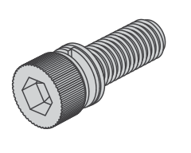
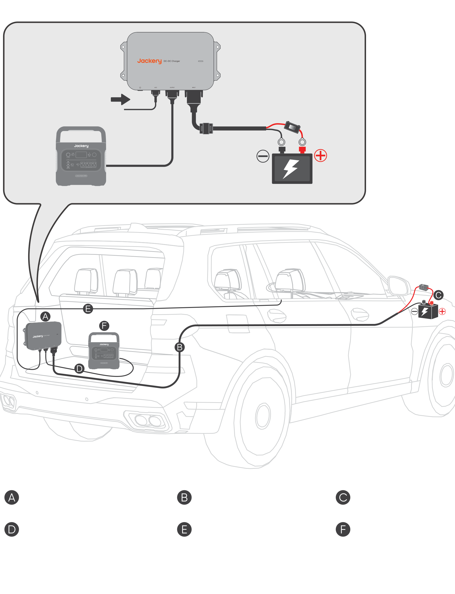
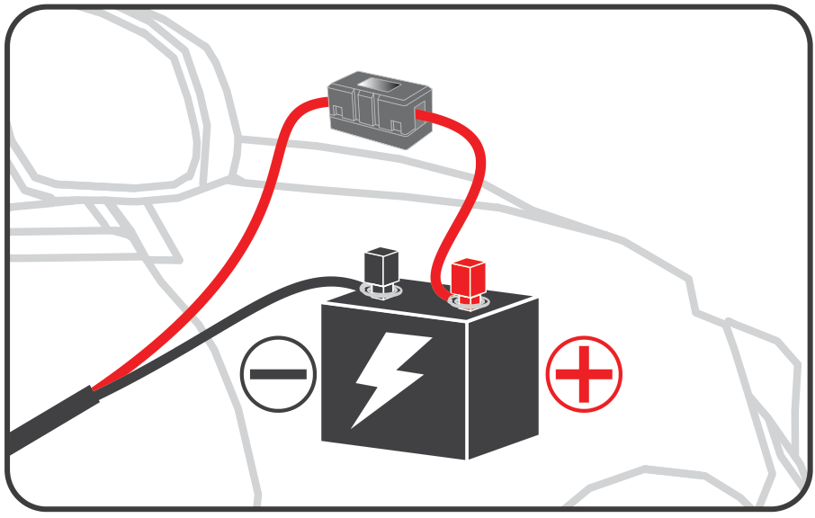
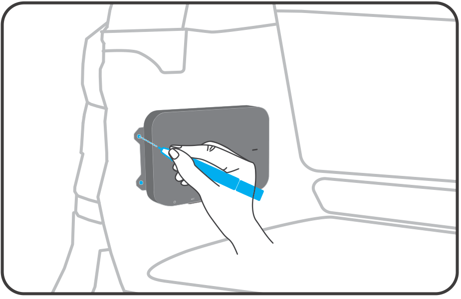
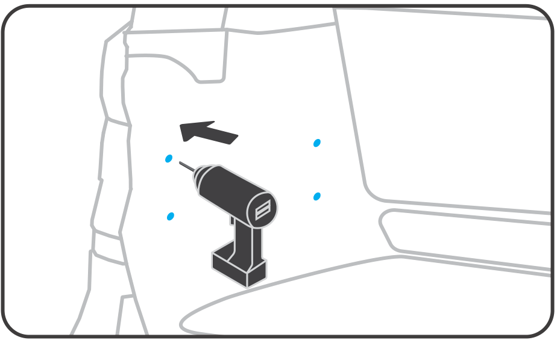

# 1. ЗАСТЕРЕЖЕННЯ

Ласкаво просимо, і дякуємо за вибір зарядного пристрою Jackery DC-DC. Цей посібник допоможе вам безпечно встановити та використовувати ваш новий виріб. Будь ласка, уважно прочитайте всі інструкції перед початком роботи та збережіть цей посібник для подальшого використання. Jackery залишає за собою право на остаточне тлумачення цього документа та всіх пов\'язаних документів на продукт відповідно до законодавчих і нормативних вимог. Щодо будь-яких оновлень, переглядів або припинення випуску, ознайомтеся з найновішими офіційними оголошеннями.

Зверніть увагу, що наступне *не* покривається гарантією:

- Пошкодження внаслідок природних подій, таких як землетруси, пожежі, повені, шторми або зсуви.

- Пошкодження, спричинені зберіганням продукту в умовах, що не відповідають зазначеним у цьому посібнику.

- Пошкодження, спричинені недбалістю, неправильною експлуатацією, недотриманням інструкцій у посібнику або навмисним неправильним використанням.

- Пошкодження, спричинені несанкціонованим розбиранням продукту, заміною деталей або зміною програмного коду.

- Пошкодження, спричинені неправильним транспортуванням клієнтом.

- Пошкодження або несприятливі наслідки внаслідок коригування, зміни або видалення етикеток, що порушують вимоги цього посібника.

- Пошкодження або негативні наслідки внаслідок використання цього продукту для живлення портативних станцій живлення, що не є продукцією Jackery.

- Інциденти травмування, пожежі, відмови обладнання або інші несприятливі наслідки, спричинені використанням цього продукту в атомній, авіаційній, медичній або інших сферах, критичних для безпеки.

# 2. ТЕХНІЧНІ ХАРАКТЕРИСТИКИ

## 2. ТЕХНІЧНІ ХАРАКТЕРИСТИКИ

<figure aria-label="2. ТЕХНІЧНІ ХАРАКТЕРИСТИКИ" class="hb-spec-table-composition"><table class="hb-spec-table manual-table manual-spec-table"><colgroup><col class="hb-spec-col-label"/><col class="hb-spec-col-value"/></colgroup><tbody><tr><th class="hb-spec-label manual-spec-label" scope="row">Назва продукту</th><td class="hb-spec-value manual-spec-value">Jackery DC-DC Charger</td></tr><tr><th class="hb-spec-label manual-spec-label" scope="row">Модель</th><td class="hb-spec-value manual-spec-value">JA-AD600A</td></tr><tr><th class="hb-spec-label manual-spec-label" scope="row">Вхід постійного струму</th><td class="hb-spec-value manual-spec-value">⎓ 11.8 V-32 V , 60 A</td></tr><tr><th class="hb-spec-label manual-spec-label" scope="row">Вихідна напруга</th><td class="hb-spec-value manual-spec-value">⎓ 50 V</td></tr><tr><th class="hb-spec-label manual-spec-label" scope="row">Вихідний струм</th><td class="hb-spec-value manual-spec-value">Макс. 12 A</td></tr><tr><th class="hb-spec-label manual-spec-label" scope="row">Вихідна потужність</th><td class="hb-spec-value manual-spec-value">Макс. 600 Вт</td></tr><tr><th class="hb-spec-label manual-spec-label" scope="row">Робоча температура</th><td class="hb-spec-value manual-spec-value">-20℃~60℃</td></tr><tr><th class="hb-spec-label manual-spec-label" scope="row">Робоча вологість</th><td class="hb-spec-value manual-spec-value">5%~95%</td></tr><tr><th class="hb-spec-label manual-spec-label" scope="row">Температура зберігання</th><td class="hb-spec-value manual-spec-value">-30℃~80℃</td></tr><tr><th class="hb-spec-label manual-spec-label" scope="row">Робоча висота</th><td class="hb-spec-value manual-spec-value">≤3000 м</td></tr><tr><th class="hb-spec-label manual-spec-label" scope="row">Ступінь захисту</th><td class="hb-spec-value manual-spec-value">IP40</td></tr><tr><th class="hb-spec-label manual-spec-label" scope="row">Вага</th><td class="hb-spec-value manual-spec-value">Близько 1,6 кг</td></tr><tr><th class="hb-spec-label manual-spec-label" scope="row">Розміри</th><td class="hb-spec-value manual-spec-value">259×154,5×39,3 мм</td></tr></tbody></table></figure>

# 3. КОМПЛЕКТ ПОСТАЧАННЯ

<figure aria-label="3. КОМПЛЕКТ ПОСТАЧАННЯ" class="hb-inbox-composition" data-card-count="9" data-component-id="HB-SPECIAL-INBOX" data-inbox-variant="responsive-card-grid"><ol class="hb-inbox-grid"><li class="hb-inbox-card" data-item-number="1">

A

<strong>Jackery DC-DC Charger</strong>

</li><li class="hb-inbox-card" data-item-number="2">

B

<strong>Вхідний кабель 6 м</strong>

Роз'єм Anderson

</li><li class="hb-inbox-card" data-item-number="3">

C

<strong>Запобіжник</strong>

Наконечник типу OT

</li><li class="hb-inbox-card" data-item-number="4">

D

<strong>Вихідний кабель 1,5 м</strong>

Роз'єм Роз'єм DC8020 Anderson

</li><li class="hb-inbox-card" data-item-number="5">

E

<strong>Кабель ACC 6 м</strong>

Роз'єм Anderson

</li><li class="hb-inbox-card" data-item-number="6">

F

<strong>Гвинт ST5.5 × 4</strong>

</li><li class="hb-inbox-card" data-item-number="7">

G

<strong>Болт M6 × 4</strong>

</li><li class="hb-inbox-card" data-item-number="8">

H

<strong>Гайка M6 × 4</strong>

</li><li class="hb-inbox-card" data-item-number="9">

I

<strong>Посібник користувача</strong>

</li></ol></figure>

# 4. ОГЛЯД ПРОДУКТУ

<figure class="hb-reference-figure hb-base-art-live-copy" data-component-id="HB-SPECIAL-REFERENCE-FIGURE" data-reference-id="product-overview" data-source-fragment-sha256="4503404132368ee106e6d5ba31152a2066d7423b78bd4da2a5099aa0fd77238b" data-web-base-art-ref="product_overview_base.png" data-web-presentation-mode="base-art-live-copy" data-web-replace-key="reference.product-overview">

Монтажний отвірІндикатор стануКнопка POWERВхідний портПорт ACCВихідний порт

</figure>

# 5. ВАЖЛИВІ ІНСТРУКЦІЇ З БЕЗПЕКИ

Під час роботи транспортного засобу зарядний пристрій DC-DC використовує надлишкову потужність генератора для заряджання портативної електростанції. Фактична потужність заряджання залежить від умов водіння, моделі та загального стану автомобіля.

Щоб забезпечити безпечну роботу, важливо дотримуватися наступних правил:

- Зберігайте цей посібник для подальшого використання.

- Завжди експлуатуйте або зберігайте виріб в умовах, зазначених у цьому посібнику.

- Прочитайте всі інструкції та попередження на цьому виробі, автомобільному акумуляторі та портативній станції живлення Jackery, а також у їхніх відповідних посібниках користувача.

- Не розбирайте виріб і не замінюйте його частини без дозволу, оскільки це анулює гарантію та може пошкодити виріб. Для заміни компонентів звертайтеся по допомогу до служби підтримки Jackery.

## Сумісність виробу

Цей виріб сумісний лише з портативними станціями живлення Jackery, які мають вхідний порт DC8020. Користувачам суворо заборонено використовувати адаптери для підключення цього виробу до вхідного порту DC7909 або USB-C портативної станції живлення. Таке підключення може спричинити пошкодження пристрою, пожежу або навіть вибух, що становить серйозну загрозу для особистої безпеки.

- Цей виріб сумісний лише з автомобільними акумуляторами 12 В/24 В. Перед використанням виробу переконайтеся, що номінальна напруга вашого автомобіля становить 12 В або 24 В, і завжди дотримуйтеся правил електробезпеки під час експлуатації.

- Цей виріб сумісний із портативними станціями живлення Jackery, обладнаними вхідним портом DC8020. Зверніться до таблиці нижче, де наведено деякі сумісні моделі. Для отримання додаткової інформації звертайтеся до служби підтримки або відвідайте офіційний веб-сайт Jackery.

| Портативна станція живлення | Ємність | Напруга та струм заряджання | Потужність заряджання | Час заряджання (0-100%) |
|----|----|----|----|----|
| Explorer 1000 Plus | 1265 Вт·год | Приблизно 50 В, 8 А | Приблизно 400 Вт | Приблизно 3,5 години |
| Explorer 1000 v2 | 1070 Вт·год | Приблизно 50 В, 8 А | Приблизно 400 Вт | Приблизно 3,0 години |
| Explorer 2000 Plus | 2042 Вт·год | Приблизно 50 В, 12 А | Приблизно 600 Вт | Приблизно 3,7 години |
| Explorer 2000 v2 | 2042 Вт·год | Приблизно 50 В, 8 А | Приблизно 400 Вт | Приблизно 5,6 години |
| Explorer 3000 Pro | 3024 Вт·год | Приблизно 50 В, 12 А | Приблизно 600 Вт | Приблизно 5,5 години |
| Explorer 3000 v2 | 3072 Вт·год | Приблизно 50 В, 12 А | Приблизно 600 Вт | Приблизно 5,6 години |

Примітка: Дані про час заряджання цього виробу базуються на симуляційних тестах, проведених за постійної температури 25 °C. У реальному використанні потужність заряджання може відрізнятися залежно від умов водіння, моделі автомобіля та загального стану. Час заряджання також може залежати від змін температури навколишнього середовища. Стандартне тестове середовище: Постійна температура 25 °C Джерело даних: Лабораторія Jackery

Увімкнення продукту

① Коротко натисніть кнопку живлення: Коли немає вхідного сигналу ACC, ви можете увімкнути пристрій, коротко натиснувши кнопку живлення.

② Увімкнення через сигнал ACC: Якщо провід ACC підключено, пристрій автоматично ввімкнеться, коли виявить вхідний сигнал ACC (наприклад, після запуску автомобіля).

Режим очікування та вимкнення

Коли немає вхідного сигналу ACC або напруга падає нижче порогу запуску, продукт перейде в режим очікування. Якщо режим очікування триває більше 24 годин або напруга падає нижче порогу захисту, пристрій автоматично вимкнеться. Щоб перезапустити його, виконайте ті самі кроки, описані вище. У режимі очікування, якщо немає вхідного сигналу ACC, ви також можете вручну вимкнути пристрій, утримуючи кнопку живлення протягом 3 секунд.

<table class="hb-source-status-table">
<colgroup>
<col style="width: 18.0%"/>
<col style="width: 18.0%"/>
<col style="width: 25.0%"/>
<col style="width: 39.0%"/>
</colgroup>
<thead>
<tr><th class="head">
Стан індикатора
</th>
<th class="head">
Колір індикатора
</th>
<th class="head">
Стан продукту
</th>
<th class="head">
Примітки
</th>
</tr>
</thead>
<tbody>
<tr><td>
Постійне світіння
</td>
<td>
Зелений
</td>
<td>
ЗАРЯДЖАННЯ
</td>
<td>
/
</td>
</tr>
<tr><td>
Постійне світіння
</td>
<td>
Червоний
</td>
<td>
Аномалія
</td>
<td>
Якщо виявите будь-які проблеми, негайно зверніться до служби підтримки Jackery.
</td>
</tr>
<tr><td>
Блимання
</td>
<td>
Зелений
</td>
<td>
З'єднання нормальне, очікується заряджання.
</td>
<td>
Якщо та сама проблема виникає після підключення портативної станції живлення, можливі причини включають: 1. Нестабільне з'єднання між вихідним кабелем і портативною станцією живлення. 2. Пошкоджений кабель. 3. Портативна станція живлення повністю заряджена. Якщо проблема не зникає після спроб усунення несправностей, зверніться до служби підтримки Jackery.
</td>
</tr>
<tr><td>
Світіння відсутнє
</td>
<td>
Немає кольору
</td>
<td>
Виріб не ввімкнено.
</td>
<td>
Якщо проблема залишається після завершення підключення та запуску автомобіля, зверніться до служби підтримки Jackery.
</td>
</tr>
</tbody>
</table>

# 6. ПОШИРЕНІ ЗАПИТАННЯ

**Q1: Чи потребує встановлення цього продукту професіонала?**

**A:** Щоб забезпечити безпеку та акуратне прокладання електропроводки, рекомендується, щоб встановлення виконувала спеціалізована майстерня. Непрофесіонали не повинні намагатися встановлювати його самостійно.

**Q2: Що слід перевіряти під час щомісячного обслуговування продукту?**

**A:** 1. Очистіть поверхню виробу сухою ганчіркою. Для стійких плям використовуйте розведений нейтральний мийний засіб. 2. Перевірте з\'єднувачі, електропроводку, гвинти та запобіжники на наявність пошкоджень або старіння. Якщо потрібна допомога, зверніться до служби підтримки Jackery. 3. Переконайтеся, що виріб надійно встановлений, і уникайте прямого сонячного світла та високих температур.

**Q3: Чи розряджатиме цей виріб акумулятор автомобіля?**

**A:** Щоб запобігти надмірному розряду стартерного акумулятора автомобіля або побутового акумулятора автобудинку, виріб контролює напругу на клемах акумулятора. Якщо напруга падає нижче порогового значення запуску, виріб автоматично припиняє роботу. Коли автомобіль не працює, виріб переходить у режим очікування та автоматично вимикається через 24 години.

**Q4: Чому виріб не працює?**

**A:** Деякі старі або специфічні моделі автомобілів мають нижчу напругу, яка може не відповідати робочій напрузі виробу. Якщо вхідна напруга вища, ніж системна напруга автомобіля (12В/24В), і виріб не працює після ввімкнення, зверніться до служби підтримки Jackery.

**Q5: Чи збільшить цей виріб споживання палива?**

**A:** Ні. Виріб використовує надлишкову потужність генератора, що робить його ефективним, енергоощадним та екологічним.

**Q6: Які функції захисту безпеки має цей виріб?**

**A:** Цей виріб має захист від перенапруги, зниженої напруги, надмірного струму, перевантаження, короткого замикання та високих/низьких температур для безпечного та надійного заряджання. Крім того, функція інтелектуального визначення напруги запобігає надмірному розряду акумулятора, забезпечуючи нормальний запуск автомобіля.

**Q7: Чому потужність заряджання нестабільна?**

**A:** Потужність заряджання динамічно регулюється залежно від умов руху та стану дороги. Це допомагає захистити акумулятор автомобіля, досягаючи максимальної ефективності заряджання. Коливання потужності є нормальним явищем.

**Q8: Чи впливає робочий шум виробу на сон?**

**A:** Виріб розроблено без вентилятора, а рівень його шуму нижче 40 дБ, що відповідає стандартам шуму для середовища сну.

# 7. ВСТАНОВЛЕННЯ ПРОДУКТУ

## 7.1 Схема встановлення

<figure class="hb-reference-figure hb-base-art-live-copy" data-component-id="HB-SPECIAL-REFERENCE-FIGURE" data-reference-id="installation-diagram" data-source-fragment-sha256="37eabc49e5c796edb1f236fc06dbd0e62a47a40f29c4793552a497d1b44ba93b" data-web-base-art-ref="installation_diagram_base.png" data-web-presentation-mode="base-art-live-copy" data-web-replace-key="reference.installation-diagram">

ACC автомобіляЗарядний пристрій DC-DCВхідний кабель 6 мЗапобіжникВихідний кабель 1,5 мКабель ACC 6 мПортативна станція живлення Jackery* Прокладання електропроводки та зв'язування кабелів слід виконувати залежно від фактичних умов автомобіля.

</figure>

## 7.2 Важливі інструкції з безпеки

Дотримуйтесь цих основних заходів безпеки під час використання цього продукту. ПОПЕРЕДЖЕННЯ

- Рекомендується, щоб електропроводку виконував професіонал.

- Перед виконанням електропроводки або підключення вживайте заходів особистого захисту, наприклад, надягайте захисні окуляри та ізолювальні рукавички, і завжди дотримуйтеся правил електробезпеки.

- Завжди вимикайте автомобіль перед початком будь-яких електричних робіт.

- Тримайте продукт сухим під час використання.

- Не вставляйте сторонні предмети в порти продукту.

- Не використовуйте продукт, якщо електропроводка, з\'єднувачі або сам продукт пошкоджені.

- Уникайте розміщення дротів поблизу високих температур, гострих предметів або місць, схильних до тертя.

- Надійно закріпіть дроти, щоб запобігти потенційним проблемам, спричиненим зношуванням або ослабленими з\'єднаннями.

- Перед запуском автомобіля та продукту переконайтеся, що електропроводка завершена, а всі гвинти та з\'єднувачі надійно затягнуті.

- Не використовуйте цей продукт для заряджання пошкоджених або неакумуляторних портативних станцій живлення чи резервних батарей.

- Якщо продукт не працює належним чином після запуску автомобіля, перевірте індикатор стану та зверніться до посібника для усунення несправностей.

- Перед підключенням, відключенням або зміною електропроводки переконайтеся, що автомобіль вимкнено, продукт вимкнено, а з\'єднання від\'єднано.

## 7.3 У надзвичайній ситуації

- У надзвичайній ситуації (наприклад, при серйозному ударному пошкодженні) надягніть ізолювальні рукавички та перемістіть продукт у відкрите місце подалі від займистих матеріалів і людей. Утилізуйте продукт відповідно до місцевих законів і нормативних актів.

- Якщо продукт випадково впав у воду, потрапив під дощ або має видиму вологу на поверхні, не торкайтеся безпосередньо продукту чи води навколо. Вживіть необхідних заходів для запобігання ураженню електричним струмом і перемістіть продукт у безпечне, сухе та добре провітрюване місце. Не використовуйте та не торкайтеся продукту, доки він повністю не висохне. Якщо потрібна допомога, негайно зверніться до служби підтримки Jackery.

- Якщо продукт загорівся, використовуйте наведені нижче способи гасіння в такому порядку: вода або водяний туман, пісок, протипожежне покривало, сухий порошок або вуглекислотний вогнегасник.

## 7.4 Перевірки перед установкою

1.  Перед установкою переконайтеся, що автомобіль вимкнено.

2.  Перевірте, що напруга бортової мережі автомобіля становить 12 В або 24 В.

3.  Переконайтеся, що вихідна напруга продукту відповідає вхідній напрузі постійного струму портативної станції живлення.

4.  Визначте місце розташування акумулятора автомобіля та забезпечте достатній простір для прокладання вхідного кабелю.

5.  Оберіть відповідне місце для встановлення. Рекомендується встановлювати продукт у багажнику, забезпечуючи щонайменше 20 см вільного простору з усіх боків, щоб запобігти перегріванню під час тривалої роботи. \* Рекомендується встановлювати продукт на тому ж боці, де розташований акумулятор. Наприклад, якщо акумулятор знаходиться з лівого боку автомобіля, встановіть продукт з лівого боку.

Зарядний пристрій Jackery DC-DC не захищений від води. Щоб запобігти пошкодженню пристрою, встановлюйте його всередині автомобіля, щоб уникнути впливу дощу та вологи. ПОПЕРЕДЖЕННЯ

6.  Перевірте довжину дроту. Продукт постачається з 6-метровим вхідним кабелем. Переконайтеся, що цієї довжини достатньо, щоб протягнути кабель від акумулятора автомобіля до місця встановлення DC-DC зарядного пристрою.

7.  Перевірте панелі автомобіля вздовж маршруту прокладання дротів. Щоб підтримувати акуратне прокладання, можливо, знадобиться зняти та повторно встановити деякі панелі.

8.  Перед підключенням та встановленням переконайтеся, що продукт повністю сухий і не пошкоджений.

9.  Підготуйте необхідні інструменти: хрестову викрутку, шестигранний ключ, розвідний ключ, інструмент для зняття кліпс панелей, дріт, ізоляційну стрічку, стяжки, кусачки для дроту та тестер напруги.

## 7.5 Кроки підключення

Запобіжні заходи:

<ul class="simple">
<li>
Переконайтеся, що дроти надійно закріплені, щоб запобігти перегріванню або короткому замиканню через нещільні з'єднання.
</li>
<li>
Під час під'єднання OT-клеми до акумулятора автомобіля забезпечте надійне з'єднання, щоб запобігти аномальному підвищенню температури.
</li>
<li>
Переконайтеся, що автомобіль вимкнено.
</li>
</ul>

1

Підключіть клему OT запобіжника до позитивної клеми 6-метрового вхідного кабелю (червоний) з моментом затягування 3~4 Н·м. Переконайтеся, що порядок круглого наконечника, шайби, стопорної шайби та гайки правильний, і застосуйте необхідний момент затягування. Недостатній момент може спричинити ослаблення з'єднання, що призведе до плавлення дроту, тоді як момент, що перевищує 6 Н·м, може зламати запобіжник. Під час встановлення перевірте та переконайтеся, що обидва кінці клем запобіжника ① і ② надійно затягнуті. Рекомендується затягувати їх вручну, доки вони не перестануть обертатися. (Якщо використовуєте шуруповерт, встановіть момент затягування 4 Н·м перед затягуванням.)

<figure class="hb-reference-figure hb-base-art-live-copy" data-component-id="HB-SPECIAL-REFERENCE-FIGURE" data-reference-id="wiring-fuse" data-source-fragment-sha256="fc795bdb775dde9280fcab83196a08d55813f38a12224eea43f7254e314d1359" data-web-base-art-ref="file:///Users/pika/Documents/Codex/2026-10-07/kan-x/work/dcdc-eight-source/assets/ja_ad600a_eu_shared/wiring_fuse_base.svg" data-web-presentation-mode="base-art-live-copy" data-web-replace-key="reference.wiring-fuse">

Запобіжник3~4 N·mВхідний кабель 6Примітка: Затягніть клеми ① і ② з моментом затягування 3–4 Н·м.ШайбаСтопорна шайбаГайка

</figure>

2

Підключіть наконечники OT вхідного кабелю до позитивних та негативних клем акумулятора автомобіля. Переконайтеся, що червоний дріт підключений до позитивної клеми, а чорний – до негативної.

3

Відріжте кінець кабелю ACC без роз'єму, щоб оголити мідний дріт, і підключіть його до лінії ACC автомобіля.

※ Під час підключення дроту ACC, якщо ви не впевнені у місці підключення або не знаєте способу з'єднання, рекомендується звернутися до виробника автомобіля для підтвердження перед виконанням робіт з електропроводки.

<figure class="hb-reference-figure hb-base-art-live-copy" data-component-id="HB-SPECIAL-REFERENCE-FIGURE" data-reference-id="wiring-acc" data-source-fragment-sha256="44b10cc484c4349aec882d340b1412e900b2383cc9c9395e0ec819c71c753f21" data-web-base-art-ref="file:///Users/pika/Documents/Codex/2026-10-07/kan-x/work/dcdc-eight-source/assets/ja_ad600a_eu_shared/wiring_acc_base.png" data-web-presentation-mode="base-art-live-copy" data-web-replace-key="reference.wiring-acc">

Кабель ACCКабель ACC автомобіля

</figure>

## 7.6 Встановлення виробу

Перед свердлінням отворів або кріпленням зарядного пристрою DC-DC огляньте область позаду передбачуваного місця встановлення, щоб уникнути пошкодження джгутів проводів або інших внутрішніх компонентів.

Метод 1: Закріпіть виріб на кузові автомобіля.

1

Забезпечте зазор не менше 20 см навколо виробу (зверху, знизу, зліва та справа).

2

Позначте місця свердління.

3

Просвердліть отвори в позначених місцях.

4

Закріпіть виріб за допомогою саморізів.

Метод 2: Закріпіть виріб на модифікаційній панелі.

1

Позначте місця свердління на модифікаційній панелі.

2

Просвердліть отвори в позначених місцях.

3

Вставте болти M6 крізь виріб в отвори, а потім затягніть гайки M6.

## 7.7 Підключення виробу до портативної станції живлення

1.  Підключіть роз\'єм Anderson вхідного кабелю до вхідного порту виробу.

2.  Підключіть роз\'єм Anderson кабелю ACC до порту ACC виробу.

3.  Підключіть роз\'єм Anderson вихідного кабелю до вихідного порту виробу.

4.  Підключіть роз\'єм DC8020 вихідного кабелю до портативної станції живлення.

<figure class="hb-reference-figure hb-base-art-live-copy" data-component-id="HB-SPECIAL-REFERENCE-FIGURE" data-reference-id="charger-connection" data-source-fragment-sha256="2fd395de19ded4d31c17bed77bb1e5dc19e3d1921bb9def3ee21677c1a5341b3" data-web-base-art-ref="file:///Users/pika/Documents/Codex/2026-10-07/kan-x/work/dcdc-eight-source/assets/ja_ad600a_eu_shared/connection_base.png" data-web-presentation-mode="base-art-live-copy" data-web-replace-key="reference.charger-connection">

Кабель ACCВихідний кабельВхідний кабель із запобіжником

</figure>

## 7.8 Перевірки після встановлення

1.  Переконайтеся, що всі гвинти в системі електропроводки надійно затягнуті.

2.  Огляньте та закріпіть всю електропроводку, щоб запобігти зносу чи ослабленню, спричиненим рухом автомобіля.

3.  Перед запуском автомобіля переконайтеся, що всю проводку завершено, а гвинти та кабелі перебувають у належному стані.

4.  Після запуску автомобіля короткочасно натисніть кнопку живлення, щоб увімкнути пристрій. Якщо індикатор засвітиться сталим зеленим світлом, установку виконано успішно.

## 7.9 Щоденні запобіжні заходи

- Не тягніть електропроводку з силою під час від\'єднання виробу, щоб уникнути пошкоджень.

- Тривале використання виробу може призвести до нагрівання зовнішнього корпусу. Уникайте прямого контакту, щоб запобігти опікам.

- Регулярно перевіряйте електропроводку щомісяця, щоб переконатися, що клеми OT надійно з\'єднані, а на дротах немає тріщин, зносу чи корозії.

- Використовуйте суху м\'яку ганчірку або серветку для очищення виробу. Не мийте його безпосередньо водою.

- Під час використання виробу переконайтеся, що в будь-якому напрямку в радіусі 20 см від нього немає предметів, щоб запобігти впливу тепла на навколишні об\'єкти.

- Якщо виявлено старіння, пошкодження або інші проблеми з виробом чи кабелями, негайно припиніть використання та зверніться за ремонтом або заміною.

- Вимикайте живлення, коли виріб не використовується.

## Заява про відповідність FCC

<figure aria-label="Заява про відповідність FCC" class="hb-fcc-composition hb-fcc-statement">

Цей пристрій відповідає частині 15 правил FCC. Експлуатація можлива за таких двох умов: (1) Цей пристрій не повинен створювати шкідливих перешкод, і (2) цей пристрій повинен приймати будь-які перешкоди, включаючи перешкоди, які можуть спричинити небажану роботу.

</figure>

# 8. ГАРАНТІЯ

Ми надаємо гарантію лише клієнтам, які придбали продукцію на офіційному вебсайті Jackery, на сторонніх платформах під брендом Jackery або в місцевих авторизованих дилерів.

\*Гарантійний період і деталі можуть відрізнятися залежно від місцевих законів, нормативних актів і авторизованих дилерів.

## Обмежена гарантія

Jackery гарантує первинному кінцевому покупцеві, що продукт Jackery не матиме дефектів матеріалів і виготовлення за умов нормального споживчого використання протягом відповідного гарантійного періоду, визначеного в розділі «Гарантійний період» нижче, з урахуванням наведених нижче виключень. Ця гарантійна заява визначає повний і виключний обсяг гарантійних зобов'язань Jackery. Ми не беремо на себе і не уповноважуємо будь-яку особу брати на себе від нашого імені будь-які інші зобов'язання у зв'язку з продажем нашої продукції.

## Гарантійний період

<table class="hb-source-period-table">
<colgroup>
<col style="width: 25.0%"/>
<col style="width: 75.0%"/>
</colgroup>
<tbody>
<tr><td>
<strong>2</strong>

<strong>РОКИ</strong>

Стандартна гарантія

</td>
<td>
Стандартний гарантійний період для зарядного пристрою Jackery DC-DC становить 24 місяці. У кожному випадку гарантійний період обчислюється з дати покупки первинним споживачем-покупцем. Для визначення дати початку гарантійного періоду потрібен товарний чек від першої покупки споживачем або інший обґрунтований документальний доказ.
</td>
</tr>
</tbody>
</table>

## Гарантійне обслуговування

Якщо продукт Jackery не працює протягом застосовного гарантійного періоду через дефект виготовлення або матеріалів, Jackery надасть гарантійне обслуговування за рахунок Jackery відповідно до чинного місцевого законодавства та регіональної політики післяпродажного обслуговування Jackery. Гарантійне обслуговування може включати ремонт, заміну або обмін продукту. Будь-який відремонтований, замінений або обміняний продукт буде покритий протягом решти гарантійного періоду оригінального продукту.

## Обмеження для первинного споживача-покупця

Гарантія на продукт Jackery обмежується первинним споживачем-покупцем і не підлягає передачі будь-якому наступному власнику.

## Виключення

Гарантія Jackery не поширюється на:

- Неправильне використання, зловживання, модифікації, пошкодження внаслідок нещасного випадку або використання не за призначенням, відмінним від нормального споживчого використання, дозволеного чинною документацією Jackery.

- Спроби ремонту будь-ким, окрім авторизованого сервісного центру.

- Будь-який продукт, придбаний через онлайн-аукціон.

## Право тлумачення

Гарантія на продукт Jackery обмежується первинним споживачем-покупцем і не підлягає передачі будь-якому наступному власнику.
