

<h1 class="hb-preface-heading" id="preface">US IMPORTANT</h1>

Congratulations on your new Jackery Battery Pack. Please read this manual carefully before using the product, particularly the relevant precautions to ensure proper use. Keep this manual in an accessible place for future reference.

In compliance with laws and regulations, the right of final interpretation of this document and all related documents of this product resides with the Company. Although every effort has been made to ensure the accuracy of this manual, Jackery Inc. assumes no responsibility for any errors that may appear.

Please note that no further notifications will be given in case of any update, revision, or termination. For the latest version of the product manuals, visit support.jackery.com.

* The images are for reference purposes only. Please refer to the actual product.

# IMPORTANT SAFETY INFORMATION

The basic safety precautions should be followed when using this product, including:

<ul><li>Please read all instructions before using this product.</li><li>Close supervision is required when using this product near children to reduce the risk.</li><li>Risk of electric shock may occur if using accessories recommended or sold by non-professional product manufacturers.</li><li>When the product is not in use, please unplug the power plug from the product's socket.</li><li>Do not dismantle the product, which may lead to unpredictable risks such as fire, explosion or electric shock.</li><li>Do not use the product through damaged cords or plugs, or damaged output cables, which may cause electric shock.</li><li>Charge the product in a well ventilated area and do not restrict ventilation in any way.</li><li>Please put the product in a ventilated and dry place to avoid rain and water to cause electric shock.</li><li>Do not expose the product to fire or high temperature (under direct sunlight or in vehicle under high heat), which may cause accidents such as fire and explosion.</li><li>When using it for the first time, please fully charge the device before use. If this product is stored for a long period of time (3 months - 6 months) with the power depleted, its performance will deteriorate and may even become unchargeable.</li></ul>

# MEANING OF SYMBOLS

<figure aria-label="Signal words" class="hb-symbol-signal-composition" data-component-id="HB-TABLE-SYMBOL-SIGNAL"><table class="hb-symbol-signal-table"><colgroup><col class="hb-symbol-signal-col-label"/><col class="hb-symbol-signal-col-meaning"/></colgroup><thead><tr><th class="hb-symbol-signal-label-heading" scope="col">Symbol</th><th class="hb-symbol-signal-meaning-heading" scope="col">Meaning</th></tr></thead><tbody><tr><td class="hb-symbol-signal-label-cell">⚠WARNING</td><td class="hb-symbol-signal-meaning-cell">Hazardous practices that may result in severe injury, death, and/or property damage.</td></tr><tr><td class="hb-symbol-signal-label-cell">⚠CAUTION</td><td class="hb-symbol-signal-meaning-cell">Hazardous practices that may result in personal injury and/or property damage.</td></tr><tr><td class="hb-symbol-signal-label-cell">NOTE</td><td class="hb-symbol-signal-meaning-cell">Hazardous practices that may result in equipment damage, data loss, performance deterioration, or unanticipated results.</td></tr><tr><td class="hb-symbol-signal-label-cell">TIP</td><td class="hb-symbol-signal-meaning-cell">Supplements the important information or operation tips in the text.</td></tr></tbody></table></figure>

<figure aria-label="Safety symbols" class="hb-symbol-pair-composition" data-component-id="HB-TABLE-SYMBOL-ICON">

<table class="hb-symbol-panel-table"><colgroup><col class="hb-symbol-col-icon"/><col class="hb-symbol-col-meaning"/></colgroup><thead><tr><th class="hb-symbol-icon-heading" scope="col">Symbol</th><th class="hb-symbol-meaning-heading" scope="col">Meaning</th></tr></thead><tbody><tr><td class="hb-symbol-icon"></td><td class="hb-symbol-meaning">Warning and Caution Symbols. Must read to alert individuals to potential hazards or risks.</td></tr><tr><td class="hb-symbol-icon"></td><td class="hb-symbol-meaning">Read the user manual before operation.</td></tr><tr><td class="hb-symbol-icon"></td><td class="hb-symbol-meaning">Do not dismantle the product.</td></tr><tr><td class="hb-symbol-icon"></td><td class="hb-symbol-meaning">Keep the product away from fire.</td></tr><tr><td class="hb-symbol-icon"></td><td class="hb-symbol-meaning">Keep away from children.</td></tr></tbody></table>

<table class="hb-symbol-panel-table"><colgroup><col class="hb-symbol-col-icon"/><col class="hb-symbol-col-meaning"/></colgroup><thead><tr><th class="hb-symbol-icon-heading" scope="col">Symbol</th><th class="hb-symbol-meaning-heading" scope="col">Meaning</th></tr></thead><tbody><tr><td class="hb-symbol-icon"></td><td class="hb-symbol-meaning">This symbol indicates that a lithium-ion (Li-ion) battery is inside the product and should be disposed of or recycled properly.</td></tr><tr><td class="hb-symbol-icon"></td><td class="hb-symbol-meaning">This symbol indicates that the product shall not be disposed of as household waste, and should be delivered to a designated collection facility for recycling. Proper disposal and recycling can help protect the environment. For more information about the disposal and recycling of this product, contact your local community, disposal service, or dealer.</td></tr></tbody></table>

</figure>

# FCC

<figure aria-label="FCC" class="hb-fcc-composition" data-component-id="HB-SPECIAL-FCC">

This device complies with part 15 of the FCC Rules. Operation is subject to the following two conditions:

(1) This device may not cause harmful interference, and

(2) This device must accept any interference received, including interference that may cause undesired operation.

<strong>NOTE:</strong> This equipment has been tested and found to comply with the limits for a Class B digital device, pursuant to part 15 of the FCC Rules. These limits are designed to provide reasonable protection against harmful interference in a residential installation. This equipment generates, uses and can radiate radio frequency energy and, if not installed and used in accordance with the instructions, may cause harmful interference to radio communications.

However, there is no guarantee that interference will not occur in a particular installation. If this equipment does cause harmful interference to radio or television reception, which can be determined by turning the equipment off and on, the user is encouraged to try to correct the interference by one or more of the following measures:
<ul class="simple"><li>
Reorient or relocate the receiving antenna.
</li><li>
Increase the separation between the equipment and receiver.
</li><li>
Connect the equipment into an outlet on a circuit different from that to which the receiver is connected.
</li><li>
Consult the dealer or an experienced radio/TV technician for help.
</li></ul>
<strong>MODIFICATION:</strong> Any changes or modifications not expressly approved by the grantee of this device could void the user’s authority to operate the device.

</figure>

# WHAT'S IN THE BOX

<figure aria-label="What's in the box" class="hb-inbox-composition" data-card-count="4" data-component-id="HB-SPECIAL-INBOX" data-inbox-variant="responsive-card-grid"><ol class="hb-inbox-grid"><li class="hb-inbox-card" data-item-number="1">

Jackery Battery Pack

</li><li class="hb-inbox-card" data-item-number="2">

Expansion Cable

</li><li class="hb-inbox-card" data-item-number="3">

Documents

</li><li class="hb-inbox-card" data-item-number="4">

Vertical Stand

</li></ol></figure>

# PRODUCT OVERVIEW

<figure class="hb-reference-figure hb-base-art-live-copy" data-component-id="HB-SPECIAL-REFERENCE-FIGURE" data-reference-id="overview" data-source-fragment-sha256="6c8191de26bb59669690df39ef0a0f178989c98b948a374bb3eac923351df39d" data-web-base-art-ref="overview" data-web-presentation-mode="base-art-live-copy">

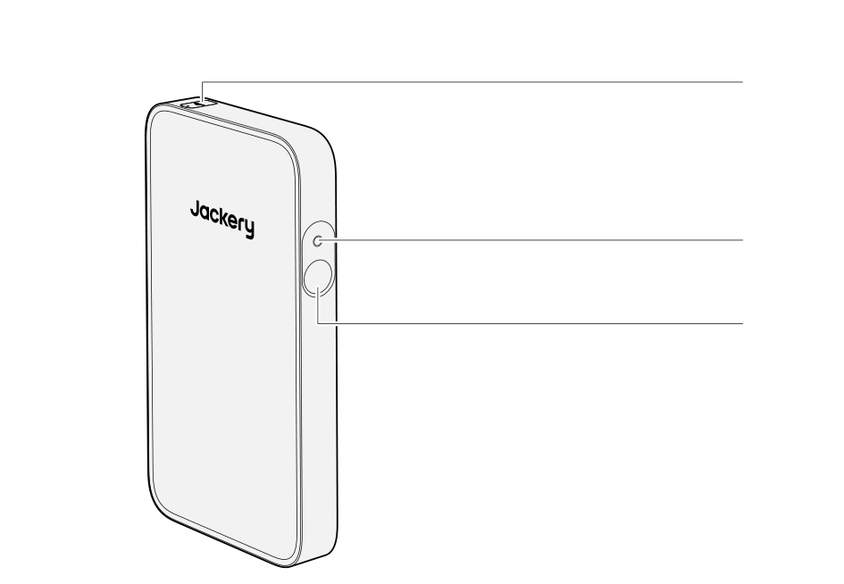DC Expansion PortInput:40V-57.6V⎓24A MaxOutput:40V-57.6V⎓50A MaxMain Power ButtonLCD Screen

</figure>

# LCD SCREEN

<figure class="hb-reference-figure hb-base-art-live-copy" data-component-id="HB-SPECIAL-REFERENCE-FIGURE" data-reference-id="lcd" data-source-fragment-sha256="03e21106852d242795966b24aa9810919ea195cada895b83a1562d154766433f" data-web-base-art-ref="lcd" data-web-presentation-mode="base-art-live-copy">

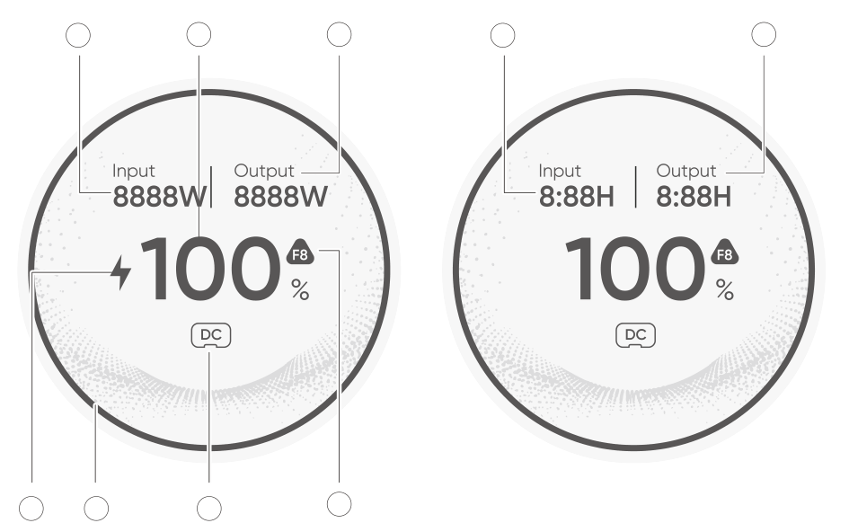123754613

</figure>

<figure aria-label="LCD indicators" class="hb-lcd-table-composition" data-component-id="HB-TABLE-LCD-ICON" tabindex="0"><table class="hb-lcd-icon-table"><colgroup><col class="hb-lcd-col-number"/><col class="hb-lcd-col-icon"/><col class="hb-lcd-col-name"/><col class="hb-lcd-col-description"/></colgroup><tbody><tr><td class="hb-lcd-number">1</td><td class="hb-lcd-icon"></td><td class="hb-lcd-name">Input Power / Remaining Charge Time</td><td class="hb-lcd-description">Displays the input power and remaining charging time alternately.</td></tr><tr><td class="hb-lcd-number">2</td><td class="hb-lcd-icon"></td><td class="hb-lcd-name">Remaining Battery Percentage</td><td class="hb-lcd-description">Displays the remaining battery percentage.</td></tr><tr><td class="hb-lcd-number">3</td><td class="hb-lcd-icon"></td><td class="hb-lcd-name">Output Power / Remaining Discharge Time</td><td class="hb-lcd-description">Displays the output power and remaining discharging time alternately.</td></tr><tr><td class="hb-lcd-number">4</td><td class="hb-lcd-icon"></td><td class="hb-lcd-name">Charging Indicator</td><td class="hb-lcd-description"><strong>On:</strong> The Jackery Battery Pack is in the charging state. <strong>Off:</strong> The Jackery Battery Pack is not in the charging state.</td></tr><tr><td class="hb-lcd-number">5</td><td class="hb-lcd-icon"></td><td class="hb-lcd-name">Battery Power Indicator</td><td class="hb-lcd-description">The orange circle indicates the remaining battery level.</td></tr><tr><td class="hb-lcd-number">6</td><td class="hb-lcd-icon"></td><td class="hb-lcd-name">DC Input</td><td class="hb-lcd-description"><strong>On:</strong> The Jackery DC Input Module is connected. <strong>Off:</strong> The Jackery DC Input Module is disconnected.</td></tr><tr><td class="hb-lcd-number">7</td><td class="hb-lcd-icon"></td><td class="hb-lcd-name">Fault Code</td><td class="hb-lcd-description">A product error has occurred. Please refer to the Troubleshooting section for details.</td></tr></tbody></table></figure>

# OPERATIONS

## POWER ON/OFF

<figure class="hb-reference-figure hb-base-art-live-copy" data-component-id="HB-SPECIAL-REFERENCE-FIGURE" data-reference-id="power" data-source-fragment-sha256="7eee304b7982a18b667ba836dc8f5c694902a7e2a11fbf1d8c434c91fa18f9ab" data-web-base-art-ref="power" data-web-presentation-mode="base-art-live-copy">

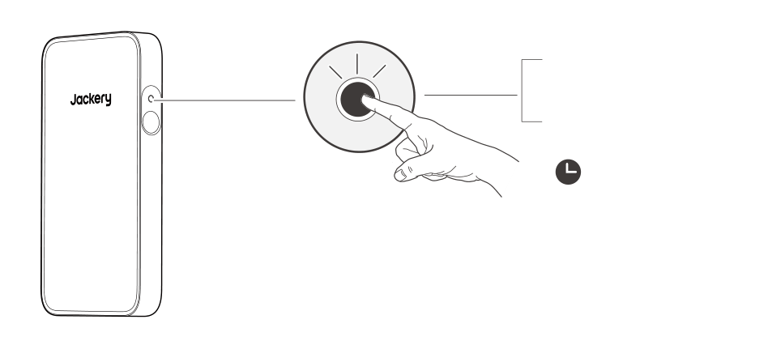OnPress onceOffPress and hold for 3s3s

</figure><table class="manual-callout-table manual-callout-table"><tbody><tr><td class="manual-callout-label">Note</td><td class="manual-callout-body">
The product will automatically shut down if it is not charged or no loads are connected for 2 hours.
</td></tr></tbody></table>

## LCD SCREEN ON/OFF

<figure aria-label="LCD SCREEN ON/OFF" class="hb-lcd-mode-composition hb-lcd-mode-portrait" data-component-id="HB-TABLE-LCD-MODE">

<table class="hb-lcd-mode-table"><colgroup><col class="hb-lcd-mode-col-state"/><col class="hb-lcd-mode-col-action"/><col class="hb-lcd-mode-col-copy"/></colgroup><tbody><tr><td class="hb-lcd-mode-state" rowspan="3">Shortly On</td><td class="hb-lcd-mode-action">Turn on</td><td class="hb-lcd-mode-copy">Press the Main Power Button or when the product is charging.</td></tr><tr><td class="hb-lcd-mode-action">Turn off</td><td class="hb-lcd-mode-copy">Press the Main Power Button.</td></tr><tr><td class="hb-lcd-mode-action">Auto-off</td><td class="hb-lcd-mode-copy">The LCD turns off automatically and enters sleep mode after 2 minutes of inactivity.</td></tr><tr><td class="hb-lcd-mode-state" rowspan="3">Steady On (in charging or discharging state)</td><td class="hb-lcd-mode-action">Turn on</td><td class="hb-lcd-mode-copy">Double-press the Main Power Button when the product is powered on.</td></tr><tr><td class="hb-lcd-mode-action">Turn off</td><td class="hb-lcd-mode-copy">Press the Main Power Button.</td></tr><tr><td class="hb-lcd-mode-action">Auto-off</td><td class="hb-lcd-mode-copy">The LCD turns off automatically after 2 hours of inactivity.</td></tr></tbody></table>
</figure>

# TROUBLESHOOTING

If any of the following fault codes appear, follow the listed corrective actions to resolve the issue. If the fault persists, please contact Jackery Customer Support.

<figure aria-label="Error Code / Corrective Measures" class="hb-troubleshooting-composition" data-component-id="HB-TABLE-TROUBLESHOOTING" tabindex="0"><table class="hb-troubleshooting-table"><colgroup><col class="hb-troubleshooting-col-code"/><col class="hb-troubleshooting-col-measures"/></colgroup><thead><tr><th class="hb-troubleshooting-code" scope="col">Error Code</th><th class="hb-troubleshooting-measures" scope="col">Corrective Measures</th></tr></thead><tbody><tr><td class="hb-troubleshooting-code">F0 / F2 / F3</td><td class="hb-troubleshooting-measures">Restart the product.</td></tr><tr><td class="hb-troubleshooting-code">F1 / F6 / F7 / F8</td><td class="hb-troubleshooting-measures">Contact Jackery Customer Support.</td></tr><tr><td class="hb-troubleshooting-code">F4</td><td class="hb-troubleshooting-measures">Connect the product to loads to discharge its battery until the fault disappears.</td></tr><tr><td class="hb-troubleshooting-code">F5</td><td class="hb-troubleshooting-measures">Charge the product via solar panels or an AC wall outlet until the fault disappears.</td></tr><tr><td class="hb-troubleshooting-code">FF</td><td class="hb-troubleshooting-measures">
<strong>In high temperature condition:</strong>
<ol><li>Disconnect all charging and discharging cables to the product (including wall charger, solar panels, car charger, and load devices).</li><li>Place the product in a shaded, well-ventilated area where the ambient temperature is below 113°F (45°C).</li><li>Keep the product idle and wait until the fault disappears.</li><li>If the fault persists after repeated attempts, please contact the distributor or Jackery Customer Support.</li></ol>
<strong>In low temperature condition:</strong>
<ol><li>Move the product to a warmer environment above 32°F (0°C).</li><li>Do not use or charge the product outdoors in extremely cold conditions. If necessary, preheat it indoors.</li><li>If the device is moved indoors from a cold environment, let it sit for a while before use.</li><li>When the Low Temperature indicator appears, keep the product idle and wait for the system to recover automatically.</li><li>If the fault persists after repeated attempts, please contact the distributor or Jackery Customer Support.</li></ol></td></tr></tbody></table></figure>

# POSITIONED WITH JACKERY FRIDGEGUARD

## PARALLEL ARRANGEMENT

Position the Jackery Battery Pack and Jackery FridgeGuard in a parallel arrangement.

## STACKED

Place the Jackery Battery Pack and Jackery FridgeGuard in a stack.

## WITH BRACKETS

<table class="manual-callout-table manual-callout-table"><tbody><tr><td class="manual-callout-label">CAUTION</td><td class="manual-callout-body"><ul><li>Do not install the product on the non bearing structure, including gypsum board, thermal insulating wall, hollow brick, or the product may fall.</li><li>Avoid the electrical wires, water pipes, gas pipes and other facilities inside the walls.</li></ul></td></tr></tbody></table>

# VERTICAL STAND

Jackery Battery Pack installed with the vertical stand can be positioned on the ground. Please follow the installation steps below:
<figure class="hb-reference-figure hb-base-art-live-copy" data-component-id="HB-SPECIAL-REFERENCE-FIGURE" data-reference-id="vertical-prep" data-source-fragment-sha256="725c3ed4bede95f2ffafb1f18be72ae08848fa38ad9715ffa72c1b5cff99f0fe" data-web-base-art-ref="vertical-prep" data-web-presentation-mode="base-art-live-copy">

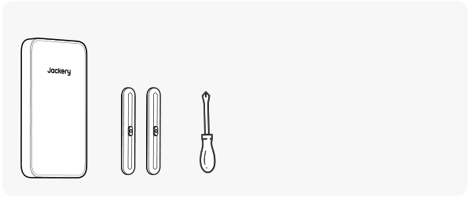Preparation before installation:

</figure>

1. Remove two screws from the bottom of the Battery Pack.

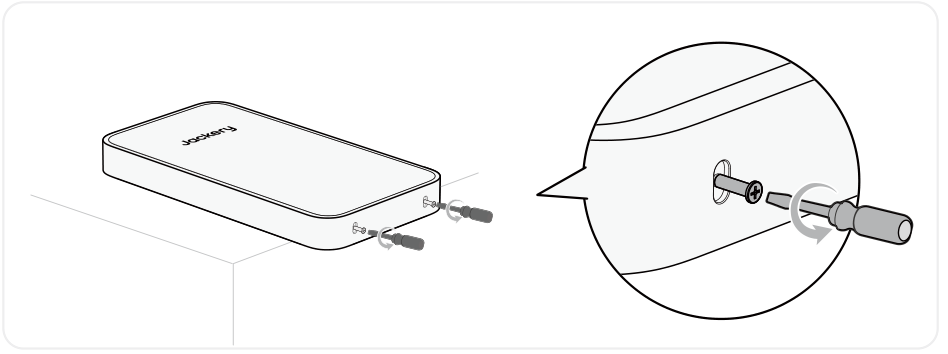

2. Align the mounting holes on the bottom of the Battery Pack with the holes on the vertical stand.

3. Tighten the screws.

# JACKERY WALL-MOUNTED BRACKET (SOLD SEPARATELY)

Jackery Battery Pack installed with the mounting bracket can be positioned on the wall. Please follow the installation steps below:

## ON WOODEN WALLS

<figure class="hb-reference-figure hb-base-art-live-copy" data-component-id="HB-SPECIAL-REFERENCE-FIGURE" data-reference-id="wood-prep" data-source-fragment-sha256="9ded90a2e3a3f2ec103b041147b0fa54f2d72a3973f8d9f888cea00dc70f6626" data-web-base-art-ref="wood-prep" data-web-presentation-mode="base-art-live-copy">

Preparation before installation:SOLD SEPARATELY

</figure>

<figure class="hb-reference-figure hb-base-art-live-copy" data-component-id="HB-SPECIAL-REFERENCE-FIGURE" data-reference-id="wood-result" data-source-fragment-sha256="2e978cda681b76846b63f1c5748f6a108df9f818ff24f6534cd7c3a8989216f3" data-web-base-art-ref="wood-result" data-web-presentation-mode="base-art-live-copy">

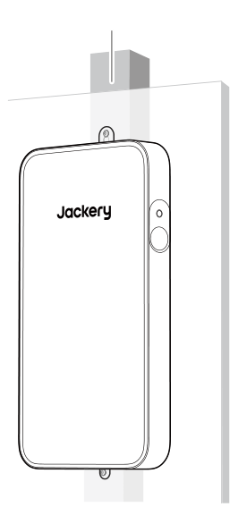wood stud

</figure>

<figure class="hb-reference-figure hb-base-art-live-copy" data-component-id="HB-SPECIAL-REFERENCE-FIGURE" data-reference-id="wood-1-2" data-source-fragment-sha256="55b6cbab18b38b1bd5ed9236d45d9057c4fabc99ee27c5323c4f4654f028b00c" data-web-base-art-ref="wood-1-2" data-web-presentation-mode="base-art-live-copy">

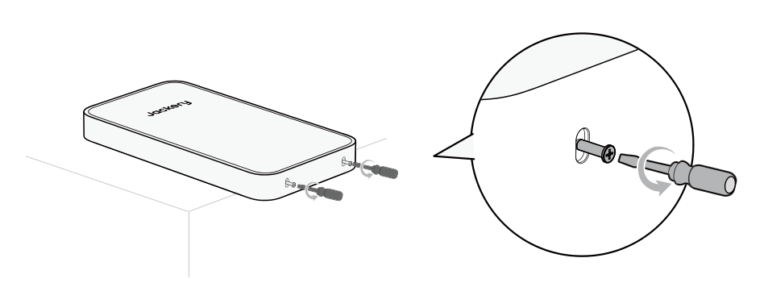1. Install the Jackery FridgeGuard according to the user manual.2. Remove two screws from the bottom of the Battery Pack.

</figure>

<figure class="hb-reference-figure hb-base-art-live-copy" data-component-id="HB-SPECIAL-REFERENCE-FIGURE" data-reference-id="wood-3" data-source-fragment-sha256="0f0ee4e4872b0c3e3052ae7f3ccb92033aa4c7b7adf5dcab8d1e35bbf6e2c893" data-web-base-art-ref="wood-3" data-web-presentation-mode="base-art-live-copy">

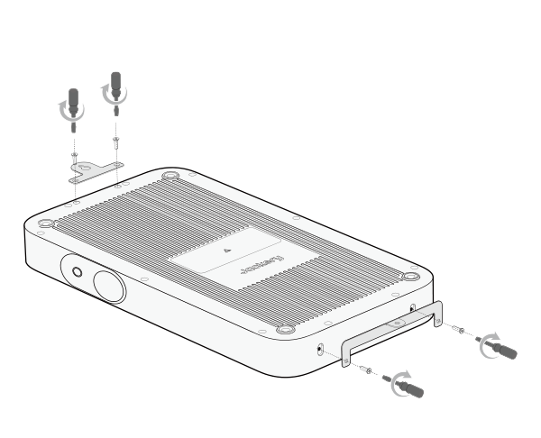3. Securely attach the upper and lower mounting brackets to the back of the Battery Pack.

</figure>

<figure class="hb-reference-figure hb-base-art-live-copy" data-component-id="HB-SPECIAL-REFERENCE-FIGURE" data-reference-id="wood-4" data-source-fragment-sha256="8532f600d1888686aec8ecab6595cf6a0b1b8598ebcf479335ea5538bef30f77" data-web-base-art-ref="wood-4" data-web-presentation-mode="base-art-live-copy">

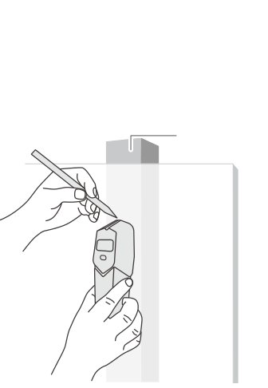4. Use a stud finder to identify wood studs behind the wall.wood stud

</figure>

<figure class="hb-reference-figure hb-base-art-live-copy" data-component-id="HB-SPECIAL-REFERENCE-FIGURE" data-reference-id="wood-5" data-source-fragment-sha256="2b2e0ec33e8ef722decbff96f3596fcdb2251284fd1aace8fe24cc9dd33a8ac8" data-web-base-art-ref="wood-5" data-web-presentation-mode="base-art-live-copy">

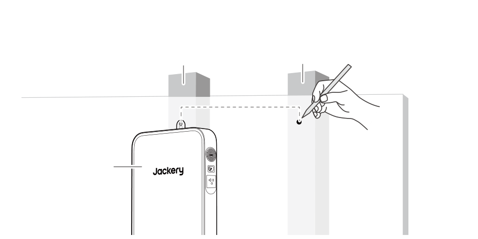5. Measure a horizontal distance of 406mm (16 in) from the bolt position on the Jackery FridgeGuard, and mark the mounting point on the wood stud of the wall.* 406mm (16 in) is the recommended distance, and actual distance depends on wall conditions.wood studwood stud406mm (16 in)Jackery FridgeGuard

</figure>

<figure class="hb-reference-figure hb-base-art-live-copy" data-component-id="HB-SPECIAL-REFERENCE-FIGURE" data-reference-id="wood-6" data-source-fragment-sha256="f9258da45c467d5c0c9fa90b819c18ac6861abefd8c772747065f257b8305f87" data-web-base-art-ref="wood-6" data-web-presentation-mode="base-art-live-copy">

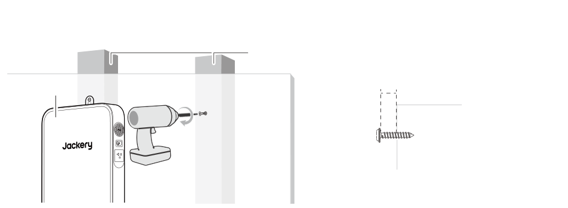6. Drive the wood screw into the wall at the mounting point, leaving a 2-4mm gap between the screw and the wall.2~4mmwood studJackery FridgeGuard

</figure>

<figure class="hb-reference-figure hb-base-art-live-copy" data-component-id="HB-SPECIAL-REFERENCE-FIGURE" data-reference-id="wood-7" data-source-fragment-sha256="8896d094dfd5aacc080be67064609c76730817f14eb96cd4f7de7fb383d7fb2a" data-web-base-art-ref="wood-7" data-web-presentation-mode="base-art-live-copy">

7. Hang the Battery Pack onto the screw vertically. Drive a self-tapping screw through the mounting hole in the bottom bracket into the wall and tighten it. Then, fully tighten the wood screw.

</figure>

## ON CONCRETE WALLS

<figure class="hb-reference-figure hb-base-art-live-copy" data-component-id="HB-SPECIAL-REFERENCE-FIGURE" data-reference-id="concrete-prep" data-source-fragment-sha256="4fd692538b2e960b76be9a03af84cfe0413257ed6a33cee87070b5009646a39b" data-web-base-art-ref="concrete-prep" data-web-presentation-mode="base-art-live-copy">

Preparation before installation:SOLD SEPARATELY

</figure>

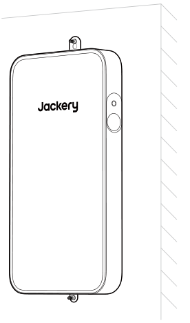

<figure class="hb-reference-figure hb-base-art-live-copy" data-component-id="HB-SPECIAL-REFERENCE-FIGURE" data-reference-id="concrete-1-2" data-source-fragment-sha256="bc32ed46c5b5af61025f5d7c1097f7389fc2deaacca1a5a336c67dd12f97eedd" data-web-base-art-ref="concrete-1-2" data-web-presentation-mode="base-art-live-copy">

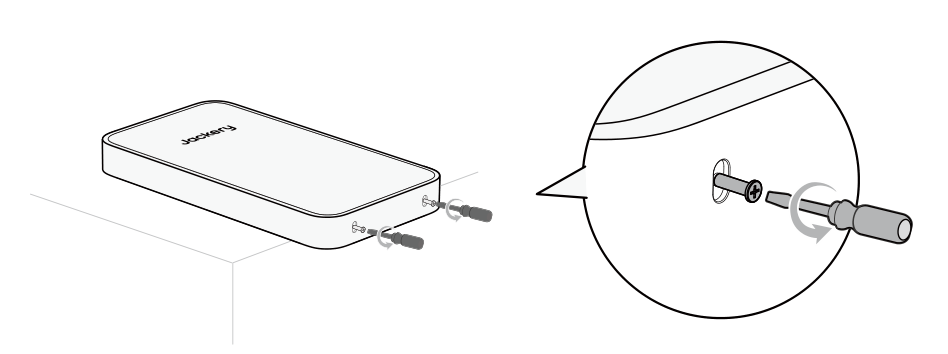1. Install the Jackery FridgeGuard according to the user manual.2. Remove two screws from the bottom of the Battery Pack.

</figure>

<figure class="hb-reference-figure hb-base-art-live-copy" data-component-id="HB-SPECIAL-REFERENCE-FIGURE" data-reference-id="concrete-3" data-source-fragment-sha256="ac58535bcc15f3ee633f7543a0a643c59699ce8eef6b1829815772d37f5567d6" data-web-base-art-ref="concrete-3" data-web-presentation-mode="base-art-live-copy">

3. Securely attach the upper and lower mounting brackets to the back of the Battery Pack.

</figure>

<figure class="hb-reference-figure hb-base-art-live-copy" data-component-id="HB-SPECIAL-REFERENCE-FIGURE" data-reference-id="concrete-4-5" data-source-fragment-sha256="d87abb9f98d491263daa0f4dfb617bcfddc257459cdd95e401874504c299a298" data-web-base-art-ref="concrete-4-5" data-web-presentation-mode="base-art-live-copy">

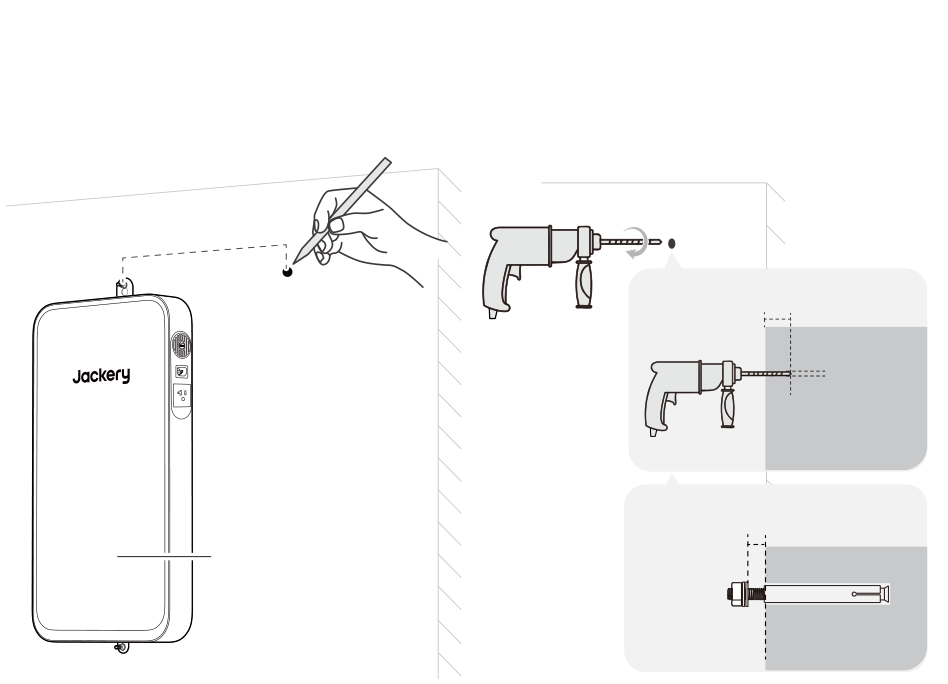4. Measure a horizontal distance of 406mm (16 in) from the bolt position on the Jackery FridgeGuard, and mark the mounting point on the wall.* 406mm (16 in) is the recommended distance, and actual distance depends on wall conditions.406mm (16 in)Jackery FridgeGuard5. Drill a hole at the mounting point using an 8mm masonry impact drill to a depth of approximately 70mm. Insert an expansion bolt and loosen its nut by 2-4mm.70mm2~4mm8mm

</figure>

<figure class="hb-reference-figure hb-base-art-live-copy" data-component-id="HB-SPECIAL-REFERENCE-FIGURE" data-reference-id="concrete-6-7" data-source-fragment-sha256="205f597a27d503eba199f8dbf5cb6d2347e71aea68e3ad2b88f6d6500541e61f" data-web-base-art-ref="concrete-6-7" data-web-presentation-mode="base-art-live-copy">

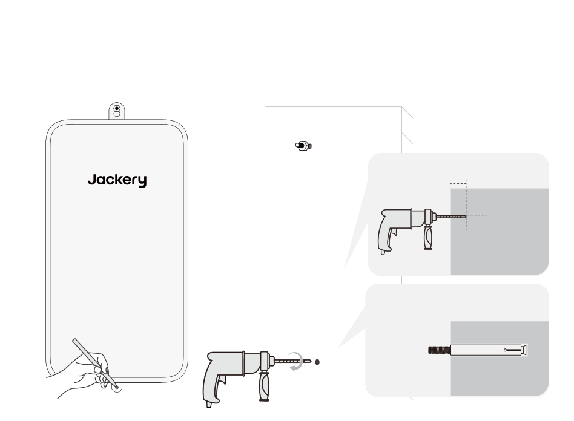6. Hang the Battery Pack onto the expansion bolt vertically and mark the mounting point on the wall.7. Remove the product. Drill a hole at the mounting point and insert an expansion bolt without the nut and washer into the hole.70mm8mm

</figure>

<figure class="hb-reference-figure hb-base-art-live-copy" data-component-id="HB-SPECIAL-REFERENCE-FIGURE" data-reference-id="concrete-8-9" data-source-fragment-sha256="d8303152eae226cae56598e21d504a281e0e47da5ba446184fc2dfc1b240a3d9" data-web-base-art-ref="concrete-8-9" data-web-presentation-mode="base-art-live-copy">

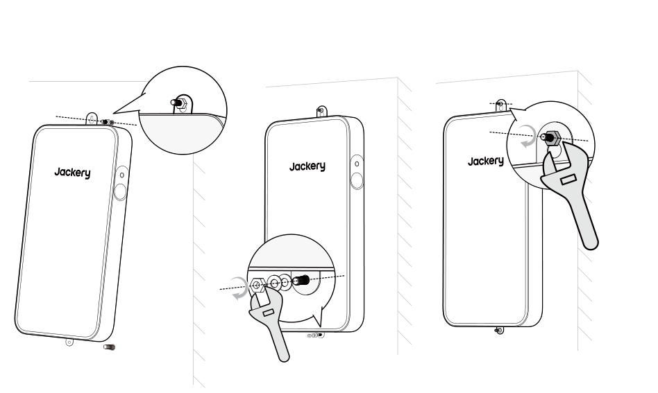8. Hang the product onto the upper expansion bolt.9. Lift the product to align the pre-installed bolt and lower it into place. Tighten the nut.

</figure>

# CONNECTIONS

Jackery Battery Pack can be used along with Jackery FridgeGuard to meet the increased capacity needs.

<table class="manual-callout-table manual-callout-table"><tbody><tr><td class="manual-callout-label">CAUTION</td><td class="manual-callout-body">
Ensure all products are powered off before connecting the Jackery FridgeGuard to the Jackery Battery Pack.
</td></tr></tbody></table>

<table class="manual-callout-table manual-callout-table"><tbody><tr><td class="manual-callout-label">NOTES</td><td class="manual-callout-body">
The display of the icon  on the LCD screen (Jackery FridgeGuard) signifies a successful connection between the battery pack and the Jackery FridgeGuard.
</td></tr></tbody></table>

# CHARGING

## CHARGING VIA AC WALL OUTLET

When charging from the wall, this product must be used with Jackery FridgeGuard.

<table class="manual-callout-table manual-callout-table"><tbody><tr><td class="manual-callout-label">WARNING</td><td class="manual-callout-body">
Ensure all products are powered off before connecting the Jackery FridgeGuard to the Jackery Battery Pack.
</td></tr></tbody></table>

## CHARGING VIA SOLAR PANELS (SOLD SEPARATELY)

Charge your product with solar panels and Jackery DC Input Module as shown in the figure below. Please refer to the Jackery DC Input Module user manual for more information.

<figure class="hb-reference-figure hb-base-art-live-copy" data-component-id="HB-SPECIAL-REFERENCE-FIGURE" data-reference-id="solar" data-source-fragment-sha256="f22437451b71c691729af99ef4443af2145b0d02b6d23ae7128a0012024e57d7" data-web-base-art-ref="solar" data-web-presentation-mode="base-art-live-copy">

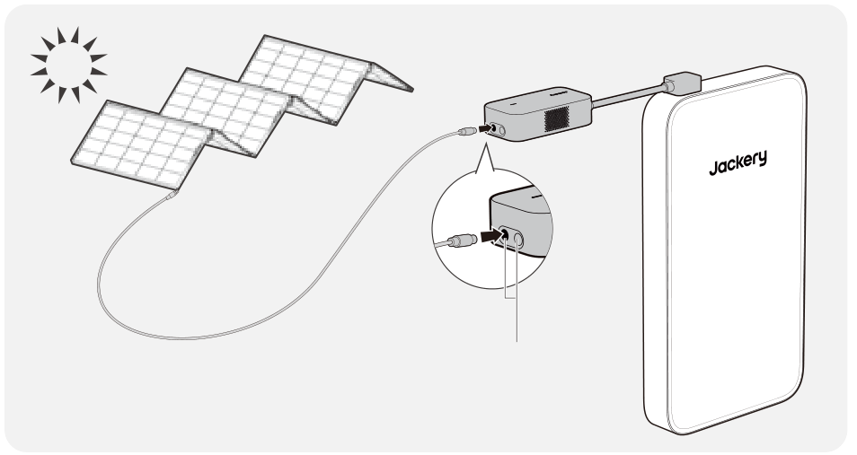SolarSaga 500 XDC8020

</figure>

*The Jackery DC Input Module is sold separately.

## CHARGING WITH A CAR CHARGER (SOLD SEPARATELY)

Charge your product with car charger and Jackery DC Input Module as shown in the figure below. Please refer to the Jackery DC Input Module user manual for more information.

<figure class="hb-reference-figure hb-base-art-live-copy" data-component-id="HB-SPECIAL-REFERENCE-FIGURE" data-reference-id="car" data-source-fragment-sha256="d88e9dd241317e0965c1260eb8ffa88b4abd74d64ac5992505b1a1fc83417892" data-web-base-art-ref="car" data-web-presentation-mode="base-art-live-copy">

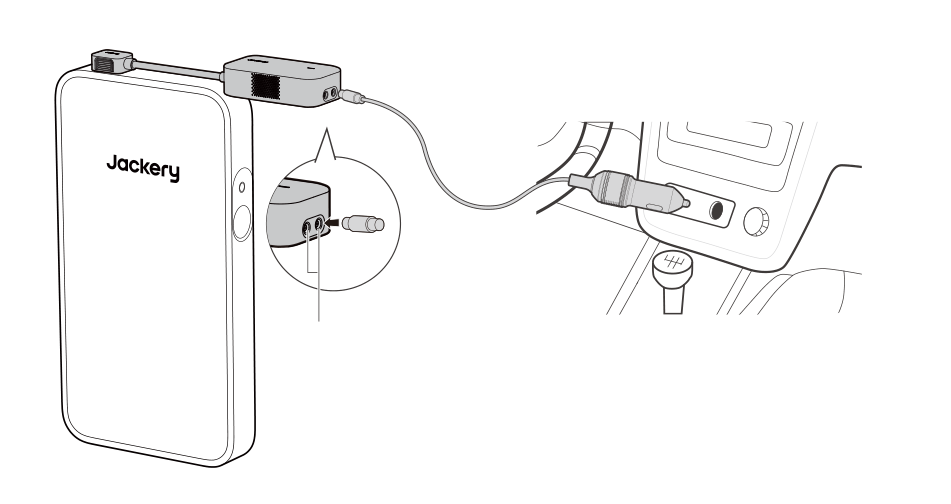VehicleDC8020※ The car charging cable and Jackery DC Input Module are sold separately.

</figure>

# STORAGE

Store the product in a dry clean place with proper ventilation. Storage temperature and humidity:

<ul><li>1 month: -4°F to 113°F / -20°C to 45°C (0-60%RH)</li><li>3 months: 32°F to 113°F / 0°C to 45°C (0-60%RH)</li><li>12 months: 32°F to 77°F / 0°C to 25°C (0-60%RH)</li></ul>

If this product is stored for a long period of time (3 months - 6 months) with the power depleted, it may become unchargeable. To prevent this and maintain battery health, it is recommended to check and recharge the product every three months and perform a full charge and discharge cycle at least once every 6 to 12 months.

# SPECIFICATIONS

<h2 class="hb-spec-group">GENERAL INFO</h2>

<figure aria-label="GENERAL INFO" class="hb-spec-table-composition"><table class="manual-table manual-spec-table hb-spec-table"><colgroup><col class="hb-spec-col-label"/><col class="hb-spec-col-value"/></colgroup><tbody><tr><th class="manual-spec-label hb-spec-label" scope="row">Product Name</th><td class="manual-spec-value hb-spec-value">Jackery Battery Pack</td></tr><tr><th class="manual-spec-label hb-spec-label" scope="row">Model No.</th><td class="manual-spec-value hb-spec-value">JBP-1000B-SIL</td></tr><tr><th class="manual-spec-label hb-spec-label" scope="row">Capacity</th><td class="manual-spec-value hb-spec-value">20Ah / 51.2Vdc (1024 Wh)</td></tr><tr><th class="manual-spec-label hb-spec-label" scope="row">Cell Chemistry</th><td class="manual-spec-value hb-spec-value">LiFePO₄</td></tr><tr><th class="manual-spec-label hb-spec-label" scope="row">Weight</th><td class="manual-spec-value hb-spec-value">About 19.8 lbs/9 kg</td></tr><tr><th class="manual-spec-label hb-spec-label" scope="row">Dimensions</th><td class="manual-spec-value hb-spec-value">23.6 × 12.8 × 2.4 in/60 × 32.5 × 6 cm</td></tr><tr><th class="manual-spec-label hb-spec-label" scope="row">Cycle Life</th><td class="manual-spec-value hb-spec-value">6000 cycles to 70%+ capacity</td></tr></tbody></table></figure>

<h2 class="hb-spec-group">INPUT/OUTPUT PORTS</h2>

<figure aria-label="INPUT/OUTPUT PORTS" class="hb-spec-table-composition"><table class="manual-table manual-spec-table hb-spec-table"><colgroup><col class="hb-spec-col-label"/><col class="hb-spec-col-value"/></colgroup><tbody><tr><th class="manual-spec-label hb-spec-label" scope="row">DC Expansion Port (Input)</th><td class="manual-spec-value hb-spec-value">40V-57.6V⎓24A Max</td></tr><tr><th class="manual-spec-label hb-spec-label" scope="row">DC Expansion Port (Output)</th><td class="manual-spec-value hb-spec-value">40V-57.6V⎓50A Max</td></tr><tr><th class="manual-spec-label hb-spec-label" scope="row">Maximum Short Circuit Current and Duration</th><td class="manual-spec-value hb-spec-value">1250A/1.55ms</td></tr></tbody></table></figure>

<h2 class="hb-spec-group">ENVIRONMENTAL OPERATING TEMPERATURE</h2>

<figure aria-label="ENVIRONMENTAL OPERATING TEMPERATURE" class="hb-spec-table-composition"><table class="manual-table manual-spec-table hb-spec-table"><colgroup><col class="hb-spec-col-label"/><col class="hb-spec-col-value"/></colgroup><tbody><tr><th class="manual-spec-label hb-spec-label" scope="row">Charge Temperature</th><td class="manual-spec-value hb-spec-value">-4°F to 113°F / -20°C to 45°C</td></tr><tr><th class="manual-spec-label hb-spec-label" scope="row">Discharge Temperature</th><td class="manual-spec-value hb-spec-value">-4°F to 113°F / -20°C to 45°C</td></tr></tbody></table></figure>

# WARRANTY

<figure aria-label="Warranty" class="hb-warranty-intro-composition" data-component-id="HB-WARRANTY-LEAD">
We only provide our warranty to customers who purchase from the official Jackery website, Jackery-branded third-party platforms, or local authorized dealers.

*Warranty period and details may vary according to local laws, regulations, and authorized dealers.
</figure>

## Limited Warranty

<figure aria-label="Limited Warranty" class="hb-warranty-card" data-component-id="HB-WARRANTY-SECTION" data-warranty-card-index="1">
Jackery Inc. warrants to the original consumer purchaser that the Jackery product will be free from defects in workmanship and material under normal consumer use during the applicable warranty period identified in the 'Warranty Period' section below, subject to the exclusions set forth below.

This warranty statement sets forth Jackery's total and exclusive warranty obligation. We will not assume, nor authorize any person to assume for us, any other liability in connection with the sale of our products.
</figure>

## Warranty Period

<figure aria-label="Warranty Period" class="hb-warranty-period-card" data-component-id="HB-WARRANTY-YEARS">

3
<strong class="hb-warranty-years-unit">YEARS</strong><strong class="hb-warranty-period-label">Standard Warranty</strong>

The standard warranty period for Jackery Battery Pack is 36 months. In each case, the warranty period is measured starting on the date of purchase by the original consumer purchaser. The sales receipt from the first consumer purchaser, or other reasonable documentary proof, is required in order to establish the start date of the warranty period.

2
<strong class="hb-warranty-years-unit">YEARS</strong><strong class="hb-warranty-period-label">Extended Warranty</strong>

To activate the Warranty Extension, you must register your product online or contact our customer service team at hello@jackery.com to extend the standard warranty runtime.

</figure>

## Repair or replacement

<figure aria-label="Repair or replacement" class="hb-warranty-card" data-component-id="HB-WARRANTY-SECTION" data-warranty-card-index="3">
Jackery will repair or replace (at Jackery's expense) any Jackery product that fails to operate during the applicable warranty period due to a defect in workmanship or material. The repaired/replaced product assumes the remaining warranty of the original date of purchase.
</figure>

## Limited to Original Consumer Buyer

<figure aria-label="Limited to Original Consumer Buyer" class="hb-warranty-card" data-component-id="HB-WARRANTY-SECTION" data-warranty-card-index="4">
The warranty on Jackery's product is limited to the original consumer purchaser and is not transferable to any subsequent owner.
</figure>

## Exclusions

<figure aria-label="Exclusions" class="hb-warranty-card" data-component-id="HB-WARRANTY-SECTION" data-warranty-card-index="5">
Jackery's warranty does not apply to:
<ul><li>Misused, abused, modified, damaged by accident, or used for anything other than normal consumer use as authorized in Jackery's current product literature.</li><li>Attempted repair by anyone other than an authorized facility.</li><li>Any product purchased through an online auction house.</li><li>Jackery's warranty does not apply to the battery cell unless the battery cell is fully charged by you within seven days after you purchase the product and at least once every 6 months thereafter.</li></ul></figure>

## Interpretation Rights

<figure aria-label="Interpretation Rights" class="hb-warranty-card" data-component-id="HB-WARRANTY-SECTION" data-warranty-card-index="6">
Jackery reserves the right to final interpretation of the above customers' after-sales policy.
</figure>

# JACKERY INC.

5310 Bunche Dr., Fremont, CA 94538-8301

hello@jackery.com www.jackery.com 1-888-502-2236 (US)

