

<h1 class="hb-preface-heading" id="preface">ES IMPORTANTE</h1>

Felicitaciones por su nuevo Jackery Battery Pack. Antes de utilizar el producto, lea cuidadosamente este manual, especialmente las precauciones relevantes para asegurar un uso adecuado. Mantenga este manual en un lugar accesible para futuras consultas.

De acuerdo con las leyes y regulaciones, el derecho de interpretación final de este documento y todos los documentos relacionados con este producto corresponde a la Empresa. Aunque se ha hecho todo lo posible para garantizar la exactitud de este manual, Jackery Inc. no asume ninguna responsabilidad por los errores que puedan aparecer.

Tenga en cuenta que no se emitirán notificaciones adicionales en caso de actualizaciones, revisiones o terminación. Para obtener la última versión de los manuales del producto, visite support.jackery.com.

* Las cifras son sólo de referencia. Consulte el producto real.

# INFORMACIÓN IMPORTANTE DE SEGURIDAD

Se deben seguir las precauciones básicas de seguridad al utilizar este producto, incluyendo:

<ul><li>Leer todas las instrucciones antes de utilizar este producto.</li><li>Se requiere una atenta supervisión cuando se utiliza este producto cerca de los niños para reducir el riesgo.</li><li>Puede haber riesgo de descarga eléctrica si se utilizan accesorios no recomendados o vendidos por fabricantes de productos no profesionales.</li><li>Cuando el producto no esté en uso, desconecte el enchufe del producto.</li><li>No desmonte el producto, ya que puede provocar riesgos imprevisibles como incendios, explosiones o descargas eléctricas.</li><li>No utilice el producto con cables o enchufes dañados, o con cables de salida dañados, ya que pueden provocar una descarga eléctrica.</li><li>Cargue el producto en un área bien ventilada y no restrinja la ventilación de ninguna manera.</li><li>Por favor, coloque el producto en un lugar ventilado y seco para evitar que la lluvia y el agua provoquen una descarga eléctrica.</li><li>No exponga el producto al fuego o a altas temperaturas (bajo la luz directa del sol o en un vehículo con mucho calor), ya que puede provocar accidentes como incendios y explosiones.</li><li>Si este producto se almacena durante un largo periodo de tiempo (3 a 6 meses) con la batería descargada, podría volverse imposible de recargar.</li></ul>

# SIGNIFICADO DE LOS SÍMBOLOS

<figure aria-label="Signal words" class="hb-symbol-signal-composition" data-component-id="HB-TABLE-SYMBOL-SIGNAL"><table class="hb-symbol-signal-table"><colgroup><col class="hb-symbol-signal-col-label"/><col class="hb-symbol-signal-col-meaning"/></colgroup><thead><tr><th class="hb-symbol-signal-label-heading" scope="col">Símbolo</th><th class="hb-symbol-signal-meaning-heading" scope="col">Significados</th></tr></thead><tbody><tr><td class="hb-symbol-signal-label-cell">⚠ADVERTENCIA</td><td class="hb-symbol-signal-meaning-cell">Prácticas peligrosas que pueden resultar en lesiones graves, muerte y/o daños a la propiedad.</td></tr><tr><td class="hb-symbol-signal-label-cell">⚠PRECAUCIÓN</td><td class="hb-symbol-signal-meaning-cell">Prácticas peligrosas que pueden resultar en lesiones personales y/o daños a la propiedad.</td></tr><tr><td class="hb-symbol-signal-label-cell">⚠NOTA</td><td class="hb-symbol-signal-meaning-cell">Prácticas peligrosas que pueden resultar en daño al equipo, pérdida de datos, deterioro del rendimiento o resultados inesperados.</td></tr><tr><td class="hb-symbol-signal-label-cell">⚠CONSEJOS</td><td class="hb-symbol-signal-meaning-cell">Complementa la información importante o consejos de operación en el texto.</td></tr></tbody></table></figure>

<figure aria-label="Safety symbols" class="hb-symbol-pair-composition" data-component-id="HB-TABLE-SYMBOL-ICON">

<table class="hb-symbol-panel-table"><colgroup><col class="hb-symbol-col-icon"/><col class="hb-symbol-col-meaning"/></colgroup><thead><tr><th class="hb-symbol-icon-heading" scope="col">Símbolo</th><th class="hb-symbol-meaning-heading" scope="col">Significados</th></tr></thead><tbody><tr><td class="hb-symbol-icon"></td><td class="hb-symbol-meaning">Precaución! El incumplimiento de los mensajes de advertencia puede provocar lesiones.</td></tr><tr><td class="hb-symbol-icon"></td><td class="hb-symbol-meaning">Lea el manual del operador</td></tr><tr><td class="hb-symbol-icon"></td><td class="hb-symbol-meaning">No desarme el producto.</td></tr><tr><td class="hb-symbol-icon"></td><td class="hb-symbol-meaning">No fumar ni hacer llamas abiertas</td></tr><tr><td class="hb-symbol-icon"></td><td class="hb-symbol-meaning">No se permiten niños</td></tr></tbody></table>

<table class="hb-symbol-panel-table"><colgroup><col class="hb-symbol-col-icon"/><col class="hb-symbol-col-meaning"/></colgroup><thead><tr><th class="hb-symbol-icon-heading" scope="col">Símbolo</th><th class="hb-symbol-meaning-heading" scope="col">Significados</th></tr></thead><tbody><tr><td class="hb-symbol-icon"></td><td class="hb-symbol-meaning">Este símbolo indica que el producto contiene una batería de iones de litio (Li-ion), la cual debe desecharse o reciclarse de forma adecuada.</td></tr><tr><td class="hb-symbol-icon"></td><td class="hb-symbol-meaning">Este símbolo indica que el producto no debe desecharse con los residuos domésticos. En su lugar, debe llevarse a un punto de recogida designado para su correcto reciclaje. El desecho y reciclaje adecuados ayudan a proteger el medioambiente. Para más información, póngase en contacto con su autoridad local, el servicio de gestión de residuos o el distribuidor del producto.</td></tr></tbody></table>

</figure>

# FCC

<figure aria-label="FCC" class="hb-fcc-composition" data-component-id="HB-SPECIAL-FCC">

Este dispositivo cumple con la parte 15 de la normativa FCC. Su operación está sujeta a las siguientes dos condiciones:

(1) este dispositivo no debe causar interferencias dañinas, y

(2) este dispositivo debe aceptar cualquier interferencia recibida, incluyendo interferencias que puedan causar un funcionamiento no deseado.

<strong>NOTA:</strong> Este aparato ha sido probado y cumple con los límites para un dispositivo digital de Clase B, de acuerdo con el Apartado 15 de las Reglas de la FCC. Estos límites están diseñados para proporcionar una protección razonable contra interferencias perjudiciales en una instalación residencial. Este aparato genera, usa y puede irradiar energía de radiofrecuencia y, si no se instala y utiliza de acuerdo con las instrucciones, puede causar interferencias perjudiciales en las comunicaciones por radio.

Sin embargo, no hay garantía de que no se produzcan interferencias en una instalación concreta. Si este aparato causa interferencias dañinas en la recepción de radio o televisión, lo cual puede determinarse encendiendo y apagando el equipo, se recomienda al usuario que intente corregir la interferencia mediante una o varias de las siguientes medidas:
<ul class="simple"><li>
Reorientar o reubicar la antena receptora.
</li><li>
Aumentar la separación entre el equipo y el receptor.
</li><li>
Conecte el aparato a una toma de corriente en un circuito diferente al que está conectado el receptor.
</li><li>
Consulte con el distribuidor o con un técnico de radio o TV experimentado para recibir ayuda.
</li></ul>
<strong>MODIFICACIÓN:</strong> Cualquier cambio o modificación no aprobado expresamente por el cesionario de este dispositivo podría anular la autoridad del usuario para utilizar el dispositivo.

</figure>

# CONTENIDO DE LA CAJA

<figure aria-label="What's in the box" class="hb-inbox-composition" data-card-count="4" data-component-id="HB-SPECIAL-INBOX" data-inbox-variant="responsive-card-grid"><ol class="hb-inbox-grid"><li class="hb-inbox-card" data-item-number="1">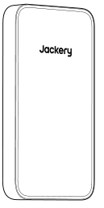

Jackery Battery Pack

</li><li class="hb-inbox-card" data-item-number="2">

Cable de expansión

</li><li class="hb-inbox-card" data-item-number="3">

Documentos

</li><li class="hb-inbox-card" data-item-number="4">

Soporte Vertical

</li></ol></figure>

# DESCRIPCIÓN GENERAL DEL PRODUCTO

<figure class="hb-reference-figure hb-base-art-live-copy" data-component-id="HB-SPECIAL-REFERENCE-FIGURE" data-reference-id="overview" data-source-fragment-sha256="59c7d420b244dd8f8744e9165289687e628294511ef50ff74c45be3e17753b98" data-web-base-art-ref="overview" data-web-presentation-mode="base-art-live-copy">

Puerto de expansiónEntrada:40V-57,6V⎓24A MáxSalida:40V-57,6V⎓50A MáxBotón de encendido principalPantalla LCD

</figure>

# PANTALLA LCD

<figure class="hb-reference-figure hb-base-art-live-copy" data-component-id="HB-SPECIAL-REFERENCE-FIGURE" data-reference-id="lcd" data-source-fragment-sha256="03e21106852d242795966b24aa9810919ea195cada895b83a1562d154766433f" data-web-base-art-ref="lcd" data-web-presentation-mode="base-art-live-copy">

123754613

</figure>

<figure aria-label="LCD indicators" class="hb-lcd-table-composition" data-component-id="HB-TABLE-LCD-ICON" tabindex="0"><table class="hb-lcd-icon-table"><colgroup><col class="hb-lcd-col-number"/><col class="hb-lcd-col-icon"/><col class="hb-lcd-col-name"/><col class="hb-lcd-col-description"/></colgroup><tbody><tr><td class="hb-lcd-number">1</td><td class="hb-lcd-icon"></td><td class="hb-lcd-name">Potencia de Entrada / Tiempo de Carga Restante</td><td class="hb-lcd-description">Muestra alternativamente la potencia de entrada y el tiempo de carga restante.</td></tr><tr><td class="hb-lcd-number">2</td><td class="hb-lcd-icon"></td><td class="hb-lcd-name">Porcentaje de Batería Restante</td><td class="hb-lcd-description">Muestra el porcentaje de batería restante.</td></tr><tr><td class="hb-lcd-number">3</td><td class="hb-lcd-icon"></td><td class="hb-lcd-name">Potencia de Salida / Tiempo de Descarga Restante</td><td class="hb-lcd-description">Muestra alternativamente la potencia de salida y el tiempo de descarga restante.</td></tr><tr><td class="hb-lcd-number">4</td><td class="hb-lcd-icon"></td><td class="hb-lcd-name">Indicador de carga</td><td class="hb-lcd-description"><strong>Encendido :</strong> el Jackery Battery Pack está en estado de carga. <strong>Apagado :</strong> el Jackery Battery Pack no está en estado de carga.</td></tr><tr><td class="hb-lcd-number">5</td><td class="hb-lcd-icon"></td><td class="hb-lcd-name">Indicador de Potencia de la Batería</td><td class="hb-lcd-description">El círculo naranja indica el nivel de batería restante.</td></tr><tr><td class="hb-lcd-number">6</td><td class="hb-lcd-icon"></td><td class="hb-lcd-name">Entrada de CC</td><td class="hb-lcd-description"><strong>Encendido :</strong> El Módulo de Entrada CC de Jackery está conectado. <strong>Apagado :</strong> El Módulo de Entrada CC de Jackery está desconectado.</td></tr><tr><td class="hb-lcd-number">7</td><td class="hb-lcd-icon"></td><td class="hb-lcd-name">Código de fallo</td><td class="hb-lcd-description">Se ha producido un error en el producto. Por favor, consulte la sección de solución de problemas para más detalles.</td></tr></tbody></table></figure>

# OPERACIONES

## ENCENDIDO/APAGADO

<figure class="hb-reference-figure hb-base-art-live-copy" data-component-id="HB-SPECIAL-REFERENCE-FIGURE" data-reference-id="power" data-source-fragment-sha256="8c9a89327f12aa442ae5001db31f6153b0a4a71961c3cdd9fbd624d2feaf8f8f" data-web-base-art-ref="power" data-web-presentation-mode="base-art-live-copy">

EncendidoPresione una vezApagadoMantén presionado durante 3 segundos3s

</figure><table class="manual-callout-table manual-callout-table"><tbody><tr><td class="manual-callout-label">NOTA</td><td class="manual-callout-body">
El producto se apagará automáticamente si no se carga o no se conectan cargos durante 2 horas.
</td></tr></tbody></table>

## ENCENDER/APAGAR PANTALLA LCD

<figure aria-label="ENCENDER/APAGAR PANTALLA LCD" class="hb-lcd-mode-composition hb-lcd-mode-portrait" data-component-id="HB-TABLE-LCD-MODE">

<table class="hb-lcd-mode-table"><colgroup><col class="hb-lcd-mode-col-state"/><col class="hb-lcd-mode-col-action"/><col class="hb-lcd-mode-col-copy"/></colgroup><tbody><tr><td class="hb-lcd-mode-state" rowspan="3">En breve</td><td class="hb-lcd-mode-action">Encender</td><td class="hb-lcd-mode-copy">Presione el botón de encendido principal o cuando el producto se esté cargando.</td></tr><tr><td class="hb-lcd-mode-action">Apagar</td><td class="hb-lcd-mode-copy">Presione el botón de encendido principal.</td></tr><tr><td class="hb-lcd-mode-action">Apagado automático</td><td class="hb-lcd-mode-copy">La pantalla LCD se apaga automáticamente y entra en modo de suspensión después de 2 minutos de inactividad.</td></tr><tr><td class="hb-lcd-mode-state" rowspan="3">Estable en (durante el estado de carga o descarga)</td><td class="hb-lcd-mode-action">Encender</td><td class="hb-lcd-mode-copy">Presione dos veces el botón de encendido principal cuando el producto está encendido.</td></tr><tr><td class="hb-lcd-mode-action">Apagar</td><td class="hb-lcd-mode-copy">Presione el botón de energía principal.</td></tr><tr><td class="hb-lcd-mode-action">Apagado automático</td><td class="hb-lcd-mode-copy">El modo de estable se apaga automáticamente después de 2 horas de inactividad.</td></tr></tbody></table>
</figure>

# RESOLUCIÓN DE PROBLEMAS

Si aparece alguno de los siguientes códigos de falla, siga las acciones correctivas listadas para resolver el problema.Si la falla persiste, por favor contacte con atención al cliente de Jackery.

<figure aria-label="Código de error / Medidas correctivas" class="hb-troubleshooting-composition" data-component-id="HB-TABLE-TROUBLESHOOTING" tabindex="0"><table class="hb-troubleshooting-table"><colgroup><col class="hb-troubleshooting-col-code"/><col class="hb-troubleshooting-col-measures"/></colgroup><thead><tr><th class="hb-troubleshooting-code" scope="col">Código de error</th><th class="hb-troubleshooting-measures" scope="col">Medidas correctivas</th></tr></thead><tbody><tr><td class="hb-troubleshooting-code">F0 / F2 / F3</td><td class="hb-troubleshooting-measures">Reiniciar el producto.</td></tr><tr><td class="hb-troubleshooting-code">F1 / F6 / F7 / F8</td><td class="hb-troubleshooting-measures">Contacte con atención al cliente de Jackery.</td></tr><tr><td class="hb-troubleshooting-code">F4</td><td class="hb-troubleshooting-measures">Conecte el producto a cargas para descargar su batería hasta que la falla desaparezca.</td></tr><tr><td class="hb-troubleshooting-code">F5</td><td class="hb-troubleshooting-measures">Cargue el producto mediante paneles solares o toma de corriente CA hasta que la falla desaparezca.</td></tr><tr><td class="hb-troubleshooting-code">FF</td><td class="hb-troubleshooting-measures">
<strong>En condiciones de alta temperatura:</strong>
<ol><li>Desconecte todos los cables de carga y descarga del producto (incluyendo cargador de pared, paneles solares, cargador de coche y dispositivos de carga).</li><li>Coloque el producto en un área sombreada y bien ventilada donde la temperatura ambiente sea inferior a 113°F (45 °C).</li><li>Mantenga el producto en reposo y espere a que la falla desaparezca.</li><li>Si la falla persiste después de varios intentos, contacte al distribuidor o al Servicio de Atención al Cliente de Jackery.</li></ol>
<strong>En condiciones de baja temperatura:</strong>
<ol><li>Traslade el producto a un ambiente más cálido por encima de 32°F (0 °C).</li><li>No utilice ni cargue el producto al aire libre en condiciones extremadamente frías. Si es necesario, précaliéntelo en interiores.</li><li>Si el dispositivo se traslada al interior desde un ambiente frío, déjelo reposar un tiempo antes de usarlo.</li><li>Cuando aparezca el indicador de Baja Temperatura, mantenga el producto en reposo y espere a que el sistema se recupere automáticamente.</li><li>Si la falla persiste después de varios intentos, contacte al distribuidor o al Servicio de Atención al Cliente de Jackery.</li></ol></td></tr></tbody></table></figure>

# COLOCACIÓN CON EL JACKERY FRIDGEGUARD

## DISPOSICIÓN EN PARALELO

Coloca el paquete de baterías Jackery FridgeGuard y el Jackery FridgeGuard en una disposición en paralelo.

## APILADOS

Coloca el paquete de baterías Jackery FridgeGuard y el Jackery FridgeGuard apilados uno sobre otro.

## CON SOPORTES

<table class="manual-callout-table manual-callout-table"><tbody><tr><td class="manual-callout-label">PRECAUCIÓN</td><td class="manual-callout-body"><ul><li>No instale el producto en estructuras no portantes, como placas de yeso, muros aislantes o ladrillos huecos, ya que podría caerse.</li><li>Evite los cables eléctricos, tuberías de agua, tuberías de gas y otras instalaciones dentro de las paredes.</li></ul></td></tr></tbody></table>

# SOPORTE VERTICAL

El Jackery Battery Pack instalado con el soporte vertical se puede colocar en el suelo. Siga los pasos de instalación a continuación:
<figure class="hb-reference-figure hb-base-art-live-copy" data-component-id="HB-SPECIAL-REFERENCE-FIGURE" data-reference-id="vertical-prep" data-source-fragment-sha256="40cde0db33ca2d5a799bcfcd09b0eca736b960b1cb1102dafb1d2dfd2a9c7437" data-web-base-art-ref="vertical-prep" data-web-presentation-mode="base-art-live-copy">

Preparación antes de la instalación:

</figure>

1. Remove two screws from the bottom of the product.

2. Alinee los orificios de montaje en la parte inferior del producto con los orificios en el soporte vertical.

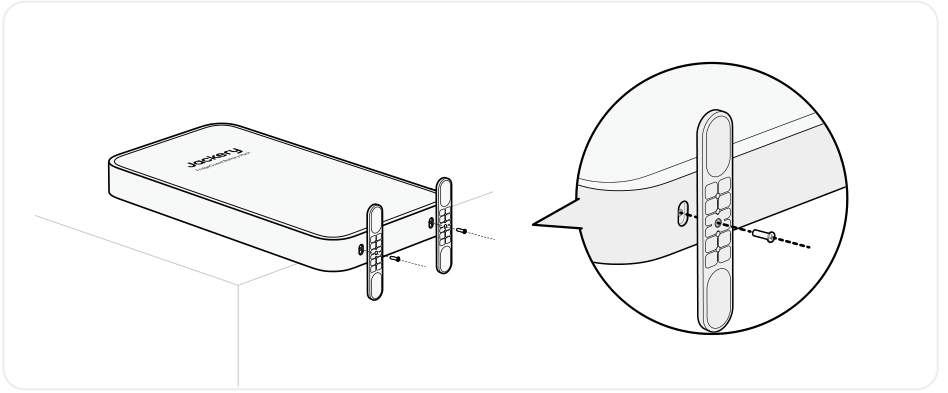

3. Apriete los tornillos.

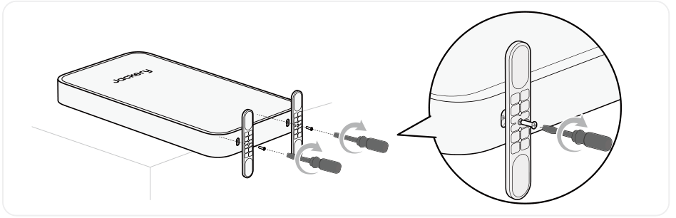

# JACKERY WALL-MOUNTED BRACKET (SE VENDE POR SEPARADO)

El Jackery Battery Pack instalado con el soporte de montaje se puede colocar en la pared. Siga los pasos de instalación a continuación:

## EN PAREDES DE MADERA

<figure class="hb-reference-figure hb-base-art-live-copy" data-component-id="HB-SPECIAL-REFERENCE-FIGURE" data-reference-id="wood-prep" data-source-fragment-sha256="c84865c0e16ec2767e8bf0bb44e629ca104cacf161d0fcc71e421a95ada41cbb" data-web-base-art-ref="wood-prep" data-web-presentation-mode="base-art-live-copy">

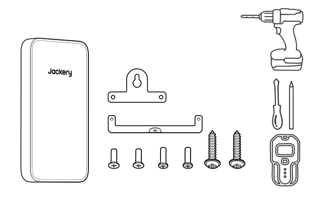Preparación antes de la instalación:SE VENDE POR SEPARADO

</figure>

<figure class="hb-reference-figure hb-base-art-live-copy" data-component-id="HB-SPECIAL-REFERENCE-FIGURE" data-reference-id="wood-result" data-source-fragment-sha256="7dee94a85283863c17dcb4100a220778599b1d71c99fff5d163026c2ed00b33f" data-web-base-art-ref="wood-result" data-web-presentation-mode="base-art-live-copy">

Estructura de madera

</figure>

1. Instala el Jackery FridgeGuard de acuerdo con el manual del usuario. 2. Retire los dos tornillos de la parte inferior del producto.

3. Fije firmemente los soportes de montaje superior e inferior en la parte posterior del producto.

4. Utilice un buscador de montantes para identificar los montantes de madera detrás de la pared.
<figure class="hb-reference-figure hb-base-art-live-copy" data-component-id="HB-SPECIAL-REFERENCE-FIGURE" data-reference-id="wood-4" data-source-fragment-sha256="70c83f32f5139c05004f2dba0482542c929a42591235148c283e44a78c2451d9" data-web-base-art-ref="wood-4" data-web-presentation-mode="base-art-live-copy">

Estructura de madera

</figure>

5. Mide una distancia horizontal de 406 mm (16 in) desde la posición del perno en el Jackery FridgeGuard y marca el punto de montaje en el montante de madera de la pared.

* 406 mm (16 in) es la distancia recomendada. La distancia real depende de las condiciones de la pared.
<figure class="hb-reference-figure hb-base-art-live-copy" data-component-id="HB-SPECIAL-REFERENCE-FIGURE" data-reference-id="wood-5" data-source-fragment-sha256="0b30b5c66d0e668f09fbee45b757599b7125311ac30378fd6b6bc834187abe72" data-web-base-art-ref="wood-5" data-web-presentation-mode="base-art-live-copy">

Estructura de maderaEstructura de madera406 mm (16 in)Jackery FridgeGuard

</figure>

6. Atornille el tornillo para madera en la pared en el punto de montaje, dejando un espacio de 2-4mm entre el tornillo y la pared.
<figure class="hb-reference-figure hb-base-art-live-copy" data-component-id="HB-SPECIAL-REFERENCE-FIGURE" data-reference-id="wood-6" data-source-fragment-sha256="70647904b18f86a9869ebe490b0b473ca340cc9d0d79f2bdd6328b356e3e9ee3" data-web-base-art-ref="wood-6" data-web-presentation-mode="base-art-live-copy">

2~4mmEstructura de maderaJackery FridgeGuard

</figure>

7. Cuelgue el producto verticalmente sobre el tornillo. Atornille el tornillo autorroscante a través del orificio de montaje en el soporte inferior hacia la pared y apriételo. Luego, apriete completamente el tornillo para madera.

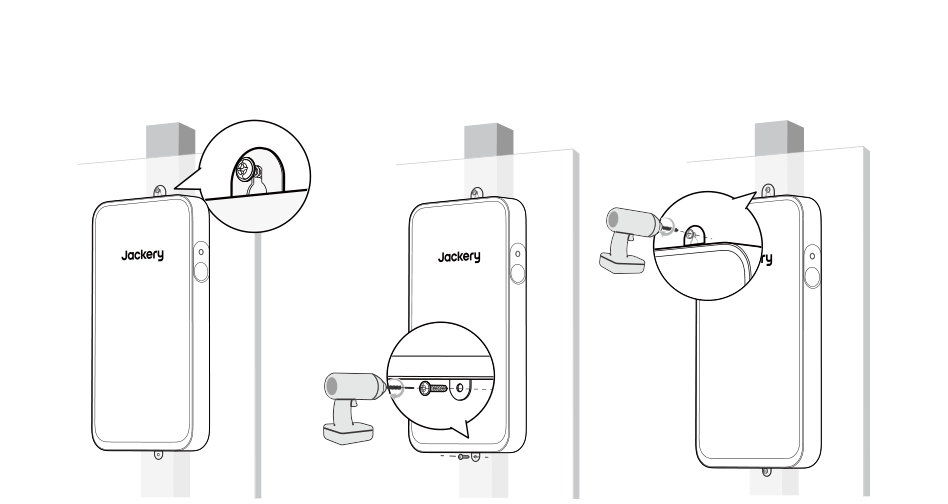

## EN PAREDES DE CONCRETO

Preparación antes de la instalación:

<figure class="hb-reference-figure hb-base-art-live-copy" data-component-id="HB-SPECIAL-REFERENCE-FIGURE" data-reference-id="concrete-prep" data-source-fragment-sha256="200de0359b67f09315424b70e56d7443f276d29275aa17da0d89fc00c63ac623" data-web-base-art-ref="concrete-prep" data-web-presentation-mode="base-art-live-copy">

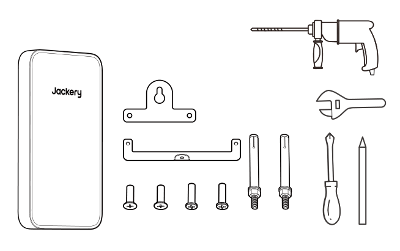SE VENDE POR SEPARADO

</figure>

1. Instala el Jackery FridgeGuard de acuerdo con el manual del usuario. 2. Retire los dos tornillos de la parte inferior del producto.

3. Fije firmemente los soportes de montaje superior e inferior en la parte posterior del producto.

4. Mide una distancia horizontal de 406 mm (16 in) desde la posición del perno en el Jackery FridgeGuard y marca el punto de montaje en el montante de madera de la pared.

* 406 mm (16 in) es la distancia recomendada. La distancia real depende de las condiciones de la pared.
<figure class="hb-reference-figure hb-base-art-live-copy" data-component-id="HB-SPECIAL-REFERENCE-FIGURE" data-reference-id="concrete-4" data-source-fragment-sha256="f9356f888d233301588fe9f250d1a94c8db922094523551e30351c802c54765b" data-web-base-art-ref="concrete-4" data-web-presentation-mode="base-art-live-copy">

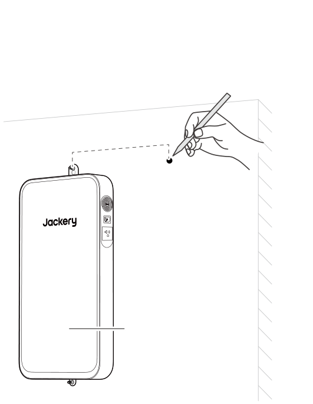406 mm (16 in)Jackery FridgeGuard

</figure>

5. Perfore un agujero en el punto de montaje utilizando un taladro de impacto para mampostería de 8mm hasta una profundidad de aproximadamente 70mm. Inserta un perno de expansión y afloja su tuerca de 2 a 4 mm.
<figure class="hb-reference-figure hb-base-art-live-copy" data-component-id="HB-SPECIAL-REFERENCE-FIGURE" data-reference-id="concrete-5" data-source-fragment-sha256="c0c60625d2ef6a1ea7b4fa5a4a61d36e0fd0ab71e593053c9907f6fc16b1bf98" data-web-base-art-ref="concrete-5" data-web-presentation-mode="base-art-live-copy">

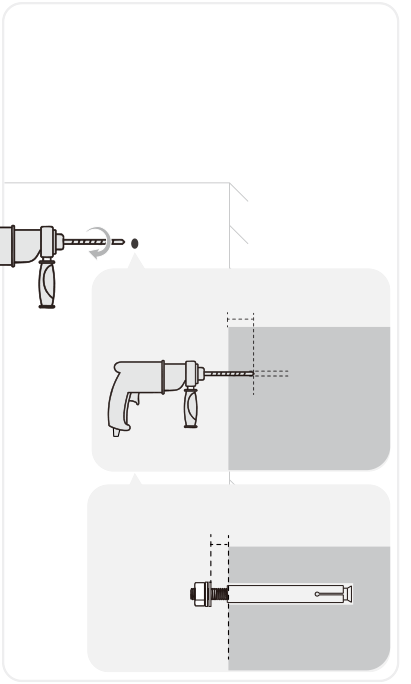70mm2~4mm8mm

</figure>

6. Cuelga el producto verticalmente en el perno de expansión y marca el punto de montaje en la pared.

7. Retira el producto. Perfora un orificio en el punto de montaje e inserta un perno de expansión sin la tuerca y la arandela en el agujero.
<figure class="hb-reference-figure hb-base-art-live-copy" data-component-id="HB-SPECIAL-REFERENCE-FIGURE" data-reference-id="concrete-7" data-source-fragment-sha256="e9b8f2a12516dd6c38815f9d180d037acc45d3b1908a69418abd6f0103020a04" data-web-base-art-ref="concrete-7" data-web-presentation-mode="base-art-live-copy">

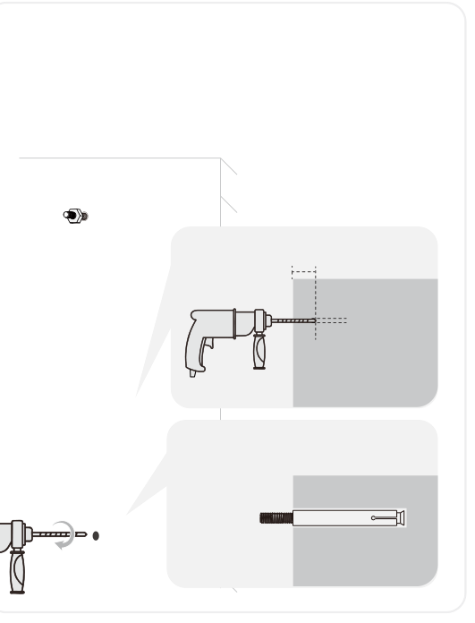70mm8mm

</figure>

8. Cuelga el producto en el perno de expansión superior.

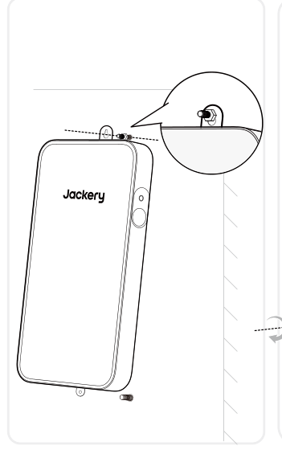

9. Levanta el producto para alinear el perno preinstalado y bájalo hasta su posición. Aprieta la tuerca.

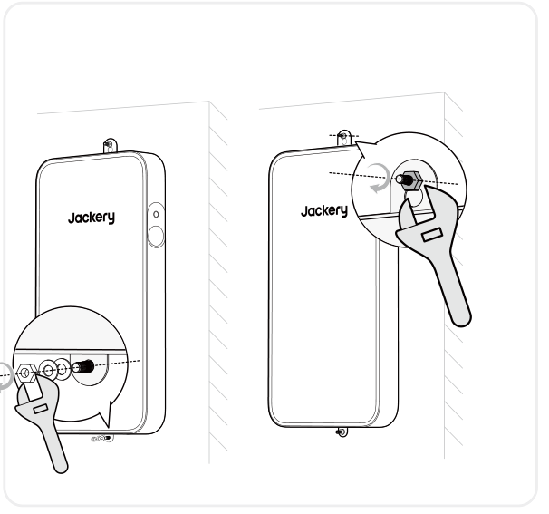

# CONEXIONES

El Paquete de Baterías Jackery FridgeGuard puede usarse junto con el Jackery FridgeGuard para satisfacer las necesidades de mayor capacidad.

<table class="manual-callout-table manual-callout-table"><tbody><tr><td class="manual-callout-label">PRECAUCIÓN</td><td class="manual-callout-body">
Asegúrese de que todos los productos estén apagados antes de conectar el Jackery FridgeGuard al paquete de Jackery Battery Pack.
</td></tr></tbody></table>

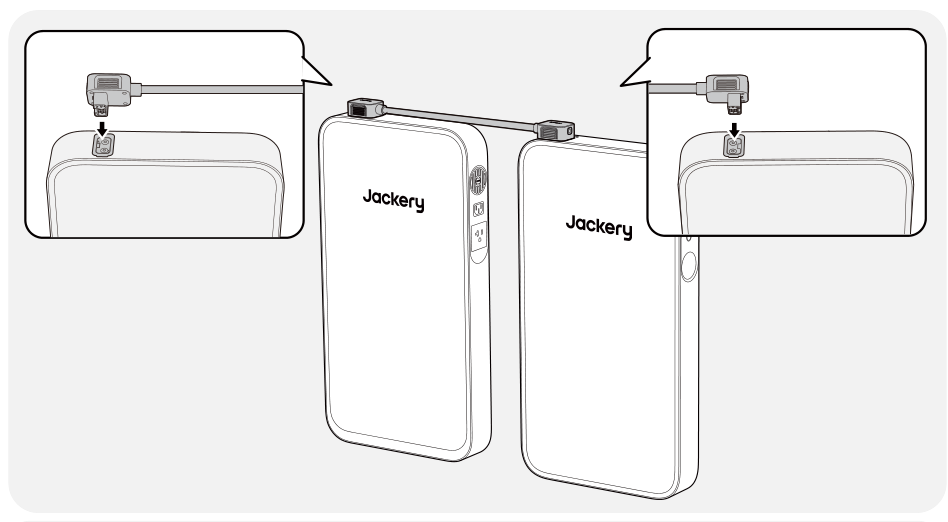

<table class="manual-callout-table manual-callout-table"><tbody><tr><td class="manual-callout-label">Observaciones</td><td class="manual-callout-body">
La aparición del icono  en la pantalla LCD (Jackery FridgeGuard) indica que la conexión entre la batería y el Jackery FridgeGuard se ha realizado correctamente.
</td></tr></tbody></table>

# CARGANDO

## CARGA MEDIANTE UNA TOMA DE CORRIENTE DE PARED ALTERNA

Cuando se carga desde la red, este producto debe utilizarse con Jackery FridgeGuard.

<table class="manual-callout-table manual-callout-table"><tbody><tr><td class="manual-callout-label">Advertencia</td><td class="manual-callout-body">
Asegúrese de que todos los productos estén apagados antes de conectar el Jackery FridgeGuard al paquete de Jackery Battery Pack.
</td></tr></tbody></table>

## CARGA MEDIANTE PANELES SOLARES (SE VENDE POR SEPARADO)

Cargue su producto con paneles solares y el Jackery DC Input Module(SE VENDE POR SEPARADO) como se muestra en la siguiente figura. Consulte el manual de usuario de Jackery DC Input Module para obtener más información.

<figure class="hb-reference-figure hb-base-art-live-copy" data-component-id="HB-SPECIAL-REFERENCE-FIGURE" data-reference-id="solar" data-source-fragment-sha256="f22437451b71c691729af99ef4443af2145b0d02b6d23ae7128a0012024e57d7" data-web-base-art-ref="solar" data-web-presentation-mode="base-art-live-copy">

SolarSaga 500 XDC8020

</figure>

## CARGA CON UN CARGADOR DE EN EL VEHÍCULO(SE VENDE POR SEPARADO)

Carga tu producto con el cargador de coche y el módulo de entrada de CC Jackery(SE VENDE POR SEPARADO) como se muestra en la figura a continuación. Consulta el manual del usuario del módulo de entrada de CC Jackery para obtener más información.

<figure class="hb-reference-figure hb-base-art-live-copy" data-component-id="HB-SPECIAL-REFERENCE-FIGURE" data-reference-id="car" data-source-fragment-sha256="59512e005378bb2d04b9a472fd444dc1072e760633103eab6d5e33d9f8fd1f15" data-web-base-art-ref="car" data-web-presentation-mode="base-art-live-copy">

VehículoDC8020※ El cable de carga para auto se vende por separado.

</figure>

# ALMACENAMIENTO

Almacene el producto en un lugar seco y limpio con ventilación adecuada.Temperatura y humedad de almacenamiento:

<ul><li>1 mes: -4°F a 113°F / -20 a 45 °C (0-60 % HR)</li><li>3 meses: 32°F a 113°F / 0 a 45 °C (0-60 % HR)</li><li>12 meses: 32°F a 77°F / 0 a 25 °C (0-60 % HR)</li></ul>

Si este producto se almacena durante un período prolongado (de 3 a 6 meses) con la batería descargada, podría volverse imposible recargarlo. Para evitar esto y mantener la salud de la batería, se recomienda revisar y recargar el producto cada tres meses, y realizar un ciclo completo de carga y descarga al menos una vez cada 6 a 12 meses.

# ESPECIFICACIONES

<h2 class="hb-spec-group">INFORMACIÓN GENERAL</h2>

<figure aria-label="INFORMACIÓN GENERAL" class="hb-spec-table-composition"><table class="manual-table manual-spec-table hb-spec-table"><colgroup><col class="hb-spec-col-label"/><col class="hb-spec-col-value"/></colgroup><tbody><tr><th class="manual-spec-label hb-spec-label" scope="row">Nombre del producto</th><td class="manual-spec-value hb-spec-value">Jackery Battery Pack</td></tr><tr><th class="manual-spec-label hb-spec-label" scope="row">Nº de modelo</th><td class="manual-spec-value hb-spec-value">JBP-1000B-SIL</td></tr><tr><th class="manual-spec-label hb-spec-label" scope="row">Capacidad</th><td class="manual-spec-value hb-spec-value">20Ah / 51,2Vdc (1024 Wh)</td></tr><tr><th class="manual-spec-label hb-spec-label" scope="row">Química Celular</th><td class="manual-spec-value hb-spec-value">LiFePO₄</td></tr><tr><th class="manual-spec-label hb-spec-label" scope="row">Peso</th><td class="manual-spec-value hb-spec-value">Aproximadamente 19,8 libras/9 kg</td></tr><tr><th class="manual-spec-label hb-spec-label" scope="row">Dimensiones</th><td class="manual-spec-value hb-spec-value">23,6 × 12,8 × 2,4 pulgadas/60 × 32,5 × 6 cm</td></tr><tr><th class="manual-spec-label hb-spec-label" scope="row">Ciclo de vida</th><td class="manual-spec-value hb-spec-value">6000 ciclos de carga hasta 70 % + de capacidad</td></tr></tbody></table></figure>

<h2 class="hb-spec-group">PUERTOS DE ENTRADA/SALIDA</h2>

<figure aria-label="PUERTOS DE ENTRADA/SALIDA" class="hb-spec-table-composition"><table class="manual-table manual-spec-table hb-spec-table"><colgroup><col class="hb-spec-col-label"/><col class="hb-spec-col-value"/></colgroup><tbody><tr><th class="manual-spec-label hb-spec-label" scope="row">Puerto de Expansión de CC (Entrada)</th><td class="manual-spec-value hb-spec-value">40V-57,6V⎓24A Máx.</td></tr><tr><th class="manual-spec-label hb-spec-label" scope="row">Puerto de Expansión de CC (Salida)</th><td class="manual-spec-value hb-spec-value">40V-57,6V⎓50A Máx.</td></tr><tr><th class="manual-spec-label hb-spec-label" scope="row">Corriente máxima de cortocircuito y duración</th><td class="manual-spec-value hb-spec-value">1250A/1.55ms</td></tr></tbody></table></figure>

<h2 class="hb-spec-group">TEMPERATURA DE FUNCIONAMIENTO</h2>

<figure aria-label="TEMPERATURA DE FUNCIONAMIENTO" class="hb-spec-table-composition"><table class="manual-table manual-spec-table hb-spec-table"><colgroup><col class="hb-spec-col-label"/><col class="hb-spec-col-value"/></colgroup><tbody><tr><th class="manual-spec-label hb-spec-label" scope="row">Temperatura de carga</th><td class="manual-spec-value hb-spec-value">-4°F a 113°F / -20°C a 45°C</td></tr><tr><th class="manual-spec-label hb-spec-label" scope="row">Temperatura de descarga</th><td class="manual-spec-value hb-spec-value">-4°F a 113°F / -20°C a 45°C</td></tr></tbody></table></figure>

# GARANTÍA

<figure aria-label="Warranty" class="hb-warranty-intro-composition" data-component-id="HB-WARRANTY-LEAD">
Solo ofrecemos nuestra garantía a clientes que compren en el sitio web oficial de Jackery, plataformas de terceros con la marca Jackery o distribuidores autorizados locales.

* El periodo de garantía y los detalles pueden variar según las leyes, regulaciones y distribuidores autorizados locales.
</figure>

## GARANTÍA LIMITADA

<figure aria-label="GARANTÍA LIMITADA" class="hb-warranty-card" data-component-id="HB-WARRANTY-SECTION" data-warranty-card-index="1">
Jackery Inc. garantiza al consumidor original que el producto Jackery estará libre de defectos relativos al acabado y a los materiales en condiciones normales de uso por parte del consumidor durante el período de garantía aplicable identificado en la sección "Período de garantía" que figura a continuación, sujeto a las exclusiones que se establecen a continuación.

Esta declaración de garantía establece la obligación de garantía total y exclusiva de Jackery. No asumiremos ni autorizaremos que ninguna persona asuma por nosotros ninguna otra responsabilidad en relación con la venta de nuestros productos.
</figure>

## PERÍODO DE GARANTÍA

<figure aria-label="PERÍODO DE GARANTÍA" class="hb-warranty-period-card" data-component-id="HB-WARRANTY-YEARS">

3
<strong class="hb-warranty-years-unit">AÑOS</strong><strong class="hb-warranty-period-label">Garantía estándar</strong>

El periodo de garantía estándar de Jackery Battery Pack es de 36 meses. En cada caso, el período de garantía se mide a partir de la fecha de compra por parte del comprador consumidor original. Para establecer la fecha de inicio del período de garantía, se necesita el recibo de venta de la primera compra del consumidor u otra prueba documental razonable.

2
<strong class="hb-warranty-years-unit">AÑOS</strong><strong class="hb-warranty-period-label">Garantía extendida</strong>

Para activar la extensión de garantia,debe registrar su producto en línea oponerse en contacto con nuestro equipo de atención al cliente en hello@jackery.com para ampliar laduración de la garantia estándar.

</figure>

## REPARACIÓN O REEMPLAZO

<figure aria-label="REPARACIÓN O REEMPLAZO" class="hb-warranty-card" data-component-id="HB-WARRANTY-SECTION" data-warranty-card-index="3">
Jackery reparará o reemplazará (a cargo de Jackery) cualquier producto Jackery que no funcione durante el periodo de garantía aplicable debido a defectos en la mano de obra o el material. El producto reparado o reemplazado asumirá el periodo restante de la garantía desde la fecha original de compra.
</figure>

## LIMITADO AL COMPRADOR CONSUMIDOR ORIGINAL

<figure aria-label="LIMITADO AL COMPRADOR CONSUMIDOR ORIGINAL" class="hb-warranty-card" data-component-id="HB-WARRANTY-SECTION" data-warranty-card-index="4">
La garantía del producto de Jackery se limita al consumidor original y no es transferible a ningún propietario posterior.
</figure>

## EXCLUSIONES

<figure aria-label="EXCLUSIONES" class="hb-warranty-card" data-component-id="HB-WARRANTY-SECTION" data-warranty-card-index="5">
La garantía de Jackery no se aplica a:
<ul><li>Mal uso, abuso, modificación, daño por accidente, o uso para cualquier cosa que no sea el uso normal del consumidor según lo autorizado en los folletos actuales del producto de Jackery.</li><li>Intento de reparación por cualquier persona que no sea un centro autorizado.</li><li>Cualquier producto adquirido a través de una casa de subastas en línea.</li><li>La garantía de Jackery no se aplica a la célula de la batería a menos que usted la cargue completamente en los siete días siguientes a la compra del producto y, a partir de entonces, al menos una vez cada 6 meses.</li></ul></figure>

## DERECHOS DE INTERPRETACIÓN

<figure aria-label="DERECHOS DE INTERPRETACIÓN" class="hb-warranty-card" data-component-id="HB-WARRANTY-SECTION" data-warranty-card-index="6">
La garantía del producto de Jackery se limita al consumidor original y no es transferible a ningún propietario posterior.
</figure>

# JACKERY INC.

5310 Bunche Dr., Fremont, CA 94538-8301

hello@jackery.com www.jackery.com 1-888-502-2236 (US)

