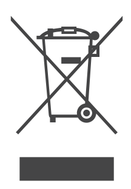
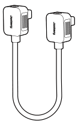
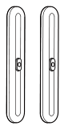
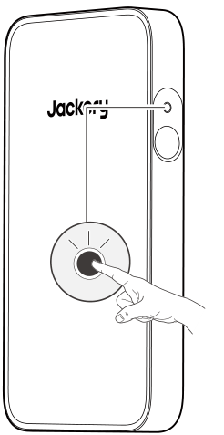
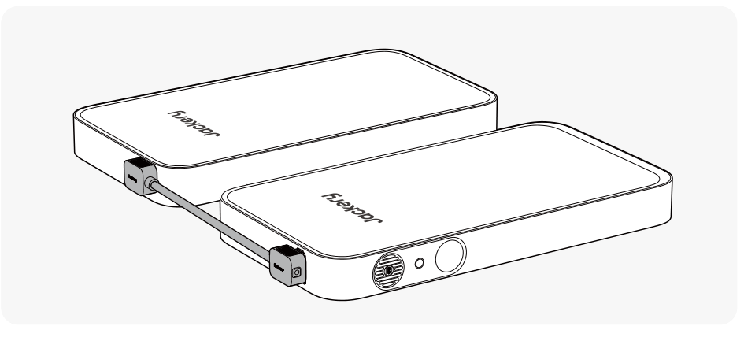
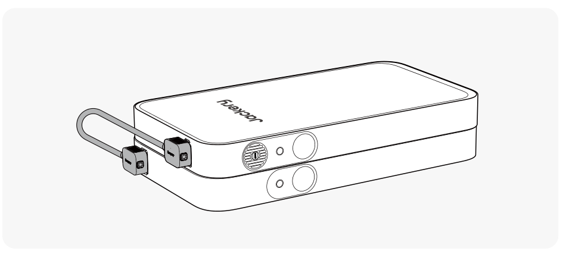
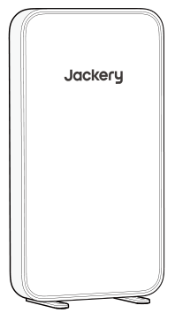
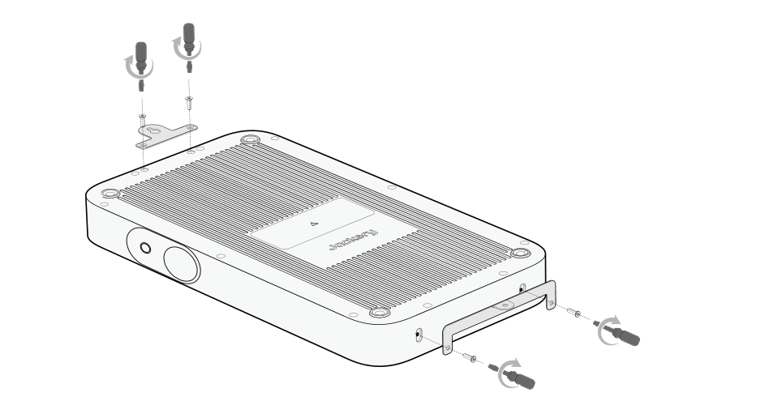
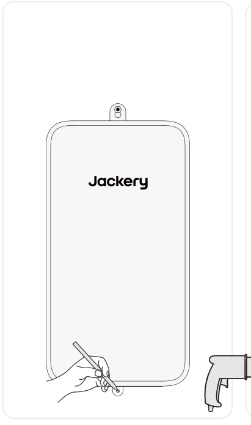
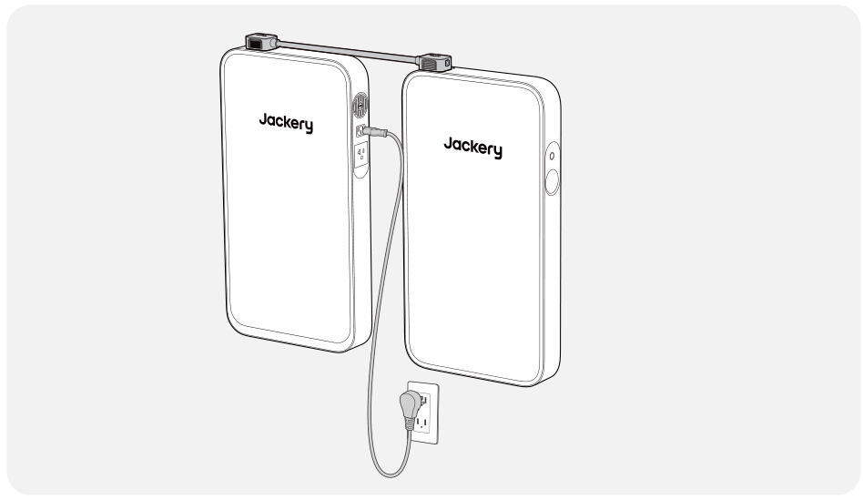

<h1 class="hb-preface-heading" id="preface">FR IMPORTANT</h1>

Félicitations pour votre nouveau Jackery Battery Pack. Veuillez lire attentivement ce manuel avant d'utiliser le produit, en particulier les précautions à prendre pour garantir une utilisation correcte du produit. Conservez ce manuel dans un endroit accessible pour pouvoir vous y référer ultérieurement.

Conformément aux lois et réglementations en vigueur, le droit d'interprétation final de ce document et de tous les documents associés à ce produit appartient à l'entreprise. Bien que tous les efforts aient été déployés pour garantir l'exactitude de ce manuel, Jackery Inc. n'assume aucune responsabilité pour les erreurs qui pourraient y figurer.

Veuillez noter qu'aucune autre notification ne sera faite en cas de mise à jour, de révision ou de résiliation. Pour la dernière version des manuels du produit, consultez support.jackery.com.

* Les chiffres sont donnés à titre indicatif uniquement. Veuillez vous référer au produit réel.

# INFORMATIONS DE SÉCURITÉ IMPORTANTES

Les précautions de base doivent être respectées lors de l'utilisation de ce produit, y compris :

<ul><li>Veuillez lire toutes les instructions avant d'utiliser ce produit.</li><li>Une surveillance délicate est nécessaire lors de l'utilisation de ce produit à proximité d'enfants afin de réduire les risques.</li><li>L'utilisation d'accessoires recommandés ou vendus par des fabricants de produits non professionnels peut entraîner un risque d'électrocution.</li><li>Lorsque le produit n'est pas utilisé, veuillez débrancher l'alimentation de la prise du produit.</li><li>Ne pas démonter le produit, ce qui pourrait entraîner des risques imprévisibles tels qu'un incendie, une explosion ou un choc électrique.</li><li>N'utilisez pas le produit avec des cordons ou des prises endommagés, ou des câbles de sortie d'éviter que la pluie et l'eau ne provoquent un choc électrique.</li><li>Charger le produit dans un endroit bien ventilé et ne pas restreindre la ventilation de quelque manière que ce soit.</li><li>Placez le produit dans un endroit ventilé et sec afin d'éviter que la pluie et l'eau ne provoquent un choc électrique.</li><li>N'exposez pas le produit au feu ou à des températures élevées (sous la lumière directe du soleil ou dans un véhicule soumis à une forte chaleur), ce qui pourrait provoquer des accidents tels qu'un incendie ou une explosion.</li><li>Si ce produit est stocké pendant une longue période (3 mois - 6 mois) alors qu'il n'est plus alimenté, il pourrait même devenir impossible à recharger.</li></ul>

# SIGNIFICATION DES SYMBOLES

<figure aria-label="Signal words" class="hb-symbol-signal-composition" data-component-id="HB-TABLE-SYMBOL-SIGNAL"><table class="hb-symbol-signal-table"><colgroup><col class="hb-symbol-signal-col-label"/><col class="hb-symbol-signal-col-meaning"/></colgroup><thead><tr><th class="hb-symbol-signal-label-heading" scope="col">Symbole</th><th class="hb-symbol-signal-meaning-heading" scope="col">Signification</th></tr></thead><tbody><tr><td class="hb-symbol-signal-label-cell">⚠AVERTISSEMENT</td><td class="hb-symbol-signal-meaning-cell">Pratiques dangereuses pouvant entraîner des blessures graves, la mort et/ou des dommages matériels.</td></tr><tr><td class="hb-symbol-signal-label-cell">⚠ATTENTION</td><td class="hb-symbol-signal-meaning-cell">Pratiques dangereuses pouvant entraîner des blessures corporelles et/ou des dommages matériels.</td></tr><tr><td class="hb-symbol-signal-label-cell">⚠REMARQUE</td><td class="hb-symbol-signal-meaning-cell">Pratiques dangereuses pouvant entraîner des dommages à l'équipement, une perte de données, une détérioration des performances ou des résultats inattendus.</td></tr><tr><td class="hb-symbol-signal-label-cell">⚠CONSEILS</td><td class="hb-symbol-signal-meaning-cell">Complémente les informations importantes ou les conseils d'utilisation dans le texte.</td></tr></tbody></table></figure>

<figure aria-label="Safety symbols" class="hb-symbol-pair-composition" data-component-id="HB-TABLE-SYMBOL-ICON">

<table class="hb-symbol-panel-table"><colgroup><col class="hb-symbol-col-icon"/><col class="hb-symbol-col-meaning"/></colgroup><thead><tr><th class="hb-symbol-icon-heading" scope="col">Symbole</th><th class="hb-symbol-meaning-heading" scope="col">Signification</th></tr></thead><tbody><tr><td class="hb-symbol-icon"></td><td class="hb-symbol-meaning">Mlise en garde! Le non-respect des messages d’avertissement peut entraîner des blessures.</td></tr><tr><td class="hb-symbol-icon"></td><td class="hb-symbol-meaning">Lire le manuel de l’opérateur</td></tr><tr><td class="hb-symbol-icon"></td><td class="hb-symbol-meaning">Ne démontez pas le produit.</td></tr><tr><td class="hb-symbol-icon"></td><td class="hb-symbol-meaning">Ne pas fumer ni utiliser de flamme nue</td></tr><tr><td class="hb-symbol-icon"></td><td class="hb-symbol-meaning">Les enfants ne sont pas admis</td></tr></tbody></table>

<table class="hb-symbol-panel-table"><colgroup><col class="hb-symbol-col-icon"/><col class="hb-symbol-col-meaning"/></colgroup><thead><tr><th class="hb-symbol-icon-heading" scope="col">Symbole</th><th class="hb-symbol-meaning-heading" scope="col">Signification</th></tr></thead><tbody><tr><td class="hb-symbol-icon"></td><td class="hb-symbol-meaning">Ce symbole indique que le produit contient une batterie lithium-ion (Li-ion), qui doit être éliminée ou recyclée de manière appropriée.</td></tr><tr><td class="hb-symbol-icon"></td><td class="hb-symbol-meaning">Ce symbole indique que le produit ne doit pas être jeté avec les ordures ménagères. Il doit être apporté à un point de collecte désigné pour un recyclage approprié. Une élimination et un recyclage corrects contribuent à la protection de l’environnement. Pour plus d’informations, veuillez contacter votre autorité locale, le service de gestion des déchets ou le revendeur du produit.</td></tr></tbody></table>

</figure>

# FCC

<figure aria-label="FCC" class="hb-fcc-composition" data-component-id="HB-SPECIAL-FCC">

Cet appareil est conforme à la partie 15 des règles de la FCC. Son fonctionnement est soumis aux deux conditions suivantes :

(1) cet appareil ne doit pas causer d’interférences nuisibles, et

(2) cet appareil doit accepter toute interférence reçue, y compris les interférences pouvant entraîner un fonctionnement indésirable.

<strong>REMARQUE :</strong> Cet équipement a été testé et déclaré conforme aux limites concernant les appareils numériques de classe B, conformément à la partie 15 du règlement de la FCC. Ces limites sont conçues pour offrir une protection raisonnable contre les interférences dangereuses dans le cadre d’une installation résidentielle. Cet équipement génère, utilise et émet des ondes radios qui peuvent, si cet équipement n’est pas installé et utilisé conformément aux instructions, perturber les communications radios.

Toutefois, il n’y a aucune garantie qu’aucune interférence ne se produise lors d’une installation particulière. Si cet équipement trouble la réception de la radio ou de la télévision, ce qui peut être déterminé en éteignant et en allumant cet équipement, l’utilisateur est encouragé à tenter de corriger ces interférences en essayant une ou plusieurs des mesures suivantes :
<ul class="simple"><li>
Réorientez ou déplacez l’antenne de réception.
</li><li>
Éloignez l’équipement du récepteur.
</li><li>
Connectez l’équipement à une prise d’un autre circuit que celui auquel le récepteur est connecté.
</li><li>
Consultez le revendeur ou bien demandez de l’aide à un technicien de radio/télévision expérimenté.
</li></ul>
<strong>MODIFICATION :</strong> Tout changement ou modification non expressément approuvé par le titulaire de cet appareil pourrait annuler l’autorisation de l’utilisateur à utiliser l’appareil.

</figure>

# CONTENU DE LA BOÎTE

<figure aria-label="What's in the box" class="hb-inbox-composition" data-card-count="4" data-component-id="HB-SPECIAL-INBOX" data-inbox-variant="responsive-card-grid"><ol class="hb-inbox-grid"><li class="hb-inbox-card" data-item-number="1">

Jackery Battery Pack

</li><li class="hb-inbox-card" data-item-number="2">

Câble de rallonge

</li><li class="hb-inbox-card" data-item-number="3">

Documents

</li><li class="hb-inbox-card" data-item-number="4">

Support vertical

</li></ol></figure>

# APERÇU DU PRODUIT

<figure class="hb-reference-figure hb-base-art-live-copy" data-component-id="HB-SPECIAL-REFERENCE-FIGURE" data-reference-id="overview" data-source-fragment-sha256="d753caa031b21d0d82fa007ef4da83dc82785f723f4230facf5241e96c55f330" data-web-base-art-ref="overview" data-web-presentation-mode="base-art-live-copy">

Port d'extensionEntrée:40V-57,6V⎓24A MaxSortie:40V-57,6V⎓50A MaxBouton d'alimentation principaleÉcran LCD

</figure>

# AFFICHAGE LCD

<figure class="hb-reference-figure hb-base-art-live-copy" data-component-id="HB-SPECIAL-REFERENCE-FIGURE" data-reference-id="lcd" data-source-fragment-sha256="03e21106852d242795966b24aa9810919ea195cada895b83a1562d154766433f" data-web-base-art-ref="lcd" data-web-presentation-mode="base-art-live-copy">

123754613

</figure>

<figure aria-label="LCD indicators" class="hb-lcd-table-composition" data-component-id="HB-TABLE-LCD-ICON" tabindex="0"><table class="hb-lcd-icon-table"><colgroup><col class="hb-lcd-col-number"/><col class="hb-lcd-col-icon"/><col class="hb-lcd-col-name"/><col class="hb-lcd-col-description"/></colgroup><tbody><tr><td class="hb-lcd-number">1</td><td class="hb-lcd-icon"></td><td class="hb-lcd-name">Puissance d’Entrée / Temps de Charge Restant</td><td class="hb-lcd-description">Affiche alternativement la puissance d'entrée et le temps de charge restant.</td></tr><tr><td class="hb-lcd-number">2</td><td class="hb-lcd-icon"></td><td class="hb-lcd-name">Pourcentage de Batterie Restant</td><td class="hb-lcd-description">Affiche le pourcentage de batterie restant.</td></tr><tr><td class="hb-lcd-number">3</td><td class="hb-lcd-icon"></td><td class="hb-lcd-name">Puissance de Sortie / Temps de Décharge Restant</td><td class="hb-lcd-description">Affiche alternativement la puissance de sortie et le temps de décharge restant.</td></tr><tr><td class="hb-lcd-number">4</td><td class="hb-lcd-icon"></td><td class="hb-lcd-name">Indicateur de charge</td><td class="hb-lcd-description"><strong>Allumé :</strong> Le Jackery Battery Pack est en cours de charge. <strong>Éteint :</strong> Le Jackery Battery Pack n'est pas en cours de charge.</td></tr><tr><td class="hb-lcd-number">5</td><td class="hb-lcd-icon"></td><td class="hb-lcd-name">Indicateur de Puissance de la Batterie</td><td class="hb-lcd-description">Le cercle orange indique le niveau de batterie restant.</td></tr><tr><td class="hb-lcd-number">6</td><td class="hb-lcd-icon"></td><td class="hb-lcd-name">Entrée CC</td><td class="hb-lcd-description"><strong>Activé :</strong> Le module d'entrée CC Jackery est connecté. <strong>Désactivé :</strong> Le module d'entrée CC Jackery est déconnecté.</td></tr><tr><td class="hb-lcd-number">7</td><td class="hb-lcd-icon"></td><td class="hb-lcd-name">Code d’erreur</td><td class="hb-lcd-description">Une erreur produit s’est produite. Veuillez consulter la section « Dépannage » pour plus de détails.</td></tr></tbody></table></figure>

# FONCTIONNEMENT

## MARCHE/ARRÊT

<figure class="hb-reference-figure hb-base-art-live-copy" data-component-id="HB-SPECIAL-REFERENCE-FIGURE" data-reference-id="power" data-source-fragment-sha256="123e7f48c81cbbecc9bb5c4942627b804de2bd362e05d91feea4e2cf0a87591a" data-web-base-art-ref="power" data-web-presentation-mode="base-art-live-copy">

MarcheAppuyez une foisArrêtAppuyez et maintenez pendant 3 secondes3s

</figure><table class="manual-callout-table manual-callout-table"><tbody><tr><td class="manual-callout-label">Remarques</td><td class="manual-callout-body">
Le dispositif s’éteint automatiquement s’il n’est pas chargé ou si aucune charge n’est connectée pendant 2 heures.
</td></tr></tbody></table>

## AFFICHAGE LCD MARCHE/ARRÊT

<figure aria-label="AFFICHAGE LCD MARCHE/ARRÊT" class="hb-lcd-mode-composition hb-lcd-mode-portrait" data-component-id="HB-TABLE-LCD-MODE">

<table class="hb-lcd-mode-table"><colgroup><col class="hb-lcd-mode-col-state"/><col class="hb-lcd-mode-col-action"/><col class="hb-lcd-mode-col-copy"/></colgroup><tbody><tr><td class="hb-lcd-mode-state" rowspan="3">Allumer en discontinu</td><td class="hb-lcd-mode-action">Allumer</td><td class="hb-lcd-mode-copy">Appuyez sur le bouton d'alimentation principal ou lorsque le produit est en charge.</td></tr><tr><td class="hb-lcd-mode-action">Éteindre</td><td class="hb-lcd-mode-copy">Appuyez sur le bouton d'alimentation principal.</td></tr><tr><td class="hb-lcd-mode-action">Arrêt automatique</td><td class="hb-lcd-mode-copy">L'écran LCD s'éteint automatiquement et entre en mode veille après 2 minutes d'inactivité.</td></tr><tr><td class="hb-lcd-mode-state" rowspan="3">Allumer en continu (en cours de charge ou de décharge)</td><td class="hb-lcd-mode-action">Allumer</td><td class="hb-lcd-mode-copy">Appuyez deux fois sur le bouton d'alimentation principal lorsque le produit est allumé.</td></tr><tr><td class="hb-lcd-mode-action">Éteindre</td><td class="hb-lcd-mode-copy">Appuyez sur le bouton d'alimentation principal.</td></tr><tr><td class="hb-lcd-mode-action">Arrêt automatique</td><td class="hb-lcd-mode-copy">Le mode Allumer en continu s'éteint automatiquement après 2 heures d'inactivité.</td></tr></tbody></table>
</figure>

# DÉPANNAGE

Si l'un des codes d'erreur suivants apparaît, suivez les actions correctives indiquées pour résoudre le problème.Si l'erreur persiste, veuillez contacter le service à la clientèle de Jackery.

<figure aria-label="Code d’erreur / Mesures correctives" class="hb-troubleshooting-composition" data-component-id="HB-TABLE-TROUBLESHOOTING" tabindex="0"><table class="hb-troubleshooting-table"><colgroup><col class="hb-troubleshooting-col-code"/><col class="hb-troubleshooting-col-measures"/></colgroup><thead><tr><th class="hb-troubleshooting-code" scope="col">Code d’erreur</th><th class="hb-troubleshooting-measures" scope="col">Mesures correctives</th></tr></thead><tbody><tr><td class="hb-troubleshooting-code">F0 / F2 / F3</td><td class="hb-troubleshooting-measures">Redémarrez le produit.</td></tr><tr><td class="hb-troubleshooting-code">F1 / F6 / F7 / F8</td><td class="hb-troubleshooting-measures">Contacter le service à la clientèle de Jackery.</td></tr><tr><td class="hb-troubleshooting-code">F4</td><td class="hb-troubleshooting-measures">Connectez le produit à des charges pour décharger sa batterie jusqu'à ce que l'erreur disparaisse.</td></tr><tr><td class="hb-troubleshooting-code">F5</td><td class="hb-troubleshooting-measures">Chargez le produit via des panneaux solaires ou une prise murale CA jusqu'à ce que l'erreur disparaisse.</td></tr><tr><td class="hb-troubleshooting-code">FF</td><td class="hb-troubleshooting-measures">
<strong>En condition de température élevée:</strong>
<ol><li>Débranchez tous les câbles de charge et de décharge du produit (y compris le chargeur mural, les panneaux solaires, le chargeur de voiture et les appareils de charge).</li><li>Placez le produit dans un endroit ombragé et bien ventilé où la température ambiante est inférieure à 113°F (45 °C).</li><li>Maintenez le produit au repos et attendez que le défaut disparaisse.</li><li>Si le défaut persiste après plusieurs tentatives, veuillez contacter le distributeur ou le service à la clientèle de Jackery.</li></ol>
<strong>En condition de basse température:</strong>
<ol><li>Déplacez le produit vers un environnement plus chaud au-dessus de 32°F (0 °C).</li><li>N’utilisez pas et ne rechargez pas le produit à l'extérieur dans des conditions extrêmement froides. Si nécessaire, préchauffez-le à l'intérieur.</li><li>Si l'appareil est déplacé de l'extérieur vers l'intérieur depuis un environnement froid, laissez-le reposer un moment avant de l’utiliser.</li><li>Lorsque l'indicateur de basse température apparaît, maintenez le produit au repos et attendez que le système se rétablisse automatiquement.</li><li>Si le défaut persiste après plusieurs tentatives, veuillez contacter le distributeur ou le service à la clientèle de Jackery.</li></ol></td></tr></tbody></table></figure>

# POSITIONNÉ AVEC LE JACKERY FRIDGEGUARD

## DISPOSITION EN PARALLÈLE

Positionnez le Jackery Battery Pack et le Jackery FridgeGuard en une disposition en parallèle.

## EMPILÉ

Placez le Jackery Battery Pack et le Jackery FridgeGuard en pile.

## AVEC SUPPORTS

<table class="manual-callout-table manual-callout-table"><tbody><tr><td class="manual-callout-label">ATTENTION</td><td class="manual-callout-body"><ul><li>N’installez pas le produit sur une structure non porteuse, comme les cloisons en placoplâtre, les murs isolants ou les briques creuses, car le produit pourrait tomber.</li><li>Évitez les fils électriques, les conduites d'eau, les conduites de gaz et autres installations à l'intérieur des murs.</li></ul></td></tr></tbody></table>

# SUPPORT VERTICAL

Le Jackery Battery Pack installé avec le support vertical peut être posé au sol. Veuillez suivre les étapes d'installation ci-dessous:

Préparation avant l'installation:

1. Retirez deux vis du bas du produit.

2. Alignez les trous de montage sur le bas du produit avec les trous sur le support vertical.

3. Serrez les vis.

# JACKERY WALL-MOUNTED BRACKET (VENDUS SÉPARÉMENT)

Le Jackery Battery Pack installé avec le support de montage peut être fixé au mur. Veuillez suivre les étapes d'installation ci-dessous:

## SUR LES MURS EN BOIS

Preparation before installation:

<figure class="hb-reference-figure hb-base-art-live-copy" data-component-id="HB-SPECIAL-REFERENCE-FIGURE" data-reference-id="wood-prep" data-source-fragment-sha256="9ed9d0b9b227073cc103dd36f25690a550dd5a7e0bf72fd1b31e22b14c49e869" data-web-base-art-ref="wood-prep" data-web-presentation-mode="base-art-live-copy">

VENDUS SÉPARÉMENT

</figure>

<figure class="hb-reference-figure hb-base-art-live-copy" data-component-id="HB-SPECIAL-REFERENCE-FIGURE" data-reference-id="wood-result" data-source-fragment-sha256="129360730940bd03e8d476c10bdf8fca0d60667660354e680473b85b4f9355b1" data-web-base-art-ref="wood-result" data-web-presentation-mode="base-art-live-copy">

Ossature en bois

</figure>

1. Installez le Jackery FridgeGuard conformément au manuel d'utilisation. 2. Retirez deux vis du bas du produit.

3. Fixez solidement les supports de montage supérieur et inférieur à l'arrière du produit.

4. Utilice un buscador de montantes para identificar los montantes de madera detrás de la pared.
<figure class="hb-reference-figure hb-base-art-live-copy" data-component-id="HB-SPECIAL-REFERENCE-FIGURE" data-reference-id="wood-4" data-source-fragment-sha256="55cdbf5c89891820f4ca74adc5e421e1690c91a5f1d883953bd8a4d5b1c7f569" data-web-base-art-ref="wood-4" data-web-presentation-mode="base-art-live-copy">

Ossature en bois

</figure>

5. Mesurez une distance horizontale de 406 mm (16 po) à partir de la position du boulon sur le Jackery FridgeGuard, et marquez le point de montage sur le montant de bois du mur.

* 406 mm (16 po) est la distance recommandée, et la distance réelle dépend des conditions du mur.
<figure class="hb-reference-figure hb-base-art-live-copy" data-component-id="HB-SPECIAL-REFERENCE-FIGURE" data-reference-id="wood-5" data-source-fragment-sha256="4e6338802f7198c21d5237c33e746c8a676ead2fc0b6945e9ef6c9c01d1b1805" data-web-base-art-ref="wood-5" data-web-presentation-mode="base-art-live-copy">

Ossature en boisOssature en bois406 mm (16 po)Jackery FridgeGuard

</figure>

6. Enfoncez la vis à bois dans le mur au point de montage, en laissant un espace de 2-4 mm entre la vis et le mur.
<figure class="hb-reference-figure hb-base-art-live-copy" data-component-id="HB-SPECIAL-REFERENCE-FIGURE" data-reference-id="wood-6" data-source-fragment-sha256="414a2e5bf010610403b51c9544e7a14807805764b3eda8a86993e6b6885526fa" data-web-base-art-ref="wood-6" data-web-presentation-mode="base-art-live-copy">

2~4mmOssature en boisJackery FridgeGuard

</figure>

7. Accrochez le produit verticalement sur la vis. Enfoncez la vis auto-taraudeuse à travers le trou de montage du support inférieur dans le mur et serrez-la. Ensuite, serrez complètement la vis à bois.

## SUR LES MURS EN BÉTON

Préparation avant l'installation:

<figure class="hb-reference-figure hb-base-art-live-copy" data-component-id="HB-SPECIAL-REFERENCE-FIGURE" data-reference-id="concrete-prep" data-source-fragment-sha256="74b7e91766c47d0bb5af118d5a55141ba5787aa073b9a5859879377f1dfd9b31" data-web-base-art-ref="concrete-prep" data-web-presentation-mode="base-art-live-copy">

VENDUS SÉPARÉMENT

</figure>

1. Installez le Jackery FridgeGuard conformément au manuel d'utilisation. 2. Retirez deux vis du bas du produit.

3. Fixez solidement les supports de montage supérieur et inférieur à l'arrière du produit.

4. Mesurez une distance horizontale de 406 mm (16 po) à partir de la position du boulon sur le Jackery FridgeGuard, et marquez le point de montage sur le montant de bois du mur.

* 406 mm (16 po) est la distance recommandée, et la distance réelle dépend des conditions du mur.
<figure class="hb-reference-figure hb-base-art-live-copy" data-component-id="HB-SPECIAL-REFERENCE-FIGURE" data-reference-id="concrete-4" data-source-fragment-sha256="f991bc8f9293b3c809e19ee9fbbeb3c0a0e49463c43cfa5d6b3b7eed127a5ebd" data-web-base-art-ref="concrete-4" data-web-presentation-mode="base-art-live-copy">

406 mm (16 po)Jackery FridgeGuard

</figure>

5. Percez un trou au point de montage à l'aide d'une perceuse à percussion pour maçonnerie de 8 mm, jusqu'à une profondeur d'environ 70 mm. Insérez une cheville d'expansion et desserrez son écrou de 2 à 4 mm.
<figure class="hb-reference-figure hb-base-art-live-copy" data-component-id="HB-SPECIAL-REFERENCE-FIGURE" data-reference-id="concrete-5" data-source-fragment-sha256="c0c60625d2ef6a1ea7b4fa5a4a61d36e0fd0ab71e593053c9907f6fc16b1bf98" data-web-base-art-ref="concrete-5" data-web-presentation-mode="base-art-live-copy">

70mm2~4mm8mm

</figure>

6. Accrochez le produit verticalement sur la cheville d'expansion et marquez le point de montage sur le mur.

7. Retirez le produit. Percez un trou au point de montage et insérez une cheville d'expansion sans écrou ni rondelle dans le trou.
<figure class="hb-reference-figure hb-base-art-live-copy" data-component-id="HB-SPECIAL-REFERENCE-FIGURE" data-reference-id="concrete-7" data-source-fragment-sha256="e9b8f2a12516dd6c38815f9d180d037acc45d3b1908a69418abd6f0103020a04" data-web-base-art-ref="concrete-7" data-web-presentation-mode="base-art-live-copy">

70mm8mm

</figure>

8. Accrochez le produit sur la cheville d'expansion supérieure.

9. Soulevez le produit pour aligner le boulon préinstallé et abaissez-le en place. Serrez l'écrou.

# CONNEXIONS

Le Jackery Battery Pack peut être utilisée avec le Jackery FridgeGuard pour répondre aux besoins de capacité accrus.

<table class="manual-callout-table manual-callout-table"><tbody><tr><td class="manual-callout-label">IMPORTANT</td><td class="manual-callout-body">
Assurez-vous que tous les produits sont éteints avant de connecter le Jackery FridgeGuard au(x) Jackery Battery Pack.
</td></tr></tbody></table>

<table class="manual-callout-table manual-callout-table"><tbody><tr><td class="manual-callout-label">Remarques</td><td class="manual-callout-body">
L’apparition de l’icône  sur l’écran LCD (Jackery FridgeGuard) signifie que la connexion entre l’unité de batterie et le Jackery FridgeGuard est réussie.
</td></tr></tbody></table>

# CHARGE

## CHARGEMENT PAR PRISE MURALE CA

En cas de charge murale, ce dispositif doit être utilisé avec le Jackery FridgeGuard.

<table class="manual-callout-table manual-callout-table"><tbody><tr><td class="manual-callout-label">Avertissement</td><td class="manual-callout-body">
Assurez-vous que tous les produits sont éteints avant de connecter le Jackery FridgeGuard au(x) Battery Pack.
</td></tr></tbody></table>

## CHARGEMENT PAR PANNEAUX SOLAIRES (VENDU SÉPARÉMENT)

Rechargez votre dispositif à l’aide de panneaux solaires et du Jackery DC Input Module(Vendu séparément), comme indiqué dans la figure ci-dessous. Pour plus d’informations, veuillez vous reporter au manuel d’utilisation du Jackery DC Input Module.

<figure class="hb-reference-figure hb-base-art-live-copy" data-component-id="HB-SPECIAL-REFERENCE-FIGURE" data-reference-id="solar" data-source-fragment-sha256="f22437451b71c691729af99ef4443af2145b0d02b6d23ae7128a0012024e57d7" data-web-base-art-ref="solar" data-web-presentation-mode="base-art-live-copy">

SolarSaga 500 XDC8020

</figure>

## CHARGEMENT PAR PRISE DE VOITURE(VENDU SÉPARÉMENT)

Chargez votre produit avec le chargeur de voiture et le Jackery DC Input Module(Vendu séparément) comme indiqué dans la figure ci-dessous. Veuillez consulter le manuel d'utilisation du Jackery DC Input Module pour plus d'informations.

<figure class="hb-reference-figure hb-base-art-live-copy" data-component-id="HB-SPECIAL-REFERENCE-FIGURE" data-reference-id="car" data-source-fragment-sha256="333ad48bebbfb72488e7f798422d80b57a3675d24a3e639ac73df62121c89d42" data-web-base-art-ref="car" data-web-presentation-mode="base-art-live-copy">

VehículeDC8020※ Le câble de chargement de voiture est vendu séparément.

</figure>

# STOCKAGE

Conservez le produit dans un endroit propre et sec avec une ventilation adéquate.Température et humidité de stockage :

<ul><li>1 mois : -4°F à 113°F / -20 à 45°C (0-60% HR)</li><li>3 mois : 32°F à 113°F / 0 à 45°C (0-60% HR)</li><li>2 mois : 32°F à 77°F / 0 à 25°C (0-60% HR)</li></ul>

Si ce produit est stocké pendant une longue période (3 à 6 mois) avec la batterie déchargée, il peut devenir impossible de le recharger. Pour éviter cela et préserver la santé de la batterie, il est recommandé de vérifier et de recharger le produit tous les trois mois, et d'effectuer un cycle de charge et de décharge complet au moins une fois tous les 6 à 12 mois.

# SPÉCIFICATIONS

<h2 class="hb-spec-group">INFORMATIONS GÉNÉRALES</h2>

<figure aria-label="INFORMATIONS GÉNÉRALES" class="hb-spec-table-composition"><table class="manual-table manual-spec-table hb-spec-table"><colgroup><col class="hb-spec-col-label"/><col class="hb-spec-col-value"/></colgroup><tbody><tr><th class="manual-spec-label hb-spec-label" scope="row">Nom du produit</th><td class="manual-spec-value hb-spec-value">Jackery Battery Pack</td></tr><tr><th class="manual-spec-label hb-spec-label" scope="row">N° modèle</th><td class="manual-spec-value hb-spec-value">JBP-1000B-SIL</td></tr><tr><th class="manual-spec-label hb-spec-label" scope="row">Capacité</th><td class="manual-spec-value hb-spec-value">20Ah / 51,2Vdc (1024 Wh)</td></tr><tr><th class="manual-spec-label hb-spec-label" scope="row">Cellule Chimique</th><td class="manual-spec-value hb-spec-value">LiFePO₄</td></tr><tr><th class="manual-spec-label hb-spec-label" scope="row">Poids</th><td class="manual-spec-value hb-spec-value">Environ 19,8 lbs / 9 kg</td></tr><tr><th class="manual-spec-label hb-spec-label" scope="row">Dimensions</th><td class="manual-spec-value hb-spec-value">23,6 × 12,8 × 2,4 pouces/60 × 32,5 × 6 cm</td></tr><tr><th class="manual-spec-label hb-spec-label" scope="row">Durée de vie</th><td class="manual-spec-value hb-spec-value">Capacité de 6000 cycles à 70 % ou plus</td></tr></tbody></table></figure>

<h2 class="hb-spec-group">PORTS D’ENTRÉE/SORTIE</h2>

<figure aria-label="PORTS D’ENTRÉE/SORTIE" class="hb-spec-table-composition"><table class="manual-table manual-spec-table hb-spec-table"><colgroup><col class="hb-spec-col-label"/><col class="hb-spec-col-value"/></colgroup><tbody><tr><th class="manual-spec-label hb-spec-label" scope="row">Port d’extension CC (Entrée)</th><td class="manual-spec-value hb-spec-value">40V-57,6V⎓24A Max</td></tr><tr><th class="manual-spec-label hb-spec-label" scope="row">Port d’extension CC (Sortie)</th><td class="manual-spec-value hb-spec-value">40V-57,6V⎓50A Max</td></tr><tr><th class="manual-spec-label hb-spec-label" scope="row">Courant et durée maximum du court-circuit</th><td class="manual-spec-value hb-spec-value">1250A/1.55ms</td></tr></tbody></table></figure>

<h2 class="hb-spec-group">TEMPÉRATURE DE FONCTIONNEMENT</h2>

<figure aria-label="TEMPÉRATURE DE FONCTIONNEMENT" class="hb-spec-table-composition"><table class="manual-table manual-spec-table hb-spec-table"><colgroup><col class="hb-spec-col-label"/><col class="hb-spec-col-value"/></colgroup><tbody><tr><th class="manual-spec-label hb-spec-label" scope="row">Température de charge</th><td class="manual-spec-value hb-spec-value">-4°F à 113°F / -20°C à 45°C</td></tr><tr><th class="manual-spec-label hb-spec-label" scope="row">Température de décharge</th><td class="manual-spec-value hb-spec-value">-4°F à 113°F / -20°C à 45°C</td></tr></tbody></table></figure>

# GARANTIE

<figure aria-label="Warranty" class="hb-warranty-intro-composition" data-component-id="HB-WARRANTY-LEAD">
Nous ne fournissons notre garantie qu'aux clients qui achètent sur le site officiel de Jackery, sur des plateformes tierces portant la marque Jackery, ou auprès de revendeurs autorisés locaux.

* La durée et les détails de la garantie peuvent varier en fonction des lois, réglementations et revendeurs autorisés locaux.
</figure>

## Garantie limitée

<figure aria-label="Garantie limitée" class="hb-warranty-card" data-component-id="HB-WARRANTY-SECTION" data-warranty-card-index="1">
Jackery Inc. garantit à l'acheteur et consommateur d'origine que le produit de Jackery sera exempt de tout défaut de fabrication et de matériaux dans le cadre d'une utilisation normale pendant toute la durée de la période de garantie applicable identifiée dans la section « Période de garantie » ci-dessous, sous réserve des exceptions énoncées ci-dessous.

Cette déclaration de garantie énonce les obligations totales et exclusives de garantie de Jackery. Nous n'assumerons pas et nous n'autorisons personne à assumer pour nous toute autre responsabilité en lien avec la vente de nos produits.
</figure>

## Période de garantie

<figure aria-label="Période de garantie" class="hb-warranty-period-card" data-component-id="HB-WARRANTY-YEARS">

3
<strong class="hb-warranty-years-unit">ANS</strong><strong class="hb-warranty-period-label">Garantie standard</strong>

La période de garantie standard du Jackery Battery Pack est de 36 mois. Dans tous les cas, la période de garantie commence à compter de la date d'achat par l'acheteur et consommateur d'origine. La facture du premier achat du consommateur ou toute autre preuve documentaire raisonnable est nécessaire afin d'établir la date de début de la période de garantie.

2
<strong class="hb-warranty-years-unit">ANS</strong><strong class="hb-warranty-period-label">Garantie prolongée</strong>

Pour activer l'extension de garantie, vous devez enregistrer votre produit en ligne ou bien contacter notre service client à hello@jackery.com afin de prolonger la durée de la garantie standard.

</figure>

## Réparation ou remplacement

<figure aria-label="Réparation ou remplacement" class="hb-warranty-card" data-component-id="HB-WARRANTY-SECTION" data-warranty-card-index="3">
Jackery réparera ou remplacera (aux frais de Jackery) tout produit Jackery qui cesse de fonctionner pendant la période de garantie applicable en raison d'un défaut de fabrication ou de matériau. Le produit réparé ou remplacé bénéficie de la garantie restante de la date d'achat d'origine.
</figure>

## Limitée à l'acheteur et consommateur d'origine

<figure aria-label="Limitée à l'acheteur et consommateur d'origine" class="hb-warranty-card" data-component-id="HB-WARRANTY-SECTION" data-warranty-card-index="4">
La garantie d'un produit Jackery est limitée à l'acheteur et consommateur d'origine, elle ne peut pas être transférée à un autre propriétaire.
</figure>

## Exclusions

<figure aria-label="Exclusions" class="hb-warranty-card" data-component-id="HB-WARRANTY-SECTION" data-warranty-card-index="5">
La garantie de Jackery ne s'applique pas à :
<ul><li>Une utilisation incorrecte, abusée, modifiée, aux dégâts provoqués par un accident ou toute autre utilisation qui n'est pas une utilisation normale de ce produit et autorisée par la documentation actuelle du produit de Jackery.</li><li>À une réparation tentée par quelqu'un d'autre qu'un établissement agréé.</li><li>Tout autre produit acheté par l'intermédiaire d'une vente aux enchères en ligne.</li><li>La garantie de Jackery ne s'applique pas aux cellules de la batterie, sauf si vous avez entièrement chargé les cellules de la batterie dans les sept jours suivant l'achat du produit et au moins une fois tous les 6 mois par la suite.</li></ul></figure>

## Droits d'interprétation

<figure aria-label="Droits d'interprétation" class="hb-warranty-card" data-component-id="HB-WARRANTY-SECTION" data-warranty-card-index="6">
Jackery Inc. se réserve le droit d'interpréter de manière définitive la politique après-vente des clients ci-dessus.
</figure>

# JACKERY INC.

5310 Bunche Dr., Fremont, CA 94538-8301

hello@jackery.com www.jackery.com 1-888-502-2236 (US)

