

## 重要提示

感謝您選購 Jackery Explorer 1500 Ultra 不斷電式電源供應器（UPS），以下簡稱「本產品」。使用本產品前，請仔細閱讀本說明書，特別是相關注意事項，以確保正確使用。請將本說明書存放在便於取閱的地方，以供隨時參考。根據相關法律法規，本文件及本產品所有相關文件之最終解釋權歸本公司所有。如有任何更新、修訂或終止，恕不另行通知。

## 安全注意事項

<table class="manual-callout-table manual-callout-table"><tbody><tr><td class="manual-callout-label">警告</td><td class="manual-callout-body">
與火災、觸電或人身傷害風險相關的注意事項
</td></tr></tbody></table>

使用本產品時，請務必遵守以下基本注意事項。

<ul><li>使用產品前，請閱讀所有說明。</li><li>使用過程中，請確保本產品與人體至少保持 20cm 距離。</li><li>請勿讓兒童玩耍本產品。在兒童附近使用本產品時，須有專人看護。</li><li>請勿將手或手指伸入產品內部。</li><li>如果產品受損或遭到改裝，請立即停止使用。使用不當可能導致產品出現無法預期的狀況，從而引發火災、 爆炸或人身傷害。</li><li>如發現產品出現包括但不限於過熱、異味、冒煙、漏液或灼燒等情況，請立即停止使用，並聯絡經銷商或我們的客服中心。</li><li>切勿嘗試拆開、維修或改裝本產品。任何私自拆解、重新組裝或改裝均可能導致觸電、火災或電池損壞。</li><li>請注意，產品洩漏的液體可能引起刺激或灼傷。使用不當或濫用可能導致電池漏液。請避免直接接觸洩漏液體。如液體進入眼睛，請立即就醫；如接觸到身體其他部位，請立即以清水沖洗，並儘速諮詢醫師。</li><li>請勿將產品暴露於火源或高溫環境中。溫度超過 130°C 時可能引發爆炸。</li><li>使用非推薦或非原廠的材料或零件，可能導致火災、觸電或人身傷害。</li><li>請勿在長時間無人看管的情況下為電池充電。請全程留意充電過程，以確保安全。</li><li>為降低觸電風險，在進行任何維護或故障排除前，請先將產品與所有電源斷開連接。</li></ul>

### 使用說明

請妥善保存本說明書。

<ul><li>如產品出現損壞跡象，請立即停止使用，並聯絡客服中心尋求協助。</li><li>請勿在過熱或過冷的環境中為電池充電，並嚴格遵守產品規定的工作溫度範圍：充電溫度：0°C ～ 45°C 放電溫度：-15°C ～ 45°C</li><li>為確保空氣流通，請勿遮蓋產品通風口。產品使用區域必須通風良好、涼爽乾燥，以防止過熱。在潮濕或通風不良的空間充電可能造成安全風險。水可能導致充電器短路或損壞，帶來安全風險。</li></ul>

<ul><li>雷雨天氣時，請將電源線從電源插座上拔下。</li><li>如產品發生跌落、墜落或受到劇烈震動，請立即按下電源鍵關閉產品。</li><li>將裝置連接至本產品之前，請先確認受電裝置已關閉。</li><li>請勿使用損壞或破損的充電線或插頭為產品充電。請勿使用本產品為電纜或插頭損壞、破損的裝置充電。</li><li>拔下充電線時，請握住插頭將其拔出，切勿拉扯線材，以降低損壞風險。</li><li>在行駛的車輛中運輸產品時，請確保產品已妥善固定。</li><li>使用或存放時，請勿將產品倒置或側放。</li><li>在工作場所或維修場所使用時，請勿將產品放置在地面上或距地面高度低於 457 毫米的位置。</li><li>請勿將本產品的配件用於其他裝置。</li><li>太陽能充電時長取決於天氣狀況，請將太陽能電池板放置在能獲得盡可能多直射陽光的位置。</li></ul>

### 危險

本裝置僅供室內使用（在戶外使用時，請將本裝置置於類似室內的環境中，如房車、帳篷、小屋等）。 ※ 雖然所有防護蓋閉合時整機防護等級為 IP65，使用時仍請遠離雨水、粉塵及潮濕環境。

### 使用者維護說明

在電源站產品的生命週期內，出現一定程度的容量和電量衰減屬正常現象。隨著充放電次數增加和存放時間延長，這種衰減會逐漸加劇，這是電芯自然老化的正常表現。

## 限用物質含有情況標示聲明書

限用物質及其化學符號

<table class="manual-table native-restricted-table"><tbody><tr><th>單元Unit</th><th>鉛(Pb)</th><th>汞(Hg)</th><th>鎘(Cd)</th><th>六價鉻(Cr+6)</th><th>多溴聯苯(PBB)</th><th>多溴二苯醚(PBDE)</th></tr><tr><th>塑膠外殼</th><td>○</td><td>○</td><td>○</td><td>○</td><td>○</td><td>○</td></tr><tr><th>金屬鐵件</th><td>○</td><td>○</td><td>○</td><td>○</td><td>○</td><td>○</td></tr><tr><th>電路板</th><td>－</td><td>○</td><td>○</td><td>○</td><td>○</td><td>○</td></tr><tr><th>電源線</th><td>－</td><td>○</td><td>○</td><td>○</td><td>○</td><td>○</td></tr></tbody></table>

備考1. "超出 0.1 wt%" 及 "超出 0.01 wt %" 係指限用物質之百分比含量超出百分比含量基準值。

Note 1: "Exceeding 0.1 wt %" and "exceeding 0.01 wt %" indicate that the percentage content of the restricted substance exceeds the reference percentage value of presence condition.

備考 2. "○" 係指該項限用物質之百分比含量未超出百分比含量基準值。

Note 2: "○" indicates that the percentage content of the restricted substance does not exceed the percentage of reference value of presence

備考3. "－" 係指該項限用物質為排除項目。

Note 3: The "－" indicates that the restricted substance corresponds to the exemption.

## 圖示含義

<figure aria-label="圖示含義" class="hb-symbol-signal-composition" data-component-id="HB-TABLE-SYMBOL-SIGNAL"><table class="hb-symbol-signal-table"><colgroup><col class="hb-symbol-signal-col-label"/><col class="hb-symbol-signal-col-meaning"/></colgroup><thead><tr><th class="hb-symbol-signal-label-heading" scope="col">圖示</th><th class="hb-symbol-signal-meaning-heading" scope="col">含義</th></tr></thead><tbody><tr><td class="hb-symbol-signal-label-cell">⚠警告</td><td class="hb-symbol-signal-meaning-cell">可能導致嚴重傷害、死亡和/或財產損失的危險行為。</td></tr><tr><td class="hb-symbol-signal-label-cell">⚠注意</td><td class="hb-symbol-signal-meaning-cell">可能導致人身傷害和/或財產損失的危險行為。</td></tr><tr><td class="hb-symbol-signal-label-cell">⚠說明</td><td class="hb-symbol-signal-meaning-cell">可能導致裝置損壞、資料遺失、性能下降或意外結果的危險行為。</td></tr><tr><td class="hb-symbol-signal-label-cell">⚠提示</td><td class="hb-symbol-signal-meaning-cell">補充正文中的重要資訊或操作提示。</td></tr></tbody></table></figure>

<figure aria-label="圖示含義" class="hb-symbol-pair-composition" data-component-id="HB-TABLE-SYMBOL-ICON">

<table class="hb-symbol-panel-table"><colgroup><col class="hb-symbol-col-icon"/><col class="hb-symbol-col-meaning"/></colgroup><thead><tr><th class="hb-symbol-icon-heading" scope="col">圖示</th><th class="hb-symbol-meaning-heading" scope="col">含義</th></tr></thead><tbody><tr><td class="hb-symbol-icon"></td><td class="hb-symbol-meaning">警告及注意符號。請務必閱讀，以注意潛在的危險或風險。</td></tr><tr><td class="hb-symbol-icon"></td><td class="hb-symbol-meaning">操作前請閱讀說明書。</td></tr><tr><td class="hb-symbol-icon"></td><td class="hb-symbol-meaning">請放置在兒童無法接觸的地方。</td></tr></tbody></table>

<table class="hb-symbol-panel-table"><colgroup><col class="hb-symbol-col-icon"/><col class="hb-symbol-col-meaning"/></colgroup><thead><tr><th class="hb-symbol-icon-heading" scope="col">圖示</th><th class="hb-symbol-meaning-heading" scope="col">含義</th></tr></thead><tbody><tr><td class="hb-symbol-icon"></td><td class="hb-symbol-meaning">請勿拆解本產品。</td></tr><tr><td class="hb-symbol-icon"></td><td class="hb-symbol-meaning">請使產品遠離火源。</td></tr><tr><td class="hb-symbol-icon"></td><td class="hb-symbol-meaning">此符號表示產品內含鋰離子（Li-ion） 電池，應妥善廢棄或回收處理。</td></tr></tbody></table>

</figure>

## 包裝清單

<figure aria-label="包裝清單" class="hb-inbox-composition" data-card-count="4" data-component-id="HB-SPECIAL-INBOX" data-inbox-variant="responsive-card-grid"><ol class="hb-inbox-grid"><li class="hb-inbox-card" data-item-number="1">

Jackery Explorer 1500 Ultra 不斷電式電源供應器（UPS）

</li><li class="hb-inbox-card" data-item-number="2">

AC 充電線

</li><li class="hb-inbox-card" data-item-number="3">

USB-C 線材

</li><li class="hb-inbox-card" data-item-number="4">

說明書

</li></ol>

提示

包裝內不含車充線，可於我們的官網單獨購買。如需協助，請聯絡 Jackery 客服中心。

</figure>

## 產品外觀

### 正視圖

<figure class="hb-reference-figure hb-base-art-live-copy" data-component-id="HB-SPECIAL-REFERENCE-FIGURE" data-reference-id="overview-front" data-source-fragment-sha256="6e4b4da57dc0435172e1ef7a269b211bde0fdb75b391e9f900f69613480508a1" data-web-base-art-ref="overview-front" data-web-presentation-mode="base-art-live-copy">

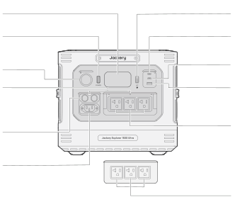<strong>LCD 螢幕</strong><strong>USB-C</strong><strong>2 輸出</strong><strong>USB-C1 輸出</strong><strong>AC 輸出（3 個）</strong><strong>AC 輸出按鍵</strong><strong>USB-A 輸出</strong><strong>防護蓋</strong><strong>DC 12V 連接埠</strong><strong>電源鍵</strong><strong>DC 輸入</strong><strong>（2 × DC8020 連接埠）</strong><strong>AC 輸入</strong>12V⎓最大10A最大30W，5V⎓3A，9V⎓3A，12V⎓2.5A，15V⎓2A，20V⎓1.5A最大100W，5V⎓3A，9V⎓3A，12V⎓3A，15V⎓3A，20V⎓5A最大18W，5-6V⎓3A，6-9V⎓2A，9-12V⎓1.5A100V‒120V~60Hz，最大15A車充： 12V-16V⎓最大8A，雙路合計8APV： 16V-60V⎓14A，雙路合計 28A / 850W Max110V~60Hz，額定功率1800W額定1800W（2000W 最長 15 分鐘），突波峰值3600W<strong>總輸出功率</strong>

</figure>

## 顯示螢幕介面

<figure class="hb-reference-figure hb-base-art-live-copy" data-component-id="HB-SPECIAL-REFERENCE-FIGURE" data-reference-id="lcd-map" data-source-fragment-sha256="abb53be9dae6a3ad80571a13d4a81d421508cd3fa50e9ff81e88cdcddc6b91c0" data-web-base-art-ref="lcd-map" data-web-presentation-mode="base-art-live-copy">

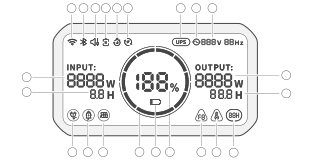10111213141516192221201817123456897

</figure>

<figure aria-label="顯示螢幕介面" class="hb-lcd-table-composition" data-component-id="HB-TABLE-LCD-ICON" tabindex="0"><table class="hb-lcd-icon-table"><colgroup><col class="hb-lcd-col-number"/><col class="hb-lcd-col-icon"/><col class="hb-lcd-col-name"/><col class="hb-lcd-col-description"/></colgroup><tbody><tr><td class="hb-lcd-number">1</td><td class="hb-lcd-icon"></td><td class="hb-lcd-name">Wi-Fi</td><td class="hb-lcd-description"><strong>亮起</strong>：Wi-Fi 已連線。<strong>閃爍</strong>：已準備連線至 Wi-Fi。<strong>熄滅</strong>：Wi-Fi 未連線。</td></tr><tr><td class="hb-lcd-number">2</td><td class="hb-lcd-icon"></td><td class="hb-lcd-name">藍牙</td><td class="hb-lcd-description"><strong>亮起</strong>：藍牙已連線。<strong>閃爍</strong>：已準備連線至藍牙。<strong>熄滅</strong>：藍牙未連線。</td></tr><tr><td class="hb-lcd-number">3</td><td class="hb-lcd-icon"></td><td class="hb-lcd-name">靜音充電模式</td><td class="hb-lcd-description"><strong>開啟</strong>：充電時的噪音會明顯降低，但充電功率也會下降，充電速度會變慢。<strong>關閉</strong>：靜音充電模式已停用。可在 Jackery App 中開啟／關閉此功能。</td></tr><tr><td class="hb-lcd-number">4</td><td class="hb-lcd-icon"></td><td class="hb-lcd-name">電池保護模式</td><td class="hb-lcd-description"><strong>開啟</strong>：電池保護模式已啟用。系統會限制電池最大可用容量，以協助延長電池壽命。<strong>關閉</strong>：電池保護模式已停用。可在 Jackery App 中開啟／關閉此功能。</td></tr><tr><td class="hb-lcd-number">5</td><td class="hb-lcd-icon"></td><td class="hb-lcd-name">充電計畫</td><td class="hb-lcd-description">可自訂本產品的充電時間。適用於電價浮動的情況，可依尖峰與離峰時段設定充電計畫，以降低電費。可在 Jackery App 中設定。</td></tr><tr><td class="hb-lcd-number">6</td><td class="hb-lcd-icon"></td><td class="hb-lcd-name">自發自用模式</td><td class="hb-lcd-description">優先使用已儲存的太陽能，最大化太陽能利用率並減少對市電的依賴，從而降低電費。電源站必須同時連接太陽能電池板與市電，負載功率會受旁路功率限制。可在 Jackery App 中開啟／關閉此功能。</td></tr><tr><td class="hb-lcd-number">7</td><td class="hb-lcd-icon"></td><td class="hb-lcd-name">UPS</td><td class="hb-lcd-description"><strong>亮起</strong>：產品正以旁路模式運作。連接至 AC 連接埠的負載由市電供電，而非由電源站供電。若市電突然中斷，產品會在 20 毫秒內自動切換為電池供電。<strong>熄滅</strong>：產品未處於旁路模式。連接至 AC 連接埠的負載由電源站內部電池供電。</td></tr><tr><td class="hb-lcd-number">8</td><td class="hb-lcd-icon"></td><td class="hb-lcd-name">AC 輸出指示</td><td class="hb-lcd-description">AC 輸出（純正弦波）已開啟。</td></tr><tr><td class="hb-lcd-number">9</td><td class="hb-lcd-icon"></td><td class="hb-lcd-name">輸出電壓與頻率</td><td class="hb-lcd-description">AC 輸出開啟時，顯示輸出電壓與頻率。</td></tr><tr><td class="hb-lcd-number">10</td><td class="hb-lcd-icon"></td><td class="hb-lcd-name">輸入功率</td><td class="hb-lcd-description">顯示目前的輸入功率（瓦特）</td></tr><tr><td class="hb-lcd-number">11</td><td class="hb-lcd-icon"></td><td class="hb-lcd-name">剩餘充電時間</td><td class="hb-lcd-description">顯示剩餘充電時間。</td></tr><tr><td class="hb-lcd-number">12</td><td class="hb-lcd-icon"></td><td class="hb-lcd-name">AC 市電充電指示</td><td class="hb-lcd-description">產品正透過 AC 輸入使用市電充電。</td></tr><tr><td class="hb-lcd-number">13</td><td class="hb-lcd-icon"></td><td class="hb-lcd-name">車充充電指示</td><td class="hb-lcd-description">產品正透過 DC 輸入（DC8020）使用 DC 12V（車充）充電。</td></tr><tr><td class="hb-lcd-number">14</td><td class="hb-lcd-icon"></td><td class="hb-lcd-name">太陽能充電指示</td><td class="hb-lcd-description">產品正透過 DC 輸入（DC8020）使用太陽能電池板充電。</td></tr><tr><td class="hb-lcd-number">15</td><td class="hb-lcd-icon"></td><td class="hb-lcd-name">電池電量指示</td><td class="hb-lcd-description">本產品充電時，電池電量百分比外圍的橘色圓環會依序亮起；為其他裝置充電時，橘色圓環會持續亮起。</td></tr><tr><td class="hb-lcd-number">16</td><td class="hb-lcd-icon"></td><td class="hb-lcd-name">低電量指示</td><td class="hb-lcd-description"><strong>亮起</strong>：電池電量低於 20%。<strong>閃爍</strong>：電池電量低於 5%。<strong>熄滅</strong>：電池電量不低於 20%，或產品正在充電。</td></tr><tr><td class="hb-lcd-number">17</td><td class="hb-lcd-icon"></td><td class="hb-lcd-name">剩餘電量百分比</td><td class="hb-lcd-description">顯示剩餘電量百分比。</td></tr><tr><td class="hb-lcd-number">18</td><td class="hb-lcd-icon"></td><td class="hb-lcd-name">故障代碼</td><td class="hb-lcd-description">產品發生故障。詳情請參閱「故障處理」章節。</td></tr><tr><td class="hb-lcd-number">19</td><td class="hb-lcd-icon"></td><td class="hb-lcd-name">高溫／低溫警告</td><td class="hb-lcd-description">高溫保護已觸發。產品可能會暫停運作，直到溫度恢復至正常工作範圍。低溫保護已觸發。產品可能會暫停運作，直到溫度恢復至正常工作範圍。</td></tr><tr><td class="hb-lcd-number">20</td><td class="hb-lcd-icon"></td><td class="hb-lcd-name">節能模式</td><td class="hb-lcd-description"><strong>亮起</strong>：節能模式已啟用。<strong>熄滅</strong>：節能模式已停用。</td></tr><tr><td class="hb-lcd-number">21</td><td class="hb-lcd-icon"></td><td class="hb-lcd-name">輸出功率</td><td class="hb-lcd-description">顯示目前的輸出功率（瓦特）。</td></tr><tr><td class="hb-lcd-number">22</td><td class="hb-lcd-icon"></td><td class="hb-lcd-name">剩餘放電時間</td><td class="hb-lcd-description">顯示剩餘放電時間。</td></tr></tbody></table></figure>

## 產品使用

### 電源開機 / 關機

<figure class="hb-reference-figure hb-base-art-live-copy" data-component-id="HB-SPECIAL-REFERENCE-FIGURE" data-reference-id="power" data-source-fragment-sha256="069d7ab193339a87a165eee9da62eafcf5f649445c77325ac003cb32d8604d74" data-web-base-art-ref="power" data-web-presentation-mode="base-art-live-copy">

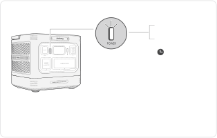<strong>開機</strong><strong>關機</strong>短按一次長按 3 秒3 秒預設待機時間：2 小時產品在未充電、未放電，且 DC 12V 連接埠與 USB 連接埠總輸出低於 3W 達 2 小時後，將自動關機。※ 可在 Jackery App 中設定待機時間。<strong>電源鍵</strong>啟用節能模式後，若電源鍵與 AC 輸出按鍵均已開啟，但產品既未充電也未放電，產品將在12 小時後自動關機。該時長可在 Jackery App 中設定。

</figure>

### AC 輸出開啟 / 關閉

<figure class="hb-reference-figure hb-base-art-live-copy" data-component-id="HB-SPECIAL-REFERENCE-FIGURE" data-reference-id="ac-output" data-source-fragment-sha256="160a545adcab969197fd30f647f170ae79f271f7aba8ae318dd4c85e4ebf1cbe" data-web-base-art-ref="ac-output" data-web-presentation-mode="base-art-live-copy">

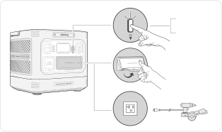前提條件：產品已開機。<strong>開啟</strong><strong>關閉</strong>按一次按一次

</figure>

### DC 12V / USB 輸出開啟 / 關閉

<figure class="hb-reference-figure hb-base-art-live-copy" data-component-id="HB-SPECIAL-REFERENCE-FIGURE" data-reference-id="dc-usb" data-source-fragment-sha256="dc5cf8399040913c69347df79fcc063a9d1ba6f67797de1982eb872eef5d7eee" data-web-base-art-ref="dc-usb" data-web-presentation-mode="base-art-live-copy">

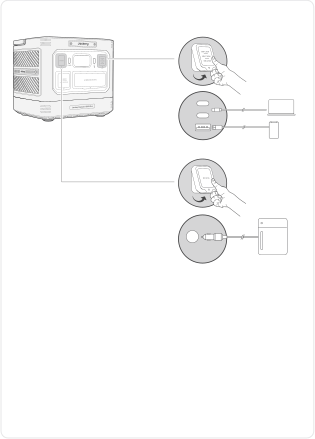前提條件：產品已開機。<strong>注意</strong><strong>注意</strong>•該功能僅適用於 12V 車型，不適用於 24V 車型。•產品透過 12V DC 輸出（車充插座）為汽車電瓶充電時，請勿啟動車輛，否則可能造成產品損壞。•僅適用於汽車電瓶緊急充電，不適用於汽車電瓶過度放電或已損壞的情況。•USB-C2 為 PS3 高功率輸出埠。若所連接的裝置或配件不符合安全要求，可能存在火災風險。在使用此連接埠前，請確保所連接裝置或配件具備防火安全措施。•僅可將本產品連接至符合 CNS 15598-1 第 6.3、6.4 及 6.5 條（或其他同等標準）的裝置或配件。•為獲得最大輸出功率，請使用 Jackery 官方 USB-C to USB-C 5A 傳輸線（20VDC/5A，100W）。本產品可透過 Jackery 12V 汽車電瓶充電線為汽車電瓶充電。該充電線需單獨購買，可前往Jackery 官網選購。

</figure>

### 節能模式

為避免因忘記關閉輸出而造成額外耗電，產品預設啟用節能模式。開啟 AC 或 DC/USB 輸出時，LCD 螢幕會顯示節能模式圖示「12H」。在此模式下，若未連接任何裝置，或所連接裝置的功耗低於指定閾值（AC 輸出 25W 或 DC/USB 輸出 2W），對應輸出會在設定時間後自動關閉。預設時間為 12 小時。該圖示的顯示時長會依 Jackery App 中設定的節能時間而變化。若要停用節能模式，請在 AC 輸出開啟狀態下，同時長按 AC 輸出按鍵與電源鍵 3 秒以上。停用節能模式後， LCD 螢幕將不再顯示該圖示，產品也不會自動關閉 AC 或 DC/USB 輸出。為低功率裝置供電時（AC ≤ 25W 或 DC/USB ≤ 2W），請停用節能模式，以免輸出在使用期間自動關閉。

<figure class="hb-reference-figure hb-base-art-live-copy" data-component-id="HB-SPECIAL-REFERENCE-FIGURE" data-reference-id="energy-buttons" data-source-fragment-sha256="ad60969591fd790e2f9f847cb8b2319068c2d7a75f3d97b2a6a301be8451e706" data-web-base-art-ref="energy-buttons" data-web-presentation-mode="base-art-live-copy">

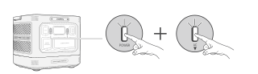<strong>同時長按兩個按鍵</strong><strong>3 秒以上</strong>AC 輸出按鍵電源鍵

</figure>

<table class="manual-callout-table manual-callout-table"><tbody><tr><td class="manual-callout-label">說明</td><td class="manual-callout-body">
產品開機後，節能模式會恢復為上次的設定狀態。
</td></tr></tbody></table>

### 螢幕顯示

<figure aria-label="螢幕顯示" class="hb-lcd-mode-composition" data-component-id="HB-TABLE-LCD-MODE">
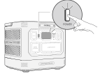

<table class="hb-lcd-mode-table"><colgroup><col class="hb-lcd-mode-col-state"/><col class="hb-lcd-mode-col-action"/><col class="hb-lcd-mode-col-copy"/></colgroup><tbody><tr><td class="hb-lcd-mode-state" rowspan="3">螢幕顯示</td><td class="hb-lcd-mode-action">開啟</td><td class="hb-lcd-mode-copy">按電源鍵，或在產品充電時自動點亮。</td></tr><tr><td class="hb-lcd-mode-action">關閉</td><td class="hb-lcd-mode-copy">按電源鍵。</td></tr><tr><td class="hb-lcd-mode-action">自動熄螢幕</td><td class="hb-lcd-mode-copy">無操作 2 分鐘後，螢幕自動熄滅並進入休眠模式。</td></tr><tr><td class="hb-lcd-mode-state" rowspan="3">常亮顯示模式（充電或放電狀態下）</td><td class="hb-lcd-mode-action">開啟</td><td class="hb-lcd-mode-copy">螢幕點亮時，雙擊電源鍵。</td></tr><tr><td class="hb-lcd-mode-action">關閉</td><td class="hb-lcd-mode-copy">按電源鍵。</td></tr><tr><td class="hb-lcd-mode-action">自動熄螢幕</td><td class="hb-lcd-mode-copy">產品在未充電、未放電，且 DC 12V 連接埠與 USB 連接埠總輸出低於 3W 達 2 小時後，常亮顯示模式自動關閉。</td></tr></tbody></table>
</figure>

### 按鍵組合

<table class="hb-key-combination-table"><tbody><tr><th>按鍵</th><th>操作</th><th>功能</th></tr><tr><td>

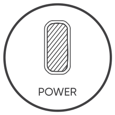
電源鍵

＋
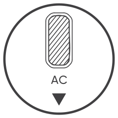
AC 輸出按鍵

</td><td>3 秒
同時長按 3 秒
</td><td>開啟/關閉節能模式</td></tr><tr><td>

電源鍵

</td><td>長按 3 秒關閉產品後，繼續長按 10 秒</td><td>重設本產品</td></tr></tbody></table>

## 不斷電系統（UPS）

使用 AC 充電線將產品連接至 AC 插座，接著按下 AC 輸出按鍵，即可同時為電器供電。不斷電系統（UPS）是一種持續供電系統，可在市電中斷時自動為負載提供備用電力。若市電突然中斷，本產品會在 20 毫秒內自動切換為電池供電，讓您的電器持續運作。在 UPS 模式下，市電中斷前本裝置的峰值輸出可達 1440W。由於旁路模式支援同時充放電，此模式下的實際輸出功率會低於額定輸出功率；市電中斷後則會恢復至額定輸出功率。

<figure class="hb-reference-figure hb-base-art-live-copy" data-component-id="HB-SPECIAL-REFERENCE-FIGURE" data-reference-id="ups" data-source-fragment-sha256="6f795fe47e1daf98ee593853f7a324599e11913058174d77a9af274e7d145785" data-web-base-art-ref="ups" data-web-presentation-mode="base-art-live-copy">

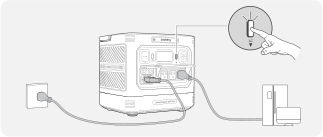前提條件：產品已開機。

</figure>

<table class="manual-callout-table manual-callout-table"><tbody><tr><td class="manual-callout-label">注意</td><td class="manual-callout-body"><ul><li>本產品不支援 0 毫秒切換。請勿連接需要 0 毫秒切換電源的裝置，例如資料伺服器或工作站。</li><li>使用前，請多次測試本產品與您的裝置是否相容。</li><li>建議一次僅連接一台裝置，請勿同時連接多台裝置，以免觸發過載保護。</li><li>本產品是第 2 類 UPS，在住宅環境可能引起輻射干擾，若有該情形時，使用者可能需要採取額外的措施。</li></ul></td></tr></tbody></table>

## 充電方式

綠色能源優先：我們提倡優先使用綠色能源。本產品支援兩種充電方式同時進行：太陽能充電和 AC 充電。當 AC 充電與太陽能充電同時開啟時，產品將優先使用太陽能充電，並以允許的最大功率同時使用兩種方式為電池充電。

首次使用前，請將產品充滿電。

<table class="manual-callout-table manual-callout-table"><tbody><tr><td class="manual-callout-label">提示</td><td class="manual-callout-body"><ul><li>產品建議的充電溫度範圍為 0°C ～ 45°C，放電溫度範圍為 -15°C ～ 45°C。超出該溫度範圍使用產品，可能導致充放電性能受限，甚至無法充電或放電。</li><li>產品的充電功率和電池容量可能因溫度變化而有所差異。當環境溫度處於 -15°C ～ -10°C 時，最大輸出功率會降至 1000W。</li></ul></td></tr></tbody></table>

### 使用 AC 插座充電

將 AC 充電線連接至產品的 AC 輸入連接埠與 AC 插座。

<figure class="hb-reference-figure" data-component-id="HB-SPECIAL-REFERENCE-FIGURE" data-reference-id="ac-charge" data-source-fragment-sha256="dc12d2ad7d2e89abe14ae5da0500b1256c2c29174f18d2cbffcd081f29ea99c6">

</figure>

<table class="manual-callout-table manual-callout-table"><tbody><tr><td class="manual-callout-label">注意</td><td class="manual-callout-body">
請確認 AC 充電線已完全且牢固地插入 AC 輸入連接埠。若未完整連接，可能導致電流不穩、過熱、接觸不良或裝置故障。
</td></tr></tbody></table>

### 使用太陽能電池板充電（另售）

本產品配備兩個 DC8020 輸入連接埠，並支援 Jackery 太陽能電池板。

<figure class="hb-reference-figure" data-component-id="HB-SPECIAL-REFERENCE-FIGURE" data-reference-id="solar-direct" data-source-fragment-sha256="e746f6323886ab73f230487a4ada4333125051c41589b89f6a167c26cb1e18c7">

</figure>

若需將兩片太陽能電池板同時連接至一個 DC8020 輸入連接埠，請參照下圖使用太陽能電池板連接器進行充電（另售，非標準配件）。

<figure class="hb-reference-figure" data-component-id="HB-SPECIAL-REFERENCE-FIGURE" data-reference-id="solar-connectors" data-source-fragment-sha256="c73164f594accddd516875e94938e4065e6d77dfb0b694af1cdace6acd9e666b">

</figure>

<figure class="hb-reference-figure" data-component-id="HB-SPECIAL-REFERENCE-FIGURE" data-reference-id="solar-incorrect" data-source-fragment-sha256="d1156622c2cdd692e9605064e2ead962d605016bc3fb8ab190c44ff452d158f7">

</figure>

<table class="manual-callout-table manual-callout-table"><tbody><tr><td class="manual-callout-label">注意</td><td class="manual-callout-body">
一個 DC8020 輸入連接埠最多可連接兩片太陽能電池板。
</td></tr></tbody></table>

<table class="manual-callout-table manual-callout-table"><tbody><tr><td class="manual-callout-label">注意</td><td class="manual-callout-body">
請確保兩個 DC 輸入連接埠的輸入電壓相同，否則可能損壞產品。例如：
<ul><li>將太陽能電池板連接至兩個 DC8020 輸入連接埠時，請使用相同型號且數量相同的 Jackery 太陽能電池板。</li><li>請勿同時使用車用充電器與太陽能電池板為產品充電，否則可能燒斷汽車保險絲或導致充電失敗。</li></ul></td></tr></tbody></table>

建議使用 Jackery 太陽能電池板為產品充電。請確保太陽能電池板的開路電壓（Voc）位於本產品的 DC 輸入範圍（16V‒60V）內。對於因使用第三方太陽能電池板而造成的任何損壞或損失，Jackery 概不負責。

### 使用車用充電器充電（另售）

本產品可使用 12V 車用充電器充電。請確保車用充電器與 12V 車用電源插座（點菸器插座）連接良好，並確保點菸器插頭已完全插入定位。

<figure class="hb-reference-figure hb-base-art-live-copy" data-component-id="HB-SPECIAL-REFERENCE-FIGURE" data-reference-id="car-charge" data-source-fragment-sha256="62238a6e4190a9b142f22f79b552f3522c63a31bf077727f662e80eb9071cd6a" data-web-base-art-ref="car-charge" data-web-presentation-mode="base-art-live-copy">

車輛* 車用充電線需另行購買。

</figure>

<table class="manual-callout-table manual-callout-table"><tbody><tr><td class="manual-callout-label">注意</td><td class="manual-callout-body"><ul><li>請先啟動車輛，再使用車用充電器為本產品充電，以免汽車電瓶電量不足而無法啟動。</li><li>行車過程中若路況顛簸，請勿使用車充充電，以免因接觸不良導致接點燒毀。若因未按規範操作而造成損失，本公司概不負責。</li><li>車充充電僅支援 12V 車型，不支援 24V 車型，請勿使用 24V 車輛為本產品充電，以免造成人身傷害及財產損失。</li></ul></td></tr></tbody></table>

## 底部清潔

<figure class="hb-reference-figure hb-base-art-live-copy" data-component-id="HB-SPECIAL-REFERENCE-FIGURE" data-reference-id="bottom-cleaning" data-source-fragment-sha256="5c25ee0c8ce53a2470cfe4b772bfa4402b619a8266992f647b8fbbabacaf05f3" data-web-base-art-ref="bottom-cleaning" data-web-presentation-mode="base-art-live-copy">

妥產品所有防護蓋，避免清洗過程中進水。12在地面鋪好乾毛巾，並依圖示將產品倒置放在毛巾上，以保護機身表面。依圖示順序拆下底部螺絲並移除底板，露出內部散熱鰭片。34使用清水沖洗散熱鰭片，並可搭配長毛刷或濕布清除表面污漬。清潔完成後，請以乾毛巾擦乾，並置於陰涼處自然晾乾。確認完全無水分殘留後，再裝回底板。

</figure>

## 儲存

請將產品存放於乾燥、清潔、通風良好的環境中。儲存溫度和濕度要求如下：

<ul><li>1 個月： -20°C ～ 45°C（0‒60%RH）</li><li>3 個月： 0°C ～ 45°C（0‒60%RH）</li><li>12 個月： 0°C ～ 25°C（0‒60%RH） 若產品在電量耗盡的情況下長時間（3 ～ 6 個月）存放，可能會導致無法再次充電。為避免此情況並保持電池健康，建議每三個月檢查並為產品充電一次，並在 6 ～ 12 個月內至少進行一次完整的充放電循環。</li></ul>

## 故障處理

如果出現以下任一故障代碼，請按照所列處理措施解決問題。如故障仍然存在，請聯絡 Jackery 客服中心。

<figure aria-label="故障代碼 / 處理方法" class="hb-troubleshooting-composition" data-component-id="HB-TABLE-TROUBLESHOOTING" tabindex="0"><table class="hb-troubleshooting-table"><colgroup><col class="hb-troubleshooting-col-code"/><col class="hb-troubleshooting-col-measures"/></colgroup><thead><tr><th class="hb-troubleshooting-code" scope="col">故障代碼</th><th class="hb-troubleshooting-measures" scope="col">處理方法</th></tr></thead><tbody><tr><td class="hb-troubleshooting-code">F0</td><td class="hb-troubleshooting-measures">重新啟動產品。</td></tr><tr><td class="hb-troubleshooting-code">F1</td><td class="hb-troubleshooting-measures">重新啟動產品。</td></tr><tr><td class="hb-troubleshooting-code">F2</td><td class="hb-troubleshooting-measures">重新啟動產品。</td></tr><tr><td class="hb-troubleshooting-code">F3</td><td class="hb-troubleshooting-measures">重新啟動產品。</td></tr><tr><td class="hb-troubleshooting-code">F4</td><td class="hb-troubleshooting-measures">將產品接上負載進行放電，直至故障消失。</td></tr><tr><td class="hb-troubleshooting-code">F5</td><td class="hb-troubleshooting-measures">透過太陽能電池板或 AC 插座為產品充電，直到故障消失。</td></tr><tr><td class="hb-troubleshooting-code">F6</td><td class="hb-troubleshooting-measures">1. 請等待市電恢復正常後，再透過 AC 插座為產品充電。 2. 檢查進氣口與排氣口是否阻塞，並確保產品兩側各保留 30 公分的間距。 3. 請將產品放置在不受陽光直射、通風良好且環境溫度低於 45°C 的位置。 4. 中斷產品與所有負載的連接，使產品保持待機，並等待故障消失。 5. 重新啟動產品。</td></tr><tr><td class="hb-troubleshooting-code">F7</td><td class="hb-troubleshooting-measures">1. 拔除所有連接至產品的 DC 輸入。 2. 如果使用太陽能電池板為產品充電，請檢查所連接太陽能電池板的開路電壓（Voc）。 產品允許的最大 DC 輸入電壓為 60V。 3. 重新啟動產品並保持待機，等待故障消失。</td></tr><tr><td class="hb-troubleshooting-code">F8</td><td class="hb-troubleshooting-measures">聯絡 Jackery 客服中心。</td></tr><tr><td class="hb-troubleshooting-code">F9</td><td class="hb-troubleshooting-measures">移除連接至產品 DC 12V/USB 連接埠的負載，並等待故障消失。</td></tr></tbody></table></figure>

## 技術參數

<h2 class="hb-spec-group">基本規格</h2>

<figure aria-label="基本規格" class="hb-spec-table-composition"><table class="manual-table manual-spec-table hb-spec-table"><colgroup><col class="hb-spec-col-label"/><col class="hb-spec-col-value"/></colgroup><tbody><tr><th class="manual-spec-label hb-spec-label" scope="row">名稱</th><td class="manual-spec-value hb-spec-value">Jackery Explorer 1500 Ultra 不斷電式電源供應器（UPS）</td></tr><tr><th class="manual-spec-label hb-spec-label" scope="row">型號</th><td class="manual-spec-value hb-spec-value">JE-1500C</td></tr><tr><th class="manual-spec-label hb-spec-label" scope="row">容量</th><td class="manual-spec-value hb-spec-value">29.5Ah / 51.2V DC (1510.4Wh)</td></tr><tr><th class="manual-spec-label hb-spec-label" scope="row">電芯類型</th><td class="manual-spec-value hb-spec-value">LiFePO4</td></tr><tr><th class="manual-spec-label hb-spec-label" scope="row">重量</th><td class="manual-spec-value hb-spec-value">約 17.5 kg</td></tr><tr><th class="manual-spec-label hb-spec-label" scope="row">尺寸</th><td class="manual-spec-value hb-spec-value">33.6 × 26.4 × 29.5 cm</td></tr><tr><th class="manual-spec-label hb-spec-label" scope="row">循環壽命</th><td class="manual-spec-value hb-spec-value">循環 4000 次後，容量保持 70% 以上</td></tr><tr><th class="manual-spec-label hb-spec-label" scope="row">防水防塵等級</th><td class="manual-spec-value hb-spec-value">IP65（底座風扇IP45）</td></tr></tbody></table></figure>

<h2 class="hb-spec-group">輸入</h2>

<figure aria-label="輸入" class="hb-spec-table-composition"><table class="manual-table manual-spec-table hb-spec-table"><colgroup><col class="hb-spec-col-label"/><col class="hb-spec-col-value"/></colgroup><tbody><tr><th class="manual-spec-label hb-spec-label" scope="row">1 × AC 連接埠</th><td class="manual-spec-value hb-spec-value">充電模式：100V‒120V~60Hz，最大15A 旁路模式①：100V‒120V~60Hz，最大12A</td></tr><tr><th class="manual-spec-label hb-spec-label" scope="row">2 × DC8020 連接埠</th><td class="manual-spec-value hb-spec-value">車充： 12V-16V⎓最大8A，雙路合計8A PV： 16V-60V⎓14A，雙路合計 28A / 850W Max</td></tr></tbody></table></figure>

<h2 class="hb-spec-group">輸出</h2>

<figure aria-label="輸出" class="hb-spec-table-composition"><table class="manual-table manual-spec-table hb-spec-table"><colgroup><col class="hb-spec-col-label"/><col class="hb-spec-col-value"/></colgroup><tbody><tr><th class="manual-spec-label hb-spec-label" scope="row">3 × AC 連接埠</th><td class="manual-spec-value hb-spec-value">110V~60Hz，額定功率1800W（2000W 最長 15 分鐘），突波峰值3600W</td></tr><tr><th class="manual-spec-label hb-spec-label" scope="row">旁路模式下的 AC 輸出①</th><td class="manual-spec-value hb-spec-value">100V-120V ~ 60Hz, 最大12A</td></tr><tr><th class="manual-spec-label hb-spec-label" scope="row">1 × USB-A 連接埠</th><td class="manual-spec-value hb-spec-value">最大18W，5-6V⎓3A，6-9V⎓2A，9-12V⎓1.5A</td></tr><tr><th class="manual-spec-label hb-spec-label" scope="row">1 × USB-C1</th><td class="manual-spec-value hb-spec-value">最大30W, 5V⎓3A，9V⎓3A，12V⎓2.5A，15V⎓2A，20V⎓1.5A</td></tr><tr><th class="manual-spec-label hb-spec-label" scope="row">1 × USB-C2</th><td class="manual-spec-value hb-spec-value">最大100W，5V⎓3A，9V⎓3A，12V⎓3A，15V⎓3A，20V⎓5A</td></tr><tr><th class="manual-spec-label hb-spec-label" scope="row">1× DC 12V 連接埠</th><td class="manual-spec-value hb-spec-value">12V⎓最大10A</td></tr></tbody></table></figure>

<h2 class="hb-spec-group">工作環境溫度</h2>

<figure aria-label="工作環境溫度" class="hb-spec-table-composition"><table class="manual-table manual-spec-table hb-spec-table"><colgroup><col class="hb-spec-col-label"/><col class="hb-spec-col-value"/></colgroup><tbody><tr><th class="manual-spec-label hb-spec-label" scope="row">充電溫度</th><td class="manual-spec-value hb-spec-value">0°C ~ 45°C</td></tr><tr><th class="manual-spec-label hb-spec-label" scope="row">放電溫度</th><td class="manual-spec-value hb-spec-value">-15°C ~ 45°C</td></tr></tbody></table></figure>

產品可由 AC 插座為電池充電，同時透過 AC 輸出插座供電。 1 ※ USB Type-C® 與 USB-C® 為 USB Implementers Forum 的註冊商標。

## 保固

<figure aria-label="保固" class="hb-warranty-intro-composition" data-component-id="HB-WARRANTY-LEAD">
本保固服務僅適用於透過 Jackery 官方網站、Jackery 品牌第三方平台或當地授權經銷商購買本產品的客戶。

*保固期限及細則可能因當地法律法規及授權經銷商政策而有所不同。
</figure>

<h3 class="rubric">有限保固</h3><figure aria-label="有限保固" class="hb-warranty-card" data-component-id="HB-WARRANTY-SECTION" data-warranty-card-index="1">
Jackery 向原始消費購買者保證：在下文「保固期限」部分所述的適用保固期內，Jackery 產品在正常消費使用條件下不存在工藝及材料缺陷，但以下所列除外情形除外。本保固聲明構成 Jackery 全部且唯一的保固義務。除非 Jackery 明確授權，任何個人或機構均無權代表 Jackery 就產品銷售承擔其他責任。
</figure>

<h3 class="rubric">保固期限</h3><figure aria-label="保固期限" class="hb-warranty-period-card" data-component-id="HB-WARRANTY-YEARS">

3
<strong class="hb-warranty-years-unit">年</strong><strong class="hb-warranty-period-label">標準保固</strong>

本產品的標準保固期為 36 個月。保固期均自原始消費購買者的購買之日起計算。確認保固起始日期時，需提供首位消費購買者的購買憑證或其他合理證明文件。

2
<strong class="hb-warranty-years-unit">年</strong><strong class="hb-warranty-period-label">延長保固</strong>

如需啟用延長保固服務，您須於線上註冊產品，以延長標準保固期限。

</figure>

<h3 class="rubric">維修或更換</h3><figure aria-label="維修或更換" class="hb-warranty-card" data-component-id="HB-WARRANTY-SECTION" data-warranty-card-index="3">
對於在適用保固期內因工藝或材料缺陷而無法正常運作的任何 Jackery 產品，Jackery 將負責維修或更換（費用由 Jackery 承擔）。維修/更換後的產品沿用原購買日期的剩餘保固期。
</figure>

<h3 class="rubric">僅限原始購買者</h3><figure aria-label="僅限原始購買者" class="hb-warranty-card" data-component-id="HB-WARRANTY-SECTION" data-warranty-card-index="4">
Jackery 產品的保固僅適用於原始購買者，不可轉讓給任何後續所有者。
</figure>

<h3 class="rubric">不適用保固的情形</h3><figure aria-label="不適用保固的情形" class="hb-warranty-card" data-component-id="HB-WARRANTY-SECTION" data-warranty-card-index="5">
以下情形不在 Jackery 保固範圍內：
<ul><li>產品被誤用、濫用、擅自改裝、因意外損壞，或用於超出 Jackery 當前產品資料授權的正常消費者用途之外的場景。</li><li>非授權服務機構或人員嘗試維修的產品。</li><li>透過線上拍賣平台購買的任何產品。</li><li>自購買之日起 7 天內未將電池充滿，且此後未至少每 6 個月充滿一次電的電池。</li></ul></figure>

<h3 class="rubric">解釋權</h3><figure aria-label="解釋權" class="hb-warranty-card" data-component-id="HB-WARRANTY-SECTION" data-warranty-card-index="6">
Jackery 保留對上述售後政策的最終解釋權。
</figure>

## App 設定

### 1. 下載 App 並登入

<figure aria-label="下載 App" class="hb-app-download-composition" data-component-id="HB-SPECIAL-APP">

在 Google Play 或 App Store 搜尋「Jackery」並安裝 App，之後即可註冊並登入。您也可以掃描下方 QR Code，下載並安裝 App。

QR Code

</figure>

### 2. 新增裝置

2.1 點選 + 按鍵以新增裝置。

2.2 按下裝置上的電源鍵開機。裝置上的 Wi-Fi 與藍牙圖示閃爍，表示裝置已進入網路設定模式。點選「 圖示已閃爍」按鍵，並允許 App 連接附近裝置及使用藍牙權限。

<figure class="hb-reference-figure hb-base-art-live-copy" data-component-id="HB-SPECIAL-REFERENCE-FIGURE" data-reference-id="app-add" data-source-fragment-sha256="708b58634468539a0aee8bf378096f323c4e49e1dbbae5f6333fba125a633831" data-web-base-art-ref="app-add" data-web-presentation-mode="base-art-live-copy">

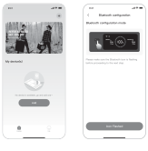2.12.2

</figure>

<figure class="hb-reference-figure hb-base-art-live-copy" data-component-id="HB-SPECIAL-REFERENCE-FIGURE" data-reference-id="app-network" data-source-fragment-sha256="51881d6c98585bbf1021585a4e79d96fbf0819e437bb22f1208f366554284c52" data-web-base-art-ref="app-network" data-web-presentation-mode="base-art-live-copy">

AC 輸出按鍵電源鍵

</figure>

<table class="manual-callout-table manual-callout-table"><tbody><tr><td class="manual-callout-label">注意</td><td class="manual-callout-body">
若裝置開機後 2 小時內仍未連線 App，將自動關閉 Wi-Fi 與藍牙功能。
</td></tr></tbody></table>

2.3 點選搜尋到的裝置圖示後，App 會自動透過藍牙連接裝置。

<table class="manual-callout-table manual-callout-table"><tbody><tr><td class="manual-callout-label">說明</td><td class="manual-callout-body">
若綁定過程中顯示「裝置已綁定」，可使用以下兩種方式連接：
<ul><li>由裝置擁有者透過 App 將此裝置分享給其他使用者。</li><li>關閉裝置後，長按電源鍵 10 秒，重設裝置的 Wi-Fi 與藍牙，然後重新綁定裝置。</li></ul></td></tr></tbody></table>

2.4 裝置成功連接後，輸入 Wi-Fi 密碼並點選「確定」按鍵。

<table class="manual-callout-table manual-callout-table"><tbody><tr><td class="manual-callout-label">說明</td><td class="manual-callout-body">
請選擇 2.4GHz 頻段的 Wi-Fi 網路。本裝置不支援 5GHz 頻段的 Wi-Fi 網路。
</td></tr></tbody></table>

2.5 裝置成功新增至 App 後，裝置上的 Wi-Fi 圖示會持續亮起。

<figure class="hb-reference-figure hb-base-art-live-copy" data-component-id="HB-SPECIAL-REFERENCE-FIGURE" data-reference-id="app-result" data-source-fragment-sha256="c23afeafcb71ce865721cf306a78a96773713df11737bdb765a6b80e3f9bb3b1" data-web-base-art-ref="app-result" data-web-presentation-mode="base-art-live-copy">

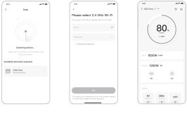2.52.32.4

</figure>

以上畫面截圖僅供參考。

<table class="manual-callout-table manual-callout-table"><tbody><tr><td class="manual-callout-label">注意</td><td class="manual-callout-body">
Jackery App 每次只能透過藍牙連接一台電源站。返回裝置清單時，藍牙會自動中斷連線；再次點選清單中的電源站，即可自動重新連線。
</td></tr></tbody></table>

### 3. 解除裝置綁定

點選裝置主介面右上角的「設定」圖示進入設定頁面，再點選頁面底部的「解除綁定」按鍵，以解除裝置綁定。

### 4. 注意事項

### 4.1 開啟 Wi-Fi 與藍牙

<ul><li>裝置開機後，Wi-Fi 與藍牙會自動開啟，螢幕上的 Wi-Fi 與藍牙圖示會亮起。</li></ul>

### 4.2 關閉 Wi-Fi 與藍牙

<ul><li>裝置開機後 2 小時內若未連線任何裝置，Wi-Fi 與藍牙會自動關閉。</li></ul>

### 4.3 重設 Wi-Fi 與藍牙

<ul><li>關閉裝置後，長按電源鍵 10 秒，將 Wi-Fi 與藍牙重設為原廠設定，裝置並會重新啟動。已連接的 App 帳號將解除綁定。</li></ul>

## 報驗義務人資訊：

丹尼爾的朋友們有限公司統編： 00187281 地址：臺北市中山區長安東路1段16號3樓之9 電話： 02-25238880

<figure class="hb-reference-figure" data-component-id="HB-SPECIAL-REFERENCE-FIGURE" data-reference-id="reporting-qr" data-source-fragment-sha256="8b6ea6314f690a5b19a8adb35e86160b17e753ba16dbdfe22d4b1a574a464e39">

</figure>

