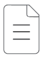
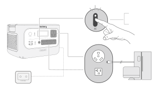
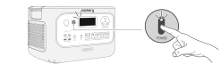
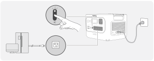

<h1 class="hb-preface-heading" id="native-preface">EN IMPORTANT</h1>

Congratulations on your new Jackery HomePower 3000. Please read this manual carefully before using the product, particularly the relevant precautions to ensure proper use. Keep this manual in an accessible place for future reference.

In compliance with laws and regulations, the right of final interpretation of this document and all related documents of this product resides with the Company. Although every effort has been made to ensure the accuracy of this manual, Jackery Inc. assumes no responsibility for any errors that may appear.

Please note that no further notifications will be given in case of any update, revision, or termination. For the latest version of the product manuals, visit support.jackery.com.

* The images are for reference purposes only. Please refer to the actual product.

## IMPORTANT SAFETY INFORMATION

### INSTRUCTIONS PERTAINING TO RISK OF FIRE, ELECTRIC SHOCK, OR INJURY TO PERSONS

<table class="manual-callout-table manual-callout-table"><tbody><tr><td class="manual-callout-label">WARNING</td><td class="manual-callout-body">
Always follow these basic precautions when using this product.
</td></tr></tbody></table>

<ul><li>Read all the instructions before using the product.</li><li>Do not allow children to play on the product. Close supervision of children is necessary when the product is used near children.</li><li>Avoid placing hands or fingers inside the product.</li><li>Stop using the product immediately if it has been physically damaged or modified. Improper use of the product may cause unpredictable behavior, leading to fire, explosion, or injury.</li><li>If any of the following are observed, including but not limited to overheats, emits unusual odors or smoking, leaks, or burns, stop using the product immediately and contact the dealer or Jackery Customer Support.</li><li>Never attempt to open, repair, or modify the product. Any tampering, reassembly, or modification of the product can result in electric shock, fire, or battery damage.</li><li>Be aware that liquid ejected from the product may cause irritation or burns. Inappropriate or abusive use may lead to battery leakage. Avoid direct contact with leaking liquid. If the liquid contacts your eyes, seek medical help immediately. If it contacts other body parts, flush with running water and consult a medical professional without delay.</li><li>Do not expose the product to fire or excessive temperatures. Doing so may result in an explosion if the temperature exceeds 130°C (265°F).</li><li>Any use of unrecommended or non-supplied materials or parts with the product may result in a risk of fire, electric shock, or personal injury.</li><li>Do not leave the battery charging unattended for long periods. Always monitor the charging process to ensure safe operation.</li><li>To reduce the risk of electric shock, unplug the product from any power source before attempting any technical service or troubleshooting.</li></ul>

### OPERATING INSTRUCTIONS

#### SAVE THESE INSTRUCTIONS

<ul><li>Stop using the product immediately if it shows signs of damage. Discontinue use and contact Jackery Customer Support for assistance.</li><li>Do not charge the battery in extremely hot or cold environments and strictly adhere to the product's specified operating temperature ranges:<ul><li>Charging temperature: 32°F to 113°F (0°C to 45°C )</li><li>Discharging temperature: 14°F to 113°F (-10°C to 45°C )</li></ul></li><li>To ensure proper air circulation, keep the product vents uncovered. The area where the product is used must have adequate airflow in a cool, dry environment to prevent overheating.<ul><li>Charging in damp or poorly ventilated spaces may cause safety hazards.</li><li>Water can cause short circuits or damage to the charger, leading to safety risks.</li></ul></li><li>Unplug the power cord from a power outlet during a storm.</li><li>Immediately turn off the product by pressing the POWER button if it has fallen, been dropped, or exposed to vibrations.</li><li>Ensure the device(s) are powered off before connecting them to the product.</li><li>Do not charge the product using a damaged or broken charging cord or plug.</li><li>Do not use the product to charge any device with a damaged or broken cable or plug.</li><li>Always unplug the charging cord by pulling the plug, not the cord, to reduce the risk of damage.</li><li>Ensure the product is properly secured when transporting it in a moving vehicle.</li><li>DO NOT place the unit upside down or on its side during use or storage.</li><li>DO NOT place the product on the floor or at a height less than 18 inches (457 mm) above the floor during operation in a workshop or repair facility.</li><li>DO NOT use the product's accessories with other devices or equipment.</li><li>Solar charge time depends on weather conditions. Place your solar panel where it will get as much direct sunlight as possible.</li></ul>

### GROUNDING INSTRUCTION

This product must be grounded. If it should malfunction or breakdown, grounding provides a path of least resistance for electric current to reduce the risk of electric shock. This product is equipped with a cord having an equipment grounding conductor and a grounding plug. The plug must be plugged into an outlet that is properly installed and grounded in accordance with all local codes ordinances.

<table class="manual-callout-table manual-callout-table"><tbody><tr><td class="manual-callout-label">WARNING</td><td class="manual-callout-body">
Improper connection of the equipment grounding conductor is able to result in a risk of electric shock. Check with a qualified electrician if you are in doubt as to whether the product is properly grounded. Do not modify the plug provided with the product – if it will not fit the outlet, have a proper outlet installed by a qualified electrician.
</td></tr></tbody></table>

<table class="manual-callout-table manual-callout-table"><tbody><tr><td class="manual-callout-label">DANGER</td><td class="manual-callout-body">
This device is intended for indoor use only (Please place this device in a similar indoor environment when using it outdoors, e.g., Home, RVs, tents, cabins, etc.). ※ This device is not waterproof or dustproof. Keep away from rain and humid environments during use.
</td></tr></tbody></table>

### USER MAINTENANCE INSTRUCTIONS

During the lifecycle of energy storage products, a certain degree of capacity and energy degradation is expected. As the number of charge and discharge cycles increases and storage time extends, this degradation will gradually intensify, which is a normal phenomenon consistent with the natural aging of battery cells.

## MEANING OF SYMBOLS

<figure aria-label="Signal words" class="hb-symbol-signal-composition" data-component-id="HB-TABLE-SYMBOL-SIGNAL"><table class="hb-symbol-signal-table"><colgroup><col class="hb-symbol-signal-col-label"/><col class="hb-symbol-signal-col-meaning"/></colgroup><thead><tr><th class="hb-symbol-signal-label-heading" scope="col">Symbol</th><th class="hb-symbol-signal-meaning-heading" scope="col">Meaning</th></tr></thead><tbody><tr><td class="hb-symbol-signal-label-cell">⚠WARNING</td><td class="hb-symbol-signal-meaning-cell">Hazardous practices that may result in severe injury, death, and/or property damage.</td></tr><tr><td class="hb-symbol-signal-label-cell">⚠CAUTION</td><td class="hb-symbol-signal-meaning-cell">Hazardous practices that may result in personal injury and/or property damage.</td></tr><tr><td class="hb-symbol-signal-label-cell">⚠NOTE</td><td class="hb-symbol-signal-meaning-cell">Hazardous practices that may result in equipment damage, data loss, performance deterioration, or unanticipated results.</td></tr><tr><td class="hb-symbol-signal-label-cell">⚠TIP</td><td class="hb-symbol-signal-meaning-cell">Supplements the important information or operation tips in the text.</td></tr></tbody></table></figure>

<figure aria-label="Safety symbols" class="hb-symbol-pair-composition" data-component-id="HB-TABLE-SYMBOL-ICON">

<table class="hb-symbol-panel-table"><colgroup><col class="hb-symbol-col-icon"/><col class="hb-symbol-col-meaning"/></colgroup><thead><tr><th class="hb-symbol-icon-heading" scope="col">Symbol</th><th class="hb-symbol-meaning-heading" scope="col">Meaning</th></tr></thead><tbody><tr><td class="hb-symbol-icon"></td><td class="hb-symbol-meaning">Warning and Caution Symbols. Must read to alert individuals to potential hazards or risks.</td></tr><tr><td class="hb-symbol-icon"></td><td class="hb-symbol-meaning">Read the user manual before operation.</td></tr><tr><td class="hb-symbol-icon"></td><td class="hb-symbol-meaning">Keep away from children.</td></tr><tr><td class="hb-symbol-icon"></td><td class="hb-symbol-meaning">This symbol indicates that a lithium-ion (Li-ion) battery is inside the product and should be disposed of or recycled properly.</td></tr></tbody></table>

<table class="hb-symbol-panel-table"><colgroup><col class="hb-symbol-col-icon"/><col class="hb-symbol-col-meaning"/></colgroup><thead><tr><th class="hb-symbol-icon-heading" scope="col">Symbol</th><th class="hb-symbol-meaning-heading" scope="col">Meaning</th></tr></thead><tbody><tr><td class="hb-symbol-icon"></td><td class="hb-symbol-meaning">Do not dismantle the product.</td></tr><tr><td class="hb-symbol-icon"></td><td class="hb-symbol-meaning">Keep the product away from fire.</td></tr><tr><td class="hb-symbol-icon"></td><td class="hb-symbol-meaning">This symbol indicates that the product shall not be disposed of as household waste, and should be delivered to a designated collection facility for recycling. Proper disposal and recycling can help protect the environment. For more information about the disposal and recycling of this product, contact your local community, disposal service, or dealer.</td></tr></tbody></table>

</figure>

## FCC

<figure aria-label="FCC" class="hb-fcc-composition" data-component-id="HB-SPECIAL-FCC">

This device complies with part 15 of the FCC Rules. Operation is subject to the following two conditions: (1) This device may not cause harmful interference, and (2) This device must accept any interference received, including interference that may cause undesired operation.

<strong>NOTE:</strong> This equipment has been tested and found to comply with the limits for a Class B digital device, pursuant to part 15 of the FCC Rules. These limits are designed to provide reasonable protection against harmful interference in a residential installation. This equipment generates, uses, and can radiate radio frequency energy and, if not installed and used in accordance with the instructions, may cause harmful interference to communications. However, there is no guarantee that radio interference will not occur in a particular installation.

If this equipment does cause harmful interference to radio or television reception, which can be determined by turning the equipment off and on, the user is encouraged to try to correct the interference by one or more of the following measures:
<ul class="simple"><li>
Reorient or relocate the receiving antenna.
</li><li>
Increase the separation between the equipment and receiver.
</li><li>
Connect the equipment into an outlet on a circuit different from that to which the receiver is connected.
</li><li>
Consult the dealer or an experienced radio/TV technician for help.
</li></ul>
<strong>MODIFICATION:</strong> Any changes or modifications not expressly approved by the grantee of this device could void the user’s authority to operate the device.

</figure>

## WHAT'S IN THE BOX

<figure aria-label="WHAT'S IN THE BOX" class="hb-inbox-composition" data-card-count="3" data-component-id="HB-SPECIAL-INBOX" data-inbox-variant="responsive-card-grid"><ol class="hb-inbox-grid"><li class="hb-inbox-card" data-item-number="1">

Jackery HomePower 3000

</li><li class="hb-inbox-card" data-item-number="2">

AC Charging Cable

</li><li class="hb-inbox-card" data-item-number="3">

Documents

</li></ol>

TIP

The car charging cable is not included but is available for purchase separately on our website. For assistance, please contact Jackery Customer Support.

</figure>

## PRODUCT OVERVIEW

### FRONT VIEW

<figure class="hb-reference-figure hb-base-art-live-copy" data-component-id="HB-SPECIAL-REFERENCE-FIGURE" data-reference-id="overview" data-source-fragment-sha256="7e82d31db32b833c6f2fbba0c73ee1af648cbde909db349fb84baee0574a05d8" data-web-base-art-ref="overview" data-web-presentation-mode="base-art-live-copy">

<strong>POWER</strong> <strong>Button</strong><strong>DC</strong> <strong>12V</strong> <strong>Port</strong> 12V⎓10A Max<strong>USB-C</strong> <strong>100W</strong> <strong>Output</strong> 100W Max, 5V⎓3A, 9V⎓3A, 12V⎓3A, 15V⎓3A, 20V⎓5A<strong>USB-A</strong> <strong>18W</strong> <strong>Output</strong> 18W Max, 5-6V⎓3A, 6-9V⎓2A, 9-12V⎓1.5A<strong>DC/USB</strong> <strong>Power</strong> <strong>Button</strong><strong>AC</strong> <strong>Power</strong> <strong>Button</strong><strong>LCD</strong> <strong>Screen</strong><strong>AC</strong> <strong>Output</strong> 120V~60Hz, 30A, 3600W Rated<strong>AC</strong> <strong>Output</strong> 120V~60Hz, 20A, 2400W Rated<strong>AC</strong> <strong>Total</strong> <strong>Output</strong> 3600W Rated<strong>RIGHT</strong> <strong>SIDE</strong> <strong>VIEW</strong><strong>AC</strong> <strong>Output</strong> <strong>Reset</strong> <strong>Button</strong><strong>AC</strong> <strong>Input</strong> 100V-120V~60 Hz, 15A Max<strong>DC</strong> <strong>Input</strong> <strong>(2×DC8020</strong> <strong>Ports)</strong> 16V-60V⎓12A Max, Double to 24A, 1000W Max 12V-16V⎓8A Max, Double to 8A Max

</figure>

## LCD DISPLAY

<figure class="hb-reference-figure hb-base-art-live-copy" data-component-id="HB-SPECIAL-REFERENCE-FIGURE" data-reference-id="lcd-map" data-source-fragment-sha256="c5bfa3541f7fa146f31aa9bcb4f2158a7f5b48771450feaa9a9ddb53bde7bc44" data-web-base-art-ref="lcd-map" data-web-presentation-mode="base-art-live-copy">

13121415161718192021252224231234568911107

</figure>

<figure aria-label="LCD DISPLAY" class="hb-lcd-table-composition" data-component-id="HB-TABLE-LCD-ICON" tabindex="0"><table class="hb-lcd-icon-table"><colgroup><col class="hb-lcd-col-number"/><col class="hb-lcd-col-icon"/><col class="hb-lcd-col-name"/><col class="hb-lcd-col-description"/></colgroup><tbody><tr><td class="hb-lcd-number">1</td><td class="hb-lcd-icon"></td><td class="hb-lcd-name">Wi-Fi</td><td class="hb-lcd-description"><strong>On</strong>: Wi-Fi connected. <strong>Blink</strong>: Ready to connect to Wi-Fi. <strong>Off</strong>: Wi-Fi disconnected.</td></tr><tr><td class="hb-lcd-number">2</td><td class="hb-lcd-icon"></td><td class="hb-lcd-name">Bluetooth</td><td class="hb-lcd-description"><strong>On</strong>: Bluetooth connected. <strong>Blink</strong>: Ready to connect to Bluetooth. <strong>Off</strong>: Bluetooth disconnected.</td></tr><tr><td class="hb-lcd-number">3</td><td class="hb-lcd-icon"></td><td class="hb-lcd-name">Quiet Charging Mode</td><td class="hb-lcd-description"><strong>On</strong>: The noise during charging is significantly minimized, while the charging power is reduced, and the charging speed slows down. <strong>Off</strong>: Quiet Charging Mode is disabled. Enable/disable this feature in the Jackery App. The setting is retained when the device is powered off.</td></tr><tr><td class="hb-lcd-number">4</td><td class="hb-lcd-icon"></td><td class="hb-lcd-name">Battery Saving Mode</td><td class="hb-lcd-description"><strong>On</strong>: Limits the maximum usable battery capacity to extend battery life. <strong>Off</strong>: Battery Saving Mode is disabled. Enable/disable this feature in the Jackery App. The setting is retained when the device is powered off. Note: When this feature is enabled, the product occasionally performs a full charge and discharge cycle to calibrate the SOC.</td></tr><tr><td class="hb-lcd-number">5</td><td class="hb-lcd-icon"></td><td class="hb-lcd-name">Charging Plan</td><td class="hb-lcd-description">Customizes the charging time of the Jackery HomePower 3000. Suitable for situations with fluctuating electricity prices, it allows for charging plans based on peak and off-peak electricity times, reducing electricity costs. Enable/disable this feature in the Jackery App. The setting is retained when the device is powered off.</td></tr><tr><td class="hb-lcd-number">6</td><td class="hb-lcd-icon"></td><td class="hb-lcd-name">Charging Power Limit</td><td class="hb-lcd-description"><strong>On</strong>: Charging Power limit is enabled in the Jackery App. <strong>Off</strong>: Charging Power limit is disabled in the Jackery App. The setting is retained when the device is powered off.</td></tr><tr><td class="hb-lcd-number">7</td><td class="hb-lcd-icon"></td><td class="hb-lcd-name">Self-powered Mode</td><td class="hb-lcd-description">Maximizes the use of solar energy and reduces reliance on grid electricity by prioritizing stored solar energy, reducing electricity costs. The power station must be connected to both solar panels and the grid simultaneously, with the load power limited by bypass power. Enable/disable this feature in the Jackery App. The setting is retained when the device is powered off.</td></tr><tr><td class="hb-lcd-number">8</td><td class="hb-lcd-icon"></td><td class="hb-lcd-name">TOU Mode</td><td class="hb-lcd-description"><strong>On</strong>: TOU (time of use) mode is enabled (default backup SOC: 60%). During peak periods, when the stored energy exceeds the backup SOC, the product prioritizes battery discharge to reduce peak electricity costs. During off-peak periods, the system charges the battery from the grid to achieve peak-shaving and valley-filling. <strong>Off</strong>: TOU mode is disabled. The device does not follow the TOU strategy and operates according to the default power supply and charging logic. Enable/disable this mode in the Jackery App. The setting is retained when the device is powered off.</td></tr><tr><td class="hb-lcd-number">9</td><td class="hb-lcd-icon"></td><td class="hb-lcd-name">UPS</td><td class="hb-lcd-description"><strong>On</strong>: The product is in bypass mode, and the switchover time from grid power to the internal battery is 10 ms. <strong>Off</strong>: The product is not in bypass mode.</td></tr><tr><td class="hb-lcd-number">10</td><td class="hb-lcd-icon"></td><td class="hb-lcd-name">AC Power Indicator</td><td class="hb-lcd-description">The AC output (pure sine wave) is on.</td></tr><tr><td class="hb-lcd-number">11</td><td class="hb-lcd-icon"></td><td class="hb-lcd-name">Input Power</td><td class="hb-lcd-description">Displays the input power in watts.</td></tr><tr><td class="hb-lcd-number">12</td><td class="hb-lcd-icon"></td><td class="hb-lcd-name">Remaining Charge Time</td><td class="hb-lcd-description">Displays the remaining charging time.</td></tr><tr><td class="hb-lcd-number">13</td><td class="hb-lcd-icon"></td><td class="hb-lcd-name">AC Wall Charging Indicator</td><td class="hb-lcd-description">The product is charged via the AC Input using grid power.</td></tr><tr><td class="hb-lcd-number">14</td><td class="hb-lcd-icon"></td><td class="hb-lcd-name">Car Charging Indicator</td><td class="hb-lcd-description">The product is charged via the DC Input (DC8020) using DC 12V (car charging).</td></tr><tr><td class="hb-lcd-number">15</td><td class="hb-lcd-icon"></td><td class="hb-lcd-name">Solar Charging Indicator</td><td class="hb-lcd-description">The product is charged via the DC Input (DC8020) using solar panel(s).</td></tr><tr><td class="hb-lcd-number">16</td><td class="hb-lcd-icon"></td><td class="hb-lcd-name">Battery Power Indicator</td><td class="hb-lcd-description">When the product is being charged, the orange circle around the battery percentage will light up in sequence. When charging other devices, the orange circle will stay on.</td></tr><tr><td class="hb-lcd-number">17</td><td class="hb-lcd-icon"></td><td class="hb-lcd-name">Low Battery Indicator</td><td class="hb-lcd-description"><strong>On</strong>: The battery level is below 20%. <strong>Blink</strong>: The battery level is below 5%. <strong>Off</strong>: The battery level is not below 20% or the product is charging.</td></tr><tr><td class="hb-lcd-number">18</td><td class="hb-lcd-icon"></td><td class="hb-lcd-name">Remaining Battery Percentage</td><td class="hb-lcd-description">Displays the remaining battery percentage.</td></tr><tr><td class="hb-lcd-number">19</td><td class="hb-lcd-icon"></td><td class="hb-lcd-name">Discharge Timer</td><td class="hb-lcd-description"><strong>On</strong>: A discharge timer is set. <strong>Off</strong>: No discharge timer is set. Enable/disable this feature in the Jackery App. The setting is not retained when the device is powered off.</td></tr><tr><td class="hb-lcd-number">20</td><td class="hb-lcd-icon"></td><td class="hb-lcd-name">Energy Saving Mode</td><td class="hb-lcd-description"><strong>On</strong>: Energy Saving Mode is enabled. <strong>Off</strong>: Energy Saving Mode is disabled.</td></tr><tr><td class="hb-lcd-number">21</td><td class="hb-lcd-icon"></td><td class="hb-lcd-name">High Temperature Indicator</td><td class="hb-lcd-description">High temperature protection is triggered. The product may stop functioning until its temperature returns to the normal operating range.</td></tr><tr><td class="hb-lcd-number">21</td><td class="hb-lcd-icon"></td><td class="hb-lcd-name">Low Temperature Indicator</td><td class="hb-lcd-description">Low temperature protection is triggered. The product may stop functioning until its temperature returns to the normal operating range.</td></tr><tr><td class="hb-lcd-number">22</td><td class="hb-lcd-icon"></td><td class="hb-lcd-name">Fault code</td><td class="hb-lcd-description">A product error has occurred. Please refer to the Troubleshooting section for details.</td></tr><tr><td class="hb-lcd-number">23</td><td class="hb-lcd-icon"></td><td class="hb-lcd-name">Output Voltage and Frequency</td><td class="hb-lcd-description">Displays the output voltage and frequency when the AC output is turned on.</td></tr><tr><td class="hb-lcd-number">24</td><td class="hb-lcd-icon"></td><td class="hb-lcd-name">Output Power</td><td class="hb-lcd-description">Displays the output power in watts.</td></tr><tr><td class="hb-lcd-number">25</td><td class="hb-lcd-icon"></td><td class="hb-lcd-name">Remaining Discharge Time</td><td class="hb-lcd-description">Displays the remaining discharging time.</td></tr></tbody></table></figure>

## OPERATIONS

### POWER ON/OFF

<figure class="hb-reference-figure hb-base-art-live-copy" data-component-id="HB-SPECIAL-REFERENCE-FIGURE" data-reference-id="power" data-source-fragment-sha256="d77b8e2a73aab1dd15d879d70534d1d23f07b6f1ebea7165de4885ea8f1164b1" data-web-base-art-ref="power" data-web-presentation-mode="base-art-live-copy">

<strong>on</strong> Press once<strong>off</strong> Press and hold for 3s3s<strong>Default</strong> <strong>standby</strong> <strong>time:</strong> 2 hours The product will automatically shut down after 2 hours of inactivity, with no charging or discharging. *The standby time can be set in the Jackery App.When Energy Saving Mode is enabled, the product will automatically shut down after 12 hours if the AC power button or DC/USB power button is ON, but the product is neither charging nor discharging.

</figure>

### AC OUTPUT ON/OFF

<figure class="hb-reference-figure hb-base-art-live-copy" data-component-id="HB-SPECIAL-REFERENCE-FIGURE" data-reference-id="ac-output" data-source-fragment-sha256="4547a8a6586ac13de748cf44dcdf92784c09a325f70202c6b7cf9d8da3f29d45" data-web-base-art-ref="ac-output" data-web-presentation-mode="base-art-live-copy">

<strong>Prerequisite:</strong> The product is powered <strong>on</strong>.<strong>on</strong> Press once<strong>off</strong> Press once<strong>AC</strong> <strong>Output</strong> <strong>Reset</strong> <strong>Button:</strong> When the Reset Button pops up, you need to remove the load and press the Reset Button to reset.

</figure>

### DC/USB OUTPUT ON/OFF

<figure class="hb-reference-figure hb-base-art-live-copy" data-component-id="HB-SPECIAL-REFERENCE-FIGURE" data-reference-id="dc-output" data-source-fragment-sha256="bf0515f0b02a90a1a29f6c3fbc3a17d398a778ab5d38968345505b39650732d3" data-web-base-art-ref="dc-output" data-web-presentation-mode="base-art-live-copy">

<strong>Prerequisite:</strong> The product is powered <strong>on</strong>.<strong>on</strong> Press once<strong>off</strong> Press once

</figure>
<table class="manual-callout-table manual-callout-table"><tbody><tr><td class="manual-callout-label">The product can cable, which is CAUTION</td><td class="manual-callout-body"><ul><li>USB-C 100W is a USB-PD Power Source 3 (PS3) high-power output port. If the connected user device or accessory does not meet safety requirements, there may be a fire risk. Before using these ports, ensure that the connected device or accessory has fire safety protection.</li><li>Only connect the Jackery HomePower 3000 to devices or accessories that comply with clauses 6.3, 6.4, and 6.5 of IEC/EN/UL 62368-1 (or other equivalent standards).</li><li>To obtain maximum output power, use the USB-C to USB-C 5A cable (20V DC/5A, 100W).</li></ul></td></tr></tbody></table>
The product can charge your car battery using the Jackery 12V automobile battery charging cable, which is sold separately and available on our website.
<table class="manual-callout-table manual-callout-table"><tbody><tr><td class="manual-callout-label">CAUTION</td><td class="manual-callout-body"><ul><li>The DC 12V port is only compatible with 12V car batteries and not suitable for 24V systems.</li><li>Do not start the car while the product is charging the car battery through the 12V DC output port, as this may damage the product.</li><li>This feature is intended for emergency use only and cannot charge a dead or damaged car battery.</li></ul></td></tr></tbody></table>

### AC AND DC OUTPUT RESUME FUNCTION

This function memorizes the output status and automatically resumes AC and DC outputs under defined conditions.

<table class="manual-table"><tbody><tr><th>Auto Resume Conditions</th><th>Not Auto Resume Conditions</th></tr><tr><td>Power-on/Restart after shutdown or restart</td><td>Manual output off (button/App)</td></tr><tr><td>Battery SOC ≥ discharge limit +10% after reaching limit</td><td>Energy Saving mode output off</td></tr><tr><td></td><td>Protection-triggered output off</td></tr><tr><td>OTA upgrade completed</td><td>Discharge timer-triggered output off</td></tr></tbody></table>

### ENERGY SAVING MODE

To prevent unnecessary battery consumption from forgetting to turn off the output, the product enables Energy Saving Mode by default. When the AC or DC/USB output is turned on, the Energy Saving Mode icon will be displayed on the LCD screen. If no device is connected or the connected device's power consumption is below a certain threshold (25W AC output or 2W DC/USB output) for 12 hours, the product automatically turns off the outputs. Please set the Energy Saving Mode duration in the Jackery App. To disable the energy saving mode, press and hold both the AC power button and the POWER button for more than 3 seconds. The product will not automatically turn off the AC or DC/USB output.

<figure class="hb-reference-figure hb-base-art-live-copy" data-component-id="HB-SPECIAL-REFERENCE-FIGURE" data-reference-id="energy" data-source-fragment-sha256="899fcf55f25ea164a364cf8d9bb1e355a9845cb8450f3219fde67a4242432c5e" data-web-base-art-ref="energy" data-web-presentation-mode="base-art-live-copy">

Main Power ButtonAC Power Button<strong>on/off</strong> Press and hold for 3s3s

</figure>

<table class="manual-callout-table manual-callout-table"><tbody><tr><td class="manual-callout-label">NOTE</td><td class="manual-callout-body">
Energy Saving Mode resumes its previous state after powering on. Manual switching is required for mode changes.
</td></tr></tbody></table>

### LCD SCREEN

<figure aria-label="LCD screen modes" class="hb-lcd-mode-composition" data-component-id="HB-TABLE-LCD-MODE">

<table class="hb-lcd-mode-table"><colgroup><col class="hb-lcd-mode-col-state"/><col class="hb-lcd-mode-col-action"/><col class="hb-lcd-mode-col-copy"/></colgroup><tbody><tr><td class="hb-lcd-mode-state" rowspan="3">Shortly <strong>On</strong></td><td class="hb-lcd-mode-action">Turn <strong>on</strong></td><td class="hb-lcd-mode-copy">Press the POWER button or when the product is charging.</td></tr><tr><td class="hb-lcd-mode-action">Turn <strong>off</strong></td><td class="hb-lcd-mode-copy">Press the POWER button.</td></tr><tr><td class="hb-lcd-mode-action">Auto-<strong>off</strong></td><td class="hb-lcd-mode-copy">The LCD turns off automatically and enters sleep mode after 2 minutes of inactivity.</td></tr><tr><td class="hb-lcd-mode-state" rowspan="3">Steady On (in charging or discharging state)</td><td class="hb-lcd-mode-action">Turn <strong>on</strong></td><td class="hb-lcd-mode-copy">Press the POWER button twice when the product is powered on.</td></tr><tr><td class="hb-lcd-mode-action">Turn <strong>off</strong></td><td class="hb-lcd-mode-copy">Press the POWER button.</td></tr><tr><td class="hb-lcd-mode-action">Auto-<strong>off</strong></td><td class="hb-lcd-mode-copy">The LCD turns off automatically after 2 hours of inactivity.</td></tr></tbody></table>
</figure>
You can also set the screen display mode in the Jackery App.

### ENERGY SAVING MODE

<table class="manual-table"><tbody><tr><th>Buttons</th><th>Operation</th><th>Function</th></tr><tr><td>POWER button AC power button</td><td>Press and hold both for 3s</td><td>Turn on/off the Energy Saving Mode</td></tr><tr><td>DC/USB power button POWER button</td><td>Press and hold both for 3s</td><td>Reset Wi-Fi and Bluetooth</td></tr><tr><td>AC power button DC/USB power button</td><td>Press and hold both for 1s</td><td>Turn on/off Wi-Fi and Bluetooth</td></tr></tbody></table>

## UNINTERRUPTIBLE POWER SUPPLY (UPS)

Connect the product to a wall outlet with the AC charging cable, then press the AC output button and power your appliances at the same time. An Uninterruptible Power Supply (UPS) is a type of continuous power system that provides automated backup electric power to a load when the mains grid power fails. In the event of a sudden loss of grid power, the Jackery HomePower 3000 will automatically switch to stored power within 10 ms to keep your appliances running. In UPS mode, the unit's peak output reaches 15 A and sustains for at most three hours. After three hours, the output current decreases to 12 A. Any interruption to UPS mode shall reset the three-hour timing period. As simultaneous charging/discharging is enabled in Bypass Mode, the actual output power is lower than the rated output power in this mode, but returns to the rated output power during outages.

<figure class="hb-reference-figure" data-component-id="HB-SPECIAL-REFERENCE-FIGURE" data-reference-id="ups" data-source-fragment-sha256="917a13a61668837de02bff0a1ffed5a545327ecb152e69984a7dc74367217f2a">

</figure>

<table class="manual-callout-table manual-callout-table"><tbody><tr><td class="manual-callout-label">CAUTION</td><td class="manual-callout-body"><ul><li>This product does not support 0 ms switching. Do not connect it to equipment that requires a 0 ms switching power supply, such as data servers or workstations.</li><li>Before use, please test compatibility with your device multiple times.</li><li>Do not connect loads exceeding the maximum output power of the product. Otherwise, overload protection will be triggered.</li></ul></td></tr></tbody></table>

## CHARGING

Green energy first: We advocate using green energy first. This product supports two modes of charging at the same time: solar charging and AC wall charging. When AC wall charging and solar charging are turned on at the same time, the product will give priority to solar charging, and both methods will be used to charge the battery at the maximum permissible power.

Fully charge the product before its first use.

<table class="manual-callout-table manual-callout-table"><tbody><tr><td class="manual-callout-label">NOTE</td><td class="manual-callout-body"><ul><li>The recommended charging temperature for the product ranges from 32°F to 113°F (0°C to 45°C), and the discharging temperature ranges from 14°F to 113°F (-10°C to 45°C). Operating the product beyond this temperature range may restrict its charging and discharging capabilities, or even prevent it from charging or discharging.</li><li>The charging power and battery capacity of the product may vary due to temperature fluctuations.</li></ul></td></tr></tbody></table>

### CHARGING VIA AC WALL OUTLET

Connect the AC charging cable to the AC input port of the product and a wall outlet.

<figure class="hb-reference-figure" data-component-id="HB-SPECIAL-REFERENCE-FIGURE" data-reference-id="ac-charge" data-source-fragment-sha256="dc12d2ad7d2e89abe14ae5da0500b1256c2c29174f18d2cbffcd081f29ea99c6">

</figure>

<table class="manual-callout-table manual-callout-table"><tbody><tr><td class="manual-callout-label">CAUTION</td><td class="manual-callout-body">
Make sure the AC charging cable is fully and securely plugged into the AC input port. An incomplete connection may cause unstable current, overheating, poor contact, or device malfunction.
</td></tr></tbody></table>

### CHARGING VIA SOLAR PANELS (SOLD SEPARATELY)

Jackery HomePower 3000 has two DC8020 input ports and is compatible with the Jackery solar panels. If one DC8020 input port needs to connect two solar panels simultaneously, please refer to the figure below for charging through the solar panel connector (sold separately, not included as standard).

<figure class="hb-reference-figure hb-base-art-live-copy" data-component-id="HB-SPECIAL-REFERENCE-FIGURE" data-reference-id="solar" data-source-fragment-sha256="8b99c39fd9bfa8c9eea85d17277d786b039ac443480efa18cb4fa57fabc1bb25" data-web-base-art-ref="solar" data-web-presentation-mode="base-art-live-copy">

SolarSaga 200 ×4

</figure>

<table class="manual-callout-table manual-callout-table"><tbody><tr><td class="manual-callout-label">CAUTION</td><td class="manual-callout-body">
One DC8020 input port can be connected to at most two solar panels.
</td></tr></tbody></table>

<table class="manual-callout-table manual-callout-table"><tbody><tr><td class="manual-callout-label">CAUTION</td><td class="manual-callout-body">
Ensure that the input voltage for both DC input ports is the same. Failure to do so may damage the product. For example:
<ul><li>Use the same model of Jackery solar panels and the same number of panels when connecting solar panels to both DC8020 Input ports.</li><li>Do not charge the product using both a car charger and a solar panel simultaneously. Doing so may blow the car fuse or result in charging failure.</li></ul></td></tr></tbody></table>

It is recommended to use the Jackery solar panel to charge the product. Ensure that the open-circuit voltage (Voc) of the solar panel is within the DC input range (16V-60V) of the Jackery HomePower 3000. Jackery is not responsible for any damage or loss resulting from the use of third-party solar panels.

### CHARGING VIA A CAR CHARGER (SOLD SEPARATELY)

This product can be charged using a 12V car charger. Ensure that the car charger and the 12V car power outlet (car cigarette lighter) provide a good connection.

<figure class="hb-reference-figure hb-base-art-live-copy" data-component-id="HB-SPECIAL-REFERENCE-FIGURE" data-reference-id="car" data-source-fragment-sha256="7c0f1164655a604a3ef32ab52539bce70c36cc5e3e2170a34b9416c91a0f2533" data-web-base-art-ref="car" data-web-presentation-mode="base-art-live-copy">

Vehicle*The car charging cable is sold separately.

</figure>

<table class="manual-callout-table manual-callout-table"><tbody><tr><td class="manual-callout-label">CAUTION</td><td class="manual-callout-body"><ul><li>Please start the vehicle before charging your power station.</li><li>If the vehicle is running on bumpy roads, it is forbidden to use the car charger in case it causes non-standard operation. The Company will not be responsible for any loss caused by non-standard operation.</li><li>Vehicle charging is only applicable to vehicles with 12V DC, not 24V DC. Please do not charge this product in a 24V vehicle to avoid personal injury and property loss.</li></ul></td></tr></tbody></table>

## STORAGE

Store the product in a dry, clean place with proper ventilation. Storage temperature and humidity:

<ul><li>1 month: -4°F to 113°F / -20°C to 45°C (0-60%RH)</li><li>3 months: 32°F to 113°F / 0°C to 45°C (0-60%RH)</li><li>12 months: 32°F to 77°F / 0°C to 25°C (0-60%RH)</li></ul>

If this product is stored for a long period of time (3 months - 6 months) with the power depleted, it may become unchargeable. To prevent this and maintain battery health, it is recommended to check and recharge the product every three months and perform a full charge and discharge cycle at least once every 6 to 12 months.

## TROUBLESHOOTING

If any of the following fault codes appear, follow the listed corrective actions to resolve the issue. If the fault persists, please contact Jackery Customer Support.

<figure aria-label="Error Code / Corrective Measures" class="hb-troubleshooting-composition" data-component-id="HB-TABLE-TROUBLESHOOTING" tabindex="0"><table class="hb-troubleshooting-table"><colgroup><col class="hb-troubleshooting-col-code"/><col class="hb-troubleshooting-col-measures"/></colgroup><thead><tr><th class="hb-troubleshooting-code" scope="col">Error Code</th><th class="hb-troubleshooting-measures" scope="col">Corrective Measures</th></tr></thead><tbody><tr><td class="hb-troubleshooting-code">F0 / F1 / F2 / F3</td><td class="hb-troubleshooting-measures">Restart the product.</td></tr><tr><td class="hb-troubleshooting-code">F4</td><td class="hb-troubleshooting-measures">Connect the product to loads to discharge its battery until the fault disappears.</td></tr><tr><td class="hb-troubleshooting-code">F5</td><td class="hb-troubleshooting-measures">Charge the product via solar panels or an AC wall outlet until the fault disappears.</td></tr><tr><td class="hb-troubleshooting-code">F6</td><td class="hb-troubleshooting-measures"><ol><li>Wait for the grid to normalize before charging the product via an AC wall outlet.</li><li>Check whether the air intake and exhaust vents are blocked; ensure 20 cm clearance on both sides of the product.</li><li>Place the product in a location that is not exposed to direct sunlight or high environmental temperatures.</li><li>Disconnect all loads from the product. Keep the product idle and wait until the fault disappears.</li><li>Restart the product.</li></ol></td></tr><tr><td class="hb-troubleshooting-code">F7</td><td class="hb-troubleshooting-measures"><ol><li>Remove all DC inputs from the product.</li><li>Check the open-circuit voltage (Voc) of the connected solar panels. The product allows a maximum DC input voltage of 60V.</li><li>Restart the product and keep it idle. Wait until the fault disappears.</li></ol></td></tr><tr><td class="hb-troubleshooting-code">F8</td><td class="hb-troubleshooting-measures">Contact Jackery Customer Support.</td></tr><tr><td class="hb-troubleshooting-code">F9</td><td class="hb-troubleshooting-measures">Remove the load connected to the USB ports of the product. Wait until the fault disappears.</td></tr><tr><td class="hb-troubleshooting-code">FE</td><td class="hb-troubleshooting-measures">Contact Jackery Customer Support.</td></tr></tbody></table></figure>

## SPECIFICATIONS

<h2 class="hb-spec-group">GENERAL INFO</h2>

<figure aria-label="GENERAL INFO" class="hb-spec-table-composition"><table class="manual-table manual-spec-table hb-spec-table"><colgroup><col class="hb-spec-col-label"/><col class="hb-spec-col-value"/></colgroup><tbody><tr><th class="manual-spec-label hb-spec-label" scope="row">Product Name</th><td class="manual-spec-value hb-spec-value">Jackery HomePower 3000</td></tr><tr><th class="manual-spec-label hb-spec-label" scope="row">Model No.</th><td class="manual-spec-value hb-spec-value">JHP-3000D</td></tr><tr><th class="manual-spec-label hb-spec-label" scope="row">Capacity</th><td class="manual-spec-value hb-spec-value">3072 Wh (60Ah/51.2V DC)</td></tr><tr><th class="manual-spec-label hb-spec-label" scope="row">Cell Chemistry</th><td class="manual-spec-value hb-spec-value">LiFePO4</td></tr><tr><th class="manual-spec-label hb-spec-label" scope="row">Weight</th><td class="manual-spec-value hb-spec-value">About 59.5 lbs/27 kg</td></tr><tr><th class="manual-spec-label hb-spec-label" scope="row">Dimensions</th><td class="manual-spec-value hb-spec-value">17.1 × 12.8 × 11.1 in / 43.5 × 32.6 × 28.1 cm</td></tr><tr><th class="manual-spec-label hb-spec-label" scope="row">Cycle Life</th><td class="manual-spec-value hb-spec-value">4000 cycles to 70%+ capacity</td></tr></tbody></table></figure>

<h2 class="hb-spec-group">INPUT PORTS</h2>

<figure aria-label="INPUT PORTS" class="hb-spec-table-composition"><table class="manual-table manual-spec-table hb-spec-table"><colgroup><col class="hb-spec-col-label"/><col class="hb-spec-col-value"/></colgroup><tbody><tr><th class="manual-spec-label hb-spec-label" scope="row">1 × AC Input</th><td class="manual-spec-value hb-spec-value">100V-120V ~, 60Hz, 15A Max Bypass Mode①: 100-120V ~, 60Hz, 15A Max (reduced to 12A after 3h)</td></tr><tr><th class="manual-spec-label hb-spec-label" scope="row">2 × DC8020 Ports</th><td class="manual-spec-value hb-spec-value">12V-16V⎓8A Max, Double to 8A Max 16V-60V⎓12A Max, Double to 24A / 1000W Max</td></tr></tbody></table></figure>

<h2 class="hb-spec-group">OUTPUT PORTS</h2>

<figure aria-label="OUTPUT PORTS" class="hb-spec-table-composition"><table class="manual-table manual-spec-table hb-spec-table"><colgroup><col class="hb-spec-col-label"/><col class="hb-spec-col-value"/></colgroup><tbody><tr><th class="manual-spec-label hb-spec-label" scope="row">4 x AC Output</th><td class="manual-spec-value hb-spec-value">120V ~, 60Hz, 20A, 2400W Rated</td></tr><tr><th class="manual-spec-label hb-spec-label" scope="row">1 x AC Output (NEMA TT-30R)</th><td class="manual-spec-value hb-spec-value">120V ~, 60Hz, 30A, 3600W Rated</td></tr><tr><th class="manual-spec-label hb-spec-label" scope="row">Total AC Output②</th><td class="manual-spec-value hb-spec-value">3600W Rated, 7200W Surge peak</td></tr><tr><th class="manual-spec-label hb-spec-label" scope="row">AC Output in Bypass Mode①</th><td class="manual-spec-value hb-spec-value">100-120V ~, 60Hz, 15A Max (reduced to 12A after 3h)</td></tr><tr><th class="manual-spec-label hb-spec-label" scope="row">2 × USB-C</th><td class="manual-spec-value hb-spec-value">100W Max, 5V⎓3A, 9V⎓3A, 12V⎓3A, 15V⎓3A, 20V⎓5A</td></tr><tr><th class="manual-spec-label hb-spec-label" scope="row">2 × USB-A</th><td class="manual-spec-value hb-spec-value">18W Max, 5-6V⎓3A, 6-9V⎓2A, 9-12V⎓1.5A</td></tr><tr><th class="manual-spec-label hb-spec-label" scope="row">DC 12V Port</th><td class="manual-spec-value hb-spec-value">12V⎓10A Max</td></tr></tbody></table></figure>

<h2 class="hb-spec-group">ENVIRONMENTAL OPERATING TEMPERATURE</h2>

<figure aria-label="ENVIRONMENTAL OPERATING TEMPERATURE" class="hb-spec-table-composition"><table class="manual-table manual-spec-table hb-spec-table"><colgroup><col class="hb-spec-col-label"/><col class="hb-spec-col-value"/></colgroup><tbody><tr><th class="manual-spec-label hb-spec-label" scope="row">Charge Temperature</th><td class="manual-spec-value hb-spec-value">32°F to 113°F / 0°C to 45°C</td></tr><tr><th class="manual-spec-label hb-spec-label" scope="row">Discharge Temperature</th><td class="manual-spec-value hb-spec-value">14°F to 113°F / -10°C to 45°C</td></tr></tbody></table></figure>

① The product can charge the battery from the AC wall outlet or ATS while delivering power through the AC output ports.

② Indicates that two or more AC output ports work together.

※ USB Type-C® and USB-C® are registered trademarks of USB Implementers Forum.

## WARRANTY

<figure aria-label="WARRANTY" class="hb-warranty-intro-composition" data-component-id="HB-WARRANTY-LEAD">
<strong>We only provide our warranty to customers who purchase from the official Jackery website, Jackery-branded third-party platforms, or local authorized dealers.</strong>

*Warranty period and details may vary according to local laws, regulations, and authorized dealers.
</figure>

### Limited Warranty

<figure aria-label="Limited Warranty" class="hb-warranty-card" data-component-id="HB-WARRANTY-SECTION" data-warranty-card-index="1">Jackery Inc. warrants to the original consumer purchaser that the Jackery product will be free from defects in workmanship and material under normal consumer use during the applicable warranty period identified in the 'Warranty Period' section below, subject to the exclusions set forth below. This warranty statement sets forth Jackery's total and exclusive warranty obligation. We will not assume, nor authorize any person to assume for us, any other liability in connection with the sale of our products.</figure>

### Warranty Period

<figure aria-label="Warranty Period" class="hb-warranty-period-card" data-component-id="HB-WARRANTY-YEARS">

3
<strong class="hb-warranty-years-unit">YEARS</strong><strong class="hb-warranty-period-label">Standard Warranty</strong>

The standard warranty period for the Jackery HomePower 3000 is 36 months. In each case, the warranty period is measured starting on the date of purchase by the original consumer purchaser. The sales receipt from the first consumer purchaser, or other reasonable documentary proof, is required in order to establish the start date of the warranty period.

2
<strong class="hb-warranty-years-unit">YEARS</strong><strong class="hb-warranty-period-label">Extended Warranty</strong>

To activate the Warranty Extension, you must register your product online or contact our customer service team at hello@jackery.com to extend the standard warranty runtime.

</figure>

### Repair or replacement

<figure aria-label="Repair or replacement" class="hb-warranty-card" data-component-id="HB-WARRANTY-SECTION" data-warranty-card-index="3">Jackery will repair or replace (at Jackery's expense) any Jackery product that fails to operate during the applicable warranty period due to a defect in workmanship or material. The repaired/replaced product assumes the remaining warranty of the original date of purchase.</figure>

### Limited to Original Consumer Buyer

<figure aria-label="Limited to Original Consumer Buyer" class="hb-warranty-card" data-component-id="HB-WARRANTY-SECTION" data-warranty-card-index="4">The warranty on Jackery's product is limited to the original consumer purchaser and is not transferable to any subsequent owner.</figure>

### Exclusions

<figure aria-label="Exclusions" class="hb-warranty-card" data-component-id="HB-WARRANTY-SECTION" data-warranty-card-index="5">Jackery's warranty does not apply to:<ul><li>Misused, abused, modified, damaged by accident, or used for anything other than normal consumer use as authorized in Jackery's current product literature.</li><li>Attempted repair by anyone other than an authorized facility.</li><li>Any product purchased through an online auction house.</li><li>Jackery's warranty does not apply to the battery cell unless the battery cell is fully charged by you within seven days after you purchase the product and at least once every 6 months thereafter.</li></ul></figure>

### Interpretation Rights

<figure aria-label="Interpretation Rights" class="hb-warranty-card" data-component-id="HB-WARRANTY-SECTION" data-warranty-card-index="6">Jackery reserves the right to the final interpretation of the above customer after-sales policy.</figure>

## APP SETUP

### 1. Download the app and log in

<figure aria-label="App download" class="hb-app-download-composition" data-component-id="HB-SPECIAL-APP">

Search for "Jackery" in Google Play or App Store to install the App. After that, you can register and log in.

Alternatively, scan the QR code below to download and install the App.

</figure>

### 2. Add device

2.1 Click the button + to add your device.

2.2 Press the POWER button on the device to turn on, the Wi-Fi and Bluetooth icons on the device flash to indicate that the device has entered the network configuration mode, tap the "Icon Flashed" button, and allow the App to connect to nearby devices and open Bluetooth permissions.

<figure class="hb-reference-figure" data-component-id="HB-SPECIAL-REFERENCE-FIGURE" data-reference-id="app_add" data-source-fragment-sha256="af1997137ae9ae57c7df98ab0c0415dbc688bfd2fd66befd1a0d4e3de01eda47" data-step-captions="embedded">

</figure>
<figure class="hb-reference-figure hb-base-art-live-copy" data-component-id="HB-SPECIAL-REFERENCE-FIGURE" data-reference-id="app-control" data-source-fragment-sha256="773e53bef8fcf198b52e1aa48aeef3b88a9523797c8c146a4c1613563c978f0c" data-web-base-art-ref="app-control" data-web-presentation-mode="base-art-live-copy">

POWER buttonDC/USB power buttonAC Power Button

</figure>

2.3 After tapping the searched device icon, the App automatically connects the device via Bluetooth.

<table class="manual-callout-table manual-callout-table"><tbody><tr><td class="manual-callout-label">NOTE</td><td class="manual-callout-body">
If "the device has been bound" is prompted during the binding process, the following two ways can be used for connection:
<ul><li>The device owner will share this device with other users through the App.</li><li>Press and hold the POWER button and DC/USB power button for 3 seconds to reset the device's Wi-Fi and Bluetooth, and then re-bind the device.</li></ul></td></tr></tbody></table>

2.4 After the device is successfully connected, enter your Wi-Fi password and tap the OK button.

<table class="manual-callout-table manual-callout-table"><tbody><tr><td class="manual-callout-label">NOTE</td><td class="manual-callout-body">
Please select a Wi-Fi network in 2.4 GHz band. The device does not support a Wi-Fi network in the 5 GHz band.
</td></tr></tbody></table>

2.5 After the device is successfully added to the app, the Wi-Fi icon on the device will always be on.

<figure class="hb-reference-figure" data-component-id="HB-SPECIAL-REFERENCE-FIGURE" data-reference-id="app_connect_result_steps" data-source-fragment-sha256="f66426f711b8a2a94cad2dd27d317478ef90a35e122e82e8523e193ecd1cbf4b" data-step-captions="embedded">

</figure>

The above screenshots are for reference only.

<table class="manual-callout-table manual-callout-table"><tbody><tr><td class="manual-callout-label">CAUTION</td><td class="manual-callout-body">
The Jackery app can connect to only one power station via Bluetooth at a time. Returning to the device list automatically disconnects Bluetooth. Tap the power station in the list again to reconnect automatically.
</td></tr></tbody></table>

### 3. Unbind the device

Click the Settings icon in the upper right corner of the main interface of the device to enter the

settings page, and click the Unbind button at the bottom of the page to unbind the device.

### 4. Notes

#### 4.1 To turn on Wi-Fi and Bluetooth

<ul><li>Wi-Fi and Bluetooth are automatically turned on after the device is on, and the Wi-Fi and Bluetooth icons on the screen light up.</li><li>Hold the DC/USB power button and the AC power button at the same time until the Wi-Fi and Bluetooth icons on the screen light up.</li></ul>

#### 4.2 To turn off Wi-Fi and Bluetooth

<ul><li>Hold the DC/USB power button and the AC power button at the same time until the Wi-Fi and Bluetooth icons on the screen are off.</li></ul>

#### 4.3 To reset Wi-Fi and Bluetooth

<ul><li>Hold the POWER button and DC/USB power button at the same time for 3 seconds to reset Wi-Fi and Bluetooth to factory settings. The connected App account will be unbound.</li></ul>

## JACKERY INC.

5310 Bunche Dr., Fremont, CA 94538-8301

hello@jackery.com www.jackery.com 1-888-502-2236 (US)

