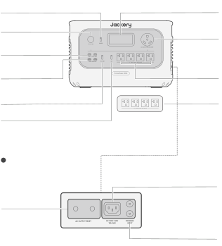
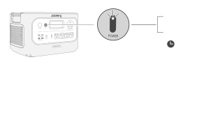
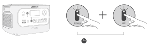
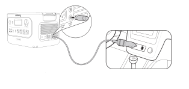
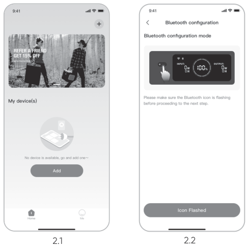
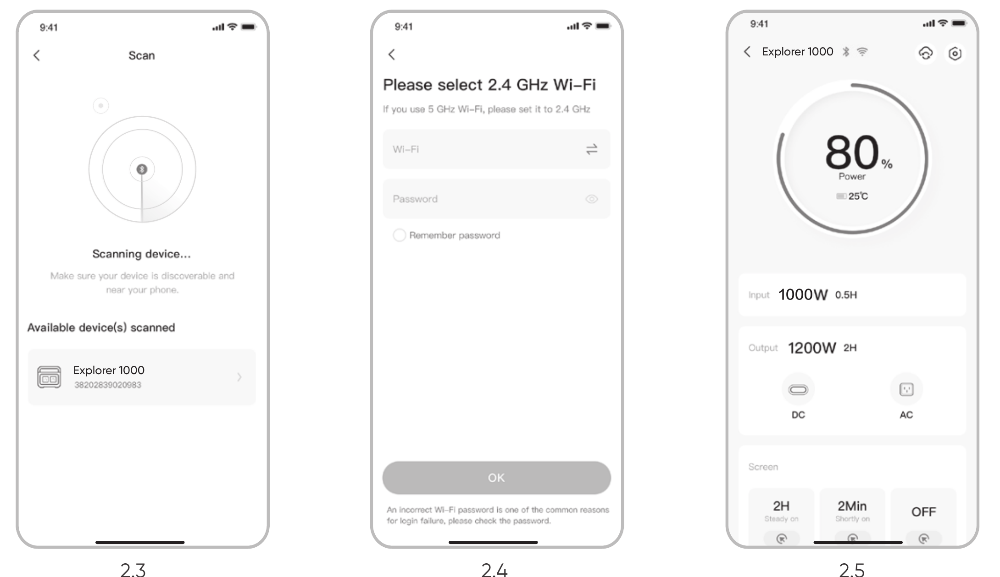

<h1 class="hb-preface-heading" id="native-preface">ES IMPORTANTE</h1>

Felicitaciones por su nuevo Jackery HomePower 3000. Antes de utilizar el producto, lea cuidadosamente este manual, especialmente las precauciones relevantes para asegurar un uso adecuado. Mantenga este manual en un lugar accesible para futuras consultas.

De acuerdo con las leyes y regulaciones, el derecho de interpretación final de este documento y todos los documentos relacionados con este producto corresponde a la Empresa. Aunque se ha hecho todo lo posible para garantizar la exactitud de este manual, Jackery Inc. no asume ninguna responsabilidad por los errores que puedan aparecer.

Tenga en cuenta que no se emitirán notificaciones adicionales en caso de actualizaciones, revisiones o terminación. Para obtener la última versión de los manuales del producto, visite support.jackery.com.

* Las cifras son sólo de referencia. Consulte el producto real.

## INFORMACIÓN IMPORTANTE DE SEGURIDAD

### INSTRUCCIONES RELATIVAS AL RIESGO DE INCENDIO, DESCARGA ELÉCTRICA O LESIONES PERSONALES

<table class="manual-callout-table manual-callout-table"><tbody><tr><td class="manual-callout-label">ADVERTENCIA</td><td class="manual-callout-body">
Sigue siempre estas precauciones básicas al usar este producto.
</td></tr></tbody></table>

<ul><li>Lee todas las instrucciones antes de usar el producto.</li><li>No permitas que los niños jueguen sobre del producto. Se requiere la supervisión cercana de adultos cuando se use cerca de niños.</li><li>Evita colocar las manos o los dedos dentro del producto.</li><li>Deja de usar el producto de inmediato si ha sufrido daños físicos o modificaciones. El uso inadecuado puede causar un comportamiento impredecible, provocando incendio, explosión o lesiones.</li><li>Si se observan los siguientes síntomas —(incluyendo sobrecalentamiento, olores extraños o humo, fugas o quemaduras)— deja de usar el producto de inmediato y contacta al distribuidor o a nuestro servicio al cliente.</li><li>Nunca intentes abrir, reparar o modificar el producto. Cualquier manipulación, re ensamblaje o modificación puede resultar en descarga eléctrica, incendio o daños a la batería.</li><li>Ten en cuenta que el líquido expulsado del producto puede causar irritación o quemaduras. El uso inapropiado o abusivo puede causar fugas en la batería. Evita el contacto directo con líquidos que se filtren. Si el líquido entra en contacto con los ojos, busca atención médica de inmediato. Si entra en contacto con otras partes del cuerpo, enjuaga con agua corriente y consulta a un médico de inmediato.</li><li>No expongas el producto al fuego o a temperaturas extremas. Hacerlo puede provocar una explosión si la temperatura supera los 130 °C (265 °F).</li><li>El uso de materiales o piezas no recomendadas o no suministradas puede implicar riesgo de incendio, descarga eléctrica o lesiones personales.</li><li>No dejes la batería cargando sin supervisión durante periodos prolongados. Supervisa siempre el proceso de carga para garantizar un funcionamiento seguro.</li><li>Para reducir el riesgo de descarga eléctrica, desconecta el producto de cualquier fuente de energía antes de realizar servicio técnico o resolución de problemas.</li></ul>

### INSTRUCCIONES DE USO

#### GUARDE ESTAS INSTRUCCIONES

<ul><li>Deja de usar el producto de inmediato si muestra signos de daño. Suspende el uso y contacta al servicio al cliente para recibir asistencia.</li><li>No cargues la batería en ambientes extremadamente calientes o fríos y cumple estrictamente con los rangos de temperatura especificados por el producto:<ul><li>Temperatura de carga: 32 °F a 113 °F (0°C a 45°C)</li><li>Temperatura de descarga: 14 °F a 113 °F (-10°C a 45°C)</li></ul></li><li>Para garantizar una circulación de aire adecuada, no cubras las rejillas de ventilación del producto. El área donde se use el producto debe tener un flujo de aire adecuado en un entorno fresco y seco para evitar el sobrecalentamiento.<ul><li>Cargar en espacios húmedos o mal ventilados puede representar riesgos para la seguridad.</li><li>El agua puede provocar cortocircuitos o dañar el cargador, generando riesgos de seguridad.</li></ul></li><li>Desconecta el cable de alimentación de la toma de corriente durante tormentas eléctricas.</li><li>Apaga el producto de inmediato presionando el botón de encendido si se ha caído, golpeado o expuesto a vibraciones.</li><li>Asegúrate de que los dispositivos estén apagados antes de conectarlos al producto.</li><li>No cargues el producto con un cable o enchufe dañado o roto.</li><li>No uses el producto para cargar dispositivos con cable o enchufe dañado o roto.</li><li>Siempre desconecta el cable de carga tirando del enchufe, no del cable, para evitar daños.</li><li>Asegúrate de que el producto esté bien asegurado al transportarlo en un vehículo en movimiento.</li><li>NO coloques la unidad boca abajo ni de lado durante el uso o almacenamiento.</li><li>NO coloques el producto en el suelo o a una altura menor de 18 pulgadas (457 mm) sobre el suelo durante el funcionamiento en un taller o centro de reparación.</li><li>NO uses los accesorios del producto con otros dispositivos o equipos.</li><li>El tiempo de carga solar depende de las condiciones meteorológicas. Coloque su panel solar donde reciba la mayor cantidad posible de luz solar directa.</li></ul>

### INSTRUCCIONES PARA LA CONEXIÓN A TIERRA

Este producto debe estar conectado a tierra. Si presenta mal funcionamiento o fallas, la conexión a tierra proporciona una ruta de menor resistencia para la corriente eléctrica y reduce el riesgo de shock eléctrico. Este producto está equipado con un cable que tiene un conductor de conexión a tierra y un enchufe con polo a tierra. El enchufe debe conectarse a un tomacorriente que esté instalado y conectado a tierra correctamente, de acuerdo con todos los códigos y ordenanzas locales.

<table class="manual-callout-table manual-callout-table"><tbody><tr><td class="manual-callout-label">ADVERTENCIA</td><td class="manual-callout-body">
Una conexión incorrecta del conductor de conexión a tierra del equipo puede provocar riesgo de shock eléctrico. Consulte con un electricista cualificado si tiene dudas sobre si el producto está conectado a tierra correctamente. No modifique el enchufe proporcionado con el producto; si no se ajusta al tomacorriente, haga que un electricista cualificado instale un tomacorriente adecuado.
</td></tr></tbody></table>

<table class="manual-callout-table manual-callout-table"><tbody><tr><td class="manual-callout-label">PELIGRO</td><td class="manual-callout-body">
Este dispositivo está diseñado únicamente para uso en interiores (coloque este dispositivo en un ambiente similar a interiores cuando lo use en exteriores, ej. autocaravanas, tiendas de campaña, cabañas, etc.). ※ Este dispositivo no es resistente al agua ni al polvo. Manténgalo alejado de la lluvia y ambientes húmedos durante su uso.
</td></tr></tbody></table>

### INSTRUCCIONES DE MANTENIMIENTO PARA EL USUARIO

Durante el ciclo de vida de los productos de almacenamiento de energía, se producirá cierto grado de degradación de capacidad y energía. A medida que aumenta el número de ciclos de uso y se extiende el tiempo de almacenamiento, esta degradación se intensificará gradualmente, lo cual es un fenómeno normal acorde con el patrón de envejecimiento natural de las celdas de la batería.

## SIGNIFICADO DE LOS SÍMBOLOS

<figure aria-label="Signal words" class="hb-symbol-signal-composition" data-component-id="HB-TABLE-SYMBOL-SIGNAL"><table class="hb-symbol-signal-table"><colgroup><col class="hb-symbol-signal-col-label"/><col class="hb-symbol-signal-col-meaning"/></colgroup><thead><tr><th class="hb-symbol-signal-label-heading" scope="col">Símbolo</th><th class="hb-symbol-signal-meaning-heading" scope="col">Significados</th></tr></thead><tbody><tr><td class="hb-symbol-signal-label-cell">⚠ADVERTENCIA</td><td class="hb-symbol-signal-meaning-cell">Prácticas peligrosas que pueden resultar en lesiones graves, muerte y/o daños a la propiedad.</td></tr><tr><td class="hb-symbol-signal-label-cell">⚠PRECAUCIÓN</td><td class="hb-symbol-signal-meaning-cell">Prácticas peligrosas que pueden resultar en lesiones personales y/o daños a la propiedad.</td></tr><tr><td class="hb-symbol-signal-label-cell">⚠NOTA</td><td class="hb-symbol-signal-meaning-cell">Prácticas peligrosas que pueden resultar en daño al equipo, pérdida de datos, deterioro del rendimiento o resultados inesperados.</td></tr><tr><td class="hb-symbol-signal-label-cell">⚠CONSEJOS</td><td class="hb-symbol-signal-meaning-cell">Complementa la información importante o consejos de operación en el texto.</td></tr></tbody></table></figure>

<figure aria-label="Safety symbols" class="hb-symbol-pair-composition" data-component-id="HB-TABLE-SYMBOL-ICON">

<table class="hb-symbol-panel-table"><colgroup><col class="hb-symbol-col-icon"/><col class="hb-symbol-col-meaning"/></colgroup><thead><tr><th class="hb-symbol-icon-heading" scope="col">Símbolo</th><th class="hb-symbol-meaning-heading" scope="col">Significados</th></tr></thead><tbody><tr><td class="hb-symbol-icon"></td><td class="hb-symbol-meaning">Precaución! El incumplimiento de los mensajes de advertencia puede provocar lesiones.</td></tr><tr><td class="hb-symbol-icon"></td><td class="hb-symbol-meaning">Lea el manual del operador</td></tr><tr><td class="hb-symbol-icon"></td><td class="hb-symbol-meaning">No se permiten niños</td></tr><tr><td class="hb-symbol-icon"></td><td class="hb-symbol-meaning">Este símbolo indica que el producto contiene una batería de iones de litio (Li-ion), la cual debe desecharse o reciclarse de forma adecuada.</td></tr></tbody></table>

<table class="hb-symbol-panel-table"><colgroup><col class="hb-symbol-col-icon"/><col class="hb-symbol-col-meaning"/></colgroup><thead><tr><th class="hb-symbol-icon-heading" scope="col">Símbolo</th><th class="hb-symbol-meaning-heading" scope="col">Significados</th></tr></thead><tbody><tr><td class="hb-symbol-icon"></td><td class="hb-symbol-meaning">No desarme el producto.</td></tr><tr><td class="hb-symbol-icon"></td><td class="hb-symbol-meaning">No fumar ni hacer llamas abiertas</td></tr><tr><td class="hb-symbol-icon"></td><td class="hb-symbol-meaning">Este símbolo indica que el producto no debe desecharse con los residuos domésticos. En su lugar, debe llevarse a un punto de recogida designado para su correcto reciclaje. El desecho y reciclaje adecuados ayudan a proteger el medioambiente. Para más información, póngase en contacto con su autoridad local, el servicio de gestión de residuos o el distribuidor del producto.</td></tr></tbody></table>

</figure>

## FCC

<figure aria-label="FCC" class="hb-fcc-composition" data-component-id="HB-SPECIAL-FCC">

Este dispositivo cumple con la parte 15 de las Reglas de la FCC. El funcionamiento está sujeto a las siguientes dos condiciones: (1) Este dispositivo no debe causar interferencias dañinas, y (2) Este dispositivo debe aceptar cualquier interferencia recibida, incluidas las interferencias que puedan causar un funcionamiento no deseado.

<strong>NOTA:</strong> Este aparato ha sido probado y cumple con los límites para un dispositivo digital de Clase B, de acuerdo con el Apartado 15 de las Reglas de la FCC. Estos límites están diseñados para proporcionar una protección razonable contra interferencias perjudiciales en una instalación residencial. Este aparato genera, usa y puede irradiar energía de radiofrecuencia y, si no se instala y utiliza de acuerdo con las instrucciones, puede causar interferencias perjudiciales en las comunicaciones por radio. Sin embargo, no hay garantía de que no se produzcan interferencias en una instalación concreta.

Si este aparato causa interferencias dañinas en la recepción de radio o televisión, lo cual puede determinarse encendiendo y apagando el equipo, se recomienda al usuario que intente corregir la interferencia mediante una o varias de las siguientes medidas:
<ul class="simple"><li>
Reorientar o reubicar la antena receptora.
</li><li>
Aumentar la separación entre el equipo y el receptor.
</li><li>
Conecte el aparato a una toma de corriente en un circuito diferente al que está conectado el receptor.
</li><li>
Consulte con el distribuidor o con un técnico de radio o TV experimentado para recibir ayuda.
</li></ul>
<strong>MODIFICACIÓN:</strong> Cualquier cambio o modificación no aprobado expresamente por el cesionario de este dispositivo podría anular la autoridad del usuario para utilizar el dispositivo.

</figure>

## CONTENIDO DE LA CAJA

<figure aria-label="CONTENIDO DE LA CAJA" class="hb-inbox-composition" data-card-count="3" data-component-id="HB-SPECIAL-INBOX" data-inbox-variant="responsive-card-grid"><ol class="hb-inbox-grid"><li class="hb-inbox-card" data-item-number="1">

Jackery HomePower 3000

</li><li class="hb-inbox-card" data-item-number="2">

Cable de carga de CA

</li><li class="hb-inbox-card" data-item-number="3">

Documentos

</li></ol>

CONSEJOS

El cable de carga para automóvil no está incluido, pero está disponible para su compra por separado en nuestro sitio web. Para obtener asistencia, comunícate con el servicio al cliente de Jackery.

</figure>

## DESCRIPCIÓN GENERAL DEL PRODUCTO

### VISTA FRONTAL

<figure class="hb-reference-figure hb-base-art-live-copy" data-component-id="HB-SPECIAL-REFERENCE-FIGURE" data-reference-id="overview" data-source-fragment-sha256="6abbda877ace9c52271decf76fbb8147383977f1d544caf8a0a18cf4dd2f4892" data-web-base-art-ref="overview" data-web-presentation-mode="base-art-live-copy">

<strong>Botón</strong> <strong>de</strong> <strong>encendido</strong> <strong>principal</strong><strong>Puerto</strong> <strong>DC</strong> <strong>12V</strong> 12 V⎓10 A Máx<strong>Salida</strong> <strong>USB-C</strong> <strong>100W</strong> 100 W Máx, 5 V⎓3 A, 9 V⎓3 A, 12 V⎓3 A, 15 V⎓3 A, 20 V⎓5 A<strong>Salida</strong> <strong>USB-A</strong> <strong>18W</strong> 18 W Máx, 5-6 V⎓3 A, 6-9 V⎓2 A, 9-12 V⎓1,5 A<strong>Botón</strong> <strong>de</strong> <strong>energía</strong> <strong>CC/USB</strong><strong>Botón</strong> <strong>de</strong> <strong>energía</strong> <strong>CA</strong><strong>LCD</strong><strong>Salidas</strong> <strong>de</strong> <strong>CA</strong> 120 V~60 Hz, 30 A Máx, 3600 W nominales<strong>Salidas</strong> <strong>de</strong> <strong>CA</strong> 120 V~60 Hz, 20 A, 2400 W nominales<strong>Salida</strong> <strong>total</strong> <strong>de</strong> <strong>CA</strong> 3600 W nominales<strong>VISTA</strong> <strong>LATERAL</strong> <strong>DERECHA</strong><strong>Botón</strong> <strong>de</strong> <strong>reinicio</strong> <strong>de</strong> <strong>salida</strong> <strong>CA</strong><strong>Entrada</strong> <strong>de</strong> <strong>CA</strong> 100 V-120 V~ 60 Hz, 15 A Máx<strong>Entrada</strong> <strong>de</strong> <strong>CC</strong> <strong>(2</strong> <strong>x</strong> <strong>Puertos</strong> <strong>DC8020)</strong> 16-60 V⎓12 A Máx, Doble a 24 A, 1000 W Máx, 12-16 V⎓8 A Máx, Doble a 8 A Máx

</figure>

## PANTALLA LCD

<figure class="hb-reference-figure hb-base-art-live-copy" data-component-id="HB-SPECIAL-REFERENCE-FIGURE" data-reference-id="lcd-map" data-source-fragment-sha256="c5bfa3541f7fa146f31aa9bcb4f2158a7f5b48771450feaa9a9ddb53bde7bc44" data-web-base-art-ref="lcd-map" data-web-presentation-mode="base-art-live-copy">

13121415161718192021252224231234568911107

</figure>

<figure aria-label="PANTALLA LCD" class="hb-lcd-table-composition" data-component-id="HB-TABLE-LCD-ICON" tabindex="0"><table class="hb-lcd-icon-table"><colgroup><col class="hb-lcd-col-number"/><col class="hb-lcd-col-icon"/><col class="hb-lcd-col-name"/><col class="hb-lcd-col-description"/></colgroup><tbody><tr><td class="hb-lcd-number">1</td><td class="hb-lcd-icon"></td><td class="hb-lcd-name">Wi-Fi</td><td class="hb-lcd-description"><strong>Encendido</strong>: Wi-Fi conectado. <strong>Parpadeo</strong>: listo para conectarse al Wi-Fi. <strong>Apagado</strong>: Wi-Fi desconectado.</td></tr><tr><td class="hb-lcd-number">2</td><td class="hb-lcd-icon"></td><td class="hb-lcd-name">Bluetooth</td><td class="hb-lcd-description"><strong>Encendido</strong>: Bluetooth conectado. <strong>Parpadeo</strong>: listo para conectarse al Bluetooth. <strong>Apagado</strong>: Bluetooth desconectado.</td></tr><tr><td class="hb-lcd-number">3</td><td class="hb-lcd-icon"></td><td class="hb-lcd-name">Modo de Carga Silenciosa</td><td class="hb-lcd-description"><strong>Encendido</strong>: el ruido durante la carga se minimiza significativamente, mientras que la potencia de carga se reduce y la velocidad de carga disminuye. <strong>Apagado</strong>: El modo de carga silenciosa está desactivado. Activar/desactivar esta función en la App Jackery. The setting is retained when the device is powered off.</td></tr><tr><td class="hb-lcd-number">4</td><td class="hb-lcd-icon"></td><td class="hb-lcd-name">Modo de Ahorro de Batería</td><td class="hb-lcd-description"><strong>Encendido</strong>: limita la capacidad máxima utilizable de la batería para prolongar su vida útil. <strong>Apagado</strong>: el modo de ahorro de batería está desactivado. Activar/desactivar esta función en la App Jackery. The setting is retained when the device is powered off. When this feature is enabled, the product occasionally performs a full charge and discharge cycle to calibrate the SOC.</td></tr><tr><td class="hb-lcd-number">5</td><td class="hb-lcd-icon"></td><td class="hb-lcd-name">Plan de Carga</td><td class="hb-lcd-description">Personaliza el tiempo de carga del Jackery HomePower 3000. Adecuado para situaciones con tarifas eléctricas variables, permite establecer planes de carga según las horas pico y valle, reduciendo así los costos de electricidad. Por favor, configure esta función en la aplicación Jackery. The setting is retained when the device is powered off.</td></tr><tr><td class="hb-lcd-number">6</td><td class="hb-lcd-icon"></td><td class="hb-lcd-name">Límite de potencia de carga</td><td class="hb-lcd-description"><strong>Encendido</strong>: El límite de potencia de carga está activado en la aplicación Jackery. <strong>Apagado</strong>: El límite de potencia de carga está desactivado en la aplicación Jackery. The setting is retained when the device is powered off.</td></tr><tr><td class="hb-lcd-number">7</td><td class="hb-lcd-icon"></td><td class="hb-lcd-name">Modo Autónomo</td><td class="hb-lcd-description">Maximiza el uso de la energía solar y reduce la dependencia de la electricidad de la red al priorizar la energía solar almacenada, reduciendo los costos eléctricos. La estación de energía debe estar conectada simultáneamente a los paneles solares y a la red, con la potencia de carga limitada por la potencia de derivación. Por favor, active/desactive esta función en la aplicación. The setting is retained when the device is powered off.</td></tr><tr><td class="hb-lcd-number">8</td><td class="hb-lcd-icon"></td><td class="hb-lcd-name">TOU Mode</td><td class="hb-lcd-description"><strong>On</strong>: TOU mode is enabled (default backup SOC: 60%). During peak periods, when the stored energy exceeds the backup SOC, the product prioritizes battery discharge to reduce peak electricity costs. During off-peak periods, the system charges the battery from the grid to achieve peak-shaving and valley-filling. <strong>Off</strong>: TOU mode is disabled. The device does not follow the TOU (time-of-use) strategy and operates according to the default power supply and charging logic. Por favor, active/desactive esta función en la aplicación. The setting is retained when the device is powered off.</td></tr><tr><td class="hb-lcd-number">9</td><td class="hb-lcd-icon"></td><td class="hb-lcd-name">UPS</td><td class="hb-lcd-description"><strong>Encendido</strong>: El producto está en modo bypass, en el cual el tiempo de cambio de la energía de la red a la batería interna es de 10 ms. <strong>Apagado</strong>: El producto no está en modo bypass.</td></tr><tr><td class="hb-lcd-number">10</td><td class="hb-lcd-icon"></td><td class="hb-lcd-name">Indicador de Energía de CA</td><td class="hb-lcd-description">La salida CA (onda sinusoidal pura) está activada.</td></tr><tr><td class="hb-lcd-number">11</td><td class="hb-lcd-icon"></td><td class="hb-lcd-name">Potencia de Entrada</td><td class="hb-lcd-description">Muestra la potencia de entrada en vatios.</td></tr><tr><td class="hb-lcd-number">12</td><td class="hb-lcd-icon"></td><td class="hb-lcd-name">Tiempo de Carga Restante</td><td class="hb-lcd-description">Muestra el tiempo de carga restante.</td></tr><tr><td class="hb-lcd-number">13</td><td class="hb-lcd-icon"></td><td class="hb-lcd-name">Indicador de Carga desde Toma de Corriente CA</td><td class="hb-lcd-description">El producto se carga a través de la entrada CA utilizando energía de la red eléctrica.</td></tr><tr><td class="hb-lcd-number">14</td><td class="hb-lcd-icon"></td><td class="hb-lcd-name">Indicador de Carga desde Coche</td><td class="hb-lcd-description">El producto se carga a través de la entrada CC (DC8020) utilizando CC 12V (carga desde el coche).</td></tr><tr><td class="hb-lcd-number">15</td><td class="hb-lcd-icon"></td><td class="hb-lcd-name">Indicador de Carga Solar</td><td class="hb-lcd-description">El producto se carga a través de la entrada CC (DC8020) utilizando paneles solares.</td></tr><tr><td class="hb-lcd-number">16</td><td class="hb-lcd-icon"></td><td class="hb-lcd-name">Indicador de Potencia de la Batería</td><td class="hb-lcd-description">Cuando el producto se está cargando, el círculo naranja alrededor del porcentaje de batería se ilumina secuencialmente. Cuando está cargando otros dispositivos, el círculo naranja permanece encendido.</td></tr><tr><td class="hb-lcd-number">17</td><td class="hb-lcd-icon"></td><td class="hb-lcd-name">Indicador de Batería Baja</td><td class="hb-lcd-description"><strong>Encendido</strong>: el nivel de la batería está por debajo del 20 %. <strong>Parpadeo</strong>: el nivel de la batería está por debajo del 5 %. <strong>Apagado</strong>: el nivel de la batería no está por debajo del 20 % o el producto se está cargando.</td></tr><tr><td class="hb-lcd-number">18</td><td class="hb-lcd-icon"></td><td class="hb-lcd-name">Porcentaje de Batería Restante</td><td class="hb-lcd-description">Muestra el porcentaje de batería restante.</td></tr><tr><td class="hb-lcd-number">19</td><td class="hb-lcd-icon"></td><td class="hb-lcd-name">Discharge Timer</td><td class="hb-lcd-description"><strong>On</strong>: A discharge timer is set. <strong>Off</strong>: No discharge timer is set. Enable/disable this feature in the Jackery App. The setting is not retained when the device is powered off.</td></tr><tr><td class="hb-lcd-number">20</td><td class="hb-lcd-icon"></td><td class="hb-lcd-name">Modo de Ahorro de Energía</td><td class="hb-lcd-description"><strong>Encendido</strong>: Modo de ahorro de energía activado. <strong>Apagado</strong>: Modo de ahorro de energía desactivado.</td></tr><tr><td class="hb-lcd-number">21</td><td class="hb-lcd-icon"></td><td class="hb-lcd-name">Indicador de Alta Temperatura</td><td class="hb-lcd-description">Se activó la protección por alta temperatura. El producto puede dejar de funcionar hasta que su temperatura vuelva al rango normal de operación.</td></tr><tr><td class="hb-lcd-number">21</td><td class="hb-lcd-icon"></td><td class="hb-lcd-name">Indicador de Baja Temperatura</td><td class="hb-lcd-description">Se activó la protección por baja temperatura. El producto puede dejar de funcionar hasta que su temperatura vuelva al rango normal de operación.</td></tr><tr><td class="hb-lcd-number">22</td><td class="hb-lcd-icon"></td><td class="hb-lcd-name">Código de fallo</td><td class="hb-lcd-description">Se ha producido un error en el producto. Por favor, consulte la sección de solución de problemas para más detalles.</td></tr><tr><td class="hb-lcd-number">23</td><td class="hb-lcd-icon"></td><td class="hb-lcd-name">Voltaje y frecuencia de salida</td><td class="hb-lcd-description">Muestra el voltaje y la frecuencia de salida cuando la salida de CA está encendida.</td></tr><tr><td class="hb-lcd-number">24</td><td class="hb-lcd-icon"></td><td class="hb-lcd-name">Potencia de Salida</td><td class="hb-lcd-description">Muestra la potencia de salida en vatios.</td></tr><tr><td class="hb-lcd-number">25</td><td class="hb-lcd-icon"></td><td class="hb-lcd-name">Tiempo de Descarga Restante</td><td class="hb-lcd-description">Muestra el tiempo de descarga restante.</td></tr></tbody></table></figure>

## OPERACIONES

### ENCENDIDO/APAGADO

<figure class="hb-reference-figure hb-base-art-live-copy" data-component-id="HB-SPECIAL-REFERENCE-FIGURE" data-reference-id="power" data-source-fragment-sha256="39e118b4fdeb3de1aa91e200a5f758bb0d7a0c0d6c528e3650e4894903ae1602" data-web-base-art-ref="power" data-web-presentation-mode="base-art-live-copy">

<strong>Encendido</strong> Presione una vez<strong>Apagado</strong> Mantén presionado durante 3 segundos3s<strong>Tiempo</strong> <strong>de</strong> <strong>espera</strong> <strong>predeterminado:</strong> 2 horas El producto se apagará automáticamente después de 2 horas de inactividad, sin carga ni descarga. *El tiempo en espera puede configurarse en la App de Jackery.Cuando el modo de ahorro de energía está activado, el producto se apagará automáticamente después de 12 horas si el botón de energía CA o CC/USB está encendido, pero el producto no está cargando ni descargando.

</figure>

### ENCENDER/APAGAR SALIDA CA

<figure class="hb-reference-figure hb-base-art-live-copy" data-component-id="HB-SPECIAL-REFERENCE-FIGURE" data-reference-id="ac-output" data-source-fragment-sha256="764bfc683921fdfc88d46a5cb48bb86ea7a8c70b4f1c2b3c40b1736e3a1754a5" data-web-base-art-ref="ac-output" data-web-presentation-mode="base-art-live-copy">

<strong>Requisito</strong> <strong>previo:</strong> el producto está encendido.<strong>Encendido</strong> Presione una vez<strong>Apagado</strong> Presione una vez<strong>Botón</strong> <strong>de</strong> <strong>reinicio</strong> <strong>de</strong> <strong>salida</strong> <strong>CA:</strong> Cuando el botón de reinicio se levante, necesita remover la carga y presionar el botón de reinicio para reiniciar.

</figure>

### ENCENDER/APAGAR SALIDA CC 12V/USB

<figure class="hb-reference-figure hb-base-art-live-copy" data-component-id="HB-SPECIAL-REFERENCE-FIGURE" data-reference-id="dc-output" data-source-fragment-sha256="a0ab2ed0922fe8375c2b4cf1030ad0b99437ed57aa0fa58636e6b1867f539639" data-web-base-art-ref="dc-output" data-web-presentation-mode="base-art-live-copy">

<strong>Requisito</strong> <strong>previo:</strong> el producto está encendido.<strong>Encendido</strong> Presione una vez<strong>Apagado</strong> Presione una vez

</figure>
<table class="manual-callout-table manual-callout-table"><tbody><tr><td class="manual-callout-label">PRECAUCIÓN</td><td class="manual-callout-body"><ul><li>El puerto USB-C de 100 W es una salida de alta potencia de tipo Fuente de Alimentación 3 (PS3) según USB-PD. Si el dispositivo del usuario o accesorio conectado no cumple con los requisitos de seguridad, puede existir riesgo de incendio. Antes de usar estos puertos, asegúrese de que el dispositivo o accesorio conectado tenga protección contra incendios.</li><li>Solo conecte el Jackery HomePower 3000 a dispositivos o accesorios que cumplan con las cláusulas 6.3, 6.4 y 6.5 de IEC/EN/UL 62368-1 (u otros estándares equivalentes).</li><li>Para obtener la potencia máxima de salida, utilice el cable USB-C a USB-C de 5 A (20 V CC/5 A, 100W).</li></ul></td></tr></tbody></table>
El producto puede cargar la batería de su automóvil utilizando el cable de carga de batería para automóvil Jackery 12V, que se vende por separado y está disponible en nuestro sitio web.
<table class="manual-callout-table manual-callout-table"><tbody><tr><td class="manual-callout-label">PRECAUCIÓN</td><td class="manual-callout-body"><ul><li>El puerto del mechero para auto solo es compatible con baterías de automóvil de 12V y no es adecuado para sistemas de 24V.</li><li>No arranque el automóvil mientras el producto está cargando la batería del automóvil a través del puerto de salida CC de 12V, ya que esto podría dañar el producto.</li><li>Esta función está diseñada únicamente para uso de emergencia y no puede cargar una batería de automóvil descargada o dañada.</li></ul></td></tr></tbody></table>

### FUNCIÓN DE REANUDACIÓN DE SALIDA DE CA Y CC

Esta función memoriza el estado de la salida y reanuda automáticamente las salidas de CA y CC bajo condiciones definidas.

<table class="manual-table"><tbody><tr><th>Condiciones de reanudación automática</th><th>Condiciones sin reanudación automática</th></tr><tr><td>Encendido/Reiniciar después de apagado o reinicio</td><td>Apagado manual de la salida (botón/App)</td></tr><tr><td>SOC de la batería ≥ límite de descarga</td><td>Apagado de salida en modo de ahorro de energía</td></tr><tr><td>+10 % después de alcanzar el límite</td><td>Apagado de salida activado por protección</td></tr><tr><td>Actualización OTA completada</td><td>Apagado de salida activado por temporizador de descarga</td></tr></tbody></table>

### MODO DE AHORRO DE ENERGÍA

Para evitar el consumo innecesario de batería al olvidar apagar la salida, el producto activa por defecto el Modo de Ahorro de Energía. Cuando la salida de CA o CC/USB está encendida, el ícono del modo de Ahorro de Energía se mostrará en la pantalla LCD. Si no hay ningún dispositivo conectado o si el consumo del dispositivo conectado está por debajo de un cierto umbral (salida de CA de 25W o salida CC/USB de 2W) durante 12 horas, el dispositivo apagará automáticamente todas las salidas. Configure la duración del modo de Ahorro de Energía en la aplicación Jackery. Para desactivar el modo de ahorro de energía, presione y mantenga presionados el botón de energía CA y el botón de encendido principal durante más de 3 segundos. El producto no apagará automáticamente la salida CA o CC.

<figure class="hb-reference-figure hb-base-art-live-copy" data-component-id="HB-SPECIAL-REFERENCE-FIGURE" data-reference-id="energy" data-source-fragment-sha256="f955f1be612e93f8077d8e42efaa3b4a124fcb47223a8773ddc756f996b1f91a" data-web-base-art-ref="energy" data-web-presentation-mode="base-art-live-copy">

Botón de <strong>encendido</strong> principalBotón de energía CA<strong>Encendido/Apagado</strong> Mantenga pulsados ambos botones durante 3 segundos3s

</figure>

<table class="manual-callout-table manual-callout-table"><tbody><tr><td class="manual-callout-label">NOTA</td><td class="manual-callout-body">
El modo de ahorro de energía reanuda el estado anterior después de encender. Se requiere un cambio manual para modificar el modo.
</td></tr></tbody></table>

### PANTALLA LCD

<figure aria-label="LCD screen modes" class="hb-lcd-mode-composition" data-component-id="HB-TABLE-LCD-MODE">

<table class="hb-lcd-mode-table"><colgroup><col class="hb-lcd-mode-col-state"/><col class="hb-lcd-mode-col-action"/><col class="hb-lcd-mode-col-copy"/></colgroup><tbody><tr><td class="hb-lcd-mode-state" rowspan="3">En breve</td><td class="hb-lcd-mode-action">Encender</td><td class="hb-lcd-mode-copy">Presione el botón de encendido principal o cuando el producto se esté cargando.</td></tr><tr><td class="hb-lcd-mode-action">Apagar</td><td class="hb-lcd-mode-copy">Presione el botón de encendido principal.</td></tr><tr><td class="hb-lcd-mode-action"><strong>Apagado</strong> automático</td><td class="hb-lcd-mode-copy">La pantalla LCD se apaga automáticamente y entra en modo de suspensión después de 2 minutos de inactividad.</td></tr><tr><td class="hb-lcd-mode-state" rowspan="3">Estable en (durante el estado de carga o descarga)</td><td class="hb-lcd-mode-action">Encender</td><td class="hb-lcd-mode-copy">Presione dos veces el botón de encendido principal cuando el producto está encendido.</td></tr><tr><td class="hb-lcd-mode-action">Apagar</td><td class="hb-lcd-mode-copy">Presione el botón de energía principal.</td></tr><tr><td class="hb-lcd-mode-action"><strong>Apagado</strong> automático</td><td class="hb-lcd-mode-copy">La pantalla LCD se apaga automáticamente después de 2 horas de inactividad.</td></tr></tbody></table>
</figure>
También puedes configurar el modo de visualización de la pantalla en la aplicación Jackery.

### COMBINACIONES DE TECLAS

<table class="manual-table"><tbody><tr><th>Botones</th><th>Operación</th><th>Función</th></tr><tr><td>Botón de encendido principal Botón de energía CA</td><td>Mantenga pulsados ambos botones durante 3 segundos</td><td>Encender/apagar el modo de ahorro de energía</td></tr><tr><td>Botón de energía CC/USB Botón de encendido principal</td><td>Mantenga pulsados ambos botones durante 3 segundos</td><td>Restablecer Wi-Fi y Bluetooth</td></tr><tr><td>Botón de energía CA Botón de energía CC/USB</td><td>Mantenga pulsados ambos botones durante 1 segundo</td><td>Encender/apagar Wi-Fi y Bluetooth</td></tr></tbody></table>

## FUENTE DE ALIMENTACIÓN ININTERRUMPIDA (UPS)

Conecte el producto a una toma de corriente con el cable de carga de CA, luego presione el botón de energía CA y cargue sus electrodomésticos al mismo tiempo. Un sistema de alimentación ininterrumpida (UPS) es un tipo de sistema de energía continua que proporciona energía eléctrica de respaldo automática a una carga cuando falla la energía de la red principal. En modo SAI, la salida de pico de la unidad alcanza 15 A y se mantiene por un máximo de tres horas. Después de tres horas, la corriente de salida disminuye a 12 A. Cualquier interrupción del modo SAI reiniciará el período de temporización de tres horas. Como la carga y descarga simultáneas están habilitadas en el modo derivación, la potencia de salida real es menor que la potencia nominal en este modo, pero vuelve a la potencia nominal durante los cortes.

<figure class="hb-reference-figure" data-component-id="HB-SPECIAL-REFERENCE-FIGURE" data-reference-id="ups" data-source-fragment-sha256="917a13a61668837de02bff0a1ffed5a545327ecb152e69984a7dc74367217f2a">

</figure>

<table class="manual-callout-table manual-callout-table"><tbody><tr><td class="manual-callout-label">PRECAUCIÓN</td><td class="manual-callout-body"><ul><li>Este producto no admite conmutación de 0 ms. No lo conecte a equipos que requieran una fuente de alimentación ininterrumpida, como servidores de datos o estaciones de trabajo.</li><li>Antes de usar, pruebe la compatibilidad con su dispositivo varias veces.</li><li>No conectes cargas que excedan la potencia máxima de salida del producto. De lo contrario, se activará la protección contra sobrecarga.</li></ul></td></tr></tbody></table>

## CARGANDO

Energía renovable primero: Abogamos por utilizar primero energía renovable. Este producto admite dos modos de carga al mismo tiempo: carga solar y carga de pared de CA. Cuando la carga en la pared de CA y la carga solar están activadas al mismo tiempo, el producto dará prioridad a la carga solar y se utilizarán ambos métodos para cargar la batería a la máxima potencia permitida.

Chargez complètement le produit avant sa première utilisation.

<table class="manual-callout-table manual-callout-table"><tbody><tr><td class="manual-callout-label">Nota</td><td class="manual-callout-body"><ul><li>La temperatura de carga recomendada para el producto está entre 32 °F y 113 °F (0 °C a 45 °C), y la temperatura de descarga está entre 14 °F y 113 °F (-10 °C a 45 °C). Operar el producto fuera de este rango de temperatura puede limitar sus capacidades de carga y descarga, e incluso impedir la carga o descarga.</li><li>La potencia de carga y la capacidad de la batería del producto pueden variar debido a fluctuaciones de temperatura.</li></ul></td></tr></tbody></table>

### CARGA MEDIANTE UNA TOMA DE CORRIENTE DE PARED ALTERNA

Conecte el cable de carga de CA al puerto de entrada de CA del producto y a una toma de corriente.

<figure class="hb-reference-figure" data-component-id="HB-SPECIAL-REFERENCE-FIGURE" data-reference-id="ac-charge" data-source-fragment-sha256="dc12d2ad7d2e89abe14ae5da0500b1256c2c29174f18d2cbffcd081f29ea99c6">

</figure>

<table class="manual-callout-table manual-callout-table"><tbody><tr><td class="manual-callout-label">PRECAUCIÓN</td><td class="manual-callout-body">
Asegúrese de que el cable de carga de CA esté completamente y firmemente insertado en el puerto de entrada de CA. Una conexión incompleta puede provocar corriente inestable, sobrecalentamiento, mal contacto o fallos en el funcionamiento del producto.
</td></tr></tbody></table>

### CARGA MEDIANTE PANELES SOLARES (SE VENDE POR SEPARADO)

El Jackery HomePower 3000 cuenta con dos puertos de entrada DC8020 y es compatible con los paneles solares de la Jackery. Si se necesita conectar dos paneles solares a un solo puerto de entrada DC8020 al mismo tiempo, consulte la figura a continuación para la carga mediante el conector de panel solar (se vende por separado, no incluido de serie).

<figure class="hb-reference-figure hb-base-art-live-copy" data-component-id="HB-SPECIAL-REFERENCE-FIGURE" data-reference-id="solar" data-source-fragment-sha256="8b99c39fd9bfa8c9eea85d17277d786b039ac443480efa18cb4fa57fabc1bb25" data-web-base-art-ref="solar" data-web-presentation-mode="base-art-live-copy">

SolarSaga 200 ×4

</figure>

<table class="manual-callout-table manual-callout-table"><tbody><tr><td class="manual-callout-label">PRECAUCIÓN</td><td class="manual-callout-body">
Un puerto de entrada DC8020 puede conectarse a un máximo de dos paneles solares.
</td></tr></tbody></table>

<table class="manual-callout-table manual-callout-table"><tbody><tr><td class="manual-callout-label">PRECAUCIÓN</td><td class="manual-callout-body">
Asegúrese de que el voltaje de entrada para ambos puertos de entrada CC sea el mismo. De lo contrario, podría dañar el producto. Por ejemplo:
<ul><li>Se recomienda utilizar paneles solares Jackery del mismo modelo y la misma cantidad de paneles al conectar paneles solares a ambos puertos de entrada DC8020.</li><li>No cargue el producto utilizando simultáneamente un cargador de automóvil y un panel solar. Hacerlo podría quemar el fusible del automóvil o resultar en un fallo de carga.</li></ul></td></tr></tbody></table>

Se recomienda usar el panel solar Jackery para cargar el Jackery HomePower 3000. Asegúrese de que el voltaje en circuito abierto (Voc) del rango de entrada CC (16 V-60 V) del Jackery HomePower 3000. Jackery no se hace responsable de pérdidas causadas por el uso de paneles solares de otras marcas.

### CARGA CON UN CARGADOR DE EN EL VEHÍCULO (SE VENDE POR SEPARADO)

Este producto puede cargarse usando un cargador para auto de 12V. Asegúrese de que el cargador de coche y el encendedor de coche ofrecen una buena conexión.

<figure class="hb-reference-figure hb-base-art-live-copy" data-component-id="HB-SPECIAL-REFERENCE-FIGURE" data-reference-id="car" data-source-fragment-sha256="bd81cfb7cedde285f0e53bd0acb20d9b2c68cc205a938263999a2881c39492fb" data-web-base-art-ref="car" data-web-presentation-mode="base-art-live-copy">

Vehículo※El cable de carga para auto se vende por separado.

</figure>

<table class="manual-callout-table manual-callout-table"><tbody><tr><td class="manual-callout-label">PRECAUCIÓN</td><td class="manual-callout-body"><ul><li>Por favor, encienda el vehículo antes de cargar su estación de energía.</li><li>Si el vehículo circula por caminos accidentados, está prohibido usar el cargador de coche para evitar que se queme debido a una mala conexión. La empresa no se responsabiliza por pérdidas causadas por un uso incorrecto.</li><li>La carga en vehículo solo es aplicable a vehículos con 12 V CC, no a 24 V CC. Por favor, no cargue este producto en vehículos de 24 V para evitar lesiones personales y daños materiales.</li></ul></td></tr></tbody></table>

## ALMACENAMIENTO

Almacene el producto en un lugar seco y limpio con ventilación adecuada. Temperatura y humedad de almacenamiento:

<ul><li>1 mes: -4°F a 113°F / -20 °C a 45 °C (0-60 % HR)</li><li>3 meses: 32°F a 113°F / 0 °C a 45 °C (0-60 % HR)</li><li>12 meses: 32°F a 77°F / 0 °C a 25 °C (0-60 % HR)</li></ul>

Si este producto se almacena durante un período prolongado (de 3 a 6 meses) con la batería descargada, podría volverse imposible recargarlo. Para evitar esto y mantener la salud de la batería, se recomienda revisar y recargar el producto cada tres meses, y realizar un ciclo completo de carga y descarga al menos una vez cada 6 a 12 meses.

## RESOLUCIÓN DE PROBLEMAS

Si aparece alguno de los siguientes códigos de falla, siga las acciones correctivas listadas para resolver el problema. Si la falla persiste, por favor contacte con atención al cliente de Jackery.

<figure aria-label="Código de Error / Medidas correctivas" class="hb-troubleshooting-composition" data-component-id="HB-TABLE-TROUBLESHOOTING" tabindex="0"><table class="hb-troubleshooting-table"><colgroup><col class="hb-troubleshooting-col-code"/><col class="hb-troubleshooting-col-measures"/></colgroup><thead><tr><th class="hb-troubleshooting-code" scope="col">Código de Error</th><th class="hb-troubleshooting-measures" scope="col">Medidas correctivas</th></tr></thead><tbody><tr><td class="hb-troubleshooting-code">F0 / F1 / F2 / F3</td><td class="hb-troubleshooting-measures">Reiniciar el producto.</td></tr><tr><td class="hb-troubleshooting-code">F4</td><td class="hb-troubleshooting-measures">Conecte el producto a cargas para descargar su batería hasta que la falla desaparezca.</td></tr><tr><td class="hb-troubleshooting-code">F5</td><td class="hb-troubleshooting-measures">Cargue el producto mediante paneles solares o toma de corriente CA hasta que la falla desaparezca.</td></tr><tr><td class="hb-troubleshooting-code">F6</td><td class="hb-troubleshooting-measures"><ol><li>Espere a que la red eléctrica se normalice antes de cargar el producto a través de una toma de corriente CA.</li><li>Verifique si las rejillas de entrada y salida de aire están obstruidas; asegure un espacio libre de 0,66 pies (20 cm) a ambos lados del producto.</li><li>Coloque el producto en un lugar que no esté expuesto a la luz solar directa o a altas temperaturas ambientales.</li><li>Desconecte todas las cargas del producto. Mantenga el producto inactivo y espere hasta que la falla desaparezca.</li><li>Reiniciar el producto.</li></ol></td></tr><tr><td class="hb-troubleshooting-code">F7</td><td class="hb-troubleshooting-measures"><ol><li>Retire todas las entradas de CC del producto.</li><li>Si carga el producto mediante un panel solar, verifique el voltaje en circuito abierto (Voc) del panel solar conectado. El producto permite un voltaje máximo de entrada de CC de 60 V.</li><li>Reinicie el producto y déjelo en reposo. Espere hasta que la falla desaparezca.</li></ol></td></tr><tr><td class="hb-troubleshooting-code">F8</td><td class="hb-troubleshooting-measures">Contacte con atención al cliente de Jackery.</td></tr><tr><td class="hb-troubleshooting-code">F9</td><td class="hb-troubleshooting-measures">Retire la carga conectada a los puertos CC/USB del producto. Espere hasta que la falla desaparezca.</td></tr><tr><td class="hb-troubleshooting-code">FE</td><td class="hb-troubleshooting-measures">Contacte con atención al cliente de Jackery.</td></tr></tbody></table></figure>

## ESPECIFICACIONES

<h2 class="hb-spec-group">INFORMACIÓN GENERAL</h2>

<figure aria-label="INFORMACIÓN GENERAL" class="hb-spec-table-composition"><table class="manual-table manual-spec-table hb-spec-table"><colgroup><col class="hb-spec-col-label"/><col class="hb-spec-col-value"/></colgroup><tbody><tr><th class="manual-spec-label hb-spec-label" scope="row">Nombre del producto</th><td class="manual-spec-value hb-spec-value">Jackery HomePower 3000</td></tr><tr><th class="manual-spec-label hb-spec-label" scope="row">N° de modelo</th><td class="manual-spec-value hb-spec-value">JHP-3000D</td></tr><tr><th class="manual-spec-label hb-spec-label" scope="row">Capacidad</th><td class="manual-spec-value hb-spec-value">3072 Wh (60Ah/51.2V DC)</td></tr><tr><th class="manual-spec-label hb-spec-label" scope="row">Química Celular</th><td class="manual-spec-value hb-spec-value">LiFePO4</td></tr><tr><th class="manual-spec-label hb-spec-label" scope="row">Peso</th><td class="manual-spec-value hb-spec-value">Aproximadamente 59,5 libras/27 kg</td></tr><tr><th class="manual-spec-label hb-spec-label" scope="row">Dimensiones</th><td class="manual-spec-value hb-spec-value">17,1 × 12,8 × 11,1 pulgadas / 43,5 × 32,6 × 28,1 cm</td></tr><tr><th class="manual-spec-label hb-spec-label" scope="row">Ciclo de vida</th><td class="manual-spec-value hb-spec-value">4000 ciclos de carga hasta 70 % + de capacidad</td></tr></tbody></table></figure>

<h2 class="hb-spec-group">PUERTOS DE ENTRADA</h2>

<figure aria-label="PUERTOS DE ENTRADA" class="hb-spec-table-composition"><table class="manual-table manual-spec-table hb-spec-table"><colgroup><col class="hb-spec-col-label"/><col class="hb-spec-col-value"/></colgroup><tbody><tr><th class="manual-spec-label hb-spec-label" scope="row">1 × Entrada CA</th><td class="manual-spec-value hb-spec-value">100-120 V~60 Hz, 15 A Máx Modo de derivación① : 100-120 V~60 Hz, 15 A Máx (reducido a 12 A después de 3 h)</td></tr><tr><th class="manual-spec-label hb-spec-label" scope="row">2 × Puertos DC8020</th><td class="manual-spec-value hb-spec-value">12-16 V⎓8 A Máx, Doble a 8 A Máx 16-60 V⎓12 A Máx, Doble a 24 A/1000 W Máx</td></tr></tbody></table></figure>

<h2 class="hb-spec-group">PORTS DE SORTIE</h2>

<figure aria-label="PORTS DE SORTIE" class="hb-spec-table-composition"><table class="manual-table manual-spec-table hb-spec-table"><colgroup><col class="hb-spec-col-label"/><col class="hb-spec-col-value"/></colgroup><tbody><tr><th class="manual-spec-label hb-spec-label" scope="row">4 × Salida de CA</th><td class="manual-spec-value hb-spec-value">120V ~, 60Hz, 20A, 2400W Rated</td></tr><tr><th class="manual-spec-label hb-spec-label" scope="row">1 × Salida de CA (NEMA TT-30R)</th><td class="manual-spec-value hb-spec-value">120V ~, 60Hz, 30A, 3600W Rated</td></tr><tr><th class="manual-spec-label hb-spec-label" scope="row">CA Salida total②</th><td class="manual-spec-value hb-spec-value">3600 W nominales, 7200 W pico de sobretensión</td></tr><tr><th class="manual-spec-label hb-spec-label" scope="row">Salida de CA del Modo de derivación①</th><td class="manual-spec-value hb-spec-value">100-120 V~60 Hz, 15 A Máx (reducido a 12 A después de 3 h)</td></tr><tr><th class="manual-spec-label hb-spec-label" scope="row">2 × Salida</th><td class="manual-spec-value hb-spec-value">100 W Máx, 5 V⎓3 A, 9 V⎓3 A, 12 V⎓3 A, 15 V⎓3 A, 20 V⎓5 A</td></tr><tr><th class="manual-spec-label hb-spec-label" scope="row">2 × Salida</th><td class="manual-spec-value hb-spec-value">18 W Máx, 5-6 V⎓3 A, 6-9 V⎓2 A, 9-12 V⎓1,5 A</td></tr><tr><th class="manual-spec-label hb-spec-label" scope="row">1× Puerto DC 12V</th><td class="manual-spec-value hb-spec-value">12 V⎓10 A Máx</td></tr></tbody></table></figure>

<h2 class="hb-spec-group">TEMPERATURA DE FUNCIONAMIENTO</h2>

<figure aria-label="TEMPERATURA DE FUNCIONAMIENTO" class="hb-spec-table-composition"><table class="manual-table manual-spec-table hb-spec-table"><colgroup><col class="hb-spec-col-label"/><col class="hb-spec-col-value"/></colgroup><tbody><tr><th class="manual-spec-label hb-spec-label" scope="row">Temperatura de carga</th><td class="manual-spec-value hb-spec-value">32 °F a 113 °F / 0 °C a 45 °C</td></tr><tr><th class="manual-spec-label hb-spec-label" scope="row">Temperatura de descarga</th><td class="manual-spec-value hb-spec-value">14 °F a 113 °F / -10 °C a 45 °C</td></tr></tbody></table></figure>

① El producto puede cargar la batería desde una toma de corriente CA mientras suministra energía a través de los puertos de salida CA.

② Indica que dos o más puertos de salida CA trabajan en conjunto.

※ USB Type-C y USB-C son marcas registradas de USB Implementers Forum.

## GARANTÍA

<figure aria-label="GARANTÍA" class="hb-warranty-intro-composition" data-component-id="HB-WARRANTY-LEAD">
<strong>Solo ofrecemos nuestra garantía a clientes que compren en el sitio web oficial de Jackery, plataformas de terceros con la marca Jackery o distribuidores autorizados locales.</strong>

*El periodo de garantía y los detalles pueden variar según las leyes, regulaciones y distribuidores autorizados locales.
</figure>

### Garantía limitada

<figure aria-label="Garantía limitada" class="hb-warranty-card" data-component-id="HB-WARRANTY-SECTION" data-warranty-card-index="1">Jackery Inc. garantiza al consumidor original que el producto Jackery estará libre de defectos relativos al acabado y a los materiales en condiciones normales de uso por parte del consumidor durante el período de garantía aplicable identificado en la sección "Período de garantía" que figura a continuación, sujeto a las exclusiones que se establecen a continuación. Esta declaración de garantía establece la obligación de garantía total y exclusiva de Jackery. No asumiremos ni autorizaremos que ninguna persona asuma por nosotros ninguna otra responsabilidad en relación con la venta de nuestros productos.</figure>

### Período de garantía

<figure aria-label="Período de garantía" class="hb-warranty-period-card" data-component-id="HB-WARRANTY-YEARS">

3
<strong class="hb-warranty-years-unit">ÑOS</strong><strong class="hb-warranty-period-label">Garantía estándar</strong>

El periodo de garantía estándar de Jackery HomePower 3000 es de 36 meses. En cada caso, el período de garantía se mide a partir de la fecha de compra por parte del comprador consumidor original. Para establecer la fecha de inicio del período de garantía, se necesita el recibo de venta de la primera compra del consumidor u otra prueba documental razonable.

2
<strong class="hb-warranty-years-unit">ÑOS</strong><strong class="hb-warranty-period-label">Garantía extendida</strong>

Para activar la extensión de garantía,debe registrar su producto en línea oponerse en contacto con nuestro equipo de atención al cliente en hello@jackery.com para ampliar laduración de la garantia estándar.

</figure>

### Reparación o reemplazo

<figure aria-label="Reparación o reemplazo" class="hb-warranty-card" data-component-id="HB-WARRANTY-SECTION" data-warranty-card-index="3">Jackery reparará o reemplazará (a cargo de Jackery) cualquier producto Jackery que no funcione durante el periodo de garantía aplicable debido a defectos en la mano de obra o el material. El producto reparado o reemplazado asumirá el periodo restante de la garantía desde la fecha original de compra.</figure>

### Limitado al comprador consumidor original

<figure aria-label="Limitado al comprador consumidor original" class="hb-warranty-card" data-component-id="HB-WARRANTY-SECTION" data-warranty-card-index="4">La garantía del producto de Jackery se limita al consumidor original y no es transferible a ningún propietario posterior.</figure>

### Exclusiones

<figure aria-label="Exclusiones" class="hb-warranty-card" data-component-id="HB-WARRANTY-SECTION" data-warranty-card-index="5">La garantía de Jackery no se aplica a:<ul><li>Mal uso, abuso, modificación, daño por accidente, o uso para cualquier cosa que no sea el uso normal del consumidor según lo autorizado en los folletos actuales del producto de Jackery.</li><li>Intento de reparación por cualquier persona que no sea un centro autorizado.</li><li>Cualquier producto adquirido a través de una casa de subastas en línea.</li><li>La garantía de Jackery no se aplica a la célula de la batería a menos que usted la cargue completamente en los siete días siguientes a la compra del producto y, a partir de entonces, al menos una vez cada 6 meses.</li></ul></figure>

### Derechos de interpretación

<figure aria-label="Derechos de interpretación" class="hb-warranty-card" data-component-id="HB-WARRANTY-SECTION" data-warranty-card-index="6">Jackery se reserva el derecho de interpretación final de la política de postventa descrita anteriormente.</figure>

## CONFIGURACIÓN DE LA APLICACIÓN

### 1. Descargar la aplicación e iniciar sesión

<figure aria-label="App download" class="hb-app-download-composition" data-component-id="HB-SPECIAL-APP">

Buscar "Jackery" en Google Play o en la App Store para instalar la aplicación. Después, podrá registrarte e iniciar sesión.

Alternativamente, escanee el código QR a continuación para descargar e instalar la app.

</figure>

### 2. Añadir un dispositivo

2.1 Haga clic en el botón + Añadir dispositivo.

2.2 Presione una vez el botón de encendido principal del dispositivo para encenderlo. Los iconos del wifi y del Bluetooth del dispositivo parpadearán para indicar que el dispositivo ha entrado en el modo de configuración de red. A continuación, pulse el botón "icono parpadeante" y permita que la aplicación se conecte a los dispositivos cercanos y abra los permisos de Bluetooth.

<figure class="hb-reference-figure" data-component-id="HB-SPECIAL-REFERENCE-FIGURE" data-reference-id="app_add" data-source-fragment-sha256="af1997137ae9ae57c7df98ab0c0415dbc688bfd2fd66befd1a0d4e3de01eda47" data-step-captions="embedded">

</figure>
<figure class="hb-reference-figure hb-base-art-live-copy" data-component-id="HB-SPECIAL-REFERENCE-FIGURE" data-reference-id="app-control" data-source-fragment-sha256="eab8fd6d2db8c40f50e2cf130d9aa4f0cae2c0c87d41776a0b89ce7cec6cca44" data-web-base-art-ref="app-control" data-web-presentation-mode="base-art-live-copy">

Botón de <strong>encendido</strong> principalBotón de energía CC/USBBotón de energía CA

</figure>

2.3 Tras hacer clic en el icono del dispositivo buscado, la aplicación conecta automáticamente el dispositivo a través de Bluetooth.

<table class="manual-callout-table manual-callout-table"><tbody><tr><td class="manual-callout-label">NOTA</td><td class="manual-callout-body">
Si durante el proceso de vinculación se indica que "el dispositivo ha sido vinculado", se pueden utilizar las dos formas siguientes para la conexión.
<ul><li>El propietario del dispositivo lo compartirá con otros usuarios a través de la App.</li><li>Mantenga pulsados el botón de encendido principal y el botón de energía CC/USB durante 3 segundos para reiniciar el dispositivo y, a continuación, vuelva a vincularlo.</li></ul></td></tr></tbody></table>

2.4 Una vez que el dispositivo se haya conectado correctamente, es necesario introducir el nombre y la contraseña de la red Wi-Fi a la que se conectará el dispositivo. Una vez introducidos, el dispositivo se conectará automáticamente a la red Wi-Fi.

<table class="manual-callout-table manual-callout-table"><tbody><tr><td class="manual-callout-label">NOTA</td><td class="manual-callout-body">
Selecciona una red Wi-Fi en la banda de 2,4 GHz. El dispositivo no admite una red Wi-Fi en la banda de 5 GHz.
</td></tr></tbody></table>

2.5 Después de agregar exitosamente el dispositivo en la App, el icono del Wi-Fi en el dispositivo permanecerá siempre encendido.

<figure class="hb-reference-figure" data-component-id="HB-SPECIAL-REFERENCE-FIGURE" data-reference-id="app_connect_result_steps" data-source-fragment-sha256="f66426f711b8a2a94cad2dd27d317478ef90a35e122e82e8523e193ecd1cbf4b" data-step-captions="embedded">

</figure>

Las capturas de pantalla anteriores sirven solo de referencia.

<table class="manual-callout-table manual-callout-table"><tbody><tr><td class="manual-callout-label">PRECAUCIÓN</td><td class="manual-callout-body">
La aplicación Jackery solo puede conectarse a una estación de energía a la vez mediante Bluetooth. Regresar a la lista de dispositivos desconecta automáticamente Bluetooth. Toque la estación de energía en la lista nuevamente para reconectarse automáticamente.
</td></tr></tbody></table>

### 3. Desvincular el dispositivo

Haga clic en el botón «Configuración» situado en la esquina superior derecha de la interfaz principal del

dispositivo para entrar en la página de configuración. Después, haga clic en el botón «Desvincular»

situado en la parte inferior de la página para desvincular el dispositivo.

### 4. Notas

#### 4.1 Para activar Wi-Fi y Bluetooth:

<ul><li>El wifi y el Bluetooth se encienden automáticamente al encender el dispositivo y se iluminan los iconos de wifi y Bluetooth de la pantalla.</li><li>Pulse el botón de energía CC/USB y el botón de energía CA al mismo tiempo hasta que se enciendan los iconos de wifi y Bluetooth en la pantalla.</li></ul>

#### 4.2 Para desactivar Wi-Fi y Bluetooth:

<ul><li>Pulse el botón de energía CC/USB y el botón de energía CA al mismo tiempo hasta que se apaguen los iconos de wifi y Bluetooth en la pantalla.</li></ul>

#### 4.3 Para restablecer Wi-Fi y Bluetooth:

<ul><li>Pulsa el botón de encendido principal y el botón de energía CC/USB al mismo tiempo durante 3 segundos para restablecer los ajustes de fábrica de Wi-Fi y Bluetooth. Se desvinculará la cuenta de la aplicación conectada.</li></ul>

## JACKERY INC.

5310 Bunche Dr., Fremont, CA 94538-8301

hello@jackery.com www.jackery.com 1-888-502-2236 (US)

