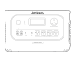
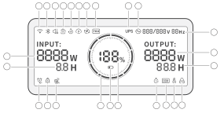
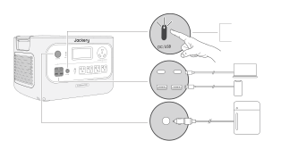
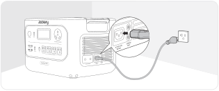
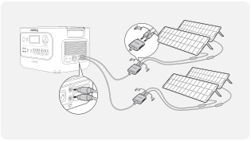

<h1 class="hb-preface-heading" id="native-preface">FR IMPORTANT</h1>

Félicitations pour votre nouveau Jackery HomePower 3000. Veuillez lire attentivement ce manuel avant d'utiliser le produit, en particulier les précautions à prendre pour garantir une utilisation correcte du produit. Conservez ce manuel dans un endroit accessible pour pouvoir vous y référer ultérieurement.

Conformément aux lois et réglementations en vigueur, le droit d'interprétation final de ce document et de tous les documents associés à ce produit appartient à l'entreprise. Bien que tous les efforts aient été déployés pour garantir l'exactitude de ce manuel, Jackery Inc. n'assume aucune responsabilité pour les erreurs qui pourraient y figurer.

Veuillez noter qu'aucune autre notification ne sera faite en cas de mise à jour, de révision ou de résiliation. Pour la dernière version des manuels du produit, consultez support.jackery.com.

* Les chiffres sont donnés à titre indicatif uniquement. Veuillez vous référer au produit réel.

## INFORMATIONS DE SÉCURITÉ IMPORTANTES

### INSTRUCTIONS CONCERNANT LES RISQUES D’INCENDIE, DE CHOC ÉLECTRIQUE OU DE BLESSURES

<table class="manual-callout-table manual-callout-table"><tbody><tr><td class="manual-callout-label">AVERTISSEMENT</td><td class="manual-callout-body">
Respectez toujours les précautions suivantes lors de l’utilisation du produit.
</td></tr></tbody></table>

<ul><li>Lisez toutes les instructions avant d’utiliser le produit.</li><li>Ne laissez pas les enfants jouer avec du produit. Une surveillance étroite est nécessaire lorsque le produit est utilisé à proximité d’enfants.</li><li>Évitez de placer les mains ou les doigts à l’intérieur du produit.</li><li>Arrêtez immédiatement d’utiliser le produit s’il a été endommagé physiquement ou modifié. Une mauvaise utilisation peut entraîner un comportement imprévisible, un incendie, une explosion ou des blessures.</li><li>Si vous constatez une surchauffe, une odeur inhabituelle, de la fumée, des fuites ou des brûlures, cessez immédiatement l’utilisation et contactez le revendeur ou notre service client.</li><li>Ne tentez jamais d’ouvrir, de réparer ou de modifier le produit. Toute altération ou réassemblage peut entraîner un choc électrique, un incendie ou des dommages à la batterie.</li><li>Soyez conscient que le liquide éjecté peut causer une irritation ou des brûlures. Une mauvaise utilisation peut provoquer des fuites. Évitez tout contact direct. En cas de contact avec les yeux, consultez immédiatement un médecin. En cas de contact avec la peau, rincez abondamment à l’eau claire et consultez un professionnel de santé sans tarder.</li><li>N’exposez pas le produit au feu ni à des températures excessives. Une température supérieure à 130°C peut entraîner une explosion.</li><li>L’utilisation de pièces non recommandées ou non fournies peut entraîner un risque d’incendie, de choc électrique ou de blessures.</li><li>Ne laissez jamais la batterie en charge sans surveillance pendant de longues périodes. Surveillez toujours la charge pour assurer une utilisation sûre.</li><li>Pour réduire le risque de choc électrique, débranchez le produit de toute source d’alimentation avant d’effectuer un entretien technique ou un dépannage.</li></ul>

### INSTRUCTIONS D’UTILISATION

#### CONSERVEZ CES INSTRUCTIONS

<ul><li>Cessez immédiatement d’utiliser le produit s’il présente des signes de dommage. Arrêtez l’utilisation et contactez l’assistance clientèle pour obtenir de l’aide.</li><li>Ne rechargez pas la batterie dans un environnement extrêmement chaud ou froid, et respectez strictement les plages de températures d’utilisation spécifiées du produit :<ul><li>Température de charge : 32°F à 113°F (0°C à 45°C)</li><li>Température de décharge : 14°F à 113°F (-10°C à 45°C)</li></ul></li><li>Pour garantir une bonne circulation de l’air, gardez les orifices de ventilation du produit dégagés. Utilisez-le dans un endroit bien aéré, frais et sec pour éviter toute surchauffe.<ul><li>La charge dans un environnement humide ou mal ventilé peut présenter des risques pour la sécurité.</li><li>L’eau peut provoquer des courts-circuits ou endommager le chargeur, entraînant des risques.</li></ul></li><li>Débranchez le cordon d’alimentation de la prise secteur pendant un orage.</li><li>Éteignez immédiatement le produit à l’aide du bouton d’alimentation s’il est tombé, a subi un choc ou des vibrations.</li><li>Assurez-vous que les appareils sont éteints avant de les connecter au produit.</li><li>Ne rechargez pas le produit avec un câble ou une fiche endommagé(e).</li><li>N’utilisez pas le produit pour charger un appareil équipé d’un câble ou d’une fiche endommagé(e).</li><li>Débranchez toujours le cordon de charge en tirant sur la fiche, jamais sur le câble, afin d’éviter tout dommage.</li><li>Veillez à ce que le produit soit correctement fixé lors du transport dans un véhicule en mouvement.</li><li>NE placez PAS l’appareil à l’envers ou sur le côté pendant l’utilisation ou le stockage.</li><li>NE placez PAS le produit sur le sol ou à une hauteur inférieure à 457 mm (18 pouces) lors de son utilisation dans un atelier ou un centre de réparation.</li><li>N’utilisez PAS les accessoires du produit avec d’autres appareils ou équipements.</li><li>Le temps de charge solaire dépend des conditions météorologiques. Placez le panneau solaire dans un endroit exposé au soleil direct autant que possible.</li></ul>

### INSTRUCTION DE MISE À LA TERRE

Ce produit doit être mis à la terre. En cas de dysfonctionnement ou de panne, la mise à la terre fournit un chemin de moindre résistance au courant électrique afin de réduire le risque de choc électrique. Ce produit est équipé d'un cordon avec un conducteur de mise à la terre et d'une fiche de mise à la terre. La fiche doit être branchée dans une prise correctement installée et mise à la terre conformément à tous les codes et règlements locaux.

<table class="manual-callout-table manual-callout-table"><tbody><tr><td class="manual-callout-label">AVERTISSEMENT</td><td class="manual-callout-body">
Une connexion incorrecte du conducteur de mise à la terre peut entraîner un risque de choc électrique. Consultez un électricien qualifié si vous avez des doutes quant à la mise à la terre correcte du produit. Ne modifiez pas la fiche fournie avec le produit – si elle ne correspond pas à la prise, faites installer une prise appropriée par un électricien qualifié.
</td></tr></tbody></table>

<table class="manual-callout-table manual-callout-table"><tbody><tr><td class="manual-callout-label">AVERTISSEMENT</td><td class="manual-callout-body">
Cet appareil est destiné à un usage intérieur uniquement (veuillez placer cet appareil dans un environnement intérieur similaire lors de son utilisation à l'extérieur, par exemple dans des VR résidentiels, des tentes, des chalets, etc.). ※ Cet appareil n'est pas étanche ni résistant à la poussière. Éloignez-le de la pluie et des environnements humides pendant son utilisation.
</td></tr></tbody></table>

### INSTRUCTIONS D’ENTRETIEN PAR L’UTILISATEUR

Au cours du cycle des produits de stockage d'énergie, une certaine dégradation de la capacité et de l'énergie se produira. À mesure que le nombre de cycles d'utilisation augmente et que la durée de stockage s'allonge, cette dégradation s'intensifiera progressivement, ce qui est un phénomène normal conforme au modèle de vieillissement naturel des cellules de batterie.

## SIGNIFICATION DES SYMBOLES

<figure aria-label="Signal words" class="hb-symbol-signal-composition" data-component-id="HB-TABLE-SYMBOL-SIGNAL"><table class="hb-symbol-signal-table"><colgroup><col class="hb-symbol-signal-col-label"/><col class="hb-symbol-signal-col-meaning"/></colgroup><thead><tr><th class="hb-symbol-signal-label-heading" scope="col">Symbole</th><th class="hb-symbol-signal-meaning-heading" scope="col">Signification</th></tr></thead><tbody><tr><td class="hb-symbol-signal-label-cell">⚠AVERTISSEMENT</td><td class="hb-symbol-signal-meaning-cell">Pratiques dangerveuses pouvant entraîner des blessures graves, la mort et/ou des dommages matériels.</td></tr><tr><td class="hb-symbol-signal-label-cell">⚠ATTENTION</td><td class="hb-symbol-signal-meaning-cell">Pratiques dangereuses pouvant entraîner des blessures corporelles et/ou des dommages matériels.</td></tr><tr><td class="hb-symbol-signal-label-cell">⚠REMARQUE</td><td class="hb-symbol-signal-meaning-cell">Pratiques dangereuses pouvant entraîner des dommages à l'équipement, une perte de données, une détérioration des performances ou des résultats inattendus.</td></tr><tr><td class="hb-symbol-signal-label-cell">⚠CONSEILS</td><td class="hb-symbol-signal-meaning-cell">Complémente les informations importantes ou les conseils d'utilisation dans le texte.</td></tr></tbody></table></figure>

<figure aria-label="Safety symbols" class="hb-symbol-pair-composition" data-component-id="HB-TABLE-SYMBOL-ICON">

<table class="hb-symbol-panel-table"><colgroup><col class="hb-symbol-col-icon"/><col class="hb-symbol-col-meaning"/></colgroup><thead><tr><th class="hb-symbol-icon-heading" scope="col">Symbole</th><th class="hb-symbol-meaning-heading" scope="col">Signification</th></tr></thead><tbody><tr><td class="hb-symbol-icon"></td><td class="hb-symbol-meaning">Mise en garde! Le non-respect des messages d'avertissement peut entraîner des blessures.</td></tr><tr><td class="hb-symbol-icon"></td><td class="hb-symbol-meaning">Lire le manuel de l'opérateur</td></tr><tr><td class="hb-symbol-icon"></td><td class="hb-symbol-meaning">Les enfants ne sont pas admis</td></tr><tr><td class="hb-symbol-icon"></td><td class="hb-symbol-meaning">Ce symbole indique que le produit contient une batterie lithium-ion (Li-ion), qui doit être éliminée ou recyclée de manière appropriée.</td></tr></tbody></table>

<table class="hb-symbol-panel-table"><colgroup><col class="hb-symbol-col-icon"/><col class="hb-symbol-col-meaning"/></colgroup><thead><tr><th class="hb-symbol-icon-heading" scope="col">Symbole</th><th class="hb-symbol-meaning-heading" scope="col">Signification</th></tr></thead><tbody><tr><td class="hb-symbol-icon"></td><td class="hb-symbol-meaning">Ne démontez pas le produit.</td></tr><tr><td class="hb-symbol-icon"></td><td class="hb-symbol-meaning">Ne pas fumer ni utiliser de flamme nue</td></tr><tr><td class="hb-symbol-icon"></td><td class="hb-symbol-meaning">Ce symbole indique que le produit ne doit pas être jeté avec les ordures ménagères. Il doit être apporté à un point de collecte désigné pour un recyclage approprié. Une élimination et un recyclage corrects contribuent à la protection de l’environnement. Pour plus d’informations, veuillez contacter votre autorité locale, le service de gestion des déchets ou le revendeur du produit.</td></tr></tbody></table>

</figure>

## FCC

<figure aria-label="FCC" class="hb-fcc-composition" data-component-id="HB-SPECIAL-FCC">

Cet appareil est conforme à la partie 15 du règlement de la FCC. Le fonctionnement dépend des deux conditions suivantes : (1) Cet appareil ne doit pas provoquer d'interférences dangereuses, et (2) Cet appareil doit accepter toute interférence reçue, y compris les interférences pouvant provoquer un fonctionnement non désiré.

<strong>REMARQUE :</strong> Cet équipement a été testé et déclaré conforme aux limites concernant les appareils numériques de classe B, conformément à la partie 15 du règlement de la FCC. Ces limites sont conçues pour offrir une protection raisonnable contre les interférences dangereuses dans le cadre d'une installation résidentielle. Cet équipement génère, utilise et émet des ondes radios qui peuvent, si cet équipement n'est pas installé et utilisé conformément aux instructions, perturber les communications radios. Toutefois, il n'y a aucune garantie qu'aucune interférence ne se produise lors d'une installation particulière.

Si cet équipement trouble la réception de la radio ou de la télévision, ce qui peut être déterminé en éteignant et en allumant cet équipement, l'utilisateur est encouragé à tenter de corriger ces interférences en essayant une ou plusieurs des mesures suivantes :
<ul class="simple"><li>
Réorientez ou déplacez l'antenne de réception.
</li><li>
Éloignez l'équipement du récepteur.
</li><li>
Connectez l'équipement à une prise d'un autre circuit que celui auquel le récepteur est connecté.
</li><li>
Consultez le revendeur ou bien demandez de l'aide à un technicien de radio/télévision expérimenté.
</li></ul>
<strong>MODIFICATION :</strong> Tout changement ou modification non expressément approuvé par le titulaire de cet appareil pourrait annuler l'autorisation de l'utilisateur à utiliser l'appareil.

</figure>

## CONTENU DE LA BOÎTE

<figure aria-label="CONTENU DE LA BOÎTE" class="hb-inbox-composition" data-card-count="3" data-component-id="HB-SPECIAL-INBOX" data-inbox-variant="responsive-card-grid"><ol class="hb-inbox-grid"><li class="hb-inbox-card" data-item-number="1">

Jackery HomePower 3000

</li><li class="hb-inbox-card" data-item-number="2">

Câble de charge CA

</li><li class="hb-inbox-card" data-item-number="3">

Documents

</li></ol>

CONSEILS

Le câble de chargement pour voiture n’est pas inclus, mais peut être acheté séparément sur notre site Web. Pour obtenir de l’aide, veuillez contacter le service à la clientèle de Jackery.

</figure>

## APERÇU DU PRODUIT

### VUE DE FACE

<figure class="hb-reference-figure hb-base-art-live-copy" data-component-id="HB-SPECIAL-REFERENCE-FIGURE" data-reference-id="overview" data-source-fragment-sha256="869887f6a79c710cc62d6b44b1630897167ed066cc6d90b32614043d3b5ab7e1" data-web-base-art-ref="overview" data-web-presentation-mode="base-art-live-copy">

<strong>Bouton</strong> <strong>d’alimentation</strong> <strong>principal</strong><strong>Port</strong> <strong>CC</strong> <strong>12</strong> <strong>V</strong> 12 V⎓10 A max.<strong>Sortie</strong> <strong>USB-C</strong> <strong>100W</strong> 100 W max., 5 V⎓3 A, 9 V⎓3 A, 12 V⎓3 A, 15 V⎓3 A, 20 V⎓5 A<strong>Sortie</strong> <strong>USB-A</strong> <strong>18W</strong> 18 W max., 5-6 V⎓3 A, 6-9 V⎓2 A, 9-12 V⎓1,5 A<strong>Bouton</strong> <strong>d’alimentation</strong> <strong>CC/USB</strong><strong>Bouton</strong> <strong>d’alimentation</strong> <strong>CA</strong><strong>LCD</strong><strong>Sortie</strong> <strong>CA</strong> 120 V 60 Hz, 30 A, 3600 W nominal<strong>Sortie</strong> <strong>CA</strong> 120 V~60 Hz, 20 A, 2400 W nominal<strong>Sortie</strong> <strong>totale</strong> <strong>CA</strong> 3600 W nominal<strong>VUE</strong> <strong>LATÉRALE</strong> <strong>DROITE</strong><strong>Bouton</strong> <strong>de</strong> <strong>réinitialisation</strong> <strong>de</strong> <strong>la</strong> <strong>sortie</strong> <strong>CA</strong><strong>Entrée</strong> <strong>CA</strong> 100 V-120 V~ 60 Hz, 15 A max.<strong>Entrée</strong> <strong>CC</strong> <strong>(2×Ports</strong> <strong>DC8020)</strong> PV: 16 V-60 V⎓12 A max., double à 24 A, 1000 W max. Oiture: 12 V-16 V⎓8 A max., double à 8 A max.

</figure>

## AFFICHAGE LCD

<figure class="hb-reference-figure hb-base-art-live-copy" data-component-id="HB-SPECIAL-REFERENCE-FIGURE" data-reference-id="lcd-map" data-source-fragment-sha256="c5bfa3541f7fa146f31aa9bcb4f2158a7f5b48771450feaa9a9ddb53bde7bc44" data-web-base-art-ref="lcd-map" data-web-presentation-mode="base-art-live-copy">

13121415161718192021252224231234568911107

</figure>

<figure aria-label="AFFICHAGE LCD" class="hb-lcd-table-composition" data-component-id="HB-TABLE-LCD-ICON" tabindex="0"><table class="hb-lcd-icon-table"><colgroup><col class="hb-lcd-col-number"/><col class="hb-lcd-col-icon"/><col class="hb-lcd-col-name"/><col class="hb-lcd-col-description"/></colgroup><tbody><tr><td class="hb-lcd-number">1</td><td class="hb-lcd-icon"></td><td class="hb-lcd-name">Wi-Fi</td><td class="hb-lcd-description"><strong>Allumé</strong> : Wi-Fi connecté. <strong>Clignotant</strong> : Prêt à se connecter au Wi-Fi. <strong>Éteint</strong> : Wi-Fi déconnecté.</td></tr><tr><td class="hb-lcd-number">2</td><td class="hb-lcd-icon"></td><td class="hb-lcd-name">Bluetooth</td><td class="hb-lcd-description"><strong>Allumé</strong> : Bluetooth connecté. <strong>Clignotant</strong> : Prêt à se connecter au Bluetooth. <strong>Éteint</strong> : Bluetooth déconnecté.</td></tr><tr><td class="hb-lcd-number">3</td><td class="hb-lcd-icon"></td><td class="hb-lcd-name">Mode de Charge Silencieuse</td><td class="hb-lcd-description"><strong>Allumé</strong> : Le bruit pendant la charge est considérablement réduit, tandis que la puissance de charge est diminuée et la vitesse de charge ralentit. <strong>Éteint</strong> : Le mode de charge silencieuse est désactivé. Activez/désactivez cette fonction dans l'application Jackery. The setting is retained when the device is powered off.</td></tr><tr><td class="hb-lcd-number">4</td><td class="hb-lcd-icon"></td><td class="hb-lcd-name">Mode d’Économie de Batterie</td><td class="hb-lcd-description"><strong>Allumé</strong> : Limite la capacité maximale utilisable de la batterie pour prolonger sa durée de vie. <strong>Éteint</strong> : Le mode d'économie de batterie est désactivé. Activez/désactivez cette fonction dans l'application Jackery. The setting is retained when the device is powered off. When this feature is enabled, the product occasionally performs a full charge and discharge cycle to calibrate the SOC.</td></tr><tr><td class="hb-lcd-number">5</td><td class="hb-lcd-icon"></td><td class="hb-lcd-name">Plan de Charge</td><td class="hb-lcd-description">Personnalisez le temps de charge du Jackery HomePower 3000. Adapté aux situations avec des tarifs d’électricité variables, il permet d’établir des plans de charge en fonction des heures pleines et creuses, afin de réduire les coûts d’électricité. Veuillez configurer cette fonction dans l’application Jackery. The setting is retained when the device is powered off.</td></tr><tr><td class="hb-lcd-number">6</td><td class="hb-lcd-icon"></td><td class="hb-lcd-name">Limite de puissance de charge</td><td class="hb-lcd-description"><strong>Allumé</strong> : La limite de puissance de charge est activée dans l'application Jackery. <strong>Éteint</strong> : La limite de puissance de charge est désactivée dans l'application Jackery. The setting is retained when the device is powered off.</td></tr><tr><td class="hb-lcd-number">7</td><td class="hb-lcd-icon"></td><td class="hb-lcd-name">Mode Autonome</td><td class="hb-lcd-description">Maximise l’utilisation de l’énergie solaire et réduit la dépendance à l’électricité du réseau en donnant la priorité à l’énergie solaire stockée, ce qui diminue les coûts d’électricité. La station d’énergie doit être connectée simultanément aux panneaux solaires et au réseau, la puissance de charge étant limitée par la puissance de dérivation. Veuillez activer/désactiver cette fonction dans l’application. The setting is retained when the device is powered off.</td></tr><tr><td class="hb-lcd-number">8</td><td class="hb-lcd-icon"></td><td class="hb-lcd-name">TOU Mode</td><td class="hb-lcd-description"><strong>On</strong>: TOU mode is enabled (default backup SOC: 60%). During peak periods, when the stored energy exceeds the backup SOC, the product prioritizes battery discharge to reduce peak electricity costs. During off-peak periods, the system charges the battery from the grid to achieve peak-shaving and valley-filling. <strong>Off</strong>: TOU mode is disabled. The device does not follow the TOU (time-of-use) strategy and operates according to the default power supply and charging logic. Enable/disable this feature in the Jackery App. The setting is retained when the device is powered off.</td></tr><tr><td class="hb-lcd-number">9</td><td class="hb-lcd-icon"></td><td class="hb-lcd-name">Alimentation sans interruption (ASI)</td><td class="hb-lcd-description"><strong>Allumé</strong> : Le produit est en mode bypass, durant lequel le temps de commutation de l'alimentation électrique du réseau à la batterie est de 10 ms. <strong>Éteint</strong> : Le produit n'est pas en mode bypass.</td></tr><tr><td class="hb-lcd-number">10</td><td class="hb-lcd-icon"></td><td class="hb-lcd-name">Indicateur d'alimentation CA</td><td class="hb-lcd-description">La sortie CA (onde sinusoïdale pure) est activée.</td></tr><tr><td class="hb-lcd-number">11</td><td class="hb-lcd-icon"></td><td class="hb-lcd-name">Puissance d’Entrée</td><td class="hb-lcd-description">Affiche la puissance d'entrée en watts.</td></tr><tr><td class="hb-lcd-number">12</td><td class="hb-lcd-icon"></td><td class="hb-lcd-name">Temps de Charge Restant</td><td class="hb-lcd-description">Affiche le temps de charge restant.</td></tr><tr><td class="hb-lcd-number">13</td><td class="hb-lcd-icon"></td><td class="hb-lcd-name">Indicateur de Charge sur Prise Murale CA</td><td class="hb-lcd-description">Le produit est chargé via l'entrée CA en utilisant l'énergie du réseau.</td></tr><tr><td class="hb-lcd-number">14</td><td class="hb-lcd-icon"></td><td class="hb-lcd-name">Indicateur de Charge Voiture</td><td class="hb-lcd-description">Le produit est chargé via l’entrée CC (DC8020) en utilisant du CC 12V (charge via voiture).</td></tr><tr><td class="hb-lcd-number">15</td><td class="hb-lcd-icon"></td><td class="hb-lcd-name">Indicateur de Charge Solaire</td><td class="hb-lcd-description">Le produit est chargé via l’entrée CC (DC8020) à l’aide de panneaux solaires.</td></tr><tr><td class="hb-lcd-number">16</td><td class="hb-lcd-icon"></td><td class="hb-lcd-name">Indicateur de Puissance de la Batterie</td><td class="hb-lcd-description">Lorsque le produit est en charge, le cercle orange autour du pourcentage de batterie s’allume en séquence. Lorsqu’il charge d’autres appareils, le cercle orange reste allumé.</td></tr><tr><td class="hb-lcd-number">17</td><td class="hb-lcd-icon"></td><td class="hb-lcd-name">Indicateur de Batterie Faible</td><td class="hb-lcd-description"><strong>Allumé</strong> : Le niveau de la batterie est inférieur à 20 %. <strong>Clignotant</strong> : Le niveau de la batterie est inférieur à 5 %. <strong>Éteint</strong> : Le niveau de la batterie n'est pas inférieur à 20 % ou le produit est en charge.</td></tr><tr><td class="hb-lcd-number">18</td><td class="hb-lcd-icon"></td><td class="hb-lcd-name">Pourcentage de Batterie Restant</td><td class="hb-lcd-description">Affiche le pourcentage de batterie restant.</td></tr><tr><td class="hb-lcd-number">19</td><td class="hb-lcd-icon"></td><td class="hb-lcd-name">Discharge Timer</td><td class="hb-lcd-description"><strong>On</strong>: A discharge timer is set. <strong>Off</strong>: No discharge timer is set. Activez/désactivez cette fonction dans l'application Jackery. The setting is not retained when the device is powered off.</td></tr><tr><td class="hb-lcd-number">20</td><td class="hb-lcd-icon"></td><td class="hb-lcd-name">Mode d’Économie d’Énergie</td><td class="hb-lcd-description"><strong>Allumé</strong> : Mode d'économie d'énergie activé. <strong>Éteint</strong> : Mode d'économie d'énergie désactivé.</td></tr><tr><td class="hb-lcd-number">21</td><td class="hb-lcd-icon"></td><td class="hb-lcd-name">Indicateur de Température Élevée</td><td class="hb-lcd-description">La protection contre les températures élevées est déclenchée. Le produit peut cesser de fonctionner jusqu'à ce que sa température revienne dans la plage de fonctionnement normale.</td></tr><tr><td class="hb-lcd-number">21</td><td class="hb-lcd-icon"></td><td class="hb-lcd-name">Indicateur de Basse Température</td><td class="hb-lcd-description">La protection contre les basses températures est déclenchée. Le produit peut cesser de fonctionner jusqu'à ce que sa température revienne dans la plage de fonctionnement normale.</td></tr><tr><td class="hb-lcd-number">22</td><td class="hb-lcd-icon"></td><td class="hb-lcd-name">Code d’erreur</td><td class="hb-lcd-description">Une erreur produit s’est produite. Veuillez consulter la section « Dépannage » pour plus de détails.</td></tr><tr><td class="hb-lcd-number">23</td><td class="hb-lcd-icon"></td><td class="hb-lcd-name">Tension et fréquence de sortie</td><td class="hb-lcd-description">Affiche la tension et la fréquence de sortie lorsque la sortie CA est activée.</td></tr><tr><td class="hb-lcd-number">24</td><td class="hb-lcd-icon"></td><td class="hb-lcd-name">Puissance de Sortie</td><td class="hb-lcd-description">Affiche la puissance de sortie en watts.</td></tr><tr><td class="hb-lcd-number">25</td><td class="hb-lcd-icon"></td><td class="hb-lcd-name">Temps de Décharge Restant</td><td class="hb-lcd-description">Affiche le temps de décharge restant.</td></tr></tbody></table></figure>

## FONCTIONNEMENT

### MARCHE/ARRÊT

<figure class="hb-reference-figure hb-base-art-live-copy" data-component-id="HB-SPECIAL-REFERENCE-FIGURE" data-reference-id="power" data-source-fragment-sha256="32d64d3b0d2066463b1698b5ef16b4b8d603044028bbc30b55e7cf5cbf310315" data-web-base-art-ref="power" data-web-presentation-mode="base-art-live-copy">

<strong>Marche</strong> Appuyez une fois<strong>Arrêt</strong> Appuyez et maintenez pendant 3 secondes3s<strong>Temps</strong> <strong>de</strong> <strong>veille</strong> <strong>par</strong> <strong>défaut</strong> <strong>:</strong> 2 heures Le produit s’éteindra automatiquement après 2 heures d’inactivité, sans charge ni décharge. *Le temps de veille peut être réglé dans l'application Jackery.Lorsque le mode Économie d'énergie est activé, le produit s'éteindra automatiquement après 12 heures si le bouton d'alimentation CA ou CC/USB est <strong>allumé</strong> mais que le produit ne charge ni ne décharge.

</figure>

### SORTIE CA MARCHE/ARRÊT

<figure class="hb-reference-figure hb-base-art-live-copy" data-component-id="HB-SPECIAL-REFERENCE-FIGURE" data-reference-id="ac-output" data-source-fragment-sha256="4244bf9c4fee5448d8296ece2c0e9eefc2a3fbab60d77a3c858e1be9adac8a7a" data-web-base-art-ref="ac-output" data-web-presentation-mode="base-art-live-copy">

<strong>Prérequis</strong> <strong>:</strong> Le produit est allumé.<strong>Marche</strong> Appuyez une fois<strong>Arrêt</strong> Appuyez une fois<strong>Bouton</strong> <strong>de</strong> <strong>réinitialisation</strong> <strong>de</strong> <strong>la</strong> <strong>sortie</strong> <strong>CA</strong> <strong>:</strong> Lorsque le bouton de réinitialisation sort, vous devez retirer la charge et appuyer sur le bouton de réinitialisation pour réinitialiser.

</figure>

### SORTIE CC/USB MARCHE/ARRÊT

<figure class="hb-reference-figure hb-base-art-live-copy" data-component-id="HB-SPECIAL-REFERENCE-FIGURE" data-reference-id="dc-output" data-source-fragment-sha256="703d27c449291f2e3c06d1a7acb0577130eb7221301191d80012cef2881b56a5" data-web-base-art-ref="dc-output" data-web-presentation-mode="base-art-live-copy">

<strong>Prérequis</strong> <strong>:</strong> Le produit est allumé.<strong>Marche</strong> Appuyez une fois<strong>Arrêt</strong> Appuyez une fois

</figure>
<table class="manual-callout-table manual-callout-table"><tbody><tr><td class="manual-callout-label">ATTENTION</td><td class="manual-callout-body"><ul><li>Les ports USB-C de 100 W sont des ports de sortie haute puissance de type Source d’alimentation 3 (PS3) selon USB-PD. Si l'appareil utilisateur ou l'accessoire connecté ne répond pas aux exigences de sécurité, il peut présenter un risque d'incendie. Avant d'utiliser ces ports, assurez-vous que l'appareil ou l'accessoire connecté dispose d'une protection contre les incendies.</li><li>Ne connectez le Jackery HomePower 3000 qu'à des appareils ou accessoires conformes aux clauses 6.3, 6.4 et 6.5 de la norme IEC/EN/UL 62368-1 (ou autres normes équivalentes).</li><li>Pour obtenir la puissance de sortie maximale, utilisez le câble USB-C vers USB-C 5A (20 V CC/5A, 100 W).</li></ul></td></tr></tbody></table>
Le produit peut charger la batterie de votre voiture à l'aide du câble de charge de batterie automobile Jackery 12V, vendu séparément et disponible sur notre site web.
<table class="manual-callout-table manual-callout-table"><tbody><tr><td class="manual-callout-label">ATTENTION</td><td class="manual-callout-body"><ul><li>Le port CC 12V est uniquement compatible avec les batteries de voiture 12V et ne convient pas aux systèmes 24V.</li><li>Ne démarrez pas la voiture pendant que le produit charge la batterie via le port de sortie CC 12V, car cela pourrait endommager le produit.</li><li>Cette fonctionnalité est destinée à un usage d'urgence uniquement et ne peut pas charger une batterie de voiture morte ou endommagée.</li></ul></td></tr></tbody></table>

### FONCTION DE REPRISE DE SORTIE CA ET CC

Cette fonction mémorise l’état de la sortie et reprend automatiquement les sorties CA et CC sous certaines conditions définies.

<table class="manual-table"><tbody><tr><th>Conditions de reprise automatique</th><th>Conditions sans reprise automatique</th></tr><tr><td>Mise sous tension/redémarrage après arrêt ou redémarrage</td><td>Sortie désactivée manuellement (bouton/App)</td></tr><tr><td>SOC de la batterie ≥ limite de décharge</td><td>Sortie désactivée en mode économie d’énergie</td></tr><tr><td>+10% après avoir atteint la limite</td><td>Sortie désactivée suite à un déclenchement de protection</td></tr><tr><td>Mise à niveau OTA terminée</td><td>Sortie désactivée par le minuteur de décharge</td></tr></tbody></table>

### MODE D’ÉCONOMIE D’ÉNERGIE

Pour éviter une consommation inutile de la batterie due à l’oubli de désactiver la sortie, le produit active par défaut le Mode d’Économie d’Énergie. Lorsque la sortie CA ou CC/USB est activée, l'icône du mode Économie d'énergie s'affichera sur l'écran LCD. Si aucun appareil n’est connecté ou si la consommation de l’appareil connecté est inférieure à un certain seuil (Sortie CA de 25 W ou sortie CC/USB de 2 W) pendant 12 heures, l’appareil désactivera automatiquement toutes les sorties. Veuillez configurer la durée du mode Économie d'énergie dans l'application Jackery.Pour désactiver le mode d'économie d'énergie, appuyez et maintenez enfoncé à la fois le bouton d'alimentation CA et le bouton d'alimentation principal pendant plus de 3 secondes. Le produit n'éteindra pas automatiquement la sortie CA ou CC/USB.

<figure class="hb-reference-figure hb-base-art-live-copy" data-component-id="HB-SPECIAL-REFERENCE-FIGURE" data-reference-id="energy" data-source-fragment-sha256="950e88835cda17b560b52c1013d1692fd74a23829a9946352dde26bd5bbe258e" data-web-base-art-ref="energy" data-web-presentation-mode="base-art-live-copy">

Main Power ButtonAC Power Button<strong>Marche/Arrêt</strong> Appuyez et maintenez pendant 3 secondes3s

</figure>

<table class="manual-callout-table manual-callout-table"><tbody><tr><td class="manual-callout-label">REMARQUE</td><td class="manual-callout-body">
Le mode d'économie d'énergie reprend l'état précédent après l'allumage. Un changement de mode nécessite un commutateur manuel.
</td></tr></tbody></table>

### AFFICHAGE LCD

<figure aria-label="LCD screen modes" class="hb-lcd-mode-composition" data-component-id="HB-TABLE-LCD-MODE">

<table class="hb-lcd-mode-table"><colgroup><col class="hb-lcd-mode-col-state"/><col class="hb-lcd-mode-col-action"/><col class="hb-lcd-mode-col-copy"/></colgroup><tbody><tr><td class="hb-lcd-mode-state" rowspan="3">Allumer en discontinu</td><td class="hb-lcd-mode-action">Allumer</td><td class="hb-lcd-mode-copy">Appuyez sur le bouton d'alimentation principal ou lorsque le produit est en charge.</td></tr><tr><td class="hb-lcd-mode-action">Éteindre</td><td class="hb-lcd-mode-copy">Appuyez sur le bouton d'alimentation principal.</td></tr><tr><td class="hb-lcd-mode-action"><strong>Arrêt</strong> automatique</td><td class="hb-lcd-mode-copy">L'écran LCD s'éteint automatiquement et entre en mode veille après 2 minutes d'inactivité.</td></tr><tr><td class="hb-lcd-mode-state" rowspan="3">Allumer en continu (en cours de charge ou de décharge)</td><td class="hb-lcd-mode-action">Allumer</td><td class="hb-lcd-mode-copy">Appuyez deux fois sur le bouton d'alimentation principal lorsque le produit est allumé.</td></tr><tr><td class="hb-lcd-mode-action">Éteindre</td><td class="hb-lcd-mode-copy">Appuyez sur le bouton d'alimentation principal.</td></tr><tr><td class="hb-lcd-mode-action"><strong>Arrêt</strong> automatique</td><td class="hb-lcd-mode-copy">L'écran LCD s'éteint automatiquement après 2 heures d'inactivité.</td></tr></tbody></table>
</figure>
Vous pouvez également définir le mode d'affichage de l'écran dans l'application Jackery.

### FONCTIONNEMENT DES BOUTONS

<table class="manual-table"><tbody><tr><th>Boutons</th><th>Utilisation</th><th>Fonction</th></tr><tr><td>Bouton d'alimentation principal Bouton d'alimentation CA</td><td>Appuyer 3 secondes sur les deux</td><td>Activer/désactiver le mode économie d'énergie</td></tr><tr><td>Bouton d'alimentation CC/USB Bouton d'alimentation principal</td><td>Appuyer 3 secondes sur les deux</td><td>Réinitialiser le Wi-Fi et le Bluetooth</td></tr><tr><td>Bouton d'alimentation CA Bouton d'alimentation CC/USB</td><td>Appuyer 1 seconde sur les deux</td><td>Activer/désactiver le Wi-Fi et le Bluetooth</td></tr></tbody></table>

## ALIMENTATION SANS INTERRUPTION (ASI)

Connectez le produit à une prise murale à l’aide du câble de charge CA, puis appuyez sur le bouton d'alimentation CA pour alimenter vos appareils en même temps. Une alimentation sans interruption (ASI) est un système d’alimentation continue qui fournit automatiquement une alimentation électrique de secours à une charge lorsque l’alimentation du réseau principal est interrompue. En cas de perte soudaine de l’alimentation du réseau, le Jackery HomePower 3000 basculera automatiquement sur l’alimentation stockée en moins de 10 ms pour maintenir vos appareils en fonctionnement. En mode UPS, le courant de sortie maximal de l’unité atteint 15 A et peut être maintenu pendant un maximum de trois heures. Après trois heures, le courant de sortie diminue à 12 A. Toute interruption du mode UPS réinitialise la période de trois heures. Comme la charge et la décharge simultanées sont activées en mode dérivation, la puissance de sortie réelle est inférieure à la puissance nominale en mode dérivation, mais revient à la puissance nominale lors des coupures.

<figure class="hb-reference-figure" data-component-id="HB-SPECIAL-REFERENCE-FIGURE" data-reference-id="ups" data-source-fragment-sha256="917a13a61668837de02bff0a1ffed5a545327ecb152e69984a7dc74367217f2a">

</figure>

<table class="manual-callout-table manual-callout-table"><tbody><tr><td class="manual-callout-label">ATTENTION</td><td class="manual-callout-body"><ul><li>Ce produit ne prend pas en charge un basculement instantané (0 ms). Ne le connectez pas à des équipements nécessitant une alimentation sans interruption, tels que des serveurs de données ou des stations de travail.</li><li>Avant toute utilisation, testez plusieurs fois la compatibilité avec votre appareil.</li><li>Ne connectez pas de charges dépassant la puissance de sortie maximale du produit. Sinon, la protection contre les surcharges sera déclenchée.</li></ul></td></tr></tbody></table>

## CHARGE

L'énergie verte d'abord : nous préconisons l'utilisation de l'énergie verte en premier. Ce produit prend en charge deux modes de recharge simultanés : la recharge solaire et la recharge par prise murale CA. Quand la recharge par prise murale CA et la recharge solaire sont effectuées en même temps, le produit privilégie la recharge solaire. Les deux méthodes sont utilisées pour charger la batterie à la puissance maximalement autorisée.

Chargez complètement le produit avant sa première utilisation.

<table class="manual-callout-table manual-callout-table"><tbody><tr><td class="manual-callout-label">Remarque</td><td class="manual-callout-body"><ul><li>La température de charge recommandée pour le produit est comprise entre 32°F et 113°F (0°C à 45°C), et la température de décharge est comprise entre 14°F et 113°F (-10°C à 45°C). Utiliser le produit en dehors de cette plage de températures peut limiter ses capacités de charge et de décharge, voire empêcher la charge ou la décharge.</li><li>La puissance de charge et la capacité de la batterie du produit peuvent varier en raison des fluctuations de température.</li></ul></td></tr></tbody></table>

### CHARGEMENT PAR PRISE MURALE CA

Connectez le câble de charge CA au port d’entrée CA de l’appareil et à une prise murale.

<figure class="hb-reference-figure" data-component-id="HB-SPECIAL-REFERENCE-FIGURE" data-reference-id="ac-charge" data-source-fragment-sha256="dc12d2ad7d2e89abe14ae5da0500b1256c2c29174f18d2cbffcd081f29ea99c6">

</figure>

<table class="manual-callout-table manual-callout-table"><tbody><tr><td class="manual-callout-label">ATTENTION</td><td class="manual-callout-body">
Assurez-vous que le câble de charge CA est entièrement et solidement inséré dans le port d’entrée CA. Une connexion incomplète peut entraîner un courant instable, une surchauffe, un mauvais contact ou un dysfonctionnement de l’appareil.
</td></tr></tbody></table>

### CHARGEMENT PAR PANNEAUX SOLAIRES (VENDU SÉPARÉMENT)

Le Jackery HomePower 3000 dispose de deux ports d’entrée DC8020 et est compatible avec les panneaux solaires de la Jackery. Si un seul port d’entrée DC8020 doit être connecté à deux panneaux solaires simultanément, veuillez vous référer au schéma ci-dessous pour le branchement via le connecteur de panneau solaire (vendu séparément, non inclus en standard).

<figure class="hb-reference-figure hb-base-art-live-copy" data-component-id="HB-SPECIAL-REFERENCE-FIGURE" data-reference-id="solar" data-source-fragment-sha256="8b99c39fd9bfa8c9eea85d17277d786b039ac443480efa18cb4fa57fabc1bb25" data-web-base-art-ref="solar" data-web-presentation-mode="base-art-live-copy">

SolarSaga 200 ×4

</figure>

<table class="manual-callout-table manual-callout-table"><tbody><tr><td class="manual-callout-label">ATTENTION</td><td class="manual-callout-body">
Un port d’entrée DC8020 peut être connecté à un maximum de deux panneaux solaires.
</td></tr></tbody></table>

<table class="manual-callout-table manual-callout-table"><tbody><tr><td class="manual-callout-label">ATTENTION</td><td class="manual-callout-body">
Assurez-vous que la tension d’entrée pour les deux ports d’entrée CC est la même. Sinon, le produit pourrait être endommagé. Par exemple:
<ul><li>Utiliser le même modèle de panneaux solaires Jackery et le même nombre de panneaux lors de la connexion des panneaux solaires aux deux ports d’entrée DC8020.</li><li>Ne chargez pas le produit à la fois avec un chargeur de voiture et un panneau solaire simultanément. Cela pourrait faire sauter le fusible de la voiture ou entraîner un échec de la charge.</li></ul></td></tr></tbody></table>

Il est recommandé d’utiliser le panneau solaire Jackery pour charger le Jackery HomePower 3000. Assurez-vous que la tension en circuit ouvert (Voc) du panneau solaire se situe dans la plage de tension d’entrée CC du Jackery HomePower 3000 (16V–60V). Jackery décline toute responsabilité en cas de pertes causées par l’utilisation de panneaux solaires d’autres marques.

### CHARGEMENT PAR PRISE DE VOITURE (VENDU SÉPARÉMENT)

Ce produit peut être chargé à l’aide d’un chargeur de voiture 12 V. Assurez-vous que le chargeur allume-cigare et l’allume-cigare de la voiture sont bien branchés.

<figure class="hb-reference-figure hb-base-art-live-copy" data-component-id="HB-SPECIAL-REFERENCE-FIGURE" data-reference-id="car" data-source-fragment-sha256="f547f3b8ba7593ab6f62050ad7873c24af94ab87e9b8f4493724b5c60ea4d5f7" data-web-base-art-ref="car" data-web-presentation-mode="base-art-live-copy">

Véhicule※Le câble de chargement de voiture est vendu séparément.

</figure>

<table class="manual-callout-table manual-callout-table"><tbody><tr><td class="manual-callout-label">ATTENTION</td><td class="manual-callout-body"><ul><li>Veuillez démarrer le véhicule avant de charger votre station d’alimentation.</li><li>Si le véhicule roule sur des routes accidentées, il est interdit d’utiliser le chargeur de voiture afin d’éviter tout risque de surchauffe dû à une mauvaise connexion. La société ne sera pas responsable des pertes causées par une utilisation non conforme.</li><li>La charge par véhicule est uniquement applicable aux véhicules en 12 V CC, pas en 24 V CC. Veuillez ne pas charger ce produit dans un véhicule 24 V afin d’éviter tout risque de blessure ou de dommage matériel.</li></ul></td></tr></tbody></table>

## STOCKAGE

Conservez le produit dans un endroit propre et sec avec une ventilation adéquate. Température et humidité de stockage :

<ul><li>1 mois : -4°F à 113°F / -20°C à 45°C (0-60% HR)</li><li>3 mois : 32°F à 113°F / 0°C à 45°C (0-60% HR)</li><li>12 mois : 32°F à 77°F / 0°C à 25°C (0-60% HR)</li></ul>

Si ce produit est stocké pendant une longue période (3 à 6 mois) avec la batterie déchargée, il peut devenir impossible de le recharger. Pour éviter cela et préserver la santé de la batterie, il est recommandé de vérifier et de recharger le produit tous les trois mois, et d'effectuer un cycle de charge et de décharge complet au moins une fois tous les 6 à 12 mois.

## DÉPANNAGE

Si l'un des codes d'erreur suivants apparaît, suivez les actions correctives indiquées pour résoudre le problème. Si l'erreur persiste, veuillez contacter le service à la clientèle de Jackery.

<figure aria-label="Code d'erreur / Mesures correctives" class="hb-troubleshooting-composition" data-component-id="HB-TABLE-TROUBLESHOOTING" tabindex="0"><table class="hb-troubleshooting-table"><colgroup><col class="hb-troubleshooting-col-code"/><col class="hb-troubleshooting-col-measures"/></colgroup><thead><tr><th class="hb-troubleshooting-code" scope="col">Code d'erreur</th><th class="hb-troubleshooting-measures" scope="col">Mesures correctives</th></tr></thead><tbody><tr><td class="hb-troubleshooting-code">F0 / F1 / F2 / F3</td><td class="hb-troubleshooting-measures">Redémarrez le produit.</td></tr><tr><td class="hb-troubleshooting-code">F4</td><td class="hb-troubleshooting-measures">Connectez le produit à des charges pour décharger sa batterie jusqu'à ce que l'erreur disparaisse.</td></tr><tr><td class="hb-troubleshooting-code">F5</td><td class="hb-troubleshooting-measures">Chargez le produit via des panneaux solaires ou une prise murale CA jusqu'à ce que l'erreur disparaisse.</td></tr><tr><td class="hb-troubleshooting-code">F6</td><td class="hb-troubleshooting-measures"><ol><li>Attendez que le réseau se normalise avant de charger le produit via une prise murale CA.</li><li>Vérifiez si les entrées et sorties d'air sont obstruées; assurez un espace de 0,66 pied (20 cm) de chaque côté du produit.</li><li>Placez le produit dans un endroit qui n'est pas exposé à la lumière directe du soleil ou à des températures ambiantes élevées.</li><li>Déconnectez toutes les charges du produit. Laissez le produit inactif et attendez que l'erreur disparaisse.</li><li>Redémarrez le produit.</li></ol></td></tr><tr><td class="hb-troubleshooting-code">F7</td><td class="hb-troubleshooting-measures"><ol><li>Retirez toutes les entrées CC du produit.</li><li>Vérifiez la tension en circuit ouvert (Voc) des panneaux solaires connectés. Le produit autorise une tension d'entrée CC maximale de 60V.</li><li>Redémarrez le produit et laissez-le inactif. Attendez que l'erreur disparaisse.</li></ol></td></tr><tr><td class="hb-troubleshooting-code">F8</td><td class="hb-troubleshooting-measures">Contacter le service à la clientèle de Jackery.</td></tr><tr><td class="hb-troubleshooting-code">F9</td><td class="hb-troubleshooting-measures">Retirez la charge connectée aux ports USB du produit. Attendez que l'erreur disparaisse.</td></tr><tr><td class="hb-troubleshooting-code">FE</td><td class="hb-troubleshooting-measures">Contacter le service à la clientèle de Jackery.</td></tr></tbody></table></figure>

## SPÉCIFICATIONS

<h2 class="hb-spec-group">INFORMATIONS GÉNÉRALES</h2>

<figure aria-label="INFORMATIONS GÉNÉRALES" class="hb-spec-table-composition"><table class="manual-table manual-spec-table hb-spec-table"><colgroup><col class="hb-spec-col-label"/><col class="hb-spec-col-value"/></colgroup><tbody><tr><th class="manual-spec-label hb-spec-label" scope="row">Nom du produit</th><td class="manual-spec-value hb-spec-value">Jackery HomePower 3000</td></tr><tr><th class="manual-spec-label hb-spec-label" scope="row">N° modèle</th><td class="manual-spec-value hb-spec-value">JHP-3000D</td></tr><tr><th class="manual-spec-label hb-spec-label" scope="row">Capacité</th><td class="manual-spec-value hb-spec-value">3072 Wh (60 Ah/51,2 V DC)</td></tr><tr><th class="manual-spec-label hb-spec-label" scope="row">Cellule Chimique</th><td class="manual-spec-value hb-spec-value">LiFePO4</td></tr><tr><th class="manual-spec-label hb-spec-label" scope="row">Poids</th><td class="manual-spec-value hb-spec-value">Environ 59,5 lbs / 27 kg</td></tr><tr><th class="manual-spec-label hb-spec-label" scope="row">Dimensions</th><td class="manual-spec-value hb-spec-value">17,1 × 12,8 × 11,1 in / 43,5 × 32,6 × 28,1 cm</td></tr><tr><th class="manual-spec-label hb-spec-label" scope="row">Durée de vie</th><td class="manual-spec-value hb-spec-value">Capacité de 4000 cycles à 70 % ou plus</td></tr></tbody></table></figure>

<h2 class="hb-spec-group">PORTS D’ENTRÉE</h2>

<figure aria-label="PORTS D’ENTRÉE" class="hb-spec-table-composition"><table class="manual-table manual-spec-table hb-spec-table"><colgroup><col class="hb-spec-col-label"/><col class="hb-spec-col-value"/></colgroup><tbody><tr><th class="manual-spec-label hb-spec-label" scope="row">1 × Entrée CA</th><td class="manual-spec-value hb-spec-value">100-120 V~60 Hz, 15 A max. Mode dérivation① : 100-120 V~60 Hz, 15 A max. (réduit à 12 A après 3 h)</td></tr><tr><th class="manual-spec-label hb-spec-label" scope="row">2 × Ports DC8020</th><td class="manual-spec-value hb-spec-value">12-16 V⎓8 A max., double à 8 A max. 16-60 V⎓12 A max., double à 24 A, 1000 W max.</td></tr></tbody></table></figure>

<h2 class="hb-spec-group">PORTS DE SORTIE</h2>

<figure aria-label="PORTS DE SORTIE" class="hb-spec-table-composition"><table class="manual-table manual-spec-table hb-spec-table"><colgroup><col class="hb-spec-col-label"/><col class="hb-spec-col-value"/></colgroup><tbody><tr><th class="manual-spec-label hb-spec-label" scope="row">4 × Sortie CA</th><td class="manual-spec-value hb-spec-value">120V ~, 60Hz, 20A, 2400W Rated</td></tr><tr><th class="manual-spec-label hb-spec-label" scope="row">1 × Sortie CA (NEMA TT-30R)</th><td class="manual-spec-value hb-spec-value">120V ~, 60Hz, 30A, 3600W Rated</td></tr><tr><th class="manual-spec-label hb-spec-label" scope="row">Sortie totale CA②</th><td class="manual-spec-value hb-spec-value">3600 W nominal, 7200 W crête</td></tr><tr><th class="manual-spec-label hb-spec-label" scope="row">Sortie CA en mode dérivation①</th><td class="manual-spec-value hb-spec-value">100-120 V~60 Hz, 15 A max. (réduit à 12 A après 3 h)</td></tr><tr><th class="manual-spec-label hb-spec-label" scope="row">2 × Sortie</th><td class="manual-spec-value hb-spec-value">100 W max., 5 V⎓3 A, 9 V⎓3 A, 12 V⎓3 A, 15 V⎓3 A, 20 V⎓5 A</td></tr><tr><th class="manual-spec-label hb-spec-label" scope="row">2 × Sortie</th><td class="manual-spec-value hb-spec-value">18 W max., 5-6 V⎓3 A, 6-9 V⎓2 A, 9-12 V⎓1,5 A</td></tr><tr><th class="manual-spec-label hb-spec-label" scope="row">1 × Port CC 12V</th><td class="manual-spec-value hb-spec-value">12V⎓10A max.</td></tr></tbody></table></figure>

<h2 class="hb-spec-group">TEMPÉRATURE DE FONCTIONNEMENT</h2>

<figure aria-label="TEMPÉRATURE DE FONCTIONNEMENT" class="hb-spec-table-composition"><table class="manual-table manual-spec-table hb-spec-table"><colgroup><col class="hb-spec-col-label"/><col class="hb-spec-col-value"/></colgroup><tbody><tr><th class="manual-spec-label hb-spec-label" scope="row">Température de charg</th><td class="manual-spec-value hb-spec-value">32 °F à 113 °F / 0 °C à 45 °C</td></tr><tr><th class="manual-spec-label hb-spec-label" scope="row">Température de décharge</th><td class="manual-spec-value hb-spec-value">14 °F à 113 °F / - 10 °C à 45 °C</td></tr></tbody></table></figure>

① Le produit peut charger la batterie à partir d'une prise murale CA tout en fournissant de l'énergie via les ports de sortie CA.

② Indique que deux ports de sortie CA ou plus fonctionnent ensemble.

※ USB Type-C® et USB - C® sont des marques déposées de USB Implementers Forum.

## GARANTIE

<figure aria-label="GARANTIE" class="hb-warranty-intro-composition" data-component-id="HB-WARRANTY-LEAD">
<strong>Nous ne fournissons notre garantie qu'aux clients qui achètent sur le site officiel de Jackery, sur des plateformes tierces portant la marque Jackery, ou auprès de revendeurs autorisés locaux.</strong>

*La durée et les détails de la garantie peuvent varier en fonction des lois, réglementations et revendeurs autorisés locaux.
</figure>

### Garantie limitée

<figure aria-label="Garantie limitée" class="hb-warranty-card" data-component-id="HB-WARRANTY-SECTION" data-warranty-card-index="1">Jackery Inc. garantit à l'acheteur et consommateur d'origine que le produit de Jackery sera exempt de tout défaut de fabrication et de matériaux dans le cadre d'une utilisation normale pendant toute la durée de la période de garantie applicable identifiée dans la section « Période de garantie » ci-dessous, sous réserve des exceptions énoncées ci-dessous. Cette déclaration de garantie énonce les obligations totales et exclusives de garantie de Jackery. Nous n'assumerons pas et nous n'autorisons personne à assumer pour nous toute autre responsabilité en lien avec la vente de nos produits.</figure>

### Période de garantie

<figure aria-label="Période de garantie" class="hb-warranty-period-card" data-component-id="HB-WARRANTY-YEARS">

3
<strong class="hb-warranty-years-unit">ANS</strong><strong class="hb-warranty-period-label">Garantie standard</strong>

La période de garantie standard du Jackery HomePower 3000 est de 36 mois. Dans tous les cas, la période de garantie commence à compter de la date d'achat par l'acheteur et consommateur d'origine. La facture du premier achat du consommateur ou toute autre preuve documentaire raisonnable est nécessaire afin d'établir la date de début de la période de garantie.

2
<strong class="hb-warranty-years-unit">ANS</strong><strong class="hb-warranty-period-label">Garantie prolongée</strong>

Pour activer l'extension de garantie, vous devez enregistrer votre produit en ligne ou bien contacter notre service client à hello@jackery.com afin de prolonger la durée de la garantie standard.

</figure>

### Réparation ou remplacement

<figure aria-label="Réparation ou remplacement" class="hb-warranty-card" data-component-id="HB-WARRANTY-SECTION" data-warranty-card-index="3">Jackery réparera ou remplacera (aux frais de Jackery) tout produit Jackery qui cesse de fonctionner pendant la période de garantie applicable en raison d'un défaut de fabrication ou de matériau. Le produit réparé ou remplacé bénéficie de la garantie restante de la date d'achat d'origine.</figure>

### Limitée à l'acheteur et consommateur d'origine

<figure aria-label="Limitée à l'acheteur et consommateur d'origine" class="hb-warranty-card" data-component-id="HB-WARRANTY-SECTION" data-warranty-card-index="4">La garantie d'un produit Jackery est limitée à l'acheteur et consommateur d'origine, elle ne peut pas être transférée à un autre propriétaire.</figure>

### Exclusions

<figure aria-label="Exclusions" class="hb-warranty-card" data-component-id="HB-WARRANTY-SECTION" data-warranty-card-index="5">La garantie de Jackery ne s'applique pas à :<ul><li>Une utilisation incorrecte, abusée, modifiée, aux dégâts provoqués par un accident ou toute autre utilisation qui n'est pas une utilisation normale de ce produit et autorisée par la documentation actuelle du produit de Jackery.</li><li>À une réparation tentée par quelqu'un d'autre qu'un établissement agréé.</li><li>Tout autre produit acheté par l'intermédiaire d'une vente aux enchères en ligne.</li><li>La garantie de Jackery ne s'applique pas aux cellules de la batterie, sauf si vous avez entièrement chargé les cellules de la batterie dans les sept jours suivant l'achat du produit et au moins une fois tous les 6 mois par la suite.</li></ul></figure>

### Droits d'interprétation

<figure aria-label="Droits d'interprétation" class="hb-warranty-card" data-component-id="HB-WARRANTY-SECTION" data-warranty-card-index="6">Jackery Inc. se réserve le droit d'interpréter de manière définitive la politique après-vente des clients ci-dessus.</figure>

## CONFIGURATION DE L’APPLICATION

### 1. Télécharger l’application et se connecter

<figure aria-label="App download" class="hb-app-download-composition" data-component-id="HB-SPECIAL-APP">

Recherchez « Jackery » dans Google Play ou dans l’App Store pour installer l’application. Une fois que c’est fait, vous pouvez vous inscrire et vous connecter.

Vous pouvez également scanner le code QR ci-dessous pour télécharger et installer l'application.

</figure>

### 2. Ajouter un appareil

2.1 Cliquez sur le bouton + pour ajouter un appareil.

2.2 Maintenez enfoncé le bouton d'alimentation principal sur l’appareil pour l’allumer. Les icônes Wi-Fi et Bluetooth clignotent sur l’appareil afin d’indiquer qu’il est entré dans le mode Configuration réseau. Cliquez sur le bouton «icône qui clignotante» et autorisez l’application à se connecter aux appareils alentour, puis ouvrez les autorisations Bluetooth.

<figure class="hb-reference-figure" data-component-id="HB-SPECIAL-REFERENCE-FIGURE" data-reference-id="app_add" data-source-fragment-sha256="af1997137ae9ae57c7df98ab0c0415dbc688bfd2fd66befd1a0d4e3de01eda47" data-step-captions="embedded">

</figure>
<figure class="hb-reference-figure hb-base-art-live-copy" data-component-id="HB-SPECIAL-REFERENCE-FIGURE" data-reference-id="app-control" data-source-fragment-sha256="59ca8a2def43ddab0d73f0b8b54ab512dc87b196660cc39bacabe4bc5486680a" data-web-base-art-ref="app-control" data-web-presentation-mode="base-art-live-copy">

Bouton d'alimentation principalBouton d’alimentation CC/USBBouton d’alimentation CA

</figure>

2.3. Une fois que vous avez appuyé sur l’icône de recherche d’appareils, l’appareil est automatiquement associé à l’application via le Bluetooth.

<table class="manual-callout-table manual-callout-table"><tbody><tr><td class="manual-callout-label">Remarque</td><td class="manual-callout-body">
Si le message «l’appareil a été associé» s’affiche pendant l’appairage, vous pouvez suivre l’une de ces deux étapes pour procéder à la connexion.
<ul><li>Le propriétaire de l’appareil peut partager ce dernier avec d’autres utilisateurs dans l’application.</li><li>Maintenez le bouton d’alimentation principal et le bouton d’alimentation CC/USB enfoncés pendant 3 secondes pour réinitialiser l’appareil et l’associer de nouveau.</li></ul></td></tr></tbody></table>

2.4. Une fois l’appairage réalisé avec succès, vous devrez saisir le nom et le mot de passe du Wi-Fi pour que l’appareil se connecte automatiquement au réseau Wi-Fi.

<table class="manual-callout-table manual-callout-table"><tbody><tr><td class="manual-callout-label">Remarque</td><td class="manual-callout-body">
Veuillez choisir un réseau Wi-Fi 2,4 GHz. L’appareil ne prend pas en charge le réseau Wi-Fi 5 GHz.
</td></tr></tbody></table>

2.5. Une fois l’appareil ajouté à la page d’accueil, l’icône Wi-Fi de l’appareil restera allumée.

<figure class="hb-reference-figure" data-component-id="HB-SPECIAL-REFERENCE-FIGURE" data-reference-id="app_connect_result_steps" data-source-fragment-sha256="f66426f711b8a2a94cad2dd27d317478ef90a35e122e82e8523e193ecd1cbf4b" data-step-captions="embedded">

</figure>

Les captures d’écran ci-dessus sont fournies à titre indicatif.

<table class="manual-callout-table manual-callout-table"><tbody><tr><td class="manual-callout-label">ATTENTION</td><td class="manual-callout-body">
L’application Jackery ne peut se connecter qu’à une seule station d’énergie à la fois via Bluetooth. Revenir à la liste des appareils déconnecte automatiquement le Bluetooth. Touchez à nouveau la station d’énergie dans la liste pour vous reconnecter automatiquement.
</td></tr></tbody></table>

### 3. Dissocier l’appareil

Cliquez sur le bouton des paramètres en haut à droite de l’interface principale pour accéder à la page des

paramètres. Cliquez sur le bouton de dissociation en bas de la page pour dissocier l’appareil.

### 4. Remarques

#### 4.1. Pour activer le Wi-Fi et le Bluetooth :

<ul><li>Le Wi-Fi et le Bluetooth sont automatiquement activés, une fois l’appareil allumé. Leurs icônes s’allument sur l’écran.</li><li>Appuyez simultanément sur le bouton d’alimentation CC/USB et le bouton d’alimentation CA jusqu’à ce que les icônes Wi-Fi et Bluetooth s’allument sur l’écran.</li></ul>

#### 4.2. Pour désactiver le Wi-Fi et le Bluetooth :

<ul><li>Appuyez simultanément sur le bouton d’alimentation CC/USB et le bouton d’alimentation CA jusqu’à ce que les icônes Wi-Fi et Bluetooth s’éteignent de l’écran.</li></ul>

#### 4.3. Pour réinitialiser le Wi-Fi et le Bluetooth :

<ul><li>Maintenez le bouton d’alimentation principal et le bouton d’alimentation CC/USB enfoncés simultanément pendant 3 secondes pour réinitialiser le Wi-Fi et le Bluetooth aux paramètres d’usine. Le compte connecté dans l’application sera dissocié.</li></ul>

## JACKERY INC.

5310 Bunche Dr., Fremont, CA 94538-8301

hello@jackery.com www.jackery.com 1-888-502-2236 (US)

