

# Jackery HomePower 3600 Pro Max — Manual de usuario

## IMPORTANTE

Felicitaciones por su nuevo Jackery HomePower 3600 Pro Max. Antes de utilizar el producto, lea cuidadosamente este manual, especialmente las precauciones relevantes para asegurar un uso adecuado. Mantenga este manual en un lugar accesible para futuras consultas.

De acuerdo con las leyes y regulaciones, el derecho de interpretación final de este documento y todos los documentos relacionados con este producto corresponde a la Empresa. Aunque se ha hecho todo lo posible para garantizar la exactitud de este manual, Jackery Inc. no asume ninguna responsabilidad por los errores que puedan aparecer.

Tenga en cuenta que no se emitirán notificaciones adicionales en caso de actualizaciones, revisiones o terminación. Para obtener la última versión de los manuales del producto, visite support.jackery.com.

* Las cifras son sólo de referencia. Consulte el producto real.

# INFORMACIÓN IMPORTANTE DE SEGURIDAD

<figure class="hb-symbol-signal-composition hb-safety-instruction"><table class="manual-callout-table manual-callout-table hb-symbol-signal-table"><tbody><tr><td class="manual-callout-label hb-symbol-signal-label-cell"><strong>ADVERTENCIA</strong></td><td class="manual-callout-body hb-symbol-signal-meaning-cell">
INSTRUCCIONES RELATIVAS AL RIESGO DE INCENDIO, DESCARGA ELÉCTRICA O LESIONES PERSONALES
</td></tr></tbody></table></figure>

<table class="manual-two-col-table"><tbody><tr><td>
Sigue siempre estas precauciones básicas al usar este producto.
<ul><li>Lee todas las instrucciones antes de usar el producto.</li><li>No permitas que los niños jueguen sobre del producto. Se requiere la supervisión cercana de adultos cuando se use cerca de niños.</li><li>Evita colocar las manos o los dedos dentro del producto.</li><li>Deja de usar el producto de inmediato si ha sufrido daños físicos o modificaciones. El uso inadecuado puede causar un comportamiento impredecible, provocando incendio, explosión o lesiones.</li><li>Si se observan los siguientes condiciones, incluidas, entre otras, sobrecalentamiento, olores inusuales, humo, fugas o quemaduras, deja de usar el producto de inmediato y contacta al distribuidor o a nuestro servicio al cliente.</li><li>Nunca intentes abrir, reparar o modificar el producto. Cualquier manipulación, reensamblaje o modificación puede resultar en descarga eléctrica, incendio o daños a la batería.</li></ul></td><td><ul><li>Ten en cuenta que el líquido expulsado del producto puede causar irritación o quemaduras. El uso inapropiado o abusivo puede causar fugas en la batería. Evita el contacto directo con líquidos que se filtren. Si el líquido entra en contacto con los ojos, busca atención médica de inmediato. Si entra en contacto con otras partes del cuerpo, enjuaga con agua corriente y consulta a un médico de inmediato.</li><li>No expongas el producto al fuego o a temperaturas extremas. Hacerlo puede provocar una explosión si la temperatura supera los 130 °C (265 °F).</li><li>El uso de materiales o piezas no recomendadas o no suministradas puede implicar riesgo de incendio, descarga eléctrica o lesiones personales.</li><li>No dejes la batería cargando sin supervisión durante periodos prolongados. Supervisa siempre el proceso de carga para garantizar un funcionamiento seguro.</li><li>Para reducir el riesgo de descarga eléctrica, desconecta el producto de cualquier fuente de energía antes de realizar servicio técnico o resolución de problemas.</li></ul></td></tr></tbody></table>

## INSTRUCCIONES DE USO

<table class="manual-two-col-table"><tbody><tr><td>
GUARDA ESTAS INSTRUCCIONES
<ul><li>Deja de usar el producto de inmediato si muestra signos de daño. Suspende el uso y contacta al servicio al cliente para recibir asistencia.</li><li>No cargues la batería en ambientes extremadamente calientes o fríos y cumple estrictamente con los rangos de temperatura especificados por el producto:<ul><li>Temperatura de carga: -4 °F a 113 °F (-20 °C a 45 °C);</li><li>Temperatura de descarga: -4 °F a 113 °F (-20 °C a 45 °C).</li></ul></li><li>Para garantizar una circulación de aire adecuada, no cubras las rejillas de ventilación del producto. El área donde se use el producto debe tener un flujo de aire adecuado en un entorno fresco y seco para evitar el sobrecalentamiento.<ul><li>Cargar en espacios húmedos o mal ventilados puede representar riesgos para la seguridad.</li><li>El agua puede provocar cortocircuitos o dañar el cargador, generando riesgos de seguridad.</li></ul></li><li>Desconecta el cable de alimentación de la toma de corriente durante tormentas eléctricas.</li><li>Apaga el producto de inmediato presionando el botón de encendido si se ha caído, golpeado o expuesto a vibraciones.</li></ul></td><td><ul><li>Asegúrate de que los dispositivos estén apagados antes de conectarlos al producto.</li><li>No cargues el producto con un cable o enchufe dañado o roto.</li><li>No uses el producto para cargar dispositivos con cable o enchufe dañado o roto.</li><li>Siempre desconecta el cable de carga tirando del enchufe, no del cable, para evitar daños.</li><li>Asegúrate de que el producto esté bien asegurado al transportarlo en un vehículo en movimiento.</li><li>NO coloques la unidad boca abajo ni de lado durante el uso o almacenamiento.</li><li>NO coloques el producto en el suelo o a una altura menor de 18 pulgadas (457 mm) sobre el suelo durante el funcionamiento en un taller o centro de reparación.</li><li>NO uses los accesorios del producto con otros dispositivos o equipos.</li><li>El tiempo de carga solar depende de las condiciones meteorológicas. Coloque su panel solar donde reciba la mayor cantidad posible de luz solar directa.</li></ul></td></tr></tbody></table>

## INSTRUCCIONES PARA LA CONEXIÓN A TIERRA

Este producto debe estar conectado a tierra. Si presenta mal funcionamiento o fallas, la conexión a tierra proporciona una ruta de menor resistencia para la corriente eléctrica y reduce el riesgo de shock eléctrico. Este producto está equipado con un cable que tiene un conductor de conexión a tierra y un enchufe con polo a tierra. El enchufe debe conectarse a un tomacorriente que esté instalado y conectado a tierra correctamente, de acuerdo con todos los códigos y ordenanzas locales.

<table class="manual-callout-table manual-callout-table"><tbody><tr><td class="manual-callout-label">ADVERTENCIA</td><td class="manual-callout-body">
Una conexión incorrecta del conductor de conexión a tierra del equipo puede provocar riesgo de shock eléctrico. Consulte con un electricista cualificado si tiene dudas sobre si el producto está conectado a tierra correctamente. No modifique el enchufe proporcionado con el producto; si no se ajusta al tomacorriente, haga que un electricista cualificado instale un tomacorriente adecuado.
</td></tr></tbody></table>

<table class="manual-callout-table manual-callout-table"><tbody><tr><td class="manual-callout-label">PELIGRO</td><td class="manual-callout-body">
Este dispositivo está diseñado únicamente para uso en interiores (coloque este dispositivo en un ambiente similar a interiores cuando lo use en exteriores, ej. autocaravanas, tiendas de campaña, cabañas, etc.). ※ Este dispositivo no es resistente al agua ni al polvo.Manténgalo alejado de la lluvia y ambientes húmedos durante su uso.
</td></tr></tbody></table>

## INSTRUCCIONES DE MANTENIMIENTO PARA EL USUARIO

Durante el ciclo de vida de los productos de almacenamiento de energía, se producirá cierto grado de degradación de capacidad y energía. A medida que aumenta el número de ciclos de uso y se extiende el tiempo de almacenamiento, esta degradación se intensificará gradualmente, lo cual es un fenómeno normal acorde con el patrón de envejecimiento natural de las celdas de la batería.

# SIGNIFICADO DE LOS SÍMBOLOS

<figure aria-label="SIGNIFICADO DE LOS SÍMBOLOS" class="hb-symbol-signal-composition" data-component-id="HB-TABLE-SYMBOL-SIGNAL"><table class="hb-symbol-signal-table"><colgroup><col class="hb-symbol-signal-col-label"/><col class="hb-symbol-signal-col-meaning"/></colgroup><thead><tr><th class="hb-symbol-signal-label-heading" scope="col">
Símbolo
</th><th class="hb-symbol-signal-meaning-heading" scope="col">
Significado
</th></tr></thead><tbody><tr><td class="hb-symbol-signal-label-cell">⚠ADVERTENCIA</td><td class="hb-symbol-signal-meaning-cell">
Prácticas peligrosas que pueden resultar en lesiones graves, muerte y/o daños a la propiedad.
</td></tr><tr><td class="hb-symbol-signal-label-cell">⚠PRECAUCIÓN</td><td class="hb-symbol-signal-meaning-cell">
Prácticas peligrosas que pueden resultar en lesiones personales y/o daños a la propiedad.
</td></tr><tr><td class="hb-symbol-signal-label-cell">NOTA</td><td class="hb-symbol-signal-meaning-cell">
Prácticas peligrosas que pueden resultar en daño al equipo, pérdida de datos, deterioro del rendimiento o resultados inesperados.
</td></tr><tr><td class="hb-symbol-signal-label-cell">CONSEJOS</td><td class="hb-symbol-signal-meaning-cell">
Complementa la información importante o consejos de operación en el texto.
</td></tr></tbody></table></figure>

<figure aria-label="Símbolos de seguridad" class="hb-symbol-pair-composition" data-component-id="HB-TABLE-SYMBOL-ICON">

<table class="hb-symbol-panel-table"><colgroup><col class="hb-symbol-col-icon"/><col class="hb-symbol-col-meaning"/></colgroup><thead><tr><th class="hb-symbol-icon-heading" scope="col">Símbolo</th><th class="hb-symbol-meaning-heading" scope="col">Significado</th></tr></thead><tbody><tr><td class="hb-symbol-icon"></td><td class="hb-symbol-meaning">¡Precaución! El incumplimiento de los mensajes de advertencia puede provocar lesiones.</td></tr><tr><td class="hb-symbol-icon"></td><td class="hb-symbol-meaning">Lea el manual del operador</td></tr><tr><td class="hb-symbol-icon"></td><td class="hb-symbol-meaning">Riesgo de descarga eléctrica</td></tr><tr><td class="hb-symbol-icon"></td><td class="hb-symbol-meaning">Carga de batería</td></tr><tr><td class="hb-symbol-icon"></td><td class="hb-symbol-meaning">Material explosivo</td></tr><tr><td class="hb-symbol-icon"></td><td class="hb-symbol-meaning">Objeto pesado</td></tr></tbody></table>

<table class="hb-symbol-panel-table"><colgroup><col class="hb-symbol-col-icon"/><col class="hb-symbol-col-meaning"/></colgroup><thead><tr><th class="hb-symbol-icon-heading" scope="col">Símbolo</th><th class="hb-symbol-meaning-heading" scope="col">Significado</th></tr></thead><tbody><tr><td class="hb-symbol-icon"></td><td class="hb-symbol-meaning">No desarmes el producto.</td></tr><tr><td class="hb-symbol-icon"></td><td class="hb-symbol-meaning">No fumar ni hacer llamas abiertas</td></tr><tr><td class="hb-symbol-icon"></td><td class="hb-symbol-meaning">No se permiten niños</td></tr><tr><td class="hb-symbol-icon"></td><td class="hb-symbol-meaning">Este símbolo indica que el producto contiene una batería de iones de litio (Li-ion), la cual debe desecharse o reciclarse de forma adecuada.</td></tr><tr><td class="hb-symbol-icon"></td><td class="hb-symbol-meaning">Este símbolo indica que el producto no debe desecharse con los residuos domésticos. En su lugar, debe llevarse a un punto de recogida designado para su correcto reciclaje. El desecho y reciclaje adecuados ayudan a proteger el medioambiente. Para más información, póngase en contacto con su autoridad local, el servicio de gestión de residuos o el distribuidor del producto.</td></tr></tbody></table>

</figure>

# FCC

<figure aria-label="FCC" class="hb-fcc-composition" data-component-id="HB-SPECIAL-FCC">

Este dispositivo cumple con la parte 15 de las Reglas de la FCC. El funcionamiento está sujeto a las siguientes dos condiciones : (1) Este dispositivo no debe causar interferencias dañinas, y (2) Este dispositivo debe aceptar cualquier interferencia recibida, incluidas las interferencias que puedan causar un funcionamiento no deseado.

<strong>NOTA :</strong> Este equipo ha sido probado y cumple con los límites para un dispositivo digital de Clase B, según la parte 15 de las Reglas de la FCC. Estos límites están diseñados para proporcionar una protección razonable contra las interferencias perjudiciales en una instalación residencial. Este equipo genera, utiliza y puede emitir energía de radiofrecuencia y, si no se instala y utiliza de acuerdo con las instrucciones, puede causar interferencias perjudiciales en las comunicaciones. Sin embargo, no hay garantía de que no se produzcan interferencias en una instalación particular. Si este equipo causa interferencias perjudiciales en la recepción de radio o televisión, lo que puede determinarse encendiendo y apagando el equipo, se recomienda al usuario intentar corregir las interferencias mediante una o más de las siguientes medidas :

<ul class="simple"><li>
Reorientar o reubicar la antena de recepción.
</li><li>
Aumentar la separación entre el equipo y el receptor.
</li><li>
Conectar el equipo a una toma de corriente en un circuito diferente al que está conectado el receptor.
</li><li>
Consultar al distribuidor o a un técnico experimentado en radio/TV para obtener ayuda.
</li></ul>
<strong>MODIFICACIÓN :</strong> Cualquier cambio o modificación no expresamente aprobada por la parte responsable de la conformidad podría anular la autorización del usuario para operar el dispositivo.

</figure>

# CONTENIDO DE LA CAJA

<figure aria-label="CONTENIDO DE LA CAJA" class="hb-inbox-composition" data-card-count="4" data-component-id="HB-SPECIAL-INBOX" data-inbox-variant="responsive-card-grid"><ol class="hb-inbox-grid"><li class="hb-inbox-card" data-item-number="1">

Jackery HomePower 3600 Pro Max

</li><li class="hb-inbox-card" data-item-number="2">

Cable de carga de CA

</li><li class="hb-inbox-card" data-item-number="3">

Bornera de tornillo

</li><li class="hb-inbox-card" data-item-number="4">

Documentos

</li></ol>

CONSEJOS

El cable de carga para automóvil no está incluido, pero está disponible para su compra por separado en nuestro sitio web. Para obtener asistencia, comunícate con el servicio al cliente de Jackery.

</figure>

# DESCRIPCIÓN GENERAL DEL PRODUCTO

## VISTA FRONTAL

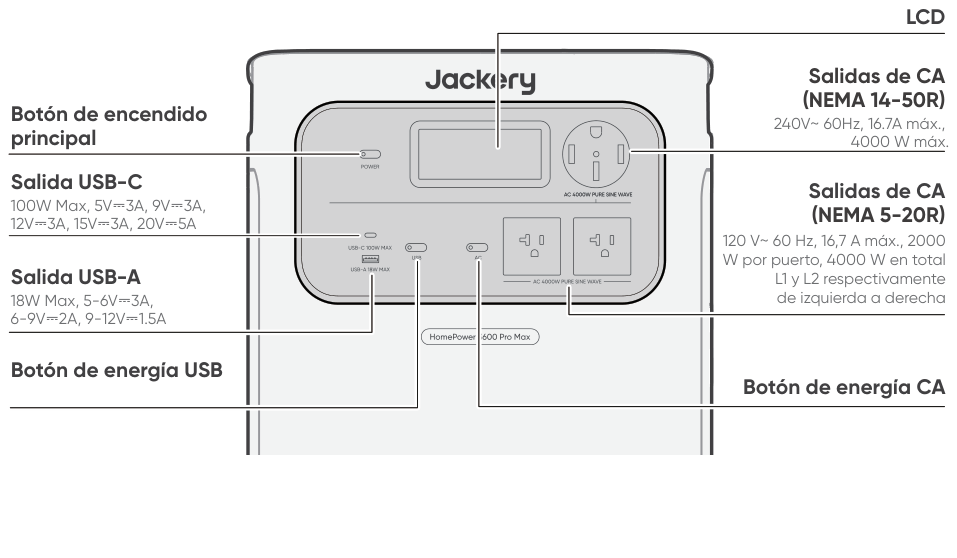

## VISTA LATERAL DERECHA

# AFFICHAGE LCD

<figure aria-label="AFFICHAGE LCD" class="hb-lcd-table-composition" data-component-id="HB-TABLE-LCD-ICON" tabindex="0"><table class="hb-lcd-icon-table"><colgroup><col class="hb-lcd-col-number"/><col class="hb-lcd-col-icon"/><col class="hb-lcd-col-name"/><col class="hb-lcd-col-description"/></colgroup><tbody><tr><td class="hb-lcd-number">
1
</td><td class="hb-lcd-icon"></td><td class="hb-lcd-name">
Wi-Fi
</td><td class="hb-lcd-description">
<strong>Encendido:</strong> Wi-Fi conectado. <strong>Parpadeo:</strong> listo para conectarse al Wi-Fi. <strong>Apagado:</strong> Wi-Fi desconectado.
</td></tr><tr><td class="hb-lcd-number">
2
</td><td class="hb-lcd-icon"></td><td class="hb-lcd-name">
Bluetooth
</td><td class="hb-lcd-description">
<strong>Encendido:</strong> Bluetooth conectado. <strong>Parpadeo:</strong> listo para conectarse al Bluetooth. <strong>Apagado:</strong> Bluetooth desconectado.
</td></tr><tr><td class="hb-lcd-number">
3
</td><td class="hb-lcd-icon"></td><td class="hb-lcd-name">
Modo de Carga Silenciosa
</td><td class="hb-lcd-description">
<strong>Encendido:</strong> el ruido durante la carga se minimiza significativamente, mientras que la potencia de carga se reduce y la velocidad de carga disminuye. <strong>Apagado:</strong> El modo de carga silenciosa está desactivado. Activar/desactivar esta función en la App Jackery. Cuando el dispositivo se apaga, se retiene la configuración.
</td></tr><tr><td class="hb-lcd-number">
4
</td><td class="hb-lcd-icon"></td><td class="hb-lcd-name">
Modo de Ahorro de Batería
</td><td class="hb-lcd-description">
<strong>Encendido:</strong> limita la capacidad máxima utilizable de la batería para prolongar su vida útil. <strong>Apagado:</strong> el modo de ahorro de batería está desactivado. Activar/desactivar esta función en la App Jackery. Cuando el dispositivo se apaga, se retiene la configuración. <strong>Nota 1:</strong> Esta función no está disponible cuando el producto está conectado a paquetes de baterías. <strong>Nota 2:</strong> Cuando esta función está habilitada, el producto ocasionalmente realiza un ciclo completo de carga-descarga para calibrar el SOC.
</td></tr><tr><td class="hb-lcd-number">
5
</td><td class="hb-lcd-icon"></td><td class="hb-lcd-name">
Plan de Carga
</td><td class="hb-lcd-description">
Personaliza el tiempo de carga del producto. Adecuado para situaciones con tarifas eléctricas variables, permite establecer planes de carga según las horas pico y valle, reduciendo así los costos de electricidad. Activar/desactivar esta función en la App Jackery. Cuando el dispositivo se apaga, se retiene la configuración.
</td></tr><tr><td class="hb-lcd-number">
6
</td><td class="hb-lcd-icon"></td><td class="hb-lcd-name">
Límite de potencia de carga
</td><td class="hb-lcd-description">
<strong>Encendido:</strong> El límite de potencia de carga está activado en la aplicación Jackery. <strong>Apagado:</strong> El límite de potencia de carga está desactivado en la aplicación Jackery. Cuando el dispositivo se apaga, se retiene la configuración.
</td></tr><tr><td class="hb-lcd-number">
7
</td><td class="hb-lcd-icon"></td><td class="hb-lcd-name">
Mode Autonome
</td><td class="hb-lcd-description">
Maximiza el uso de la energía solar y reduce la dependencia de la electricidad de la red al priorizar la energía solar almacenada, reduciendo los costos eléctricos. La estación de energía debe estar conectada simultáneamente a los paneles solares y a la red, con la potencia de carga limitada por la potencia de derivación. Activar/desactivar esta función en la App Jackery. Cuando el dispositivo se apaga, se retiene la configuración.
</td></tr><tr><td class="hb-lcd-number">
8
</td><td class="hb-lcd-icon"></td><td class="hb-lcd-name">
Modo TOU
</td><td class="hb-lcd-description">
<strong>Encendido:</strong>el modo TOU está habilitado (SOC de respaldo predeterminado: 60 %). Durante las horas pico, el producto prioriza la descarga de la batería para reducir los costos de la electricidad en momentos de alta demanda, cuando la energía almacenada supera el SOC de respaldo. Durante las horas valle, el sistema carga la batería desde la red para lograr recortar los picos y llenar los valles. <strong>Apagado:</strong> el modo TOU está deshabilitado. El dispositivo no sigue la estrategia TOU (tarifa por periodo de uso) y opera según la lógica predeterminada de suministro de energía y carga. Activar/desactivar esta función en la App Jackery. Cuando el dispositivo se apaga, se retiene la configuración.
</td></tr><tr><td class="hb-lcd-number">
9
</td><td class="hb-lcd-icon"></td><td class="hb-lcd-name">
Paralelo
</td><td class="hb-lcd-description">
<strong>Encendido:</strong> La conexión en paralelo se ha configurado correctamente. <strong>Parpadeo:</strong> La conexión en paralelo se está configurando. <strong>Apagado:</strong> La conexión en paralelo no está configurada.
</td></tr><tr><td class="hb-lcd-number">
10
</td><td class="hb-lcd-icon"></td><td class="hb-lcd-name">
UPS
</td><td class="hb-lcd-description">
El indicador del SAI permanece encendido cuando hay energía de la red eléctrica disponible y se apaga cuando se pierde la energía de la red eléctrica.
</td></tr><tr><td class="hb-lcd-number">
11
</td><td class="hb-lcd-icon"></td><td class="hb-lcd-name">
Indicador de Energía de CA
</td><td class="hb-lcd-description">
La salida CA (onda sinusoidal pura) está activada.
</td></tr><tr><td class="hb-lcd-number">
12
</td><td class="hb-lcd-icon"></td><td class="hb-lcd-name">
Voltaje y frecuencia de salida
</td><td class="hb-lcd-description">
Muestra el voltaje y la frecuencia de salida cuando la salida de CA está habilitada mediante el botón de alimentación de CA o cuando el puerto de expansión de CA está suministrando energía. • 120 V : Se muestra cuando el producto se está cargando desde la entrada de CA de 120 V mientras simultáneamente suministra energía a través de los puertos de salida de CA. • 120/240 V : Se muestra cuando la salida de CA de 240 V está activa o cuando el producto está conectado a un interruptor de transferencia y funciona en modo bypass.
</td></tr><tr><td class="hb-lcd-number">
13
</td><td class="hb-lcd-icon"></td><td class="hb-lcd-name">
Potencia de Entrada
</td><td class="hb-lcd-description">
Muestra la potencia de entrada de CA utilizada para la carga de la batería en vatios.
</td></tr><tr><td class="hb-lcd-number">
14
</td><td class="hb-lcd-icon"></td><td class="hb-lcd-name">
Tiempo de Carga Restante
</td><td class="hb-lcd-description">
Muestra el tiempo de carga restante.
</td></tr><tr><td class="hb-lcd-number">
15
</td><td class="hb-lcd-icon"></td><td class="hb-lcd-name">
Indicador de Carga desde Toma de Corriente CA
</td><td class="hb-lcd-description">
El producto se carga a través de la entrada CA utilizando energía de la red eléctrica.
</td></tr><tr><td class="hb-lcd-number">
16
</td><td class="hb-lcd-icon"></td><td class="hb-lcd-name">
Indicador de Carga desde Coche
</td><td class="hb-lcd-description">
El producto se carga a través de la entrada CC (DC8020) utilizando CC 12 V (carga desde el coche).
</td></tr><tr><td class="hb-lcd-number">
17
</td><td class="hb-lcd-icon"></td><td class="hb-lcd-name">
Indicador de Carga Solar
</td><td class="hb-lcd-description">
El producto se carga a través de la entrada CC (DC8020) utilizando paneles solares.
</td></tr><tr><td class="hb-lcd-number" rowspan="2">
18
</td><td class="hb-lcd-icon"></td><td class="hb-lcd-name">
Indicador de expansión de CA (Carga)
</td><td class="hb-lcd-description">
El producto puede cargarse desde la red a través de un Jackery Automatic Transfer Switch (ATS).
</td></tr><tr><td class="hb-lcd-icon"></td><td class="hb-lcd-name">
Indicador de expansión de CA (Descarga)
</td><td class="hb-lcd-description">
El producto suministra energía a las cargas de su hogar a través del interruptor de transferencia conectado (ATS).
</td></tr><tr><td class="hb-lcd-number">
19
</td><td class="hb-lcd-icon"></td><td class="hb-lcd-name">
Indicador del interruptor de transferencia
</td><td class="hb-lcd-description">
<strong>Encendido:</strong> El producto está conectado correctamente a un interruptor de transferencia (ATS). <strong>Apagado:</strong> El producto no está conectado a un interruptor de transferencia (ATS).
</td></tr><tr><td class="hb-lcd-number">
20
</td><td class="hb-lcd-icon"></td><td class="hb-lcd-name">
Carga de vehículos eléctricos (EV)
</td><td class="hb-lcd-description">
El adaptador de tierra (se vende por separado) está conectado correctamente al producto.
</td></tr><tr><td class="hb-lcd-number">
21
</td><td class="hb-lcd-icon"></td><td class="hb-lcd-name">
Indicador de Potencia de la BateríaBatterie
</td><td class="hb-lcd-description">
Cuando el producto se está cargando, el círculo naranja alrededor del porcentaje de batería se ilumina secuencialmente. Cuando está cargando otros dispositivos, el círculo naranja permanece encendido.allumé.
</td></tr><tr><td class="hb-lcd-number">
22
</td><td class="hb-lcd-icon"></td><td class="hb-lcd-name">
Indicador de Batería Baja
</td><td class="hb-lcd-description">
<strong>Encendido:</strong> el nivel de la batería está por debajo del 20 %. <strong>Parpadeo:</strong> el nivel de la batería está por debajo del 5 %. <strong>Apagado:</strong> el nivel de la batería no está por debajo del 20 % o el producto se está cargando.
</td></tr><tr><td class="hb-lcd-number">
23
</td><td class="hb-lcd-icon"></td><td class="hb-lcd-name">
Porcentaje de Batería Restante
</td><td class="hb-lcd-description">
Muestra el porcentaje de batería restante.
</td></tr><tr><td class="hb-lcd-number">
24
</td><td class="hb-lcd-icon"></td><td class="hb-lcd-name">
Indicador del medidor inteligente
</td><td class="hb-lcd-description">
<strong>Encendido:</strong> Un medidor inteligente está en línea. <strong>Apagado:</strong> No se ha agregado ningún medidor inteligente al sistema o el medidor inteligente está fuera de línea.
</td></tr><tr><td class="hb-lcd-number">
25
</td><td class="hb-lcd-icon"></td><td class="hb-lcd-name">
Temporizador de descarga
</td><td class="hb-lcd-description">
<strong>Encendido:</strong> se ha configurado un temporizador de descarga. <strong>Apagado:</strong> no se ha configurado un temporizador de descarga. Activar/desactivar esta función en la App Jackery. Cuando el dispositivo se apaga, no se retiene la configuración.
</td></tr><tr><td class="hb-lcd-number">
26
</td><td class="hb-lcd-icon"></td><td class="hb-lcd-name">
Baterías conectadas
</td><td class="hb-lcd-description">
Indica que el producto está conectado al número especificado de baterías adicionales 3600.
</td></tr><tr><td class="hb-lcd-number">
27
</td><td class="hb-lcd-icon"></td><td class="hb-lcd-name">
Mode d’Économie d’Énergie
</td><td class="hb-lcd-description">
<strong>Encendido:</strong> Mode d’économie d’énergie activé. <strong>Éteint :</strong> Mode d’économie d’énergie désactivé.
</td></tr><tr><td class="hb-lcd-number" rowspan="2">
28
</td><td class="hb-lcd-icon"></td><td class="hb-lcd-name">
Indicador de Alta Temperatura
</td><td class="hb-lcd-description">
Se activó la protección por alta temperatura. El producto puede dejar de funcionar hasta que su temperatura vuelva al rango normal de operación.
</td></tr><tr><td class="hb-lcd-icon"></td><td class="hb-lcd-name">
Indicador de Baja Temperatura
</td><td class="hb-lcd-description">
Se activó la protección por baja temperatura. El producto puede dejar de funcionar hasta que su temperatura vuelva al rango normal de operación.
</td></tr><tr><td class="hb-lcd-number">
29
</td><td class="hb-lcd-icon"></td><td class="hb-lcd-name">
Código de fallo
</td><td class="hb-lcd-description">
Se ha producido un error en el producto. Por favor, consulte la sección de solución de problemas para más detalles.
</td></tr><tr><td class="hb-lcd-number">
30
</td><td class="hb-lcd-icon"></td><td class="hb-lcd-name">
Potencia de Salida
</td><td class="hb-lcd-description">
Muestra la potencia de salida total (CA + USB) en vatios. Muestra OFF durante 1 segundo antes de que el producto se apague.
</td></tr><tr><td class="hb-lcd-number">
31
</td><td class="hb-lcd-icon"></td><td class="hb-lcd-name">
Tiempo de Descarga Restante
</td><td class="hb-lcd-description">
Muestra el tiempo de descarga restante.
</td></tr></tbody></table></figure>

# OPERACIONES

## ENCENDIDO/APAGADO

<figure class="hb-operation-figure hb-operation-layout-status-right hb-base-art-live-copy" data-component-id="HB-SPECIAL-OPERATION" data-operation-id="main-power" data-source-fragment-sha256="41d83ece012764e640b02f70ccd29f534c3d337a3e98114a4420e1bd1d084eaf" data-web-base-art-ref="assets/power_framefree.png" data-web-presentation-mode="base-art-live-copy">

3s

<strong>Encendido</strong>

Presione una vez

<strong>Apagado</strong>

Appuyez et maintenez pendant 3 secondes

<strong>Tiempo de espera predeterminado: 2 horas</strong>

El producto se apagará automáticamente después de 2 horas de inactividad, sin carga ni descarga. 

*El tiempo en espera puede configurarse en la App de Jackery.

Cuando el modo de ahorro de energía está activado, el producto se apagará automáticamente después de 12 horas si el botón de energía CA o USB está encendido, pero el producto no está cargando ni descargando.

</figure>

## ENCENDER/APAGAR SALIDA USB

<figure class="hb-operation-figure hb-operation-layout-status-right hb-base-art-live-copy" data-component-id="HB-SPECIAL-OPERATION" data-operation-id="dc-usb-output" data-source-fragment-sha256="24f4220d3e48a76f8e183a6a10b5e93cbe478a22f10ab3cc8f0e6354e4c87ee7" data-web-base-art-ref="assets/usb_framefree.png" data-web-presentation-mode="base-art-live-copy">

Requisito previo: el producto está encendido.

<strong>Encendido</strong>

Presione una vez

<strong>Apagado</strong>

Presione una vez

</figure>

<table class="manual-callout-table manual-callout-table"><tbody><tr><td class="manual-callout-label">PRECAUCIÓN</td><td class="manual-callout-body"><ul><li>El puerto USB-C de 100 W es una salida de alta potencia de tipo Fuente de Alimentación 3 (PS3) según USB-PD. Si el dispositivo del usuario o accesorio conectado no cumple con los requisitos de seguridad, puede existir riesgo de incendio. Antes de usar estos puertos, asegúrese de que el dispositivo o accesorio conectado tenga protección contra incendios.</li><li>Solo conecte el Jackery HomePower 3600 Pro Max a dispositivos o accesorios que cumplan con las cláusulas 6.3, 6.4 y 6.5 de IEC/EN/UL 62368-1 (u otros estándares equivalentes).</li><li>Para obtener la potencia máxima de salida, utilice el cable USB-C a USB-C de 5 A (20 V CC/5 A, 100W).</li></ul></td></tr></tbody></table>

## ENCENDER/APAGAR SALIDA CA

<figure class="hb-operation-figure hb-operation-layout-status-right hb-base-art-live-copy" data-component-id="HB-SPECIAL-OPERATION" data-operation-id="ac-output" data-source-fragment-sha256="bdaa805e6f8d8756b1d9da46698a3add05aa95d453f6e3c7933b1cb17bcd337b" data-web-base-art-ref="assets/ac_framefree.png" data-web-presentation-mode="base-art-live-copy">

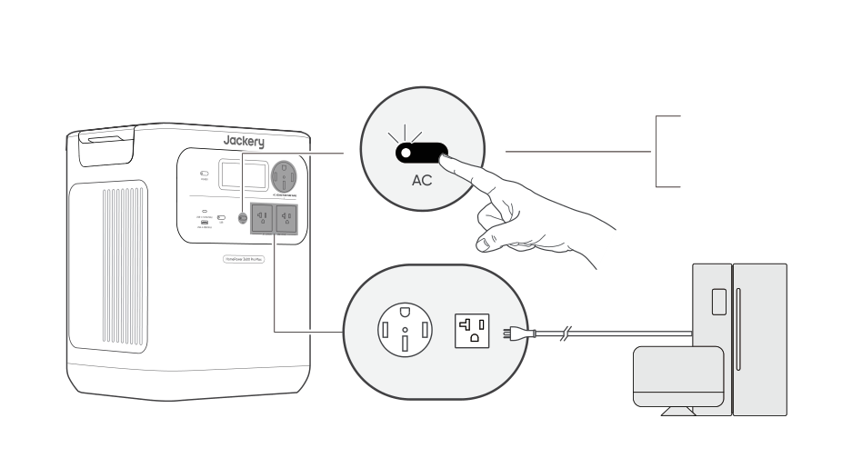

Requisito previo: el producto está encendido.

<strong>Encendido</strong>

Presione una vez

<strong>Apagado</strong>

Presione una vez

</figure>

## MODO DE AHORRO DE ENERGÍA

<figure class="hb-operation-figure hb-operation-layout-status-right hb-base-art-live-copy" data-component-id="HB-SPECIAL-OPERATION" data-operation-id="energy-saving" data-source-fragment-sha256="2b7eb4a8f64094ee0c922fe569300f478da82ac3ac4e781934c8b78b8dcbb78d" data-web-base-art-ref="assets/energy_framefree.png" data-web-presentation-mode="base-art-live-copy">

3s

Botón de encendido principal

Botón de energía CA

<strong>Encendido/Apagado</strong> 3s Mantén presionado durante 3 segundos

Para evitar el consumo innecesario de batería al olvidar apagar la salida, el producto activa por defecto el Modo de Ahorro de Energía. Cuando la salida de CA o USB está encendida, el ícono del modo de Ahorro de Energía se mostrará en la pantalla LCD. Si no hay ningún dispositivo conectado o si el consumo del dispositivo conectado está por debajo de un cierto umbral (salida de CA de 25 W o salida USB de 2 W) durante 12 horas, el dispositivo apagará automáticamente todas las salidas. Configure la duración del modo de Ahorro de Energía en la aplicación Jackery.

Para desactivar el modo de ahorro de energía, presione y mantenga presionados el botón de energía CA y el botón de energía principal durante más de 3 segundos. Una vez desactivado el modo de ahorro de energía, el icono dejará de mostrarse en la pantalla LCD y el producto no apagará automáticamente la salida CA o CC.

Cuando alimente dispositivos de baja potencia (CA ≤ 25 W o USB ≤ 2 W), desactive el modo de ahorro de energía para evitar que la salida se apague automáticamente durante el funcionamiento.

</figure>

<table class="manual-callout-table manual-callout-table"><tbody><tr><td class="manual-callout-label">NOTA</td><td class="manual-callout-body">
El modo de ahorro de energía reanuda el estado anterior después de encender. Se requiere un cambio manual para modificar el modo.
</td></tr></tbody></table>

## PANTALLA LCD

<figure aria-label="PANTALLA LCD" class="hb-lcd-mode-composition" data-component-id="HB-TABLE-LCD-MODE">

<table class="hb-lcd-mode-table"><colgroup><col class="hb-lcd-mode-col-state"/><col class="hb-lcd-mode-col-action"/><col class="hb-lcd-mode-col-copy"/></colgroup><tbody><tr><td class="hb-lcd-mode-state" rowspan="3">
En breve
</td><td class="hb-lcd-mode-action">
Encender
</td><td class="hb-lcd-mode-copy">
Presione el botón de encendido principal o cuando el producto se esté cargando.
</td></tr><tr><td class="hb-lcd-mode-action">
Apagar
</td><td class="hb-lcd-mode-copy">
Presione el botón de encendido principal.
</td></tr><tr><td class="hb-lcd-mode-action">
Apagado automático
</td><td class="hb-lcd-mode-copy">
La pantalla LCD se apaga automáticamente y entra en modo de suspensión después de 2 minutos de inactividad.
</td></tr><tr><td class="hb-lcd-mode-state" rowspan="3">
Estable en (durante el estado de carga o descarga)
</td><td class="hb-lcd-mode-action">
Encender
</td><td class="hb-lcd-mode-copy">
Presione dos veces el botón de encendido principal cuando el producto esté encendida.
</td></tr><tr><td class="hb-lcd-mode-action">
Apagar
</td><td class="hb-lcd-mode-copy">
Presione el botón de energía principal.
</td></tr><tr><td class="hb-lcd-mode-action">
Apagado automático
</td><td class="hb-lcd-mode-copy">
La pantalla LCD se apaga automáticamente después de 2 horas de inactividad.
</td></tr></tbody></table>
</figure>

También puedes configurar el modo de visualización de la pantalla en la aplicación Jackery.

## COMBINACIONES DE TECLAS

<figure aria-label="Botones / Operación / Función" class="hb-key-combination-composition" data-component-id="HB-TABLE-KEY-COMBINATIONS" tabindex="0"><table class="hb-key-combination-table"><colgroup><col class="hb-key-col-buttons"/><col class="hb-key-col-operation"/><col class="hb-key-col-function"/></colgroup><thead><tr><th class="hb-key-buttons" scope="col">Botones</th><th class="hb-key-operation" scope="col">Operación</th><th class="hb-key-function" scope="col">Función</th></tr></thead><tbody><tr><td class="hb-key-buttons">

Botón principal de encendido

+

Botón de energía USB

</td><td class="hb-key-operation">
3s

Mantenga pulsados ambos botones durante 3 segundos
</td><td class="hb-key-function">Restablecer Wi-Fi y Bluetooth</td></tr><tr><td class="hb-key-buttons">

Botón principal de encendido

+

Botón de energía CA

</td><td class="hb-key-operation">
3s

Mantenga pulsados ambos botones durante 3 segundos
</td><td class="hb-key-function">Encender/apagar el modo de ahorro de energía</td></tr><tr><td class="hb-key-buttons">

Botón de energía USB

+

Botón de energía CA

</td><td class="hb-key-operation">
1s

Mantenga pulsados ambos botones durante 1 segundo
</td><td class="hb-key-function">Encender/apagar Wi-Fi y Bluetooth</td></tr></tbody></table></figure>

## FUNCIÓN DE REANUDACIÓN DE SALIDA DE CA Y CC

Esta función memoriza el estado de la salida y reanuda automáticamente las salidas de CA y CC bajo condiciones definidas.

<figure aria-label="Condiciones de reanudación automática / Condiciones sin reanudación automática" class="hb-auto-resume-composition" data-component-id="HB-TABLE-AUTO-RESUME" tabindex="0"><table class="hb-auto-resume-table"><colgroup><col class="hb-auto-resume-col"/><col class="hb-auto-resume-col"/></colgroup><thead><tr><th class="hb-auto-resume-left" scope="col">Condiciones de reanudación automática</th><th class="hb-auto-resume-right" scope="col">Condiciones sin reanudación automática</th></tr></thead><tbody><tr><td class="hb-auto-resume-left">Encendido/Reiniciar después de apagado o reinicio</td><td class="hb-auto-resume-right">Apagado manual de la salida (botón/App)</td></tr><tr><td class="hb-auto-resume-left" rowspan="2">SOC de la batería ≥ límite de descarga +10 % después de alcanzar el límite</td><td class="hb-auto-resume-right">Apagado de salida en modo de ahorro de energía</td></tr><tr><td class="hb-auto-resume-right">Apagado de salida activado por protección</td></tr><tr><td class="hb-auto-resume-left">Actualización OTA completada</td><td class="hb-auto-resume-right">Apagado de salida activado por temporizador de descarga</td></tr></tbody></table></figure>

# FUENTE DE ALIMENTACIÓN ININTERRUMPIDA (UPS)

Un sistema de alimentación ininterrumpida (UPS) es un tipo de sistema de energía continua que proporciona energía eléctrica de respaldo automática a una carga cuando falla la energía de la red principal. En caso de una pérdida repentina de energía de la red, el HomePower 3600 Pro Max cambiará automáticamente a la energía almacenada en menos de 10 ms para mantener sus electrodomésticos en funcionamiento. En modo SAI, la potencia de pico de salida de la unidad varía según los voltajes de entrada de la energía de la red eléctrica antes de un apagón. La potencia de salida real vuelve a la potencia de salida nominal durante los apagones.

<table class="manual-callout-table manual-callout-table"><tbody><tr><td class="manual-callout-label">PRECAUCIÓN</td><td class="manual-callout-body"><ul><li>Este producto no admite conmutación de 0 ms. No lo conecte a equipos que requieran una fuente de alimentación con conmutación de 0 ms, como servidores de datos o estaciones de trabajo.</li><li>Antes de usar, pruebe la compatibilidad con su dispositivo varias veces.</li><li>No conectes cargas que excedan la potencia máxima de salida del producto. De lo contrario, se activará la protección contra sobrecarga.</li></ul></td></tr></tbody></table>

## CON ENTRADA DE CA DE 120 V

Conecte el producto a una toma de corriente de pared de 120 V usando el cable de carga de CA. Presione el botón de alimentación de CA para habilitar la salida de CA.

Carga total ≤1440 W:

El producto funciona en modo bypass de CA. Se pueden usar los tres puertos de CA (dos NEMA 5-20R y uno NEMA 14-50R). En esta condición, el producto admite entrada de 120 V con salidas de 120 V y 240 V y cambia a energía de batería en 10 ms cuando falla la energía de la red eléctrica.

Si solo se requiere un puerto de 120 V, use el puerto izquierdo NEMA 5-20R (L1) como conexión principal.

Carga total &gt;1440 W:

Cada puerto NEMA 5-20R admite hasta 1440 W, con un máximo combinado de 2880 W entre ambos puertos. El puerto NEMA 14-50R admite hasta 2880 W. Los tres puertos de salida CA juntos admiten una salida total de hasta 2880 W. Cuando se opera por encima de 1440 W con entrada de CA de 120V, el producto aún admite salidas de 120 V/240 V. En esta condición, las salidas de CA consumen energía de batería. Si la batería se descarga completamente, la carga conectada puede experimentar un apagado por sobrecarga y una interrupción de energía.

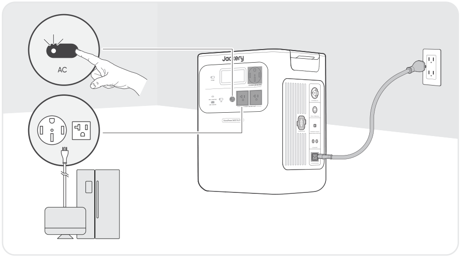

## CON ENTRADA DE CA DE 240 V

Conecte el producto a una fuente de alimentación de CA de 240 V usando un cable de carga Jackery de 40 A (se vende por separado). Presione el botón de alimentación de CA para habilitar la salida de CA.

Todos los puertos de salida CA admiten el funcionamiento del SAI con entrada de 240 V: 

<ul><li>NEMA 14-50R (240 V~60 Hz): Hasta 9600 W de salida en bypass </li><li>NEMA 5-20R ×2 (120 V~60 Hz): Hasta 2400 W por puerto y 4800 W de salida total en bypass </li></ul>

La carga total máxima permitida es de 4000 W para una sola unidad y 8000 W para dos unidades (conexión en paralelo). 

Cuando falla la energía de la red eléctrica de 240 V, el sistema cambia automáticamente a energía de batería con un tiempo de transferencia &lt;10 ms. Cuando la batería se agota, todas las salidas de CA se apagan.

<figure class="hb-reference-figure hb-base-art-live-copy" data-component-id="HB-SPECIAL-REFERENCE-FIGURE" data-reference-id="ups240" data-source-fragment-sha256="5c2ae4d282f3501276fd26c68670cbcc828e152e3f372a314801043cad435727" data-web-base-art-ref="assets/ups240.png" data-web-presentation-mode="base-art-live-copy" data-web-replace-key="reference.ups240">

Câble de charge Jackery 40 A (vendu séparément)

</figure>

# CONEXIONES

## CONECTAR AL/LOS PAQUETE(S) DE BATERÍAS SE VENDE POR SEPARADO

Este producto puede soportar hasta 5 paquetes de baterías para satisfacer la necesidad de una gran capacidad de energía. Para detalles sobre su uso, consulte el manual de usuario del Jackery Battery Pack 3600.

Si está utilizando solo un paquete de batería, puede colocarlo en cualquiera de las siguientes configuraciones:

<figure class="hb-reference-figure hb-base-art-live-copy" data-component-id="HB-SPECIAL-REFERENCE-FIGURE" data-reference-id="battery-placement" data-source-fragment-sha256="b575494b2ce7cf794d47875b17fc68bbeb74dfcb20adfab1b3f9ccaf3ea63cdf" data-web-base-art-ref="assets/placement_framefree.png" data-web-presentation-mode="base-art-live-copy" data-web-replace-key="reference.battery-placement">

Colocación lado a ladoColocación apilada≥0,66 pied (≈200 mm)

</figure>

<table class="manual-callout-table manual-callout-table"><tbody><tr><td class="manual-callout-label">PRECAUCIÓN</td><td class="manual-callout-body"><ul><li>Asegúrese de que todos los productos estén apagados antes de conectar el HomePower 3600 Pro Max al paquete de Jackery Battery Pack 3600.</li><li>Para asegurar el funcionamiento adecuado del producto, asegúrese de que las rejillas de entrada y salida de aire en ambos lados estén despejadas. Deje al menos 0,66 pies (200 mm) de espacio entre las rejillas y cualquier objeto para permitir una disipación de calor adecuada.</li></ul></td></tr></tbody></table>

## CONEXIÓN EN PARALELO EN CASCADA

La conexión en cascada permite que 2 unidades HomePower 3600 Pro Max funcionen como un sistema combinado, aumentando la potencia de salida total.

<h3 class="hb-source-pill-heading" id="required-accessories">Accesorios requeridos</h3>

Cable de carga Jackery de 40 A Cable de comunicación en paralelo de JackeryJackery se vende por separado

<h3 class="hb-source-pill-heading" id="connection-steps">PASOS PARA LA CONEXIÓN</h3>

1. Asegúrese de que ambas unidades estén APAGADAS y completamente desconectadas de las fuentes de energía. 2. Conecte los puertos de comunicación en paralelo en ambas unidades

<table class="manual-callout-table manual-callout-table"><tbody><tr><td class="manual-callout-label">PRECAUCIÓN</td><td class="manual-callout-body">
No omita este paso. Sin comunicación, las unidades no pueden sincronizar datos y pueden dañarse.
</td></tr></tbody></table>

3. Conecte el puerto de salida de 240 V (NEMA 14-50R) de la primera unidad al puerto de expansión CA de la segunda unidad.

<figure class="hb-reference-figure hb-base-art-live-copy" data-component-id="HB-SPECIAL-REFERENCE-FIGURE" data-reference-id="cascade" data-source-fragment-sha256="c33e21dca7799d77895a8b7db62a666b8c60889a42a8a27c0e0d87cef9961ddd" data-web-base-art-ref="assets/cascade.png" data-web-presentation-mode="base-art-live-copy" data-web-replace-key="reference.cascade">

Câble de charge Jackery 40 A (vendu séparément)Cable de comunicación en paralelo de Jackery (se vende por separado)

</figure>

La información del sistema se sincronizará en ambas pantallas.

<table class="manual-callout-table manual-callout-table"><tbody><tr><td class="manual-callout-label">PRECAUCIÓN</td><td class="manual-callout-body">
Después de la conexión en cascada, la potencia de salida total del sistema a través del puerto NEMA 14-50R del segundo dispositivo es de 8000 W. La carga total NO DEBE exceder la potencia total.
</td></tr></tbody></table>

## CONECTAR AL INTERRUPTOR EPO

La interfaz EPO (Apagado de Emergencia) se utiliza para conectar un interruptor externo de parada de emergencia (preparado por el usuario). Cuando ocurre una emergencia, al presionar el botón EPO se apagan inmediatamente todas las entradas y salidas de CA y CC. Se proporciona un bloque de terminales con tornillos con el producto para instalar el interruptor externo de parada de emergencia.

<figure class="hb-reference-figure hb-base-art-live-copy" data-component-id="HB-SPECIAL-REFERENCE-FIGURE" data-reference-id="epo" data-source-fragment-sha256="e8eb0b3ecfbceab4da39b4e32aaea3fe06831e465c668a3bd469b3ae5efaa36e" data-web-base-art-ref="assets/epo.png" data-web-presentation-mode="base-art-live-copy" data-web-replace-key="reference.epo">

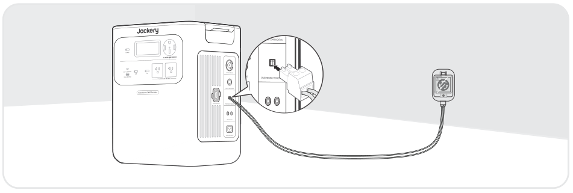EPO

</figure>

## CONNEXION D’ALIMENTATION DE SECOURS

<h3 class="hb-heading-label-pair" id="connect-to-ats-sold-separately">CONECTAR A ATS SE VENDE POR SEPARADO</h3>

El HomePower 3600 Pro Max puede suministrar energía de respaldo a los circuitos del hogar a través de un interruptor de transferencia automática Jackery (ATS). Para la instalación y operación detalladas, consulte el manual del usuario de ATS de Jackery.

<figure class="hb-reference-figure hb-base-art-live-copy" data-component-id="HB-SPECIAL-REFERENCE-FIGURE" data-reference-id="ats-lock" data-source-fragment-sha256="637b5f8805f40325c8805ee43dd3d178486da304a4f38e5e6a06042b9c3f72ae" data-web-base-art-ref="assets/ats_live.png" data-web-presentation-mode="base-art-live-copy" data-web-replace-key="reference.ats-lock">

<strong>Lock</strong><strong>Unlock</strong>Cable de entrada/salida de alimentación en el paquete del ATS

</figure>

<table class="manual-callout-table manual-callout-table"><tbody><tr><td class="manual-callout-label">NOTA</td><td class="manual-callout-body">
Cuando el modo SAI está habilitado en el ATS, la estación de energía permanece activa y consume energía continuamente. Durante un apagón de la red eléctrica, el sistema cambia a energía de batería en 20 milisegundos.
</td></tr></tbody></table>

## CONECTAR A MTS SE VENDE POR SEPARADO

El HomePower 3600 Pro Max puede conectarse a un Manual Transfer Switch (MTS) para alimentar circuitos seleccionados del hogar. Elija el método adecuado según su modo de instalación.

<table class="manual-callout-table manual-callout-table"><tbody><tr><td class="manual-callout-label">NOTA</td><td class="manual-callout-body">
Tous les câbles utilisés dans cette section sont vendus séparément ou inclus avec le MTS vendu séparément.
</td></tr></tbody></table>

<h3 class="hb-source-pill-heading" id="mts-installation-notice">Aviso de instalación de un interruptor de transferencia manual (MTS)</h3>

Para un rendimiento óptimo al usar el HP3600 Pro Max con un interruptor MTS, se recomienda conectar la entrada de CA a un circuito sin protección GFCI (interruptor de circuito por fallo a tierra). Si se requiere protección GFCI, se recomienda instalar los dispositivos GFCI en el lado de la carga. Esta configuración ayuda a mejorar la compatibilidad del sistema y garantiza un funcionamiento de derivación de CA confiable.

## CONEXIÓN DE UNA SOLA UNIDAD CON MTS

En modo automático, el HomePower 3600 Pro Max recibe entrada de CA y proporciona energía de respaldo tipo SAI a través del MTS.

<figure class="hb-reference-figure hb-base-art-live-copy" data-component-id="HB-SPECIAL-REFERENCE-FIGURE" data-reference-id="mts-single" data-source-fragment-sha256="e9d3d14cf00973b7c734f6c628ab6c0c9d0d112e2c906ffcb91c993166f9598c" data-web-base-art-ref="assets/mts_single_live.png" data-web-presentation-mode="base-art-live-copy" data-web-replace-key="reference.mts-single">

<strong class="hb-mts-step-number">1.</strong>Apague el HomePower 3600 Pro Max.<strong class="hb-mts-step-number">2.</strong>Conecte el HomePower 3600 Pro Max a una fuente de alimentación de CA de 240 V.<strong class="hb-mts-step-number">3.</strong>Conecte el puerto de salida de 240 V (NEMA 14-50R) a la entrada del MTS.<strong class="hb-mts-step-number">4.</strong>Coloque el interruptor de carga del MTS en respaldo.<strong class="hb-mts-step-number">5.</strong>Encienda la unidad y habilite la salida de CA.Cable de carga en el paquete del MTSCable de carga Jackery de 40 A (se vende por separado)

</figure>

Cuando hay energía de la red eléctrica, la energía de CA pasa hacia el MTS. Durante un apagón, el sistema cambia automáticamente a energía de batería en 10 milisegundos.

<table class="manual-callout-table manual-callout-table"><tbody><tr><td class="manual-callout-label">NOTA</td><td class="manual-callout-body">
La conmutación automática requiere que la entrada de CA permanezca conectada en todo momento.
</td></tr></tbody></table>

## CONEXIÓN EN PARALELO EN CASCADA CON MTS

Cuando dos unidades están conectadas en modo paralelo en cascada, el sistema puede entregar mayor potencia de salida al MTS.

<figure class="hb-reference-figure hb-base-art-live-copy" data-component-id="HB-SPECIAL-REFERENCE-FIGURE" data-reference-id="mts-cascade" data-source-fragment-sha256="869112471cccfa92addd2b6cdc7dcf75c898f836849703b902c4a74a00344f91" data-web-base-art-ref="assets/mts_cascade_live.png" data-web-presentation-mode="base-art-live-copy" data-web-replace-key="reference.mts-cascade">

<strong class="hb-mts-step-number">1.</strong>Complete los pasos de conexión en paralelo en cascada descritos anteriormente.<strong class="hb-mts-step-number">2.</strong>Conecte el puerto de salida de 240 V (NEMA 14-50R) del segundo dispositivo a la entrada del MTS.<strong class="hb-mts-step-number">3.</strong>Encienda ambas unidades y habilite la salida de CA.Cable de carga en el paquete del MTSCable de carga Jackery de 40 A (se vende por separado)Cable de comunicación paralela Jackery (se vende por separado)

</figure>

<table class="manual-callout-table manual-callout-table"><tbody><tr><td class="manual-callout-label">PRECAUCIÓN</td><td class="manual-callout-body">
Después de la conexión en cascada, la salida máxima al MTS es de 8000 W. La carga total NO DEBE exceder la potencia total.
</td></tr></tbody></table>

# CARGANDO

<strong>Energía renovable primero:</strong>Abogamos por utilizar primero energía renovable. Este producto admite dos modos de carga al mismo tiempo: carga solar y carga de pared de CA. Cuando la carga en la pared de CA y la carga solar están activadas al mismo tiempo, el producto dará prioridad a la carga solar y se utilizarán ambos métodos para cargar la batería a la máxima potencia permitida.

Carga completamente el producto antes de usarlo por primera vez.

<table class="manual-callout-table manual-callout-table"><tbody><tr><td class="manual-callout-label">NOTA</td><td class="manual-callout-body"><ul><li>La temperatura de carga recomendada para el producto está entre -4 °F y 113 °F (-20 °C a 45 °C), y la temperatura de descarga está entre -4 °F y 113 °F (-20 °C a 45 °C). Operar el producto fuera de este rango de temperatura puede limitar sus capacidades de carga y descarga, e incluso impedir la carga o descarga.</li><li>La potencia de carga y la capacidad de la batería del producto pueden variar debido a fluctuaciones de temperatura.</li></ul></td></tr></tbody></table>

## CARGA MEDIANTE TOMA DE CORRIENTE DE PARED DE CA DE 120 V

<figure class="hb-reference-figure hb-base-art-live-copy" data-component-id="HB-SPECIAL-REFERENCE-FIGURE" data-reference-id="charge120" data-source-fragment-sha256="484f4e7d5cd67891ce8d3420c9456b0f87d70dc6e1c42fde243326bee8a6d1c2" data-web-base-art-ref="assets/charge120.png" data-web-presentation-mode="base-art-live-copy" data-web-replace-key="reference.charge120">

Conecte el cable de carga de CA al puerto de entrada de CA del producto y a una toma de corriente.

</figure>

<table class="manual-callout-table manual-callout-table"><tbody><tr><td class="manual-callout-label">ATTENTION</td><td class="manual-callout-body"><ul><li>Asegúrese de que el cable de carga de CA esté completamente y firmemente insertado en el puerto de entrada de CA.</li><li>Una conexión incompleta puede provocar corriente inestable, sobrecalentamiento, mal contacto o fallos en el funcionamiento del producto.</li></ul></td></tr></tbody></table>

## CARGA MEDIANTE ENTRADA DE CA DE 240 V

El HomePower 3600 Pro Max admite carga a través de su puerto de expansión CA de 240 V. Según su instalación, la entrada de CA de 240 V puede provenir de una toma de CA de 240 V o de un Automatic Transfer Switch (ATS) de Jackery.

<h3 class="hb-source-pill-heading" id="v-ac-outlet">Toma de CA de 240 V</h3>

<figure class="hb-reference-figure hb-base-art-live-copy" data-component-id="HB-SPECIAL-REFERENCE-FIGURE" data-reference-id="charge240" data-source-fragment-sha256="9fbdce0cceb7c5cfc7d57647b27466d7b643b7b6eb3ed4e40055dadaaa6cf355" data-web-base-art-ref="assets/charge240.png" data-web-presentation-mode="base-art-live-copy" data-web-replace-key="reference.charge240">

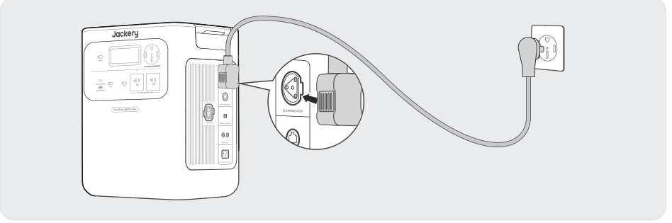Conecte el producto a una fuente de alimentación de CA de 240 V usando un cable de carga Jackery de 40 A (se vende por separado).

</figure>

<table class="manual-callout-table manual-callout-table"><tbody><tr><td class="manual-callout-label">PRECAUCIÓN</td><td class="manual-callout-body"><ul><li>Asegúrese de que el cable de carga Jackery de 40 A esté completamente y firmemente conectado tanto a la toma de 240 V como al puerto de expansión de CA.</li><li>Una conexión incompleta puede provocar corriente inestable, sobrecalentamiento, mal contacto o fallos en el funcionamiento del producto.</li></ul></td></tr></tbody></table>

<h3 class="hb-source-pill-heading" id="transfer-switch-ats">INTERRUPTOR DE TRANSFERENCIA (ATS)</h3>

Conecte su ATS de Jackery al producto para habilitar la carga mediante el interruptor de transferencia.

<table class="manual-callout-table manual-callout-table"><tbody><tr><td class="manual-callout-label">NOTA</td><td class="manual-callout-body">
La configuración de reserva de respaldo se aplica en todos los modos de operación del ATS. Cuando la capacidad restante del HomePower 3600 Pro Max supere la reserva de respaldo configurada, la carga se detendrá automáticamente.
</td></tr></tbody></table>

Para cargarlo inmediatamente, sigue las instrucciones a continuación: 1. Toca Estación de energía en el flujo de energía del panel de control del ATS. 2. En la página de la Estación de energía, toca Cargar ahora.

<table class="manual-callout-table manual-callout-table"><tbody><tr><td class="manual-callout-label">NOTA</td><td class="manual-callout-body">
Cuando el puerto de expansión de CA está conectado al ATS, la entrada de CA no se utilizará para cargar. En ese caso, la estación de energía se puede cargar mediante los siguientes puertos: puerto de expansión de CA, puertos DC8020.
</td></tr></tbody></table>

## CARGA MEDIANTE PANELES SOLARES SE VENDE POR SEPARADO

El Jackery HomePower 3600 Pro Max cuenta con dos puertos de entrada DC8020, y cada uno admite la conexión directa a un panel solar de 500 W o a tres paneles solares de 200 W. Si desea conectar dos o más paneles solares a un solo puerto de entrada DC8020 simultáneamente, consulte la figura a continuación para la conexión mediante el conector de panel solar (se vende por separado, no incluido de serie).

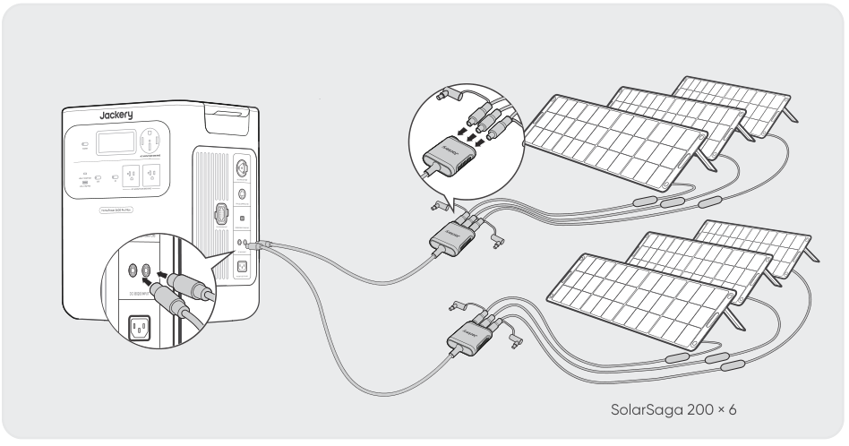

<table class="manual-callout-table manual-callout-table"><tbody><tr><td class="manual-callout-label">PRECAUCIÓN</td><td class="manual-callout-body">
Asegúrese de que el voltaje de entrada para ambos puertos de entrada CC sea el mismo. De lo contrario, podría dañar el producto. Por ejemplo: Utilizar paneles solares Jackery del mismo modelo y la misma cantidad de paneles al conectar paneles solares a ambos puertos de entrada DC8020. No cargue el producto utilizando simultáneamente un cargador de automóvil y un panel solar. Hacerlo podría quemar el fusible del automóvil o resultar en un fallo de carga.
</td></tr></tbody></table>

Se recomienda utilizar paneles solares Jackery para cargar el HomePower 3600 Pro Max. Asegúrate de que la tensión de funcionamiento (Vmp) del panel solar esté dentro del rango de entrada de CC (16 V-60 V) del HomePower 3600 Pro Max. Jackery no se hace responsable de pérdidas causadas por el uso de paneles solares de otras marcas.

## CARGA MEDIANTE UN CARGADOR PARA VEHÍCULO SE VENDE POR SEPARADO

Este producto puede cargarse con un cargador para vehículo de 12 V. Asegúrate de que el cargador para vehículo y la toma de alimentación de 12 V del vehículo estén bien conectados.

<figure class="hb-reference-figure hb-base-art-live-copy" data-component-id="HB-SPECIAL-REFERENCE-FIGURE" data-reference-id="car_charging" data-source-fragment-sha256="111f246c1ca9ec451326e4a94db0ad00a58983c5955c082180746bc224a72528" data-web-base-art-ref="assets/car_charging_framefree.svg" data-web-presentation-mode="base-art-live-copy" data-web-replace-key="reference.car-charging">

Vehículo* El cable de carga para auto se vende por separado.

</figure>

<table class="manual-callout-table manual-callout-table"><tbody><tr><td class="manual-callout-label">PRECAUCIÓN</td><td class="manual-callout-body"><ul><li>Por favor, encienda el vehículo antes de cargar su estación de energía.</li><li>Si el vehículo circula por caminos accidentados, está prohibido usar el cargador de coche para evitar que se queme debido a una mala conexión. La empresa no se responsabiliza por pérdidas causadas por un uso incorrecto.</li><li>La carga en vehículo solo es aplicable a vehículos con 12 V CC, no a 24 V CC. Por favor, no cargue este producto en vehículos de 24 V para evitar lesiones personales y daños materiales.</li></ul></td></tr></tbody></table>

# RESOLUCIÓN DE PROBLEMAS

Si aparece alguno de los siguientes códigos de falla, siga las acciones correctivas listadas para resolver el problema. Si la falla persiste, por favor contacte con atención al cliente de Jackery.

<figure aria-label="Código de Error / Medidas correctivas" class="hb-troubleshooting-composition" data-component-id="HB-TABLE-TROUBLESHOOTING" tabindex="0"><table class="hb-troubleshooting-table"><colgroup><col class="hb-troubleshooting-col-code"/><col class="hb-troubleshooting-col-measures"/></colgroup><thead><tr><th class="hb-troubleshooting-code" scope="col">Código de Error</th><th class="hb-troubleshooting-measures" scope="col">Medidas correctivas</th></tr></thead><tbody><tr><td class="hb-troubleshooting-code">F0/F1 F2/F3</td><td class="hb-troubleshooting-measures">Reiniciar el producto.</td></tr><tr><td class="hb-troubleshooting-code">F4</td><td class="hb-troubleshooting-measures">Conecte el producto a cargas para descargar su batería hasta que la falla desaparezca.</td></tr><tr><td class="hb-troubleshooting-code">F5</td><td class="hb-troubleshooting-measures">Cargue el producto mediante paneles solares o toma de corriente CA hasta que la falla desaparezca.</td></tr><tr><td class="hb-troubleshooting-code">F6</td><td class="hb-troubleshooting-measures">1. Espere a que la red eléctrica se normalice antes de cargar el producto a través de una toma de corriente CA. 2. Verifique si las rejillas de entrada y salida de aire están obstruidas; asegure un espacio libre de 0,66 pies (20 cm) a ambos lados del producto. 3. Coloque el producto en un lugar que no esté expuesto a la luz solar directa o a altas temperaturas ambientales. 4. Desconecte todas las cargas del producto. Mantenga el producto inactivo y espere hasta que la falla desaparezca. 5. Reiniciar el producto.</td></tr><tr><td class="hb-troubleshooting-code">F7</td><td class="hb-troubleshooting-measures">1. Retire todas las entradas de CC del producto. 2. Verifique la tensión de funcionamiento (Vmp) de los paneles solares conectados. El producto permite un voltaje máximo de entrada de CC de 60 V. 3. Reinicie el producto y déjelo en reposo. Espere hasta que la falla desaparezca.</td></tr><tr><td class="hb-troubleshooting-code">F8</td><td class="hb-troubleshooting-measures">Contacter le service à la clientèle de Jackery.</td></tr><tr><td class="hb-troubleshooting-code">F9</td><td class="hb-troubleshooting-measures">Retire la carga conectada a los puertos USB del producto. Espere hasta que la falla desaparezca.</td></tr><tr><td class="hb-troubleshooting-code">FA</td><td class="hb-troubleshooting-measures">1. Apague las salidas de CA y apague ambas unidades. 2. Desconecte los cables entre las unidades y vuelva a conectar las dos unidades. 3. Reinicie ambas unidades y habilite sus salidas de CA.</td></tr><tr><td class="hb-troubleshooting-code">FC</td><td class="hb-troubleshooting-measures">1. Reinicie los paquetes de baterías y el HomePower 3600 Pro Max respectivamente. 2. Si la falla persiste, desconecte el paquete de baterías del HomePower 3600 Pro Max y reconéctelos.</td></tr><tr><td class="hb-troubleshooting-code">FF</td><td class="hb-troubleshooting-measures">1. Después de que la condición de emergencia se haya despejado, presione el botón EPO nuevamente. 2. Si necesita alimentar cargas de CA o CC, presione el botón de alimentación de CA o el botón de alimentación de CC para volver a habilitar la salida.</td></tr></tbody></table></figure>

# ALMACENAMIENTO

Almacene el producto en un lugar seco y limpio con ventilación adecuada.Temperatura y humedad de almacenamiento:

<ul><li>1 mes: -4°F a 113°F / -20 a 45 °C (0-60 % HR)</li><li>3 meses: 32°F a 113°F / 0 a 45 °C (0-60 % HR)</li><li>12 meses: 32°F a 77°F / 0 a 25 °C (0-60 % HR)</li></ul>

Si este producto se almacena durante un período prolongado (de 3 a 6 meses) con la batería descargada, podría volverse imposible recargarlo. Para evitar esto y mantener la salud de la batería, se recomienda revisar y recargar el producto cada tres meses, y realizar un ciclo completo de carga y descarga al menos una vez cada 6 a 12 meses.

# ESPECIFICACIONES

<h2 aria-level="2" class="hb-spec-group" role="heading">INFORMACIÓN GENERAL</h2>

<figure aria-label="INFORMACIÓN GENERAL" class="hb-spec-table-composition"><table class="manual-table manual-spec-table hb-spec-table"><colgroup><col class="hb-spec-col-label"/><col class="hb-spec-col-value"/></colgroup><tbody><tr><th class="manual-spec-label hb-spec-label" scope="row">Nombre del producto</th><td class="manual-spec-value hb-spec-value">Jackery HomePower 3600 Pro Max</td></tr><tr><th class="manual-spec-label hb-spec-label" scope="row">N° de modelo</th><td class="manual-spec-value hb-spec-value">JHP-3600C</td></tr><tr><th class="manual-spec-label hb-spec-label" scope="row">Capacidad</th><td class="manual-spec-value hb-spec-value">80 Ah / 44,8 V DC (3584 Wh)</td></tr><tr><th class="manual-spec-label hb-spec-label" scope="row">Química Celular</th><td class="manual-spec-value hb-spec-value">LiFePO4</td></tr><tr><th class="manual-spec-label hb-spec-label" scope="row">Peso</th><td class="manual-spec-value hb-spec-value">73,85 libras/33,5 kg</td></tr><tr><th class="manual-spec-label hb-spec-label" scope="row">Dimensiones</th><td class="manual-spec-value hb-spec-value">14,76 × 10,83 × 17,72 pulgadas / 37,5×27,5×45,0 cm</td></tr><tr><th class="manual-spec-label hb-spec-label" scope="row">Ciclo de vida</th><td class="manual-spec-value hb-spec-value">6000 ciclos de carga hasta 70 % + de capacidad</td></tr><tr><th class="manual-spec-label hb-spec-label" scope="row">Courant et durée maximum du court-circuit</th><td class="manual-spec-value hb-spec-value">1520A, 2.56ms</td></tr><tr><th class="manual-spec-label hb-spec-label" scope="row">UPS</th><td class="manual-spec-value hb-spec-value">&lt;10 ms</td></tr><tr><th class="manual-spec-label hb-spec-label" scope="row">Topología de inversor</th><td class="manual-spec-value hb-spec-value">Aislada</td></tr><tr><th class="manual-spec-label hb-spec-label" scope="row">Factor de potencia</th><td class="manual-spec-value hb-spec-value">≥0,98</td></tr><tr><th class="manual-spec-label hb-spec-label" scope="row">Unidad entera</th><td class="manual-spec-value hb-spec-value">Tipo 1</td></tr></tbody></table></figure>

<h2 aria-level="2" class="hb-spec-group" role="heading">PUERTOS DE ENTRADA</h2>

<figure aria-label="PUERTOS DE ENTRADA" class="hb-spec-table-composition"><table class="manual-table manual-spec-table hb-spec-table"><colgroup><col class="hb-spec-col-label"/><col class="hb-spec-col-value"/></colgroup><tbody><tr><th class="manual-spec-label hb-spec-label" rowspan="2" scope="row">1 × Entrada CA</th><td class="manual-spec-value hb-spec-value">Modo de carga: 100 V-120 V~ 60 Hz, 15 A máx., 1800 W</td></tr><tr><td class="manual-spec-value hb-spec-value">Modo de derivación①: 100 V-120 V~ 60 Hz, 12 A máx., 1440 W</td></tr><tr><th class="manual-spec-label hb-spec-label" scope="row">2 × Puertos DC8020</th><td class="manual-spec-value hb-spec-value">12–16 V⎓8 A máx., Doble a 8 A máx. 16-60 V②⎓12A máx., Doble a 24 A / 1200 W máx.</td></tr></tbody></table></figure>

<h2 aria-level="2" class="hb-spec-group" role="heading">PUERTOS DE SALIDA</h2>

<figure aria-label="PUERTOS DE SALIDA" class="hb-spec-table-composition"><table class="manual-table manual-spec-table hb-spec-table"><colgroup><col class="hb-spec-col-label"/><col class="hb-spec-col-value"/></colgroup><tbody><tr><th class="manual-spec-label hb-spec-label" scope="row">2 × Salidas CA (NEMA 5-20R)</th><td class="manual-spec-value hb-spec-value">120 V~ 60 Hz, 16,7A máx., 2000 W por puerto, 4000W en total</td></tr><tr><th class="manual-spec-label hb-spec-label" scope="row">1 × Salidas CA (NEMA 14-50R)</th><td class="manual-spec-value hb-spec-value">240 V~60 Hz, 16,7A máx., 4000 W nominales, 8000W pico de sobretensión</td></tr><tr><th class="manual-spec-label hb-spec-label" scope="row">Salida total de CA③</th><td class="manual-spec-value hb-spec-value">4000 W nominales, 8000 W pico de sobretensión</td></tr><tr><th class="manual-spec-label hb-spec-label" rowspan="2" scope="row">Salida de CA en Modo de derivación①</th><td class="manual-spec-value hb-spec-value"><strong>Entrada de CA de 120 V:</strong> NEMA 5-20R: 100 V-120 V~ 60 Hz, 12 A máx., 1440 W por puerto, 1440W④ en total NEMA 14-50R: 240 V~ 60 Hz, 1440W④ máx.</td></tr><tr><td class="manual-spec-value hb-spec-value"><strong>Entrada de CA de 240 V:</strong> NEMA 5-20R: 100 V-120 V~ 60 Hz, 20 A máx., 2400 W por puerto, 4800W en total NEMA 14-50R: 240 V~ 60 Hz, 40 A máx., 9600 W máx.</td></tr><tr><th class="manual-spec-label hb-spec-label" scope="row">1 × Salida USB-C</th><td class="manual-spec-value hb-spec-value">100 W máx., 5 V⎓3 A, 9 V⎓3 A, 12 V⎓3 A, 15 V⎓3 A, 20 V⎓5 A</td></tr><tr><th class="manual-spec-label hb-spec-label" scope="row">1 × Salida USB-A</th><td class="manual-spec-value hb-spec-value">18 W máx., 5-6V⎓3A, 6-9V⎓2A, 9-12V⎓1.5A</td></tr></tbody></table></figure>

<h2 aria-level="2" class="hb-spec-group" role="heading">PUERTOS DE EXPANSIÓN</h2>

<figure aria-label="PUERTOS DE EXPANSIÓN" class="hb-spec-table-composition"><table class="manual-table manual-spec-table hb-spec-table"><colgroup><col class="hb-spec-col-label"/><col class="hb-spec-col-value"/></colgroup><tbody><tr><th class="manual-spec-label hb-spec-label" scope="row">1 × Puerto de expansión CA</th><td class="manual-spec-value hb-spec-value">240 V~60 Hz, 16,7 máx., 4000 W máx.</td></tr><tr><th class="manual-spec-label hb-spec-label" scope="row">1 × Puerto de expansión CC</th><td class="manual-spec-value hb-spec-value">36,4 V-50,4 V⎓126 A máx. (Entrada) 36,4 V-50,4 V⎓60 A máx. (Salida)</td></tr></tbody></table></figure>

<h2 aria-level="2" class="hb-spec-group" role="heading">ESPECIFICACIONES AMBIENTALES</h2>

<figure aria-label="ESPECIFICACIONES AMBIENTALES" class="hb-spec-table-composition"><table class="manual-table manual-spec-table hb-spec-table"><colgroup><col class="hb-spec-col-label"/><col class="hb-spec-col-value"/></colgroup><tbody><tr><th class="manual-spec-label hb-spec-label" scope="row">Temperatura de carga</th><td class="manual-spec-value hb-spec-value">-4 °F a 113 °F (-20 °C a 45 °C)</td></tr><tr><th class="manual-spec-label hb-spec-label" scope="row">Temperatura de descarga</th><td class="manual-spec-value hb-spec-value">-4 °F a 113 °F (-20 °C a 45 °C)</td></tr><tr><th class="manual-spec-label hb-spec-label" scope="row">Altitud</th><td class="manual-spec-value hb-spec-value">≤ 3000 m</td></tr></tbody></table></figure>

※ USB Type-C® y USB-C® son marcas registradas de USB Implementers Forum.

① El producto puede cargar la batería desde una toma de corriente CA o a través del ATS mientras suministra energía a través de los puertos de salida CA.

② Indica la tensión de funcionamiento (Vmp) permitida del panel solar.

③ Indica que dos o más puertos de salida CA trabajan en conjunto.

④ Cuando está conectado a cargas superiores a 1440 W bajo entrada de CA de 120 V, el producto toma energía de la batería para cumplir con el requerimiento de carga total de hasta 2880 W.

# GARANTÍA

<figure aria-label="GARANTÍA" class="hb-warranty-intro-composition" data-component-id="HB-WARRANTY-LEAD">

Solo ofrecemos nuestra garantía a clientes que compren en el sitio web oficial de Jackery, plataformas de terceros con la marca Jackery o distribuidores autorizados locales.

*El periodo de garantía y los detalles pueden variar según las leyes, regulaciones y distribuidores autorizados locales.

</figure>

## Garantía limitada

<figure aria-label="Garantía limitada" class="hb-warranty-card" data-component-id="HB-WARRANTY-SECTION" data-warranty-card-index="1">
Jackery Inc. garantiza al consumidor original que el producto Jackery estará libre de defectos relativos al acabado y a los materiales en condiciones normales de uso por parte del consumidor durante el período de garantía aplicable identificado en la sección "Período de garantía" que figura a continuación, sujeto a las exclusiones que se establecen a continuación. Esta declaración de garantía establece la obligación de garantía total y exclusiva de Jackery. No asumiremos ni autorizaremos que ninguna persona asuma por nosotros ninguna otra responsabilidad en relación con la venta de nuestros productos.
</figure>

## Período de garantía

<figure aria-label="Período de garantía" class="hb-warranty-period-card" data-component-id="HB-WARRANTY-YEARS">

3
<strong class="hb-warranty-years-unit">AÑOS</strong><strong class="hb-warranty-period-label">Garantía Estándar</strong>

El periodo de garantía estándar de Jackery HomePower 3600 Pro Max es de 36 meses. En cada caso, el período de garantía se mide a partir de la fecha de compra por parte del comprador consumidor original. Para establecer la fecha de inicio del período de garantía, se necesita el recibo de venta de la primera compra del consumidor u otra prueba documental razonable.

2
<strong class="hb-warranty-years-unit">AÑOS</strong><strong class="hb-warranty-period-label">Garantía extendida</strong>

Para activar la extensión de garantía, debe registrar su producto en línea o ponerse en contacto con nuestro equipo de atención al cliente en hello@jackery.com para ampliar la duración de la garantía estándar.

</figure>

## Reparación o reemplazo

<figure aria-label="Reparación o reemplazo" class="hb-warranty-card" data-component-id="HB-WARRANTY-SECTION" data-warranty-card-index="2">
Jackery reparará o reemplazará (a cargo de Jackery) cualquier producto Jackery que no funcione durante el periodo de garantía aplicable debido a defectos en la mano de obra o el material. El producto reparado o reemplazado asumirá el periodo restante de la garantía desde la fecha original de compra.
</figure>

## Limitado al comprador consumidor original

<figure aria-label="Limitado al comprador consumidor original" class="hb-warranty-card" data-component-id="HB-WARRANTY-SECTION" data-warranty-card-index="3">
La garantía del producto de Jackery se limita al consumidor original y no es transferible a ningún propietario posterior.
</figure>

## Exclusiones

<figure aria-label="Exclusiones" class="hb-warranty-card" data-component-id="HB-WARRANTY-SECTION" data-warranty-card-index="4">
La garantía de Jackery no se aplica a:
Mal uso, abuso, modificación, daño por accidente, o uso para cualquier cosa que no sea el uso normal del consumidor según lo autorizado en los folletos actuales del producto de Jackery. Intento de reparación por cualquier persona que no sea un centro autorizado. Cualquier producto adquirido a través de una casa de subastas en línea. La garantía de Jackery no se aplica a la célula de la batería a menos que usted la cargue completamente en los siete días siguientes a la compra del producto y, a partir de entonces, al menos una vez cada 6 meses.</figure>

## Derechos de interpretación

<figure aria-label="Derechos de interpretación" class="hb-warranty-card" data-component-id="HB-WARRANTY-SECTION" data-warranty-card-index="5">
Jackery se reserva el derecho a la interpretación final de la política posventa de los clientes anterior.
</figure>

# CONFIGURACIÓN DE LA APLICACIÓN

## 1. Descargar la aplicación e iniciar sesión

<figure aria-label="1. Descargar la aplicación e iniciar sesión" class="hb-app-download-composition" data-component-id="HB-SPECIAL-APP">

Buscar "Jackery" en Google Play o en la App Store para instalar la aplicación. Después, podrá registrarte e iniciar sesión.

Alternativamente, escanee el código QR a continuación para descargar e instalar la app.

</figure>

## 2. Añadir un dispositivo

2.1 Haga clic en el botón + Añadir dispositivo ;

2.2 Presione una vez el botón de encendido principal del dispositivo para encenderlo. Los iconos del wifi y del Bluetooth del dispositivo parpadearán para indicar que el dispositivo ha entrado en el modo de configuración de red. A continuación, pulse el botón "icono parpadeante" y permita que la aplicación se conecte a los dispositivos cercanos y abra los permisos de Bluetooth;

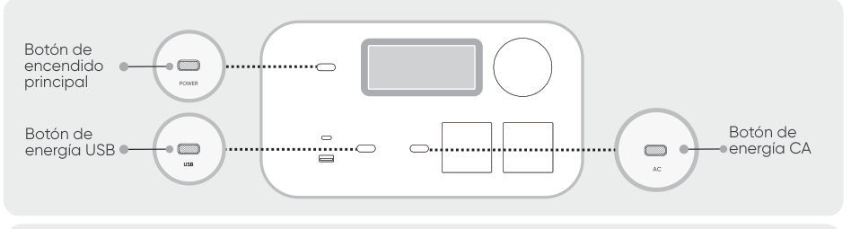

<table class="manual-callout-table manual-callout-table"><tbody><tr><td class="manual-callout-label">REMARQUE</td><td class="manual-callout-body">
Después de estar encendido, si la APP no se conecta en 2 horas, el dispositivo desactivará automáticamente el Wi-Fi y el Bluetooth. Ahora se requiere mantener presionados el botón de alimentación SAI y el botón de alimentación de CA para activar nuevamente el Wi-Fi y Bluetooth.
</td></tr></tbody></table>

2.3. Tras hacer clic en el icono del dispositivo buscado, la aplicación conecta automáticamente el dispositivo a través de Bluetooth.

<table class="manual-callout-table manual-callout-table"><tbody><tr><td class="manual-callout-label">NOTA</td><td class="manual-callout-body">
Si durante el proceso de vinculación se indica que "el dispositivo ha sido vinculado", se pueden utilizar las dos formas siguientes para la conexión.
<ul><li>El propietario del dispositivo lo compartirá con otros usuarios a través de la App.</li><li>Mantenga pulsados el botón de encendido principal y el botón de energía USB durante 3 segundos para reiniciar el Wi-Fi y el Bluetooth del dispositivo y, a continuación, vuelva a vincularlo.</li></ul></td></tr></tbody></table>

2.4 Una vez que el dispositivo se haya conectado correctamente, es necesario introducir el nombre y la contraseña de la red Wi-Fi a la que se conectará el dispositivo.

<table class="manual-callout-table manual-callout-table"><tbody><tr><td class="manual-callout-label">NOTA</td><td class="manual-callout-body">
Selecciona una red Wi-Fi en la banda de 2,4 GHz. El dispositivo no admite una red Wi-Fi en la banda de 5 GHz.
</td></tr></tbody></table>

2.5. Después de agregar exitosamente el dispositivo en la App, el icono del Wi-Fi en el dispositivo permanecerá siempre encendido.

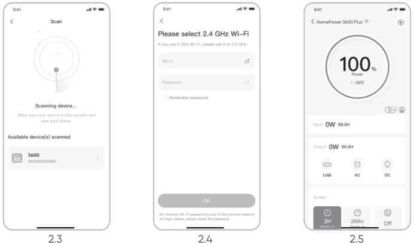

Las capturas de pantalla anteriores sirven solo de referencia.

<table class="manual-callout-table manual-callout-table"><tbody><tr><td class="manual-callout-label">PRECAUCIÓN</td><td class="manual-callout-body">
La aplicación Jackery solo puede conectarse a una estación de energía a la vez mediante Bluetooth. Regresar a la lista de dispositivos desconecta automáticamente Bluetooth. Toque la estación de energía en la lista nuevamente para reconectarse automáticamente.
</td></tr></tbody></table>

## 3. Desvincular el dispositivo

Haga clic en el botón «Configuración» situado en la esquina superior derecha de la interfaz principal del dispositivo para entrar en la página de configuración. Después, haga clic en el botón «Desvincular» situado en la parte inferior de la página para desvincular el dispositivo.

## 4. Notas

### 4.1 Para activar Wi-Fi y Bluetooth:

<ul><li>El wifi y el Bluetooth se encienden automáticamente al encender el dispositivo y se iluminan los iconos de wifi y Bluetooth de la pantalla;</li><li>Pulse el botón de energía USB y el botón de energía CA al mismo tiempo hasta que se enciendan los iconos de wifi y Bluetooth en la pantalla;</li></ul>

### 4.2 Para desactivar Wi-Fi y Bluetooth:

<ul><li>Pulse el botón de energía USB y el botón de energía CA al mismo tiempo hasta que se apaguen los iconos de wifi y Bluetooth en la pantalla;</li><li>El Wi-Fi y el Bluetooth se apagarán automáticamente si se conecta ningún dispositivo en 2 horas;</li></ul>

### 4.3 Para restablecer Wi-Fi y Bluetooth:

Pulsa el botón de encendido principal y el botón de energía USB al mismo tiempo durante 3 segundos para restablecer los ajustes de fábrica de Wi-Fi y Bluetooth y reiniciar el sistema. Se desvinculará la cuenta de la aplicación conectada.

# SISTEMA DE RESPALDO INTELIGENTE PARA EL HOGAR (AC ESS) N° de modelo: HB3600C-TS05A

<table class="manual-callout-table hb-source-warning-lockup"><tbody><tr><td class="manual-callout-label"><strong>ADVERTENCIA</strong></td><td class="manual-callout-body">
RIESGO DE DESCARGA ELÉCTRICA. ASEGÚRESE SIEMPRE DE QUE TODOS LOS EQUIPOS ELÉCTRICOS ESTÉN DESCONECTADOS DE FORMA SEGURA ANTES DE EMPEZAR A TRABAJAR.
</td></tr></tbody></table>

Para conectar el Jackery HomePower 3600 Pro Max al ATS, use el cable de entrada/salida de alimentación para conectarlo al puerto de expansión CA del HomePower 3600 Pro Max al puerto de entrada/salida CA del ATS. Para conectar el Jackery HomePower 3600 Pro Max al paquete de baterías, use el cable de expansión para conectar su puerto de expansión CC (A) al puerto de expansión CC (B) del paquete de baterías.

<figure class="hb-reference-figure hb-base-art-live-copy" data-component-id="HB-SPECIAL-REFERENCE-FIGURE" data-reference-id="ess_connection" data-source-fragment-sha256="a738982bea2a6e3a2a366e7ccc39b2ab4c8c5e253d3642256a74e6afbbacb2f4" data-web-base-art-ref="assets/ess_connection.png" data-web-presentation-mode="base-art-live-copy" data-web-replace-key="reference.ess-connection">

Cable de entrada/salida de alimentaciónCable de expansiónPara obtener instrucciones detalladas sobre la instalación y conexión, consulte los manuales de usuario del ATS y del paquete de baterías.

</figure>

<table class="manual-callout-table manual-callout-table"><tbody><tr><td class="manual-callout-label">PRECAUCIÓN</td><td class="manual-callout-body">
Posición de instalación del sistema de respaldo inteligente para el hogar (AC ESS)
<ul><li>Instalación en interiores.</li><li>El área debe ser completamente impermeable.</li><li>La pared debe ser plana y nivelada.</li><li>Rango de temperatura ambiente: -4 °F a 113 °F (-20 °C a 45 °C);</li><li>La temperatura y la humedad deben mantenerse en un nivel constante.</li><li>Instale en un lugar bien ventilado.</li><li>No instale en un área accesible para niños o mascotas.</li><li>El área de instalación debe evitar la luz solar directa.</li><li>No debe haber materiales inflamables o explosivos cerca del inversor y la batería.</li></ul></td></tr></tbody></table>

# ESPECIFICACIONES N° de modelo: JHP-3600C

<h2 aria-level="2" class="hb-spec-group" role="heading">INFORMACIÓN GENERAL</h2>

<figure aria-label="INFORMACIÓN GENERAL" class="hb-spec-table-composition"><table class="manual-table manual-spec-table hb-spec-table"><colgroup><col class="hb-spec-col-label"/><col class="hb-spec-col-value"/></colgroup><tbody><tr><th class="manual-spec-label hb-spec-label" scope="row">Nombre del producto</th><td class="manual-spec-value hb-spec-value">Jackery HomePower 3600 Pro Max</td></tr><tr><th class="manual-spec-label hb-spec-label" scope="row">N° de modelo</th><td class="manual-spec-value hb-spec-value">JHP-3600C</td></tr><tr><th class="manual-spec-label hb-spec-label" scope="row">Capacidad</th><td class="manual-spec-value hb-spec-value">80 Ah / 44,8 V DC (3584 Wh)</td></tr><tr><th class="manual-spec-label hb-spec-label" scope="row">Química Celular</th><td class="manual-spec-value hb-spec-value">LiFePO4</td></tr><tr><th class="manual-spec-label hb-spec-label" scope="row">Peso</th><td class="manual-spec-value hb-spec-value">73,85 libras/33,5 kg</td></tr><tr><th class="manual-spec-label hb-spec-label" scope="row">Dimensiones</th><td class="manual-spec-value hb-spec-value">14,76 × 10,83 × 17,72 pulgadas / 37,5×27,5×45,0 cm</td></tr><tr><th class="manual-spec-label hb-spec-label" scope="row">Ciclo de vida</th><td class="manual-spec-value hb-spec-value">6000 ciclos de carga hasta 70 % + de capacidad</td></tr><tr><th class="manual-spec-label hb-spec-label" scope="row">Courant et durée maximum du court-circuit</th><td class="manual-spec-value hb-spec-value">1520A, 2.56ms</td></tr><tr><th class="manual-spec-label hb-spec-label" scope="row">UPS</th><td class="manual-spec-value hb-spec-value">&lt;10 ms</td></tr><tr><th class="manual-spec-label hb-spec-label" scope="row">Topología de inversor</th><td class="manual-spec-value hb-spec-value">Aislada</td></tr><tr><th class="manual-spec-label hb-spec-label" scope="row">Factor de potencia</th><td class="manual-spec-value hb-spec-value">≥0,98</td></tr><tr><th class="manual-spec-label hb-spec-label" scope="row">Unidad entera</th><td class="manual-spec-value hb-spec-value">Tipo 1</td></tr></tbody></table></figure>

<h2 aria-level="2" class="hb-spec-group" role="heading">PUERTOS DE ENTRADA</h2>

<figure aria-label="PUERTOS DE ENTRADA" class="hb-spec-table-composition"><table class="manual-table manual-spec-table hb-spec-table"><colgroup><col class="hb-spec-col-label"/><col class="hb-spec-col-value"/></colgroup><tbody><tr><th class="manual-spec-label hb-spec-label" rowspan="2" scope="row">1 × Entrada CA</th><td class="manual-spec-value hb-spec-value">Modo de carga: 100 V-120 V~ 60 Hz, 15 A máx., 1800 W</td></tr><tr><td class="manual-spec-value hb-spec-value">Modo de derivación①: 100 V-120 V~ 60 Hz, 12 A máx., 1440 W</td></tr><tr><th class="manual-spec-label hb-spec-label" scope="row">2 × Puertos DC8020</th><td class="manual-spec-value hb-spec-value">12–16 V⎓8 A máx., Doble a 8 A máx. 16-60 V②⎓12A máx., Doble a 24 A / 1200 W máx.</td></tr></tbody></table></figure>

<h2 aria-level="2" class="hb-spec-group" role="heading">PUERTOS DE SALIDA</h2>

<figure aria-label="PUERTOS DE SALIDA" class="hb-spec-table-composition"><table class="manual-table manual-spec-table hb-spec-table"><colgroup><col class="hb-spec-col-label"/><col class="hb-spec-col-value"/></colgroup><tbody><tr><th class="manual-spec-label hb-spec-label" scope="row">2 × Salidas CA (NEMA 5-20R)</th><td class="manual-spec-value hb-spec-value">120 V~ 60 Hz, 16,7A máx., 2000 W por puerto, 4000W en total</td></tr><tr><th class="manual-spec-label hb-spec-label" scope="row">1 × Salidas CA (NEMA 14-50R)</th><td class="manual-spec-value hb-spec-value">240 V~60 Hz, 16,7A máx., 4000 W nominales, 8000W pico de sobretensión</td></tr><tr><th class="manual-spec-label hb-spec-label" scope="row">Salida total de CA③</th><td class="manual-spec-value hb-spec-value">4000 W nominales, 8000 W pico de sobretensión</td></tr><tr><th class="manual-spec-label hb-spec-label" rowspan="2" scope="row">Salida de CA en Modo de derivación①</th><td class="manual-spec-value hb-spec-value"><strong>Entrada de CA de 120 V:</strong> NEMA 5-20R: 100 V-120 V~ 60 Hz, 12 A máx., 1440 W por puerto, 1440W④ en total NEMA 14-50R: 240 V~ 60 Hz, 1440W④ máx.</td></tr><tr><td class="manual-spec-value hb-spec-value"><strong>Entrada de CA de 240 V:</strong> NEMA 5-20R: 100 V-120 V~ 60 Hz, 20 A máx., 2400 W por puerto, 4800W en total NEMA 14-50R: 240 V~ 60 Hz, 40 A máx., 9600 W máx.</td></tr><tr><th class="manual-spec-label hb-spec-label" scope="row">1 × Salida USB-C</th><td class="manual-spec-value hb-spec-value">100 W máx., 5 V⎓3 A, 9 V⎓3 A, 12 V⎓3 A, 15 V⎓3 A, 20 V⎓5 A</td></tr><tr><th class="manual-spec-label hb-spec-label" scope="row">1 × Salida USB-A</th><td class="manual-spec-value hb-spec-value">18 W máx., 5-6V⎓3A, 6-9V⎓2A, 9-12V⎓1.5A</td></tr></tbody></table></figure>

<h2 aria-level="2" class="hb-spec-group" role="heading">PUERTOS DE EXPANSIÓN</h2>

<figure aria-label="PUERTOS DE EXPANSIÓN" class="hb-spec-table-composition"><table class="manual-table manual-spec-table hb-spec-table"><colgroup><col class="hb-spec-col-label"/><col class="hb-spec-col-value"/></colgroup><tbody><tr><th class="manual-spec-label hb-spec-label" scope="row">1 × Puerto de expansión CA</th><td class="manual-spec-value hb-spec-value">240 V~60 Hz, 16,7 máx., 4000 W máx.</td></tr><tr><th class="manual-spec-label hb-spec-label" scope="row">1 × Puerto de expansión CC</th><td class="manual-spec-value hb-spec-value">36,4 V-50,4 V⎓126 A máx. (Entrada) 36,4 V-50,4 V⎓60 A máx. (Salida)</td></tr></tbody></table></figure>

<h2 aria-level="2" class="hb-spec-group" role="heading">ESPECIFICACIONES AMBIENTALES</h2>

<figure aria-label="ESPECIFICACIONES AMBIENTALES" class="hb-spec-table-composition"><table class="manual-table manual-spec-table hb-spec-table"><colgroup><col class="hb-spec-col-label"/><col class="hb-spec-col-value"/></colgroup><tbody><tr><th class="manual-spec-label hb-spec-label" scope="row">Temperatura de carga</th><td class="manual-spec-value hb-spec-value">-4 °F a 113 °F (-20 °C a 45 °C)</td></tr><tr><th class="manual-spec-label hb-spec-label" scope="row">Temperatura de descarga</th><td class="manual-spec-value hb-spec-value">-4 °F a 113 °F (-20 °C a 45 °C)</td></tr><tr><th class="manual-spec-label hb-spec-label" scope="row">Altitud</th><td class="manual-spec-value hb-spec-value">≤ 3000 m</td></tr></tbody></table></figure>

※ USB Type-C® y USB-C® son marcas registradas de USB Implementers Forum.

① El producto puede cargar la batería desde una toma de corriente CA o a través del ATS mientras suministra energía a través de los puertos de salida CA.

② Indica la tensión de funcionamiento (Vmp) permitida del panel solar.

③ Indica que dos o más puertos de salida CA trabajan en conjunto.

④ Cuando está conectado a cargas superiores a 1440 W bajo entrada de CA de 120 V, el producto toma energía de la batería para cumplir con el requerimiento de carga total de hasta 2880 W.

# Jackery Battery Pack 3600 SE VENDE POR SEPARADO

<h2 aria-level="2" class="hb-spec-group" role="heading">INFORMACIÓN GENERAL</h2>

<figure aria-label="INFORMACIÓN GENERAL" class="hb-spec-table-composition"><table class="manual-table manual-spec-table hb-spec-table"><colgroup><col class="hb-spec-col-label"/><col class="hb-spec-col-value"/></colgroup><tbody><tr><th class="manual-spec-label hb-spec-label" scope="row">Nombre del producto</th><td class="manual-spec-value hb-spec-value">Jackery Battery Pack 3600</td></tr><tr><th class="manual-spec-label hb-spec-label" scope="row">N° de modelo</th><td class="manual-spec-value hb-spec-value">JBP-3600 A</td></tr><tr><th class="manual-spec-label hb-spec-label" scope="row">Capacidad</th><td class="manual-spec-value hb-spec-value">80 Ah / 44,8 Vdc (3584 Wh)</td></tr><tr><th class="manual-spec-label hb-spec-label" scope="row">Química Celular</th><td class="manual-spec-value hb-spec-value">LiFePO4</td></tr><tr><th class="manual-spec-label hb-spec-label" scope="row">Peso</th><td class="manual-spec-value hb-spec-value">Aproximadamente 55,1 libras/25 kg</td></tr><tr><th class="manual-spec-label hb-spec-label" scope="row">Dimensiones</th><td class="manual-spec-value hb-spec-value">14,8 × 12,5 × 9,0 pulgadas / 37,5 × 31,7 × 22,9 cm</td></tr><tr><th class="manual-spec-label hb-spec-label" scope="row">Ciclo de vida</th><td class="manual-spec-value hb-spec-value">6000 ciclos de carga hasta 70 %+ de capacidad</td></tr></tbody></table></figure>

<h2 aria-level="2" class="hb-spec-group" role="heading">PUERTOS DE ENTRADA/SALIDA</h2>

<figure aria-label="PUERTOS DE ENTRADA/SALIDA" class="hb-spec-table-composition"><table class="manual-table manual-spec-table hb-spec-table"><colgroup><col class="hb-spec-col-label"/><col class="hb-spec-col-value"/></colgroup><tbody><tr><th class="manual-spec-label hb-spec-label" scope="row">Puerto de Expansión de CC (Entrada)</th><td class="manual-spec-value hb-spec-value">36,4 V-50,4 V⎓60 A máx.</td></tr><tr><th class="manual-spec-label hb-spec-label" scope="row">Puerto de Expansión de CC (Salida)</th><td class="manual-spec-value hb-spec-value">36,4 V-50,4 V⎓100 A máx.</td></tr><tr><th class="manual-spec-label hb-spec-label" scope="row">Maximum Short Circuit Current and Duration</th><td class="manual-spec-value hb-spec-value">1160A/860μs</td></tr></tbody></table></figure>

<h2 aria-level="2" class="hb-spec-group" role="heading">TEMPERATURA DE FUNCIONAMIENTO</h2>

<figure aria-label="TEMPERATURA DE FUNCIONAMIENTO" class="hb-spec-table-composition"><table class="manual-table manual-spec-table hb-spec-table"><colgroup><col class="hb-spec-col-label"/><col class="hb-spec-col-value"/></colgroup><tbody><tr><th class="manual-spec-label hb-spec-label" scope="row">Temperatura de carga</th><td class="manual-spec-value hb-spec-value">-4 °F a 113 °F / -20 °C a 45 °C</td></tr><tr><th class="manual-spec-label hb-spec-label" scope="row">Temperatura de descarga</th><td class="manual-spec-value hb-spec-value">-4 °F a 113 °F / -20 °C a 45 °C</td></tr></tbody></table></figure>

# Jackery Automatic Transfer Switch SE VENDE POR SEPARADO

<h2 aria-hidden="true" aria-level="2" class="hb-spec-group hb-source-hidden-heading" role="heading">Jackery Automatic Transfer Switch</h2>

<figure aria-label="Jackery Automatic Transfer Switch" class="hb-spec-table-composition"><table class="manual-table manual-spec-table hb-spec-table"><colgroup><col class="hb-spec-col-label"/><col class="hb-spec-col-value"/></colgroup><tbody><tr><th class="manual-spec-label hb-spec-label" scope="row">Nombre del producto</th><td class="manual-spec-value hb-spec-value">Jackery Automatic Transfer Switch</td></tr><tr><th class="manual-spec-label hb-spec-label" scope="row">N° de modelo</th><td class="manual-spec-value hb-spec-value">JA-TS05 A</td></tr><tr><th class="manual-spec-label hb-spec-label" scope="row">Tensión CA (Nominal)</th><td class="manual-spec-value hb-spec-value">120 V/240 V~60 Hz</td></tr><tr><th class="manual-spec-label hb-spec-label" scope="row">Tipo de Alimentación</th><td class="manual-spec-value hb-spec-value">Split-Phase</td></tr><tr><th class="manual-spec-label hb-spec-label" scope="row">Corriente de Entrada Máxima</th><td class="manual-spec-value hb-spec-value">Red de 100 A / Estación de Energía de 84 A</td></tr><tr><th class="manual-spec-label hb-spec-label" scope="row">Corriente de Salida Máxima</th><td class="manual-spec-value hb-spec-value">Carga Doméstica de 100 A / Estación de Energía de 33,4 A</td></tr><tr><th class="manual-spec-label hb-spec-label" scope="row">Corriente Máxima de Cortocircuito de Entrada</th><td class="manual-spec-value hb-spec-value">10KA</td></tr><tr><th class="manual-spec-label hb-spec-label" scope="row">Consumo en modo de espera</th><td class="manual-spec-value hb-spec-value">Cerca de 5 W</td></tr><tr><th class="manual-spec-label hb-spec-label" scope="row">Categoría de Sobretensión</th><td class="manual-spec-value hb-spec-value">IV</td></tr><tr><th class="manual-spec-label hb-spec-label" scope="row">UPS (SAI)</th><td class="manual-spec-value hb-spec-value">≤20 ms</td></tr><tr><th class="manual-spec-label hb-spec-label" scope="row">CONSEJOS</th><td class="manual-spec-value hb-spec-value">Caja de distribución: NEMA Tipo 3R Caja de enchufes: NEMA Tipo 1</td></tr><tr><th class="manual-spec-label hb-spec-label" scope="row">Grado de contaminación</th><td class="manual-spec-value hb-spec-value">III</td></tr><tr><th class="manual-spec-label hb-spec-label" scope="row">Circuito Principal</th><td class="manual-spec-value hb-spec-value">2 AWG (100 A)</td></tr><tr><th class="manual-spec-label hb-spec-label" scope="row">Circuito de carga</th><td class="manual-spec-value hb-spec-value">2 AWG (100 A)</td></tr><tr><th class="manual-spec-label hb-spec-label" scope="row">Comunicación</th><td class="manual-spec-value hb-spec-value">Wi-Fi y Bluetooth</td></tr><tr><th class="manual-spec-label hb-spec-label" scope="row">Dimensiones</th><td class="manual-spec-value hb-spec-value">27 × 14,4 × 5,7 pulgadas/ 68,5 × 36,5 × 14,4 cm</td></tr><tr><th class="manual-spec-label hb-spec-label" scope="row">Peso</th><td class="manual-spec-value hb-spec-value">Aproximadamente 23,1 libras/10,5 kg</td></tr><tr><th class="manual-spec-label hb-spec-label" scope="row">Temperatura de Funcionamiento</th><td class="manual-spec-value hb-spec-value">-4 °F a 122 °F / -20 °C a 50 °C</td></tr></tbody></table></figure>

## CONTENIDO DE LA CAJA

### Jackery HomePower 3600 Pro Max

<ul class="hb-package-grid"><li class="hb-package-item">

Jackery HomePower 3600 Pro Max
</li><li class="hb-package-item">

Cable de carga de CA
</li><li class="hb-package-item">

Bornera de tornillo
</li><li class="hb-package-item">

Documentos
</li></ul>

### Jackery Battery Pack 3600 — Se vende por separado

<ul class="hb-package-grid"><li class="hb-package-item">

Jackery Battery Pack 3600
</li><li class="hb-package-item">
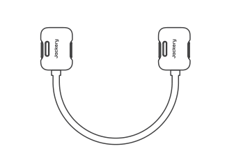

Cable de expansión
</li><li class="hb-package-item">

Manual de usuario
</li><li class="hb-package-availability">
Se vende por separado
</li></ul>

### Jackery Automatic Transfer Switch — Se vende por separado

<ul class="hb-package-grid hb-package-grid--five"><li class="hb-package-item">
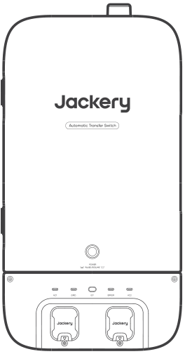

Jackery Automatic Transfer Switch
</li><li class="hb-package-item">
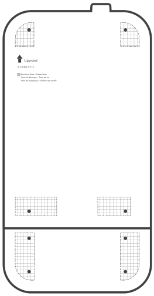

Plantilla de Marcado
</li><li class="hb-package-item">
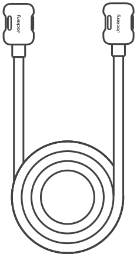

Cable de entrada/salida de alimentación
</li><li class="hb-package-item">

Cable neutro
</li><li class="hb-package-item">

Prensaestopa
</li><li class="hb-package-item">

Puente de conexión neutro-tierra (con tornillos)
</li><li class="hb-package-item">

Manual del usuario
</li><li class="hb-package-item">

Manual de instalación
</li><li class="hb-package-item">

Guía de inicio rápido
</li><li class="hb-package-availability">
Se vende por separado
</li></ul>

# CONTACTO

JACKERY INC.

5310 Bunche Dr., Fremont, CA 94538-8301

1-888-502-2236 (US)

hello@jackery.com

www.jackery.com

