

# Jackery HomePower 3600 Pro Max — Manuel d’utilisation

## IMPORTANT

Félicitations pour votre nouveau Jackery HomePower 3600 Pro Max. Veuillez lire attentivement ce manuel avant d'utiliser le produit, en particulier les précautions à prendre pour garantir une utilisation correcte du produit. Conservez ce manuel dans un endroit accessible pour pouvoir vous y référer ultérieurement.

Conformément aux lois et réglementations en vigueur, le droit d'interprétation final de ce document et de tous les documents associés à ce produit appartient à l'entreprise. Bien que tous les efforts aient été déployés pour garantir l'exactitude de ce manuel, Jackery Inc. n'assume aucune responsabilité pour les erreurs qui pourraient y figurer.

Veuillez noter qu'aucune autre notification ne sera faite en cas de mise à jour, de révision ou de résiliation. Pour la dernière version des manuels du produit, consultez support.jackery.com.

* Les chiffres sont donnés à titre indicatif uniquement. Veuillez vous référer au produit réel.

# INFORMATIONS DE SÉCURITÉ IMPORTANTES

<figure class="hb-symbol-signal-composition hb-safety-instruction"><table class="manual-callout-table manual-callout-table hb-symbol-signal-table"><tbody><tr><td class="manual-callout-label hb-symbol-signal-label-cell"><strong>AVERTISSEMENT</strong></td><td class="manual-callout-body hb-symbol-signal-meaning-cell">
INSTRUCTIONS CONCERNANT LES RISQUES D’INCENDIE, DE CHOC ÉLECTRIQUE OU DE BLESSURES
</td></tr></tbody></table></figure>

<table class="manual-two-col-table"><tbody><tr><td>
Respectez toujours les précautions de base lors de l’utilisation de ce produit.
<ul><li>Lisez toutes les instructions avant d’utiliser le produit.</li><li>Ne laissez pas les enfants jouer avec du produit. Une surveillance étroite est nécessaire lorsque le produit est utilisé à proximité d’enfants.</li><li>Évitez de placer les mains ou les doigts à l’intérieur du produit.</li><li>Arrêtez immédiatement d’utiliser le produit s’il a été endommagé physiquement ou modifié. Une mauvaise utilisation peut entraîner un comportement imprévisible, un incendie, une explosion ou des blessures.</li><li>Si vous constatez une surchauffe, une odeur inhabituelle, de la fumée, des fuites ou des brûlures, cessez immédiatement l’utilisation et contactez le revendeur ou notre service client.</li><li>Ne tentez jamais d’ouvrir, de réparer ou de modifier le produit. Toute altération ou réassemblage peut entraîner un choc électrique, un incendie ou des dommages à la batterie.</li></ul></td><td><ul><li>Soyez conscient que le liquide éjecté peut causer une irritation ou des brûlures. Une mauvaise utilisation peut provoquer des fuites. Évitez tout contact direct. En cas de contact avec les yeux, consultez immédiatement un médecin. En cas de contact avec la peau, rincez abondamment à l’eau claire et consultez un professionnel de santé sans tarder.</li><li>N’exposez pas le produit au feu ni à des températures excessives. Une température supérieure à 130 °C peut entraîner une explosion.</li><li>L’utilisation de pièces non recommandées ou non fournies peut entraîner un risque d’incendie, de choc électrique ou de blessures.</li><li>Ne laissez jamais la batterie en charge sans surveillance pendant de longues périodes. Surveillez toujours la charge pour assurer une utilisation sûre.</li><li>Pour réduire le risque de choc électrique, débranchez le produit de toute source d’alimentation avant d’effectuer un entretien technique ou un dépannage.</li></ul></td></tr></tbody></table>

## INSTRUCTIONS D’UTILISATION

<table class="manual-two-col-table"><tbody><tr><td>
CONSERVEZ CES INSTRUCTIONS
<ul><li>Cessez immédiatement d’utiliser le produit s’il présente des signes de dommage. Arrêtez l’utilisation et contactez l’assistance clientèle pour obtenir de l’aide.</li><li>Ne rechargez pas la batterie dans un environnement extrêmement chaud ou froid, et respectez strictement les plages de températures d’utilisation spécifiées du produit :<ul><li>Température de charge : -4°F à 113°F (-20 °C à 45 °C)</li><li>Température de décharge : -4°F à 113°F (-20 °C à 45 °C)</li></ul></li><li>Pour garantir une bonne circulation de l’air, gardez les orifices de ventilation du produit dégagés. Utilisez-le dans un endroit bien aéré, frais et sec pour éviter toute surchauffe.<ul><li>La charge dans un environnement humide ou mal ventilé peut présenter des risques pour la sécurité.</li><li>L’eau peut provoquer des courts-circuits ou endommager le chargeur, entraînant des risques.</li></ul></li><li>Débranchez le cordon d’alimentation de la prise secteur pendant un orage.</li><li>Éteignez immédiatement le produit à l’aide du bouton d’alimentation s’il est tombé, a subi un choc ou des vibrations.</li></ul></td><td><ul><li>Assurez-vous que les appareils sont éteints avant de les connecter au produit.</li><li>Ne rechargez pas le produit avec un câble ou une fiche endommagé(e).</li><li>N’utilisez pas le produit pour charger un appareil équipé d’un câble ou d’une fiche endommagé(e).</li><li>Débranchez toujours le cordon de charge en tirant sur la fiche, jamais sur le câble, afin d’éviter tout dommage.</li><li>Veillez à ce que le produit soit correctement fixé lors du transport dans un véhicule en mouvement.</li><li>NE placez PAS l’appareil à l’envers ou sur le côté pendant l’utilisation ou le stockage.</li><li>NE placez PAS le produit sur le sol ou à une hauteur inférieure à 457 mm (18 pouces) lors de son utilisation dans un atelier ou un centre de réparation.</li><li>N’utilisez PAS les accessoires du produit avec d’autres appareils ou équipements.</li><li>Le temps de charge solaire dépend des conditions météorologiques. Placez le panneau solaire dans un endroit exposé au soleil direct autant que possible.</li></ul></td></tr></tbody></table>

## INSTRUCTION DE MISE À LA TERRE

Ce produit doit être mis à la terre. En cas de dysfonctionnement ou de panne, la mise à la terre fournit un chemin de moindre résistance au courant électrique afin de réduire le risque de choc électrique. Ce produit est équipé d'un cordon avec un conducteur de mise à la terre et d'une fiche de mise à la terre. La fiche doit être branchée dans une prise correctement installée et mise à la terre conformément à tous les codes et règlements locaux.

<table class="manual-callout-table manual-callout-table"><tbody><tr><td class="manual-callout-label">AVERTISSEMENT</td><td class="manual-callout-body">
Une connexion incorrecte du conducteur de mise à la terre peut entraîner un risque de choc électrique. Consultez un électricien qualifié si vous avez des doutes quant à la mise à la terre correcte du produit. Ne modifiez pas la fiche fournie avec le produit – si elle ne correspond pas à la prise, faites installer une prise appropriée par un électricien qualifié.
</td></tr></tbody></table>

<table class="manual-callout-table manual-callout-table"><tbody><tr><td class="manual-callout-label">AVERTISSEMENT</td><td class="manual-callout-body">
Cet appareil est destiné à un usage intérieur uniquement (veuillez placer cet appareil dans un environnement intérieur similaire lors de son utilisation à l'extérieur, par exemple dans des VR résidentiels, des tentes, des chalets, etc.). ※ Cet appareil n'est pas étanche ni résistant à la poussière. Éloignez-le de la pluie et des environnements humides pendant son utilisation.
</td></tr></tbody></table>

## INSTRUCTIONS D’ENTRETIEN PAR L’UTILISATEUR

Au cours du cycle des produits de stockage d'énergie, une certaine dégradation de la capacité et de l'énergie se produira. À mesure que le nombre de cycles d'utilisation augmente et que la durée de stockage s'allonge, cette dégradation s'intensifiera progressivement, ce qui est un phénomène normal conforme au modèle de vieillissement naturel des cellules de batterie.

# SIGNIFICATION DES SYMBOLES

<figure aria-label="SIGNIFICATION DES SYMBOLES" class="hb-symbol-signal-composition" data-component-id="HB-TABLE-SYMBOL-SIGNAL"><table class="hb-symbol-signal-table"><colgroup><col class="hb-symbol-signal-col-label"/><col class="hb-symbol-signal-col-meaning"/></colgroup><thead><tr><th class="hb-symbol-signal-label-heading" scope="col">
Symbole
</th><th class="hb-symbol-signal-meaning-heading" scope="col">
Signification
</th></tr></thead><tbody><tr><td class="hb-symbol-signal-label-cell">⚠AVERTISSEMENT</td><td class="hb-symbol-signal-meaning-cell">
Pratiques dangereuses pouvant entraîner des blessures graves, la mort et/ou des dommages matériels.
</td></tr><tr><td class="hb-symbol-signal-label-cell">⚠ATTENTION</td><td class="hb-symbol-signal-meaning-cell">
Pratiques dangereuses pouvant entraîner des blessures corporelles et/ou des dommages matériels.
</td></tr><tr><td class="hb-symbol-signal-label-cell">REMARQUE</td><td class="hb-symbol-signal-meaning-cell">
Pratiques dangereuses pouvant entraîner des dommages à l'équipement, une perte de données, une détérioration des performances ou des résultats inattendus.
</td></tr><tr><td class="hb-symbol-signal-label-cell">CONSEILS</td><td class="hb-symbol-signal-meaning-cell">
Complémente les informations importantes ou les conseils d'utilisation dans le texte.
</td></tr></tbody></table></figure>

<figure aria-label="Symboles de sécurité" class="hb-symbol-pair-composition" data-component-id="HB-TABLE-SYMBOL-ICON">

<table class="hb-symbol-panel-table"><colgroup><col class="hb-symbol-col-icon"/><col class="hb-symbol-col-meaning"/></colgroup><thead><tr><th class="hb-symbol-icon-heading" scope="col">Symbole</th><th class="hb-symbol-meaning-heading" scope="col">Signification</th></tr></thead><tbody><tr><td class="hb-symbol-icon"></td><td class="hb-symbol-meaning">Mlise en garde! Le non-respect des messages d'avertissement peut entraîner des blessures.</td></tr><tr><td class="hb-symbol-icon"></td><td class="hb-symbol-meaning">Lire le manuel de l'opérateur</td></tr><tr><td class="hb-symbol-icon"></td><td class="hb-symbol-meaning">Risque de choc électrique</td></tr><tr><td class="hb-symbol-icon"></td><td class="hb-symbol-meaning">Chargement de la batterie</td></tr><tr><td class="hb-symbol-icon"></td><td class="hb-symbol-meaning">Matière explosive</td></tr><tr><td class="hb-symbol-icon"></td><td class="hb-symbol-meaning">Objet lourd</td></tr></tbody></table>

<table class="hb-symbol-panel-table"><colgroup><col class="hb-symbol-col-icon"/><col class="hb-symbol-col-meaning"/></colgroup><thead><tr><th class="hb-symbol-icon-heading" scope="col">Symbole</th><th class="hb-symbol-meaning-heading" scope="col">Signification</th></tr></thead><tbody><tr><td class="hb-symbol-icon"></td><td class="hb-symbol-meaning">Ne démontez pas le produit.</td></tr><tr><td class="hb-symbol-icon"></td><td class="hb-symbol-meaning">Ne pas fumer ni utiliser de flamme nue</td></tr><tr><td class="hb-symbol-icon"></td><td class="hb-symbol-meaning">Les enfants ne sont pas admis</td></tr><tr><td class="hb-symbol-icon"></td><td class="hb-symbol-meaning">Ce symbole indique que le produit contient une batterie lithium-ion (Li-ion), qui doit être éliminée ou recyclée de manière appropriée.</td></tr><tr><td class="hb-symbol-icon"></td><td class="hb-symbol-meaning">Ce symbole indique que le produit ne doit pas être jeté avec les ordures ménagères. Il doit être apporté à un point de collecte désigné pour un recyclage approprié. Une élimination et un recyclage corrects contribuent à la protection de l’environnement. Pour plus d’informations, veuillez contacter votre autorité locale, le service de gestion des déchets ou le revendeur du produit.</td></tr></tbody></table>

</figure>

# FCC

<figure aria-label="FCC" class="hb-fcc-composition" data-component-id="HB-SPECIAL-FCC">

Cet appareil est conforme à la partie 15 du règlement de la FCC. Le fonctionnement dépend des deux conditions suivantes : (1) Cet appareil ne doit pas provoquer d'interférences dangereuses, et (2) Cet appareil doit accepter toute interférence reçue, y compris les interférences pouvant provoquer un fonctionnement non désiré.

<strong>REMARQUE :</strong> Cet équipement a été testé et déclaré conforme aux limites concernant les appareils numériques de classe B, conformément à la partie 15 du règlement de la FCC. Ces limites sont conçues pour offrir une protection raisonnable contre les interférences dangereuses dans le cadre d'une installation résidentielle. Cet équipement génère, utilise et émet des ondes radios qui peuvent, si cet équipement n'est pas installé et utilisé conformément aux instructions, perturber les communications radios. Toutefois, il n'y a aucune garantie qu'aucune interférence ne se produise lors d'une installation particulière. Si cet équipement trouble la réception de la radio ou de la télévision, ce qui peut être déterminé en éteignant et en allumant cet équipement, l'utilisateur est encouragé à tenter de corriger ces interférences en essayant une ou plusieurs des mesures suivantes :

<ul class="simple"><li>
Réorientez ou déplacez l'antenne de réception.
</li><li>
Éloignez l'équipement du récepteur.
</li><li>
Connectez l'équipement à une prise d'un autre circuit que celui auquel le récepteur est connecté.
</li><li>
Consultez le revendeur ou bien demandez de l'aide à un technicien de radio/télévision expérimenté.
</li></ul>
<strong>MODIFICATION :</strong> Tout changement ou modification non expressément approuvé par le titulaire de cet appareil pourrait annuler l'autorisation de l'utilisateur à utiliser l'appareil.

</figure>

# CONTENU DE LA BOÎTE

<figure aria-label="CONTENU DE LA BOÎTE" class="hb-inbox-composition" data-card-count="4" data-component-id="HB-SPECIAL-INBOX" data-inbox-variant="responsive-card-grid"><ol class="hb-inbox-grid"><li class="hb-inbox-card" data-item-number="1">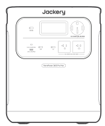

Jackery HomePower 3600 Pro Max

</li><li class="hb-inbox-card" data-item-number="2">

Câble de charge CA

</li><li class="hb-inbox-card" data-item-number="3">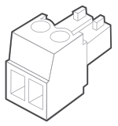

Bornier à vis

</li><li class="hb-inbox-card" data-item-number="4">

Documents

</li></ol>

CONSEILS

Le câble de chargement pour voiture n’est pas inclus, mais peut être acheté séparément sur notre site Web. Pour obtenir de l’aide, veuillez contacter le service à la clientèle de Jackery.

</figure>

# APERÇU DU PRODUIT

## VUE DE FACE

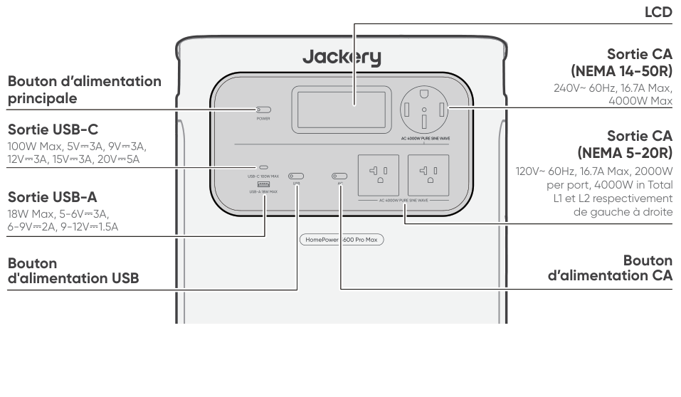

## VUE LATÉRALE DROITE

# AFFICHAGE LCD

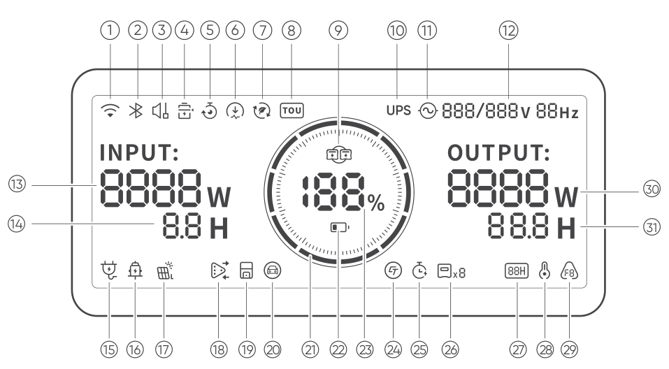

<figure aria-label="AFFICHAGE LCD" class="hb-lcd-table-composition" data-component-id="HB-TABLE-LCD-ICON" tabindex="0"><table class="hb-lcd-icon-table"><colgroup><col class="hb-lcd-col-number"/><col class="hb-lcd-col-icon"/><col class="hb-lcd-col-name"/><col class="hb-lcd-col-description"/></colgroup><tbody><tr><td class="hb-lcd-number">
1
</td><td class="hb-lcd-icon"></td><td class="hb-lcd-name">
Wi-Fi
</td><td class="hb-lcd-description">
<strong>Allumé :</strong> Wi-Fi connecté. <strong>Clignotant :</strong> Prêt à se connecter au Wi-Fi. <strong>Éteint :</strong> Wi-Fi déconnecté.
</td></tr><tr><td class="hb-lcd-number">
2
</td><td class="hb-lcd-icon"></td><td class="hb-lcd-name">
Bluetooth
</td><td class="hb-lcd-description">
<strong>Allumé :</strong> Bluetooth connecté. <strong>Clignotant :</strong> Prêt à se connecter au Bluetooth. <strong>Éteint :</strong> Bluetooth déconnecté.
</td></tr><tr><td class="hb-lcd-number">
3
</td><td class="hb-lcd-icon"></td><td class="hb-lcd-name">
Mode de Charge Silencieuse
</td><td class="hb-lcd-description">
<strong>Allumé :</strong> Le bruit pendant la charge est considérablement réduit, tandis que la puissance de charge est diminuée et la vitesse de charge ralentit. <strong>Éteint :</strong> Le mode de charge silencieuse est désactivé. Activez/désactivez cette fonction dans l'application Jackery. Le réglage est conservé lorsque l’appareil est mis hors tension.
</td></tr><tr><td class="hb-lcd-number">
4
</td><td class="hb-lcd-icon"></td><td class="hb-lcd-name">
Mode d’Économie de Batterie
</td><td class="hb-lcd-description">
<strong>Allumé :</strong> Limite la capacité maximale utilisable de la batterie pour prolonger sa durée de vie. <strong>Éteint :</strong> Le mode d'économie de batterie est désactivé. Activez/désactivez cette fonction dans l'application Jackery. Le réglage est conservé lorsque l’appareil est mis hors tension. <strong>Note 1:</strong> Cette fonction n'est pas disponible lorsque le produit est connecté à des blocs-batteries. <strong>Note 2 :</strong> Lorsque cette fonction est activée, le produit effectue occasionnellement un cycle de charge-décharge complet pour calibrer le SOC.
</td></tr><tr><td class="hb-lcd-number">
5
</td><td class="hb-lcd-icon"></td><td class="hb-lcd-name">
Plan de Charge
</td><td class="hb-lcd-description">
Personnalisez le temps de charge du Jackery HomePower 3600 Plus. Adapté aux situations avec des tarifs d’électricité variables, il permet d’établir des plans de charge en fonction des heures pleines et creuses, afin de réduire les coûts d’électricité. Veuillez configurer cette fonction dans l’application Jackery. Le réglage est conservé lorsque l’appareil est mis hors tension.
</td></tr><tr><td class="hb-lcd-number">
6
</td><td class="hb-lcd-icon"></td><td class="hb-lcd-name">
Limite de puissance de charge
</td><td class="hb-lcd-description">
<strong>Allumé :</strong> La limite de puissance de charge est activée dans l’application Jackery. <strong>Éteint :</strong> La limite de puissance de charge est désactivée dans l’application Jackery. Le réglage est conservé lorsque l’appareil est mis hors tension.
</td></tr><tr><td class="hb-lcd-number">
7
</td><td class="hb-lcd-icon"></td><td class="hb-lcd-name">
Mode Autonome
</td><td class="hb-lcd-description">
Maximise l’utilisation de l’énergie solaire et réduit la dépendance à l’électricité du réseau en donnant la priorité à l’énergie solaire stockée, ce qui diminue les coûts d’électricité. La station d’énergie doit être connectée simultanément aux panneaux solaires et au réseau, la puissance de charge étant limitée par la puissance de dérivation. Activez/désactivez cette fonction dans l’application Jackery. Le réglage est conservé lorsque l’appareil est mis hors tension.
</td></tr><tr><td class="hb-lcd-number">
8
</td><td class="hb-lcd-icon"></td><td class="hb-lcd-name">
Mode TOU
</td><td class="hb-lcd-description">
<strong>Allumé :</strong> Le mode TOU est activé (SOC de secours par défaut : 60 %). Pendant les heures de pointe, le produit privilégie la décharge de la batterie afin de réduire les coûts liés à la consommation en période de pointe, lorsque l’énergie stockée dépasse le SOC de réserve. Pendant les heures creuses, le système recharge la batterie à partir du réseau afin de réaliser l’écrêtage des pics et le remplissage des creux. <strong>Éteint :</strong> Le mode TOU est désactivé. L’appareil ne suit pas la stratégie TOU (heures pleines / heures creuses) et fonctionne selon la logique d’alimentation et de charge par défaut. Activez/désactivez cette fonction dans l’application Jackery. Le réglage est conservé lorsque l’appareil est mis hors tension.
</td></tr><tr><td class="hb-lcd-number">
9
</td><td class="hb-lcd-icon"></td><td class="hb-lcd-name">
Parallèle
</td><td class="hb-lcd-description">
<strong>Allumé :</strong> La connexion parallèle est établie avec succès. <strong>Clignotant :</strong> La connexion parallèle est en cours de configuration. <strong>Éteint :</strong> La connexion parallèle n’est pas établie.
</td></tr><tr><td class="hb-lcd-number">
10
</td><td class="hb-lcd-icon"></td><td class="hb-lcd-name">
UPS (ASI)
</td><td class="hb-lcd-description">
L’indicateur UPS reste allumé lorsque l’alimentation du réseau est disponible et s’éteint en cas de coupure du réseau.
</td></tr><tr><td class="hb-lcd-number">
11
</td><td class="hb-lcd-icon"></td><td class="hb-lcd-name">
Indicateur d’alimentation CA
</td><td class="hb-lcd-description">
La sortie CA (onde sinusoïdale pure) est activée.
</td></tr><tr><td class="hb-lcd-number">
12
</td><td class="hb-lcd-icon"></td><td class="hb-lcd-name">
Tension et fréquence de sortie
</td><td class="hb-lcd-description">
Affiche la tension et la fréquence de sortie lorsque la sortie CA est activée via le bouton d’alimentation CA ou lorsque le port d’extension CA fournit de l’énergie. • 120 V : Affiché lorsque le produit se recharge à partir de l’entrée CA 120 V tout en fournissant simultanément de l’énergie via les ports de sortie CA. • 120/240 V : Affiché lorsque la sortie CA 240 V est active, ou lorsque le produit est connecté à un commutateur de transfert et fonctionne en mode bypass.
</td></tr><tr><td class="hb-lcd-number">
13
</td><td class="hb-lcd-icon"></td><td class="hb-lcd-name">
Puissance d’Entrée
</td><td class="hb-lcd-description">
Affiche la puissance d’entrée CA utilisée pour la charge de la batterie en watts.
</td></tr><tr><td class="hb-lcd-number">
14
</td><td class="hb-lcd-icon"></td><td class="hb-lcd-name">
Temps de Charge Restant
</td><td class="hb-lcd-description">
Affiche le temps de charge restant.
</td></tr><tr><td class="hb-lcd-number">
15
</td><td class="hb-lcd-icon"></td><td class="hb-lcd-name">
Indicateur de Charge sur Prise Murale CA
</td><td class="hb-lcd-description">
Le produit est chargé via l’entrée CA en utilisant l’énergie du réseau.
</td></tr><tr><td class="hb-lcd-number">
16
</td><td class="hb-lcd-icon"></td><td class="hb-lcd-name">
Indicateur de Charge Voiture
</td><td class="hb-lcd-description">
Le produit est chargé via l’entrée CC (DC8020) en utilisant du CC 12 V (charge via voiture).
</td></tr><tr><td class="hb-lcd-number">
17
</td><td class="hb-lcd-icon"></td><td class="hb-lcd-name">
Indicateur de Charge Solaire
</td><td class="hb-lcd-description">
Le produit est chargé via l’entrée CC (DC8020) à l’aide de panneaux solaires.
</td></tr><tr><td class="hb-lcd-number" rowspan="2">
18
</td><td class="hb-lcd-icon"></td><td class="hb-lcd-name">
Témoin d’expansion CA (En charge)
</td><td class="hb-lcd-description">
Le produit peut être chargé à partir du réseau via un commutateur de transfert automatique Jackery (ATS).
</td></tr><tr><td class="hb-lcd-icon"></td><td class="hb-lcd-name">
Témoin d’expansion CA (En décharge)
</td><td class="hb-lcd-description">
Le produit alimente les charges de votre maison via le commutateur de transfert connecté (ATS).
</td></tr><tr><td class="hb-lcd-number">
19
</td><td class="hb-lcd-icon"></td><td class="hb-lcd-name">
Indicateur de commutateur de transfert
</td><td class="hb-lcd-description">
<strong>Allumé :</strong> Le produit est correctement connecté à un commutateur de transfert (ATS). <strong>Éteint :</strong> Le produit n’est pas connecté à un commutateur de transfert (ATS).
</td></tr><tr><td class="hb-lcd-number">
20
</td><td class="hb-lcd-icon"></td><td class="hb-lcd-name">
Recharge de VE
</td><td class="hb-lcd-description">
L’adaptateur de mise à la terre est connecté avec succès au produit.
</td></tr><tr><td class="hb-lcd-number">
21
</td><td class="hb-lcd-icon"></td><td class="hb-lcd-name">
Indicateur de Puissance de la Batterie
</td><td class="hb-lcd-description">
Lorsque le produit est en charge, le cercle orange autour du pourcentage de batterie s’allume en séquence. Lorsqu’il charge d’autres appareils, le cercle orange reste allumé.
</td></tr><tr><td class="hb-lcd-number">
22
</td><td class="hb-lcd-icon"></td><td class="hb-lcd-name">
Indicateur de Batterie Faible
</td><td class="hb-lcd-description">
<strong>Allumé :</strong> Le niveau de la batterie est inférieur à 20 %. <strong>Clignotant :</strong> Le niveau de la batterie est inférieur à 5 %. <strong>Éteint :</strong> Le niveau de la batterie n’est pas inférieur à 20 % ou le produit est en charge.
</td></tr><tr><td class="hb-lcd-number">
23
</td><td class="hb-lcd-icon"></td><td class="hb-lcd-name">
Pourcentage de Batterie Restant
</td><td class="hb-lcd-description">
Affiche le pourcentage de batterie restant.
</td></tr><tr><td class="hb-lcd-number">
24
</td><td class="hb-lcd-icon"></td><td class="hb-lcd-name">
Indicateur de compteur intelligent
</td><td class="hb-lcd-description">
<strong>Allumé :</strong> Un compteur intelligent est en ligne. <strong>Éteint :</strong> Aucun compteur intelligent n’est ajouté au système, ou le compteur intelligent est hors ligne.
</td></tr><tr><td class="hb-lcd-number">
25
</td><td class="hb-lcd-icon"></td><td class="hb-lcd-name">
Minuterie de décharge
</td><td class="hb-lcd-description">
<strong>Allumé :</strong> une minuterie de décharge est définie. <strong>Éteint :</strong> aucune minuterie de décharge n’est définie. Activez/désactivez cette fonction dans l’application Jackery. Le réglage n’est pas conservé lorsque l’appareil est mis hors tension.
</td></tr><tr><td class="hb-lcd-number">
26
</td><td class="hb-lcd-icon"></td><td class="hb-lcd-name">
Batteries connectées
</td><td class="hb-lcd-description">
Indique que le produit est connecté au nombre spécifié de blocs-batterie 3600.
</td></tr><tr><td class="hb-lcd-number">
27
</td><td class="hb-lcd-icon"></td><td class="hb-lcd-name">
Mode d’Économie d’Énergie
</td><td class="hb-lcd-description">
<strong>Allumé :</strong> Mode d’économie d’énergie activé. <strong>Éteint :</strong> Mode d’économie d’énergie désactivé.
</td></tr><tr><td class="hb-lcd-number" rowspan="2">
28
</td><td class="hb-lcd-icon"></td><td class="hb-lcd-name">
Indicateur de Température Élevée
</td><td class="hb-lcd-description">
La protection contre les températures élevées est déclenchée. Le produit peut cesser de fonctionner jusqu’à ce que sa température revienne dans la plage de fonctionnement normale.
</td></tr><tr><td class="hb-lcd-icon"></td><td class="hb-lcd-name">
Indicateur de Basse Température
</td><td class="hb-lcd-description">
La protection contre les basses températures est déclenchée. Le produit peut cesser de fonctionner jusqu’à ce que sa température revienne dans la plage de fonctionnement normale.
</td></tr><tr><td class="hb-lcd-number">
29
</td><td class="hb-lcd-icon"></td><td class="hb-lcd-name">
Code d’erreur
</td><td class="hb-lcd-description">
Une erreur produit s’est produite. Veuillez consulter la section « Dépannage » pour plus de détails.
</td></tr><tr><td class="hb-lcd-number">
30
</td><td class="hb-lcd-icon"></td><td class="hb-lcd-name">
Puissance de Sortie
</td><td class="hb-lcd-description">
Affiche la puissance de sortie totale (CA + USB) en watts. Affiche OFF pendant 1 seconde avant l’arrêt du produit.
</td></tr><tr><td class="hb-lcd-number">
31
</td><td class="hb-lcd-icon"></td><td class="hb-lcd-name">
Temps de Décharge Restant
</td><td class="hb-lcd-description">
Affiche le temps de décharge restant.
</td></tr></tbody></table></figure>

# FONCTIONNEMENT

## MARCHE/ARRÊT

<figure class="hb-operation-figure hb-operation-layout-status-right hb-base-art-live-copy" data-component-id="HB-SPECIAL-OPERATION" data-operation-id="main-power" data-source-fragment-sha256="a6327185830d6d31f89c2de32daa5f2714831b29e39072186bb32f5ca99ed55a" data-web-base-art-ref="assets/power_framefree.png" data-web-presentation-mode="base-art-live-copy">

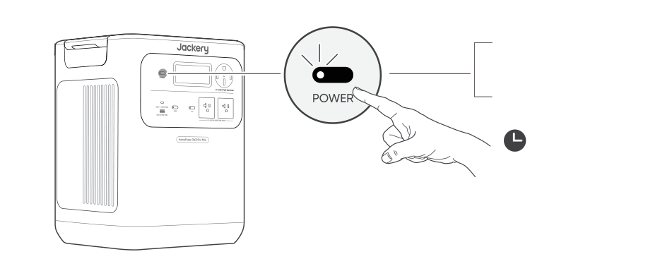
3s

<strong>Allumé</strong>

Appuyez une fois

<strong>Éteint</strong>

Appuyez et maintenez pendant 3 secondes

<strong>Temps de veille par défaut : 2 heures</strong>

Le produit s’éteindra automatiquement après 2 heures d’inactivité, sans charge ni décharge. 

*Le temps de veille peut être réglé dans l'application Jackery.

Lorsque le mode Économie d’énergie est active, le produit s’éteint automatiquement après 12 heures si le bouton d’alimentation CA ou USB est active, mais que le produit n’est ni en charge ni en décharge.

</figure>

## SORTIE USB MARCHE/ARRÊT

<figure class="hb-operation-figure hb-operation-layout-status-right hb-base-art-live-copy" data-component-id="HB-SPECIAL-OPERATION" data-operation-id="dc-usb-output" data-source-fragment-sha256="a34467708aeb2e85b24563fe40b8a47c3651ce8830d40010556e589ac9adaf2d" data-web-base-art-ref="assets/usb_framefree.png" data-web-presentation-mode="base-art-live-copy">

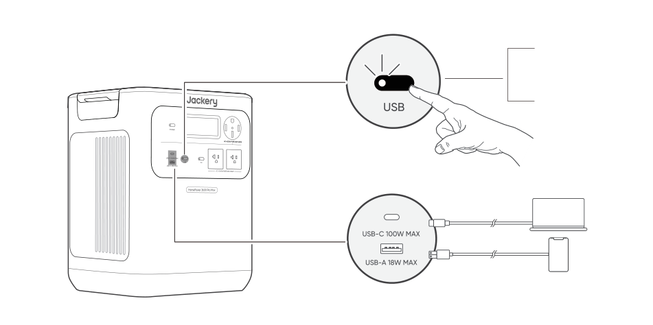

Prérequis : Le produit est allumé.

<strong>Allumé</strong>

Appuyez une fois

<strong>Éteint</strong>

Appuyez une fois

</figure>

<table class="manual-callout-table manual-callout-table"><tbody><tr><td class="manual-callout-label">ATTENTION</td><td class="manual-callout-body"><ul><li>Le port USB-C 100 W MAX est un port de sortie haute puissance conforme à la norme USB-PD Power Source 3 (PS3). Si l’appareil ou l’accessoire connecté ne répond pas aux exigences de sécurité, il peut exister un risque d’incendie. Avant d’utiliser ces ports, assurez-vous que l’appareil ou l’accessoire connecté est doté d’une protection contre les incendies.</li><li>Connectez uniquement le Jackery HomePower 3600 Pro Max à des appareils ou accessoires conformes aux clauses 6.3, 6.4 et 6.5 de la norme IEC/EN/UL 62368-1 (ou à d’autres normes équivalentes).</li><li>Pour obtenir la puissance de sortie maximale, utilisez le câble USB-C vers USB-C 5 A (20 V CC/5 A, 100 W).</li></ul></td></tr></tbody></table>

## SORTIE CA MARCHE/ARRÊT

<figure class="hb-operation-figure hb-operation-layout-status-right hb-base-art-live-copy" data-component-id="HB-SPECIAL-OPERATION" data-operation-id="ac-output" data-source-fragment-sha256="b1a1e858d82036320762bc940b97aa611078bc86c1e4d8e755dd6648c984b00a" data-web-base-art-ref="assets/ac_framefree.png" data-web-presentation-mode="base-art-live-copy">

Prérequis : Le produit est allumé.

<strong>Allumé</strong>

Appuyez une fois

<strong>Éteint</strong>

Appuyez une fois

</figure>

## MODE D’ÉCONOMIE D’ÉNERGIE

<figure class="hb-operation-figure hb-operation-layout-status-right hb-base-art-live-copy" data-component-id="HB-SPECIAL-OPERATION" data-operation-id="energy-saving" data-source-fragment-sha256="200c2d508051e5c5a80f16495472205b377a31c73a2178a657292ddbb8143e0b" data-web-base-art-ref="assets/energy_framefree.png" data-web-presentation-mode="base-art-live-copy">

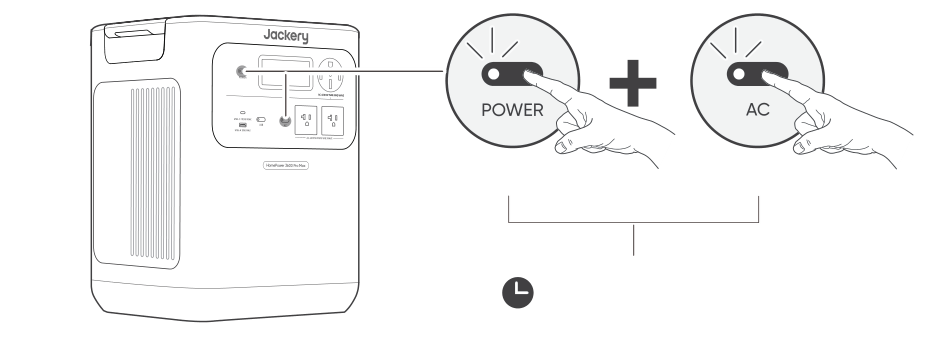
3s

Bouton d’alimentation principal

Bouton d’alimentation CA

<strong>Allumé/Éteint</strong> 3s Appuyez et maintenez pendant 3 secondes

Pour éviter une consommation inutile de la batterie due à l’oubli de désactiver la sortie, le produit active par défaut le Mode d’Économie d’Énergie. Lorsque la sortie CA ou USB est activée, l’icône du mode Économie d’énergie s’affichera sur l’écran LCD. Si aucun appareil n’est connecté ou si la consommation de l’appareil connecté est inférieure à un certain seuil (Sortie CA de 25 W ou sortie USB de 2 W) pendant 12 heures, l’appareil désactivera automatiquement toutes les sorties. Veuillez configurer la durée du mode Économie d’énergie dans l’application Jackery.

Pour désactiver le mode d’économie d’énergie, appuyez et maintenez enfoncé à la fois le bouton d’alimentation CA et le bouton d’alimentation principal pendant plus de 3 secondes. Le produit n’éteindra pas automatiquement la sortie CA ou USB.

</figure>

<table class="manual-callout-table manual-callout-table"><tbody><tr><td class="manual-callout-label">REMARQUE</td><td class="manual-callout-body">
Le mode d’économie d’énergie reprend l’état précédent après l’allumage. Un changement de mode nécessite un commutateur manuel.
</td></tr></tbody></table>

## AFFICHAGE LCD

<figure aria-label="AFFICHAGE LCD" class="hb-lcd-mode-composition" data-component-id="HB-TABLE-LCD-MODE">
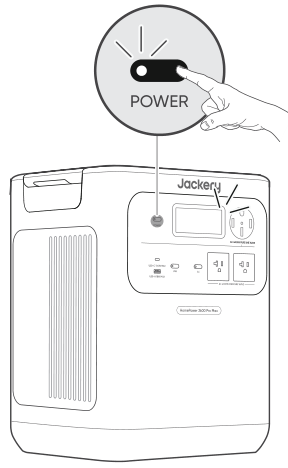

<table class="hb-lcd-mode-table"><colgroup><col class="hb-lcd-mode-col-state"/><col class="hb-lcd-mode-col-action"/><col class="hb-lcd-mode-col-copy"/></colgroup><tbody><tr><td class="hb-lcd-mode-state" rowspan="3">
Allumer en discontinu
</td><td class="hb-lcd-mode-action">
Allumer
</td><td class="hb-lcd-mode-copy">
Appuyez sur le bouton d'alimentation principal ou lorsque le produit est en charge.
</td></tr><tr><td class="hb-lcd-mode-action">
Éteindre
</td><td class="hb-lcd-mode-copy">
Appuyez sur le bouton d'alimentation principal.
</td></tr><tr><td class="hb-lcd-mode-action">
Arrêt automatique
</td><td class="hb-lcd-mode-copy">
L'écran LCD s'éteint automatiquement et entre en mode veille après 2 minutes d'inactivité.
</td></tr><tr><td class="hb-lcd-mode-state" rowspan="3">
Allumer en continu (en cours de charge ou de décharge)
</td><td class="hb-lcd-mode-action">
Allumer
</td><td class="hb-lcd-mode-copy">
Appuyez deux fois sur le bouton d'alimentation principal lorsque le produit est allumé.
</td></tr><tr><td class="hb-lcd-mode-action">
Éteindre
</td><td class="hb-lcd-mode-copy">
Appuyez sur le bouton d'alimentation principal.
</td></tr><tr><td class="hb-lcd-mode-action">
Arrêt automatique
</td><td class="hb-lcd-mode-copy">
L'écran LCD s'éteint automatiquement après 2 heures d'inactivité.
</td></tr></tbody></table>
</figure>

Vous pouvez également définir le mode d'affichage de l'écran dans l'application Jackery.

## FONCTIONNEMENT DES BOUTONS

<figure aria-label="Boutons / Utilisation / Fonction" class="hb-key-combination-composition" data-component-id="HB-TABLE-KEY-COMBINATIONS" tabindex="0"><table class="hb-key-combination-table"><colgroup><col class="hb-key-col-buttons"/><col class="hb-key-col-operation"/><col class="hb-key-col-function"/></colgroup><thead><tr><th class="hb-key-buttons" scope="col">Boutons</th><th class="hb-key-operation" scope="col">Utilisation</th><th class="hb-key-function" scope="col">Fonction</th></tr></thead><tbody><tr><td class="hb-key-buttons">

Bouton d’alimentation principal

+

Bouton d’alimentation USB

</td><td class="hb-key-operation">
3s

Appuyer 3 secondes sur les deux
</td><td class="hb-key-function">Réinitialiser le Wi-Fi et le Bluetooth</td></tr><tr><td class="hb-key-buttons">

Bouton d’alimentation principal

+

Bouton d’alimentation CA

</td><td class="hb-key-operation">
3s

Appuyer 3 secondes sur les deux
</td><td class="hb-key-function">Activer/désactiver le mode économie d’énergie</td></tr><tr><td class="hb-key-buttons">

Bouton d’alimentation USB

+

Bouton d’alimentation CA

</td><td class="hb-key-operation">
1s

Appuyer 1 seconde sur les deux
</td><td class="hb-key-function">Activer le Wi-Fi et le Bluetooth</td></tr></tbody></table></figure>

## FONCTION DE REPRISE DE SORTIE CA ET CC

Cette fonction mémorise l’état de la sortie et reprend automatiquement les sorties CA et CC sous certaines conditions définies.

<figure aria-label="Conditions de reprise automatique / Conditions sans reprise automatique" class="hb-auto-resume-composition" data-component-id="HB-TABLE-AUTO-RESUME" tabindex="0"><table class="hb-auto-resume-table"><colgroup><col class="hb-auto-resume-col"/><col class="hb-auto-resume-col"/></colgroup><thead><tr><th class="hb-auto-resume-left" scope="col">Conditions de reprise automatique</th><th class="hb-auto-resume-right" scope="col">Conditions sans reprise automatique</th></tr></thead><tbody><tr><td class="hb-auto-resume-left">Mise sous tension/redémarrage après arrêt ou redémarrage</td><td class="hb-auto-resume-right">Sortie désactivée manuellement (bouton/App)</td></tr><tr><td class="hb-auto-resume-left" rowspan="2">SOC de la batterie ≥ limite de décharge +10% après avoir atteint la limite</td><td class="hb-auto-resume-right">Sortie désactivée en mode économie d’énergie</td></tr><tr><td class="hb-auto-resume-right">Sortie désactivée suite à un déclenchement de protection</td></tr><tr><td class="hb-auto-resume-left">Mise à niveau OTA terminée</td><td class="hb-auto-resume-right">Sortie désactivée par le minuteur de décharge</td></tr></tbody></table></figure>

# ALIMENTATION SANS INTERRUPTION (ASI)

Une alimentation sans coupure (UPS) est un système d’alimentation continue qui fournit automatiquement une alimentation électrique de secours à une charge lorsque l’alimentation du réseau principal est interrompue. In the event of a sudden loss of grid power, the HomePower 3600 Pro Max will automatically switch to stored power within 10 ms to keep your appliances running. En mode UPS, la puissance de sortie maximale de l’unité varie en fonction de la tension d’entrée du réseau avant une coupure de courant. La puissance de sortie réelle revient à la puissance nominale pendant les coupures.

<table class="manual-callout-table manual-callout-table"><tbody><tr><td class="manual-callout-label">ATTENTION</td><td class="manual-callout-body"><ul><li>Ce produit ne prend pas en charge un basculement instantané (0 ms). Ne le connectez pas à des équipements nécessitant une alimentation vec commutation en 0 ms, tels que des serveurs de données ou des stations de travail.</li><li>Avant toute utilisation, testez plusieurs fois la compatibilité avec votre appareil.</li><li>Ne connectez pas de charges dépassant la puissance de sortie maximale du produit. Sinon, la protection contre les surcharges sera déclenchée.</li></ul></td></tr></tbody></table>

## AVEC ENTRÉE CA 120 V

Connectez le produit à une prise murale 120 V à l’aide du câble de charge CA. Appuyez sur le bouton d’alimentation CA pour activer la sortie CA.

Charges totales ≤1440 W :

Le produit fonctionne en mode bypass CA. Les trois ports CA (deux NEMA 5-20R et un NEMA 14-50R) peuvent être utilisés. Dans cette condition, le produit prend en charge une entrée 120 V avec des sorties 120 V et 240 V, et bascule sur l’alimentation par batterie en moins de 10 ms en cas de coupure du réseau.

Si un seul port 120 V est requis, utilisez le port NEMA 5-20R gauche (L1) comme connexion principale.

Charges totales &gt;1440 W :

Chaque port NEMA 5-20R prend en charge jusqu’à 1440 W, avec un maximum combiné de 2880 W sur les deux ports. Le port NEMA 14-50R prend en charge jusqu’à 2880 W. Les trois ports CA ensemble prennent en charge une sortie totale maximale de 2880 W. Lors d’un fonctionnement au-delà de 1440 W avec une entrée CA 120 V, le produit prend toujours en charge des sorties 120 V/240 V. Dans cette condition, les sorties CA consomment l’énergie de la batterie. Si la batterie est complètement déchargée, la charge connectée peut subir un arrêt pour surcharge et une interruption d’alimentation.

## AVEC ENTRÉE CA 240 V

Connectez le produit à une alimentation CA 240 V à l’aide d’un câble de charge Jackery 40 A (vendu séparément). Appuyez sur le bouton d’alimentation CA pour activer la sortie CA.

Tous les ports de sortie CA prennent en charge le fonctionnement UPS sous une entrée 240 V : 

<ul><li>NEMA 14-50R (240 V~60 Hz) : Jusqu’à 9600 W de sortie en dérivation </li><li>NEMA 5-20R ×2 (120 V~60 Hz) : Jusqu’à 2400 W par port, 4800 W de sortie totale en dérivation </li></ul>

La charge totale maximale autorisée est de 4000 W pour une unité et de 8000 W pour deux unités (connexion en parallèle). 

En cas de coupure du réseau 240 V, le système bascule automatiquement sur l’alimentation par batterie avec un temps de transfert de &lt;10 ms. Lorsque la batterie est épuisée, toutes les sorties CA s’éteignent.

<figure class="hb-reference-figure hb-base-art-live-copy" data-component-id="HB-SPECIAL-REFERENCE-FIGURE" data-reference-id="ups240" data-source-fragment-sha256="1e00c9f4093204cc3bea201da1d3425080c47000df856e2a9dc5434815a85ab5" data-web-base-art-ref="assets/ups240.png" data-web-presentation-mode="base-art-live-copy" data-web-replace-key="reference.ups240">

Câble de charge Jackery 40 A (vendu séparément)

</figure>

# CONNEXIONS

## CONNECTER AU(X) PACK(S) BATTERIE VENDU SÉPARÉMENT

Ce produit peut prendre en charge jusqu’à 5 packs batterie pour répondre aux besoins d’une grande capacité énergétique. Pour les détails sur son utilisation, veuillez vous référer au manuel d’utilisation du Jackery Battery Pack 3600.

Si vous utilisez un seul bloc-piles, vous pouvez le placer dans l’une des configurations suivantes :

<figure class="hb-reference-figure hb-base-art-live-copy" data-component-id="HB-SPECIAL-REFERENCE-FIGURE" data-reference-id="battery-placement" data-source-fragment-sha256="28bd217e68ad521af91b174f42992ec18e3eea39dccd2e9783ad5d35adc696a1" data-web-base-art-ref="assets/placement_framefree.png" data-web-presentation-mode="base-art-live-copy" data-web-replace-key="reference.battery-placement">

Disposition côte à côteDisposition empilée≥0,66 pied (≈200 mm)

</figure>

<table class="manual-callout-table manual-callout-table"><tbody><tr><td class="manual-callout-label">ATTENTION</td><td class="manual-callout-body"><ul><li>Assurez-vous que tous les produits sont éteints avant de connecter le HomePower 3600 Pro Max au Jackery Battery Pack 3600.</li><li>Pour assurer le bon fonctionnement du produit, assurez-vous que les entrées et sorties d’air sur les deux côtés ne sont pas obstruées. Laissez un espace d’au moins 0,66 pied (200 mm) entre les ouvertures et tout objet pour permettre une dissipation thermique adéquate.</li></ul></td></tr></tbody></table>

## CONNEXION EN PARALLÈLE EN CASCADE

La connexion en cascade permet à 2 unités HomePower 3600 Pro Max de fonctionner comme un système combiné, augmentant la puissance de sortie totale.

<h3 class="hb-source-pill-heading" id="required-accessories">Accessoires requis</h3>

Câble de charge Jackery 40 A Câble de communication parallèle Jackery Vendu séparément

<h3 class="hb-source-pill-heading" id="connection-steps">ÉTAPES DE CONNEXION</h3>

1. Assurez-vous que les deux unités sont éteintes et complètement déconnectées de toute source d’alimentation. 2. Connectez les ports de communication parallèle des deux unités

<table class="manual-callout-table manual-callout-table"><tbody><tr><td class="manual-callout-label">ATTENTION</td><td class="manual-callout-body">
Ne sautez pas cette étape. Sans communication, les unités ne peuvent pas synchroniser les données et peuvent être endommagées.
</td></tr></tbody></table>

3. Connectez le port de sortie 240 V de la première unité (NEMA 14-50R) au port d’extension CA de la deuxième unité.

<figure class="hb-reference-figure hb-base-art-live-copy" data-component-id="HB-SPECIAL-REFERENCE-FIGURE" data-reference-id="cascade" data-source-fragment-sha256="5146e605b78f157dd2957ab00ee56a19ea8a5d5aff81bac03597e5da38cbc57a" data-web-base-art-ref="assets/cascade.png" data-web-presentation-mode="base-art-live-copy" data-web-replace-key="reference.cascade">

Câble de charge Jackery 40 A (vendu séparément)Câble de communication parallèle Jackery (vendu séparément)

</figure>

Les informations du système se synchroniseront sur les deux écrans

<table class="manual-callout-table manual-callout-table"><tbody><tr><td class="manual-callout-label">ATTENTION</td><td class="manual-callout-body">
Après la mise en cascade, la puissance de sortie totale du système via le port NEMA 14-50R du deuxième appareil est de 8000 W. La charge totale NE DOIT PAS dépasser la puissance totale.
</td></tr></tbody></table>

## CONNEXION AU COMMUTATEUR EPO

The EPO (Emergency Power Off) interface is used to connect an external emergency-stop switch (prepared by the user). When an emergency occurs, pressing the EPO button immediately shuts down all AC and DC inputs and outputs. A screw terminal block is provided with the product for installing the external emergency-stop switch.

<figure class="hb-reference-figure hb-base-art-live-copy" data-component-id="HB-SPECIAL-REFERENCE-FIGURE" data-reference-id="epo" data-source-fragment-sha256="531b8790ab76682a36582a048ce57994077e024ad7fe8fb4cf401ef067db7fd4" data-web-base-art-ref="assets/epo.png" data-web-presentation-mode="base-art-live-copy" data-web-replace-key="reference.epo">

EPO

</figure>

## CONNEXION D’ALIMENTATION DE SECOURS

<h3 class="hb-heading-label-pair" id="connect-to-ats-sold-separately">CONNECTER AU ATS VENDU SÉPARÉMENT</h3>

Le HomePower 3600 Pro Max peut fournir une alimentation de secours aux circuits domestiques via un Automatic Transfer Switch (ATS) Jackery. Pour des instructions détaillées d’installation et d’utilisation, reportez-vous au manuel utilisateur ATS Jackery.

<figure class="hb-reference-figure hb-base-art-live-copy" data-component-id="HB-SPECIAL-REFERENCE-FIGURE" data-reference-id="ats-lock" data-source-fragment-sha256="775e1cd76ca5ed9a7231753ee3ced20c07ba55f5ff651acf897cb9154d03acc9" data-web-base-art-ref="assets/ats_live.png" data-web-presentation-mode="base-art-live-copy" data-web-replace-key="reference.ats-lock">

<strong>Lock</strong><strong>Unlock</strong>Câble d’alimentation entrée/sortie dans le paquet ATS

</figure>

<table class="manual-callout-table manual-callout-table"><tbody><tr><td class="manual-callout-label">REMARQUE</td><td class="manual-callout-body">
Lorsque le mode UPS est activé sur le ATS, la station d’énergie reste active et consomme en continu de l’énergie. En cas de coupure du réseau, le système bascule sur l’alimentation par batterie en 20 millisecondes.
</td></tr></tbody></table>

## CONNECTER AU MTS VENDU SÉPARÉMENT

Le HomePower 3600 Pro Max peut être connecté à un Manual Transfer Switch (MTS) pour alimenter certains circuits domestiques. Choisissez la méthode appropriée en fonction de votre mode d’installation.

<table class="manual-callout-table manual-callout-table"><tbody><tr><td class="manual-callout-label">REMARQUE</td><td class="manual-callout-body">
Tous les câbles utilisés dans cette section sont vendus séparément ou inclus avec le MTS vendu séparément.
</td></tr></tbody></table>

<h3 class="hb-source-pill-heading" id="mts-installation-notice">Avis d’installation du MTS</h3>

Pour des performances optimales lors de l’utilisation du HP3600 Pro Max avec un commutateur de transfert manuel (MTS), il est recommandé de raccorder l’entrée CA à un circuit non protégé par un GFCI. Si une protection GFCI est requise, il est recommandé d’installer les dispositifs GFCI en aval, du côté de la charge. Cette configuration améliore la compatibilité du système et favorise un fonctionnement fiable du mode de dérivation CA (bypass).

## CONNEXION D’UNE SEULE UNITÉ AVEC MTS

En mode automatique, le HomePower 3600 Pro Max reçoit une entrée CA et fournit une alimentation de secours de type UPS via le MTS.

<figure class="hb-reference-figure hb-base-art-live-copy" data-component-id="HB-SPECIAL-REFERENCE-FIGURE" data-reference-id="mts-single" data-source-fragment-sha256="ddedb4a4eb07e1091b4d2ebd1190ed7734871fad21da9bfeb054f575a5b5589c" data-web-base-art-ref="assets/mts_single_live.png" data-web-presentation-mode="base-art-live-copy" data-web-replace-key="reference.mts-single">

<strong class="hb-mts-step-number">1.</strong>Éteignez le HomePower 3600 Pro Max.<strong class="hb-mts-step-number">2.</strong>Connectez le HomePower 3600 Pro Max à une alimentation CA 240 V.<strong class="hb-mts-step-number">3.</strong>Connectez le port de sortie 240 V (NEMA 14-50R) à l’entrée du MTS.<strong class="hb-mts-step-number">4.</strong>Réglez l’interrupteur de charge du MTS sur secours.<strong class="hb-mts-step-number">5.</strong>Allumez l’unité et activez la sortie CA.Câble de charge dans le paquet MTSCâble de charge Jackery de 40 A (vendu séparément)

</figure>

Lorsque le réseau est présent, l’alimentation CA est transmise au MTS. En cas de coupure de courant, le système bascule automatiquement sur l’alimentation par batterie en 10 millisecondes.

<table class="manual-callout-table manual-callout-table"><tbody><tr><td class="manual-callout-label">REMARQUE</td><td class="manual-callout-body">
La commutation automatique nécessite que l’entrée CA reste connectée en permanence.
</td></tr></tbody></table>

## CONNEXION PARALLÈLE EN CASCADE AVEC MTS

Lorsque deux unités sont connectées en mode parallèle en cascade, le système peut fournir une puissance de sortie plus élevée au MTS.

<figure class="hb-reference-figure hb-base-art-live-copy" data-component-id="HB-SPECIAL-REFERENCE-FIGURE" data-reference-id="mts-cascade" data-source-fragment-sha256="a344303c64ae00e09c77a7423b3454647b14f185504a92e0225ddde6200d5905" data-web-base-art-ref="assets/mts_cascade_live.png" data-web-presentation-mode="base-art-live-copy" data-web-replace-key="reference.mts-cascade">

<strong class="hb-mts-step-number">1.</strong>Suivez les étapes de connexion parallèle en cascade décrites précédemment.<strong class="hb-mts-step-number">2.</strong>Connectez le port de sortie 240 V (NEMA 14-50R) du deuxième appareil à l’entrée du MTS.<strong class="hb-mts-step-number">3.</strong>Allumez les deux unités et activez la sortie CA.Câble de recharge inclus dans le kit MTSCâble de charge Jackery de 40 A (vendu séparément)Câble de communication parallèle Jackery (vendu séparément)

</figure>

<table class="manual-callout-table manual-callout-table"><tbody><tr><td class="manual-callout-label">ATTENTION</td><td class="manual-callout-body">
Après la mise en cascade, la puissance de sortie maximale vers le MTS est de 8000 W. La charge totale NE DOIT PAS dépasser la puissance totale.
</td></tr></tbody></table>

# CHARGE

<strong>L’énergie verte d’abord :</strong>nous préconisons l’utilisation de l’énergie verte en premier. Ce produit prend en charge deux modes de recharge simultanés : la recharge solaire et la recharge par prise murale CA. Quand la recharge par prise murale CA et la recharge solaire sont effectuées en même temps, le produit privilégie la recharge solaire. Les deux méthodes sont utilisées pour charger la batterie à la puissance maximalement autorisée.

Chargez complètement le produit avant sa première utilisation.

<table class="manual-callout-table manual-callout-table"><tbody><tr><td class="manual-callout-label">REMARQUE</td><td class="manual-callout-body"><ul><li>La température de charge recommandée pour le produit est comprise entre -4 °F et 113 °F (-20 °C à 45 °C), et la température de décharge est comprise entre -4 °F et 113 °F (-20 °C à 45 °C). Utiliser le produit en dehors de cette plage de températures peut limiter ses capacités de charge et de décharge, voire empêcher la charge ou la décharge.</li><li>La puissance de charge et la capacité de la batterie du produit peuvent varier en raison des fluctuations de température.</li></ul></td></tr></tbody></table>

## CHARGEMENT VIA PRISE MURALE CA 120 V

<figure class="hb-reference-figure hb-base-art-live-copy" data-component-id="HB-SPECIAL-REFERENCE-FIGURE" data-reference-id="charge120" data-source-fragment-sha256="6b1b1e35fa9bae6b1a44f0b98adb59679e18abd95fb2a23cb58a4ed39c299265" data-web-base-art-ref="assets/charge120.png" data-web-presentation-mode="base-art-live-copy" data-web-replace-key="reference.charge120">

Connectez le câble de charge CA au port d’entrée CA de l’appareil et à une prise murale.

</figure>

<table class="manual-callout-table manual-callout-table"><tbody><tr><td class="manual-callout-label">ATTENTION</td><td class="manual-callout-body"><ul><li>Assurez-vous que le câble de charge CA est entièrement et solidement inséré dans le port d’entrée CA.</li><li>Une connexion incomplète peut entraîner un courant instable, une surchauffe, un mauvais contact ou un dysfonctionnement de l’appareil.</li></ul></td></tr></tbody></table>

## CHARGEMENT VIA ENTRÉE CA 240 V

Le HomePower 3600 Pro Max prend en charge la charge via son port d’extension CA 240 V. Selon votre installation, l’entrée CA 240 V peut provenir d’une prise CA 240 V ou d’un Jackery Automatic Transfer Switch (ATS).

<h3 class="hb-source-pill-heading" id="v-ac-outlet">Prise CA 240 V</h3>

<figure class="hb-reference-figure hb-base-art-live-copy" data-component-id="HB-SPECIAL-REFERENCE-FIGURE" data-reference-id="charge240" data-source-fragment-sha256="8c7a15c1f81e033f61af4e0d39262a7e87c3737f56f8a3d84c5c9dc44fc8fbd6" data-web-base-art-ref="assets/charge240.png" data-web-presentation-mode="base-art-live-copy" data-web-replace-key="reference.charge240">

Connectez le produit à une alimentation CA 240 V à l’aide d’un câble de charge Jackery 40 A (Vendu séparément).

</figure>

<table class="manual-callout-table manual-callout-table"><tbody><tr><td class="manual-callout-label">ATTENTION</td><td class="manual-callout-body"><ul><li>Assurez-vous que le câble de charge Jackery 40 A est entièrement et solidement branché à la fois sur la prise 240 V et sur le port d’extension CA.</li><li>Une connexion incomplète peut entraîner un courant instable, une surchauffe, un mauvais contact ou un dysfonctionnement de l’appareil.</li></ul></td></tr></tbody></table>

<h3 class="hb-source-pill-heading" id="transfer-switch-ats">COMMUTATEUR DE TRANSFERT (ATS)</h3>

Connectez votre Jackery ATS au produit pour permettre la charge via le commutateur de transfert.

<table class="manual-callout-table manual-callout-table"><tbody><tr><td class="manual-callout-label">REMARQUE</td><td class="manual-callout-body">
Le réglage de réserve de secours s’applique dans tous les modes de fonctionnement du ATS. Lorsque la capacité restante du HomePower 3600 Pro Max dépasse la réserve de secours configurée, la charge s’arrête automatiquement.
</td></tr></tbody></table>

Pour le charger immédiatement, suivez les instructions ci-dessous : 1. Touchez Station d’énergie dans le flux d’énergie du tableau de bord du ATS. 2. Sur la page Station d’énergie, touchez Charger maintenant.

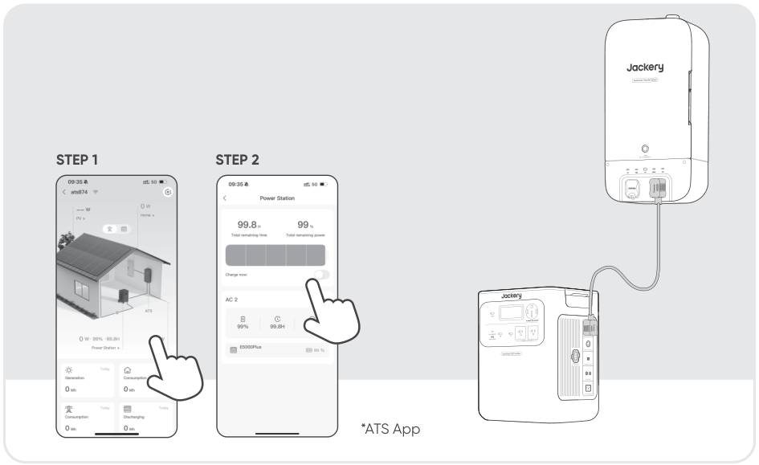

<table class="manual-callout-table manual-callout-table"><tbody><tr><td class="manual-callout-label">REMARQUE</td><td class="manual-callout-body">
Lorsque le port d’extension CA est connecté avec succès au ATS, le port d’entrée CA ne sera plus utilisé pour la charge. Dans cette configuration, le HomePower 3600 Pro Max peut être chargé via les ports suivants : port d’extension CA, ports DC8020
</td></tr></tbody></table>

## CHARGING VIA SOLAR PANELS VENDU SÉPARÉMENT

Le Jackery HomePower 3600 Max dispose de deux ports d’entrée DC8020 et dont chacun prend en charge la connexion directe à un panneau solaire de 500 W ou à trois panneaux solaires de 200 W. Si vous souhaitez connecter un seul port d’entrée DC8020 à deux panneaux solaires ou plus simultanément, veuillez vous référer au schéma ci-dessous pour le branchement via le connecteur de panneau solaire (vendu séparément, non inclus en standard).

<table class="manual-callout-table manual-callout-table"><tbody><tr><td class="manual-callout-label">ATTENTION</td><td class="manual-callout-body">
Assurez-vous que la tension d’entrée pour les deux ports d’entrée CC est la même. Sinon, le produit pourrait être endommagé. Par exemple : Utiliser le même modèle de panneaux solaires Jackery et le même nombre de panneaux lors de la connexion des panneaux solaires aux deux ports d’entrée DC8020. Ne chargez pas le produit à la fois avec un chargeur de voiture et un panneau solaire simultanément. Cela pourrait faire sauter le fusible de la voiture ou entraîner un échec de la charge.
</td></tr></tbody></table>

Il est recommandé d’utiliser le panneau solaire Jackery pour charger le HomePower 3600 Pro Max. Si vous choisissez des panneaux solaires d’autres marques, assurez-vous que leur tension de fonctionnement (Vmp) est comprise dans la plage d’entrée CC (16V-60V) du HomePower 3600 Pro Max. Jackery décline toute responsabilité en cas de pertes causées par l’utilisation de panneaux solaires d’autres marques.

## CHARGEMENT PAR PRISE DE VOITURE VENDU SÉPARÉMENT

Ce produit peut être chargé à l’aide d’un chargeur de voiture 12 V. Assurez-vous que le chargeur allume-cigare et l’allume-cigare de la voiture sont bien branchés.

<figure class="hb-reference-figure hb-base-art-live-copy" data-component-id="HB-SPECIAL-REFERENCE-FIGURE" data-reference-id="car_charging" data-source-fragment-sha256="ddeadf9b8ed18522bfb4864b1e00ac0bfdae136adb25892f4a95f6b6e5ac8814" data-web-base-art-ref="assets/car_charging_framefree.svg" data-web-presentation-mode="base-art-live-copy" data-web-replace-key="reference.car-charging">

Véhicule*Le câble de chargement de voiture est vendu séparément.

</figure>

<table class="manual-callout-table manual-callout-table"><tbody><tr><td class="manual-callout-label">ATTENTION</td><td class="manual-callout-body"><ul><li>Veuillez démarrer le véhicule avant de charger votre station d’alimentation.</li><li>Si le véhicule roule sur des routes accidentées, il est interdit d’utiliser le chargeur de voiture afin d’éviter tout risque de surchauffe dû à une mauvaise connexion. La société ne sera pas responsable des pertes causées par une utilisation non conforme.</li><li>La charge par véhicule est uniquement applicable aux véhicules en 12 V CC, pas en 24 V CC. Veuillez ne pas charger ce produit dans un véhicule 24 V afin d’éviter tout risque de blessure ou de dommage matériel.</li></ul></td></tr></tbody></table>

# DÉPANNAGE

Si l’un des codes d’erreur suivants apparaît, suivez les actions correctives indiquées pour résoudre le problème. Si l’erreur persiste, veuillez contacter le service à la clientèle de Jackery.

<figure aria-label="Code d’erreur / Mesures correctives" class="hb-troubleshooting-composition" data-component-id="HB-TABLE-TROUBLESHOOTING" tabindex="0"><table class="hb-troubleshooting-table"><colgroup><col class="hb-troubleshooting-col-code"/><col class="hb-troubleshooting-col-measures"/></colgroup><thead><tr><th class="hb-troubleshooting-code" scope="col">Code d’erreur</th><th class="hb-troubleshooting-measures" scope="col">Mesures correctives</th></tr></thead><tbody><tr><td class="hb-troubleshooting-code">F0/F1 F2/F3</td><td class="hb-troubleshooting-measures">Redémarrez le produit.</td></tr><tr><td class="hb-troubleshooting-code">F4</td><td class="hb-troubleshooting-measures">Connectez le produit à des charges pour décharger sa batterie jusqu’à ce que l’erreur disparaisse.</td></tr><tr><td class="hb-troubleshooting-code">F5</td><td class="hb-troubleshooting-measures">Chargez le produit via des panneaux solaires ou une prise murale CA jusqu’à ce que l’erreur disparaisse.</td></tr><tr><td class="hb-troubleshooting-code">F6</td><td class="hb-troubleshooting-measures">1. Attendez que le réseau se normalise avant de charger le produit via une prise murale CA. 2. Vérifiez si les entrées et sorties d’air sont obstruées; assurez un espace de 0,66 pied (20 cm) de chaque côté du produit. 3. Placez le produit dans un endroit qui n’est pas exposé à la lumière directe du soleil ou à des températures ambiantes élevées. 4. Déconnectez toutes les charges du produit. Laissez le produit inactif et attendez que l’erreur disparaisse. 5. Redémarrez le produit.</td></tr><tr><td class="hb-troubleshooting-code">F7</td><td class="hb-troubleshooting-measures">1. Retirez toutes les entrées CC du produit. 2. Vérifiez la tension de fonctionnement (Vmp) des panneaux solaires connectés. Le produit autorise une tension d’entrée CC maximale de 60 V. 3. Redémarrez le produit et laissez-le inactif. Attendez que l’erreur disparaisse.</td></tr><tr><td class="hb-troubleshooting-code">F8</td><td class="hb-troubleshooting-measures">Contacter le service à la clientèle de Jackery.</td></tr><tr><td class="hb-troubleshooting-code">F9</td><td class="hb-troubleshooting-measures">Retirez la charge connectée aux ports USB du produit. Attendez que l’erreur disparaisse.</td></tr><tr><td class="hb-troubleshooting-code">FA</td><td class="hb-troubleshooting-measures">1. Désactivez les sorties CA et éteignez les deux unités. 2. Déconnectez les câbles entre les unités et reconnectez les deux unités. 3. Redémarrez les deux unités et activez leurs sorties CA.</td></tr><tr><td class="hb-troubleshooting-code">FC</td><td class="hb-troubleshooting-measures">1. Redémarrez respectivement les blocs-batteries et le HP3600 Pro Max. 2. Si le défaut persiste, déconnectez le bloc-batterie du HP3600 Pro Max puis reconnectez-les.</td></tr><tr><td class="hb-troubleshooting-code">FF</td><td class="hb-troubleshooting-measures">1. Après que la situation d'urgence est résolue, appuyez de nouveau sur le bouton EPO. 2. Si vous devez alimenter des charges CA ou CC, appuyez sur le bouton d'alimentation CA ou CC pour réactiver la sortie.</td></tr></tbody></table></figure>

# STOCKAGE

Conservez le produit dans un endroit propre et sec avec une ventilation adéquate.Température et humidité de stockage :

<ul><li>1 mois : -4°F à 113°F / -20°C à 45°C (0-60% HR)</li><li>3 mois : 32°F à 113°F / 0°C à 45°C (0-60% HR)</li><li>12 mois : 32°F à 77°F / 0°C à 25°C (0-60% HR)</li></ul>

Si ce produit est stocké pendant une longue période (3 à 6 mois) avec la batterie déchargée, il peut devenir impossible de le recharger. Pour éviter cela et préserver la santé de la batterie, il est recommandé de vérifier et de recharger le produit tous les trois mois, et d'effectuer un cycle de charge et de décharge complet au moins une fois tous les 6 à 12 mois.

# SPÉCIFICATIONS

<h2 aria-level="2" class="hb-spec-group" role="heading">INFORMATIONS GÉNÉRALES</h2>

<figure aria-label="INFORMATIONS GÉNÉRALES" class="hb-spec-table-composition"><table class="manual-table manual-spec-table hb-spec-table"><colgroup><col class="hb-spec-col-label"/><col class="hb-spec-col-value"/></colgroup><tbody><tr><th class="manual-spec-label hb-spec-label" scope="row">Nom du produit</th><td class="manual-spec-value hb-spec-value">Jackery HomePower 3600 Pro Max</td></tr><tr><th class="manual-spec-label hb-spec-label" scope="row">N° modèle</th><td class="manual-spec-value hb-spec-value">JHP-3600C</td></tr><tr><th class="manual-spec-label hb-spec-label" scope="row">Capacité</th><td class="manual-spec-value hb-spec-value">80 Ah / 44,8 V DC (3584 Wh)</td></tr><tr><th class="manual-spec-label hb-spec-label" scope="row">Cellule Chimique</th><td class="manual-spec-value hb-spec-value">LiFePO4</td></tr><tr><th class="manual-spec-label hb-spec-label" scope="row">Poids</th><td class="manual-spec-value hb-spec-value">Environ 73,85 lb / 33,5 kg</td></tr><tr><th class="manual-spec-label hb-spec-label" scope="row">Dimensions</th><td class="manual-spec-value hb-spec-value">14,76 × 10,83 × 17,72 po / 37,5 × 27,5 × 45,0 cm</td></tr><tr><th class="manual-spec-label hb-spec-label" scope="row">Durée de vie</th><td class="manual-spec-value hb-spec-value">6000 cycles (capacité conservée ≥ 70 % SOH)</td></tr><tr><th class="manual-spec-label hb-spec-label" scope="row">Courant et durée maximum du court-circuit</th><td class="manual-spec-value hb-spec-value">1520A, 2.56ms</td></tr><tr><th class="manual-spec-label hb-spec-label" scope="row">UPS (ASI)</th><td class="manual-spec-value hb-spec-value">&lt;10 ms</td></tr><tr><th class="manual-spec-label hb-spec-label" scope="row">Topologie de l’onduleur</th><td class="manual-spec-value hb-spec-value">Isolée</td></tr><tr><th class="manual-spec-label hb-spec-label" scope="row">Facteur de puissance</th><td class="manual-spec-value hb-spec-value">≥0.98</td></tr><tr><th class="manual-spec-label hb-spec-label" scope="row">Unité complète</th><td class="manual-spec-value hb-spec-value">Type 1</td></tr></tbody></table></figure>

<h2 aria-level="2" class="hb-spec-group" role="heading">PORTS D’ENTRÉE</h2>

<figure aria-label="PORTS D’ENTRÉE" class="hb-spec-table-composition"><table class="manual-table manual-spec-table hb-spec-table"><colgroup><col class="hb-spec-col-label"/><col class="hb-spec-col-value"/></colgroup><tbody><tr><th class="manual-spec-label hb-spec-label" rowspan="2" scope="row">1 × Entrée CA</th><td class="manual-spec-value hb-spec-value">Mode charge : 100 V-120 V~ 60 Hz, 15 A max., 1800 W</td></tr><tr><td class="manual-spec-value hb-spec-value">Mode dérivation① : 100 V-120 V~ 60 Hz, 12 A max., 1440 W</td></tr><tr><th class="manual-spec-label hb-spec-label" scope="row">2 × Ports DC8020</th><td class="manual-spec-value hb-spec-value">12–16 V⎓8 A max., double à 8 A max. 16-60 V②⎓12 A max., double jusqu’a 24 A, 1200 W max.</td></tr></tbody></table></figure>

<h2 aria-level="2" class="hb-spec-group" role="heading">PORTS DE SORTIE</h2>

<figure aria-label="PORTS DE SORTIE" class="hb-spec-table-composition"><table class="manual-table manual-spec-table hb-spec-table"><colgroup><col class="hb-spec-col-label"/><col class="hb-spec-col-value"/></colgroup><tbody><tr><th class="manual-spec-label hb-spec-label" scope="row">2 × Sorties CA (NEMA 5-20R)</th><td class="manual-spec-value hb-spec-value">120 V~ 60 Hz, 16,7 A max., 2000 W par port, 4000 W au total</td></tr><tr><th class="manual-spec-label hb-spec-label" scope="row">1 × Sortie CA (NEMA 14-50R)</th><td class="manual-spec-value hb-spec-value">240 V~ 60 Hz, 16,7 A max., 4000 W nominal, 8000 W crête</td></tr><tr><th class="manual-spec-label hb-spec-label" scope="row">Sortie totale CA③</th><td class="manual-spec-value hb-spec-value">4000 W nominal, 8000 W crête</td></tr><tr><th class="manual-spec-label hb-spec-label" rowspan="2" scope="row">AC Output in Bypass Mode①</th><td class="manual-spec-value hb-spec-value"><strong>Entrée CA 120 V :</strong> NEMA 5-20R: 100V-120V~ 60Hz, 12A Max, 1440W Max per port, 1440W④ in Total NEMA 14-50R: 240V~ 60Hz, 1440W④ Max</td></tr><tr><td class="manual-spec-value hb-spec-value"><strong>Entrée CA 240 V :</strong> NEMA 5-20R : 100 V-120 V~ 60 Hz, 20 A max., 2400 W par port, 4800 W au total NEMA 14-50R : 240 V~ 60 Hz, 40 A max., 9600 W max.</td></tr><tr><th class="manual-spec-label hb-spec-label" scope="row">1 × Sortie USB-C</th><td class="manual-spec-value hb-spec-value">100 W max., 5 V⎓3 A, 9 V⎓3 A, 12 V⎓3 A, 15 V⎓3 A, 20 V⎓5 A</td></tr><tr><th class="manual-spec-label hb-spec-label" scope="row">1 × Sortie USB-A</th><td class="manual-spec-value hb-spec-value">18 W max., 5–6 V⎓3 A, 6–9 V⎓2 A, 9–12 V⎓1,5 A</td></tr></tbody></table></figure>

<h2 aria-level="2" class="hb-spec-group" role="heading">PORTS D’EXTENSION</h2>

<figure aria-label="PORTS D’EXTENSION" class="hb-spec-table-composition"><table class="manual-table manual-spec-table hb-spec-table"><colgroup><col class="hb-spec-col-label"/><col class="hb-spec-col-value"/></colgroup><tbody><tr><th class="manual-spec-label hb-spec-label" scope="row">1 × Port d’extension CA</th><td class="manual-spec-value hb-spec-value">240 V~ 60 Hz, 16,7 A max., 4000 W max.</td></tr><tr><th class="manual-spec-label hb-spec-label" scope="row">1 × Port d’extension CC</th><td class="manual-spec-value hb-spec-value">36,4 V-50,4 V⎓126 A max. (Entrée) 36,4 V-50,4 V⎓60 A max. (Sortie)</td></tr></tbody></table></figure>

<h2 aria-level="2" class="hb-spec-group" role="heading">SPÉCIFICATIONS ENVIRONNEMENTALES</h2>

<figure aria-label="SPÉCIFICATIONS ENVIRONNEMENTALES" class="hb-spec-table-composition"><table class="manual-table manual-spec-table hb-spec-table"><colgroup><col class="hb-spec-col-label"/><col class="hb-spec-col-value"/></colgroup><tbody><tr><th class="manual-spec-label hb-spec-label" scope="row">Température de charge</th><td class="manual-spec-value hb-spec-value">-4 °F à 113 °F (-20 °C à 45 °C)</td></tr><tr><th class="manual-spec-label hb-spec-label" scope="row">Température de décharge</th><td class="manual-spec-value hb-spec-value">-4 °F à 113 °F (-20 °C à 45 °C)</td></tr><tr><th class="manual-spec-label hb-spec-label" scope="row">Altitude</th><td class="manual-spec-value hb-spec-value">≤3000m</td></tr></tbody></table></figure>

※ USB Type-C® et USB-C® sont des marques déposées de USB Implementers Forum.

① Le produit peut charger la batterie à partir d’une prise murale CA ou via du ATS tout en fournissant de l’énergie via les ports de sortie CA.

② Indique la tension de fonctionnement (Vmp) admissible du panneau solaire.

③ Indique que deux ports de sortie CA ou plus fonctionnent ensemble.

④ Lorsqu’il est connecté à des charges supérieures à 1440 W sous une entrée CA 120 V, le produit prélève de l’énergie de la batterie pour répondre à une demande de charge totale allant jusqu’à 2880 W.

# GARANTIE

<figure aria-label="GARANTIE" class="hb-warranty-intro-composition" data-component-id="HB-WARRANTY-LEAD">

Nous ne fournissons notre garantie qu'aux clients qui achètent sur le site officiel de Jackery, sur des plateformes tierces portant la marque Jackery, ou auprès de revendeurs autorisés locaux.

*La durée et les détails de la garantie peuvent varier en fonction des lois, réglementations et revendeurs autorisés locaux.

</figure>

## Garantie limitée

<figure aria-label="Garantie limitée" class="hb-warranty-card" data-component-id="HB-WARRANTY-SECTION" data-warranty-card-index="1">
Jackery Inc. garantit à l'acheteur et consommateur d'origine que le produit de Jackery sera exempt de tout défaut de fabrication et de matériaux dans le cadre d'une utilisation normale pendant toute la durée de la période de garantie applicable identifiée dans la section « Période de garantie » ci-dessous, sous réserve des exceptions énoncées ci-dessous. Cette déclaration de garantie énonce les obligations totales et exclusives de garantie de Jackery. Nous n'assumerons pas et nous n'autorisons personne à assumer pour nous toute autre responsabilité en lien avec la vente de nos produits.
</figure>

## Période de garantie

<figure aria-label="Période de garantie" class="hb-warranty-period-card" data-component-id="HB-WARRANTY-YEARS">

3
<strong class="hb-warranty-years-unit">ANS</strong><strong class="hb-warranty-period-label">Garantie standard</strong>

La période de garantie standard du Jackery HomePower 3600 Pro Max est de 36 mois. Dans tous les cas, la période de garantie commence à compter de la date d’achat par l’acheteur et consommateur d’origine. La facture du premier achat du consommateur ou toute autre preuve documentaire raisonnable est nécessaire afin d’établir la date de début de la période de garantie.

2
<strong class="hb-warranty-years-unit">ANS</strong><strong class="hb-warranty-period-label">Garantie prolongée</strong>

Pour activer l’extension de garantie, vous devez enregistrer votre produit en ligne ou bien contacter notre service client à hello@jackery.com afin de prolonger la durée de la garantie standard.

</figure>

## Réparation ou remplacement

<figure aria-label="Réparation ou remplacement" class="hb-warranty-card" data-component-id="HB-WARRANTY-SECTION" data-warranty-card-index="2">
Jackery réparera ou remplacera (aux frais de Jackery) tout produit Jackery qui cesse de fonctionner pendant la période de garantie applicable en raison d’un défaut de fabrication ou de matériau. Le produit réparé ou remplacé bénéficie de la garantie restante de la date d’achat d’origine.
</figure>

## Limitée à l’acheteur et consommateur d’origine

<figure aria-label="Limitée à l’acheteur et consommateur d’origine" class="hb-warranty-card" data-component-id="HB-WARRANTY-SECTION" data-warranty-card-index="3">
La garantie d’un produit Jackery est limitée à l’acheteur et consommateur d’origine, elle ne peut pas être transférée à un autre propriétaire.
</figure>

## Exclusions

<figure aria-label="Exclusions" class="hb-warranty-card" data-component-id="HB-WARRANTY-SECTION" data-warranty-card-index="4">
La garantie de Jackery ne s'applique pas à :
Une utilisation incorrecte, abusée, modifiée, aux dégâts provoqués par un accident ou toute autre utilisation qui n'est pas une utilisation normale de ce produit et autorisée par la documentation actuelle du produit de Jackery. À une réparation tentée par quelqu'un d'autre qu'un établissement agréé. Tout autre produit acheté par l'intermédiaire d'une vente aux enchères en ligne. La garantie de Jackery ne s'applique pas aux cellules de la batterie, sauf si vous avez entièrement chargé les cellules de la batterie dans les sept jours suivant l'achat du produit et au moins une fois tous les 6 mois par la suite.</figure>

## Droits d'interprétation

<figure aria-label="Droits d'interprétation" class="hb-warranty-card" data-component-id="HB-WARRANTY-SECTION" data-warranty-card-index="5">
Jackery Inc. se réserve le droit d’interpréter de manière définitive la politique après-vente des clients ci-dessus.
</figure>

# CONFIGURATION DE L’APPLICATION

## 1. Télécharger l’application et se connecter

<figure aria-label="1. Télécharger l’application et se connecter" class="hb-app-download-composition" data-component-id="HB-SPECIAL-APP">

Recherchez « Jackery » dans Google Play ou dans l’App Store pour installer l’application. Une fois que c’est fait, vous pouvez vous inscrire et vous connecter.

Vous pouvez également scanner le code QR ci-dessous pour télécharger et installer l'application.

</figure>

## 2. Ajouter un appareil

2.1 Cliquez sur le bouton + pour ajouter un appareil.

2.2 Maintenez enfoncé le bouton d'alimentation principal sur l’appareil pour l’allumer. Les icônes Wi-Fi et Bluetooth clignotent sur l’appareil afin d’indiquer qu’il est entré dans le mode Configuration réseau. Cliquez sur le bouton «icône qui clignotante» et autorisez l’application à se connecter aux appareils alentour, puis ouvrez les autorisations Bluetooth.

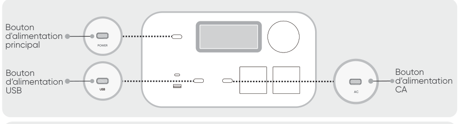

<table class="manual-callout-table manual-callout-table"><tbody><tr><td class="manual-callout-label">REMARQUE</td><td class="manual-callout-body">
Une fois allumé, si l’application n’est pas connectée dans un délai de 2 heures, l’appareil éteindra automatiquement le Wi-Fi et le Bluetooth. Il est maintenant nécessaire d’appuyer et de maintenir enfoncés le bouton d’alimentation USB et le bouton d’alimentation CA pour réactiver le Wi-Fi et le Bluetooth.
</td></tr></tbody></table>

2.3. Une fois que vous avez appuyé sur l’icône de recherche d’appareils, l’appareil est automatiquement associé à l’application via le Bluetooth.

<table class="manual-callout-table manual-callout-table"><tbody><tr><td class="manual-callout-label">REMARQUE</td><td class="manual-callout-body">
Si le message «l’appareil a été associé» s’affiche pendant l’appairage, vous pouvez suivre l’une de ces deux étapes pour procéder à la connexion.
<ul><li>Le propriétaire de l’appareil peut partager ce dernier avec d’autres utilisateurs dans l’application.</li><li>Maintenez le bouton d’alimentation principal et le bouton d’alimentation USB enfoncés pendant 3 secondes pour réinitialiser l’appareil et l’associer de nouveau.</li></ul></td></tr></tbody></table>

2.4 Une fois l’appairage réalisé avec succès, vous devrez saisir le nom et le mot de passe du Wi-Fi pour que l’appareil se connecte automatiquement au réseau Wi-Fi.

<table class="manual-callout-table manual-callout-table"><tbody><tr><td class="manual-callout-label">REMARQUE</td><td class="manual-callout-body">
Veuillez choisir un réseau Wi-Fi 2,4 GHz. L’appareil ne prend pas en charge le réseau Wi-Fi 5 GHz.
</td></tr></tbody></table>

2.5. Une fois l’appareil ajouté à la page d’accueil, l’icône Wi-Fi de l’appareil restera allumée.

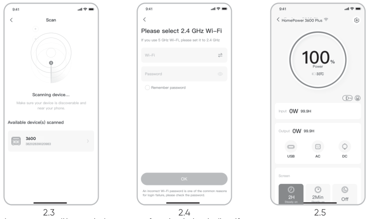

Les captures d’écran ci-dessus sont fournies à titre indicatif.

<table class="manual-callout-table manual-callout-table"><tbody><tr><td class="manual-callout-label">ATTENTION</td><td class="manual-callout-body">
L’application Jackery ne peut se connecter qu’à une seule station d’énergie à la fois via Bluetooth. Revenir à la liste des appareils déconnecte automatiquement le Bluetooth. Touchez à nouveau la station d’énergie dans la liste pour vous reconnecter automatiquement.
</td></tr></tbody></table>

## 3. Dissocier l’appareil

Cliquez sur le bouton des paramètres en haut à droite de l’interface principale pour accéder à la page des paramètres. Cliquez sur le bouton de dissociation en bas de la page pour dissocier l’appareil.

## 4. Remarques

### 4.1. Pour activer le Wi-Fi et le Bluetooth :

<ul><li>Le Wi-Fi et le Bluetooth sont automatiquement activés, une fois l’appareil allumé. Leurs icônes s’allument sur l’écran.</li><li>Appuyez simultanément sur le bouton d’alimentation USB et le bouton d’alimentation CA jusqu’à ce que les icônes Wi-Fi et Bluetooth s’allument sur l’écran.</li></ul>

### 4.2. Pour désactiver le Wi-Fi et le Bluetooth :

<ul><li>Appuyez simultanément sur le bouton d’alimentation USB et le bouton d’alimentation CA jusqu’à ce que les icônes Wi-Fi et Bluetooth s’éteignent de l’écran.</li><li>Le Wi-Fi et le Bluetooth sont automatiquement désactivés si aucun appareil n'est connecté dans les 2 heures.</li></ul>

### 4.3. Pour réinitialiser le Wi-Fi et le Bluetooth :

Maintenez le bouton d’alimentation principal et le bouton d’alimentation USB enfoncés simultanément pendant 3 secondes pour réinitialiser le Wi-Fi et le Bluetooth aux paramètres d’usine et redémarrer le système. Le compte connecté dans l’application sera dissocié.

# SYSTÈME DE SAUVEGARDE DOMESTIQUE INTELLIGENT (AC ESS) Model: HB3600C-TS05A

<table class="manual-callout-table hb-source-warning-lockup"><tbody><tr><td class="manual-callout-label"><strong>AVERTISSEMENT</strong></td><td class="manual-callout-body">
RISQUE DE CHOC ÉLECTRIQUE. VEILLEZ TOUJOURS À CE QUE TOUS LES ÉQUIPEMENTS ÉLECTRIQUES SOIENT MIS HORS TENSION EN TOUTE SÉCURITÉ AVANT DE COMMENCER LE TRAVAIL.
</td></tr></tbody></table>

Utilisez le câble d’entrée/sortie d’alimentation inclus dans l’emballage du ATS pour connecter le port d’extension CA du HomePower 3600 Pro Max au port d’entrée/sortie CA du ATS. Utilisez le câble d’extension inclus dans l’emballage du bloc-batterie pour connecter le HomePower 3600 Pro Max au bloc-batterie, c’est-à-dire pour relier son port d’extension CC (A) au port d’extension CC (B) du bloc-batterie.

<figure class="hb-reference-figure hb-base-art-live-copy" data-component-id="HB-SPECIAL-REFERENCE-FIGURE" data-reference-id="ess_connection" data-source-fragment-sha256="b0270152fb7b06f614fe4ec18729a2e9a7846f7e4215e19ebdb6f6196ac26016" data-web-base-art-ref="assets/ess_connection.png" data-web-presentation-mode="base-art-live-copy" data-web-replace-key="reference.ess-connection">

Câble d’entrée/sortie d’alimentation dans l’emballage du ATSCâble d’extension dans l’emballage du bloc-batteriePour des instructions détaillées sur l’installation et le raccordement, consultez les manuels d’utilisation du ATS et du bloc-batterie.

</figure>

<table class="manual-callout-table manual-callout-table"><tbody><tr><td class="manual-callout-label">ATTENTION</td><td class="manual-callout-body">
Position d’installation du système de sauvegarde domestique intelligent (AC ESS)
<ul><li>Installation en intérieur.</li><li>L’espace doit être complètement étanche.</li><li>Le mur doit être plat et nivelé.</li><li>Plage de température ambiante : -4 °F à 113 °F (-20 °C à 45 °C);</li><li>La température et l’humidité doivent être maintenues à un niveau constant.</li><li>Installer dans un endroit bien ventilé.</li><li>Ne pas installer dans une zone accessible aux enfants ou aux animaux domestiques.</li><li>L’emplacement d’installation doit éviter l’exposition directe au soleil.</li><li>Aucun matériau inflammable ou explosif ne doit se trouver à proximité de l’onduleur et de la batterie.</li></ul></td></tr></tbody></table>

# SPÉCIFICATIONS Model: JHP-3600C

<h2 aria-level="2" class="hb-spec-group" role="heading">INFORMATIONS GÉNÉRALES</h2>

<figure aria-label="INFORMATIONS GÉNÉRALES" class="hb-spec-table-composition"><table class="manual-table manual-spec-table hb-spec-table"><colgroup><col class="hb-spec-col-label"/><col class="hb-spec-col-value"/></colgroup><tbody><tr><th class="manual-spec-label hb-spec-label" scope="row">Nom du produit</th><td class="manual-spec-value hb-spec-value">Jackery HomePower 3600 Pro Max</td></tr><tr><th class="manual-spec-label hb-spec-label" scope="row">N° modèle</th><td class="manual-spec-value hb-spec-value">JHP-3600C</td></tr><tr><th class="manual-spec-label hb-spec-label" scope="row">Capacité</th><td class="manual-spec-value hb-spec-value">80 Ah / 44,8 V DC (3584 Wh)</td></tr><tr><th class="manual-spec-label hb-spec-label" scope="row">Cellule Chimique</th><td class="manual-spec-value hb-spec-value">LiFePO4</td></tr><tr><th class="manual-spec-label hb-spec-label" scope="row">Poids</th><td class="manual-spec-value hb-spec-value">Environ 73,85 lb / 33,5 kg</td></tr><tr><th class="manual-spec-label hb-spec-label" scope="row">Dimensions</th><td class="manual-spec-value hb-spec-value">14,76 × 10,83 × 17,72 po / 37,5 × 27,5 × 45,0 cm</td></tr><tr><th class="manual-spec-label hb-spec-label" scope="row">Durée de vie</th><td class="manual-spec-value hb-spec-value">6000 cycles (capacité conservée ≥ 70 % SOH)</td></tr><tr><th class="manual-spec-label hb-spec-label" scope="row">Courant et durée maximum du court-circuit</th><td class="manual-spec-value hb-spec-value">1520A, 2.56ms</td></tr><tr><th class="manual-spec-label hb-spec-label" scope="row">UPS (ASI)</th><td class="manual-spec-value hb-spec-value">&lt;10 ms</td></tr><tr><th class="manual-spec-label hb-spec-label" scope="row">Topologie de l’onduleur</th><td class="manual-spec-value hb-spec-value">Isolée</td></tr><tr><th class="manual-spec-label hb-spec-label" scope="row">Facteur de puissance</th><td class="manual-spec-value hb-spec-value">≥0.98</td></tr><tr><th class="manual-spec-label hb-spec-label" scope="row">Unité complète</th><td class="manual-spec-value hb-spec-value">Type 1</td></tr></tbody></table></figure>

<h2 aria-level="2" class="hb-spec-group" role="heading">PORTS D’ENTRÉE</h2>

<figure aria-label="PORTS D’ENTRÉE" class="hb-spec-table-composition"><table class="manual-table manual-spec-table hb-spec-table"><colgroup><col class="hb-spec-col-label"/><col class="hb-spec-col-value"/></colgroup><tbody><tr><th class="manual-spec-label hb-spec-label" rowspan="2" scope="row">1 × Entrée CA</th><td class="manual-spec-value hb-spec-value">Mode charge : 100 V-120 V~ 60 Hz, 15 A max., 1800 W</td></tr><tr><td class="manual-spec-value hb-spec-value">Mode dérivation① : 100 V-120 V~ 60 Hz, 12 A max., 1440 W</td></tr><tr><th class="manual-spec-label hb-spec-label" scope="row">2 × Ports DC8020</th><td class="manual-spec-value hb-spec-value">12–16 V⎓8 A max., double à 8 A max. 16-60 V②⎓12 A max., double jusqu’a 24 A, 1200 W max.</td></tr></tbody></table></figure>

<h2 aria-level="2" class="hb-spec-group" role="heading">PORTS DE SORTIE</h2>

<figure aria-label="PORTS DE SORTIE" class="hb-spec-table-composition"><table class="manual-table manual-spec-table hb-spec-table"><colgroup><col class="hb-spec-col-label"/><col class="hb-spec-col-value"/></colgroup><tbody><tr><th class="manual-spec-label hb-spec-label" scope="row">2 × Sorties CA (NEMA 5-20R)</th><td class="manual-spec-value hb-spec-value">120 V~ 60 Hz, 16,7 A max., 2000 W par port, 4000 W au total</td></tr><tr><th class="manual-spec-label hb-spec-label" scope="row">1 × Sortie CA (NEMA 14-50R)</th><td class="manual-spec-value hb-spec-value">240 V~ 60 Hz, 16,7 A max., 4000 W nominal, 8000 W crête</td></tr><tr><th class="manual-spec-label hb-spec-label" scope="row">Sortie totale CA③</th><td class="manual-spec-value hb-spec-value">4000 W nominal, 8000 W crête</td></tr><tr><th class="manual-spec-label hb-spec-label" rowspan="2" scope="row">AC Output in Bypass Mode①</th><td class="manual-spec-value hb-spec-value"><strong>Entrée CA 120 V :</strong> NEMA 5-20R: 100V-120V~ 60Hz, 12A Max, 1440W Max per port, 1440W④ in Total NEMA 14-50R: 240V~ 60Hz, 1440W④ Max</td></tr><tr><td class="manual-spec-value hb-spec-value"><strong>Entrée CA 240 V :</strong> NEMA 5-20R : 100 V-120 V~ 60 Hz, 20 A max., 2400 W par port, 4800 W au total NEMA 14-50R : 240 V~ 60 Hz, 40 A max., 9600 W max.</td></tr><tr><th class="manual-spec-label hb-spec-label" scope="row">1 × Sortie USB-C</th><td class="manual-spec-value hb-spec-value">100 W max., 5 V⎓3 A, 9 V⎓3 A, 12 V⎓3 A, 15 V⎓3 A, 20 V⎓5 A</td></tr><tr><th class="manual-spec-label hb-spec-label" scope="row">1 × Sortie USB-A</th><td class="manual-spec-value hb-spec-value">18 W max., 5–6 V⎓3 A, 6–9 V⎓2 A, 9–12 V⎓1,5 A</td></tr></tbody></table></figure>

<h2 aria-level="2" class="hb-spec-group" role="heading">PORTS D’EXTENSION</h2>

<figure aria-label="PORTS D’EXTENSION" class="hb-spec-table-composition"><table class="manual-table manual-spec-table hb-spec-table"><colgroup><col class="hb-spec-col-label"/><col class="hb-spec-col-value"/></colgroup><tbody><tr><th class="manual-spec-label hb-spec-label" scope="row">1 × Port d’extension CA</th><td class="manual-spec-value hb-spec-value">240 V~ 60 Hz, 16,7 A max., 4000 W max.</td></tr><tr><th class="manual-spec-label hb-spec-label" scope="row">1 × Port d’extension CC</th><td class="manual-spec-value hb-spec-value">36,4 V-50,4 V⎓126 A max. (Entrée) 36,4 V-50,4 V⎓60 A max. (Sortie)</td></tr></tbody></table></figure>

<h2 aria-level="2" class="hb-spec-group" role="heading">SPÉCIFICATIONS ENVIRONNEMENTALES</h2>

<figure aria-label="SPÉCIFICATIONS ENVIRONNEMENTALES" class="hb-spec-table-composition"><table class="manual-table manual-spec-table hb-spec-table"><colgroup><col class="hb-spec-col-label"/><col class="hb-spec-col-value"/></colgroup><tbody><tr><th class="manual-spec-label hb-spec-label" scope="row">Température de charge</th><td class="manual-spec-value hb-spec-value">-4 °F à 113 °F (-20 °C à 45 °C)</td></tr><tr><th class="manual-spec-label hb-spec-label" scope="row">Température de décharge</th><td class="manual-spec-value hb-spec-value">-4 °F à 113 °F (-20 °C à 45 °C)</td></tr><tr><th class="manual-spec-label hb-spec-label" scope="row">Altitude</th><td class="manual-spec-value hb-spec-value">≤3000m</td></tr></tbody></table></figure>

※ USB Type-C® et USB-C® sont des marques déposées de USB Implementers Forum.

① Le produit peut charger la batterie à partir d’une prise murale CA ou via du ATS tout en fournissant de l’énergie via les ports de sortie CA.

② Indique la tension de fonctionnement (Vmp) admissible du panneau solaire.

③ Indique que deux ports de sortie CA ou plus fonctionnent ensemble.

④ Lorsqu’il est connecté à des charges supérieures à 1440 W sous une entrée CA 120 V, le produit prélève de l’énergie de la batterie pour répondre à une demande de charge totale allant jusqu’à 2880 W.

# Jackery Battery Pack 3600 VENDU SÉPARÉMENT

<h2 aria-level="2" class="hb-spec-group" role="heading">INFORMATIONS GÉNÉRALES</h2>

<figure aria-label="INFORMATIONS GÉNÉRALES" class="hb-spec-table-composition"><table class="manual-table manual-spec-table hb-spec-table"><colgroup><col class="hb-spec-col-label"/><col class="hb-spec-col-value"/></colgroup><tbody><tr><th class="manual-spec-label hb-spec-label" scope="row">Nom du produit</th><td class="manual-spec-value hb-spec-value">Jackery Battery Pack 3600</td></tr><tr><th class="manual-spec-label hb-spec-label" scope="row">N° modèle</th><td class="manual-spec-value hb-spec-value">JBP-3600A</td></tr><tr><th class="manual-spec-label hb-spec-label" scope="row">Capacité</th><td class="manual-spec-value hb-spec-value">80 Ah / 44,8 V DC (3584 Wh)</td></tr><tr><th class="manual-spec-label hb-spec-label" scope="row">Cellule Chimique</th><td class="manual-spec-value hb-spec-value">LiFePO4</td></tr><tr><th class="manual-spec-label hb-spec-label" scope="row">Poids</th><td class="manual-spec-value hb-spec-value">Environ 55,1 lbs / 25 kg</td></tr><tr><th class="manual-spec-label hb-spec-label" scope="row">Dimensions</th><td class="manual-spec-value hb-spec-value">14,8 x 12,5 x 9,0 po/37,5 x 31,7x 22,9 cm</td></tr><tr><th class="manual-spec-label hb-spec-label" scope="row">Durée de vie</th><td class="manual-spec-value hb-spec-value">Capacité de 6000 cycles à 70 % ou plus</td></tr></tbody></table></figure>

<h2 aria-level="2" class="hb-spec-group" role="heading">PORTS D’ENTRÉE/SORTIE</h2>

<figure aria-label="PORTS D’ENTRÉE/SORTIE" class="hb-spec-table-composition"><table class="manual-table manual-spec-table hb-spec-table"><colgroup><col class="hb-spec-col-label"/><col class="hb-spec-col-value"/></colgroup><tbody><tr><th class="manual-spec-label hb-spec-label" scope="row">Port d’extension CC (Entrée)</th><td class="manual-spec-value hb-spec-value">36,4 V-50,4 V⎓60 A max.</td></tr><tr><th class="manual-spec-label hb-spec-label" scope="row">Port d’extension CC (Sortie)</th><td class="manual-spec-value hb-spec-value">36,4 V-50,4 V⎓100 A max.</td></tr><tr><th class="manual-spec-label hb-spec-label" scope="row">Maximum Short Circuit Current and Duration</th><td class="manual-spec-value hb-spec-value">1160A/860μs</td></tr></tbody></table></figure>

<h2 aria-level="2" class="hb-spec-group" role="heading">TEMPÉRATURE DE FONCTIONNEMENT</h2>

<figure aria-label="TEMPÉRATURE DE FONCTIONNEMENT" class="hb-spec-table-composition"><table class="manual-table manual-spec-table hb-spec-table"><colgroup><col class="hb-spec-col-label"/><col class="hb-spec-col-value"/></colgroup><tbody><tr><th class="manual-spec-label hb-spec-label" scope="row">Température de charge</th><td class="manual-spec-value hb-spec-value">-4°F to 113°F / -20°C to 45°C</td></tr><tr><th class="manual-spec-label hb-spec-label" scope="row">Température de décharge</th><td class="manual-spec-value hb-spec-value">-4°F to 113°F / -20°C to 45°C</td></tr></tbody></table></figure>

# Jackery Automatic Transfer Switch VENDU SÉPARÉMENT

<h2 aria-hidden="true" aria-level="2" class="hb-spec-group hb-source-hidden-heading" role="heading">Jackery Automatic Transfer Switch</h2>

<figure aria-label="Jackery Automatic Transfer Switch" class="hb-spec-table-composition"><table class="manual-table manual-spec-table hb-spec-table"><colgroup><col class="hb-spec-col-label"/><col class="hb-spec-col-value"/></colgroup><tbody><tr><th class="manual-spec-label hb-spec-label" scope="row">Nom du produit</th><td class="manual-spec-value hb-spec-value">Jackery Automatic Transfer Switch</td></tr><tr><th class="manual-spec-label hb-spec-label" scope="row">N° modèle</th><td class="manual-spec-value hb-spec-value">JA-TS05A</td></tr><tr><th class="manual-spec-label hb-spec-label" scope="row">Tension CA (nominale)</th><td class="manual-spec-value hb-spec-value">120V/240V~ 60Hz</td></tr><tr><th class="manual-spec-label hb-spec-label" scope="row">Type d’alimentation</th><td class="manual-spec-value hb-spec-value">Réseau monophasé à point milieu</td></tr><tr><th class="manual-spec-label hb-spec-label" scope="row">Courant d’entrée maximal</th><td class="manual-spec-value hb-spec-value">100 A Réseau / 84 A Station d’énergie</td></tr><tr><th class="manual-spec-label hb-spec-label" scope="row">Courant de sortie maximal</th><td class="manual-spec-value hb-spec-value">100 A Charge domestique/ 33,4 A Station d’énergie</td></tr><tr><th class="manual-spec-label hb-spec-label" scope="row">Courant de court-circuit d’entrée maximal</th><td class="manual-spec-value hb-spec-value">10 KA</td></tr><tr><th class="manual-spec-label hb-spec-label" scope="row">Consommation électrique en mode veille</th><td class="manual-spec-value hb-spec-value">Environ 5 W</td></tr><tr><th class="manual-spec-label hb-spec-label" scope="row">Catégorie de surtension</th><td class="manual-spec-value hb-spec-value">IV</td></tr><tr><th class="manual-spec-label hb-spec-label" scope="row">UPS (ASI)</th><td class="manual-spec-value hb-spec-value">≤20 ms</td></tr><tr><th class="manual-spec-label hb-spec-label" scope="row">Type d’enveloppe</th><td class="manual-spec-value hb-spec-value">Boîtier de distribution : NEMA type 3R Boîtier de prise : NEMA type 1</td></tr><tr><th class="manual-spec-label hb-spec-label" scope="row">Degré de pollution</th><td class="manual-spec-value hb-spec-value">III</td></tr><tr><th class="manual-spec-label hb-spec-label" scope="row">Circuit principal</th><td class="manual-spec-value hb-spec-value">2 AWG (100 A)</td></tr><tr><th class="manual-spec-label hb-spec-label" scope="row">Circuit de charge</th><td class="manual-spec-value hb-spec-value">2 AWG (100 A)</td></tr><tr><th class="manual-spec-label hb-spec-label" scope="row">Communication</th><td class="manual-spec-value hb-spec-value">Wi-Fi et Bluetooth</td></tr><tr><th class="manual-spec-label hb-spec-label" scope="row">Dimensions</th><td class="manual-spec-value hb-spec-value">27 × 14,4 × 5,7 in/ 68,5 × 36,5 × 14,4 cm</td></tr><tr><th class="manual-spec-label hb-spec-label" scope="row">Poids</th><td class="manual-spec-value hb-spec-value">Environ 23,1 lbs/10,5 kg</td></tr><tr><th class="manual-spec-label hb-spec-label" scope="row">Température de fonctionnement</th><td class="manual-spec-value hb-spec-value">-4 °F à 122 °F / -20 °C à 50 °C</td></tr></tbody></table></figure>

## LISTE DU COLIS

### Jackery HomePower 3600 Pro Max

<ul class="hb-package-grid"><li class="hb-package-item">

Jackery HomePower 3600 Pro Max
</li><li class="hb-package-item">

Câble de charge CA
</li><li class="hb-package-item">

Bornier à vis
</li><li class="hb-package-item">

Documents
</li></ul>

### Jackery Battery Pack 3600 — Vendu séparément

<ul class="hb-package-grid"><li class="hb-package-item">

Jackery Battery Pack 3600
</li><li class="hb-package-item">

Câble de rallonge
</li><li class="hb-package-item">

Manuel d’utilisation
</li><li class="hb-package-availability">
Vendu séparément
</li></ul>

### Jackery Automatic Transfer Switch — Vendu séparément

<ul class="hb-package-grid hb-package-grid--five"><li class="hb-package-item">

Jackery Automatic Transfer Switch
</li><li class="hb-package-item">

Modèle de marquage
</li><li class="hb-package-item">

Modèle de marquage Entrée/ sortie d’alimentation Câble
</li><li class="hb-package-item">

Fil neutre
</li><li class="hb-package-item">
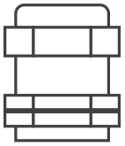

Presse-étoupe
</li><li class="hb-package-item">
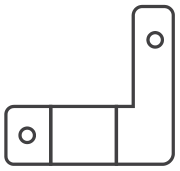

Cavalier de liaison neutre-terre (avec vis)
</li><li class="hb-package-item">

Manuel du propriétaire
</li><li class="hb-package-item">

Manuel d’installation
</li><li class="hb-package-item">

Guide de démarrage rapide
</li><li class="hb-package-availability">
Vendu séparément
</li></ul>

# CONTACTEZ-NOUS

JACKERY INC.

5310 Bunche Dr., Fremont, CA 94538-8301

1-888-502-2236 (US)

hello@jackery.com

www.jackery.com

