

# Jackery HomePower 3600 Pro Max User Manual

## IMPORTANT

Congratulations on your new Jackery HomePower 3600 Pro Max. Please read this manual carefully before using the product, particularly the relevant precautions to ensure proper use. Keep this manual in an accessible place for future reference.

In compliance with laws and regulations, the right of final interpretation of this document and all related documents of this product resides with the Company. Although every effort has been made to ensure the accuracy of this manual, Jackery Inc. assumes no responsibility for any errors that may appear.

Please note that no further notifications will be given in case of any update, revision, or termination. For the latest version of the product manuals, visit support.jackery.com.

* The images are for reference purposes only. Please refer to the actual product.

# IMPORTANT SAFETY INFORMATION

<figure class="hb-symbol-signal-composition hb-safety-instruction"><table class="manual-callout-table manual-callout-table hb-symbol-signal-table"><tbody><tr><td class="manual-callout-label hb-symbol-signal-label-cell"><strong>WARNING</strong></td><td class="manual-callout-body hb-symbol-signal-meaning-cell">
<strong>INSTRUCTIONS PERTAINING TO RISK OF FIRE, ELECTRIC SHOCK, OR INJURY TO PERSONS</strong>
</td></tr></tbody></table></figure>

<table class="manual-two-col-table"><tbody><tr><td>
<strong>Always follow these basic precautions when using this product.</strong>
<ul><li>Read all the instructions before using the product.</li><li>Do not allow children to play on the product. Close supervision of children is necessary when the product is used near children.</li><li>Avoid placing hands or fingers inside the product.</li><li>Stop using the product immediately if it has been physically damaged or modified. Improper use of the product may cause unpredictable behavior, leading to fire, explosion, or injury.</li><li>If any of the following are observed, including but not limited to overheats, emits unusual odors or smoking, leaks, or burns, stop using the product immediately and contact the dealer or our Customer Support.</li><li>Never attempt to open, repair, or modify the product. Any tampering, reassembly, or modification of the product can result in electric shock, fire, or battery damage.</li></ul></td><td><ul><li>Be aware that liquid ejected from the product may cause irritation or burns. Inappropriate or abusive use may lead to battery leakage. Avoid direct contact with leaking liquid. If the liquid contacts your eyes, seek medical help immediately. If it contacts other body parts, flush with running water and consult a medical professional without delay.</li><li>Do not expose the product to fire or excessive temperatures. Doing so may result in an explosion if the temperature exceeds 130°C (265°F).</li><li>Any use of unrecommended or non-supplied materials or parts with the product may result in a risk of fire, electric shock, or personal injury.</li><li>Do not leave the battery charging unattended for long periods. Always monitor the charging process to ensure safe operation.</li><li>To reduce the risk of electric shock, unplug the product from any power source before attempting any technical service or troubleshooting.</li></ul></td></tr></tbody></table>

## OPERATING INSTRUCTIONS

<table class="manual-two-col-table"><tbody><tr><td>
<strong>SAVE THESE INSTRUCTIONS</strong>
<ul><li>Stop using the product immediately if it shows signs of damage. Discontinue use and contact customer support for assistance.</li><li>Do not charge the battery in extremely hot or cold environments and strictly adhere to the product's specified operating temperature ranges:<ul><li>Charging temperature: -4°F to 113°F (-20°C to 45°C )</li><li>Discharging temperature: -4°F to 113°F (-20°C to 45°C )</li></ul></li><li>To ensure proper air circulation, keep the product vents uncovered. The area where the product is used must have adequate airflow in a cool, dry environment to prevent overheating.<ul><li>Charging in damp or poorly ventilated spaces may cause safety hazards.</li><li>Water can cause short circuits or damage to the charger, leading to safety risks.</li></ul></li><li>Unplug the power cord from a power outlet during a storm.</li><li>Immediately turn off the product by pressing the power button if it has fallen, been dropped, or exposed to vibrations.</li></ul></td><td><ul><li>Ensure the device(s) are powered off before connecting them to the product.</li><li>Do not charge the product using a damaged or broken charging cord or plug.</li><li>Do not use the product to charge any device with a damaged or broken cable or plug.</li><li>Always unplug the charging cord by pulling the plug, not the cord, to reduce the risk of damage.</li><li>Ensure the product is properly secured when transporting it in a moving vehicle.</li><li>DO NOT place the unit upside down or on its side during use or storage.</li><li>DO NOT place the product on the floor or at a height less than 18 inches (457 mm) above the floor during operation in a workshop or repair facility.</li><li>DO NOT use the product's accessories with other devices or equipment.</li><li>Solar charge time depends on weather conditions. Place your solar panel where it will get as much direct sunlight as possible.</li></ul></td></tr></tbody></table>

## GROUNDING INSTRUCTIONS

This product must be grounded. If it should malfunction or breakdown, grounding provides a path of least resistance for electric current to reduce the risk of electric shock. This product is equipped with a cord having an equipment grounding conductor and a grounding plug. The plug must be plugged into an outlet that is properly installed and grounded in accordance with all local codes ordinances.

<table class="manual-callout-table manual-callout-table"><tbody><tr><td class="manual-callout-label">WARNING</td><td class="manual-callout-body">
Improper connection of the equipment grounding conductor is able to result in a risk of electric shock. Check with a qualified electrician if you are in doubt as to whether the product is properly grounded. Do not modify the plug provided with the product – if it will not fit the outlet, have a proper outlet installed by a qualified electrician.
</td></tr></tbody></table>

<table class="manual-callout-table manual-callout-table"><tbody><tr><td class="manual-callout-label">DANGER</td><td class="manual-callout-body">
This device is intended for indoor use only (Please place this device in a similar indoor environment when using it outdoors, e.g., Home, RVs, tents, cabins, etc.). ※ This device is not waterproof or dustproof. Keep away from rain and humid environments during use.
</td></tr></tbody></table>

## USER MAINTENANCE INSTRUCTIONS

During the lifecycle of energy storage products, a certain degree of capacity and energy degradation is expected. As the number of charge and discharge cycles increases and storage time extends, this degradation will gradually intensify, which is a normal phenomenon consistent with the natural aging of battery cells.

# MEANING OF SYMBOLS

<figure aria-label="MEANING OF SYMBOLS" class="hb-symbol-signal-composition" data-component-id="HB-TABLE-SYMBOL-SIGNAL"><table class="hb-symbol-signal-table"><colgroup><col class="hb-symbol-signal-col-label"/><col class="hb-symbol-signal-col-meaning"/></colgroup><thead><tr><th class="hb-symbol-signal-label-heading" scope="col">
Symbol
</th><th class="hb-symbol-signal-meaning-heading" scope="col">
Meaning
</th></tr></thead><tbody><tr><td class="hb-symbol-signal-label-cell">⚠WARNING</td><td class="hb-symbol-signal-meaning-cell">
Hazardous practices that may result in severe injury, death, and/or property  damage.
</td></tr><tr><td class="hb-symbol-signal-label-cell">⚠CAUTION</td><td class="hb-symbol-signal-meaning-cell">
Hazardous practices that may result in personal injury and/or property  damage.
</td></tr><tr><td class="hb-symbol-signal-label-cell">NOTE</td><td class="hb-symbol-signal-meaning-cell">
Hazardous practices that may result in equipment damage, data loss,  performance deterioration, or unanticipated results.
</td></tr><tr><td class="hb-symbol-signal-label-cell">TIP</td><td class="hb-symbol-signal-meaning-cell">
Supplements the important information or operation tips in the text.
</td></tr></tbody></table></figure>

<figure aria-label="Safety pictograms" class="hb-symbol-pair-composition" data-component-id="HB-TABLE-SYMBOL-ICON">

<table class="hb-symbol-panel-table"><colgroup><col class="hb-symbol-col-icon"/><col class="hb-symbol-col-meaning"/></colgroup><thead><tr><th class="hb-symbol-icon-heading" scope="col">Symbol</th><th class="hb-symbol-meaning-heading" scope="col">Meaning</th></tr></thead><tbody><tr><td class="hb-symbol-icon"></td><td class="hb-symbol-meaning">Warning and Caution Symbols. Must read to alert individuals to potential hazards or risks.</td></tr><tr><td class="hb-symbol-icon"></td><td class="hb-symbol-meaning">Read the user manual before operation.</td></tr><tr><td class="hb-symbol-icon"></td><td class="hb-symbol-meaning">Risk of electric shock</td></tr><tr><td class="hb-symbol-icon"></td><td class="hb-symbol-meaning">Battery charging</td></tr><tr><td class="hb-symbol-icon"></td><td class="hb-symbol-meaning">Explosive material</td></tr><tr><td class="hb-symbol-icon"></td><td class="hb-symbol-meaning">Heavy object</td></tr></tbody></table>

<table class="hb-symbol-panel-table"><colgroup><col class="hb-symbol-col-icon"/><col class="hb-symbol-col-meaning"/></colgroup><thead><tr><th class="hb-symbol-icon-heading" scope="col">Symbol</th><th class="hb-symbol-meaning-heading" scope="col">Meaning</th></tr></thead><tbody><tr><td class="hb-symbol-icon"></td><td class="hb-symbol-meaning">Do not dismantle the product.</td></tr><tr><td class="hb-symbol-icon"></td><td class="hb-symbol-meaning">Keep the product away from fire.</td></tr><tr><td class="hb-symbol-icon"></td><td class="hb-symbol-meaning">Keep away from children.</td></tr><tr><td class="hb-symbol-icon"></td><td class="hb-symbol-meaning">This symbol indicates that a lithium-ion (Li-ion) battery is inside the product and should be disposed of or recycled properly.</td></tr><tr><td class="hb-symbol-icon"></td><td class="hb-symbol-meaning">This symbol indicates that the product shall not be disposed of as household waste, and should be delivered to a designated collection facility for recycling. Proper disposal and recycling can help protect the environment. For more information about the disposal and recycling of this product, contact your local community, disposal service, or dealer.</td></tr></tbody></table>

</figure>

# FCC

<figure aria-label="FCC" class="hb-fcc-composition" data-component-id="HB-SPECIAL-FCC">

This device complies with part 15 of the FCC Rules. Operation is subject to the following two conditions: (1) This device may not cause harmful interference, and (2) This device must accept any interference received, including interference that may cause undesired operation.

<strong>NOTE:</strong> This equipment has been tested and found to comply with the limits for a Class B digital device, pursuant to part 15 of the FCC Rules. These limits are designed to provide reasonable protection against harmful interference in a residential installation. This equipment generates, uses, and can radiate radio frequency energy and, if not installed and used in accordance with the instructions, may cause harmful interference to communications. However, there is no guarantee that radio interference will not occur in a particular installation. If this equipment does cause harmful interference to radio or television reception, which can be determined by turning the equipment off and on, the user is encouraged to try to correct the interference by one or more of the following measures:

<ul class="simple"><li>
Reorient or relocate the receiving antenna.
</li><li>
Increase the separation between the equipment and receiver.
</li><li>
Connect the equipment into an outlet on a circuit different from that to which the receiver is connected.
</li><li>
Consult the dealer or an experienced radio/TV technician for help.
</li></ul>
<strong>MODIFICATION:</strong> Any changes or modifications not expressly approved by the grantee of this device could void the user’s authority to operate the device.

</figure>

# WHAT'S IN THE BOX

<figure aria-label="WHAT'S IN THE BOX" class="hb-inbox-composition" data-card-count="4" data-component-id="HB-SPECIAL-INBOX" data-inbox-variant="responsive-card-grid"><ol class="hb-inbox-grid"><li class="hb-inbox-card" data-item-number="1">

Jackery HomePower 3600 Pro Max

</li><li class="hb-inbox-card" data-item-number="2">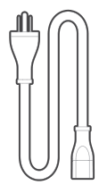

AC Charging Cable

</li><li class="hb-inbox-card" data-item-number="3">

Screw terminal block

</li><li class="hb-inbox-card" data-item-number="4">

Documents

</li></ol>

TIPS

The car charging cable is not included but is available for purchase separately  on our website. For assistance, please contact Jackery customer service.

</figure>

# PRODUCT OVERVIEW

## FRONT VIEW

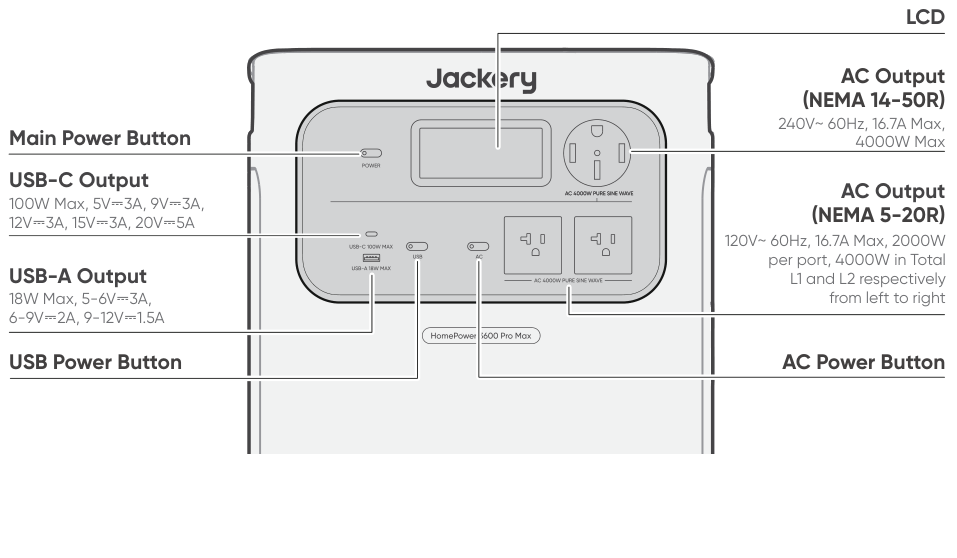

## RIGHT SIDE VIEW

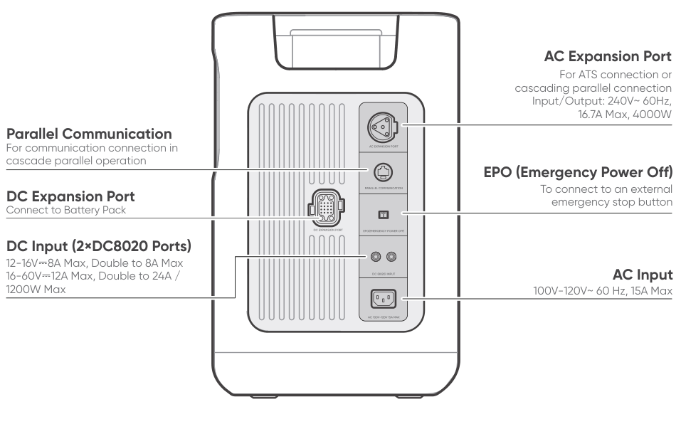

# LCD DISPLAY

<figure aria-label="LCD DISPLAY" class="hb-lcd-table-composition" data-component-id="HB-TABLE-LCD-ICON" tabindex="0"><table class="hb-lcd-icon-table"><colgroup><col class="hb-lcd-col-number"/><col class="hb-lcd-col-icon"/><col class="hb-lcd-col-name"/><col class="hb-lcd-col-description"/></colgroup><tbody><tr><td class="hb-lcd-number">
1
</td><td class="hb-lcd-icon"></td><td class="hb-lcd-name">
Wi-Fi
</td><td class="hb-lcd-description">
<strong>On:</strong> Wi-Fi connected. <strong>Blink:</strong> Ready to connect to Wi-Fi. <strong>Off:</strong> Wi-Fi disconnected.
</td></tr><tr><td class="hb-lcd-number">
2
</td><td class="hb-lcd-icon"></td><td class="hb-lcd-name">
Bluetooth
</td><td class="hb-lcd-description">
<strong>On:</strong> Bluetooth Connected. <strong>Blink:</strong> Ready to connect to Bluetooth. <strong>Off:</strong> Bluetooth disconnected.
</td></tr><tr><td class="hb-lcd-number">
3
</td><td class="hb-lcd-icon"></td><td class="hb-lcd-name">
Quiet Charging Mode
</td><td class="hb-lcd-description">
<strong>On:</strong> The noise during charging is significantly minimized, while the charging power is reduced, and the charging speed slows down. <strong>Off:</strong> Quiet Charging Mode is disabled. Enable/disable this feature in the Jackery App. The setting is retained when the device is powered off.
</td></tr><tr><td class="hb-lcd-number">
4
</td><td class="hb-lcd-icon"></td><td class="hb-lcd-name">
Battery Saving Mode
</td><td class="hb-lcd-description">
<strong>On:</strong> Limits the maximum usable capacity of the battery to extend its life. <strong>Off:</strong> Battery Saving Mode is disabled. Enable/disable this feature in the Jackery App. The setting is retained when the device is powered off. Note 1: This feature is not available when the product is connected to battery pack(s). Note 2: When this feature is enabled, the product occasionally performs a full charge and discharge cycle to calibrate the SOC.
</td></tr><tr><td class="hb-lcd-number">
5
</td><td class="hb-lcd-icon"></td><td class="hb-lcd-name">
Charging Plan
</td><td class="hb-lcd-description">
Customizes the charging time of the product. Suitable for situations with fluctuating electricity prices, it allows for charging plans based on peak and off-peak electricity times, reducing electricity costs. Enable/disable this feature in the Jackery App. The setting is retained when the device is powered off.
</td></tr><tr><td class="hb-lcd-number">
6
</td><td class="hb-lcd-icon"></td><td class="hb-lcd-name">
Charging Power Limit
</td><td class="hb-lcd-description">
<strong>On:</strong> Charging Power limit is enabled in the Jackery app. <strong>Off:</strong> Charging Power limit is disabled in the Jackery app. The setting is retained when the device is powered off.
</td></tr><tr><td class="hb-lcd-number">
7
</td><td class="hb-lcd-icon"></td><td class="hb-lcd-name">
Self-powered Mode
</td><td class="hb-lcd-description">
Maximizes the use of solar energy and reduces reliance on grid electricity by prioritizing stored solar energy, reducing electricity costs. The power station must be connected to both solar panels and the grid simultaneously, with the load power limited by bypass power. Enable/disable this feature in the Jackery App. The setting is retained when the device is powered off.
</td></tr><tr><td class="hb-lcd-number">
8
</td><td class="hb-lcd-icon"></td><td class="hb-lcd-name">
TOU Mode
</td><td class="hb-lcd-description">
<strong>On:</strong> TOU mode is enabled (default backup SOC: 60%). During peak periods, the product prioritizes discharging the battery to reduce peak electricity costs when the stored energy exceeds the backup SOC. During off-peak periods, the product charges the battery from the grid to achieve peak-shaving and valley-filling. <strong>Off:</strong> TOU mode is disabled. The product does not follow the TOU (time-of-use) strategy and operates according to the default power supply and charging logic. Enable/disable this feature in the Jackery App. The setting is retained when the device is powered off.
</td></tr><tr><td class="hb-lcd-number">
9
</td><td class="hb-lcd-icon"></td><td class="hb-lcd-name">
Parallel
</td><td class="hb-lcd-description">
<strong>On:</strong> The parallel connection is set up successfully. <strong>Blink:</strong> The parallel connection is setting up. <strong>Off:</strong> The parallel connection is not set up.
</td></tr><tr><td class="hb-lcd-number">
10
</td><td class="hb-lcd-icon"></td><td class="hb-lcd-name">
UPS
</td><td class="hb-lcd-description">
The UPS indicator remains on when grid power is available and turns off when grid power is lost.
</td></tr><tr><td class="hb-lcd-number">
11
</td><td class="hb-lcd-icon"></td><td class="hb-lcd-name">
AC Power Indicator
</td><td class="hb-lcd-description">
The AC output (pure sine wave) is on.
</td></tr><tr><td class="hb-lcd-number">
12
</td><td class="hb-lcd-icon"></td><td class="hb-lcd-name">
Output Voltage and Frequency
</td><td class="hb-lcd-description">
Displays the output voltage and frequency when the AC output is enabled via the AC power button or when the AC Extension port is supplying power. • 120V: Displayed when the product is charging from the 120V AC input while simultaneously delivering power through the AC output ports. • 120/240V: Displayed when the 240V AC output is active, or when the product is connected to a transfer switch and operating in bypass mode.
</td></tr><tr><td class="hb-lcd-number">
13
</td><td class="hb-lcd-icon"></td><td class="hb-lcd-name">
Input Power
</td><td class="hb-lcd-description">
Displays the AC input power used for battery charging in watts.
</td></tr><tr><td class="hb-lcd-number">
14
</td><td class="hb-lcd-icon"></td><td class="hb-lcd-name">
Remaining Charge Time
</td><td class="hb-lcd-description">
Displays the remaining charging time.
</td></tr><tr><td class="hb-lcd-number">
15
</td><td class="hb-lcd-icon"></td><td class="hb-lcd-name">
AC Wall Charging Indicator
</td><td class="hb-lcd-description">
The product is charged via the AC Input using grid power.
</td></tr><tr><td class="hb-lcd-number">
16
</td><td class="hb-lcd-icon"></td><td class="hb-lcd-name">
Car Charging Indicator
</td><td class="hb-lcd-description">
The product is charged via the DC Input (DC8020) using DC 12V (car charging).
</td></tr><tr><td class="hb-lcd-number">
17
</td><td class="hb-lcd-icon"></td><td class="hb-lcd-name">
Solar Charging Indicator
</td><td class="hb-lcd-description">
The product is charged via the DC Input (DC8020) using solar panel(s).
</td></tr><tr><td class="hb-lcd-number" rowspan="2">
18
</td><td class="hb-lcd-icon"></td><td class="hb-lcd-name">
AC Expansion Indicator (Charging)
</td><td class="hb-lcd-description">
The product can be charged from the grid through a Jackery Automatic Transfer Switch (ATS).
</td></tr><tr><td class="hb-lcd-icon"></td><td class="hb-lcd-name">
AC Expansion Indicator (Discharging)
</td><td class="hb-lcd-description">
The product supplies power to your home loads through the connected ATS.
</td></tr><tr><td class="hb-lcd-number">
19
</td><td class="hb-lcd-icon"></td><td class="hb-lcd-name">
Transfer Switch Indicator
</td><td class="hb-lcd-description">
<strong>On:</strong> The product is successfully connected to a transfer switch (ATS). <strong>Off:</strong> The product is not connected to a transfer switch (ATS).
</td></tr><tr><td class="hb-lcd-number">
20
</td><td class="hb-lcd-icon"></td><td class="hb-lcd-name">
EV Charging
</td><td class="hb-lcd-description">
The Ground Adapter (sold separately) is connected to the product successfully.
</td></tr><tr><td class="hb-lcd-number">
21
</td><td class="hb-lcd-icon"></td><td class="hb-lcd-name">
Battery Power Indicator
</td><td class="hb-lcd-description">
When the product is being charged, the orange circle around the battery percentage will light up in sequence. When charging other devices, the orange circle will stay on.
</td></tr><tr><td class="hb-lcd-number">
22
</td><td class="hb-lcd-icon"></td><td class="hb-lcd-name">
Low Battery Indicator
</td><td class="hb-lcd-description">
<strong>On:</strong> The battery level is below 20%. <strong>Blink:</strong> The battery level is below 5%. <strong>Off:</strong> The battery level is not below 20% or the product is charging.
</td></tr><tr><td class="hb-lcd-number">
23
</td><td class="hb-lcd-icon"></td><td class="hb-lcd-name">
Remaining Battery Percentage
</td><td class="hb-lcd-description">
Displays the remaining battery percentage.
</td></tr><tr><td class="hb-lcd-number">
24
</td><td class="hb-lcd-icon"></td><td class="hb-lcd-name">
Smart Meter indicator
</td><td class="hb-lcd-description">
<strong>On:</strong> A smart meter is online. <strong>Off:</strong> No smart meter is added to the system, or the smart meter is offline.
</td></tr><tr><td class="hb-lcd-number">
25
</td><td class="hb-lcd-icon"></td><td class="hb-lcd-name">
Discharge Timer
</td><td class="hb-lcd-description">
<strong>On:</strong> A discharge timer is set. <strong>Off:</strong> No discharge timer is set. Enable/disable this feature in the Jackery App. The setting is not retained when the device is powered off.
</td></tr><tr><td class="hb-lcd-number">
26
</td><td class="hb-lcd-icon"></td><td class="hb-lcd-name">
Connected Batteries
</td><td class="hb-lcd-description">
Displays the quantity of battery packs if any are connected.
</td></tr><tr><td class="hb-lcd-number">
27
</td><td class="hb-lcd-icon"></td><td class="hb-lcd-name">
Energy Saving Mode
</td><td class="hb-lcd-description">
<strong>On:</strong> Energy Saving Mode is enabled. <strong>Off:</strong> Energy Saving Mode is disabled.
</td></tr><tr><td class="hb-lcd-number" rowspan="2">
28
</td><td class="hb-lcd-icon"></td><td class="hb-lcd-name">
High Temperature Indicator
</td><td class="hb-lcd-description">
High temperature protection is triggered. The product may stop functioning until its temperature returns to the normal operating range.
</td></tr><tr><td class="hb-lcd-icon"></td><td class="hb-lcd-name">
Low Temperature Indicator
</td><td class="hb-lcd-description">
Low temperature protection is triggered. The product may stop functioning until its temperature returns to the normal operating range.
</td></tr><tr><td class="hb-lcd-number">
29
</td><td class="hb-lcd-icon"></td><td class="hb-lcd-name">
Fault code
</td><td class="hb-lcd-description">
A product error has occurred. Please refer to the Troubleshooting section for details.
</td></tr><tr><td class="hb-lcd-number">
30
</td><td class="hb-lcd-icon"></td><td class="hb-lcd-name">
Output Power
</td><td class="hb-lcd-description">
Displays the total output power (AC + USB) in watts. Displays OFF for 1 second before the product powers off.
</td></tr><tr><td class="hb-lcd-number">
31
</td><td class="hb-lcd-icon"></td><td class="hb-lcd-name">
Remaining Discharge Time
</td><td class="hb-lcd-description">
Displays the remaining discharging time.
</td></tr></tbody></table></figure>

# OPERATIONS

## POWER ON/OFF

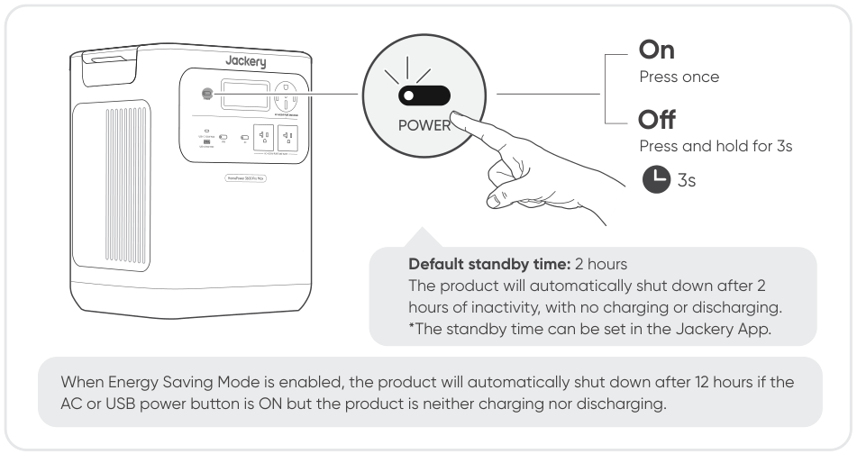

## USB OUTPUT ON/OFF

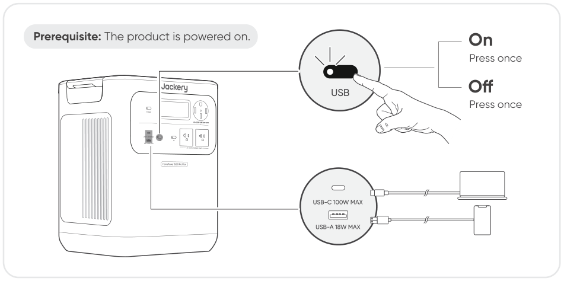

<table class="manual-callout-table manual-callout-table"><tbody><tr><td class="manual-callout-label">CAUTION</td><td class="manual-callout-body"><ul><li>USB-C 100W MAX is a USB-PD Power Source 3 (PS3) high-power output port. If the connected user device or accessory does not meet safety requirements, there may be a fire risk. Before using these ports, ensure that the connected device or accessory has fire safety protection.</li><li>Only connect the Jackery HomePower 3600 Pro Max to devices or accessories that comply with clauses 6.3, 6.4, and 6.5 of IEC/EN/UL 62368-1 (or other equivalent standards).</li><li>To obtain maximum output power, use the USB-C to USB-C 5A cable (20V DC/5A, 100W).</li></ul></td></tr></tbody></table>

## AC OUTPUT ON/OFF

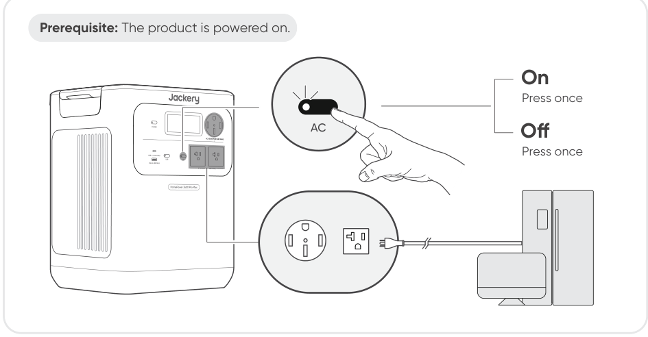

## ENERGY SAVING MODE

<table class="manual-callout-table manual-callout-table"><tbody><tr><td class="manual-callout-label">NOTE</td><td class="manual-callout-body">
Energy Saving Mode resumes its previous state after powering on. Manual switching is required for mode changes.
</td></tr></tbody></table>

## LCD SCREEN

<figure aria-label="LCD SCREEN" class="hb-lcd-mode-composition" data-component-id="HB-TABLE-LCD-MODE">

<table class="hb-lcd-mode-table"><colgroup><col class="hb-lcd-mode-col-state"/><col class="hb-lcd-mode-col-action"/><col class="hb-lcd-mode-col-copy"/></colgroup><tbody><tr><td class="hb-lcd-mode-state" rowspan="3">
Shortly On
</td><td class="hb-lcd-mode-action">
Turn on
</td><td class="hb-lcd-mode-copy">
Press the Main Power Button or when the product is charging.
</td></tr><tr><td class="hb-lcd-mode-action">
Turn off
</td><td class="hb-lcd-mode-copy">
Press the Main Power Button.
</td></tr><tr><td class="hb-lcd-mode-action">
Auto-off
</td><td class="hb-lcd-mode-copy">
The LCD turns off automatically and enters sleep mode after 2 minutes of inactivity.
</td></tr><tr><td class="hb-lcd-mode-state" rowspan="3">
Steady On (in charging or discharging state)
</td><td class="hb-lcd-mode-action">
Turn on
</td><td class="hb-lcd-mode-copy">
Press the Main Power Button twice when the product is powered on.
</td></tr><tr><td class="hb-lcd-mode-action">
Turn off
</td><td class="hb-lcd-mode-copy">
Press the Main Power Button.
</td></tr><tr><td class="hb-lcd-mode-action">
Auto-off
</td><td class="hb-lcd-mode-copy">
The LCD turns off automatically after 2 hours of inactivity.
</td></tr></tbody></table>
</figure>

You can also set the screen display mode in the Jackery App.

## KEY COMBINATION

<figure aria-label="Buttons / Operation / Function" class="hb-key-combination-composition" data-component-id="HB-TABLE-KEY-COMBINATIONS" tabindex="0"><table class="hb-key-combination-table"><colgroup><col class="hb-key-col-buttons"/><col class="hb-key-col-operation"/><col class="hb-key-col-function"/></colgroup><thead><tr><th class="hb-key-buttons" scope="col">Buttons</th><th class="hb-key-operation" scope="col">Operation</th><th class="hb-key-function" scope="col">Function</th></tr></thead><tbody><tr><td class="hb-key-buttons">

Main <strong>POWER</strong> button

 + 

<strong>USB</strong> power button

</td><td class="hb-key-operation">
3s

Press and hold both for 3s
</td><td class="hb-key-function">Reset Wi-Fi and Bluetooth</td></tr><tr><td class="hb-key-buttons">

Main <strong>POWER</strong> button

 + 

<strong>AC</strong> power button

</td><td class="hb-key-operation">
3s

Press and hold both for 3s
</td><td class="hb-key-function">Turn on/off the Energy Saving Mode</td></tr><tr><td class="hb-key-buttons">

<strong>USB</strong> power button

 + 

<strong>AC</strong> power button

</td><td class="hb-key-operation">
1s

Press and hold both for 1s
</td><td class="hb-key-function">Turn on/off Wi-Fi and Bluetooth</td></tr></tbody></table></figure>

## AC AND DC OUTPUT RESUME FUNCTION

This function memorizes the output status and automatically resumes AC and DC outputs under defined conditions.

<figure aria-label="Auto Resume Conditions / Not Auto Resume Conditions" class="hb-auto-resume-composition" data-component-id="HB-TABLE-AUTO-RESUME" tabindex="0"><table class="hb-auto-resume-table"><colgroup><col class="hb-auto-resume-col"/><col class="hb-auto-resume-col"/></colgroup><thead><tr><th class="hb-auto-resume-left" scope="col">Auto Resume Conditions</th><th class="hb-auto-resume-right" scope="col">Not Auto Resume Conditions</th></tr></thead><tbody><tr><td class="hb-auto-resume-left">Power-on/Restart after shutdown or restart</td><td class="hb-auto-resume-right">Manual output off (button/App)</td></tr><tr><td class="hb-auto-resume-left" rowspan="2">Battery SOC ≥ discharge limit +10% after reaching limit</td><td class="hb-auto-resume-right">Energy Saving mode output off</td></tr><tr><td class="hb-auto-resume-right">Protection-triggered output off</td></tr><tr><td class="hb-auto-resume-left">OTA upgrade completed</td><td class="hb-auto-resume-right">Discharge timer-triggered output off</td></tr></tbody></table></figure>

# UNINTERRUPTIBLE POWER SUPPLY (UPS)

An uninterruptible power supply (UPS) is a type of continual power system that provides automated backup electric power to a load when the mains grid power fails. In the event of a sudden loss of grid power, the HomePower 3600 Pro Max will automatically switch to stored power within 10 ms to keep your appliances running. In UPS mode, the unit's peak output varies with grid input voltages before power outages. The actual output power returns to the rated output power during outages.

<table class="manual-callout-table manual-callout-table"><tbody><tr><td class="manual-callout-label">CAUTION</td><td class="manual-callout-body"><ul><li>This product does not support 0 ms switching. Do not connect it to equipment that requires a 0 ms switching power supply, such as data servers or workstations.</li><li>Before use, please test compatibility with your device multiple times.</li><li>Do not connect loads exceeding the maximum output power of the product. Otherwise, overload protection will be triggered.</li></ul></td></tr></tbody></table>

## WITH 120V AC INPUT

Connect the product to a 120V wall outlet using the AC charging cable. Press the AC power button to enable AC power delivery. Total Loads ≤1440 W: The product operates in AC bypass mode. All three AC ports (two NEMA 5-20R and one NEMA 14-50R) can be used. In this condition, the product supports 120 V input with both 120 V and 240 V outputs, and switches to battery power within 10 ms when grid power fails. If only one 120V port is required, use the left NEMA 5-20R (L1) port as the primary connection. Total Loads &gt;1440W: Each NEMA 5-20R port supports up to 1440 W, with a combined maximum of 2880 W across both ports. The NEMA 14-50R port supports up to 2880 W. All three AC ports together support a total output of up to 2880 W. When operating above 1440W with 120V AC input, the product still supports 120V/240V outputs. In this condition, the AC outputs consume battery power. If the battery becomes fully discharged, the connected load may experience overload shutdown and power interruption.

## WITH 240V AC INPUT

Connect the product to a 240V AC power supply using a Jackery 40A Charging Cable (sold separately). Press the AC power button to enable AC power delivery. All AC output ports support UPS operation under 240V input: NEMA 14-50R (240V~ 60Hz): Up to 9600W bypass output NEMA 5-20R ×2 (120V~ 60Hz): Up to 2400W per port, 4800W total bypass output The maximum total load allowed is 4000 W for a single unit and 8000 W for dual units (parallel connection). When the 240V grid power fails, the system automatically switches to battery power with a transfer time of &lt;10 ms. When the battery is depleted, all AC outputs turn off.

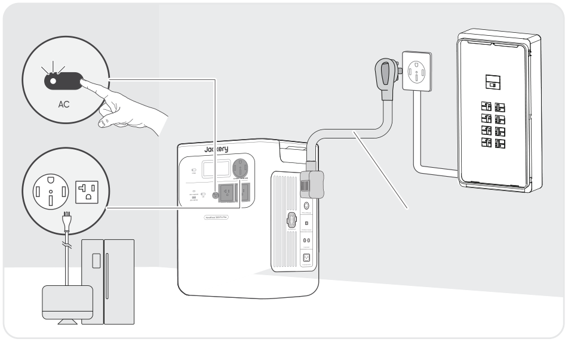

# CONNECTIONS

## CONNECT TO BATTERY PACK(S) SOLD SEPARATELY

This product supports up to 5 battery packs to meet the need for large power capacity. For details on how to use it, please refer to the Jackery Battery Pack 3600 User Manual.

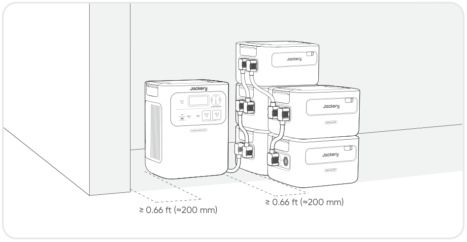

If you are using only one battery pack, you may place it in either of the following configurations:

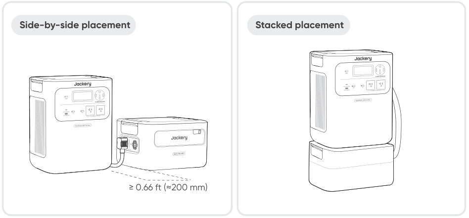

<table class="manual-callout-table manual-callout-table"><tbody><tr><td class="manual-callout-label">CAUTION</td><td class="manual-callout-body"><ul><li>Ensure all products are powered off before connecting the HomePower 3600 Pro Max to the Jackery Battery Pack 3600.</li><li>To ensure proper operation of the product, make sure the air intake and exhaust vents on both sides are unobstructed. Leave at least 0.66 ft (≈200 mm) of space between the vents and any objects to allow for proper heat dissipation.</li></ul></td></tr></tbody></table>

## CASCADE PARALLEL CONNECTION

Cascade connection allows 2 HomePower 3600 Pro Max units to operate as a combined system, increasing total output power.

<h3 class="hb-source-pill-heading" id="required-accessories">Required Accessories</h3>

Jackery 40A Charging Cable · Jackery Parallel Communication Cable — Sold separately

<h3 class="hb-source-pill-heading" id="connection-steps">Connection Steps</h3>

1. Ensure both units are powered OFF and completely disconnected from power sources. 2. Connect Parallel Communication ports on both units.

<table class="manual-callout-table manual-callout-table"><tbody><tr><td class="manual-callout-label">CAUTION</td><td class="manual-callout-body">
Do not skip this step. Without communication, the units cannot synchronize data and may be damaged.
</td></tr></tbody></table>

3. Connect the first unit's 240V Output Port (NEMA 14-50R) to the second unit's AC Expansion Port.

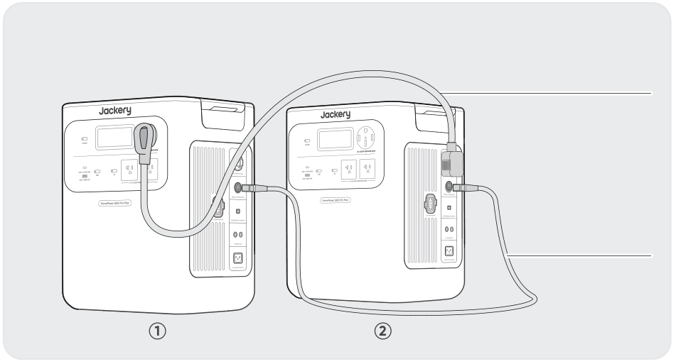

System information will synchronize across both displays.

<table class="manual-callout-table manual-callout-table"><tbody><tr><td class="manual-callout-label">CAUTION</td><td class="manual-callout-body">
After cascading, the total system output power via the NEMA 14-50R port of the second device is 8000W. The total load MUST NOT exceed total power.
</td></tr></tbody></table>

## CONNECT TO EPO SWITCH

The EPO (Emergency Power Off) interface is used to connect an external emergency-stop switch (prepared by the user). When an emergency occurs, pressing the EPO button immediately shuts down all AC and DC inputs and outputs. A screw terminal block is provided with the product for installing the external emergency-stop switch.

## BACKUP POWER CONNECTION

<h3 class="hb-source-pill-heading" id="connect-to-ats-sold-separately">CONNECT TO ATS SOLD SEPARATELY</h3>

The HomePower 3600 Pro Max can supply backup power to home circuits through a Jackery Automatic Transfer Switch (ATS). For detailed installation and operation, refer to the Jackery ATS User Manual.

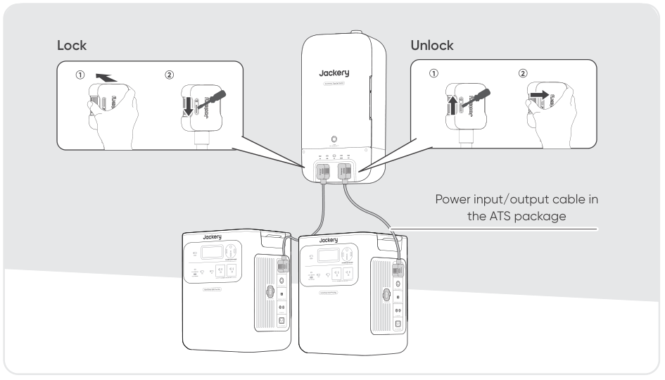

<table class="manual-callout-table manual-callout-table"><tbody><tr><td class="manual-callout-label">NOTE</td><td class="manual-callout-body">
When UPS mode is enabled on the ATS, the power station remains active and continuously consumes power. During a grid outage, the system switches to battery power within 20 milliseconds.
</td></tr></tbody></table>

## CONNECT TO MTS SOLD SEPARATELY

The HomePower 3600 Pro Max can be connected to a Manual Transfer Switch (MTS) to power selected home circuits. Choose the appropriate method based on your installation mode.

<table class="manual-callout-table manual-callout-table"><tbody><tr><td class="manual-callout-label">NOTE</td><td class="manual-callout-body">
All cables used in this section are sold separately or included with the separately sold MTS.
</td></tr></tbody></table>

<h3 class="hb-source-pill-heading" id="mts-installation-notice">MTS Installation Notice</h3>

For optimal performance when using the HP3600 Pro Max with a Manual Transfer Switch (MTS), it is recommended that the AC input be connected to a non-GFCI protected circuit. If GFCI protection is required, it is recommended that GFCI devices be installed on the load side. This configuration helps improve system compatibility and supports reliable AC bypass operation.

## SINGLE UNIT CONNECTION WITH MTS

In automatic mode, the HomePower 3600 Pro Max receives AC input and provides UPS-like backup power through the MTS.

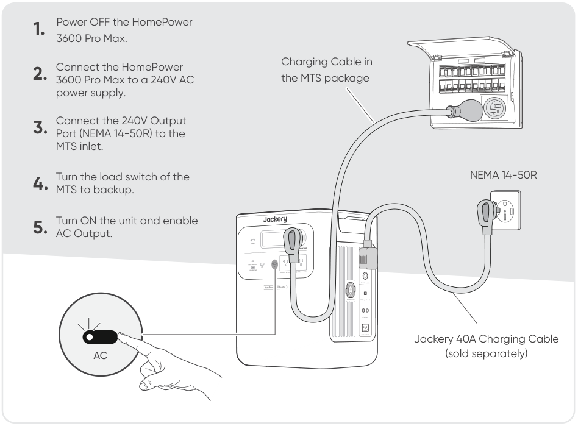

When grid power is present, AC power passes through to the MTS. During a power outage, the system automatically switches to battery power within 10 milliseconds.

<table class="manual-callout-table manual-callout-table"><tbody><tr><td class="manual-callout-label">NOTE</td><td class="manual-callout-body">
Automatic switching requires the AC input to remain connected at all times.
</td></tr></tbody></table>

## CASCADE PARALLEL CONNECTION WITH MTS

When two units are connected in cascade parallel mode, the system can deliver higher output power to the MTS.

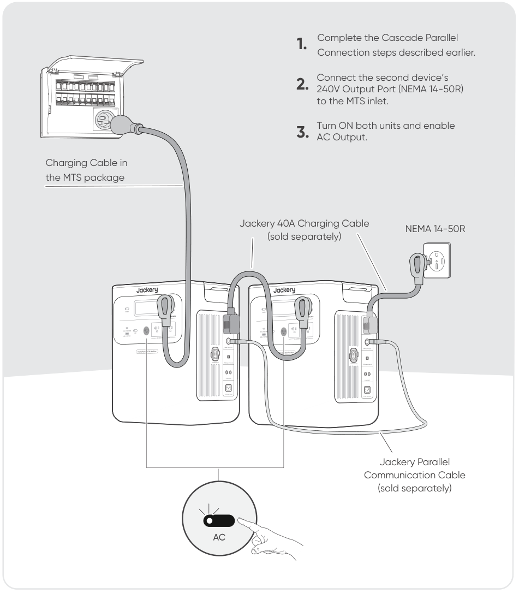

<table class="manual-callout-table manual-callout-table"><tbody><tr><td class="manual-callout-label">CAUTION</td><td class="manual-callout-body">
After cascading, the maximum output to the MTS is 8000W. The total load MUST NOT exceed total power.
</td></tr></tbody></table>

# CHARGING

Green energy first: We advocate using green energy first. This product supports two modes of charging at the same time: solar charging and AC wall charging. When AC wall charging and solar charging are turned on at the same time, the product will give priority to solar charging, and both methods will be used to charge the battery at the maximum permissible power. Fully charge the product before its first use.

<table class="manual-callout-table manual-callout-table"><tbody><tr><td class="manual-callout-label">NOTE</td><td class="manual-callout-body"><ul><li>The recommended charging temperature for the product ranges from -4°F to 113°F (-20°C to 45°C), and the discharging temperature ranges from -4°F to 113°F (-20°C to 45°C). Operating the product beyond this temperature range may restrict its charging and discharging capabilities, or even prevent it from charging or discharging.</li><li>The charging power and battery capacity of the product may vary due to temperature fluctuations.</li></ul></td></tr></tbody></table>

## CHARGING VIA 120V AC WALL OUTLET

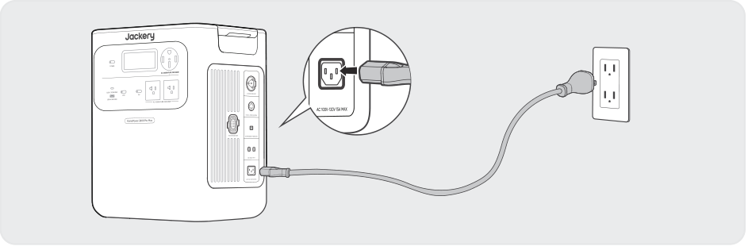

Connect the AC charging cable to the AC input port of the product and a wall outlet.

<table class="manual-callout-table manual-callout-table"><tbody><tr><td class="manual-callout-label">CAUTION</td><td class="manual-callout-body">
Make sure the AC charging cable is fully and securely plugged into the AC input port. An incomplete connection may cause unstable current, overheating, poor contact, or device malfunction.
</td></tr></tbody></table>

## CHARGING VIA 240V AC INPUT

The HomePower 3600 Pro Max supports charging through its 240V AC Expansion Port. Depending on your installation, the 240V AC input may come from a 240V AC outlet or from a Jackery Automatic Transfer Switch (ATS).

<h3 class="hb-source-pill-heading" id="v-ac-outlet">240V AC Outlet</h3>

Connect the product to a 240V AC power supply using a Jackery 40A Charging Cable (Sold Separately).

<table class="manual-callout-table manual-callout-table"><tbody><tr><td class="manual-callout-label">CAUTION</td><td class="manual-callout-body"><ul><li>Ensure the Jackery 40A Charging Cable is fully and securely plugged into both the 240V outlet and the AC Expansion Port.</li><li>An incomplete connection may cause unstable current, overheating, poor contact, or device malfunction.</li></ul></td></tr></tbody></table>

<h3 class="hb-source-pill-heading" id="transfer-switch-ats">TRANSFER SWITCH (ATS)</h3>

Connect your Jackery ATS to the product to enable charging via the Transfer Switch.

<table class="manual-callout-table manual-callout-table"><tbody><tr><td class="manual-callout-label">NOTE</td><td class="manual-callout-body">
The backup reserve setting applies in all operating modes of the ATS. When the remaining capacity of the HomePower 3600 Pro Max exceeds the configured backup reserve, charging will stop automatically.
</td></tr></tbody></table>

To charge it immediately, follow the instructions below: 1. Tap Power Station in the energe flow of the ATS dashboard. 2. On the Power Station page, tap Charge now.

<table class="manual-callout-table manual-callout-table"><tbody><tr><td class="manual-callout-label">NOTE</td><td class="manual-callout-body">
Once the AC Expansion Port is successfully connected to an ATS, the AC Input port will no longer be used for charging. In this configuration, the HomePower 3600 Pro Max can be charged through the following ports: AC Expansion Port DC8020 Ports
</td></tr></tbody></table>

## CHARGING VIA SOLAR PANELS SOLD SEPARATELY

The Jackery HomePower 3600 Pro Max has two DC8020 input ports, and each supports either a direct connection to a 500W solar panel or a serial connection of three 200W solar panels via a connector. If one DC8020 input port needs to connect two or more solar panels simultaneously, please refer to the figure below for charging through the solar panel connector (sold separately, not included as standard).

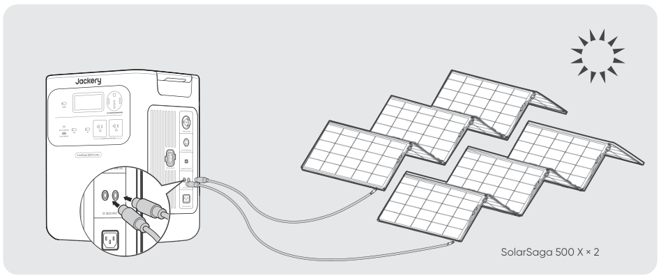

<table class="manual-callout-table manual-callout-table"><tbody><tr><td class="manual-callout-label">CAUTION</td><td class="manual-callout-body">
Ensure that the input voltage for both DC input ports is the same. Failure to do so may damage the product. For example: Use the same model of Jackery solar panels and the same number of panels when connecting solar panels to both DC8020 Input ports. Do not charge the product using both a car charger and a solar panel simultaneously. Doing so may blow the car fuse or result in charging failure.
</td></tr></tbody></table>

It is recommended to use the Jackery solar panels to charge the product. Ensure that the working voltage (Vmp) of the solar panel is within the DC input range (16V-60V) of the HomePower 3600 Pro Max. Jackery is not responsible for any damage or loss resulting from the use of third-party solar panels.

## CHARGING WITH A CAR CHARGER SOLD SEPARATELY

This product can be charged using a 12V car charger. Ensure that the car charger and the 12V car power outlet (car cigarette lighter) provide a good connection.

<figure class="hb-reference-figure hb-base-art-live-copy" data-component-id="HB-SPECIAL-REFERENCE-FIGURE" data-reference-id="car_charging" data-source-fragment-sha256="f9599ae31169819cc42790390af38e034fa626df0ca011212a46b36ffd4fb797" data-web-base-art-ref="assets/car_charging_framefree.svg" data-web-presentation-mode="base-art-live-copy" data-web-replace-key="reference.car-charging">

Vehicle*The car charging cable is sold separately.

</figure>

<table class="manual-callout-table manual-callout-table"><tbody><tr><td class="manual-callout-label">CAUTION</td><td class="manual-callout-body"><ul><li>Please start the vehicle before charging your power station.</li><li>If the vehicle is running on bumpy roads, it is forbidden to use the car charger in case it causes non-standard operation. The Company will not be responsible for any loss caused by non-standard operation.</li><li>Vehicle charging is only applicable to vehicles with 12V DC, not 24V DC. Please do not charge this product in a 24V vehicle to avoid personal injury and property loss.</li></ul></td></tr></tbody></table>

# TROUBLESHOOTING

If any of the following fault codes appear, follow the listed corrective actions to resolve the issue. If the fault persists, please contact Jackery Customer Support.

<figure aria-label="Error Code / Corrective Measures" class="hb-troubleshooting-composition" data-component-id="HB-TABLE-TROUBLESHOOTING" tabindex="0"><table class="hb-troubleshooting-table"><colgroup><col class="hb-troubleshooting-col-code"/><col class="hb-troubleshooting-col-measures"/></colgroup><thead><tr><th class="hb-troubleshooting-code" scope="col">Error Code</th><th class="hb-troubleshooting-measures" scope="col">Corrective Measures</th></tr></thead><tbody><tr><td class="hb-troubleshooting-code">F0/F1 F2/F3</td><td class="hb-troubleshooting-measures">Restart the product.</td></tr><tr><td class="hb-troubleshooting-code">F4</td><td class="hb-troubleshooting-measures">Connect the product to loads to discharge its battery until the fault disappears.</td></tr><tr><td class="hb-troubleshooting-code">F5</td><td class="hb-troubleshooting-measures">Charge the product via solar panels or an AC wall outlet until the fault disappears.</td></tr><tr><td class="hb-troubleshooting-code">F6</td><td class="hb-troubleshooting-measures">1. Wait for the grid to normalize before charging the product via an AC wall outlet. 2. Check whether the air intake and exhaust vents are blocked; ensure 0.66 ft (20 cm) clearance on both sides of the product. 3. Place the product in a location that is not exposed to direct sunlight or high environmental temperatures. 4. Disconnect all loads from the product. Keep the product idle and wait until the fault disappears. 5. Restart the product.</td></tr><tr><td class="hb-troubleshooting-code">F7</td><td class="hb-troubleshooting-measures">1. Remove all DC inputs from the product. 2. Check the working voltage (Vmp) of the connected solar panels. The product allows a maximum DC input voltage of 60V. 3. Restart the product and keep it idle. Wait until the fault disappears.</td></tr><tr><td class="hb-troubleshooting-code">F8</td><td class="hb-troubleshooting-measures">Contact Jackery Customer Support</td></tr><tr><td class="hb-troubleshooting-code">F9</td><td class="hb-troubleshooting-measures">Remove the load connected to the USB ports of the product. Wait until the fault disappears.</td></tr><tr><td class="hb-troubleshooting-code">FA</td><td class="hb-troubleshooting-measures">1. Turn off the AC outputs and power off both units. 2. Disconnect the cables between the units and connect the two units again. 3. Restart both units and enable their AC outputs.</td></tr><tr><td class="hb-troubleshooting-code">FC</td><td class="hb-troubleshooting-measures">1. Restart the battery packs and the HP3600 Pro Max, respectively. 2. If the fault persists, disconnect the battery pack from the HP3600 Pro Max and connect them again.</td></tr><tr><td class="hb-troubleshooting-code">FF</td><td class="hb-troubleshooting-measures">1. After the emergency condition is cleared, press the EPO button again. 2. If you need to power AC or DC loads, press the AC or DC power button to re-enable the output.</td></tr></tbody></table></figure>

# STORAGE

Store the product in a dry, clean place with proper ventilation. Storage temperature and humidity:

<ul><li>1 month: -4°F to 113°F / -20°C to 45°C (0-60%RH)</li><li>3 months: 32°F to 113°F / 0°C to 45°C (0-60%RH)</li><li>12 months: 32°F to 77°F / 0°C to 25°C (0-60%RH)</li></ul>

If this product is stored for a long period of time (3 months - 6 months) with the power depleted, it may become unchargeable. To prevent this and maintain battery health, it is recommended to check and recharge the product every three months and perform a full charge and discharge cycle at least once every 6 to 12 months.

# SPECIFICATIONS

<h2 aria-level="2" class="hb-spec-group" role="heading">GENERAL INFO</h2>

<figure aria-label="GENERAL INFO" class="hb-spec-table-composition"><table class="manual-table manual-spec-table hb-spec-table"><colgroup><col class="hb-spec-col-label"/><col class="hb-spec-col-value"/></colgroup><tbody><tr><th class="manual-spec-label hb-spec-label" scope="row">Product Name</th><td class="manual-spec-value hb-spec-value">Jackery HomePower 3600 Pro Max</td></tr><tr><th class="manual-spec-label hb-spec-label" scope="row">Model No.</th><td class="manual-spec-value hb-spec-value">JHP-3600C</td></tr><tr><th class="manual-spec-label hb-spec-label" scope="row">Capacity</th><td class="manual-spec-value hb-spec-value">80Ah / 44.8V DC (3584 Wh)</td></tr><tr><th class="manual-spec-label hb-spec-label" scope="row">Cell Chemistry</th><td class="manual-spec-value hb-spec-value">LiFePO₄</td></tr><tr><th class="manual-spec-label hb-spec-label" scope="row">Weight</th><td class="manual-spec-value hb-spec-value">About 73.85 lbs/33.5 kg</td></tr><tr><th class="manual-spec-label hb-spec-label" scope="row">Dimensions</th><td class="manual-spec-value hb-spec-value">14.76 × 10.83 × 17.72 in / 37.5×27.5×45.0 cm</td></tr><tr><th class="manual-spec-label hb-spec-label" scope="row">Cycle Life</th><td class="manual-spec-value hb-spec-value">6000 Cycles (retained capacity ≥70% SOH)</td></tr><tr><th class="manual-spec-label hb-spec-label" scope="row">Maximum Short Circuit Current and Duration</th><td class="manual-spec-value hb-spec-value">1520A, 2.56ms</td></tr><tr><th class="manual-spec-label hb-spec-label" scope="row">UPS</th><td class="manual-spec-value hb-spec-value">＜10 ms</td></tr><tr><th class="manual-spec-label hb-spec-label" scope="row">Inverter Topology</th><td class="manual-spec-value hb-spec-value">Isolated</td></tr><tr><th class="manual-spec-label hb-spec-label" scope="row">Power Factor</th><td class="manual-spec-value hb-spec-value">≥0.98</td></tr><tr><th class="manual-spec-label hb-spec-label" scope="row">Entire Unit</th><td class="manual-spec-value hb-spec-value">Type 1</td></tr></tbody></table></figure>

<h2 aria-level="2" class="hb-spec-group" role="heading">INPUT PORTS</h2>

<figure aria-label="INPUT PORTS" class="hb-spec-table-composition"><table class="manual-table manual-spec-table hb-spec-table"><colgroup><col class="hb-spec-col-label"/><col class="hb-spec-col-value"/></colgroup><tbody><tr><th class="manual-spec-label hb-spec-label" scope="row">1 × AC Input</th><td class="manual-spec-value hb-spec-value">Charge Mode : 100-120V~ 60Hz, 15A Max, 1800W Bypass Mode① : 100V-120V~ 60Hz, 12A Max, 1440W</td></tr><tr><th class="manual-spec-label hb-spec-label" scope="row">2 × DC8020 Ports</th><td class="manual-spec-value hb-spec-value">12-16V⎓8A Max, Double to 8A Max; 16-60V②⎓12A Max, Double to 24A, 1200W Max</td></tr></tbody></table></figure>

<h2 aria-level="2" class="hb-spec-group" role="heading">OUTPUT PORTS</h2>

<figure aria-label="OUTPUT PORTS" class="hb-spec-table-composition"><table class="manual-table manual-spec-table hb-spec-table"><colgroup><col class="hb-spec-col-label"/><col class="hb-spec-col-value"/></colgroup><tbody><tr><th class="manual-spec-label hb-spec-label" scope="row">2 × AC (NEMA 5-20R)</th><td class="manual-spec-value hb-spec-value">120V~ 60Hz, 16.7A Max, 2000W per port, 4000W in Total</td></tr><tr><th class="manual-spec-label hb-spec-label" scope="row">1 × AC (NEMA 14-50R)</th><td class="manual-spec-value hb-spec-value">240V~ 60Hz, 16.7A Max, 4000W Rated, 8000W Surge peak</td></tr><tr><th class="manual-spec-label hb-spec-label" scope="row">Total AC Output③</th><td class="manual-spec-value hb-spec-value">4000W Rated, 8000W Surge peak</td></tr><tr><th class="manual-spec-label hb-spec-label" scope="row">AC Output in Bypass Mode①</th><td class="manual-spec-value hb-spec-value">120V AC Input: NEMA 5-20R: 100V-120V~ 60Hz, 12A Max, 1440W Max per port, 1440W④ in Total NEMA 14-50R: 240V~ 60Hz, 1440W④ Max 240V AC Input: NEMA 5-20R: 100V-120V~ 60Hz, 20A Max, 2400W per port, 4800W in Total NEMA 14-50R: 240V~ 60Hz, 40A Max, 9600W Max</td></tr><tr><th class="manual-spec-label hb-spec-label" scope="row">1 × USB-C Output</th><td class="manual-spec-value hb-spec-value">100W Max, 5V⎓3A, 9V⎓3A, 12V⎓3A, 15V⎓3A, 20V⎓5A</td></tr><tr><th class="manual-spec-label hb-spec-label" scope="row">1 × USB-A Output</th><td class="manual-spec-value hb-spec-value">18W Max, 5-6V⎓3A, 6-9V⎓2A, 9-12V⎓1.5A</td></tr></tbody></table></figure>

<h2 aria-level="2" class="hb-spec-group" role="heading">EXPANSION PORTS</h2>

<figure aria-label="EXPANSION PORTS" class="hb-spec-table-composition"><table class="manual-table manual-spec-table hb-spec-table"><colgroup><col class="hb-spec-col-label"/><col class="hb-spec-col-value"/></colgroup><tbody><tr><th class="manual-spec-label hb-spec-label" scope="row">1 × AC Expansion Port</th><td class="manual-spec-value hb-spec-value">240V~ 60Hz, 16.7A Max, 4000W Max</td></tr><tr><th class="manual-spec-label hb-spec-label" scope="row">1 × DC Expansion Port</th><td class="manual-spec-value hb-spec-value">36.4V-50.4V⎓126A Max (Input) 36.4V-50.4V⎓60A Max (Output)</td></tr></tbody></table></figure>

<h2 aria-level="2" class="hb-spec-group" role="heading">ENVIRONMENTAL SPECIFICATIONS</h2>

<figure aria-label="ENVIRONMENTAL SPECIFICATIONS" class="hb-spec-table-composition"><table class="manual-table manual-spec-table hb-spec-table"><colgroup><col class="hb-spec-col-label"/><col class="hb-spec-col-value"/></colgroup><tbody><tr><th class="manual-spec-label hb-spec-label" scope="row">Charge Temperature</th><td class="manual-spec-value hb-spec-value">-4°F to 113°F / -20°C to 45°C</td></tr><tr><th class="manual-spec-label hb-spec-label" scope="row">Discharge Temperature</th><td class="manual-spec-value hb-spec-value">-4°F to 113°F / -20°C to 45°C</td></tr><tr><th class="manual-spec-label hb-spec-label" scope="row">Altitude</th><td class="manual-spec-value hb-spec-value">≤3000m</td></tr></tbody></table></figure>

※ USB Type-C® and USB-C® are registered trademarks of USB Implementers Forum.

① The product can charge the battery from the AC wall outlet or ATS while delivering power through the AC output ports.

② Indicates the permissible working voltage (Vmp) range for the solar panel that can be connected.

③ Indicates that two or more AC output ports work together.

④ When connected to loads higher than 1440 W under 120V AC input, the product withdraws power from the battery to meet a total load requirement of up to 2880 W.

# WARRANTY

<figure aria-label="WARRANTY" class="hb-warranty-intro-composition" data-component-id="HB-WARRANTY-LEAD">

<strong>This warranty applies only to customers who purchase from the official Jackery website, Jackery-branded third-party platforms, or local authorized dealers.</strong>

*Warranty period and details may vary according to local laws, regulations, and authorized dealers.

</figure>

## Limited Warranty

<figure aria-label="Limited Warranty" class="hb-warranty-card" data-component-id="HB-WARRANTY-SECTION" data-warranty-card-index="1">
Jackery Inc. warrants to the original consumer purchaser that the Jackery product will be free from defects in workmanship and material under normal consumer use during the applicable warranty period identified in the 'Warranty Period' section below, subject to the exclusions set forth below. This warranty statement sets forth Jackery's total and exclusive warranty obligation. We will not assume, nor authorize any person to assume for us, any other liability in connection with the sale of our products.
</figure>

## Warranty Period

<figure aria-label="Warranty Period" class="hb-warranty-period-card" data-component-id="HB-WARRANTY-YEARS">

3
<strong class="hb-warranty-years-unit">YEARS</strong><strong class="hb-warranty-period-label">Standard Warranty</strong>

The standard warranty period for Jackery HomePower 3600 Pro Max is 36 months. In each case, the warranty period is measured starting on the date of purchase by the original consumer purchaser. The sales receipt from the first consumer purchaser, or other reasonable documentary proof, is required in order to establish the start date of the warranty period.

2
<strong class="hb-warranty-years-unit">YEARS</strong><strong class="hb-warranty-period-label">Extended Warranty</strong>

To activate the Warranty Extension, you must register your product online or contact our customer service team at hello@jackery.com to extend the standard warranty period.

</figure>

## Repair or replacement

<figure aria-label="Repair or replacement" class="hb-warranty-card" data-component-id="HB-WARRANTY-SECTION" data-warranty-card-index="2">
Jackery will repair or replace (at Jackery's expense) any Jackery product that fails to operate during the applicable warranty period due to a defect in workmanship or materials. The repaired/replaced product assumes the remaining warranty of the original date of purchase.
</figure>

## Limited to Original Consumer Buyer

<figure aria-label="Limited to Original Consumer Buyer" class="hb-warranty-card" data-component-id="HB-WARRANTY-SECTION" data-warranty-card-index="3">
The warranty on Jackery's product is limited to the original consumer purchaser and is not transferable to any subsequent owner.
</figure>

## Exclusions

<figure aria-label="Exclusions" class="hb-warranty-card" data-component-id="HB-WARRANTY-SECTION" data-warranty-card-index="4">
Jackery's warranty does not apply to:
<ul><li>Any product that has been misused, abused, modified, damaged by accident, or used for anything other than normal consumer use as authorized in Jackery's current product literature.</li><li>Attempted repair by anyone other than an authorized facility.</li><li>Any product purchased through an online auction house.</li><li>Jackery's warranty does not apply to the battery cell unless the battery cell is fully charged by you within seven days after you purchase the product and at least once every 6 months thereafter.</li></ul></figure>

## Interpretation Rights

<figure aria-label="Interpretation Rights" class="hb-warranty-card" data-component-id="HB-WARRANTY-SECTION" data-warranty-card-index="5">
Jackery reserves the right to the final interpretation of the above after-sales policy.
</figure>

# APP SETUP

## 1. Download the App and log in

<figure aria-label="1. Download the App and log in" class="hb-app-download-composition" data-component-id="HB-SPECIAL-APP">

Search for "Jackery" in Google Play or the App Store to install the App. After that, you can register and log in.

Alternatively, scan the QR code below to download and install the App.

</figure>

## 2. Add device

2.1 Click the + button to add your device;

2.2 Press the <strong>POWER</strong> button on the device to turn on. The Wi-Fi and Bluetooth icons on the device flash to indicate that the device has entered the network configuration mode. Tap the <strong>"Icon Flashed"</strong> button, and allow the App to connect to nearby devices and enable Bluetooth permissions.

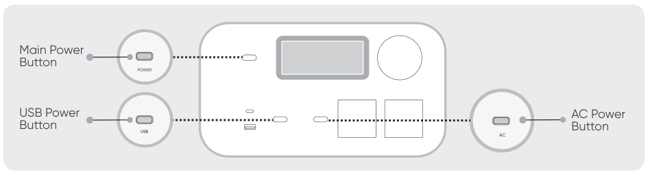

<table class="manual-callout-table manual-callout-table"><tbody><tr><td class="manual-callout-label">NOTE</td><td class="manual-callout-body">
After the device is turned on and not connected to the App within 2 hours, it will automatically turn off Wi-Fi and Bluetooth. You must then press and hold the USB power button and the AC power button to turn on Wi-Fi and Bluetooth again.
</td></tr></tbody></table>

2.3 After tapping the searched device icon, the App automatically connects the device via Bluetooth.

<table class="manual-callout-table manual-callout-table"><tbody><tr><td class="manual-callout-label">NOTE</td><td class="manual-callout-body">
If the message "the device has been bound" appears during the binding process, the following two ways can be used for connection:
<ul><li>The device owner will share this device with other users through the App.</li><li>Press and hold the POWER button and USB power button for 3 seconds to reset the device's Wi-Fi and Bluetooth, and then re-bind the device.</li></ul></td></tr></tbody></table>

2.4 After the device is successfully connected, enter your Wi-Fi password and tap the OK button.

<table class="manual-callout-table manual-callout-table"><tbody><tr><td class="manual-callout-label">NOTE</td><td class="manual-callout-body">
Please select a Wi-Fi network in 2.4 GHz band. The device does not support a Wi-Fi network in the 5 GHz band.
</td></tr></tbody></table>

2.5 After the device is successfully added to the App, the Wi-Fi icon on the device will always be on.

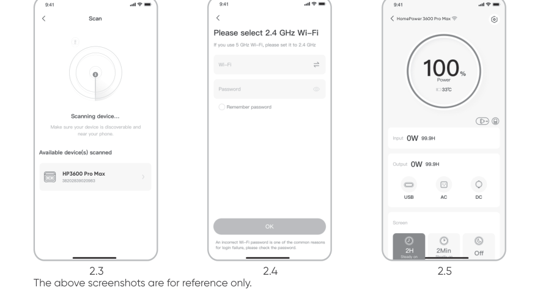

<table class="manual-callout-table manual-callout-table"><tbody><tr><td class="manual-callout-label">CAUTION</td><td class="manual-callout-body">
The Jackery app can connect to only one power station via Bluetooth at a time. Returning to the device list automatically disconnects Bluetooth. Tap the power station in the list again to reconnect automatically.
</td></tr></tbody></table>

## 3. Unbind the device

Click the Settings icon in the upper right corner of the main interface of the device to open the settings page, and click the Unbind button at the bottom of the page to unbind the device.

## 4. Notes

### 4.1 To turn on Wi-Fi & Bluetooth:

<ul><li>Wi-Fi and Bluetooth are automatically turned on after the device is on, and the Wi-Fi and Bluetooth icons on the screen light up.</li><li>Hold the USB power button and the AC power button at the same time until the Wi-Fi &amp; Bluetooth icons on the screen light up.</li></ul>

### 4.2 To turn off Wi-Fi & Bluetooth:

<ul><li>Hold the USB power button and the AC power button at the same time until the Wi-Fi and Bluetooth icons on the screen are off.</li><li>Wi-Fi and Bluetooth will be automatically turned off if no device is connected within 2 hours.</li></ul>

### 4.3 To reset Wi-Fi & Bluetooth:

Hold the POWER button and USB power button at the same time for 3 seconds to reset Wi-Fi and Bluetooth to factory settings. The connected App account will be unbound.

# SMART HOME BACKUP SYSTEM (AC ESS)

Model: HB3600C-TS05A

<table class="manual-callout-table manual-callout-table"><tbody><tr><td class="manual-callout-label">WARNING</td><td class="manual-callout-body">
RISK OF ELECTRIC SHOCK. ALWAYS ENSURE THAT ALL ELECTRICAL EQUIPMENT IS SAFELY DE-ENERGIZED BEFORE COMMENCING WORK.
</td></tr></tbody></table>

Use the power input/output cable in the ATS package to connect the HomePower 3600 Pro Max AC expansion port to the ATS AC input/output port. Use the expansion cable included with the battery pack package to connect the HomePower 3600 Pro Max to the battery pack, to connect its DC expansion port (A) to the battery pack's DC expansion port (B).

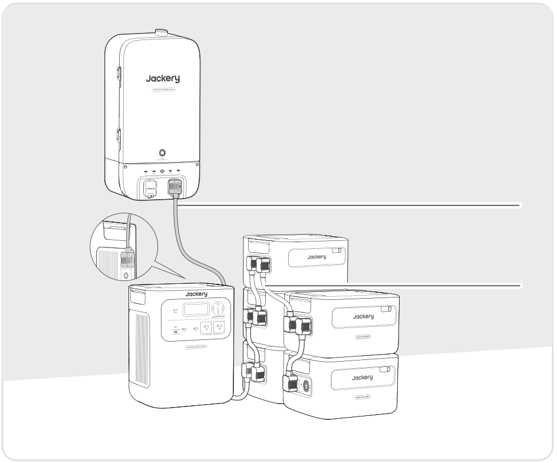

Power input/output cable in the ATS package

Expansion cable in the battery pack package

For detailed installation and connection instructions, refer to the user manuals for the ATS and battery pack.

<table class="manual-callout-table manual-callout-table"><tbody><tr><td class="manual-callout-label">CAUTION</td><td class="manual-callout-body">
Smart Home Backup System (AC ESS) Installation Position
<ul><li>Indoor installation.</li><li>The area is completely waterproof.</li><li>The wall is flat and level.</li><li>Ambient temperature range: -4°F to 113°F / -20°C to 45°C.</li><li>The temperature and humidity are maintained at a constant level.</li><li>Install in a well-ventilated place.</li><li>Do not place in an area within the reach of children or pets.</li><li>The installation area shall avoid direct sunlight.</li><li>No flammable or explosive materials close to inverter and battery.</li></ul></td></tr></tbody></table>

# SPECIFICATIONS — SMART HOME BACKUP SYSTEM

Model: JHP-3600C

<h2 aria-level="2" class="hb-spec-group" role="heading">GENERAL INFO</h2>

<figure aria-label="GENERAL INFO" class="hb-spec-table-composition"><table class="manual-table manual-spec-table hb-spec-table"><colgroup><col class="hb-spec-col-label"/><col class="hb-spec-col-value"/></colgroup><tbody><tr><th class="manual-spec-label hb-spec-label" scope="row">Product Name</th><td class="manual-spec-value hb-spec-value">Jackery HomePower 3600 Pro Max</td></tr><tr><th class="manual-spec-label hb-spec-label" scope="row">Model No.</th><td class="manual-spec-value hb-spec-value">JHP-3600C</td></tr><tr><th class="manual-spec-label hb-spec-label" scope="row">Capacity</th><td class="manual-spec-value hb-spec-value">80Ah / 44.8V DC (3584 Wh)</td></tr><tr><th class="manual-spec-label hb-spec-label" scope="row">Cell Chemistry</th><td class="manual-spec-value hb-spec-value">LiFePO₄</td></tr><tr><th class="manual-spec-label hb-spec-label" scope="row">Weight</th><td class="manual-spec-value hb-spec-value">About 73.85 lbs/33.5 kg</td></tr><tr><th class="manual-spec-label hb-spec-label" scope="row">Dimensions</th><td class="manual-spec-value hb-spec-value">14.76 × 10.83 × 17.72 in / 37.5×27.5×45.0 cm</td></tr><tr><th class="manual-spec-label hb-spec-label" scope="row">Cycle Life</th><td class="manual-spec-value hb-spec-value">6000 Cycles (retained capacity ≥70% SOH)</td></tr><tr><th class="manual-spec-label hb-spec-label" scope="row">Maximum Short Circuit Current and Duration</th><td class="manual-spec-value hb-spec-value">1520A, 2.56ms</td></tr><tr><th class="manual-spec-label hb-spec-label" scope="row">UPS</th><td class="manual-spec-value hb-spec-value">＜10 ms</td></tr><tr><th class="manual-spec-label hb-spec-label" scope="row">Inverter Topology</th><td class="manual-spec-value hb-spec-value">Isolated</td></tr><tr><th class="manual-spec-label hb-spec-label" scope="row">Power Factor</th><td class="manual-spec-value hb-spec-value">≥0.98</td></tr><tr><th class="manual-spec-label hb-spec-label" scope="row">Entire Unit</th><td class="manual-spec-value hb-spec-value">Type 1</td></tr></tbody></table></figure>

<h2 aria-level="2" class="hb-spec-group" role="heading">INPUT PORTS</h2>

<figure aria-label="INPUT PORTS" class="hb-spec-table-composition"><table class="manual-table manual-spec-table hb-spec-table"><colgroup><col class="hb-spec-col-label"/><col class="hb-spec-col-value"/></colgroup><tbody><tr><th class="manual-spec-label hb-spec-label" scope="row">1 × AC Input</th><td class="manual-spec-value hb-spec-value">Charge Mode : 100-120V~ 60Hz, 15A Max, 1800W Bypass Mode① : 100V-120V~ 60Hz, 12A Max, 1440W</td></tr><tr><th class="manual-spec-label hb-spec-label" scope="row">2 × DC8020 Ports</th><td class="manual-spec-value hb-spec-value">12-16V⎓8A Max, Double to 8A Max; 16-60V②⎓12A Max, Double to 24A, 1200W Max</td></tr></tbody></table></figure>

<h2 aria-level="2" class="hb-spec-group" role="heading">OUTPUT PORTS</h2>

<figure aria-label="OUTPUT PORTS" class="hb-spec-table-composition"><table class="manual-table manual-spec-table hb-spec-table"><colgroup><col class="hb-spec-col-label"/><col class="hb-spec-col-value"/></colgroup><tbody><tr><th class="manual-spec-label hb-spec-label" scope="row">2 × AC (NEMA 5-20R)</th><td class="manual-spec-value hb-spec-value">120V~ 60Hz, 16.7A Max, 2000W per port, 4000W in Total</td></tr><tr><th class="manual-spec-label hb-spec-label" scope="row">1 × AC (NEMA 14-50R)</th><td class="manual-spec-value hb-spec-value">240V~ 60Hz, 16.7A Max, 4000W Rated, 8000W Surge peak</td></tr><tr><th class="manual-spec-label hb-spec-label" scope="row">Total AC Output③</th><td class="manual-spec-value hb-spec-value">4000W Rated, 8000W Surge peak</td></tr><tr><th class="manual-spec-label hb-spec-label" scope="row">AC Output in Bypass Mode①</th><td class="manual-spec-value hb-spec-value">120V AC Input: NEMA 5-20R: 100V-120V~ 60Hz, 12A Max, 1440W Max per port, 1440W⁴ in Total NEMA 14-50R: 240V~ 60Hz, 1440W⁴ Max 240V AC Input: NEMA 5-20R: 100V-120V~ 60Hz, 20A Max, 2400W per port, 4800W in Total NEMA 14-50R: 240V~ 60Hz, 40A Max, 9600W Max</td></tr><tr><th class="manual-spec-label hb-spec-label" scope="row">1 × USB-C Output</th><td class="manual-spec-value hb-spec-value">100W Max, 5V⎓3A, 9V⎓3A, 12V⎓3A, 15V⎓3A, 20V⎓5A</td></tr><tr><th class="manual-spec-label hb-spec-label" scope="row">1 × USB-A Output</th><td class="manual-spec-value hb-spec-value">18W Max, 5-6V⎓3A, 6-9V⎓2A, 9-12V⎓1.5A</td></tr></tbody></table></figure>

<h2 aria-level="2" class="hb-spec-group" role="heading">EXPANSION PORTS</h2>

<figure aria-label="EXPANSION PORTS" class="hb-spec-table-composition"><table class="manual-table manual-spec-table hb-spec-table"><colgroup><col class="hb-spec-col-label"/><col class="hb-spec-col-value"/></colgroup><tbody><tr><th class="manual-spec-label hb-spec-label" scope="row">1 × AC Expansion Port</th><td class="manual-spec-value hb-spec-value">240V~ 60Hz, 16.7A Max, 4000W Max</td></tr><tr><th class="manual-spec-label hb-spec-label" scope="row">1 × DC Expansion Port</th><td class="manual-spec-value hb-spec-value">36.4V-50.4V⎓126A Max (Input) 36.4V-50.4V⎓60A Max (Output)</td></tr></tbody></table></figure>

<h2 aria-level="2" class="hb-spec-group" role="heading">ENVIRONMENTAL SPECIFICATIONS</h2>

<figure aria-label="ENVIRONMENTAL SPECIFICATIONS" class="hb-spec-table-composition"><table class="manual-table manual-spec-table hb-spec-table"><colgroup><col class="hb-spec-col-label"/><col class="hb-spec-col-value"/></colgroup><tbody><tr><th class="manual-spec-label hb-spec-label" scope="row">Charge Temperature</th><td class="manual-spec-value hb-spec-value">-4°F to 113°F / -20°C to 45°C</td></tr><tr><th class="manual-spec-label hb-spec-label" scope="row">Discharge Temperature</th><td class="manual-spec-value hb-spec-value">-4°F to 113°F / -20°C to 45°C</td></tr><tr><th class="manual-spec-label hb-spec-label" scope="row">Altitude</th><td class="manual-spec-value hb-spec-value">≤3000m</td></tr></tbody></table></figure>

※ USB Type-C® and USB-C® are registered trademarks of USB Implementers Forum.

① The product can charge the battery from the AC wall outlet or ATS while delivering power through the AC output ports.

② Indicates the permissible working voltage (Vmp) range for the solar panel that can be connected.

③ Indicates that two or more AC output ports work together.

④ When connected to loads higher than 1440 W under 120V AC input, the product withdraws power from the battery to meet a total load requirement of up to 2880 W.

# Jackery Battery Pack 3600 SOLD SEPARATELY

<h2 aria-level="2" class="hb-spec-group" role="heading">GENERAL INFO</h2>

<figure aria-label="GENERAL INFO" class="hb-spec-table-composition"><table class="manual-table manual-spec-table hb-spec-table"><colgroup><col class="hb-spec-col-label"/><col class="hb-spec-col-value"/></colgroup><tbody><tr><th class="manual-spec-label hb-spec-label" scope="row">Product Name</th><td class="manual-spec-value hb-spec-value">Jackery Battery Pack 3600</td></tr><tr><th class="manual-spec-label hb-spec-label" scope="row">Model No.</th><td class="manual-spec-value hb-spec-value">JBP-3600A</td></tr><tr><th class="manual-spec-label hb-spec-label" scope="row">Capacity</th><td class="manual-spec-value hb-spec-value">80Ah/44.8Vdc (3584Wh)</td></tr><tr><th class="manual-spec-label hb-spec-label" scope="row">Cell Chemistry</th><td class="manual-spec-value hb-spec-value">LiFePO₄</td></tr><tr><th class="manual-spec-label hb-spec-label" scope="row">Weight</th><td class="manual-spec-value hb-spec-value">About 55.1 lbs/25 kg</td></tr><tr><th class="manual-spec-label hb-spec-label" scope="row">Dimensions</th><td class="manual-spec-value hb-spec-value">14.8 x 12.5 x 9.0 in/37.5 x 31.7x 22.9 cm</td></tr><tr><th class="manual-spec-label hb-spec-label" scope="row">Cycle Life</th><td class="manual-spec-value hb-spec-value">6000 cycles to 70%+ capacity</td></tr></tbody></table></figure>

<h2 aria-level="2" class="hb-spec-group" role="heading">INPUT/OUTPUT PORTS</h2>

<figure aria-label="INPUT/OUTPUT PORTS" class="hb-spec-table-composition"><table class="manual-table manual-spec-table hb-spec-table"><colgroup><col class="hb-spec-col-label"/><col class="hb-spec-col-value"/></colgroup><tbody><tr><th class="manual-spec-label hb-spec-label" scope="row">DC Expansion Port (Input)</th><td class="manual-spec-value hb-spec-value">36.4V-50.4V⎓60A Max</td></tr><tr><th class="manual-spec-label hb-spec-label" scope="row">DC Expansion Port (Output)</th><td class="manual-spec-value hb-spec-value">36.4V-50.4V⎓100A Max</td></tr><tr><th class="manual-spec-label hb-spec-label" scope="row">Maximum Short Circuit Current and Duration</th><td class="manual-spec-value hb-spec-value">1160A/860μs</td></tr></tbody></table></figure>

<h2 aria-level="2" class="hb-spec-group" role="heading">ENVIRONMENTAL OPERATING TEMPERATURE</h2>

<figure aria-label="ENVIRONMENTAL OPERATING TEMPERATURE" class="hb-spec-table-composition"><table class="manual-table manual-spec-table hb-spec-table"><colgroup><col class="hb-spec-col-label"/><col class="hb-spec-col-value"/></colgroup><tbody><tr><th class="manual-spec-label hb-spec-label" scope="row">Charge Temperature</th><td class="manual-spec-value hb-spec-value">-4°F to 113°F / -20°C to 45°C</td></tr><tr><th class="manual-spec-label hb-spec-label" scope="row">Discharge Temperature</th><td class="manual-spec-value hb-spec-value">-4°F to 113°F / -20°C to 45°C</td></tr></tbody></table></figure>

# Jackery Automatic Transfer Switch SOLD SEPARATELY

<h2 aria-hidden="true" aria-level="2" class="hb-spec-group hb-source-hidden-heading" role="heading">Jackery Automatic Transfer Switch</h2>

<figure aria-label="Jackery Automatic Transfer Switch" class="hb-spec-table-composition"><table class="manual-table manual-spec-table hb-spec-table"><colgroup><col class="hb-spec-col-label"/><col class="hb-spec-col-value"/></colgroup><tbody><tr><th class="manual-spec-label hb-spec-label" scope="row">Product Name</th><td class="manual-spec-value hb-spec-value">Jackery Automatic Transfer Switch</td></tr><tr><th class="manual-spec-label hb-spec-label" scope="row">Model No.</th><td class="manual-spec-value hb-spec-value">JA-TS05A</td></tr><tr><th class="manual-spec-label hb-spec-label" scope="row">AC Voltage (Nominal)</th><td class="manual-spec-value hb-spec-value">120V/240V~ 60Hz</td></tr><tr><th class="manual-spec-label hb-spec-label" scope="row">Feed-In Type</th><td class="manual-spec-value hb-spec-value">Split Phase</td></tr><tr><th class="manual-spec-label hb-spec-label" scope="row">Maximum Input Current</th><td class="manual-spec-value hb-spec-value">100A Grid / 84A Power Station</td></tr><tr><th class="manual-spec-label hb-spec-label" scope="row">Maximum Output Current</th><td class="manual-spec-value hb-spec-value">100A Home Load / 33.4A Power Station</td></tr><tr><th class="manual-spec-label hb-spec-label" scope="row">Maximum Input Short-Circuit Current</th><td class="manual-spec-value hb-spec-value">10 KA</td></tr><tr><th class="manual-spec-label hb-spec-label" scope="row">Power Consumption in Standby Mode</th><td class="manual-spec-value hb-spec-value">About 5W</td></tr><tr><th class="manual-spec-label hb-spec-label" scope="row">Overvoltage Category</th><td class="manual-spec-value hb-spec-value">IV</td></tr><tr><th class="manual-spec-label hb-spec-label" scope="row">UPS</th><td class="manual-spec-value hb-spec-value">≤20 ms</td></tr><tr><th class="manual-spec-label hb-spec-label" scope="row">Enclosure Type</th><td class="manual-spec-value hb-spec-value">Distribution Box: NEMA Type 3R Plug Box: NEMA Type 1</td></tr><tr><th class="manual-spec-label hb-spec-label" scope="row">Pollution Degree</th><td class="manual-spec-value hb-spec-value">III</td></tr><tr><th class="manual-spec-label hb-spec-label" scope="row">Main Circuit</th><td class="manual-spec-value hb-spec-value">2 AWG (100A)</td></tr><tr><th class="manual-spec-label hb-spec-label" scope="row">Load Circuit</th><td class="manual-spec-value hb-spec-value">2AWG-4/0AWG (100A)</td></tr><tr><th class="manual-spec-label hb-spec-label" scope="row">Communication</th><td class="manual-spec-value hb-spec-value">Wi-Fi and Bluetooth</td></tr><tr><th class="manual-spec-label hb-spec-label" scope="row">Dimensions</th><td class="manual-spec-value hb-spec-value">27 x 14.4 x 5.7 in/68.5 x 36.5 x 14.4 cm</td></tr><tr><th class="manual-spec-label hb-spec-label" scope="row">Weight</th><td class="manual-spec-value hb-spec-value">About 23.1 lbs/10.5 kg</td></tr><tr><th class="manual-spec-label hb-spec-label" scope="row">Operating Temperature</th><td class="manual-spec-value hb-spec-value">-4°F to 122°F / -20°C to 50°C</td></tr></tbody></table></figure>

## PACKAGE LIST

### Jackery HomePower 3600 Pro Max

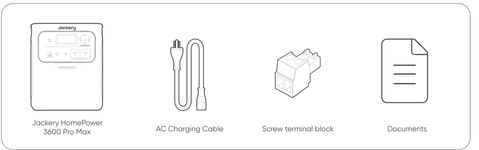

### Jackery Battery Pack 3600 — Sold separately

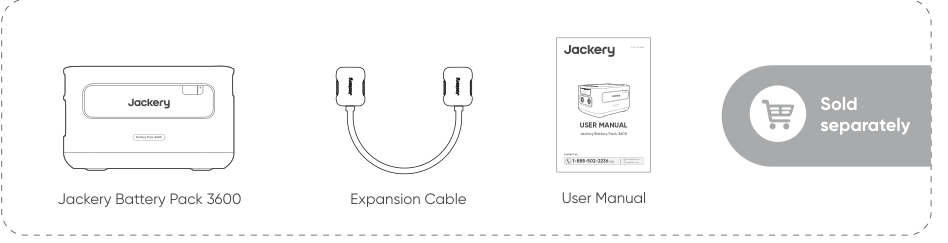

### Jackery Automatic Transfer Switch — Sold separately

# CONTACT US

JACKERY INC.

5310 Bunche Dr., Fremont, CA 94538-8301

1-888-502-2236 (US)

hello@jackery.com

www.jackery.com

