<style>
/* Native figure geometry only. Shared Web theme owns headings/tables/callouts. */
.native-figure { max-width:760px; margin:1rem auto; min-width:0; }
.native-figure .hb-reference-figure { margin:0; max-width:none; }
#furo-main-content .native-figure img { width:100% !important; height:auto !important; max-height:none; }

.native-dense {max-width:780px;}
.native-lcd-map {max-width:680px;}
#furo-main-content .native-figure .hb-reference-live-label {font-size:1.75cqw;line-height:1;align-items:flex-start;justify-content:flex-start;text-align:left;padding:.1cqw;}
.native-figure .hb-reference-live-label > span {width:100%;}
.native-overview-front .hb-reference-live-label,.native-overview-left .hb-reference-live-label,.native-overview-right .hb-reference-live-label {font-size:1.55cqw!important;}
.native-figure .hb-reference-live-label strong {font-weight:700;}
.native-operation {border:1px solid var(--hb-line-soft);border-radius:var(--hb-panel-radius);}
.native-inbox-main {max-width:180px;}
.native-app-add {max-width:480px;}
.native-app-results {max-width:700px;}
.native-lcd-side {display:grid;grid-template-columns:1fr 1.45fr;gap:1rem;align-items:stretch;}
.native-lcd-side .native-figure {margin:0;}
.native-lcd-side > .native-figure img {height:100%!important;object-fit:contain;}
.native-figure .hb-reference-live-pill {border-radius:.8cqw;}
@media(max-width:760px){
 .native-dense{overflow-x:auto;padding-bottom:.4rem;}
 .native-dense > .hb-reference-figure{min-width:680px;}
 .native-lcd-side{display:block;}
 .native-lcd-side > .native-figure{max-width:330px;margin:0 auto 1rem;}
}

.native-figure .hb-reference-live-label {white-space:nowrap;}

.native-inline-plus{display:inline-grid;place-items:center;width:1.1em;height:1.1em;border-radius:50%;background:#444;color:#fff;line-height:1;font-weight:700;vertical-align:baseline;}
.native-lcd-note{font-weight:400;font-size:.92em;}

/* Source speech tails are CSS shapes, never leftover blank artwork. */
.native-power .hb-reference-art-panel::after,.native-ups .hb-reference-art-panel::after,.native-sts-connect .hb-reference-art-panel::after {content:"";position:absolute;z-index:1;pointer-events:none;width:5.9%;height:5.5%;background:#f2f2f3;clip-path:polygon(50% 0,100% 100%,0 100%);}
.native-power .hb-reference-art-panel::after{left:45.36%;top:53.65%;width:4.61%;height:4.87%;clip-path:polygon(47.13% 0,100% 100%,0 100%);}
.native-ups .hb-reference-art-panel::after{left:40.60%;top:65.72%;width:5.82%;height:4.95%;clip-path:polygon(47.13% 0,100% 100%,0 100%);}
.native-sts-connect .hb-reference-art-panel::after{left:40.64%;top:33.16%;width:5.82%;height:5.77%;background:#fff;clip-path:polygon(0 0,100% 0,47.13% 100%);}
.native-package-battery,.native-package-sts{border-style:dashed;border-radius:0;}
/* Source-derived label geometry */
html[lang="fr"] .native-overview-front [data-source-line="0"] {font-size:2.2082cqw!important;}
html[lang="fr"] .native-overview-front [data-source-line="1"] {font-size:2.2082cqw!important;}
html[lang="fr"] .native-overview-front [data-source-line="2"] {font-size:2.2082cqw!important;}
html[lang="fr"] .native-overview-front [data-source-line="3"] {font-size:2.2082cqw!important;}
html[lang="fr"] .native-overview-front [data-source-line="4"] {font-size:2.2082cqw!important;}
html[lang="fr"] .native-overview-front [data-source-line="5"] {font-size:1.5773cqw!important;}
html[lang="fr"] .native-overview-front [data-source-line="6"] {font-size:2.2082cqw!important;}
html[lang="fr"] .native-overview-front [data-source-line="7"] {font-size:1.5773cqw!important;}
html[lang="fr"] .native-overview-front [data-source-line="8"] {font-size:2.2082cqw!important;}
html[lang="fr"] .native-overview-front [data-source-line="9"] {font-size:2.2082cqw!important;}
html[lang="fr"] .native-overview-front [data-source-line="10"] {font-size:1.5773cqw!important;}
html[lang="fr"] .native-overview-front [data-source-line="11"] {font-size:2.2082cqw!important;}
html[lang="fr"] .native-overview-front [data-source-line="12"] {font-size:2.2082cqw!important;}
html[lang="fr"] .native-overview-front [data-source-line="13"] {font-size:1.8927cqw!important;}
html[lang="fr"] .native-overview-front [data-source-line="14"] {font-size:1.4365cqw!important;}
html[lang="fr"] .native-overview-front [data-source-line="15"] {font-size:2.2082cqw!important;}
html[lang="fr"] .native-overview-front [data-source-line="16"] {font-size:1.4365cqw!important;}
html[lang="fr"] .native-overview-front [data-source-line="17"] {font-size:1.4365cqw!important;}
html[lang="fr"] .native-overview-front [data-source-line="18"] {font-size:2.2082cqw!important;}
html[lang="fr"] .native-overview-front [data-source-line="19"] {font-size:1.4365cqw!important;}
html[lang="fr"] .native-overview-front [data-source-line="20"] {font-size:1.8927cqw!important;}
html[lang="fr"] .native-overview-front [data-source-line="21"] {font-size:1.8927cqw!important;}
html[lang="fr"] .native-overview-front [data-source-line="22"] {font-size:1.5773cqw!important;}
html[lang="fr"] .native-overview-front [data-source-line="23"] {font-size:1.5773cqw!important;}
html[lang="fr"] .native-overview-front [data-source-line="24"] {font-size:1.5773cqw!important;}
html[lang="fr"] .native-overview-front [data-source-line="25"] {font-size:1.5773cqw!important;}
html[lang="fr"] .native-overview-front [data-source-line="26"] {font-size:1.5773cqw!important;}
html[lang="fr"] .native-overview-front [data-source-line="27"] {font-size:1.5773cqw!important;}
html[lang="fr"] .native-overview-left [data-source-line="0"] {font-size:2.2082cqw!important;}
html[lang="fr"] .native-overview-left [data-source-line="1"] {font-size:2.2082cqw!important;}
html[lang="fr"] .native-overview-left [data-source-line="2"] {font-size:1.8927cqw!important;}
html[lang="fr"] .native-overview-left [data-source-line="3"] {font-size:1.6719cqw!important;}
html[lang="fr"] .native-overview-left [data-source-line="4"] {font-size:1.6719cqw!important;}
html[lang="fr"] .native-overview-left [data-source-line="5"] {font-size:2.2082cqw!important;}
html[lang="fr"] .native-overview-left [data-source-line="6"] {font-size:1.8927cqw!important;}
html[lang="fr"] .native-overview-left [data-source-line="7"] {font-size:1.6719cqw!important;}
html[lang="fr"] .native-overview-left [data-source-line="8"] {font-size:1.6719cqw!important;}
html[lang="fr"] .native-overview-left [data-source-line="9"] {font-size:2.2082cqw!important;}
html[lang="fr"] .native-overview-left [data-source-line="10"] {font-size:1.8927cqw!important;}
html[lang="fr"] .native-overview-left [data-source-line="11"] {font-size:1.6719cqw!important;}
html[lang="fr"] .native-overview-left [data-source-line="12"] {font-size:1.6719cqw!important;}
html[lang="fr"] .native-overview-left [data-source-line="13"] {font-size:2.2082cqw!important;}
html[lang="fr"] .native-overview-left [data-source-line="14"] {font-size:1.6719cqw!important;}
html[lang="fr"] .native-overview-left [data-source-line="15"] {font-size:1.6719cqw!important;}
html[lang="fr"] .native-overview-left [data-source-line="16"] {font-size:2.2082cqw!important;}
html[lang="fr"] .native-overview-left [data-source-line="17"] {font-size:2.2082cqw!important;}
html[lang="fr"] .native-overview-right [data-source-line="0"] {font-size:2.2082cqw!important;}
html[lang="fr"] .native-overview-right [data-source-line="1"] {font-size:1.5773cqw!important;}
html[lang="fr"] .native-overview-right [data-source-line="2"] {font-size:2.2082cqw!important;}
html[lang="fr"] .native-overview-right [data-source-line="3"] {font-size:1.5773cqw!important;}
html[lang="fr"] .native-overview-right [data-source-line="4"] {font-size:1.5773cqw!important;}
html[lang="fr"] .native-overview-right [data-source-line="5"] {font-size:2.2082cqw!important;}
html[lang="fr"] .native-overview-right [data-source-line="6"] {font-size:1.5773cqw!important;}
html[lang="fr"] .native-overview-right [data-source-line="7"] {font-size:2.2082cqw!important;}
html[lang="fr"] .native-overview-right [data-source-line="8"] {font-size:1.5773cqw!important;}
html[lang="fr"] .native-overview-right [data-source-line="9"] {font-size:1.5773cqw!important;}
html[lang="fr"] .native-overview-right [data-source-line="10"] {font-size:2.2082cqw!important;}
html[lang="fr"] .native-overview-right [data-source-line="11"] {font-size:1.5773cqw!important;}
html[lang="fr"] .native-overview-right [data-source-line="12"] {font-size:2.2082cqw!important;}
html[lang="fr"] .native-overview-right [data-source-line="13"] {font-size:1.5773cqw!important;}
html[lang="fr"] .native-overview-right [data-source-line="14"] {font-size:2.2082cqw!important;}
html[lang="fr"] .native-lcd-map [data-source-line="0"] {font-size:2.1995cqw!important;}
html[lang="fr"] .native-lcd-map [data-source-line="1"] {font-size:2.1995cqw!important;}
html[lang="fr"] .native-lcd-map [data-source-line="2"] {font-size:2.1995cqw!important;}
html[lang="fr"] .native-lcd-map [data-source-line="3"] {font-size:2.1995cqw!important;}
html[lang="fr"] .native-lcd-map [data-source-line="4"] {font-size:2.1995cqw!important;}
html[lang="fr"] .native-lcd-map [data-source-line="5"] {font-size:2.1995cqw!important;}
html[lang="fr"] .native-lcd-map [data-source-line="6"] {font-size:2.1995cqw!important;}
html[lang="fr"] .native-lcd-map [data-source-line="7"] {font-size:2.1995cqw!important;}
html[lang="fr"] .native-lcd-map [data-source-line="8"] {font-size:2.1995cqw!important;}
html[lang="fr"] .native-lcd-map [data-source-line="9"] {font-size:2.1995cqw!important;}
html[lang="fr"] .native-lcd-map [data-source-line="10"] {font-size:2.1995cqw!important;}
html[lang="fr"] .native-lcd-map [data-source-line="11"] {font-size:2.1995cqw!important;}
html[lang="fr"] .native-lcd-map [data-source-line="12"] {font-size:2.1995cqw!important;}
html[lang="fr"] .native-lcd-map [data-source-line="13"] {font-size:2.1995cqw!important;}
html[lang="fr"] .native-lcd-map [data-source-line="14"] {font-size:2.1995cqw!important;}
html[lang="fr"] .native-lcd-map [data-source-line="15"] {font-size:2.1995cqw!important;}
html[lang="fr"] .native-lcd-map [data-source-line="16"] {font-size:2.1995cqw!important;}
html[lang="fr"] .native-lcd-map [data-source-line="17"] {font-size:2.1995cqw!important;}
html[lang="fr"] .native-lcd-map [data-source-line="18"] {font-size:2.1995cqw!important;}
html[lang="fr"] .native-lcd-map [data-source-line="19"] {font-size:2.1995cqw!important;}
html[lang="fr"] .native-lcd-map [data-source-line="20"] {font-size:2.1995cqw!important;}
html[lang="fr"] .native-lcd-map [data-source-line="21"] {font-size:2.1995cqw!important;}
html[lang="fr"] .native-lcd-map [data-source-line="22"] {font-size:2.1995cqw!important;}
html[lang="fr"] .native-power [data-source-line="0"] {font-size:3.1847cqw!important;}
html[lang="fr"] .native-power [data-source-line="1"] {font-size:1.9108cqw!important;}
html[lang="fr"] .native-power [data-source-line="2"] {font-size:3.1847cqw!important;}
html[lang="fr"] .native-power [data-source-line="3"] {font-size:1.9108cqw!important;}
html[lang="fr"] .native-power [data-source-line="4"] {font-size:1.9108cqw!important;}
html[lang="fr"] .native-power [data-source-line="5"] {font-size:2.2293cqw!important;}
html[lang="fr"] .native-power [data-source-line="6"] {font-size:1.9108cqw!important;}
html[lang="fr"] .native-power [data-source-line="6"] {padding:1.6703cqw 1.7347cqw!important;}
html[lang="fr"] .native-power [data-source-line="6"] {border-radius:1.9108cqw!important;}
html[lang="fr"] .native-ac-output [data-source-line="0"] {font-size:2.1019cqw!important;}
html[lang="fr"] .native-ac-output [data-source-line="0"] {padding:0.8120cqw 1.7486cqw!important;}
html[lang="fr"] .native-ac-output [data-source-line="0"] {border-radius:1.9108cqw!important;}
html[lang="fr"] .native-ac-output [data-source-line="1"] {font-size:3.1847cqw!important;}
html[lang="fr"] .native-ac-output [data-source-line="2"] {font-size:1.9108cqw!important;}
html[lang="fr"] .native-ac-output [data-source-line="3"] {font-size:3.1847cqw!important;}
html[lang="fr"] .native-ac-output [data-source-line="4"] {font-size:1.9108cqw!important;}
html[lang="fr"] .native-usb-output [data-source-line="0"] {font-size:1.9108cqw!important;}
html[lang="fr"] .native-usb-output [data-source-line="0"] {padding:0.7966cqw 1.7485cqw!important;}
html[lang="fr"] .native-usb-output [data-source-line="0"] {border-radius:1.9108cqw!important;}
html[lang="fr"] .native-usb-output [data-source-line="1"] {font-size:2.5478cqw!important;}
html[lang="fr"] .native-usb-output [data-source-line="2"] {font-size:1.9108cqw!important;}
html[lang="fr"] .native-usb-output [data-source-line="3"] {font-size:2.5478cqw!important;}
html[lang="fr"] .native-usb-output [data-source-line="4"] {font-size:1.9108cqw!important;}
html[lang="fr"] .native-dc-output [data-source-line="0"] {font-size:1.9108cqw!important;}
html[lang="fr"] .native-dc-output [data-source-line="0"] {padding:0.7966cqw 1.7485cqw!important;}
html[lang="fr"] .native-dc-output [data-source-line="0"] {border-radius:1.9108cqw!important;}
html[lang="fr"] .native-dc-output [data-source-line="1"] {font-size:2.5478cqw!important;}
html[lang="fr"] .native-dc-output [data-source-line="2"] {font-size:1.9108cqw!important;}
html[lang="fr"] .native-dc-output [data-source-line="3"] {font-size:2.5478cqw!important;}
html[lang="fr"] .native-dc-output [data-source-line="4"] {font-size:1.9108cqw!important;}
html[lang="fr"] .native-ups [data-source-line="0"] {font-size:1.9108cqw!important;}
html[lang="fr"] .native-ups [data-source-line="0"] {padding:2.8392cqw 2.6258cqw!important;}
html[lang="fr"] .native-ups [data-source-line="0"] {border-radius:1.9108cqw!important;}
html[lang="fr"] .native-battery-packs [data-source-line="0"] {font-size:1.9355cqw!important;}
html[lang="fr"] .native-battery-packs [data-source-line="1"] {font-size:1.9355cqw!important;}
html[lang="fr"] .native-sts-connect [data-source-line="0"] {font-size:1.9090cqw!important;}
html[lang="fr"] .native-sts-connect [data-source-line="0"] {padding:2.5038cqw 2.4362cqw!important;}
html[lang="fr"] .native-sts-connect [data-source-line="0"] {border-radius:1.9090cqw!important;}
html[lang="fr"] .native-sts-connect [data-source-line="1"] {font-size:1.9090cqw!important;}
html[lang="fr"] .native-sts-connect [data-source-line="2"] {font-size:1.9090cqw!important;}
html[lang="fr"] .native-sts-connect [data-source-line="3"] {font-size:1.9090cqw!important;}
html[lang="fr"] .native-sts-connect [data-source-line="4"] {font-size:1.9090cqw!important;}
html[lang="fr"] .native-sts-connect [data-source-line="5"] {font-size:1.9090cqw!important;}
html[lang="fr"] .native-sts-connect [data-source-line="6"] {font-size:1.9090cqw!important;}
html[lang="fr"] .native-sts-connect [data-source-line="7"] {font-size:1.9090cqw!important;}
html[lang="fr"] .native-sts-connect [data-source-line="8"] {font-size:1.9090cqw!important;}
html[lang="fr"] .native-sts-connect [data-source-line="9"] {font-size:1.9090cqw!important;}
html[lang="fr"] .native-ac-charge [data-source-line="0"] {font-size:1.9096cqw!important;}
html[lang="fr"] .native-ac-charge [data-source-line="1"] {font-size:1.9096cqw!important;}
html[lang="fr"] .native-ac-charge [data-source-line="2"] {font-size:1.9096cqw!important;}
html[lang="fr"] .native-sts-charge [data-source-line="0"] {font-size:1.9102cqw!important;}
html[lang="fr"] .native-sts-charge [data-source-line="1"] {font-size:1.9102cqw!important;}
html[lang="fr"] .native-sts-charge [data-source-line="2"] {font-size:1.9102cqw!important;}
html[lang="fr"] .native-sts-charge [data-source-line="3"] {font-size:1.9102cqw!important;}
html[lang="fr"] .native-sts-charge [data-source-line="4"] {font-size:1.9102cqw!important;}
html[lang="fr"] .native-sts-charge [data-source-line="5"] {font-size:1.9102cqw!important;}
html[lang="fr"] .native-sts-charge [data-source-line="6"] {font-size:1.9102cqw!important;}
html[lang="fr"] .native-sts-charge [data-source-line="7"] {font-size:1.9102cqw!important;}
html[lang="fr"] .native-sts-charge [data-source-line="8"] {font-size:0.5308cqw!important;}
html[lang="fr"] .native-sts-charge [data-source-line="9"] {font-size:1.9102cqw!important;}
html[lang="fr"] .native-low-pv-500 [data-source-line="0"] {font-size:1.4327cqw!important;}
html[lang="fr"] .native-low-pv-500 [data-source-line="1"] {font-size:1.6243cqw!important;}
html[lang="fr"] .native-low-pv-200 [data-source-line="0"] {font-size:1.4327cqw!important;}
html[lang="fr"] .native-low-pv-200 [data-source-line="1"] {font-size:1.4327cqw!important;}
html[lang="fr"] .native-low-pv-200 [data-source-line="2"] {font-size:1.6243cqw!important;}
html[lang="fr"] .native-high-pv [data-source-line="0"] {font-size:1.9507cqw!important;}
html[lang="fr"] .native-high-pv [data-source-line="1"] {font-size:1.9507cqw!important;}
html[lang="fr"] .native-high-pv-lock [data-source-line="0"] {font-size:2.5592cqw!important;}
html[lang="fr"] .native-high-pv-lock [data-source-line="1"] {font-size:2.5592cqw!important;}
html[lang="fr"] .native-high-pv-lock [data-source-line="2"] {font-size:1.9194cqw!important;}
html[lang="fr"] .native-high-pv-lock [data-source-line="3"] {font-size:1.9194cqw!important;}
html[lang="fr"] .native-high-pv-lock [data-source-line="4"] {font-size:1.9194cqw!important;}
html[lang="fr"] .native-high-pv-lock [data-source-line="5"] {font-size:1.9194cqw!important;}
html[lang="fr"] .native-high-pv-lock [data-source-line="6"] {font-size:1.9194cqw!important;}
html[lang="fr"] .native-car [data-source-line="0"] {font-size:2.2283cqw!important;}
html[lang="fr"] .native-car [data-source-line="1"] {font-size:1.5917cqw!important;}
html[lang="fr"] .native-car [data-source-line="1"] {padding:1.1709cqw 1.0996cqw!important;}
html[lang="fr"] .native-car [data-source-line="1"] {border-radius:1.9100cqw!important;}
html[lang="fr"] .native-app-add [data-source-line="0"] {font-size:3.1735cqw!important;}
html[lang="fr"] .native-app-add [data-source-line="1"] {font-size:3.1735cqw!important;}
html[lang="fr"] .native-app-control [data-source-line="0"] {font-size:1.9887cqw!important;}
html[lang="fr"] .native-app-control [data-source-line="1"] {font-size:1.9887cqw!important;}
html[lang="fr"] .native-app-control [data-source-line="2"] {font-size:1.9887cqw!important;}
html[lang="fr"] .native-app-control [data-source-line="3"] {font-size:1.9887cqw!important;}
html[lang="fr"] .native-app-control [data-source-line="4"] {font-size:1.9887cqw!important;}
html[lang="fr"] .native-app-control [data-source-line="5"] {font-size:1.9887cqw!important;}
html[lang="fr"] .native-app-control [data-source-line="6"] {font-size:1.9887cqw!important;}
html[lang="fr"] .native-app-control [data-source-line="7"] {font-size:1.9887cqw!important;}
html[lang="fr"] .native-app-results [data-source-line="0"] {font-size:2.0509cqw!important;}
html[lang="fr"] .native-app-results [data-source-line="1"] {font-size:2.0509cqw!important;}
html[lang="fr"] .native-app-results [data-source-line="2"] {font-size:2.0509cqw!important;}
html[lang="fr"] .native-ess [data-source-line="0"] {font-size:1.9374cqw!important;}
html[lang="fr"] .native-ess [data-source-line="1"] {font-size:1.9374cqw!important;}
html[lang="fr"] .native-package-host [data-source-line="0"] {font-size:0.1680cqw!important;}
html[lang="fr"] .native-package-host [data-source-line="1"] {font-size:0.7963cqw!important;}
html[lang="fr"] .native-package-host [data-source-line="2"] {font-size:0.3676cqw!important;}
html[lang="fr"] .native-package-host [data-source-line="3"] {font-size:0.2471cqw!important;}
html[lang="fr"] .native-package-host [data-source-line="4"] {font-size:0.5295cqw!important;}
html[lang="fr"] .native-package-host [data-source-line="5"] {font-size:0.1667cqw!important;}
html[lang="fr"] .native-package-host [data-source-line="6"] {font-size:0.1667cqw!important;}
html[lang="fr"] .native-package-host [data-source-line="7"] {font-size:1.6015cqw!important;}
html[lang="fr"] .native-package-host [data-source-line="8"] {font-size:1.6015cqw!important;}
html[lang="fr"] .native-package-host [data-source-line="9"] {font-size:1.6015cqw!important;}
html[lang="fr"] .native-package-host [data-source-line="10"] {font-size:1.6015cqw!important;}
html[lang="fr"] .native-package-battery [data-source-line="0"] {font-size:0.1654cqw!important;}
html[lang="fr"] .native-package-battery [data-source-line="1"] {font-size:1.9396cqw!important;}
html[lang="fr"] .native-package-battery [data-source-line="1"] {padding:2.8465cqw 10.5169cqw!important;}
html[lang="fr"] .native-package-battery [data-source-line="1"] {border-radius:4.8046cqw!important;}
html[lang="fr"] .native-package-battery [data-source-line="1"]::after {content:"";position:absolute;left:8%;top:12%;width:33%;height:76%;background:url("assets/sold-separately-cart.svg") center/contain no-repeat;}
html[lang="fr"] .native-package-battery [data-source-line="2"] {font-size:0.8441cqw!important;}
html[lang="fr"] .native-package-battery [data-source-line="3"] {font-size:0.3867cqw!important;}
html[lang="fr"] .native-package-battery [data-source-line="4"] {font-size:0.2432cqw!important;}
html[lang="fr"] .native-package-battery [data-source-line="5"] {font-size:0.5212cqw!important;}
html[lang="fr"] .native-package-battery [data-source-line="6"] {font-size:0.1641cqw!important;}
html[lang="fr"] .native-package-battery [data-source-line="7"] {font-size:0.1641cqw!important;}
html[lang="fr"] .native-package-battery [data-source-line="8"] {font-size:1.6015cqw!important;}
html[lang="fr"] .native-package-battery [data-source-line="9"] {font-size:1.6015cqw!important;}
html[lang="fr"] .native-package-battery [data-source-line="10"] {font-size:1.6015cqw!important;}
html[lang="fr"] .native-package-sts [data-source-line="0"] {font-size:0.1631cqw!important;}
html[lang="fr"] .native-package-sts [data-source-line="1"] {font-size:0.1631cqw!important;}
html[lang="fr"] .native-package-sts [data-source-line="2"] {font-size:0.1631cqw!important;}
html[lang="fr"] .native-package-sts [data-source-line="3"] {font-size:0.1631cqw!important;}
html[lang="fr"] .native-package-sts [data-source-line="4"] {font-size:0.2548cqw!important;}
html[lang="fr"] .native-package-sts [data-source-line="5"] {font-size:0.2038cqw!important;}
html[lang="fr"] .native-package-sts [data-source-line="6"] {font-size:0.2038cqw!important;}
html[lang="fr"] .native-package-sts [data-source-line="7"] {font-size:0.1960cqw!important;}
html[lang="fr"] .native-package-sts [data-source-line="8"] {font-size:0.9239cqw!important;}
html[lang="fr"] .native-package-sts [data-source-line="9"] {font-size:0.5618cqw!important;}
html[lang="fr"] .native-package-sts [data-source-line="10"] {font-size:0.0944cqw!important;}
html[lang="fr"] .native-package-sts [data-source-line="11"] {font-size:0.0492cqw!important;}
html[lang="fr"] .native-package-sts [data-source-line="12"] {font-size:0.0492cqw!important;}
html[lang="fr"] .native-package-sts [data-source-line="13"] {font-size:0.0492cqw!important;}
html[lang="fr"] .native-package-sts [data-source-line="14"] {font-size:0.0492cqw!important;}
html[lang="fr"] .native-package-sts [data-source-line="15"] {font-size:0.0492cqw!important;}
html[lang="fr"] .native-package-sts [data-source-line="16"] {font-size:0.2794cqw!important;}
html[lang="fr"] .native-package-sts [data-source-line="17"] {font-size:0.0492cqw!important;}
html[lang="fr"] .native-package-sts [data-source-line="18"] {font-size:0.0492cqw!important;}
html[lang="fr"] .native-package-sts [data-source-line="19"] {font-size:0.1458cqw!important;}
html[lang="fr"] .native-package-sts [data-source-line="20"] {font-size:0.1458cqw!important;}
html[lang="fr"] .native-package-sts [data-source-line="21"] {font-size:0.1458cqw!important;}
html[lang="fr"] .native-package-sts [data-source-line="22"] {font-size:0.1458cqw!important;}
html[lang="fr"] .native-package-sts [data-source-line="23"] {font-size:0.1458cqw!important;}
html[lang="fr"] .native-package-sts [data-source-line="24"] {font-size:0.8885cqw!important;}
html[lang="fr"] .native-package-sts [data-source-line="25"] {font-size:0.4152cqw!important;}
html[lang="fr"] .native-package-sts [data-source-line="26"] {font-size:0.1960cqw!important;}
html[lang="fr"] .native-package-sts [data-source-line="27"] {font-size:0.1960cqw!important;}
html[lang="fr"] .native-package-sts [data-source-line="28"] {font-size:0.1458cqw!important;}
html[lang="fr"] .native-package-sts [data-source-line="29"] {font-size:0.1960cqw!important;}
html[lang="fr"] .native-package-sts [data-source-line="30"] {font-size:0.1960cqw!important;}
html[lang="fr"] .native-package-sts [data-source-line="31"] {font-size:0.1631cqw!important;}
html[lang="fr"] .native-package-sts [data-source-line="32"] {font-size:0.1631cqw!important;}
html[lang="fr"] .native-package-sts [data-source-line="33"] {font-size:0.1458cqw!important;}
html[lang="fr"] .native-package-sts [data-source-line="34"] {font-size:0.1631cqw!important;}
html[lang="fr"] .native-package-sts [data-source-line="35"] {font-size:0.1631cqw!important;}
html[lang="fr"] .native-package-sts [data-source-line="36"] {font-size:1.6015cqw!important;}
html[lang="fr"] .native-package-sts [data-source-line="37"] {font-size:1.6015cqw!important;}
html[lang="fr"] .native-package-sts [data-source-line="38"] {font-size:1.6015cqw!important;}
html[lang="fr"] .native-package-sts [data-source-line="39"] {font-size:1.6015cqw!important;}
html[lang="fr"] .native-package-sts [data-source-line="40"] {font-size:1.6015cqw!important;}
html[lang="fr"] .native-package-sts [data-source-line="41"] {font-size:1.6015cqw!important;}
html[lang="fr"] .native-package-sts [data-source-line="42"] {font-size:1.9396cqw!important;}
html[lang="fr"] .native-package-sts [data-source-line="42"] {padding:2.8466cqw 10.5169cqw!important;}
html[lang="fr"] .native-package-sts [data-source-line="42"] {border-radius:4.8046cqw!important;}
html[lang="fr"] .native-package-sts [data-source-line="42"]::after {content:"";position:absolute;left:8%;top:12%;width:33%;height:76%;background:url("assets/sold-separately-cart.svg") center/contain no-repeat;}
html[lang="fr"] .native-package-sts [data-source-line="43"] {font-size:1.6015cqw!important;}
html[lang="fr"] .native-package-sts [data-source-line="44"] {font-size:1.6015cqw!important;}
html[lang="fr"] .native-package-sts [data-source-line="45"] {font-size:1.6015cqw!important;}
html[lang="fr"] .native-package-sts [data-source-line="46"] {font-size:1.6015cqw!important;}
html[lang="fr"] .native-package-sts [data-source-line="47"] {font-size:1.6015cqw!important;}
html[lang="en"] .native-overview-front [data-source-line="0"] {font-size:2.2082cqw!important;}
html[lang="en"] .native-overview-front [data-source-line="1"] {font-size:2.2082cqw!important;}
html[lang="en"] .native-overview-front [data-source-line="2"] {font-size:2.2082cqw!important;}
html[lang="en"] .native-overview-front [data-source-line="3"] {font-size:2.2082cqw!important;}
html[lang="en"] .native-overview-front [data-source-line="4"] {font-size:1.5773cqw!important;}
html[lang="en"] .native-overview-front [data-source-line="5"] {font-size:2.2082cqw!important;}
html[lang="en"] .native-overview-front [data-source-line="6"] {font-size:2.2082cqw!important;}
html[lang="en"] .native-overview-front [data-source-line="7"] {font-size:1.5773cqw!important;}
html[lang="en"] .native-overview-front [data-source-line="8"] {font-size:2.2082cqw!important;}
html[lang="en"] .native-overview-front [data-source-line="9"] {font-size:1.5773cqw!important;}
html[lang="en"] .native-overview-front [data-source-line="10"] {font-size:2.2082cqw!important;}
html[lang="en"] .native-overview-front [data-source-line="11"] {font-size:2.2082cqw!important;}
html[lang="en"] .native-overview-front [data-source-line="12"] {font-size:1.8927cqw!important;}
html[lang="en"] .native-overview-front [data-source-line="13"] {font-size:1.5773cqw!important;}
html[lang="en"] .native-overview-front [data-source-line="14"] {font-size:1.5773cqw!important;}
html[lang="en"] .native-overview-front [data-source-line="15"] {font-size:1.5773cqw!important;}
html[lang="en"] .native-overview-front [data-source-line="16"] {font-size:2.2082cqw!important;}
html[lang="en"] .native-overview-front [data-source-line="17"] {font-size:1.5773cqw!important;}
html[lang="en"] .native-overview-front [data-source-line="18"] {font-size:1.8927cqw!important;}
html[lang="en"] .native-overview-front [data-source-line="19"] {font-size:1.8927cqw!important;}
html[lang="en"] .native-overview-front [data-source-line="20"] {font-size:1.5773cqw!important;}
html[lang="en"] .native-overview-front [data-source-line="21"] {font-size:1.5773cqw!important;}
html[lang="en"] .native-overview-front [data-source-line="22"] {font-size:1.5773cqw!important;}
html[lang="en"] .native-overview-front [data-source-line="23"] {font-size:1.5773cqw!important;}
html[lang="en"] .native-overview-left [data-source-line="0"] {font-size:2.2082cqw!important;}
html[lang="en"] .native-overview-left [data-source-line="1"] {font-size:2.2082cqw!important;}
html[lang="en"] .native-overview-left [data-source-line="2"] {font-size:1.8927cqw!important;}
html[lang="en"] .native-overview-left [data-source-line="3"] {font-size:1.6719cqw!important;}
html[lang="en"] .native-overview-left [data-source-line="4"] {font-size:1.6719cqw!important;}
html[lang="en"] .native-overview-left [data-source-line="5"] {font-size:2.2082cqw!important;}
html[lang="en"] .native-overview-left [data-source-line="6"] {font-size:1.8927cqw!important;}
html[lang="en"] .native-overview-left [data-source-line="7"] {font-size:1.6719cqw!important;}
html[lang="en"] .native-overview-left [data-source-line="8"] {font-size:1.6719cqw!important;}
html[lang="en"] .native-overview-left [data-source-line="9"] {font-size:2.2082cqw!important;}
html[lang="en"] .native-overview-left [data-source-line="10"] {font-size:1.8927cqw!important;}
html[lang="en"] .native-overview-left [data-source-line="11"] {font-size:1.6719cqw!important;}
html[lang="en"] .native-overview-left [data-source-line="12"] {font-size:1.6719cqw!important;}
html[lang="en"] .native-overview-left [data-source-line="13"] {font-size:2.2082cqw!important;}
html[lang="en"] .native-overview-left [data-source-line="14"] {font-size:1.5773cqw!important;}
html[lang="en"] .native-overview-left [data-source-line="15"] {font-size:1.5773cqw!important;}
html[lang="en"] .native-overview-left [data-source-line="16"] {font-size:2.2082cqw!important;}
html[lang="en"] .native-overview-left [data-source-line="17"] {font-size:2.2082cqw!important;}
html[lang="en"] .native-overview-right [data-source-line="0"] {font-size:2.2082cqw!important;}
html[lang="en"] .native-overview-right [data-source-line="1"] {font-size:1.5773cqw!important;}
html[lang="en"] .native-overview-right [data-source-line="2"] {font-size:2.2082cqw!important;}
html[lang="en"] .native-overview-right [data-source-line="3"] {font-size:1.5773cqw!important;}
html[lang="en"] .native-overview-right [data-source-line="4"] {font-size:1.5773cqw!important;}
html[lang="en"] .native-overview-right [data-source-line="5"] {font-size:2.2082cqw!important;}
html[lang="en"] .native-overview-right [data-source-line="6"] {font-size:1.5773cqw!important;}
html[lang="en"] .native-overview-right [data-source-line="7"] {font-size:2.2082cqw!important;}
html[lang="en"] .native-overview-right [data-source-line="8"] {font-size:1.5773cqw!important;}
html[lang="en"] .native-overview-right [data-source-line="9"] {font-size:1.5773cqw!important;}
html[lang="en"] .native-overview-right [data-source-line="10"] {font-size:2.2082cqw!important;}
html[lang="en"] .native-overview-right [data-source-line="11"] {font-size:1.5773cqw!important;}
html[lang="en"] .native-overview-right [data-source-line="12"] {font-size:2.2082cqw!important;}
html[lang="en"] .native-overview-right [data-source-line="13"] {font-size:1.5773cqw!important;}
html[lang="en"] .native-overview-right [data-source-line="14"] {font-size:2.2082cqw!important;}
html[lang="en"] .native-lcd-map [data-source-line="0"] {font-size:2.1995cqw!important;}
html[lang="en"] .native-lcd-map [data-source-line="1"] {font-size:2.1995cqw!important;}
html[lang="en"] .native-lcd-map [data-source-line="2"] {font-size:2.1995cqw!important;}
html[lang="en"] .native-lcd-map [data-source-line="3"] {font-size:2.1995cqw!important;}
html[lang="en"] .native-lcd-map [data-source-line="4"] {font-size:2.1995cqw!important;}
html[lang="en"] .native-lcd-map [data-source-line="5"] {font-size:2.1995cqw!important;}
html[lang="en"] .native-lcd-map [data-source-line="6"] {font-size:2.1995cqw!important;}
html[lang="en"] .native-lcd-map [data-source-line="7"] {font-size:2.1995cqw!important;}
html[lang="en"] .native-lcd-map [data-source-line="8"] {font-size:2.1995cqw!important;}
html[lang="en"] .native-lcd-map [data-source-line="9"] {font-size:2.1995cqw!important;}
html[lang="en"] .native-lcd-map [data-source-line="10"] {font-size:2.1995cqw!important;}
html[lang="en"] .native-lcd-map [data-source-line="11"] {font-size:2.1995cqw!important;}
html[lang="en"] .native-lcd-map [data-source-line="12"] {font-size:2.1995cqw!important;}
html[lang="en"] .native-lcd-map [data-source-line="13"] {font-size:2.1995cqw!important;}
html[lang="en"] .native-lcd-map [data-source-line="14"] {font-size:2.1995cqw!important;}
html[lang="en"] .native-lcd-map [data-source-line="15"] {font-size:2.1995cqw!important;}
html[lang="en"] .native-lcd-map [data-source-line="16"] {font-size:2.1995cqw!important;}
html[lang="en"] .native-lcd-map [data-source-line="17"] {font-size:2.1995cqw!important;}
html[lang="en"] .native-lcd-map [data-source-line="18"] {font-size:2.1995cqw!important;}
html[lang="en"] .native-lcd-map [data-source-line="19"] {font-size:2.1995cqw!important;}
html[lang="en"] .native-lcd-map [data-source-line="20"] {font-size:2.1995cqw!important;}
html[lang="en"] .native-lcd-map [data-source-line="21"] {font-size:2.1995cqw!important;}
html[lang="en"] .native-lcd-map [data-source-line="22"] {font-size:2.1995cqw!important;}
html[lang="en"] .native-power [data-source-line="0"] {font-size:3.1847cqw!important;}
html[lang="en"] .native-power [data-source-line="1"] {font-size:1.9108cqw!important;}
html[lang="en"] .native-power [data-source-line="2"] {font-size:3.1847cqw!important;}
html[lang="en"] .native-power [data-source-line="3"] {font-size:1.9108cqw!important;}
html[lang="en"] .native-power [data-source-line="4"] {font-size:2.2293cqw!important;}
html[lang="en"] .native-power [data-source-line="5"] {font-size:1.9108cqw!important;}
html[lang="en"] .native-power [data-source-line="5"] {padding:2.3073cqw 2.8525cqw!important;}
html[lang="en"] .native-power [data-source-line="5"] {border-radius:1.9108cqw!important;}
html[lang="en"] .native-ac-output [data-source-line="0"] {font-size:2.1019cqw!important;}
html[lang="en"] .native-ac-output [data-source-line="0"] {padding:0.8120cqw 1.7485cqw!important;}
html[lang="en"] .native-ac-output [data-source-line="0"] {border-radius:1.9108cqw!important;}
html[lang="en"] .native-ac-output [data-source-line="1"] {font-size:3.1847cqw!important;}
html[lang="en"] .native-ac-output [data-source-line="2"] {font-size:1.9108cqw!important;}
html[lang="en"] .native-ac-output [data-source-line="3"] {font-size:3.1847cqw!important;}
html[lang="en"] .native-ac-output [data-source-line="4"] {font-size:1.9108cqw!important;}
html[lang="en"] .native-usb-output [data-source-line="0"] {font-size:1.9108cqw!important;}
html[lang="en"] .native-usb-output [data-source-line="0"] {padding:0.7966cqw 1.7483cqw!important;}
html[lang="en"] .native-usb-output [data-source-line="0"] {border-radius:1.9108cqw!important;}
html[lang="en"] .native-usb-output [data-source-line="1"] {font-size:2.8413cqw!important;}
html[lang="en"] .native-usb-output [data-source-line="2"] {font-size:1.9108cqw!important;}
html[lang="en"] .native-usb-output [data-source-line="3"] {font-size:2.8413cqw!important;}
html[lang="en"] .native-usb-output [data-source-line="4"] {font-size:1.9108cqw!important;}
html[lang="en"] .native-dc-output [data-source-line="0"] {font-size:1.9108cqw!important;}
html[lang="en"] .native-dc-output [data-source-line="0"] {padding:0.7966cqw 1.7483cqw!important;}
html[lang="en"] .native-dc-output [data-source-line="0"] {border-radius:1.9108cqw!important;}
html[lang="en"] .native-dc-output [data-source-line="1"] {font-size:2.8413cqw!important;}
html[lang="en"] .native-dc-output [data-source-line="2"] {font-size:1.9108cqw!important;}
html[lang="en"] .native-dc-output [data-source-line="3"] {font-size:2.8413cqw!important;}
html[lang="en"] .native-dc-output [data-source-line="4"] {font-size:1.9108cqw!important;}
html[lang="en"] .native-ups [data-source-line="0"] {font-size:1.9108cqw!important;}
html[lang="en"] .native-ups [data-source-line="0"] {padding:2.8390cqw 2.6258cqw!important;}
html[lang="en"] .native-ups [data-source-line="0"] {border-radius:1.9108cqw!important;}
html[lang="en"] .native-battery-packs [data-source-line="0"] {font-size:1.9355cqw!important;}
html[lang="en"] .native-battery-packs [data-source-line="1"] {font-size:1.9355cqw!important;}
html[lang="en"] .native-sts-connect [data-source-line="0"] {font-size:1.9096cqw!important;}
html[lang="en"] .native-sts-connect [data-source-line="0"] {padding:2.7857cqw 2.0619cqw!important;}
html[lang="en"] .native-sts-connect [data-source-line="0"] {border-radius:1.9096cqw!important;}
html[lang="en"] .native-sts-connect [data-source-line="1"] {font-size:1.9096cqw!important;}
html[lang="en"] .native-sts-connect [data-source-line="2"] {font-size:1.9096cqw!important;}
html[lang="en"] .native-sts-connect [data-source-line="3"] {font-size:1.9096cqw!important;}
html[lang="en"] .native-sts-connect [data-source-line="4"] {font-size:1.9096cqw!important;}
html[lang="en"] .native-sts-connect [data-source-line="5"] {font-size:1.9096cqw!important;}
html[lang="en"] .native-sts-connect [data-source-line="6"] {font-size:1.9096cqw!important;}
html[lang="en"] .native-sts-connect [data-source-line="7"] {font-size:1.9096cqw!important;}
html[lang="en"] .native-sts-connect [data-source-line="8"] {font-size:1.9096cqw!important;}
html[lang="en"] .native-ac-charge [data-source-line="0"] {font-size:1.9102cqw!important;}
html[lang="en"] .native-ac-charge [data-source-line="1"] {font-size:1.9102cqw!important;}
html[lang="en"] .native-ac-charge [data-source-line="2"] {font-size:1.9102cqw!important;}
html[lang="en"] .native-sts-charge [data-source-line="0"] {font-size:1.9090cqw!important;}
html[lang="en"] .native-sts-charge [data-source-line="1"] {font-size:1.9090cqw!important;}
html[lang="en"] .native-sts-charge [data-source-line="2"] {font-size:1.9090cqw!important;}
html[lang="en"] .native-sts-charge [data-source-line="3"] {font-size:1.9090cqw!important;}
html[lang="en"] .native-sts-charge [data-source-line="4"] {font-size:1.9090cqw!important;}
html[lang="en"] .native-sts-charge [data-source-line="5"] {font-size:1.9090cqw!important;}
html[lang="en"] .native-sts-charge [data-source-line="6"] {font-size:1.9090cqw!important;}
html[lang="en"] .native-sts-charge [data-source-line="7"] {font-size:1.9090cqw!important;}
html[lang="en"] .native-sts-charge [data-source-line="8"] {font-size:0.5305cqw!important;}
html[lang="en"] .native-sts-charge [data-source-line="9"] {font-size:1.9090cqw!important;}
html[lang="en"] .native-low-pv-500 [data-source-line="0"] {font-size:1.4327cqw!important;}
html[lang="en"] .native-low-pv-500 [data-source-line="1"] {font-size:1.4327cqw!important;}
html[lang="en"] .native-low-pv-200 [data-source-line="0"] {font-size:1.4327cqw!important;}
html[lang="en"] .native-low-pv-200 [data-source-line="1"] {font-size:1.4327cqw!important;}
html[lang="en"] .native-low-pv-200 [data-source-line="2"] {font-size:1.4327cqw!important;}
html[lang="en"] .native-high-pv [data-source-line="0"] {font-size:1.9507cqw!important;}
html[lang="en"] .native-high-pv [data-source-line="1"] {font-size:1.9507cqw!important;}
html[lang="en"] .native-high-pv-lock [data-source-line="0"] {font-size:2.5592cqw!important;}
html[lang="en"] .native-high-pv-lock [data-source-line="1"] {font-size:2.5592cqw!important;}
html[lang="en"] .native-high-pv-lock [data-source-line="2"] {font-size:1.9194cqw!important;}
html[lang="en"] .native-high-pv-lock [data-source-line="3"] {font-size:1.9194cqw!important;}
html[lang="en"] .native-high-pv-lock [data-source-line="4"] {font-size:1.9194cqw!important;}
html[lang="en"] .native-high-pv-lock [data-source-line="5"] {font-size:1.9194cqw!important;}
html[lang="en"] .native-car [data-source-line="0"] {font-size:2.2286cqw!important;}
html[lang="en"] .native-car [data-source-line="1"] {font-size:1.9899cqw!important;}
html[lang="en"] .native-car [data-source-line="1"] {padding:0.9502cqw 1.5028cqw!important;}
html[lang="en"] .native-car [data-source-line="1"] {border-radius:1.9102cqw!important;}
html[lang="en"] .native-app-add [data-source-line="0"] {font-size:3.7267cqw!important;}
html[lang="en"] .native-app-add [data-source-line="1"] {font-size:3.7267cqw!important;}
html[lang="en"] .native-app-control [data-source-line="0"] {font-size:1.9887cqw!important;}
html[lang="en"] .native-app-control [data-source-line="1"] {font-size:1.9887cqw!important;}
html[lang="en"] .native-app-control [data-source-line="2"] {font-size:1.9887cqw!important;}
html[lang="en"] .native-app-control [data-source-line="3"] {font-size:1.9887cqw!important;}
html[lang="en"] .native-app-results [data-source-line="0"] {font-size:2.3077cqw!important;}
html[lang="en"] .native-app-results [data-source-line="1"] {font-size:2.3077cqw!important;}
html[lang="en"] .native-app-results [data-source-line="2"] {font-size:2.3077cqw!important;}
html[lang="en"] .native-ess [data-source-line="0"] {font-size:1.9374cqw!important;}
html[lang="en"] .native-ess [data-source-line="1"] {font-size:1.9374cqw!important;}
html[lang="en"] .native-package-host [data-source-line="0"] {font-size:0.1680cqw!important;}
html[lang="en"] .native-package-host [data-source-line="1"] {font-size:0.7963cqw!important;}
html[lang="en"] .native-package-host [data-source-line="2"] {font-size:0.3676cqw!important;}
html[lang="en"] .native-package-host [data-source-line="3"] {font-size:0.2471cqw!important;}
html[lang="en"] .native-package-host [data-source-line="4"] {font-size:0.5295cqw!important;}
html[lang="en"] .native-package-host [data-source-line="5"] {font-size:0.1667cqw!important;}
html[lang="en"] .native-package-host [data-source-line="6"] {font-size:0.1667cqw!important;}
html[lang="en"] .native-package-host [data-source-line="7"] {font-size:1.6015cqw!important;}
html[lang="en"] .native-package-host [data-source-line="8"] {font-size:1.6015cqw!important;}
html[lang="en"] .native-package-host [data-source-line="9"] {font-size:1.6015cqw!important;}
html[lang="en"] .native-package-host [data-source-line="10"] {font-size:1.6015cqw!important;}
html[lang="en"] .native-package-battery [data-source-line="0"] {font-size:0.1654cqw!important;}
html[lang="en"] .native-package-battery [data-source-line="1"] {font-size:1.9396cqw!important;}
html[lang="en"] .native-package-battery [data-source-line="1"] {padding:2.8466cqw 10.5169cqw!important;}
html[lang="en"] .native-package-battery [data-source-line="1"] {border-radius:4.8046cqw!important;}
html[lang="en"] .native-package-battery [data-source-line="1"]::after {content:"";position:absolute;left:8%;top:12%;width:33%;height:76%;background:url("assets/sold-separately-cart.svg") center/contain no-repeat;}
html[lang="en"] .native-package-battery [data-source-line="2"] {font-size:0.8441cqw!important;}
html[lang="en"] .native-package-battery [data-source-line="3"] {font-size:0.3867cqw!important;}
html[lang="en"] .native-package-battery [data-source-line="4"] {font-size:0.2432cqw!important;}
html[lang="en"] .native-package-battery [data-source-line="5"] {font-size:0.5212cqw!important;}
html[lang="en"] .native-package-battery [data-source-line="6"] {font-size:0.1641cqw!important;}
html[lang="en"] .native-package-battery [data-source-line="7"] {font-size:0.1641cqw!important;}
html[lang="en"] .native-package-battery [data-source-line="8"] {font-size:1.6015cqw!important;}
html[lang="en"] .native-package-battery [data-source-line="9"] {font-size:1.6015cqw!important;}
html[lang="en"] .native-package-battery [data-source-line="10"] {font-size:1.6015cqw!important;}
html[lang="en"] .native-package-sts [data-source-line="0"] {font-size:0.1631cqw!important;}
html[lang="en"] .native-package-sts [data-source-line="1"] {font-size:0.1631cqw!important;}
html[lang="en"] .native-package-sts [data-source-line="2"] {font-size:0.1631cqw!important;}
html[lang="en"] .native-package-sts [data-source-line="3"] {font-size:0.1631cqw!important;}
html[lang="en"] .native-package-sts [data-source-line="4"] {font-size:0.2548cqw!important;}
html[lang="en"] .native-package-sts [data-source-line="5"] {font-size:0.2038cqw!important;}
html[lang="en"] .native-package-sts [data-source-line="6"] {font-size:0.2038cqw!important;}
html[lang="en"] .native-package-sts [data-source-line="7"] {font-size:0.1960cqw!important;}
html[lang="en"] .native-package-sts [data-source-line="8"] {font-size:0.9239cqw!important;}
html[lang="en"] .native-package-sts [data-source-line="9"] {font-size:0.5618cqw!important;}
html[lang="en"] .native-package-sts [data-source-line="10"] {font-size:0.0944cqw!important;}
html[lang="en"] .native-package-sts [data-source-line="11"] {font-size:0.0492cqw!important;}
html[lang="en"] .native-package-sts [data-source-line="12"] {font-size:0.0492cqw!important;}
html[lang="en"] .native-package-sts [data-source-line="13"] {font-size:0.0492cqw!important;}
html[lang="en"] .native-package-sts [data-source-line="14"] {font-size:0.0492cqw!important;}
html[lang="en"] .native-package-sts [data-source-line="15"] {font-size:0.0492cqw!important;}
html[lang="en"] .native-package-sts [data-source-line="16"] {font-size:0.2662cqw!important;}
html[lang="en"] .native-package-sts [data-source-line="17"] {font-size:0.0492cqw!important;}
html[lang="en"] .native-package-sts [data-source-line="18"] {font-size:0.0492cqw!important;}
html[lang="en"] .native-package-sts [data-source-line="19"] {font-size:0.8885cqw!important;}
html[lang="en"] .native-package-sts [data-source-line="20"] {font-size:0.1389cqw!important;}
html[lang="en"] .native-package-sts [data-source-line="21"] {font-size:0.1389cqw!important;}
html[lang="en"] .native-package-sts [data-source-line="22"] {font-size:0.1389cqw!important;}
html[lang="en"] .native-package-sts [data-source-line="23"] {font-size:0.1389cqw!important;}
html[lang="en"] .native-package-sts [data-source-line="24"] {font-size:0.1389cqw!important;}
html[lang="en"] .native-package-sts [data-source-line="25"] {font-size:0.4152cqw!important;}
html[lang="en"] .native-package-sts [data-source-line="26"] {font-size:0.1960cqw!important;}
html[lang="en"] .native-package-sts [data-source-line="27"] {font-size:0.1960cqw!important;}
html[lang="en"] .native-package-sts [data-source-line="28"] {font-size:0.1960cqw!important;}
html[lang="en"] .native-package-sts [data-source-line="29"] {font-size:0.1960cqw!important;}
html[lang="en"] .native-package-sts [data-source-line="30"] {font-size:0.1389cqw!important;}
html[lang="en"] .native-package-sts [data-source-line="31"] {font-size:0.1631cqw!important;}
html[lang="en"] .native-package-sts [data-source-line="32"] {font-size:0.1631cqw!important;}
html[lang="en"] .native-package-sts [data-source-line="33"] {font-size:0.1389cqw!important;}
html[lang="en"] .native-package-sts [data-source-line="34"] {font-size:0.1631cqw!important;}
html[lang="en"] .native-package-sts [data-source-line="35"] {font-size:0.1631cqw!important;}
html[lang="en"] .native-package-sts [data-source-line="36"] {font-size:1.6015cqw!important;}
html[lang="en"] .native-package-sts [data-source-line="37"] {font-size:1.6015cqw!important;}
html[lang="en"] .native-package-sts [data-source-line="38"] {font-size:1.6015cqw!important;}
html[lang="en"] .native-package-sts [data-source-line="39"] {font-size:1.6015cqw!important;}
html[lang="en"] .native-package-sts [data-source-line="40"] {font-size:1.6015cqw!important;}
html[lang="en"] .native-package-sts [data-source-line="41"] {font-size:1.6015cqw!important;}
html[lang="en"] .native-package-sts [data-source-line="42"] {font-size:1.9396cqw!important;}
html[lang="en"] .native-package-sts [data-source-line="42"] {padding:2.8465cqw 10.5169cqw!important;}
html[lang="en"] .native-package-sts [data-source-line="42"] {border-radius:4.8046cqw!important;}
html[lang="en"] .native-package-sts [data-source-line="42"]::after {content:"";position:absolute;left:8%;top:12%;width:33%;height:76%;background:url("assets/sold-separately-cart.svg") center/contain no-repeat;}
html[lang="en"] .native-package-sts [data-source-line="43"] {font-size:1.6015cqw!important;}
html[lang="en"] .native-package-sts [data-source-line="44"] {font-size:1.6015cqw!important;}
html[lang="en"] .native-package-sts [data-source-line="45"] {font-size:1.6015cqw!important;}
html[lang="en"] .native-package-sts [data-source-line="46"] {font-size:1.6015cqw!important;}
html[lang="es"] .native-overview-front [data-source-line="0"] {font-size:2.2082cqw!important;}
html[lang="es"] .native-overview-front [data-source-line="1"] {font-size:2.2082cqw!important;}
html[lang="es"] .native-overview-front [data-source-line="2"] {font-size:2.2082cqw!important;}
html[lang="es"] .native-overview-front [data-source-line="3"] {font-size:2.2082cqw!important;}
html[lang="es"] .native-overview-front [data-source-line="4"] {font-size:2.2082cqw!important;}
html[lang="es"] .native-overview-front [data-source-line="5"] {font-size:1.5142cqw!important;}
html[lang="es"] .native-overview-front [data-source-line="6"] {font-size:2.2082cqw!important;}
html[lang="es"] .native-overview-front [data-source-line="7"] {font-size:2.2082cqw!important;}
html[lang="es"] .native-overview-front [data-source-line="8"] {font-size:2.2082cqw!important;}
html[lang="es"] .native-overview-front [data-source-line="9"] {font-size:1.5142cqw!important;}
html[lang="es"] .native-overview-front [data-source-line="10"] {font-size:2.2082cqw!important;}
html[lang="es"] .native-overview-front [data-source-line="11"] {font-size:2.2082cqw!important;}
html[lang="es"] .native-overview-front [data-source-line="12"] {font-size:1.5773cqw!important;}
html[lang="es"] .native-overview-front [data-source-line="13"] {font-size:2.2082cqw!important;}
html[lang="es"] .native-overview-front [data-source-line="14"] {font-size:2.2082cqw!important;}
html[lang="es"] .native-overview-front [data-source-line="15"] {font-size:1.8927cqw!important;}
html[lang="es"] .native-overview-front [data-source-line="16"] {font-size:1.5142cqw!important;}
html[lang="es"] .native-overview-front [data-source-line="17"] {font-size:1.5142cqw!important;}
html[lang="es"] .native-overview-front [data-source-line="18"] {font-size:2.2082cqw!important;}
html[lang="es"] .native-overview-front [data-source-line="19"] {font-size:1.5142cqw!important;}
html[lang="es"] .native-overview-front [data-source-line="20"] {font-size:2.2082cqw!important;}
html[lang="es"] .native-overview-front [data-source-line="21"] {font-size:1.4365cqw!important;}
html[lang="es"] .native-overview-front [data-source-line="22"] {font-size:1.8927cqw!important;}
html[lang="es"] .native-overview-front [data-source-line="23"] {font-size:1.8927cqw!important;}
html[lang="es"] .native-overview-front [data-source-line="24"] {font-size:1.5773cqw!important;}
html[lang="es"] .native-overview-front [data-source-line="25"] {font-size:1.5773cqw!important;}
html[lang="es"] .native-overview-front [data-source-line="26"] {font-size:1.5773cqw!important;}
html[lang="es"] .native-overview-front [data-source-line="27"] {font-size:1.5773cqw!important;}
html[lang="es"] .native-overview-left [data-source-line="0"] {font-size:2.2082cqw!important;}
html[lang="es"] .native-overview-left [data-source-line="1"] {font-size:2.2082cqw!important;}
html[lang="es"] .native-overview-left [data-source-line="2"] {font-size:1.8927cqw!important;}
html[lang="es"] .native-overview-left [data-source-line="3"] {font-size:1.5773cqw!important;}
html[lang="es"] .native-overview-left [data-source-line="4"] {font-size:1.5773cqw!important;}
html[lang="es"] .native-overview-left [data-source-line="5"] {font-size:2.2082cqw!important;}
html[lang="es"] .native-overview-left [data-source-line="6"] {font-size:1.8927cqw!important;}
html[lang="es"] .native-overview-left [data-source-line="7"] {font-size:1.5773cqw!important;}
html[lang="es"] .native-overview-left [data-source-line="8"] {font-size:1.5773cqw!important;}
html[lang="es"] .native-overview-left [data-source-line="9"] {font-size:2.2082cqw!important;}
html[lang="es"] .native-overview-left [data-source-line="10"] {font-size:1.8927cqw!important;}
html[lang="es"] .native-overview-left [data-source-line="11"] {font-size:1.5773cqw!important;}
html[lang="es"] .native-overview-left [data-source-line="12"] {font-size:1.5773cqw!important;}
html[lang="es"] .native-overview-left [data-source-line="13"] {font-size:2.2082cqw!important;}
html[lang="es"] .native-overview-left [data-source-line="14"] {font-size:1.5773cqw!important;}
html[lang="es"] .native-overview-left [data-source-line="15"] {font-size:1.5773cqw!important;}
html[lang="es"] .native-overview-left [data-source-line="16"] {font-size:2.2082cqw!important;}
html[lang="es"] .native-overview-left [data-source-line="17"] {font-size:2.2082cqw!important;}
html[lang="es"] .native-overview-right [data-source-line="0"] {font-size:2.2082cqw!important;}
html[lang="es"] .native-overview-right [data-source-line="1"] {font-size:1.5773cqw!important;}
html[lang="es"] .native-overview-right [data-source-line="2"] {font-size:2.2082cqw!important;}
html[lang="es"] .native-overview-right [data-source-line="3"] {font-size:1.5773cqw!important;}
html[lang="es"] .native-overview-right [data-source-line="4"] {font-size:1.5773cqw!important;}
html[lang="es"] .native-overview-right [data-source-line="5"] {font-size:2.2082cqw!important;}
html[lang="es"] .native-overview-right [data-source-line="6"] {font-size:1.5773cqw!important;}
html[lang="es"] .native-overview-right [data-source-line="7"] {font-size:2.2082cqw!important;}
html[lang="es"] .native-overview-right [data-source-line="8"] {font-size:1.5773cqw!important;}
html[lang="es"] .native-overview-right [data-source-line="9"] {font-size:1.5773cqw!important;}
html[lang="es"] .native-overview-right [data-source-line="10"] {font-size:2.2082cqw!important;}
html[lang="es"] .native-overview-right [data-source-line="11"] {font-size:1.5142cqw!important;}
html[lang="es"] .native-overview-right [data-source-line="12"] {font-size:2.2082cqw!important;}
html[lang="es"] .native-overview-right [data-source-line="13"] {font-size:1.5773cqw!important;}
html[lang="es"] .native-overview-right [data-source-line="14"] {font-size:2.2082cqw!important;}
html[lang="es"] .native-lcd-map [data-source-line="0"] {font-size:2.1995cqw!important;}
html[lang="es"] .native-lcd-map [data-source-line="1"] {font-size:2.1995cqw!important;}
html[lang="es"] .native-lcd-map [data-source-line="2"] {font-size:2.1995cqw!important;}
html[lang="es"] .native-lcd-map [data-source-line="3"] {font-size:2.1995cqw!important;}
html[lang="es"] .native-lcd-map [data-source-line="4"] {font-size:2.1995cqw!important;}
html[lang="es"] .native-lcd-map [data-source-line="5"] {font-size:2.1995cqw!important;}
html[lang="es"] .native-lcd-map [data-source-line="6"] {font-size:2.1995cqw!important;}
html[lang="es"] .native-lcd-map [data-source-line="7"] {font-size:2.1995cqw!important;}
html[lang="es"] .native-lcd-map [data-source-line="8"] {font-size:2.1995cqw!important;}
html[lang="es"] .native-lcd-map [data-source-line="9"] {font-size:2.1995cqw!important;}
html[lang="es"] .native-lcd-map [data-source-line="10"] {font-size:2.1995cqw!important;}
html[lang="es"] .native-lcd-map [data-source-line="11"] {font-size:2.1995cqw!important;}
html[lang="es"] .native-lcd-map [data-source-line="12"] {font-size:2.1995cqw!important;}
html[lang="es"] .native-lcd-map [data-source-line="13"] {font-size:2.1995cqw!important;}
html[lang="es"] .native-lcd-map [data-source-line="14"] {font-size:2.1995cqw!important;}
html[lang="es"] .native-lcd-map [data-source-line="15"] {font-size:2.1995cqw!important;}
html[lang="es"] .native-lcd-map [data-source-line="16"] {font-size:2.1995cqw!important;}
html[lang="es"] .native-lcd-map [data-source-line="17"] {font-size:2.1995cqw!important;}
html[lang="es"] .native-lcd-map [data-source-line="18"] {font-size:2.1995cqw!important;}
html[lang="es"] .native-lcd-map [data-source-line="19"] {font-size:2.1995cqw!important;}
html[lang="es"] .native-lcd-map [data-source-line="20"] {font-size:2.1995cqw!important;}
html[lang="es"] .native-lcd-map [data-source-line="21"] {font-size:2.1995cqw!important;}
html[lang="es"] .native-lcd-map [data-source-line="22"] {font-size:2.1995cqw!important;}
html[lang="es"] .native-power [data-source-line="0"] {font-size:3.1847cqw!important;}
html[lang="es"] .native-power [data-source-line="1"] {font-size:1.9108cqw!important;}
html[lang="es"] .native-power [data-source-line="2"] {font-size:3.1847cqw!important;}
html[lang="es"] .native-power [data-source-line="3"] {font-size:1.7197cqw!important;}
html[lang="es"] .native-power [data-source-line="4"] {font-size:1.7197cqw!important;}
html[lang="es"] .native-power [data-source-line="5"] {font-size:2.2293cqw!important;}
html[lang="es"] .native-power [data-source-line="6"] {font-size:1.9108cqw!important;}
html[lang="es"] .native-power [data-source-line="6"] {padding:1.6702cqw 1.9191cqw!important;}
html[lang="es"] .native-power [data-source-line="6"] {border-radius:1.9108cqw!important;}
html[lang="es"] .native-ac-output [data-source-line="0"] {font-size:2.1019cqw!important;}
html[lang="es"] .native-ac-output [data-source-line="0"] {padding:0.8120cqw 1.7485cqw!important;}
html[lang="es"] .native-ac-output [data-source-line="0"] {border-radius:1.9108cqw!important;}
html[lang="es"] .native-ac-output [data-source-line="1"] {font-size:3.1847cqw!important;}
html[lang="es"] .native-ac-output [data-source-line="2"] {font-size:1.9108cqw!important;}
html[lang="es"] .native-ac-output [data-source-line="3"] {font-size:3.1847cqw!important;}
html[lang="es"] .native-ac-output [data-source-line="4"] {font-size:1.9108cqw!important;}
html[lang="es"] .native-usb-output [data-source-line="0"] {font-size:1.9108cqw!important;}
html[lang="es"] .native-usb-output [data-source-line="0"] {padding:0.7967cqw 1.7484cqw!important;}
html[lang="es"] .native-usb-output [data-source-line="0"] {border-radius:1.9108cqw!important;}
html[lang="es"] .native-usb-output [data-source-line="1"] {font-size:2.8413cqw!important;}
html[lang="es"] .native-usb-output [data-source-line="2"] {font-size:1.7197cqw!important;}
html[lang="es"] .native-usb-output [data-source-line="3"] {font-size:2.8413cqw!important;}
html[lang="es"] .native-usb-output [data-source-line="4"] {font-size:1.7197cqw!important;}
html[lang="es"] .native-dc-output [data-source-line="0"] {font-size:1.9108cqw!important;}
html[lang="es"] .native-dc-output [data-source-line="0"] {padding:0.7966cqw 1.7484cqw!important;}
html[lang="es"] .native-dc-output [data-source-line="0"] {border-radius:1.9108cqw!important;}
html[lang="es"] .native-dc-output [data-source-line="1"] {font-size:2.8413cqw!important;}
html[lang="es"] .native-dc-output [data-source-line="2"] {font-size:1.7197cqw!important;}
html[lang="es"] .native-dc-output [data-source-line="3"] {font-size:2.8413cqw!important;}
html[lang="es"] .native-dc-output [data-source-line="4"] {font-size:1.7197cqw!important;}
html[lang="es"] .native-ups [data-source-line="0"] {font-size:1.9108cqw!important;}
html[lang="es"] .native-ups [data-source-line="0"] {padding:2.3703cqw 2.6258cqw!important;}
html[lang="es"] .native-ups [data-source-line="0"] {border-radius:1.9108cqw!important;}
html[lang="es"] .native-battery-packs [data-source-line="0"] {font-size:1.9355cqw!important;}
html[lang="es"] .native-battery-packs [data-source-line="1"] {font-size:1.9355cqw!important;}
html[lang="es"] .native-sts-connect [data-source-line="0"] {font-size:1.9090cqw!important;}
html[lang="es"] .native-sts-connect [data-source-line="0"] {padding:2.5037cqw 2.4362cqw!important;}
html[lang="es"] .native-sts-connect [data-source-line="0"] {border-radius:1.9090cqw!important;}
html[lang="es"] .native-sts-connect [data-source-line="1"] {font-size:1.9090cqw!important;}
html[lang="es"] .native-sts-connect [data-source-line="2"] {font-size:1.9090cqw!important;}
html[lang="es"] .native-sts-connect [data-source-line="3"] {font-size:1.9090cqw!important;}
html[lang="es"] .native-sts-connect [data-source-line="4"] {font-size:1.9090cqw!important;}
html[lang="es"] .native-sts-connect [data-source-line="5"] {font-size:1.9090cqw!important;}
html[lang="es"] .native-sts-connect [data-source-line="6"] {font-size:1.9090cqw!important;}
html[lang="es"] .native-sts-connect [data-source-line="7"] {font-size:1.9090cqw!important;}
html[lang="es"] .native-sts-connect [data-source-line="8"] {font-size:1.9090cqw!important;}
html[lang="es"] .native-sts-connect [data-source-line="9"] {font-size:1.9090cqw!important;}
html[lang="es"] .native-ac-charge [data-source-line="0"] {font-size:1.9102cqw!important;}
html[lang="es"] .native-ac-charge [data-source-line="1"] {font-size:1.9102cqw!important;}
html[lang="es"] .native-ac-charge [data-source-line="2"] {font-size:1.9102cqw!important;}
html[lang="es"] .native-sts-charge [data-source-line="0"] {font-size:1.9102cqw!important;}
html[lang="es"] .native-sts-charge [data-source-line="1"] {font-size:1.9102cqw!important;}
html[lang="es"] .native-sts-charge [data-source-line="2"] {font-size:1.9102cqw!important;}
html[lang="es"] .native-sts-charge [data-source-line="3"] {font-size:1.9102cqw!important;}
html[lang="es"] .native-sts-charge [data-source-line="4"] {font-size:1.9102cqw!important;}
html[lang="es"] .native-sts-charge [data-source-line="5"] {font-size:1.9102cqw!important;}
html[lang="es"] .native-sts-charge [data-source-line="6"] {font-size:1.9102cqw!important;}
html[lang="es"] .native-sts-charge [data-source-line="7"] {font-size:0.5308cqw!important;}
html[lang="es"] .native-sts-charge [data-source-line="8"] {font-size:1.9102cqw!important;}
html[lang="es"] .native-low-pv-500 [data-source-line="0"] {font-size:1.4327cqw!important;}
html[lang="es"] .native-low-pv-500 [data-source-line="1"] {font-size:1.6243cqw!important;}
html[lang="es"] .native-low-pv-200 [data-source-line="0"] {font-size:1.4327cqw!important;}
html[lang="es"] .native-low-pv-200 [data-source-line="1"] {font-size:1.4327cqw!important;}
html[lang="es"] .native-low-pv-200 [data-source-line="2"] {font-size:1.7839cqw!important;}
html[lang="es"] .native-high-pv [data-source-line="0"] {font-size:1.9507cqw!important;}
html[lang="es"] .native-high-pv [data-source-line="1"] {font-size:1.9507cqw!important;}
html[lang="es"] .native-high-pv-lock [data-source-line="0"] {font-size:2.5592cqw!important;}
html[lang="es"] .native-high-pv-lock [data-source-line="1"] {font-size:2.5592cqw!important;}
html[lang="es"] .native-high-pv-lock [data-source-line="2"] {font-size:1.9194cqw!important;}
html[lang="es"] .native-high-pv-lock [data-source-line="3"] {font-size:1.9194cqw!important;}
html[lang="es"] .native-high-pv-lock [data-source-line="4"] {font-size:1.9194cqw!important;}
html[lang="es"] .native-high-pv-lock [data-source-line="5"] {font-size:1.9194cqw!important;}
html[lang="es"] .native-car [data-source-line="0"] {font-size:2.2283cqw!important;}
html[lang="es"] .native-car [data-source-line="1"] {font-size:1.9100cqw!important;}
html[lang="es"] .native-car [data-source-line="1"] {padding:1.0266cqw 2.1118cqw!important;}
html[lang="es"] .native-car [data-source-line="1"] {border-radius:1.9100cqw!important;}
html[lang="es"] .native-app-add [data-source-line="0"] {font-size:3.2687cqw!important;}
html[lang="es"] .native-app-add [data-source-line="1"] {font-size:3.2687cqw!important;}
html[lang="es"] .native-app-control [data-source-line="0"] {font-size:1.9887cqw!important;}
html[lang="es"] .native-app-control [data-source-line="1"] {font-size:1.9887cqw!important;}
html[lang="es"] .native-app-control [data-source-line="2"] {font-size:1.9887cqw!important;}
html[lang="es"] .native-app-control [data-source-line="3"] {font-size:1.9887cqw!important;}
html[lang="es"] .native-app-control [data-source-line="4"] {font-size:1.9887cqw!important;}
html[lang="es"] .native-app-results [data-source-line="0"] {font-size:2.3166cqw!important;}
html[lang="es"] .native-app-results [data-source-line="1"] {font-size:2.3166cqw!important;}
html[lang="es"] .native-app-results [data-source-line="2"] {font-size:2.3166cqw!important;}
html[lang="es"] .native-ess [data-source-line="0"] {font-size:1.9374cqw!important;}
html[lang="es"] .native-ess [data-source-line="1"] {font-size:1.9374cqw!important;}
html[lang="es"] .native-package-host [data-source-line="0"] {font-size:0.1680cqw!important;}
html[lang="es"] .native-package-host [data-source-line="1"] {font-size:0.7963cqw!important;}
html[lang="es"] .native-package-host [data-source-line="2"] {font-size:0.3676cqw!important;}
html[lang="es"] .native-package-host [data-source-line="3"] {font-size:0.2471cqw!important;}
html[lang="es"] .native-package-host [data-source-line="4"] {font-size:0.5295cqw!important;}
html[lang="es"] .native-package-host [data-source-line="5"] {font-size:0.1667cqw!important;}
html[lang="es"] .native-package-host [data-source-line="6"] {font-size:0.1667cqw!important;}
html[lang="es"] .native-package-host [data-source-line="7"] {font-size:1.6015cqw!important;}
html[lang="es"] .native-package-host [data-source-line="8"] {font-size:1.6015cqw!important;}
html[lang="es"] .native-package-host [data-source-line="9"] {font-size:1.6015cqw!important;}
html[lang="es"] .native-package-host [data-source-line="10"] {font-size:1.6015cqw!important;}
html[lang="es"] .native-package-battery [data-source-line="0"] {font-size:0.1654cqw!important;}
html[lang="es"] .native-package-battery [data-source-line="1"] {font-size:1.9396cqw!important;}
html[lang="es"] .native-package-battery [data-source-line="1"] {padding:2.8463cqw 10.5170cqw!important;}
html[lang="es"] .native-package-battery [data-source-line="1"] {border-radius:4.8046cqw!important;}
html[lang="es"] .native-package-battery [data-source-line="1"]::after {content:"";position:absolute;left:8%;top:12%;width:33%;height:76%;background:url("assets/sold-separately-cart.svg") center/contain no-repeat;}
html[lang="es"] .native-package-battery [data-source-line="2"] {font-size:0.8441cqw!important;}
html[lang="es"] .native-package-battery [data-source-line="3"] {font-size:0.3867cqw!important;}
html[lang="es"] .native-package-battery [data-source-line="4"] {font-size:0.2432cqw!important;}
html[lang="es"] .native-package-battery [data-source-line="5"] {font-size:0.5212cqw!important;}
html[lang="es"] .native-package-battery [data-source-line="6"] {font-size:0.1641cqw!important;}
html[lang="es"] .native-package-battery [data-source-line="7"] {font-size:0.1641cqw!important;}
html[lang="es"] .native-package-battery [data-source-line="8"] {font-size:1.6015cqw!important;}
html[lang="es"] .native-package-battery [data-source-line="9"] {font-size:1.6015cqw!important;}
html[lang="es"] .native-package-battery [data-source-line="10"] {font-size:1.6015cqw!important;}
html[lang="es"] .native-package-sts [data-source-line="0"] {font-size:0.1631cqw!important;}
html[lang="es"] .native-package-sts [data-source-line="1"] {font-size:0.1631cqw!important;}
html[lang="es"] .native-package-sts [data-source-line="2"] {font-size:0.1631cqw!important;}
html[lang="es"] .native-package-sts [data-source-line="3"] {font-size:0.1631cqw!important;}
html[lang="es"] .native-package-sts [data-source-line="4"] {font-size:0.2548cqw!important;}
html[lang="es"] .native-package-sts [data-source-line="5"] {font-size:0.2038cqw!important;}
html[lang="es"] .native-package-sts [data-source-line="6"] {font-size:0.2038cqw!important;}
html[lang="es"] .native-package-sts [data-source-line="7"] {font-size:0.1960cqw!important;}
html[lang="es"] .native-package-sts [data-source-line="8"] {font-size:0.9239cqw!important;}
html[lang="es"] .native-package-sts [data-source-line="9"] {font-size:0.5618cqw!important;}
html[lang="es"] .native-package-sts [data-source-line="10"] {font-size:0.0944cqw!important;}
html[lang="es"] .native-package-sts [data-source-line="11"] {font-size:0.0492cqw!important;}
html[lang="es"] .native-package-sts [data-source-line="12"] {font-size:0.0492cqw!important;}
html[lang="es"] .native-package-sts [data-source-line="13"] {font-size:0.0492cqw!important;}
html[lang="es"] .native-package-sts [data-source-line="14"] {font-size:0.0492cqw!important;}
html[lang="es"] .native-package-sts [data-source-line="15"] {font-size:0.0492cqw!important;}
html[lang="es"] .native-package-sts [data-source-line="16"] {font-size:0.2662cqw!important;}
html[lang="es"] .native-package-sts [data-source-line="17"] {font-size:0.0492cqw!important;}
html[lang="es"] .native-package-sts [data-source-line="18"] {font-size:0.0492cqw!important;}
html[lang="es"] .native-package-sts [data-source-line="19"] {font-size:0.8885cqw!important;}
html[lang="es"] .native-package-sts [data-source-line="20"] {font-size:0.1389cqw!important;}
html[lang="es"] .native-package-sts [data-source-line="21"] {font-size:0.1389cqw!important;}
html[lang="es"] .native-package-sts [data-source-line="22"] {font-size:0.1389cqw!important;}
html[lang="es"] .native-package-sts [data-source-line="23"] {font-size:0.1389cqw!important;}
html[lang="es"] .native-package-sts [data-source-line="24"] {font-size:0.1389cqw!important;}
html[lang="es"] .native-package-sts [data-source-line="25"] {font-size:0.4152cqw!important;}
html[lang="es"] .native-package-sts [data-source-line="26"] {font-size:0.1960cqw!important;}
html[lang="es"] .native-package-sts [data-source-line="27"] {font-size:0.1960cqw!important;}
html[lang="es"] .native-package-sts [data-source-line="28"] {font-size:0.1960cqw!important;}
html[lang="es"] .native-package-sts [data-source-line="29"] {font-size:0.1960cqw!important;}
html[lang="es"] .native-package-sts [data-source-line="30"] {font-size:0.1389cqw!important;}
html[lang="es"] .native-package-sts [data-source-line="31"] {font-size:0.1631cqw!important;}
html[lang="es"] .native-package-sts [data-source-line="32"] {font-size:0.1631cqw!important;}
html[lang="es"] .native-package-sts [data-source-line="33"] {font-size:0.1389cqw!important;}
html[lang="es"] .native-package-sts [data-source-line="34"] {font-size:0.1631cqw!important;}
html[lang="es"] .native-package-sts [data-source-line="35"] {font-size:0.1631cqw!important;}
html[lang="es"] .native-package-sts [data-source-line="36"] {font-size:1.6015cqw!important;}
html[lang="es"] .native-package-sts [data-source-line="37"] {font-size:1.6015cqw!important;}
html[lang="es"] .native-package-sts [data-source-line="38"] {font-size:1.6015cqw!important;}
html[lang="es"] .native-package-sts [data-source-line="39"] {font-size:1.6015cqw!important;}
html[lang="es"] .native-package-sts [data-source-line="40"] {font-size:1.6015cqw!important;}
html[lang="es"] .native-package-sts [data-source-line="41"] {font-size:1.6015cqw!important;}
html[lang="es"] .native-package-sts [data-source-line="42"] {font-size:1.9396cqw!important;}
html[lang="es"] .native-package-sts [data-source-line="42"] {padding:2.8464cqw 10.5170cqw!important;}
html[lang="es"] .native-package-sts [data-source-line="42"] {border-radius:4.8046cqw!important;}
html[lang="es"] .native-package-sts [data-source-line="42"]::after {content:"";position:absolute;left:8%;top:12%;width:33%;height:76%;background:url("assets/sold-separately-cart.svg") center/contain no-repeat;}
html[lang="es"] .native-package-sts [data-source-line="43"] {font-size:1.6015cqw!important;}
html[lang="es"] .native-package-sts [data-source-line="44"] {font-size:1.6015cqw!important;}
html[lang="es"] .native-package-sts [data-source-line="45"] {font-size:1.6015cqw!important;}
html[lang="es"] .native-package-sts [data-source-line="46"] {font-size:1.6015cqw!important;}
html[lang="es"] .native-package-sts [data-source-line="47"] {font-size:1.6015cqw!important;}

</style>

<h1 class="hb-preface-heading" id="native-preface">ES IMPORTANTE</h1>

Felicidades por su nuevo Jackery HomePower 5000 Plus. Lea atentamente este manual antes de utilizar el producto, en particular las precauciones pertinentes para garantizar un uso correcto. Guarde este manual en un lugar accesible para consultarlo con frecuencia.

En cumplimiento de las leyes y reglamentos, el derecho de interpretación final de este documento y de todos los documentos relacionados con este producto corresponde a la Empresa.

Tenga en cuenta que no se realizarán más notificaciones en caso de actualización, revisión o finalización.

## INSTRUCCIONES DE SEGURIDAD IMPORTANTES

### INSTRUCCIONES RELATIVAS AL RIESGO DE INCENDIO, DESCARGA ELÉCTRICA O LESIONES PERSONALES

<table class="manual-callout-table manual-callout-table"><tbody><tr><td class="manual-callout-label">ADVERTENCIA</td><td class="manual-callout-body">
Al utilizar este producto, deben seguirse siempre las precauciones básicas. Entre ellas, se incluyen
</td></tr></tbody></table>

<ul><li>Lee todas las instrucciones antes de usar el producto.</li><li>No permitas que los niños jueguen sobre o dentro del producto. Se requiere la supresión cercana de adultos cuando se use cerca de niños.</li><li>Evita colocar las manos o los dedos dentro del producto.</li><li>Deja de usar el producto de inmediato si ha sufrido daños físicos o modificados. El uso inadecuado puede causar un comportamiento impredecible, provocando incendio, explosión o lesiones.</li><li>Si se observan los siguientes síntomas —(incluyendo sobrecalentamiento, olores extraños o humo, fugas o quemaduras)— deja de usar el producto de inmediato y contacta al distribuidor o a nuestro servicio al cliente.</li><li>Nunca intentes abrir, reparar o modificar el producto. Cualquier manipulación, re ensamblaje o modificación puede resultar en descarga eléctrica, incendio o daños a la batería.</li><li>Ten en cuenta que el líquido expulsado del producto puede causar irritación o quemaduras. El uso inapropiado o abusivo puede causar fugas en la batería. Evita el contacto directo con líquidos que se filtren. Si el líquido entra en contacto con los ojos, busca atención médica de inmediato. Si entra en contacto con otras partes del cuerpo, enjuaga con agua corriente y consulta a un médico de inmediato.</li><li>No expongas el producto al fuego o a temperaturas extremas. Hacerlo puede provocar una explosión si la temperatura supera los 130°C (265 °F).</li><li>El uso de materiales o piezas no recomendadas o no suministradas puede implicar riesgo de incendio, descarga eléctrica o lesiones personales.</li><li>No dejes la batería cargando sin supervisión durante periodos prolongados. Supervisa siempre el proceso de carga para garantizar un funcionamiento seguro.</li><li>Para reducir el riesgo de descarga eléctrica, desconecta el producto de cualquier fuente de energía antes de realizar servicio técnico o resolución de problemas.</li></ul>

### INSTRUCCIONES DE USO

<strong>GUARDE ESTAS INSTRUCCIONES</strong>

<ul><li>Deja de usar el producto de inmediato si muestra signos de daño. Suspende el uso y contacta al servicio al cliente para recibir asistencia.</li><li>No cargues la batería en ambientes extremadamente calientes o fríos y cumple estrictamente con los rangos de temperatura especificados por el producto:<ul><li>Temperatura de carga: 32°F a 113°F (0°C a 45°C);</li><li>Temperatura de descarga: 5°F a 113°F (-15°C a 45°C);</li></ul></li><li>Para garantizar una circulación de aire adecuada, no cubras las rejillas de ventilación del producto. El área donde se use el producto debe tener un flujo de aire adecuado en un entorno fresco y seco para evitar el sobrecalentamiento.<ul><li>Cargar en espacios húmedos o mal ventilados puede representar riesgos para la seguridad.</li><li>El agua puede provocar cortocircuitos o dañar el cargador, generando riesgos de seguridad.</li></ul></li><li>Desconecta el cable de alimentación de la toma de corriente durante tormentas eléctricas.</li><li>Apaga el producto de inmediato presionando el botón de encendido si se ha caído, golpeado o expuesto a vibraciones.</li><li>Asegúrate de que los dispositivos estén apagados antes de conectarlos al producto.</li><li>No cargues el producto con un cable o enchufe dañado o roto.</li><li>No uses el producto para cargar dispositivos con cable o enchufe dañado o roto.</li><li>Siempre desconecta el cable de carga tirando del enchufe, no del cable, para evitar daños.</li><li>Asegúrate de que el producto esté bien asegurado al transportarlo en un vehículo en movimiento.</li><li>NO coloques la unidad boca abajo ni de lado durante el uso o almacenamiento.</li><li>NO coloques el producto en el suelo o a una altura menor de 18 pulgadas (457 mm) sobre el suelo durante el funcionamiento en un taller o centro de reparación.</li><li>NO uses los accesorios del producto con otros dispositivos o equipos.</li><li>Los tiempos de carga solar dependen de las condiciones meteorológicas. Coloque su panel solar donde reciba la mayor cantidad posible de luz solar directa.</li></ul>

<table class="manual-callout-table manual-callout-table"><tbody><tr><td class="manual-callout-label">PELIGRO</td><td class="manual-callout-body">
Cet appareil est destiné uniquement à une utilisation en intérieur (Veuillez le placer dans un environnement intérieur similaire lors d’une utilisation à l’extérieur, par exemple : maisons, véhicules récréatifs (VR), tentes, chalets, etc.). ※ Cet appareil n'est pas étanche ni résistant à la poussière. Évitez la pluie et les environnements humides pendant l'utilisation. PELIGRO
</td></tr></tbody></table>

## INSTRUCCIONES DE MANTENIMIENTO PARA EL USUARIO

Durante el ciclo de vida útil de los productos de almacenamiento de energía, se producirá cierto grado de degradación de capacidad y energía. A medida que aumenta el número de ciclos de uso y se extiende el tiempo de almacenamiento, esta degradación se intensificará gradualmente, lo cual es un fenómeno normal acorde con el patrón de envejecimiento natural de las celdas de la batería.

## SIGNIFICADO DE LOS SÍMBOLOS

<figure aria-label="Signal words" class="hb-symbol-signal-composition" data-component-id="HB-TABLE-SYMBOL-SIGNAL"><table class="hb-symbol-signal-table"><colgroup><col class="hb-symbol-signal-col-label"/><col class="hb-symbol-signal-col-meaning"/></colgroup><thead><tr><th class="hb-symbol-signal-label-heading" scope="col">Símbolo</th><th class="hb-symbol-signal-meaning-heading" scope="col">Significado</th></tr></thead><tbody><tr><td class="hb-symbol-signal-label-cell">⚠ADVERTENCIA</td><td class="hb-symbol-signal-meaning-cell">Prácticas peligrosas que pueden resultar en lesiones graves, muerte y/o daños a la propiedad.</td></tr><tr><td class="hb-symbol-signal-label-cell">⚠PRECAUCIÓN</td><td class="hb-symbol-signal-meaning-cell">Prácticas peligrosas que pueden resultar en daño al equipo, pérdida de datos, deterioro del rendimiento o resultados inesperados.</td></tr></tbody></table></figure>

<figure aria-label="Safety symbols" class="hb-symbol-pair-composition" data-component-id="HB-TABLE-SYMBOL-ICON">

<table class="hb-symbol-panel-table"><colgroup><col class="hb-symbol-col-icon"/><col class="hb-symbol-col-meaning"/></colgroup><thead><tr><th class="hb-symbol-icon-heading" scope="col">Símbolo</th><th class="hb-symbol-meaning-heading" scope="col">Significado</th></tr></thead><tbody><tr><td class="hb-symbol-icon"></td><td class="hb-symbol-meaning">Símbolos de advertencia y precaución Debe leer para alertar a las personas sobre posibles peligros o riesgos.</td></tr><tr><td class="hb-symbol-icon"></td><td class="hb-symbol-meaning">Símbolo de peligro de choque eléctrico para la advertencia de peligro eléctrico.</td></tr><tr><td class="hb-symbol-icon"></td><td class="hb-symbol-meaning">El símbolo de carga de la batería indica que se está cargando una batería.</td></tr><tr><td class="hb-symbol-icon"></td><td class="hb-symbol-meaning">Símbolo de material explosivo para advertencia de riesgo de explosión.</td></tr></tbody></table>

<table class="hb-symbol-panel-table"><colgroup><col class="hb-symbol-col-icon"/><col class="hb-symbol-col-meaning"/></colgroup><thead><tr><th class="hb-symbol-icon-heading" scope="col">Símbolo</th><th class="hb-symbol-meaning-heading" scope="col">Significado</th></tr></thead><tbody><tr><td class="hb-symbol-icon"></td><td class="hb-symbol-meaning">Símbolo de objeto pesado para precauciones de manipulación.</td></tr><tr><td class="hb-symbol-icon"></td><td class="hb-symbol-meaning">Símbolo de no fumar o sin llamas abiertas para la prevención de incendios.</td></tr><tr><td class="hb-symbol-icon"></td><td class="hb-symbol-meaning">Símbolo de no se permite el acceso a niños para la prevención de riesgos.</td></tr><tr><td class="hb-symbol-icon"></td><td class="hb-symbol-meaning">Símbolo de leer el manual para un funcionamiento seguro.</td></tr></tbody></table>

</figure>

## FCC

<figure aria-label="FCC" class="hb-fcc-composition" data-component-id="HB-SPECIAL-FCC">

<strong>Nota:</strong> Este aparato ha sido probado y cumple con los límites para un dispositivo digital de Clase B, de acuerdo con el Apartado 15 de las Reglas de la FCC. Estos límites están diseñados para proporcionar una protección razonable contra interferencias perjudiciales en una instalación residencial. Este aparato genera, usa y puede irradiar energía de radiofrecuencia y, si no se instala y utiliza de acuerdo con las instrucciones, puede causar interferencias perjudiciales en las comunicaciones por radio. Sin embargo, no hay garantía de que no se produzcan interferencias en una instalación concreta. Si este aparato causa interferencias dañinas en la recepción de radio o televisión, lo cual puede determinarse encendiendo y apagando el equipo, se recomienda al usuario que intente corregir la interferencia mediante una o varias de las siguientes medidas:

<ul class="simple"><li>
Reorientar o reubicar la antena receptora.
</li><li>
Aumentar la separación entre el equipo y el receptor.
</li><li>
Conecte el aparato a una toma de corriente en un circuito diferente al que está conectado el receptor.
</li><li>
Consulte con el distribuidor o con un técnico de radio o TV experimentado para recibir ayuda.
</li></ul>
<strong>MODIFICACIÓN:</strong> Cualquier cambio o modificación no aprobado expresamente por el cesionario de este dispositivo podría anular la autoridad del usuario para utilizar el dispositivo.

</figure>

## CONTENIDO DEL PAQUETE

<figure aria-label="CONTENIDO DEL PAQUETE" class="hb-inbox-composition" data-card-count="4" data-component-id="HB-SPECIAL-INBOX" data-inbox-variant="responsive-card-grid"><ol class="hb-inbox-grid"><li class="hb-inbox-card" data-item-number="1">

Jackery HomePower 5000 Plus

</li><li class="hb-inbox-card" data-item-number="2">

Cable de carga de CA

</li><li class="hb-inbox-card" data-item-number="3">

Llave MC4

</li><li class="hb-inbox-card" data-item-number="4">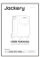

Manual de usuario

</li></ol>

* Nota

El cable de carga para automóvil no está incluido, pero está disponible para su compra por separado en nuestro sitio web. Para obtener asistencia, comunícate con el servicio al cliente de Jackery.

</figure>

## DESCRIPCIÓN GENERAL DEL PRODUCTO

### VISTA FRONTAL

<figure class="hb-reference-figure hb-base-art-live-copy" data-component-id="HB-SPECIAL-REFERENCE-FIGURE" data-reference-id="overview-front" data-source-fragment-sha256="89c3e347d5578905ab8ff4d9df1c752a46e42ac36f106b17d0ef93a8ba056570" data-web-base-art-ref="overview-front" data-web-presentation-mode="base-art-live-copy">

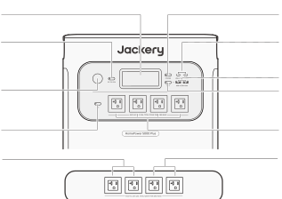<strong>LCD</strong><strong>Botón</strong> <strong>de</strong> <strong>encendido</strong> <strong>principal</strong><strong>Botón</strong> <strong>de</strong><strong>Salida</strong> <strong>USB-C</strong><strong>energía</strong> <strong>CC</strong>100W Máx<strong>Puerto</strong> <strong>para</strong><strong>Salida</strong> <strong>USB-A</strong><strong>encendedor</strong>18W Máx<strong>de</strong> <strong>cigarrillos</strong><strong>Botón</strong> <strong>de</strong>12V⎓10A<strong>encendido</strong> <strong>USB</strong><strong>Salida</strong> <strong>de</strong> <strong>CA</strong>(NEMA 5-20)1 salida de CA:120V, 20A, 2400W<strong>Botón</strong> <strong>de</strong>CA Salida total:<strong>energía</strong> <strong>CA</strong>Máximo 7200W, Pico de 14400W<strong>Salida</strong> <strong>total</strong><strong>Salida</strong> <strong>total</strong>120V, 30A, 3600W Máx.120V, 30A, 3600W Máx.Pico de 7200 WPico de 7200 W

</figure>

### VISTA LATERAL IZQUIERDA

<figure class="hb-reference-figure hb-base-art-live-copy" data-component-id="HB-SPECIAL-REFERENCE-FIGURE" data-reference-id="overview-left" data-source-fragment-sha256="562c5d922a5302d6e603fba3c83b357c6f2019133a311ce94277455eb5030efc" data-web-base-art-ref="overview-left" data-web-presentation-mode="base-art-live-copy">

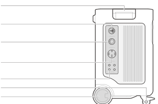<strong>Manija</strong><strong>Puerto</strong> <strong>de</strong> <strong>expansión</strong> <strong>de</strong> <strong>CA</strong>conectar al Smart Transfer SwitchEntrada: 240 V, 16,7 A Máx., 4000 WSalida: 240 V, 30 A, 7200 W<strong>Puerto</strong> <strong>de</strong> <strong>salida</strong> <strong>de</strong> <strong>CA</strong> <strong>NEMA</strong> <strong>L14-30R</strong>120V/240V, 30A, 7200W MaxAlimenta dispositivos de alta potencia y se conecta a una caja de entrada oa un interruptor de transferencia manual para suministro eléctrico en el hogar.<strong>Puerto</strong> <strong>de</strong> <strong>salida</strong> <strong>de</strong> <strong>CA</strong> <strong>NEMA</strong> <strong>14-50</strong>120V/240V, 30A, 7200W MaxAlimenta dispositivos de alta potencia y se conecta a una caja de entrada oa un interruptor de transferencia manual para suministro eléctrico en el hogar.<strong>Salida</strong> <strong>de</strong> <strong>CA</strong> <strong>Botón</strong> <strong>de</strong> <strong>reinicio</strong>Cuando el botón de reinicio salta, es necesario quitar lacarga y presionar el botón para reiniciar.<strong>Freno</strong> <strong>de</strong> <strong>ruedas</strong><strong>Ruedas</strong>

</figure>

### VISTA LATERAL DERECHA

<figure class="hb-reference-figure hb-base-art-live-copy" data-component-id="HB-SPECIAL-REFERENCE-FIGURE" data-reference-id="overview-right" data-source-fragment-sha256="ade91f9aa74dfd99d7aa09cba2f0a7d49ef8eef84c49d5e861e014f8d28d65ce" data-web-base-art-ref="overview-right" data-web-presentation-mode="base-art-live-copy">

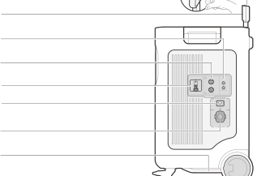<strong>Manija</strong> <strong>retráctil</strong>Pulse el botón de la manija retráctil y tire para extenderla<strong>Alimentación</strong> <strong>de</strong> <strong>baja</strong> <strong>tensión</strong> <strong>FV</strong> <strong>(8020)</strong>2 puertos DC 8mm: 16 V - 60 V⎓10,5 A máx., Doble hasta 21 A/1200 W máx.11V-16V (voltaje operativo)⎓8A máx., Doble hasta 8A máx.<strong>Alimentación</strong> <strong>de</strong> <strong>alta</strong> <strong>tensión</strong> <strong>FV</strong> <strong>(MC4)</strong>135V-450V⎓15A Max, 4000W Max<strong>Interruptor</strong> <strong>alta</strong> <strong>tensión</strong> <strong>FV</strong>Activa/desactiva el interruptor paraactivar/desactivar la carga solar alta tensión FV<strong>Alimentación</strong> <strong>de</strong> <strong>CA</strong>120V, 15A Max<strong>Puerto</strong> <strong>de</strong> <strong>expansión</strong> <strong>de</strong> <strong>CC</strong> <strong>Terminal</strong> <strong>A</strong>Conecte al paquete de batería<strong>Asa</strong> <strong>inferior</strong>

</figure>

## PANTALLA LCD

<figure class="hb-reference-figure hb-base-art-live-copy" data-component-id="HB-SPECIAL-REFERENCE-FIGURE" data-reference-id="lcd-map" data-source-fragment-sha256="0b53ab70e9b932a0f805f70e0723e3ddea254a435406b8f79754836e488857d9" data-web-base-art-ref="lcd-map" data-web-presentation-mode="base-art-live-copy">

2345671822239101112131415161718192021

</figure>

<figure aria-label="LCD indicators" class="hb-lcd-table-composition" data-component-id="HB-TABLE-LCD-ICON" tabindex="0"><table class="hb-lcd-icon-table"><colgroup><col class="hb-lcd-col-number"/><col class="hb-lcd-col-icon"/><col class="hb-lcd-col-name"/><col class="hb-lcd-col-description"/></colgroup><tbody><tr><td class="hb-lcd-number">1</td><td class="hb-lcd-icon"></td><td class="hb-lcd-name">Wi-Fi</td><td class="hb-lcd-description"><strong>Encendido</strong>: Wi-Fi conectado <strong>Parpadeando</strong>: Listo para conectarse a Wi-Fi <strong>Apagado</strong>: Wi-Fi desconectado</td></tr><tr><td class="hb-lcd-number">2</td><td class="hb-lcd-icon"></td><td class="hb-lcd-name">Bluetooth</td><td class="hb-lcd-description"><strong>Encendido</strong>: Bluetooth conectado <strong>Parpadeando</strong>: Listo para conectarse a Bluetooth <strong>Apagado</strong>: Bluetooth desconectado</td></tr><tr><td class="hb-lcd-number">3</td><td class="hb-lcd-icon"></td><td class="hb-lcd-name">Modo de carga silenciosa Se puede activar/desactivar desde la aplicación Jackery</td><td class="hb-lcd-description"><strong>Encendido</strong>: el ruido durante la carga se minimiza significativamente, mientras que la potencia de carga y la velocidad de carga se desacelera <strong>Apagado</strong>: modo de carga silenciosa <strong>desactivado</strong></td></tr><tr><td class="hb-lcd-number">4</td><td class="hb-lcd-icon"></td><td class="hb-lcd-name">Modo de ahorro de batería Se puede activar/desactivar desde la aplicación Jackery</td><td class="hb-lcd-description"><strong>Encendido</strong>: Ayuda a prolongar la vida útil de la batería al limitar su capacidad máxima utilizable. <strong>Apagado</strong>: modo de ahorro de batería <strong>desactivado</strong></td></tr><tr><td class="hb-lcd-number">5</td><td class="hb-lcd-icon"></td><td class="hb-lcd-name">Indicador de plan de carga/descarga Se puede configurar desde la app Jackery en el STS</td><td class="hb-lcd-description">Indica que el producto está operando bajo el Plan de Carga/Descarga del STS (Interruptor de Transferencia Inteligente) Esto solo ocurre cuando el producto esta conectado exitosamente al STS y el plan carga/descarga ha sido configurado desde la aplicación STS</td></tr><tr><td class="hb-lcd-number">6</td><td class="hb-lcd-icon"></td><td class="hb-lcd-name">SAI en línea Se puede configurar en la aplicación Jackery</td><td class="hb-lcd-description"><strong>Encendido</strong>: el producto está en modo UPS en línea (0 ms) <strong>Apagado</strong>: modo UPS de respaldo (predeterminado)</td></tr><tr><td class="hb-lcd-number">7</td><td class="hb-lcd-icon"></td><td class="hb-lcd-name">Indicador de alimentación de CA</td><td class="hb-lcd-description">La salida CA (onda sinusoidal pura) está activada.</td></tr><tr><td class="hb-lcd-number">8</td><td class="hb-lcd-icon"></td><td class="hb-lcd-name">Potencia de alimentación</td><td class="hb-lcd-description">Muestra la potencia de entrada en vatios.</td></tr><tr><td class="hb-lcd-number">9</td><td class="hb-lcd-icon"></td><td class="hb-lcd-name">Tiempo de carga restante</td><td class="hb-lcd-description">Muestra el tiempo restante de carga</td></tr><tr><td class="hb-lcd-number">10</td><td class="hb-lcd-icon"></td><td class="hb-lcd-name">Indicador de carga de red de CA</td><td class="hb-lcd-description">El producto se carga mediante la entrada de CA utilizando la energía de la red eléctrica.</td></tr><tr><td class="hb-lcd-number">11</td><td class="hb-lcd-icon"></td><td class="hb-lcd-name">Indicador de carga de coche</td><td class="hb-lcd-description">El producto se carga a través de la entrada de alta tensión FV (MC4) utilizando panel(es) solar(es)</td></tr><tr><td class="hb-lcd-number">12</td><td class="hb-lcd-icon"></td><td class="hb-lcd-name">Indicador de alimentación de alta tensión FV</td><td class="hb-lcd-description">El producto se carga a través de la entrada de alta tensión FV (MC4) utilizando panel(es) solar(es)</td></tr><tr><td class="hb-lcd-number">12</td><td class="hb-lcd-icon"></td><td class="hb-lcd-name">Indicador de alimentación de baja tensión FV Indicador de</td><td class="hb-lcd-description">El producto se carga a traves de la entrada Low-PV (8020) utilizando el panel(es) solar(es)</td></tr><tr><td class="hb-lcd-number">13</td><td class="hb-lcd-icon"></td><td class="hb-lcd-name">expansión de CA (Carregamento) Asegúrese de que el STS esté exitosamente conectado antes de continuar</td><td class="hb-lcd-description">El producto se está cargando mediante STS con energía de red</td></tr><tr><td class="hb-lcd-number">13</td><td class="hb-lcd-icon"></td><td class="hb-lcd-name">Indicador de expansión de CA (Descarregando) Asegúrese de que el STS esté exitosamente conectado antes de continuar</td><td class="hb-lcd-description">El producto está alimentando la carga de su hogar a traves del interruptor de transferencia inteligente el STS</td></tr><tr><td class="hb-lcd-number">14</td><td class="hb-lcd-icon"></td><td class="hb-lcd-name">Indicador del Smart Transfer Switch</td><td class="hb-lcd-description">El producto está conectado exitosamente al STS</td></tr><tr><td class="hb-lcd-number">15</td><td class="hb-lcd-icon"></td><td class="hb-lcd-name">Indicador de carga de batería</td><td class="hb-lcd-description">Cuando el producto se está cargando, el círculo naranja que rodea el porcentaje de la batería se encenderá en secuencia. Al cargar otros dispositivos, el círculo naranja permanecerá encendido.</td></tr><tr><td class="hb-lcd-number">16</td><td class="hb-lcd-icon"></td><td class="hb-lcd-name">Indicador de batería baja</td><td class="hb-lcd-description"><strong>Activado</strong> : El Nivel de batería esta por debajo del 20% <strong>Parpadeando</strong>: El Nivel de batería esta por debajo del 5% <strong>Desactivado</strong> : El productoestá cargando</td></tr><tr><td class="hb-lcd-number">17</td><td class="hb-lcd-icon"></td><td class="hb-lcd-name">Porcentaje de batería restante</td><td class="hb-lcd-description">Muestra el porcentaje restante de batería.</td></tr><tr><td class="hb-lcd-number">18</td><td class="hb-lcd-icon"></td><td class="hb-lcd-name">Indicador de paquete de baterías y número de baterías conectadas</td><td class="hb-lcd-description">Indica que el producto está conectado al número especificado de baterías adicionales 5000 Plus</td></tr><tr><td class="hb-lcd-number">19</td><td class="hb-lcd-icon"></td><td class="hb-lcd-name">Código de fallo</td><td class="hb-lcd-description">Se ha producido un error en el producto. Consulte la sección de solución de problemas para más detalles.</td></tr><tr><td class="hb-lcd-number">20</td><td class="hb-lcd-icon"></td><td class="hb-lcd-name">Indicador de alta temperatura</td><td class="hb-lcd-description">Se ha activado la protección por alta temperatura. El producto podría dejar de funcionar hasta que su temperatura regrese al rango normal de operación funcionamiento.</td></tr><tr><td class="hb-lcd-number">20</td><td class="hb-lcd-icon"></td><td class="hb-lcd-name">Indicador de baja temperatura</td><td class="hb-lcd-description">Se ha activado la protección por baja temperatura. El producto podría dejar de funcionar hasta que su temperatura regrese al rango normal de operación funcionamiento.</td></tr><tr><td class="hb-lcd-number">21</td><td class="hb-lcd-icon"></td><td class="hb-lcd-name">Modo de ahorro de energía</td><td class="hb-lcd-description">Para evitar el consumo innecesario de batería por olvidar apagar la salida encendida, el producto habilita el modo de ahorro de energía se activa por defecto. Si no hay dispositivos conectados o el consumo de energía del dispositivo conectado esta por debajo de un cierto limite (salida CA ≤ 25W; salida USB ≤ 2W; salida auto ≤ 2W), se apagará automáticamente todas las salidas después de 12 horas. <strong>Encendido</strong>/<strong>Apagado</strong>: Mantenga presionados los botones de encendido principal y de salida CA</td></tr><tr><td class="hb-lcd-number">22</td><td class="hb-lcd-icon"></td><td class="hb-lcd-name">Potencia de salida</td><td class="hb-lcd-description">Muestra la potencia de salida en vatios.</td></tr><tr><td class="hb-lcd-number">23</td><td class="hb-lcd-icon"></td><td class="hb-lcd-name">Tiempo de descarga restante</td><td class="hb-lcd-description">Muestra el tiempo restante de descarga</td></tr></tbody></table></figure>

## OPERACIONES

<table class="manual-callout-table manual-callout-table"><tbody><tr><td class="manual-callout-label">Nota</td><td class="manual-callout-body">
Cuando el modo de ahorro de energía está activado, si el botón de encendido de salida CC, CA o USB está encendido pero la estación de energía no está cargando ni descargando, se apagará automáticamente después de 12 horas.
</td></tr></tbody></table>

### ENCENDIDO/APAGADO

<figure class="hb-reference-figure hb-base-art-live-copy" data-component-id="HB-SPECIAL-REFERENCE-FIGURE" data-reference-id="power" data-source-fragment-sha256="a37d5c0e8fe3f610709d8e8b9f50538a55c33b91777257cdec973c04d04bc313" data-web-base-art-ref="power" data-web-presentation-mode="base-art-live-copy">

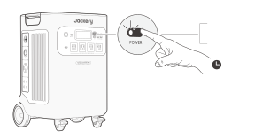<strong>encendido</strong>Presiona una vez<strong>apagado</strong>Mantén presionadodurante 3 segundos3s<strong>Tiempo</strong> <strong>de</strong> <strong>espera</strong> <strong>predeterminado:</strong> 2 horas · El producto se apagará automáticamente después de 2 horas de inactividad, sin carga ni descarga. · El tiempo de espera puede configurarse desde la app Jackery

</figure>

### ENCENDIDO/APAGADO DE SALIDA CA

<figure class="hb-reference-figure hb-base-art-live-copy" data-component-id="HB-SPECIAL-REFERENCE-FIGURE" data-reference-id="ac-output" data-source-fragment-sha256="aa03cd8135a73642c8088fae42b1832d798af894ece438743f645be7e469a459" data-web-base-art-ref="ac-output" data-web-presentation-mode="base-art-live-copy">

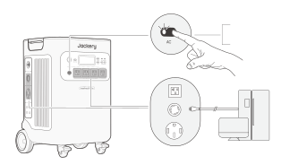<strong>Requisito</strong> <strong>previo</strong> <strong>:</strong> Asegúrate de que el botón de <strong>encendido</strong> principal esté activado.<strong>encendido</strong>Presiona una vez<strong>apagado</strong>Presiona una vez

</figure>

### ENCENDIDO/APAGADO DE SALIDA USB

<figure class="hb-reference-figure hb-base-art-live-copy" data-component-id="HB-SPECIAL-REFERENCE-FIGURE" data-reference-id="usb-output" data-source-fragment-sha256="1eececed726623a6ff5b136d74e690c62296a68cd047dc55cb85294ca33d5bd9" data-web-base-art-ref="usb-output" data-web-presentation-mode="base-art-live-copy">

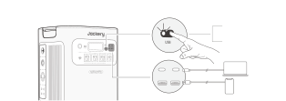<strong>Requisito</strong> <strong>previo</strong> <strong>:</strong> Asegúrate de que el botón de <strong>encendido</strong> principal esté activado.<strong>encendido</strong>Presiona una vez<strong>apagado</strong>Presiona una vez

</figure>

### ENCENDIDO/APAGADO DE SALIDA CC

<figure class="hb-reference-figure hb-base-art-live-copy" data-component-id="HB-SPECIAL-REFERENCE-FIGURE" data-reference-id="dc-output" data-source-fragment-sha256="5cb30b914d78d6fdc7bd7e240239c429498e12758cc4a5af32bccb9296e39fde" data-web-base-art-ref="dc-output" data-web-presentation-mode="base-art-live-copy">

<strong>Requisito</strong> <strong>previo</strong> <strong>:</strong> Asegúrate de que el botón de <strong>encendido</strong> principal esté activado.<strong>encendido</strong>Presiona una vez<strong>apagado</strong>Presiona una vez

</figure>

El producto puede cargar la batería de su automóvil utilizando el cable de carga de batería Nota para automóvil Jackery 12V, que se vende por separado y está disponible en nuestro sitio web.

<table class="manual-callout-table manual-callout-table"><tbody><tr><td class="manual-callout-label">Precaución</td><td class="manual-callout-body"><ul><li>El puerto del encendedor de cigarrillos solo es compatible con baterías de automóvil de 12 V y no es adecuado para sistemas de 24 V.</li><li>No arranque el automóvil mientras el producto está cargando la batería del automóvil a través del puerto de salida CC de 12 V (puerto del encendedor de cigarrillos), ya que esto podría dañar el producto.</li><li>Esta función está diseñada únicamente para uso de emergencia y no puede cargar una batería de automóvil descargada o dañada.</li></ul></td></tr></tbody></table>

### PANTALLA LCD

<figure class="hb-reference-figure" data-component-id="HB-SPECIAL-REFERENCE-FIGURE" data-reference-id="lcd-button" data-source-fragment-sha256="22165c38b79163050bee2321f09215d035560c75a005b9667f54c316d9fff84d">

</figure>

descarga)

después de 2 horas de inactividad.

automático

Presione el Botón de Encendido Principal o cuando el producto se está cargando.

Encender

Presione el Botón de Encendido Principal.

Pantalla LCD

Apagar

La pantalla LCD se apaga automáticamente y entra en modo de suspensión después de 2 minutos de inactividad.

Apagado automático

Haga doble clic en el Botón de Encendido Principal cuando la pantalla LCD esté encendida.

Modo de pantalla siempre encendida (en estado de carga o

Encender

Presione el Botón de Encendido Principal.

Apagar

El Modo de Pantalla Siempre Activa se apaga automáticamente

Apagado

### COMBINACIONES DE TECLAS

<figure aria-label="Botones / Operación / Función" class="hb-key-combination-composition" data-component-id="HB-TABLE-KEY-COMBINATIONS" tabindex="0"><table class="hb-key-combination-table"><colgroup><col class="hb-key-col-buttons"/><col class="hb-key-col-operation"/><col class="hb-key-col-function"/></colgroup><thead><tr><th class="hb-key-buttons" scope="col">Botones</th><th class="hb-key-operation" scope="col">Operación</th><th class="hb-key-function" scope="col">Función</th></tr></thead><tbody><tr><td class="hb-key-buttons">

Botón de encendido principal

Botón de encendido USB

</td><td class="hb-key-operation">3s
Mantenga presionados ambos durante 3 segundos
</td><td class="hb-key-function">Restablecer Wi-Fi y Bluetooth</td></tr><tr><td class="hb-key-buttons">

Botón de encendido principal

Botón de energía CA

</td><td class="hb-key-operation">3s
Mantenga presionados ambos durante 3 segundos
</td><td class="hb-key-function">Encender/apagar el modo de ahorro de energía</td></tr><tr><td class="hb-key-buttons">

Botón de encendido USB

Botón de energía CA

</td><td class="hb-key-operation">1s
Mantenga presionados ambos durante 1 segundos
</td><td class="hb-key-function">Encender/apagar Wi-Fi y Bluetooth</td></tr><tr><td class="hb-key-buttons">

Botón de energía CC

Botón de energía CA

</td><td class="hb-key-operation">3s
Mantenga presionados ambos durante 3 segundos
</td><td class="hb-key-function">Cambiar entre UPS en línea y UPS de respaldo</td></tr></tbody></table></figure>

## RESOLUCIÓN DE PROBLEMAS

<table class="manual-table native-troubleshooting"><thead><tr><th>Código de Error</th><th>Nombre</th><th>Descripción (solo para mantenimiento interno por fallas)</th></tr></thead><tbody><tr><td>F0</td><td>Error de comunicación de datos del BMS</td><td>Fallo de comunicación entre el BMS y la placa base</td></tr><tr><td>F1</td><td>Error de comunicación de datos del inversor</td><td>Fallo de comunicación entre el inversor y la placa base</td></tr><tr><td>F2</td><td>Error de comunicación de datos en entrada de CC</td><td>Fallo de comunicación entre el módulo de carga de CC y el BMS</td></tr><tr><td>F3</td><td>Falla del BMS o de la batería</td><td>Falla del BMS o de la batería</td></tr><tr><td>F4</td><td>Sobretensión de batería</td><td>Sobretensión de batería</td></tr><tr><td>F5</td><td>Subtensión de batería</td><td>Subtensión de batería</td></tr><tr><td>F6</td><td>Falla del inversor</td><td>Sobre-corriente / sobrecarga / cortocircuito en la salida de CA; Sobre-tensión / tensión de entrada de red / frecuencia demasiado alta o baja; Protección por sobretemperatura del inversor activada Fallo en la detección de aislamiento</td></tr><tr><td>F7</td><td>Falla de entrada de CC</td><td>Sobre-tensión en la entrada fotoeléctrica (PV); Protección contra sobre-temperatura del módulo de carga de CC activada; Protección contra sobre-corriente en la salida del módulo de carga de CC activada</td></tr><tr><td>F8</td><td>Sobre-corriente / cortocircuito durante la carga/descarga de batería</td><td>Protección contra sobre-corriente / cortocircuito del BMS activada</td></tr><tr><td>F9</td><td>Sobre-corriente / cortocircuito en salida de CC</td><td>Protección contra cortocircuito USB activada</td></tr><tr><td>FA</td><td>Error de comunicación de unidad en paralelo</td><td>Fallo en la comunicación entre dos unidades 5000 Plus causado por defecto en ambas unidades</td></tr><tr><td>FC</td><td>Error de comunicación del paquete de batería</td><td>Fallo en la comunicación de datos entre el 5000 Plus y el/los paquete(s) de batería</td></tr></tbody></table>

## FUENTE DE ALIMENTACIÓN ININTERRUMPIDA

Un UPS (Sistema de Alimentación Ininterrumpida) es un tipo de sistema de energía de respaldo que proporciona energía automática a una carga en caso de falla del suministro eléctrico principal. El HomePower 5000 Plus está equipado con dos modos UPS: Respaldo y En línea.

### UPS DE RESPALDO

La función UPS de respaldo está habilitada de manera predeterminada. En caso de una pérdida repentina de energía de la red, el HomePower 5000 Plus cambiará automáticamente a la energía almacenada en un plazo de 20 ms para mantener tus dispositivos en funcionamiento.

En modo UPS de respaldo, el pico de salida alcanza 1440W antes de un corte eléctrico Como la carga/descarga simultánea está habilitada en modo Bypass, la salida real es menor que la nominal, pero vuelve a la nominal durante cortes eléctricos.

<figure class="hb-reference-figure hb-base-art-live-copy" data-component-id="HB-SPECIAL-REFERENCE-FIGURE" data-reference-id="ups" data-source-fragment-sha256="1a696db8d386038b3968c8f8f395eb6dc8242c17dc70c00f0cd7486669ab87c0" data-web-base-art-ref="ups" data-web-presentation-mode="base-art-live-copy">

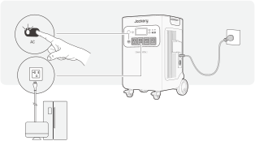Conecte el producto a una toma de corriente con el cable de carga de CA, luego presione el botón de salida CA y cargue sus electrodomésticos al mismo tiempo.

</figure>

### UPS EN LÍNEA

El modo UPS en línea, que permite conmutación de 0 ms, puede activarse de dos formas:

1. Habilite el UPS en línea desde la aplicación de Jackery. 2. Mantenga presionados los botones de encendido CC y CA en el HomePower 5000 Plus.

<table class="manual-callout-table manual-callout-table"><tbody><tr><td class="manual-callout-label">Nota</td><td class="manual-callout-body">
1. Las configuraciones del sistema volverán al modo UPS de respaldo cuando el producto este en modo en modo en línea y se reinicie. En el modo UPS de respaldo, la potencia de salida está limitada por la potencia de derivación , con una potencia de salida máxima de 1440W. 2. En modo UPS, las tomas de corriente s NEMA L14-30R y NEMA 14-50 proporcionan una salida de 120V cada una, cuando el producto está conectado a una toma de corriente con el cable de carga CA. 3. En el modo UPS en línea, se permite conmutación de 0 ms con salida máxima de 3600W.
</td></tr></tbody></table>

### (UPS)

## CONNECTIONS

### CONECTAR AL PAQUETE DE BATERÍAS

SE VENDE POR SEPARADO

Este producto admite hasta 5 paquetes de baterías para cubrir la necesidad de una gran capacidad de energía. Para más detalles sobre cómo usarlo, por favor consulte el manual de usuario del Jackery Battery Pack 5000 Plus.

<figure class="hb-reference-figure hb-base-art-live-copy" data-component-id="HB-SPECIAL-REFERENCE-FIGURE" data-reference-id="battery-packs" data-source-fragment-sha256="5ec3d04c7d2a1185a7e7788bb104aa093cc17cf2cb7ab256f6e19cb9aa317730" data-web-base-art-ref="battery-packs" data-web-presentation-mode="base-art-live-copy">

mínimo 1 pie (30 cm)mínimo 1 pie (30 cm)

</figure>

<table class="manual-callout-table manual-callout-table"><tbody><tr><td class="manual-callout-label">Precaución</td><td class="manual-callout-body">
1. Asegúrese de apagar todos los productos antes de conectar el HomePower 5000 Plus a los paquetes de batería del 5000 plus. 2. Asegúrese de que las rejillas de ventilación de entrada y salida de aire ambos lados esten libres de obstrucciones. Deje al menos 1 pie (30 cm) de espacio entre las rejillas de ventilación y cualquier objeto para permitir una circulación de aire adecuada y una disipación de calor efectiva.
</td></tr></tbody></table>

### CONECTAR A UN STS (SMART TRANSFER SWITCH)

SE VENDE POR SEPARADO

<figure class="hb-reference-figure hb-base-art-live-copy" data-component-id="HB-SPECIAL-REFERENCE-FIGURE" data-reference-id="sts-connect" data-source-fragment-sha256="f5bad27b5d15672d66b4c99036cb63c741e03df3916ad48fb3c1afc51e5aab60" data-web-base-art-ref="sts-connect" data-web-presentation-mode="base-art-live-copy">

Jackery HomePower 5000 Plus puede alimentar las cargas de su hogar a través del interruptor STS Para más información, consulte el manual del STS de Jackery.Cuando el modo UPS está activado, laestación de energía portátil permanece enfuncionamiento y consume energía de formacontinua. En caso de un corte de energía, elsistema cambiará a alimentación por bateríaen 20 milisegundos.Cuando el modo UPS está desactivado, elcambio a alimentación por batería se realizaen 5 segundos.

</figure>

## CARGANDO

Energía renovable primero: abogamos por utilizar primero energía renovable. Este producto admite dos modos de carga al mismo tiempo: carga solar y carga de pared de CA. Cuando la carga en la pared de CA y la carga solar están activadas al mismo tiempo, el producto dará prioridad a la carga solar y se utilizarán ambos métodos para cargar la batería a la máxima potencia permitida.

Cargue completamente el dispositivo antes de usarlo por primera vez.

<table class="manual-callout-table manual-callout-table"><tbody><tr><td class="manual-callout-label">Nota</td><td class="manual-callout-body">
1. La temperatura recomendada para cargar el producto es entre 0 °C y 45 °C (32 °F a 113 °F), y la temperatura de descarga es entre -15 °C y 45 °C (5 °F a 113 °F). Operar el producto fuera de este rango de temperatura puede restringir su capacidad de carga y descarga, o impedir que cargue o descargue. 2. La potencia de carga y la capacidad de la batería del producto pueden variar debido a fluctuaciones de temperatura. Cuando la temperatura ambiente esté entre -15 °C y -10 °C (5 °F a 14 °F), la potencia de salida máxima disminuye a 3600 W.
</td></tr></tbody></table>

### CARGA A TRAVÉS DE UNA TOMA DE CORRIENTE DE RED DE CA

<figure class="hb-reference-figure hb-base-art-live-copy" data-component-id="HB-SPECIAL-REFERENCE-FIGURE" data-reference-id="ac-charge" data-source-fragment-sha256="d05b746941566487dd968607ec043b6694b5de181a1761408022e9a7b05220b6" data-web-base-art-ref="ac-charge" data-web-presentation-mode="base-art-live-copy">

Conecte el cable de carga CA ala entrada del HomePower 5000Plus y una toma de corriente.

</figure>

### CARGA CON STS

<figure class="hb-reference-figure hb-base-art-live-copy" data-component-id="HB-SPECIAL-REFERENCE-FIGURE" data-reference-id="sts-charge" data-source-fragment-sha256="bda48e84c6b4d408708c7d7d38afb06be540fd038a972540e9417394f45ae47f" data-web-base-art-ref="sts-charge" data-web-presentation-mode="base-art-live-copy">

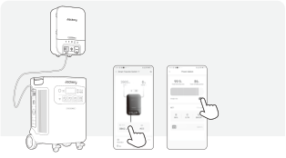Conecte su STS Jackery para habilitar la carga mediante el STS.*La configuración de reserva de respaldo funciona en todos losmodos del STS Por lo tanto, el Jackery HomePower 5000 Plusdejará de cargarse cuando supere el umbral de reserva Paracargarlo de inmediato, siga los pasos indicados.<strong>PASO</strong> <strong>1</strong><strong>PASO</strong> <strong>2</strong>HP5000Plus*App STS

</figure>

Cuando el puerto de expansión de CA está conectado al STS, la entrada CA no se utilizara para cargar. En ese caso, la estación de energía se puede cargar mediante los siguientes puertos: puerto de expansión de CA, alta tensión FV , baja tensión FV.

### Nota

### CARGA CON PANELES SOLARES

Cuando conecte paneles solares en serie, asegúrese de que la tensión máxima de salida de todos Precaución los paneles esté entre 16V-60V para el puerto de entrada de baja tensión FV y 135V-450V para el puerto de entrada de alta tensión FV.

Conecte al puerto de alimentación de baja tensión FV

Rango de voltaje entrada baja tensión FV: 16V a 60V

El Jackery HomePower 5000 Plus tiene dos puertos de entrada de baja tensión FV, cada uno admite la conexión directa de un panel solar de 500W o tres paneles solares de 200W. Si un puerto de alimentación de baja tensión FV necesita conectar dos o más paneles solares simultáneamente, consulte la siguiente figura para cargar a través del conector del panel solar (se vende por separado, no se incluye por defecto).

<figure class="hb-reference-figure hb-base-art-live-copy" data-component-id="HB-SPECIAL-REFERENCE-FIGURE" data-reference-id="low-pv-500" data-source-fragment-sha256="c15fbfa8cf0f1dde0f0d3dbc98396dec1fbf186981f8a665885d7e1ed2bef6ff" data-web-base-art-ref="low-pv-500" data-web-presentation-mode="base-art-live-copy">

DC8020SolarSaga 500 X × 2

</figure>

<figure class="hb-reference-figure hb-base-art-live-copy" data-component-id="HB-SPECIAL-REFERENCE-FIGURE" data-reference-id="low-pv-200" data-source-fragment-sha256="fad18b7b2c402a027b5a4d822a86fc0b91020111738fc1bb20149f6038143401" data-web-base-art-ref="low-pv-200" data-web-presentation-mode="base-art-live-copy">

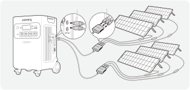DC8020DC8020SolarSaga 200 × 6

</figure>

<table class="manual-callout-table manual-callout-table"><tbody><tr><td class="manual-callout-label">Precaución</td><td class="manual-callout-body">
1. Asegúrese de que el voltaje de entrada para ambos puertos de entrada CC sea el mismo. De lo contrario, podría dañar el producto. Por ejemplo:
<ul><li>Se recomienda utilizar paneles solares Jackery del mismo modelo y la misma cantidad de paneles al conectar paneles solares a ambos puertos de entrada DC8020.</li><li>No cargue el producto utilizando simultáneamente un cargador de automóvil y un panel solar. Hacerlo podría quemar el fusible del automóvil o resultar en un fallo de carga. 2. Il est recommandé d’utiliser le panneau solaire Jackery pour charger l’HomePower 5000 Plus. Jackery décline toute responsabilité en cas de dommages causés par l’utilisation de panneaux solaires d’autres marques.</li></ul></td></tr></tbody></table>

Conecte al puerto de alimentación de alta tensión FV

Rango de voltaje entrada alta tensión FV: 135V a 450V

<table class="manual-callout-table manual-callout-table"><tbody><tr><td class="manual-callout-label">Precaución</td><td class="manual-callout-body">
1. Mantenha o interrutor de alta tensão desligado antes de ligar a entrada de alta tensão ou durante a manutenção. 2. Antes de utilizar los puertos de alimentación de alta tensión FV, asegúrese de que el interruptor FV esté encendido. 3. Asegúrese de que el interruptor de alto PV esté en la posición 'OFF ' o 'LOCK' antes de usar la llave MC4 provista para desmontar los conectores MC4.
</td></tr></tbody></table>

<figure class="hb-reference-figure hb-base-art-live-copy" data-component-id="HB-SPECIAL-REFERENCE-FIGURE" data-reference-id="high-pv" data-source-fragment-sha256="2ab1d3f89ed00eb0d614d7bd953d73b4b1f43be10ebea2a7f7c5a251262a29a5" data-web-base-art-ref="high-pv" data-web-presentation-mode="base-art-live-copy">

Desmonte los conectores MC4 conla llave MC4 proporcionada.

</figure>

<figure class="hb-reference-figure hb-base-art-live-copy" data-component-id="HB-SPECIAL-REFERENCE-FIGURE" data-reference-id="high-pv-lock" data-source-fragment-sha256="a5500df5cc3fd49349451dd2c42aa49e485547bdc73234698fe3e74da9fb04f3" data-web-base-art-ref="high-pv-lock" data-web-presentation-mode="base-art-live-copy">

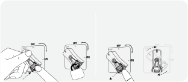<strong>Bloquear</strong><strong>Desbloquear</strong>Gire el interruptor de alto voltaje a la posiciónSuelte el mecanismo de bloqueo y el interruptor"LOCK" y presione el mecanismo de bloqueo.volverá a la posición "OFF".

</figure>

Alimentación de alta tensión FV + baja tensión FV

Rango de tensión de alimentación baja FV: 16V a 60V

Rango de tensión para alimentación de tensión FV alta: 135V a 450V

<figure class="hb-reference-figure" data-component-id="HB-SPECIAL-REFERENCE-FIGURE" data-reference-id="dual-pv" data-source-fragment-sha256="0c66ccafa23616c19ca1e92a43b633566946a182d8ab4130ddfc6de832746e75">

</figure>

### CARGA CON EL CARGADOR DE AUTO

Este producto se puede cargar un cargador de auto de 12 V. Asegúrate de que el cargador de auto y el encendedor de cigarrillos del auto tengan una buena conexión.

<figure class="hb-reference-figure hb-base-art-live-copy" data-component-id="HB-SPECIAL-REFERENCE-FIGURE" data-reference-id="car" data-source-fragment-sha256="e6e5cc29a303532bc16eff99d27facd2b12aecbfb281aa9b496a1781267c9cb1" data-web-base-art-ref="car" data-web-presentation-mode="base-art-live-copy">

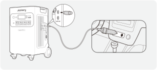vehículo*El cable de carga para automóvil se vende por separado.

</figure>

<table class="manual-callout-table manual-callout-table"><tbody><tr><td class="manual-callout-label">Precaución</td><td class="manual-callout-body">
1. Inicia el vehículo antes de cargar tu estación de energía. 2. Si el vehículo circula por carreteras llenas de altibajos, está prohibido utilizar el cargador del coche por si se quema debido a una mala conexión. La Compañía no será responsable de ninguna pérdida causada por un funcionamiento no estándar. 3. La carga de vehículos solo es aplicable en vehículos de 12 V, no en los de 24 V. Por favor, no cargue este producto con un vehículo de 24 V para evitar daños personales y pérdidas materiales.
</td></tr></tbody></table>

## ALMACENAMIENTO

Almacene el producto en un lugar seco y limpio con ventilación adecuada.Temperatura y humedad de

almacenamiento:

<ul><li>1 mes: -20 a 45 °C (0-60 % HR)</li></ul>

<ul><li>3 meses: 0 a 45 °C (0-60 % HR)</li></ul>

<ul><li>12 meses: 0 a 25 °C (0-60 % HR)</li></ul>

Si este producto se almacena durante un período prolongado (de 3 a 6 meses) con la batería descargada,

podría volverse imposible recargarlo.Para evitar esto y mantener la salud de la batería, se recomienda revisar y

recargar el producto cada tres meses, y realizar un ciclo completo de carga y descarga al menos una vez

cada 6 a 12 meses.

## CONFIGURACIÓN DE LA APLICACIÓN

### 1. Para descargar la aplicación e iniciar sesión

<figure aria-label="App download" class="hb-app-download-composition" data-component-id="HB-SPECIAL-APP">

Busca "Jackery" en Google Play o App Store para instalar la aplicación. Después, podrá registrarte e iniciar sesión.

Alternativamente, escanee el código QR a continuación para descargar e instalar la aplicación.

</figure>

### 2.Añadir un dispositivo

2.1 Haga clic en el botón Añadir dispositivo + ;

2.2 Mantenga pulsado el botón de "encendido" del dispositivo para encenderlo. Los iconos del wifi y del Bluetooth del dispositivo parpadearán para indicar que el dispositivo ha entrado en el modo de configuración de red. A continuación, pulse el botón "icono parpadeante" y permita que la aplicación se conecte a los dispositivos cercanos y abra los permisos de Bluetooth;

<figure class="hb-reference-figure hb-base-art-live-copy" data-component-id="HB-SPECIAL-REFERENCE-FIGURE" data-reference-id="app-add" data-source-fragment-sha256="708b58634468539a0aee8bf378096f323c4e49e1dbbae5f6333fba125a633831" data-web-base-art-ref="app-add" data-web-presentation-mode="base-art-live-copy">

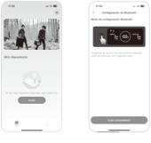2.12.2

</figure>

<figure class="hb-reference-figure hb-base-art-live-copy" data-component-id="HB-SPECIAL-REFERENCE-FIGURE" data-reference-id="app-control" data-source-fragment-sha256="8b3c480505a6a53ff6019eef2fdbd72ce3a3fb2e46fa788fba4f4056ae9b09bf" data-web-base-art-ref="app-control" data-web-presentation-mode="base-art-live-copy">

Bouton d’alimentationBotón de energía CCprincipaleBotón de <strong>encendido</strong> USBBotón de energía CA

</figure>

<table class="manual-callout-table manual-callout-table"><tbody><tr><td class="manual-callout-label">Observaciones</td><td class="manual-callout-body">
Después de encenderse, si la APP no se conecta en 2 horas, el dispositivo apagará automáticamente el Wi-Fi y el Bluetooth. A continuación, es necesario mantener pulsado el Botón USB y el Botón CA para volver a activar el Wi-Fi y Bluetooth.
</td></tr></tbody></table>

2.3 Tras hacer clic en el icono del dispositivo buscado, la aplicación conecta automáticamente el dispositivo a través de Bluetooth.

<table class="manual-callout-table manual-callout-table"><tbody><tr><td class="manual-callout-label">Observaciones</td><td class="manual-callout-body">
Si durante el proceso de vinculación se indica que "el dispositivo ha sido vinculado", se pueden utilizar las dos formas siguientes para la conexión:
<ul><li>El propietario del dispositivo lo compartirá con otros usuarios a través de la App.</li><li>Mantenga pulsados el Botón POWER y el Botón USB durante 3 segundos para reiniciar el dispositivo y, a continuación, vuelva a vincularlo.</li></ul></td></tr></tbody></table>

2.4 Una vez que el dispositivo se haya conectado correctamente, es necesario introducir el nombre y la contraseña de la red Wi-Fi a la que se conectará el dispositivo. Una vez introducidos, el dispositivo se conectará automáticamente a la red Wi-Fi;

<table class="manual-callout-table manual-callout-table"><tbody><tr><td class="manual-callout-label">Observaciones</td><td class="manual-callout-body">
Selecciona una red Wi-Fi en la banda de 2,4 GHz. El dispositivo no admite una red Wi-Fi en la banda de 5 GHz.
</td></tr></tbody></table>

2.5 Una vez que el dispositivo se haya añadido correctamente en la página de inicio del dispositivo, el icono Wi-Fi del dispositivo estará siempre encendido;

<figure class="hb-reference-figure hb-base-art-live-copy" data-component-id="HB-SPECIAL-REFERENCE-FIGURE" data-reference-id="app-results" data-source-fragment-sha256="4b0abcf4f3dc9d0e8711acc7e64e70273219606452cc604306b7ad716a8b8825" data-web-base-art-ref="app-results" data-web-presentation-mode="base-art-live-copy">

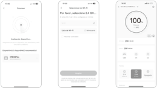2.32.42.5

</figure>

Las capturas de pantalla anteriores sirven solo de referencia.

### 3. Desvincular el dispositivo

Haga clic en el botón «Configuración» situado en la esquina superior derecha de la interfaz principal del dispositivo para entrar en la página de configuración. Después, haga clic en el botón «Desvincular» situado en la parte inferior de la página para desvincular el dispositivo.

### 4. Notas

4.1 Para activar Wi-Fi y Bluetooth:

<ul><li>El wifi y el Bluetooth se encienden automáticamente al encender el dispositivo y se iluminan los iconos de wifi y Bluetooth de la pantalla;</li><li>Pulse el botón de alimentación de salida USB y el botón de alimentación de salida CA al mismo tiempo hasta que se enciendan los iconos de wifi y Bluetooth en la pantalla;</li></ul>

4.2 Para desactivar Wi-Fi y Bluetooth:

<ul><li>Pulse el botón de alimentación de salida USB y el botón de alimentación de salida CA al mismo tiempo hasta que se apaguen los iconos de wifi y Bluetooth en la pantalla;</li></ul>

<ul><li>El Wi-Fi y el Bluetooth se apagarán automáticamente si se conecta ningún dispositivo en 2 horas;</li></ul>

4.3 Para restablecer Wi-Fi y Bluetooth：

<ul><li>Pulsa el botón POWER y el botón USB al mismo tiempo durante 3 segundos para restablecer los ajustes de fábrica de Wi-Fi y Bluetooth y reiniciar el sistema. Se desvinculará la cuenta de la</li></ul>

## GARANTÍA

<figure aria-label="GARANTÍA" class="hb-warranty-intro-composition" data-component-id="HB-WARRANTY-LEAD">
<strong>Solo ofrecemos nuestra garantía a los clientes que compren en el sitio web oficial de Jackery, plataformas de terceros con la marca Jackery o distribuidores autorizados locales.</strong>

* El período y los detalles de la garantía pueden variar según las leyes locales, regulaciones y distribuidores autorizados.
</figure>

### Garantía limitada

<figure aria-label="Garantía limitada" class="hb-warranty-card" data-component-id="HB-WARRANTY-SECTION" data-warranty-card-index="1">Jackery Inc. garantiza al consumidor original que el producto Jackery estará libre de defectos relativos al acabado y a los materiales en condiciones normales de uso por parte del consumidor durante el período de garantía aplicable identificado en la sección "Período de garantía" que figura a continuación, sujeto a las exclusiones que se establecen a continuación. Esta declaración de garantía establece la obligación de garantía total y exclusiva de Jackery. No asumiremos ni autorizaremos que ninguna persona asuma por nosotros ninguna otra responsabilidad en relación con la venta de nuestros productos.</figure>

### Período de garantía

<figure aria-label="Período de garantía" class="hb-warranty-period-card" data-component-id="HB-WARRANTY-YEARS">

5
<strong class="hb-warranty-years-unit">AÑOS</strong><strong class="hb-warranty-period-label">El periodo de garantía estándar de Jackery HomePower 5000 Garantía estándar</strong>

Plus es de 60 meses. En cada caso, el período de garantía se mide a partir de la fecha de compra por parte del comprador consumidor original. Para establecer la fecha de inicio del período de garantía, se necesita el recibo de venta de la primera compra del consumidor u otra prueba documental razonable.

2
<strong class="hb-warranty-years-unit">AÑOS</strong><strong class="hb-warranty-period-label">Se requiere una tarifa adicional para Garantía extendida</strong>

la garantía extendida. Para obtener detalles sobre la garantía extendida, visite el sitio web de Jackery o comuníquese con el servicio de atención al cliente de Jackery.

</figure>

### Reparación o reemplazo

<figure aria-label="Reparación o reemplazo" class="hb-warranty-card" data-component-id="HB-WARRANTY-SECTION" data-warranty-card-index="3">Jackery reparará o reemplazará (a cargo de Jackery) cualquier producto Jackery que no funcione durante el período de garantía aplicable debido a un defecto de mano de obra o material. El producto reparado/reemplazado asume la garantía restante de la fecha de compra original.</figure>

### Limitado al comprador consumidor original

<figure aria-label="Limitado al comprador consumidor original" class="hb-warranty-card" data-component-id="HB-WARRANTY-SECTION" data-warranty-card-index="4">La garantía del producto de Jackery se limita al consumidor original y no es transferible a ningún propietario posterior.</figure>

### Exclusions

<figure aria-label="Exclusions" class="hb-warranty-card" data-component-id="HB-WARRANTY-SECTION" data-warranty-card-index="5">La garantía de Jackery no se aplica a: Mal uso, abuso, modificación, daño por accidente, o uso para cualquier cosa que no sea el uso normal del consumidor según lo autorizado en los folletos actuales del producto de Jackery. Intento de reparación por cualquier persona que no sea un centro autorizado. Cualquier producto adquirido a través de una casa de subastas en línea. La garantía de Jackery no se aplica a la célula de la batería a menos que usted la cargue completamente en los siete días siguientes a la compra del producto y, a partir de entonces, al menos una vez cada 6 meses.</figure>

### Derechos de interpretación

<figure aria-label="Derechos de interpretación" class="hb-warranty-card" data-component-id="HB-WARRANTY-SECTION" data-warranty-card-index="6">Jackery Inc. se reserva el derecho a la interpretación final de la política posventa de los clientes anterior.</figure>

## ESPECIFICACIONES

<h2 class="hb-spec-group">INFORMACIÓN GENERAL</h2>

<figure aria-label="INFORMACIÓN GENERAL" class="hb-spec-table-composition"><table class="manual-table manual-spec-table hb-spec-table"><colgroup><col class="hb-spec-col-label"/><col class="hb-spec-col-value"/></colgroup><tbody><tr><th class="manual-spec-label hb-spec-label" scope="row">Nombre del producto</th><td class="manual-spec-value hb-spec-value">Jackery HomePower 5000 Plus</td></tr><tr><th class="manual-spec-label hb-spec-label" scope="row">N° de modelo</th><td class="manual-spec-value hb-spec-value">JHP-5000C</td></tr><tr><th class="manual-spec-label hb-spec-label" scope="row">Capacidad</th><td class="manual-spec-value hb-spec-value">45Ah/112Vdc (5040Wh)</td></tr><tr><th class="manual-spec-label hb-spec-label" scope="row">Química de celda</th><td class="manual-spec-value hb-spec-value">LiFePO4</td></tr><tr><th class="manual-spec-label hb-spec-label" scope="row">Peso</th><td class="manual-spec-value hb-spec-value">Alrededor de 134,5 lbs/61 kg</td></tr><tr><th class="manual-spec-label hb-spec-label" scope="row">Dimensiones</th><td class="manual-spec-value hb-spec-value">16,5×15,5×25 pulgadas / 41,8×39,5×63,5 cm</td></tr><tr><th class="manual-spec-label hb-spec-label" scope="row">Ciclo de vida</th><td class="manual-spec-value hb-spec-value">4000 ciclos al 70%+ capacidad</td></tr><tr><th class="manual-spec-label hb-spec-label" scope="row">SAI</th><td class="manual-spec-value hb-spec-value">SAI de respaldo: ＜20ms SAI en línea: 0ms</td></tr><tr><th class="manual-spec-label hb-spec-label" scope="row">Topología de inversor</th><td class="manual-spec-value hb-spec-value">No aislada</td></tr><tr><th class="manual-spec-label hb-spec-label" scope="row">Factor de potencia</th><td class="manual-spec-value hb-spec-value">≥0,98</td></tr><tr><th class="manual-spec-label hb-spec-label" scope="row">Unidad entera</th><td class="manual-spec-value hb-spec-value">Tipo 1</td></tr></tbody></table></figure>

<h2 class="hb-spec-group">PUERTOS DE ALIMENTACIÓN</h2>

<figure aria-label="PUERTOS DE ALIMENTACIÓN" class="hb-spec-table-composition"><table class="manual-table manual-spec-table hb-spec-table"><colgroup><col class="hb-spec-col-label"/><col class="hb-spec-col-value"/></colgroup><tbody><tr><th class="manual-spec-label hb-spec-label" scope="row">Entrada de CA en Modo de Carga</th><td class="manual-spec-value hb-spec-value">120V~60Hz, 15A Máx. (Tiempo de duración &lt; 3h cuando la corriente supera los 12A)</td></tr><tr><th class="manual-spec-label hb-spec-label" scope="row">Entrada de CA en Modo de Derivación</th><td class="manual-spec-value hb-spec-value">120V~60Hz, 12A Máx. (Tiempo de duración &lt; 3h cuando la corriente supera los 12A) 240V~60Hz, 16,7A Máx.</td></tr><tr><th class="manual-spec-label hb-spec-label" scope="row">1 × Puerto de Expansión de CA (Entrada)</th><td class="manual-spec-value hb-spec-value">240V~60Hz, 16,7A Máx.</td></tr><tr><th class="manual-spec-label hb-spec-label" scope="row">Entrada de CC</th><td class="manual-spec-value hb-spec-value"></td></tr><tr><th class="manual-spec-label hb-spec-label" scope="row">1 × Puerto de Expansión de CC (Entrada)</th><td class="manual-spec-value hb-spec-value">80,5V-126V⎓98A Máx.</td></tr><tr><th class="manual-spec-label hb-spec-label" scope="row">Alta tensión FV</th><td class="manual-spec-value hb-spec-value">135V-450V⎓15A Máx., 4000W Max</td></tr><tr><th class="manual-spec-label hb-spec-label" scope="row">Baja tensión FV</th><td class="manual-spec-value hb-spec-value">2 x Puertos CC 8mm; 16V-60V⎓10,5A Máx., Doble a 21A/1200W Máx. 11V-16V (Tensión de servicio)⎓8A Máx., Doble a 8A Máx</td></tr></tbody></table></figure>

<h2 class="hb-spec-group">PUERTOS DE SALIDA</h2>

<figure aria-label="PUERTOS DE SALIDA" class="hb-spec-table-composition"><table class="manual-table manual-spec-table hb-spec-table"><colgroup><col class="hb-spec-col-label"/><col class="hb-spec-col-value"/></colgroup><tbody><tr><th class="manual-spec-label hb-spec-label" scope="row">Salida de CA (NEMA L14-30R/14-50)</th><td class="manual-spec-value hb-spec-value">120V/240V~60Hz, 30A, 7200W Máx.</td></tr><tr><th class="manual-spec-label hb-spec-label" scope="row">Salida de CA del Modo de derivación</th><td class="manual-spec-value hb-spec-value">120V~60Hz, 12A Máx. 240V~60Hz, 16,7A Máx.</td></tr><tr><th class="manual-spec-label hb-spec-label" scope="row">4 × Salida de CA</th><td class="manual-spec-value hb-spec-value">120V~60Hz, 20A, 2400W</td></tr><tr><th class="manual-spec-label hb-spec-label" scope="row">Salida de CA Totall</th><td class="manual-spec-value hb-spec-value">7200W Máx., 14400W Transitoria</td></tr><tr><th class="manual-spec-label hb-spec-label" scope="row">2 × Salida USB-C</th><td class="manual-spec-value hb-spec-value">100W Máx., 5V⎓3A, 9V⎓3A, 12V⎓3A, 15V⎓3A, 20V⎓5A</td></tr><tr><th class="manual-spec-label hb-spec-label" scope="row">2 × Salida USB-A</th><td class="manual-spec-value hb-spec-value">18W Máx., 5-6V⎓3A, 6-9V⎓2A, 9-12V⎓1,5A</td></tr><tr><th class="manual-spec-label hb-spec-label" scope="row">Puerto para encendedor de cigarrillos</th><td class="manual-spec-value hb-spec-value">12V⎓10A</td></tr><tr><th class="manual-spec-label hb-spec-label" scope="row">1 × Puerto de Expansión de CA (Salida)</th><td class="manual-spec-value hb-spec-value">240V~60Hz, 30A, 7200W</td></tr><tr><th class="manual-spec-label hb-spec-label" scope="row">1 × Puerto de Expansión de CC (Salida)</th><td class="manual-spec-value hb-spec-value">80,5V-126V⎓41A Máx.</td></tr></tbody></table></figure>

<h2 class="hb-spec-group">TEMPERATURA AMBIENTAL DE FUNCIONAMIENTO</h2>

<figure aria-label="TEMPERATURA AMBIENTAL DE FUNCIONAMIENTO" class="hb-spec-table-composition"><table class="manual-table manual-spec-table hb-spec-table"><colgroup><col class="hb-spec-col-label"/><col class="hb-spec-col-value"/></colgroup><tbody><tr><th class="manual-spec-label hb-spec-label" scope="row">Temperatura de carga</th><td class="manual-spec-value hb-spec-value">0°C~45°C (32°F~113°F)</td></tr><tr><th class="manual-spec-label hb-spec-label" scope="row">RIESGO DE INGESTA: Este Temperatura de descarga</th><td class="manual-spec-value hb-spec-value">producto contiene una batería de botón o de moneda. -15°C~45°C (5°F~113°F) -15°C~-10°C (5°F~14°F) Potencia de salida: 3600 W</td></tr></tbody></table></figure>

® ® ※ USB Tipo-C y USB-C son marcas registradas del Foro de Implementadores USB.

## GUÍA DE INSTALACIÓN DEL SISTEMA DE RESPALDO INTELIGENTE PARA EL HOGAR (AC ESS)

Para conectar el Jackery HomePower 5000 Plus al Smart Transfer Switch (STS), use el cable de expansión para enlazar el puerto de expansión CA del Explorer 5000 Plus al puerto de entrada/salida CA del STS.

Para conectar el Jackery HomePower 5000 Plus al paquete de baterías, use el cable de expansión para conectar su puerto de expansión CC (A) al puerto de expansión CC (B) del paquete de baterías.

<figure class="hb-reference-figure hb-base-art-live-copy" data-component-id="HB-SPECIAL-REFERENCE-FIGURE" data-reference-id="ess" data-source-fragment-sha256="98100e4ba97163059965b98673a3e65557406b92e2fa569b1534f79ad0b0fb07" data-web-base-art-ref="ess" data-web-presentation-mode="base-art-live-copy">

Para obtener instrucciones detalladas sobre la instalación y conexión, consulte los manuales de usuariodel STS y del paquete de baterías.

</figure>

<table class="manual-callout-table manual-callout-table"><tbody><tr><td class="manual-callout-label">Precaución</td><td class="manual-callout-body">
Posición de instalación del sistema de respaldo inteligente para el hogar (AC ESS) Instalación en interiores. El área debe ser completamente impermeable. La pared debe ser plana y nivelada. Rango de temperatura ambiente: -15°C~45°C. La temperatura y la humedad deben mantenerse en un nivel constante. Instale en un lugar bien ventilado. No instale en un área accesible para niños o mascotas. El área de instalación debe evitar la luz solar directa. No debe haber materiales inflamables o explosivos cerca del inversor y la batería.
</td></tr></tbody></table>

Modelo del sistema

HB5000C-TS02A

## Jackery HomePower 5000 Plus

### ESPECIFICACIONES

<h2 class="hb-spec-group">INFORMACIÓN GENERAL</h2>

<figure aria-label="INFORMACIÓN GENERAL" class="hb-spec-table-composition"><table class="manual-table manual-spec-table hb-spec-table"><colgroup><col class="hb-spec-col-label"/><col class="hb-spec-col-value"/></colgroup><tbody><tr><th class="manual-spec-label hb-spec-label" scope="row">Nombre del producto</th><td class="manual-spec-value hb-spec-value">Jackery HomePower 5000 Plus</td></tr><tr><th class="manual-spec-label hb-spec-label" scope="row">N° de modelo</th><td class="manual-spec-value hb-spec-value">JHP-5000C</td></tr><tr><th class="manual-spec-label hb-spec-label" scope="row">Capacidad</th><td class="manual-spec-value hb-spec-value">45Ah/112Vdc (5040Wh)</td></tr><tr><th class="manual-spec-label hb-spec-label" scope="row">Química de celda</th><td class="manual-spec-value hb-spec-value">LiFePO4</td></tr><tr><th class="manual-spec-label hb-spec-label" scope="row">Peso</th><td class="manual-spec-value hb-spec-value">Alrededor de 134,5 lbs/61 kg</td></tr><tr><th class="manual-spec-label hb-spec-label" scope="row">Dimensiones</th><td class="manual-spec-value hb-spec-value">16,5×15,5×25 pulgadas / 41,8×39,5×63,5 cm</td></tr><tr><th class="manual-spec-label hb-spec-label" scope="row">Ciclo de vida</th><td class="manual-spec-value hb-spec-value">4000 ciclos al 70%+ capacidad</td></tr><tr><th class="manual-spec-label hb-spec-label" scope="row">SAI</th><td class="manual-spec-value hb-spec-value">SAI de respaldo: ＜20ms SAI en línea: 0ms</td></tr><tr><th class="manual-spec-label hb-spec-label" scope="row">Topología de inversor</th><td class="manual-spec-value hb-spec-value">No aislada</td></tr><tr><th class="manual-spec-label hb-spec-label" scope="row">Factor de potencia</th><td class="manual-spec-value hb-spec-value">≥0,98</td></tr><tr><th class="manual-spec-label hb-spec-label" scope="row">Unidad entera</th><td class="manual-spec-value hb-spec-value">Tipo 1</td></tr></tbody></table></figure>

<h2 class="hb-spec-group">PUERTOS DE ALIMENTACIÓN</h2>

<figure aria-label="PUERTOS DE ALIMENTACIÓN" class="hb-spec-table-composition"><table class="manual-table manual-spec-table hb-spec-table"><colgroup><col class="hb-spec-col-label"/><col class="hb-spec-col-value"/></colgroup><tbody><tr><th class="manual-spec-label hb-spec-label" scope="row">Entrada de CA en Modo de Carga</th><td class="manual-spec-value hb-spec-value">120V~60Hz, 15A Máx. (Tiempo de duración &lt; 3h cuando la corriente supera los 12A)</td></tr><tr><th class="manual-spec-label hb-spec-label" scope="row">Entrada de CA en Modo de Derivación</th><td class="manual-spec-value hb-spec-value">120V~60Hz, 12A Máx. (Tiempo de duración &lt; 3h cuando la corriente supera los 12A) 240V~60Hz, 16,7A Máx.</td></tr><tr><th class="manual-spec-label hb-spec-label" scope="row">1 × Puerto de Expansión de CA (Entrada)</th><td class="manual-spec-value hb-spec-value">240V~60Hz, 16,7A Máx.</td></tr><tr><th class="manual-spec-label hb-spec-label" scope="row">Entrada de CC</th><td class="manual-spec-value hb-spec-value"></td></tr><tr><th class="manual-spec-label hb-spec-label" scope="row">1 × Puerto de Expansión de CC (Entrada)</th><td class="manual-spec-value hb-spec-value">80,5V-126V⎓98A Máx.</td></tr><tr><th class="manual-spec-label hb-spec-label" scope="row">Alta tensión FV</th><td class="manual-spec-value hb-spec-value">135V-450V⎓15A Máx., 4000W Max</td></tr><tr><th class="manual-spec-label hb-spec-label" scope="row">Baja tensión FV</th><td class="manual-spec-value hb-spec-value">2 x Puertos CC 8mm; 16V-60V⎓10,5A Máx., Doble a 21A/1200W Máx. 11V-16V (Tensión de servicio)⎓8A Máx., Doble a 8A Máx</td></tr></tbody></table></figure>

<h2 class="hb-spec-group">PUERTOS DE SALIDA</h2>

<figure aria-label="PUERTOS DE SALIDA" class="hb-spec-table-composition"><table class="manual-table manual-spec-table hb-spec-table"><colgroup><col class="hb-spec-col-label"/><col class="hb-spec-col-value"/></colgroup><tbody><tr><th class="manual-spec-label hb-spec-label" scope="row">Salida de CA (NEMA L14-30R/14-50)</th><td class="manual-spec-value hb-spec-value">120V/240V~60Hz, 30A, 7200W Máx.</td></tr><tr><th class="manual-spec-label hb-spec-label" scope="row">Salida de CA del Modo de derivación</th><td class="manual-spec-value hb-spec-value">120V~60Hz, 12A Máx. 240V~60Hz, 16,7A Máx.</td></tr><tr><th class="manual-spec-label hb-spec-label" scope="row">4 × Salida de CA</th><td class="manual-spec-value hb-spec-value">120V~60Hz, 20A, 2400W</td></tr><tr><th class="manual-spec-label hb-spec-label" scope="row">Salida de CA Totall</th><td class="manual-spec-value hb-spec-value">7200W Máx., 14400W Transitoria</td></tr><tr><th class="manual-spec-label hb-spec-label" scope="row">2 × Salida USB-C</th><td class="manual-spec-value hb-spec-value">100W Máx., 5V⎓3A, 9V⎓3A, 12V⎓3A, 15V⎓3A, 20V⎓5A</td></tr><tr><th class="manual-spec-label hb-spec-label" scope="row">2 × Salida USB-A</th><td class="manual-spec-value hb-spec-value">18W Máx., 5-6V⎓3A, 6-9V⎓2A, 9-12V⎓1,5A</td></tr><tr><th class="manual-spec-label hb-spec-label" scope="row">Puerto para encendedor de cigarrillos</th><td class="manual-spec-value hb-spec-value">12V⎓10A</td></tr><tr><th class="manual-spec-label hb-spec-label" scope="row">1 × Puerto de Expansión de CA (Salida)</th><td class="manual-spec-value hb-spec-value">240V~60Hz, 30A, 7200W</td></tr><tr><th class="manual-spec-label hb-spec-label" scope="row">1 × Puerto de Expansión de CC (Salida)</th><td class="manual-spec-value hb-spec-value">80,5V-126V⎓41A Máx.</td></tr></tbody></table></figure>

<h2 class="hb-spec-group">TEMPERATURA AMBIENTAL DE FUNCIONAMIENTO</h2>

<figure aria-label="TEMPERATURA AMBIENTAL DE FUNCIONAMIENTO" class="hb-spec-table-composition"><table class="manual-table manual-spec-table hb-spec-table"><colgroup><col class="hb-spec-col-label"/><col class="hb-spec-col-value"/></colgroup><tbody><tr><th class="manual-spec-label hb-spec-label" scope="row">Temperatura de carga</th><td class="manual-spec-value hb-spec-value">0°C~45°C (32°F~113°F)</td></tr><tr><th class="manual-spec-label hb-spec-label" scope="row">Temperatura de descarga</th><td class="manual-spec-value hb-spec-value">-15°C~45°C (5°F~113°F) -15°C~-10°C (5°F~14°F) Potencia de salida: 3600 W</td></tr></tbody></table></figure>

RIESGO DE INGESTA: Este producto contiene una batería de botón o de moneda. ® ® ※ USB Tipo-C y USB-C son marcas registradas del Foro de Implementadores USB.

### Modelo: JHP-5000C

## Jackery Battery Pack 5000 Plus

<h3 class="hb-heading-label-pair">ESPECIFICACIONES VENDU SÉPARÉMENT</h3>

<h2 class="hb-spec-group">INFORMACIÓN GENERAL</h2>

<figure aria-label="INFORMACIÓN GENERAL" class="hb-spec-table-composition"><table class="manual-table manual-spec-table hb-spec-table"><colgroup><col class="hb-spec-col-label"/><col class="hb-spec-col-value"/></colgroup><tbody><tr><th class="manual-spec-label hb-spec-label" scope="row">Nombre de producto</th><td class="manual-spec-value hb-spec-value">Jackery Battery Pack 5000 Plus</td></tr><tr><th class="manual-spec-label hb-spec-label" scope="row">N° de modelo</th><td class="manual-spec-value hb-spec-value">JBP-5000A</td></tr><tr><th class="manual-spec-label hb-spec-label" scope="row">Capacidad</th><td class="manual-spec-value hb-spec-value">45Ah/112Vdc (5040Wh)</td></tr><tr><th class="manual-spec-label hb-spec-label" scope="row">Química de celda</th><td class="manual-spec-value hb-spec-value">LiFePO4</td></tr><tr><th class="manual-spec-label hb-spec-label" scope="row">Peso</th><td class="manual-spec-value hb-spec-value">Alrededor de 81,57 libras/37 kg</td></tr><tr><th class="manual-spec-label hb-spec-label" scope="row">Dimensiones</th><td class="manual-spec-value hb-spec-value">16,5 x 13,5 x 13,2 pulgadas/41.8 x 34.4 x 33.6 cm</td></tr><tr><th class="manual-spec-label hb-spec-label" scope="row">Ciclo de vida</th><td class="manual-spec-value hb-spec-value">4000 ciclos al 70%+ capacidad</td></tr><tr><th class="manual-spec-label hb-spec-label" scope="row">Corriente máxima de cortocircuito y duración</th><td class="manual-spec-value hb-spec-value">2600A/5ms</td></tr><tr><th class="manual-spec-label hb-spec-label" scope="row">Protección contra la entrada de agua</th><td class="manual-spec-value hb-spec-value">IP20</td></tr></tbody></table></figure>

Utilizar únicamente junto con Jackery Explorer 5000 Plus y Jackery HomePower 5000 Plus.

<h2 class="hb-spec-group">PUERTOS DE ALIMENTACIÓN/SALIDA</h2>

<figure aria-label="PUERTOS DE ALIMENTACIÓN/SALIDA" class="hb-spec-table-composition"><table class="manual-table manual-spec-table hb-spec-table"><colgroup><col class="hb-spec-col-label"/><col class="hb-spec-col-value"/></colgroup><tbody><tr><th class="manual-spec-label hb-spec-label" scope="row">Puerto de Expansión de CC (Entrada)</th><td class="manual-spec-value hb-spec-value">80,5V-126V⎓41A Máx.</td></tr><tr><th class="manual-spec-label hb-spec-label" scope="row">Puerto de Expansión de CC (Salida)</th><td class="manual-spec-value hb-spec-value">80,5V-126V⎓98A Máx.</td></tr></tbody></table></figure>

<h2 class="hb-spec-group">TEMPERATURA AMBIENTAL DE FUNCIONAMIENTO</h2>

<figure aria-label="TEMPERATURA AMBIENTAL DE FUNCIONAMIENTO" class="hb-spec-table-composition"><table class="manual-table manual-spec-table hb-spec-table"><colgroup><col class="hb-spec-col-label"/><col class="hb-spec-col-value"/></colgroup><tbody><tr><th class="manual-spec-label hb-spec-label" scope="row">Temperatura de carga</th><td class="manual-spec-value hb-spec-value">0°C~45°C (32°F~113°F)</td></tr><tr><th class="manual-spec-label hb-spec-label" scope="row">Temperatura de descarga</th><td class="manual-spec-value hb-spec-value">-15°C~45°C (5°F~113°F)</td></tr></tbody></table></figure>

RIESGO DE INGESTA: Este producto contiene una batería de botón o de moneda.

## Jackery Smart Transfer Switch

<h3 class="hb-heading-label-pair">ESPECIFICACIONES VENDU SÉPARÉMENT</h3>

<h2 class="hb-spec-group">INFORMACIÓN GENERAL</h2>

<figure aria-label="INFORMACIÓN GENERAL" class="hb-spec-table-composition"><table class="manual-table manual-spec-table hb-spec-table"><colgroup><col class="hb-spec-col-label"/><col class="hb-spec-col-value"/></colgroup><tbody><tr><th class="manual-spec-label hb-spec-label" scope="row">Nombre de producto</th><td class="manual-spec-value hb-spec-value">Jackery Smart Transfer Switch</td></tr><tr><th class="manual-spec-label hb-spec-label" scope="row">N° de modelo</th><td class="manual-spec-value hb-spec-value">JA-TS02A</td></tr><tr><th class="manual-spec-label hb-spec-label" scope="row">Voltaje CA (Nominal)</th><td class="manual-spec-value hb-spec-value">120V/240V~ 60Hz</td></tr><tr><th class="manual-spec-label hb-spec-label" scope="row">Tipo de Alimentación</th><td class="manual-spec-value hb-spec-value">Fase Dividida</td></tr><tr><th class="manual-spec-label hb-spec-label" scope="row">Corriente de Entrada Máxima</th><td class="manual-spec-value hb-spec-value">Red de 100A / Estación de Energía de 60A</td></tr><tr><th class="manual-spec-label hb-spec-label" scope="row">Corriente de Salida Máxima</th><td class="manual-spec-value hb-spec-value">Carga Doméstica de 60A / Estación de Energía de 33,4A</td></tr><tr><th class="manual-spec-label hb-spec-label" scope="row">Corriente Máxima de Cortocircuito de Entrada</th><td class="manual-spec-value hb-spec-value">10KA</td></tr><tr><th class="manual-spec-label hb-spec-label" scope="row">Categoría de Sobretensión</th><td class="manual-spec-value hb-spec-value">IV</td></tr><tr><th class="manual-spec-label hb-spec-label" scope="row">UPS</th><td class="manual-spec-value hb-spec-value">≤20ms</td></tr><tr><th class="manual-spec-label hb-spec-label" scope="row">Tipo de Caja (Panel de Distribución)</th><td class="manual-spec-value hb-spec-value">NEMA Tipo 1</td></tr><tr><th class="manual-spec-label hb-spec-label" scope="row">Número de Ramas de Carga</th><td class="manual-spec-value hb-spec-value">12</td></tr><tr><th class="manual-spec-label hb-spec-label" scope="row">Circuito Principal</th><td class="manual-spec-value hb-spec-value">2 AWG</td></tr><tr><th class="manual-spec-label hb-spec-label" scope="row">Circuito Derivado</th><td class="manual-spec-value hb-spec-value">14 AWG 12 AWG 10 AWG</td></tr><tr><th class="manual-spec-label hb-spec-label" scope="row">Comunicación</th><td class="manual-spec-value hb-spec-value">Wi-Fi y Bluetooth</td></tr><tr><th class="manual-spec-label hb-spec-label" scope="row">Temperatura de Funcionamiento</th><td class="manual-spec-value hb-spec-value">-20°C~40°C (-4°F~104°F)</td></tr><tr><th class="manual-spec-label hb-spec-label" scope="row">Dimensiones</th><td class="manual-spec-value hb-spec-value">22 x 14,7 x 7,87 pulgadas/ 56 x 37,4 x 20 cm</td></tr><tr><th class="manual-spec-label hb-spec-label" scope="row">Peso</th><td class="manual-spec-value hb-spec-value">Aproximadamente 25,57 libras/11,6 kg</td></tr></tbody></table></figure>

### Modelo: JBP-5000A

### Modelo: JA-TS02A

Cuando utilice el producto, asegúrese de que esté conectado a una tensión de red de fase partida de 240 V.

<table class="manual-callout-table manual-callout-table"><tbody><tr><td class="manual-callout-label">Nota</td><td class="manual-callout-body">
SISTEMA DE RESPALDO INTELIGENTE PARA EL HOGAR (AC ESS) Aproximadamente 575.16 lbs/260.89 kg
</td></tr></tbody></table>

## LISTA DE PAQUETES

<figure class="hb-reference-figure hb-base-art-live-copy" data-component-id="HB-SPECIAL-REFERENCE-FIGURE" data-reference-id="package-host" data-source-fragment-sha256="5a8c8f5e01e31c3c9975acffa4a5cf533499295614f192db8c439d1a0023f21d" data-web-base-art-ref="package-host" data-web-presentation-mode="base-art-live-copy">

Model :JHP-5000C<strong>USER</strong> <strong>MANUAL</strong>Jackery HomePower 5000 Plus<strong>CONTACT</strong> <strong>US</strong> <strong>:</strong><strong>1-888-502-2236</strong> (US)hello@jackery.comwww.jackery.comJackery HomePower 5000 PlusCable de carga de CALlave MC4Manual de usuario

</figure>

<figure class="hb-reference-figure hb-base-art-live-copy" data-component-id="HB-SPECIAL-REFERENCE-FIGURE" data-reference-id="package-battery" data-source-fragment-sha256="42fe8039f40e6dd29aefa0d03c57631ef2adde2528e6a01b7d3017895b26c5e6" data-web-base-art-ref="package-battery" data-web-presentation-mode="base-art-live-copy">

Model: JBP-5000A<strong>Vendu</strong> <strong>séparément</strong><strong>USER</strong> <strong>MANUAL</strong>Jackery Battery Pack 5000 Plus<strong>CONTACT</strong> <strong>US:</strong><strong>1-888-502-2236</strong> (US)hello@jackery.comwww.jackery.comJackery Battery Pack 5000 PlusCable de expansiónManual de usuario

</figure>

<figure class="hb-reference-figure hb-base-art-live-copy" data-component-id="HB-SPECIAL-REFERENCE-FIGURE" data-reference-id="package-sts" data-source-fragment-sha256="716a3f35f5cadc41f1867c1a8bb0de6447db67464f46dd4938be26eb52a578ee" data-web-base-art-ref="package-sts" data-web-presentation-mode="base-art-live-copy">

M6 tapped holeM6 tapped holeMarking holeMarking holeUpwardA scale of 1:1Unit: mmModel: JA-TS02AQuick GuideHomePower Energy SystemSmart Transfer SwitchAC1GRIDIOTERRORAC2Smart Transfer SwitchPOWERPAUSE/RESUMEUSER MANUALAC1GRIDIOTERRORAC2Jackery Smart Transfer Switch<strong>Contact</strong> <strong>us:</strong>hello@jackery.comVersion: JAK-UM-V1.01-888-502-2236(US)POWERMarking holeMarking holePAUSE/RESUMEM6 tapped holeM6 tapped holeManual de usuarioGuía rápidaJackery Smart Transfer SwitchPlantilla de MarcadoEntrada/Salida deEnergía Cable<strong>Vendu</strong> <strong>séparément</strong>4 Tornillos de Cabeza Plana Phillips2 Soporte de Paredetiqueta de circuitoM4 (fije los soportes de pared alSmart Transfer Switch)

</figure>

## CONTÁCTENOS

### JACKERY INC.

5310 Bunche Dr., Fremont, CA 94538-8301

hello@jackery.com 1-888-502-2236 (US) www.jackery.com

