<style>
/* Native figure geometry only. Shared Web theme owns headings/tables/callouts. */
.native-figure { max-width:760px; margin:1rem auto; min-width:0; }
.native-figure .hb-reference-figure { margin:0; max-width:none; }
#furo-main-content .native-figure img { width:100% !important; height:auto !important; max-height:none; }

.native-dense {max-width:780px;}
.native-lcd-map {max-width:680px;}
#furo-main-content .native-figure .hb-reference-live-label {font-size:1.75cqw;line-height:1;align-items:flex-start;justify-content:flex-start;text-align:left;padding:.1cqw;}
.native-figure .hb-reference-live-label > span {width:100%;}
.native-overview-front .hb-reference-live-label,.native-overview-left .hb-reference-live-label,.native-overview-right .hb-reference-live-label {font-size:1.55cqw!important;}
.native-figure .hb-reference-live-label strong {font-weight:700;}
.native-operation {border:1px solid var(--hb-line-soft);border-radius:var(--hb-panel-radius);}
.native-inbox-main {max-width:180px;}
.native-app-add {max-width:480px;}
.native-app-results {max-width:700px;}
.native-lcd-side {display:grid;grid-template-columns:1fr 1.45fr;gap:1rem;align-items:stretch;}
.native-lcd-side .native-figure {margin:0;}
.native-lcd-side > .native-figure img {height:100%!important;object-fit:contain;}
.native-figure .hb-reference-live-pill {border-radius:.8cqw;}
@media(max-width:760px){
 .native-dense{overflow-x:auto;padding-bottom:.4rem;}
 .native-dense > .hb-reference-figure{min-width:680px;}
 .native-lcd-side{display:block;}
 .native-lcd-side > .native-figure{max-width:330px;margin:0 auto 1rem;}
}

.native-figure .hb-reference-live-label {white-space:nowrap;}

.native-inline-plus{display:inline-grid;place-items:center;width:1.1em;height:1.1em;border-radius:50%;background:#444;color:#fff;line-height:1;font-weight:700;vertical-align:baseline;}
.native-lcd-note{font-weight:400;font-size:.92em;}

/* Source speech tails are CSS shapes, never leftover blank artwork. */
.native-power .hb-reference-art-panel::after,.native-ups .hb-reference-art-panel::after,.native-sts-connect .hb-reference-art-panel::after {content:"";position:absolute;z-index:1;pointer-events:none;width:5.9%;height:5.5%;background:#f2f2f3;clip-path:polygon(50% 0,100% 100%,0 100%);}
.native-power .hb-reference-art-panel::after{left:45.36%;top:53.65%;width:4.61%;height:4.87%;clip-path:polygon(47.13% 0,100% 100%,0 100%);}
.native-ups .hb-reference-art-panel::after{left:40.60%;top:65.72%;width:5.82%;height:4.95%;clip-path:polygon(47.13% 0,100% 100%,0 100%);}
.native-sts-connect .hb-reference-art-panel::after{left:40.64%;top:33.16%;width:5.82%;height:5.77%;background:#fff;clip-path:polygon(0 0,100% 0,47.13% 100%);}
.native-package-battery,.native-package-sts{border-style:dashed;border-radius:0;}
/* Source-derived label geometry */
html[lang="fr"] .native-overview-front [data-source-line="0"] {font-size:2.2082cqw!important;}
html[lang="fr"] .native-overview-front [data-source-line="1"] {font-size:2.2082cqw!important;}
html[lang="fr"] .native-overview-front [data-source-line="2"] {font-size:2.2082cqw!important;}
html[lang="fr"] .native-overview-front [data-source-line="3"] {font-size:2.2082cqw!important;}
html[lang="fr"] .native-overview-front [data-source-line="4"] {font-size:2.2082cqw!important;}
html[lang="fr"] .native-overview-front [data-source-line="5"] {font-size:1.5773cqw!important;}
html[lang="fr"] .native-overview-front [data-source-line="6"] {font-size:2.2082cqw!important;}
html[lang="fr"] .native-overview-front [data-source-line="7"] {font-size:1.5773cqw!important;}
html[lang="fr"] .native-overview-front [data-source-line="8"] {font-size:2.2082cqw!important;}
html[lang="fr"] .native-overview-front [data-source-line="9"] {font-size:2.2082cqw!important;}
html[lang="fr"] .native-overview-front [data-source-line="10"] {font-size:1.5773cqw!important;}
html[lang="fr"] .native-overview-front [data-source-line="11"] {font-size:2.2082cqw!important;}
html[lang="fr"] .native-overview-front [data-source-line="12"] {font-size:2.2082cqw!important;}
html[lang="fr"] .native-overview-front [data-source-line="13"] {font-size:1.8927cqw!important;}
html[lang="fr"] .native-overview-front [data-source-line="14"] {font-size:1.4365cqw!important;}
html[lang="fr"] .native-overview-front [data-source-line="15"] {font-size:2.2082cqw!important;}
html[lang="fr"] .native-overview-front [data-source-line="16"] {font-size:1.4365cqw!important;}
html[lang="fr"] .native-overview-front [data-source-line="17"] {font-size:1.4365cqw!important;}
html[lang="fr"] .native-overview-front [data-source-line="18"] {font-size:2.2082cqw!important;}
html[lang="fr"] .native-overview-front [data-source-line="19"] {font-size:1.4365cqw!important;}
html[lang="fr"] .native-overview-front [data-source-line="20"] {font-size:1.8927cqw!important;}
html[lang="fr"] .native-overview-front [data-source-line="21"] {font-size:1.8927cqw!important;}
html[lang="fr"] .native-overview-front [data-source-line="22"] {font-size:1.5773cqw!important;}
html[lang="fr"] .native-overview-front [data-source-line="23"] {font-size:1.5773cqw!important;}
html[lang="fr"] .native-overview-front [data-source-line="24"] {font-size:1.5773cqw!important;}
html[lang="fr"] .native-overview-front [data-source-line="25"] {font-size:1.5773cqw!important;}
html[lang="fr"] .native-overview-front [data-source-line="26"] {font-size:1.5773cqw!important;}
html[lang="fr"] .native-overview-front [data-source-line="27"] {font-size:1.5773cqw!important;}
html[lang="fr"] .native-overview-left [data-source-line="0"] {font-size:2.2082cqw!important;}
html[lang="fr"] .native-overview-left [data-source-line="1"] {font-size:2.2082cqw!important;}
html[lang="fr"] .native-overview-left [data-source-line="2"] {font-size:1.8927cqw!important;}
html[lang="fr"] .native-overview-left [data-source-line="3"] {font-size:1.6719cqw!important;}
html[lang="fr"] .native-overview-left [data-source-line="4"] {font-size:1.6719cqw!important;}
html[lang="fr"] .native-overview-left [data-source-line="5"] {font-size:2.2082cqw!important;}
html[lang="fr"] .native-overview-left [data-source-line="6"] {font-size:1.8927cqw!important;}
html[lang="fr"] .native-overview-left [data-source-line="7"] {font-size:1.6719cqw!important;}
html[lang="fr"] .native-overview-left [data-source-line="8"] {font-size:1.6719cqw!important;}
html[lang="fr"] .native-overview-left [data-source-line="9"] {font-size:2.2082cqw!important;}
html[lang="fr"] .native-overview-left [data-source-line="10"] {font-size:1.8927cqw!important;}
html[lang="fr"] .native-overview-left [data-source-line="11"] {font-size:1.6719cqw!important;}
html[lang="fr"] .native-overview-left [data-source-line="12"] {font-size:1.6719cqw!important;}
html[lang="fr"] .native-overview-left [data-source-line="13"] {font-size:2.2082cqw!important;}
html[lang="fr"] .native-overview-left [data-source-line="14"] {font-size:1.6719cqw!important;}
html[lang="fr"] .native-overview-left [data-source-line="15"] {font-size:1.6719cqw!important;}
html[lang="fr"] .native-overview-left [data-source-line="16"] {font-size:2.2082cqw!important;}
html[lang="fr"] .native-overview-left [data-source-line="17"] {font-size:2.2082cqw!important;}
html[lang="fr"] .native-overview-right [data-source-line="0"] {font-size:2.2082cqw!important;}
html[lang="fr"] .native-overview-right [data-source-line="1"] {font-size:1.5773cqw!important;}
html[lang="fr"] .native-overview-right [data-source-line="2"] {font-size:2.2082cqw!important;}
html[lang="fr"] .native-overview-right [data-source-line="3"] {font-size:1.5773cqw!important;}
html[lang="fr"] .native-overview-right [data-source-line="4"] {font-size:1.5773cqw!important;}
html[lang="fr"] .native-overview-right [data-source-line="5"] {font-size:2.2082cqw!important;}
html[lang="fr"] .native-overview-right [data-source-line="6"] {font-size:1.5773cqw!important;}
html[lang="fr"] .native-overview-right [data-source-line="7"] {font-size:2.2082cqw!important;}
html[lang="fr"] .native-overview-right [data-source-line="8"] {font-size:1.5773cqw!important;}
html[lang="fr"] .native-overview-right [data-source-line="9"] {font-size:1.5773cqw!important;}
html[lang="fr"] .native-overview-right [data-source-line="10"] {font-size:2.2082cqw!important;}
html[lang="fr"] .native-overview-right [data-source-line="11"] {font-size:1.5773cqw!important;}
html[lang="fr"] .native-overview-right [data-source-line="12"] {font-size:2.2082cqw!important;}
html[lang="fr"] .native-overview-right [data-source-line="13"] {font-size:1.5773cqw!important;}
html[lang="fr"] .native-overview-right [data-source-line="14"] {font-size:2.2082cqw!important;}
html[lang="fr"] .native-lcd-map [data-source-line="0"] {font-size:2.1995cqw!important;}
html[lang="fr"] .native-lcd-map [data-source-line="1"] {font-size:2.1995cqw!important;}
html[lang="fr"] .native-lcd-map [data-source-line="2"] {font-size:2.1995cqw!important;}
html[lang="fr"] .native-lcd-map [data-source-line="3"] {font-size:2.1995cqw!important;}
html[lang="fr"] .native-lcd-map [data-source-line="4"] {font-size:2.1995cqw!important;}
html[lang="fr"] .native-lcd-map [data-source-line="5"] {font-size:2.1995cqw!important;}
html[lang="fr"] .native-lcd-map [data-source-line="6"] {font-size:2.1995cqw!important;}
html[lang="fr"] .native-lcd-map [data-source-line="7"] {font-size:2.1995cqw!important;}
html[lang="fr"] .native-lcd-map [data-source-line="8"] {font-size:2.1995cqw!important;}
html[lang="fr"] .native-lcd-map [data-source-line="9"] {font-size:2.1995cqw!important;}
html[lang="fr"] .native-lcd-map [data-source-line="10"] {font-size:2.1995cqw!important;}
html[lang="fr"] .native-lcd-map [data-source-line="11"] {font-size:2.1995cqw!important;}
html[lang="fr"] .native-lcd-map [data-source-line="12"] {font-size:2.1995cqw!important;}
html[lang="fr"] .native-lcd-map [data-source-line="13"] {font-size:2.1995cqw!important;}
html[lang="fr"] .native-lcd-map [data-source-line="14"] {font-size:2.1995cqw!important;}
html[lang="fr"] .native-lcd-map [data-source-line="15"] {font-size:2.1995cqw!important;}
html[lang="fr"] .native-lcd-map [data-source-line="16"] {font-size:2.1995cqw!important;}
html[lang="fr"] .native-lcd-map [data-source-line="17"] {font-size:2.1995cqw!important;}
html[lang="fr"] .native-lcd-map [data-source-line="18"] {font-size:2.1995cqw!important;}
html[lang="fr"] .native-lcd-map [data-source-line="19"] {font-size:2.1995cqw!important;}
html[lang="fr"] .native-lcd-map [data-source-line="20"] {font-size:2.1995cqw!important;}
html[lang="fr"] .native-lcd-map [data-source-line="21"] {font-size:2.1995cqw!important;}
html[lang="fr"] .native-lcd-map [data-source-line="22"] {font-size:2.1995cqw!important;}
html[lang="fr"] .native-power [data-source-line="0"] {font-size:3.1847cqw!important;}
html[lang="fr"] .native-power [data-source-line="1"] {font-size:1.9108cqw!important;}
html[lang="fr"] .native-power [data-source-line="2"] {font-size:3.1847cqw!important;}
html[lang="fr"] .native-power [data-source-line="3"] {font-size:1.9108cqw!important;}
html[lang="fr"] .native-power [data-source-line="4"] {font-size:1.9108cqw!important;}
html[lang="fr"] .native-power [data-source-line="5"] {font-size:2.2293cqw!important;}
html[lang="fr"] .native-power [data-source-line="6"] {font-size:1.9108cqw!important;}
html[lang="fr"] .native-power [data-source-line="6"] {padding:1.6703cqw 1.7347cqw!important;}
html[lang="fr"] .native-power [data-source-line="6"] {border-radius:1.9108cqw!important;}
html[lang="fr"] .native-ac-output [data-source-line="0"] {font-size:2.1019cqw!important;}
html[lang="fr"] .native-ac-output [data-source-line="0"] {padding:0.8120cqw 1.7486cqw!important;}
html[lang="fr"] .native-ac-output [data-source-line="0"] {border-radius:1.9108cqw!important;}
html[lang="fr"] .native-ac-output [data-source-line="1"] {font-size:3.1847cqw!important;}
html[lang="fr"] .native-ac-output [data-source-line="2"] {font-size:1.9108cqw!important;}
html[lang="fr"] .native-ac-output [data-source-line="3"] {font-size:3.1847cqw!important;}
html[lang="fr"] .native-ac-output [data-source-line="4"] {font-size:1.9108cqw!important;}
html[lang="fr"] .native-usb-output [data-source-line="0"] {font-size:1.9108cqw!important;}
html[lang="fr"] .native-usb-output [data-source-line="0"] {padding:0.7966cqw 1.7485cqw!important;}
html[lang="fr"] .native-usb-output [data-source-line="0"] {border-radius:1.9108cqw!important;}
html[lang="fr"] .native-usb-output [data-source-line="1"] {font-size:2.5478cqw!important;}
html[lang="fr"] .native-usb-output [data-source-line="2"] {font-size:1.9108cqw!important;}
html[lang="fr"] .native-usb-output [data-source-line="3"] {font-size:2.5478cqw!important;}
html[lang="fr"] .native-usb-output [data-source-line="4"] {font-size:1.9108cqw!important;}
html[lang="fr"] .native-dc-output [data-source-line="0"] {font-size:1.9108cqw!important;}
html[lang="fr"] .native-dc-output [data-source-line="0"] {padding:0.7966cqw 1.7485cqw!important;}
html[lang="fr"] .native-dc-output [data-source-line="0"] {border-radius:1.9108cqw!important;}
html[lang="fr"] .native-dc-output [data-source-line="1"] {font-size:2.5478cqw!important;}
html[lang="fr"] .native-dc-output [data-source-line="2"] {font-size:1.9108cqw!important;}
html[lang="fr"] .native-dc-output [data-source-line="3"] {font-size:2.5478cqw!important;}
html[lang="fr"] .native-dc-output [data-source-line="4"] {font-size:1.9108cqw!important;}
html[lang="fr"] .native-ups [data-source-line="0"] {font-size:1.9108cqw!important;}
html[lang="fr"] .native-ups [data-source-line="0"] {padding:2.8392cqw 2.6258cqw!important;}
html[lang="fr"] .native-ups [data-source-line="0"] {border-radius:1.9108cqw!important;}
html[lang="fr"] .native-battery-packs [data-source-line="0"] {font-size:1.9355cqw!important;}
html[lang="fr"] .native-battery-packs [data-source-line="1"] {font-size:1.9355cqw!important;}
html[lang="fr"] .native-sts-connect [data-source-line="0"] {font-size:1.9090cqw!important;}
html[lang="fr"] .native-sts-connect [data-source-line="0"] {padding:2.5038cqw 2.4362cqw!important;}
html[lang="fr"] .native-sts-connect [data-source-line="0"] {border-radius:1.9090cqw!important;}
html[lang="fr"] .native-sts-connect [data-source-line="1"] {font-size:1.9090cqw!important;}
html[lang="fr"] .native-sts-connect [data-source-line="2"] {font-size:1.9090cqw!important;}
html[lang="fr"] .native-sts-connect [data-source-line="3"] {font-size:1.9090cqw!important;}
html[lang="fr"] .native-sts-connect [data-source-line="4"] {font-size:1.9090cqw!important;}
html[lang="fr"] .native-sts-connect [data-source-line="5"] {font-size:1.9090cqw!important;}
html[lang="fr"] .native-sts-connect [data-source-line="6"] {font-size:1.9090cqw!important;}
html[lang="fr"] .native-sts-connect [data-source-line="7"] {font-size:1.9090cqw!important;}
html[lang="fr"] .native-sts-connect [data-source-line="8"] {font-size:1.9090cqw!important;}
html[lang="fr"] .native-sts-connect [data-source-line="9"] {font-size:1.9090cqw!important;}
html[lang="fr"] .native-ac-charge [data-source-line="0"] {font-size:1.9096cqw!important;}
html[lang="fr"] .native-ac-charge [data-source-line="1"] {font-size:1.9096cqw!important;}
html[lang="fr"] .native-ac-charge [data-source-line="2"] {font-size:1.9096cqw!important;}
html[lang="fr"] .native-sts-charge [data-source-line="0"] {font-size:1.9102cqw!important;}
html[lang="fr"] .native-sts-charge [data-source-line="1"] {font-size:1.9102cqw!important;}
html[lang="fr"] .native-sts-charge [data-source-line="2"] {font-size:1.9102cqw!important;}
html[lang="fr"] .native-sts-charge [data-source-line="3"] {font-size:1.9102cqw!important;}
html[lang="fr"] .native-sts-charge [data-source-line="4"] {font-size:1.9102cqw!important;}
html[lang="fr"] .native-sts-charge [data-source-line="5"] {font-size:1.9102cqw!important;}
html[lang="fr"] .native-sts-charge [data-source-line="6"] {font-size:1.9102cqw!important;}
html[lang="fr"] .native-sts-charge [data-source-line="7"] {font-size:1.9102cqw!important;}
html[lang="fr"] .native-sts-charge [data-source-line="8"] {font-size:0.5308cqw!important;}
html[lang="fr"] .native-sts-charge [data-source-line="9"] {font-size:1.9102cqw!important;}
html[lang="fr"] .native-low-pv-500 [data-source-line="0"] {font-size:1.4327cqw!important;}
html[lang="fr"] .native-low-pv-500 [data-source-line="1"] {font-size:1.6243cqw!important;}
html[lang="fr"] .native-low-pv-200 [data-source-line="0"] {font-size:1.4327cqw!important;}
html[lang="fr"] .native-low-pv-200 [data-source-line="1"] {font-size:1.4327cqw!important;}
html[lang="fr"] .native-low-pv-200 [data-source-line="2"] {font-size:1.6243cqw!important;}
html[lang="fr"] .native-high-pv [data-source-line="0"] {font-size:1.9507cqw!important;}
html[lang="fr"] .native-high-pv [data-source-line="1"] {font-size:1.9507cqw!important;}
html[lang="fr"] .native-high-pv-lock [data-source-line="0"] {font-size:2.5592cqw!important;}
html[lang="fr"] .native-high-pv-lock [data-source-line="1"] {font-size:2.5592cqw!important;}
html[lang="fr"] .native-high-pv-lock [data-source-line="2"] {font-size:1.9194cqw!important;}
html[lang="fr"] .native-high-pv-lock [data-source-line="3"] {font-size:1.9194cqw!important;}
html[lang="fr"] .native-high-pv-lock [data-source-line="4"] {font-size:1.9194cqw!important;}
html[lang="fr"] .native-high-pv-lock [data-source-line="5"] {font-size:1.9194cqw!important;}
html[lang="fr"] .native-high-pv-lock [data-source-line="6"] {font-size:1.9194cqw!important;}
html[lang="fr"] .native-car [data-source-line="0"] {font-size:2.2283cqw!important;}
html[lang="fr"] .native-car [data-source-line="1"] {font-size:1.5917cqw!important;}
html[lang="fr"] .native-car [data-source-line="1"] {padding:1.1709cqw 1.0996cqw!important;}
html[lang="fr"] .native-car [data-source-line="1"] {border-radius:1.9100cqw!important;}
html[lang="fr"] .native-app-add [data-source-line="0"] {font-size:3.1735cqw!important;}
html[lang="fr"] .native-app-add [data-source-line="1"] {font-size:3.1735cqw!important;}
html[lang="fr"] .native-app-control [data-source-line="0"] {font-size:1.9887cqw!important;}
html[lang="fr"] .native-app-control [data-source-line="1"] {font-size:1.9887cqw!important;}
html[lang="fr"] .native-app-control [data-source-line="2"] {font-size:1.9887cqw!important;}
html[lang="fr"] .native-app-control [data-source-line="3"] {font-size:1.9887cqw!important;}
html[lang="fr"] .native-app-control [data-source-line="4"] {font-size:1.9887cqw!important;}
html[lang="fr"] .native-app-control [data-source-line="5"] {font-size:1.9887cqw!important;}
html[lang="fr"] .native-app-control [data-source-line="6"] {font-size:1.9887cqw!important;}
html[lang="fr"] .native-app-control [data-source-line="7"] {font-size:1.9887cqw!important;}
html[lang="fr"] .native-app-results [data-source-line="0"] {font-size:2.0509cqw!important;}
html[lang="fr"] .native-app-results [data-source-line="1"] {font-size:2.0509cqw!important;}
html[lang="fr"] .native-app-results [data-source-line="2"] {font-size:2.0509cqw!important;}
html[lang="fr"] .native-ess [data-source-line="0"] {font-size:1.9374cqw!important;}
html[lang="fr"] .native-ess [data-source-line="1"] {font-size:1.9374cqw!important;}
html[lang="fr"] .native-package-host [data-source-line="0"] {font-size:0.1680cqw!important;}
html[lang="fr"] .native-package-host [data-source-line="1"] {font-size:0.7963cqw!important;}
html[lang="fr"] .native-package-host [data-source-line="2"] {font-size:0.3676cqw!important;}
html[lang="fr"] .native-package-host [data-source-line="3"] {font-size:0.2471cqw!important;}
html[lang="fr"] .native-package-host [data-source-line="4"] {font-size:0.5295cqw!important;}
html[lang="fr"] .native-package-host [data-source-line="5"] {font-size:0.1667cqw!important;}
html[lang="fr"] .native-package-host [data-source-line="6"] {font-size:0.1667cqw!important;}
html[lang="fr"] .native-package-host [data-source-line="7"] {font-size:1.6015cqw!important;}
html[lang="fr"] .native-package-host [data-source-line="8"] {font-size:1.6015cqw!important;}
html[lang="fr"] .native-package-host [data-source-line="9"] {font-size:1.6015cqw!important;}
html[lang="fr"] .native-package-host [data-source-line="10"] {font-size:1.6015cqw!important;}
html[lang="fr"] .native-package-battery [data-source-line="0"] {font-size:0.1654cqw!important;}
html[lang="fr"] .native-package-battery [data-source-line="1"] {font-size:1.9396cqw!important;}
html[lang="fr"] .native-package-battery [data-source-line="1"] {padding:2.8465cqw 10.5169cqw!important;}
html[lang="fr"] .native-package-battery [data-source-line="1"] {border-radius:4.8046cqw!important;}
html[lang="fr"] .native-package-battery [data-source-line="1"]::after {content:"";position:absolute;left:8%;top:12%;width:33%;height:76%;background:url("assets/sold-separately-cart.svg") center/contain no-repeat;}
html[lang="fr"] .native-package-battery [data-source-line="2"] {font-size:0.8441cqw!important;}
html[lang="fr"] .native-package-battery [data-source-line="3"] {font-size:0.3867cqw!important;}
html[lang="fr"] .native-package-battery [data-source-line="4"] {font-size:0.2432cqw!important;}
html[lang="fr"] .native-package-battery [data-source-line="5"] {font-size:0.5212cqw!important;}
html[lang="fr"] .native-package-battery [data-source-line="6"] {font-size:0.1641cqw!important;}
html[lang="fr"] .native-package-battery [data-source-line="7"] {font-size:0.1641cqw!important;}
html[lang="fr"] .native-package-battery [data-source-line="8"] {font-size:1.6015cqw!important;}
html[lang="fr"] .native-package-battery [data-source-line="9"] {font-size:1.6015cqw!important;}
html[lang="fr"] .native-package-battery [data-source-line="10"] {font-size:1.6015cqw!important;}
html[lang="fr"] .native-package-sts [data-source-line="0"] {font-size:0.1631cqw!important;}
html[lang="fr"] .native-package-sts [data-source-line="1"] {font-size:0.1631cqw!important;}
html[lang="fr"] .native-package-sts [data-source-line="2"] {font-size:0.1631cqw!important;}
html[lang="fr"] .native-package-sts [data-source-line="3"] {font-size:0.1631cqw!important;}
html[lang="fr"] .native-package-sts [data-source-line="4"] {font-size:0.2548cqw!important;}
html[lang="fr"] .native-package-sts [data-source-line="5"] {font-size:0.2038cqw!important;}
html[lang="fr"] .native-package-sts [data-source-line="6"] {font-size:0.2038cqw!important;}
html[lang="fr"] .native-package-sts [data-source-line="7"] {font-size:0.1960cqw!important;}
html[lang="fr"] .native-package-sts [data-source-line="8"] {font-size:0.9239cqw!important;}
html[lang="fr"] .native-package-sts [data-source-line="9"] {font-size:0.5618cqw!important;}
html[lang="fr"] .native-package-sts [data-source-line="10"] {font-size:0.0944cqw!important;}
html[lang="fr"] .native-package-sts [data-source-line="11"] {font-size:0.0492cqw!important;}
html[lang="fr"] .native-package-sts [data-source-line="12"] {font-size:0.0492cqw!important;}
html[lang="fr"] .native-package-sts [data-source-line="13"] {font-size:0.0492cqw!important;}
html[lang="fr"] .native-package-sts [data-source-line="14"] {font-size:0.0492cqw!important;}
html[lang="fr"] .native-package-sts [data-source-line="15"] {font-size:0.0492cqw!important;}
html[lang="fr"] .native-package-sts [data-source-line="16"] {font-size:0.2794cqw!important;}
html[lang="fr"] .native-package-sts [data-source-line="17"] {font-size:0.0492cqw!important;}
html[lang="fr"] .native-package-sts [data-source-line="18"] {font-size:0.0492cqw!important;}
html[lang="fr"] .native-package-sts [data-source-line="19"] {font-size:0.1458cqw!important;}
html[lang="fr"] .native-package-sts [data-source-line="20"] {font-size:0.1458cqw!important;}
html[lang="fr"] .native-package-sts [data-source-line="21"] {font-size:0.1458cqw!important;}
html[lang="fr"] .native-package-sts [data-source-line="22"] {font-size:0.1458cqw!important;}
html[lang="fr"] .native-package-sts [data-source-line="23"] {font-size:0.1458cqw!important;}
html[lang="fr"] .native-package-sts [data-source-line="24"] {font-size:0.8885cqw!important;}
html[lang="fr"] .native-package-sts [data-source-line="25"] {font-size:0.4152cqw!important;}
html[lang="fr"] .native-package-sts [data-source-line="26"] {font-size:0.1960cqw!important;}
html[lang="fr"] .native-package-sts [data-source-line="27"] {font-size:0.1960cqw!important;}
html[lang="fr"] .native-package-sts [data-source-line="28"] {font-size:0.1458cqw!important;}
html[lang="fr"] .native-package-sts [data-source-line="29"] {font-size:0.1960cqw!important;}
html[lang="fr"] .native-package-sts [data-source-line="30"] {font-size:0.1960cqw!important;}
html[lang="fr"] .native-package-sts [data-source-line="31"] {font-size:0.1631cqw!important;}
html[lang="fr"] .native-package-sts [data-source-line="32"] {font-size:0.1631cqw!important;}
html[lang="fr"] .native-package-sts [data-source-line="33"] {font-size:0.1458cqw!important;}
html[lang="fr"] .native-package-sts [data-source-line="34"] {font-size:0.1631cqw!important;}
html[lang="fr"] .native-package-sts [data-source-line="35"] {font-size:0.1631cqw!important;}
html[lang="fr"] .native-package-sts [data-source-line="36"] {font-size:1.6015cqw!important;}
html[lang="fr"] .native-package-sts [data-source-line="37"] {font-size:1.6015cqw!important;}
html[lang="fr"] .native-package-sts [data-source-line="38"] {font-size:1.6015cqw!important;}
html[lang="fr"] .native-package-sts [data-source-line="39"] {font-size:1.6015cqw!important;}
html[lang="fr"] .native-package-sts [data-source-line="40"] {font-size:1.6015cqw!important;}
html[lang="fr"] .native-package-sts [data-source-line="41"] {font-size:1.6015cqw!important;}
html[lang="fr"] .native-package-sts [data-source-line="42"] {font-size:1.9396cqw!important;}
html[lang="fr"] .native-package-sts [data-source-line="42"] {padding:2.8466cqw 10.5169cqw!important;}
html[lang="fr"] .native-package-sts [data-source-line="42"] {border-radius:4.8046cqw!important;}
html[lang="fr"] .native-package-sts [data-source-line="42"]::after {content:"";position:absolute;left:8%;top:12%;width:33%;height:76%;background:url("assets/sold-separately-cart.svg") center/contain no-repeat;}
html[lang="fr"] .native-package-sts [data-source-line="43"] {font-size:1.6015cqw!important;}
html[lang="fr"] .native-package-sts [data-source-line="44"] {font-size:1.6015cqw!important;}
html[lang="fr"] .native-package-sts [data-source-line="45"] {font-size:1.6015cqw!important;}
html[lang="fr"] .native-package-sts [data-source-line="46"] {font-size:1.6015cqw!important;}
html[lang="fr"] .native-package-sts [data-source-line="47"] {font-size:1.6015cqw!important;}
html[lang="en"] .native-overview-front [data-source-line="0"] {font-size:2.2082cqw!important;}
html[lang="en"] .native-overview-front [data-source-line="1"] {font-size:2.2082cqw!important;}
html[lang="en"] .native-overview-front [data-source-line="2"] {font-size:2.2082cqw!important;}
html[lang="en"] .native-overview-front [data-source-line="3"] {font-size:2.2082cqw!important;}
html[lang="en"] .native-overview-front [data-source-line="4"] {font-size:1.5773cqw!important;}
html[lang="en"] .native-overview-front [data-source-line="5"] {font-size:2.2082cqw!important;}
html[lang="en"] .native-overview-front [data-source-line="6"] {font-size:2.2082cqw!important;}
html[lang="en"] .native-overview-front [data-source-line="7"] {font-size:1.5773cqw!important;}
html[lang="en"] .native-overview-front [data-source-line="8"] {font-size:2.2082cqw!important;}
html[lang="en"] .native-overview-front [data-source-line="9"] {font-size:1.5773cqw!important;}
html[lang="en"] .native-overview-front [data-source-line="10"] {font-size:2.2082cqw!important;}
html[lang="en"] .native-overview-front [data-source-line="11"] {font-size:2.2082cqw!important;}
html[lang="en"] .native-overview-front [data-source-line="12"] {font-size:1.8927cqw!important;}
html[lang="en"] .native-overview-front [data-source-line="13"] {font-size:1.5773cqw!important;}
html[lang="en"] .native-overview-front [data-source-line="14"] {font-size:1.5773cqw!important;}
html[lang="en"] .native-overview-front [data-source-line="15"] {font-size:1.5773cqw!important;}
html[lang="en"] .native-overview-front [data-source-line="16"] {font-size:2.2082cqw!important;}
html[lang="en"] .native-overview-front [data-source-line="17"] {font-size:1.5773cqw!important;}
html[lang="en"] .native-overview-front [data-source-line="18"] {font-size:1.8927cqw!important;}
html[lang="en"] .native-overview-front [data-source-line="19"] {font-size:1.8927cqw!important;}
html[lang="en"] .native-overview-front [data-source-line="20"] {font-size:1.5773cqw!important;}
html[lang="en"] .native-overview-front [data-source-line="21"] {font-size:1.5773cqw!important;}
html[lang="en"] .native-overview-front [data-source-line="22"] {font-size:1.5773cqw!important;}
html[lang="en"] .native-overview-front [data-source-line="23"] {font-size:1.5773cqw!important;}
html[lang="en"] .native-overview-left [data-source-line="0"] {font-size:2.2082cqw!important;}
html[lang="en"] .native-overview-left [data-source-line="1"] {font-size:2.2082cqw!important;}
html[lang="en"] .native-overview-left [data-source-line="2"] {font-size:1.8927cqw!important;}
html[lang="en"] .native-overview-left [data-source-line="3"] {font-size:1.6719cqw!important;}
html[lang="en"] .native-overview-left [data-source-line="4"] {font-size:1.6719cqw!important;}
html[lang="en"] .native-overview-left [data-source-line="5"] {font-size:2.2082cqw!important;}
html[lang="en"] .native-overview-left [data-source-line="6"] {font-size:1.8927cqw!important;}
html[lang="en"] .native-overview-left [data-source-line="7"] {font-size:1.6719cqw!important;}
html[lang="en"] .native-overview-left [data-source-line="8"] {font-size:1.6719cqw!important;}
html[lang="en"] .native-overview-left [data-source-line="9"] {font-size:2.2082cqw!important;}
html[lang="en"] .native-overview-left [data-source-line="10"] {font-size:1.8927cqw!important;}
html[lang="en"] .native-overview-left [data-source-line="11"] {font-size:1.6719cqw!important;}
html[lang="en"] .native-overview-left [data-source-line="12"] {font-size:1.6719cqw!important;}
html[lang="en"] .native-overview-left [data-source-line="13"] {font-size:2.2082cqw!important;}
html[lang="en"] .native-overview-left [data-source-line="14"] {font-size:1.5773cqw!important;}
html[lang="en"] .native-overview-left [data-source-line="15"] {font-size:1.5773cqw!important;}
html[lang="en"] .native-overview-left [data-source-line="16"] {font-size:2.2082cqw!important;}
html[lang="en"] .native-overview-left [data-source-line="17"] {font-size:2.2082cqw!important;}
html[lang="en"] .native-overview-right [data-source-line="0"] {font-size:2.2082cqw!important;}
html[lang="en"] .native-overview-right [data-source-line="1"] {font-size:1.5773cqw!important;}
html[lang="en"] .native-overview-right [data-source-line="2"] {font-size:2.2082cqw!important;}
html[lang="en"] .native-overview-right [data-source-line="3"] {font-size:1.5773cqw!important;}
html[lang="en"] .native-overview-right [data-source-line="4"] {font-size:1.5773cqw!important;}
html[lang="en"] .native-overview-right [data-source-line="5"] {font-size:2.2082cqw!important;}
html[lang="en"] .native-overview-right [data-source-line="6"] {font-size:1.5773cqw!important;}
html[lang="en"] .native-overview-right [data-source-line="7"] {font-size:2.2082cqw!important;}
html[lang="en"] .native-overview-right [data-source-line="8"] {font-size:1.5773cqw!important;}
html[lang="en"] .native-overview-right [data-source-line="9"] {font-size:1.5773cqw!important;}
html[lang="en"] .native-overview-right [data-source-line="10"] {font-size:2.2082cqw!important;}
html[lang="en"] .native-overview-right [data-source-line="11"] {font-size:1.5773cqw!important;}
html[lang="en"] .native-overview-right [data-source-line="12"] {font-size:2.2082cqw!important;}
html[lang="en"] .native-overview-right [data-source-line="13"] {font-size:1.5773cqw!important;}
html[lang="en"] .native-overview-right [data-source-line="14"] {font-size:2.2082cqw!important;}
html[lang="en"] .native-lcd-map [data-source-line="0"] {font-size:2.1995cqw!important;}
html[lang="en"] .native-lcd-map [data-source-line="1"] {font-size:2.1995cqw!important;}
html[lang="en"] .native-lcd-map [data-source-line="2"] {font-size:2.1995cqw!important;}
html[lang="en"] .native-lcd-map [data-source-line="3"] {font-size:2.1995cqw!important;}
html[lang="en"] .native-lcd-map [data-source-line="4"] {font-size:2.1995cqw!important;}
html[lang="en"] .native-lcd-map [data-source-line="5"] {font-size:2.1995cqw!important;}
html[lang="en"] .native-lcd-map [data-source-line="6"] {font-size:2.1995cqw!important;}
html[lang="en"] .native-lcd-map [data-source-line="7"] {font-size:2.1995cqw!important;}
html[lang="en"] .native-lcd-map [data-source-line="8"] {font-size:2.1995cqw!important;}
html[lang="en"] .native-lcd-map [data-source-line="9"] {font-size:2.1995cqw!important;}
html[lang="en"] .native-lcd-map [data-source-line="10"] {font-size:2.1995cqw!important;}
html[lang="en"] .native-lcd-map [data-source-line="11"] {font-size:2.1995cqw!important;}
html[lang="en"] .native-lcd-map [data-source-line="12"] {font-size:2.1995cqw!important;}
html[lang="en"] .native-lcd-map [data-source-line="13"] {font-size:2.1995cqw!important;}
html[lang="en"] .native-lcd-map [data-source-line="14"] {font-size:2.1995cqw!important;}
html[lang="en"] .native-lcd-map [data-source-line="15"] {font-size:2.1995cqw!important;}
html[lang="en"] .native-lcd-map [data-source-line="16"] {font-size:2.1995cqw!important;}
html[lang="en"] .native-lcd-map [data-source-line="17"] {font-size:2.1995cqw!important;}
html[lang="en"] .native-lcd-map [data-source-line="18"] {font-size:2.1995cqw!important;}
html[lang="en"] .native-lcd-map [data-source-line="19"] {font-size:2.1995cqw!important;}
html[lang="en"] .native-lcd-map [data-source-line="20"] {font-size:2.1995cqw!important;}
html[lang="en"] .native-lcd-map [data-source-line="21"] {font-size:2.1995cqw!important;}
html[lang="en"] .native-lcd-map [data-source-line="22"] {font-size:2.1995cqw!important;}
html[lang="en"] .native-power [data-source-line="0"] {font-size:3.1847cqw!important;}
html[lang="en"] .native-power [data-source-line="1"] {font-size:1.9108cqw!important;}
html[lang="en"] .native-power [data-source-line="2"] {font-size:3.1847cqw!important;}
html[lang="en"] .native-power [data-source-line="3"] {font-size:1.9108cqw!important;}
html[lang="en"] .native-power [data-source-line="4"] {font-size:2.2293cqw!important;}
html[lang="en"] .native-power [data-source-line="5"] {font-size:1.9108cqw!important;}
html[lang="en"] .native-power [data-source-line="5"] {padding:2.3073cqw 2.8525cqw!important;}
html[lang="en"] .native-power [data-source-line="5"] {border-radius:1.9108cqw!important;}
html[lang="en"] .native-ac-output [data-source-line="0"] {font-size:2.1019cqw!important;}
html[lang="en"] .native-ac-output [data-source-line="0"] {padding:0.8120cqw 1.7485cqw!important;}
html[lang="en"] .native-ac-output [data-source-line="0"] {border-radius:1.9108cqw!important;}
html[lang="en"] .native-ac-output [data-source-line="1"] {font-size:3.1847cqw!important;}
html[lang="en"] .native-ac-output [data-source-line="2"] {font-size:1.9108cqw!important;}
html[lang="en"] .native-ac-output [data-source-line="3"] {font-size:3.1847cqw!important;}
html[lang="en"] .native-ac-output [data-source-line="4"] {font-size:1.9108cqw!important;}
html[lang="en"] .native-usb-output [data-source-line="0"] {font-size:1.9108cqw!important;}
html[lang="en"] .native-usb-output [data-source-line="0"] {padding:0.7966cqw 1.7483cqw!important;}
html[lang="en"] .native-usb-output [data-source-line="0"] {border-radius:1.9108cqw!important;}
html[lang="en"] .native-usb-output [data-source-line="1"] {font-size:2.8413cqw!important;}
html[lang="en"] .native-usb-output [data-source-line="2"] {font-size:1.9108cqw!important;}
html[lang="en"] .native-usb-output [data-source-line="3"] {font-size:2.8413cqw!important;}
html[lang="en"] .native-usb-output [data-source-line="4"] {font-size:1.9108cqw!important;}
html[lang="en"] .native-dc-output [data-source-line="0"] {font-size:1.9108cqw!important;}
html[lang="en"] .native-dc-output [data-source-line="0"] {padding:0.7966cqw 1.7483cqw!important;}
html[lang="en"] .native-dc-output [data-source-line="0"] {border-radius:1.9108cqw!important;}
html[lang="en"] .native-dc-output [data-source-line="1"] {font-size:2.8413cqw!important;}
html[lang="en"] .native-dc-output [data-source-line="2"] {font-size:1.9108cqw!important;}
html[lang="en"] .native-dc-output [data-source-line="3"] {font-size:2.8413cqw!important;}
html[lang="en"] .native-dc-output [data-source-line="4"] {font-size:1.9108cqw!important;}
html[lang="en"] .native-ups [data-source-line="0"] {font-size:1.9108cqw!important;}
html[lang="en"] .native-ups [data-source-line="0"] {padding:2.8390cqw 2.6258cqw!important;}
html[lang="en"] .native-ups [data-source-line="0"] {border-radius:1.9108cqw!important;}
html[lang="en"] .native-battery-packs [data-source-line="0"] {font-size:1.9355cqw!important;}
html[lang="en"] .native-battery-packs [data-source-line="1"] {font-size:1.9355cqw!important;}
html[lang="en"] .native-sts-connect [data-source-line="0"] {font-size:1.9096cqw!important;}
html[lang="en"] .native-sts-connect [data-source-line="0"] {padding:2.7857cqw 2.0619cqw!important;}
html[lang="en"] .native-sts-connect [data-source-line="0"] {border-radius:1.9096cqw!important;}
html[lang="en"] .native-sts-connect [data-source-line="1"] {font-size:1.9096cqw!important;}
html[lang="en"] .native-sts-connect [data-source-line="2"] {font-size:1.9096cqw!important;}
html[lang="en"] .native-sts-connect [data-source-line="3"] {font-size:1.9096cqw!important;}
html[lang="en"] .native-sts-connect [data-source-line="4"] {font-size:1.9096cqw!important;}
html[lang="en"] .native-sts-connect [data-source-line="5"] {font-size:1.9096cqw!important;}
html[lang="en"] .native-sts-connect [data-source-line="6"] {font-size:1.9096cqw!important;}
html[lang="en"] .native-sts-connect [data-source-line="7"] {font-size:1.9096cqw!important;}
html[lang="en"] .native-sts-connect [data-source-line="8"] {font-size:1.9096cqw!important;}
html[lang="en"] .native-ac-charge [data-source-line="0"] {font-size:1.9102cqw!important;}
html[lang="en"] .native-ac-charge [data-source-line="1"] {font-size:1.9102cqw!important;}
html[lang="en"] .native-ac-charge [data-source-line="2"] {font-size:1.9102cqw!important;}
html[lang="en"] .native-sts-charge [data-source-line="0"] {font-size:1.9090cqw!important;}
html[lang="en"] .native-sts-charge [data-source-line="1"] {font-size:1.9090cqw!important;}
html[lang="en"] .native-sts-charge [data-source-line="2"] {font-size:1.9090cqw!important;}
html[lang="en"] .native-sts-charge [data-source-line="3"] {font-size:1.9090cqw!important;}
html[lang="en"] .native-sts-charge [data-source-line="4"] {font-size:1.9090cqw!important;}
html[lang="en"] .native-sts-charge [data-source-line="5"] {font-size:1.9090cqw!important;}
html[lang="en"] .native-sts-charge [data-source-line="6"] {font-size:1.9090cqw!important;}
html[lang="en"] .native-sts-charge [data-source-line="7"] {font-size:1.9090cqw!important;}
html[lang="en"] .native-sts-charge [data-source-line="8"] {font-size:0.5305cqw!important;}
html[lang="en"] .native-sts-charge [data-source-line="9"] {font-size:1.9090cqw!important;}
html[lang="en"] .native-low-pv-500 [data-source-line="0"] {font-size:1.4327cqw!important;}
html[lang="en"] .native-low-pv-500 [data-source-line="1"] {font-size:1.4327cqw!important;}
html[lang="en"] .native-low-pv-200 [data-source-line="0"] {font-size:1.4327cqw!important;}
html[lang="en"] .native-low-pv-200 [data-source-line="1"] {font-size:1.4327cqw!important;}
html[lang="en"] .native-low-pv-200 [data-source-line="2"] {font-size:1.4327cqw!important;}
html[lang="en"] .native-high-pv [data-source-line="0"] {font-size:1.9507cqw!important;}
html[lang="en"] .native-high-pv [data-source-line="1"] {font-size:1.9507cqw!important;}
html[lang="en"] .native-high-pv-lock [data-source-line="0"] {font-size:2.5592cqw!important;}
html[lang="en"] .native-high-pv-lock [data-source-line="1"] {font-size:2.5592cqw!important;}
html[lang="en"] .native-high-pv-lock [data-source-line="2"] {font-size:1.9194cqw!important;}
html[lang="en"] .native-high-pv-lock [data-source-line="3"] {font-size:1.9194cqw!important;}
html[lang="en"] .native-high-pv-lock [data-source-line="4"] {font-size:1.9194cqw!important;}
html[lang="en"] .native-high-pv-lock [data-source-line="5"] {font-size:1.9194cqw!important;}
html[lang="en"] .native-car [data-source-line="0"] {font-size:2.2286cqw!important;}
html[lang="en"] .native-car [data-source-line="1"] {font-size:1.9899cqw!important;}
html[lang="en"] .native-car [data-source-line="1"] {padding:0.9502cqw 1.5028cqw!important;}
html[lang="en"] .native-car [data-source-line="1"] {border-radius:1.9102cqw!important;}
html[lang="en"] .native-app-add [data-source-line="0"] {font-size:3.7267cqw!important;}
html[lang="en"] .native-app-add [data-source-line="1"] {font-size:3.7267cqw!important;}
html[lang="en"] .native-app-control [data-source-line="0"] {font-size:1.9887cqw!important;}
html[lang="en"] .native-app-control [data-source-line="1"] {font-size:1.9887cqw!important;}
html[lang="en"] .native-app-control [data-source-line="2"] {font-size:1.9887cqw!important;}
html[lang="en"] .native-app-control [data-source-line="3"] {font-size:1.9887cqw!important;}
html[lang="en"] .native-app-results [data-source-line="0"] {font-size:2.3077cqw!important;}
html[lang="en"] .native-app-results [data-source-line="1"] {font-size:2.3077cqw!important;}
html[lang="en"] .native-app-results [data-source-line="2"] {font-size:2.3077cqw!important;}
html[lang="en"] .native-ess [data-source-line="0"] {font-size:1.9374cqw!important;}
html[lang="en"] .native-ess [data-source-line="1"] {font-size:1.9374cqw!important;}
html[lang="en"] .native-package-host [data-source-line="0"] {font-size:0.1680cqw!important;}
html[lang="en"] .native-package-host [data-source-line="1"] {font-size:0.7963cqw!important;}
html[lang="en"] .native-package-host [data-source-line="2"] {font-size:0.3676cqw!important;}
html[lang="en"] .native-package-host [data-source-line="3"] {font-size:0.2471cqw!important;}
html[lang="en"] .native-package-host [data-source-line="4"] {font-size:0.5295cqw!important;}
html[lang="en"] .native-package-host [data-source-line="5"] {font-size:0.1667cqw!important;}
html[lang="en"] .native-package-host [data-source-line="6"] {font-size:0.1667cqw!important;}
html[lang="en"] .native-package-host [data-source-line="7"] {font-size:1.6015cqw!important;}
html[lang="en"] .native-package-host [data-source-line="8"] {font-size:1.6015cqw!important;}
html[lang="en"] .native-package-host [data-source-line="9"] {font-size:1.6015cqw!important;}
html[lang="en"] .native-package-host [data-source-line="10"] {font-size:1.6015cqw!important;}
html[lang="en"] .native-package-battery [data-source-line="0"] {font-size:0.1654cqw!important;}
html[lang="en"] .native-package-battery [data-source-line="1"] {font-size:1.9396cqw!important;}
html[lang="en"] .native-package-battery [data-source-line="1"] {padding:2.8466cqw 10.5169cqw!important;}
html[lang="en"] .native-package-battery [data-source-line="1"] {border-radius:4.8046cqw!important;}
html[lang="en"] .native-package-battery [data-source-line="1"]::after {content:"";position:absolute;left:8%;top:12%;width:33%;height:76%;background:url("assets/sold-separately-cart.svg") center/contain no-repeat;}
html[lang="en"] .native-package-battery [data-source-line="2"] {font-size:0.8441cqw!important;}
html[lang="en"] .native-package-battery [data-source-line="3"] {font-size:0.3867cqw!important;}
html[lang="en"] .native-package-battery [data-source-line="4"] {font-size:0.2432cqw!important;}
html[lang="en"] .native-package-battery [data-source-line="5"] {font-size:0.5212cqw!important;}
html[lang="en"] .native-package-battery [data-source-line="6"] {font-size:0.1641cqw!important;}
html[lang="en"] .native-package-battery [data-source-line="7"] {font-size:0.1641cqw!important;}
html[lang="en"] .native-package-battery [data-source-line="8"] {font-size:1.6015cqw!important;}
html[lang="en"] .native-package-battery [data-source-line="9"] {font-size:1.6015cqw!important;}
html[lang="en"] .native-package-battery [data-source-line="10"] {font-size:1.6015cqw!important;}
html[lang="en"] .native-package-sts [data-source-line="0"] {font-size:0.1631cqw!important;}
html[lang="en"] .native-package-sts [data-source-line="1"] {font-size:0.1631cqw!important;}
html[lang="en"] .native-package-sts [data-source-line="2"] {font-size:0.1631cqw!important;}
html[lang="en"] .native-package-sts [data-source-line="3"] {font-size:0.1631cqw!important;}
html[lang="en"] .native-package-sts [data-source-line="4"] {font-size:0.2548cqw!important;}
html[lang="en"] .native-package-sts [data-source-line="5"] {font-size:0.2038cqw!important;}
html[lang="en"] .native-package-sts [data-source-line="6"] {font-size:0.2038cqw!important;}
html[lang="en"] .native-package-sts [data-source-line="7"] {font-size:0.1960cqw!important;}
html[lang="en"] .native-package-sts [data-source-line="8"] {font-size:0.9239cqw!important;}
html[lang="en"] .native-package-sts [data-source-line="9"] {font-size:0.5618cqw!important;}
html[lang="en"] .native-package-sts [data-source-line="10"] {font-size:0.0944cqw!important;}
html[lang="en"] .native-package-sts [data-source-line="11"] {font-size:0.0492cqw!important;}
html[lang="en"] .native-package-sts [data-source-line="12"] {font-size:0.0492cqw!important;}
html[lang="en"] .native-package-sts [data-source-line="13"] {font-size:0.0492cqw!important;}
html[lang="en"] .native-package-sts [data-source-line="14"] {font-size:0.0492cqw!important;}
html[lang="en"] .native-package-sts [data-source-line="15"] {font-size:0.0492cqw!important;}
html[lang="en"] .native-package-sts [data-source-line="16"] {font-size:0.2662cqw!important;}
html[lang="en"] .native-package-sts [data-source-line="17"] {font-size:0.0492cqw!important;}
html[lang="en"] .native-package-sts [data-source-line="18"] {font-size:0.0492cqw!important;}
html[lang="en"] .native-package-sts [data-source-line="19"] {font-size:0.8885cqw!important;}
html[lang="en"] .native-package-sts [data-source-line="20"] {font-size:0.1389cqw!important;}
html[lang="en"] .native-package-sts [data-source-line="21"] {font-size:0.1389cqw!important;}
html[lang="en"] .native-package-sts [data-source-line="22"] {font-size:0.1389cqw!important;}
html[lang="en"] .native-package-sts [data-source-line="23"] {font-size:0.1389cqw!important;}
html[lang="en"] .native-package-sts [data-source-line="24"] {font-size:0.1389cqw!important;}
html[lang="en"] .native-package-sts [data-source-line="25"] {font-size:0.4152cqw!important;}
html[lang="en"] .native-package-sts [data-source-line="26"] {font-size:0.1960cqw!important;}
html[lang="en"] .native-package-sts [data-source-line="27"] {font-size:0.1960cqw!important;}
html[lang="en"] .native-package-sts [data-source-line="28"] {font-size:0.1960cqw!important;}
html[lang="en"] .native-package-sts [data-source-line="29"] {font-size:0.1960cqw!important;}
html[lang="en"] .native-package-sts [data-source-line="30"] {font-size:0.1389cqw!important;}
html[lang="en"] .native-package-sts [data-source-line="31"] {font-size:0.1631cqw!important;}
html[lang="en"] .native-package-sts [data-source-line="32"] {font-size:0.1631cqw!important;}
html[lang="en"] .native-package-sts [data-source-line="33"] {font-size:0.1389cqw!important;}
html[lang="en"] .native-package-sts [data-source-line="34"] {font-size:0.1631cqw!important;}
html[lang="en"] .native-package-sts [data-source-line="35"] {font-size:0.1631cqw!important;}
html[lang="en"] .native-package-sts [data-source-line="36"] {font-size:1.6015cqw!important;}
html[lang="en"] .native-package-sts [data-source-line="37"] {font-size:1.6015cqw!important;}
html[lang="en"] .native-package-sts [data-source-line="38"] {font-size:1.6015cqw!important;}
html[lang="en"] .native-package-sts [data-source-line="39"] {font-size:1.6015cqw!important;}
html[lang="en"] .native-package-sts [data-source-line="40"] {font-size:1.6015cqw!important;}
html[lang="en"] .native-package-sts [data-source-line="41"] {font-size:1.6015cqw!important;}
html[lang="en"] .native-package-sts [data-source-line="42"] {font-size:1.9396cqw!important;}
html[lang="en"] .native-package-sts [data-source-line="42"] {padding:2.8465cqw 10.5169cqw!important;}
html[lang="en"] .native-package-sts [data-source-line="42"] {border-radius:4.8046cqw!important;}
html[lang="en"] .native-package-sts [data-source-line="42"]::after {content:"";position:absolute;left:8%;top:12%;width:33%;height:76%;background:url("assets/sold-separately-cart.svg") center/contain no-repeat;}
html[lang="en"] .native-package-sts [data-source-line="43"] {font-size:1.6015cqw!important;}
html[lang="en"] .native-package-sts [data-source-line="44"] {font-size:1.6015cqw!important;}
html[lang="en"] .native-package-sts [data-source-line="45"] {font-size:1.6015cqw!important;}
html[lang="en"] .native-package-sts [data-source-line="46"] {font-size:1.6015cqw!important;}
html[lang="es"] .native-overview-front [data-source-line="0"] {font-size:2.2082cqw!important;}
html[lang="es"] .native-overview-front [data-source-line="1"] {font-size:2.2082cqw!important;}
html[lang="es"] .native-overview-front [data-source-line="2"] {font-size:2.2082cqw!important;}
html[lang="es"] .native-overview-front [data-source-line="3"] {font-size:2.2082cqw!important;}
html[lang="es"] .native-overview-front [data-source-line="4"] {font-size:2.2082cqw!important;}
html[lang="es"] .native-overview-front [data-source-line="5"] {font-size:1.5142cqw!important;}
html[lang="es"] .native-overview-front [data-source-line="6"] {font-size:2.2082cqw!important;}
html[lang="es"] .native-overview-front [data-source-line="7"] {font-size:2.2082cqw!important;}
html[lang="es"] .native-overview-front [data-source-line="8"] {font-size:2.2082cqw!important;}
html[lang="es"] .native-overview-front [data-source-line="9"] {font-size:1.5142cqw!important;}
html[lang="es"] .native-overview-front [data-source-line="10"] {font-size:2.2082cqw!important;}
html[lang="es"] .native-overview-front [data-source-line="11"] {font-size:2.2082cqw!important;}
html[lang="es"] .native-overview-front [data-source-line="12"] {font-size:1.5773cqw!important;}
html[lang="es"] .native-overview-front [data-source-line="13"] {font-size:2.2082cqw!important;}
html[lang="es"] .native-overview-front [data-source-line="14"] {font-size:2.2082cqw!important;}
html[lang="es"] .native-overview-front [data-source-line="15"] {font-size:1.8927cqw!important;}
html[lang="es"] .native-overview-front [data-source-line="16"] {font-size:1.5142cqw!important;}
html[lang="es"] .native-overview-front [data-source-line="17"] {font-size:1.5142cqw!important;}
html[lang="es"] .native-overview-front [data-source-line="18"] {font-size:2.2082cqw!important;}
html[lang="es"] .native-overview-front [data-source-line="19"] {font-size:1.5142cqw!important;}
html[lang="es"] .native-overview-front [data-source-line="20"] {font-size:2.2082cqw!important;}
html[lang="es"] .native-overview-front [data-source-line="21"] {font-size:1.4365cqw!important;}
html[lang="es"] .native-overview-front [data-source-line="22"] {font-size:1.8927cqw!important;}
html[lang="es"] .native-overview-front [data-source-line="23"] {font-size:1.8927cqw!important;}
html[lang="es"] .native-overview-front [data-source-line="24"] {font-size:1.5773cqw!important;}
html[lang="es"] .native-overview-front [data-source-line="25"] {font-size:1.5773cqw!important;}
html[lang="es"] .native-overview-front [data-source-line="26"] {font-size:1.5773cqw!important;}
html[lang="es"] .native-overview-front [data-source-line="27"] {font-size:1.5773cqw!important;}
html[lang="es"] .native-overview-left [data-source-line="0"] {font-size:2.2082cqw!important;}
html[lang="es"] .native-overview-left [data-source-line="1"] {font-size:2.2082cqw!important;}
html[lang="es"] .native-overview-left [data-source-line="2"] {font-size:1.8927cqw!important;}
html[lang="es"] .native-overview-left [data-source-line="3"] {font-size:1.5773cqw!important;}
html[lang="es"] .native-overview-left [data-source-line="4"] {font-size:1.5773cqw!important;}
html[lang="es"] .native-overview-left [data-source-line="5"] {font-size:2.2082cqw!important;}
html[lang="es"] .native-overview-left [data-source-line="6"] {font-size:1.8927cqw!important;}
html[lang="es"] .native-overview-left [data-source-line="7"] {font-size:1.5773cqw!important;}
html[lang="es"] .native-overview-left [data-source-line="8"] {font-size:1.5773cqw!important;}
html[lang="es"] .native-overview-left [data-source-line="9"] {font-size:2.2082cqw!important;}
html[lang="es"] .native-overview-left [data-source-line="10"] {font-size:1.8927cqw!important;}
html[lang="es"] .native-overview-left [data-source-line="11"] {font-size:1.5773cqw!important;}
html[lang="es"] .native-overview-left [data-source-line="12"] {font-size:1.5773cqw!important;}
html[lang="es"] .native-overview-left [data-source-line="13"] {font-size:2.2082cqw!important;}
html[lang="es"] .native-overview-left [data-source-line="14"] {font-size:1.5773cqw!important;}
html[lang="es"] .native-overview-left [data-source-line="15"] {font-size:1.5773cqw!important;}
html[lang="es"] .native-overview-left [data-source-line="16"] {font-size:2.2082cqw!important;}
html[lang="es"] .native-overview-left [data-source-line="17"] {font-size:2.2082cqw!important;}
html[lang="es"] .native-overview-right [data-source-line="0"] {font-size:2.2082cqw!important;}
html[lang="es"] .native-overview-right [data-source-line="1"] {font-size:1.5773cqw!important;}
html[lang="es"] .native-overview-right [data-source-line="2"] {font-size:2.2082cqw!important;}
html[lang="es"] .native-overview-right [data-source-line="3"] {font-size:1.5773cqw!important;}
html[lang="es"] .native-overview-right [data-source-line="4"] {font-size:1.5773cqw!important;}
html[lang="es"] .native-overview-right [data-source-line="5"] {font-size:2.2082cqw!important;}
html[lang="es"] .native-overview-right [data-source-line="6"] {font-size:1.5773cqw!important;}
html[lang="es"] .native-overview-right [data-source-line="7"] {font-size:2.2082cqw!important;}
html[lang="es"] .native-overview-right [data-source-line="8"] {font-size:1.5773cqw!important;}
html[lang="es"] .native-overview-right [data-source-line="9"] {font-size:1.5773cqw!important;}
html[lang="es"] .native-overview-right [data-source-line="10"] {font-size:2.2082cqw!important;}
html[lang="es"] .native-overview-right [data-source-line="11"] {font-size:1.5142cqw!important;}
html[lang="es"] .native-overview-right [data-source-line="12"] {font-size:2.2082cqw!important;}
html[lang="es"] .native-overview-right [data-source-line="13"] {font-size:1.5773cqw!important;}
html[lang="es"] .native-overview-right [data-source-line="14"] {font-size:2.2082cqw!important;}
html[lang="es"] .native-lcd-map [data-source-line="0"] {font-size:2.1995cqw!important;}
html[lang="es"] .native-lcd-map [data-source-line="1"] {font-size:2.1995cqw!important;}
html[lang="es"] .native-lcd-map [data-source-line="2"] {font-size:2.1995cqw!important;}
html[lang="es"] .native-lcd-map [data-source-line="3"] {font-size:2.1995cqw!important;}
html[lang="es"] .native-lcd-map [data-source-line="4"] {font-size:2.1995cqw!important;}
html[lang="es"] .native-lcd-map [data-source-line="5"] {font-size:2.1995cqw!important;}
html[lang="es"] .native-lcd-map [data-source-line="6"] {font-size:2.1995cqw!important;}
html[lang="es"] .native-lcd-map [data-source-line="7"] {font-size:2.1995cqw!important;}
html[lang="es"] .native-lcd-map [data-source-line="8"] {font-size:2.1995cqw!important;}
html[lang="es"] .native-lcd-map [data-source-line="9"] {font-size:2.1995cqw!important;}
html[lang="es"] .native-lcd-map [data-source-line="10"] {font-size:2.1995cqw!important;}
html[lang="es"] .native-lcd-map [data-source-line="11"] {font-size:2.1995cqw!important;}
html[lang="es"] .native-lcd-map [data-source-line="12"] {font-size:2.1995cqw!important;}
html[lang="es"] .native-lcd-map [data-source-line="13"] {font-size:2.1995cqw!important;}
html[lang="es"] .native-lcd-map [data-source-line="14"] {font-size:2.1995cqw!important;}
html[lang="es"] .native-lcd-map [data-source-line="15"] {font-size:2.1995cqw!important;}
html[lang="es"] .native-lcd-map [data-source-line="16"] {font-size:2.1995cqw!important;}
html[lang="es"] .native-lcd-map [data-source-line="17"] {font-size:2.1995cqw!important;}
html[lang="es"] .native-lcd-map [data-source-line="18"] {font-size:2.1995cqw!important;}
html[lang="es"] .native-lcd-map [data-source-line="19"] {font-size:2.1995cqw!important;}
html[lang="es"] .native-lcd-map [data-source-line="20"] {font-size:2.1995cqw!important;}
html[lang="es"] .native-lcd-map [data-source-line="21"] {font-size:2.1995cqw!important;}
html[lang="es"] .native-lcd-map [data-source-line="22"] {font-size:2.1995cqw!important;}
html[lang="es"] .native-power [data-source-line="0"] {font-size:3.1847cqw!important;}
html[lang="es"] .native-power [data-source-line="1"] {font-size:1.9108cqw!important;}
html[lang="es"] .native-power [data-source-line="2"] {font-size:3.1847cqw!important;}
html[lang="es"] .native-power [data-source-line="3"] {font-size:1.7197cqw!important;}
html[lang="es"] .native-power [data-source-line="4"] {font-size:1.7197cqw!important;}
html[lang="es"] .native-power [data-source-line="5"] {font-size:2.2293cqw!important;}
html[lang="es"] .native-power [data-source-line="6"] {font-size:1.9108cqw!important;}
html[lang="es"] .native-power [data-source-line="6"] {padding:1.6702cqw 1.9191cqw!important;}
html[lang="es"] .native-power [data-source-line="6"] {border-radius:1.9108cqw!important;}
html[lang="es"] .native-ac-output [data-source-line="0"] {font-size:2.1019cqw!important;}
html[lang="es"] .native-ac-output [data-source-line="0"] {padding:0.8120cqw 1.7485cqw!important;}
html[lang="es"] .native-ac-output [data-source-line="0"] {border-radius:1.9108cqw!important;}
html[lang="es"] .native-ac-output [data-source-line="1"] {font-size:3.1847cqw!important;}
html[lang="es"] .native-ac-output [data-source-line="2"] {font-size:1.9108cqw!important;}
html[lang="es"] .native-ac-output [data-source-line="3"] {font-size:3.1847cqw!important;}
html[lang="es"] .native-ac-output [data-source-line="4"] {font-size:1.9108cqw!important;}
html[lang="es"] .native-usb-output [data-source-line="0"] {font-size:1.9108cqw!important;}
html[lang="es"] .native-usb-output [data-source-line="0"] {padding:0.7967cqw 1.7484cqw!important;}
html[lang="es"] .native-usb-output [data-source-line="0"] {border-radius:1.9108cqw!important;}
html[lang="es"] .native-usb-output [data-source-line="1"] {font-size:2.8413cqw!important;}
html[lang="es"] .native-usb-output [data-source-line="2"] {font-size:1.7197cqw!important;}
html[lang="es"] .native-usb-output [data-source-line="3"] {font-size:2.8413cqw!important;}
html[lang="es"] .native-usb-output [data-source-line="4"] {font-size:1.7197cqw!important;}
html[lang="es"] .native-dc-output [data-source-line="0"] {font-size:1.9108cqw!important;}
html[lang="es"] .native-dc-output [data-source-line="0"] {padding:0.7966cqw 1.7484cqw!important;}
html[lang="es"] .native-dc-output [data-source-line="0"] {border-radius:1.9108cqw!important;}
html[lang="es"] .native-dc-output [data-source-line="1"] {font-size:2.8413cqw!important;}
html[lang="es"] .native-dc-output [data-source-line="2"] {font-size:1.7197cqw!important;}
html[lang="es"] .native-dc-output [data-source-line="3"] {font-size:2.8413cqw!important;}
html[lang="es"] .native-dc-output [data-source-line="4"] {font-size:1.7197cqw!important;}
html[lang="es"] .native-ups [data-source-line="0"] {font-size:1.9108cqw!important;}
html[lang="es"] .native-ups [data-source-line="0"] {padding:2.3703cqw 2.6258cqw!important;}
html[lang="es"] .native-ups [data-source-line="0"] {border-radius:1.9108cqw!important;}
html[lang="es"] .native-battery-packs [data-source-line="0"] {font-size:1.9355cqw!important;}
html[lang="es"] .native-battery-packs [data-source-line="1"] {font-size:1.9355cqw!important;}
html[lang="es"] .native-sts-connect [data-source-line="0"] {font-size:1.9090cqw!important;}
html[lang="es"] .native-sts-connect [data-source-line="0"] {padding:2.5037cqw 2.4362cqw!important;}
html[lang="es"] .native-sts-connect [data-source-line="0"] {border-radius:1.9090cqw!important;}
html[lang="es"] .native-sts-connect [data-source-line="1"] {font-size:1.9090cqw!important;}
html[lang="es"] .native-sts-connect [data-source-line="2"] {font-size:1.9090cqw!important;}
html[lang="es"] .native-sts-connect [data-source-line="3"] {font-size:1.9090cqw!important;}
html[lang="es"] .native-sts-connect [data-source-line="4"] {font-size:1.9090cqw!important;}
html[lang="es"] .native-sts-connect [data-source-line="5"] {font-size:1.9090cqw!important;}
html[lang="es"] .native-sts-connect [data-source-line="6"] {font-size:1.9090cqw!important;}
html[lang="es"] .native-sts-connect [data-source-line="7"] {font-size:1.9090cqw!important;}
html[lang="es"] .native-sts-connect [data-source-line="8"] {font-size:1.9090cqw!important;}
html[lang="es"] .native-sts-connect [data-source-line="9"] {font-size:1.9090cqw!important;}
html[lang="es"] .native-ac-charge [data-source-line="0"] {font-size:1.9102cqw!important;}
html[lang="es"] .native-ac-charge [data-source-line="1"] {font-size:1.9102cqw!important;}
html[lang="es"] .native-ac-charge [data-source-line="2"] {font-size:1.9102cqw!important;}
html[lang="es"] .native-sts-charge [data-source-line="0"] {font-size:1.9102cqw!important;}
html[lang="es"] .native-sts-charge [data-source-line="1"] {font-size:1.9102cqw!important;}
html[lang="es"] .native-sts-charge [data-source-line="2"] {font-size:1.9102cqw!important;}
html[lang="es"] .native-sts-charge [data-source-line="3"] {font-size:1.9102cqw!important;}
html[lang="es"] .native-sts-charge [data-source-line="4"] {font-size:1.9102cqw!important;}
html[lang="es"] .native-sts-charge [data-source-line="5"] {font-size:1.9102cqw!important;}
html[lang="es"] .native-sts-charge [data-source-line="6"] {font-size:1.9102cqw!important;}
html[lang="es"] .native-sts-charge [data-source-line="7"] {font-size:0.5308cqw!important;}
html[lang="es"] .native-sts-charge [data-source-line="8"] {font-size:1.9102cqw!important;}
html[lang="es"] .native-low-pv-500 [data-source-line="0"] {font-size:1.4327cqw!important;}
html[lang="es"] .native-low-pv-500 [data-source-line="1"] {font-size:1.6243cqw!important;}
html[lang="es"] .native-low-pv-200 [data-source-line="0"] {font-size:1.4327cqw!important;}
html[lang="es"] .native-low-pv-200 [data-source-line="1"] {font-size:1.4327cqw!important;}
html[lang="es"] .native-low-pv-200 [data-source-line="2"] {font-size:1.7839cqw!important;}
html[lang="es"] .native-high-pv [data-source-line="0"] {font-size:1.9507cqw!important;}
html[lang="es"] .native-high-pv [data-source-line="1"] {font-size:1.9507cqw!important;}
html[lang="es"] .native-high-pv-lock [data-source-line="0"] {font-size:2.5592cqw!important;}
html[lang="es"] .native-high-pv-lock [data-source-line="1"] {font-size:2.5592cqw!important;}
html[lang="es"] .native-high-pv-lock [data-source-line="2"] {font-size:1.9194cqw!important;}
html[lang="es"] .native-high-pv-lock [data-source-line="3"] {font-size:1.9194cqw!important;}
html[lang="es"] .native-high-pv-lock [data-source-line="4"] {font-size:1.9194cqw!important;}
html[lang="es"] .native-high-pv-lock [data-source-line="5"] {font-size:1.9194cqw!important;}
html[lang="es"] .native-car [data-source-line="0"] {font-size:2.2283cqw!important;}
html[lang="es"] .native-car [data-source-line="1"] {font-size:1.9100cqw!important;}
html[lang="es"] .native-car [data-source-line="1"] {padding:1.0266cqw 2.1118cqw!important;}
html[lang="es"] .native-car [data-source-line="1"] {border-radius:1.9100cqw!important;}
html[lang="es"] .native-app-add [data-source-line="0"] {font-size:3.2687cqw!important;}
html[lang="es"] .native-app-add [data-source-line="1"] {font-size:3.2687cqw!important;}
html[lang="es"] .native-app-control [data-source-line="0"] {font-size:1.9887cqw!important;}
html[lang="es"] .native-app-control [data-source-line="1"] {font-size:1.9887cqw!important;}
html[lang="es"] .native-app-control [data-source-line="2"] {font-size:1.9887cqw!important;}
html[lang="es"] .native-app-control [data-source-line="3"] {font-size:1.9887cqw!important;}
html[lang="es"] .native-app-control [data-source-line="4"] {font-size:1.9887cqw!important;}
html[lang="es"] .native-app-results [data-source-line="0"] {font-size:2.3166cqw!important;}
html[lang="es"] .native-app-results [data-source-line="1"] {font-size:2.3166cqw!important;}
html[lang="es"] .native-app-results [data-source-line="2"] {font-size:2.3166cqw!important;}
html[lang="es"] .native-ess [data-source-line="0"] {font-size:1.9374cqw!important;}
html[lang="es"] .native-ess [data-source-line="1"] {font-size:1.9374cqw!important;}
html[lang="es"] .native-package-host [data-source-line="0"] {font-size:0.1680cqw!important;}
html[lang="es"] .native-package-host [data-source-line="1"] {font-size:0.7963cqw!important;}
html[lang="es"] .native-package-host [data-source-line="2"] {font-size:0.3676cqw!important;}
html[lang="es"] .native-package-host [data-source-line="3"] {font-size:0.2471cqw!important;}
html[lang="es"] .native-package-host [data-source-line="4"] {font-size:0.5295cqw!important;}
html[lang="es"] .native-package-host [data-source-line="5"] {font-size:0.1667cqw!important;}
html[lang="es"] .native-package-host [data-source-line="6"] {font-size:0.1667cqw!important;}
html[lang="es"] .native-package-host [data-source-line="7"] {font-size:1.6015cqw!important;}
html[lang="es"] .native-package-host [data-source-line="8"] {font-size:1.6015cqw!important;}
html[lang="es"] .native-package-host [data-source-line="9"] {font-size:1.6015cqw!important;}
html[lang="es"] .native-package-host [data-source-line="10"] {font-size:1.6015cqw!important;}
html[lang="es"] .native-package-battery [data-source-line="0"] {font-size:0.1654cqw!important;}
html[lang="es"] .native-package-battery [data-source-line="1"] {font-size:1.9396cqw!important;}
html[lang="es"] .native-package-battery [data-source-line="1"] {padding:2.8463cqw 10.5170cqw!important;}
html[lang="es"] .native-package-battery [data-source-line="1"] {border-radius:4.8046cqw!important;}
html[lang="es"] .native-package-battery [data-source-line="1"]::after {content:"";position:absolute;left:8%;top:12%;width:33%;height:76%;background:url("assets/sold-separately-cart.svg") center/contain no-repeat;}
html[lang="es"] .native-package-battery [data-source-line="2"] {font-size:0.8441cqw!important;}
html[lang="es"] .native-package-battery [data-source-line="3"] {font-size:0.3867cqw!important;}
html[lang="es"] .native-package-battery [data-source-line="4"] {font-size:0.2432cqw!important;}
html[lang="es"] .native-package-battery [data-source-line="5"] {font-size:0.5212cqw!important;}
html[lang="es"] .native-package-battery [data-source-line="6"] {font-size:0.1641cqw!important;}
html[lang="es"] .native-package-battery [data-source-line="7"] {font-size:0.1641cqw!important;}
html[lang="es"] .native-package-battery [data-source-line="8"] {font-size:1.6015cqw!important;}
html[lang="es"] .native-package-battery [data-source-line="9"] {font-size:1.6015cqw!important;}
html[lang="es"] .native-package-battery [data-source-line="10"] {font-size:1.6015cqw!important;}
html[lang="es"] .native-package-sts [data-source-line="0"] {font-size:0.1631cqw!important;}
html[lang="es"] .native-package-sts [data-source-line="1"] {font-size:0.1631cqw!important;}
html[lang="es"] .native-package-sts [data-source-line="2"] {font-size:0.1631cqw!important;}
html[lang="es"] .native-package-sts [data-source-line="3"] {font-size:0.1631cqw!important;}
html[lang="es"] .native-package-sts [data-source-line="4"] {font-size:0.2548cqw!important;}
html[lang="es"] .native-package-sts [data-source-line="5"] {font-size:0.2038cqw!important;}
html[lang="es"] .native-package-sts [data-source-line="6"] {font-size:0.2038cqw!important;}
html[lang="es"] .native-package-sts [data-source-line="7"] {font-size:0.1960cqw!important;}
html[lang="es"] .native-package-sts [data-source-line="8"] {font-size:0.9239cqw!important;}
html[lang="es"] .native-package-sts [data-source-line="9"] {font-size:0.5618cqw!important;}
html[lang="es"] .native-package-sts [data-source-line="10"] {font-size:0.0944cqw!important;}
html[lang="es"] .native-package-sts [data-source-line="11"] {font-size:0.0492cqw!important;}
html[lang="es"] .native-package-sts [data-source-line="12"] {font-size:0.0492cqw!important;}
html[lang="es"] .native-package-sts [data-source-line="13"] {font-size:0.0492cqw!important;}
html[lang="es"] .native-package-sts [data-source-line="14"] {font-size:0.0492cqw!important;}
html[lang="es"] .native-package-sts [data-source-line="15"] {font-size:0.0492cqw!important;}
html[lang="es"] .native-package-sts [data-source-line="16"] {font-size:0.2662cqw!important;}
html[lang="es"] .native-package-sts [data-source-line="17"] {font-size:0.0492cqw!important;}
html[lang="es"] .native-package-sts [data-source-line="18"] {font-size:0.0492cqw!important;}
html[lang="es"] .native-package-sts [data-source-line="19"] {font-size:0.8885cqw!important;}
html[lang="es"] .native-package-sts [data-source-line="20"] {font-size:0.1389cqw!important;}
html[lang="es"] .native-package-sts [data-source-line="21"] {font-size:0.1389cqw!important;}
html[lang="es"] .native-package-sts [data-source-line="22"] {font-size:0.1389cqw!important;}
html[lang="es"] .native-package-sts [data-source-line="23"] {font-size:0.1389cqw!important;}
html[lang="es"] .native-package-sts [data-source-line="24"] {font-size:0.1389cqw!important;}
html[lang="es"] .native-package-sts [data-source-line="25"] {font-size:0.4152cqw!important;}
html[lang="es"] .native-package-sts [data-source-line="26"] {font-size:0.1960cqw!important;}
html[lang="es"] .native-package-sts [data-source-line="27"] {font-size:0.1960cqw!important;}
html[lang="es"] .native-package-sts [data-source-line="28"] {font-size:0.1960cqw!important;}
html[lang="es"] .native-package-sts [data-source-line="29"] {font-size:0.1960cqw!important;}
html[lang="es"] .native-package-sts [data-source-line="30"] {font-size:0.1389cqw!important;}
html[lang="es"] .native-package-sts [data-source-line="31"] {font-size:0.1631cqw!important;}
html[lang="es"] .native-package-sts [data-source-line="32"] {font-size:0.1631cqw!important;}
html[lang="es"] .native-package-sts [data-source-line="33"] {font-size:0.1389cqw!important;}
html[lang="es"] .native-package-sts [data-source-line="34"] {font-size:0.1631cqw!important;}
html[lang="es"] .native-package-sts [data-source-line="35"] {font-size:0.1631cqw!important;}
html[lang="es"] .native-package-sts [data-source-line="36"] {font-size:1.6015cqw!important;}
html[lang="es"] .native-package-sts [data-source-line="37"] {font-size:1.6015cqw!important;}
html[lang="es"] .native-package-sts [data-source-line="38"] {font-size:1.6015cqw!important;}
html[lang="es"] .native-package-sts [data-source-line="39"] {font-size:1.6015cqw!important;}
html[lang="es"] .native-package-sts [data-source-line="40"] {font-size:1.6015cqw!important;}
html[lang="es"] .native-package-sts [data-source-line="41"] {font-size:1.6015cqw!important;}
html[lang="es"] .native-package-sts [data-source-line="42"] {font-size:1.9396cqw!important;}
html[lang="es"] .native-package-sts [data-source-line="42"] {padding:2.8464cqw 10.5170cqw!important;}
html[lang="es"] .native-package-sts [data-source-line="42"] {border-radius:4.8046cqw!important;}
html[lang="es"] .native-package-sts [data-source-line="42"]::after {content:"";position:absolute;left:8%;top:12%;width:33%;height:76%;background:url("assets/sold-separately-cart.svg") center/contain no-repeat;}
html[lang="es"] .native-package-sts [data-source-line="43"] {font-size:1.6015cqw!important;}
html[lang="es"] .native-package-sts [data-source-line="44"] {font-size:1.6015cqw!important;}
html[lang="es"] .native-package-sts [data-source-line="45"] {font-size:1.6015cqw!important;}
html[lang="es"] .native-package-sts [data-source-line="46"] {font-size:1.6015cqw!important;}
html[lang="es"] .native-package-sts [data-source-line="47"] {font-size:1.6015cqw!important;}

/* ===== Web-layout edition (git-20261010-051169dd-web-layout): print structure ===== */
/* Each rule styles markup that derive_web_layout.py records in source/<lang>/web_layout.json. */

/* Overview label columns at the frame's right edge are right-aligned in print. */
#furo-main-content .native-figure .hb-reference-live-label:has(> .native-edge-right) { justify-content: flex-end; text-align: right; }
#furo-main-content .native-figure .hb-reference-live-label > span.native-edge-right { width: max-content; }
/* The Web face sets wider and taller than the print face at the same size; overview
   labels draw at 95% so stacked lines keep the print's clear leading at every width. */
#furo-main-content :is(.native-overview-front, .native-overview-left, .native-overview-right) .hb-reference-live-label {
  transform: scale(0.95);
  transform-origin: left top;
}
#furo-main-content .native-figure .hb-reference-live-label:has(> .native-edge-right) { transform-origin: right top; }

/* Safety sub-sections print as dark pills inside the safety chapter (p4-p5). */
#furo-main-content h2:has(> .native-band) {
  max-width: var(--hb-component-band-max);
  padding: 0.36rem 0.95rem;
  border-radius: 999px;
  background: var(--hb-brand-dark);
  color: var(--hb-paper);
  font-size: clamp(0.92rem, 1.5vw, 1.02rem);
}
#furo-main-content h2:has(> .native-band)::before { display: none; }
#furo-main-content h2:has(> .native-band) .headerlink { color: rgba(255, 255, 255, 0.7); }

/* DANGER: outlined white panel with the print's dark triangle; its body prints bold. */
#furo-main-content table.hb-source-warning-lockup { border-color: var(--hb-brand-dark) !important; background: var(--hb-paper); }
#furo-main-content .hb-source-warning-lockup .manual-callout-label { width: 30% !important; }
#furo-main-content .hb-source-warning-lockup .manual-callout-body {
  background: var(--hb-paper) !important;
  vertical-align: middle !important;
}
#furo-main-content .hb-source-warning-lockup .hb-warning-lockup {
  display: flex;
  align-items: center;
  justify-content: center;
  gap: 0.6rem;
  font-size: 1.2rem;
}
#furo-main-content .hb-source-warning-lockup .hb-warning-lockup img {
  flex: 0 0 auto;
  width: 2.5rem !important;
  height: auto;
  margin: 0 !important;
}
@media (max-width: 40rem) {
  #furo-main-content .hb-source-warning-lockup :is(.manual-callout-label, .manual-callout-body) { width: 100% !important; }
}

/* Product sections inside the AC ESS guide print as mixed-case bands with the model at the right. */
#furo-main-content :is(h1, h2):has(> .hb-heading-model) {
  position: relative;
  display: flex;
  flex-wrap: wrap;
  align-items: center;
  gap: 0.35rem 0.8rem;
}
#furo-main-content h2:has(> .hb-heading-model) {
  max-width: var(--hb-component-band-max);
  margin: 1.6rem 0 1rem;
  padding: 0.55rem 1rem;
  border-radius: var(--hb-h1-radius);
  background: var(--hb-brand-dark);
  color: var(--hb-paper);
  font-size: clamp(1.08rem, 2vw, 1.28rem);
  text-transform: none;
}
#furo-main-content h2:has(> .hb-heading-model)::before { display: none; }
#furo-main-content :is(h1, h2):has(> .hb-heading-model) > .headerlink {
  position: absolute;
  right: 0.25rem;
  top: 50%;
  transform: translateY(-50%);
  color: rgba(255, 255, 255, 0.7);
}
#furo-main-content .hb-heading-title { flex: 0 1 auto; }
#furo-main-content .hb-heading-model {
  margin-left: auto;
  padding-right: 1rem;
  font-size: 0.66em;
  line-height: 1.2;
  text-align: right;
  text-transform: none;
  white-space: nowrap;
}
#furo-main-content h1 .hb-heading-model { font-weight: 400; }
#furo-main-content h1 .hb-heading-model strong { font-weight: 700; }

/* 'SPECIFICATIONS' under a product band is a plain bold title in print. */
#furo-main-content h3:has(> .native-plain-title) { margin-top: 0.4rem; font-size: 1.1rem; }
#furo-main-content h3:has(> .native-plain-title)::before { display: none; }

/* Accessory availability is a dark capsule beside its title (p14, p26). */
#furo-main-content :is(h1, h2, h3):has(> .hb-sold-separately) { flex-wrap: wrap; }
#furo-main-content .hb-sold-separately {
  display: inline-block;
  flex: none;
  padding: 0.32em 0.8em;
  border-radius: 999px;
  background: var(--hb-brand-dark);
  color: var(--hb-paper);
  font-size: 0.78em;
  font-weight: 700;
  line-height: 1.2;
  white-space: nowrap;
}
#furo-main-content h4.hb-heading-label-pair {
  display: flex;
  flex-wrap: wrap;
  align-items: center;
  gap: 0.65rem;
  margin: 0.5rem 0 0.8rem;
  font-size: 1.1rem;
  font-weight: 700;
  line-height: 1.2;
}
#furo-main-content .hb-heading-label-pair > .hb-heading-title { background: transparent; padding: 0; }
/* Navigation keeps the title only; the capsule and model label are in-page marks. */
:is(.toc-tree, .sidebar-tree) :is(.hb-heading-model, .hb-sold-separately) { display: none; }

/* 'Fully charge … before its first use.' prints white on a dark capsule. */
#furo-main-content p.hb-prose-pill {
  display: table;
  max-width: 100%;
  box-sizing: border-box;
  margin: 0.75rem 0;
  padding: 0.22em 0.7em;
  border-radius: 999px;
  background: var(--hb-brand-dark);
  color: var(--hb-paper);
  font-weight: 700;
  line-height: 1.35;
}
#furo-main-content p.hb-prose-pill strong { color: inherit; }

/* LCD SCREEN: device art beside its state table (p11). */
#furo-main-content .native-lcd-panel .hb-lcd-mode-composition { grid-template-columns: minmax(0, 0.8fr) minmax(0, 1.4fr); }
#furo-main-content .native-lcd-panel .hb-lcd-mode-art { width: min(100%, 16rem) !important; }
@media (max-width: 40rem) {
  #furo-main-content .native-lcd-panel .hb-lcd-mode-composition { grid-template-columns: minmax(0, 1fr); }
}

/* LCD glossary: circled entry numbers; notes small and regular; one state per line. */
#furo-main-content td.hb-lcd-number { text-align: center; vertical-align: middle !important; }
#furo-main-content .native-lcd-number {
  display: inline-grid;
  place-items: center;
  min-width: 1.5em;
  height: 1.5em;
  padding: 0 0.12em;
  box-sizing: border-box;
  border: 1px solid currentColor;
  border-radius: 999px;
  font-size: 0.86em;
  line-height: 1;
}
#furo-main-content .native-lcd-note { color: var(--hb-text-muted); font-size: 0.82em; font-weight: 400; }

/* Key combinations: the print's '+' between the two buttons, inside the reading width. */
#furo-main-content .hb-key-button-pair {
  display: grid;
  grid-template-columns: minmax(0, 1fr) auto minmax(0, 1fr);
  align-items: start;
  gap: 0.3rem;
  text-align: center;
}
#furo-main-content .hb-key-button { display: grid; justify-items: center; gap: 0.3rem; }
#furo-main-content .hb-key-button img { width: 3.4rem !important; height: auto !important; margin: 0 !important; }
#furo-main-content .hb-key-button p { margin: 0; font-size: 0.86rem; line-height: 1.2; }
#furo-main-content .hb-key-button-plus { display: grid; height: 3.4rem; align-items: center; }
#furo-main-content .hb-key-button-plus::before { content: "+"; font-size: 1.9rem; font-weight: 800; line-height: 1; }
#furo-main-content table.hb-key-combination-table:has(.hb-key-button-pair) { min-width: 36rem; }
#furo-main-content table.hb-key-combination-table:has(.hb-key-button-pair) td { padding: 0.6rem 0.55rem !important; }
#furo-main-content .hb-key-col-buttons { width: 46%; }
#furo-main-content .hb-key-col-operation { width: 26%; }
#furo-main-content .hb-key-col-function { width: 28%; }

/* Troubleshooting: bold codes centred, bold names, one cause per line (p12). */
#furo-main-content table.native-troubleshooting tbody td:first-child { text-align: center; font-size: 1.05em; }
#furo-main-content table.native-troubleshooting tbody td { vertical-align: middle; }

/* Specification group labels with no value (e.g. 'DC Input') print as grey rows. */
#furo-main-content table.hb-spec-table tr:has(> td.hb-spec-value:empty) > * { background: var(--hb-surface) !important; }

/* Hazard and trademark notes under the specification tables. */
#furo-main-content p.native-ingestion img {
  display: inline-block;
  width: 1.55rem !important;
  height: auto;
  margin: 0 0.45rem 0 0 !important;
  vertical-align: middle;
}
#furo-main-content p.native-trademark { color: var(--hb-text-muted); font-size: 0.88rem; }

/* Back cover (p76): company, address, one contact panel. */
#furo-main-content .native-contact-card { margin: 2.2rem 0 1rem; }
#furo-main-content p.native-contact-company { margin: 0; font-size: 1.25rem; }
#furo-main-content p.native-contact-address { margin: 0.15rem 0 0.75rem; }
#furo-main-content .native-contact-row { display: flex; flex-wrap: wrap; align-items: stretch; gap: 0.6rem; }
#furo-main-content .native-contact-panel {
  display: flex;
  flex-wrap: wrap;
  align-items: center;
  gap: 0.6rem 1.4rem;
  padding: 0.75rem 1.2rem;
  border: 1px solid var(--hb-line-soft);
  border-radius: 0.9rem;
}
#furo-main-content .native-contact-qr {
  display: grid;
  place-items: center;
  padding: 0.35rem;
  border: 1px solid var(--hb-line-soft);
  border-radius: 0.6rem;
}
#furo-main-content .native-contact-qr img { width: 3.6rem !important; height: auto !important; margin: 0 !important; }
#furo-main-content p.native-contact-phone { margin: 0; font-size: 1.55rem; line-height: 1.1; }
#furo-main-content .native-contact-region { font-size: 0.55em; font-weight: 400; }
#furo-main-content .native-contact-links { padding-left: 1.2rem; border-left: 1px solid var(--hb-line-soft); }
#furo-main-content .native-contact-links p { margin: 0; line-height: 1.5; }
#furo-main-content img.native-contact-glyph { display: inline-block; width: auto !important; height: 1.05em !important; margin: 0 0.45em 0 0 !important; vertical-align: -0.12em; }
#furo-main-content p.native-contact-phone img.native-contact-glyph { height: 1.15em !important; vertical-align: -0.2em; margin-right: 0.3em !important; }

</style>

<h1 class="hb-preface-heading" id="native-preface">US IMPORTANT</h1>

Congratulations on your new Jackery HomePower 5000 Plus. Please read this manual carefully before using the product, particularly the relevant precautions to ensure proper use. Keep this manual in an accessible place for frequent reference.

In compliance with laws and regulations, the right of final interpretation of this document and all related documents of this product resides with the Company.

Please kindly notice that no further notifications will be given in case of any update, revision or termination.

## IMPORTANT SAFETY INFORMATION

<figure class="hb-symbol-signal-composition hb-safety-instruction"><table class="hb-symbol-signal-table"><colgroup><col style="width:7%"/><col style="width:93%"/></colgroup><tbody><tr><td></td><td>
<strong>INSTRUCTIONS PERTAINING TO RISK OF FIRE, ELECTRIC SHOCK, OR INJURY TO PERSONS</strong>
</td></tr></tbody></table></figure>

<table class="manual-two-col-table" style="width:100%; border-collapse:separate; border-spacing:12px 0; margin:0 0 16px 0;"><colgroup><col style="width: 50%"/><col style="width: 50%"/></colgroup><tbody><tr><td style="width: 50%; border: none; padding: 0 8px 0 0; vertical-align: top"><figure class="hb-symbol-signal-composition hb-safety-lead"><table class="hb-symbol-signal-table"><colgroup><col style="width:20%"/><col style="width:80%"/></colgroup><tbody><tr><td class="hb-symbol-signal-label-cell"></td><td class="hb-symbol-signal-meaning-cell">
<strong>WARNING</strong>

<strong>Always follow these basic precautions when using this product.</strong>
</td></tr></tbody></table></figure><ul><li>Read all the instructions before using the product.</li><li>Do not allow children to play on the product. Close supervision of children is necessary when the product is used near children.</li><li>Avoid placing hands or fingers inside the product.</li><li>Stop using the product immediately if it has been physically damaged or modified. Improper use of the product may cause unpredictable behavior, leading to fire, explosion, or injury.</li><li>If any of the following are observed, including but not limited to overheats, emits unusual odors or smoking, leaks, or burns, stop using the product immediately and contact the dealer or our Customer Support.</li><li>Never attempt to open, repair, or modify the product. Any tampering, reassembly, or modification of the product can result in electric shock, fire, or battery damage.</li></ul></td><td style="width: 50%; border: none; padding: 0 0 0 8px; vertical-align: top"><ul><li>Be aware that liquid ejected from the product may cause irritation or burns. Inappropriate or abusive use may lead to battery leakage. Avoid direct contact with leaking liquid. If the liquid contacts your eyes, seek medical help immediately. If it contacts other body parts, flush with running water and consult a medical professional without delay.</li><li>Do not expose the product to fire or excessive temperatures. Doing so may result in an explosion if the temperature exceeds 130°C (265°F).</li><li>Any use of unrecommended or non-supplied materials or parts with the product may result in a risk of fire, electric shock, or personal injury.</li><li>Do not leave the battery charging unattended for long periods. Always monitor the charging process to ensure safe operation.</li><li>To reduce the risk of electric shock, unplug the product from any power source before attempting any technical service or troubleshooting.</li></ul></td></tr></tbody></table>

### OPERATING INSTRUCTIONS

<table class="manual-two-col-table" style="width:100%; border-collapse:separate; border-spacing:12px 0; margin:0 0 16px 0;"><colgroup><col style="width: 50%"/><col style="width: 50%"/></colgroup><tbody><tr><td style="width: 50%; border: none; padding: 0 8px 0 0; vertical-align: top">
<strong>SAVE THESE INSTRUCTIONS</strong>
<ul><li>Stop using the product immediately if it shows signs of damage. Discontinue use and contact customer support for assistance.</li><li>Do not charge the battery in extremely hot or cold environments and strictly adhere to the product's specified operating temperature ranges：<ul><li>Charging temperature: 32°F to 113°F (0°C to 45°C);</li><li>Discharging temperature: 5°F to 113°F (-15°C to 45°C);</li></ul></li><li>To ensure proper air circulation, keep the product vents uncovered. The area where the product is used must have adequate airflow in a cool, dry environment to prevent overheating.<ul><li>Charging in damp or poorly ventilated spaces may cause safety hazards.</li><li>Water can cause short circuits or damage to the charger, leading to safety risks.</li></ul></li><li>Unplug the power cord from a power outlet during a storm.</li><li>Immediately turn off the product by pressing the power button if it has fallen, been dropped, or exposed to vibrations.</li></ul></td><td style="width: 50%; border: none; padding: 0 0 0 8px; vertical-align: top"><ul><li>Ensure the device(s) are powered off before connecting it to the product.</li><li>Do not charge the product using a damaged or broken charging cord or plug.</li><li>Do not use the product to charge any device with a damaged or broken cable or plug.</li><li>Always unplug the charging cord by pulling the plug, not the cord, to reduce the risk of damage.</li><li>Ensure the product is properly secured when transporting it in a moving vehicle.</li><li>DO NOT place the unit upside down or on its side during use or storage.</li><li>DO NOT place the product on the floor or at a height less than 18 inches (457 mm) above the floor during operation in a workshop or repair facility.</li><li>DO NOT use the product's accessories with other devices or equipment.</li><li>Solar charge time depends on weather conditions, place your solar panel where it will get as much direct sunlight as possible.</li></ul></td></tr></tbody></table>

<table class="manual-callout-table manual-callout-table hb-source-warning-lockup native-lockup-outlined"><tbody><tr><td class="manual-callout-label">DANGER</td><td class="manual-callout-body">
<strong>This device is intended for indoor use only (Please place this device in a similar indoor environment when using it outdoors，e.g. Home RVs, tents, cabins, etc.).</strong> <strong>※ This device is not waterproof or dustproof. Keep away from rain and humid environments during use.</strong>
</td></tr></tbody></table>

### USER MAINTENANCE INSTRUCTIONS

During the lifecycle of energy storage products, a certain degree of capacity and energy degradation is expected. As the number of charge and discharge cycles increases and storage time extends, this degradation will gradually intensify, which is a normal phenomenon consistent with the natural aging of battery cells.

### MEANING OF SYMBOLS

<figure aria-label="Signal words" class="hb-symbol-signal-composition" data-component-id="HB-TABLE-SYMBOL-SIGNAL"><table class="hb-symbol-signal-table"><colgroup><col class="hb-symbol-signal-col-label"/><col class="hb-symbol-signal-col-meaning"/></colgroup><thead><tr><th class="hb-symbol-signal-label-heading" scope="col">Symbol</th><th class="hb-symbol-signal-meaning-heading" scope="col">Meaning</th></tr></thead><tbody><tr><td class="hb-symbol-signal-label-cell">⚠WARNING</td><td class="hb-symbol-signal-meaning-cell">Hazardous practices that may result in severe injury, death, and/or property damage.</td></tr><tr><td class="hb-symbol-signal-label-cell">⚠CAUTION</td><td class="hb-symbol-signal-meaning-cell">Hazardous practices that may result in personal injury and/or property damage.</td></tr><tr><td class="hb-symbol-signal-label-cell">Note</td><td class="hb-symbol-signal-meaning-cell">Hazardous practices that may result in equipment damage, data loss, performance deterioration, or unanticipated results.</td></tr></tbody></table></figure>

<figure aria-label="Safety symbols" class="hb-symbol-pair-composition" data-component-id="HB-TABLE-SYMBOL-ICON">

<table class="hb-symbol-panel-table"><colgroup><col class="hb-symbol-col-icon"/><col class="hb-symbol-col-meaning"/></colgroup><thead><tr><th class="hb-symbol-icon-heading" scope="col">Symbol</th><th class="hb-symbol-meaning-heading" scope="col">Meaning</th></tr></thead><tbody><tr><td class="hb-symbol-icon"></td><td class="hb-symbol-meaning">Warning and Caution Symbols. Must read to alert individuals to potential hazards or risks.</td></tr><tr><td class="hb-symbol-icon"></td><td class="hb-symbol-meaning">Electric Shock Hazard Symbol for electrical danger warning.</td></tr><tr><td class="hb-symbol-icon"></td><td class="hb-symbol-meaning">Battery Charging Symbol indicates a battery is being charged.</td></tr><tr><td class="hb-symbol-icon"></td><td class="hb-symbol-meaning">Explosive Material Symbol for explosion risk warning.</td></tr></tbody></table>

<table class="hb-symbol-panel-table"><colgroup><col class="hb-symbol-col-icon"/><col class="hb-symbol-col-meaning"/></colgroup><thead><tr><th class="hb-symbol-icon-heading" scope="col">Symbol</th><th class="hb-symbol-meaning-heading" scope="col">Meaning</th></tr></thead><tbody><tr><td class="hb-symbol-icon"></td><td class="hb-symbol-meaning">Heavy Object Symbol for handling precautions.</td></tr><tr><td class="hb-symbol-icon"></td><td class="hb-symbol-meaning">Non-smoking or Open Flame Symbol for fire hazards prevention.</td></tr><tr><td class="hb-symbol-icon"></td><td class="hb-symbol-meaning">No Children Allowed Symbol for safety risk prevention.</td></tr><tr><td class="hb-symbol-icon"></td><td class="hb-symbol-meaning">Read the Manual Symbol for safe operation.</td></tr></tbody></table>

</figure>

<figure aria-label="FCC" class="hb-fcc-composition" data-component-id="HB-SPECIAL-FCC">

<strong>NOTE:</strong> This equipment has been tested and found to comply with the limits for a Class B digital device, pursuant to part 15 of the FCC Rules. These limits are designed to provide reasonable protection against harmful interference in a residential installation. This equipment generates, uses and can radiate radio frequency energy and, if not installed and used in accordance with the instructions, may cause harmful interference to radio communications. However, there is no guarantee that interference will not occur in a particular installation. If this equipment does cause harmful interference to radio or television reception, which can be determined by turning the equipment off and on, the user is encouraged to try to correct the interference by one or more of the following measures:

<ul class="simple"><li>
Reorient or relocate the receiving antenna.
</li><li>
Increase the separation between the equipment and receiver.
</li><li>
Connect the equipment into an outlet on a circuit different from that to which the receiver is connected.
</li><li>
Consult the dealer or an experienced radio/TV technician for help.
</li></ul>
<strong>MODIFICATION:</strong> Any changes or modifications not expressly approved by the grantee of this device could void the user’s authority to operate the device.

</figure>

## WHAT'S IN THE BOX

<figure aria-label="WHAT'S IN THE BOX" class="hb-inbox-composition" data-card-count="4" data-component-id="HB-SPECIAL-INBOX" data-inbox-variant="responsive-card-grid"><ol class="hb-inbox-grid"><li class="hb-inbox-card" data-item-number="1">

Jackery HomePower 5000 Plus

</li><li class="hb-inbox-card" data-item-number="2">

AC Charging Cable

</li><li class="hb-inbox-card" data-item-number="3">

MC4 Wrench

</li><li class="hb-inbox-card" data-item-number="4">

User Manual

</li></ol>

Note

The car charging cable is not included but is available for purchase separately on our website. For assistance, please contact Jackery customer service.

</figure>

## PRODUCT OVERVIEW

### FRONT VIEW

<figure class="hb-reference-figure hb-base-art-live-copy" data-component-id="HB-SPECIAL-REFERENCE-FIGURE" data-reference-id="overview-front" data-source-fragment-sha256="d39181be977bd945fcc1e107c80b8baa9bb3c3fae126a2d49193a67007a8dfe1" data-web-base-art-ref="overview-front" data-web-presentation-mode="base-art-live-copy">

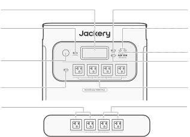<strong>LCD</strong><strong>Main</strong> <strong>Power</strong> <strong>Button</strong><strong>USB-C</strong> <strong>Output</strong><strong>DC</strong> <strong>Power</strong> <strong>Button</strong>100W Max<strong>USB-A</strong> <strong>Output</strong><strong>Cigarette</strong>18W Max<strong>Lighter</strong> <strong>Port</strong>12V⎓10A<strong>USB</strong> <strong>Power</strong> <strong>Button</strong><strong>AC</strong> <strong>Output</strong>(NEMA 5-20)1 x AC Output:120V, 20A, 2400WAC Total Output:<strong>AC</strong> <strong>Power</strong> <strong>Button</strong>7200W Max, 14400W Surge<strong>Total</strong> <strong>Output</strong><strong>Total</strong> <strong>Output</strong>120V, 30A, 3600W Max,120V, 30A, 3600W Max,7200W Surge7200W Surge

</figure>

### LEFT SIDE VIEW

<figure class="hb-reference-figure hb-base-art-live-copy" data-component-id="HB-SPECIAL-REFERENCE-FIGURE" data-reference-id="overview-left" data-source-fragment-sha256="dce68b6ecf11e37fd8325013aa125d36cef2fd3afa93dd21a0bc318d79e62147" data-web-base-art-ref="overview-left" data-web-presentation-mode="base-art-live-copy">

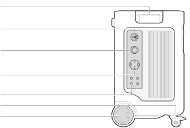<strong>Handle</strong><strong>AC</strong> <strong>Expansion</strong> <strong>Port</strong>Connect to Smart Transfer SwitchInput: 240V, 16.7A Max, 4000WOutput: 240V, 30A, 7200W<strong>NEMA</strong> <strong>L14-30R</strong> <strong>AC</strong> <strong>Output</strong> <strong>Port</strong>120V/240V, 30A, 7200W MaxPowers high-power devices and connects to an inlet box or manualtransfer switch for home electricity supply.<strong>NEMA</strong> <strong>14-50</strong> <strong>AC</strong> <strong>Output</strong> <strong>Port</strong>120V/240V, 30A, 7200W MaxPowers high-power devices and connects to an inlet box or manualtransfer switch for home electricity supply.<strong>AC</strong> <strong>Output</strong> <strong>Reset</strong> <strong>Button</strong>When the Reset Button pops up, you need to remove theload and press the Reset Button to reset.<strong>Wheel</strong> <strong>Brake</strong><strong>Wheels</strong>

</figure>

### RIGHT SIDE VIEW

<figure class="hb-reference-figure hb-base-art-live-copy" data-component-id="HB-SPECIAL-REFERENCE-FIGURE" data-reference-id="overview-right" data-source-fragment-sha256="9c80bcc99b500d5fb3d00f80a5ba7dd87ab62aec0f71704a6f01252628a698b0" data-web-base-art-ref="overview-right" data-web-presentation-mode="base-art-live-copy">

<strong>Retractable</strong> <strong>Handle</strong>Press the button on the retractable handle and pull up to extend.<strong>Low-PV</strong> <strong>Input</strong> <strong>(8020)</strong>2 x DC 8mm Ports; 16V-60V⎓10.5A Max, Double to 21A/1200W Max11V-16V(Working Voltage)⎓8A Max, Double to 8A Max<strong>High-PV</strong> <strong>Input</strong> <strong>(MC4)</strong>135V-450V⎓15A Max, 4000W Max<strong>High-PV</strong> <strong>Switch</strong>Turns on/off the switch to enable/disable highvoltage solar charging<strong>AC</strong> <strong>Input</strong>120V, 15A Max<strong>DC</strong> <strong>Expansion</strong> <strong>Port</strong> <strong>Terminal</strong> <strong>A</strong>Connect to Battery Pack<strong>Bottom</strong> <strong>Handle</strong>

</figure>

## LCD DISPLAY

<figure class="hb-reference-figure hb-base-art-live-copy" data-component-id="HB-SPECIAL-REFERENCE-FIGURE" data-reference-id="lcd-map" data-source-fragment-sha256="0b53ab70e9b932a0f805f70e0723e3ddea254a435406b8f79754836e488857d9" data-web-base-art-ref="lcd-map" data-web-presentation-mode="base-art-live-copy">

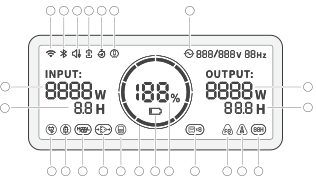2345671822239101112131415161718192021

</figure>

<figure aria-label="LCD indicators" class="hb-lcd-table-composition" data-component-id="HB-TABLE-LCD-ICON" tabindex="0"><table class="hb-lcd-icon-table"><colgroup><col class="hb-lcd-col-number"/><col class="hb-lcd-col-icon"/><col class="hb-lcd-col-name"/><col class="hb-lcd-col-description"/></colgroup><tbody><tr><td class="hb-lcd-number">1</td><td class="hb-lcd-icon"></td><td class="hb-lcd-name">Wi-Fi</td><td class="hb-lcd-description"><strong>On</strong>: Wi-Fi connected. <strong>Blink</strong>: Ready to connect to Wi-Fi. <strong>Off</strong>: Wi-Fi disconnected.</td></tr><tr><td class="hb-lcd-number">2</td><td class="hb-lcd-icon"></td><td class="hb-lcd-name">Bluetooth</td><td class="hb-lcd-description"><strong>On</strong>: Bluetooth connected. <strong>Blink</strong>: Ready to connect to Bluetooth. <strong>Off</strong>: Bluetooth disconnected.</td></tr><tr><td class="hb-lcd-number">3</td><td class="hb-lcd-icon"></td><td class="hb-lcd-name">Quiet Charging Mode can be enabled / disabled in the Jackery APP</td><td class="hb-lcd-description"><strong>On</strong>: The noise during charging is significantly minimized, while the charging power is reduced and the charging speed slows down. <strong>Off</strong>: Quiet Charging Mode is disabled.</td></tr><tr><td class="hb-lcd-number">4</td><td class="hb-lcd-icon"></td><td class="hb-lcd-name">Battery Saving Mode can be enabled / disabled in the Jackery APP</td><td class="hb-lcd-description"><strong>On</strong>: Limits the maximum usable battery capacity to extend battery life. <strong>Off</strong>: Battery Saving Mode is disabled.</td></tr><tr><td class="hb-lcd-number">5</td><td class="hb-lcd-icon"></td><td class="hb-lcd-name">Charging/Discharging Plan Indicator can be set in the Jackery APP on STS</td><td class="hb-lcd-description">Indicates that the product is operating under the Smart Transfer Switch (STS) Charging/Discharging Plan. This occurs only when the product is successfully connected to the STS and the Charging/Discharging Plan is set in the STS App.</td></tr><tr><td class="hb-lcd-number">6</td><td class="hb-lcd-icon"></td><td class="hb-lcd-name">Online UPS can be set in the Jackery APP</td><td class="hb-lcd-description"><strong>On</strong>: The product is on online UPS mode (0 ms). <strong>Off</strong>: Backup UPS mode (Default).</td></tr><tr><td class="hb-lcd-number">7</td><td class="hb-lcd-icon"></td><td class="hb-lcd-name">AC Power Indicator</td><td class="hb-lcd-description">The AC output (pure sine wave) is on.</td></tr><tr><td class="hb-lcd-number">8</td><td class="hb-lcd-icon"></td><td class="hb-lcd-name">Input Power</td><td class="hb-lcd-description">Displays the input power in watts.</td></tr><tr><td class="hb-lcd-number">9</td><td class="hb-lcd-icon"></td><td class="hb-lcd-name">Remaining Charge Time</td><td class="hb-lcd-description">Displays the remaining charging time.</td></tr><tr><td class="hb-lcd-number">10</td><td class="hb-lcd-icon"></td><td class="hb-lcd-name">AC Wall Charging Indicator</td><td class="hb-lcd-description">The product is charged via the AC input using grid power.</td></tr><tr><td class="hb-lcd-number">11</td><td class="hb-lcd-icon"></td><td class="hb-lcd-name">Car Charging Indicator</td><td class="hb-lcd-description">The product is charged via the Low-PV Input (8020) using DC 12V (car charging).</td></tr><tr><td class="hb-lcd-number" rowspan="2">12</td><td class="hb-lcd-icon"></td><td class="hb-lcd-name">High-PV Input Indicator</td><td class="hb-lcd-description">The product is charged via the High-PV Input (MC4) using solar panel(s).</td></tr><tr><td class="hb-lcd-icon"></td><td class="hb-lcd-name">Low-PV Input Indicator</td><td class="hb-lcd-description">The product is charged via the Low-PV Input (8020) using solar panel(s).</td></tr><tr><td class="hb-lcd-number" rowspan="2">13</td><td class="hb-lcd-icon"></td><td class="hb-lcd-name">AC Expansion Indicator (Charging) Ensure the STS is successfully connected before proceeding.</td><td class="hb-lcd-description">The product is charged via the Smart Transfer Switch (STS) using grid power.</td></tr><tr><td class="hb-lcd-icon"></td><td class="hb-lcd-name">AC Expansion Indicator (Discharging) Ensure the STS is successfully connected before proceeding.</td><td class="hb-lcd-description">The product is powering your home loads via the Smart Transfer Switch (STS).</td></tr><tr><td class="hb-lcd-number">14</td><td class="hb-lcd-icon"></td><td class="hb-lcd-name">Smart Transfer Switch Indicator</td><td class="hb-lcd-description">The product is successfully connected to the Smart Transfer Switch.</td></tr><tr><td class="hb-lcd-number">15</td><td class="hb-lcd-icon"></td><td class="hb-lcd-name">Battery Power Indicator</td><td class="hb-lcd-description">When the product is being charged, the orange circle around the battery percentage will light up in sequence. When charging other devices, the orange circle will stay on.</td></tr><tr><td class="hb-lcd-number">16</td><td class="hb-lcd-icon"></td><td class="hb-lcd-name">Low Battery Indicator</td><td class="hb-lcd-description"><strong>On</strong>: The battery level is below 20%. <strong>Blink</strong>: The battery level is below 5%. <strong>Off</strong>: The product is charging.</td></tr><tr><td class="hb-lcd-number">17</td><td class="hb-lcd-icon"></td><td class="hb-lcd-name">Remaining Battery Percentage</td><td class="hb-lcd-description">Displays the remaining battery percentage.</td></tr><tr><td class="hb-lcd-number">18</td><td class="hb-lcd-icon"></td><td class="hb-lcd-name">Battery Pack Indicator and Number of Connected Batteries</td><td class="hb-lcd-description">Indicates that the product is connected to the specified number of 5000 Plus Battery Pack(s).</td></tr><tr><td class="hb-lcd-number">19</td><td class="hb-lcd-icon"></td><td class="hb-lcd-name">Fault Code</td><td class="hb-lcd-description">A product error has occurred. Please refer to the Troubleshooting section for details.</td></tr><tr><td class="hb-lcd-number" rowspan="2">20</td><td class="hb-lcd-icon"></td><td class="hb-lcd-name">High Temperature Indicator</td><td class="hb-lcd-description">High temperature protection is triggered. The product may stop functioning until its temperature returns to the normal operating range.</td></tr><tr><td class="hb-lcd-icon"></td><td class="hb-lcd-name">Low Temperature Indicator</td><td class="hb-lcd-description">Low temperature protection is triggered. The product may stop functioning until its temperature returns to the normal operating range.</td></tr><tr><td class="hb-lcd-number">21</td><td class="hb-lcd-icon"></td><td class="hb-lcd-name">Energy Saving Mode</td><td class="hb-lcd-description">To prevent unnecessary battery consumption from forgetting to turn off the output, the product enables Energy Saving Mode by default. If no device is connected or the connected device's power consumption is below a certain threshold (AC output≤25W; USB output≤2W; Car output≤2W), the device will automatically turn off all outputs after 12 hours. <strong>On</strong>/ <strong>Off</strong>: Press and hold both the AC Power Button and Main Power Button</td></tr><tr><td class="hb-lcd-number">22</td><td class="hb-lcd-icon"></td><td class="hb-lcd-name">Output Power</td><td class="hb-lcd-description">Displays the output power in watts.</td></tr><tr><td class="hb-lcd-number">23</td><td class="hb-lcd-icon"></td><td class="hb-lcd-name">Remaining Discharge Time</td><td class="hb-lcd-description">Displays the remaining discharging time.</td></tr></tbody></table></figure>

## OPERATIONS

<table class="manual-callout-table manual-callout-table"><tbody><tr><td class="manual-callout-label">Note</td><td class="manual-callout-body">
When Energy Saving Mode is on, if the DC Output, AC Output, or USB Output Power Button is ON but the product is not charging or discharging, it will automatically shut down after 12 hours.
</td></tr></tbody></table>

### POWER ON/OFF

<figure class="hb-reference-figure hb-base-art-live-copy" data-component-id="HB-SPECIAL-REFERENCE-FIGURE" data-reference-id="power" data-source-fragment-sha256="07b15eef0eafedc4c373993d9b400363b5361bb6b3f3027e5fdc361437747681" data-web-base-art-ref="power" data-web-presentation-mode="base-art-live-copy">

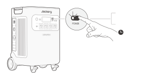<strong>On</strong>Press once<strong>Off</strong>Press and hold for 3s3s<strong>Default</strong> <strong>standby</strong> <strong>time:</strong> 2 hours · The product will automatically shut down after 2 hours of inactivity, with no charging or discharging. · The standby time can be set in the Jackery App.

</figure>

### AC OUTPUT ON/OFF

<figure class="hb-reference-figure hb-base-art-live-copy" data-component-id="HB-SPECIAL-REFERENCE-FIGURE" data-reference-id="ac-output" data-source-fragment-sha256="5a07e08447eb56d7a7ad50c3f8c2594f7c8047f6cf15ede554272c69edbc2202" data-web-base-art-ref="ac-output" data-web-presentation-mode="base-art-live-copy">

<strong>Prerequisite:</strong> Ensure the Main Power Button is on.<strong>On</strong>Press once<strong>Off</strong>Press once

</figure>

### USB OUTPUT ON/OFF

<figure class="hb-reference-figure hb-base-art-live-copy" data-component-id="HB-SPECIAL-REFERENCE-FIGURE" data-reference-id="usb-output" data-source-fragment-sha256="7d4c200acee02f7e02ec1a4957ef16d8d1cdf8a34c0cc7678be99b5394e80f42" data-web-base-art-ref="usb-output" data-web-presentation-mode="base-art-live-copy">

<strong>Prerequisite:</strong> Ensure the Main Power Button is on.<strong>On</strong>Press once<strong>Off</strong>Press once

</figure>

### DC OUTPUT ON/OFF

<figure class="hb-reference-figure hb-base-art-live-copy" data-component-id="HB-SPECIAL-REFERENCE-FIGURE" data-reference-id="dc-output" data-source-fragment-sha256="7b03a119ed425afe62f3ae6e52c996ab50e3439e5caf3a81f59468e37a56d879" data-web-base-art-ref="dc-output" data-web-presentation-mode="base-art-live-copy">

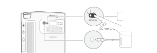<strong>Prerequisite:</strong> Ensure the Main Power Button is on.<strong>On</strong>Press once<strong>Off</strong>Press once

</figure>

<table class="manual-callout-table manual-callout-table"><tbody><tr><td class="manual-callout-label">Note</td><td class="manual-callout-body">
The product can charge your car battery using the Jackery 12V automobile battery charging cable, which is sold separately and available on our website.
</td></tr></tbody></table>

<table class="manual-callout-table manual-callout-table"><tbody><tr><td class="manual-callout-label">Caution</td><td class="manual-callout-body"><ul><li>The cigarette lighter port is only compatible with 12V car batteries and not suitable for 24V systems.</li><li>Do not start the car while the product is charging the car battery through the 12V DC output port (cigarette lighter port), as this may damage the product.</li><li>This feature is intended for emergency use only and cannot charge a dead or damaged car battery.</li></ul></td></tr></tbody></table>

### LCD SCREEN

<figure aria-label="LCD SCREEN" class="hb-lcd-mode-composition" data-component-id="HB-TABLE-LCD-MODE">

<table class="hb-lcd-mode-table"><colgroup><col class="hb-lcd-mode-col-state"/><col class="hb-lcd-mode-col-action"/><col class="hb-lcd-mode-col-copy"/></colgroup><tbody><tr><td class="hb-lcd-mode-state" rowspan="3">LCD Screen</td><td class="hb-lcd-mode-action">Turn on</td><td class="hb-lcd-mode-copy">Press the Main Power Button or when the product is charging.</td></tr><tr><td class="hb-lcd-mode-action">Turn off</td><td class="hb-lcd-mode-copy">Press the Main Power Button.</td></tr><tr><td class="hb-lcd-mode-action">Auto-off</td><td class="hb-lcd-mode-copy">The LCD turns off automatically and enters sleep mode after 2 minutes of inactivity.</td></tr><tr><td class="hb-lcd-mode-state" rowspan="3">Always-on Display Mode (under charging or discharging state)</td><td class="hb-lcd-mode-action">Turn on</td><td class="hb-lcd-mode-copy">Double-click the Main Power Button when the LCD screen is ON.</td></tr><tr><td class="hb-lcd-mode-action">Turn off</td><td class="hb-lcd-mode-copy">Press the Main Power Button.</td></tr><tr><td class="hb-lcd-mode-action">Auto-off</td><td class="hb-lcd-mode-copy">The Always-on Display Mode turns off automatically after 2 hours of inactivity.</td></tr></tbody></table>
</figure>

### KEY COMBINATIONS

<figure aria-label="Buttons / Operation / Function" class="hb-key-combination-composition" data-component-id="HB-TABLE-KEY-COMBINATIONS" tabindex="0"><table class="hb-key-combination-table"><colgroup><col class="hb-key-col-buttons"/><col class="hb-key-col-operation"/><col class="hb-key-col-function"/></colgroup><thead><tr><th class="hb-key-buttons" scope="col">Buttons</th><th class="hb-key-operation" scope="col">Operation</th><th class="hb-key-function" scope="col">Function</th></tr></thead><tbody><tr><td class="hb-key-buttons">

Main Power Button

USB Power Button

</td><td class="hb-key-operation">3s
Press and hold both for 3s
</td><td class="hb-key-function">Reset Wi-Fi &amp; Bluetooth</td></tr><tr><td class="hb-key-buttons">

Main Power Button

AC Power Button

</td><td class="hb-key-operation">3s
Press and hold both for 3s
</td><td class="hb-key-function">Turn on/off the Energy Saving Mode</td></tr><tr><td class="hb-key-buttons">

USB Power Button

AC Power Button

</td><td class="hb-key-operation">1s
Press and hold both for 1s
</td><td class="hb-key-function">Turn on/off Wi-Fi &amp; Bluetooth</td></tr><tr><td class="hb-key-buttons">

DC Power Button

AC Power Button

</td><td class="hb-key-operation">3s
Press and hold both for 3s
</td><td class="hb-key-function">Switch to online UPS or Backup UPS</td></tr></tbody></table></figure>

## TROUBLESHOOTING

<table class="manual-table native-troubleshooting"><thead><tr><th>Error Code</th><th>Name</th><th>Description (For Internal Fault Maintenance Only)</th></tr></thead><tbody><tr><td><strong>F0</strong></td><td><strong>BMS Data Communication Error</strong></td><td>Data communication fault between the BMS and mainboard</td></tr><tr><td><strong>F1</strong></td><td><strong>Inverter Data Communication Error</strong></td><td>Data communication fault between the inverter and mainboard</td></tr><tr><td><strong>F2</strong></td><td><strong>DC Input Data Communication Error</strong></td><td>Data communication fault between the DC charging module and BMS</td></tr><tr><td><strong>F3</strong></td><td><strong>BMS or Battery Failure</strong></td><td>BMS or battery failuare</td></tr><tr><td><strong>F4</strong></td><td><strong>Battery Overvoltage</strong></td><td>Battery overvoltage</td></tr><tr><td><strong>F5</strong></td><td><strong>Battery Undervoltage</strong></td><td>Battery undervoltage</td></tr><tr><td><strong>F6</strong></td><td><strong>Inverter Failure</strong></td><td>AC output overcurrent / overload / short circuit; Grid input overvoltage / undervoltage / overfrequency / underfrequency; Inverter over-temperature protection on (triggered) Insulation detection failure</td></tr><tr><td><strong>F7</strong></td><td><strong>DC Input Failure</strong></td><td>PV input overvoltage; DC charging module overtemperature protection on/triggered; Output overcurrent protection of the DC charging module on/triggered</td></tr><tr><td><strong>F8</strong></td><td><strong>Battery Charging / Discharging Overcurrent / Short Circuit</strong></td><td>BMS overcurrent / short circuit protection on/triggered</td></tr><tr><td><strong>F9</strong></td><td><strong>DC Output Overcurrent / Short Circuit</strong></td><td>USB short circuit protection on/triggered</td></tr><tr><td><strong>FA</strong></td><td><strong>Parallel Unit Communication Error</strong></td><td>Data communication failure between two 5000 Plus failure caused by both units defective.</td></tr><tr><td><strong>FC</strong></td><td><strong>Battery Pack Communication Error</strong></td><td>Data communication failure between the 5000 Plus and battery pack(s)</td></tr></tbody></table>

## UNINTERRUPTIBLE POWER SUPPLY (UPS)

An uninterruptible power supply (UPS) is a type of continual power system that provides automated backup electric power to a load when the mains grid power fails.

The HomePower 5000 Plus is equipped with two UPS modes: Backup UPS and Online UPS.

### BACKUP UPS

The backup UPS function is enabled by default. In the event of a sudden loss of grid power, the HomePower 5000 Plus will automatically switch to stored power within 20 ms to keep your appliances running.

In Backup UPS mode, the unit's peak output reaches 1440W before power outages. As simultaneous charging/discharging is enabled in Bypass Mode, the actual output power is lower than the rated output power in this mode but returns to rated output power during outages.

<figure class="hb-reference-figure hb-base-art-live-copy" data-component-id="HB-SPECIAL-REFERENCE-FIGURE" data-reference-id="ups" data-source-fragment-sha256="03d4c0feff533afd13c071a375144e486616968e01c1acfad2194e4a9de03f2f" data-web-base-art-ref="ups" data-web-presentation-mode="base-art-live-copy">

Connect the product to a wall outlet with the AC charging cable, then press the AC output button and power your appliances at the same time .

</figure>

### ONLINE UPS

The online UPS mode, which enables 0 ms switching, can be activated in two ways:

<ol><li>Enable Online UPS in the Jackery App.</li><li>Press the DC and AC Power Buttons simultaneously on the HomePower 5000 Plus.</li></ol>

<table class="manual-callout-table manual-callout-table"><tbody><tr><td class="manual-callout-label">Note</td><td class="manual-callout-body"><ol><li>The system settings will revert to Backup UPS mode when the product is in Online mode and is restarted. In Backup UPS mode, the output power is limited by the bypass power, with a maximum output power of 1440W.</li><li>In UPS mode, the NEMA L14-30R and NEMA 14-50 outlets each provide a 120V output when the product is connected to a wall outlet using the AC charging cable.</li><li>In Online UPS mode, it supports 0 ms switching with a maximum output power of 3600W.</li></ol></td></tr></tbody></table>

## CONNECTIONS

### CONNECT TO BATTERY PACK(S) SOLD SEPARATELY

This product can support up to 5 battery packs to meet the need for large power capacity. For details on how to use it, please refer to the Jackery Battery Pack 5000 Plus User Manual.

<figure class="hb-reference-figure hb-base-art-live-copy" data-component-id="HB-SPECIAL-REFERENCE-FIGURE" data-reference-id="battery-packs" data-source-fragment-sha256="6d0d40205c4f8cd21677add4579dd24369742aaac71160f3666906425a15f1b0" data-web-base-art-ref="battery-packs" data-web-presentation-mode="base-art-live-copy">

at least 1 ft (300mm)at least 1 ft (300mm)

</figure>

<table class="manual-callout-table manual-callout-table"><tbody><tr><td class="manual-callout-label">Caution</td><td class="manual-callout-body"><ol><li>Ensure all products are powered off before connecting the HomePower 5000 Plus to the 5000 Plus Battery Pack(s).</li><li>To ensure proper operation of the product, make sure the air intake and exhaust vents on both sides are unobstructed. Leave at least 1 ft of space between the vents and any objects to allow for adequate air circulation and effective heat dissipation.</li></ol></td></tr></tbody></table>

### CONNECT TO A SMART TRANSFER SWITCH SOLD SEPARATELY

<figure class="hb-reference-figure hb-base-art-live-copy" data-component-id="HB-SPECIAL-REFERENCE-FIGURE" data-reference-id="sts-connect" data-source-fragment-sha256="2c5cdf2b10b66787988658430d905f4b149bcaf562b28ad711e5c15ea8cb450f" data-web-base-art-ref="sts-connect" data-web-presentation-mode="base-art-live-copy">

Jackery HomePower 5000 Plus can power your home loads via the Smart Transfer Switch. For details on how to use it, please refer to the Jackery Smart Transfer Switch user manual.When UPS mode is enabled, the portablepower station remains active andcontinuously consumes power. In the event ofa power outage, the system will switch tobattery power within 20 milliseconds.When UPS mode is disabled, the systemswitches to battery power within 5 secondsduring a power outage.

</figure>

## CHARGING

Green energy first: We advocate to use the green energy first. This product supports two modes of charging at the same time: solar charging and AC wall charging.

When AC wall charging and solar charging are turned on at the same time, the product will give priority to solar charging and both methods will be used to charge the battery at the maximum permissible power.

<strong>Fully charge the product before its first use.</strong>

<table class="manual-callout-table manual-callout-table"><tbody><tr><td class="manual-callout-label">Note</td><td class="manual-callout-body"><ol><li>The recommended charging temperature for the product is between 0°C to 45°C (32°F to 113°F), and the discharging temperature is between -15°C to 45°C (5°F to 113°F). Operating the product outside this temperature range may restrict its charging and discharging capabilities, prevent it from charging or discharging.</li><li>The charging power and battery capacity of the product may vary due to temperature fluctuations. When the ambient temperature is between -15°C to -10°C (5°F to 14°F), the maximum output power decreases to 3600W.</li></ol></td></tr></tbody></table>

### CHARGING VIA AC WALL OUTLET

<figure class="hb-reference-figure hb-base-art-live-copy" data-component-id="HB-SPECIAL-REFERENCE-FIGURE" data-reference-id="ac-charge" data-source-fragment-sha256="677853b510392446b4c9aabe61a8c145b6b79e6871c82ac487caa47502df2f3a" data-web-base-art-ref="ac-charge" data-web-presentation-mode="base-art-live-copy">

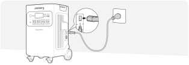Connect the AC charging cableto the HomePower 5000 Plus ACinput port and a wall outlet.

</figure>

### CHARGING WITH A SMART TRANSFER SWITCH

<figure class="hb-reference-figure hb-base-art-live-copy" data-component-id="HB-SPECIAL-REFERENCE-FIGURE" data-reference-id="sts-charge" data-source-fragment-sha256="92126993b0e18d20bac83165192eae5bbf137d70fc9d23bedcc613fe575a7ca2" data-web-base-art-ref="sts-charge" data-web-presentation-mode="base-art-live-copy">

Connect your Jackery Smart Transfer Switch to the product toenable charging via the Jackery Smart Transfer Switch.*The backup reserve setting works in all modes of the SmartTransfer Switch. Therefore, the Jackery HomePower 5000 Plusstops charging when its remaining capacity exceeds the backupreserve. To charge it immediately, follow the instructions below.<strong>STEP</strong> <strong>1</strong><strong>STEP</strong> <strong>2</strong>HP5000Plus*STS App

</figure>

<table class="manual-callout-table manual-callout-table"><tbody><tr><td class="manual-callout-label">Note</td><td class="manual-callout-body">
When the AC Expansion Port is successfully connected to the STS, the AC Input port will not be used for charging. In this case, the portable power station can be charged via the following ports: AC Expansion Port, High-PV, and Low-PV.
</td></tr></tbody></table>

### CHARGING WITH SOLAR PANELS

<table class="manual-callout-table manual-callout-table"><tbody><tr><td class="manual-callout-label">Caution</td><td class="manual-callout-body">
When connecting solar panels in series, ensure that the maximum voltage output of all panels is within 16V-60V for the low-PV input port, and 135V-450V for the high-PV input port.
</td></tr></tbody></table>

<ul><li><strong>Connect to Low-PV Input Port</strong></li></ul>

Low-PV input voltage range: 16V to 60V

The Jackery HomePower 5000 Plus has two low-PV input ports, each one supports direct connection of one 500W or three 200W solar panels. If one low-PV input port needs to connect two or more solar panels simultaneously, please refer to the figure below for charging through the solar panel connector (sold separately, not included as standard).

<figure class="hb-reference-figure hb-base-art-live-copy" data-component-id="HB-SPECIAL-REFERENCE-FIGURE" data-reference-id="low-pv-500" data-source-fragment-sha256="c15fbfa8cf0f1dde0f0d3dbc98396dec1fbf186981f8a665885d7e1ed2bef6ff" data-web-base-art-ref="low-pv-500" data-web-presentation-mode="base-art-live-copy">

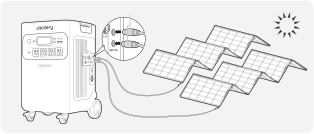DC8020SolarSaga 500 X × 2

</figure>

<figure class="hb-reference-figure hb-base-art-live-copy" data-component-id="HB-SPECIAL-REFERENCE-FIGURE" data-reference-id="low-pv-200" data-source-fragment-sha256="fad18b7b2c402a027b5a4d822a86fc0b91020111738fc1bb20149f6038143401" data-web-base-art-ref="low-pv-200" data-web-presentation-mode="base-art-live-copy">

DC8020DC8020SolarSaga 200 × 6

</figure>

<table class="manual-callout-table manual-callout-table"><tbody><tr><td class="manual-callout-label">Caution</td><td class="manual-callout-body"><ol><li>Ensure that the input voltage for both DC input ports is the same. Failure to do so may damage the product. For example:</li></ol><ul><li>It is recommended to use the same model of Jackery solar panels and the same number of panels when connecting solar panels to both DC8020 Input ports.</li><li>Do not charge the product using both a car charger and a solar panel simultaneously. Doing so may blow the car fuse or result in charging failure.</li></ul><ol start="2"><li>It is recommended to use the Jackery Solar Panel to charge the HomePower 5000 Plus. Jackery is not responsible for any losses caused by using solar panels from other brands.</li></ol></td></tr></tbody></table>

<ul><li><strong>Connect to High-PV Input Port</strong></li></ul>

High-PV input voltage range: 135V to 450V

<table class="manual-callout-table manual-callout-table"><tbody><tr><td class="manual-callout-label">Caution</td><td class="manual-callout-body"><ol><li>Make sure the High-PV switch is turned off before connecting the High-PV input or performing maintenance.</li><li>Before using the High-PV input ports, make sure the PV switch is turned on.</li><li>Make sure the High-PV switch is in the 'OFF' or 'LOCK' position before using the provided MC4 wrench to disconnect the MC4 connectors.</li></ol></td></tr></tbody></table>

<figure class="hb-reference-figure hb-base-art-live-copy" data-component-id="HB-SPECIAL-REFERENCE-FIGURE" data-reference-id="high-pv" data-source-fragment-sha256="8f194a9b949be30a56d84ad3ffb63f7ccaacfffa56676d59c0dbb659b1b28cda" data-web-base-art-ref="high-pv" data-web-presentation-mode="base-art-live-copy">

Disconnect MC4 connectors withthe provided MC4 wrench.

</figure>

<figure class="hb-reference-figure hb-base-art-live-copy" data-component-id="HB-SPECIAL-REFERENCE-FIGURE" data-reference-id="high-pv-lock" data-source-fragment-sha256="93b6c939f81d35855676070b5bfaf77d9e637dd50b72e9b706ca7fc2d1eec3d5" data-web-base-art-ref="high-pv-lock" data-web-presentation-mode="base-art-live-copy">

<strong>Lock</strong><strong>Unlock</strong>Turn the high-PV switch to the 'LOCK' positionRelease the locking mechanism and theand press the locking mechanism.switch returns to the 'OFF' position.

</figure>

<ul><li><strong>High-PV + Low-PV Input</strong></li></ul>

Voltage range for low-PV input: 16V to 60V

Voltage range for high-PV input: 135V to 450V

<figure class="hb-reference-figure" data-component-id="HB-SPECIAL-REFERENCE-FIGURE" data-reference-id="dual-pv" data-source-fragment-sha256="0c66ccafa23616c19ca1e92a43b633566946a182d8ab4130ddfc6de832746e75">

</figure>

### CHARGING WITH A CAR CHARGER

This product can be charged using a 12V car charger. Ensure that the car charger and the car cigarette lighter provide a good connection.

<figure class="hb-reference-figure hb-base-art-live-copy" data-component-id="HB-SPECIAL-REFERENCE-FIGURE" data-reference-id="car" data-source-fragment-sha256="7c0f1164655a604a3ef32ab52539bce70c36cc5e3e2170a34b9416c91a0f2533" data-web-base-art-ref="car" data-web-presentation-mode="base-art-live-copy">

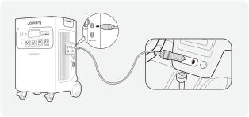Vehicle*The car charging cable is sold separately.

</figure>

<table class="manual-callout-table manual-callout-table"><tbody><tr><td class="manual-callout-label">Caution</td><td class="manual-callout-body"><ol><li>Please start the vehicle before charging your power station.</li><li>If the vehicle is running on bumpy roads, it is forbidden to use the car charger in case it burns due to a poor connection. The Company will not be responsible for any loss caused by non-standard operation.</li><li>Vehicle charging is only applicable to vehicles with 12V DC, not 24V DC. Please do not charge this product in 24V vehicle to avoid personal injury and property loss.</li></ol></td></tr></tbody></table>

## STORAGE

Store the product in a dry clean place with proper ventilation. Storage temperature and humidity:

<ul><li>1 month: -4°F to 113°F / -20°C to 45°C (0-60%RH)</li><li>3 months: 32°F to 113°F / 0°C to 45°C (0-60%RH)</li><li>12 months: 32°F to 77°F / 0°C to 25°C (0-60%RH)</li></ul>

If this product is stored for a long period of time (3 months - 6 months) with the power depleted, it may become unchargeable. To prevent this and maintain battery health, it is recommended to check and recharge the product every three months and perform a full charge and discharge cycle at least once every 6 to 12 months.

## APP SETUP

### 1. To download the App and log in

<figure aria-label="App download" class="hb-app-download-composition" data-component-id="HB-SPECIAL-APP">

Search for "Jackery" in Google Play or App Store to install the App. After that, you can register and log in.

Alternatively, scan the QR code below to download and install the App.

</figure>

### 2. To add device

2.1 Click the button + to add your device;

2.2 Turn on the product by long-pressing the Main Power Button. When the Wi-Fi and Bluetooth icons appear and flash on the product, your product enters the network configuring mode. Open Bluetooth permission and tap the Icon Flashed button on your APP to connect the product;

<figure class="hb-reference-figure hb-base-art-live-copy" data-component-id="HB-SPECIAL-REFERENCE-FIGURE" data-reference-id="app-add" data-source-fragment-sha256="bdc3fd18101f0cff875da9b75b8c5303c79b4077ccc63fd2182f9f4fc396fc28" data-web-base-art-ref="app-add" data-web-presentation-mode="base-art-live-copy">

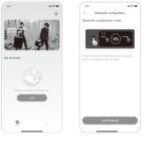2.22.1

</figure>

<figure class="hb-reference-figure hb-base-art-live-copy" data-component-id="HB-SPECIAL-REFERENCE-FIGURE" data-reference-id="app-control" data-source-fragment-sha256="b0f3e868ba6715c828d06c3f9db3819ea21e1015b074f4f99ac6bb2b8e368ae0" data-web-base-art-ref="app-control" data-web-presentation-mode="base-art-live-copy">

Main Power ButtonDC Power ButtonUSB Power ButtonAC Power Button

</figure>

<table class="manual-callout-table manual-callout-table"><tbody><tr><td class="manual-callout-label">Remarks</td><td class="manual-callout-body">
After being turned on, if the APP is not connected within 2 hours, the device will automatically turn off Wi-Fi and Bluetooth. Now, it is required to press and hold USB Power Button and AC Power Button to turn on Wi-Fi and Bluetooth again.
</td></tr></tbody></table>

2.3 After clicking the searched device icon, the App automatically connects the device via Bluetooth.

<table class="manual-callout-table manual-callout-table"><tbody><tr><td class="manual-callout-label">Remarks</td><td class="manual-callout-body">
If “the device has been bound” is prompted during the binding process, the following two ways can be used for connection:
<ul><li>The device owner will share this device with other users through the App.</li><li>Press and hold the Main Power Button and USB Power Button for 3 seconds to reset the device, and then re-bind the device.</li></ul></td></tr></tbody></table>

2.4 After the device is successfully connected, it is necessary to enter your Wi-Fi password and tap the OK button;

<table class="manual-callout-table manual-callout-table"><tbody><tr><td class="manual-callout-label">Remarks</td><td class="manual-callout-body">
Please select a Wi-Fi network in 2.4GHz band. The device does not support a Wi-Fi network in 5GHz band.
</td></tr></tbody></table>

2.5 After the device is successfully added on the home page of the device, the Wi-Fi icon on the device will be always on;

<figure class="hb-reference-figure hb-base-art-live-copy" data-component-id="HB-SPECIAL-REFERENCE-FIGURE" data-reference-id="app-results" data-source-fragment-sha256="4b0abcf4f3dc9d0e8711acc7e64e70273219606452cc604306b7ad716a8b8825" data-web-base-art-ref="app-results" data-web-presentation-mode="base-art-live-copy">

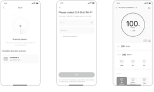2.32.42.5

</figure>

The above screenshots are for reference only.

### 3. To unbind the device

Click the Settings button in the upper right corner of the main interface of the device to enter the settings page, and click the Unbind button at the bottom of the page to unbind the device.

### 4. Notes

<strong>4.1 To turn on Wi-Fi &amp; Bluetooth:</strong>

<ul><li>Wi-Fi &amp; Bluetooth are automatically turned on after the device is on, and the Wi-Fi &amp; Bluetooth icons on the screen light up;</li><li>Press the USB Power Button and the AC Power Button at the same time until the Wi-Fi &amp; Bluetooth icons on the screen light up;</li></ul>

<strong>4.2 To turn off Wi-Fi &amp; Bluetooth:</strong>

<ul><li>Press the USB Power Button and AC Power Button at the same time until the Wi-Fi &amp; Bluetooth icons on the screen are off;</li><li>Wi-Fi &amp; Bluetooth will be automatically turned off if no device is connected within 2 hours;</li></ul>

<strong>4.3 To reset Wi-Fi &amp; Bluetooth：</strong>

<ul><li>Press the Main Power Button and USB Power Button at the same time for 3 seconds to reset Wi-Fi &amp; Bluetooth to factory settings and reboot the system. The connected App account will be unbound.</li></ul>

## WARRANTY

<figure aria-label="WARRANTY" class="hb-warranty-intro-composition" data-component-id="HB-WARRANTY-LEAD">
<strong>We only provide our warranty to customers who purchase from the official Jackery website, Jackery-branded third-party platforms, or local authorized dealers.</strong>

* Warranty period and details may vary according to local laws, regulations, and authorized dealers.
</figure>

### Limited Warranty

<figure aria-label="Limited Warranty" class="hb-warranty-card" data-component-id="HB-WARRANTY-SECTION" data-warranty-card-index="1">
Jackery Inc. warrants to the original consumer purchaser that the Jackery product will be free from defects in workmanship and material under normal consumer use during the applicable warranty period identified in the 'Warranty Period' section below, subject to the exclusions set forth below.

This warranty statement sets forth Jackery's total and exclusive warranty obligation. We will not assume, nor authorize any person to assume for us, any other liability in connection with the sale of our products.
</figure>

### Warranty Period

<figure aria-label="Warranty Period" class="hb-warranty-period-card" data-component-id="HB-WARRANTY-YEARS">

5
<strong class="hb-warranty-years-unit">YEARS</strong><strong class="hb-warranty-period-label">Standard Warranty</strong>

The standard warranty period for Jackery HomePower 5000 Plus is 60 months. In each case, the warranty period is measured starting on the date of purchase by the original consumer purchaser. The sales receipt from the first consumer purchase, or other reasonable documentary proof, is required in order to establish the start date of the warranty period.

2
<strong class="hb-warranty-years-unit">YEARS</strong><strong class="hb-warranty-period-label">Extended Warranty</strong>

An additional fee is required for the extended warranty. For details on the extended warranty, please visit the Jackery website or contact Jackery customer service.

</figure>

### Repair or replacement

<figure aria-label="Repair or replacement" class="hb-warranty-card" data-component-id="HB-WARRANTY-SECTION" data-warranty-card-index="3">Jackery will repair or replace (at Jackery's expense) any Jackery product that fails to operate during the applicable warranty period due to a defect in workmanship or material. The repaired/replaced product assumes the remaining warranty of the original date of purchase.</figure>

### Limited to Original Consumer Buyer

<figure aria-label="Limited to Original Consumer Buyer" class="hb-warranty-card" data-component-id="HB-WARRANTY-SECTION" data-warranty-card-index="4">The warranty on Jackery's product is limited to the original consumer purchaser and is not transferable to any subsequent owner.</figure>

### Exclusions

<figure aria-label="Exclusions" class="hb-warranty-card" data-component-id="HB-WARRANTY-SECTION" data-warranty-card-index="5">
Jackery's warranty does not apply to:

Misused, abused, modified, damaged by accident, or used for anything other than normal consumer use as authorized in Jackery's current product literature.

Attempted repair by anyone other than an authorized facility.

Any product purchased through an online auction house.

Jackery's warranty does not apply to the battery cell unless the battery cell is fully charged by you within seven days after you purchase the product and at least once every 6 months thereafter.
</figure>

### Interpretation Rights

<figure aria-label="Interpretation Rights" class="hb-warranty-card" data-component-id="HB-WARRANTY-SECTION" data-warranty-card-index="6">Jackery Inc. reserves the right to final interpretation of the above customers' after-sales policy.</figure>

## SPECIFICATIONS

<h2 class="hb-spec-group">GENERAL INFO</h2>

<figure aria-label="GENERAL INFO" class="hb-spec-table-composition"><table class="manual-table manual-spec-table hb-spec-table"><colgroup><col class="hb-spec-col-label"/><col class="hb-spec-col-value"/></colgroup><tbody><tr><th class="manual-spec-label hb-spec-label" scope="row">Product Name</th><td class="manual-spec-value hb-spec-value">Jackery HomePower 5000 Plus</td></tr><tr><th class="manual-spec-label hb-spec-label" scope="row">Model No.</th><td class="manual-spec-value hb-spec-value">JHP-5000C</td></tr><tr><th class="manual-spec-label hb-spec-label" scope="row">Capacity</th><td class="manual-spec-value hb-spec-value">45Ah/112Vdc (5040Wh)</td></tr><tr><th class="manual-spec-label hb-spec-label" scope="row">Cell Chemistry</th><td class="manual-spec-value hb-spec-value">LiFePO4</td></tr><tr><th class="manual-spec-label hb-spec-label" scope="row">Weight</th><td class="manual-spec-value hb-spec-value">About 134.5 lbs/61 kg</td></tr><tr><th class="manual-spec-label hb-spec-label" scope="row">Dimension</th><td class="manual-spec-value hb-spec-value">16.5×15.5×25 in/41.8×39.5×63.5 cm</td></tr><tr><th class="manual-spec-label hb-spec-label" scope="row">Cycle Life</th><td class="manual-spec-value hb-spec-value">4000 cycles to 70%+ capacity</td></tr><tr><th class="manual-spec-label hb-spec-label" scope="row">UPS</th><td class="manual-spec-value hb-spec-value">Backup UPS: ＜20ms Onine UPS: 0ms</td></tr><tr><th class="manual-spec-label hb-spec-label" scope="row">Inverter Topology</th><td class="manual-spec-value hb-spec-value">Non-isolated</td></tr><tr><th class="manual-spec-label hb-spec-label" scope="row">Power Factor</th><td class="manual-spec-value hb-spec-value">≥0.98</td></tr><tr><th class="manual-spec-label hb-spec-label" scope="row">Entire Unit</th><td class="manual-spec-value hb-spec-value">Type 1</td></tr></tbody></table></figure>

<h2 class="hb-spec-group">INPUT PORTS</h2>

<figure aria-label="INPUT PORTS" class="hb-spec-table-composition"><table class="manual-table manual-spec-table hb-spec-table"><colgroup><col class="hb-spec-col-label"/><col class="hb-spec-col-value"/></colgroup><tbody><tr><th class="manual-spec-label hb-spec-label" scope="row">Charge Mode AC Input</th><td class="manual-spec-value hb-spec-value">120V~60Hz, 15A Max (Duration time &lt; 3h when current exceeds 12A)</td></tr><tr><th class="manual-spec-label hb-spec-label" rowspan="2" scope="row">Bypass Mode AC Input</th><td class="manual-spec-value hb-spec-value">120V~60Hz, 12A Max (Duration time &lt; 3h when current exceeds 12A)</td></tr><tr><td class="manual-spec-value hb-spec-value">240V~60Hz, 16.7A Max</td></tr><tr><th class="manual-spec-label hb-spec-label" scope="row">1 x AC Expansion Port (Input)</th><td class="manual-spec-value hb-spec-value">240V~60Hz, 16.7A Max</td></tr><tr><th class="manual-spec-label hb-spec-label" scope="row">DC Input</th><td class="manual-spec-value hb-spec-value"></td></tr><tr><th class="manual-spec-label hb-spec-label" scope="row">1 x DC Expansion Port (Input)</th><td class="manual-spec-value hb-spec-value">80.5V-126V⎓98A Max</td></tr><tr><th class="manual-spec-label hb-spec-label" scope="row">High-PV</th><td class="manual-spec-value hb-spec-value">135V-450V⎓15A Max, 4000W Max</td></tr><tr><th class="manual-spec-label hb-spec-label" rowspan="2" scope="row">Low-PV</th><td class="manual-spec-value hb-spec-value">2 x DC 8mm Ports; 16V-60V⎓10.5A Max, Double to 21A/1200W Max</td></tr><tr><td class="manual-spec-value hb-spec-value">11V-16V (Working Voltage)⎓8A Max, Double to 8A Max</td></tr></tbody></table></figure>

<h2 class="hb-spec-group">OUTPUT PORTS</h2>

<figure aria-label="OUTPUT PORTS" class="hb-spec-table-composition"><table class="manual-table manual-spec-table hb-spec-table"><colgroup><col class="hb-spec-col-label"/><col class="hb-spec-col-value"/></colgroup><tbody><tr><th class="manual-spec-label hb-spec-label" scope="row">AC Output (NEMA L14-30R/14-50)</th><td class="manual-spec-value hb-spec-value">120V/240V~60Hz, 30A, 7200W Max</td></tr><tr><th class="manual-spec-label hb-spec-label" scope="row">Bypass Mode AC Output</th><td class="manual-spec-value hb-spec-value">120V~60Hz, 12A Max 240V~60Hz, 16.7A Max</td></tr><tr><th class="manual-spec-label hb-spec-label" scope="row">4 × AC Output</th><td class="manual-spec-value hb-spec-value">120V~60Hz, 20A, 2400W</td></tr><tr><th class="manual-spec-label hb-spec-label" scope="row">AC Total Output</th><td class="manual-spec-value hb-spec-value">7200W Max, 14400W Surge</td></tr><tr><th class="manual-spec-label hb-spec-label" scope="row">2 × USB-C Output</th><td class="manual-spec-value hb-spec-value">100W Max, 5V⎓3A, 9V⎓3A, 12V⎓3A, 15V⎓3A, 20V⎓5A</td></tr><tr><th class="manual-spec-label hb-spec-label" scope="row">2 × USB-A Output</th><td class="manual-spec-value hb-spec-value">18W Max, 5-6V⎓3A, 6-9V⎓2A, 9-12V⎓1.5A</td></tr><tr><th class="manual-spec-label hb-spec-label" scope="row">Cigarette Lighter Port</th><td class="manual-spec-value hb-spec-value">12V⎓10A</td></tr><tr><th class="manual-spec-label hb-spec-label" scope="row">1 × AC Expansion Port (Output)</th><td class="manual-spec-value hb-spec-value">240V~60Hz, 30A, 7200W</td></tr><tr><th class="manual-spec-label hb-spec-label" scope="row">1 × DC Expansion Port (Output)</th><td class="manual-spec-value hb-spec-value">80.5V-126V⎓41A Max</td></tr></tbody></table></figure>

<h2 class="hb-spec-group">ENVIRONMENTAL OPERATING TEMPERATURE</h2>

<figure aria-label="ENVIRONMENTAL OPERATING TEMPERATURE" class="hb-spec-table-composition"><table class="manual-table manual-spec-table hb-spec-table"><colgroup><col class="hb-spec-col-label"/><col class="hb-spec-col-value"/></colgroup><tbody><tr><th class="manual-spec-label hb-spec-label" scope="row">Charging Temperature</th><td class="manual-spec-value hb-spec-value">0°C~45°C (32°F~113°F)</td></tr><tr><th class="manual-spec-label hb-spec-label" rowspan="2" scope="row">Discharging Temperature</th><td class="manual-spec-value hb-spec-value">-15°C~45°C (5°F~113°F)</td></tr><tr><td class="manual-spec-value hb-spec-value">-15°C~-10°C (5°F~14°F) Output Power: 3600W</td></tr></tbody></table></figure>

<strong>INGESTION HAZARD:</strong> This product contains a button cell or coin battery.

※ USB Type-C® and USB-C® are registered trademarks of USB Implementers Forum.

## SMART HOME BACKUP SYSTEM (AC ESS) INSTALLATION GUIDE <strong>System Model</strong> HB5000C-TS02A

To connect the Jackery HomePower 5000 Plus to the Smart Transfer Switch (STS), use the expansion cable to link the Explorer 5000 Plus AC expansion port to the STS AC power input/output port.

To connect the Jackery HomePower 5000 Plus to the battery pack, use the expansion cable to connect its DC expansion port (A) to the battery pack's DC expansion port (B).

<figure class="hb-reference-figure hb-base-art-live-copy" data-component-id="HB-SPECIAL-REFERENCE-FIGURE" data-reference-id="ess" data-source-fragment-sha256="d58f02ac90a1b44ea61d4d6fbff34beef9948f22818af00ba44cbd1002281490" data-web-base-art-ref="ess" data-web-presentation-mode="base-art-live-copy">

For detailed installation and connection instructions, refer to theuser manuals for the STS and battery pack.

</figure>

<table class="manual-callout-table manual-callout-table"><tbody><tr><td class="manual-callout-label">Caution</td><td class="manual-callout-body">
Smart home backup system (AC ESS) Installation Position

Indoor installation.

The area is completely water proof.

The wall is flat and level.

Ambient temperature range:-15°C~45°C.

The temperature and humidity are maintained at a constant level. Install in a well-ventilated place.

Do not place at a children or pet touchable area.

The installation area shall avoid of direct sunlight.

No flammable or explosive materials close to inverter and battery.
</td></tr></tbody></table>

### Jackery HomePower 5000 Plus Model: JHP-5000C

#### SPECIFICATIONS

<h2 class="hb-spec-group">GENERAL INFO</h2>

<figure aria-label="GENERAL INFO" class="hb-spec-table-composition"><table class="manual-table manual-spec-table hb-spec-table"><colgroup><col class="hb-spec-col-label"/><col class="hb-spec-col-value"/></colgroup><tbody><tr><th class="manual-spec-label hb-spec-label" scope="row">Product Name</th><td class="manual-spec-value hb-spec-value">Jackery HomePower 5000 Plus</td></tr><tr><th class="manual-spec-label hb-spec-label" scope="row">Model No.</th><td class="manual-spec-value hb-spec-value">JHP-5000C</td></tr><tr><th class="manual-spec-label hb-spec-label" scope="row">Capacity</th><td class="manual-spec-value hb-spec-value">45Ah/112Vdc (5040Wh)</td></tr><tr><th class="manual-spec-label hb-spec-label" scope="row">Cell Chemistry</th><td class="manual-spec-value hb-spec-value">LiFePO4</td></tr><tr><th class="manual-spec-label hb-spec-label" scope="row">Weight</th><td class="manual-spec-value hb-spec-value">About 134.5 lbs/61 kg</td></tr><tr><th class="manual-spec-label hb-spec-label" scope="row">Dimension</th><td class="manual-spec-value hb-spec-value">16.5×15.5×25 in/41.8×39.5×63.5 cm</td></tr><tr><th class="manual-spec-label hb-spec-label" scope="row">Cycle Life</th><td class="manual-spec-value hb-spec-value">4000 cycles to 70%+ capacity</td></tr><tr><th class="manual-spec-label hb-spec-label" scope="row">UPS</th><td class="manual-spec-value hb-spec-value">Backup UPS: ＜20ms Onine UPS: 0ms</td></tr><tr><th class="manual-spec-label hb-spec-label" scope="row">Inverter Topology</th><td class="manual-spec-value hb-spec-value">Non-isolated</td></tr><tr><th class="manual-spec-label hb-spec-label" scope="row">Power Factor</th><td class="manual-spec-value hb-spec-value">≥0.98</td></tr><tr><th class="manual-spec-label hb-spec-label" scope="row">Entire Unit</th><td class="manual-spec-value hb-spec-value">Type 1</td></tr></tbody></table></figure>

<h2 class="hb-spec-group">INPUT PORTS</h2>

<figure aria-label="INPUT PORTS" class="hb-spec-table-composition"><table class="manual-table manual-spec-table hb-spec-table"><colgroup><col class="hb-spec-col-label"/><col class="hb-spec-col-value"/></colgroup><tbody><tr><th class="manual-spec-label hb-spec-label" scope="row">Charge Mode AC Input</th><td class="manual-spec-value hb-spec-value">120V~60Hz, 15A Max (Duration time &lt; 3h when current exceeds 12A)</td></tr><tr><th class="manual-spec-label hb-spec-label" rowspan="2" scope="row">Bypass Mode AC Input</th><td class="manual-spec-value hb-spec-value">120V~60Hz, 12A Max (Duration time &lt; 3h when current exceeds 12A)</td></tr><tr><td class="manual-spec-value hb-spec-value">240V~60Hz, 16.7A Max</td></tr><tr><th class="manual-spec-label hb-spec-label" scope="row">1 x AC Expansion Port (Input)</th><td class="manual-spec-value hb-spec-value">240V~60Hz, 16.7A Max</td></tr><tr><th class="manual-spec-label hb-spec-label" scope="row">DC Input</th><td class="manual-spec-value hb-spec-value"></td></tr><tr><th class="manual-spec-label hb-spec-label" scope="row">1 x DC Expansion Port (Input)</th><td class="manual-spec-value hb-spec-value">80.5V-126V⎓98A Max</td></tr><tr><th class="manual-spec-label hb-spec-label" scope="row">High-PV</th><td class="manual-spec-value hb-spec-value">135V-450V⎓15A Max, 4000W Max</td></tr><tr><th class="manual-spec-label hb-spec-label" rowspan="2" scope="row">Low-PV</th><td class="manual-spec-value hb-spec-value">2 x DC 8mm Ports; 16V-60V⎓10.5A Max, Double to 21A/1200W Max</td></tr><tr><td class="manual-spec-value hb-spec-value">11V-16V (Working Voltage)⎓8A Max, Double to 8A Max</td></tr></tbody></table></figure>

<h2 class="hb-spec-group">OUTPUT PORTS</h2>

<figure aria-label="OUTPUT PORTS" class="hb-spec-table-composition"><table class="manual-table manual-spec-table hb-spec-table"><colgroup><col class="hb-spec-col-label"/><col class="hb-spec-col-value"/></colgroup><tbody><tr><th class="manual-spec-label hb-spec-label" scope="row">AC Output (NEMA L14-30R/14-50)</th><td class="manual-spec-value hb-spec-value">120V/240V~60Hz, 30A, 7200W Max</td></tr><tr><th class="manual-spec-label hb-spec-label" scope="row">Bypass Mode AC Output</th><td class="manual-spec-value hb-spec-value">120V~60Hz, 12A Max 240V~60Hz, 16.7A Max</td></tr><tr><th class="manual-spec-label hb-spec-label" scope="row">4 × AC Output</th><td class="manual-spec-value hb-spec-value">120V~60Hz, 20A, 2400W</td></tr><tr><th class="manual-spec-label hb-spec-label" scope="row">AC Total Output</th><td class="manual-spec-value hb-spec-value">7200W Max, 14400W Surge</td></tr><tr><th class="manual-spec-label hb-spec-label" scope="row">2 × USB-C Output</th><td class="manual-spec-value hb-spec-value">100W Max, 5V⎓3A, 9V⎓3A, 12V⎓3A, 15V⎓3A, 20V⎓5A</td></tr><tr><th class="manual-spec-label hb-spec-label" scope="row">2 × USB-A Output</th><td class="manual-spec-value hb-spec-value">18W Max, 5-6V⎓3A, 6-9V⎓2A, 9-12V⎓1.5A</td></tr><tr><th class="manual-spec-label hb-spec-label" scope="row">Cigarette Lighter Port</th><td class="manual-spec-value hb-spec-value">12V⎓10A</td></tr><tr><th class="manual-spec-label hb-spec-label" scope="row">1 × AC Expansion Port (Output)</th><td class="manual-spec-value hb-spec-value">240V~60Hz, 30A, 7200W</td></tr><tr><th class="manual-spec-label hb-spec-label" scope="row">1 × DC Expansion Port (Output)</th><td class="manual-spec-value hb-spec-value">80.5V-126V⎓41A Max</td></tr></tbody></table></figure>

<h2 class="hb-spec-group">ENVIRONMENTAL OPERATING TEMPERATURE</h2>

<figure aria-label="ENVIRONMENTAL OPERATING TEMPERATURE" class="hb-spec-table-composition"><table class="manual-table manual-spec-table hb-spec-table"><colgroup><col class="hb-spec-col-label"/><col class="hb-spec-col-value"/></colgroup><tbody><tr><th class="manual-spec-label hb-spec-label" scope="row">Charging Temperature</th><td class="manual-spec-value hb-spec-value">0°C~45°C (32°F~113°F)</td></tr><tr><th class="manual-spec-label hb-spec-label" rowspan="2" scope="row">Discharging Temperature</th><td class="manual-spec-value hb-spec-value">-15°C~45°C (5°F~113°F)</td></tr><tr><td class="manual-spec-value hb-spec-value">-15°C~-10°C (5°F~14°F) Output Power: 3600W</td></tr></tbody></table></figure>

<strong>INGESTION HAZARD:</strong> This product contains a button cell or coin battery.

※ USB Type-C® and USB-C® are registered trademarks of USB Implementers Forum.

### Jackery Battery Pack 5000 Plus Model: JBP-5000A

<h4 class="hb-heading-label-pair">SPECIFICATIONS SOLD SEPARATELY</h4>

<h2 class="hb-spec-group">GENERAL INFO</h2>

<figure aria-label="GENERAL INFO" class="hb-spec-table-composition"><table class="manual-table manual-spec-table hb-spec-table"><colgroup><col class="hb-spec-col-label"/><col class="hb-spec-col-value"/></colgroup><tbody><tr><th class="manual-spec-label hb-spec-label" scope="row">Product Name</th><td class="manual-spec-value hb-spec-value">Jackery Battery Pack 5000 Plus</td></tr><tr><th class="manual-spec-label hb-spec-label" scope="row">Model No.</th><td class="manual-spec-value hb-spec-value">JBP-5000A</td></tr><tr><th class="manual-spec-label hb-spec-label" scope="row">Capacity</th><td class="manual-spec-value hb-spec-value">45Ah/112Vdc (5040Wh)</td></tr><tr><th class="manual-spec-label hb-spec-label" scope="row">Cell Chemistry</th><td class="manual-spec-value hb-spec-value">LiFePO4</td></tr><tr><th class="manual-spec-label hb-spec-label" scope="row">Weight</th><td class="manual-spec-value hb-spec-value">About 81.57 lbs/37 kg</td></tr><tr><th class="manual-spec-label hb-spec-label" scope="row">Dimension</th><td class="manual-spec-value hb-spec-value">16.5 x 13.5 x 13.2 in/41.8 x 34.4 x 33.6 cm</td></tr><tr><th class="manual-spec-label hb-spec-label" scope="row">Cycle Life</th><td class="manual-spec-value hb-spec-value">4000 cycles to 70%+ capacity</td></tr><tr><th class="manual-spec-label hb-spec-label" scope="row">Maximum Short Circuit Current and Duration</th><td class="manual-spec-value hb-spec-value">2600A/5ms</td></tr><tr><th class="manual-spec-label hb-spec-label" scope="row">Ingress Protection</th><td class="manual-spec-value hb-spec-value">IP20</td></tr></tbody></table></figure>

Only use together with Jackery Explorer 5000 Plus and Jackery HomePower 5000 Plus.

<h2 class="hb-spec-group">INPUT/OUTPUT PORTS</h2>

<figure aria-label="INPUT/OUTPUT PORTS" class="hb-spec-table-composition"><table class="manual-table manual-spec-table hb-spec-table"><colgroup><col class="hb-spec-col-label"/><col class="hb-spec-col-value"/></colgroup><tbody><tr><th class="manual-spec-label hb-spec-label" scope="row">DC Expansion Port (Input)</th><td class="manual-spec-value hb-spec-value">80.5V-126V⎓41A Max</td></tr><tr><th class="manual-spec-label hb-spec-label" scope="row">DC Expansion Port (Output)</th><td class="manual-spec-value hb-spec-value">80.5V-126V⎓98A Max</td></tr></tbody></table></figure>

<h2 class="hb-spec-group">ENVIRONMENTAL OPERATING TEMPERATURE</h2>

<figure aria-label="ENVIRONMENTAL OPERATING TEMPERATURE" class="hb-spec-table-composition"><table class="manual-table manual-spec-table hb-spec-table"><colgroup><col class="hb-spec-col-label"/><col class="hb-spec-col-value"/></colgroup><tbody><tr><th class="manual-spec-label hb-spec-label" scope="row">Charging Temperature</th><td class="manual-spec-value hb-spec-value">0°C~45°C (32°F~113°F)</td></tr><tr><th class="manual-spec-label hb-spec-label" scope="row">Discharging Temperature</th><td class="manual-spec-value hb-spec-value">-15°C~45°C (5°F~113°F)</td></tr></tbody></table></figure>

<strong>INGESTION HAZARD:</strong> This product contains a button cell or coin battery.

### Jackery Smart Transfer Switch Model: JA-TS02A

<h4 class="hb-heading-label-pair">SPECIFICATIONS SOLD SEPARATELY</h4>

<h2 class="hb-spec-group">GENERAL INFO</h2>

<figure aria-label="GENERAL INFO" class="hb-spec-table-composition"><table class="manual-table manual-spec-table hb-spec-table"><colgroup><col class="hb-spec-col-label"/><col class="hb-spec-col-value"/></colgroup><tbody><tr><th class="manual-spec-label hb-spec-label" scope="row">Product Name</th><td class="manual-spec-value hb-spec-value">Jackery Smart Transfer Switch</td></tr><tr><th class="manual-spec-label hb-spec-label" scope="row">Model No.</th><td class="manual-spec-value hb-spec-value">JA-TS02A</td></tr><tr><th class="manual-spec-label hb-spec-label" scope="row">AC Voltage (Nominal)</th><td class="manual-spec-value hb-spec-value">120V/240V~ 60Hz</td></tr><tr><th class="manual-spec-label hb-spec-label" scope="row">Feed-In Type</th><td class="manual-spec-value hb-spec-value">Split Phase</td></tr><tr><th class="manual-spec-label hb-spec-label" scope="row">Maximum Input Current</th><td class="manual-spec-value hb-spec-value">100A Grid / 60A Power Station</td></tr><tr><th class="manual-spec-label hb-spec-label" scope="row">Maximum Output Current</th><td class="manual-spec-value hb-spec-value">60A Home Load / 33.4A Power Station</td></tr><tr><th class="manual-spec-label hb-spec-label" scope="row">Maximum Input Short-Circuit Current</th><td class="manual-spec-value hb-spec-value">10KA</td></tr><tr><th class="manual-spec-label hb-spec-label" scope="row">Overvoltage Category</th><td class="manual-spec-value hb-spec-value">IV</td></tr><tr><th class="manual-spec-label hb-spec-label" scope="row">UPS</th><td class="manual-spec-value hb-spec-value">≤20ms</td></tr><tr><th class="manual-spec-label hb-spec-label" scope="row">Enclosure Type (Distribution Panel)</th><td class="manual-spec-value hb-spec-value">NEMA Type 1</td></tr><tr><th class="manual-spec-label hb-spec-label" scope="row">Number of Load Branches</th><td class="manual-spec-value hb-spec-value">12</td></tr><tr><th class="manual-spec-label hb-spec-label" scope="row">Main Circuit</th><td class="manual-spec-value hb-spec-value">2 AWG</td></tr><tr><th class="manual-spec-label hb-spec-label" scope="row">Branch Circuit</th><td class="manual-spec-value hb-spec-value">14 AWG 12 AWG 10 AWG</td></tr><tr><th class="manual-spec-label hb-spec-label" scope="row">Communication</th><td class="manual-spec-value hb-spec-value">Wi-Fi and Bluetooth</td></tr><tr><th class="manual-spec-label hb-spec-label" scope="row">Operating Temperature</th><td class="manual-spec-value hb-spec-value">-20°C~40°C (-4°F~104°F)</td></tr><tr><th class="manual-spec-label hb-spec-label" scope="row">Dimensions</th><td class="manual-spec-value hb-spec-value">22 x 14.7 x 7.87 in/56 x 37.4 x 20 cm</td></tr><tr><th class="manual-spec-label hb-spec-label" scope="row">Weight</th><td class="manual-spec-value hb-spec-value">About 25.57 lbs/11.6 kg</td></tr></tbody></table></figure>

When using the product, ensure it is connected to a 240V split phase mains voltage.

<table class="manual-callout-table manual-callout-table"><tbody><tr><td class="manual-callout-label">Note</td><td class="manual-callout-body">
SMART HOME BACKUP SYSTEM (AC ESS) About 575.16 lbs/260.89kg
</td></tr></tbody></table>

### PACKAGE LIST

<figure class="hb-reference-figure hb-base-art-live-copy" data-component-id="HB-SPECIAL-REFERENCE-FIGURE" data-reference-id="package-host" data-source-fragment-sha256="e63d39190e20a6a734ca5c6224551b3d9d8b7ed42c35b97809e1114130b46888" data-web-base-art-ref="package-host" data-web-presentation-mode="base-art-live-copy">

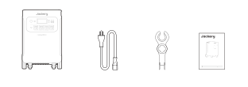Model :JHP-5000C<strong>USER</strong> <strong>MANUAL</strong>Jackery HomePower 5000 Plus<strong>CONTACT</strong> <strong>US</strong> <strong>:</strong><strong>1-888-502-2236</strong> (US)hello@jackery.comwww.jackery.comJackery HomePower 5000 PlusAC Charging CableMC4 WrenchUser Manual

</figure>

<figure class="hb-reference-figure hb-base-art-live-copy" data-component-id="HB-SPECIAL-REFERENCE-FIGURE" data-reference-id="package-battery" data-source-fragment-sha256="b0a1ab1961fad9f87d97c96e34037340be3486009d2ab3d4dc3109e3be0cd944" data-web-base-art-ref="package-battery" data-web-presentation-mode="base-art-live-copy">

Model: JBP-5000A<strong>Sold</strong> <strong>separately</strong><strong>USER</strong> <strong>MANUAL</strong>Jackery Battery Pack 5000 Plus<strong>CONTACT</strong> <strong>US:</strong><strong>1-888-502-2236</strong> (US)hello@jackery.comwww.jackery.comJackery Battery Pack 5000 PlusExpansion CableUser Manual

</figure>

<figure class="hb-reference-figure hb-base-art-live-copy" data-component-id="HB-SPECIAL-REFERENCE-FIGURE" data-reference-id="package-sts" data-source-fragment-sha256="ffacd2f330861e27c8cca228fb8e89641701410eced1838ee6a1776b12cc680a" data-web-base-art-ref="package-sts" data-web-presentation-mode="base-art-live-copy">

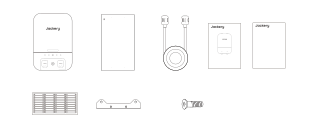M6 tapped holeM6 tapped holeMarking holeMarking holeUpwardA scale of 1:1Unit: mmModel: JA-TS02AQuick GuideHomePower Energy SystemSmart Transfer SwitchAC1GRIDIOTERRORAC2Smart Transfer SwitchPOWERPAUSE/RESUMEUSER MANUALAC1GRIDIOTERRORAC2Jackery Smart Transfer Switch<strong>Contact</strong> <strong>us:</strong>hello@jackery.comVersion: JAK-UM-V1.01-888-502-2236(US)POWERMarking holeMarking holePAUSE/RESUMEM6 tapped holeM6 tapped holeJackery Smart Transfer SwitchMarking-off TemplatePower Input/OutputUser ManualQuick GuideCable<strong>Sold</strong> <strong>separately</strong>2*Wall Bracket4*M4 Phillips Flat Head ScrewCircuit Label(secure wall brackets to Smart Transfer Switch)

</figure>

<strong>JACKERY INC.</strong>

5310 Bunche Dr., Fremont, CA 94538-8301

<strong>1-888-502-2236</strong> (US)

hello@jackery.com

www.jackery.com

