<style>
/* Native figure geometry only. Shared Web theme owns headings/tables/callouts. */
.native-figure { max-width:760px; margin:1rem auto; min-width:0; }
.native-figure .hb-reference-figure { margin:0; max-width:none; }
#furo-main-content .native-figure img { width:100% !important; height:auto !important; max-height:none; }

.native-dense {max-width:780px;}
.native-lcd-map {max-width:680px;}
#furo-main-content .native-figure .hb-reference-live-label {font-size:1.75cqw;line-height:1;align-items:flex-start;justify-content:flex-start;text-align:left;padding:.1cqw;}
.native-figure .hb-reference-live-label > span {width:100%;}
.native-overview-front .hb-reference-live-label,.native-overview-left .hb-reference-live-label,.native-overview-right .hb-reference-live-label {font-size:1.55cqw!important;}
.native-figure .hb-reference-live-label strong {font-weight:700;}
.native-operation {border:1px solid var(--hb-line-soft);border-radius:var(--hb-panel-radius);}
.native-inbox-main {max-width:180px;}
.native-app-add {max-width:480px;}
.native-app-results {max-width:700px;}
.native-lcd-side {display:grid;grid-template-columns:1fr 1.45fr;gap:1rem;align-items:stretch;}
.native-lcd-side .native-figure {margin:0;}
.native-lcd-side > .native-figure img {height:100%!important;object-fit:contain;}
.native-figure .hb-reference-live-pill {border-radius:.8cqw;}
@media(max-width:760px){
 .native-dense{overflow-x:auto;padding-bottom:.4rem;}
 .native-dense > .hb-reference-figure{min-width:680px;}
 .native-lcd-side{display:block;}
 .native-lcd-side > .native-figure{max-width:330px;margin:0 auto 1rem;}
}

.native-figure .hb-reference-live-label {white-space:nowrap;}

.native-inline-plus{display:inline-grid;place-items:center;width:1.1em;height:1.1em;border-radius:50%;background:#444;color:#fff;line-height:1;font-weight:700;vertical-align:baseline;}
.native-lcd-note{font-weight:400;font-size:.92em;}

/* Source speech tails are CSS shapes, never leftover blank artwork. */
.native-power .hb-reference-art-panel::after,.native-ups .hb-reference-art-panel::after,.native-sts-connect .hb-reference-art-panel::after {content:"";position:absolute;z-index:1;pointer-events:none;width:5.9%;height:5.5%;background:#f2f2f3;clip-path:polygon(50% 0,100% 100%,0 100%);}
.native-power .hb-reference-art-panel::after{left:45.36%;top:53.65%;width:4.61%;height:4.87%;clip-path:polygon(47.13% 0,100% 100%,0 100%);}
.native-ups .hb-reference-art-panel::after{left:40.60%;top:65.72%;width:5.82%;height:4.95%;clip-path:polygon(47.13% 0,100% 100%,0 100%);}
.native-sts-connect .hb-reference-art-panel::after{left:40.64%;top:33.16%;width:5.82%;height:5.77%;background:#fff;clip-path:polygon(0 0,100% 0,47.13% 100%);}
.native-package-battery,.native-package-sts{border-style:dashed;border-radius:0;}
/* Source-derived label geometry */
html[lang="fr"] .native-overview-front [data-source-line="0"] {font-size:2.2082cqw!important;}
html[lang="fr"] .native-overview-front [data-source-line="1"] {font-size:2.2082cqw!important;}
html[lang="fr"] .native-overview-front [data-source-line="2"] {font-size:2.2082cqw!important;}
html[lang="fr"] .native-overview-front [data-source-line="3"] {font-size:2.2082cqw!important;}
html[lang="fr"] .native-overview-front [data-source-line="4"] {font-size:2.2082cqw!important;}
html[lang="fr"] .native-overview-front [data-source-line="5"] {font-size:1.5773cqw!important;}
html[lang="fr"] .native-overview-front [data-source-line="6"] {font-size:2.2082cqw!important;}
html[lang="fr"] .native-overview-front [data-source-line="7"] {font-size:1.5773cqw!important;}
html[lang="fr"] .native-overview-front [data-source-line="8"] {font-size:2.2082cqw!important;}
html[lang="fr"] .native-overview-front [data-source-line="9"] {font-size:2.2082cqw!important;}
html[lang="fr"] .native-overview-front [data-source-line="10"] {font-size:1.5773cqw!important;}
html[lang="fr"] .native-overview-front [data-source-line="11"] {font-size:2.2082cqw!important;}
html[lang="fr"] .native-overview-front [data-source-line="12"] {font-size:2.2082cqw!important;}
html[lang="fr"] .native-overview-front [data-source-line="13"] {font-size:1.8927cqw!important;}
html[lang="fr"] .native-overview-front [data-source-line="14"] {font-size:1.4365cqw!important;}
html[lang="fr"] .native-overview-front [data-source-line="15"] {font-size:2.2082cqw!important;}
html[lang="fr"] .native-overview-front [data-source-line="16"] {font-size:1.4365cqw!important;}
html[lang="fr"] .native-overview-front [data-source-line="17"] {font-size:1.4365cqw!important;}
html[lang="fr"] .native-overview-front [data-source-line="18"] {font-size:2.2082cqw!important;}
html[lang="fr"] .native-overview-front [data-source-line="19"] {font-size:1.4365cqw!important;}
html[lang="fr"] .native-overview-front [data-source-line="20"] {font-size:1.8927cqw!important;}
html[lang="fr"] .native-overview-front [data-source-line="21"] {font-size:1.8927cqw!important;}
html[lang="fr"] .native-overview-front [data-source-line="22"] {font-size:1.5773cqw!important;}
html[lang="fr"] .native-overview-front [data-source-line="23"] {font-size:1.5773cqw!important;}
html[lang="fr"] .native-overview-front [data-source-line="24"] {font-size:1.5773cqw!important;}
html[lang="fr"] .native-overview-front [data-source-line="25"] {font-size:1.5773cqw!important;}
html[lang="fr"] .native-overview-front [data-source-line="26"] {font-size:1.5773cqw!important;}
html[lang="fr"] .native-overview-front [data-source-line="27"] {font-size:1.5773cqw!important;}
html[lang="fr"] .native-overview-left [data-source-line="0"] {font-size:2.2082cqw!important;}
html[lang="fr"] .native-overview-left [data-source-line="1"] {font-size:2.2082cqw!important;}
html[lang="fr"] .native-overview-left [data-source-line="2"] {font-size:1.8927cqw!important;}
html[lang="fr"] .native-overview-left [data-source-line="3"] {font-size:1.6719cqw!important;}
html[lang="fr"] .native-overview-left [data-source-line="4"] {font-size:1.6719cqw!important;}
html[lang="fr"] .native-overview-left [data-source-line="5"] {font-size:2.2082cqw!important;}
html[lang="fr"] .native-overview-left [data-source-line="6"] {font-size:1.8927cqw!important;}
html[lang="fr"] .native-overview-left [data-source-line="7"] {font-size:1.6719cqw!important;}
html[lang="fr"] .native-overview-left [data-source-line="8"] {font-size:1.6719cqw!important;}
html[lang="fr"] .native-overview-left [data-source-line="9"] {font-size:2.2082cqw!important;}
html[lang="fr"] .native-overview-left [data-source-line="10"] {font-size:1.8927cqw!important;}
html[lang="fr"] .native-overview-left [data-source-line="11"] {font-size:1.6719cqw!important;}
html[lang="fr"] .native-overview-left [data-source-line="12"] {font-size:1.6719cqw!important;}
html[lang="fr"] .native-overview-left [data-source-line="13"] {font-size:2.2082cqw!important;}
html[lang="fr"] .native-overview-left [data-source-line="14"] {font-size:1.6719cqw!important;}
html[lang="fr"] .native-overview-left [data-source-line="15"] {font-size:1.6719cqw!important;}
html[lang="fr"] .native-overview-left [data-source-line="16"] {font-size:2.2082cqw!important;}
html[lang="fr"] .native-overview-left [data-source-line="17"] {font-size:2.2082cqw!important;}
html[lang="fr"] .native-overview-right [data-source-line="0"] {font-size:2.2082cqw!important;}
html[lang="fr"] .native-overview-right [data-source-line="1"] {font-size:1.5773cqw!important;}
html[lang="fr"] .native-overview-right [data-source-line="2"] {font-size:2.2082cqw!important;}
html[lang="fr"] .native-overview-right [data-source-line="3"] {font-size:1.5773cqw!important;}
html[lang="fr"] .native-overview-right [data-source-line="4"] {font-size:1.5773cqw!important;}
html[lang="fr"] .native-overview-right [data-source-line="5"] {font-size:2.2082cqw!important;}
html[lang="fr"] .native-overview-right [data-source-line="6"] {font-size:1.5773cqw!important;}
html[lang="fr"] .native-overview-right [data-source-line="7"] {font-size:2.2082cqw!important;}
html[lang="fr"] .native-overview-right [data-source-line="8"] {font-size:1.5773cqw!important;}
html[lang="fr"] .native-overview-right [data-source-line="9"] {font-size:1.5773cqw!important;}
html[lang="fr"] .native-overview-right [data-source-line="10"] {font-size:2.2082cqw!important;}
html[lang="fr"] .native-overview-right [data-source-line="11"] {font-size:1.5773cqw!important;}
html[lang="fr"] .native-overview-right [data-source-line="12"] {font-size:2.2082cqw!important;}
html[lang="fr"] .native-overview-right [data-source-line="13"] {font-size:1.5773cqw!important;}
html[lang="fr"] .native-overview-right [data-source-line="14"] {font-size:2.2082cqw!important;}
html[lang="fr"] .native-lcd-map [data-source-line="0"] {font-size:2.1995cqw!important;}
html[lang="fr"] .native-lcd-map [data-source-line="1"] {font-size:2.1995cqw!important;}
html[lang="fr"] .native-lcd-map [data-source-line="2"] {font-size:2.1995cqw!important;}
html[lang="fr"] .native-lcd-map [data-source-line="3"] {font-size:2.1995cqw!important;}
html[lang="fr"] .native-lcd-map [data-source-line="4"] {font-size:2.1995cqw!important;}
html[lang="fr"] .native-lcd-map [data-source-line="5"] {font-size:2.1995cqw!important;}
html[lang="fr"] .native-lcd-map [data-source-line="6"] {font-size:2.1995cqw!important;}
html[lang="fr"] .native-lcd-map [data-source-line="7"] {font-size:2.1995cqw!important;}
html[lang="fr"] .native-lcd-map [data-source-line="8"] {font-size:2.1995cqw!important;}
html[lang="fr"] .native-lcd-map [data-source-line="9"] {font-size:2.1995cqw!important;}
html[lang="fr"] .native-lcd-map [data-source-line="10"] {font-size:2.1995cqw!important;}
html[lang="fr"] .native-lcd-map [data-source-line="11"] {font-size:2.1995cqw!important;}
html[lang="fr"] .native-lcd-map [data-source-line="12"] {font-size:2.1995cqw!important;}
html[lang="fr"] .native-lcd-map [data-source-line="13"] {font-size:2.1995cqw!important;}
html[lang="fr"] .native-lcd-map [data-source-line="14"] {font-size:2.1995cqw!important;}
html[lang="fr"] .native-lcd-map [data-source-line="15"] {font-size:2.1995cqw!important;}
html[lang="fr"] .native-lcd-map [data-source-line="16"] {font-size:2.1995cqw!important;}
html[lang="fr"] .native-lcd-map [data-source-line="17"] {font-size:2.1995cqw!important;}
html[lang="fr"] .native-lcd-map [data-source-line="18"] {font-size:2.1995cqw!important;}
html[lang="fr"] .native-lcd-map [data-source-line="19"] {font-size:2.1995cqw!important;}
html[lang="fr"] .native-lcd-map [data-source-line="20"] {font-size:2.1995cqw!important;}
html[lang="fr"] .native-lcd-map [data-source-line="21"] {font-size:2.1995cqw!important;}
html[lang="fr"] .native-lcd-map [data-source-line="22"] {font-size:2.1995cqw!important;}
html[lang="fr"] .native-power [data-source-line="0"] {font-size:3.1847cqw!important;}
html[lang="fr"] .native-power [data-source-line="1"] {font-size:1.9108cqw!important;}
html[lang="fr"] .native-power [data-source-line="2"] {font-size:3.1847cqw!important;}
html[lang="fr"] .native-power [data-source-line="3"] {font-size:1.9108cqw!important;}
html[lang="fr"] .native-power [data-source-line="4"] {font-size:1.9108cqw!important;}
html[lang="fr"] .native-power [data-source-line="5"] {font-size:2.2293cqw!important;}
html[lang="fr"] .native-power [data-source-line="6"] {font-size:1.9108cqw!important;}
html[lang="fr"] .native-power [data-source-line="6"] {padding:1.6703cqw 1.7347cqw!important;}
html[lang="fr"] .native-power [data-source-line="6"] {border-radius:1.9108cqw!important;}
html[lang="fr"] .native-ac-output [data-source-line="0"] {font-size:2.1019cqw!important;}
html[lang="fr"] .native-ac-output [data-source-line="0"] {padding:0.8120cqw 1.7486cqw!important;}
html[lang="fr"] .native-ac-output [data-source-line="0"] {border-radius:1.9108cqw!important;}
html[lang="fr"] .native-ac-output [data-source-line="1"] {font-size:3.1847cqw!important;}
html[lang="fr"] .native-ac-output [data-source-line="2"] {font-size:1.9108cqw!important;}
html[lang="fr"] .native-ac-output [data-source-line="3"] {font-size:3.1847cqw!important;}
html[lang="fr"] .native-ac-output [data-source-line="4"] {font-size:1.9108cqw!important;}
html[lang="fr"] .native-usb-output [data-source-line="0"] {font-size:1.9108cqw!important;}
html[lang="fr"] .native-usb-output [data-source-line="0"] {padding:0.7966cqw 1.7485cqw!important;}
html[lang="fr"] .native-usb-output [data-source-line="0"] {border-radius:1.9108cqw!important;}
html[lang="fr"] .native-usb-output [data-source-line="1"] {font-size:2.5478cqw!important;}
html[lang="fr"] .native-usb-output [data-source-line="2"] {font-size:1.9108cqw!important;}
html[lang="fr"] .native-usb-output [data-source-line="3"] {font-size:2.5478cqw!important;}
html[lang="fr"] .native-usb-output [data-source-line="4"] {font-size:1.9108cqw!important;}
html[lang="fr"] .native-dc-output [data-source-line="0"] {font-size:1.9108cqw!important;}
html[lang="fr"] .native-dc-output [data-source-line="0"] {padding:0.7966cqw 1.7485cqw!important;}
html[lang="fr"] .native-dc-output [data-source-line="0"] {border-radius:1.9108cqw!important;}
html[lang="fr"] .native-dc-output [data-source-line="1"] {font-size:2.5478cqw!important;}
html[lang="fr"] .native-dc-output [data-source-line="2"] {font-size:1.9108cqw!important;}
html[lang="fr"] .native-dc-output [data-source-line="3"] {font-size:2.5478cqw!important;}
html[lang="fr"] .native-dc-output [data-source-line="4"] {font-size:1.9108cqw!important;}
html[lang="fr"] .native-ups [data-source-line="0"] {font-size:1.9108cqw!important;}
html[lang="fr"] .native-ups [data-source-line="0"] {padding:2.8392cqw 2.6258cqw!important;}
html[lang="fr"] .native-ups [data-source-line="0"] {border-radius:1.9108cqw!important;}
html[lang="fr"] .native-battery-packs [data-source-line="0"] {font-size:1.9355cqw!important;}
html[lang="fr"] .native-battery-packs [data-source-line="1"] {font-size:1.9355cqw!important;}
html[lang="fr"] .native-sts-connect [data-source-line="0"] {font-size:1.9090cqw!important;}
html[lang="fr"] .native-sts-connect [data-source-line="0"] {padding:2.5038cqw 2.4362cqw!important;}
html[lang="fr"] .native-sts-connect [data-source-line="0"] {border-radius:1.9090cqw!important;}
html[lang="fr"] .native-sts-connect [data-source-line="1"] {font-size:1.9090cqw!important;}
html[lang="fr"] .native-sts-connect [data-source-line="2"] {font-size:1.9090cqw!important;}
html[lang="fr"] .native-sts-connect [data-source-line="3"] {font-size:1.9090cqw!important;}
html[lang="fr"] .native-sts-connect [data-source-line="4"] {font-size:1.9090cqw!important;}
html[lang="fr"] .native-sts-connect [data-source-line="5"] {font-size:1.9090cqw!important;}
html[lang="fr"] .native-sts-connect [data-source-line="6"] {font-size:1.9090cqw!important;}
html[lang="fr"] .native-sts-connect [data-source-line="7"] {font-size:1.9090cqw!important;}
html[lang="fr"] .native-sts-connect [data-source-line="8"] {font-size:1.9090cqw!important;}
html[lang="fr"] .native-sts-connect [data-source-line="9"] {font-size:1.9090cqw!important;}
html[lang="fr"] .native-ac-charge [data-source-line="0"] {font-size:1.9096cqw!important;}
html[lang="fr"] .native-ac-charge [data-source-line="1"] {font-size:1.9096cqw!important;}
html[lang="fr"] .native-ac-charge [data-source-line="2"] {font-size:1.9096cqw!important;}
html[lang="fr"] .native-sts-charge [data-source-line="0"] {font-size:1.9102cqw!important;}
html[lang="fr"] .native-sts-charge [data-source-line="1"] {font-size:1.9102cqw!important;}
html[lang="fr"] .native-sts-charge [data-source-line="2"] {font-size:1.9102cqw!important;}
html[lang="fr"] .native-sts-charge [data-source-line="3"] {font-size:1.9102cqw!important;}
html[lang="fr"] .native-sts-charge [data-source-line="4"] {font-size:1.9102cqw!important;}
html[lang="fr"] .native-sts-charge [data-source-line="5"] {font-size:1.9102cqw!important;}
html[lang="fr"] .native-sts-charge [data-source-line="6"] {font-size:1.9102cqw!important;}
html[lang="fr"] .native-sts-charge [data-source-line="7"] {font-size:1.9102cqw!important;}
html[lang="fr"] .native-sts-charge [data-source-line="8"] {font-size:0.5308cqw!important;}
html[lang="fr"] .native-sts-charge [data-source-line="9"] {font-size:1.9102cqw!important;}
html[lang="fr"] .native-low-pv-500 [data-source-line="0"] {font-size:1.4327cqw!important;}
html[lang="fr"] .native-low-pv-500 [data-source-line="1"] {font-size:1.6243cqw!important;}
html[lang="fr"] .native-low-pv-200 [data-source-line="0"] {font-size:1.4327cqw!important;}
html[lang="fr"] .native-low-pv-200 [data-source-line="1"] {font-size:1.4327cqw!important;}
html[lang="fr"] .native-low-pv-200 [data-source-line="2"] {font-size:1.6243cqw!important;}
html[lang="fr"] .native-high-pv [data-source-line="0"] {font-size:1.9507cqw!important;}
html[lang="fr"] .native-high-pv [data-source-line="1"] {font-size:1.9507cqw!important;}
html[lang="fr"] .native-high-pv-lock [data-source-line="0"] {font-size:2.5592cqw!important;}
html[lang="fr"] .native-high-pv-lock [data-source-line="1"] {font-size:2.5592cqw!important;}
html[lang="fr"] .native-high-pv-lock [data-source-line="2"] {font-size:1.9194cqw!important;}
html[lang="fr"] .native-high-pv-lock [data-source-line="3"] {font-size:1.9194cqw!important;}
html[lang="fr"] .native-high-pv-lock [data-source-line="4"] {font-size:1.9194cqw!important;}
html[lang="fr"] .native-high-pv-lock [data-source-line="5"] {font-size:1.9194cqw!important;}
html[lang="fr"] .native-high-pv-lock [data-source-line="6"] {font-size:1.9194cqw!important;}
html[lang="fr"] .native-car [data-source-line="0"] {font-size:2.2283cqw!important;}
html[lang="fr"] .native-car [data-source-line="1"] {font-size:1.5917cqw!important;}
html[lang="fr"] .native-car [data-source-line="1"] {padding:1.1709cqw 1.0996cqw!important;}
html[lang="fr"] .native-car [data-source-line="1"] {border-radius:1.9100cqw!important;}
html[lang="fr"] .native-app-add [data-source-line="0"] {font-size:3.1735cqw!important;}
html[lang="fr"] .native-app-add [data-source-line="1"] {font-size:3.1735cqw!important;}
html[lang="fr"] .native-app-control [data-source-line="0"] {font-size:1.9887cqw!important;}
html[lang="fr"] .native-app-control [data-source-line="1"] {font-size:1.9887cqw!important;}
html[lang="fr"] .native-app-control [data-source-line="2"] {font-size:1.9887cqw!important;}
html[lang="fr"] .native-app-control [data-source-line="3"] {font-size:1.9887cqw!important;}
html[lang="fr"] .native-app-control [data-source-line="4"] {font-size:1.9887cqw!important;}
html[lang="fr"] .native-app-control [data-source-line="5"] {font-size:1.9887cqw!important;}
html[lang="fr"] .native-app-control [data-source-line="6"] {font-size:1.9887cqw!important;}
html[lang="fr"] .native-app-control [data-source-line="7"] {font-size:1.9887cqw!important;}
html[lang="fr"] .native-app-results [data-source-line="0"] {font-size:2.0509cqw!important;}
html[lang="fr"] .native-app-results [data-source-line="1"] {font-size:2.0509cqw!important;}
html[lang="fr"] .native-app-results [data-source-line="2"] {font-size:2.0509cqw!important;}
html[lang="fr"] .native-ess [data-source-line="0"] {font-size:1.9374cqw!important;}
html[lang="fr"] .native-ess [data-source-line="1"] {font-size:1.9374cqw!important;}
html[lang="fr"] .native-package-host [data-source-line="0"] {font-size:0.1680cqw!important;}
html[lang="fr"] .native-package-host [data-source-line="1"] {font-size:0.7963cqw!important;}
html[lang="fr"] .native-package-host [data-source-line="2"] {font-size:0.3676cqw!important;}
html[lang="fr"] .native-package-host [data-source-line="3"] {font-size:0.2471cqw!important;}
html[lang="fr"] .native-package-host [data-source-line="4"] {font-size:0.5295cqw!important;}
html[lang="fr"] .native-package-host [data-source-line="5"] {font-size:0.1667cqw!important;}
html[lang="fr"] .native-package-host [data-source-line="6"] {font-size:0.1667cqw!important;}
html[lang="fr"] .native-package-host [data-source-line="7"] {font-size:1.6015cqw!important;}
html[lang="fr"] .native-package-host [data-source-line="8"] {font-size:1.6015cqw!important;}
html[lang="fr"] .native-package-host [data-source-line="9"] {font-size:1.6015cqw!important;}
html[lang="fr"] .native-package-host [data-source-line="10"] {font-size:1.6015cqw!important;}
html[lang="fr"] .native-package-battery [data-source-line="0"] {font-size:0.1654cqw!important;}
html[lang="fr"] .native-package-battery [data-source-line="1"] {font-size:1.9396cqw!important;}
html[lang="fr"] .native-package-battery [data-source-line="1"] {padding:2.8465cqw 10.5169cqw!important;}
html[lang="fr"] .native-package-battery [data-source-line="1"] {border-radius:4.8046cqw!important;}
html[lang="fr"] .native-package-battery [data-source-line="1"]::after {content:"";position:absolute;left:8%;top:12%;width:33%;height:76%;background:url("assets/sold-separately-cart.svg") center/contain no-repeat;}
html[lang="fr"] .native-package-battery [data-source-line="2"] {font-size:0.8441cqw!important;}
html[lang="fr"] .native-package-battery [data-source-line="3"] {font-size:0.3867cqw!important;}
html[lang="fr"] .native-package-battery [data-source-line="4"] {font-size:0.2432cqw!important;}
html[lang="fr"] .native-package-battery [data-source-line="5"] {font-size:0.5212cqw!important;}
html[lang="fr"] .native-package-battery [data-source-line="6"] {font-size:0.1641cqw!important;}
html[lang="fr"] .native-package-battery [data-source-line="7"] {font-size:0.1641cqw!important;}
html[lang="fr"] .native-package-battery [data-source-line="8"] {font-size:1.6015cqw!important;}
html[lang="fr"] .native-package-battery [data-source-line="9"] {font-size:1.6015cqw!important;}
html[lang="fr"] .native-package-battery [data-source-line="10"] {font-size:1.6015cqw!important;}
html[lang="fr"] .native-package-sts [data-source-line="0"] {font-size:0.1631cqw!important;}
html[lang="fr"] .native-package-sts [data-source-line="1"] {font-size:0.1631cqw!important;}
html[lang="fr"] .native-package-sts [data-source-line="2"] {font-size:0.1631cqw!important;}
html[lang="fr"] .native-package-sts [data-source-line="3"] {font-size:0.1631cqw!important;}
html[lang="fr"] .native-package-sts [data-source-line="4"] {font-size:0.2548cqw!important;}
html[lang="fr"] .native-package-sts [data-source-line="5"] {font-size:0.2038cqw!important;}
html[lang="fr"] .native-package-sts [data-source-line="6"] {font-size:0.2038cqw!important;}
html[lang="fr"] .native-package-sts [data-source-line="7"] {font-size:0.1960cqw!important;}
html[lang="fr"] .native-package-sts [data-source-line="8"] {font-size:0.9239cqw!important;}
html[lang="fr"] .native-package-sts [data-source-line="9"] {font-size:0.5618cqw!important;}
html[lang="fr"] .native-package-sts [data-source-line="10"] {font-size:0.0944cqw!important;}
html[lang="fr"] .native-package-sts [data-source-line="11"] {font-size:0.0492cqw!important;}
html[lang="fr"] .native-package-sts [data-source-line="12"] {font-size:0.0492cqw!important;}
html[lang="fr"] .native-package-sts [data-source-line="13"] {font-size:0.0492cqw!important;}
html[lang="fr"] .native-package-sts [data-source-line="14"] {font-size:0.0492cqw!important;}
html[lang="fr"] .native-package-sts [data-source-line="15"] {font-size:0.0492cqw!important;}
html[lang="fr"] .native-package-sts [data-source-line="16"] {font-size:0.2794cqw!important;}
html[lang="fr"] .native-package-sts [data-source-line="17"] {font-size:0.0492cqw!important;}
html[lang="fr"] .native-package-sts [data-source-line="18"] {font-size:0.0492cqw!important;}
html[lang="fr"] .native-package-sts [data-source-line="19"] {font-size:0.1458cqw!important;}
html[lang="fr"] .native-package-sts [data-source-line="20"] {font-size:0.1458cqw!important;}
html[lang="fr"] .native-package-sts [data-source-line="21"] {font-size:0.1458cqw!important;}
html[lang="fr"] .native-package-sts [data-source-line="22"] {font-size:0.1458cqw!important;}
html[lang="fr"] .native-package-sts [data-source-line="23"] {font-size:0.1458cqw!important;}
html[lang="fr"] .native-package-sts [data-source-line="24"] {font-size:0.8885cqw!important;}
html[lang="fr"] .native-package-sts [data-source-line="25"] {font-size:0.4152cqw!important;}
html[lang="fr"] .native-package-sts [data-source-line="26"] {font-size:0.1960cqw!important;}
html[lang="fr"] .native-package-sts [data-source-line="27"] {font-size:0.1960cqw!important;}
html[lang="fr"] .native-package-sts [data-source-line="28"] {font-size:0.1458cqw!important;}
html[lang="fr"] .native-package-sts [data-source-line="29"] {font-size:0.1960cqw!important;}
html[lang="fr"] .native-package-sts [data-source-line="30"] {font-size:0.1960cqw!important;}
html[lang="fr"] .native-package-sts [data-source-line="31"] {font-size:0.1631cqw!important;}
html[lang="fr"] .native-package-sts [data-source-line="32"] {font-size:0.1631cqw!important;}
html[lang="fr"] .native-package-sts [data-source-line="33"] {font-size:0.1458cqw!important;}
html[lang="fr"] .native-package-sts [data-source-line="34"] {font-size:0.1631cqw!important;}
html[lang="fr"] .native-package-sts [data-source-line="35"] {font-size:0.1631cqw!important;}
html[lang="fr"] .native-package-sts [data-source-line="36"] {font-size:1.6015cqw!important;}
html[lang="fr"] .native-package-sts [data-source-line="37"] {font-size:1.6015cqw!important;}
html[lang="fr"] .native-package-sts [data-source-line="38"] {font-size:1.6015cqw!important;}
html[lang="fr"] .native-package-sts [data-source-line="39"] {font-size:1.6015cqw!important;}
html[lang="fr"] .native-package-sts [data-source-line="40"] {font-size:1.6015cqw!important;}
html[lang="fr"] .native-package-sts [data-source-line="41"] {font-size:1.6015cqw!important;}
html[lang="fr"] .native-package-sts [data-source-line="42"] {font-size:1.9396cqw!important;}
html[lang="fr"] .native-package-sts [data-source-line="42"] {padding:2.8466cqw 10.5169cqw!important;}
html[lang="fr"] .native-package-sts [data-source-line="42"] {border-radius:4.8046cqw!important;}
html[lang="fr"] .native-package-sts [data-source-line="42"]::after {content:"";position:absolute;left:8%;top:12%;width:33%;height:76%;background:url("assets/sold-separately-cart.svg") center/contain no-repeat;}
html[lang="fr"] .native-package-sts [data-source-line="43"] {font-size:1.6015cqw!important;}
html[lang="fr"] .native-package-sts [data-source-line="44"] {font-size:1.6015cqw!important;}
html[lang="fr"] .native-package-sts [data-source-line="45"] {font-size:1.6015cqw!important;}
html[lang="fr"] .native-package-sts [data-source-line="46"] {font-size:1.6015cqw!important;}
html[lang="fr"] .native-package-sts [data-source-line="47"] {font-size:1.6015cqw!important;}
html[lang="en"] .native-overview-front [data-source-line="0"] {font-size:2.2082cqw!important;}
html[lang="en"] .native-overview-front [data-source-line="1"] {font-size:2.2082cqw!important;}
html[lang="en"] .native-overview-front [data-source-line="2"] {font-size:2.2082cqw!important;}
html[lang="en"] .native-overview-front [data-source-line="3"] {font-size:2.2082cqw!important;}
html[lang="en"] .native-overview-front [data-source-line="4"] {font-size:1.5773cqw!important;}
html[lang="en"] .native-overview-front [data-source-line="5"] {font-size:2.2082cqw!important;}
html[lang="en"] .native-overview-front [data-source-line="6"] {font-size:2.2082cqw!important;}
html[lang="en"] .native-overview-front [data-source-line="7"] {font-size:1.5773cqw!important;}
html[lang="en"] .native-overview-front [data-source-line="8"] {font-size:2.2082cqw!important;}
html[lang="en"] .native-overview-front [data-source-line="9"] {font-size:1.5773cqw!important;}
html[lang="en"] .native-overview-front [data-source-line="10"] {font-size:2.2082cqw!important;}
html[lang="en"] .native-overview-front [data-source-line="11"] {font-size:2.2082cqw!important;}
html[lang="en"] .native-overview-front [data-source-line="12"] {font-size:1.8927cqw!important;}
html[lang="en"] .native-overview-front [data-source-line="13"] {font-size:1.5773cqw!important;}
html[lang="en"] .native-overview-front [data-source-line="14"] {font-size:1.5773cqw!important;}
html[lang="en"] .native-overview-front [data-source-line="15"] {font-size:1.5773cqw!important;}
html[lang="en"] .native-overview-front [data-source-line="16"] {font-size:2.2082cqw!important;}
html[lang="en"] .native-overview-front [data-source-line="17"] {font-size:1.5773cqw!important;}
html[lang="en"] .native-overview-front [data-source-line="18"] {font-size:1.8927cqw!important;}
html[lang="en"] .native-overview-front [data-source-line="19"] {font-size:1.8927cqw!important;}
html[lang="en"] .native-overview-front [data-source-line="20"] {font-size:1.5773cqw!important;}
html[lang="en"] .native-overview-front [data-source-line="21"] {font-size:1.5773cqw!important;}
html[lang="en"] .native-overview-front [data-source-line="22"] {font-size:1.5773cqw!important;}
html[lang="en"] .native-overview-front [data-source-line="23"] {font-size:1.5773cqw!important;}
html[lang="en"] .native-overview-left [data-source-line="0"] {font-size:2.2082cqw!important;}
html[lang="en"] .native-overview-left [data-source-line="1"] {font-size:2.2082cqw!important;}
html[lang="en"] .native-overview-left [data-source-line="2"] {font-size:1.8927cqw!important;}
html[lang="en"] .native-overview-left [data-source-line="3"] {font-size:1.6719cqw!important;}
html[lang="en"] .native-overview-left [data-source-line="4"] {font-size:1.6719cqw!important;}
html[lang="en"] .native-overview-left [data-source-line="5"] {font-size:2.2082cqw!important;}
html[lang="en"] .native-overview-left [data-source-line="6"] {font-size:1.8927cqw!important;}
html[lang="en"] .native-overview-left [data-source-line="7"] {font-size:1.6719cqw!important;}
html[lang="en"] .native-overview-left [data-source-line="8"] {font-size:1.6719cqw!important;}
html[lang="en"] .native-overview-left [data-source-line="9"] {font-size:2.2082cqw!important;}
html[lang="en"] .native-overview-left [data-source-line="10"] {font-size:1.8927cqw!important;}
html[lang="en"] .native-overview-left [data-source-line="11"] {font-size:1.6719cqw!important;}
html[lang="en"] .native-overview-left [data-source-line="12"] {font-size:1.6719cqw!important;}
html[lang="en"] .native-overview-left [data-source-line="13"] {font-size:2.2082cqw!important;}
html[lang="en"] .native-overview-left [data-source-line="14"] {font-size:1.5773cqw!important;}
html[lang="en"] .native-overview-left [data-source-line="15"] {font-size:1.5773cqw!important;}
html[lang="en"] .native-overview-left [data-source-line="16"] {font-size:2.2082cqw!important;}
html[lang="en"] .native-overview-left [data-source-line="17"] {font-size:2.2082cqw!important;}
html[lang="en"] .native-overview-right [data-source-line="0"] {font-size:2.2082cqw!important;}
html[lang="en"] .native-overview-right [data-source-line="1"] {font-size:1.5773cqw!important;}
html[lang="en"] .native-overview-right [data-source-line="2"] {font-size:2.2082cqw!important;}
html[lang="en"] .native-overview-right [data-source-line="3"] {font-size:1.5773cqw!important;}
html[lang="en"] .native-overview-right [data-source-line="4"] {font-size:1.5773cqw!important;}
html[lang="en"] .native-overview-right [data-source-line="5"] {font-size:2.2082cqw!important;}
html[lang="en"] .native-overview-right [data-source-line="6"] {font-size:1.5773cqw!important;}
html[lang="en"] .native-overview-right [data-source-line="7"] {font-size:2.2082cqw!important;}
html[lang="en"] .native-overview-right [data-source-line="8"] {font-size:1.5773cqw!important;}
html[lang="en"] .native-overview-right [data-source-line="9"] {font-size:1.5773cqw!important;}
html[lang="en"] .native-overview-right [data-source-line="10"] {font-size:2.2082cqw!important;}
html[lang="en"] .native-overview-right [data-source-line="11"] {font-size:1.5773cqw!important;}
html[lang="en"] .native-overview-right [data-source-line="12"] {font-size:2.2082cqw!important;}
html[lang="en"] .native-overview-right [data-source-line="13"] {font-size:1.5773cqw!important;}
html[lang="en"] .native-overview-right [data-source-line="14"] {font-size:2.2082cqw!important;}
html[lang="en"] .native-lcd-map [data-source-line="0"] {font-size:2.1995cqw!important;}
html[lang="en"] .native-lcd-map [data-source-line="1"] {font-size:2.1995cqw!important;}
html[lang="en"] .native-lcd-map [data-source-line="2"] {font-size:2.1995cqw!important;}
html[lang="en"] .native-lcd-map [data-source-line="3"] {font-size:2.1995cqw!important;}
html[lang="en"] .native-lcd-map [data-source-line="4"] {font-size:2.1995cqw!important;}
html[lang="en"] .native-lcd-map [data-source-line="5"] {font-size:2.1995cqw!important;}
html[lang="en"] .native-lcd-map [data-source-line="6"] {font-size:2.1995cqw!important;}
html[lang="en"] .native-lcd-map [data-source-line="7"] {font-size:2.1995cqw!important;}
html[lang="en"] .native-lcd-map [data-source-line="8"] {font-size:2.1995cqw!important;}
html[lang="en"] .native-lcd-map [data-source-line="9"] {font-size:2.1995cqw!important;}
html[lang="en"] .native-lcd-map [data-source-line="10"] {font-size:2.1995cqw!important;}
html[lang="en"] .native-lcd-map [data-source-line="11"] {font-size:2.1995cqw!important;}
html[lang="en"] .native-lcd-map [data-source-line="12"] {font-size:2.1995cqw!important;}
html[lang="en"] .native-lcd-map [data-source-line="13"] {font-size:2.1995cqw!important;}
html[lang="en"] .native-lcd-map [data-source-line="14"] {font-size:2.1995cqw!important;}
html[lang="en"] .native-lcd-map [data-source-line="15"] {font-size:2.1995cqw!important;}
html[lang="en"] .native-lcd-map [data-source-line="16"] {font-size:2.1995cqw!important;}
html[lang="en"] .native-lcd-map [data-source-line="17"] {font-size:2.1995cqw!important;}
html[lang="en"] .native-lcd-map [data-source-line="18"] {font-size:2.1995cqw!important;}
html[lang="en"] .native-lcd-map [data-source-line="19"] {font-size:2.1995cqw!important;}
html[lang="en"] .native-lcd-map [data-source-line="20"] {font-size:2.1995cqw!important;}
html[lang="en"] .native-lcd-map [data-source-line="21"] {font-size:2.1995cqw!important;}
html[lang="en"] .native-lcd-map [data-source-line="22"] {font-size:2.1995cqw!important;}
html[lang="en"] .native-power [data-source-line="0"] {font-size:3.1847cqw!important;}
html[lang="en"] .native-power [data-source-line="1"] {font-size:1.9108cqw!important;}
html[lang="en"] .native-power [data-source-line="2"] {font-size:3.1847cqw!important;}
html[lang="en"] .native-power [data-source-line="3"] {font-size:1.9108cqw!important;}
html[lang="en"] .native-power [data-source-line="4"] {font-size:2.2293cqw!important;}
html[lang="en"] .native-power [data-source-line="5"] {font-size:1.9108cqw!important;}
html[lang="en"] .native-power [data-source-line="5"] {padding:2.3073cqw 2.8525cqw!important;}
html[lang="en"] .native-power [data-source-line="5"] {border-radius:1.9108cqw!important;}
html[lang="en"] .native-ac-output [data-source-line="0"] {font-size:2.1019cqw!important;}
html[lang="en"] .native-ac-output [data-source-line="0"] {padding:0.8120cqw 1.7485cqw!important;}
html[lang="en"] .native-ac-output [data-source-line="0"] {border-radius:1.9108cqw!important;}
html[lang="en"] .native-ac-output [data-source-line="1"] {font-size:3.1847cqw!important;}
html[lang="en"] .native-ac-output [data-source-line="2"] {font-size:1.9108cqw!important;}
html[lang="en"] .native-ac-output [data-source-line="3"] {font-size:3.1847cqw!important;}
html[lang="en"] .native-ac-output [data-source-line="4"] {font-size:1.9108cqw!important;}
html[lang="en"] .native-usb-output [data-source-line="0"] {font-size:1.9108cqw!important;}
html[lang="en"] .native-usb-output [data-source-line="0"] {padding:0.7966cqw 1.7483cqw!important;}
html[lang="en"] .native-usb-output [data-source-line="0"] {border-radius:1.9108cqw!important;}
html[lang="en"] .native-usb-output [data-source-line="1"] {font-size:2.8413cqw!important;}
html[lang="en"] .native-usb-output [data-source-line="2"] {font-size:1.9108cqw!important;}
html[lang="en"] .native-usb-output [data-source-line="3"] {font-size:2.8413cqw!important;}
html[lang="en"] .native-usb-output [data-source-line="4"] {font-size:1.9108cqw!important;}
html[lang="en"] .native-dc-output [data-source-line="0"] {font-size:1.9108cqw!important;}
html[lang="en"] .native-dc-output [data-source-line="0"] {padding:0.7966cqw 1.7483cqw!important;}
html[lang="en"] .native-dc-output [data-source-line="0"] {border-radius:1.9108cqw!important;}
html[lang="en"] .native-dc-output [data-source-line="1"] {font-size:2.8413cqw!important;}
html[lang="en"] .native-dc-output [data-source-line="2"] {font-size:1.9108cqw!important;}
html[lang="en"] .native-dc-output [data-source-line="3"] {font-size:2.8413cqw!important;}
html[lang="en"] .native-dc-output [data-source-line="4"] {font-size:1.9108cqw!important;}
html[lang="en"] .native-ups [data-source-line="0"] {font-size:1.9108cqw!important;}
html[lang="en"] .native-ups [data-source-line="0"] {padding:2.8390cqw 2.6258cqw!important;}
html[lang="en"] .native-ups [data-source-line="0"] {border-radius:1.9108cqw!important;}
html[lang="en"] .native-battery-packs [data-source-line="0"] {font-size:1.9355cqw!important;}
html[lang="en"] .native-battery-packs [data-source-line="1"] {font-size:1.9355cqw!important;}
html[lang="en"] .native-sts-connect [data-source-line="0"] {font-size:1.9096cqw!important;}
html[lang="en"] .native-sts-connect [data-source-line="0"] {padding:2.7857cqw 2.0619cqw!important;}
html[lang="en"] .native-sts-connect [data-source-line="0"] {border-radius:1.9096cqw!important;}
html[lang="en"] .native-sts-connect [data-source-line="1"] {font-size:1.9096cqw!important;}
html[lang="en"] .native-sts-connect [data-source-line="2"] {font-size:1.9096cqw!important;}
html[lang="en"] .native-sts-connect [data-source-line="3"] {font-size:1.9096cqw!important;}
html[lang="en"] .native-sts-connect [data-source-line="4"] {font-size:1.9096cqw!important;}
html[lang="en"] .native-sts-connect [data-source-line="5"] {font-size:1.9096cqw!important;}
html[lang="en"] .native-sts-connect [data-source-line="6"] {font-size:1.9096cqw!important;}
html[lang="en"] .native-sts-connect [data-source-line="7"] {font-size:1.9096cqw!important;}
html[lang="en"] .native-sts-connect [data-source-line="8"] {font-size:1.9096cqw!important;}
html[lang="en"] .native-ac-charge [data-source-line="0"] {font-size:1.9102cqw!important;}
html[lang="en"] .native-ac-charge [data-source-line="1"] {font-size:1.9102cqw!important;}
html[lang="en"] .native-ac-charge [data-source-line="2"] {font-size:1.9102cqw!important;}
html[lang="en"] .native-sts-charge [data-source-line="0"] {font-size:1.9090cqw!important;}
html[lang="en"] .native-sts-charge [data-source-line="1"] {font-size:1.9090cqw!important;}
html[lang="en"] .native-sts-charge [data-source-line="2"] {font-size:1.9090cqw!important;}
html[lang="en"] .native-sts-charge [data-source-line="3"] {font-size:1.9090cqw!important;}
html[lang="en"] .native-sts-charge [data-source-line="4"] {font-size:1.9090cqw!important;}
html[lang="en"] .native-sts-charge [data-source-line="5"] {font-size:1.9090cqw!important;}
html[lang="en"] .native-sts-charge [data-source-line="6"] {font-size:1.9090cqw!important;}
html[lang="en"] .native-sts-charge [data-source-line="7"] {font-size:1.9090cqw!important;}
html[lang="en"] .native-sts-charge [data-source-line="8"] {font-size:0.5305cqw!important;}
html[lang="en"] .native-sts-charge [data-source-line="9"] {font-size:1.9090cqw!important;}
html[lang="en"] .native-low-pv-500 [data-source-line="0"] {font-size:1.4327cqw!important;}
html[lang="en"] .native-low-pv-500 [data-source-line="1"] {font-size:1.4327cqw!important;}
html[lang="en"] .native-low-pv-200 [data-source-line="0"] {font-size:1.4327cqw!important;}
html[lang="en"] .native-low-pv-200 [data-source-line="1"] {font-size:1.4327cqw!important;}
html[lang="en"] .native-low-pv-200 [data-source-line="2"] {font-size:1.4327cqw!important;}
html[lang="en"] .native-high-pv [data-source-line="0"] {font-size:1.9507cqw!important;}
html[lang="en"] .native-high-pv [data-source-line="1"] {font-size:1.9507cqw!important;}
html[lang="en"] .native-high-pv-lock [data-source-line="0"] {font-size:2.5592cqw!important;}
html[lang="en"] .native-high-pv-lock [data-source-line="1"] {font-size:2.5592cqw!important;}
html[lang="en"] .native-high-pv-lock [data-source-line="2"] {font-size:1.9194cqw!important;}
html[lang="en"] .native-high-pv-lock [data-source-line="3"] {font-size:1.9194cqw!important;}
html[lang="en"] .native-high-pv-lock [data-source-line="4"] {font-size:1.9194cqw!important;}
html[lang="en"] .native-high-pv-lock [data-source-line="5"] {font-size:1.9194cqw!important;}
html[lang="en"] .native-car [data-source-line="0"] {font-size:2.2286cqw!important;}
html[lang="en"] .native-car [data-source-line="1"] {font-size:1.9899cqw!important;}
html[lang="en"] .native-car [data-source-line="1"] {padding:0.9502cqw 1.5028cqw!important;}
html[lang="en"] .native-car [data-source-line="1"] {border-radius:1.9102cqw!important;}
html[lang="en"] .native-app-add [data-source-line="0"] {font-size:3.7267cqw!important;}
html[lang="en"] .native-app-add [data-source-line="1"] {font-size:3.7267cqw!important;}
html[lang="en"] .native-app-control [data-source-line="0"] {font-size:1.9887cqw!important;}
html[lang="en"] .native-app-control [data-source-line="1"] {font-size:1.9887cqw!important;}
html[lang="en"] .native-app-control [data-source-line="2"] {font-size:1.9887cqw!important;}
html[lang="en"] .native-app-control [data-source-line="3"] {font-size:1.9887cqw!important;}
html[lang="en"] .native-app-results [data-source-line="0"] {font-size:2.3077cqw!important;}
html[lang="en"] .native-app-results [data-source-line="1"] {font-size:2.3077cqw!important;}
html[lang="en"] .native-app-results [data-source-line="2"] {font-size:2.3077cqw!important;}
html[lang="en"] .native-ess [data-source-line="0"] {font-size:1.9374cqw!important;}
html[lang="en"] .native-ess [data-source-line="1"] {font-size:1.9374cqw!important;}
html[lang="en"] .native-package-host [data-source-line="0"] {font-size:0.1680cqw!important;}
html[lang="en"] .native-package-host [data-source-line="1"] {font-size:0.7963cqw!important;}
html[lang="en"] .native-package-host [data-source-line="2"] {font-size:0.3676cqw!important;}
html[lang="en"] .native-package-host [data-source-line="3"] {font-size:0.2471cqw!important;}
html[lang="en"] .native-package-host [data-source-line="4"] {font-size:0.5295cqw!important;}
html[lang="en"] .native-package-host [data-source-line="5"] {font-size:0.1667cqw!important;}
html[lang="en"] .native-package-host [data-source-line="6"] {font-size:0.1667cqw!important;}
html[lang="en"] .native-package-host [data-source-line="7"] {font-size:1.6015cqw!important;}
html[lang="en"] .native-package-host [data-source-line="8"] {font-size:1.6015cqw!important;}
html[lang="en"] .native-package-host [data-source-line="9"] {font-size:1.6015cqw!important;}
html[lang="en"] .native-package-host [data-source-line="10"] {font-size:1.6015cqw!important;}
html[lang="en"] .native-package-battery [data-source-line="0"] {font-size:0.1654cqw!important;}
html[lang="en"] .native-package-battery [data-source-line="1"] {font-size:1.9396cqw!important;}
html[lang="en"] .native-package-battery [data-source-line="1"] {padding:2.8466cqw 10.5169cqw!important;}
html[lang="en"] .native-package-battery [data-source-line="1"] {border-radius:4.8046cqw!important;}
html[lang="en"] .native-package-battery [data-source-line="1"]::after {content:"";position:absolute;left:8%;top:12%;width:33%;height:76%;background:url("assets/sold-separately-cart.svg") center/contain no-repeat;}
html[lang="en"] .native-package-battery [data-source-line="2"] {font-size:0.8441cqw!important;}
html[lang="en"] .native-package-battery [data-source-line="3"] {font-size:0.3867cqw!important;}
html[lang="en"] .native-package-battery [data-source-line="4"] {font-size:0.2432cqw!important;}
html[lang="en"] .native-package-battery [data-source-line="5"] {font-size:0.5212cqw!important;}
html[lang="en"] .native-package-battery [data-source-line="6"] {font-size:0.1641cqw!important;}
html[lang="en"] .native-package-battery [data-source-line="7"] {font-size:0.1641cqw!important;}
html[lang="en"] .native-package-battery [data-source-line="8"] {font-size:1.6015cqw!important;}
html[lang="en"] .native-package-battery [data-source-line="9"] {font-size:1.6015cqw!important;}
html[lang="en"] .native-package-battery [data-source-line="10"] {font-size:1.6015cqw!important;}
html[lang="en"] .native-package-sts [data-source-line="0"] {font-size:0.1631cqw!important;}
html[lang="en"] .native-package-sts [data-source-line="1"] {font-size:0.1631cqw!important;}
html[lang="en"] .native-package-sts [data-source-line="2"] {font-size:0.1631cqw!important;}
html[lang="en"] .native-package-sts [data-source-line="3"] {font-size:0.1631cqw!important;}
html[lang="en"] .native-package-sts [data-source-line="4"] {font-size:0.2548cqw!important;}
html[lang="en"] .native-package-sts [data-source-line="5"] {font-size:0.2038cqw!important;}
html[lang="en"] .native-package-sts [data-source-line="6"] {font-size:0.2038cqw!important;}
html[lang="en"] .native-package-sts [data-source-line="7"] {font-size:0.1960cqw!important;}
html[lang="en"] .native-package-sts [data-source-line="8"] {font-size:0.9239cqw!important;}
html[lang="en"] .native-package-sts [data-source-line="9"] {font-size:0.5618cqw!important;}
html[lang="en"] .native-package-sts [data-source-line="10"] {font-size:0.0944cqw!important;}
html[lang="en"] .native-package-sts [data-source-line="11"] {font-size:0.0492cqw!important;}
html[lang="en"] .native-package-sts [data-source-line="12"] {font-size:0.0492cqw!important;}
html[lang="en"] .native-package-sts [data-source-line="13"] {font-size:0.0492cqw!important;}
html[lang="en"] .native-package-sts [data-source-line="14"] {font-size:0.0492cqw!important;}
html[lang="en"] .native-package-sts [data-source-line="15"] {font-size:0.0492cqw!important;}
html[lang="en"] .native-package-sts [data-source-line="16"] {font-size:0.2662cqw!important;}
html[lang="en"] .native-package-sts [data-source-line="17"] {font-size:0.0492cqw!important;}
html[lang="en"] .native-package-sts [data-source-line="18"] {font-size:0.0492cqw!important;}
html[lang="en"] .native-package-sts [data-source-line="19"] {font-size:0.8885cqw!important;}
html[lang="en"] .native-package-sts [data-source-line="20"] {font-size:0.1389cqw!important;}
html[lang="en"] .native-package-sts [data-source-line="21"] {font-size:0.1389cqw!important;}
html[lang="en"] .native-package-sts [data-source-line="22"] {font-size:0.1389cqw!important;}
html[lang="en"] .native-package-sts [data-source-line="23"] {font-size:0.1389cqw!important;}
html[lang="en"] .native-package-sts [data-source-line="24"] {font-size:0.1389cqw!important;}
html[lang="en"] .native-package-sts [data-source-line="25"] {font-size:0.4152cqw!important;}
html[lang="en"] .native-package-sts [data-source-line="26"] {font-size:0.1960cqw!important;}
html[lang="en"] .native-package-sts [data-source-line="27"] {font-size:0.1960cqw!important;}
html[lang="en"] .native-package-sts [data-source-line="28"] {font-size:0.1960cqw!important;}
html[lang="en"] .native-package-sts [data-source-line="29"] {font-size:0.1960cqw!important;}
html[lang="en"] .native-package-sts [data-source-line="30"] {font-size:0.1389cqw!important;}
html[lang="en"] .native-package-sts [data-source-line="31"] {font-size:0.1631cqw!important;}
html[lang="en"] .native-package-sts [data-source-line="32"] {font-size:0.1631cqw!important;}
html[lang="en"] .native-package-sts [data-source-line="33"] {font-size:0.1389cqw!important;}
html[lang="en"] .native-package-sts [data-source-line="34"] {font-size:0.1631cqw!important;}
html[lang="en"] .native-package-sts [data-source-line="35"] {font-size:0.1631cqw!important;}
html[lang="en"] .native-package-sts [data-source-line="36"] {font-size:1.6015cqw!important;}
html[lang="en"] .native-package-sts [data-source-line="37"] {font-size:1.6015cqw!important;}
html[lang="en"] .native-package-sts [data-source-line="38"] {font-size:1.6015cqw!important;}
html[lang="en"] .native-package-sts [data-source-line="39"] {font-size:1.6015cqw!important;}
html[lang="en"] .native-package-sts [data-source-line="40"] {font-size:1.6015cqw!important;}
html[lang="en"] .native-package-sts [data-source-line="41"] {font-size:1.6015cqw!important;}
html[lang="en"] .native-package-sts [data-source-line="42"] {font-size:1.9396cqw!important;}
html[lang="en"] .native-package-sts [data-source-line="42"] {padding:2.8465cqw 10.5169cqw!important;}
html[lang="en"] .native-package-sts [data-source-line="42"] {border-radius:4.8046cqw!important;}
html[lang="en"] .native-package-sts [data-source-line="42"]::after {content:"";position:absolute;left:8%;top:12%;width:33%;height:76%;background:url("assets/sold-separately-cart.svg") center/contain no-repeat;}
html[lang="en"] .native-package-sts [data-source-line="43"] {font-size:1.6015cqw!important;}
html[lang="en"] .native-package-sts [data-source-line="44"] {font-size:1.6015cqw!important;}
html[lang="en"] .native-package-sts [data-source-line="45"] {font-size:1.6015cqw!important;}
html[lang="en"] .native-package-sts [data-source-line="46"] {font-size:1.6015cqw!important;}
html[lang="es"] .native-overview-front [data-source-line="0"] {font-size:2.2082cqw!important;}
html[lang="es"] .native-overview-front [data-source-line="1"] {font-size:2.2082cqw!important;}
html[lang="es"] .native-overview-front [data-source-line="2"] {font-size:2.2082cqw!important;}
html[lang="es"] .native-overview-front [data-source-line="3"] {font-size:2.2082cqw!important;}
html[lang="es"] .native-overview-front [data-source-line="4"] {font-size:2.2082cqw!important;}
html[lang="es"] .native-overview-front [data-source-line="5"] {font-size:1.5142cqw!important;}
html[lang="es"] .native-overview-front [data-source-line="6"] {font-size:2.2082cqw!important;}
html[lang="es"] .native-overview-front [data-source-line="7"] {font-size:2.2082cqw!important;}
html[lang="es"] .native-overview-front [data-source-line="8"] {font-size:2.2082cqw!important;}
html[lang="es"] .native-overview-front [data-source-line="9"] {font-size:1.5142cqw!important;}
html[lang="es"] .native-overview-front [data-source-line="10"] {font-size:2.2082cqw!important;}
html[lang="es"] .native-overview-front [data-source-line="11"] {font-size:2.2082cqw!important;}
html[lang="es"] .native-overview-front [data-source-line="12"] {font-size:1.5773cqw!important;}
html[lang="es"] .native-overview-front [data-source-line="13"] {font-size:2.2082cqw!important;}
html[lang="es"] .native-overview-front [data-source-line="14"] {font-size:2.2082cqw!important;}
html[lang="es"] .native-overview-front [data-source-line="15"] {font-size:1.8927cqw!important;}
html[lang="es"] .native-overview-front [data-source-line="16"] {font-size:1.5142cqw!important;}
html[lang="es"] .native-overview-front [data-source-line="17"] {font-size:1.5142cqw!important;}
html[lang="es"] .native-overview-front [data-source-line="18"] {font-size:2.2082cqw!important;}
html[lang="es"] .native-overview-front [data-source-line="19"] {font-size:1.5142cqw!important;}
html[lang="es"] .native-overview-front [data-source-line="20"] {font-size:2.2082cqw!important;}
html[lang="es"] .native-overview-front [data-source-line="21"] {font-size:1.4365cqw!important;}
html[lang="es"] .native-overview-front [data-source-line="22"] {font-size:1.8927cqw!important;}
html[lang="es"] .native-overview-front [data-source-line="23"] {font-size:1.8927cqw!important;}
html[lang="es"] .native-overview-front [data-source-line="24"] {font-size:1.5773cqw!important;}
html[lang="es"] .native-overview-front [data-source-line="25"] {font-size:1.5773cqw!important;}
html[lang="es"] .native-overview-front [data-source-line="26"] {font-size:1.5773cqw!important;}
html[lang="es"] .native-overview-front [data-source-line="27"] {font-size:1.5773cqw!important;}
html[lang="es"] .native-overview-left [data-source-line="0"] {font-size:2.2082cqw!important;}
html[lang="es"] .native-overview-left [data-source-line="1"] {font-size:2.2082cqw!important;}
html[lang="es"] .native-overview-left [data-source-line="2"] {font-size:1.8927cqw!important;}
html[lang="es"] .native-overview-left [data-source-line="3"] {font-size:1.5773cqw!important;}
html[lang="es"] .native-overview-left [data-source-line="4"] {font-size:1.5773cqw!important;}
html[lang="es"] .native-overview-left [data-source-line="5"] {font-size:2.2082cqw!important;}
html[lang="es"] .native-overview-left [data-source-line="6"] {font-size:1.8927cqw!important;}
html[lang="es"] .native-overview-left [data-source-line="7"] {font-size:1.5773cqw!important;}
html[lang="es"] .native-overview-left [data-source-line="8"] {font-size:1.5773cqw!important;}
html[lang="es"] .native-overview-left [data-source-line="9"] {font-size:2.2082cqw!important;}
html[lang="es"] .native-overview-left [data-source-line="10"] {font-size:1.8927cqw!important;}
html[lang="es"] .native-overview-left [data-source-line="11"] {font-size:1.5773cqw!important;}
html[lang="es"] .native-overview-left [data-source-line="12"] {font-size:1.5773cqw!important;}
html[lang="es"] .native-overview-left [data-source-line="13"] {font-size:2.2082cqw!important;}
html[lang="es"] .native-overview-left [data-source-line="14"] {font-size:1.5773cqw!important;}
html[lang="es"] .native-overview-left [data-source-line="15"] {font-size:1.5773cqw!important;}
html[lang="es"] .native-overview-left [data-source-line="16"] {font-size:2.2082cqw!important;}
html[lang="es"] .native-overview-left [data-source-line="17"] {font-size:2.2082cqw!important;}
html[lang="es"] .native-overview-right [data-source-line="0"] {font-size:2.2082cqw!important;}
html[lang="es"] .native-overview-right [data-source-line="1"] {font-size:1.5773cqw!important;}
html[lang="es"] .native-overview-right [data-source-line="2"] {font-size:2.2082cqw!important;}
html[lang="es"] .native-overview-right [data-source-line="3"] {font-size:1.5773cqw!important;}
html[lang="es"] .native-overview-right [data-source-line="4"] {font-size:1.5773cqw!important;}
html[lang="es"] .native-overview-right [data-source-line="5"] {font-size:2.2082cqw!important;}
html[lang="es"] .native-overview-right [data-source-line="6"] {font-size:1.5773cqw!important;}
html[lang="es"] .native-overview-right [data-source-line="7"] {font-size:2.2082cqw!important;}
html[lang="es"] .native-overview-right [data-source-line="8"] {font-size:1.5773cqw!important;}
html[lang="es"] .native-overview-right [data-source-line="9"] {font-size:1.5773cqw!important;}
html[lang="es"] .native-overview-right [data-source-line="10"] {font-size:2.2082cqw!important;}
html[lang="es"] .native-overview-right [data-source-line="11"] {font-size:1.5142cqw!important;}
html[lang="es"] .native-overview-right [data-source-line="12"] {font-size:2.2082cqw!important;}
html[lang="es"] .native-overview-right [data-source-line="13"] {font-size:1.5773cqw!important;}
html[lang="es"] .native-overview-right [data-source-line="14"] {font-size:2.2082cqw!important;}
html[lang="es"] .native-lcd-map [data-source-line="0"] {font-size:2.1995cqw!important;}
html[lang="es"] .native-lcd-map [data-source-line="1"] {font-size:2.1995cqw!important;}
html[lang="es"] .native-lcd-map [data-source-line="2"] {font-size:2.1995cqw!important;}
html[lang="es"] .native-lcd-map [data-source-line="3"] {font-size:2.1995cqw!important;}
html[lang="es"] .native-lcd-map [data-source-line="4"] {font-size:2.1995cqw!important;}
html[lang="es"] .native-lcd-map [data-source-line="5"] {font-size:2.1995cqw!important;}
html[lang="es"] .native-lcd-map [data-source-line="6"] {font-size:2.1995cqw!important;}
html[lang="es"] .native-lcd-map [data-source-line="7"] {font-size:2.1995cqw!important;}
html[lang="es"] .native-lcd-map [data-source-line="8"] {font-size:2.1995cqw!important;}
html[lang="es"] .native-lcd-map [data-source-line="9"] {font-size:2.1995cqw!important;}
html[lang="es"] .native-lcd-map [data-source-line="10"] {font-size:2.1995cqw!important;}
html[lang="es"] .native-lcd-map [data-source-line="11"] {font-size:2.1995cqw!important;}
html[lang="es"] .native-lcd-map [data-source-line="12"] {font-size:2.1995cqw!important;}
html[lang="es"] .native-lcd-map [data-source-line="13"] {font-size:2.1995cqw!important;}
html[lang="es"] .native-lcd-map [data-source-line="14"] {font-size:2.1995cqw!important;}
html[lang="es"] .native-lcd-map [data-source-line="15"] {font-size:2.1995cqw!important;}
html[lang="es"] .native-lcd-map [data-source-line="16"] {font-size:2.1995cqw!important;}
html[lang="es"] .native-lcd-map [data-source-line="17"] {font-size:2.1995cqw!important;}
html[lang="es"] .native-lcd-map [data-source-line="18"] {font-size:2.1995cqw!important;}
html[lang="es"] .native-lcd-map [data-source-line="19"] {font-size:2.1995cqw!important;}
html[lang="es"] .native-lcd-map [data-source-line="20"] {font-size:2.1995cqw!important;}
html[lang="es"] .native-lcd-map [data-source-line="21"] {font-size:2.1995cqw!important;}
html[lang="es"] .native-lcd-map [data-source-line="22"] {font-size:2.1995cqw!important;}
html[lang="es"] .native-power [data-source-line="0"] {font-size:3.1847cqw!important;}
html[lang="es"] .native-power [data-source-line="1"] {font-size:1.9108cqw!important;}
html[lang="es"] .native-power [data-source-line="2"] {font-size:3.1847cqw!important;}
html[lang="es"] .native-power [data-source-line="3"] {font-size:1.7197cqw!important;}
html[lang="es"] .native-power [data-source-line="4"] {font-size:1.7197cqw!important;}
html[lang="es"] .native-power [data-source-line="5"] {font-size:2.2293cqw!important;}
html[lang="es"] .native-power [data-source-line="6"] {font-size:1.9108cqw!important;}
html[lang="es"] .native-power [data-source-line="6"] {padding:1.6702cqw 1.9191cqw!important;}
html[lang="es"] .native-power [data-source-line="6"] {border-radius:1.9108cqw!important;}
html[lang="es"] .native-ac-output [data-source-line="0"] {font-size:2.1019cqw!important;}
html[lang="es"] .native-ac-output [data-source-line="0"] {padding:0.8120cqw 1.7485cqw!important;}
html[lang="es"] .native-ac-output [data-source-line="0"] {border-radius:1.9108cqw!important;}
html[lang="es"] .native-ac-output [data-source-line="1"] {font-size:3.1847cqw!important;}
html[lang="es"] .native-ac-output [data-source-line="2"] {font-size:1.9108cqw!important;}
html[lang="es"] .native-ac-output [data-source-line="3"] {font-size:3.1847cqw!important;}
html[lang="es"] .native-ac-output [data-source-line="4"] {font-size:1.9108cqw!important;}
html[lang="es"] .native-usb-output [data-source-line="0"] {font-size:1.9108cqw!important;}
html[lang="es"] .native-usb-output [data-source-line="0"] {padding:0.7967cqw 1.7484cqw!important;}
html[lang="es"] .native-usb-output [data-source-line="0"] {border-radius:1.9108cqw!important;}
html[lang="es"] .native-usb-output [data-source-line="1"] {font-size:2.8413cqw!important;}
html[lang="es"] .native-usb-output [data-source-line="2"] {font-size:1.7197cqw!important;}
html[lang="es"] .native-usb-output [data-source-line="3"] {font-size:2.8413cqw!important;}
html[lang="es"] .native-usb-output [data-source-line="4"] {font-size:1.7197cqw!important;}
html[lang="es"] .native-dc-output [data-source-line="0"] {font-size:1.9108cqw!important;}
html[lang="es"] .native-dc-output [data-source-line="0"] {padding:0.7966cqw 1.7484cqw!important;}
html[lang="es"] .native-dc-output [data-source-line="0"] {border-radius:1.9108cqw!important;}
html[lang="es"] .native-dc-output [data-source-line="1"] {font-size:2.8413cqw!important;}
html[lang="es"] .native-dc-output [data-source-line="2"] {font-size:1.7197cqw!important;}
html[lang="es"] .native-dc-output [data-source-line="3"] {font-size:2.8413cqw!important;}
html[lang="es"] .native-dc-output [data-source-line="4"] {font-size:1.7197cqw!important;}
html[lang="es"] .native-ups [data-source-line="0"] {font-size:1.9108cqw!important;}
html[lang="es"] .native-ups [data-source-line="0"] {padding:2.3703cqw 2.6258cqw!important;}
html[lang="es"] .native-ups [data-source-line="0"] {border-radius:1.9108cqw!important;}
html[lang="es"] .native-battery-packs [data-source-line="0"] {font-size:1.9355cqw!important;}
html[lang="es"] .native-battery-packs [data-source-line="1"] {font-size:1.9355cqw!important;}
html[lang="es"] .native-sts-connect [data-source-line="0"] {font-size:1.9090cqw!important;}
html[lang="es"] .native-sts-connect [data-source-line="0"] {padding:2.5037cqw 2.4362cqw!important;}
html[lang="es"] .native-sts-connect [data-source-line="0"] {border-radius:1.9090cqw!important;}
html[lang="es"] .native-sts-connect [data-source-line="1"] {font-size:1.9090cqw!important;}
html[lang="es"] .native-sts-connect [data-source-line="2"] {font-size:1.9090cqw!important;}
html[lang="es"] .native-sts-connect [data-source-line="3"] {font-size:1.9090cqw!important;}
html[lang="es"] .native-sts-connect [data-source-line="4"] {font-size:1.9090cqw!important;}
html[lang="es"] .native-sts-connect [data-source-line="5"] {font-size:1.9090cqw!important;}
html[lang="es"] .native-sts-connect [data-source-line="6"] {font-size:1.9090cqw!important;}
html[lang="es"] .native-sts-connect [data-source-line="7"] {font-size:1.9090cqw!important;}
html[lang="es"] .native-sts-connect [data-source-line="8"] {font-size:1.9090cqw!important;}
html[lang="es"] .native-sts-connect [data-source-line="9"] {font-size:1.9090cqw!important;}
html[lang="es"] .native-ac-charge [data-source-line="0"] {font-size:1.9102cqw!important;}
html[lang="es"] .native-ac-charge [data-source-line="1"] {font-size:1.9102cqw!important;}
html[lang="es"] .native-ac-charge [data-source-line="2"] {font-size:1.9102cqw!important;}
html[lang="es"] .native-sts-charge [data-source-line="0"] {font-size:1.9102cqw!important;}
html[lang="es"] .native-sts-charge [data-source-line="1"] {font-size:1.9102cqw!important;}
html[lang="es"] .native-sts-charge [data-source-line="2"] {font-size:1.9102cqw!important;}
html[lang="es"] .native-sts-charge [data-source-line="3"] {font-size:1.9102cqw!important;}
html[lang="es"] .native-sts-charge [data-source-line="4"] {font-size:1.9102cqw!important;}
html[lang="es"] .native-sts-charge [data-source-line="5"] {font-size:1.9102cqw!important;}
html[lang="es"] .native-sts-charge [data-source-line="6"] {font-size:1.9102cqw!important;}
html[lang="es"] .native-sts-charge [data-source-line="7"] {font-size:0.5308cqw!important;}
html[lang="es"] .native-sts-charge [data-source-line="8"] {font-size:1.9102cqw!important;}
html[lang="es"] .native-low-pv-500 [data-source-line="0"] {font-size:1.4327cqw!important;}
html[lang="es"] .native-low-pv-500 [data-source-line="1"] {font-size:1.6243cqw!important;}
html[lang="es"] .native-low-pv-200 [data-source-line="0"] {font-size:1.4327cqw!important;}
html[lang="es"] .native-low-pv-200 [data-source-line="1"] {font-size:1.4327cqw!important;}
html[lang="es"] .native-low-pv-200 [data-source-line="2"] {font-size:1.7839cqw!important;}
html[lang="es"] .native-high-pv [data-source-line="0"] {font-size:1.9507cqw!important;}
html[lang="es"] .native-high-pv [data-source-line="1"] {font-size:1.9507cqw!important;}
html[lang="es"] .native-high-pv-lock [data-source-line="0"] {font-size:2.5592cqw!important;}
html[lang="es"] .native-high-pv-lock [data-source-line="1"] {font-size:2.5592cqw!important;}
html[lang="es"] .native-high-pv-lock [data-source-line="2"] {font-size:1.9194cqw!important;}
html[lang="es"] .native-high-pv-lock [data-source-line="3"] {font-size:1.9194cqw!important;}
html[lang="es"] .native-high-pv-lock [data-source-line="4"] {font-size:1.9194cqw!important;}
html[lang="es"] .native-high-pv-lock [data-source-line="5"] {font-size:1.9194cqw!important;}
html[lang="es"] .native-car [data-source-line="0"] {font-size:2.2283cqw!important;}
html[lang="es"] .native-car [data-source-line="1"] {font-size:1.9100cqw!important;}
html[lang="es"] .native-car [data-source-line="1"] {padding:1.0266cqw 2.1118cqw!important;}
html[lang="es"] .native-car [data-source-line="1"] {border-radius:1.9100cqw!important;}
html[lang="es"] .native-app-add [data-source-line="0"] {font-size:3.2687cqw!important;}
html[lang="es"] .native-app-add [data-source-line="1"] {font-size:3.2687cqw!important;}
html[lang="es"] .native-app-control [data-source-line="0"] {font-size:1.9887cqw!important;}
html[lang="es"] .native-app-control [data-source-line="1"] {font-size:1.9887cqw!important;}
html[lang="es"] .native-app-control [data-source-line="2"] {font-size:1.9887cqw!important;}
html[lang="es"] .native-app-control [data-source-line="3"] {font-size:1.9887cqw!important;}
html[lang="es"] .native-app-control [data-source-line="4"] {font-size:1.9887cqw!important;}
html[lang="es"] .native-app-results [data-source-line="0"] {font-size:2.3166cqw!important;}
html[lang="es"] .native-app-results [data-source-line="1"] {font-size:2.3166cqw!important;}
html[lang="es"] .native-app-results [data-source-line="2"] {font-size:2.3166cqw!important;}
html[lang="es"] .native-ess [data-source-line="0"] {font-size:1.9374cqw!important;}
html[lang="es"] .native-ess [data-source-line="1"] {font-size:1.9374cqw!important;}
html[lang="es"] .native-package-host [data-source-line="0"] {font-size:0.1680cqw!important;}
html[lang="es"] .native-package-host [data-source-line="1"] {font-size:0.7963cqw!important;}
html[lang="es"] .native-package-host [data-source-line="2"] {font-size:0.3676cqw!important;}
html[lang="es"] .native-package-host [data-source-line="3"] {font-size:0.2471cqw!important;}
html[lang="es"] .native-package-host [data-source-line="4"] {font-size:0.5295cqw!important;}
html[lang="es"] .native-package-host [data-source-line="5"] {font-size:0.1667cqw!important;}
html[lang="es"] .native-package-host [data-source-line="6"] {font-size:0.1667cqw!important;}
html[lang="es"] .native-package-host [data-source-line="7"] {font-size:1.6015cqw!important;}
html[lang="es"] .native-package-host [data-source-line="8"] {font-size:1.6015cqw!important;}
html[lang="es"] .native-package-host [data-source-line="9"] {font-size:1.6015cqw!important;}
html[lang="es"] .native-package-host [data-source-line="10"] {font-size:1.6015cqw!important;}
html[lang="es"] .native-package-battery [data-source-line="0"] {font-size:0.1654cqw!important;}
html[lang="es"] .native-package-battery [data-source-line="1"] {font-size:1.9396cqw!important;}
html[lang="es"] .native-package-battery [data-source-line="1"] {padding:2.8463cqw 10.5170cqw!important;}
html[lang="es"] .native-package-battery [data-source-line="1"] {border-radius:4.8046cqw!important;}
html[lang="es"] .native-package-battery [data-source-line="1"]::after {content:"";position:absolute;left:8%;top:12%;width:33%;height:76%;background:url("assets/sold-separately-cart.svg") center/contain no-repeat;}
html[lang="es"] .native-package-battery [data-source-line="2"] {font-size:0.8441cqw!important;}
html[lang="es"] .native-package-battery [data-source-line="3"] {font-size:0.3867cqw!important;}
html[lang="es"] .native-package-battery [data-source-line="4"] {font-size:0.2432cqw!important;}
html[lang="es"] .native-package-battery [data-source-line="5"] {font-size:0.5212cqw!important;}
html[lang="es"] .native-package-battery [data-source-line="6"] {font-size:0.1641cqw!important;}
html[lang="es"] .native-package-battery [data-source-line="7"] {font-size:0.1641cqw!important;}
html[lang="es"] .native-package-battery [data-source-line="8"] {font-size:1.6015cqw!important;}
html[lang="es"] .native-package-battery [data-source-line="9"] {font-size:1.6015cqw!important;}
html[lang="es"] .native-package-battery [data-source-line="10"] {font-size:1.6015cqw!important;}
html[lang="es"] .native-package-sts [data-source-line="0"] {font-size:0.1631cqw!important;}
html[lang="es"] .native-package-sts [data-source-line="1"] {font-size:0.1631cqw!important;}
html[lang="es"] .native-package-sts [data-source-line="2"] {font-size:0.1631cqw!important;}
html[lang="es"] .native-package-sts [data-source-line="3"] {font-size:0.1631cqw!important;}
html[lang="es"] .native-package-sts [data-source-line="4"] {font-size:0.2548cqw!important;}
html[lang="es"] .native-package-sts [data-source-line="5"] {font-size:0.2038cqw!important;}
html[lang="es"] .native-package-sts [data-source-line="6"] {font-size:0.2038cqw!important;}
html[lang="es"] .native-package-sts [data-source-line="7"] {font-size:0.1960cqw!important;}
html[lang="es"] .native-package-sts [data-source-line="8"] {font-size:0.9239cqw!important;}
html[lang="es"] .native-package-sts [data-source-line="9"] {font-size:0.5618cqw!important;}
html[lang="es"] .native-package-sts [data-source-line="10"] {font-size:0.0944cqw!important;}
html[lang="es"] .native-package-sts [data-source-line="11"] {font-size:0.0492cqw!important;}
html[lang="es"] .native-package-sts [data-source-line="12"] {font-size:0.0492cqw!important;}
html[lang="es"] .native-package-sts [data-source-line="13"] {font-size:0.0492cqw!important;}
html[lang="es"] .native-package-sts [data-source-line="14"] {font-size:0.0492cqw!important;}
html[lang="es"] .native-package-sts [data-source-line="15"] {font-size:0.0492cqw!important;}
html[lang="es"] .native-package-sts [data-source-line="16"] {font-size:0.2662cqw!important;}
html[lang="es"] .native-package-sts [data-source-line="17"] {font-size:0.0492cqw!important;}
html[lang="es"] .native-package-sts [data-source-line="18"] {font-size:0.0492cqw!important;}
html[lang="es"] .native-package-sts [data-source-line="19"] {font-size:0.8885cqw!important;}
html[lang="es"] .native-package-sts [data-source-line="20"] {font-size:0.1389cqw!important;}
html[lang="es"] .native-package-sts [data-source-line="21"] {font-size:0.1389cqw!important;}
html[lang="es"] .native-package-sts [data-source-line="22"] {font-size:0.1389cqw!important;}
html[lang="es"] .native-package-sts [data-source-line="23"] {font-size:0.1389cqw!important;}
html[lang="es"] .native-package-sts [data-source-line="24"] {font-size:0.1389cqw!important;}
html[lang="es"] .native-package-sts [data-source-line="25"] {font-size:0.4152cqw!important;}
html[lang="es"] .native-package-sts [data-source-line="26"] {font-size:0.1960cqw!important;}
html[lang="es"] .native-package-sts [data-source-line="27"] {font-size:0.1960cqw!important;}
html[lang="es"] .native-package-sts [data-source-line="28"] {font-size:0.1960cqw!important;}
html[lang="es"] .native-package-sts [data-source-line="29"] {font-size:0.1960cqw!important;}
html[lang="es"] .native-package-sts [data-source-line="30"] {font-size:0.1389cqw!important;}
html[lang="es"] .native-package-sts [data-source-line="31"] {font-size:0.1631cqw!important;}
html[lang="es"] .native-package-sts [data-source-line="32"] {font-size:0.1631cqw!important;}
html[lang="es"] .native-package-sts [data-source-line="33"] {font-size:0.1389cqw!important;}
html[lang="es"] .native-package-sts [data-source-line="34"] {font-size:0.1631cqw!important;}
html[lang="es"] .native-package-sts [data-source-line="35"] {font-size:0.1631cqw!important;}
html[lang="es"] .native-package-sts [data-source-line="36"] {font-size:1.6015cqw!important;}
html[lang="es"] .native-package-sts [data-source-line="37"] {font-size:1.6015cqw!important;}
html[lang="es"] .native-package-sts [data-source-line="38"] {font-size:1.6015cqw!important;}
html[lang="es"] .native-package-sts [data-source-line="39"] {font-size:1.6015cqw!important;}
html[lang="es"] .native-package-sts [data-source-line="40"] {font-size:1.6015cqw!important;}
html[lang="es"] .native-package-sts [data-source-line="41"] {font-size:1.6015cqw!important;}
html[lang="es"] .native-package-sts [data-source-line="42"] {font-size:1.9396cqw!important;}
html[lang="es"] .native-package-sts [data-source-line="42"] {padding:2.8464cqw 10.5170cqw!important;}
html[lang="es"] .native-package-sts [data-source-line="42"] {border-radius:4.8046cqw!important;}
html[lang="es"] .native-package-sts [data-source-line="42"]::after {content:"";position:absolute;left:8%;top:12%;width:33%;height:76%;background:url("assets/sold-separately-cart.svg") center/contain no-repeat;}
html[lang="es"] .native-package-sts [data-source-line="43"] {font-size:1.6015cqw!important;}
html[lang="es"] .native-package-sts [data-source-line="44"] {font-size:1.6015cqw!important;}
html[lang="es"] .native-package-sts [data-source-line="45"] {font-size:1.6015cqw!important;}
html[lang="es"] .native-package-sts [data-source-line="46"] {font-size:1.6015cqw!important;}
html[lang="es"] .native-package-sts [data-source-line="47"] {font-size:1.6015cqw!important;}

/* ===== Web-layout edition (git-20261010-051169dd-web-layout): print structure ===== */
/* Each rule styles markup that derive_web_layout.py records in source/<lang>/web_layout.json. */

/* Overview label columns at the frame's right edge are right-aligned in print. */
#furo-main-content .native-figure .hb-reference-live-label:has(> .native-edge-right) { justify-content: flex-end; text-align: right; }
#furo-main-content .native-figure .hb-reference-live-label > span.native-edge-right { width: max-content; }
/* The Web face sets wider and taller than the print face at the same size; overview
   labels draw at 95% so stacked lines keep the print's clear leading at every width. */
#furo-main-content :is(.native-overview-front, .native-overview-left, .native-overview-right) .hb-reference-live-label {
  transform: scale(0.95);
  transform-origin: left top;
}
#furo-main-content .native-figure .hb-reference-live-label:has(> .native-edge-right) { transform-origin: right top; }

/* Safety sub-sections print as dark pills inside the safety chapter (p4-p5). */
#furo-main-content h2:has(> .native-band) {
  max-width: var(--hb-component-band-max);
  padding: 0.36rem 0.95rem;
  border-radius: 999px;
  background: var(--hb-brand-dark);
  color: var(--hb-paper);
  font-size: clamp(0.92rem, 1.5vw, 1.02rem);
}
#furo-main-content h2:has(> .native-band)::before { display: none; }
#furo-main-content h2:has(> .native-band) .headerlink { color: rgba(255, 255, 255, 0.7); }

/* The risk banner is one outlined box with the filled warning triangle. */
#furo-main-content .hb-source-safety-heading {
  display: flex;
  align-items: center;
  gap: 0.7rem;
  max-width: var(--hb-component-band-max);
  margin: 1.1rem 0 0.9rem;
  padding: 0.55rem 0.85rem;
  border: 2px solid var(--hb-brand-dark);
  border-radius: var(--hb-panel-radius);
}
#furo-main-content .hb-source-safety-heading > img { flex: 0 0 auto; width: 2.4rem !important; height: auto; margin: 0 !important; }
#furo-main-content .hb-source-safety-heading > p { margin: 0; line-height: 1.3; }

/* WARNING: icon panel in reverse; DANGER: outlined white panel. Both bodies print bold. */
#furo-main-content table.hb-source-warning-lockup { border-color: var(--hb-brand-dark) !important; background: var(--hb-paper); }
#furo-main-content .hb-source-warning-lockup .manual-callout-label { width: 30% !important; }
#furo-main-content .hb-source-warning-lockup .manual-callout-body {
  background: var(--hb-paper) !important;
  vertical-align: middle !important;
}
#furo-main-content .hb-source-warning-lockup .hb-warning-lockup {
  display: flex;
  align-items: center;
  justify-content: center;
  gap: 0.6rem;
  font-size: 1.2rem;
}
#furo-main-content .hb-source-warning-lockup .hb-warning-lockup img {
  flex: 0 0 auto;
  width: 2.5rem !important;
  height: auto;
  margin: 0 !important;
}
#furo-main-content table.native-lockup-inverse .manual-callout-label {
  background: var(--hb-brand-dark) !important;
  color: var(--hb-paper);
}
@media (max-width: 40rem) {
  #furo-main-content .hb-source-warning-lockup :is(.manual-callout-label, .manual-callout-body) { width: 100% !important; }
}

/* Product sections inside the AC ESS guide print as mixed-case bands with the model at the right. */
#furo-main-content :is(h1, h2):has(> .hb-heading-model) {
  position: relative;
  display: flex;
  flex-wrap: wrap;
  align-items: center;
  gap: 0.35rem 0.8rem;
}
#furo-main-content h2:has(> .hb-heading-model) {
  max-width: var(--hb-component-band-max);
  margin: 1.6rem 0 1rem;
  padding: 0.55rem 1rem;
  border-radius: var(--hb-h1-radius);
  background: var(--hb-brand-dark);
  color: var(--hb-paper);
  font-size: clamp(1.08rem, 2vw, 1.28rem);
  text-transform: none;
}
#furo-main-content h2:has(> .hb-heading-model)::before { display: none; }
#furo-main-content :is(h1, h2):has(> .hb-heading-model) > .headerlink {
  position: absolute;
  right: 0.25rem;
  top: 50%;
  transform: translateY(-50%);
  color: rgba(255, 255, 255, 0.7);
}
#furo-main-content .hb-heading-title { flex: 0 1 auto; }
#furo-main-content .hb-heading-model {
  margin-left: auto;
  padding-right: 1rem;
  font-size: 0.66em;
  line-height: 1.2;
  text-align: right;
  text-transform: none;
  white-space: nowrap;
}
#furo-main-content h1 .hb-heading-model { font-weight: 400; }
#furo-main-content h1 .hb-heading-model strong { font-weight: 700; }

/* 'SPECIFICATIONS' under a product band is a plain bold title in print. */
#furo-main-content h3:has(> .native-plain-title) { margin-top: 0.4rem; font-size: 1.1rem; }
#furo-main-content h3:has(> .native-plain-title)::before { display: none; }

/* Accessory availability is a dark capsule beside its title (p14, p26). */
#furo-main-content :is(h1, h2, h3):has(> .hb-sold-separately) { flex-wrap: wrap; }
#furo-main-content .hb-sold-separately {
  display: inline-block;
  flex: none;
  padding: 0.32em 0.8em;
  border-radius: 999px;
  background: var(--hb-brand-dark);
  color: var(--hb-paper);
  font-size: 0.78em;
  font-weight: 700;
  line-height: 1.2;
  white-space: nowrap;
}
#furo-main-content h4.hb-heading-label-pair {
  display: flex;
  flex-wrap: wrap;
  align-items: center;
  gap: 0.65rem;
  margin: 0.5rem 0 0.8rem;
  font-size: 1.1rem;
  font-weight: 700;
  line-height: 1.2;
}
#furo-main-content .hb-heading-label-pair > .hb-heading-title { background: transparent; padding: 0; }
/* Navigation keeps the title only; the capsule and model label are in-page marks. */
:is(.toc-tree, .sidebar-tree) :is(.hb-heading-model, .hb-sold-separately) { display: none; }

/* 'Fully charge … before its first use.' prints white on a dark capsule. */
#furo-main-content p.hb-prose-pill {
  display: table;
  max-width: 100%;
  box-sizing: border-box;
  margin: 0.75rem 0;
  padding: 0.22em 0.7em;
  border-radius: 999px;
  background: var(--hb-brand-dark);
  color: var(--hb-paper);
  font-weight: 700;
  line-height: 1.35;
}
#furo-main-content p.hb-prose-pill strong { color: inherit; }

/* LCD SCREEN: device art beside its state table (p11). */
#furo-main-content .native-lcd-panel .hb-lcd-mode-composition { grid-template-columns: minmax(0, 0.8fr) minmax(0, 1.4fr); }
#furo-main-content .native-lcd-panel .hb-lcd-mode-art { width: min(100%, 16rem) !important; }
@media (max-width: 40rem) {
  #furo-main-content .native-lcd-panel .hb-lcd-mode-composition { grid-template-columns: minmax(0, 1fr); }
}

/* LCD glossary: circled entry numbers; notes small and regular; one state per line. */
#furo-main-content td.hb-lcd-number { text-align: center; vertical-align: middle !important; }
#furo-main-content .native-lcd-number {
  display: inline-grid;
  place-items: center;
  min-width: 1.5em;
  height: 1.5em;
  padding: 0 0.12em;
  box-sizing: border-box;
  border: 1px solid currentColor;
  border-radius: 999px;
  font-size: 0.86em;
  line-height: 1;
}
#furo-main-content .native-lcd-note { color: var(--hb-text-muted); font-size: 0.82em; font-weight: 400; }

/* Key combinations: the print's '+' between the two buttons, inside the reading width. */
#furo-main-content .hb-key-button-pair {
  display: grid;
  grid-template-columns: minmax(0, 1fr) auto minmax(0, 1fr);
  align-items: start;
  gap: 0.3rem;
  text-align: center;
}
#furo-main-content .hb-key-button { display: grid; justify-items: center; gap: 0.3rem; }
#furo-main-content .hb-key-button img { width: 3.4rem !important; height: auto !important; margin: 0 !important; }
#furo-main-content .hb-key-button p { margin: 0; font-size: 0.86rem; line-height: 1.2; }
#furo-main-content .hb-key-button-plus { display: grid; height: 3.4rem; align-items: center; }
#furo-main-content .hb-key-button-plus::before { content: "+"; font-size: 1.9rem; font-weight: 800; line-height: 1; }
#furo-main-content table.hb-key-combination-table:has(.hb-key-button-pair) { min-width: 36rem; }
#furo-main-content table.hb-key-combination-table:has(.hb-key-button-pair) td { padding: 0.6rem 0.55rem !important; }
#furo-main-content .hb-key-col-buttons { width: 46%; }
#furo-main-content .hb-key-col-operation { width: 26%; }
#furo-main-content .hb-key-col-function { width: 28%; }

/* Troubleshooting: bold codes centred, bold names, one cause per line (p12). */
#furo-main-content table.native-troubleshooting tbody td:first-child { text-align: center; font-size: 1.05em; }
#furo-main-content table.native-troubleshooting tbody td { vertical-align: middle; }

/* Specification group labels with no value (e.g. 'DC Input') print as grey rows. */
#furo-main-content table.hb-spec-table tr:has(> td.hb-spec-value:empty) > * { background: var(--hb-surface) !important; }

/* Hazard and trademark notes under the specification tables. */
#furo-main-content p.native-ingestion img {
  display: inline-block;
  width: 1.55rem !important;
  height: auto;
  margin: 0 0.45rem 0 0 !important;
  vertical-align: middle;
}
#furo-main-content p.native-trademark { color: var(--hb-text-muted); font-size: 0.88rem; }

/* Back cover (p76): company, address, one contact panel. */
#furo-main-content .native-contact-card { margin: 2.2rem 0 1rem; }
#furo-main-content p.native-contact-company { margin: 0; font-size: 1.25rem; }
#furo-main-content p.native-contact-address { margin: 0.15rem 0 0.75rem; }
#furo-main-content .native-contact-row { display: flex; flex-wrap: wrap; align-items: stretch; gap: 0.6rem; }
#furo-main-content .native-contact-panel {
  display: flex;
  flex-wrap: wrap;
  align-items: center;
  gap: 0.6rem 1.4rem;
  padding: 0.75rem 1.2rem;
  border: 1px solid var(--hb-line-soft);
  border-radius: 0.9rem;
}
#furo-main-content .native-contact-qr {
  display: grid;
  place-items: center;
  padding: 0.35rem;
  border: 1px solid var(--hb-line-soft);
  border-radius: 0.6rem;
}
#furo-main-content .native-contact-qr img { width: 3.6rem !important; height: auto !important; margin: 0 !important; }
#furo-main-content p.native-contact-phone { margin: 0; font-size: 1.55rem; line-height: 1.1; }
#furo-main-content .native-contact-region { font-size: 0.55em; font-weight: 400; }
#furo-main-content .native-contact-links { padding-left: 1.2rem; border-left: 1px solid var(--hb-line-soft); }
#furo-main-content .native-contact-links p { margin: 0; line-height: 1.5; }
#furo-main-content img.native-contact-glyph { display: inline-block; width: auto !important; height: 1.05em !important; margin: 0 0.45em 0 0 !important; vertical-align: -0.12em; }
#furo-main-content p.native-contact-phone img.native-contact-glyph { height: 1.15em !important; vertical-align: -0.2em; margin-right: 0.3em !important; }

</style>

<h1 class="hb-preface-heading" id="native-preface">FR IMPORTANT</h1>

Félicitations d’avoir fait l’acquisition du nouveau Jackery HomePower 5000 Plus. Veuillez lire attentivement ce manuel avant d’utiliser le dispositif, en particulier les précautions à prendre afin de garantir une bonne utilisation.

Conservez ce manuel dans un endroit accessible pour pouvoir vous y référer fréquemment.

Conformément aux lois et réglementations, le droit d’interprétation finale de ce document et de tous les documents relatifs à ce produit appartient à l’entreprise.

Veuillez noter qu’aucune autre notification ne sera donnée en cas de mise à jour, de révision ou de résiliation.

## INSTRUCTIONS DE SÉCURITÉ IMPORTANTES

<strong>INSTRUCTIONS RELATIVES AUX RISQUES D'INCENDIE, DE CHOC ÉLECTRIQUE OU DE BLESSURE CORPORELLE</strong>

<table class="manual-callout-table manual-callout-table hb-source-warning-lockup native-lockup-inverse"><tbody><tr><td class="manual-callout-label">ATTENTION</td><td class="manual-callout-body">
<strong>En utilisation ce produit, il est nécessaire de suivre certaines précautions de base, y compris</strong>
</td></tr></tbody></table>

<ul><li>Lisez toutes les instructions avant d'utiliser le produit</li><li>Ne laissez pas les enfants jouer sur ou dans le produit. Une surveillance constante des enfants est nécessaire lorsque le produit est utilisé à proximité.</li><li>Évitez de placer les mains ou les doigts à l'intérieur du produit.</li><li>Cessez immédiatement d'utiliser le produit s'il a été physiquement endommagé ou modifié. Une utilisation inappropriée du produit peut entraîner un comportement imprévisible, pouvant provoquer un incendie, une explosion ou des blessures.</li><li>Si l'un des éléments suivants est observé, y compris mais sans s'y limiter : surchauffe, émission d'odeurs inhabituelles ou de fumée, fuites ou brûlures, cessez immédiatement d'utiliser le produit et contactez le revendeur ou notre service clientèle.</li><li>Ne tentez jamais d'ouvrir, de réparer ou de modifier le produit. Toute altération, réassemblage ou modification du produit peut entraîner un choc électrique, un incendie ou des dommages à la batterie.</li><li>Soyez conscient que le liquide éjecté du produit peut provoquer des irritations ou des brûlures. Une utilisation inappropriée ou abusive peut entraîner des fuites de batterie. Évitez tout contact direct en cas de fuite. Si le liquide entre en contact avec vos yeux, consultez immédiatement un médecin. S'il entre en contact avec d'autres parties du corps, rincez à l'eau courante et consultez un professionnel de la santé sans délai.</li><li>N'exposez pas le produit au feu ou à des températures excessives. Cela pourrait entraîner une explosion si la température dépasse 130 °C (265 °F).</li><li>Toute utilisation de matériaux ou de pièces non recommandés ou non fournis avec le produit peut entraîner un risque d'incendie, de choc électrique ou de blessure.</li><li>Ne laissez pas la batterie se charger sans surveillance pendant de longues périodes. Surveillez toujours le processus de charge pour garantir un fonctionnement sûr.</li><li>Pour réduire le risque de choc électrique, débranchez le produit de toute source d'alimentation avant d'effectuer tout service technique ou dépannage.</li></ul>

### NOTICE D’UTILISATION

<strong>CONSERVEZ CES CONSIGNES</strong>

<ul><li>Cessez immédiatement d'utiliser le produit s'il présente des signes de dommages. Cessez de l'utiliser et contactez le service à la clientèle pour obtenir de l'aide.</li><li>Ne chargez pas la batterie dans des environnements extrêmement chauds ou froids et respectez strictement les plages de température de fonctionnement spécifiées du produit :<ul><li>Température de charge : 32°F à 113°F (0°C à 45°C) ;</li><li>Température de décharge : 5°F à 113°F (-15°C à 45°C);</li></ul></li><li>Pour assurer une circulation d'air adéquate, maintenez les orifices de ventilation du produit dégagés. L'endroit où le produit est utilisé doit avoir un flux d'air adéquat dans un environnement frais et sec pour éviter la surchauffe.<ul><li>La charge dans des espaces humides ou mal ventilés peut entraîner des risques pour la sécurité.</li><li>L'eau peut provoquer des courts-circuits ou endommager le chargeur, entraînant des risques pour la sécurité.</li></ul></li><li>Débranchez le cordon d'alimentation de la prise de courant pendant un orage.</li><li>Éteignez immédiatement le produit en appuyant sur le bouton d'alimentation s'il est tombé, a été heurté ou exposé à des vibrations.</li><li>Assurez-vous que l'appareil ou les appareils sont éteints avant de les connecter au produit.</li><li>Ne chargez pas le produit en utilisant un cordon ou une fiche d’alimentation endommagé ou cassé.</li><li>N'utilisez pas le produit pour charger un appareil avec un câble ou une fiche endommagé ou cassé.</li><li>Débranchez toujours le cordon de charge en tirant sur la fiche, pas sur le cordon, pour réduire le risque de dommages.</li><li>Assurez-vous que le produit est correctement sécurisé lors de son transport dans un véhicule en mouvement.</li><li>NE PAS placer l'unité à l'envers ou sur le côté pendant son utilisation ou son stockage.</li><li>NE PAS placer le produit sur le sol ou à une hauteur inférieure à 18 pouces (457 mm) au-dessus du sol lorsqu'il est utilisé dans un atelier ou une installation de réparation.</li><li>NE PAS utiliser les accessoires du produit avec d'autres appareils ou équipements.</li><li>La durée de la recharge à l’énergie solaire dépend des conditions météorologiques. Placer le panneau solaire à un endroit où il recevra autant de lumière du soleil que possible.</li></ul>

<table class="manual-callout-table manual-callout-table hb-source-warning-lockup native-lockup-outlined"><tbody><tr><td class="manual-callout-label">DANGER</td><td class="manual-callout-body">
<strong>Este dispositivo está diseñado únicamente para uso en interiores (si se utiliza en exteriores, colóquelo en un entorno similar a un interior, por ejemplo: casas rodantes, tiendas de campaña, cabañas, etc.).</strong> <strong>※ Este dispositivo no es resistente al agua ni al polvo. Manténgalo alejado de la lluvia y de ambientes húmedos durante su uso.</strong>
</td></tr></tbody></table>

### INSTRUCTIONS D'ENTRETIEN POUR L'UTILISATEUR

Au cours du cycle d'utilisation des produits de stockage d'énergie, une certaine dégradation de la capacité et de l'énergie se produira. À mesure que le nombre de cycles d'utilisation augmente et que la durée de stockage s'allonge, cette dégradation s'intensifiera progressivement, ce qui est un phénomène normal conforme au modèle de vieillissement naturel des cellules de batterie.

### SIGNIFICATION DES SYMBOLES

<figure aria-label="Signal words" class="hb-symbol-signal-composition" data-component-id="HB-TABLE-SYMBOL-SIGNAL"><table class="hb-symbol-signal-table"><colgroup><col class="hb-symbol-signal-col-label"/><col class="hb-symbol-signal-col-meaning"/></colgroup><thead><tr><th class="hb-symbol-signal-label-heading" scope="col">Symbole</th><th class="hb-symbol-signal-meaning-heading" scope="col">Signification</th></tr></thead><tbody><tr><td class="hb-symbol-signal-label-cell">⚠MISE EN GARDE</td><td class="hb-symbol-signal-meaning-cell">Pratiques dangereuses pouvant entraîner des blessures graves, la mort et/ou des dommages matériels.</td></tr><tr><td class="hb-symbol-signal-label-cell">⚠AVERTISSEMENT</td><td class="hb-symbol-signal-meaning-cell">Pratiques dangereuses pouvant entraîner des blessures corporelles et/ou des dommages matériels.</td></tr><tr><td class="hb-symbol-signal-label-cell">Remarque</td><td class="hb-symbol-signal-meaning-cell">Pratiques dangereuses pouvant entraîner des dommages à l'équipement, une perte de données, une détérioration des performances ou des résultats inattendus.</td></tr></tbody></table></figure>

<figure aria-label="Safety symbols" class="hb-symbol-pair-composition" data-component-id="HB-TABLE-SYMBOL-ICON">

<table class="hb-symbol-panel-table"><colgroup><col class="hb-symbol-col-icon"/><col class="hb-symbol-col-meaning"/></colgroup><thead><tr><th class="hb-symbol-icon-heading" scope="col">Symbole</th><th class="hb-symbol-meaning-heading" scope="col">Signification</th></tr></thead><tbody><tr><td class="hb-symbol-icon"></td><td class="hb-symbol-meaning">Symboles d'avertissement et de mise en garde. Doivent être lus pour alerter les utilisateurs de dangers ou de risques potentiels.</td></tr><tr><td class="hb-symbol-icon"></td><td class="hb-symbol-meaning">Symbole de danger de choc électrique pour avertissement de danger électrique.</td></tr><tr><td class="hb-symbol-icon"></td><td class="hb-symbol-meaning">Symbole de charge de batterie indiquant qu'une batterie est en cours de charge.</td></tr><tr><td class="hb-symbol-icon"></td><td class="hb-symbol-meaning">Symbole de matériau explosif pour avertissement de risque d'explosion.</td></tr></tbody></table>

<table class="hb-symbol-panel-table"><colgroup><col class="hb-symbol-col-icon"/><col class="hb-symbol-col-meaning"/></colgroup><thead><tr><th class="hb-symbol-icon-heading" scope="col">Symbole</th><th class="hb-symbol-meaning-heading" scope="col">Signification</th></tr></thead><tbody><tr><td class="hb-symbol-icon"></td><td class="hb-symbol-meaning">Symbole d'objet lourd pour précautions de manutention.</td></tr><tr><td class="hb-symbol-icon"></td><td class="hb-symbol-meaning">Symbole de non-fumeur ou de flamme nue pour prévenir les risques d'incendie.</td></tr><tr><td class="hb-symbol-icon"></td><td class="hb-symbol-meaning">Symbole d’interdiction d’accès aux enfants pour prévenir les risques de sécurité.</td></tr><tr><td class="hb-symbol-icon"></td><td class="hb-symbol-meaning">Symbole de lecture du manuel pour une utilisation sécuritaire.</td></tr></tbody></table>

</figure>

<figure aria-label="FCC" class="hb-fcc-composition" data-component-id="HB-SPECIAL-FCC">

<strong>REMARQUE :</strong> Cet équipement a été testé et déclaré conforme aux limites concernant les appareils numériques de classe B, conformément à la partie 15 du règlement de la FCC. Ces limites sont conçues pour offrir une protection raisonnable contre les interférences dangereuses dans le cadre d'une installation résidentielle. Cet équipement génère, utilise et émet des ondes radios qui peuvent, si cet équipement n'est pas installé et utilisé conformément aux instructions, perturber les communications radios. Toutefois, il n'y a aucune garantie qu'aucune interférence ne se produise lors d'une installation particulière. Si cet équipement trouble la réception de la radio ou de la télévision, ce qui peut être déterminé en éteignant et en allumant cet équipement, l'utilisateur est encouragé à tenter de corriger ces interférences en essayant une ou plusieurs des mesures suivantes :

<ul class="simple"><li>
Réorientez ou déplacez l'antenne de réception.
</li><li>
Éloignez l'équipement du récepteur.
</li><li>
Connectez l'équipement à une prise d'un autre circuit que celui auquel le récepteur est connecté.
</li><li>
Consultez le revendeur ou bien demandez de l'aide à un technicien de radio/télévision expérimenté.
</li></ul>
<strong>MODIFICATION:</strong> Tout changement ou modification non expressément approuvé par le titulaire de cet appareil pourrait annuler l'autorisation de l'utilisateur à utiliser l'appareil.

</figure>

## CONTENU DE LA BOÎTE

<figure aria-label="CONTENU DE LA BOÎTE" class="hb-inbox-composition" data-card-count="4" data-component-id="HB-SPECIAL-INBOX" data-inbox-variant="responsive-card-grid"><ol class="hb-inbox-grid"><li class="hb-inbox-card" data-item-number="1">

Jackery HomePower 5000 Plus

</li><li class="hb-inbox-card" data-item-number="2">

Câble de chargement CA

</li><li class="hb-inbox-card" data-item-number="3">

Clé MC4

</li><li class="hb-inbox-card" data-item-number="4">

Manuel d’utilisation

</li></ol>

Remarque

Le câble de chargement pour voiture n’est pas inclus, mais peut être acheté séparément sur notre site Web. Pour obtenir de l’aide, veuillez contacter le service à la clientèle de Jackery.

</figure>

## APERÇU DU PRODUIT

### VUE DE FACE

<figure class="hb-reference-figure hb-base-art-live-copy" data-component-id="HB-SPECIAL-REFERENCE-FIGURE" data-reference-id="overview-front" data-source-fragment-sha256="99e330a7d8bb339390444f70d8c210bbaf5a5e035484b8776b2c06f61712ac25" data-web-base-art-ref="overview-front" data-web-presentation-mode="base-art-live-copy">

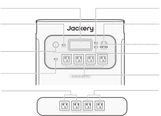<strong>LCD</strong><strong>Bouton</strong> <strong>d’alimentation</strong> <strong>principale</strong><strong>Bouton</strong><strong>Sortie</strong> <strong>USB-C</strong><strong>d’alimentation</strong> <strong>CC</strong>100W Max<strong>Sortie</strong> <strong>USB-A</strong>18W Max<strong>Port</strong> <strong>allume-cigare</strong><strong>Bouton</strong>12V⎓10A<strong>d’alimentation</strong> <strong>USB</strong><strong>Sortie</strong> <strong>CA</strong>(NEMA 5-20)1 x Sortie CA:<strong>Bouton</strong>120V, 20A, 2400WTotal Sorties CA:<strong>d’alimentation</strong> <strong>CA</strong>7200W max, surtension 14400W<strong>Sortie</strong> <strong>totale</strong><strong>Sortie</strong> <strong>totale</strong>120V, 30A, 3600W Max,120V, 30A, 3600W Max,Crête de surtensionCrête de surtensionde 7200Wde 7200W

</figure>

### VUE LATÉRALE GAUCHE

<figure class="hb-reference-figure hb-base-art-live-copy" data-component-id="HB-SPECIAL-REFERENCE-FIGURE" data-reference-id="overview-left" data-source-fragment-sha256="8d433884f40b1346fe041b6bc3655b8f0ac34724336da74f312b88391bc73ea0" data-web-base-art-ref="overview-left" data-web-presentation-mode="base-art-live-copy">

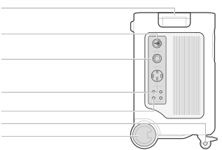<strong>Poignée</strong><strong>Port</strong> <strong>d’extension</strong> <strong>CA</strong>Connexion au Smart Transfer SwitchEntrée : 240 V, 16,7 A max., 4000 WSortie : 240 V, 30 A, 7200 W<strong>Port</strong> <strong>de</strong> <strong>sortie</strong> <strong>CA</strong> <strong>NEMA</strong> <strong>L14-30R</strong>120V/240V, 30A, 7200W MaxAlimente des appareils à forte puissance et se connecte à une boîte d’entréeou à un commutateur de transfert manuel pour l’alimentation domestique.<strong>Port</strong> <strong>de</strong> <strong>sortie</strong> <strong>CA</strong> <strong>NEMA</strong> <strong>14-50</strong>120V/240V, 30A, 7200W MaxAlimente des appareils à forte puissance et se connecte à une boîte d’entréeou à un commutateur de transfert manuel pour l’alimentation domestique.<strong>Sortie</strong> <strong>CA</strong> <strong>Bouton</strong> <strong>de</strong> <strong>réinitialisation</strong>Lorsque le bouton de réinitialisation saute, vous devez retirer la chargeet appuyer sur le bouton pour le réinitialiser.<strong>Frein</strong> <strong>de</strong> <strong>roue</strong><strong>Roues</strong>

</figure>

### VUE LATÉRALE DROITE

<figure class="hb-reference-figure hb-base-art-live-copy" data-component-id="HB-SPECIAL-REFERENCE-FIGURE" data-reference-id="overview-right" data-source-fragment-sha256="2203b359fa839105a85e71a404b9f2f3dd77178881a76f453cf5da4d4db3eb3f" data-web-base-art-ref="overview-right" data-web-presentation-mode="base-art-live-copy">

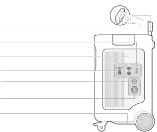<strong>Poignée</strong> <strong>rétractable</strong>Appuyez sur le bouton de la poignée rétractable et tirez pour l’étendre<strong>Entrée</strong> <strong>PV</strong> <strong>faible</strong> <strong>(8020)</strong>2 x ports 8mm CC ; 16V-60V⎓10,5A max, double à 21A/1200W max11V-16V (tension de fonctionnement)⎓8A max, double à 8A max<strong>Entrée</strong> <strong>PV</strong> <strong>élevée</strong> <strong>(MC4)</strong>135V-450V⎓15A Max, 4000W Max<strong>Interrupteur</strong> <strong>PV</strong> <strong>élevée</strong>Mettre l'interrupteur sur marche/arrêt pouractiver/désactiver la charge solaire PV élevé<strong>Entrée</strong> <strong>CA</strong>120V, 15A Max<strong>Port</strong> <strong>d’extension</strong> <strong>CC</strong> <strong>Borne</strong> <strong>A</strong>Connexion à l’unité de batterie<strong>Poignée</strong> <strong>inférieure</strong>

</figure>

## ÉCRAN LCD

<figure class="hb-reference-figure hb-base-art-live-copy" data-component-id="HB-SPECIAL-REFERENCE-FIGURE" data-reference-id="lcd-map" data-source-fragment-sha256="0b53ab70e9b932a0f805f70e0723e3ddea254a435406b8f79754836e488857d9" data-web-base-art-ref="lcd-map" data-web-presentation-mode="base-art-live-copy">

2345671822239101112131415161718192021

</figure>

<figure aria-label="LCD indicators" class="hb-lcd-table-composition" data-component-id="HB-TABLE-LCD-ICON" tabindex="0"><table class="hb-lcd-icon-table"><colgroup><col class="hb-lcd-col-number"/><col class="hb-lcd-col-icon"/><col class="hb-lcd-col-name"/><col class="hb-lcd-col-description"/></colgroup><tbody><tr><td class="hb-lcd-number">1</td><td class="hb-lcd-icon"></td><td class="hb-lcd-name">Wi-Fi</td><td class="hb-lcd-description"><strong>Activé</strong> : connexion Wi-Fi établie. <strong>Clignotant</strong> : prêt à se connecter au Wi-Fi. <strong>Désactivé</strong> : Wi-Fi non connecté.</td></tr><tr><td class="hb-lcd-number">2</td><td class="hb-lcd-icon"></td><td class="hb-lcd-name">Bluetooth</td><td class="hb-lcd-description"><strong>Activé</strong> : connexion Bluetooth établie. <strong>Clignotant</strong> : prêt à se connecter au Bluetooth. <strong>Désactivé</strong> : Bluetooth non connecté.</td></tr><tr><td class="hb-lcd-number">3</td><td class="hb-lcd-icon"></td><td class="hb-lcd-name">Mode de charge silencieuse Peut être activé / désactivé via l’application Jackery.</td><td class="hb-lcd-description"><strong>Activé</strong> : le bruit pendant la charge est considérablement réduit, tandis que la puissance de charge diminue et la vitesse de charge ralentit. <strong>Désactivé</strong> : mode de charge silencieuse désactivé.</td></tr><tr><td class="hb-lcd-number">4</td><td class="hb-lcd-icon"></td><td class="hb-lcd-name">Mode économie de batterie Peut être activé / désactivé via l’application Jackery.</td><td class="hb-lcd-description"><strong>Activé</strong> : Aide à prolonger la durée de vie de la batterie en limitant sa capacité maximale utilisable. <strong>Désactivé</strong> : mode économie de batterie désactivé.</td></tr><tr><td class="hb-lcd-number">5</td><td class="hb-lcd-icon"></td><td class="hb-lcd-name">Indicateur du plan de charge/décharge Peut être configuré dans l’application Jackery via STS.</td><td class="hb-lcd-description">Indique que le produit fonctionne selon le plan de charge/décharge du commutateur de transfert intelligent (STS). Cela se produit uniquement lorsque le produit est connecté avec succès au STS et que le plan de charge/décharge est configuré dans l’application STS.</td></tr><tr><td class="hb-lcd-number">6</td><td class="hb-lcd-icon"></td><td class="hb-lcd-name">Onduleur en ligne Peut être configuré dans l’application Jackery.</td><td class="hb-lcd-description"><strong>Activé</strong> : le produit est en mode ASI en ligne (0 ms). <strong>Désactivé</strong> : mode ASI de secours (par défaut).</td></tr><tr><td class="hb-lcd-number">7</td><td class="hb-lcd-icon"></td><td class="hb-lcd-name">Témoin de puissance CA</td><td class="hb-lcd-description">La sortie CA (onde sinusoïdale pure) est activée.</td></tr><tr><td class="hb-lcd-number">8</td><td class="hb-lcd-icon"></td><td class="hb-lcd-name">Puissance d’entrée</td><td class="hb-lcd-description">Affiche la puissance d’entrée en watts.</td></tr><tr><td class="hb-lcd-number">9</td><td class="hb-lcd-icon"></td><td class="hb-lcd-name">Temps de charge restant</td><td class="hb-lcd-description">Affiche le temps de charge restant.</td></tr><tr><td class="hb-lcd-number">10</td><td class="hb-lcd-icon"></td><td class="hb-lcd-name">Témoin de charge murale CA</td><td class="hb-lcd-description">Le produit est chargé via l’entrée CA en utilisant le courant du réseau électrique.</td></tr><tr><td class="hb-lcd-number">11</td><td class="hb-lcd-icon"></td><td class="hb-lcd-name">Témoin de charge de voiture</td><td class="hb-lcd-description">Le produit est chargé via l’entrée PV faible (8020) à l’aide de 12V DC (voiture).</td></tr><tr><td class="hb-lcd-number" rowspan="2">12</td><td class="hb-lcd-icon"></td><td class="hb-lcd-name">Indicateur d'entrée PV élevée</td><td class="hb-lcd-description">Le produit est chargé via l’entrée PV élevée (MC4) à l’aide de panneau(x) solaire(s).</td></tr><tr><td class="hb-lcd-icon"></td><td class="hb-lcd-name">Indicateur d'entrée PV faible</td><td class="hb-lcd-description">Le produit est chargé via l’entrée PV faible (8020) à l’aide de panneau(x) solaire(s).</td></tr><tr><td class="hb-lcd-number" rowspan="2">13</td><td class="hb-lcd-icon"></td><td class="hb-lcd-name">Témoin d’expansion CA (En charge) Assurez-vous que le STS est connecté avec succès avant de continuer.</td><td class="hb-lcd-description">Le produit se charge via le STS avec l’alimentation du réseau.</td></tr><tr><td class="hb-lcd-icon"></td><td class="hb-lcd-name">Témoin d’expansion CA (En décharge) Assurez-vous que le STS est connecté avec succès avant de continuer.</td><td class="hb-lcd-description">Le produit alimente les charges domestiques via le STS.</td></tr><tr><td class="hb-lcd-number">14</td><td class="hb-lcd-icon"></td><td class="hb-lcd-name">Témoin de Smart Transfer Switch</td><td class="hb-lcd-description">Le produit est connecté avec succès au STS.</td></tr><tr><td class="hb-lcd-number">15</td><td class="hb-lcd-icon"></td><td class="hb-lcd-name">Témoin d’alimentation de batterie</td><td class="hb-lcd-description">Lorsque le produit est en cours de charge, le cercle orange autour du pourcentage de la batterie s'allume . Lors de la recharge d'autres appareils, le cercle orange restera allumé.</td></tr><tr><td class="hb-lcd-number">16</td><td class="hb-lcd-icon"></td><td class="hb-lcd-name">Témoin de batterie faible</td><td class="hb-lcd-description"><strong>Activé</strong> : le niveau de batterie est inférieur à 20 %. <strong>Clignotant</strong> : le niveau de batterie est inférieur à 5 %. <strong>Désactivé</strong> : le produit est en charge.</td></tr><tr><td class="hb-lcd-number">17</td><td class="hb-lcd-icon"></td><td class="hb-lcd-name">Pourcentage de batterie restante</td><td class="hb-lcd-description">Affiche le pourcentage de batterie restant.</td></tr><tr><td class="hb-lcd-number">18</td><td class="hb-lcd-icon"></td><td class="hb-lcd-name">Témoin d’état de batterie et nombre de batteries connectées</td><td class="hb-lcd-description">Indique que le produit est connecté au nombre spécifié de blocs-batterie 5000 Plus.</td></tr><tr><td class="hb-lcd-number">19</td><td class="hb-lcd-icon"></td><td class="hb-lcd-name">Code d’erreur</td><td class="hb-lcd-description">Une erreur de fonctionnement est survenue. Veuillez consulter la section Dépannage pour plus de détails.</td></tr><tr><td class="hb-lcd-number" rowspan="2">20</td><td class="hb-lcd-icon"></td><td class="hb-lcd-name">Témoin de température élevée</td><td class="hb-lcd-description">La protection contre les hautes températures est activée. Le produit peut cesser de fonctionner jusqu’à ce que sa température revienne dans la plage de fonctionnement normale.</td></tr><tr><td class="hb-lcd-icon"></td><td class="hb-lcd-name">Témoin de température faible</td><td class="hb-lcd-description">La protection contre les basses températures est activée. Le produit peut cesser de fonctionner jusqu’à ce que sa température revienne dans la plage de fonctionnement normale.</td></tr><tr><td class="hb-lcd-number">21</td><td class="hb-lcd-icon"></td><td class="hb-lcd-name">Mode économie d’énergie</td><td class="hb-lcd-description">Pour éviter une consommation inutile de batterie en cas d’oubli de désactivation de la sortie, le produit active le mode économie d’énergie par défaut. Si aucun appareil n’est connecté ou si la consommation est inférieure à un certain seuil (sortie CA ≤ 25 W ; sortie USB ≤ 2 W ; sortie voiture ≤ 2 W), l’appareil éteindra automatiquement toutes les sorties après 12 heures. <strong>Activé</strong>/ <strong>Désactivé</strong> : Appuyez et maintenez simultanément le bouton d’alimentation CA et le bouton principal.</td></tr><tr><td class="hb-lcd-number">22</td><td class="hb-lcd-icon"></td><td class="hb-lcd-name">Puissance de sortie</td><td class="hb-lcd-description">Affiche la puissance de sortie en watts.</td></tr><tr><td class="hb-lcd-number">23</td><td class="hb-lcd-icon"></td><td class="hb-lcd-name">Temps de décharge restant</td><td class="hb-lcd-description">Affiche le temps de décharge restant.</td></tr></tbody></table></figure>

## FONCTIONNEMENT

<table class="manual-callout-table manual-callout-table"><tbody><tr><td class="manual-callout-label">Remarque</td><td class="manual-callout-body">
Lorsque le mode économie d’énergie est activé, si le bouton d’alimentation de la sortie DC, AC ou USB est activé mais que la station d’énergie ne charge ni ne décharge, elle s’éteindra automatiquement après 12 heures.
</td></tr></tbody></table>

### MISE SOUS/HORS TENSION

<figure class="hb-reference-figure hb-base-art-live-copy" data-component-id="HB-SPECIAL-REFERENCE-FIGURE" data-reference-id="power" data-source-fragment-sha256="e9325fa6ddb75450e0393c25df7a9a4852d25aa1dc5b1c080d439db2f7610b80" data-web-base-art-ref="power" data-web-presentation-mode="base-art-live-copy">

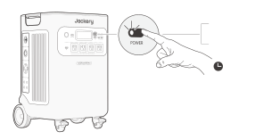<strong>marche</strong>Appuyez une fois<strong>arrêt</strong>Appuyez et maintenezpendant 3 secondes3 secondes<strong>Temps</strong> <strong>de</strong> <strong>veille</strong> <strong>par</strong> <strong>défaut</strong> <strong>:</strong> 2 heures · Le produit s’éteindra automatiquement après 2 heures d’inactivité, sans charge ni décharge. · La durée de veille peut être définie dans l’application Jackery.

</figure>

### MARCHE/ARRÊT SORTIE CA

<figure class="hb-reference-figure hb-base-art-live-copy" data-component-id="HB-SPECIAL-REFERENCE-FIGURE" data-reference-id="ac-output" data-source-fragment-sha256="e49dd2fa27dba02dae0ac3d49c701112429da335423fee6de7bed6e7b3077a7c" data-web-base-art-ref="ac-output" data-web-presentation-mode="base-art-live-copy">

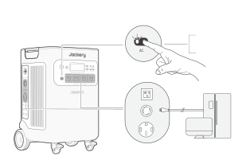<strong>Prérequis</strong> <strong>:</strong> Assurez-vous que le bouton d'alimentation principal est activé.<strong>marche</strong>Appuyez une fois<strong>arrêt</strong>Appuyez une fois

</figure>

### MARCHE/ARRÊT SORTIE USB

<figure class="hb-reference-figure hb-base-art-live-copy" data-component-id="HB-SPECIAL-REFERENCE-FIGURE" data-reference-id="usb-output" data-source-fragment-sha256="c1b6f98edbb729a788a9d31d86e80d94f47ac114e22c7ef8bf8d299cf84789bc" data-web-base-art-ref="usb-output" data-web-presentation-mode="base-art-live-copy">

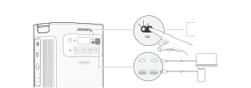<strong>Prérequis</strong> <strong>:</strong> Assurez-vous que le bouton d'alimentation principal est activé.<strong>marche</strong>Appuyez une fois<strong>arrêt</strong>Appuyez une fois

</figure>

### MARCHE/ARRÊT SORTIE CC

<figure class="hb-reference-figure hb-base-art-live-copy" data-component-id="HB-SPECIAL-REFERENCE-FIGURE" data-reference-id="dc-output" data-source-fragment-sha256="d3e091104bb0fa741b8e6b27b588f7dba5eabf8c894456b7b87a1c01e782c09b" data-web-base-art-ref="dc-output" data-web-presentation-mode="base-art-live-copy">

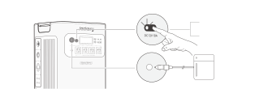<strong>Prérequis</strong> <strong>:</strong> Assurez-vous que le bouton d'alimentation principal est activé.<strong>marche</strong>Appuyez une fois<strong>arrêt</strong>Appuyez une fois

</figure>

<table class="manual-callout-table manual-callout-table"><tbody><tr><td class="manual-callout-label">Remarque</td><td class="manual-callout-body">
Le produit peut charger la batterie de votre voiture à l'aide du câble de charge de batterie automobile Jackery 12V, vendu séparément et disponible sur notre site web.
</td></tr></tbody></table>

<table class="manual-callout-table manual-callout-table"><tbody><tr><td class="manual-callout-label">Mise en garde</td><td class="manual-callout-body"><ul><li>Le port allume-cigare est uniquement compatible avec les batteries de voiture 12V et ne convient pas aux systèmes 24V.</li><li>Ne démarrez pas la voiture pendant que le produit charge la batterie via le port de sortie CC 12V (port allume-cigare), car cela pourrait endommager le produit.</li><li>Cette fonctionnalité est destinée à un usage d'urgence uniquement et ne peut pas charger une batterie de voiture morte ou endommagée.</li></ul></td></tr></tbody></table>

### ÉCRAN LCD

<figure aria-label="ÉCRAN LCD" class="hb-lcd-mode-composition" data-component-id="HB-TABLE-LCD-MODE">
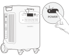

<table class="hb-lcd-mode-table"><colgroup><col class="hb-lcd-mode-col-state"/><col class="hb-lcd-mode-col-action"/><col class="hb-lcd-mode-col-copy"/></colgroup><tbody><tr><td class="hb-lcd-mode-state" rowspan="3">Écran LCD</td><td class="hb-lcd-mode-action">Allumer</td><td class="hb-lcd-mode-copy">Appuyez sur le bouton d’alimentation principal ou lorsque le produit est en cours de charge.</td></tr><tr><td class="hb-lcd-mode-action">Éteindre</td><td class="hb-lcd-mode-copy">Appuyez sur le bouton d’alimentation principal.</td></tr><tr><td class="hb-lcd-mode-action">Extinction automatique</td><td class="hb-lcd-mode-copy">L’écran LCD s’éteint automatiquement et passe en mode veille après 2 minutes d’inactivité.</td></tr><tr><td class="hb-lcd-mode-state" rowspan="3">Mode d’affichage permanent (en charge ou décharge)</td><td class="hb-lcd-mode-action">Allumer</td><td class="hb-lcd-mode-copy">Double-cliquez sur le bouton d’alimentation principal lorsque l’écran LCD est activé.</td></tr><tr><td class="hb-lcd-mode-action">Éteindre</td><td class="hb-lcd-mode-copy">Appuyez sur le bouton d’alimentation principal.</td></tr><tr><td class="hb-lcd-mode-action">Extinction automatique</td><td class="hb-lcd-mode-copy">Le mode d’affichage permanent s’éteindra automatiquement après 2 heures d’inactivité.</td></tr></tbody></table>
</figure>

### COMBINAISONS DE TOUCHES

<figure aria-label="Boutons / Utilisation / Fonction" class="hb-key-combination-composition" data-component-id="HB-TABLE-KEY-COMBINATIONS" tabindex="0"><table class="hb-key-combination-table"><colgroup><col class="hb-key-col-buttons"/><col class="hb-key-col-operation"/><col class="hb-key-col-function"/></colgroup><thead><tr><th class="hb-key-buttons" scope="col">Boutons</th><th class="hb-key-operation" scope="col">Utilisation</th><th class="hb-key-function" scope="col">Fonction</th></tr></thead><tbody><tr><td class="hb-key-buttons">

Bouton d’alimentation principal

Bouton d’alimentation USB

</td><td class="hb-key-operation">3 secondes
Appuyer 3 secondes sur les deux
</td><td class="hb-key-function">Réinitialiser Wi-Fi &amp; Bluetooth</td></tr><tr><td class="hb-key-buttons">

Bouton d’alimentation principal

Bouton d’alimentation CA

</td><td class="hb-key-operation">3 secondes
Appuyer 3 secondes sur les deux
</td><td class="hb-key-function">Activer/désactiver le mode économie d’énergie</td></tr><tr><td class="hb-key-buttons">

Bouton d’alimentation USB

Bouton d’alimentation CA

</td><td class="hb-key-operation">1 secondes
Appuyer 1 secondes sur les deux
</td><td class="hb-key-function">Activer/désactiver le Wi-Fi &amp; Bluetooth</td></tr><tr><td class="hb-key-buttons">

Bouton d’alimentation CC

Bouton d’alimentation CA

</td><td class="hb-key-operation">3 secondes
Appuyer 3 secondes sur les deux
</td><td class="hb-key-function">Basculer entre ASI en ligne ou de secours</td></tr></tbody></table></figure>

## DÉPANNAGE

<table class="manual-table native-troubleshooting"><thead><tr><th>Code d'erreur</th><th>Nom</th><th>Description (à des fins d’entretien interne uniquement)</th></tr></thead><tbody><tr><td><strong>F0</strong></td><td><strong>Erreur de communication de données du BMS</strong></td><td>Défaut de communication entre le BMS et la carte mère</td></tr><tr><td><strong>F1</strong></td><td><strong>Erreur de communication de données de l’onduleur</strong></td><td>Défaut de communication entre l’onduleur et la carte mère</td></tr><tr><td><strong>F2</strong></td><td><strong>Erreur de communication de données d’entrée CC</strong></td><td>Défaut de communication entre le module de charge CC et le BMS</td></tr><tr><td><strong>F3</strong></td><td><strong>Défaillance du BMS ou de la batterie</strong></td><td>Défaillance du BMS ou de la batterie</td></tr><tr><td><strong>F4</strong></td><td><strong>Surtension de la batterie</strong></td><td>Surtension de la batterie</td></tr><tr><td><strong>F5</strong></td><td><strong>Sous-tension de la batterie</strong></td><td>Sous-tension de la batterie</td></tr><tr><td><strong>F6</strong></td><td><strong>Défaillance de l’onduleur</strong></td><td>Surcharge / surtension / court-circuit de la sortie CA ; Surtension / sous-tension / surfréquence / sous-fréquence de l’entrée réseau ; Protection contre la surchauffe de l’onduleur activée Défaut de détection d’isolation</td></tr><tr><td><strong>F7</strong></td><td><strong>Défaillance de l’entrée CC</strong></td><td>Surtension d’entrée PV ; Protection contre la surchauffe du module de charge CC activée/déclenchée ; Protection contre la surcharge de sortie du module de charge CC activée/déclenchée</td></tr><tr><td><strong>F8</strong></td><td><strong>Surcharge ou court-circuit lors de la charge/décharge de la batterie</strong></td><td>Protection contre surintensité ou court-circuit du BMS activée</td></tr><tr><td><strong>F9</strong></td><td><strong>Surcharge ou court-circuit de la sortie CC</strong></td><td>Protection contre court-circuit USB activée</td></tr><tr><td><strong>FA</strong></td><td><strong>Erreur de communication entre unités en parallèle</strong></td><td>Échec de communication entre deux unités 5000 Plus dû à une panne des deux unités.</td></tr><tr><td><strong>FC</strong></td><td><strong>Erreur de communication avec le bloc-batterie</strong></td><td>Échec de communication entre le 5000 Plus et le(s) bloc(s)-batterie</td></tr></tbody></table>

## ALIMENTATION SANS INTERRUPTION (ASI)

Un onduleur (ou ASI) est un type de système d’alimentation continue qui fournit une alimentation électrique de secours automatisée à une charge en cas de défaillance de l’alimentation principale.

Le HomePower 5000 Plus offre deux modes ASI : secours et en ligne.

### ASI DE SECOURS

Le mode de secours est activé par défaut. En cas de perte soudaine du courant électrique, l’HomePower 5000 Plus basculera automatiquement vers l’alimentation de secours stockée en moins de 20 ms pour maintenir vos appareils en marche.

En mode de secours, la puissance de crête atteint 1440 W avant les coupures. En mode dérivation (Bypass), la charge/décharge simultanée est activée, la puissance de sortie réelle est inférieure à la puissance nominale, mais elle revient à la normale pendant les coupures.

<figure class="hb-reference-figure hb-base-art-live-copy" data-component-id="HB-SPECIAL-REFERENCE-FIGURE" data-reference-id="ups" data-source-fragment-sha256="cfed684eb7c06170ef9ca0d78188ac3eda7474164d72e157711dc924ea6c6bbc" data-web-base-art-ref="ups" data-web-presentation-mode="base-art-live-copy">

Connectez le produit à une prise murale à l’aide du câble de charge CA, puis appuyez sur le bouton de sortie CA pour alimenter vos appareils en même temps.

</figure>

### ASI EN LIGNE

Le mode ASI en ligne, qui permet un basculement de 0 ms, peut être activé de deux façons :

<ol><li>Activer le mode ASI en ligne dans l’application Jackery.</li><li>Appuyer simultanément sur les boutons CC et CA du HomePower 5000 Plus.</li></ol>

<table class="manual-callout-table manual-callout-table"><tbody><tr><td class="manual-callout-label">Remarque</td><td class="manual-callout-body"><ol><li>Les paramètres système reviennent en mode ASI de secours lorsque le produit redémarre en mode en ligne. En mode de secours, la puissance de sortie est limitée par la puissance de dérivation, avec une sortie maximale de 1440 W.</li><li>En mode ASI, les prises NEMA L14-30R et NEMA 14-50 fournissent une sortie 120V lorsqu’elles sont connectées au mur via le câble CA.</li><li>En mode ASI en ligne, il prend en charge un basculement de 0 ms avec une puissance de sortie maximale de 3600 W.</li></ol></td></tr></tbody></table>

## CONNEXIONS

### CONNEXION À LA BATTERIE VENDUE SÉPARÉMENT

Ce dispositif peut prendre en charge jusqu’à 5 unités de batteries pour répondre aux besoins d’une grande capacité d’alimentation. Pour plus d’informations sur son utilisation, veuillez vous reporter au manuel d’utilisation du Jackery Battery Pack 5000 Plus.

<figure class="hb-reference-figure hb-base-art-live-copy" data-component-id="HB-SPECIAL-REFERENCE-FIGURE" data-reference-id="battery-packs" data-source-fragment-sha256="10565abac666a6552d80850f15f9b9e4e9964ddb84facb746a29a0565519619d" data-web-base-art-ref="battery-packs" data-web-presentation-mode="base-art-live-copy">

au moins 1 pi (300 mm)au moins 1 pi (300 mm)

</figure>

<table class="manual-callout-table manual-callout-table"><tbody><tr><td class="manual-callout-label">Mise en garde</td><td class="manual-callout-body"><ol><li>S’assurer que tous les produits sont éteints avant de connecter le HomePower 5000 Plus au(x) bloc(s)-batterie 5000 Plus.</li><li>Pour un bon fonctionnement, veillez à ce que les entrées/sorties d’air sur les côtés soient dégagées. Laissez au moins 1 pi d’espace entre les orifices de ventilation et les objets pour assurer une circulation d’air adéquate et une dissipation efficace de la chaleur.</li></ol></td></tr></tbody></table>

### CONNEXION AU COMMUTATEUR DE TRANSFERT INTELLIGENT VENDUE SÉPARÉMENT

<figure class="hb-reference-figure hb-base-art-live-copy" data-component-id="HB-SPECIAL-REFERENCE-FIGURE" data-reference-id="sts-connect" data-source-fragment-sha256="8e2874e110e2cafc1da05c6d0228b8811b52e8888344a4160f7f5aa18a19ecf0" data-web-base-art-ref="sts-connect" data-web-presentation-mode="base-art-live-copy">

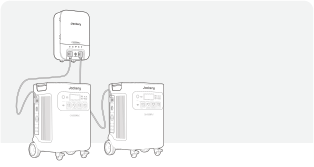Le Jackery HomePower 5000 Plus peut alimenter votre maison via le STS. Pour plus de détails, consultez le manuel d’utilisation du STS.Lorsque le mode UPS est activé, la stationd’alimentation portable reste enfonctionnement et consomme de l’énergie encontinu. En cas de panne de courant, lesystème bascule vers l’alimentation parbatterie en 20 millisecondes.Lorsque le mode UPS est désactivé, labascule vers l’alimentation par batteries’effectue en 5 secondes.

</figure>

## RECHARGE

L'énergie verte d'abord : nous préconisons l'utilisation de l'énergie verte en premier. Ce produit prend en charge deux modes de recharge simultanés : la recharge solaire et la recharge par prise murale CA.

Quand la recharge par prise murale CA et la recharge solaire sont effectuées en même temps, le produit privilégie la recharge solaire. Les deux méthodes sont utilisées pour charger la batterie à la puissance maximalement autorisée.

<strong>CHARGEZ L'APPAREIL ENTIÈREMENT AVANT SA PREMIÈRE UTILISATION</strong>

<table class="manual-callout-table manual-callout-table"><tbody><tr><td class="manual-callout-label">Remarque</td><td class="manual-callout-body"><ol><li>La température de charge recommandée pour le produit est de 0 °C à 45 °C (32 °F à 113 °F), et la température de décharge est de -15 °C à 45 °C (5 °F à 113 °F). L’utilisation du produit en dehors de cette plage de température peut limiter ses capacités de charge et de décharge, voire l’empêcher de fonctionner.</li><li>La puissance de charge et la capacité de la batterie peuvent varier en fonction des fluctuations de température. Lorsque la température ambiante est comprise entre -15 °C et -10 °C (5 °F à 14 °F), la puissance de sortie maximale diminue à 3600 W.</li></ol></td></tr></tbody></table>

### CHARGEMENT PAR PRISE MURALE CA

<figure class="hb-reference-figure hb-base-art-live-copy" data-component-id="HB-SPECIAL-REFERENCE-FIGURE" data-reference-id="ac-charge" data-source-fragment-sha256="d840bbf589dc41b35b31585589e47454e48fed8f3fce8bc2888e94d29907a708" data-web-base-art-ref="ac-charge" data-web-presentation-mode="base-art-live-copy">

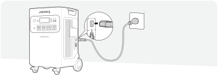Connecter le câble CA au portd’entrée CA du HomePower5000 Plus et à une prise murale.

</figure>

### RECHARGE AVEC LE STS

<figure class="hb-reference-figure hb-base-art-live-copy" data-component-id="HB-SPECIAL-REFERENCE-FIGURE" data-reference-id="sts-charge" data-source-fragment-sha256="6d525b03a9f6a645283e931cb55bb334cdbddb65680ae04114ddf52e8c438d70" data-web-base-art-ref="sts-charge" data-web-presentation-mode="base-art-live-copy">

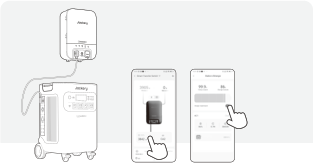Connecter votre STS Jackery au produit pour activer la chargevia STS.*Le paramètre de réserve fonctionne dans tous les modes duSTS. Ainsi, le Jackery HomePower 5000 Plus cesse de chargerlorsque sa capacité restante dépasse le seuil de réserve. Pourle recharger immédiatement, suivez les instructions ci-dessous.<strong>ÉTAPE</strong> <strong>1</strong><strong>ÉTAPE</strong> <strong>2</strong>HP5000Plus*Application STS

</figure>

<table class="manual-callout-table manual-callout-table"><tbody><tr><td class="manual-callout-label">Remarque</td><td class="manual-callout-body">
Lorsque le port d’extension CA est connecté avec succès au STS, le port d’entrée CA ne sera pas utilisé pour la charge. Dans ce cas, la centrale peut être rechargée via les ports suivants : port d’extension CA, PV élevée, PV faible.
</td></tr></tbody></table>

### RECHARGE AVEC PANNEAUX SOLAIRES

<table class="manual-callout-table manual-callout-table"><tbody><tr><td class="manual-callout-label">Mise en garde</td><td class="manual-callout-body">
Lorsque les panneaux solaires sont connectés en série, assurez-vous que la sortie de tension maximale est comprise entre 16 V - 60 V pour le port d'entrée PV faible, et entre 135 V - 450 V pour le port d'entrée PV élevé.
</td></tr></tbody></table>

<ul><li><strong>Connecter au port d'entrée PV faible</strong></li></ul>

Plage de tension d’entrée PV faible: 16 V à 60 V

Le Jackery HomePower 5000 Plus a deux ports d'entrée PV faibles, dont chacun prend en charge de la connexion directe à un panneau solaire de 500 W ou à trois panneaux solaires de 200 W. Si l'un port d'entrée PV faible nécessite de connecter simultanément deux panneaux solaires ou plus, référez-vous à la figure suivante pour charger à l'aide du connecteur du panneau solaire (vendu séparément, non inclus en standard).

<figure class="hb-reference-figure hb-base-art-live-copy" data-component-id="HB-SPECIAL-REFERENCE-FIGURE" data-reference-id="low-pv-500" data-source-fragment-sha256="c15fbfa8cf0f1dde0f0d3dbc98396dec1fbf186981f8a665885d7e1ed2bef6ff" data-web-base-art-ref="low-pv-500" data-web-presentation-mode="base-art-live-copy">

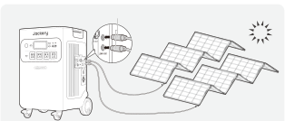DC8020SolarSaga 500 X × 2

</figure>

<figure class="hb-reference-figure hb-base-art-live-copy" data-component-id="HB-SPECIAL-REFERENCE-FIGURE" data-reference-id="low-pv-200" data-source-fragment-sha256="fad18b7b2c402a027b5a4d822a86fc0b91020111738fc1bb20149f6038143401" data-web-base-art-ref="low-pv-200" data-web-presentation-mode="base-art-live-copy">

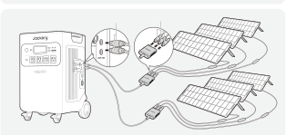DC8020DC8020SolarSaga 200 × 6

</figure>

<table class="manual-callout-table manual-callout-table"><tbody><tr><td class="manual-callout-label">Mise en garde</td><td class="manual-callout-body"><ol><li>Assurez-vous que la tension d'entrée pour les deux ports d'entrée CC est la même. Sinon, le produit pourrait être endommagé. Par exemple:</li></ol><ul><li>Il est recommandé d'utiliser le même modèle de panneaux solaires Jackery et le même nombre de panneaux lors de la connexion des panneaux solaires aux deux ports d'entrée DC8020.</li><li>Ne chargez pas le produit à la fois avec un chargeur de voiture et un panneau solaire simultanément. Cela pourrait faire sauter le fusible de la voiture ou entraîner un échec de la charge.</li></ul><ol start="2"><li>Il est recommandé d’utiliser le panneau solaire Jackery pour charger l’HomePower 5000 Plus. Jackery décline toute responsabilité en cas de dommages causés par l’utilisation de panneaux solaires d’autres marques.</li></ol></td></tr></tbody></table>

<ul><li><strong>Connecter au port d'entrée PV élevée</strong></li></ul>

Plage de tension d’entrée PV élevée: 135 V à 450 V

<table class="manual-callout-table manual-callout-table"><tbody><tr><td class="manual-callout-label">Mise en garde</td><td class="manual-callout-body"><ol><li>Mettez l’interrupteur PV élevé désactivé avant de connecter l’entrée PV élevée ou pendant la maintenance.</li><li>Avant d'utiliser les ports d'entrée PV élevée, assurez-vous que l'interrupteur PV est mis en marche.</li><li>Assurez-vous que l'interrupteur PV élevé est en position « OFF » ou « LOCK » avant d'utiliser la clé MC4 fournie pour démonter les connecteurs MC4.</li></ol></td></tr></tbody></table>

<figure class="hb-reference-figure hb-base-art-live-copy" data-component-id="HB-SPECIAL-REFERENCE-FIGURE" data-reference-id="high-pv" data-source-fragment-sha256="fd64ccc270a0a663193d42c6de350c02e119daa5469ce76102a4db774e4d8fd0" data-web-base-art-ref="high-pv" data-web-presentation-mode="base-art-live-copy">

Démontez les connecteurs MC4 avecla clé MC4 fournie.

</figure>

<figure class="hb-reference-figure hb-base-art-live-copy" data-component-id="HB-SPECIAL-REFERENCE-FIGURE" data-reference-id="high-pv-lock" data-source-fragment-sha256="467022dcb7d7bf2729a1ae8bdf448535e9a219c564e8921e7dffe8de3decfbca" data-web-base-art-ref="high-pv-lock" data-web-presentation-mode="base-art-live-copy">

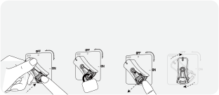<strong>Verrouillage</strong><strong>Déverrouillage</strong>Tournez l'interrupteur haute tension sur laLibérez le mécanisme de verrouillage etposition « LOCK » et appuyez sur le mécanismel'interrupteur revient en position « OFF ».de verrouillage.

</figure>

<ul><li><strong>Entrée PV élevée + PV faible</strong></li></ul>

Plage de tension pour entrée PV faible: 16 V à 60 V

Plage de tension pour entrée PV élevée: 135 V à 450 V

<figure class="hb-reference-figure" data-component-id="HB-SPECIAL-REFERENCE-FIGURE" data-reference-id="dual-pv" data-source-fragment-sha256="0c66ccafa23616c19ca1e92a43b633566946a182d8ab4130ddfc6de832746e75">

</figure>

### RECHARGE VIA PRISE ALLUME-CIGARE

Vous pouvez recharger ce produit à l'aide d'un chargeur de voiture de 12 V. Veillez à ce que la connexion entre le chargeur de voiture et l'allume-cigare de la voiture soit bonne.

<figure class="hb-reference-figure hb-base-art-live-copy" data-component-id="HB-SPECIAL-REFERENCE-FIGURE" data-reference-id="car" data-source-fragment-sha256="6eac90865fdf811ae983bf59156ce82574fcac016a3155d19fb46faf3e5252bb" data-web-base-art-ref="car" data-web-presentation-mode="base-art-live-copy">

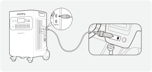vehícule*Le câble de charge pour voiture est vendu séparément.

</figure>

<table class="manual-callout-table manual-callout-table"><tbody><tr><td class="manual-callout-label">Mise en garde</td><td class="manual-callout-body"><ol><li>Il convient de démarrer le véhicule avant de charger la station d'alimentation.</li><li>Si le véhicule circule sur une route cahoteuse, il est interdit d'utiliser le chargeur de voiture au cas où il brûlerait dans le cas d'une mauvaise connexion. L'entreprise ne peut pas être tenue responsable de toute perte provoquée par une opération inhabituelle.</li><li>Vous pouvez recharger les véhicules de 12 V seulement, pas ceux de 24 V. Veuillez ne pas recharger ce produit dans un véhicule 24V pour éviter les blessures et les pertes matérielles.</li></ol></td></tr></tbody></table>

## STOCKAGE

Conservez le produit dans un endroit propre et sec avec une ventilation adéquate.Température et humidité de stockage :

<ul><li>1 mois : -20 à 45°C (0-60% HR)</li><li>3 mois : 0 à 45°C (0-60% HR)</li><li>12 mois : 0 à 25°C (0-60% HR)</li></ul>

Si ce produit est stocké pendant une longue période (3 à 6 mois) avec la batterie déchargée, il peut devenir impossible de le recharger.Pour éviter cela et préserver la santé de la batterie, il est recommandé de vérifier et de recharger le produit tous les trois mois, et d'effectuer un cycle de charge et de décharge complet au moins une fois tous les 6 à 12 mois.

## CONFIGURATION DE L’APPLICATION

### 1. Pour télécharger l’application et se connecter

<figure aria-label="App download" class="hb-app-download-composition" data-component-id="HB-SPECIAL-APP">

Recherchez « Jackery » dans Google Play ou dans l’App Store pour installer l’application. Une fois que c’est fait, vous pouvez vous inscrire et vous connecter.

Vous pouvez également scanner le code QR ci-dessous pour télécharger et installer l'application.

</figure>

### 2. Pour ajouter un appareil

2.1 Cliquez sur le bouton + pour ajouter un appareil.

2.2 Maintenez enfoncé le bouton Power sur l’appareil pour l’allumer. Les icônes Wi-Fi et Bluetooth clignotent sur l’appareil afin d’indiquer qu’il est entré dans le mode Configuration réseau. Cliquez sur le bouton «icône qui clignotante» et autorisez l’application à se connecter aux appareils alentour, puis ouvrez les autorisations Bluetooth.

<figure class="hb-reference-figure hb-base-art-live-copy" data-component-id="HB-SPECIAL-REFERENCE-FIGURE" data-reference-id="app-add" data-source-fragment-sha256="708b58634468539a0aee8bf378096f323c4e49e1dbbae5f6333fba125a633831" data-web-base-art-ref="app-add" data-web-presentation-mode="base-art-live-copy">

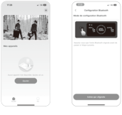2.12.2

</figure>

<figure class="hb-reference-figure hb-base-art-live-copy" data-component-id="HB-SPECIAL-REFERENCE-FIGURE" data-reference-id="app-control" data-source-fragment-sha256="c9a33cb3f2a142fa544f267fd4e31a418d7124dac2d8d788913fa04e4a3a026f" data-web-base-art-ref="app-control" data-web-presentation-mode="base-art-live-copy">

BoutonBoutond’alimentation principaled’alimentation CCBoutonBoutond’alimentation USBd’alimentation CA

</figure>

<table class="manual-callout-table manual-callout-table"><tbody><tr><td class="manual-callout-label">Remarque</td><td class="manual-callout-body">
Si, une fois allumée, l’application n’est pas connectée à un appareil dans les 2 heures, le Wi-Fi et le Bluetooth de l’appareil seront automatiquement désactivés. Vous devrez maintenir les boutons USB et AC enfoncés pour réactiver le Wi-Fi et le Bluetooth.
</td></tr></tbody></table>

2.3 Une fois que vous avez appuyé sur l’icône de recherche d’appareils, l’appareil est automatiquement associé à l’application via le Bluetooth.

<table class="manual-callout-table manual-callout-table"><tbody><tr><td class="manual-callout-label">Remarque</td><td class="manual-callout-body">
Si le message «l’appareil a été associé» s’affiche pendant l’appairage, vous pouvez suivre l’une de ces deux étapes pour procéder à la connexion.
<ul><li>Le propriétaire de l’appareil peut partager ce dernier avec d’autres utilisateurs dans l’application.</li><li>Maintenez les boutons Power et USB enfoncés pendant 3 secondes pour réinitialiser l’appareil et l’associer de nouveau.</li></ul></td></tr></tbody></table>

2.4 Une fois l’appairage réalisé avec succès, vous devrez saisir le nom et le mot de passe du Wi-Fi pour que l’appareil se connecte automatiquement au réseau Wi-Fi.

<table class="manual-callout-table manual-callout-table"><tbody><tr><td class="manual-callout-label">Remarque</td><td class="manual-callout-body">
Veuillez choisir un réseau Wi-Fi 2,4 GHz. L’appareil ne prend pas en charge le réseau Wi-Fi 5 GHz.
</td></tr></tbody></table>

2.5 Une fois l’appareil ajouté à la page d’accueil, l’icône Wi-Fi de l’appareil restera allumée.

<figure class="hb-reference-figure hb-base-art-live-copy" data-component-id="HB-SPECIAL-REFERENCE-FIGURE" data-reference-id="app-results" data-source-fragment-sha256="4b0abcf4f3dc9d0e8711acc7e64e70273219606452cc604306b7ad716a8b8825" data-web-base-art-ref="app-results" data-web-presentation-mode="base-art-live-copy">

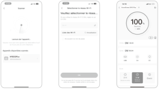2.32.42.5

</figure>

Les captures d’écran ci-dessus sont fournies à titre indicatif.

### 3. Pour dissocier l’appareil

Cliquez sur le bouton des paramètres en haut à droite de l’interface principale pour accéder à la page des paramètres. Cliquez sur le bouton de dissociation en bas de la page pour dissocier l’appareil.

### 4. Remarques

<strong>4.1 Pour activer le Wi-Fi et le Bluetooth :</strong>

<ul><li>Le Wi-Fi et le Bluetooth sont automatiquement activés, une fois l’appareil allumé. Leurs icônes s’allument sur l’écran.</li><li>Appuyez simultanément sur les boutons d’alimentation des sorties USB et CA jusqu’à ce que les icônes Wi-Fi et Bluetooth s’allument sur l’écran.</li></ul>

<strong>4.2 Pour désactiver le Wi-Fi et le Bluetooth:</strong>

<ul><li>Appuyez simultanément sur les boutons d’alimentation des sorties USB et CA jusqu’à ce que les icônes Wi-Fi et Bluetooth s’éteignent de l’écran.</li><li>Le Wi-Fi et le Bluetooth sont automatiquement désactivés si aucun appareil n'est connecté dans les 2 heures.</li></ul>

<strong>4.3 Pour réinitialiser le Wi-Fi et le Bluetooth：</strong>

<ul><li>Maintenez les boutons Power et USB enfoncés simultanément pendant 3 secondes pour réinitialiser le Wi-Fi et le Bluetooth aux paramètres d’usine et redémarrer le système. Le compte connecté dans l’application sera dissocié.</li></ul>

## GARANTIE

<figure aria-label="GARANTIE" class="hb-warranty-intro-composition" data-component-id="HB-WARRANTY-LEAD">
<strong>Nous ne fournissons notre garantie qu'aux clients qui achètent sur le site offciel de Jackery, sur des plateformes tierces portant la marque Jackery, ou auprès de revendeurs autorisés locaux.</strong>

* La durée et les détails de la garantie peuvent varier en fonction des lois, réglementations et revendeurs autorisés locaux.
</figure>

### Garantie limitée

<figure aria-label="Garantie limitée" class="hb-warranty-card" data-component-id="HB-WARRANTY-SECTION" data-warranty-card-index="1">
Jackery Inc. garantit à l'acheteur et consommateur d'origine que le produit de Jackery sera exempt de tout défaut de fabrication et de matériaux dans le cadre d'une utilisation normale pendant toute la durée de la période de garantie applicable identifiée dans la section « Période de garantie » ci-dessous, sous réserve des exceptions énoncées ci-dessous.

Cette déclaration de garantie énonce les obligations totales et exclusives de garantie de Jackery. Nous n'assumerons pas et nous n'autorisons personne à assumer pour nous toute autre responsabilité en lien avec la vente de nos produits.
</figure>

### Période de garantie

<figure aria-label="Période de garantie" class="hb-warranty-period-card" data-component-id="HB-WARRANTY-YEARS">

5
<strong class="hb-warranty-years-unit">ANS</strong><strong class="hb-warranty-period-label">Garantie standard</strong>

La période de garantie standard du Jackery HomePower 5000 Plus est de 60 mois. Dans tous les cas, la période de garantie commence à compter de la date d'achat par l'acheteur et consommateur d'origine. La facture du premier achat du consommateur ou toute autre preuve documentaire raisonnable est nécessaire afin d'établir la date de début de la période de garantie.

2
<strong class="hb-warranty-years-unit">ANS</strong><strong class="hb-warranty-period-label">Garantie prolongée</strong>

Des frais supplémentaires sont exigés pour la garantie prolongée. Pour plus de détails sur la garantie prolongée, veuillez visiter le site Web de Jackery ou contacter le service client de Jackery.

</figure>

### Réparation ou remplacement

<figure aria-label="Réparation ou remplacement" class="hb-warranty-card" data-component-id="HB-WARRANTY-SECTION" data-warranty-card-index="3">Jackery réparera ou remplacera (aux frais de Jackery) tout produit Jackery qui ne fonctionnera pas pendant la période de garantie applicable en raison d'un défaut de fabrication ou de matériau. Le produit réparé/remplacé assume la garantie restante de la date d'achat originale.</figure>

### Limitée à l'acheteur et consommateur d'origine

<figure aria-label="Limitée à l'acheteur et consommateur d'origine" class="hb-warranty-card" data-component-id="HB-WARRANTY-SECTION" data-warranty-card-index="4">La garantie d'un produit Jackery est limitée à l'acheteur et consommateur d'origine, elle ne peut pas être transférée à un autre propriétaire.</figure>

### Exclusions

<figure aria-label="Exclusions" class="hb-warranty-card" data-component-id="HB-WARRANTY-SECTION" data-warranty-card-index="5">
La garantie de Jackery ne s'applique pas à :

Une utilisation incorrecte, abusée, modifiée, aux dégâts provoqués par un accident ou toute autre utilisation qui n'est pas une utilisation normale de ce produit et autorisée par la documentation actuelle du produit de Jackery.

À une réparation tentée par quelqu'un d'autre qu'un établissement agréé.

Tout autre produit acheté par l'intermédiaire d'une vente aux enchères en ligne.

La garantie de Jackery ne s'applique pas aux cellules de la batterie, sauf si vous avez entièrement chargé les cellules de la batterie dans les sept jours suivant l'achat du produit et au moins une fois tous les 6 mois par la suite.
</figure>

### Droits d'interprétation

<figure aria-label="Droits d'interprétation" class="hb-warranty-card" data-component-id="HB-WARRANTY-SECTION" data-warranty-card-index="6">Jackery Inc. se réserve le droit d'interpréter de manière définitive la politique après-vente des clients ci-dessus.</figure>

## SPÉCIFICATIONS

<h2 class="hb-spec-group">INFORMATIONS GÉNÉRALES</h2>

<figure aria-label="INFORMATIONS GÉNÉRALES" class="hb-spec-table-composition"><table class="manual-table manual-spec-table hb-spec-table"><colgroup><col class="hb-spec-col-label"/><col class="hb-spec-col-value"/></colgroup><tbody><tr><th class="manual-spec-label hb-spec-label" scope="row">Nom du produit</th><td class="manual-spec-value hb-spec-value">Jackery HomePower 5000 Plus</td></tr><tr><th class="manual-spec-label hb-spec-label" scope="row">Numéro de modèle</th><td class="manual-spec-value hb-spec-value">JHP-5000C</td></tr><tr><th class="manual-spec-label hb-spec-label" scope="row">Capacité</th><td class="manual-spec-value hb-spec-value">45Ah/112Vdc (5040Wh)</td></tr><tr><th class="manual-spec-label hb-spec-label" scope="row">Chimie cellulaire</th><td class="manual-spec-value hb-spec-value">LiFePO4</td></tr><tr><th class="manual-spec-label hb-spec-label" scope="row">Poids</th><td class="manual-spec-value hb-spec-value">Environ 61 kg/134,5 lbs</td></tr><tr><th class="manual-spec-label hb-spec-label" scope="row">Dimension</th><td class="manual-spec-value hb-spec-value">41,8×39,5×63,5 cm/16,5×15,5×25 po</td></tr><tr><th class="manual-spec-label hb-spec-label" scope="row">Durée de vie</th><td class="manual-spec-value hb-spec-value">Capacité de 4 000 cycles à 70 % ou plus</td></tr><tr><th class="manual-spec-label hb-spec-label" scope="row">Onduleur</th><td class="manual-spec-value hb-spec-value">Onduleur de secours : ＜20ms Onduleur en ligne : 0ms</td></tr><tr><th class="manual-spec-label hb-spec-label" scope="row">Topologie de l’onduleur</th><td class="manual-spec-value hb-spec-value">Non isolé</td></tr><tr><th class="manual-spec-label hb-spec-label" scope="row">Facteur de puissance</th><td class="manual-spec-value hb-spec-value">≥0,98</td></tr><tr><th class="manual-spec-label hb-spec-label" scope="row">Unité complète</th><td class="manual-spec-value hb-spec-value">Type 1</td></tr></tbody></table></figure>

<h2 class="hb-spec-group">PORTS D’ENTRÉE</h2>

<figure aria-label="PORTS D’ENTRÉE" class="hb-spec-table-composition"><table class="manual-table manual-spec-table hb-spec-table"><colgroup><col class="hb-spec-col-label"/><col class="hb-spec-col-value"/></colgroup><tbody><tr><th class="manual-spec-label hb-spec-label" scope="row">Mode de charge Entrée CA</th><td class="manual-spec-value hb-spec-value">120V~60Hz, 15A max (Durée &lt; 3h lorsque le courant dépasse 12A)</td></tr><tr><th class="manual-spec-label hb-spec-label" rowspan="2" scope="row">Mode bypass Entrée CA</th><td class="manual-spec-value hb-spec-value">120V~60Hz, 12A max (Durée &lt; 3h lorsque le courant dépasse 12A)</td></tr><tr><td class="manual-spec-value hb-spec-value">240V~60Hz, 16,7A max</td></tr><tr><th class="manual-spec-label hb-spec-label" scope="row">1 x Port d’extension CA (Entrée)</th><td class="manual-spec-value hb-spec-value">240V~60Hz, 16,7A max</td></tr><tr><th class="manual-spec-label hb-spec-label" scope="row">Entrée CC</th><td class="manual-spec-value hb-spec-value"></td></tr><tr><th class="manual-spec-label hb-spec-label" scope="row">1 x Port d’extension CC (Entrée)</th><td class="manual-spec-value hb-spec-value">80,5V-126V⎓98A max</td></tr><tr><th class="manual-spec-label hb-spec-label" scope="row">PV élevée</th><td class="manual-spec-value hb-spec-value">135V-450V⎓15A max, 4000W Max</td></tr><tr><th class="manual-spec-label hb-spec-label" rowspan="2" scope="row">PV faible</th><td class="manual-spec-value hb-spec-value">2 x ports 8mm CC ; 16V-60V⎓10,5A max, double à 21A/1200W max</td></tr><tr><td class="manual-spec-value hb-spec-value">11V-16V (tension de fonctionnement)⎓8A max, double à 8A max</td></tr></tbody></table></figure>

<h2 class="hb-spec-group">PORTS DE SORTIE</h2>

<figure aria-label="PORTS DE SORTIE" class="hb-spec-table-composition"><table class="manual-table manual-spec-table hb-spec-table"><colgroup><col class="hb-spec-col-label"/><col class="hb-spec-col-value"/></colgroup><tbody><tr><th class="manual-spec-label hb-spec-label" scope="row">Sortie CA (NEMA L14-30R/14-50)</th><td class="manual-spec-value hb-spec-value">120V/240V~60Hz, 30A, 7200W max</td></tr><tr><th class="manual-spec-label hb-spec-label" scope="row">Sortie Mode bypass CA</th><td class="manual-spec-value hb-spec-value">120V~60Hz, 12A max 240V~60Hz, 16,7A max</td></tr><tr><th class="manual-spec-label hb-spec-label" scope="row">4 × Sortie CA</th><td class="manual-spec-value hb-spec-value">120V~60Hz, 20A, 2400W</td></tr><tr><th class="manual-spec-label hb-spec-label" scope="row">Total Sorties CA</th><td class="manual-spec-value hb-spec-value">7200W max, surtension 14400W</td></tr><tr><th class="manual-spec-label hb-spec-label" scope="row">2 × Sorties USB-C</th><td class="manual-spec-value hb-spec-value">100W max, 5V⎓3A, 9V⎓3A, 12V⎓3A, 15V⎓3A, 20V⎓5A</td></tr><tr><th class="manual-spec-label hb-spec-label" scope="row">2 × Sorties USB-A</th><td class="manual-spec-value hb-spec-value">18W max, 5-6V⎓3A, 6-9V⎓2A, 9-12V⎓1,5A</td></tr><tr><th class="manual-spec-label hb-spec-label" scope="row">Port allume-cigare</th><td class="manual-spec-value hb-spec-value">12V⎓10A</td></tr><tr><th class="manual-spec-label hb-spec-label" scope="row">1 × Port d’extension CA (Sortie)</th><td class="manual-spec-value hb-spec-value">240V~60Hz, 30A, 7200W</td></tr><tr><th class="manual-spec-label hb-spec-label" scope="row">1 × Port d’extension CC (Sortie)</th><td class="manual-spec-value hb-spec-value">80,5V-126V⎓41A max</td></tr></tbody></table></figure>

<h2 class="hb-spec-group">TEMPÉRATURE DE FONCTIONNEMENT AMBIANTE</h2>

<figure aria-label="TEMPÉRATURE DE FONCTIONNEMENT AMBIANTE" class="hb-spec-table-composition"><table class="manual-table manual-spec-table hb-spec-table"><colgroup><col class="hb-spec-col-label"/><col class="hb-spec-col-value"/></colgroup><tbody><tr><th class="manual-spec-label hb-spec-label" scope="row">Température de charge</th><td class="manual-spec-value hb-spec-value">0°C~45°C (32°F~113°F)</td></tr><tr><th class="manual-spec-label hb-spec-label" rowspan="2" scope="row">Température de décharge</th><td class="manual-spec-value hb-spec-value">-15°C~45°C (5°F~113°F)</td></tr><tr><td class="manual-spec-value hb-spec-value">-15°C~-10°C (5°F~14°F) Puissance de sortie : 3600 W</td></tr></tbody></table></figure>

<strong>RISQUE D’INGESTION :</strong> Ce dispositif contient une pile bouton.

※ USB Type-C® et USB-C® sont des marques déposées de l’USB Implementers Forum.

## GUIDE D’INSTALLATION DU SYSTÈME DE SAUVEGARDE DOMESTIQUE INTELLIGENT (AC ESS) <strong>Modèle du système</strong> HB5000C-TS02A

Pour connecter l’Jackery HomePower 5000 Plus au Smart Transfer Switch (STS), utilisez le câble d’extension pour relier le port d’extension AC de l’Explorer 5000 Plus au port d’entrée/sortie AC du STS.

Pour connecter l’Jackery HomePower 5000 Plus au pack de batteries, utilisez le câble d’extension pour relier son port d’extension CC (A) au port d’extension CC (B) du pack de batteries.

<figure class="hb-reference-figure hb-base-art-live-copy" data-component-id="HB-SPECIAL-REFERENCE-FIGURE" data-reference-id="ess" data-source-fragment-sha256="d673db65b1378f190ffdc29fffa0b7730b7b6c10f7cbb24235ba214c67f2730c" data-web-base-art-ref="ess" data-web-presentation-mode="base-art-live-copy">

Pour des instructions détaillées sur l’installation et la connexion, consultez les manuelsd’utilisation du STS et du pack de batteries.

</figure>

<table class="manual-callout-table manual-callout-table"><tbody><tr><td class="manual-callout-label">Mise en garde</td><td class="manual-callout-body">
Position d’installation du système de sauvegarde domestique intelligent (AC ESS) Installation en intérieur.

L’espace doit être complètement étanche.

Le mur doit être plat et nivelé.

Plage de température ambiante : -15°C~45°C.

La température et l’humidité doivent être maintenues à un niveau constant.

Installer dans un endroit bien ventilé.

Ne pas installer dans une zone accessible aux enfants ou aux animaux domestiques. L’emplacement d’installation doit éviter l’exposition directe au soleil.

Aucun matériau inflammable ou explosif ne doit se trouver à proximité de l’onduleur et de la batterie.
</td></tr></tbody></table>

### Jackery HomePower 5000 Plus Modèle: JHP-5000C

#### SPÉCIFICATIONS

<h2 class="hb-spec-group">INFORMATIONS GÉNÉRALES</h2>

<figure aria-label="INFORMATIONS GÉNÉRALES" class="hb-spec-table-composition"><table class="manual-table manual-spec-table hb-spec-table"><colgroup><col class="hb-spec-col-label"/><col class="hb-spec-col-value"/></colgroup><tbody><tr><th class="manual-spec-label hb-spec-label" scope="row">Nom du produit</th><td class="manual-spec-value hb-spec-value">Jackery HomePower 5000 Plus</td></tr><tr><th class="manual-spec-label hb-spec-label" scope="row">Numéro de modèle</th><td class="manual-spec-value hb-spec-value">JHP-5000C</td></tr><tr><th class="manual-spec-label hb-spec-label" scope="row">Capacité</th><td class="manual-spec-value hb-spec-value">45Ah/112Vdc (5040Wh)</td></tr><tr><th class="manual-spec-label hb-spec-label" scope="row">Chimie cellulaire</th><td class="manual-spec-value hb-spec-value">LiFePO4</td></tr><tr><th class="manual-spec-label hb-spec-label" scope="row">Poids</th><td class="manual-spec-value hb-spec-value">Environ 61 kg/134,5 lbs</td></tr><tr><th class="manual-spec-label hb-spec-label" scope="row">Dimension</th><td class="manual-spec-value hb-spec-value">41,8×39,5×63,5 cm/16,5×15,5×25 po</td></tr><tr><th class="manual-spec-label hb-spec-label" scope="row">Durée de vie</th><td class="manual-spec-value hb-spec-value">Capacité de 4 000 cycles à 70 % ou plus</td></tr><tr><th class="manual-spec-label hb-spec-label" scope="row">Onduleur</th><td class="manual-spec-value hb-spec-value">Onduleur de secours : ＜20ms Onduleur en ligne : 0ms</td></tr><tr><th class="manual-spec-label hb-spec-label" scope="row">Topologie de l’onduleur</th><td class="manual-spec-value hb-spec-value">Non isolé</td></tr><tr><th class="manual-spec-label hb-spec-label" scope="row">Facteur de puissance</th><td class="manual-spec-value hb-spec-value">≥0,98</td></tr><tr><th class="manual-spec-label hb-spec-label" scope="row">Unité complète</th><td class="manual-spec-value hb-spec-value">Type 1</td></tr></tbody></table></figure>

<h2 class="hb-spec-group">PORTS D’ENTRÉE</h2>

<figure aria-label="PORTS D’ENTRÉE" class="hb-spec-table-composition"><table class="manual-table manual-spec-table hb-spec-table"><colgroup><col class="hb-spec-col-label"/><col class="hb-spec-col-value"/></colgroup><tbody><tr><th class="manual-spec-label hb-spec-label" scope="row">Mode de charge Entrée CA</th><td class="manual-spec-value hb-spec-value">120V~60Hz, 15A max (Durée &lt; 3h lorsque le courant dépasse 12A)</td></tr><tr><th class="manual-spec-label hb-spec-label" rowspan="2" scope="row">Mode bypass Entrée CA</th><td class="manual-spec-value hb-spec-value">120V~60Hz, 12A max (Durée &lt; 3h lorsque le courant dépasse 12A)</td></tr><tr><td class="manual-spec-value hb-spec-value">240V~60Hz, 16,7A max</td></tr><tr><th class="manual-spec-label hb-spec-label" scope="row">1 x Port d’extension CA (Entrée)</th><td class="manual-spec-value hb-spec-value">240V~60Hz, 16,7A max</td></tr><tr><th class="manual-spec-label hb-spec-label" scope="row">Entrée CC</th><td class="manual-spec-value hb-spec-value"></td></tr><tr><th class="manual-spec-label hb-spec-label" scope="row">1 x Port d’extension CC (Entrée)</th><td class="manual-spec-value hb-spec-value">80,5V-126V⎓98A max</td></tr><tr><th class="manual-spec-label hb-spec-label" scope="row">PV élevée</th><td class="manual-spec-value hb-spec-value">135V-450V⎓15A max, 4000W Max</td></tr><tr><th class="manual-spec-label hb-spec-label" rowspan="2" scope="row">PV faible</th><td class="manual-spec-value hb-spec-value">2 x ports 8mm CC ; 16V-60V⎓10,5A max, double à 21A/1200W max</td></tr><tr><td class="manual-spec-value hb-spec-value">11V-16V (tension de fonctionnement)⎓8A max, double à 8A max</td></tr></tbody></table></figure>

<h2 class="hb-spec-group">PORTS DE SORTIE</h2>

<figure aria-label="PORTS DE SORTIE" class="hb-spec-table-composition"><table class="manual-table manual-spec-table hb-spec-table"><colgroup><col class="hb-spec-col-label"/><col class="hb-spec-col-value"/></colgroup><tbody><tr><th class="manual-spec-label hb-spec-label" scope="row">Sortie CA (NEMA L14-30R/14-50)</th><td class="manual-spec-value hb-spec-value">120V/240V~60Hz, 30A, 7200W max</td></tr><tr><th class="manual-spec-label hb-spec-label" scope="row">Sortie Mode bypass CA</th><td class="manual-spec-value hb-spec-value">120V~60Hz, 12A max 240V~60Hz, 16,7A max</td></tr><tr><th class="manual-spec-label hb-spec-label" scope="row">4 × Sortie CA</th><td class="manual-spec-value hb-spec-value">120V~60Hz, 20A, 2400W</td></tr><tr><th class="manual-spec-label hb-spec-label" scope="row">Total Sorties CA</th><td class="manual-spec-value hb-spec-value">7200W max, surtension 14400W</td></tr><tr><th class="manual-spec-label hb-spec-label" scope="row">2 × Sorties USB-C</th><td class="manual-spec-value hb-spec-value">100W max, 5V⎓3A, 9V⎓3A, 12V⎓3A, 15V⎓3A, 20V⎓5A</td></tr><tr><th class="manual-spec-label hb-spec-label" scope="row">2 × Sorties USB-A</th><td class="manual-spec-value hb-spec-value">18W max, 5-6V⎓3A, 6-9V⎓2A, 9-12V⎓1,5A</td></tr><tr><th class="manual-spec-label hb-spec-label" scope="row">Port allume-cigare</th><td class="manual-spec-value hb-spec-value">12V⎓10A</td></tr><tr><th class="manual-spec-label hb-spec-label" scope="row">1 × Port d’extension CA (Sortie)</th><td class="manual-spec-value hb-spec-value">240V~60Hz, 30A, 7200W</td></tr><tr><th class="manual-spec-label hb-spec-label" scope="row">1 × Port d’extension CC (Sortie)</th><td class="manual-spec-value hb-spec-value">80,5V-126V⎓41A max</td></tr></tbody></table></figure>

<h2 class="hb-spec-group">TEMPÉRATURE DE FONCTIONNEMENT AMBIANTE</h2>

<figure aria-label="TEMPÉRATURE DE FONCTIONNEMENT AMBIANTE" class="hb-spec-table-composition"><table class="manual-table manual-spec-table hb-spec-table"><colgroup><col class="hb-spec-col-label"/><col class="hb-spec-col-value"/></colgroup><tbody><tr><th class="manual-spec-label hb-spec-label" scope="row">Température de charge</th><td class="manual-spec-value hb-spec-value">0°C~45°C (32°F~113°F)</td></tr><tr><th class="manual-spec-label hb-spec-label" rowspan="2" scope="row">Température de décharge</th><td class="manual-spec-value hb-spec-value">-15°C~45°C (5°F~113°F)</td></tr><tr><td class="manual-spec-value hb-spec-value">-15°C~-10°C (5°F~14°F) Puissance de sortie : 3600 W</td></tr></tbody></table></figure>

<strong>RISQUE D’INGESTION :</strong> Ce dispositif contient une pile bouton.

※ USB Type-C® et USB-C® sont des marques déposées de l’USB Implementers Forum.

### Jackery Battery Pack 5000 Plus Modèle: JBP-5000A

<h4 class="hb-heading-label-pair">SPÉCIFICATIONS VENDU SÉPARÉMENT</h4>

<h2 class="hb-spec-group">INFORMATIONS GÉNÉRALES</h2>

<figure aria-label="INFORMATIONS GÉNÉRALES" class="hb-spec-table-composition"><table class="manual-table manual-spec-table hb-spec-table"><colgroup><col class="hb-spec-col-label"/><col class="hb-spec-col-value"/></colgroup><tbody><tr><th class="manual-spec-label hb-spec-label" scope="row">Nom du produit</th><td class="manual-spec-value hb-spec-value">Jackery Battery Pack 5000 Plus</td></tr><tr><th class="manual-spec-label hb-spec-label" scope="row">Numéro de modèle</th><td class="manual-spec-value hb-spec-value">JBP-5000A</td></tr><tr><th class="manual-spec-label hb-spec-label" scope="row">Capacité</th><td class="manual-spec-value hb-spec-value">45Ah/112Vdc (5040Wh)</td></tr><tr><th class="manual-spec-label hb-spec-label" scope="row">Chimie cellulaire</th><td class="manual-spec-value hb-spec-value">LiFePO4</td></tr><tr><th class="manual-spec-label hb-spec-label" scope="row">Poids</th><td class="manual-spec-value hb-spec-value">Environ 37 kg/81,57 lbs</td></tr><tr><th class="manual-spec-label hb-spec-label" scope="row">Dimension</th><td class="manual-spec-value hb-spec-value">41,8 × 34,4 × 33,6 cm / 16,5×13,5×13,2 po</td></tr><tr><th class="manual-spec-label hb-spec-label" scope="row">Durée de vie</th><td class="manual-spec-value hb-spec-value">Capacité de 4 000 cycles à 70 % ou plus</td></tr><tr><th class="manual-spec-label hb-spec-label" scope="row">Courant et durée maximum du court-circuit</th><td class="manual-spec-value hb-spec-value">2600A/5ms</td></tr><tr><th class="manual-spec-label hb-spec-label" scope="row">Protection contre les intrusions</th><td class="manual-spec-value hb-spec-value">IP20</td></tr></tbody></table></figure>

À utiliser uniquement avec le Jackery Explorer 5000 Plus et le Jackery HomePower 5000 Plus.

<h2 class="hb-spec-group">PORTS D’ENTRÉE/SORTIE</h2>

<figure aria-label="PORTS D’ENTRÉE/SORTIE" class="hb-spec-table-composition"><table class="manual-table manual-spec-table hb-spec-table"><colgroup><col class="hb-spec-col-label"/><col class="hb-spec-col-value"/></colgroup><tbody><tr><th class="manual-spec-label hb-spec-label" scope="row">Port d’extension CC (Entrée)</th><td class="manual-spec-value hb-spec-value">80,5V-126V⎓41A Max</td></tr><tr><th class="manual-spec-label hb-spec-label" scope="row">Port d’extension CC (Sortie)</th><td class="manual-spec-value hb-spec-value">80,5V-126V⎓98A Max</td></tr></tbody></table></figure>

<h2 class="hb-spec-group">TEMPÉRATURE DE FONCTIONNEMENT AMBIANTE</h2>

<figure aria-label="TEMPÉRATURE DE FONCTIONNEMENT AMBIANTE" class="hb-spec-table-composition"><table class="manual-table manual-spec-table hb-spec-table"><colgroup><col class="hb-spec-col-label"/><col class="hb-spec-col-value"/></colgroup><tbody><tr><th class="manual-spec-label hb-spec-label" scope="row">Température de charge</th><td class="manual-spec-value hb-spec-value">0°C~45°C (32°F~113°F)</td></tr><tr><th class="manual-spec-label hb-spec-label" scope="row">Température de décharge</th><td class="manual-spec-value hb-spec-value">-15°C~45°C (5°F~113°F)</td></tr></tbody></table></figure>

<strong>RISQUE D’INGESTION :</strong> Ce dispositif contient une pile bouton.

### Jackery Smart Transfer Switch Modèle: JA-TS02A

<h4 class="hb-heading-label-pair">SPÉCIFICATIONS VENDU SÉPARÉMENT</h4>

<h2 class="hb-spec-group">INFORMATIONS GÉNÉRALES</h2>

<figure aria-label="INFORMATIONS GÉNÉRALES" class="hb-spec-table-composition"><table class="manual-table manual-spec-table hb-spec-table"><colgroup><col class="hb-spec-col-label"/><col class="hb-spec-col-value"/></colgroup><tbody><tr><th class="manual-spec-label hb-spec-label" scope="row">Nom du produit</th><td class="manual-spec-value hb-spec-value">Jackery Smart Transfer Switch</td></tr><tr><th class="manual-spec-label hb-spec-label" scope="row">Numéro de modèle</th><td class="manual-spec-value hb-spec-value">JA-TS02A</td></tr><tr><th class="manual-spec-label hb-spec-label" scope="row">Voltage AC (Nominal)</th><td class="manual-spec-value hb-spec-value">120V/ 240V~ 60Hz</td></tr><tr><th class="manual-spec-label hb-spec-label" scope="row">Feed-In Type</th><td class="manual-spec-value hb-spec-value">Phase de Division</td></tr><tr><th class="manual-spec-label hb-spec-label" scope="row">Courant maximal d'entrée</th><td class="manual-spec-value hb-spec-value">100A Grid/ 60A Power Station</td></tr><tr><th class="manual-spec-label hb-spec-label" scope="row">Courant maximal de sortie</th><td class="manual-spec-value hb-spec-value">60A Home Load/ 33.4A Power Station</td></tr><tr><th class="manual-spec-label hb-spec-label" scope="row">Courant de court-circuit d'entrée maximal</th><td class="manual-spec-value hb-spec-value">10KA</td></tr><tr><th class="manual-spec-label hb-spec-label" scope="row">Catégorie de surtension</th><td class="manual-spec-value hb-spec-value">IV</td></tr><tr><th class="manual-spec-label hb-spec-label" scope="row">UPS</th><td class="manual-spec-value hb-spec-value">≤ 20 ms</td></tr><tr><th class="manual-spec-label hb-spec-label" scope="row">Type d'annexe (Panel de distribution)</th><td class="manual-spec-value hb-spec-value">NEMA Type 1</td></tr><tr><th class="manual-spec-label hb-spec-label" scope="row">Nombre de branches de charge</th><td class="manual-spec-value hb-spec-value">12</td></tr><tr><th class="manual-spec-label hb-spec-label" scope="row">Circuit principal</th><td class="manual-spec-value hb-spec-value">2 AWG</td></tr><tr><th class="manual-spec-label hb-spec-label" scope="row">Circuit de branchement</th><td class="manual-spec-value hb-spec-value">14 AWG 12 AWG 10 AWG</td></tr><tr><th class="manual-spec-label hb-spec-label" scope="row">Communication</th><td class="manual-spec-value hb-spec-value">Wi-Fi et Bluetooth</td></tr><tr><th class="manual-spec-label hb-spec-label" scope="row">Température opérationnelle</th><td class="manual-spec-value hb-spec-value">-20°C~ 40°C(-4°F~ 104°F)</td></tr><tr><th class="manual-spec-label hb-spec-label" scope="row">Dimensions</th><td class="manual-spec-value hb-spec-value">22 x 14,7 x 7,87 in/ 56 x 37,4 x 20 cm</td></tr><tr><th class="manual-spec-label hb-spec-label" scope="row">Poids</th><td class="manual-spec-value hb-spec-value">Environ 25,57 lbs/11,6 kg</td></tr></tbody></table></figure>

* Lorsque vous utilisez le produit, assurez-vous de vous connecter à une tension de secteur de 240 V en phase divisée.

<table class="manual-callout-table manual-callout-table"><tbody><tr><td class="manual-callout-label">Remarque</td><td class="manual-callout-body">
SYSTÈME DE SAUVEGARDE DOMESTIQUE INTELLIGENT (AC ESS) Environ 575.16 lbs/260.89 kg
</td></tr></tbody></table>

### LISTE DU COLIS

<figure class="hb-reference-figure hb-base-art-live-copy" data-component-id="HB-SPECIAL-REFERENCE-FIGURE" data-reference-id="package-host" data-source-fragment-sha256="5c455f55573b494861ba82452edda0925714ef589c10a339a386be9a01556033" data-web-base-art-ref="package-host" data-web-presentation-mode="base-art-live-copy">

Model :JHP-5000C<strong>USER</strong> <strong>MANUAL</strong>Jackery HomePower 5000 Plus<strong>CONTACT</strong> <strong>US</strong> <strong>:</strong><strong>1-888-502-2236</strong> (US)hello@jackery.comwww.jackery.comJackery HomePower 5000 PlusCâble de chargement CAClé MC4Manuel d’utilisation

</figure>

<figure class="hb-reference-figure hb-base-art-live-copy" data-component-id="HB-SPECIAL-REFERENCE-FIGURE" data-reference-id="package-battery" data-source-fragment-sha256="5259dcfd6011e941f5e7d3792a0b474101585c1dd6f8df720efc058b3728f163" data-web-base-art-ref="package-battery" data-web-presentation-mode="base-art-live-copy">

Model: JBP-5000A<strong>Vendu</strong> <strong>séparément</strong><strong>USER</strong> <strong>MANUAL</strong>Jackery Battery Pack 5000 Plus<strong>CONTACT</strong> <strong>US:</strong><strong>1-888-502-2236</strong> (US)hello@jackery.comwww.jackery.comJackery Battery Pack 5000 PlusCâble de rallongeManuel d’utilisation

</figure>

<figure class="hb-reference-figure hb-base-art-live-copy" data-component-id="HB-SPECIAL-REFERENCE-FIGURE" data-reference-id="package-sts" data-source-fragment-sha256="3f6a1e8f40716ed776fed923118bd9ef5c83c83c8a903b1eadd0b25bc1774d6c" data-web-base-art-ref="package-sts" data-web-presentation-mode="base-art-live-copy">

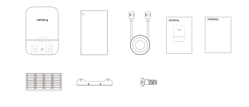M6 tapped holeM6 tapped holeMarking holeMarking holeUpwardA scale of 1:1Unit: mmModel: JA-TS02AQuick GuideHomePower Energy SystemSmart Transfer SwitchAC1GRIDIOTERRORAC2Smart Transfer SwitchPOWERPAUSE/RESUMEAC1GRIDIOTERRORAC2USER MANUALJackery Smart Transfer Switch<strong>Contact</strong> <strong>us:</strong>hello@jackery.comPOWERVersion: JAK-UM-V1.01-888-502-2236(US)Marking holeMarking holePAUSE/RESUMEM6 tapped holeM6 tapped holeJackery Smart Transfer SwitchModèle de marquageEntrée/sortieManuel d’utilisationGuide rapided'alimentation Câble<strong>Vendu</strong> <strong>séparément</strong>4*M4 Phillips plate Vis à tête(fixer des supports muraux pourétiquette de circuit2*Support muralSmart Transfer Switch )

</figure>

<strong>JACKERY INC.</strong>

5310 Bunche Dr., Fremont, CA 94538-8301

<strong>1-888-502-2236</strong> (US)

hello@jackery.com

www.jackery.com

