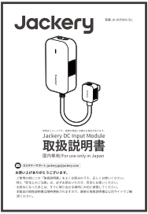
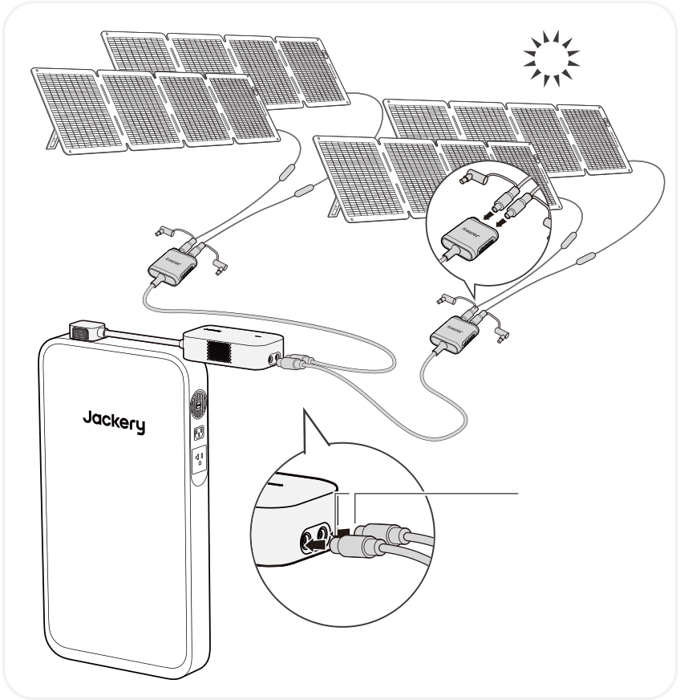

<strong>お買い上げありがとうございます。</strong>

<ul class="jpad-tight simple">
<li>
ご使用の前にこの「取扱説明書」をよくお読みのうえ、正しくお使いください。
</li>
<li>
特に「安全上のご注意」は、必ずお読みいただき、安全にお使いください。
</li>
<li>
お読みになったあとは、すぐに取り出せる場所に大切に保管してください。
</li>
<li>
本製品の取扱説明書は随時更新されますので、最新の取扱説明書は公式サイトでご確認ください。
</li>
</ul>

# 同梱品

<figure aria-label="同梱品" class="hb-inbox-composition" data-card-count="2" data-component-id="HB-SPECIAL-INBOX" data-inbox-variant="responsive-card-grid"><ol class="hb-inbox-grid"><li class="hb-inbox-card" data-item-number="1">

本体

</li><li class="hb-inbox-card" data-item-number="2">

取扱説明書

</li></ol></figure>

<strong>本機の仕様および外観は、改善のため予告なく変更することがあります。</strong>

# 各部の名称

<figure class="hb-reference-figure hb-base-art-live-copy" data-component-id="HB-SPECIAL-REFERENCE-FIGURE" data-reference-id="product-overview" data-source-fragment-sha256="ce934ab4ce71eaa014b8e0698dbe853724b36f83bb4fc6c2faee91db0923e571" data-web-base-art-ref="../../assets/overview-textless.png" data-web-presentation-mode="base-art-live-copy" data-web-replace-key="reference.product-overview">

DC入力ポートPV：16V-60V⎓最大13A，2ポート最大24A，最大500Wｼｶﾞｰｿｹｯﾄ ：11V-16V⎓最大8ALEDライトプラグ

</figure>

<strong>LEDライト</strong>

<table class="manual-table" style="table-layout:fixed;min-width:0!important;">
<colgroup>
<col style="width: 25.0%"/>
<col style="width: 20.0%"/>
<col style="width: 55.0%"/>
</colgroup>
<thead>
<tr><th class="head" scope="col" style="padding:0.25rem 0.6rem!important;text-align:center!important;border-bottom:1px solid var(--hb-line-soft)!important;background:var(--hb-surface-strong)!important;">
LEDライトの状態
</th>
<th class="head" scope="col" style="padding:0.25rem 0.6rem!important;text-align:center!important;border-bottom:1px solid var(--hb-line-soft)!important;background:var(--hb-surface-strong)!important;">
ライトの色
</th>
<th class="head" scope="col" style="padding:0.25rem 0.6rem!important;text-align:center!important;border-bottom:1px solid var(--hb-line-soft)!important;background:var(--hb-surface-strong)!important;">
製品の状態
</th>
</tr>
</thead>
<tbody>
<tr><td style="padding:0.25rem 0.6rem!important;text-align:center!important;">
点滅
</td>
<td style="padding:0.25rem 0.6rem!important;text-align:center!important;">
緑色
</td>
<td style="padding:0.25rem 0.6rem!important;text-align:center!important;">
充電中
</td>
</tr>
<tr><td style="padding:0.25rem 0.6rem!important;text-align:center!important;">
点灯
</td>
<td style="padding:0.25rem 0.6rem!important;text-align:center!important;">
赤色
</td>
<td style="padding:0.25rem 0.6rem!important;text-align:center!important;">
異常状態
</td>
</tr>
<tr><td style="padding:0.25rem 0.6rem!important;text-align:center!important;">
点灯
</td>
<td style="padding:0.25rem 0.6rem!important;text-align:center!important;">
緑色
</td>
<td style="padding:0.25rem 0.6rem!important;text-align:center!important;">
接続成功、充電準備完了
</td>
</tr>
<tr><td style="padding:0.25rem 0.6rem!important;text-align:center!important;">
消灯
</td>
<td style="padding:0.25rem 0.6rem!important;text-align:center!important;">
なし
</td>
<td style="padding:0.25rem 0.6rem!important;text-align:center!important;">
電源オフ
</td>
</tr>
</tbody>
</table>

# 接続

## ソーラー充電

ソーラーパネル接続用のDC入力ポート（8020メス）×2を搭載しており、合計最大入力電力は500Wです。

■ 必要なアクセサリー

<ul class="jpad-tight simple">
<li>
1枚または2枚接続時：直接本体に接続可能です。
</li>
<li>
4枚接続時：別売りの「SolarSagaアダプター（Pro/Plus/New専用）」を2個ご用意いただく必要があります。
</li>
</ul>

※Jackery SolarSagaアダプターを使って3枚接続はできません（電圧が許容範囲を超え、故障のリスクがあります）。

<figure class="hb-reference-figure hb-base-art-live-copy" data-component-id="HB-SPECIAL-REFERENCE-FIGURE" data-reference-id="solar-connection" data-source-fragment-sha256="18e99e15d3199ca456843d250cb4d53f9be9a8d37c64f7692aa000dbc7260299" data-web-base-art-ref="../../assets/solar.png" data-web-presentation-mode="base-art-live-copy" data-web-replace-key="reference.solar-connection">

DC8020

</figure>

<ul>
<li>

直接接続可能です。

追加のアクセサリーは不要です。

本製品のDC入力ポートは「8020メス」です。ソーラーパネル側の「8020オス」と接続してください。

</li>
<li>

別売りの「Jackery SolarSaga アダプター(Pro/Plus/New専用)」が必要です。

 

「Jackery SolarSaga アダプター(Pro/Plus/New専用)」（オス・メス）とも8020端子です。

ソーラーパネルの8020オス端子を「Jackery SolarSaga アダプター(Pro/Plus/New専用)」の8020メス端子に接続してください。

</li>
</ul>

<table class="manual-callout-table" style="width:100%; border-collapse:collapse; margin:0 0 16px 0;"><tbody><tr><td class="manual-callout-label" style="width:16%; border:1px solid #000; padding:6px 8px; vertical-align:top;">
<strong>ご注意</strong>
</td><td class="manual-callout-body" style="border:1px solid #000; padding:6px 8px; vertical-align:top;">
DC入力ポートの電圧を一致させてください2つのDC入力ポートに接続する電源の電圧は必ず一致させてください。電圧が異なると、製品の異常動作や故障の原因となる可能性があります。

<strong>例：</strong>

<ul class="simple">
<li>
2つのDC8020入力ポートにソーラーパネルを接続する際は、同じ型番のJackery製ソーラーパネルを使用し、接続する枚数も揃えてください。異なる型番や接続枚数で接続すると、電圧が不均一になり、製品が故障するおそれがあります。
</li>
<li>
車載充電器とソーラーパネルを同時に使用して製品を充電しないでください。車のヒューズが切れたり、充電が正常に行われなかったりする可能性があります。
</li>
</ul>
</td></tr></tbody></table>

Jackeryブランド以外の付属品を使用して充電しないでください。ソーラーパネルの開放電圧（Voc）が、Jackery SlimPower H1 のDC入力範囲（36.8V～56V）または Jackery Battery PackのDC入力範囲（40V～57.6V）内であることを確認してください。他社ソーラーパネルで充電することによる損失について、当社は一切の責任を負いません。

## シガーソケット充電

Jackery DC Input Moduleに接続することで、Jackery SlimPower H1/Jackery Battery Pack は12V/10A車載充電器で充電できます。

<strong>ご使用の際は、以下にご注意ください：</strong>

<ul class="simple">
<li>
必ず車のエンジンを始動させてから接続してください。エンジン停止状態で使用すると、車両のバッテリーが上がる恐れがあります。
</li>
<li>
車の充電ポートとシガーソケット充電ケーブルの接触状態をご確認ください。
</li>
<li>
ケーブルが確実に奥まで差し込まれていることをご確認ください。
</li>
<li>
悪路などで車両の振動が激しい場合は、接触不良や発熱・焼損の恐れがあるため、充電を中止してください。
</li>
<li>
誤使用による故障・損傷については、弊社では責任を負いかねます。あらかじめご了承ください。
</li>
</ul>

<figure class="hb-reference-figure hb-base-art-live-copy" data-component-id="HB-SPECIAL-REFERENCE-FIGURE" data-reference-id="car-connection" data-source-fragment-sha256="1b24721c23d37addaabddebaa00e2d3db0f972558ef4c9fae4ac3333a02a8312" data-web-base-art-ref="../../assets/car.png" data-web-presentation-mode="base-art-live-copy" data-web-replace-key="reference.car-connection">

車DC8020※ シガーソケット充電ケーブルは別売りです。

</figure>

<table class="manual-callout-table" style="width:100%; border-collapse:collapse; margin:0 0 16px 0;"><tbody><tr><td class="manual-callout-label" style="width:16%; border:1px solid #000; padding:6px 8px; vertical-align:top;">
<strong>ご注意</strong>
</td><td class="manual-callout-body" style="border:1px solid #000; padding:6px 8px; vertical-align:top;"><ul class="simple">
<li>
シガーソケット充電とソーラー充電を同時に使用しないでください。同時に使用すると、車のヒューズが損傷する可能性があります。
</li>
<li>
シガーソケット充電は 12V, 10A 車専用で、24V 車は充電できません。人身傷害や物的損害を避けるため、本製品の充電に 24V 車を使用しないでください。
</li>
</ul>
</td></tr></tbody></table>

# 主な仕様

## 基本情報

<figure aria-label="基本情報" class="hb-spec-table-composition"><table class="manual-spec-table manual-table hb-spec-table"><colgroup><col class="hb-spec-col-label"/><col class="hb-spec-col-value"/></colgroup><tbody>
<tr><th class="manual-spec-label hb-spec-label" scope="row">製品の名称</th><td class="manual-spec-value hb-spec-value">Jackery DC Input Module</td></tr>
<tr><th class="manual-spec-label hb-spec-label" scope="row">型番</th><td class="manual-spec-value hb-spec-value">JA-AD500A-SIL</td></tr>
<tr><th class="manual-spec-label hb-spec-label" scope="row">サイズ＆重量</th><td class="manual-spec-value hb-spec-value">約 170 x 90 x 52 mm (約 0.5kg)</td></tr>
</tbody></table></figure>

## 入力/出カポート

<figure aria-label="入力/出カポート" class="hb-spec-table-composition"><table class="manual-spec-table manual-table hb-spec-table"><colgroup><col class="hb-spec-col-label"/><col class="hb-spec-col-value"/></colgroup><tbody>
<tr><th class="manual-spec-label hb-spec-label" rowspan="2" scope="row">DC 入力</th><td class="manual-spec-value hb-spec-value">11V-16V⎓最大8A</td></tr>
<tr><td class="manual-spec-value hb-spec-value">16V-60V⎓最大13A, 2ポート最大24A，最大500W</td></tr>
<tr><th class="manual-spec-label hb-spec-label" scope="row">DC 出カ</th><td class="manual-spec-value hb-spec-value">42V-58V⎓最大10.7A</td></tr>
</tbody></table></figure>

本製品はJackery SlimPower H1およびJackery Battery Packとの組み合わせ専用となります。他の機器には接続しないでください。

# 保証について

<figure aria-label="保証について" class="hb-warranty-intro-composition" data-component-id="HB-WARRANTY-LEAD">

このたびはJackery製品をご購入いただき、誠にありがとうございます。

本保証書は、Jackeryポータブル電源製品に関する保証内容を明確にご案内するものです。

ご使用前に必ずご確認のうえ、大切に保管してください。

</figure>

<section id="section-2">
<h2>保証期間</h2>
<figure aria-label="保証期間" class="hb-warranty-card" data-component-id="HB-WARRANTY-SECTION" data-warranty-card-index="1">
保証期間はご購入日から1年間です。

※ Jackery公式オンラインストアまたは正規代理店以外での購入品は保証対象外となります。
</figure>
</section>

<section id="section-3">
<h2>保証の適用範囲</h2>
<figure aria-label="保証の適用範囲" class="hb-warranty-card" data-component-id="HB-WARRANTY-SECTION" data-warranty-card-index="2"><ol class="arabic">
<li>

購入チャネルについて

本保証は、Jackery公式オンラインストアまたは正規代理店で購入された製品に限り有効です。

</li>
<li>
保証提供地域保証は、日本国内に在住の方が、日本国内で使用する場合に限り有効です。
</li>
</ol></figure>
</section>

<section id="section-4">
<h2>保証対象外となる場合</h2>
<figure aria-label="保証対象外となる場合" class="hb-warranty-card" data-component-id="HB-WARRANTY-SECTION" data-warranty-card-index="3">
以下のいずれかに該当する場合、保証期間内であっても保証の対象外となります：
<ol class="arabic simple">
<li>
故障・損傷が保証期間内に発生していても、保証期間終了後に申請された場合
</li>
<li>
使用上の誤り（取扱説明書や本体ラベルに記載の注意事項に従わなかった使用）による故障・損傷
</li>
<li>
他機器からの影響、不適切な修理または改造による故障・損傷
</li>
<li>
移設・輸送・落下などに起因する故障・損傷
</li>
<li>
火災・地震・風水害・落雷などの天災、または公害・塩害・異常電圧などによる故障・損傷
</li>
<li>
消耗部品の劣化や摩耗、または外観の汚損など
</li>
</ol></figure>
</section>

<section id="section-5">
<h2>購入証明について</h2>
<figure aria-label="購入証明について" class="hb-warranty-card" data-component-id="HB-WARRANTY-SECTION" data-warranty-card-index="4">
保証をご利用の際には、以下いずれかの購入証明書類をご提示いただく必要があります：
<ul class="simple">
<li>
Jackery公式オンラインストアでの購入：注文番号（注文履歴画面または確認メール）
</li>
<li>
正規代理店での購入：購入日・販売店名の記載された領収書または納品書
</li>
</ul>
※ ご提示がない場合、保証対応いたしかねます。
</figure>
</section>

<section id="section-6">
<h2>保証内容</h2>
<figure aria-label="保証内容" class="hb-warranty-card" data-component-id="HB-WARRANTY-SECTION" data-warranty-card-index="5"><ol class="arabic">
<li>
<strong>初期不良による交換</strong>（ご購入日から30日以内）

<ul class="simple">
<li>
取扱説明書に従った正常な使用中に不具合が発生した場合、同一製品の新品と交換いたします。
</li>
<li>
在庫切れや販売終了の場合は、同等品への交換または返金にて対応いたします。
</li>
</ul>
</li>
<li>
<strong>無償修理</strong>（ご購入日から31日以上～保証期間内）

<ul class="simple">
<li>
保証条件を満たす自然故障については、無料で修理対応いたします。
</li>
<li>
修理が困難な場合は、同等品（同モデルまたは同等スペック品）への交換にて対応いたします。
</li>
</ul>
</li>
<li>
<strong>有償修理</strong>

以下に該当する場合は、有償での修理対応となります：

<ul class="simple">
<li>
保証期間を超えた製品
</li>
<li>
保証対象外と判断された場合
</li>
<li>
Jackery公式オンラインストアまたは正規代理店以外で購入された製品
</li>
</ul>

有償修理後の保証期間は、修理完了日より90日間です。

</li>
</ol>
* 無償修理の場合、残りの保証期間が90日未満であれば「90日間」、90日以上であれば「元の保証期間に準じます」。
</figure>
</section>

<section id="section-7">
<h2>免責事項</h2>
<figure aria-label="免責事項" class="hb-warranty-card" data-component-id="HB-WARRANTY-SECTION" data-warranty-card-index="6"><ol class="arabic simple">
<li>
弊社では、いかなる場合においても、間接的損害または付随的損害（データの損失・逸失利益など）に対して責任を負いません。
</li>
<li>
本保証書は、お客様が法律上有する権利を制限するものではありません。
</li>
<li>
保証内容は、予告なく変更される場合がございます。あらかじめご了承ください。
</li>
</ol>

Jackery製品を安心してご使用いただくために、本保証書の内容をご確認のうえ、ご活用くださいますようお願いいたします。

ご不明点がございましたら、Jackeryカスタマーサービスまでお問い合わせください。

</figure>
</section>

公式サイト: <a href="https://www.jackery.jp">https://www.jackery.jp</a>

カスタマーサポート: <a href="mailto:jackery.jp@jackery.com">jackery.jp@jackery.com</a>

お問い合わせ電話番号: <a href="tel:05031989007">050-3198-9007</a>

