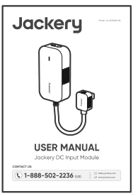
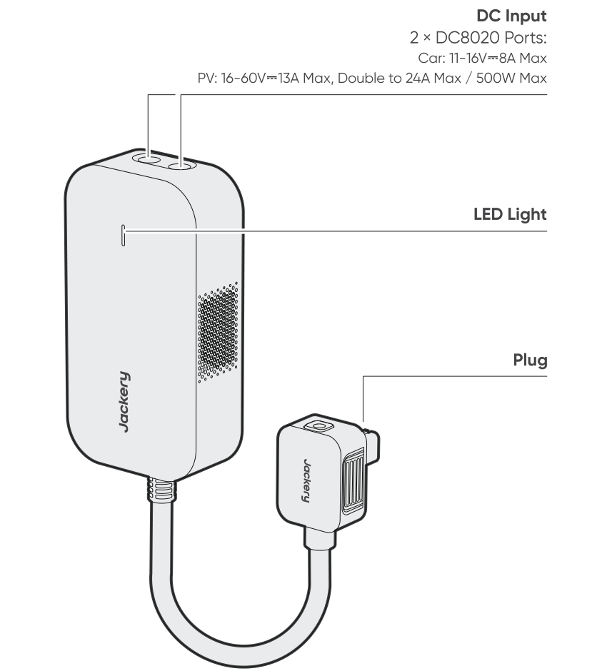

# WHAT'S IN THE BOX

<figure aria-label="WHAT'S IN THE BOX" class="hb-inbox-composition" data-card-count="2" data-component-id="HB-SPECIAL-INBOX" data-inbox-variant="responsive-card-grid"><ol class="hb-inbox-grid"><li class="hb-inbox-card" data-item-number="1">

Jackery DC Input Module

</li><li class="hb-inbox-card" data-item-number="2">

User Manual

</li></ol></figure>

# PRODUCT OVERVIEW

<strong>LED Light</strong>

<table class="manual-table" style="table-layout:fixed;min-width:0!important;">
<colgroup>
<col style="width: 25.0%"/>
<col style="width: 20.0%"/>
<col style="width: 55.0%"/>
</colgroup>
<thead>
<tr><th class="head" scope="col" style="padding:0.25rem 0.6rem!important;text-align:left!important;border-bottom:1px solid var(--hb-line-soft)!important;">
LED Light Status
</th>
<th class="head" scope="col" style="padding:0.25rem 0.6rem!important;text-align:left!important;border-bottom:1px solid var(--hb-line-soft)!important;">
Light Color
</th>
<th class="head" scope="col" style="padding:0.25rem 0.6rem!important;text-align:left!important;border-bottom:1px solid var(--hb-line-soft)!important;">
Product Status
</th>
</tr>
</thead>
<tbody>
<tr><td style="padding:0.25rem 0.6rem!important;text-align:left!important;">
Blinking
</td>
<td style="padding:0.25rem 0.6rem!important;text-align:left!important;">
Green
</td>
<td style="padding:0.25rem 0.6rem!important;text-align:left!important;">
Charging in progress
</td>
</tr>
<tr><td style="padding:0.25rem 0.6rem!important;text-align:left!important;">
Solid
</td>
<td style="padding:0.25rem 0.6rem!important;text-align:left!important;">
Red
</td>
<td style="padding:0.25rem 0.6rem!important;text-align:left!important;">
Abnormal condition
</td>
</tr>
<tr><td style="padding:0.25rem 0.6rem!important;text-align:left!important;">
Solid
</td>
<td style="padding:0.25rem 0.6rem!important;text-align:left!important;">
Green
</td>
<td style="padding:0.25rem 0.6rem!important;text-align:left!important;">
Connected successfully and ready for charging
</td>
</tr>
<tr><td style="padding:0.25rem 0.6rem!important;text-align:left!important;">
Off
</td>
<td style="padding:0.25rem 0.6rem!important;text-align:left!important;">
None
</td>
<td style="padding:0.25rem 0.6rem!important;text-align:left!important;">
Powered off
</td>
</tr>
</tbody>
</table>

# CHARGING

<section id="charging-via-solar-panels-sold-separately">
<h2>CHARGING VIA SOLAR PANELS (SOLD SEPARATELY)</h2>

Charge your product with solar panels and Jackery DC Input Module as shown in the figure below.

<figure class="hb-reference-figure" data-component-id="HB-SPECIAL-REFERENCE-FIGURE" data-reference-id="solar-connection" data-source-fragment-sha256="cce0a1b6acd0a7de5a4b5a6c5579d1cd39a6d306b4ccbad157993ad10cfcc873" data-step-captions="embedded" data-web-replace-key="reference.solar-connection">

</figure>
<table class="manual-callout-table" style="width:100%; border-collapse:collapse; margin:0 0 16px 0;"><tbody><tr><td class="manual-callout-label" style="width:16%; border:1px solid #000; padding:6px 8px; vertical-align:top;">
<strong>CAUTION</strong>
</td><td class="manual-callout-body" style="border:1px solid #000; padding:6px 8px; vertical-align:top;">
One DC8020 input port can be connected to at most two solar panels.
</td></tr></tbody></table><table class="manual-callout-table" style="width:100%; border-collapse:collapse; margin:0 0 16px 0;"><tbody><tr><td class="manual-callout-label" style="width:16%; border:1px solid #000; padding:6px 8px; vertical-align:top;">
<strong>CAUTION</strong>
</td><td class="manual-callout-body" style="border:1px solid #000; padding:6px 8px; vertical-align:top;">
Ensure that the input voltage for both DC input ports is the same. Failure to do so may damage the product. For example:

<ul class="simple">
<li>
It is recommended to use the same model of Jackery solar panels and the same number of panels when connecting solar panels to both DC8020 Input ports.
</li>
<li>
Do not charge the product using both a car charger and a solar panel simultaneously. Doing so may blow the car fuse or result in charging failure.
</li>
</ul>
</td></tr></tbody></table>
It is recommended to use the Jackery solar panel to charge the product. Ensure that the open-circuit voltage (Voc) of the solar panel is within the DC input range (36.8V–56V) of the Jackery FridgeGuard or the DC input range (40V–57.6V) of the Jackery Battery Pack. Jackery is not responsible for any damage or loss resulting from the use of third-party solar panels.

</section>

<section id="charging-with-a-car-charger-sold-separately">
<h2>CHARGING WITH A CAR CHARGER(SOLD SEPARATELY)</h2>

Charge your product with the car charger and Jackery DC Input Module as shown in the figure below. Ensure that the car charger and the 12V car power outlet provide a good connection.

<figure class="hb-reference-figure hb-base-art-live-copy" data-component-id="HB-SPECIAL-REFERENCE-FIGURE" data-reference-id="car-connection" data-source-fragment-sha256="3c62ad664ebee6dd783521691a1dd7500b3a44cbfaabca1cbcc918d15ed64f90" data-web-base-art-ref="../../assets/car.png" data-web-presentation-mode="base-art-live-copy" data-web-replace-key="reference.car-connection">

VehicleDC8020※ The car charging cable is sold separately.

</figure>
<table class="manual-callout-table" style="width:100%; border-collapse:collapse; margin:0 0 16px 0;"><tbody><tr><td class="manual-callout-label" style="width:16%; border:1px solid #000; padding:6px 8px; vertical-align:top;">
<strong>CAUTION</strong>
</td><td class="manual-callout-body" style="border:1px solid #000; padding:6px 8px; vertical-align:top;"><ul class="simple">
<li>
Please start the vehicle before charging your power station.
</li>
<li>
If the vehicle is running on bumpy roads, it is forbidden to use the car charger in case it causes non-standard operation. The Company will not be responsible for any loss caused by non-standard operation.
</li>
<li>
Vehicle charging is only applicable to vehicles with 12V DC, not 24V DC. Please do not charge this product in 24V vehicle to avoid personal injury and property loss.
</li>
</ul>
</td></tr></tbody></table></section>

# SPECIFICATIONS

## GENERAL INFO

<figure aria-label="GENERAL INFO" class="hb-spec-table-composition"><table class="manual-spec-table manual-table hb-spec-table"><colgroup><col class="hb-spec-col-label"/><col class="hb-spec-col-value"/></colgroup><tbody>
<tr><th class="manual-spec-label hb-spec-label" scope="row">Product Name</th><td class="manual-spec-value hb-spec-value">Jackery DC Input Module</td></tr>
<tr><th class="manual-spec-label hb-spec-label" scope="row">Model No.</th><td class="manual-spec-value hb-spec-value">JA-AD500A-SIL</td></tr>
<tr><th class="manual-spec-label hb-spec-label" scope="row">Weight</th><td class="manual-spec-value hb-spec-value">About 1.1 lbs/0.5 kg</td></tr>
<tr><th class="manual-spec-label hb-spec-label" scope="row">Dimensions</th><td class="manual-spec-value hb-spec-value">6.7 × 3.5 × 2.1 in/17 × 9 × 5.2 cm</td></tr>
</tbody></table></figure>

## INPUT/OUTPUT PORTS

<figure aria-label="INPUT/OUTPUT PORTS" class="hb-spec-table-composition"><table class="manual-spec-table manual-table hb-spec-table"><colgroup><col class="hb-spec-col-label"/><col class="hb-spec-col-value"/></colgroup><tbody>
<tr><th class="manual-spec-label hb-spec-label" rowspan="2" scope="row">DC Input</th><td class="manual-spec-value hb-spec-value">11V–16V⎓8A Max</td></tr>
<tr><td class="manual-spec-value hb-spec-value">16V–60V⎓13A Max, Double to 24A Max / 500W Max</td></tr>
<tr><th class="manual-spec-label hb-spec-label" scope="row">DC Output</th><td class="manual-spec-value hb-spec-value">42V–58V⎓10.7A Max</td></tr>
</tbody></table></figure>

# WARRANTY

<figure aria-label="WARRANTY" class="hb-warranty-intro-composition" data-component-id="HB-WARRANTY-LEAD">

<strong>We only provide our warranty to customers who purchase from the official Jackery website, Jackery-branded third-party platforms, or local authorized dealers.</strong>

* Warranty period and details may vary according to local laws, regulations, and authorized dealers.

</figure>

<section id="limited-warranty">
<h2>Limited Warranty</h2>
<figure aria-label="Limited Warranty" class="hb-warranty-card" data-component-id="HB-WARRANTY-SECTION" data-warranty-card-index="1">
Jackery warrants to the original consumer purchaser that the Jackery product will be free from defects in workmanship and material under normal consumer use during the applicable warranty period identified in the 'Warranty Period' section below, subject to the exclusions set forth below.

This warranty statement sets forth Jackery's total and exclusive warranty obligation. We will not assume, nor authorize any person to assume for us, any other liability in connection with the sale of our products.
</figure>
</section>

<section id="warranty-period">
<h2>Warranty Period</h2>
<figure aria-label="Warranty Period" class="hb-warranty-period-card" data-component-id="HB-WARRANTY-YEARS">

1
<strong class="hb-warranty-years-unit">YEAR</strong><strong class="hb-warranty-period-label">Standard Warranty</strong>

The standard warranty period for Jackery DC Input Module is 12 months. In each case, the warranty period is measured starting on the date of purchase by the original consumer purchaser. The sales receipt from the first consumer purchaser, or other reasonable documentary proof, is required in order to establish the start date of the warranty period.

</figure>
</section>

<section id="repair-or-replacement">
<h2>Repair or replacement</h2>
<figure aria-label="Repair or replacement" class="hb-warranty-card" data-component-id="HB-WARRANTY-SECTION" data-warranty-card-index="3">
Jackery will repair or replace (at Jackery's expense) any Jackery product that fails to operate during the applicable warranty period due to a defect in workmanship or material. The repaired/replaced product assumes the remaining warranty of the original date of purchase.
</figure>
</section>

<section id="limited-to-original-consumer-buyer">
<h2>Limited to Original Consumer Buyer</h2>
<figure aria-label="Limited to Original Consumer Buyer" class="hb-warranty-card" data-component-id="HB-WARRANTY-SECTION" data-warranty-card-index="4">
The warranty on Jackery's product is limited to the original consumer purchaser and is not transferable to any subsequent owner.
</figure>
</section>

<section id="exclusions">
<h2>Exclusions</h2>
<figure aria-label="Exclusions" class="hb-warranty-card" data-component-id="HB-WARRANTY-SECTION" data-warranty-card-index="5">
Jackery's warranty does not apply to:
<ul class="simple">
<li>
Misused, abused, modified, damaged by accident, or used for anything other than normal consumer use as authorized in Jackery's current product literature.
</li>
<li>
Attempted repair by anyone other than an authorized facility.
</li>
<li>
Any product purchased through an online auction house.
</li>
<li>
Jackery's warranty does not apply to the battery cell unless the battery cell is fully charged by you within seven days after you purchase the product and at least once every 6 months thereafter.
</li>
</ul></figure>
</section>

<section id="interpretation-rights">
<h2>Interpretation Rights</h2>
<figure aria-label="Interpretation Rights" class="hb-warranty-card" data-component-id="HB-WARRANTY-SECTION" data-warranty-card-index="6">
Jackery reserves the right to final interpretation of the above customer after-sales policy.
</figure>
</section>

<strong>JACKERY INC.</strong>

5310 Bunche Dr., Fremont, CA 94538-8301

<a href="tel:18885022236">1-888-502-2236 (US)</a>

<a href="mailto:hello@jackery.com">hello@jackery.com</a> <a href="https://www.jackery.com">www.jackery.com</a>

