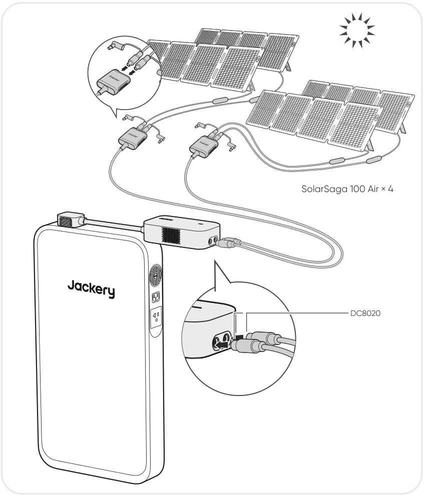

# CONTENIDO DE LA CAJA

<figure aria-label="CONTENIDO DE LA CAJA" class="hb-inbox-composition" data-card-count="2" data-component-id="HB-SPECIAL-INBOX" data-inbox-variant="responsive-card-grid"><ol class="hb-inbox-grid"><li class="hb-inbox-card" data-item-number="1">

Jackery DC Input Module

</li><li class="hb-inbox-card" data-item-number="2">

Manual de usuario

</li></ol></figure>

# DESCRIPCIÓN GENERAL DEL PRODUCTO

<figure class="hb-reference-figure hb-base-art-live-copy" data-component-id="HB-SPECIAL-REFERENCE-FIGURE" data-reference-id="product-overview" data-source-fragment-sha256="3e94ded500d8e16d97ac8c6405d5d68aeb903d76ba12bc2704adb6b0bf1869c6" data-web-base-art-ref="../../assets/overview-textless.png" data-web-presentation-mode="base-art-live-copy" data-web-replace-key="reference.product-overview">

<strong>Entrada de CC</strong>2 x Puertos DC8020:Auto: 11–16 V⎓8 A MáxPV: 16–60 V⎓13 A Máx, Doble a 24 A Máx / 500 W Máx<strong>Luz LED</strong><strong>Conectar</strong>

</figure>

<strong>Luz LED</strong>

<table class="manual-table" style="table-layout:fixed;min-width:0!important;">
<colgroup>
<col style="width: 25.0%"/>
<col style="width: 20.0%"/>
<col style="width: 55.0%"/>
</colgroup>
<thead>
<tr><th class="head" scope="col" style="padding:0.25rem 0.4rem!important;text-align:left!important;border-bottom:1px solid var(--hb-line-soft)!important;">
Estado de la luz LED
</th>
<th class="head" scope="col" style="padding:0.25rem 0.4rem!important;text-align:left!important;border-bottom:1px solid var(--hb-line-soft)!important;">
Color de la luz
</th>
<th class="head" scope="col" style="padding:0.25rem 0.4rem!important;text-align:left!important;border-bottom:1px solid var(--hb-line-soft)!important;">
Estado del producto
</th>
</tr>
</thead>
<tbody>
<tr><td style="padding:0.25rem 0.6rem!important;text-align:left!important;">
Parpadeando
</td>
<td style="padding:0.25rem 0.6rem!important;text-align:left!important;">
Verde
</td>
<td style="padding:0.25rem 0.6rem!important;text-align:left!important;">
Carga en progreso
</td>
</tr>
<tr><td style="padding:0.25rem 0.6rem!important;text-align:left!important;">
Fijo
</td>
<td style="padding:0.25rem 0.6rem!important;text-align:left!important;">
Rojo
</td>
<td style="padding:0.25rem 0.6rem!important;text-align:left!important;">
Condición anormal
</td>
</tr>
<tr><td style="padding:0.25rem 0.6rem!important;text-align:left!important;">
Fijo
</td>
<td style="padding:0.25rem 0.6rem!important;text-align:left!important;">
Verde
</td>
<td style="padding:0.25rem 0.6rem!important;text-align:left!important;">
Conectado correctamente y listo para carga
</td>
</tr>
<tr><td style="padding:0.25rem 0.6rem!important;text-align:left!important;">
Apagado
</td>
<td style="padding:0.25rem 0.6rem!important;text-align:left!important;">
Ninguno
</td>
<td style="padding:0.25rem 0.6rem!important;text-align:left!important;">
Apagado
</td>
</tr>
</tbody>
</table>

# CARGANDO

<section id="carga-mediante-paneles-solares-se-vende-por-separado">
<h2>CARGA MEDIANTE PANELES SOLARES (SE VENDE POR SEPARADO)</h2>

Cargue su producto con paneles solares y el Jackery DC Input Module como se muestra en la siguiente figura.

<figure class="hb-reference-figure" data-component-id="HB-SPECIAL-REFERENCE-FIGURE" data-reference-id="solar-connection" data-source-fragment-sha256="811370ec73101a1afcd78a811f769a65267244379afe341d7fe8d95267502ad6" data-step-captions="embedded" data-web-replace-key="reference.solar-connection">

</figure>
<table class="manual-callout-table" style="width:100%; border-collapse:collapse; margin:0 0 16px 0;"><tbody><tr><td class="manual-callout-label" style="width:16%; border:1px solid #000; padding:6px 8px; vertical-align:top;">
<strong>PRECAUCIÓN</strong>
</td><td class="manual-callout-body" style="border:1px solid #000; padding:6px 8px; vertical-align:top;">
Un puerto de entrada DC8020 puede conectarse a un máximo de dos paneles solares.
</td></tr></tbody></table><table class="manual-callout-table" style="width:100%; border-collapse:collapse; margin:0 0 16px 0;"><tbody><tr><td class="manual-callout-label" style="width:16%; border:1px solid #000; padding:6px 8px; vertical-align:top;">
<strong>PRECAUCIÓN</strong>
</td><td class="manual-callout-body" style="border:1px solid #000; padding:6px 8px; vertical-align:top;">
Asegúrese de que el voltaje de entrada para ambos puertos de entrada CC sea el mismo. De lo contrario, podría dañar el producto. Por ejemplo:

<ul class="simple">
<li>
Utilizar paneles solares Jackery del mismo modelo y la misma cantidad de paneles al conectar paneles solares a ambos puertos de entrada DC8020.
</li>
<li>
No cargue el producto utilizando simultáneamente un cargador de automóvil y un panel solar. Hacerlo podría quemar el fusible del coche o resultar en un fallo de carga.
</li>
</ul>
</td></tr></tbody></table>
Se recomienda usar el panel solar Jackery para cargar el Jackery Battery Pack y Jackery FridgeGuard. Asegúrese de que el voltaje de circuito abierto (Voc) del panel solar esté dentro del rango de entrada de CC (36.8 V–56 V) del Jackery FridgeGuard o del rango de entrada de CC (40 V–57.6 V) del Jackery Battery Pack. Jackery no se hace responsable de pérdidas causadas por el uso de paneles solares de otras marcas.

</section>

<section id="carga-con-un-cargador-de-en-el-vehiculo-se-vende-por-separado">
<h2>CARGA CON UN CARGADOR DE EN EL VEHÍCULO (SE VENDE POR SEPARADO)</h2>

Cargue su producto con el cargador de automóvil y el módulo de entrada de CC Jackery como se muestra en la figura a continuación. Asegúrese de que el cargador de coche y el encendedor de coche ofrecen una buena conexión.

<figure class="hb-reference-figure hb-base-art-live-copy" data-component-id="HB-SPECIAL-REFERENCE-FIGURE" data-reference-id="car-connection" data-source-fragment-sha256="ad8d3d2ec1bcdb9c64887ddbe11c810f4dfb267832d6967575e4a12c4911effb" data-web-base-art-ref="../../assets/car.png" data-web-presentation-mode="base-art-live-copy" data-web-replace-key="reference.car-connection">

VehículoDC8020※ El cable de carga para auto se vende por separado.

</figure>
<table class="manual-callout-table" style="width:100%; border-collapse:collapse; margin:0 0 16px 0;"><tbody><tr><td class="manual-callout-label" style="width:16%; border:1px solid #000; padding:6px 8px; vertical-align:top;">
<strong>PRECAUCIÓN</strong>
</td><td class="manual-callout-body" style="border:1px solid #000; padding:6px 8px; vertical-align:top;"><ul class="simple">
<li>
Por favor, encienda el vehículo antes de cargar su estación de energía.
</li>
<li>
Si el vehículo circula por caminos accidentados, está prohibido usar el cargador de coche para evitar que se queme debido a una mala conexión. La empresa no se responsabiliza por pérdidas causadas por un uso incorrecto.
</li>
<li>
La carga en vehículo solo es aplicable a vehículos con 12 V CC, no a 24 V CC. Por favor, no cargue este producto en vehículos de 24 V para evitar lesiones personales y daños materiales.
</li>
</ul>
</td></tr></tbody></table></section>

# ESPECIFICACIONES

## INFORMACIÓN GENERAL

<figure aria-label="INFORMACIÓN GENERAL" class="hb-spec-table-composition"><table class="manual-spec-table manual-table hb-spec-table"><colgroup><col class="hb-spec-col-label"/><col class="hb-spec-col-value"/></colgroup><tbody>
<tr><th class="manual-spec-label hb-spec-label" scope="row">Nombre del producto</th><td class="manual-spec-value hb-spec-value">Jackery DC Input Module</td></tr>
<tr><th class="manual-spec-label hb-spec-label" scope="row">N° de modelo</th><td class="manual-spec-value hb-spec-value">JA-AD500A-SIL</td></tr>
<tr><th class="manual-spec-label hb-spec-label" scope="row">Peso</th><td class="manual-spec-value hb-spec-value">Aproximadamente 1,1 libras/0,5 kg</td></tr>
<tr><th class="manual-spec-label hb-spec-label" scope="row">Dimensiones</th><td class="manual-spec-value hb-spec-value">6,7 × 3,5 × 2,1 pulgadas/17 × 9 × 5,2 cm</td></tr>
</tbody></table></figure>

## PUERTOS DE ENTRADA/SALIDA

<figure aria-label="PUERTOS DE ENTRADA/SALIDA" class="hb-spec-table-composition"><table class="manual-spec-table manual-table hb-spec-table"><colgroup><col class="hb-spec-col-label"/><col class="hb-spec-col-value"/></colgroup><tbody>
<tr><th class="manual-spec-label hb-spec-label" rowspan="2" scope="row">Entrada de CC</th><td class="manual-spec-value hb-spec-value">11V–16V⎓8A Máx</td></tr>
<tr><td class="manual-spec-value hb-spec-value">16V–60V⎓13A Máx, Double to 24AMáx / 500W Máx</td></tr>
<tr><th class="manual-spec-label hb-spec-label" scope="row">Salidas de CC</th><td class="manual-spec-value hb-spec-value">42V–58V⎓10,7A Máx</td></tr>
</tbody></table></figure>

# GARANTÍA

<figure aria-label="GARANTÍA" class="hb-warranty-intro-composition" data-component-id="HB-WARRANTY-LEAD">

<strong>Solo ofrecemos nuestra garantía a clientes que compren en el sitio web oficial de Jackery, plataformas de terceros con la marca Jackery o distribuidores autorizados locales.</strong>

* El periodo de garantía y los detalles pueden variar según las leyes, regulaciones y distribuidores autorizados locales.

</figure>

<section id="garantia-limitada">
<h2>GARANTÍA LIMITADA</h2>
<figure aria-label="GARANTÍA LIMITADA" class="hb-warranty-card" data-component-id="HB-WARRANTY-SECTION" data-warranty-card-index="1">
Jackery Inc. garantiza al consumidor original que el producto de Jackery estará libre de defectos relativos al acabado y a los materiales en condiciones normales de uso por parte del consumidor durante el período de garantía aplicable identificado en la sección "Período de garantía" que figura a continuación, sujeto a las exclusiones que se establecen a continuación.

Esta declaración de garantía establece la obligación de garantía total y exclusiva de Jackery. No asumimos ni autorizaremos que ninguna persona asuma por nosotros ninguna otra responsabilidad en relación con la venta de nuestros productos.
</figure>
</section>

<section id="periodo-de-garantia">
<h2>PERÍODO DE GARANTÍA</h2>
<figure aria-label="PERÍODO DE GARANTÍA" class="hb-warranty-period-card" data-component-id="HB-WARRANTY-YEARS">

1
<strong class="hb-warranty-years-unit">AÑO</strong><strong class="hb-warranty-period-label">Garantía estándar</strong>

El período de garantía estándar de Jackery DC Input Module es de 12 meses. En cada caso, el período de garantía se mide a partir de la fecha de compra por parte del comprador consumidor original. Para establecer la fecha de inicio del período de garantía, se necesita el recibo de venta de la primera compra del consumidor u otra prueba documental razonable.

</figure>
</section>

<section id="reparacion-o-reemplazo">
<h2>REPARACIÓN O REEMPLAZO</h2>
<figure aria-label="REPARACIÓN O REEMPLAZO" class="hb-warranty-card" data-component-id="HB-WARRANTY-SECTION" data-warranty-card-index="3">
Jackery reparará o reemplazará (a cargo de Jackery) cualquier producto Jackery que no funcione durante el período de garantía aplicable debido a defectos en la mano de obra o el material. El producto reparado o reemplazado asumirá el período restante de la garantía desde la fecha original de compra.
</figure>
</section>

<section id="limitado-al-comprador-consumidor-original">
<h2>LIMITADO AL COMPRADOR CONSUMIDOR ORIGINAL</h2>
<figure aria-label="LIMITADO AL COMPRADOR CONSUMIDOR ORIGINAL" class="hb-warranty-card" data-component-id="HB-WARRANTY-SECTION" data-warranty-card-index="4">
La garantía del producto de Jackery se limita al consumidor original y no es transferible a ningún propietario posterior.
</figure>
</section>

<section id="exclusiones">
<h2>EXCLUSIONES</h2>
<figure aria-label="EXCLUSIONES" class="hb-warranty-card" data-component-id="HB-WARRANTY-SECTION" data-warranty-card-index="5">
La garantía de Jackery no se aplica a:
<ul class="simple">
<li>
Mal uso, abuso, modificación, daño por accidente, o uso para cualquier cosa que no sea el uso normal del consumidor según lo autorizado en los folletos actuales del producto de Jackery.
</li>
<li>
Intento de reparación por parte de alguien que no sea un centro autorizado.
</li>
<li>
Cualquier producto adquirido a través de una casa de subastas en línea.
</li>
<li>
La garantía de Jackery no se aplica a la célula de la batería a menos que usted la cargue completamente en los siete días siguientes a la compra del producto y, a partir de entonces, al menos una vez cada 6 meses.
</li>
</ul></figure>
</section>

<section id="derechos-de-interpretacion">
<h2>DERECHOS DE INTERPRETACIÓN</h2>
<figure aria-label="DERECHOS DE INTERPRETACIÓN" class="hb-warranty-card" data-component-id="HB-WARRANTY-SECTION" data-warranty-card-index="6">
La garantía del producto de Jackery se limita al consumidor original y no es transferible a ningún propietario posterior.
</figure>
</section>

<strong>JACKERY INC.</strong>

5310 Bunche Dr., Fremont, CA 94538-8301

<a href="tel:18885022236">1-888-502-2236 (US)</a>

<a href="mailto:hello@jackery.com">hello@jackery.com</a> <a href="https://www.jackery.com">www.jackery.com</a>

