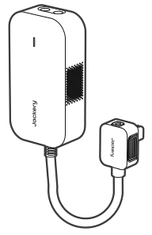

# CONTENU DE LA BOÎTE

<figure aria-label="CONTENU DE LA BOÎTE" class="hb-inbox-composition" data-card-count="2" data-component-id="HB-SPECIAL-INBOX" data-inbox-variant="responsive-card-grid"><ol class="hb-inbox-grid"><li class="hb-inbox-card" data-item-number="1">

Jackery DC Input Module

</li><li class="hb-inbox-card" data-item-number="2">

Manuel d’utilisation

</li></ol></figure>

# APERÇU DU PRODUIT

<figure class="hb-reference-figure hb-base-art-live-copy" data-component-id="HB-SPECIAL-REFERENCE-FIGURE" data-reference-id="product-overview" data-source-fragment-sha256="6d90a95c353fa2624ab8bad05b4d955b34dd9e18607695fa0e255835f688a916" data-web-base-art-ref="../../assets/overview-textless.png" data-web-presentation-mode="base-art-live-copy" data-web-replace-key="reference.product-overview">

<strong>Entrée CC</strong>2×Ports DC8020:Oiture: 11–16 V⎓8 A max.PV: 16–60 V⎓13 A Max, Double to 24 A max. / 500W max.<strong>Lumière LED</strong><strong>Prise</strong>

</figure>

<strong>Lumière LED</strong>

<table class="manual-table" style="table-layout:fixed;min-width:0!important;">
<colgroup>
<col style="width: 25.0%"/>
<col style="width: 20.0%"/>
<col style="width: 55.0%"/>
</colgroup>
<thead>
<tr><th class="head" scope="col" style="padding:0.25rem 0.4rem!important;text-align:left!important;border-bottom:1px solid var(--hb-line-soft)!important;">
État du voyant DEL
</th>
<th class="head" scope="col" style="padding:0.25rem 0.4rem!important;text-align:left!important;border-bottom:1px solid var(--hb-line-soft)!important;">
Couleur
</th>
<th class="head" scope="col" style="padding:0.25rem 0.4rem!important;text-align:left!important;border-bottom:1px solid var(--hb-line-soft)!important;">
État du produit
</th>
</tr>
</thead>
<tbody>
<tr><td style="padding:0.25rem 0.6rem!important;text-align:left!important;">
Clignotant
</td>
<td style="padding:0.25rem 0.6rem!important;text-align:left!important;">
Vert
</td>
<td style="padding:0.25rem 0.6rem!important;text-align:left!important;">
Charge en cours
</td>
</tr>
<tr><td style="padding:0.25rem 0.6rem!important;text-align:left!important;">
Fixe
</td>
<td style="padding:0.25rem 0.6rem!important;text-align:left!important;">
Rouge
</td>
<td style="padding:0.25rem 0.6rem!important;text-align:left!important;">
Condition anormale
</td>
</tr>
<tr><td style="padding:0.25rem 0.6rem!important;text-align:left!important;">
Fixe
</td>
<td style="padding:0.25rem 0.6rem!important;text-align:left!important;">
Vert
</td>
<td style="padding:0.25rem 0.6rem!important;text-align:left!important;">
Connecté avec succès et prêt à charger
</td>
</tr>
<tr><td style="padding:0.25rem 0.6rem!important;text-align:left!important;">
Éteint
</td>
<td style="padding:0.25rem 0.6rem!important;text-align:left!important;">
Aucun
</td>
<td style="padding:0.25rem 0.6rem!important;text-align:left!important;">
Éteint
</td>
</tr>
</tbody>
</table>

# CHARGE

<section id="chargement-par-panneaux-solaires-vendu-separement">
<h2>CHARGEMENT PAR PANNEAUX SOLAIRES (VENDU SÉPARÉMENT)</h2>

Rechargez votre dispositif à l’aide de panneaux solaires et du Jackery DC Input Module, comme indiqué dans la figure ci-dessous.

<figure class="hb-reference-figure" data-component-id="HB-SPECIAL-REFERENCE-FIGURE" data-reference-id="solar-connection" data-source-fragment-sha256="811370ec73101a1afcd78a811f769a65267244379afe341d7fe8d95267502ad6" data-step-captions="embedded" data-web-replace-key="reference.solar-connection">

</figure>
<table class="manual-callout-table" style="width:100%; border-collapse:collapse; margin:0 0 16px 0;"><tbody><tr><td class="manual-callout-label" style="width:16%; border:1px solid #000; padding:6px 8px; vertical-align:top;">
<strong>ATTENTION</strong>
</td><td class="manual-callout-body" style="border:1px solid #000; padding:6px 8px; vertical-align:top;">
Un port d’entrée DC8020 peut être connecté à un maximum de deux panneaux solaires.
</td></tr></tbody></table><table class="manual-callout-table" style="width:100%; border-collapse:collapse; margin:0 0 16px 0;"><tbody><tr><td class="manual-callout-label" style="width:16%; border:1px solid #000; padding:6px 8px; vertical-align:top;">
<strong>ATTENTION</strong>
</td><td class="manual-callout-body" style="border:1px solid #000; padding:6px 8px; vertical-align:top;">
Assurez-vous que la tension d’entrée pour les deux ports d’entrée CC est la même. Sinon, le produit pourrait être endommagé. Par exemple:

<ul class="simple">
<li>
Utiliser le même modèle de panneaux solaires Jackery et le même nombre de panneaux lors de la connexion des panneaux solaires aux deux ports d’entrée DC8020.
</li>
<li>
Ne chargez pas le produit à la fois avec un chargeur de voiture et un panneau solaire simultanément. Cela pourrait faire sauter le fusible de la voiture ou entraîner un échec de la charge.
</li>
</ul>
</td></tr></tbody></table>
Il est recommandé d’utiliser le panneau solaire Jackery pour charger le Jackery FridgeGuard et Jackery Battery Pack. Assurez-vous que la tension en circuit ouvert (Voc) du panneau solaire se situe dans la plage d’entrée CC (36.8 V–56 V) du Jackery FridgeGuard ou dans la plage d’entrée CC (40 V–57.6 V) du Jackery Battery Pack. Jackery décline toute responsabilité en cas de pertes causées par l’utilisation de panneaux solaires d’autres marques.

</section>

<section id="chargement-par-prise-de-voiture-vendu-separement">
<h2>CHARGEMENT PAR PRISE DE VOITURE (VENDU SÉPARÉMENT)</h2>

Chargez votre produit avec le chargeur de voiture et le Jackery DC Input Module comme illustré dans la figure ci-dessous. Assurez-vous que le chargeur allume-cigare et l’allume-cigare de la voiture sont bien branchés.

<figure class="hb-reference-figure hb-base-art-live-copy" data-component-id="HB-SPECIAL-REFERENCE-FIGURE" data-reference-id="car-connection" data-source-fragment-sha256="48cdcf93741ab6843dad6796eda6cfed294f2d39a616648fd99f53257594178e" data-web-base-art-ref="../../assets/car.png" data-web-presentation-mode="base-art-live-copy" data-web-replace-key="reference.car-connection">

VéhiculeDC8020※ Le câble de chargement de voiture est vendu séparément.

</figure>
<table class="manual-callout-table" style="width:100%; border-collapse:collapse; margin:0 0 16px 0;"><tbody><tr><td class="manual-callout-label" style="width:16%; border:1px solid #000; padding:6px 8px; vertical-align:top;">
<strong>ATTENTION</strong>
</td><td class="manual-callout-body" style="border:1px solid #000; padding:6px 8px; vertical-align:top;"><ul class="simple">
<li>
Veuillez démarrer le véhicule avant de charger votre station d’alimentation.
</li>
<li>
Si le véhicule roule sur des routes accidentées, il est interdit d’utiliser le chargeur de voiture afin d’éviter tout risque de surchauffe dû à une mauvaise connexion. La société ne sera pas responsable des pertes causées par une utilisation non conforme.
</li>
<li>
La charge par véhicule est uniquement applicable aux véhicules en 12 V CC, pas en 24 V CC. Veuillez ne pas charger ce produit dans un véhicule 24 V afin d’éviter tout risque de blessure ou de dommage matériel.
</li>
</ul>
</td></tr></tbody></table></section>

# SPÉCIFICATIONS

## INFORMATIONS GÉNÉRALES

<figure aria-label="INFORMATIONS GÉNÉRALES" class="hb-spec-table-composition"><table class="manual-spec-table manual-table hb-spec-table"><colgroup><col class="hb-spec-col-label"/><col class="hb-spec-col-value"/></colgroup><tbody>
<tr><th class="manual-spec-label hb-spec-label" scope="row">Nom du produit</th><td class="manual-spec-value hb-spec-value">Jackery DC Input Module</td></tr>
<tr><th class="manual-spec-label hb-spec-label" scope="row">N° modèle</th><td class="manual-spec-value hb-spec-value">JA-AD500A-SIL</td></tr>
<tr><th class="manual-spec-label hb-spec-label" scope="row">Poids</th><td class="manual-spec-value hb-spec-value">Environ 1,1 lbs/0,5kg</td></tr>
<tr><th class="manual-spec-label hb-spec-label" scope="row">Dimensions</th><td class="manual-spec-value hb-spec-value">6,7 × 3,5 × 2,1 po/17 × 9 × 5,2 cm</td></tr>
</tbody></table></figure>

## PORTS D’ENTRÉE/SORTIE

<figure aria-label="PORTS D’ENTRÉE/SORTIE" class="hb-spec-table-composition"><table class="manual-spec-table manual-table hb-spec-table"><colgroup><col class="hb-spec-col-label"/><col class="hb-spec-col-value"/></colgroup><tbody>
<tr><th class="manual-spec-label hb-spec-label" rowspan="2" scope="row">Sortie CC</th><td class="manual-spec-value hb-spec-value">11 V–16 V⎓8 A max.</td></tr>
<tr><td class="manual-spec-value hb-spec-value">16 V–60 V⎓13 A max., double à 24 A max./500 W max.</td></tr>
<tr><th class="manual-spec-label hb-spec-label" scope="row">Entrée CC</th><td class="manual-spec-value hb-spec-value">42V–58V⎓10,7A max.</td></tr>
</tbody></table></figure>

# GARANTIE

<figure aria-label="GARANTIE" class="hb-warranty-intro-composition" data-component-id="HB-WARRANTY-LEAD">

<strong>Nous ne fournissons notre garantie qu’aux clients qui achètent sur le site officiel de Jackery, sur des plateformes tierces portant la marque Jackery, ou auprès de revendeurs autorisés locaux.</strong>

* La durée et les détails de la garantie peuvent varier en fonction des lois, réglementations et revendeurs autorisés locaux.

</figure>

<section id="garantie-limitee">
<h2>Garantie limitée</h2>
<figure aria-label="Garantie limitée" class="hb-warranty-card" data-component-id="HB-WARRANTY-SECTION" data-warranty-card-index="1">
Jackery Inc. garantit à l’acheteur et consommateur d’origine que le produit de Jackery sera exempt de tout défaut de fabrication et de matériaux dans le cadre d’une utilisation normale pendant toute la durée de la période de garantie applicable identifiée dans la section « Période de garantie » ci-dessous, sous réserve des exceptions énoncées ci-dessous.

Cette déclaration de garantie énonce les obligations totales et exclusives de garantie de Jackery. Nous n’assumerons pas et nous n’autorisons personne à assumer pour nous toute autre responsabilité en lien avec la vente de nos produits.
</figure>
</section>

<section id="periode-de-garantie">
<h2>Période de garantie</h2>
<figure aria-label="Période de garantie" class="hb-warranty-period-card" data-component-id="HB-WARRANTY-YEARS">

1
<strong class="hb-warranty-years-unit">AN</strong><strong class="hb-warranty-period-label">Garantie standard</strong>

La période de garantie standard du Jackery DC Input Module est de 12 mois. Dans tous les cas, la période de garantie commence à compter de la date d’achat par l’acheteur et consommateur d’origine. La facture du premier achat du consommateur ou toute autre preuve documentaire raisonnable est nécessaire afin d’établir la date de début de la période de garantie.

</figure>
</section>

<section id="reparation-ou-remplacement">
<h2>Réparation ou remplacement</h2>
<figure aria-label="Réparation ou remplacement" class="hb-warranty-card" data-component-id="HB-WARRANTY-SECTION" data-warranty-card-index="3">
Jackery réparera ou remplacera (aux frais de Jackery) tout produit Jackery qui cesse de fonctionner pendant la période de garantie applicable en raison d’un défaut de fabrication ou de matériau. Le produit réparé ou remplacé bénéficie de la garantie restante de la date d’achat d’origine.
</figure>
</section>

<section id="limitee-a-lacheteur-et-consommateur-dorigine">
<h2>Limitée à l’acheteur et consommateur d’origine</h2>
<figure aria-label="Limitée à l’acheteur et consommateur d’origine" class="hb-warranty-card" data-component-id="HB-WARRANTY-SECTION" data-warranty-card-index="4">
La garantie d’un produit Jackery est limitée à l’acheteur et consommateur d’origine, elle ne peut pas être transférée à un autre propriétaire.
</figure>
</section>

<section id="exclusions">
<h2>Exclusions</h2>
<figure aria-label="Exclusions" class="hb-warranty-card" data-component-id="HB-WARRANTY-SECTION" data-warranty-card-index="5">
La garantie de Jackery ne s’applique pas à :
<ul class="simple">
<li>
Une utilisation incorrecte, abusée, modifiée, aux dégâts provoqués par un accident ou toute autre utilisation qui n’est pas une utilisation normale de produit et autorisée par la documentation actuelle du produit de Jackery.
</li>
<li>
À une réparation tentée par quelqu’un d’autre qu’un établissement agréé.
</li>
<li>
Tout autre produit acheté par l’intermédiaire d’une vente aux enchères en ligne.
</li>
<li>
La garantie de Jackery ne s’applique pas aux cellules de la batterie, sauf si vous avez entièrement chargé les cellules de la batterie dans les sept jours suivant l’achat du produit et au moins une fois tous les 6 mois par la suite.
</li>
</ul></figure>
</section>

<section id="droits-dinterpretation">
<h2>Droits d’interprétation</h2>
<figure aria-label="Droits d’interprétation" class="hb-warranty-card" data-component-id="HB-WARRANTY-SECTION" data-warranty-card-index="6">
Jackery Inc. se réserve le droit d’interpréter de manière définitive la politique après-vente des clients ci-dessus.
</figure>
</section>

<strong>JACKERY INC.</strong>

5310 Bunche Dr., Fremont, CA 94538-8301

<a href="tel:18885022236">1-888-502-2236 (US)</a>

<a href="mailto:hello@jackery.com">hello@jackery.com</a> <a href="https://www.jackery.com">www.jackery.com</a>

