

## Jackery Battery Pack 取扱説明書

型番：JBP-1000B-WH

国内専用/For use only in Japan

<figure class="hb-reference-figure" data-component-id="HB-SPECIAL-REFERENCE-FIGURE" data-reference-id="cover-unit" data-source-fragment-sha256="f13eac3367dc4c3b03fd59a642e10324f3aad0548ad7a8354b92ab67a00db370">
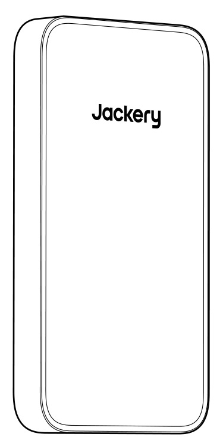
</figure>

写真はイメージです。実際の商品とは異なる場合があります。

カスタマーサポート: jackery.jp@jackery.com

お買い上げありがとうございます。

ご使用の前にこの「取扱説明書」をよくお読みのうえ、正しくお使いください。特に「安全上のご注意」は、必ずお読みいただき、安全にお使いください。お読みになったあとは、すぐに取り出せる場所に大切に保管してください。本製品の取扱説明書は随時更新されますので、最新の取扱説明書は公式サイトでご確認ください。

## 使用上のご注意

本製品を使用する際、以下の注意事項を守ってください。

<ul><li>
本製品を使用する前に取扱説明書をよくお読みください。
</li><li>
危険防止のため、お子様の近くで本製品を使用する時は、お子様から目を離さないようにしてください。
</li><li>
メーカーが保証していない推奨外の付属品を使用すると、感電の恐れがあります。
</li><li>
製品を使用しない場合は、プラグを抜いてください。
</li><li>
火災、爆発、感電などの予測できない危険が発生する恐れがありますので、本製品を解体しないでください。
</li><li>
感電の危険があるため、破損したコードやプラグ、またはケーブルを使用しないでください。
</li><li>
製品の充電は風通しの良い場所で行い、風通しの悪い場所での充電はおやめください。
</li><li>
雨に濡れないよう、風通しのよい乾燥した場所に保管してください。本製品は濡れると感電の危険があります。
</li><li>
火災、爆発などの事故の原因となるため、本製品を火気に近づけないでください。
</li><li>
高温の下 (直射日光や猛暑の車内) で使用したり放置しないでください。内蔵のバッテリーが過熱して発火したり、機能しなくなったり、寿命が短くなる可能性があります。
</li><li>
本製品を初めてご使用になる時は、十分に充電してからご使用ください。本製品を電池が切れた状態で長期間 (3 ヶ月～6 ヶ月) 放置すると、性能が低下し、過放電により充電ができなくなる場合があります。
</li></ul>

## 絵表示について

製品を安全に正しくお使いいただき、お客様や他の方々への危害や財産への損害を未然に防止するための表示です。内容をよく理解してから本文をお読みください。

<figure aria-label="絵表示について" class="hb-symbol-signal-composition" data-component-id="HB-TABLE-SYMBOL-SIGNAL"><table class="hb-symbol-signal-table"><colgroup><col class="hb-symbol-signal-col-label"/><col class="hb-symbol-signal-col-meaning"/></colgroup><thead><tr><th class="hb-symbol-signal-label-heading" scope="col">表示</th><th class="hb-symbol-signal-meaning-heading" scope="col">意味</th></tr></thead><tbody><tr><td class="hb-symbol-signal-label-cell">⚠警告</td><td class="hb-symbol-signal-meaning-cell">この表示を無視して、誤った取り扱いをすると、人が死亡または重傷を負う可能性が想定される内容を示しています。</td></tr><tr><td class="hb-symbol-signal-label-cell">⚠ご注意</td><td class="hb-symbol-signal-meaning-cell">この表示を無視して、誤った取り扱いをすると、人が傷害を負う可能性が想定される内容または物的損害の発生が想定される内容を示しています。</td></tr><tr><td class="hb-symbol-signal-label-cell">⚠説明</td><td class="hb-symbol-signal-meaning-cell">この表示を無視して誤った取り扱いをすると、機器の損傷、データの消失、性能の低下、または予期しない動作が発生する可能性があることを示しています。</td></tr><tr><td class="hb-symbol-signal-label-cell">⚠ヒント</td><td class="hb-symbol-signal-meaning-cell">文章内の重要な情報や操作のヒントを補足する内容を示しています。</td></tr></tbody></table></figure>

### 絵表示の説明

<figure aria-label="絵表示の説明" class="hb-symbol-pair-composition" data-component-id="HB-TABLE-SYMBOL-ICON">

<table class="hb-symbol-panel-table"><colgroup><col class="hb-symbol-col-icon"/><col class="hb-symbol-col-meaning"/></colgroup><thead><tr><th class="hb-symbol-icon-heading" scope="col">記号</th><th class="hb-symbol-meaning-heading" scope="col">説明</th></tr></thead><tbody><tr><td class="hb-symbol-icon"></td><td class="hb-symbol-meaning">製品を分解、改造を禁止する記号</td></tr><tr><td class="hb-symbol-icon"></td><td class="hb-symbol-meaning">潜在的な危険やリスクについて注意喚起するために、必ずお読みください。</td></tr><tr><td class="hb-symbol-icon"></td><td class="hb-symbol-meaning">操作の前に取扱説明書をお読みください。</td></tr><tr><td class="hb-symbol-icon"></td><td class="hb-symbol-meaning">本製品を火気の近くに置かないでください。</td></tr><tr><td class="hb-symbol-icon"></td><td class="hb-symbol-meaning">小さなお子様の手の届かない場所に保管してください。</td></tr></tbody></table>

<table class="hb-symbol-panel-table"><colgroup><col class="hb-symbol-col-icon"/><col class="hb-symbol-col-meaning"/></colgroup><thead><tr><th class="hb-symbol-icon-heading" scope="col">記号</th><th class="hb-symbol-meaning-heading" scope="col">説明</th></tr></thead><tbody><tr><td class="hb-symbol-icon"></td><td class="hb-symbol-meaning">充電式電池のリサイクルについて本機はリサイクル可能な充電池を内蔵しています。この商品を廃棄する場合は、当社のカスタマーサポートにご連絡ください。充電池の取りはずしはお客様自身では行わないでください。</td></tr><tr><td class="hb-symbol-icon"></td><td class="hb-symbol-meaning">このシンボルは、本製品を一般家庭ごみとして廃棄せず、リサイクルのために指定の回収施設に持ち込む必要があることを示しています。適切な廃棄およびリサイクルは、環境保護に役立ちます。本製品の廃棄やリサイクルについての詳細は、お住まいの自治体、廃棄物処理業者、または販売店にお問い合わせください。</td></tr></tbody></table>

</figure>

## 同梱品

<figure aria-label="同梱品" class="hb-inbox-composition" data-card-count="4" data-component-id="HB-SPECIAL-INBOX" data-inbox-variant="responsive-card-grid"><ol class="hb-inbox-grid"><li class="hb-inbox-card" data-item-number="1">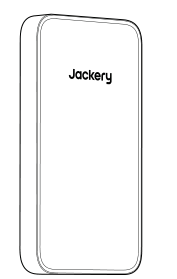

本体

</li><li class="hb-inbox-card" data-item-number="2">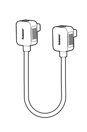

拡張ケーブル

</li><li class="hb-inbox-card" data-item-number="3">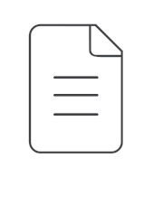

取扱説明書

</li><li class="hb-inbox-card" data-item-number="4">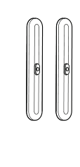

スタンド

</li></ol></figure>

※  付属品を故障、紛失等してしまった場合はカスタマーサポートまでご連絡ください。※  本拡張ケーブルは、同梱されている本体以外には使用しないでください。

本機の仕様および外観は、改善のため予告なく変更することがあります。

## 各部の名称

<figure class="hb-reference-figure hb-base-art-live-copy" data-component-id="HB-SPECIAL-REFERENCE-FIGURE" data-reference-id="overview" data-source-fragment-sha256="ace4c972fafabcb8c792039c4c0b4e2b55c307e1372b4f835d646135cad7c577" data-web-base-art-ref="overview" data-web-presentation-mode="base-art-live-copy">

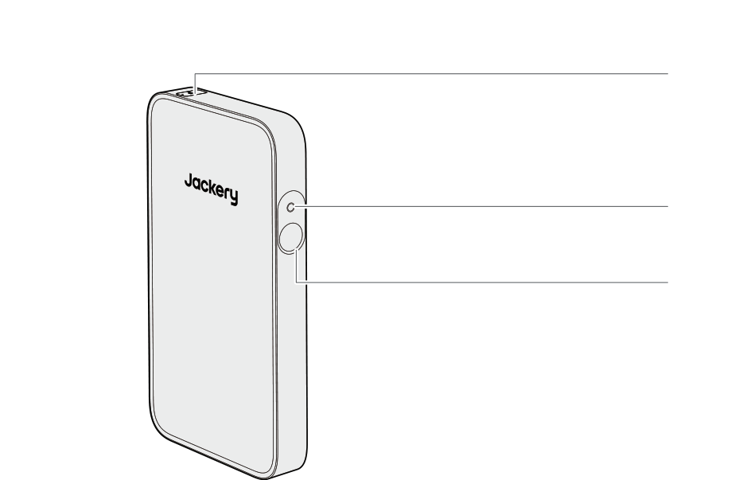DC 拡張ポートDC入力: 40V-57.6V⎓24A DC出力: 40V-57.6V⎓50A主電源ボタンLCD ディスプレイ

</figure>

## 液晶画面

<figure class="hb-reference-figure hb-base-art-live-copy" data-component-id="HB-SPECIAL-REFERENCE-FIGURE" data-reference-id="lcd-map" data-source-fragment-sha256="502527165ee07efebabd5b0f840480c1559395ad089931b35e6db4a096a705b7" data-web-base-art-ref="lcd-map" data-web-presentation-mode="base-art-live-copy">

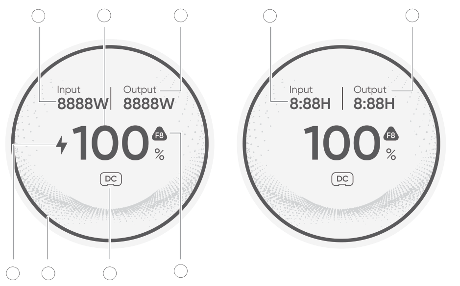233117456

</figure>

<figure aria-label="液晶画面" class="hb-lcd-table-composition" data-component-id="HB-TABLE-LCD-ICON" tabindex="0"><table class="hb-lcd-icon-table"><colgroup><col class="hb-lcd-col-number"/><col class="hb-lcd-col-icon"/><col class="hb-lcd-col-name"/><col class="hb-lcd-col-description"/></colgroup><tbody><tr><td class="hb-lcd-number" rowspan="2">1</td><td class="hb-lcd-icon"></td><td class="hb-lcd-name">入力電力表示</td><td class="hb-lcd-description">入力電力と残り充電時間を交互に表示します。</td></tr><tr><td class="hb-lcd-icon"></td><td class="hb-lcd-name">充電残り時間</td><td class="hb-lcd-description">入力電力と残り充電時間を交互に表示します。</td></tr><tr><td class="hb-lcd-number">2</td><td class="hb-lcd-icon"></td><td class="hb-lcd-name">バッテリー残量(%)</td><td class="hb-lcd-description">バッテリー残量を表示します。</td></tr><tr><td class="hb-lcd-number" rowspan="2">3</td><td class="hb-lcd-icon"></td><td class="hb-lcd-name">消費電力</td><td class="hb-lcd-description">出力電力と残り放電時間を交互に表示します。</td></tr><tr><td class="hb-lcd-icon"></td><td class="hb-lcd-name">バッテリー使用可能時間</td><td class="hb-lcd-description">出力電力と残り放電時間を交互に表示します。</td></tr><tr><td class="hb-lcd-number">4</td><td class="hb-lcd-icon"></td><td class="hb-lcd-name">充電インジケーター</td><td class="hb-lcd-description">オン: Jackery SlimPower H1は充電状態です。
オフ: Jackery SlimPower H1は充電状態ではありません。</td></tr><tr><td class="hb-lcd-number">5</td><td class="hb-lcd-icon"></td><td class="hb-lcd-name">バッテリーレベルパーセントタグ</td><td class="hb-lcd-description">オレンジの円は残バッテリーレベルを示しています。</td></tr><tr><td class="hb-lcd-number">6</td><td class="hb-lcd-icon"></td><td class="hb-lcd-name">DC 入力</td><td class="hb-lcd-description">オン：Jackery DC Input Moduleが接続されています。
オフ：Jackery DC Input Moduleが切断されています。</td></tr><tr><td class="hb-lcd-number">7</td><td class="hb-lcd-icon"></td><td class="hb-lcd-name">エラーコード</td><td class="hb-lcd-description">製品エラーが発生しました。詳細については、トラブルシューティングのセクションを参照してください。</td></tr></tbody></table></figure>

## 製品の使用方法について

### オン/オフ

<figure class="hb-operation-figure hb-operation-layout-status-right" data-component-id="HB-SPECIAL-OPERATION" data-operation-id="power" data-source-fragment-sha256="7c50ab040d12f3deedaabd2e10d02b0f73ed5efa9eeab0dfbd0824e4ff2737a0" data-web-replace-key="operation.power">
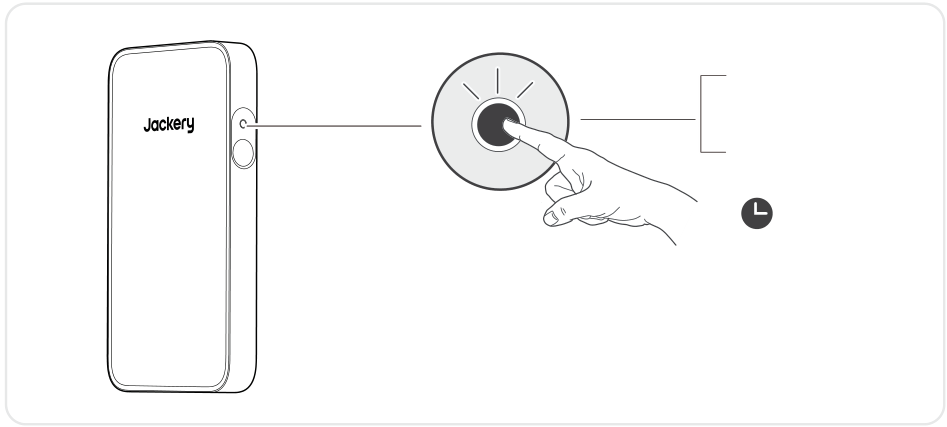

<strong>オフ</strong>

1回押す

<strong>オン</strong>

3秒

3s

</figure>

### LCDスクリーン

<figure aria-label="LCDスクリーン" class="hb-lcd-mode-composition hb-lcd-mode-portrait" data-component-id="HB-TABLE-LCD-MODE">
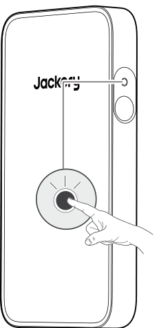

<table class="hb-lcd-mode-table"><colgroup><col class="hb-lcd-mode-col-state"/><col class="hb-lcd-mode-col-action"/><col class="hb-lcd-mode-col-copy"/></colgroup><tbody><tr><td class="hb-lcd-mode-state" rowspan="3">一時点灯</td><td class="hb-lcd-mode-action">オンにする</td><td class="hb-lcd-mode-copy">主電源ボタンを押すか、充電入力がある場合。</td></tr><tr><td class="hb-lcd-mode-action">オフにする</td><td class="hb-lcd-mode-copy">主電源ボタンを押します。</td></tr><tr><td class="hb-lcd-mode-action">自動オフ</td><td class="hb-lcd-mode-copy">2分後にLCDは自動的に消灯し、スリープモードになります。</td></tr><tr><td class="hb-lcd-mode-state" rowspan="3">常時点灯</td><td class="hb-lcd-mode-action">オンにする</td><td class="hb-lcd-mode-copy">デバイスが起動している状態で主電源ボタンを2回押します。</td></tr><tr><td class="hb-lcd-mode-action">オフにする</td><td class="hb-lcd-mode-copy">主電源ボタンを押します。</td></tr><tr><td class="hb-lcd-mode-action">自動オフ</td><td class="hb-lcd-mode-copy">常時点灯ディスプレイモードは、2時間操作がないと自動的に消灯します。</td></tr></tbody></table>
</figure>

## Jackery Battery Pack と 本体の設置方法

### 並列配置

Jackery Battery Pack と Jackery SlimPower H1 本体を横並びに配置します。

<figure class="hb-reference-figure" data-component-id="HB-SPECIAL-REFERENCE-FIGURE" data-reference-id="parallel" data-source-fragment-sha256="22a90c1b2e23fdadf5129d9b482ebbec2887e0dd0100f024182e30afaf6c2dee">
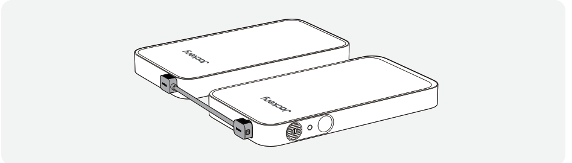
</figure>

### 積層配置

Jackery Battery Pack と Jackery SlimPower H1 本体を上下に積み重ねて配置します。

<figure class="hb-reference-figure" data-component-id="HB-SPECIAL-REFERENCE-FIGURE" data-reference-id="stacked" data-source-fragment-sha256="25c918891aae75ad49507ea5111f8e5e59838fc4bc2a35c64493bf4bbc54393d">
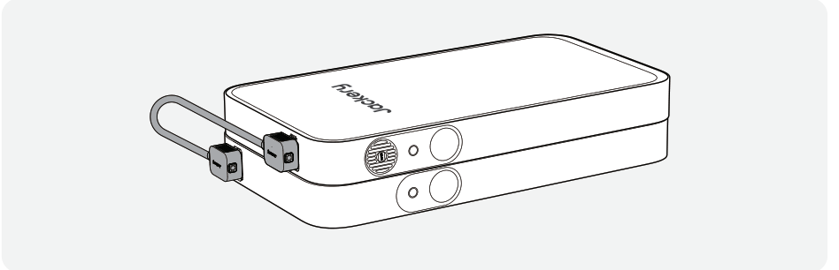
</figure>

### ブラケット取付の場合

<table class="manual-callout-table manual-callout-table"><tbody><tr><td class="manual-callout-label">ご注意</td><td class="manual-callout-body">
· 石膏ボード、断熱壁、中空レンガなどの耐荷重構造ではない場所には設置しないでください。製品が落下するおそれがあります。

· 壁内の配線（電線・水道管・ガス管など）を避けて設置してください。
</td></tr></tbody></table>

## 縦置

スタンドに取り付けられた Jackery Battery Packは、地面に設置することができます。以下の設置手順に従ってください。

<figure class="hb-reference-figure hb-base-art-live-copy" data-component-id="HB-SPECIAL-REFERENCE-FIGURE" data-reference-id="stand-preparation" data-source-fragment-sha256="e8ab40e650ed27fbf529bd2dfd5c43802f95ae42b7ede1c03fd2b4fe8040daed" data-web-base-art-ref="stand-preparation" data-web-presentation-mode="base-art-live-copy">

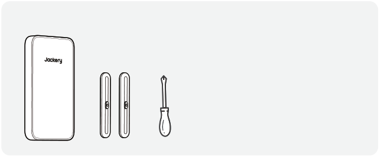設置前の準備。

</figure>

<figure class="hb-reference-figure" data-component-id="HB-SPECIAL-REFERENCE-FIGURE" data-reference-id="stand-installed" data-source-fragment-sha256="8c7a4e65950918894d8f0eead715264b5963495cb8a2961659ba31726f172af8">
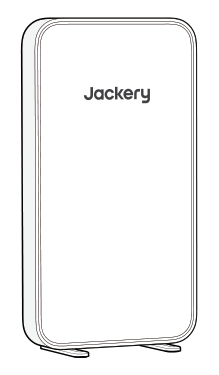
</figure>

<figure class="hb-reference-figure hb-base-art-live-copy" data-component-id="HB-SPECIAL-REFERENCE-FIGURE" data-reference-id="stand-1" data-source-fragment-sha256="fff410e32d344d5552c745b4688659db05fe19dcb832a4120c2d8587bd39dc19" data-web-base-art-ref="stand-1" data-web-presentation-mode="base-art-live-copy">

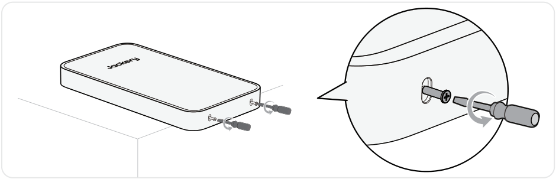1. 製品底面のネジを2本外してください。

</figure>

<figure class="hb-reference-figure hb-base-art-live-copy" data-component-id="HB-SPECIAL-REFERENCE-FIGURE" data-reference-id="stand-2" data-source-fragment-sha256="a7d7557b5fb68f1a58e894be09715796828e3d5b9de9a9d3b7fd78657150fbec" data-web-base-art-ref="stand-2" data-web-presentation-mode="base-art-live-copy">

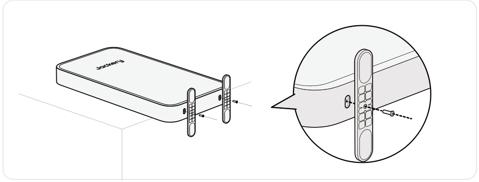2. 製品底面の取り付け穴を縦置きスタンドの穴と合わせてください。

</figure>

<figure class="hb-reference-figure hb-base-art-live-copy" data-component-id="HB-SPECIAL-REFERENCE-FIGURE" data-reference-id="stand-3" data-source-fragment-sha256="1c4bda8512ac8cd4a176e321e37a41aa9efd0fe716d5d4d71419590a692b3ffe" data-web-base-art-ref="stand-3" data-web-presentation-mode="base-art-live-copy">

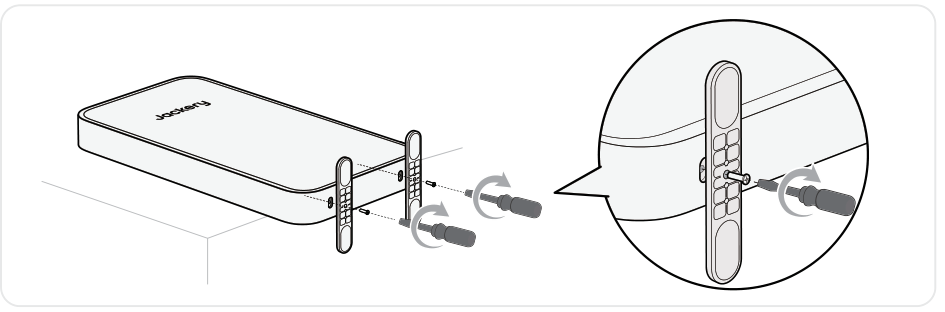3.ネジを締め付けます。

</figure>

## 木製の壁の場合。

Jackery Wall-Mounted Bracket（別売）を使用すると、Jackery Battery Pack を壁に設置することができます。以下の設置手順に従ってください。

<figure class="hb-reference-figure hb-base-art-live-copy" data-component-id="HB-SPECIAL-REFERENCE-FIGURE" data-reference-id="wood-preparation" data-source-fragment-sha256="226518b8699ca30f96259e2b3061bdae2ca5bc8051fb7f42b22d1b57341431ee" data-web-base-art-ref="wood-preparation" data-web-presentation-mode="base-art-live-copy">

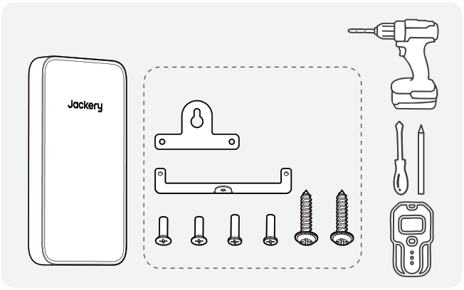設置前の準備。別売

</figure>

<figure class="hb-reference-figure hb-base-art-live-copy" data-component-id="HB-SPECIAL-REFERENCE-FIGURE" data-reference-id="wood-installed" data-source-fragment-sha256="36e38fde10beb3d60eb680adf57932904292b81a4201dafa658bcc93b4a944c4" data-web-base-art-ref="wood-installed" data-web-presentation-mode="base-art-live-copy">

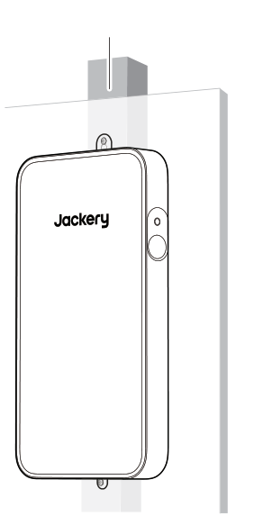壁の中にある細い柱(間柱)

</figure>

<figure class="hb-reference-figure hb-base-art-live-copy" data-component-id="HB-SPECIAL-REFERENCE-FIGURE" data-reference-id="wood-1-2" data-source-fragment-sha256="2362c95656e0f92fcad00dbc40c1b84e0cbd1b0bc568db64038d06f660a2eb06" data-web-base-art-ref="wood-1-2" data-web-presentation-mode="base-art-live-copy">

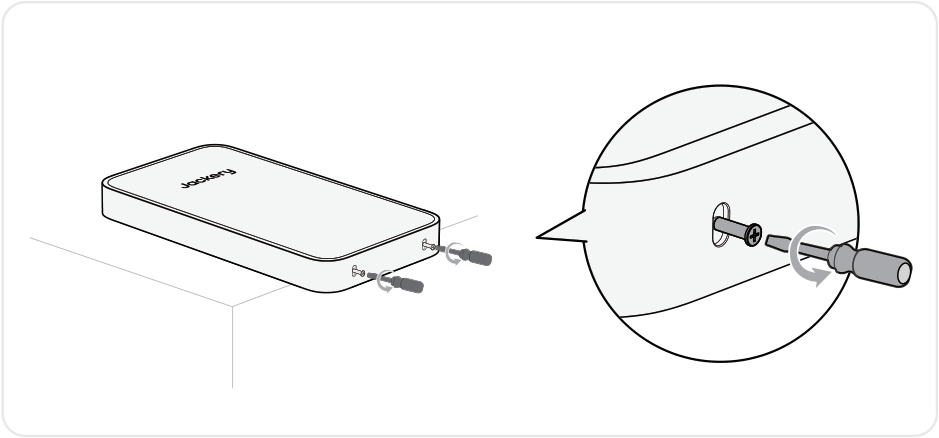1. Jackery SlimPower H1本体を、取扱説明書に従って設置します。2. 製品底面のネジ2本を取り外します。

</figure>

<figure class="hb-reference-figure hb-base-art-live-copy" data-component-id="HB-SPECIAL-REFERENCE-FIGURE" data-reference-id="wood-3" data-source-fragment-sha256="9fa35ef223d87b97a05eb3bbc7adc73eb85ede832ef8089a346b8d29a48b001b" data-web-base-art-ref="wood-3" data-web-presentation-mode="base-art-live-copy">

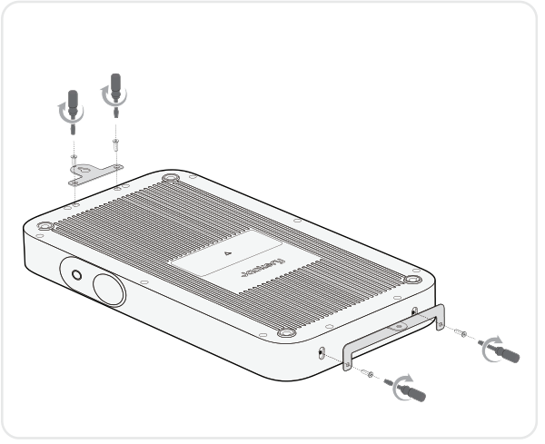3. 上下のマウントブラケットを製品背面にしっかり取り付けます。

</figure>

<figure class="hb-reference-figure hb-base-art-live-copy" data-component-id="HB-SPECIAL-REFERENCE-FIGURE" data-reference-id="wood-4" data-source-fragment-sha256="a9772aff436a99e4f755e1f4249d6c229284873e2e8f6a1cd963918c881ba912" data-web-base-art-ref="wood-4" data-web-presentation-mode="base-art-live-copy">

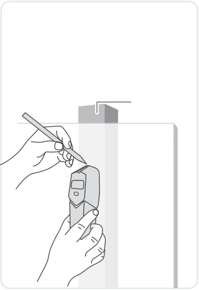4. 壁の内側にある間柱を探すには、下地探しセンサーを使用してください。間柱

</figure>

<figure class="hb-reference-figure hb-base-art-live-copy" data-component-id="HB-SPECIAL-REFERENCE-FIGURE" data-reference-id="wood-5" data-source-fragment-sha256="c8b3f4ace103e8e874533852db212370ccba31109897d9c03a71a063ac8e1a45" data-web-base-art-ref="wood-5" data-web-presentation-mode="base-art-live-copy">

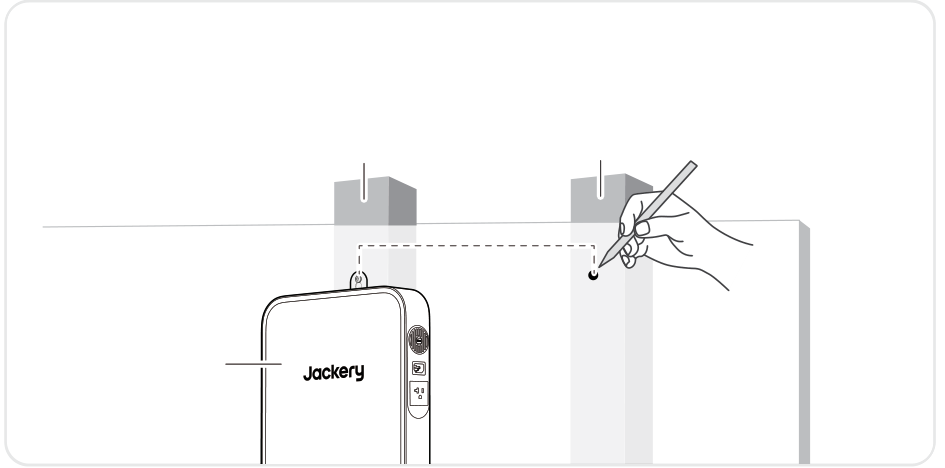5. Jackery SlimPower H1本体のボルト位置から水平方向に455mm離れた場所を測定し、壁の間柱上に取付ポイントをマーキングします。*  455 mmは推奨距離であり、実際の距離は壁の状態に依存します。間柱間柱455mmJackery SlimPower H1

</figure>

<figure class="hb-reference-figure hb-base-art-live-copy" data-component-id="HB-SPECIAL-REFERENCE-FIGURE" data-reference-id="wood-6" data-source-fragment-sha256="06ebffb8a51b39ec7285d3adccb3a57d2f2fdfd3e6f440371f64864aae1ab79c" data-web-base-art-ref="wood-6" data-web-presentation-mode="base-art-live-copy">

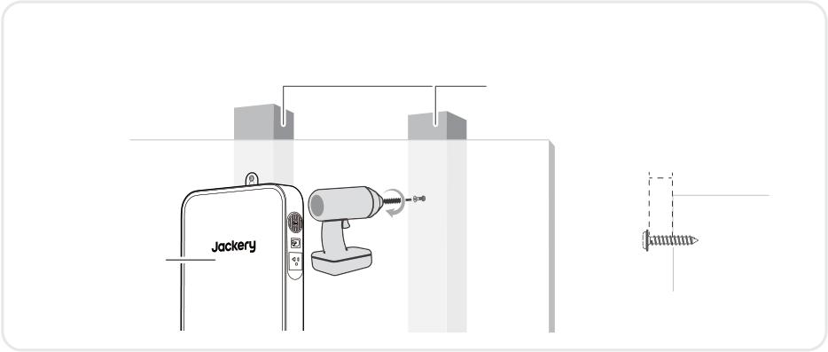6. 取付ポイントに木ねじを壁にねじ込み、ねじと壁の間に2～4mmの隙間を残してください。間柱2~4mmJackery SlimPower H1

</figure>

<figure class="hb-reference-figure hb-base-art-live-copy" data-component-id="HB-SPECIAL-REFERENCE-FIGURE" data-reference-id="wood-7" data-source-fragment-sha256="a21908aa9ac3b78ec94789ef1bc29ad1f38ec188f9c040161d28a2a2bad80c9a" data-web-base-art-ref="wood-7" data-web-presentation-mode="base-art-live-copy">

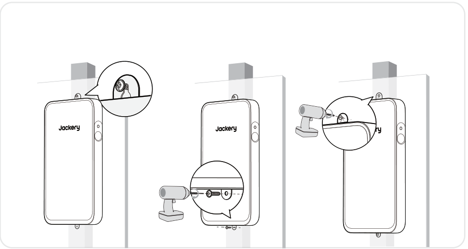7. 製品をネジに垂直に掛けます。下部ブラケットの取付穴から壁面にタッピングネジを打ち込み、締め付けます。その後、木ネジを完全に締め付けます。

</figure>

## コンクリート壁面の場合

<figure class="hb-reference-figure hb-base-art-live-copy" data-component-id="HB-SPECIAL-REFERENCE-FIGURE" data-reference-id="concrete-preparation" data-source-fragment-sha256="b92f7646f03e15872dcd68d2a18e3a956ce0f4195888704300226290f2232498" data-web-base-art-ref="concrete-preparation" data-web-presentation-mode="base-art-live-copy">

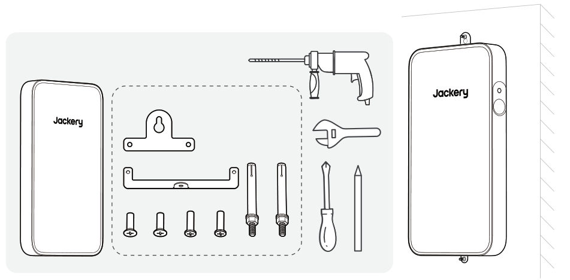取付前の準備：別売

</figure>

<figure class="hb-reference-figure hb-base-art-live-copy" data-component-id="HB-SPECIAL-REFERENCE-FIGURE" data-reference-id="concrete-1-2" data-source-fragment-sha256="f11e128e6db1e128915d5234697a0c3bd3aaf2e87387aff57abcd924a2d7f2a4" data-web-base-art-ref="concrete-1-2" data-web-presentation-mode="base-art-live-copy">

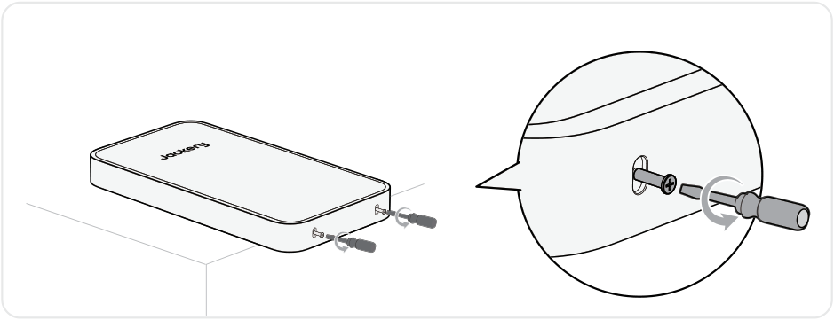1. Jackery SlimPower H1本体を、取扱説明書に従って設置します。2. 製品底面のネジ2本を取り外します。

</figure>

<figure class="hb-reference-figure hb-base-art-live-copy" data-component-id="HB-SPECIAL-REFERENCE-FIGURE" data-reference-id="concrete-3" data-source-fragment-sha256="3811cd0ca4634af8186f9ee3f749c3adc0a5d3f0053b918e229789de90a7f328" data-web-base-art-ref="concrete-3" data-web-presentation-mode="base-art-live-copy">

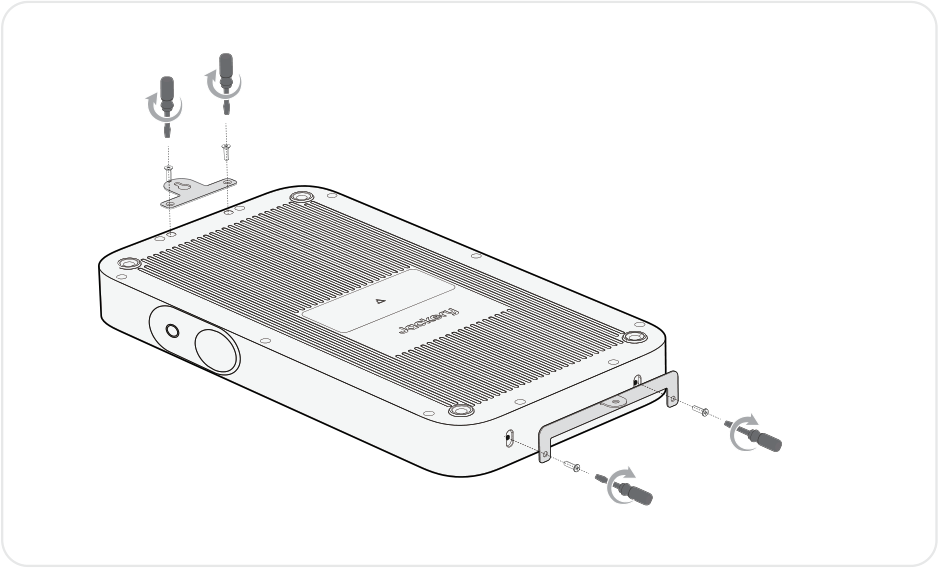3. 上下のマウントブラケットを製品背面にしっかり取り付けます。

</figure>

<figure class="hb-reference-figure hb-base-art-live-copy" data-component-id="HB-SPECIAL-REFERENCE-FIGURE" data-reference-id="concrete-4" data-source-fragment-sha256="b3ad0adefc634c577b31b4bc6889205ad0e0fc7e5129b701c01fa2edd11de61c" data-web-base-art-ref="concrete-4" data-web-presentation-mode="base-art-live-copy">

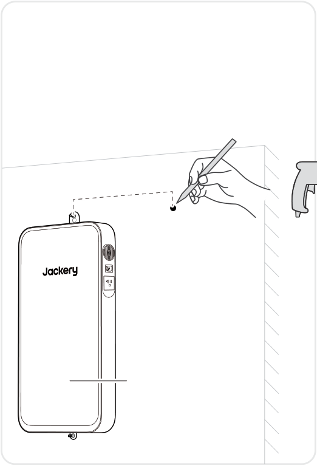4. Jackery SlimPower H1本体のボルト位置から水平方向に455mm離れた場所を測定し、取付ポイントをマーキングします。*   455 mmは推奨距離であり、実際の距離は壁の状態に依存します。455mmJackery SlimPower H1

</figure>

<figure class="hb-reference-figure hb-base-art-live-copy" data-component-id="HB-SPECIAL-REFERENCE-FIGURE" data-reference-id="concrete-5" data-source-fragment-sha256="53938fed56456254527c9879941b564f82b5cf2f5cdbc4c77e88d0a7db760177" data-web-base-art-ref="concrete-5" data-web-presentation-mode="base-art-live-copy">

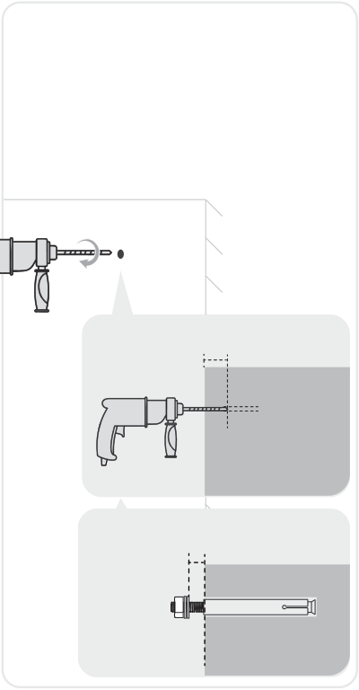5. 8mmのコンクリート用インパクトドリルを使用し、取付位置に深さ約70mmの穴をあけます。エクスパンションボルトを挿入し、ナットを2～4mm緩めます。70mm8mm2~4mm

</figure>

<figure class="hb-reference-figure hb-base-art-live-copy" data-component-id="HB-SPECIAL-REFERENCE-FIGURE" data-reference-id="concrete-6" data-source-fragment-sha256="07e384517fd9ea301207d6b379736fa3ee9b52c58b36d282b417fa898609c1ef" data-web-base-art-ref="concrete-6" data-web-presentation-mode="base-art-live-copy">

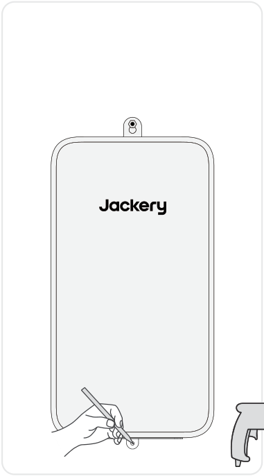6. 製品をエクスパンションボルトに垂直に掛け、壁面の取り付け位置をマーキングします。

</figure>

<figure class="hb-reference-figure hb-base-art-live-copy" data-component-id="HB-SPECIAL-REFERENCE-FIGURE" data-reference-id="concrete-7" data-source-fragment-sha256="cf1a1ae5bb42c25933aef4f63fe5e67aa804da096108d9939dd6ba8f2e01b567" data-web-base-art-ref="concrete-7" data-web-presentation-mode="base-art-live-copy">

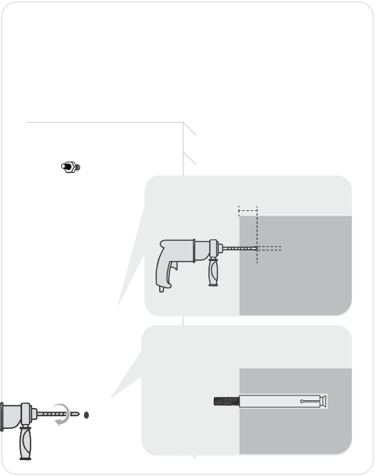7. 製品を取り外します。取付ポイントに穴を開け、ナットとワッシャーを使わずにボルトを穴に差し込んでください。70mm8mm

</figure>

<figure class="hb-reference-figure hb-base-art-live-copy" data-component-id="HB-SPECIAL-REFERENCE-FIGURE" data-reference-id="concrete-8" data-source-fragment-sha256="11219c7624c6768bdeaf1cc65b0dd9c0473221511e4ad53f6aa7ae22ffcbde13" data-web-base-art-ref="concrete-8" data-web-presentation-mode="base-art-live-copy">

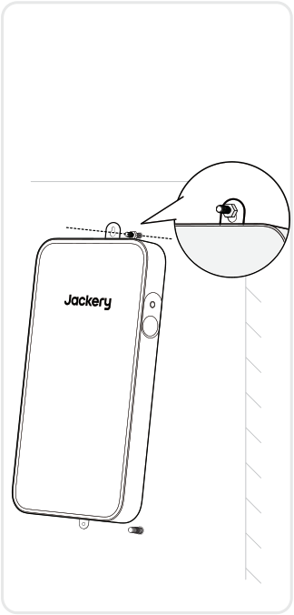8.製品を上側のボルトに掛けてください。

</figure>

<figure class="hb-reference-figure hb-base-art-live-copy" data-component-id="HB-SPECIAL-REFERENCE-FIGURE" data-reference-id="concrete-9" data-source-fragment-sha256="ee36fd559402827175703cfb078c459b305e398fea36ccf21fb9e25fafd3a80c" data-web-base-art-ref="concrete-9" data-web-presentation-mode="base-art-live-copy">

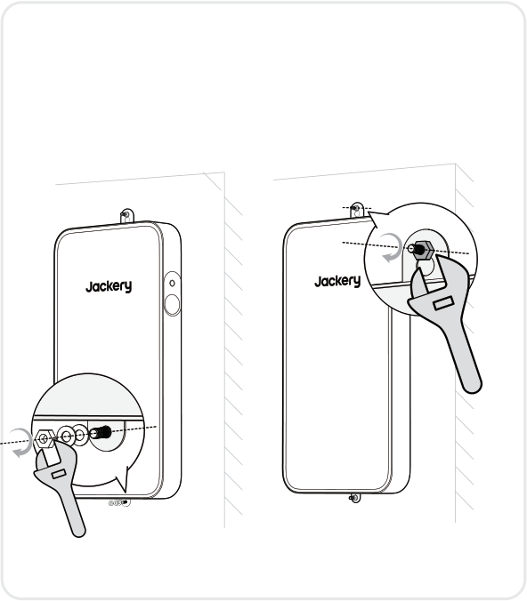9. 製品を持ち上げ、予め設置されたボルトに合わせてから下ろして設置します。ナットを締めます。

</figure>

## ポータブル電源との併用

Jackery Battery Pack は、Jackery SlimPower H1 と併用することで、より大きな容量ニーズに対応できます。

<table class="manual-callout-table manual-callout-table"><tbody><tr><td class="manual-callout-label">ご注意</td><td class="manual-callout-body">
バッテリーパックをJackery SlimPower H1に接続する前に、両方の電源がオフになっていることを確認してください。
</td></tr></tbody></table>

<figure class="hb-reference-figure hb-base-art-live-copy" data-component-id="HB-SPECIAL-REFERENCE-FIGURE" data-reference-id="connection" data-source-fragment-sha256="821376c0efc8a52e0af426b48a0ac6903ba48520910cec8e36fff9add165d4a4" data-web-base-art-ref="connection" data-web-presentation-mode="base-art-live-copy">

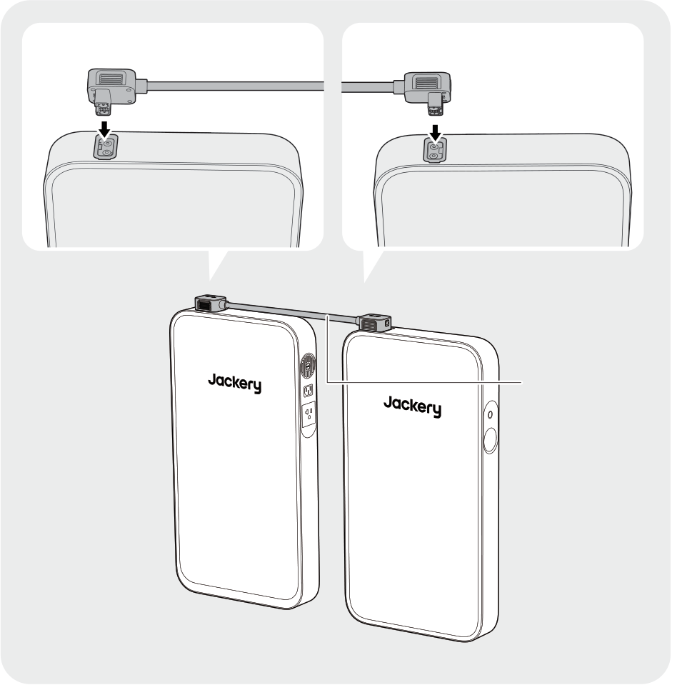拡張ケーブル

</figure>

<table class="manual-callout-table manual-callout-table"><tbody><tr><td class="manual-callout-label">ご注意</td><td class="manual-callout-body">
LCD 画面（Jackery SlimPower H1）にアイコンが表示されたら、バッテリーパックと Jackery SlimPower H1 の接続が成功したことを示します。
</td></tr></tbody></table>

## 充電方法

### AC充電

AC充電の場合、本製品はJackery SlimPower H1と一緒にお使いください。

<table class="manual-callout-table manual-callout-table"><tbody><tr><td class="manual-callout-label">警告</td><td class="manual-callout-body">
バッテリーパックをJackery SlimPower H1に接続する前に、両方の電源がオフになっていることを確認してください。
</td></tr></tbody></table>

<figure class="hb-reference-figure hb-base-art-live-copy" data-component-id="HB-SPECIAL-REFERENCE-FIGURE" data-reference-id="ac-charge" data-source-fragment-sha256="c585725660d2e424eeb54154a932c9db8f7accdebb459c166b13858941756370" data-web-base-art-ref="ac-charge" data-web-presentation-mode="base-art-live-copy">

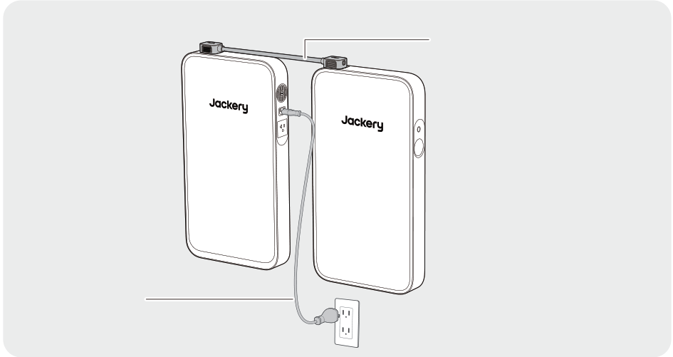拡張ケーブルACケーブル

</figure>

### ソーラー充電

下図のように、ソーラーパネルとJackery DC Input Moduleを使って製品を充電します。詳細については、Jackery DC Input Moduleの取扱説明書を参照してください。

<figure class="hb-reference-figure hb-base-art-live-copy" data-component-id="HB-SPECIAL-REFERENCE-FIGURE" data-reference-id="solar-charge" data-source-fragment-sha256="09a95301bcd4392379163334a0278cf5e54e8cf527281b066b7430bcfd644995" data-web-base-art-ref="solar-charge" data-web-presentation-mode="base-art-live-copy">

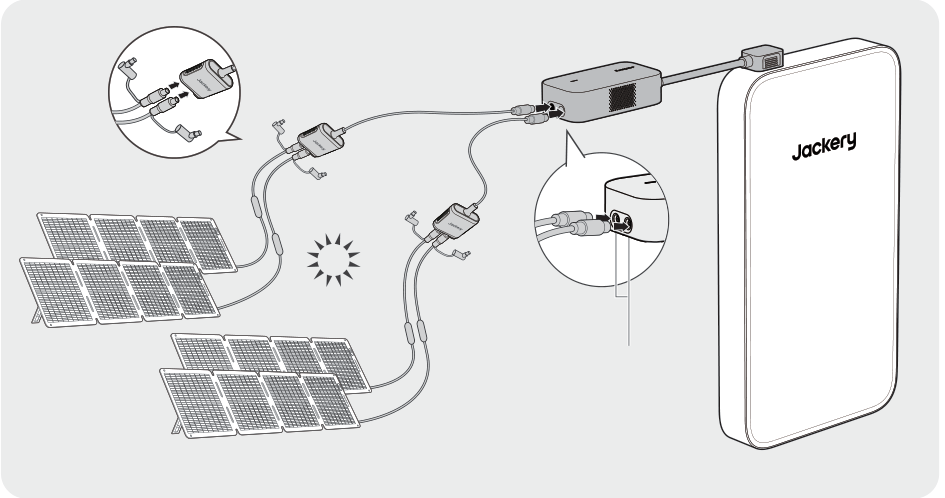DC8020*ソーラーパネルとJackery DC Input Moduleは別売りです。

</figure>

### シガーソケット充電

Jackery DC Input Moduleに接続することで、Jackery Battery Pack は12V/10A車載充電器で充電できます。使用方法の詳細については、Jackery DC Input Moduleのユーザーマニュアルを参照してください。

<figure class="hb-reference-figure hb-base-art-live-copy" data-component-id="HB-SPECIAL-REFERENCE-FIGURE" data-reference-id="car-charge" data-source-fragment-sha256="324bd439cfe166341ebba43a2a68a58833723050c0a94f2b597373caa932368b" data-web-base-art-ref="car-charge" data-web-presentation-mode="base-art-live-copy">

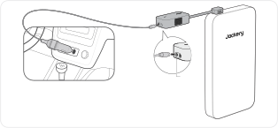車DC8020※ 車載充電ケーブルとJackery DC Input Moduleは別売りです。

</figure>

## トラブルシューティング

次のいずれかのエラーコードが表示された場合は、記載されている対処方法に従って問題を解決してください。問題が解決しない場合は、Jackeryカスタマーサポートまでご連絡ください。

<figure aria-label="エラーコード / 対処方法" class="hb-troubleshooting-composition" data-component-id="HB-TABLE-TROUBLESHOOTING" tabindex="0"><table class="hb-troubleshooting-table"><colgroup><col class="hb-troubleshooting-col-code"/><col class="hb-troubleshooting-col-measures"/></colgroup><thead><tr><th class="hb-troubleshooting-code" scope="col">エラーコード</th><th class="hb-troubleshooting-measures" scope="col">対処方法</th></tr></thead><tbody><tr><td class="hb-troubleshooting-code">F0 /F2 F3</td><td class="hb-troubleshooting-measures">製品を再起動してください。</td></tr><tr><td class="hb-troubleshooting-code">F1 /F6 F7/F8</td><td class="hb-troubleshooting-measures">Jackeryカスタマーサポートまでご連絡ください。</td></tr><tr><td class="hb-troubleshooting-code">F4</td><td class="hb-troubleshooting-measures">製品に負荷を接続してバッテリーを放電し、エラーが消えるまで続けてください。</td></tr><tr><td class="hb-troubleshooting-code">F5</td><td class="hb-troubleshooting-measures">ソーラーパネルまたはAC電源コンセントを使用して、エラーが消えるまで製品を充電してください。</td></tr><tr><td class="hb-troubleshooting-code">FF</td><td class="hb-troubleshooting-measures">
高温環境下で

1.製品へのすべての充電・放電ケーブル（壁用充電器、ソーラーパネル、車載充電器、負荷機器を含む）を切り離してください。

2.製品を日陰で風通しの良い場所に設置し、周囲温度が45°C以下であることを確認してください。

3. 製品をアイドル状態にし、故障が消えるまで待ってください。

低温環境下で

1.製品を0℃以上の暖かい環境へ移動させてください。

2.極端に寒い屋外での使用や充電は行わないでください。必要に応じて、室内で予熱してください。

3.製品を寒い環境から室内に移動させた場合は、使用前にしばらく放置してください。

4.低温インジケーターが表示された場合は、製品をアイドル状態にして、システムが自動的に回復するのを待ってください。
</td></tr></tbody></table></figure>

## 主な仕様

## 基本情報

<figure aria-label="基本情報" class="hb-spec-table-composition"><table class="manual-table manual-spec-table hb-spec-table"><colgroup><col class="hb-spec-col-label"/><col class="hb-spec-col-value"/></colgroup><tbody><tr><th class="manual-spec-label hb-spec-label" scope="row">製品の名称</th><td class="manual-spec-value hb-spec-value">Jackery Battery Pack</td></tr><tr><th class="manual-spec-label hb-spec-label" scope="row">型番</th><td class="manual-spec-value hb-spec-value">JBP-1000B-WH</td></tr><tr><th class="manual-spec-label hb-spec-label" scope="row">バッテリータイプ</th><td class="manual-spec-value hb-spec-value">LiFePO₄ （リン酸鉄リチウムイオン電池）</td></tr><tr><th class="manual-spec-label hb-spec-label" scope="row">定格容量</th><td class="manual-spec-value hb-spec-value">20Ah / 51.2Vdc (1024 Wh)</td></tr><tr><th class="manual-spec-label hb-spec-label" scope="row">サイズ＆重量</th><td class="manual-spec-value hb-spec-value">約 600 x 325 x 60 mm (約 9 kg)</td></tr></tbody></table></figure>

## 入力/出カポート

<figure aria-label="入力/出カポート" class="hb-spec-table-composition"><table class="manual-table manual-spec-table hb-spec-table"><colgroup><col class="hb-spec-col-label"/><col class="hb-spec-col-value"/></colgroup><tbody><tr><th class="manual-spec-label hb-spec-label" scope="row">DC 拡張ポート (入力)</th><td class="manual-spec-value hb-spec-value">40V-57.6V⎓最大 24A</td></tr><tr><th class="manual-spec-label hb-spec-label" scope="row">DC 拡張ポート (出力)</th><td class="manual-spec-value hb-spec-value">40V-57.6V⎓最大 50A</td></tr></tbody></table></figure>

## 温度範囲

<figure aria-label="温度範囲" class="hb-spec-table-composition"><table class="manual-table manual-spec-table hb-spec-table"><colgroup><col class="hb-spec-col-label"/><col class="hb-spec-col-value"/></colgroup><tbody><tr><th class="manual-spec-label hb-spec-label" scope="row">充電温度</th><td class="manual-spec-value hb-spec-value">-20°C～45°C</td></tr><tr><th class="manual-spec-label hb-spec-label" scope="row">動作温度</th><td class="manual-spec-value hb-spec-value">-20°C～45°C</td></tr><tr><th class="manual-spec-label hb-spec-label" scope="row">保存温度</th><td class="manual-spec-value hb-spec-value">1 年間 0～25°C 3 ヶ月 0～45°C 1 ヶ月 - 20～45°C</td></tr></tbody></table></figure>

本製品はJackery SlimPower H1専用となります。他の機器には接続しないでください。

## 保証について

<figure aria-label="保証について" class="hb-warranty-intro-composition" data-component-id="HB-WARRANTY-LEAD">

このたびはJackery 製品をご購入いただき、誠にありがとうございます。本保証書は、Jackery ポータブル電源製品に関する保証内容を明確にご案内するものです。

ご使用前に必ずご確認のうえ、大切に保管してください。

</figure>

### 保証期間

<figure aria-label="保証期間" class="hb-warranty-card" data-component-id="HB-WARRANTY-SECTION" data-warranty-card-index="1">
1. 保証期間はご購入日から3 年間です。

2. また、延長保証にご登録いただくと、さらに2 年間の保証が追加されます。詳しくはJackery公式サイトをご確認ください。

※ Jackery 公式オンラインストアまたは正規代理店以外での購入品は保証対象外となります。
</figure>

### 保証の適用範囲

<figure aria-label="保証の適用範囲" class="hb-warranty-card" data-component-id="HB-WARRANTY-SECTION" data-warranty-card-index="2">
1. 購入チャネルについて本保証は、Jackery公式オンラインストアまたは正規代理店で購入された製品に限り有効です。

2. 保証提供地域保証は、日本国内に在住の方が、日本国内で使用する場合に限り有効です。
</figure>

### 保証の適用条件

<figure aria-label="保証の適用条件" class="hb-warranty-card" data-component-id="HB-WARRANTY-SECTION" data-warranty-card-index="3">
以下のすべての条件を満たす場合に、保証の適用対象となります：

・Jackery公式オンラインストアまたは正規代理店にてご購入されたこと

・保証期間内であること

・下記の「保証対象外」に該当しないこと
</figure>

### 保証対象外となる場合

<figure aria-label="保証対象外となる場合" class="hb-warranty-card" data-component-id="HB-WARRANTY-SECTION" data-warranty-card-index="4">
以下のいずれかに該当する場合、保証期間内であっても保証の対象外となります：

1.故障・損傷が保証期間内に発生していても、保証期間終了後に申請された場合

2.使用上の誤り（取扱説明書や本体ラベルに記載の注意事項に従わなかった使用）による故障・損傷

3.他機器からの影響、不適切な修理または改造による故障・損傷

4.移設・輸送・落下などに起因する故障・損傷

5.火災・地震・風水害・落雷などの天災、または公害・塩害・異常電圧などによる故障・損傷

6.消耗部品の劣化や摩耗、または外観の汚損など
</figure>

### 購入証明について

<figure aria-label="購入証明について" class="hb-warranty-card" data-component-id="HB-WARRANTY-SECTION" data-warranty-card-index="5">
保証をご利用の際には、以下いずれかの購入証明書類をご提示いただく必要があります：

・Jackery公式オンラインストアでの購入：注文番号（注文履歴画面または確認メール）

・正規代理店での購入：購入日・販売店名の記載された領収書または納品書

※  ご提示がない場合、保証対応いたしかねます。
</figure>

### 保証内容

<figure aria-label="保証内容" class="hb-warranty-card" data-component-id="HB-WARRANTY-SECTION" data-warranty-card-index="6">
1. 初期不良による交換（ご購入日から30日以内）

・取扱説明書に従った正常な使用中に不具合が発生した場合、同一製品の新品と交換いたします。

・在庫切れや販売終了の場合は、同等品への交換または返金にて対応いたします。

2. 無償修理（ご購入日から31日以上～保証期間内）

・保証条件を満たす自然故障については、無料で修理対応いたします。

・修理が困難な場合は、同等品（同モデルまたは同等スペック品）への交換にて対応いたします。

3. 有償修理以下に該当する場合は、有償での修理対応となります：

・保証期間を超えた製品

・保証対象外と判断された場合

・Jackery公式オンラインストアまたは正規代理店以外で購入された製品

有償修理後の保証期間は、修理完了日より90日間です。

*無償修理の場合、残りの保証期間が90日未満であれば「90日間」、90日以上であれば「元の保証期間に準じます」。
</figure>

### 免責事項

<figure aria-label="免責事項" class="hb-warranty-card" data-component-id="HB-WARRANTY-SECTION" data-warranty-card-index="7">
1. 弊社では、いかなる場合においても、間接的損害または付随的損害（データの損失・逸失利益など）に対して責任を負いません。

2. 本保証書は、お客様が法律上有する権利を制限するものではありません。

3. 保証内容は、予告なく変更される場合がございます。あらかじめご了承ください。Jackery 製品を安心してご使用いただくために、本保証書の内容をご確認のうえ、ご活用くださいますようお願いいたします。ご不明点がございましたら、Jackery カスタマーサービスまでお問い合わせください。
</figure>

## お問い合わせ

公式サイト: https://www.jackery.jp

カスタマーサポート: jackery.jp@jackery.com

お問い合わせ電話番号: 050-3198-9007

