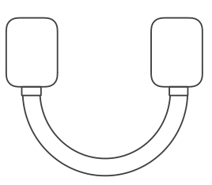
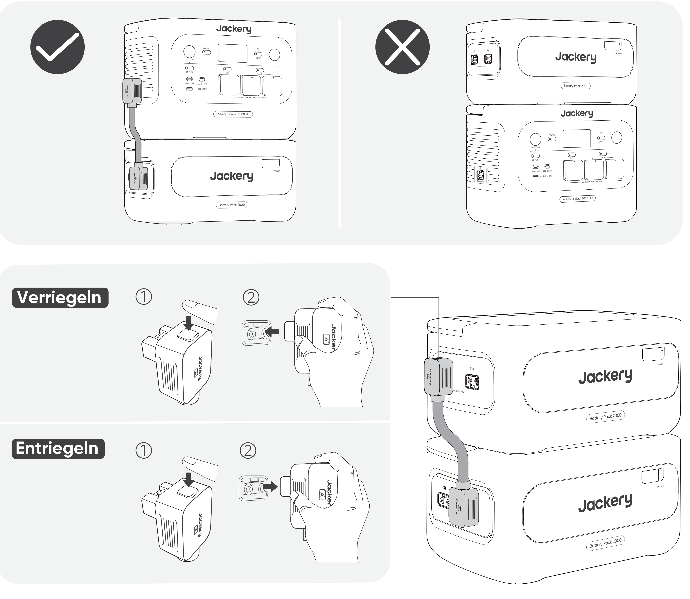

<strong>WICHTIG</strong>

Herzlichen Glückwunsch zu Ihrem neuen Jackery Battery Pack 2000. Bitte lesen Sie dieses Handbuch vor der Verwendung des Produkts sorgfältig durch, insbesondere die relevanten Vorsichtsmaßnahmen, um eine ordnungsgemäße Verwendung sicherzustellen. Bewahren Sie dieses Handbuch an einem zugänglichen Ort auf, damit Sie später darauf zurückgreifen können.

In Übereinstimmung mit Gesetzen und Vorschriften liegt das endgültige Auslegungsrecht für dieses Dokument und alle zugehörigen Dokumente dieses Produkts beim Unternehmen. Obwohl alle Anstrengungen unternommen wurden, um die Genauigkeit dieses Handbuchs sicherzustellen, übernimmt Jackery keine Verantwortung für etwaige Fehler.

Bitte beachten Sie, dass bei Aktualisierung, Überarbeitung oder Einstellung keine weiteren Benachrichtigungen erfolgen. Die neueste Version der Produkthandbücher finden Sie unter support.jackery.com.

* Die Abbildungen dienen nur als Referenz. Bitte beziehen Sie sich auf das tatsächliche Produkt.

<table class="manual-callout-table" style="width:100%; border-collapse:collapse; margin:0 0 16px 0;"><tbody><tr><td class="manual-callout-label" style="width:16%; border:1px solid #000; padding:6px 8px; vertical-align:top;">
<strong>HINWEIS</strong>
</td><td class="manual-callout-body" style="border:1px solid #000; padding:6px 8px; vertical-align:top;">
Dieses Batteriepack ist mit dem Jackery E2000 Plus V2 und dem Jackery E1000 Plus V2 kompatibel. In diesem Handbuch bezeichnet „die tragbare Powerstation“ eines der beiden Modelle, sofern nicht anders angegeben.
</td></tr></tbody></table>

# SICHERHEITSVORKEHRUNGEN BEI DER VERWENDUNG

Befolgen Sie bei der Verwendung dieses Produkts stets die folgenden grundlegenden Vorsichtsmaßnahmen.

<ul class="simple">
<li>
Bitte lesen Sie alle Anweisungen, bevor Sie dieses Produkt verwenden.
</li>
<li>
Lassen Sie Kinder nicht mit dem Produkt spielen. Achten Sie darauf, dass Kinder beaufsichtigt werden, wenn das Produkt in ihrer Nähe verwendet wird.
</li>
<li>
Bei der Verwendung von Zubehör, das von nicht professionellen Herstellern empfohlen oder verkauft wird, besteht die Gefahr eines Stromschlags.
</li>
<li>
Wenn das Produkt nicht verwendet wird, ziehen Sie bitte den Netzstecker aus der Steckdose des Produkts.
</li>
<li>
Zerlegen Sie das Produkt nicht, da dies zu unvorhersehbaren Risiken führen kann, wie Feuer, Explosion oder Stromschlag.
</li>
<li>
Verwenden Sie das Produkt nicht mit beschädigten Kabeln oder Steckern oder beschädigten Ausgangskabeln, die einen Stromschlag verursachen können.
</li>
<li>
Laden Sie das Gerät in einem gut belüfteten Bereich und beeinträchtigen Sie die Belüftung in keiner Weise.
</li>
<li>
Stellen Sie das Gerät an einem gut belüfteten und trockenen Ort auf, um Regen und Feuchtigkeit zu vermeiden, die einen elektrischen Schlag verursachen könnten.
</li>
<li>
Setzen Sie das Gerät weder Feuer noch hohen Temperaturen aus (z. B. direkter Sonneneinstrahlung oder großer Hitze im Fahrzeug), da dies zu Unfällen wie Bränden oder Explosionen führen kann.
</li>
<li>
Wird dieses Gerät über einen längeren Zeitraum (3-6 Monate) in vollständig entladenem Zustand gelagert, kann es möglicherweise nicht mehr aufgeladen werden.
</li>
</ul>

# BEDEUTUNG DER SYMBOLE

<figure aria-label="Symbol / Bedeutung" class="hb-symbol-signal-composition" data-component-id="HB-TABLE-SYMBOL-SIGNAL"><table class="hb-symbol-signal-table"><colgroup><col class="hb-symbol-signal-col-label"/><col class="hb-symbol-signal-col-meaning"/></colgroup><thead><tr><th class="hb-symbol-signal-label-heading" scope="col">
Symbol
</th><th class="hb-symbol-signal-meaning-heading" scope="col">
Bedeutung
</th></tr></thead><tbody><tr><td class="hb-symbol-signal-label-cell">⚠WARNUNG</td><td class="hb-symbol-signal-meaning-cell">
Gefährliche Handlungen, die zu schweren Verletzungen, zum Tod und/oder zu Sachschäden führen können.
</td></tr><tr><td class="hb-symbol-signal-label-cell">⚠VORSICHT</td><td class="hb-symbol-signal-meaning-cell">
Gefährliche Handlungen, die zu Personenschäden und/oder zu Sachschäden führen können.
</td></tr><tr><td class="hb-symbol-signal-label-cell">HINWEIS</td><td class="hb-symbol-signal-meaning-cell">
Handlungen, die zu Geräteschäden, Datenverlust, Leistungseinbußen oder unerwarteten Ergebnissen führen können.
</td></tr><tr><td class="hb-symbol-signal-label-cell">TIPP</td><td class="hb-symbol-signal-meaning-cell">
Ergänzt wichtige Informationen oder Bedienhinweise im Text.
</td></tr></tbody></table></figure>

<figure aria-label="Symbol / Bedeutung" class="hb-symbol-pair-composition" data-component-id="HB-TABLE-SYMBOL-ICON">

<table class="hb-symbol-panel-table"><colgroup><col class="hb-symbol-col-icon"/><col class="hb-symbol-col-meaning"/></colgroup><thead><tr><th class="hb-symbol-icon-heading" scope="col">
<strong>Symbol</strong>
</th><th class="hb-symbol-meaning-heading" scope="col">
<strong>Bedeutung</strong>
</th></tr></thead><tbody><tr><td class="hb-symbol-icon"></td><td class="hb-symbol-meaning">
Warn- und Vorsichtssymbole. Lesen Sie diese Hinweise, um auf mögliche Gefahren oder Risiken aufmerksam gemacht zu werden.
</td></tr><tr><td class="hb-symbol-icon"></td><td class="hb-symbol-meaning">
Lesen Sie vor der Anwendung die Benutzeranleitung.
</td></tr><tr><td class="hb-symbol-icon"></td><td class="hb-symbol-meaning">
Demontieren Sie das Produkt nicht.
</td></tr><tr><td class="hb-symbol-icon"></td><td class="hb-symbol-meaning">
Rauchen Sie nicht und verwenden Sie keine offenen Flammen.
</td></tr></tbody></table>

<table class="hb-symbol-panel-table"><colgroup><col class="hb-symbol-col-icon"/><col class="hb-symbol-col-meaning"/></colgroup><thead><tr><th class="hb-symbol-icon-heading" scope="col">
<strong>Symbol</strong>
</th><th class="hb-symbol-meaning-heading" scope="col">
<strong>Bedeutung</strong>
</th></tr></thead><tbody><tr><td class="hb-symbol-icon"></td><td class="hb-symbol-meaning">
Halten Sie das Produkt fern von Kindern.
</td></tr><tr><td class="hb-symbol-icon"></td><td class="hb-symbol-meaning">
Dieses Symbol weist darauf hin, dass sich im Produkt ein Lithium-Ionen-Akku (Li-Ion) befindet, der ordnungsgemäß entsorgt oder recycelt werden muss.
</td></tr><tr><td class="hb-symbol-icon"></td><td class="hb-symbol-meaning">
Dieses Symbol weist darauf hin, dass das Produkt nicht über den Hausmüll entsorgt werden darf, sondern einer ausgewiesenen Sammelstelle zum Recycling zugeführt werden muss. Eine ordnungsgemäße Entsorgung und Wiederverwertung trägt zum Schutz der Umwelt bei. Weitere Informationen zur Entsorgung und zum Recycling dieses Produkts erhalten Sie bei Ihrer Gemeinde, Ihrem Entsorgungsdienst oder Ihrem Händler.
</td></tr><tr><td class="hb-symbol-icon"></td><td class="hb-symbol-meaning">
Batterien und Akkumulatoren dürfen nicht über den Hausmüll entsorgt werden.
Als Verbraucher sind Sie gesetzlich verpflichtet, alle Batterien und Akkumulatoren an dafür vorgesehenen Sammelstellen zu entsorgen, unabhängig davon, ob sie Schadstoffe enthalten.
Bitte geben Sie gebrauchte Batterien und Akkumulatoren an einer örtlichen Sammelstelle, einem Recyclingzentrum oder beim Händler zurück, bei dem sie gekauft wurden. Die ordnungsgemäße Entsorgung gewährleistet eine umweltgerechte Wiederverwertung und verhindert mögliche Schäden für die menschliche Gesundheit und die Umwelt.
</td></tr></tbody></table>

</figure>

# LIEFERUMFANG

<figure aria-label="LIEFERUMFANG" class="hb-inbox-composition" data-card-count="3" data-component-id="HB-SPECIAL-INBOX" data-inbox-variant="three-card-responsive"><ol class="hb-inbox-grid"><li class="hb-inbox-card" data-item-number="1">

<strong>Jackery Battery Pack 2000</strong>

</li><li class="hb-inbox-card" data-item-number="2">

<strong>Verlängerungskabel</strong>

</li><li class="hb-inbox-card" data-item-number="3">

Benutzerhandbuch

</li></ol></figure>

# PRODUKTÜBERSICHT

<section id="produktdarstellung">
<h2>PRODUKTDARSTELLUNG</h2>

<table>
<colgroup>
<col style="width: 50.0%"/>
<col style="width: 50.0%"/>
</colgroup>
<tbody>
<tr><td>
<strong>Hauptschalter</strong>
</td>
<td>
<strong>LCD</strong>
</td>
</tr>
</tbody>
</table>
</section>

<section id="linke-seitenansicht">
<h2>LINKE SEITENANSICHT</h2>

<table>
<colgroup>
<col style="width: 50.0%"/>
<col style="width: 50.0%"/>
</colgroup>
<tbody>
<tr><td>
<strong>Ausziehgriff</strong>
</td>
<td>
<strong>DC-Erweiterungsport A</strong>

(Anschluss an Verlängerungskabel Terminal A)

</td>
</tr>
<tr><td></td>
<td>
<strong>DC-Erweiterungsport B</strong>

(Anschluss an Verlängerungskabel Terminal B)

</td>
</tr>
</tbody>
</table>
</section>

# LCD-ANZEIGE

<table class="longtable lcd-text-only">
<colgroup>
<col style="width: 8.0%"/>
<col style="width: 12.0%"/>
<col style="width: 28.0%"/>
<col style="width: 52.0%"/>
</colgroup>
<tbody>
<tr><td>
1
</td>
<td></td>
<td>
Leistungsprozentanzeige/Fehlercode
</td>
<td>

Die Anzeige zeigt den aktuellen Akkustand in Prozent an.

Bei einem Systemfehler wird der entsprechende Fehlercode F0-FF angezeigt.

</td>
</tr>
<tr><td>
2
</td>
<td></td>
<td>
Ladeanzeige
</td>
<td>
Die Anzeige wird während des Ladevorgangs angezeigt und verschwindet, wenn das Gerät vollständig aufgeladen ist.
</td>
</tr>
</tbody>
</table>

# GRUNDLEGENDE OPERATIONEN

<section id="einschalten-ausschalten">
<h2>EINSCHALTEN / AUSSCHALTEN</h2>

<strong>Ein</strong>

Einmal drücken

<strong>Aus</strong>

3 Sekunden lang gedrückt halten

<table>
<colgroup>
<col style="width: 12.0%"/>
<col style="width: 88.0%"/>
</colgroup>
<tbody>
<tr><td>
<strong>HINWEISE</strong>
</td>
<td>
Bei Verwendung mit der tragbaren Powerstation können Sie den Jackery Battery Pack 2000 über die Haupt-POWER-Taste der tragbaren Powerstation ein- oder ausschalten.

Wenn keine Entladung oder Ladung erfolgt, wird das Produkt nach 2 Stunden automatisch heruntergefahren.

</td>
</tr>
</tbody>
</table>
</section>

<section id="lcd-display-ein-aus">
<h2>LCD-DISPLAY EIN/AUS</h2>

Wenn Sie den Hauptschalter drücken oder das Gerät aufladen, wird das LCD-Display beleuchtet. Wenn Sie den Hauptschalter erneut drücken, wird das Display ausgeschaltet.

</section>

# ANSCHLÜSSE

Bis zu fünf Batteriepacks können zusammen mit der tragbaren Powerstation verwendet werden, um die verfügbare Kapazität zu erhöhen.

<table class="manual-callout-table" style="width:100%; border-collapse:collapse; margin:0 0 16px 0;"><tbody><tr><td class="manual-callout-label" style="width:16%; border:1px solid #000; padding:6px 8px; vertical-align:top;">
<strong>VORSICHT</strong>
</td><td class="manual-callout-body" style="border:1px solid #000; padding:6px 8px; vertical-align:top;"><ul class="simple">
<li>
Stellen Sie sicher, dass alle Geräte ausgeschaltet sind, bevor Sie die tragbare Powerstation mit dem Jackery Battery Pack 2000 verbinden.
</li>
<li>
Stellen Sie für einen ordnungsgemäßen Betrieb sicher, dass die Lufteinlass- und Abluftöffnungen auf beiden Seiten nicht blockiert sind. Halten Sie zwischen den Lüftungsöffnungen und anderen Gegenständen einen Abstand von mindestens 200 mm ein, um eine ausreichende Wärmeableitung zu gewährleisten.
</li>
</ul>
</td></tr></tbody></table>

<table>
<colgroup>
<col style="width: 12.0%"/>
<col style="width: 88.0%"/>
</colgroup>
<tbody>
<tr><td>
<strong>HINWEISE</strong>
</td>
<td><ul class="simple">
<li>
Die Anzeige des Verbindungssymbols auf dem LCD-Bildschirm (tragbare Powerstation) zeigt eine erfolgreiche Verbindung zwischen dem Batteriepack und der tragbaren Powerstation an.
</li>
<li>
Stapeln Sie bei der Verwendung des Geräts nicht mehr als drei Batteriepacks übereinander, um ein Umkippen und mögliche Verletzungen zu vermeiden. Stapeln Sie das Gerät nicht auf der tragbaren Powerstation.
</li>
<li>
Stellen Sie die Batteriepacks auf eine ebene, stabile Oberfläche mit ausreichender Tragfähigkeit. Standardmäßig dürfen maximal 3 Batteriepacks gestapelt werden.
</li>
<li>
Wenn 4 oder mehr Batteriepacks erforderlich sind, müssen diese an einem stabilen Standort an einer Wand und vor äußeren Einwirkungen geschützt platziert werden. Zudem müssen die erforderlichen Maßnahmen zur Kippsicherung getroffen werden.
</li>
</ul>
</td>
</tr>
</tbody>
</table>

# FEHLERSUCHE

Wenn einer der folgenden Fehlercodes angezeigt wird, befolgen Sie die aufgeführten Korrekturmaßnahmen, um das Problem zu beheben.
Wenn der Fehler weiterhin besteht, wenden Sie sich bitte an den Jackery-Kundendienst.

<figure aria-label="Fehlercode / Korrekturmaßnahmen" class="hb-troubleshooting-composition" data-component-id="HB-TABLE-TROUBLESHOOTING" tabindex="0"><table class="hb-troubleshooting-table"><colgroup><col class="hb-troubleshooting-col-code"/><col class="hb-troubleshooting-col-measures"/></colgroup><thead><tr><th class="hb-troubleshooting-code" scope="col">
Fehlercode
</th><th class="hb-troubleshooting-measures" scope="col">
Korrekturmaßnahmen
</th></tr></thead><tbody><tr><td class="hb-troubleshooting-code">
F0
</td><td class="hb-troubleshooting-measures">
Starten Sie das Gerät neu.
</td></tr><tr><td class="hb-troubleshooting-code">
F3
</td><td class="hb-troubleshooting-measures">
Starten Sie das Gerät neu.
</td></tr><tr><td class="hb-troubleshooting-code">
F4
</td><td class="hb-troubleshooting-measures">
Schließen Sie das Gerät an Verbraucher an, um die Batterie zu entladen, bis der Fehler verschwindet.
</td></tr><tr><td class="hb-troubleshooting-code">
F5
</td><td class="hb-troubleshooting-measures">
Laden Sie das Gerät über Solarmodule oder eine AC-Wandsteckdose, bis der Fehler verschwindet.
</td></tr><tr><td class="hb-troubleshooting-code">
F8
</td><td class="hb-troubleshooting-measures">
Wenden Sie sich an den Jackery-Kundendienst.
</td></tr><tr><td class="hb-troubleshooting-code">
FE
</td><td class="hb-troubleshooting-measures">
Wenden Sie sich an den Jackery-Kundendienst.
</td></tr><tr><td class="hb-troubleshooting-code">
FF
</td><td class="hb-troubleshooting-measures">
Stellen Sie das Gerät in eine Umgebung mit geeigneter Temperatur und warten Sie, bis der Fehler verschwindet.
</td></tr></tbody></table></figure>

# AUFLADEN

<section id="aufladen-uber-eine-ac-steckdose">
<h2>AUFLADEN ÜBER EINE AC-STECKDOSE</h2>

Um das Batteriepack über eine AC-Wandsteckdose aufzuladen, verbinden Sie es mit der tragbaren Powerstation.

<table class="manual-callout-table" style="width:100%; border-collapse:collapse; margin:0 0 16px 0;"><tbody><tr><td class="manual-callout-label" style="width:16%; border:1px solid #000; padding:6px 8px; vertical-align:top;">
<strong>WARNUNG</strong>
</td><td class="manual-callout-body" style="border:1px solid #000; padding:6px 8px; vertical-align:top;">
Stellen Sie sicher, dass alle Geräte ausgeschaltet sind, bevor Sie die tragbare Powerstation mit dem Jackery Battery Pack 2000 verbinden.
</td></tr></tbody></table>
</section>

<section id="aufladen-uber-solarpanel-separat-erhaltlich">
<h2>AUFLADEN ÜBER SOLARPANEL (SEPARAT ERHÄLTLICH)</h2>

Laden Sie das Batteriepack wie in der folgenden Abbildung dargestellt mithilfe von Solarmodulen und der tragbaren Powerstation auf. Weitere Informationen finden Sie im Benutzerhandbuch der tragbaren Powerstation.

</section>

# LAGERUNG

Bewahren Sie das Produkt an einem trockenen, sauberen Ort mit ausreichender Belüftung auf. Lagertemperatur und Luftfeuchtigkeit:

<ul class="simple">
<li>
1 Monat: -20 °C bis 45 °C (0–60 % rL)
</li>
<li>
3 Monate: 0 °C bis 45 °C (0–60 % rL)
</li>
<li>
12 Monate: 0 °C bis 25 °C (0–60 % rL)
</li>
</ul>

Wenn dieses Produkt über einen längeren Zeitraum (3 bis 6 Monate) mit entladener Batterie gelagert wird, kann es sein, dass es danach nicht mehr aufgeladen werden kann. Um dies zu verhindern und die Batterielebensdauer zu erhalten, wird empfohlen, das Produkt alle drei Monate zu überprüfen und aufzuladen sowie mindestens einmal alle 6 bis 12 Monate einen vollständigen Lade- und Entladezyklus durchzuführen.

# TECHNISCHE DATEN

## ALLGEMEINE INFORMATIONEN

<figure aria-label="ALLGEMEINE INFORMATIONEN" class="hb-spec-table-composition"><table class="hb-spec-table manual-table manual-spec-table"><colgroup><col class="hb-spec-col-label"/><col class="hb-spec-col-value"/></colgroup>
<tbody>
<tr>
<th class="hb-spec-label manual-spec-label" scope="row">Produktname</th>
<td class="hb-spec-value manual-spec-value">Jackery Battery Pack 2000</td>
</tr>
<tr>
<th class="hb-spec-label manual-spec-label" scope="row">Modell-Nr.</th>
<td class="hb-spec-value manual-spec-value">JBP-2000B</td>
</tr>
<tr>
<th class="hb-spec-label manual-spec-label" scope="row">Kapazität</th>
<td class="hb-spec-value manual-spec-value">40 Ah / 51,2 V ⎓ (2048 Wh)</td>
</tr>
<tr>
<th class="hb-spec-label manual-spec-label" scope="row">Zellchemie</th>
<td class="hb-spec-value manual-spec-value">LiFePO₄</td>
</tr>
<tr>
<th class="hb-spec-label manual-spec-label" scope="row">Gewicht</th>
<td class="hb-spec-value manual-spec-value">Ca. 14,8 kg</td>
</tr>
<tr>
<th class="hb-spec-label manual-spec-label" scope="row">Abmessungen</th>
<td class="hb-spec-value manual-spec-value">36,5 × 25,5 × 19,1 cm</td>
</tr>
<tr>
<th class="hb-spec-label manual-spec-label" scope="row">Nutzungsdauer</th>
<td class="hb-spec-value manual-spec-value">6000 Zyklen bei über 70 % Restkapazität</td>
</tr>
</tbody>
</table></figure>

## EINGANGS-/AUSGANGSANSCHLÜSSE

<figure aria-label="EINGANGS-/AUSGANGSANSCHLÜSSE" class="hb-spec-table-composition"><table class="hb-spec-table manual-table manual-spec-table"><colgroup><col class="hb-spec-col-label"/><col class="hb-spec-col-value"/></colgroup>
<tbody>
<tr>
<th class="hb-spec-label manual-spec-label" scope="row">DC-Erweiterungsanschluss (Eingang)</th>
<td class="hb-spec-value manual-spec-value">36,8 V - 57,6 V ⎓ 75 A max.</td>
</tr>
<tr>
<th class="hb-spec-label manual-spec-label" scope="row">DC-Erweiterungsanschluss (Ausgang)</th>
<td class="hb-spec-value manual-spec-value">36,8 V - 57,6 V ⎓ 75 A max.</td>
</tr>
</tbody>
</table></figure>

## UMGEBUNGSTEMPERATUR IM BETRIEB

<figure aria-label="UMGEBUNGSTEMPERATUR IM BETRIEB" class="hb-spec-table-composition"><table class="hb-spec-table manual-table manual-spec-table"><colgroup><col class="hb-spec-col-label"/><col class="hb-spec-col-value"/></colgroup>
<tbody>
<tr>
<th class="hb-spec-label manual-spec-label" scope="row">Ladetemperatur</th>
<td class="hb-spec-value manual-spec-value">-10°C bis 45°C</td>
</tr>
<tr>
<th class="hb-spec-label manual-spec-label" scope="row">Entladetemperatur</th>
<td class="hb-spec-value manual-spec-value">-10°C bis 45°C</td>
</tr>
</tbody>
</table></figure>

# GARANTIE

<figure aria-label="GARANTIE" class="hb-warranty-intro-composition" data-component-id="HB-WARRANTY-LEAD">

<strong>Wir gewähren unsere Garantie nur Kunden, die über die offizielle Jackery-Website, Jackery-Marken-Drittanbieterplattformen oder lokale autorisierte Händler kaufen.</strong>

* Die Garantiefrist und -details können je nach lokalen Gesetzen, Vorschriften und autorisierten Händlern variieren.

</figure>

<section class="warranty-section" id="beschrankte-garantie">
<h2>Beschränkte Garantie</h2>
<figure aria-label="Beschränkte Garantie" class="hb-warranty-card" data-component-id="HB-WARRANTY-SECTION" data-warranty-card-index="1">
Jackery garantiert dem Erstkäufer, dass das Jackery-Produkt bei normaler Nutzung durch den Verbraucher während der geltenden Garantiezeit, die im Abschnitt „Garantiezeit“ unten angegeben ist, frei von Verarbeitungs- und Materialfehlern ist, vorbehaltlich der unten aufgeführten Ausschlüsse.

Diese Garantieerklärung stellt die gesamte und ausschließliche Garantieverpflichtung von Jackery dar. Wir übernehmen keine weitere Haftung in Verbindung mit dem Verkauf unserer Produkte und ermächtigen auch niemanden, diese für uns zu übernehmen.
</figure>
</section>

<section class="warranty-section warranty-years" id="garantiezeit">
<h2>Garantiezeit</h2>
<figure aria-label="Garantiezeit" class="hb-warranty-period-card" data-component-id="HB-WARRANTY-YEARS">

3
<strong class="hb-warranty-years-unit">JAHRE</strong><strong class="hb-warranty-period-label">— Standardgarantie</strong>

Die Standardgarantiezeit für Jackery Battery Pack 2000 beträgt 36 Monate. Die Garantiezeit beginnt in jedem Fall ab dem Kaufdatum durch den ursprünglichen Verbraucherkäufer. Der Kaufbeleg des ersten Verbraucherkaufs oder ein anderer angemessener dokumentarischer Nachweis ist erforderlich, um das Anfangsdatum der Garantiezeit zu bestimmen.

2
<strong class="hb-warranty-years-unit">JAHRE</strong><strong class="hb-warranty-period-label">— Garantieverlängerung</strong>

Um die Garantieverlängerung in Anspruch zu nehmen und die Standardgarantielaufzeit zu verlängern, registrieren Sie Ihr Produkt online oder kontaktieren Sie unseren Kundendienst unter <a class="reference external" href="mailto:hello.eu@jackery.com">hello.eu@jackery.com</a>.

</figure>
</section>

<section class="warranty-section" id="umtausch">
<h2>Umtausch</h2>
<figure aria-label="Umtausch" class="hb-warranty-card" data-component-id="HB-WARRANTY-SECTION" data-warranty-card-index="3">
Jackery tauscht (auf Kosten von Jackery) jedes Jackery-Produkt aus, das während der geltenden Garantiezeit aufgrund eines Verarbeitungs- oder Materialfehlers nicht mehr funktioniert. Ein Ersatzprodukt übernimmt die Restgarantie des Originalprodukts.
</figure>
</section>

<section class="warranty-section" id="begrenzt-auf-den-ursprunglichen-verbraucherkaufer">
<h2>Begrenzt auf den ursprünglichen Verbraucherkäufer</h2>
<figure aria-label="Begrenzt auf den ursprünglichen Verbraucherkäufer" class="hb-warranty-card" data-component-id="HB-WARRANTY-SECTION" data-warranty-card-index="4">
Die Garantie auf ein Jackery-Produkt ist auf den Erstkäufer beschränkt und kann nicht auf einen nachfolgenden Besitzer übertragen werden.
</figure>
</section>

<section class="warranty-section" id="ausschlusse">
<h2>Ausschlüsse</h2>
<figure aria-label="Ausschlüsse" class="hb-warranty-card" data-component-id="HB-WARRANTY-SECTION" data-warranty-card-index="5">
Die Garantie von Jackery gilt nicht bei:
<ul class="simple">
<li>
Unsachgemäßer Verwendung, Zweckentfremdung, Modifikation des Geräts, versehentlicher Beschädigung oder Nutzung außerhalb des in der aktuellen Produktliteratur von Jackery vorgesehenen normalen Verbrauchsgebrauchs.
</li>
<li>
Versuch einer Reparatur durch eine nicht autorisierte Drittpartei.
</li>
<li>
Kauf von Produkten über ein Online-Auktionshaus.
</li>
<li>
Die Garantie gilt nicht für die Batteriezelle, es sei denn, sie wird innerhalb von sieben Tagen nach dem Kauf vollständig aufgeladen und anschließend mindestens alle sechs Monate erneut vollständig geladen.
</li>
</ul></figure>
</section>

<section class="warranty-section" id="auslegungsrecht">
<h2>Auslegungsrecht</h2>
<figure aria-label="Auslegungsrecht" class="hb-warranty-card" data-component-id="HB-WARRANTY-SECTION" data-warranty-card-index="6">
Jackery behält sich das Recht auf die endgültige Auslegung der oben genannten Kundendienst-Richtlinien vor.
</figure>
</section>

# EU REGULATIONS

<section id="red-declaration-of-conformity">
<h2>RED DECLARATION OF CONFORMITY</h2>

Shenzhen Hello Tech Energy Co., Ltd. hereby declares that this Jackery Battery Pack 2000 with Bluetooth and Wi-Fi JBP-2000B is in compliance with the essential requirements and other relevant provisions of the RED Directive 2014/53/EU. The full text of the EU declaration of conformity is available at the following internet address:

<a class="reference external" href="https://de.jackery.com/pages/user-guides">https://de.jackery.com/pages/user-guides</a>

</section>

<section id="manufacturer">
<h2>MANUFACTURER</h2>

SHENZHEN HELLO TECH ENERGY CO., LTD.

Address: F2-3, Bldg. 7, Jiaanda Science and technology industrial park factory, the east side of Huafan Road, Tongsheng Community, Dalang Street, Longhua District, Shenzhen, Guangdong, China

+86 400 668 9293

<a class="reference external" href="mailto:sales@hello-tech.com">sales@hello-tech.com</a>

www.hello-tech.com

</section>
