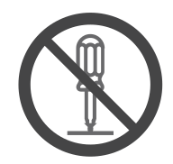
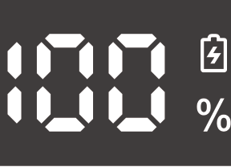
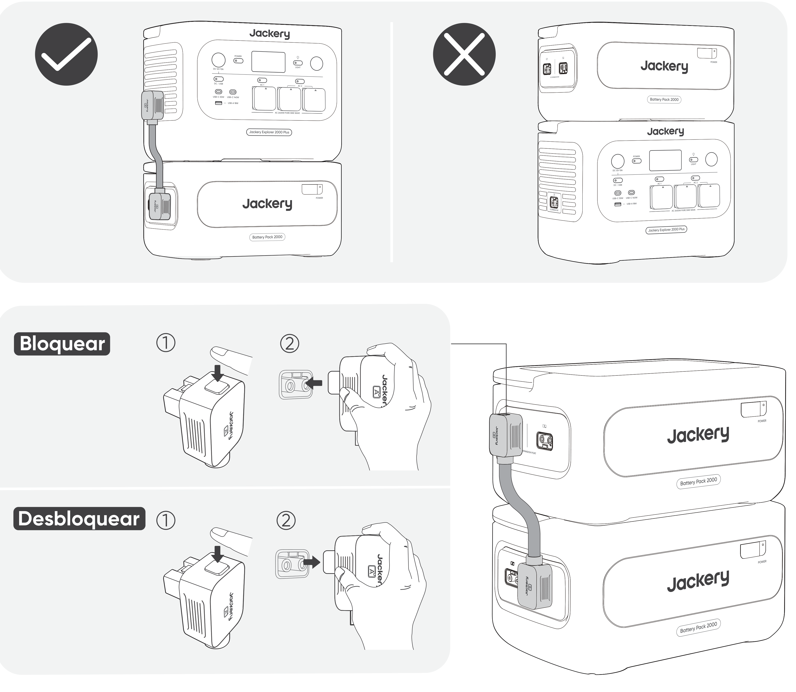

<strong>IMPORTANTE</strong>

Felicitaciones por su nuevo Jackery Battery Pack 2000. Antes de utilizar el producto, lea cuidadosamente este manual, especialmente las precauciones relevantes para asegurar un uso adecuado. Mantenga este manual en un lugar accesible para futuras consultas.

De acuerdo con las leyes y regulaciones, el derecho de interpretación final de este documento y todos los documentos relacionados con este producto corresponde a la Empresa. Aunque se ha hecho todo lo posible para garantizar la exactitud de este manual, Jackery no asume ninguna responsabilidad por los errores que puedan aparecer.

Tenga en cuenta que no se emitirán notificaciones adicionales en caso de actualizaciones, revisiones o terminación. Para obtener la última versión de los manuales del producto, visite support.jackery.com.

* Las cifras son sólo de referencia. Consulte el producto real.

<table class="manual-callout-table" style="width:100%; border-collapse:collapse; margin:0 0 16px 0;"><tbody><tr><td class="manual-callout-label" style="width:16%; border:1px solid #000; padding:6px 8px; vertical-align:top;">
<strong>NOTA</strong>
</td><td class="manual-callout-body" style="border:1px solid #000; padding:6px 8px; vertical-align:top;">
Esta batería de expansión es compatible con Jackery E2000 Plus V2 y Jackery E1000 Plus V2. En este manual, «la estación de energía portátil» se refiere a cualquiera de los dos modelos, salvo que se indique lo contrario.
</td></tr></tbody></table>

# INFORMACIÓN IMPORTANTE DE SEGURIDAD

Se deben seguir las precauciones básicas de seguridad al utilizar este producto, incluyendo:

<ul class="simple">
<li>
Lea todas las instrucciones antes de utilizar este producto.
</li>
<li>
Se requiere una atenta supervisión cuando se utiliza este producto cerca de los niños para reducir el riesgo.
</li>
<li>
Puede haber riesgo de descarga eléctrica si se utilizan accesorios no recomendados o vendidos por fabricantes de productos no profesionales.
</li>
<li>
Cuando el producto no esté en uso, desconecte el enchufe del producto.
</li>
<li>
No desmonte el producto, ya que puede provocar riesgos imprevisibles como incendios, explosiones o descargas eléctricas.
</li>
<li>
No utilice el producto con cables o enchufes dañados, o con cables de salida dañados, ya que pueden provocar una descarga eléctrica.
</li>
<li>
Cargue el producto en un área bien ventilada y no restrinja la ventilación de ninguna manera.
</li>
<li>
Coloque el producto en un lugar ventilado y seco para evitar que la lluvia y el agua provoquen una descarga eléctrica.
</li>
<li>
No exponga el producto al fuego o a altas temperaturas (bajo la luz directa del sol o en un vehículo con mucho calor), ya que puede provocar accidentes como incendios y explosiones.
</li>
<li>
Si este producto se almacena durante un largo periodo de tiempo (3–6 meses) con la batería descargada, podría volverse imposible de recargar.
</li>
</ul>

# SIGNIFICADO DE LOS SÍMBOLOS

<figure aria-label="Símbolo / Significado" class="hb-symbol-signal-composition" data-component-id="HB-TABLE-SYMBOL-SIGNAL"><table class="hb-symbol-signal-table"><colgroup><col class="hb-symbol-signal-col-label"/><col class="hb-symbol-signal-col-meaning"/></colgroup><thead><tr><th class="hb-symbol-signal-label-heading" scope="col">
Símbolo
</th><th class="hb-symbol-signal-meaning-heading" scope="col">
Significado
</th></tr></thead><tbody><tr><td class="hb-symbol-signal-label-cell">⚠ADVERTENCIA</td><td class="hb-symbol-signal-meaning-cell">
Prácticas peligrosas que pueden resultar en lesiones graves, muerte y/o daños a la propiedad.
</td></tr><tr><td class="hb-symbol-signal-label-cell">⚠PRECAUCIÓN</td><td class="hb-symbol-signal-meaning-cell">
Prácticas peligrosas que pueden resultar en lesiones personales y/o daños a la propiedad.
</td></tr><tr><td class="hb-symbol-signal-label-cell">NOTA</td><td class="hb-symbol-signal-meaning-cell">
Prácticas peligrosas que pueden resultar en daños en el equipo, pérdida de datos, deterioro del rendimiento o resultados inesperados.
</td></tr><tr><td class="hb-symbol-signal-label-cell">CONSEJOS</td><td class="hb-symbol-signal-meaning-cell">
Complementa la información importante o consejos de operación en el texto.
</td></tr></tbody></table></figure>

<figure aria-label="Símbolo / Significado" class="hb-symbol-pair-composition" data-component-id="HB-TABLE-SYMBOL-ICON">

<table class="hb-symbol-panel-table"><colgroup><col class="hb-symbol-col-icon"/><col class="hb-symbol-col-meaning"/></colgroup><thead><tr><th class="hb-symbol-icon-heading" scope="col">
<strong>Símbolo</strong>
</th><th class="hb-symbol-meaning-heading" scope="col">
<strong>Significado</strong>
</th></tr></thead><tbody><tr><td class="hb-symbol-icon"></td><td class="hb-symbol-meaning">
Precaución. El incumplimiento de los mensajes de advertencia puede provocar lesiones.
</td></tr><tr><td class="hb-symbol-icon"></td><td class="hb-symbol-meaning">
Lea el manual del usuario antes de operar el producto.
</td></tr><tr><td class="hb-symbol-icon"></td><td class="hb-symbol-meaning">
No desarme el producto.
</td></tr><tr><td class="hb-symbol-icon"></td><td class="hb-symbol-meaning">
No fumar ni utilizar llamas abiertas.
</td></tr></tbody></table>

<table class="hb-symbol-panel-table"><colgroup><col class="hb-symbol-col-icon"/><col class="hb-symbol-col-meaning"/></colgroup><thead><tr><th class="hb-symbol-icon-heading" scope="col">
<strong>Símbolo</strong>
</th><th class="hb-symbol-meaning-heading" scope="col">
<strong>Significado</strong>
</th></tr></thead><tbody><tr><td class="hb-symbol-icon"></td><td class="hb-symbol-meaning">
No se permite el acceso a niños.
</td></tr><tr><td class="hb-symbol-icon"></td><td class="hb-symbol-meaning">
Este símbolo indica que el producto contiene una batería de iones de litio (Li-ion), la cual debe desecharse o reciclarse de forma adecuada.
</td></tr><tr><td class="hb-symbol-icon"></td><td class="hb-symbol-meaning">
Este símbolo indica que el producto no debe desecharse con los residuos domésticos, sino entregarse en un punto de recogida designado para su reciclaje. La eliminación y el reciclaje adecuados ayudan a proteger el medioambiente. Para más información, póngase en contacto con su comunidad local, el servicio de gestión de residuos o el distribuidor del producto.
</td></tr><tr><td class="hb-symbol-icon"></td><td class="hb-symbol-meaning">
Las baterías y acumuladores no deben desecharse junto con los residuos domésticos.
Como consumidor, usted está obligado por ley a desechar todas las baterías y acumuladores en los puntos de recolección designados, independientemente de si contienen sustancias peligrosas.
Devuelva las baterías y acumuladores usados a un punto de recolección local, un centro de reciclaje o al minorista donde los compró. La eliminación adecuada garantiza un reciclaje responsable con el medio ambiente y evita posibles daños a la salud humana y al medio ambiente.
</td></tr></tbody></table>

</figure>

# CONTENIDO DE LA CAJA

<figure aria-label="CONTENIDO DE LA CAJA" class="hb-inbox-composition" data-card-count="3" data-component-id="HB-SPECIAL-INBOX" data-inbox-variant="three-card-responsive"><ol class="hb-inbox-grid"><li class="hb-inbox-card" data-item-number="1">

<strong>Jackery Battery Pack 2000</strong>

</li><li class="hb-inbox-card" data-item-number="2">

<strong>Cable de expansión</strong>

</li><li class="hb-inbox-card" data-item-number="3">

<strong>Documentos</strong>

</li></ol></figure>

# DESCRIPCIÓN GENERAL DEL PRODUCTO

<section id="vista-frontal">
<h2>VISTA FRONTAL</h2>

<table>
<colgroup>
<col style="width: 50.0%"/>
<col style="width: 50.0%"/>
</colgroup>
<tbody>
<tr><td>
<strong>Botón de encendido principal</strong>
</td>
<td>
<strong>LCD</strong>
</td>
</tr>
</tbody>
</table>
</section>

<section id="vista-lateral-izquierda">
<h2>VISTA LATERAL IZQUIERDA</h2>

<table>
<colgroup>
<col style="width: 50.0%"/>
<col style="width: 50.0%"/>
</colgroup>
<tbody>
<tr><td>
<strong>Asa</strong>
</td>
<td>
<strong>Puerto de expansión A de CC</strong>

(Conectar a la Terminal A del Cable de Expansión)

</td>
</tr>
<tr><td></td>
<td>
<strong>Puerto de expansión B de CC</strong>

(Conectar a la Terminal B del Cable de Expansión)

</td>
</tr>
</tbody>
</table>
</section>

# PANTALLA LCD

<table class="longtable lcd-text-only">
<colgroup>
<col style="width: 8.0%"/>
<col style="width: 12.0%"/>
<col style="width: 28.0%"/>
<col style="width: 52.0%"/>
</colgroup>
<tbody>
<tr><td>
1
</td>
<td></td>
<td>
Porcentaje de potencia/Código de fallo
</td>
<td>
La potencia muestra el porcentaje del valor de potencia actual. Cuando el sistema falla, se mostrará el correspondiente código de fallo F0-FF. Si aparece el código FF, retire la carga y el producto podrá recuperarse por sí mismo, si no, por favor contacte con atención al cliente de Jackery. En caso de que aparezca cualquier otro código, por favor contacte con atención al cliente.
</td>
</tr>
<tr><td>
2
</td>
<td></td>
<td>
Indicador de carga
</td>
<td>
Durante la carga se muestra el indicador y desaparece cuando está completamente cargado.
</td>
</tr>
</tbody>
</table>

# OPERACIONES

<section id="encendido-apagado">
<h2>ENCENDIDO/APAGADO</h2>

<strong>Encendido</strong>

Presione una vez

<strong>Apagado</strong>

Mantenga presionado durante 3 segundos

<table class="manual-callout-table" style="width:100%; border-collapse:collapse; margin:0 0 16px 0;"><tbody><tr><td class="manual-callout-label" style="width:16%; border:1px solid #000; padding:6px 8px; vertical-align:top;">
<strong>NOTA</strong>
</td><td class="manual-callout-body" style="border:1px solid #000; padding:6px 8px; vertical-align:top;">
Cuando se utiliza con la estación de energía portátil, puede controlar el encendido o apagado del Jackery Battery Pack 2000 mediante el botón POWER principal de la estación de energía portátil.

El producto se apagará automáticamente si no se carga o no se conectan cargos durante 2 horas.

</td></tr></tbody></table></section>

<section id="encendido-apagado-de-la-pantalla-lcd">
<h2>ENCENDIDO/APAGADO DE LA PANTALLA LCD</h2>

Al presionar el botón POWER principal o cargar el producto, la pantalla LCD se enciende. Presione de nuevo el botón POWER principal para apagar la pantalla LCD.

</section>

# CONEXIONES

Se pueden utilizar hasta cinco baterías adicionales con la estación de energía portátil para aumentar la capacidad disponible.

<table class="manual-callout-table" style="width:100%; border-collapse:collapse; margin:0 0 16px 0;"><tbody><tr><td class="manual-callout-label" style="width:16%; border:1px solid #000; padding:6px 8px; vertical-align:top;">
<strong>PRECAUCIÓN</strong>
</td><td class="manual-callout-body" style="border:1px solid #000; padding:6px 8px; vertical-align:top;"><ul class="simple">
<li>
Asegúrese de que todos los productos estén apagados antes de conectar la estación de energía portátil al Jackery Battery Pack 2000.
</li>
<li>
Para asegurar el funcionamiento adecuado del producto, asegúrese de que las rejillas de entrada y salida de aire en ambos lados estén despejadas. Deje al menos 0,66 pies (200 mm) de espacio entre las rejillas y cualquier objeto para permitir una disipación de calor adecuada.
</li>
</ul>
</td></tr></tbody></table>

<table class="manual-callout-table" style="width:100%; border-collapse:collapse; margin:0 0 16px 0;"><tbody><tr><td class="manual-callout-label" style="width:16%; border:1px solid #000; padding:6px 8px; vertical-align:top;">
<strong>OBSERVACIONES</strong>
</td><td class="manual-callout-body" style="border:1px solid #000; padding:6px 8px; vertical-align:top;"><ul class="simple">
<li>
La aparición del icono de conexión en la pantalla LCD (la estación de energía portátil) indica que la conexión entre la batería y la estación de energía portátil se ha realizado correctamente.
</li>
<li>
No coloque el producto encima de la estación de energía portátil.
</li>
<li>
Coloque las baterías adicionales sobre una superficie plana, estable y con suficiente capacidad de carga. El número máximo predeterminado de baterías adicionales apiladas es de 3.
</li>
<li>
Si se requieren 4 o más baterías adicionales, deben colocarse en una zona estable, apoyadas contra una pared y alejadas de impactos externos, y deben adoptarse las medidas necesarias de fijación antivuelco.
</li>
</ul>
</td></tr></tbody></table>

# RESOLUCIÓN DE PROBLEMAS

Si aparece alguno de los siguientes códigos de fallo, siga las acciones correctivas listadas para resolver el problema. Si el fallo persiste, por favor contacte con atención al cliente de Jackery.

<figure aria-label="Código de fallo / Medidas correctivas" class="hb-troubleshooting-composition" data-component-id="HB-TABLE-TROUBLESHOOTING" tabindex="0"><table class="hb-troubleshooting-table"><colgroup><col class="hb-troubleshooting-col-code"/><col class="hb-troubleshooting-col-measures"/></colgroup><thead><tr><th class="hb-troubleshooting-code" scope="col">
Código de fallo
</th><th class="hb-troubleshooting-measures" scope="col">
Medidas correctivas
</th></tr></thead><tbody><tr><td class="hb-troubleshooting-code">
F0
</td><td class="hb-troubleshooting-measures">
Reiniciar el producto.
</td></tr><tr><td class="hb-troubleshooting-code">
F3
</td><td class="hb-troubleshooting-measures">
Reiniciar el producto.
</td></tr><tr><td class="hb-troubleshooting-code">
F4
</td><td class="hb-troubleshooting-measures">
Conecte el producto a cargas para descargar su batería hasta que la falla desaparezca.
</td></tr><tr><td class="hb-troubleshooting-code">
F5
</td><td class="hb-troubleshooting-measures">
Cargue el producto mediante paneles solares o toma de corriente CA hasta que la falla desaparezca.
</td></tr><tr><td class="hb-troubleshooting-code">
F8
</td><td class="hb-troubleshooting-measures">
Contacte con atención al cliente de Jackery.
</td></tr><tr><td class="hb-troubleshooting-code">
FE
</td><td class="hb-troubleshooting-measures">
Contacte con atención al cliente de Jackery.
</td></tr><tr><td class="hb-troubleshooting-code">
FF
</td><td class="hb-troubleshooting-measures">
Coloque el producto en un ambiente con temperatura adecuada y espere hasta que la falla desaparezca.
</td></tr></tbody></table></figure>

# CARGANDO

<section id="carga-mediante-una-toma-de-corriente-de-pared-alterna">
<h2>CARGA MEDIANTE UNA TOMA DE CORRIENTE DE PARED ALTERNA</h2>

Para cargar la batería desde una toma de corriente de pared de CA, conéctela a la estación de energía portátil.

<table class="manual-callout-table" style="width:100%; border-collapse:collapse; margin:0 0 16px 0;"><tbody><tr><td class="manual-callout-label" style="width:16%; border:1px solid #000; padding:6px 8px; vertical-align:top;">
<strong>ADVERTENCIA</strong>
</td><td class="manual-callout-body" style="border:1px solid #000; padding:6px 8px; vertical-align:top;">
Asegúrese de que todos los productos estén apagados antes de conectar la estación de energía portátil al paquete de Battery Pack 2000.
</td></tr></tbody></table>
</section>

<section id="carga-mediante-paneles-solares-se-vende-por-separado">
<h2>CARGA MEDIANTE PANELES SOLARES (SE VENDE POR SEPARADO)</h2>

Cargue la batería utilizando paneles solares y la estación de energía portátil, como se muestra en la siguiente figura. Para obtener más información, consulte el manual de usuario de la estación de energía portátil.

</section>

# ALMACENAMIENTO

Almacene el producto en un lugar seco y limpio con ventilación adecuada. Temperatura y humedad de almacenamiento:

<ul class="simple">
<li>
1 mes: -20 °C a 45 °C (0-60 % HR)
</li>
<li>
3 meses: 0 °C a 45 °C (0-60 % HR)
</li>
<li>
12 meses: 0 °C a 25 °C (0-60 % HR)
</li>
</ul>

Si este producto se almacena durante un período prolongado (de 3 a 6 meses) con la batería descargada, podría volverse imposible recargarlo. Para evitar esto y mantener la salud de la batería, se recomienda revisar y recargar el producto cada tres meses, y realizar un ciclo completo de carga y descarga al menos una vez cada 6 a 12 meses.

# ESPECIFICACIONES

## INFORMACIÓN GENERAL

<figure aria-label="INFORMACIÓN GENERAL" class="hb-spec-table-composition"><table class="hb-spec-table manual-table manual-spec-table"><colgroup><col class="hb-spec-col-label"/><col class="hb-spec-col-value"/></colgroup>
<tbody>
<tr>
<th class="hb-spec-label manual-spec-label" scope="row">Nombre del producto</th>
<td class="hb-spec-value manual-spec-value">Jackery Battery Pack 2000</td>
</tr>
<tr>
<th class="hb-spec-label manual-spec-label" scope="row">N° de modelo</th>
<td class="hb-spec-value manual-spec-value">JBP-2000B</td>
</tr>
<tr>
<th class="hb-spec-label manual-spec-label" scope="row">Capacidad</th>
<td class="hb-spec-value manual-spec-value">2048 Wh (40 Ah/51,2 V ⎓)</td>
</tr>
<tr>
<th class="hb-spec-label manual-spec-label" scope="row">Química Celular</th>
<td class="hb-spec-value manual-spec-value">LiFePO₄</td>
</tr>
<tr>
<th class="hb-spec-label manual-spec-label" scope="row">Peso</th>
<td class="hb-spec-value manual-spec-value">Aproximadamente 14,8 kg</td>
</tr>
<tr>
<th class="hb-spec-label manual-spec-label" scope="row">Dimensiones</th>
<td class="hb-spec-value manual-spec-value">36,5 × 25,5 × 19,1 cm</td>
</tr>
<tr>
<th class="hb-spec-label manual-spec-label" scope="row">Ciclo de vida</th>
<td class="hb-spec-value manual-spec-value">6000 ciclos de carga hasta 70 % + de capacidad</td>
</tr>
</tbody>
</table></figure>

## PUERTOS DE ENTRADA/SALIDA

<figure aria-label="PUERTOS DE ENTRADA/SALIDA" class="hb-spec-table-composition"><table class="hb-spec-table manual-table manual-spec-table"><colgroup><col class="hb-spec-col-label"/><col class="hb-spec-col-value"/></colgroup>
<tbody>
<tr>
<th class="hb-spec-label manual-spec-label" scope="row">Puerto de Expansión de CC (Entrada)</th>
<td class="hb-spec-value manual-spec-value">36,8 V-57,6 V⎓75 A Máx.</td>
</tr>
<tr>
<th class="hb-spec-label manual-spec-label" scope="row">Puerto de Expansión de CC (Salida)</th>
<td class="hb-spec-value manual-spec-value">36,8 V-57,6 V⎓75 A Máx.</td>
</tr>
</tbody>
</table></figure>

## TEMPERATURA DE FUNCIONAMIENTO

<figure aria-label="TEMPERATURA DE FUNCIONAMIENTO" class="hb-spec-table-composition"><table class="hb-spec-table manual-table manual-spec-table"><colgroup><col class="hb-spec-col-label"/><col class="hb-spec-col-value"/></colgroup>
<tbody>
<tr>
<th class="hb-spec-label manual-spec-label" scope="row">Temperatura de carga</th>
<td class="hb-spec-value manual-spec-value">-10°C a 45°C</td>
</tr>
<tr>
<th class="hb-spec-label manual-spec-label" scope="row">Temperatura de descarga</th>
<td class="hb-spec-value manual-spec-value">-10°C a 45°C</td>
</tr>
</tbody>
</table></figure>

# GARANTÍA

<figure aria-label="GARANTÍA" class="hb-warranty-intro-composition" data-component-id="HB-WARRANTY-LEAD">

<strong>Solo ofrecemos nuestra garantía a clientes que compren en el sitio web oficial de Jackery, plataformas de terceros con la marca Jackery o distribuidores autorizados locales.</strong>

*El periodo de garantía y los detalles pueden variar según las leyes, regulaciones y distribuidores autorizados locales.

</figure>

<section class="warranty-section" id="garantia-limitada">
<h2>Garantía limitada</h2>
<figure aria-label="Garantía limitada" class="hb-warranty-card" data-component-id="HB-WARRANTY-SECTION" data-warranty-card-index="1">
Jackery garantiza al consumidor original que el producto Jackery estará libre de defectos relativos al acabado y a los materiales en condiciones normales de uso por parte del consumidor durante el período de garantía aplicable identificado en la sección "Período de garantía" que figura a continuación, sujeto a las exclusiones que se establecen a continuación.

Esta declaración de garantía establece la obligación de garantía total y exclusiva de Jackery. No asumiremos ni autorizaremos que ninguna persona asuma por nosotros ninguna otra responsabilidad en relación con la venta de nuestros productos.
</figure>
</section>

<section class="warranty-section warranty-years" id="periodo-de-garantia">
<h2>Período de garantía</h2>
<figure aria-label="Período de garantía" class="hb-warranty-period-card" data-component-id="HB-WARRANTY-YEARS">

3
<strong class="hb-warranty-years-unit">AÑOS</strong><strong class="hb-warranty-period-label">— Garantía estándar</strong>

El periodo de garantía estándar de Jackery Battery Pack 2000 es de 36 meses. En cada caso, el período de garantía se mide a partir de la fecha de compra por parte del comprador consumidor original. Para establecer la fecha de inicio del período de garantía, se necesita el recibo de venta de la primera compra del consumidor u otra prueba documental razonable.

2
<strong class="hb-warranty-years-unit">AÑOS</strong><strong class="hb-warranty-period-label">— Garantía extendida</strong>

Para activar la extensión de garantía, debe registrar su producto en línea o ponerse en contacto con nuestro equipo de atención al cliente en <a class="reference external" href="mailto:hello.eu@jackery.com">hello.eu@jackery.com</a> para ampliar la duración de la garantía estándar.

</figure>
</section>

<section class="warranty-section" id="cambio">
<h2>Cambio</h2>
<figure aria-label="Cambio" class="hb-warranty-card" data-component-id="HB-WARRANTY-SECTION" data-warranty-card-index="3">
Jackery sustituirá (a cargo de Jackery) cualquier producto Jackery que no funcione, durante el período de garantía aplicable, debido a defectos de acabado o de material. Un producto de sustitución asume la garantía restante del producto original.
</figure>
</section>

<section class="warranty-section" id="limitado-al-comprador-consumidor-original">
<h2>Limitado al comprador consumidor original</h2>
<figure aria-label="Limitado al comprador consumidor original" class="hb-warranty-card" data-component-id="HB-WARRANTY-SECTION" data-warranty-card-index="4">
La garantía del producto de Jackery se limita al consumidor original y no es transferible a ningún propietario posterior.
</figure>
</section>

<section class="warranty-section" id="exclusiones">
<h2>Exclusiones</h2>
<figure aria-label="Exclusiones" class="hb-warranty-card" data-component-id="HB-WARRANTY-SECTION" data-warranty-card-index="5">
La garantía de Jackery no se aplica a:
<ul class="simple">
<li>
Mal uso, abuso, modificación, daño por accidente, o uso para cualquier cosa que no sea el uso normal del consumidor según lo autorizado en los folletos actuales del producto de Jackery.
</li>
<li>
Intento de reparación por cualquier persona que no sea un centro autorizado.
</li>
<li>
Cualquier producto adquirido a través de una casa de subastas en línea.
</li>
<li>
La garantía de Jackery no se aplica a la célula de la batería a menos que usted la cargue completamente en los siete días siguientes a la compra del producto y, a partir de entonces, al menos una vez cada 6 meses.
</li>
</ul></figure>
</section>

<section class="warranty-section" id="derechos-de-interpretacion">
<h2>Derechos de interpretación</h2>
<figure aria-label="Derechos de interpretación" class="hb-warranty-card" data-component-id="HB-WARRANTY-SECTION" data-warranty-card-index="6">
Jackery se reserva el derecho a la interpretación final de la política posventa de los clientes anterior.
</figure>
</section>

# EU REGULATIONS

<section id="red-declaration-of-conformity">
<h2>RED DECLARATION OF CONFORMITY</h2>

Shenzhen Hello Tech Energy Co., Ltd. hereby declares that this Jackery Battery Pack 2000 with Bluetooth and Wi-Fi JBP-2000B is in compliance with the essential requirements and other relevant provisions of the RED Directive 2014/53/EU. The full text of the EU declaration of conformity is available at the following internet address:

<a class="reference external" href="https://de.jackery.com/pages/user-guides">https://de.jackery.com/pages/user-guides</a>

</section>

<section id="manufacturer">
<h2>MANUFACTURER</h2>

SHENZHEN HELLO TECH ENERGY CO., LTD.

Address: F2-3, Bldg. 7, Jiaanda Science and technology industrial park factory, the east side of Huafan Road, Tongsheng Community, Dalang Street, Longhua District, Shenzhen, Guangdong, China

+86 400 668 9293

<a class="reference external" href="mailto:sales@hello-tech.com">sales@hello-tech.com</a>

www.hello-tech.com

</section>
