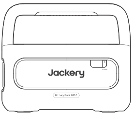
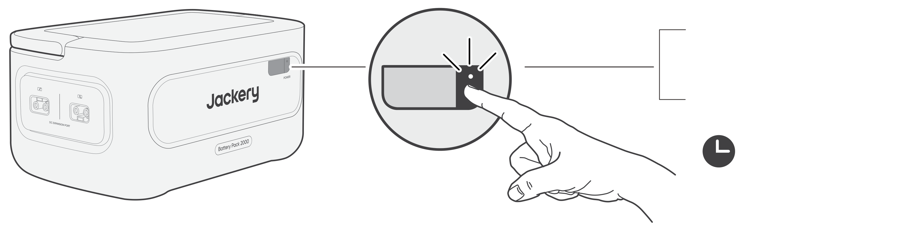
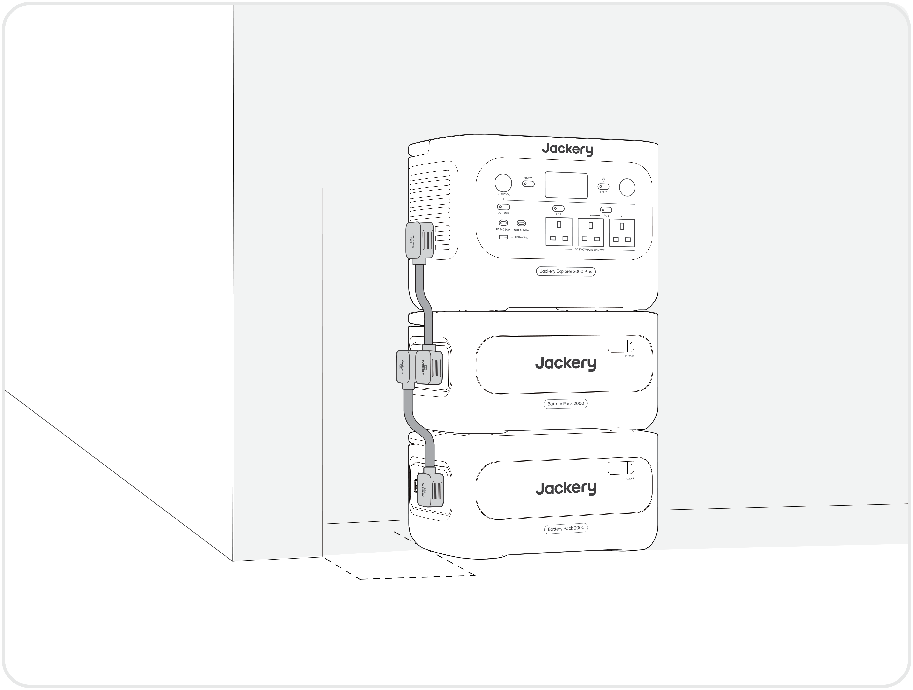
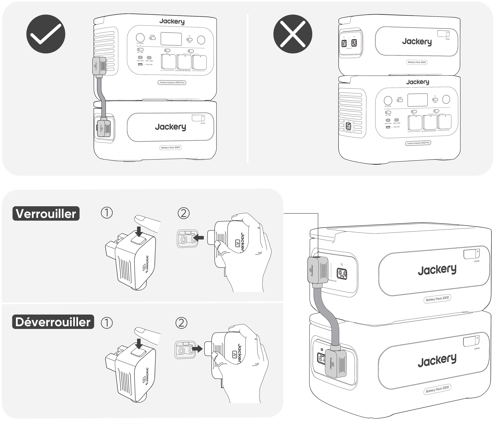
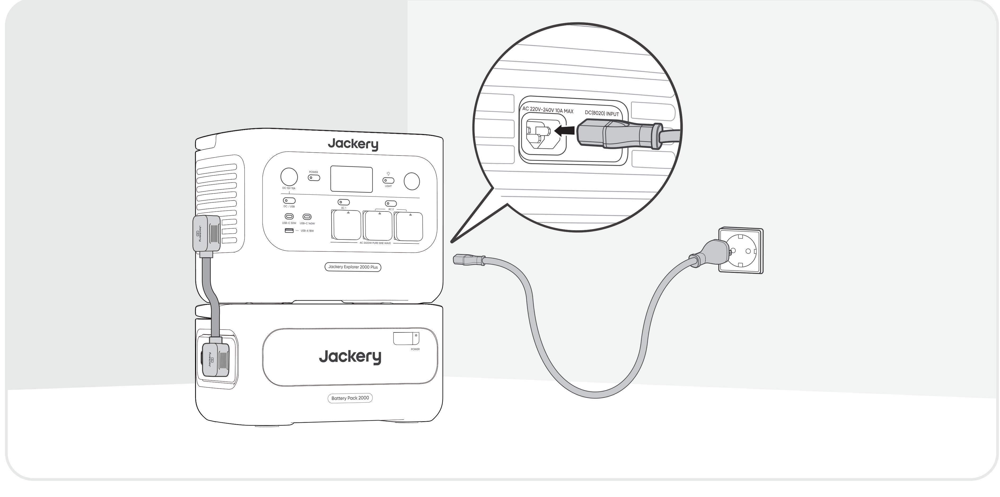
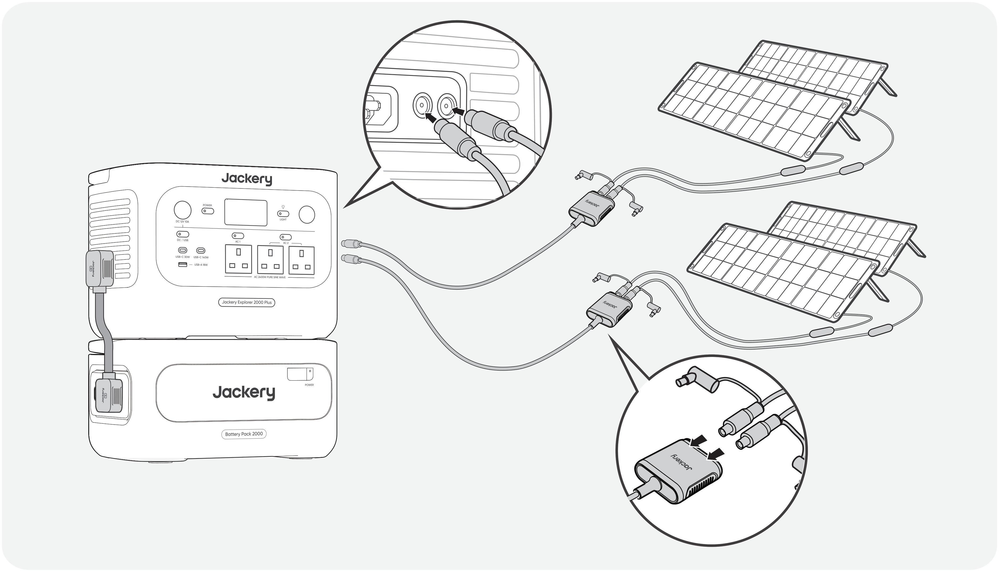

<strong>IMPORTANT</strong>

Félicitations pour votre nouveau Jackery Battery Pack 2000. Veuillez lire attentivement ce manuel avant d'utiliser le produit, en particulier les précautions à prendre pour garantir une utilisation correcte du produit. Conservez ce manuel dans un endroit accessible pour pouvoir vous y référer ultérieurement.

Conformément aux lois et réglementations en vigueur, le droit d'interprétation final de ce document et de tous les documents associés à ce produit appartient à l'entreprise. Bien que tous les efforts aient été déployés pour garantir l'exactitude de ce manuel, Jackery n'assume aucune responsabilité pour les erreurs qui pourraient y figurer.

Veuillez noter qu'aucune autre notification ne sera faite en cas de mise à jour, de révision ou de résiliation. Pour la dernière version des manuels du produit, consultez support.jackery.com.

* Les chiffres sont donnés à titre indicatif uniquement. Veuillez vous référer au produit réel.

<table class="manual-callout-table" style="width:100%; border-collapse:collapse; margin:0 0 16px 0;"><tbody><tr><td class="manual-callout-label" style="width:16%; border:1px solid #000; padding:6px 8px; vertical-align:top;">
<strong>REMARQUE</strong>
</td><td class="manual-callout-body" style="border:1px solid #000; padding:6px 8px; vertical-align:top;">
Cette batterie d'extension est compatible avec le Jackery E2000 Plus V2 et le Jackery E1000 Plus V2. Dans le présent manuel, « la station d'énergie portable » désigne l'un ou l'autre modèle, sauf indication contraire.
</td></tr></tbody></table>

# INFORMATIONS DE SÉCURITÉ IMPORTANTES

Les précautions de base doivent être respectées lors de l'utilisation de ce produit, y compris :

<ul class="simple">
<li>
Veuillez lire toutes les instructions avant d'utiliser ce produit.
</li>
<li>
Une surveillance attentive est nécessaire lors de l'utilisation de ce produit à proximité d'enfants afin de réduire les risques.
</li>
<li>
L'utilisation d'accessoires recommandés ou vendus par des fabricants de produits non professionnels peut entraîner un risque d'électrocution.
</li>
<li>
Lorsque le produit n'est pas utilisé, veuillez débrancher l'alimentation de la prise du produit.
</li>
<li>
Ne pas démonter le produit, ce qui pourrait entraîner des risques imprévisibles tels qu'un incendie, une explosion ou un choc électrique.
</li>
<li>
N'utilisez pas le produit avec des cordons ou des prises endommagés, ou des câbles de sortie endommagés, ce qui pourrait provoquer un choc électrique.
</li>
<li>
Chargez le produit dans un endroit bien ventilé et ne restreignez pas la ventilation de quelque manière que ce soit.
</li>
<li>
Placez le produit dans un endroit ventilé et sec afin d'éviter que la pluie et l'eau ne provoquent un choc électrique.
</li>
<li>
N'exposez pas le produit au feu ou à des températures élevées (sous la lumière directe du soleil ou dans un véhicule soumis à une forte chaleur), ce qui pourrait provoquer des accidents tels qu'un incendie ou une explosion.
</li>
<li>
Si ce produit est stocké pendant une longue période (3 mois–6 mois) alors qu'il n'est plus alimenté, il pourrait devenir impossible à recharger.
</li>
</ul>

# SIGNIFICATION DES SYMBOLES

<figure aria-label="Symbole / Signification" class="hb-symbol-signal-composition" data-component-id="HB-TABLE-SYMBOL-SIGNAL"><table class="hb-symbol-signal-table"><colgroup><col class="hb-symbol-signal-col-label"/><col class="hb-symbol-signal-col-meaning"/></colgroup><thead><tr><th class="hb-symbol-signal-label-heading" scope="col">
Symbole
</th><th class="hb-symbol-signal-meaning-heading" scope="col">
Signification
</th></tr></thead><tbody><tr><td class="hb-symbol-signal-label-cell">⚠AVERTISSEMENT</td><td class="hb-symbol-signal-meaning-cell">
Pratiques dangereuses pouvant entraîner des blessures graves, la mort et/ou des dommages matériels.
</td></tr><tr><td class="hb-symbol-signal-label-cell">⚠ATTENTION</td><td class="hb-symbol-signal-meaning-cell">
Pratiques dangereuses pouvant entraîner des blessures corporelles et/ou des dommages matériels.
</td></tr><tr><td class="hb-symbol-signal-label-cell">REMARQUE</td><td class="hb-symbol-signal-meaning-cell">
Pratiques dangereuses pouvant entraîner des dommages à l'équipement, une perte de données, une détérioration des performances ou des résultats inattendus.
</td></tr><tr><td class="hb-symbol-signal-label-cell">CONSEIL</td><td class="hb-symbol-signal-meaning-cell">
Complète les informations importantes ou les conseils d'utilisation dans le texte.
</td></tr></tbody></table></figure>

<figure aria-label="Symbole / Signification" class="hb-symbol-pair-composition" data-component-id="HB-TABLE-SYMBOL-ICON">

<table class="hb-symbol-panel-table"><colgroup><col class="hb-symbol-col-icon"/><col class="hb-symbol-col-meaning"/></colgroup><thead><tr><th class="hb-symbol-icon-heading" scope="col">
<strong>Symbole</strong>
</th><th class="hb-symbol-meaning-heading" scope="col">
<strong>Signification</strong>
</th></tr></thead><tbody><tr><td class="hb-symbol-icon"></td><td class="hb-symbol-meaning">Symboles d’avertissement et de mise en garde. Signalent aux personnes des informations qui doivent être lues afin d’éviter les dangers ou risques potentiels.</td></tr><tr><td class="hb-symbol-icon"></td><td class="hb-symbol-meaning">Lire le manuel de l'opérateur.</td></tr><tr><td class="hb-symbol-icon"></td><td class="hb-symbol-meaning">Ne démontez pas le produit.</td></tr><tr><td class="hb-symbol-icon"></td><td class="hb-symbol-meaning">Tenir le produit à l’écart du feu.</td></tr></tbody></table>

<table class="hb-symbol-panel-table"><colgroup><col class="hb-symbol-col-icon"/><col class="hb-symbol-col-meaning"/></colgroup><thead><tr><th class="hb-symbol-icon-heading" scope="col">
<strong>Symbole</strong>
</th><th class="hb-symbol-meaning-heading" scope="col">
<strong>Signification</strong>
</th></tr></thead><tbody><tr><td class="hb-symbol-icon"></td><td class="hb-symbol-meaning">Les enfants ne sont pas admis.</td></tr><tr><td class="hb-symbol-icon"></td><td class="hb-symbol-meaning">Ce symbole indique que le produit contient une batterie lithium-ion (Li-ion), qui doit être éliminée ou recyclée de manière appropriée.</td></tr><tr><td class="hb-symbol-icon"></td><td class="hb-symbol-meaning">Ce symbole indique que le produit ne doit pas être jeté avec les ordures ménagères. Il doit être apporté à un point de collecte désigné pour un recyclage approprié.Une élimination et un recyclage corrects contribuent à la protection de l’environnement. Pour plus d’informations, veuillez contacter votre autorité locale, le service de gestion des déchets ou le revendeur du produit.</td></tr><tr><td class="hb-symbol-icon"></td><td class="hb-symbol-meaning">Les piles et accumulateurs ne doivent pas être jetés avec les ordures ménagères. En tant que consommateur, vous êtes légalement tenu de déposer toutes les piles et accumulateurs dans des points de collecte désignés, qu'ils contiennent ou non des substances dangereuses. Veuillez rapporter les piles et accumulateurs usagés à un point de collecte local, un centre de recyclage ou au détaillant où ils ont été achetés. Une élimination appropriée garantit un recyclage respectueux de l'environnement et prévient les dommages potentiels pour la santé humaine et l'environnement.</td></tr></tbody></table>

</figure>

# CONTENU DE LA BOÎTE

<figure aria-label="CONTENU DE LA BOÎTE" class="hb-inbox-composition" data-card-count="3" data-component-id="HB-SPECIAL-INBOX" data-inbox-variant="three-card-responsive"><ol class="hb-inbox-grid"><li class="hb-inbox-card" data-item-number="1">

<strong>Jackery Battery Pack 2000</strong>

</li><li class="hb-inbox-card" data-item-number="2">

<strong>Câble de rallonge</strong>

</li><li class="hb-inbox-card" data-item-number="3">

Documents

</li></ol></figure>

# APERÇU DU PRODUIT

<section id="vue-de-face">
<h2>VUE DE FACE</h2>

<table>
<colgroup>
<col style="width: 50.0%"/>
<col style="width: 50.0%"/>
</colgroup>
<tbody>
<tr><td>
<strong>Bouton d’alimentation principale</strong>
</td>
<td>
<strong>LCD</strong>
</td>
</tr>
</tbody>
</table>
</section>

<section id="vue-laterale-gauche">
<h2>VUE LATÉRALE GAUCHE</h2>

<table>
<colgroup>
<col style="width: 50.0%"/>
<col style="width: 50.0%"/>
</colgroup>
<tbody>
<tr><td>
<strong>Poignée</strong>
</td>
<td>
<strong>Port d’extension CC A</strong>

(Connexion à la borne A du câble de rallonge)

</td>
</tr>
<tr><td></td>
<td>
<strong>Port d’extension CC B</strong>

(Connexion à la borne B du câble de rallonge)

</td>
</tr>
</tbody>
</table>
</section>

# AFFICHAGE LCD

<table class="longtable lcd-text-only">
<colgroup>
<col style="width: 8.0%"/>
<col style="width: 12.0%"/>
<col style="width: 28.0%"/>
<col style="width: 52.0%"/>
</colgroup>
<tbody>
<tr><td>
1
</td>
<td></td>
<td>
Pourcentage de puissance/code d’erreur
</td>
<td>
L’affichage de la puissance représente le pourcentage de la valeur actuelle de la puissance. En cas de défaillance du système, le code d’erreur correspondant (F0-FF) s’affiche. Si le code FF s’affiche, retirez la charge et le dispositif peut se rétablir de lui-même. Si ce n'est pas le cas, veuillez contacter le service à la clientèle de Jackery. Si un autre code apparaît, veuillez contacter notre service à la clientèle.
</td>
</tr>
<tr><td>
2
</td>
<td></td>
<td>
Témoin de charge
</td>
<td>
Le témoin s’affiche pendant la charge et disparaît lorsque l’appareil est complètement chargé.
</td>
</tr>
</tbody>
</table>

# FONCTIONNEMENT

<section id="marche-arret">
<h2>MARCHE/ARRÊT</h2>

<strong>Marche</strong>

Appuyez une fois

<strong>Arrêt</strong>

Appuyez et maintenez pendant 3 secondes

<table class="manual-callout-table" style="width:100%; border-collapse:collapse; margin:0 0 16px 0;"><tbody><tr><td class="manual-callout-label" style="width:16%; border:1px solid #000; padding:6px 8px; vertical-align:top;">
<strong>REMARQUE</strong>
</td><td class="manual-callout-body" style="border:1px solid #000; padding:6px 8px; vertical-align:top;">
Lors de l’utilisation avec la station d’énergie portable, vous pouvez contrôler la mise sous tension ou hors tension du Jackery Battery Pack 2000 à l’aide du bouton d’alimentation principal de la station d’énergie portable.

Le dispositif s’éteint automatiquement s’il n’est pas chargé ou si aucune charge n’est connectée pendant 2 heures.

</td></tr></tbody></table></section>

<section id="activation-desactivation-de-l-ecran-lcd">
<h2>ACTIVATION/DÉSACTIVATION DE L'ÉCRAN LCD</h2>

Lorsque vous appuyez sur le bouton POWER principal ou que vous chargez le produit, l'écran LCD s'allume. Appuyez à nouveau sur le bouton POWER principal pour éteindre l'écran LCD.

</section>

# CONNEXIONS

Jusqu’à cinq batteries d’extension peuvent être utilisées avec la station d’énergie portable afin d’augmenter la capacité disponible.

<table class="manual-callout-table" style="width:100%; border-collapse:collapse; margin:0 0 16px 0;"><tbody><tr><td class="manual-callout-label" style="width:16%; border:1px solid #000; padding:6px 8px; vertical-align:top;">
<strong>IMPORTANT</strong>
</td><td class="manual-callout-body" style="border:1px solid #000; padding:6px 8px; vertical-align:top;"><ul class="simple">
<li>
Assurez-vous que tous les produits sont éteints avant de connecter la station d’énergie portable au Jackery Battery Pack 2000.
</li>
<li>
Pour assurer le bon fonctionnement du produit, assurez-vous que les entrées et sorties d'air sur les deux côtés ne sont pas obstruées. Laissez un espace d'au moins 0,66 pied (200 mm) entre les ouvertures et tout objet pour permettre une dissipation thermique adéquate.
</li>
</ul>
</td></tr></tbody></table>

<table class="manual-callout-table" style="width:100%; border-collapse:collapse; margin:0 0 16px 0;"><tbody><tr><td class="manual-callout-label" style="width:16%; border:1px solid #000; padding:6px 8px; vertical-align:top;">
<strong>REMARQUES</strong>
</td><td class="manual-callout-body" style="border:1px solid #000; padding:6px 8px; vertical-align:top;"><ul class="simple">
<li>
L'apparition de l'icône de connexion sur l'écran LCD (la station d'énergie portable) signifie que la connexion entre l'unité de batterie et la station d'énergie portable est réussie.
</li>
<li>
Ne placez pas le produit sur la station d’énergie portable.
</li>
<li>
Placez les batteries d'extension sur une surface plane, stable et suffisamment résistante. Le nombre maximal de batteries d'extension empilées est de 3 par défaut.
</li>
<li>
Si 4 batteries d'extension ou plus sont nécessaires, elles doivent être placées dans une zone stable, contre un mur et à l'abri des chocs extérieurs, et les mesures nécessaires de fixation anti-basculement doivent être prises.
</li>
</ul>
</td></tr></tbody></table>

# DÉPANNAGE

Si l'un des codes d'erreur suivants apparaît, suivez les actions correctives indiquées pour résoudre le problème. Si l'erreur persiste, veuillez contacter le service client Jackery.

<figure aria-label="Code d'erreur / Mesures correctives" class="hb-troubleshooting-composition" data-component-id="HB-TABLE-TROUBLESHOOTING" tabindex="0"><table class="hb-troubleshooting-table"><colgroup><col class="hb-troubleshooting-col-code"/><col class="hb-troubleshooting-col-measures"/></colgroup><thead><tr><th class="hb-troubleshooting-code" scope="col">
Code d'erreur
</th><th class="hb-troubleshooting-measures" scope="col">
Mesures correctives
</th></tr></thead><tbody><tr><td class="hb-troubleshooting-code">
F0
</td><td class="hb-troubleshooting-measures">
Redémarrez le produit.
</td></tr><tr><td class="hb-troubleshooting-code">
F3
</td><td class="hb-troubleshooting-measures">
Redémarrez le produit.
</td></tr><tr><td class="hb-troubleshooting-code">
F4
</td><td class="hb-troubleshooting-measures">
Connectez le produit à des charges pour décharger sa batterie jusqu'à ce que l'erreur disparaisse.
</td></tr><tr><td class="hb-troubleshooting-code">
F5
</td><td class="hb-troubleshooting-measures">
Chargez le produit via des panneaux solaires ou une prise murale CA jusqu'à ce que l'erreur disparaisse.
</td></tr><tr><td class="hb-troubleshooting-code">
F8
</td><td class="hb-troubleshooting-measures">
Contacter le service à la clientèle de Jackery.
</td></tr><tr><td class="hb-troubleshooting-code">
FE
</td><td class="hb-troubleshooting-measures">
Contacter le service à la clientèle de Jackery.
</td></tr><tr><td class="hb-troubleshooting-code">
FF
</td><td class="hb-troubleshooting-measures">
Placez le produit dans un environnement à température appropriée et attendez que l'erreur disparaisse.
</td></tr></tbody></table></figure>

# CHARGE

<section id="chargement-par-prise-murale-ca">
<h2>CHARGEMENT PAR PRISE MURALE CA</h2>

Pour charger la batterie d’extension depuis une prise murale CA, connectez-la à la station d’énergie portable.

<table class="manual-callout-table" style="width:100%; border-collapse:collapse; margin:0 0 16px 0;"><tbody><tr><td class="manual-callout-label" style="width:16%; border:1px solid #000; padding:6px 8px; vertical-align:top;">
<strong>AVERTISSEMENT</strong>
</td><td class="manual-callout-body" style="border:1px solid #000; padding:6px 8px; vertical-align:top;">
Assurez-vous que tous les produits sont éteints avant de connecter la station d'énergie portable au(x) Battery Pack 2000.
</td></tr></tbody></table>
</section>

<section id="chargement-par-panneaux-solaires-vendu-separement">
<h2>CHARGEMENT PAR PANNEAUX SOLAIRES (VENDU SÉPARÉMENT)</h2>

Chargez la batterie d’extension à l’aide de panneaux solaires et de la station d’énergie portable, comme illustré ci-dessous. Pour plus d’informations, consultez le manuel d’utilisation de la station d’énergie portable.

</section>

# STOCKAGE

Conservez le produit dans un endroit propre et sec avec une ventilation adéquate. Température et humidité de stockage :

<ul class="simple">
<li>
1 mois : -20°C à 45°C (0-60% HR)
</li>
<li>
3 mois : 0°C à 45°C (0-60% HR)
</li>
<li>
12 mois : 0°C à 25°C (0-60% HR)
</li>
</ul>

Si ce produit est stocké pendant une longue période (3 à 6 mois) avec la batterie déchargée, il peut devenir impossible de le recharger. Pour éviter cela et préserver la santé de la batterie, il est recommandé de vérifier et de recharger le produit tous les trois mois, et d'effectuer un cycle de charge et de décharge complet au moins une fois tous les 6 à 12 mois.

# SPÉCIFICATIONS

## INFORMATIONS GÉNÉRALES

<figure aria-label="INFORMATIONS GÉNÉRALES" class="hb-spec-table-composition"><table class="hb-spec-table manual-table manual-spec-table"><colgroup><col class="hb-spec-col-label"/><col class="hb-spec-col-value"/></colgroup>
<tbody>
<tr>
<th class="hb-spec-label manual-spec-label" scope="row">Nom du produit</th>
<td class="hb-spec-value manual-spec-value">Jackery Battery Pack 2000</td>
</tr>
<tr>
<th class="hb-spec-label manual-spec-label" scope="row">N° modèle</th>
<td class="hb-spec-value manual-spec-value">JBP-2000B</td>
</tr>
<tr>
<th class="hb-spec-label manual-spec-label" scope="row">Capacité</th>
<td class="hb-spec-value manual-spec-value">2048 Wh (40 Ah/51,2 V ⎓)</td>
</tr>
<tr>
<th class="hb-spec-label manual-spec-label" scope="row">Cellule Chimique</th>
<td class="hb-spec-value manual-spec-value">LiFePO₄</td>
</tr>
<tr>
<th class="hb-spec-label manual-spec-label" scope="row">Poids</th>
<td class="hb-spec-value manual-spec-value">Environ 14,8 kg</td>
</tr>
<tr>
<th class="hb-spec-label manual-spec-label" scope="row">Dimensions</th>
<td class="hb-spec-value manual-spec-value">36,5 × 25,5 × 19,1 cm</td>
</tr>
<tr>
<th class="hb-spec-label manual-spec-label" scope="row">Durée de vie</th>
<td class="hb-spec-value manual-spec-value">Capacité de 6000 cycles à 70 % ou plus</td>
</tr>
</tbody>
</table></figure>

## PORTS D’ENTRÉE/SORTIE

<figure aria-label="PORTS D’ENTRÉE/SORTIE" class="hb-spec-table-composition"><table class="hb-spec-table manual-table manual-spec-table"><colgroup><col class="hb-spec-col-label"/><col class="hb-spec-col-value"/></colgroup>
<tbody>
<tr>
<th class="hb-spec-label manual-spec-label" scope="row">Port d’extension CC (Entrée)</th>
<td class="hb-spec-value manual-spec-value">36,8V-57,6V⎓75A max.</td>
</tr>
<tr>
<th class="hb-spec-label manual-spec-label" scope="row">Port d’extension CC (Sortie)</th>
<td class="hb-spec-value manual-spec-value">36,8V-57,6V⎓75A max.</td>
</tr>
</tbody>
</table></figure>

## TEMPÉRATURE DE FONCTIONNEMENT

<figure aria-label="TEMPÉRATURE DE FONCTIONNEMENT" class="hb-spec-table-composition"><table class="hb-spec-table manual-table manual-spec-table"><colgroup><col class="hb-spec-col-label"/><col class="hb-spec-col-value"/></colgroup>
<tbody>
<tr>
<th class="hb-spec-label manual-spec-label" scope="row">Température de charge</th>
<td class="hb-spec-value manual-spec-value">-10°C à 45°C</td>
</tr>
<tr>
<th class="hb-spec-label manual-spec-label" scope="row">Température de décharge</th>
<td class="hb-spec-value manual-spec-value">-10°C à 45°C</td>
</tr>
</tbody>
</table></figure>

# GARANTIE

<figure aria-label="GARANTIE" class="hb-warranty-intro-composition" data-component-id="HB-WARRANTY-LEAD">

<strong>Nous ne fournissons notre garantie qu'aux clients qui achètent sur le site officiel de</strong>

<strong>Jackery, sur des plateformes tierces portant la marque Jackery, ou auprès de revendeurs</strong>

<strong>autorisés locaux.</strong>

*La durée et les détails de la garantie peuvent varier en fonction des lois, réglementations et revendeurs autorisés locaux.

</figure>

<section class="warranty-section" id="garantie-limitee">
<h2>Garantie limitée</h2>
<figure aria-label="Garantie limitée" class="hb-warranty-card" data-component-id="HB-WARRANTY-SECTION" data-warranty-card-index="1">
Jackery garantit à l'acheteur et consommateur d'origine que le produit de Jackery sera exempt de tout défaut de fabrication et de matériaux dans le cadre d'une utilisation normale pendant toute la durée de la période de garantie applicable identifiée dans la section « Période de garantie » ci-dessous, sous réserve des exceptions énoncées ci-dessous.

Cette déclaration de garantie énonce les obligations totales et exclusives de garantie de Jackery. Nous n'assumerons pas et nous n'autorisons personne à assumer pour nous toute autre responsabilité en lien avec la vente de nos produits.
</figure>
</section>

<section class="warranty-section warranty-years" id="periode-de-garantie">
<h2>Période de garantie</h2>
<figure aria-label="Période de garantie" class="hb-warranty-period-card" data-component-id="HB-WARRANTY-YEARS">

3
<strong class="hb-warranty-years-unit">ANS</strong><strong class="hb-warranty-period-label">— Garantie standard</strong>

La période de garantie standard du Jackery Battery Pack 2000 est de 36 mois. Dans tous les cas, la période de garantie commence à compter de la date d'achat par l'acheteur et consommateur d'origine. La facture du premier achat du consommateur ou toute autre preuve documentaire raisonnable est nécessaire afin d'établir la date de début de la période de garantie.

2
<strong class="hb-warranty-years-unit">ANS</strong><strong class="hb-warranty-period-label">— Garantie prolongée</strong>

Pour activer l'extension de garantie, vous devez enregistrer votre produit en ligne ou bien contacter notre service client à <a class="reference external" href="mailto:hello.eu@jackery.com">hello.eu@jackery.com</a> afin de prolonger la durée de la garantie standard.

</figure>
</section>

<section class="warranty-section" id="echanger">
<h2>Échanger</h2>
<figure aria-label="Échanger" class="hb-warranty-card" data-component-id="HB-WARRANTY-SECTION" data-warranty-card-index="3">
Jackery remplacera (aux frais de Jackery) tout produit de Jackery qui ne fonctionne plus en raison d'un défaut de fabrication ou de matériau pendant la période de garantie applicable. Un produit remplacé reprend la garantie restante du produit d'origine.
</figure>
</section>

<section class="warranty-section" id="limitee-a-l-acheteur-et-consommateur-d-origine">
<h2>Limitée à l'acheteur et consommateur d'origine</h2>
<figure aria-label="Limitée à l'acheteur et consommateur d'origine" class="hb-warranty-card" data-component-id="HB-WARRANTY-SECTION" data-warranty-card-index="4">
La garantie d'un produit Jackery est limitée à l'acheteur et consommateur d'origine, elle ne peut pas être transférée à un autre propriétaire.
</figure>
</section>

<section class="warranty-section" id="exclusions">
<h2>Exclusions</h2>
<figure aria-label="Exclusions" class="hb-warranty-card" data-component-id="HB-WARRANTY-SECTION" data-warranty-card-index="5">
La garantie de Jackery ne s'applique pas à :
<ul class="simple">
<li>
Une utilisation incorrecte, abusée, modifiée, aux dégâts provoqués par un accident ou toute autre utilisation qui n'est pas une utilisation normale de ce produit et autorisée par la documentation actuelle du produit de Jackery.
</li>
<li>
À une réparation tentée par quelqu'un d'autre qu'un établissement agréé.
</li>
<li>
Tout autre produit acheté par l'intermédiaire d'une vente aux enchères en ligne.
</li>
<li>
La garantie de Jackery ne s'applique pas aux cellules de la batterie, sauf si vous avez entièrement chargé les cellules de la batterie dans les sept jours suivant l'achat du produit et au moins une fois tous les 6 mois par la suite.
</li>
</ul></figure>
</section>

<section class="warranty-section" id="droits-d-interpretation">
<h2>Droits d'interprétation</h2>
<figure aria-label="Droits d'interprétation" class="hb-warranty-card" data-component-id="HB-WARRANTY-SECTION" data-warranty-card-index="6">
Jackery se réserve le droit d'interpréter de manière définitive la politique après-vente des clients ci-dessus.
</figure>
</section>

# EU REGULATIONS

<section id="red-declaration-of-conformity">
<h2>RED DECLARATION OF CONFORMITY</h2>

Shenzhen Hello Tech Energy Co., Ltd. hereby declares that this Jackery Battery Pack 2000 with Bluetooth and Wi-Fi JBP-2000B is in compliance with the essential requirements and other relevant provisions of the RED Directive 2014/53/EU. The full text of the EU declaration of conformity is available at the following internet address:

<a class="reference external" href="https://de.jackery.com/pages/user-guides">https://de.jackery.com/pages/user-guides</a>

</section>

<section id="manufacturer">
<h2>MANUFACTURER</h2>

SHENZHEN HELLO TECH ENERGY CO., LTD.

Address: F2-3, Bldg. 7, Jiaanda Science and technology industrial park factory, the east side of Huafan Road, Tongsheng Community, Dalang Street, Longhua District, Shenzhen, Guangdong, China

+86 400 668 9293

<a class="reference external" href="mailto:sales@hello-tech.com">sales@hello-tech.com</a>

www.hello-tech.com

</section>
