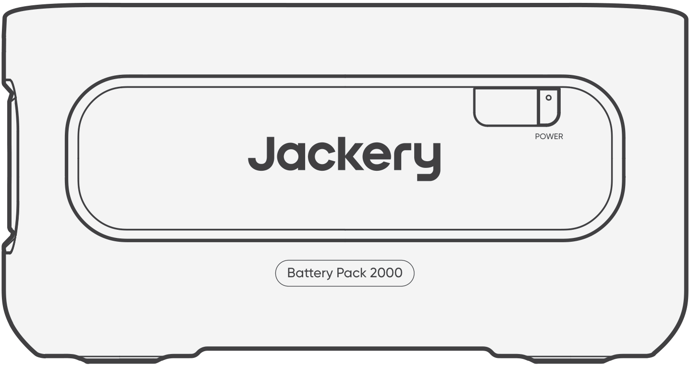
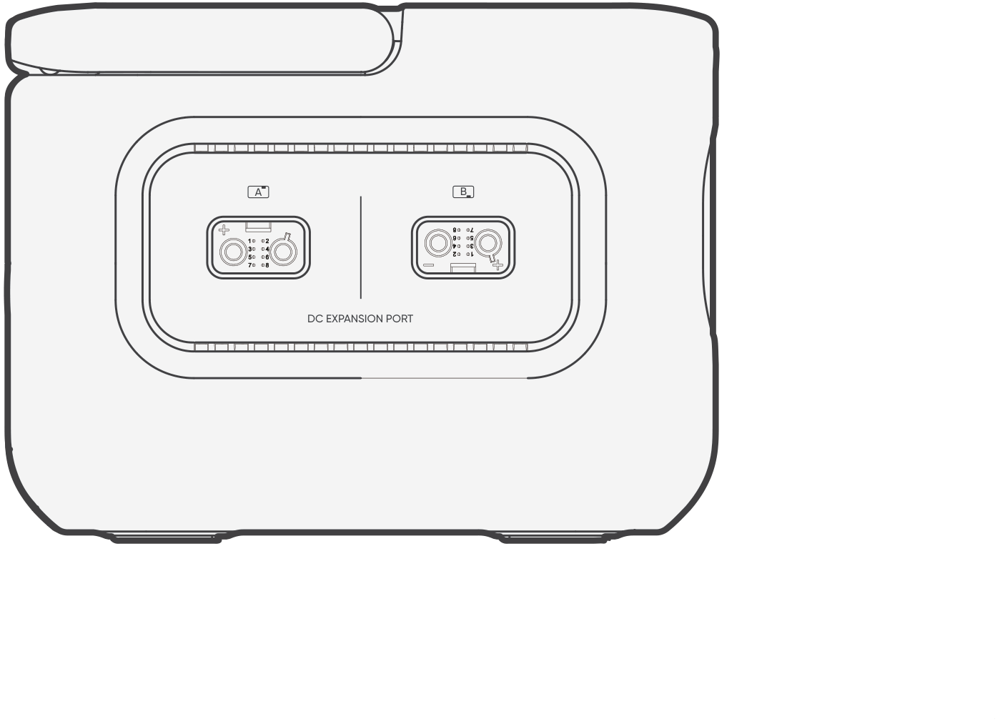
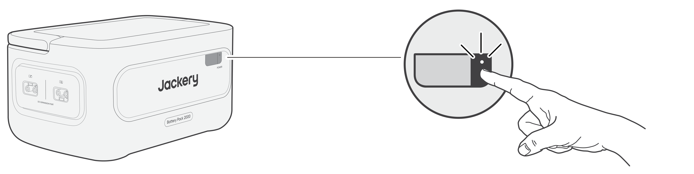
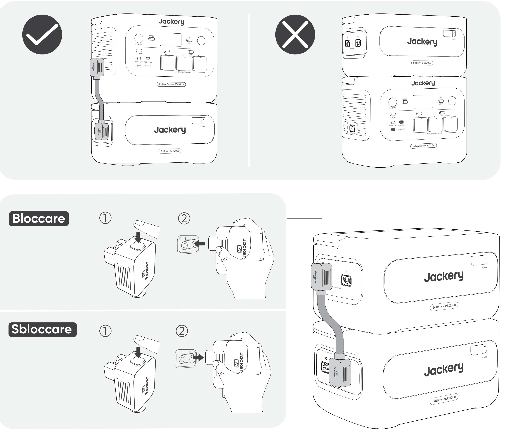

<strong>IMPORTANTE</strong>

Congratulazioni per il tuo nuovo Jackery Battery Pack 2000. Leggere attentamente questo manuale prima di utilizzare il prodotto, in particolare le relative precauzioni, per garantirne un uso corretto. Conservare questo manuale in un luogo accessibile per consultazioni future.

In conformità alle leggi e ai regolamenti, il diritto di interpretazione finale di questo documento e di tutti i documenti correlati al prodotto spetta all'azienda. Sebbene sia stato fatto ogni sforzo per garantire l'accuratezza di questo manuale, Jackery non si assume alcuna responsabilità per eventuali errori.

Si prega di notare che non verranno fornite ulteriori notifiche in caso di aggiornamento, revisione o cessazione. Per la versione più recente dei manuali del prodotto, visitare support.jackery.com.

* Le immagini sono solo a scopo di riferimento. Fare riferimento al prodotto effettivo.

<table class="manual-callout-table" style="width:100%; border-collapse:collapse; margin:0 0 16px 0;"><tbody><tr><td class="manual-callout-label" style="width:16%; border:1px solid #000; padding:6px 8px; vertical-align:top;">
<strong>NOTA</strong>
</td><td class="manual-callout-body" style="border:1px solid #000; padding:6px 8px; vertical-align:top;">
Questo pacco batteria è compatibile sia con Jackery E2000 Plus V2 sia con Jackery E1000 Plus V2. Nel presente manuale, «la power station portatile» si riferisce a uno dei due modelli, salvo diversa indicazione.
</td></tr></tbody></table>

# PRECAUZIONI DI SICUREZZA

Seguire sempre queste precauzioni di base durante l'utilizzo di questo prodotto.

<ul class="simple">
<li>
Leggere tutte le istruzioni prima di utilizzare il prodotto.
</li>
<li>
Non consentire ai bambini di giocare con il prodotto. È necessaria una stretta supervisione quando il prodotto viene utilizzato vicino a bambini.
</li>
<li>
Il rischio di scossa elettrica può verificarsi se si utilizzano accessori non raccomandati o non venduti da produttori professionali.
</li>
<li>
Quando il prodotto non è in uso, scollegare la spina di alimentazione dalla presa del prodotto.
</li>
<li>
Non smontare il prodotto, poiché ciò può comportare rischi imprevedibili come incendi, esplosioni o scosse elettriche.
</li>
<li>
Non utilizzare il prodotto con cavi di alimentazione, spine o cavi di uscita danneggiati, poiché ciò può causare scosse elettriche.
</li>
<li>
Caricare il prodotto in un'area ben ventilata e non ostacolare in alcun modo la ventilazione.
</li>
<li>
Posizionare il prodotto in un luogo ventilato e asciutto per evitare che pioggia o acqua possano causare scosse elettriche.
</li>
<li>
Non esporre il prodotto a fiamme o a temperature elevate (alla luce diretta del sole o all'interno di un veicolo esposto a calore elevato), poiché potrebbero verificarsi incidenti come incendi o esplosioni.
</li>
<li>
Se questo prodotto viene conservato per un lungo periodo di tempo (3-6 mesi) con la batteria scarica, potrebbe non essere più ricaricabile.
</li>
</ul>

# SIGNIFICATO DEI SIMBOLI

<figure aria-label="Simbolo / Significato" class="hb-symbol-signal-composition" data-component-id="HB-TABLE-SYMBOL-SIGNAL"><table class="hb-symbol-signal-table"><colgroup><col class="hb-symbol-signal-col-label"/><col class="hb-symbol-signal-col-meaning"/></colgroup><thead><tr><th class="hb-symbol-signal-label-heading" scope="col">
Simbolo
</th><th class="hb-symbol-signal-meaning-heading" scope="col">
Significato
</th></tr></thead><tbody><tr><td class="hb-symbol-signal-label-cell">⚠AVVERTENZA</td><td class="hb-symbol-signal-meaning-cell">
Pratiche pericolose che possono causare lesioni gravi, morte e/o danni materiali.
</td></tr><tr><td class="hb-symbol-signal-label-cell">⚠ATTENZIONE</td><td class="hb-symbol-signal-meaning-cell">
Pratiche pericolose che possono causare lesioni personali e/o danni materiali.
</td></tr><tr><td class="hb-symbol-signal-label-cell">NOTA</td><td class="hb-symbol-signal-meaning-cell">
Pratiche che possono causare danni all'apparecchiatura, perdita di dati, deterioramento delle prestazioni o risultati imprevisti.
</td></tr><tr><td class="hb-symbol-signal-label-cell">SUGGERIMENTO</td><td class="hb-symbol-signal-meaning-cell">
Integra le informazioni importanti o i consigli operativi nel testo.
</td></tr></tbody></table></figure>

<figure aria-label="Simbolo / Significato" class="hb-symbol-pair-composition" data-component-id="HB-TABLE-SYMBOL-ICON">

<table class="hb-symbol-panel-table"><colgroup><col class="hb-symbol-col-icon"/><col class="hb-symbol-col-meaning"/></colgroup><thead><tr><th class="hb-symbol-icon-heading" scope="col">
<strong>Simbolo</strong>
</th><th class="hb-symbol-meaning-heading" scope="col">
<strong>Significato</strong>
</th></tr></thead><tbody><tr><td class="hb-symbol-icon"></td><td class="hb-symbol-meaning">
Simboli di avvertenza e attenzione. Leggere per essere informati su possibili pericoli o rischi.
</td></tr><tr><td class="hb-symbol-icon"></td><td class="hb-symbol-meaning">
Prima dell'utilizzo, leggere il manuale d'istruzioni.
</td></tr><tr><td class="hb-symbol-icon"></td><td class="hb-symbol-meaning">
Non smontare il prodotto.
</td></tr><tr><td class="hb-symbol-icon"></td><td class="hb-symbol-meaning">
Non fumare né utilizzare fiamme libere.
</td></tr></tbody></table>

<table class="hb-symbol-panel-table"><colgroup><col class="hb-symbol-col-icon"/><col class="hb-symbol-col-meaning"/></colgroup><thead><tr><th class="hb-symbol-icon-heading" scope="col">
<strong>Simbolo</strong>
</th><th class="hb-symbol-meaning-heading" scope="col">
<strong>Significato</strong>
</th></tr></thead><tbody><tr><td class="hb-symbol-icon"></td><td class="hb-symbol-meaning">
Tenere lontano dalla portata dei bambini.
</td></tr><tr><td class="hb-symbol-icon"></td><td class="hb-symbol-meaning">
Questo simbolo indica che nel prodotto è presente una batteria agli ioni di litio (Li-ion), che deve essere smaltita o riciclata correttamente.
</td></tr><tr><td class="hb-symbol-icon"></td><td class="hb-symbol-meaning">
Questo simbolo indica che il prodotto non deve essere smaltito insieme ai rifiuti domestici, ma deve essere conferito a un centro di raccolta designato per il riciclo. Lo smaltimento e il riciclo corretti contribuiscono a proteggere l'ambiente. Per ulteriori informazioni sullo smaltimento e sul riciclo di questo prodotto, contattare la comunità locale, il servizio di smaltimento o il rivenditore.
</td></tr><tr><td class="hb-symbol-icon"></td><td class="hb-symbol-meaning">
Le batterie e gli accumulatori non devono essere smaltiti insieme ai rifiuti domestici.
Come consumatore, sei legalmente obbligato a smaltire tutte le batterie e gli accumulatori nei punti di raccolta designati, indipendentemente dal fatto che contengano sostanze pericolose.
Per favore, restituisci le batterie e gli accumulatori usati a un punto di raccolta locale, a un centro di riciclo o al rivenditore presso cui sono stati acquistati. Un corretto smaltimento garantisce un riciclo responsabile per l'ambiente e previene potenziali danni alla salute umana e all'ambiente.
</td></tr></tbody></table>

</figure>

# CONTENUTO DELLA CONFEZIONE

<figure aria-label="CONTENUTO DELLA CONFEZIONE" class="hb-inbox-composition" data-card-count="3" data-component-id="HB-SPECIAL-INBOX" data-inbox-variant="three-card-responsive"><ol class="hb-inbox-grid"><li class="hb-inbox-card" data-item-number="1">

<strong>Jackery Battery Pack 2000</strong>

</li><li class="hb-inbox-card" data-item-number="2">

<strong>Cavo di espansione</strong>

</li><li class="hb-inbox-card" data-item-number="3">

Manuale d'uso

</li></ol></figure>

# PANORAMICA DEL PRODOTTO

<section id="aspetto-del-prodotto">
<h2>Aspetto del prodotto</h2>

<table>
<colgroup>
<col style="width: 50.0%"/>
<col style="width: 50.0%"/>
</colgroup>
<tbody>
<tr><td>
<strong>Pulsante Power principale</strong>
</td>
<td>
<strong>LCD</strong>
</td>
</tr>
</tbody>
</table>
</section>

<section id="vista-laterale-sinistra">
<h2>VISTA LATERALE SINISTRA</h2>

<table>
<colgroup>
<col style="width: 50.0%"/>
<col style="width: 50.0%"/>
</colgroup>
<tbody>
<tr><td>
<strong>Maniglia</strong>
</td>
<td>
<strong>Porta A di espansione CC</strong>

(da collegare al Cavo di espansione Terminale A)

</td>
</tr>
<tr><td></td>
<td>
<strong>Porta B di espansione CC</strong>

(da collegare al Cavo di espansione Terminale B)

</td>
</tr>
</tbody>
</table>
</section>

# DISPLAY LCD

<table class="longtable lcd-text-only">
<colgroup>
<col style="width: 8.0%"/>
<col style="width: 12.0%"/>
<col style="width: 28.0%"/>
<col style="width: 52.0%"/>
</colgroup>
<tbody>
<tr><td>
1
</td>
<td></td>
<td>
Percentuale di potenza/Codice di errore
</td>
<td>

Il display mostra la percentuale di carica attuale.

In caso di guasto del sistema, verrà visualizzato il codice di errore corrispondente F0-FF.

</td>
</tr>
<tr><td>
2
</td>
<td></td>
<td>
Indicatore di carica
</td>
<td>
L'indicatore viene visualizzato durante la carica e scompare quando è completamente carico.
</td>
</tr>
</tbody>
</table>

# OPERAZIONI DI BASE

<section id="accensione-spegnimento">
<h2>ACCENSIONE/SPEGNIMENTO</h2>

<strong>Accensione</strong>

Premere una volta

<strong>Spegnimento</strong>

Tenere premuto per 3 secondi

<table class="manual-callout-table" style="width:100%; border-collapse:collapse; margin:0 0 16px 0;"><tbody><tr><td class="manual-callout-label" style="width:16%; border:1px solid #000; padding:6px 8px; vertical-align:top;">
<strong>NOTA</strong>
</td><td class="manual-callout-body" style="border:1px solid #000; padding:6px 8px; vertical-align:top;">
Quando si utilizza la power station portatile, è possibile controllare l’accensione o lo spegnimento di Jackery Battery Pack 2000 tramite il pulsante POWER principale della power station portatile.

Se non c'è un'uscita di scarica o un ingresso di carica, il prodotto si spegnerà automaticamente dopo 2 ore.

</td></tr></tbody></table></section>

<section id="display-lcd-acceso-spento">
<h2>DISPLAY LCD ACCESO/SPENTO</h2>

Premendo il pulsante Power principale, l'indicatore di funzionamento si accende e il display LCD si illumina. Premendolo di nuovo, il display LCD si spegne.

</section>

# COLLEGAMENTI

È possibile utilizzare fino a cinque pacchi batteria con la power station portatile per aumentare la capacità disponibile.

<table class="manual-callout-table" style="width:100%; border-collapse:collapse; margin:0 0 16px 0;"><tbody><tr><td class="manual-callout-label" style="width:16%; border:1px solid #000; padding:6px 8px; vertical-align:top;">
<strong>ATTENZIONE</strong>
</td><td class="manual-callout-body" style="border:1px solid #000; padding:6px 8px; vertical-align:top;"><ul class="simple">
<li>
Assicurarsi che tutti i prodotti siano spenti prima di collegare la power station portatile a Jackery Battery Pack 2000.
</li>
<li>
Per garantire il corretto funzionamento del prodotto, assicurarsi che le griglie di aspirazione e scarico dell'aria su entrambi i lati non siano ostruite. Lasciare almeno 200 mm di spazio tra le griglie di ventilazione e qualsiasi oggetto per consentire un'adeguata dissipazione del calore.
</li>
</ul>
</td></tr></tbody></table>

<table class="manual-callout-table" style="width:100%; border-collapse:collapse; margin:0 0 16px 0;"><tbody><tr><td class="manual-callout-label" style="width:16%; border:1px solid #000; padding:6px 8px; vertical-align:top;">
<strong>NOTA</strong>
</td><td class="manual-callout-body" style="border:1px solid #000; padding:6px 8px; vertical-align:top;"><ul class="simple">
<li>
La visualizzazione dell'icona di collegamento sullo schermo LCD (la power station portatile) indica che il collegamento tra il pacco batteria e la power station portatile è stato effettuato correttamente.
</li>
<li>
Durante l'uso del prodotto, non impilare più di tre pacchi batterie in una torre per evitare che cadano e provochino lesioni.
</li>
<li>
Non impilare il prodotto sulla power station portatile.
</li>
</ul>
</td></tr></tbody></table>

# RISOLUZIONE DEI PROBLEMI

Se viene visualizzato uno dei seguenti codici di errore, segui le azioni correttive elencate per risolvere il problema.
Se l'errore persiste, contatta l'Assistenza clienti Jackery.

<figure aria-label="Codice errore / Misure correttive" class="hb-troubleshooting-composition" data-component-id="HB-TABLE-TROUBLESHOOTING" tabindex="0"><table class="hb-troubleshooting-table"><colgroup><col class="hb-troubleshooting-col-code"/><col class="hb-troubleshooting-col-measures"/></colgroup><thead><tr><th class="hb-troubleshooting-code" scope="col">
Codice errore
</th><th class="hb-troubleshooting-measures" scope="col">
Misure correttive
</th></tr></thead><tbody><tr><td class="hb-troubleshooting-code">
F0
</td><td class="hb-troubleshooting-measures">
Riavviare il prodotto.
</td></tr><tr><td class="hb-troubleshooting-code">
F3
</td><td class="hb-troubleshooting-measures">
Riavviare il prodotto.
</td></tr><tr><td class="hb-troubleshooting-code">
F4
</td><td class="hb-troubleshooting-measures">
Collegare il prodotto ai carichi per scaricare la batteria fino a quando l'errore non scompare.
</td></tr><tr><td class="hb-troubleshooting-code">
F5
</td><td class="hb-troubleshooting-measures">
Caricare il prodotto tramite pannelli solari o una presa a muro CA fino a quando il guasto non scompare.
</td></tr><tr><td class="hb-troubleshooting-code">
F8
</td><td class="hb-troubleshooting-measures">
Contattare l'assistenza clienti Jackery.
</td></tr><tr><td class="hb-troubleshooting-code">
FE
</td><td class="hb-troubleshooting-measures">
Contattare l'assistenza clienti Jackery.
</td></tr><tr><td class="hb-troubleshooting-code">
FF
</td><td class="hb-troubleshooting-measures">
Collocare il prodotto in un ambiente a temperatura adeguata e attendere che il guasto scompaia.
</td></tr></tbody></table></figure>

# RICARICA

<section id="ricarica-tramite-presa-a-muro-ca">
<h2>RICARICA TRAMITE PRESA A MURO CA</h2>

Per caricare il pacco batteria da una presa a muro CA, collegarlo alla power station portatile.

<table class="manual-callout-table" style="width:100%; border-collapse:collapse; margin:0 0 16px 0;"><tbody><tr><td class="manual-callout-label" style="width:16%; border:1px solid #000; padding:6px 8px; vertical-align:top;">
<strong>AVVERTENZA</strong>
</td><td class="manual-callout-body" style="border:1px solid #000; padding:6px 8px; vertical-align:top;">
Prima di collegare la power station portatile a Jackery Battery Pack 2000, assicurarsi che tutti i prodotti siano spenti.
</td></tr></tbody></table>
</section>

<section id="ricarica-tramite-pannelli-solari-venduti-separatamente">
<h2>RICARICA TRAMITE PANNELLI SOLARI (VENDUTI SEPARATAMENTE)</h2>

Caricare il pacco batteria utilizzando i pannelli solari e la power station portatile, come mostrato nella figura sottostante. Per ulteriori informazioni, consultare il manuale utente della power station portatile.

</section>

# STOCCAGGIO

Conservare il prodotto in un luogo pulito e asciutto, con una ventilazione adeguata. Temperatura e umidità di stoccaggio:

<ul class="simple">
<li>
1 mese: da -20 °C a 45 °C (0-60% UR)
</li>
<li>
3 mesi: da 0 °C a 45 °C (0-60% UR)
</li>
<li>
12 mesi: da 0 °C a 25 °C (0-60% UR)
</li>
</ul>

Se il prodotto viene conservato a lungo termine (da 3 a 6 mesi) con la batteria scarica, potrebbe non essere più possibile ricaricarlo. Per evitarlo e mantenere la salute della batteria, si consiglia di controllare e ricaricare il prodotto ogni tre mesi e di eseguire almeno un ciclo completo di carica e scarica ogni 6-12 mesi.

# SPECIFICHE TECNICHE

## INFORMAZIONI GENERALI

<figure aria-label="INFORMAZIONI GENERALI" class="hb-spec-table-composition"><table class="hb-spec-table manual-table manual-spec-table"><colgroup><col class="hb-spec-col-label"/><col class="hb-spec-col-value"/></colgroup>
<tbody>
<tr>
<th class="hb-spec-label manual-spec-label" scope="row">Nome del prodotto</th>
<td class="hb-spec-value manual-spec-value">Jackery Battery Pack 2000</td>
</tr>
<tr>
<th class="hb-spec-label manual-spec-label" scope="row">Modello n.</th>
<td class="hb-spec-value manual-spec-value">JBP-2000B</td>
</tr>
<tr>
<th class="hb-spec-label manual-spec-label" scope="row">Capacità</th>
<td class="hb-spec-value manual-spec-value">40 Ah / 51,2 V ⎓ (2048 Wh)</td>
</tr>
<tr>
<th class="hb-spec-label manual-spec-label" scope="row">Chimica celle batteria</th>
<td class="hb-spec-value manual-spec-value">LiFePO₄</td>
</tr>
<tr>
<th class="hb-spec-label manual-spec-label" scope="row">Peso</th>
<td class="hb-spec-value manual-spec-value">Circa 14,8 kg</td>
</tr>
<tr>
<th class="hb-spec-label manual-spec-label" scope="row">Dimensioni</th>
<td class="hb-spec-value manual-spec-value">36,5 × 25,5 × 19,1 cm</td>
</tr>
<tr>
<th class="hb-spec-label manual-spec-label" scope="row">Durata del ciclo</th>
<td class="hb-spec-value manual-spec-value">6000 cicli fino al 70% di capacità</td>
</tr>
</tbody>
</table></figure>

## PORTE DI INGRESSO/USCITA

<figure aria-label="PORTE DI INGRESSO/USCITA" class="hb-spec-table-composition"><table class="hb-spec-table manual-table manual-spec-table"><colgroup><col class="hb-spec-col-label"/><col class="hb-spec-col-value"/></colgroup>
<tbody>
<tr>
<th class="hb-spec-label manual-spec-label" scope="row">Porta di espansione CC (Ingresso)</th>
<td class="hb-spec-value manual-spec-value">36,8 V-57,6 V⎓75 A max.</td>
</tr>
<tr>
<th class="hb-spec-label manual-spec-label" scope="row">Porta di espansione CC (Uscita)</th>
<td class="hb-spec-value manual-spec-value">36,8 V-57,6 V⎓75 A max.</td>
</tr>
</tbody>
</table></figure>

## TEMPERATURA OPERATIVA AMBIENTALE

<figure aria-label="TEMPERATURA OPERATIVA AMBIENTALE" class="hb-spec-table-composition"><table class="hb-spec-table manual-table manual-spec-table"><colgroup><col class="hb-spec-col-label"/><col class="hb-spec-col-value"/></colgroup>
<tbody>
<tr>
<th class="hb-spec-label manual-spec-label" scope="row">Temperatura di carica</th>
<td class="hb-spec-value manual-spec-value">da -10 °C a 45 °C</td>
</tr>
<tr>
<th class="hb-spec-label manual-spec-label" scope="row">Temperatura di scarica</th>
<td class="hb-spec-value manual-spec-value">da -10 °C a 45 °C</td>
</tr>
</tbody>
</table></figure>

# GARANZIA

<figure aria-label="GARANZIA" class="hb-warranty-intro-composition" data-component-id="HB-WARRANTY-LEAD">

<strong>Forniamo la nostra garanzia solo ai clienti che acquistano dal sito web ufficiale di Jackery, dalle piattaforme di terze parti con marchio Jackery o dai rivenditori autorizzati locali.</strong>

* Il periodo e i dettagli della garanzia possono variare in base alle leggi locali, ai regolamenti e ai rivenditori autorizzati.

</figure>

<section class="warranty-section" id="garanzia-limitata">
<h2>Garanzia limitata</h2>
<figure aria-label="Garanzia limitata" class="hb-warranty-card" data-component-id="HB-WARRANTY-SECTION" data-warranty-card-index="1">
Jackery garantisce all'acquirente originale che il prodotto Jackery sarà esente da difetti di fabbricazione e materiali in condizioni di normale utilizzo da parte dell'acquirente durante il periodo di garanzia applicabile identificato nella sezione "Periodo di garanzia" di seguito, fatte salve le esclusioni indicate di seguito.

Questa dichiarazione di garanzia stabilisce l'obbligo di garanzia totale ed esclusivo di Jackery. Non ci assumeremo, né autorizzeremo alcuna persona ad assumersi per noi, qualsiasi altra responsabilità in relazione alla vendita dei nostri prodotti.
</figure>
</section>

<section class="warranty-section warranty-years" id="periodo-di-garanzia">
<h2>Periodo di garanzia</h2>
<figure aria-label="Periodo di garanzia" class="hb-warranty-period-card" data-component-id="HB-WARRANTY-YEARS">

3
<strong class="hb-warranty-years-unit">ANNI</strong><strong class="hb-warranty-period-label">— Garanzia standard</strong>

Il periodo di garanzia standard per Jackery Battery Pack 2000 è di 36 mesi ed è misurato a partire dalla data di acquisto da parte dell'acquirente consumatore originario. Per stabilire la data di inizio del periodo di garanzia è necessaria la ricevuta del primo acquisto da parte del consumatore, o altra prova documentale ragionevole.

2
<strong class="hb-warranty-years-unit">ANNI</strong><strong class="hb-warranty-period-label">— Garanzia estesa</strong>

Per attivare l'estensione della garanzia, è necessario registrare il prodotto online oppure contattare il nostro servizio clienti all'indirizzo <a class="reference external" href="mailto:hello.eu@jackery.com">hello.eu@jackery.com</a> per estendere il periodo di garanzia standard.

</figure>
</section>

<section class="warranty-section" id="sostituzione">
<h2>Sostituzione</h2>
<figure aria-label="Sostituzione" class="hb-warranty-card" data-component-id="HB-WARRANTY-SECTION" data-warranty-card-index="3">
Jackery sostituirà (a spese di Jackery) qualsiasi prodotto Jackery mal funzionante durante il periodo di garanzia applicabile a causa di difetti di fabbricazione o materiali. Un prodotto sostitutivo assume la garanzia residua del prodotto originale.
</figure>
</section>

<section class="warranty-section" id="limitato-all-acquirente-consumatore-originale">
<h2>Limitato all'acquirente consumatore originale</h2>
<figure aria-label="Limitato all'acquirente consumatore originale" class="hb-warranty-card" data-component-id="HB-WARRANTY-SECTION" data-warranty-card-index="4">
La garanzia sul prodotto Jackery è limitata all'acquirente originale e non è trasferibile a nessun proprietario successivo.
</figure>
</section>

<section class="warranty-section" id="esclusioni">
<h2>Esclusioni</h2>
<figure aria-label="Esclusioni" class="hb-warranty-card" data-component-id="HB-WARRANTY-SECTION" data-warranty-card-index="5">
La garanzia di Jackery non si applica a:
<ul class="simple">
<li>
Uso improprio, abuso, modifica, danneggiamento accidentale o utilizzo diverso dal normale uso da parte del consumatore, come autorizzato nella documentazione di questo prodotto Jackery.
</li>
<li>
Tentativi di riparazione da parte di persone diverse da quelle autorizzate.
</li>
<li>
Qualsiasi prodotto acquistato tramite una casa d'aste online.
</li>
<li>
La garanzia di Jackery non si applica alla batteria, a meno che questa non venga caricata completamente dall'utente entro sette giorni dall'acquisto del prodotto, e successivamente almeno una volta ogni 6 mesi.
</li>
</ul></figure>
</section>

<section class="warranty-section" id="diritti-di-interpretazione">
<h2>Diritti di interpretazione</h2>
<figure aria-label="Diritti di interpretazione" class="hb-warranty-card" data-component-id="HB-WARRANTY-SECTION" data-warranty-card-index="6">
Jackery si riserva il diritto di interpretazione finale della politica post-vendita sopra descritta.
</figure>
</section>

# EU REGULATIONS

<section id="red-declaration-of-conformity">
<h2>RED DECLARATION OF CONFORMITY</h2>

Shenzhen Hello Tech Energy Co., Ltd. hereby declares that this Jackery Battery Pack 2000 with Bluetooth and Wi-Fi JBP-2000B is in compliance with the essential requirements and other relevant provisions of the RED Directive 2014/53/EU. The full text of the EU declaration of conformity is available at the following internet address:

<a class="reference external" href="https://de.jackery.com/pages/user-guides">https://de.jackery.com/pages/user-guides</a>

</section>

<section id="manufacturer">
<h2>MANUFACTURER</h2>

SHENZHEN HELLO TECH ENERGY CO., LTD.

Address: F2-3, Bldg. 7, Jiaanda Science and technology industrial park factory, the east side of Huafan Road, Tongsheng Community, Dalang Street, Longhua District, Shenzhen, Guangdong, China

+86 400 668 9293

<a class="reference external" href="mailto:sales@hello-tech.com">sales@hello-tech.com</a>

www.hello-tech.com

</section>
