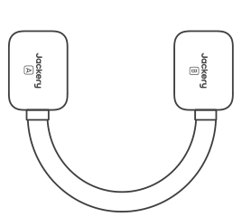
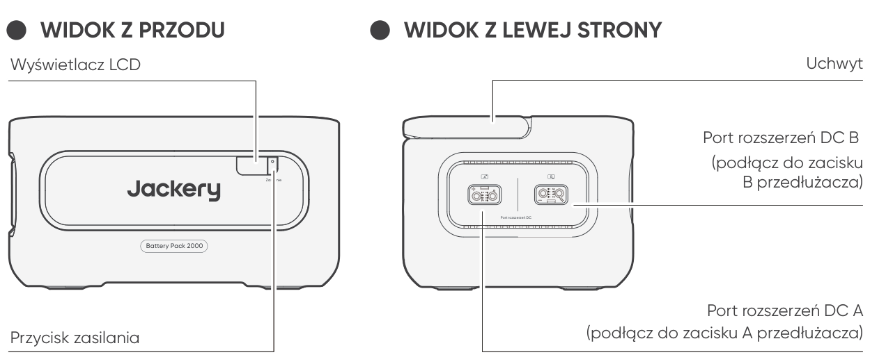
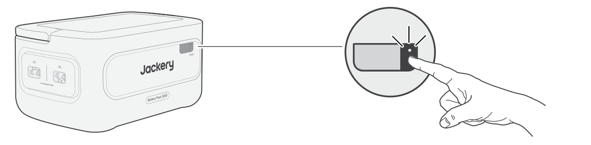

<strong>WAŻNE</strong>

Gratulujemy zakupu nowego urządzenia Jackery Battery Pack 2000. Prosimy o dokładne przeczytanie niniejszej instrukcji przed użyciem produktu, ze szczególnym uwzględnieniem środków ostrożności, aby zapewnić prawidłowe użytkowanie. Niniejszą instrukcję należy przechowywać w dostępnym miejscu, aby móc z niej korzystać w przyszłości.

Zgodnie z przepisami prawo ostatecznej interpretacji niniejszego dokumentu oraz wszystkich dokumentów związanych z tym produktem przysługuje firmie. Chociaż dołożono wszelkich starań, aby niniejsza instrukcja była dokładna, firma Jackery nie ponosi odpowiedzialności za ewentualne błędy.

Należy pamiętać, że w przypadku jakichkolwiek aktualizacji, zmian lub zakończenia publikacji nie będą wysyłane żadne dodatkowe powiadomienia. Najnowszą wersję instrukcji obsługi produktu można znaleźć na stronie support.jackery.com.

* Obrazy służą wyłącznie do celów poglądowych. Należy kierować się rzeczywistym produktem.

<table class="manual-callout-table" style="width:100%; border-collapse:collapse; margin:0 0 16px 0;"><tbody><tr><td class="manual-callout-label" style="width:16%; border:1px solid #000; padding:6px 8px; vertical-align:top;">
<strong>UWAGA</strong>
</td><td class="manual-callout-body" style="border:1px solid #000; padding:6px 8px; vertical-align:top;">
Ten zestaw baterii jest zgodny z urządzeniami Jackery E1000 Plus V2 oraz Jackery E2000 Plus V2. W niniejszej instrukcji określenie „przenośna stacja zasilania” odnosi się do dowolnego z tych modeli, o ile nie wskazano inaczej.
</td></tr></tbody></table>

# WAŻNE INFORMACJE DOTYCZĄCE BEZPIECZEŃSTWA

Podczas korzystania z produktu należy przestrzegać podstawowych środków ostrożności, w tym:

<ul class="simple">
<li>
Przed przystąpieniem do korzystania z produktu należy przeczytać wszystkie instrukcje.
</li>
<li>
W przypadku użytkowania tego produktu w pobliżu dzieci należy zapewnić im ścisły nadzór, aby ograniczyć ryzyko.
</li>
<li>
W przypadku korzystania z akcesoriów, które nie są zalecane ani sprzedawane przez producenta produktu, może występować ryzyko porażenia prądem.
</li>
<li>
Gdy produkt nie jest używany, należy odłączyć wtyczkę zasilania od gniazda produktu.
</li>
<li>
Nie wolno rozmontowywać produktu, ponieważ może to prowadzić do nieprzewidywalnych zagrożeń, takich jak pożar, wybuch lub porażenie prądem.
</li>
<li>
Nie należy używać produktu z uszkodzonymi przewodami, wtyczkami lub kablami wyjściowymi, ponieważ może to spowodować porażenie prądem.
</li>
<li>
Produkt należy ładować w dobrze wentylowanym miejscu i nie wolno w żaden sposób zasłaniać jego kanałów wentylacyjnych.
</li>
<li>
Produkt należy umieścić w wentylowanym i suchym miejscu, aby deszcz lub woda nie spowodowały porażenia prądem.
</li>
<li>
Nie wystawiać produktu na działanie ognia lub wysokiej temperatury (na przykład przez umieszczenie w miejscu bezpośrednio nasłonecznionym lub w nagrzanym wnętrzu pojazdu), ponieważ może to spowodować wypadki, takie jak pożar lub wybuch.
</li>
<li>
Jeśli produkt będzie przechowywany przez długi czas (3–6 miesięcy) z rozładowaną baterią, jego naładowanie może okazać się niemożliwe.
</li>
</ul>

# ZNACZENIE SYMBOLI

<figure aria-label="Symbol / Znaczenie" class="hb-symbol-signal-composition" data-component-id="HB-TABLE-SYMBOL-SIGNAL"><table class="hb-symbol-signal-table"><colgroup><col class="hb-symbol-signal-col-label"/><col class="hb-symbol-signal-col-meaning"/></colgroup><thead><tr><th class="hb-symbol-signal-label-heading" scope="col">
Symbol
</th><th class="hb-symbol-signal-meaning-heading" scope="col">
Znaczenie
</th></tr></thead><tbody><tr><td class="hb-symbol-signal-label-cell">⚠OSTRZEŻENIE</td><td class="hb-symbol-signal-meaning-cell">
Niebezpieczne praktyki, które mogą prowadzić do poważnych obrażeń, śmierci i/lub szkód materialnych.
</td></tr><tr><td class="hb-symbol-signal-label-cell">⚠PRZESTROGA</td><td class="hb-symbol-signal-meaning-cell">
Niebezpieczne praktyki, które mogą skutkować obrażeniami ciała i/lub szkodami materialnymi.
</td></tr><tr><td class="hb-symbol-signal-label-cell">Uwaga</td><td class="hb-symbol-signal-meaning-cell">
Niebezpieczne praktyki, które mogą prowadzić do uszkodzenia sprzętu, utraty danych, pogorszenia wydajności lub nieprzewidzianych wyników.
</td></tr><tr><td class="hb-symbol-signal-label-cell">WSKAZÓWKA</td><td class="hb-symbol-signal-meaning-cell">
Uzupełnia ważne informacje lub wskazówki dotyczące obsługi zawarte w tekście.
</td></tr></tbody></table></figure>

<figure aria-label="Symbol / Znaczenie" class="hb-symbol-pair-composition" data-component-id="HB-TABLE-SYMBOL-ICON">

<table class="hb-symbol-panel-table"><colgroup><col class="hb-symbol-col-icon"/><col class="hb-symbol-col-meaning"/></colgroup><thead><tr><th class="hb-symbol-icon-heading" scope="col">
<strong>Symbol</strong>
</th><th class="hb-symbol-meaning-heading" scope="col">
<strong>Znaczenie</strong>
</th></tr></thead><tbody><tr><td class="hb-symbol-icon"></td><td class="hb-symbol-meaning">
Symbole ostrzeżeń i środków ostrożności. Zwraca uwagę użytkowników na informacje, które należy przeczytać, aby uniknąć potencjalnych zagrożeń lub ryzyka.
</td></tr><tr><td class="hb-symbol-icon"></td><td class="hb-symbol-meaning">
Przed przystąpieniem do użytkowania przeczytaj instrukcję obsługi.
</td></tr><tr><td class="hb-symbol-icon"></td><td class="hb-symbol-meaning">
Nie rozmontowuj produktu.
</td></tr><tr><td class="hb-symbol-icon"></td><td class="hb-symbol-meaning">
Trzymaj produkt z dala od ognia.
</td></tr><tr><td class="hb-symbol-icon"></td><td class="hb-symbol-meaning">
Przechowuj w miejscu niedostępnym dla dzieci.
</td></tr><tr><td class="hb-symbol-icon"></td><td class="hb-symbol-meaning">
Ten symbol oznacza, że wewnątrz produktu znajduje się bateria litowo-jonowa (Li-ion), którą należy prawidłowo utylizować lub poddać recyklingowi.
</td></tr></tbody></table>

<table class="hb-symbol-panel-table"><colgroup><col class="hb-symbol-col-icon"/><col class="hb-symbol-col-meaning"/></colgroup><thead><tr><th class="hb-symbol-icon-heading" scope="col">
<strong>Symbol</strong>
</th><th class="hb-symbol-meaning-heading" scope="col">
<strong>Znaczenie</strong>
</th></tr></thead><tbody><tr><td class="hb-symbol-icon"></td><td class="hb-symbol-meaning">
Baterii i akumulatorów nie wolno wyrzucać razem z odpadami domowymi. Jako konsument masz prawny obowiązek oddawania wszystkich baterii i akumulatorów do wyznaczonych punktów zbiórki, niezależnie od tego, czy zawierają substancje niebezpieczne. Zużyte baterie i akumulatory należy przekazać do lokalnego punktu zbiórki, centrum recyklingu lub do sprzedawcy, u którego zostały zakupione. Prawidłowa utylizacja zapewnia recykling przyjazny dla środowiska i zapobiega potencjalnym szkodom dla zdrowia ludzi i środowiska.
</td></tr><tr><td class="hb-symbol-icon"></td><td class="hb-symbol-meaning">
Ten symbol oznacza, że produktu nie wolno wyrzucać razem z odpadami domowymi i należy go dostarczyć do wyznaczonego punktu zbiórki w celu recyklingu. Prawidłowa utylizacja i recykling przyczynią się do ochrony środowiska. Aby uzyskać więcej informacji na temat utylizacji i recyklingu tego produktu, skontaktuj się z lokalną gminą, firmą zajmującą się utylizacją lub sprzedawcą.
</td></tr></tbody></table>

</figure>

# ZAWARTOŚĆ OPAKOWANIA

<figure aria-label="ZAWARTOŚĆ OPAKOWANIA" class="hb-inbox-composition" data-card-count="3" data-component-id="HB-SPECIAL-INBOX" data-inbox-variant="three-card-responsive"><ol class="hb-inbox-grid"><li class="hb-inbox-card" data-item-number="1">

<strong>Jackery Battery Pack 2000</strong>

</li><li class="hb-inbox-card" data-item-number="2">

<strong>Przedłużacz</strong>

</li><li class="hb-inbox-card" data-item-number="3">

Instrukcja obsługi

</li></ol></figure>

# WIDOK OGÓLNY PRODUKTU

<section id="front-view">

</section>

<section id="left-side-view">
</section>

# WYŚWIETLACZ LCD

<figure aria-label="WYŚWIETLACZ LCD" class="hb-reference-composition hb-reference-lcd-descriptions" data-component-id="HB-TABLE-REFERENCE" data-component-variant="lcd-descriptions" tabindex="0"><table class="hb-reference-table"><tbody><tr><td>Procent energii / kod błędu</td><td>Wyświetlacz pokazuje aktualny poziom energii w procentach. W przypadku awarii systemu na wyświetlaczu pojawi się odpowiedni kod błędu F0-FF.</td></tr><tr><td>Wskaźnik ładowania</td><td>Wskaźnik pojawia się podczas ładowania i znika, gdy urządzenie jest w pełni naładowane.</td></tr></tbody></table></figure>

# OBSŁUGA

<section id="power-on-off">
<h2>WŁ./WYŁ. ZASILANIA</h2>
<figure class="hb-operation-figure hb-operation-layout-status-right hb-base-art-live-copy" data-component-id="HB-SPECIAL-OPERATION" data-operation-id="main-power" data-source-fragment-sha256="b95f4835bb0aa7381067ed3e7a94f0ae9d5722b453179c34ba4251c17a091875" data-web-base-art-ref="power_native" data-web-presentation-mode="base-art-live-copy" data-web-replace-key="operation.main-power">

3s

<strong>Wł.</strong>

Naciśnij raz

<strong>Wył.</strong>

Naciśnij i przytrzymaj przez 3 s

</figure>
<table class="manual-callout-table" style="width:100%; border-collapse:collapse; margin:0 0 16px 0;"><tbody><tr><td class="manual-callout-label" style="width:16%; border:1px solid #000; padding:6px 8px; vertical-align:top;">
<strong>Uwaga</strong>
</td><td class="manual-callout-body" style="border:1px solid #000; padding:6px 8px; vertical-align:top;">
Podczas korzystania z produktu w połączeniu z przenośną stacją zasilania można kontrolować stan zasilania (włączenie lub wyłączenie) urządzenia Jackery Battery Pack 2000 za pomocą głównego przycisku POWER na przenośnej stacji zasilania.

Produkt wyłączy się automatycznie, jeśli przez 2 godziny nie będzie ładowany, ani nie będą do niego podłączone żadne urządzenia odbiorcze.

</td></tr></tbody></table></section>

<section id="lcd-display-on-off">
<h2>WŁĄCZANIE/WYŁĄCZANIE WYŚWIETLACZA LCD</h2>

Po naciśnięciu głównego przycisku zasilania POWER lub podczas ładowania produktu wyświetlacz LCD jest podświetlony. Ponowne naciśnięcie przycisku spowoduje wyłączenie ekranu wyświetlacza LCD.

</section>

# POŁĄCZENIA

Z przenośną stacją zasilania można używać do pięciu pakietów akumulatorów, aby zwiększyć dostępną pojemność.

<table class="manual-callout-table" style="width:100%; border-collapse:collapse; margin:0 0 16px 0;"><tbody><tr><td class="manual-callout-label" style="width:16%; border:1px solid #000; padding:6px 8px; vertical-align:top;">
<strong>PRZESTROGA</strong>
</td><td class="manual-callout-body" style="border:1px solid #000; padding:6px 8px; vertical-align:top;"><ul class="simple">
<li>
Przed podłączeniem przenośnej stacji zasilania do urządzenia Jackery Battery Pack 2000 upewnij się, że wszystkie urządzenia są wyłączone.
</li>
<li>
Aby zapewnić prawidłowe działanie produktu, upewnij się, że wlotowe i wylotowe otwory wentylacyjne po obu stronach są odsłonięte. Zachowaj co najmniej 200 mm odstępu między otworami wentylacyjnymi a jakimikolwiek przedmiotami, aby zapewnić prawidłowe odprowadzanie ciepła.
</li>
</ul>
</td></tr></tbody></table>

<table class="manual-callout-table" style="width:100%; border-collapse:collapse; margin:0 0 16px 0;"><tbody><tr><td class="manual-callout-label" style="width:16%; border:1px solid #000; padding:6px 8px; vertical-align:top;">
<strong>Uwagi</strong>
</td><td class="manual-callout-body" style="border:1px solid #000; padding:6px 8px; vertical-align:top;"><ul class="simple">
<li>
Wyświetlenie ikony  na ekranie LCD (przenośna stacja zasilania) oznacza pomyślne połączenie między zestawem baterii a przenośną stacją zasilania.
</li>
<li>
Produktu nie wolno układać na przenośnej stacji zasilania.
</li>
<li>
Zestawy baterii należy ustawić na płaskiej, stabilnej powierzchni o wystarczającej nośności. Domyślna maksymalna liczba zestawów baterii ułożonych w stos wynosi 3.
</li>
<li>
Jeśli konieczne jest ułożenie w stos 4 lub większej liczby zestawów baterii, należy je umieścić w stabilnym miejscu przy ścianie, chronić przed uderzeniami zewnętrznymi i zastosować niezbędne środki zabezpieczające je przed przewróceniem.
</li>
</ul>
</td></tr></tbody></table>

<figure class="hb-reference-figure hb-base-art-live-copy" data-component-id="HB-SPECIAL-REFERENCE-FIGURE" data-reference-id="locking" data-source-fragment-sha256="17f3fc1a6a3d2dbce4f322e2076914441f8378cca940090628c5f54e92ce3476" data-web-base-art-ref="locking_native" data-web-presentation-mode="base-art-live-copy" data-web-replace-key="reference.locking">

ZablokowanieOdblokowanie

</figure>

# ROZWIĄZYWANIE PROBLEMÓW

Jeśli pojawi się którykolwiek z poniższych kodów błędów, wykonaj wymienione działania naprawcze, aby rozwiązać problem. Jeśli usterka nie ustąpi, skontaktuj się z działem wsparcia Jackery.

<figure aria-label="Kod błędu / Działania naprawcze" class="hb-troubleshooting-composition" data-component-id="HB-TABLE-TROUBLESHOOTING" tabindex="0"><table class="hb-troubleshooting-table"><colgroup><col class="hb-troubleshooting-col-code"/><col class="hb-troubleshooting-col-measures"/></colgroup><thead><tr><th class="hb-troubleshooting-code" scope="col">
Kod błędu
</th><th class="hb-troubleshooting-measures" scope="col">
Działania naprawcze
</th></tr></thead><tbody><tr><td class="hb-troubleshooting-code">
F0
</td><td class="hb-troubleshooting-measures">
Uruchom produkt ponownie.
</td></tr><tr><td class="hb-troubleshooting-code">
F3
</td><td class="hb-troubleshooting-measures">
Uruchom produkt ponownie.
</td></tr><tr><td class="hb-troubleshooting-code">
F4
</td><td class="hb-troubleshooting-measures">
Podłącz produkt do urządzeń odbiorczych, aby rozładować baterię, aż usterka zniknie.
</td></tr><tr><td class="hb-troubleshooting-code">
F5
</td><td class="hb-troubleshooting-measures">
Do czasu zniknięcia usterki ładuj produkt z paneli słonecznych lub gniazdka ściennego AC.
</td></tr><tr><td class="hb-troubleshooting-code">
F8
</td><td class="hb-troubleshooting-measures">
Skontaktuj się z działem obsługi klienta Jackery.
</td></tr><tr><td class="hb-troubleshooting-code">
FE
</td><td class="hb-troubleshooting-measures">
Skontaktuj się z działem obsługi klienta Jackery.
</td></tr><tr><td class="hb-troubleshooting-code">
FF
</td><td class="hb-troubleshooting-measures">
Umieść produkt w otoczeniu o odpowiedniej temperaturze i poczekaj, aż usterka zniknie.
</td></tr></tbody></table></figure>

# ŁADOWANIE

<section id="charging-via-ac-wall-outlet">
<h2>ŁADOWANIE Z SIECIOWEGO GNIAZDKA ŚCIENNEGO AC</h2>

Aby naładować pakiet akumulatorów z gniazdka sieciowego AC, podłącz go do przenośnej stacji zasilania.

<table class="manual-callout-table" style="width:100%; border-collapse:collapse; margin:0 0 16px 0;"><tbody><tr><td class="manual-callout-label" style="width:16%; border:1px solid #000; padding:6px 8px; vertical-align:top;">
<strong>OSTRZEŻENIE</strong>
</td><td class="manual-callout-body" style="border:1px solid #000; padding:6px 8px; vertical-align:top;">
Przed podłączeniem przenośnej stacji zasilania do urządzenia Jackery Battery Pack 2000 upewnij się, że wszystkie urządzenia są wyłączone.
</td></tr></tbody></table>
</section>

<section id="charging-via-solar-panels-sold-separately">
<h2>ŁADOWANIE ZA POMOCĄ PANELI SŁONECZNYCH (SPRZEDAWANE ODDZIELNIE)</h2>

Ładuj pakiet akumulatorów za pomocą paneli słonecznych i przenośnej stacji zasilania, jak pokazano na poniższym rysunku. Więcej informacji można znaleźć w instrukcji obsługi przenośnej stacji zasilania.

</section>

# PRZECHOWYWANIE

Produkt należy przechowywać w suchym, czystym i odpowiednio wentylowanym miejscu. Temperatura i wilgotność w miejscu przechowywania:

<ul class="simple">
<li>
1 miesiąc: -20°C do 45°C (0–60% wilgotności względnej)
</li>
<li>
3 miesiące: 0°C do 45°C (0–60% wilgotności względnej)
</li>
<li>
12 miesiące: 0°C do 25°C (0–60% wilgotności względnej)
</li>
</ul>

Jeśli produkt będzie przechowywany przez długi czas (3–6 miesięcy) z rozładowaną baterią, jego naładowanie może okazać się niemożliwe. Aby temu zapobiec i zadbać o kondycję baterii, zaleca się sprawdzanie i ładowanie produktu co trzy miesiące oraz przeprowadzanie pełnego cyklu ładowania i rozładowania co najmniej raz na 6–12 miesięcy.

# DANE TECHNICZNE

## INFORMACJE OGÓLNE

<figure aria-label="INFORMACJE OGÓLNE" class="hb-spec-table-composition"><table class="hb-spec-table manual-table manual-spec-table"><colgroup><col class="hb-spec-col-label"/><col class="hb-spec-col-value"/></colgroup>
<tbody>
<tr>
<th class="hb-spec-label manual-spec-label" scope="row">Nazwa produktu</th>
<td class="hb-spec-value manual-spec-value">Jackery Battery Pack 2000</td>
</tr>
<tr>
<th class="hb-spec-label manual-spec-label" scope="row">Numer modelu</th>
<td class="hb-spec-value manual-spec-value">JBP-2000B</td>
</tr>
<tr>
<th class="hb-spec-label manual-spec-label" scope="row">Pojemność</th>
<td class="hb-spec-value manual-spec-value">2048 Wh (40 Ah / 51,2 V ⎓)</td>
</tr>
<tr>
<th class="hb-spec-label manual-spec-label" scope="row">Typ ogniw</th>
<td class="hb-spec-value manual-spec-value">LiFePO4</td>
</tr>
<tr>
<th class="hb-spec-label manual-spec-label" scope="row">Waga</th>
<td class="hb-spec-value manual-spec-value">Około 14,8 kg</td>
</tr>
<tr>
<th class="hb-spec-label manual-spec-label" scope="row">Wymiary</th>
<td class="hb-spec-value manual-spec-value">36,5 × 25,5 × 19,1 cm</td>
</tr>
<tr>
<th class="hb-spec-label manual-spec-label" scope="row">Żywotność</th>
<td class="hb-spec-value manual-spec-value">6000 cykli do 70%+ pojemności</td>
</tr>
</tbody>
</table></figure>

## PORTY WEJŚCIOWE/WYJŚCIOWE

<figure aria-label="PORTY WEJŚCIOWE/WYJŚCIOWE" class="hb-spec-table-composition"><table class="hb-spec-table manual-table manual-spec-table"><colgroup><col class="hb-spec-col-label"/><col class="hb-spec-col-value"/></colgroup>
<tbody>
<tr>
<th class="hb-spec-label manual-spec-label" scope="row">Port rozszerzeń DC (wejściowy)</th>
<td class="hb-spec-value manual-spec-value">36,8 V – 57,6 V ⎓ maks. 75 A</td>
</tr>
<tr>
<th class="hb-spec-label manual-spec-label" scope="row">Port rozszerzeń DC (wyjście)</th>
<td class="hb-spec-value manual-spec-value">36,8 V – 57,6 V ⎓ maks. 75 A</td>
</tr>
</tbody>
</table></figure>

## TEMPERATURA OTOCZENIA ROBOCZEGO

<figure aria-label="TEMPERATURA OTOCZENIA ROBOCZEGO" class="hb-spec-table-composition"><table class="hb-spec-table manual-table manual-spec-table"><colgroup><col class="hb-spec-col-label"/><col class="hb-spec-col-value"/></colgroup>
<tbody>
<tr>
<th class="hb-spec-label manual-spec-label" scope="row">Temperatura ładowania</th>
<td class="hb-spec-value manual-spec-value">-10°C do 45°C</td>
</tr>
<tr>
<th class="hb-spec-label manual-spec-label" scope="row">Temperatura zasilania urządzeń odbiorczych</th>
<td class="hb-spec-value manual-spec-value">-10°C do 45°C</td>
</tr>
</tbody>
</table></figure>

# GWARANCJA

<figure aria-label="GWARANCJA" class="hb-warranty-intro-composition" data-component-id="HB-WARRANTY-LEAD">

<strong>Niniejsza gwarancja dotyczy wyłącznie klientów, którzy dokonali zakupu na oficjalnej stronie Jackery, na platformach zewnętrznych marki Jackery lub u lokalnych autoryzowanych sprzedawców.</strong>

*Okres i szczegóły gwarancji mogą się różnić w zależności od lokalnych przepisów prawa, regulacji oraz autoryzowanych sprzedawców.

</figure>

<section class="warranty-section" id="limited-warranty">
<h2>Ograniczona gwarancja</h2>
<figure aria-label="Ograniczona gwarancja" class="hb-warranty-card" data-component-id="HB-WARRANTY-SECTION" data-warranty-card-index="1">
Jackery gwarantuje pierwotnemu nabywcy konsumenckiemu, że produkt Jackery będzie wolny od wad wykonania i materiałowych przy normalnym użytkowaniu konsumenckim w odpowiednim okresie gwarancyjnym określonym w sekcji „Okres gwarancji” poniżej, z zastrzeżeniem wyłączeń określonych poniżej.

Niniejsze oświadczenie gwarancyjne określa wszystkie i jedyne zobowiązania gwarancyjne Jackery. Nie przyjmujemy ani nie upoważniamy żadnej osoby do przyjmowania w naszym imieniu jakiejkolwiek innej odpowiedzialności w związku ze sprzedażą naszych produktów.
</figure>
</section>

<section class="warranty-section warranty-years" id="warranty-period">
<h2>Okres gwarancji</h2>
<figure aria-label="Okres gwarancji" class="hb-warranty-period-card" data-component-id="HB-WARRANTY-YEARS">

3
<strong class="hb-warranty-years-unit">LATA</strong><strong class="hb-warranty-period-label">Gwarancja standardowa</strong>

Standardowy okres gwarancji dla urządzenia Jackery Battery Pack 2000 wynosi 36 miesięcy. W każdym przypadku okres gwarancji liczony jest od daty zakupu przez pierwotnego nabywcę konsumenckiego. W celu ustalenia daty rozpoczęcia okresu gwarancyjnego wymagany jest paragon lub inny wiarygodny dowód zakupu od pierwszego nabywcy.

2
<strong class="hb-warranty-years-unit">LATA</strong><strong class="hb-warranty-period-label">Przedłużona gwarancja</strong>

Aby aktywować przedłużenie gwarancji, należy zarejestrować produkt online lub skontaktować się z naszym zespołem obsługi klienta pod adresem <a class="reference external" href="mailto:hello.eu@jackery.com">hello.eu@jackery.com</a> w celu przedłużenia standardowego okresu gwarancji.

</figure>
</section>

<section class="warranty-section" id="exchange">
<h2>Wymiana</h2>
<figure aria-label="Wymiana" class="hb-warranty-card" data-component-id="HB-WARRANTY-SECTION" data-warranty-card-index="3">
Jackery wymieni na swój koszt każdy produkt Jackery, który nie będzie działać w odpowiednim okresie gwarancyjnym z powodu wady wykonania lub materiałowej. Produkt zastępczy przejmuje pozostały okres gwarancji pierwotnego produktu.
</figure>
</section>

<section class="warranty-section" id="limited-to-original-consumer-buyer">
<h2>Ograniczenie do pierwotnego nabywcy konsumenckiego</h2>
<figure aria-label="Ograniczenie do pierwotnego nabywcy konsumenckiego" class="hb-warranty-card" data-component-id="HB-WARRANTY-SECTION" data-warranty-card-index="4">
Gwarancja na produkt Jackery jest ograniczona do pierwotnego nabywcy konsumenckiego i nie podlega przeniesieniu na żadnego kolejnego właściciela.
</figure>
</section>

<section class="warranty-section" id="exclusions">
<h2>Wyłączenia</h2>
<figure aria-label="Wyłączenia" class="hb-warranty-card" data-component-id="HB-WARRANTY-SECTION" data-warranty-card-index="5">
Gwarancja Jackery nie obejmuje:
<ul class="simple">
<li>
Jakiegokolwiek produktu, który był niewłaściwie użytkowany, używany niezgodnie z przeznaczeniem, modyfikowany, uszkodzony w wyniku wypadku lub używany do celów innych niż normalne użytkowanie konsumenckie zgodnie z aktualną dokumentacją produktową Jackery.
</li>
<li>
Prób naprawy podejmowanych przez osoby inne niż autoryzowany serwis.
</li>
<li>
Jakiegokolwiek produktu zakupionego za pośrednictwem internetowego serwisu aukcyjnego.
</li>
<li>
Gwarancja Jackery nie obejmuje ogniwa baterii, chyba że ogniwo zostanie w pełni naładowane przez użytkownika w ciągu siedmiu dni od zakupu produktu oraz co najmniej raz na 6 miesięcy w późniejszym okresie.
</li>
</ul></figure>
</section>

<section class="warranty-section" id="interpretation-rights">
<h2>Prawo do interpretacji</h2>
<figure aria-label="Prawo do interpretacji" class="hb-warranty-card" data-component-id="HB-WARRANTY-SECTION" data-warranty-card-index="6">
Jackery zastrzega sobie prawo do ostatecznej interpretacji powyższej polityki posprzedażowej względem klientów.
</figure>
</section>

# EU REGULATIONS

<section id="red-declaration-of-conformity">
<h2>RED DECLARATION OF CONFORMITY</h2>

Shenzhen Hello Tech Energy Co., Ltd. hereby declares that this Jackery Battery Pack 2000 with Bluetooth and Wi-Fi JBP-2000B is in compliance with the essential requirements and other relevant provisions of the RED Directive 2014/53/EU. The full text of the EU declaration of conformity is available at the following internet address:

<a class="reference external" href="https://de.jackery.com/pages/user-guides">https://de.jackery.com/pages/user-guides</a>

</section>

<section id="manufacturer">
<h2>MANUFACTURER</h2>

SHENZHEN HELLO TECH ENERGY CO., LTD.

Address: F2-3, Bldg. 7, Jiaanda Science and technology industrial park factory, the east side of Huafan Road, Tongsheng Community, Dalang Street, Longhua District, Shenzhen, Guangdong, China

+86 400 668 9293

<a class="reference external" href="mailto:sales@hello-tech.com">sales@hello-tech.com</a>

www.hello-tech.com

</section>
