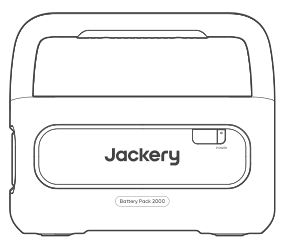
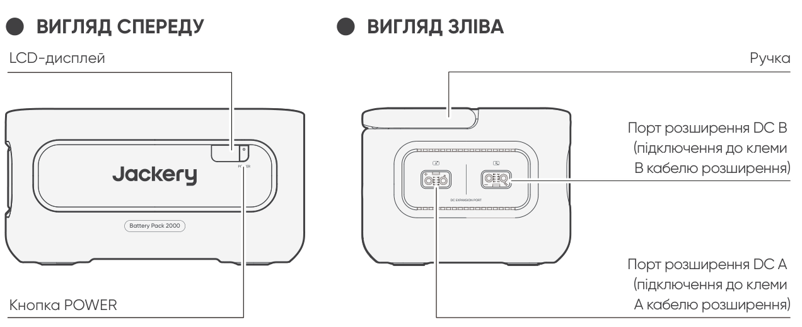
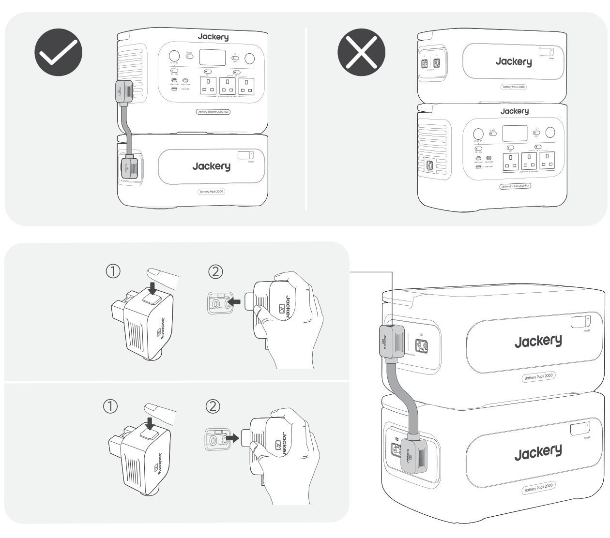
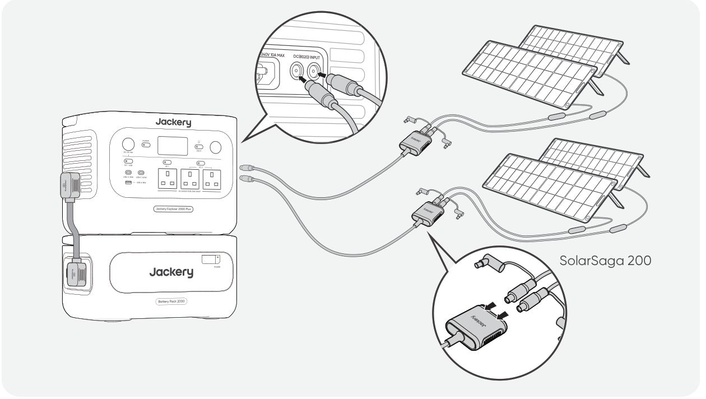

<strong>ВАЖЛИВО</strong>

Вітаємо з придбанням нового Jackery Battery Pack 2000. Перед використанням виробу уважно прочитайте цей посібник, зокрема відповідні застереження, щоб забезпечити належне використання. Зберігайте цей посібник у доступному місці для подальшого звернення.

Відповідно до законів і нормативних актів право остаточного тлумачення цього документа та всіх пов'язаних з цим виробом документів належить Компанії. Хоча докладено всіх зусиль для забезпечення точності цього посібника, Jackery не несе відповідальності за будь-які помилки, що можуть у ньому міститися.

Зверніть увагу, що у разі оновлення, перегляду або припинення дії додаткові повідомлення не надсилатимуться. Щоб отримати останню версію посібників до виробу, відвідайте support.jackery.com.

* Зображення наведені лише для довідки. Орієнтуйтеся на фактичний виріб.

<table class="manual-callout-table" style="width:100%; border-collapse:collapse; margin:0 0 16px 0;"><tbody><tr><td class="manual-callout-label" style="width:16%; border:1px solid #000; padding:6px 8px; vertical-align:top;">
<strong>ПРИМІТКА</strong>
</td><td class="manual-callout-body" style="border:1px solid #000; padding:6px 8px; vertical-align:top;">
Цей акумуляторний блок сумісний із Jackery E2000 Plus V2 та Jackery E1000 Plus V2. У цьому посібнику термін «портативна електростанція» означає будь-яку з цих моделей, якщо не зазначено інше.
</td></tr></tbody></table>

# ВАЖЛИВА ІНФОРМАЦІЯ З БЕЗПЕКИ

Під час використання цього продукту необхідно дотримуватися основних заходів безпеки, зокрема:

<ul class="simple">
<li>
Будь ласка, прочитайте всі інструкції перед використанням цього продукту.
</li>
<li>
Під час використання цього продукту поблизу дітей потрібен пильний нагляд, щоб зменшити ризик.
</li>
<li>
Існує ризик ураження електричним струмом при використанні аксесуарів, рекомендованих або проданих непрофесійними виробниками.
</li>
<li>
Коли продукт не використовується, будь ласка, від’єднайте вилку живлення від розетки продукту.
</li>
<li>
Не розбирайте продукт, оскільки це може призвести до непередбачуваних ризиків, таких як пожежа, вибух або ураження електричним струмом.
</li>
<li>
Не використовуйте продукт із пошкодженими шнурами або вилками, або пошкодженими вихідними кабелями, оскільки це може спричинити ураження електричним струмом.
</li>
<li>
Заряджайте продукт у добре провітрюваному місці та не обмежуйте вентиляцію жодним чином.
</li>
<li>
Будь ласка, розміщуйте продукт у провітрюваному та сухому місці, щоб уникнути потрапляння дощу та води, що може спричинити ураження електричним струмом.
</li>
<li>
Не піддавайте продукт впливу вогню та високих температур (під прямим сонячним світлом або в транспортному засобі за високої температури), оскільки це може спричинити нещасні випадки, такі як пожежа або вибух.
</li>
<li>
Якщо цей продукт зберігається протягом тривалого часу (3 місяці — 6 місяців) із розрядженим акумулятором, він може втратити здатність до заряджання.
</li>
</ul>

# ЗНАЧЕННЯ СИМВОЛІВ

<figure aria-label="имвол / Значення" class="hb-symbol-signal-composition" data-component-id="HB-TABLE-SYMBOL-SIGNAL"><table class="hb-symbol-signal-table"><colgroup><col class="hb-symbol-signal-col-label"/><col class="hb-symbol-signal-col-meaning"/></colgroup><thead><tr><th class="hb-symbol-signal-label-heading" scope="col">
Символ
</th><th class="hb-symbol-signal-meaning-heading" scope="col">
Значення
</th></tr></thead><tbody><tr><td class="hb-symbol-signal-label-cell">⚠ПОПЕРЕДЖЕННЯ</td><td class="hb-symbol-signal-meaning-cell">
Небезпечні дії, які можуть призвести до тяжких травм, смерті та/або пошкодження майна.
</td></tr><tr><td class="hb-symbol-signal-label-cell">⚠УВАГА</td><td class="hb-symbol-signal-meaning-cell">
Небезпечні дії, які можуть призвести до травмування людей та/або пошкодження майна.
</td></tr><tr><td class="hb-symbol-signal-label-cell">ПРИМІТКА</td><td class="hb-symbol-signal-meaning-cell">
Дії, які можуть призвести до пошкодження обладнання, втрати даних, погіршення продуктивності або неочікуваних результатів.
</td></tr><tr><td class="hb-symbol-signal-label-cell">ПОРАДА</td><td class="hb-symbol-signal-meaning-cell">
Доповнює важливу інформацію або поради з експлуатації в тексті.
</td></tr></tbody></table></figure>

<figure aria-label="имвол / Значення" class="hb-symbol-pair-composition" data-component-id="HB-TABLE-SYMBOL-ICON">

<table class="hb-symbol-panel-table"><colgroup><col class="hb-symbol-col-icon"/><col class="hb-symbol-col-meaning"/></colgroup><thead><tr><th class="hb-symbol-icon-heading" scope="col">
<strong>имвол</strong>
</th><th class="hb-symbol-meaning-heading" scope="col">
<strong>Значення</strong>
</th></tr></thead><tbody><tr><td class="hb-symbol-icon"></td><td class="hb-symbol-meaning">
Попереджувальні та застережні символи. Повідомляють користувачам про інформацію, яку необхідно прочитати, щоб уникнути потенційних небезпек або ризиків.
</td></tr><tr><td class="hb-symbol-icon"></td><td class="hb-symbol-meaning">
Перед використанням прочитайте посібник користувача.
</td></tr><tr><td class="hb-symbol-icon"></td><td class="hb-symbol-meaning">
Не розбирайте продукт.
</td></tr><tr><td class="hb-symbol-icon"></td><td class="hb-symbol-meaning">
Тримайте продукт подалі від вогню.
</td></tr><tr><td class="hb-symbol-icon"></td><td class="hb-symbol-meaning">
Тримайте подалі від дітей.
</td></tr><tr><td class="hb-symbol-icon"></td><td class="hb-symbol-meaning">
Цей символ вказує, що всередині продукту є літій-іонна (Li-ion) батарея, яку необхідно утилізувати або переробити належним чином.
</td></tr></tbody></table>

<table class="hb-symbol-panel-table"><colgroup><col class="hb-symbol-col-icon"/><col class="hb-symbol-col-meaning"/></colgroup><thead><tr><th class="hb-symbol-icon-heading" scope="col">
<strong>имвол</strong>
</th><th class="hb-symbol-meaning-heading" scope="col">
<strong>Значення</strong>
</th></tr></thead><tbody><tr><td class="hb-symbol-icon"></td><td class="hb-symbol-meaning">
Батарейки та акумулятори не можна викидати разом із побутовими відходами. Як споживач ви юридично зобов’язані здавати всі батарейки та акумулятори у визначені пункти збору, незалежно від того, чи містять вони небезпечні речовини. Будь ласка, повертайте використані батарейки та акумулятори до місцевих пунктів збору, центрів переробки або до продавця, у якого їх було придбано. Правильна утилізація забезпечує екологічно безпечну переробку та запобігає потенційній шкоді для здоров’я людей і довкілля.
</td></tr><tr><td class="hb-symbol-icon"></td><td class="hb-symbol-meaning">
Цей символ вказує, що продукт не можна утилізувати разом із побутовими відходами, і його слід передати до спеціалізованого пункту збору для переробки.Правильна утилізація та переробка допомагають захистити довкілля. Для отримання додаткової інформації щодо утилізації та переробки цього продукту зверніться до місцевої громади, служби утилізації або дилера.
</td></tr></tbody></table>

</figure>

# ЩО В КОРОБЦІ

<figure aria-label="ЩО В КОРОБЦІ" class="hb-inbox-composition" data-card-count="3" data-component-id="HB-SPECIAL-INBOX" data-inbox-variant="three-card-responsive"><ol class="hb-inbox-grid"><li class="hb-inbox-card" data-item-number="1">

<strong>Jackery Battery Pack 2000</strong>

</li><li class="hb-inbox-card" data-item-number="2">

<strong>Кабель розширення</strong>

</li><li class="hb-inbox-card" data-item-number="3">

Керівництво користувача

</li></ol></figure>

# ОГЛЯД ПРОДУКТУ

<section id="front-view">

</section>

<section id="left-side-view">
</section>

# LCD-ДИСПЛЕЙ

<figure aria-label="LCD-ДИСПЛЕЙ" class="hb-reference-composition hb-reference-lcd-descriptions" data-component-id="HB-TABLE-REFERENCE" data-component-variant="lcd-descriptions" tabindex="0"><table class="hb-reference-table"><tbody><tr><td>Відсоток заряду/ код помилки</td><td>На дисплеї відображається поточний рівень заряду. У разі збою відображається відповідний код несправності F0-FF.</td></tr><tr><td>Індикатор заряджання</td><td>Індикатор відображається під час заряджання та зникає після повного заряджання.</td></tr></tbody></table></figure>

# ОПЕРАЦІЇ

<section id="power-on-off">
<h2>УВІМКНЕННЯ/ВИМКНЕННЯ</h2>
<figure class="hb-operation-figure hb-operation-layout-status-right hb-base-art-live-copy" data-component-id="HB-SPECIAL-OPERATION" data-operation-id="main-power" data-source-fragment-sha256="c700410861d107c26e83d15bc4abe92e2889436e4d92e9711aa4357f6cc6fbbf" data-web-base-art-ref="power_native" data-web-presentation-mode="base-art-live-copy" data-web-replace-key="operation.main-power">

3s

<strong>Увімкнення</strong>

Натисніть один раз

<strong>Вимкнення</strong>

Натисніть і утримуйте протягом 3 с

</figure>
<table class="manual-callout-table" style="width:100%; border-collapse:collapse; margin:0 0 16px 0;"><tbody><tr><td class="manual-callout-label" style="width:16%; border:1px solid #000; padding:6px 8px; vertical-align:top;">
<strong>ПРИМІТКА</strong>
</td><td class="manual-callout-body" style="border:1px solid #000; padding:6px 8px; vertical-align:top;">
Під час використання з портативною електростанцією ви можете вмикати або вимикати Jackery Battery Pack 2000 за допомогою основної кнопки POWER портативної електростанції.

Продукт автоматично вимкнеться, якщо протягом 2 годин не виконується заряджання або не підключено жодного навантаження.

</td></tr></tbody></table></section>

<section id="lcd-display-on-off">
<h2>УВІМКНЕННЯ/ВИМКНЕННЯ LCD-ДИСПЛЕЯ</h2>

Коли ви натискаєте основну кнопку POWER або під час заряджання продукту, LCD-дисплей підсвічується. Коли ви натискаєте її ще раз, LCD-дисплей вимикається.

</section>

# ПІДКЛЮЧЕННЯ

З портативною електростанцією можна використовувати до п’яти акумуляторних блоків, щоб збільшити доступну ємність.

<table class="manual-callout-table" style="width:100%; border-collapse:collapse; margin:0 0 16px 0;"><tbody><tr><td class="manual-callout-label" style="width:16%; border:1px solid #000; padding:6px 8px; vertical-align:top;">
<strong>УВАГА</strong>
</td><td class="manual-callout-body" style="border:1px solid #000; padding:6px 8px; vertical-align:top;"><ul class="simple">
<li>
Переконайтеся, що всі продукти вимкнені, перш ніж підключати портативну електростанцію до Jackery Battery Pack 2000.
</li>
<li>
Щоб забезпечити належну роботу продукту, переконайтеся, що повітрозабірні та витяжні отвори з обох боків не заблоковані. Залишайте щонайменше 200 мм простору між отворами та будь-якими предметами для належного відведення тепла.
</li>
</ul>
</td></tr></tbody></table>

<table class="manual-callout-table" style="width:100%; border-collapse:collapse; margin:0 0 16px 0;"><tbody><tr><td class="manual-callout-label" style="width:16%; border:1px solid #000; padding:6px 8px; vertical-align:top;">
<strong>ПРИМІТКИ</strong>
</td><td class="manual-callout-body" style="border:1px solid #000; padding:6px 8px; vertical-align:top;"><ul class="simple">
<li>
Відображення піктограми  на РК-дисплеї (портативна електростанція) означає успішне підключення між акумуляторним блоком і портативною електростанцією.
</li>
<li>
Не встановлюйте продукт на портативну електростанцію.
</li>
<li>
Розміщуйте акумуляторні блоки на рівній, стабільній поверхні з достатньою несучою здатністю. Стандартна максимальна кількість складених акумуляторних блоків — 3.
</li>
<li>
Якщо потрібно 4 або більше акумуляторних блоків, їх слід розмістити у стабільній зоні біля стіни, подалі від зовнішніх впливів, і вжити необхідних заходів для запобігання перекиданню.
</li>
</ul>
</td></tr></tbody></table>

<figure class="hb-reference-figure hb-base-art-live-copy" data-component-id="HB-SPECIAL-REFERENCE-FIGURE" data-reference-id="locking" data-source-fragment-sha256="17f3fc1a6a3d2dbce4f322e2076914441f8378cca940090628c5f54e92ce3476" data-web-base-art-ref="locking_native" data-web-presentation-mode="base-art-live-copy" data-web-replace-key="reference.locking">

ЗаблокуватиРозблокувати

</figure>

# УСУНЕННЯ НЕСПРАВНОСТЕЙ

Якщо з'являється будь-який із наведених нижче кодів помилки, виконайте вказані дії для усунення проблеми. Якщо несправність не зникає, зверніться до служби підтримки Jackery.

<figure aria-label="Код помилки / Коригувальні дії" class="hb-troubleshooting-composition" data-component-id="HB-TABLE-TROUBLESHOOTING" tabindex="0"><table class="hb-troubleshooting-table"><colgroup><col class="hb-troubleshooting-col-code"/><col class="hb-troubleshooting-col-measures"/></colgroup><thead><tr><th class="hb-troubleshooting-code" scope="col">
Код помилки
</th><th class="hb-troubleshooting-measures" scope="col">
Коригувальні дії
</th></tr></thead><tbody><tr><td class="hb-troubleshooting-code">
F0
</td><td class="hb-troubleshooting-measures">
Перезапустіть продукт.
</td></tr><tr><td class="hb-troubleshooting-code">
F3
</td><td class="hb-troubleshooting-measures">
Перезапустіть продукт.
</td></tr><tr><td class="hb-troubleshooting-code">
F4
</td><td class="hb-troubleshooting-measures">
Підключіть продукт до навантажень, щоб розряджати його акумулятор, доки помилка не зникне.
</td></tr><tr><td class="hb-troubleshooting-code">
F5
</td><td class="hb-troubleshooting-measures">
Заряджайте продукт за допомогою сонячних панелей або від розетки змінного струму, доки помилка не зникне.
</td></tr><tr><td class="hb-troubleshooting-code">
F8
</td><td class="hb-troubleshooting-measures">
Зверніться до служби підтримки клієнтів Jackery.
</td></tr><tr><td class="hb-troubleshooting-code">
FE
</td><td class="hb-troubleshooting-measures">
Зверніться до служби підтримки клієнтів Jackery.
</td></tr><tr><td class="hb-troubleshooting-code">
FF
</td><td class="hb-troubleshooting-measures">
Розмістіть продукт у середовищі з належною температурою та зачекайте, доки помилка не зникне.
</td></tr></tbody></table></figure>

# ЗАРЯДЖАННЯ

<section id="charging-via-ac-wall-outlet">
<h2>ЗАРЯДЖАННЯ ВІД РОЗЕТКИ ЗМІННОГО СТРУМУ</h2>

Щоб зарядити акумуляторний блок від розетки змінного струму, підключіть його до портативної електростанції.

<table class="manual-callout-table" style="width:100%; border-collapse:collapse; margin:0 0 16px 0;"><tbody><tr><td class="manual-callout-label" style="width:16%; border:1px solid #000; padding:6px 8px; vertical-align:top;">
<strong>ПОПЕРЕДЖЕННЯ</strong>
</td><td class="manual-callout-body" style="border:1px solid #000; padding:6px 8px; vertical-align:top;">
Переконайтеся, що всі продукти вимкнені, перш ніж підключати портативну електростанцію до Jackery Battery Pack 2000.
</td></tr></tbody></table>
</section>

<section id="charging-via-solar-panels-sold-separately">
<h2>ЗАРЯДЖАННЯ ВІД СОНЯЧНИХ ПАНЕЛЕЙ (ПРОДАЮТЬСЯ ОКРЕМО)</h2>

Заряджайте акумуляторний блок за допомогою сонячних панелей і портативної електростанції, як показано на рисунку нижче. Для отримання додаткової інформації зверніться до посібника користувача портативної електростанції.

</section>

# ЗБЕРІГАННЯ

Зберігайте продукт у сухому чистому місці з належною вентиляцією. Температура та вологість зберігання:

<ul class="simple">
<li>
1 місяць: від -20 °C до 45 °C (0-60% RH)
</li>
<li>
3 місяці: від 0 °C до 45 °C (0-60% RH)
</li>
<li>
12 місяців: від 0 °C до 25 °C (0-60% RH)
</li>
</ul>

Якщо цей продукт зберігається протягом тривалого часу (3-6 місяців) із повністю розрядженим акумулятором, він може стати непридатним до заряджання. Щоб запобігти цьому та підтримувати справний стан акумулятора, рекомендується перевіряти й заряджати продукт кожні три місяці та виконувати повний цикл заряджання й розряджання принаймні один раз кожні 6-12 місяців.

# ТЕХНІЧНІ ХАРАКТЕРИСТИКИ

## ЗАГАЛЬНА ІНФОРМАЦІЯ

<figure aria-label="ЗАГАЛЬНА ІНФОРМАЦІЯ" class="hb-spec-table-composition"><table class="hb-spec-table manual-table manual-spec-table"><colgroup><col class="hb-spec-col-label"/><col class="hb-spec-col-value"/></colgroup>
<tbody>
<tr>
<th class="hb-spec-label manual-spec-label" scope="row">Назва продукту</th>
<td class="hb-spec-value manual-spec-value">Jackery Battery Pack 2000</td>
</tr>
<tr>
<th class="hb-spec-label manual-spec-label" scope="row">№ моделі</th>
<td class="hb-spec-value manual-spec-value">JBP-2000B</td>
</tr>
<tr>
<th class="hb-spec-label manual-spec-label" scope="row">Ємність</th>
<td class="hb-spec-value manual-spec-value">2048 Вт-год (40 A-год/51,2 В ⎓)</td>
</tr>
<tr>
<th class="hb-spec-label manual-spec-label" scope="row">Хімічний склад елемента</th>
<td class="hb-spec-value manual-spec-value">LiFePO₄</td>
</tr>
<tr>
<th class="hb-spec-label manual-spec-label" scope="row">Вага</th>
<td class="hb-spec-value manual-spec-value">Близько 14,8 кг</td>
</tr>
<tr>
<th class="hb-spec-label manual-spec-label" scope="row">Розміри</th>
<td class="hb-spec-value manual-spec-value">36,5 × 25,5 × 19,1 см</td>
</tr>
<tr>
<th class="hb-spec-label manual-spec-label" scope="row">Ресурс циклів</th>
<td class="hb-spec-value manual-spec-value">6000 циклів до 70%+ ємності</td>
</tr>
</tbody>
</table></figure>

## ВХІДНІ/ВИХІДНІ ПОРТИ

<figure aria-label="ВХІДНІ/ВИХІДНІ ПОРТИ" class="hb-spec-table-composition"><table class="hb-spec-table manual-table manual-spec-table"><colgroup><col class="hb-spec-col-label"/><col class="hb-spec-col-value"/></colgroup>
<tbody>
<tr>
<th class="hb-spec-label manual-spec-label" scope="row">Порт розширення DC (вхід)</th>
<td class="hb-spec-value manual-spec-value">36,8 V-57,6 V⎓75 A макс.</td>
</tr>
<tr>
<th class="hb-spec-label manual-spec-label" scope="row">Порт розширення DC (вихід)</th>
<td class="hb-spec-value manual-spec-value">36,8 V-57,6 V⎓75 A макс.</td>
</tr>
</tbody>
</table></figure>

## РОБОЧА ТЕМПЕРАТУРА СЕРЕДОВИЩА

<figure aria-label="РОБОЧА ТЕМПЕРАТУРА СЕРЕДОВИЩА" class="hb-spec-table-composition"><table class="hb-spec-table manual-table manual-spec-table"><colgroup><col class="hb-spec-col-label"/><col class="hb-spec-col-value"/></colgroup>
<tbody>
<tr>
<th class="hb-spec-label manual-spec-label" scope="row">Температура заряджання</th>
<td class="hb-spec-value manual-spec-value">від -10 °C до 45 °C</td>
</tr>
<tr>
<th class="hb-spec-label manual-spec-label" scope="row">Температура розряджання</th>
<td class="hb-spec-value manual-spec-value">від -10 °C до 45 °C</td>
</tr>
</tbody>
</table></figure>

# ГАРАНТІЯ

<figure aria-label="ГАРАНТІЯ" class="hb-warranty-intro-composition" data-component-id="HB-WARRANTY-LEAD">

<strong>Ця гарантія застосовується лише до клієнтів, які здійснили покупку на офіційному вебсайті Jackery, на сторонніх платформах під брендом Jackery або у місцевих авторизованих дилерів.</strong>

* Гарантійний період і деталі можуть відрізнятися залежно від місцевих законів, нормативних актів і авторизованих дилерів.

</figure>

<section class="warranty-section" id="limited-warranty">
<h2>Обмежена гарантія</h2>
<figure aria-label="Обмежена гарантія" class="hb-warranty-card" data-component-id="HB-WARRANTY-SECTION" data-warranty-card-index="1">
Jackery гарантує первинному споживачу-покупцю, що продукт Jackery не матиме дефектів виготовлення та матеріалів за умов нормального споживчого використання протягом відповідного гарантійного періоду, зазначеного в розділі «Гарантійний період» нижче, з урахуванням наведених нижче виключень.

Ця гарантійна заява визначає повний і виключний обсяг гарантійних зобов’язань Jackery. Ми не беремо на себе і не уповноважуємо будь-яку особу брати на себе від нашого імені будь-які інші зобов’язання у зв’язку з продажем нашої продукції.
</figure>
</section>

<section class="warranty-section warranty-years" id="warranty-period">
<h2>Гарантійний період</h2>
<figure aria-label="Гарантійний період" class="hb-warranty-period-card" data-component-id="HB-WARRANTY-YEARS">

3
<strong class="hb-warranty-years-unit">РОКИ</strong><strong class="hb-warranty-period-label">Стандартна гарантія на</strong>

Стандартний гарантійний період для Jackery Battery Pack 2000 становить 36 місяців. У кожному випадку гарантійний період обчислюється з дати покупки первинним споживачем-покупцем. Для визначення дати початку гарантійного періоду необхідний касовий чек від першого споживача-покупця або інший належний документальний доказ.

2
<strong class="hb-warranty-years-unit">РОКИ</strong><strong class="hb-warranty-period-label">Розширена гарантія на</strong>

Щоб активувати розширення гарантії, необхідно зареєструвати продукт онлайн або звернутися до нашої служби підтримки за адресою <a class="reference external" href="mailto:hello.eu@jackery.com">hello.eu@jackery.com</a> для подовження стандартного гарантійногоперіоду.

</figure>
</section>

<section class="warranty-section" id="exchange">
<h2>Обмін</h2>
<figure aria-label="Обмін" class="hb-warranty-card" data-component-id="HB-WARRANTY-SECTION" data-warranty-card-index="3">
Jackery замінить (за рахунок Jackery) будь-який продукт Jackery, який не працює протягом відповідного гарантійного періоду через дефект матеріалів або виготовлення. Заміна отримує залишок гарантійного терміну оригінального продукту.
</figure>
</section>

<section class="warranty-section" id="limited-to-original-consumer-buyer">
<h2>Обмеження для первинного споживача-покупця</h2>
<figure aria-label="Обмеження для первинного споживача-покупця" class="hb-warranty-card" data-component-id="HB-WARRANTY-SECTION" data-warranty-card-index="4">
Гарантія на продукт Jackery обмежується первинним споживачем-покупцем і не підлягає передачі будь-якому наступному власнику.
</figure>
</section>

<section class="warranty-section" id="exclusions">
<h2>Виключення</h2>
<figure aria-label="Виключення" class="hb-warranty-card" data-component-id="HB-WARRANTY-SECTION" data-warranty-card-index="5">
Гарантія Jackery не поширюється на:
<ul class="simple">
<li>
Будь-який продукт, який був неправильно використаний, зазнав неналежного поводження, модифікований, пошкоджений внаслідок нещасного випадку або використовувався не за призначенням, відмінним від звичайного споживчого використання, дозволеного в чинній документації Jackery.
</li>
<li>
Спроби ремонту будь-ким, окрім авторизованого сервісного центру.
</li>
<li>
Будь-який продукт, придбаний через онлайн-аукціон.
</li>
<li>
Гарантія Jackery не поширюється на акумуляторний елемент, якщо він не був повністю заряджений вами протягом семи днів після покупки продукту та щонайменше один раз кожні 6 місяців після цього.
</li>
</ul></figure>
</section>

<section class="warranty-section" id="interpretation-rights">
<h2>Право тлумачення</h2>
<figure aria-label="Право тлумачення" class="hb-warranty-card" data-component-id="HB-WARRANTY-SECTION" data-warranty-card-index="6">
Jackery залишає за собою право на остаточне тлумачення вищезазначеної.
</figure>
</section>

# EU REGULATIONS

<section id="red-declaration-of-conformity">
<h2>RED DECLARATION OF CONFORMITY</h2>

Shenzhen Hello Tech Energy Co., Ltd. hereby declares that this Jackery Battery Pack 2000 with Bluetooth and Wi-Fi JBP-2000B is in compliance with the essential requirements and other relevant provisions of the RED Directive 2014/53/EU. The full text of the EU declaration of conformity is available at the following internet address:

<a class="reference external" href="https://de.jackery.com/pages/user-guides">https://de.jackery.com/pages/user-guides</a>

</section>

<section id="manufacturer">
<h2>MANUFACTURER</h2>

SHENZHEN HELLO TECH ENERGY CO., LTD.

Address: F2-3, Bldg. 7, Jiaanda Science and technology industrial park factory, the east side of Huafan Road, Tongsheng Community, Dalang Street, Longhua District, Shenzhen, Guangdong, China

+86 400 668 9293

<a class="reference external" href="mailto:sales@hello-tech.com">sales@hello-tech.com</a>

www.hello-tech.com

</section>
