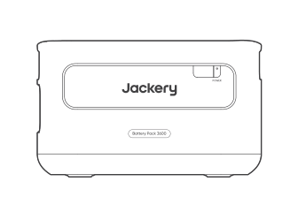
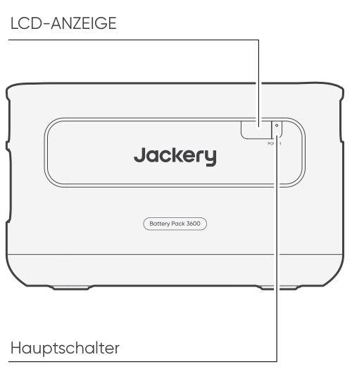
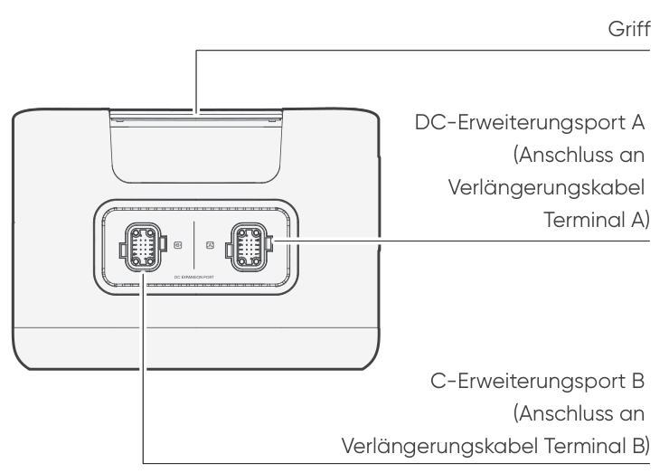

<strong>WICHTIG</strong>

Herzlichen Glückwunsch zu Ihrem neuen Jackery Battery Pack 3600. Bitte lesen Sie dieses Handbuch, insbesondere die entsprechenden Vorsichtsmaßnahmen sorgfältig durch, bevor Sie das Produkt verwenden, um eine ordnungsgemäße Verwendung zu gewährleisten. Bewahren Sie dieses Handbuch zum Nachschlagen an einem leicht zugänglichen Ort auf.

In Übereinstimmung mit den Gesetzen und Vorschriften liegt das Recht der endgültigen Auslegung dieses Dokuments und aller zugehörigen Dokumente zu diesem Produkt beim Unternehmen.

Bitte beachten Sie, dass im Falle einer Aktualisierung, Überarbeitung oder Beendigung keine weiteren Benachrichtigungen erfolgen.

# SICHERHEITSVORKEHRUNGEN BEI DER VERWENDUNG

Befolgen Sie bei der Verwendung dieses Produkts stets die folgenden grundlegenden Vorsichtsmaßnahmen.

<ul class="simple">
<li>
Bitte lesen Sie alle Anweisungen, bevor Sie dieses Produkt verwenden.
</li>
<li>
Lassen Sie Kinder nicht mit dem Produkt spielen. Achten Sie darauf, dass Kinder beaufsichtigt werden, wenn das Produkt in ihrer Nähe verwendet wird.Bitte lesen Sie alle Anweisungen, bevor Sie dieses Produkt verwenden.
</li>
<li>
Bei der Verwendung von Zubehör, das von nicht professionellen Herstellern empfohlen oder verkauft wird, besteht die Gefahr eines Stromschlags.
</li>
<li>
Wenn das Produkt nicht verwendet wird, ziehen Sie bitte den Netzstecker aus der Steckdose des Produkts.
</li>
<li>
Zerlegen Sie das Produkt nicht, da dies zu unvorhersehbaren Risiken führen kann, wie Feuer, Explosion oder Stromschlag.
</li>
<li>
Verwenden Sie das Produkt nicht mit beschädigten Kabeln oder Steckern oder beschädigten Ausgangskabeln, die einen Stromschlag verursachen können.
</li>
<li>
Laden Sie das Gerät in einem gut belüfteten Bereich und beeinträchtigen Sie die Belüftung in keiner Weise.
</li>
<li>
Stellen Sie das Gerät an einem gut belüfteten und trockenen Ort auf, um Regen und Feuchtigkeit zu vermeiden, die einen elektrischen Schlag verursachen könnten.
</li>
<li>
Setzen Sie das Gerät weder Feuer noch hohen Temperaturen aus (z. B. direkter Sonneneinstrahlung oder großer Hitze im Fahrzeug), da dies zu Unfällen wie Bränden oder Explosionen führen kann.
</li>
<li>
Wird dieses Gerät über einen längeren Zeitraum (3–6 Monate) in vollständig entladenem Zustand gelagert, kann es möglicherweise nicht mehr aufgeladen werden.
</li>
</ul>

# BEDEUTUNG DER SYMBOLE

<figure aria-label="Symbol / Bedeutung" class="hb-symbol-signal-composition" data-component-id="HB-TABLE-SYMBOL-SIGNAL"><table class="hb-symbol-signal-table"><colgroup><col class="hb-symbol-signal-col-label"/><col class="hb-symbol-signal-col-meaning"/></colgroup><thead><tr><th class="hb-symbol-signal-label-heading" scope="col">
Symbol
</th><th class="hb-symbol-signal-meaning-heading" scope="col">
Bedeutung
</th></tr></thead><tbody><tr><td class="hb-symbol-signal-label-cell">⚠WARNUNG</td><td class="hb-symbol-signal-meaning-cell">
Gefährliche Handlungen, die zu schweren Verletzungen, Todesfällen und/oder Sachschäden führen können.
</td></tr><tr><td class="hb-symbol-signal-label-cell">⚠VORSICHT</td><td class="hb-symbol-signal-meaning-cell">
Gefährliche Handlungen, die zu Personenschäden und/oder Sachschäden führen können.
</td></tr><tr><td class="hb-symbol-signal-label-cell">⚠HINWEIS</td><td class="hb-symbol-signal-meaning-cell">
Gefährliche Handlungen, die zu Geräteschäden, Datenverlust, Leistungsverschlechterung oder unvorhergesehenen Ergebnissen führen können.
</td></tr><tr><td class="hb-symbol-signal-label-cell">⚠TIPP</td><td class="hb-symbol-signal-meaning-cell">
Ergänzt wichtige Informationen oder Bedienungshinweise im Text.
</td></tr></tbody></table></figure>

<figure aria-label="Symbol / Bedeutung" class="hb-symbol-pair-composition" data-component-id="HB-TABLE-SYMBOL-ICON">

<table class="hb-symbol-panel-table"><colgroup><col class="hb-symbol-col-icon"/><col class="hb-symbol-col-meaning"/></colgroup><thead><tr><th class="hb-symbol-icon-heading" scope="col">
<strong>Symbol</strong>
</th><th class="hb-symbol-meaning-heading" scope="col">
<strong>Bedeutung</strong>
</th></tr></thead><tbody><tr><td class="hb-symbol-icon"></td><td class="hb-symbol-meaning">
Warn- und Sicherheitssymbole. Unbedingt lesen, um auf mögliche Gefahren oder Risiken aufmerksam zu machen.
</td></tr><tr><td class="hb-symbol-icon"></td><td class="hb-symbol-meaning">
Lesen Sie vor der Anwendung die Benutzeranleitung.
</td></tr><tr><td class="hb-symbol-icon"></td><td class="hb-symbol-meaning">
Vermeiden Sie Hitze.
</td></tr><tr><td class="hb-symbol-icon"></td><td class="hb-symbol-meaning">
Demontieren Sie das Produkt nicht.
</td></tr></tbody></table>

<table class="hb-symbol-panel-table"><colgroup><col class="hb-symbol-col-icon"/><col class="hb-symbol-col-meaning"/></colgroup><thead><tr><th class="hb-symbol-icon-heading" scope="col">
<strong>Symbol</strong>
</th><th class="hb-symbol-meaning-heading" scope="col">
<strong>Bedeutung</strong>
</th></tr></thead><tbody><tr><td class="hb-symbol-icon"></td><td class="hb-symbol-meaning">
Halten Sie das Produkt fern von Kindern.
</td></tr><tr><td class="hb-symbol-icon"></td><td class="hb-symbol-meaning">
Dieses Symbol zeigt an, dass sich ein Lithium-Ionen-Akku (Li-Ion) im Produkt befindet und ordnungsgemäß entsorgt oder recycelt werden sollte.
</td></tr><tr><td class="hb-symbol-icon"></td><td class="hb-symbol-meaning">
Dieses Symbol zeigt an, dass das Produkt nicht als Haushaltsabfall entsorgt werden soll und an eine dafür vorgesehene Sammelstelle zur Entsorgung und Recycling gebracht werden sollte. Eine ordnungsgemäße Entsorgung und Recycling kann dazu beitragen, die Umwelt zu schützen. Für weitere Informationen zur Entsorgung und Recycling dieses Produkts wenden Sie sich an Ihre örtliche Gemeinde, Entsorgungsdienstleistungen oder Ihren Händler.
</td></tr><tr><td class="hb-symbol-icon"></td><td class="hb-symbol-meaning">
Batterien und Akkumulatoren dürfen nicht über den Hausmüll entsorgt werden. Als Verbraucher sind Sie gesetzlich verpflichtet, alle Batterien und Akkumulatoren an dafür vorgesehenen Sammelstellen zu entsorgen, unabhängig davon, ob sie Schadstoffe enthalten. Bitte geben Sie gebrauchte Batterien und Akkumulatoren an einer örtlichen Sammelstelle, einem Recyclingzentrum oder beim Händler zurück, bei dem sie gekauft wurden. Die ordnungsgemäße Entsorgung gewährleistet eine umweltgerechte Wiederverwertung und verhindert mögliche Schäden für die menschliche Gesundheit und die Umwelt.
</td></tr></tbody></table>

</figure>

# LIEFERUMFANG

<figure aria-label="LIEFERUMFANG" class="hb-inbox-composition" data-card-count="3" data-component-id="HB-SPECIAL-INBOX" data-inbox-variant="three-card-responsive"><ol class="hb-inbox-grid"><li class="hb-inbox-card" data-item-number="1">

<strong>Jackery Battery Pack 3600</strong>

</li><li class="hb-inbox-card" data-item-number="2">

<strong>Verlängerungskabel</strong>

</li><li class="hb-inbox-card" data-item-number="3">

Benutzerhandbuch

</li></ol></figure>

# LERNE DEINE AUSRÜSTUNG KENNEN

<section id="front-view">
<h2>VORDERANSICHT</h2>

</section>

<section id="left-side-view">
<h2>LINKE SEITENANSICHT</h2>

</section>

# LCD-ANZEIGE

<figure aria-label="LCD-ANZEIGE" class="hb-reference-composition hb-reference-lcd-descriptions" data-component-id="HB-TABLE-REFERENCE" data-component-variant="lcd-descriptions" tabindex="0"><table class="hb-reference-table"><tbody><tr><td>
Leistungsprozentanzeige/Fehlercode
</td><td>

Die Leistungsanzeige in Prozent des aktuellen Leistungswerts.

Wenn das System ausfällt, wird dies als der entsprechende Fehlercode F0-FF angezeigt. Wenn der FF-Code angezeigt wird, entfernen Sie bitte die Last und das Gerät erholt sich von selbst, wenn nicht, wenden Sie sich bitte an den Kundendienst. Falls ein anderer Code angezeigt wird, wenden Sie sich bitte an unseren Kundendienst.

</td></tr><tr><td>
Ladeanzeige
</td><td>
Die Anzeige wird während des Ladevorgangs angezeigt und verschwindet, wenn das Gerät vollständig aufgeladen ist.
</td></tr></tbody></table></figure>

# GRUNDLEGENDE OPERATIONEN

<section id="power-on-off">
<h2>EINSCHALTEN / AUSSCHALTEN</h2>
<figure class="hb-operation-figure hb-operation-layout-status-right hb-base-art-live-copy" data-component-id="HB-SPECIAL-OPERATION" data-operation-id="main-power" data-source-fragment-sha256="9723f9e1d5525f12a9775ec08f3dddada3db5a9a340b6cc26175b3adb1dca943" data-web-base-art-ref="power_native" data-web-presentation-mode="base-art-live-copy" data-web-replace-key="operation.main-power">

3s

<strong>Ein</strong>

Einmal drücken

<strong>Aus</strong>

Drei Sekunden lang gedrückt halten

</figure>
<table class="manual-callout-table" style="width:100%; border-collapse:collapse; margin:0 0 16px 0;"><tbody><tr><td class="manual-callout-label" style="width:16%; border:1px solid #000; padding:6px 8px; vertical-align:top;">
<strong>Hinweise</strong>
</td><td class="manual-callout-body" style="border:1px solid #000; padding:6px 8px; vertical-align:top;">
Wenn Sie es mit dem Jackery Explorer 3600 Plus verwenden, können Sie die Stromversorgung des Jackery Battery Pack 3600 über den "Hauptschalter" des Jackery Explorer 3600 Plus steuern.

Wenn keine Entladung oder Ladung erfolgt, wird das Produkt nach 2 Stunden automatisch heruntergefahren.

</td></tr></tbody></table></section>

<section id="lcd-display-on-off">
<h2>LCD-DISPLAY EIN/AUS</h2>

Wenn Sie den "Hauptschalter" drücken oder das Gerät aufladen, wird das LCD-Display beleuchtet, wenn Sie den "Hauptschalter" erneut drücken, wird das Display ausgeschaltet.

</section>

# WIE BENUTZT MAN

Der Jackery Explorer 3600 Plus kann mit bis zu 5 Sätzen dieses Produkts gleichzeitig verwendet werden, um größere Kapazitätsanforderungen zu erfüllen.

<table class="manual-callout-table" style="width:100%; border-collapse:collapse; margin:0 0 16px 0;"><tbody><tr><td class="manual-callout-label" style="width:16%; border:1px solid #000; padding:6px 8px; vertical-align:top;">
<strong>VORSICHT</strong>
</td><td class="manual-callout-body" style="border:1px solid #000; padding:6px 8px; vertical-align:top;">
Stellen Sie sicher, dass alle Geräte ausgeschaltet sind, bevor Sie den Jackery Explorer 3600 Plus an das Jackery Battery Pack 3600 anschließen.

Stellen Sie für einen ordnungsgemäßen Betrieb sicher, dass die Lufteinlass- und Abluftöffnungen auf beiden Seiten nicht blockiert sind. Halten Sie zwischen den Lüftungsöffnungen und anderen Gegenständen einen Abstand von mindestens 200 mm ein, um eine ausreichende Wärmeableitung zu gewährleisten.

</td></tr></tbody></table>

<figure class="hb-reference-figure hb-base-art-live-copy" data-component-id="HB-SPECIAL-REFERENCE-FIGURE" data-reference-id="clearance" data-source-fragment-sha256="49918f2a749bd736037790a7b0a25307a3fda37b4a15063f8926a354207287a8" data-web-base-art-ref="clearance_native" data-web-presentation-mode="base-art-live-copy" data-web-replace-key="reference.clearance">

≥200 mm≥≈200 mm

</figure>

<table class="manual-callout-table" style="width:100%; border-collapse:collapse; margin:0 0 16px 0;"><tbody><tr><td class="manual-callout-label" style="width:16%; border:1px solid #000; padding:6px 8px; vertical-align:top;">
<strong>Hinweise</strong>
</td><td class="manual-callout-body" style="border:1px solid #000; padding:6px 8px; vertical-align:top;">
Die Anzeige des  Symbols auf dem LCD-Bildschirm (Jackery Explorer 3600 Plus) zeigt eine erfolgreiche Verbindung zwischen dem Batteriepack und dem Jackery Explorer 3600 Plus an.

Stapeln Sie bei der Verwendung des Geräts nicht mehr als drei Batteriepacks übereinander, um ein Umkippen und mögliche Verletzungen zu vermeiden.

Stapeln Sie das Gerät nicht auf dem Jackery Explorer 3600 Plus.

</td></tr></tbody></table>

<figure class="hb-reference-figure hb-base-art-live-copy" data-component-id="HB-SPECIAL-REFERENCE-FIGURE" data-reference-id="locking" data-source-fragment-sha256="d1e2c35f75a65e43d8cfecc6f973fbeeac57740613536a65a25a4ff2d08aa7ca" data-web-base-art-ref="locking_native" data-web-presentation-mode="base-art-live-copy" data-web-replace-key="reference.locking">

<strong>Sperren</strong><strong>Entsperren</strong>1212

</figure>

# FEHLERSUCHE

Falls einer der folgenden Fehlercodes angezeigt wird, befolgen Sie die aufgeführten Korrekturmaßnahmen, um das Problem zu beheben. Wenn der Fehler weiterhin besteht, wenden Sie sich bitte an den Jackery-Kundendienst.

<figure aria-label="Fehlermeldung / Maßnahmen zur Fehlerbehebung" class="hb-troubleshooting-composition" data-component-id="HB-TABLE-TROUBLESHOOTING" tabindex="0"><table class="hb-troubleshooting-table"><colgroup><col class="hb-troubleshooting-col-code"/><col class="hb-troubleshooting-col-measures"/></colgroup><thead><tr><th class="hb-troubleshooting-code" scope="col">
Fehlermeldung
</th><th class="hb-troubleshooting-measures" scope="col">
Maßnahmen zur Fehlerbehebung
</th></tr></thead><tbody><tr><td class="hb-troubleshooting-code">
F0
</td><td class="hb-troubleshooting-measures">
Starten Sie das Gerät neu.
</td></tr><tr><td class="hb-troubleshooting-code">
F1, F2
</td><td class="hb-troubleshooting-measures">
Kontaktieren Sie den Händler oder den Jackery-Kundendienst.
</td></tr><tr><td class="hb-troubleshooting-code">
F3
</td><td class="hb-troubleshooting-measures">
Starten Sie das Gerät neu.
</td></tr><tr><td class="hb-troubleshooting-code">
F4
</td><td class="hb-troubleshooting-measures">
Schließen Sie das Gerät an Verbraucher an, um die Batterie zu entladen, bis der Fehler verschwindet.
</td></tr><tr><td class="hb-troubleshooting-code">
F5
</td><td class="hb-troubleshooting-measures">
Laden Sie das Gerät über Solarmodule oder eine AC-Wandsteckdose, bis der Fehler verschwindet.
</td></tr><tr><td class="hb-troubleshooting-code">
F6-F9, FA, FC, FE
</td><td class="hb-troubleshooting-measures">
Kontaktieren Sie den Händler oder den Jackery-Kundendienst.
</td></tr><tr><td class="hb-troubleshooting-code">
FF
</td><td class="hb-troubleshooting-measures">
Stellen Sie das Gerät in eine Umgebung mit geeigneter Temperatur und warten Sie, bis der Fehler verschwindet.
</td></tr></tbody></table></figure>

# AUFLADEN

<section id="charging-via-ac-wall-outlet">
<h2>AUFLADEN ÜBER EINE AC-STECKDOSE</h2>

Beim Aufladen über das Hauptstromnetz muss dieses Gerät mit dem Jackery Explorer 3600 Plus verwendet werden.

<table class="manual-callout-table" style="width:100%; border-collapse:collapse; margin:0 0 16px 0;"><tbody><tr><td class="manual-callout-label" style="width:16%; border:1px solid #000; padding:6px 8px; vertical-align:top;">
<strong>WARNUNG</strong>
</td><td class="manual-callout-body" style="border:1px solid #000; padding:6px 8px; vertical-align:top;">
Stellen Sie sicher, dass alle Geräte ausgeschaltet sind, bevor Sie den Jackery Explorer 3600 Plus an das Jackery Battery Pack 3600 anschließen.
</td></tr></tbody></table>
</section>

<section id="charging-via-solar-panels-sold-separately">
<h2>AUFLADEN ÜBER SOLARPANEL (SEPARAT ERHÄLTLICH)</h2>

Laden Sie das Gerät wie in der unten dargestellten Abbildung mit Solarmodulen und dem Jackery Explorer 3600 Plus auf. Weitere Informationen finden Sie im Benutzerhandbuch des Jackery Explorer 3600 Plus.

</section>

# LAGERUNG

Bewahren Sie das Produkt an einem trockenen, sauberen Ort mit ausreichender Belüftung auf. Lagertemperatur und Luftfeuchtigkeit:

<ul class="simple">
<li>
1 Monat: -20 °C bis 45 °C (0–60 % relative Luftfeuchtigkeit)
</li>
<li>
3 Monate: 0 °C bis 45 °C (0–60 % relative Luftfeuchtigkeit)
</li>
<li>
12 Monate: 0 °C bis 25 °C (0–60 % relative Luftfeuchtigkeit)
</li>
</ul>

Wenn dieses Produkt über einen längeren Zeitraum (3 bis 6 Monate) mit entladener Batterie gelagert wird, kann es sein, dass es danach nicht mehr aufgeladen werden kann. Um dies zu verhindern und die Batterielebensdauer zu erhalten, wird empfohlen, das Produkt alle drei Monate zu überprüfen und aufzuladen sowie mindestens einmal alle 6 bis 12 Monate einen vollständigen Lade- und Entladezyklus durchzuführen.

# ALLGEMEINE INFORMATIONEN

## ALLGEMEINE INFORMATIONEN

<figure aria-label="ALLGEMEINE INFORMATIONEN" class="hb-spec-table-composition"><table class="hb-spec-table manual-table manual-spec-table"><colgroup><col class="hb-spec-col-label"/><col class="hb-spec-col-value"/></colgroup>
<tbody>
<tr>
<th class="hb-spec-label manual-spec-label" scope="row">Produktname</th>
<td class="hb-spec-value manual-spec-value">Jackery Battery Pack 3600</td>
</tr>
<tr>
<th class="hb-spec-label manual-spec-label" scope="row">Modell-Nr.</th>
<td class="hb-spec-value manual-spec-value">JBP-3600A</td>
</tr>
<tr>
<th class="hb-spec-label manual-spec-label" scope="row">Kapazität</th>
<td class="hb-spec-value manual-spec-value">80Ah / 44,8Vdc (3584 Wh)</td>
</tr>
<tr>
<th class="hb-spec-label manual-spec-label" scope="row">Zellchemie</th>
<td class="hb-spec-value manual-spec-value">LiFePO4</td>
</tr>
<tr>
<th class="hb-spec-label manual-spec-label" scope="row">Gewicht</th>
<td class="hb-spec-value manual-spec-value">25 kg</td>
</tr>
<tr>
<th class="hb-spec-label manual-spec-label" scope="row">Abmessungen</th>
<td class="hb-spec-value manual-spec-value">37,5 × 31,7 × 22,9 cm</td>
</tr>
<tr>
<th class="hb-spec-label manual-spec-label" scope="row">Nutzungsdauer</th>
<td class="hb-spec-value manual-spec-value">6000 cycles to 70%+ capacity</td>
</tr>
<tr>
<th class="hb-spec-label manual-spec-label" scope="row">IEC-Code</th>
<td class="hb-spec-value manual-spec-value">IFpR41/136[14S4P]M/-20+40/90</td>
</tr>
</tbody>
</table></figure>

## EINGANGS-/AUSGANGSANSCHLÜSSE

<figure aria-label="EINGANGS-/AUSGANGSANSCHLÜSSE" class="hb-spec-table-composition"><table class="hb-spec-table manual-table manual-spec-table"><colgroup><col class="hb-spec-col-label"/><col class="hb-spec-col-value"/></colgroup>
<tbody>
<tr>
<th class="hb-spec-label manual-spec-label" scope="row">DC-Erweiterungsanschluss (Eingang)</th>
<td class="hb-spec-value manual-spec-value">36,4V-50,4V⎓60A max</td>
</tr>
<tr>
<th class="hb-spec-label manual-spec-label" scope="row">DC-Erweiterungsanschluss (Ausgang)</th>
<td class="hb-spec-value manual-spec-value">36,4V-50,4V⎓100A max</td>
</tr>
</tbody>
</table></figure>

## ENVIRONMENTAL OPERATING TEMPERATURE

<figure aria-label="ENVIRONMENTAL OPERATING TEMPERATURE" class="hb-spec-table-composition"><table class="hb-spec-table manual-table manual-spec-table"><colgroup><col class="hb-spec-col-label"/><col class="hb-spec-col-value"/></colgroup>
<tbody>
<tr>
<th class="hb-spec-label manual-spec-label" scope="row">Ladetemperatur</th>
<td class="hb-spec-value manual-spec-value">-20°C und 45°C</td>
</tr>
<tr>
<th class="hb-spec-label manual-spec-label" scope="row">Entladetemperatur</th>
<td class="hb-spec-value manual-spec-value">-20°C und 45°C</td>
</tr>
</tbody>
</table></figure>

# GARANTIE

<figure aria-label="GARANTIE" class="hb-warranty-intro-composition" data-component-id="HB-WARRANTY-LEAD">

<strong>Wir gewähren unsere Garantie nur Kunden, die über die offizielle Jackery-Website, Jackery-Marken-Drittanbieterplattformen oder lokale autorisierte Händler kaufen.</strong>

* Die Garantiefrist und -details können je nach lokalen Gesetzen, Vorschriften und autorisierten Händlern variieren.

</figure>

<section class="warranty-section" id="limited-warranty">
<h2>Beschränkte Garantie</h2>
<figure aria-label="Beschränkte Garantie" class="hb-warranty-card" data-component-id="HB-WARRANTY-SECTION" data-warranty-card-index="1">
Jackery garantiert dem Erstkäufer, dass das Jackery-Produkt bei normaler Nutzung durch den Verbraucher während der geltenden Garantiezeit, die im Abschnitt „Garantiezeit“ unten angegeben ist, frei von Verarbeitungs- und Materialfehlern ist, vorbehaltlich der unten aufgeführten Ausschlüsse.

Diese Garantieerklärung stellt die gesamte und ausschließliche Garantieverpflichtung von Jackery dar. Wir übernehmen keine weitere Haftung in Verbindung mit dem Verkauf unserer Produkte und ermächtigen auch niemanden, diese für uns zu übernehmen.
</figure>
</section>

<section class="warranty-section warranty-years" id="warranty-period">
<h2>Garantiezeit</h2>
<figure aria-label="Garantiezeit" class="hb-warranty-period-card" data-component-id="HB-WARRANTY-YEARS">

3
<strong class="hb-warranty-years-unit">JAHRE</strong><strong class="hb-warranty-period-label">Standardgarantie</strong>

Die Standardgarantiezeit für den Jackery Battery Pack 3600 beträgt 36 Monate. Die Garantiezeit beginnt in jedem Fall ab dem Kaufdatum durch den ursprünglichen Verbraucherkäufer. Der Kaufbeleg des ersten Verbraucherkaufs oder ein anderer angemessener dokumentarischer Nachweis ist erforderlich, um das Anfangsdatum der Garantiezeit zu bestimmen.

2
<strong class="hb-warranty-years-unit">JAHRE</strong><strong class="hb-warranty-period-label">Garantieverlängerung</strong>

Um die Garantieverlängerung in Anspruch zu nehmen und die Standardgarantielaufzeit zu verlängern, registrieren Sie Ihr Produkt online oder kontaktieren Sie unseren Kundendienst unter <a class="reference external" href="mailto:hello.eu@jackery.com">hello.eu@jackery.com</a>.

</figure>
</section>

<section class="warranty-section" id="repair-or-replacement">
<h2>Umtausch</h2>
<figure aria-label="Umtausch" class="hb-warranty-card" data-component-id="HB-WARRANTY-SECTION" data-warranty-card-index="3">
Jackery tauscht (auf Kosten von Jackery) jedes Jackery Produkt aus, das während der geltenden Garantiezeit aufgrund eines Verarbeitungs- oder Materialfehlers nicht mehr funktioniert. Ein Ersatzprodukt übernimmt die Restgarantie des Originalprodukts.
</figure>
</section>

<section class="warranty-section" id="limited-to-original-consumer-buyer">
<h2>Begrenzt auf den ursprünglichen Verbraucherkäufer</h2>
<figure aria-label="Begrenzt auf den ursprünglichen Verbraucherkäufer" class="hb-warranty-card" data-component-id="HB-WARRANTY-SECTION" data-warranty-card-index="4">
Die Garantie auf ein Jackery-Produkt ist auf den Erstkäufer beschränkt und kann nicht auf einen nachfolgenden Besitzer übertragen werden.
</figure>
</section>

<section class="warranty-section" id="exclusions">
<h2>Ausschlüsse</h2>
<figure aria-label="Ausschlüsse" class="hb-warranty-card" data-component-id="HB-WARRANTY-SECTION" data-warranty-card-index="5">
Die Garantie von Jackery gilt nicht bei:
<ul class="simple">
<li>
Unsachgemäßer Verwendung, Zweckentfremdung, Modifikation des Geräts, versehentlicher Beschädigung oder Nutzung außerhalb des in der aktuellen Produktliteratur von Jackery vorgesehenen normalen Verbrauchsgebrauchs.
</li>
<li>
Versuch einer Reparatur durch eine nicht autorisierte Drittpartei.
</li>
<li>
Kauf von Produkten über ein Online-Auktionshaus.
</li>
<li>
Die Garantie gilt nicht für die Batteriezelle, es sei denn, sie wird innerhalb von sieben Tagen nach dem Kauf vollständig aufgeladen und anschließend mindestens alle sechs Monate erneut vollständig geladen.
</li>
</ul></figure>
</section>

<section class="warranty-section" id="interpretation-rights">
<h2>Auslegungsrecht</h2>
<figure aria-label="Auslegungsrecht" class="hb-warranty-card" data-component-id="HB-WARRANTY-SECTION" data-warranty-card-index="6">
Jackery behält sich das Recht auf die endgültige Auslegung der oben genannten Kundendienst-Richtlinien vor.
</figure>
</section>

# EU REGULATIONS

<section id="red-declaration-of-conformity">
<h2>RED DECLARATION OF CONFORMITY</h2>

Shenzhen Hello Tech Energy Co., Ltd. hereby declares that this Jackery Battery Pack 3600 with Bluetooth and Wi-Fi JBP-3600A is in compliance with the essential requirements and other relevant provisions of the RED Directive 2014/53/EU. The full text of the EU declaration of conformity is available at the following internet address:

<a class="reference external" href="https://de.jackery.com/pages/user-guides">https://de.jackery.com/pages/user-guides</a>

</section>

<section id="manufacturer">
<h2>MANUFACTURER</h2>

SHENZHEN HELLO TECH ENERGY CO., LTD.

Address: F2-3, Bldg. 7, Jiaanda Science and technology industrial park factory, the east side of Huafan Road, Tongsheng Community, Dalang Street, Longhua District, Shenzhen, Guangdong, China

+86 400 668 9293

<a class="reference external" href="mailto:sales@hello-tech.com">sales@hello-tech.com</a>

www.hello-tech.com

</section>
