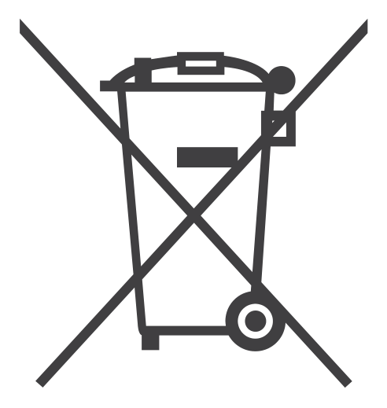
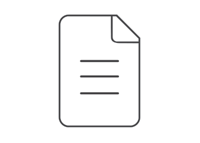
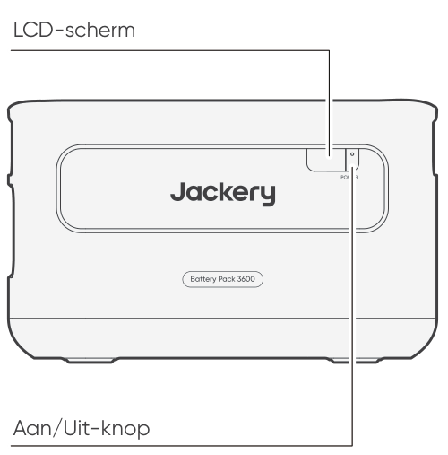
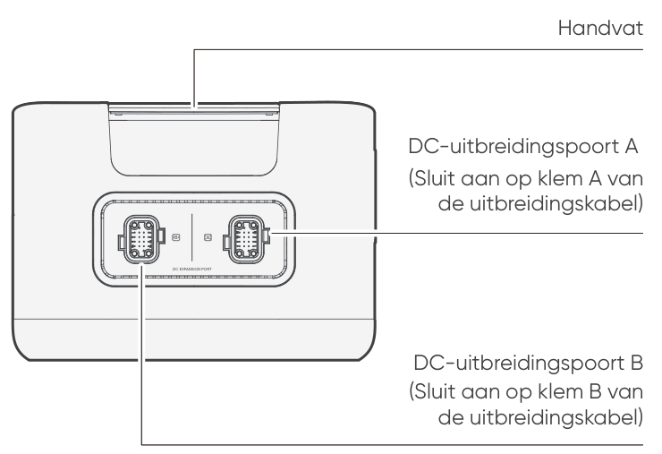
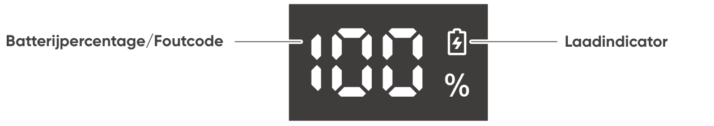

<strong>BELANGRIJK</strong>

Gefeliciteerd met uw nieuwe Jackery Battery Pack 3600. Lees deze handleiding goed door voordat u het product gebruikt. Neem vooral de relevante voorzorgsmaatregelen door om een correct gebruik te garanderen. Bewaar deze handleiding op een gemakkelijk bereikbare plaats, zodat u deze regelmatig kunt raadplegen.

Volgens de wet en regels heeft het bedrijf het laatste woord over de interpretatie van dit document en alle andere documenten die bij dit product horen.

Houd er rekening mee dat er bij een update, herziening of beëindiging geen verdere kennisgevingen volgen.

# BELANGRIJKE VEILIGHEIDSINFORMATIE

Bij het gebruik van dit product moeten de basisveiligheidsvoorschriften worden gevolgd, waaronder:

<ul class="simple">
<li>
Lees alle instructies voordat u dit product gebruikt.
</li>
<li>
Houd kinderen onder strikt toezicht bij gebruik van dit product om het risico te beperken.
</li>
<li>
Er bestaat een risico op elektrische schokken als accessoires worden aanbevolen of verkocht door niet-professionele productfabrikanten.
</li>
<li>
Haal de stekker uit de voedingsaansluiting van het product wanneer het product niet wordt gebruikt.
</li>
<li>
Demonteer het product niet, omdat dit kan leiden tot onvoorspelbare risico's zoals brand, explosie of elektrische schokken.
</li>
<li>
Gebruik het product niet met beschadigde snoeren, stekkers of uitgangskabels, omdat dit kan leiden tot een elektrische schok.
</li>
<li>
Laad het product op in een goed geventileerde ruimte en beperk de ventilatie op geen enkele manier.
</li>
<li>
Plaats het product op een geventileerde en droge plaats om te voorkomen dat regen en water elektrische schokken veroorzaken.
</li>
<li>
Stel het product niet bloot aan vuur of hoge temperaturen (zoals direct zonlicht of in voertuigen bij grote hitte), dit kan ongevallen zoals brand en explosie veroorzaken.
</li>
<li>
Als dit product gedurende langere tijd (3 maanden - 6 maanden) met een lege batterij wordt bewaard, kan het zijn dat het niet meer kan worden opgeladen.
</li>
</ul>

# BETEKENIS VAN SYMBOLEN

<figure aria-label="Symbool / Betekenis" class="hb-symbol-signal-composition" data-component-id="HB-TABLE-SYMBOL-SIGNAL"><table class="hb-symbol-signal-table"><colgroup><col class="hb-symbol-signal-col-label"/><col class="hb-symbol-signal-col-meaning"/></colgroup><thead><tr><th class="hb-symbol-signal-label-heading" scope="col">
Symbool
</th><th class="hb-symbol-signal-meaning-heading" scope="col">
Betekenis
</th></tr></thead><tbody><tr><td class="hb-symbol-signal-label-cell">⚠WAARSCHUWING</td><td class="hb-symbol-signal-meaning-cell">
Gevaarlijke handelingen die kunnen leiden tot ernstig letsel, overlijden en/of materiële schade.
</td></tr><tr><td class="hb-symbol-signal-label-cell">⚠OPGELET</td><td class="hb-symbol-signal-meaning-cell">
Gevaarlijke praktijken die kunnen leiden tot persoonlijk letsel en/of schade aan eigendommen.
</td></tr><tr><td class="hb-symbol-signal-label-cell">⚠OPMERKING</td><td class="hb-symbol-signal-meaning-cell">
Gevaarlijke praktijken die kunnen leiden tot schade aan apparatuur, gegevensverlies, slechtere prestaties of onverwachte resultaten.
</td></tr><tr><td class="hb-symbol-signal-label-cell">⚠TIP</td><td class="hb-symbol-signal-meaning-cell">
Vult de belangrijke informatie of bedieningstips in de tekst aan.
</td></tr></tbody></table></figure>

<figure aria-label="Symbool / Betekenis" class="hb-symbol-pair-composition" data-component-id="HB-TABLE-SYMBOL-ICON">

<table class="hb-symbol-panel-table"><colgroup><col class="hb-symbol-col-icon"/><col class="hb-symbol-col-meaning"/></colgroup><thead><tr><th class="hb-symbol-icon-heading" scope="col">
<strong>Symbool</strong>
</th><th class="hb-symbol-meaning-heading" scope="col">
<strong>Betekenis</strong>
</th></tr></thead><tbody><tr><td class="hb-symbol-icon"></td><td class="hb-symbol-meaning">
Waarschuwings- en voorzorgssymbolen. Moet worden gelezen om personen te waarschuwen voor mogelijke gevaren of risico's.
</td></tr><tr><td class="hb-symbol-icon"></td><td class="hb-symbol-meaning">
Lees de gebruikershandleiding voor gebruik.
</td></tr><tr><td class="hb-symbol-icon"></td><td class="hb-symbol-meaning">
Demonteer het product niet.
</td></tr><tr><td class="hb-symbol-icon"></td><td class="hb-symbol-meaning">
Houd het product uit de buurt van vuur.
</td></tr></tbody></table>

<table class="hb-symbol-panel-table"><colgroup><col class="hb-symbol-col-icon"/><col class="hb-symbol-col-meaning"/></colgroup><thead><tr><th class="hb-symbol-icon-heading" scope="col">
<strong>Symbool</strong>
</th><th class="hb-symbol-meaning-heading" scope="col">
<strong>Betekenis</strong>
</th></tr></thead><tbody><tr><td class="hb-symbol-icon"></td><td class="hb-symbol-meaning">
Houd het product buiten het bereik van kinderen.
</td></tr><tr><td class="hb-symbol-icon"></td><td class="hb-symbol-meaning">
Dit symbool geeft aan dat zich een lithium-ion (Li-ion) batterij in het product bevindt en dat deze op de juiste manier moet worden afgevoerd of gerecycled.
</td></tr><tr><td class="hb-symbol-icon"></td><td class="hb-symbol-meaning">
Dit symbool geeft aan dat het product niet als huishoudelijk afval mag worden weggegooid en naar een aangewezen inzamelingspunt voor recycling moet worden gebracht. Een juiste afvalverwerking en recycling dragen bij aan een beter milieu. Voor meer informatie over de verwijdering en recycling van dit product, neem contact op met uw gemeente, afvalverwerkingsdienst of leverancier.
</td></tr><tr><td class="hb-symbol-icon"></td><td class="hb-symbol-meaning">
Batterijen en accu's mogen niet bij het huishoudelijk afval worden weggegooid. Als consument bent u wettelijk verplicht om alle batterijen en accu's in te leveren bij daarvoor aangewezen inzamelpunten, ongeacht of ze gevaarlijke stoffen bevatten. Lever gebruikte batterijen en accu's in bij een plaatselijk inleverpunt, recyclingcentrum of bij de winkel waar u ze heeft gekocht. Een juiste afvalverwerking verzekert dat recycling op een milieuvriendelijke manier gebeurt en voorkomt mogelijke schade aan de menselijke gezondheid en het milieu.
</td></tr></tbody></table>

</figure>

# WAT ZIT ER IN DE DOOS

<figure aria-label="WAT ZIT ER IN DE DOOS" class="hb-inbox-composition" data-card-count="3" data-component-id="HB-SPECIAL-INBOX" data-inbox-variant="three-card-responsive"><ol class="hb-inbox-grid"><li class="hb-inbox-card" data-item-number="1">

<strong>Jackery Battery Pack 3600</strong>

</li><li class="hb-inbox-card" data-item-number="2">

<strong>Uitbreidingskabel</strong>

</li><li class="hb-inbox-card" data-item-number="3">

Gebruikershandleiding

</li></ol></figure>

# PRODUCTOVERZICHT

<section id="front-view">
<h2>VOORAANZICHT</h2>

</section>

<section id="left-side-view">
<h2>LINKERAANZICHT</h2>

</section>

# LCD-SCHERM

<figure aria-label="LCD-SCHERM" class="hb-reference-composition hb-reference-lcd-descriptions" data-component-id="HB-TABLE-REFERENCE" data-component-variant="lcd-descriptions" tabindex="0"><table class="hb-reference-table"><tbody><tr><td>
Batterijpercentage /Foutcode
</td><td>

De weergave toont het actuele batterijpercentage.

Wanneer het systeem faalt, wordt de bijbehorende foutcode F0-FF weergegeven. Als de foutcode FF verschijnt, verwijder dan de belastingen, zodat het product zichzelf kan herstellen. Zo niet, neem dan contact op met de klantenservice van Jackery. Als er een andere code verschijnt, neem dan contact op met onze klantenservice.

</td></tr><tr><td>
Laadindicator
</td><td>
De indicator wordt weergegeven tijdens het opladen en verdwijnt wanneer het product volledig is opgeladen.
</td></tr></tbody></table></figure>

# HANDELINGEN

<section id="power-on-off">
<h2>IN-/UITSCHAKELEN</h2>
<figure class="hb-operation-figure hb-operation-layout-status-right hb-base-art-live-copy" data-component-id="HB-SPECIAL-OPERATION" data-operation-id="main-power" data-source-fragment-sha256="8baafefcb2d8ad129ceff73723cfce75a144850d0ee213eff41a09f181b9320b" data-web-base-art-ref="power_native" data-web-presentation-mode="base-art-live-copy" data-web-replace-key="operation.main-power">

3s

<strong>Aan</strong>

Druk één keer

<strong>Uit</strong>

Houd 3 seconden ingedrukt.

</figure>
<table class="manual-callout-table" style="width:100%; border-collapse:collapse; margin:0 0 16px 0;"><tbody><tr><td class="manual-callout-label" style="width:16%; border:1px solid #000; padding:6px 8px; vertical-align:top;">
<strong>OPMERKING</strong>
</td><td class="manual-callout-body" style="border:1px solid #000; padding:6px 8px; vertical-align:top;">
Bij gebruik met de Jackery Explorer 3600 Plus kunt u de aan/uit-status van het Jackery Battery Pack 3600 bedienen via de hoofdschakelaar van de Jackery Explorer 3600 Plus.

Het product wordt automatisch uitgeschakeld als het gedurende 2 uur niet wordt opgeladen of als er geen belastingen zijn aangesloten.

</td></tr></tbody></table></section>

<section id="lcd-display-on-off">
<h2>LCD-SCHERM AAN/UIT</h2>

Wanneer u de hoofdschakelaar indrukt of het product oplaadt, wordt het LCD-scherm verlicht. Wanneer u er nogmaals op drukt, wordt het LCD-scherm uitgeschakeld.

</section>

# VERBINDINGEN

Er kunnen maximaal 5 sets van deze producten worden gebruikt, samen met de Jackery Explorer 3600 Plus, om aan de toegenomen capaciteitsbehoefte te voldoen.

<table class="manual-callout-table" style="width:100%; border-collapse:collapse; margin:0 0 16px 0;"><tbody><tr><td class="manual-callout-label" style="width:16%; border:1px solid #000; padding:6px 8px; vertical-align:top;">
<strong>OPGELET</strong>
</td><td class="manual-callout-body" style="border:1px solid #000; padding:6px 8px; vertical-align:top;">
Zorg ervoor dat alle producten zijn uitgeschakeld voordat u de Jackery Explorer 3600 Plus aansluit op het Jackery Battery Pack 3600.

Zorg voor een goede werking van het product door ervoor te zorgen dat de luchtinlaat- en uitlaatopeningen aan beide zijden niet geblokkeerd zijn. Houd minimaal 0,66 ft (≈200 mm) ruimte tussen de ventilatieopeningen en objecten voor een goede warmteafvoer.

</td></tr></tbody></table>

<figure class="hb-reference-figure hb-base-art-live-copy" data-component-id="HB-SPECIAL-REFERENCE-FIGURE" data-reference-id="clearance" data-source-fragment-sha256="a21a1413352dbbc3608e6632cee669e42b9a2487dad9926cd39f22cc1a6b6c0e" data-web-base-art-ref="clearance_native" data-web-presentation-mode="base-art-live-copy" data-web-replace-key="reference.clearance">

≥0,66 ft (≈200 mm)≥0,66 ft (≈200 mm)

</figure>

<table class="manual-callout-table" style="width:100%; border-collapse:collapse; margin:0 0 16px 0;"><tbody><tr><td class="manual-callout-label" style="width:16%; border:1px solid #000; padding:6px 8px; vertical-align:top;">
<strong>Opmerkingen</strong>
</td><td class="manual-callout-body" style="border:1px solid #000; padding:6px 8px; vertical-align:top;">
De weergave van het  -pictogram op het LCD-scherm (van de Jackery Explorer 3600 Plus) geeft aan dat de verbinding tussen het batterijpakket en de Jackery Explorer 3600 Plus succesvol is.

Stapel bij gebruik maximaal drie batterijpakketten in één toren om vallen en letsel te voorkomen.

Stapel het product niet bovenop de Jackery Explorer 3600 Plus.

</td></tr></tbody></table>

<figure class="hb-reference-figure hb-base-art-live-copy" data-component-id="HB-SPECIAL-REFERENCE-FIGURE" data-reference-id="locking" data-source-fragment-sha256="f2b8e6c1c29004bf89880c0bf53d26ffb58cc63e42d1db9ed2fa415455cf9d55" data-web-base-art-ref="locking_native" data-web-presentation-mode="base-art-live-copy" data-web-replace-key="reference.locking">

<strong>Vergrendelen</strong><strong>Ontgrendelen</strong>1212

</figure>

# PROBLEEMOPLOSSING

Als een van de volgende foutcodes verschijnt, volg dan de vermelde corrigerende acties om het probleem op te lossen. Als het probleem aanhoudt, neem dan contact op met Jackery-klantenondersteuning.

<figure aria-label="Foutcode / Oplossingsmaatregelen" class="hb-troubleshooting-composition" data-component-id="HB-TABLE-TROUBLESHOOTING" tabindex="0"><table class="hb-troubleshooting-table"><colgroup><col class="hb-troubleshooting-col-code"/><col class="hb-troubleshooting-col-measures"/></colgroup><thead><tr><th class="hb-troubleshooting-code" scope="col">
Foutcode
</th><th class="hb-troubleshooting-measures" scope="col">
Oplossingsmaatregelen
</th></tr></thead><tbody><tr><td class="hb-troubleshooting-code">
F0
</td><td class="hb-troubleshooting-measures">
Herstart het product.
</td></tr><tr><td class="hb-troubleshooting-code">
F1, F2
</td><td class="hb-troubleshooting-measures">
Neem contact op met de Jackery-klantenondersteuning.
</td></tr><tr><td class="hb-troubleshooting-code">
F3
</td><td class="hb-troubleshooting-measures">
Herstart het product.
</td></tr><tr><td class="hb-troubleshooting-code">
F4
</td><td class="hb-troubleshooting-measures">
Sluit het product aan op belastingen om de batterij te ontladen totdat de fout verdwijnt.
</td></tr><tr><td class="hb-troubleshooting-code">
F5
</td><td class="hb-troubleshooting-measures">
Laad het product op via zonnepanelen of een AC-stopcontact tot de fout verdwijnt.
</td></tr><tr><td class="hb-troubleshooting-code">
F6-F9, FA, FC, FE
</td><td class="hb-troubleshooting-measures">
Neem contact op met de Jackery-klantenondersteuning.
</td></tr><tr><td class="hb-troubleshooting-code">
FF
</td><td class="hb-troubleshooting-measures">
Plaats het product in een omgeving met de juiste temperatuur en wacht tot de fout verdwijnt.
</td></tr></tbody></table></figure>

# OPLADEN

<section id="charging-via-ac-wall-outlet">
<h2>OPLADEN VIA AC-STOPCONTACT</h2>

Bij het opladen via het stopcontact moet dit product worden gebruikt in combinatie met de Jackery Explorer 3600 Plus.

<table class="manual-callout-table" style="width:100%; border-collapse:collapse; margin:0 0 16px 0;"><tbody><tr><td class="manual-callout-label" style="width:16%; border:1px solid #000; padding:6px 8px; vertical-align:top;">
<strong>WAARSCHUWING</strong>
</td><td class="manual-callout-body" style="border:1px solid #000; padding:6px 8px; vertical-align:top;">
Zorg ervoor dat alle producten zijn uitgeschakeld voordat u de Jackery Explorer 3600 Plus aansluit op het Jackery Battery Pack 3600.
</td></tr></tbody></table>
</section>

<section id="charging-via-solar-panels-sold-separately">
<h2>OPLADEN VIA ZONNEPANELEN (APART VERKOCHT)</h2>

Laad uw product op met zonnepanelen en de Jackery Explorer 3600 Plus, zoals weergegeven in de onderstaande afbeelding. Raadpleeg de gebruikershandleiding van de Jackery Explorer 3600 Plus voor meer informatie.

</section>

# Opslag

Bewaar het product op een droge, schone plaats met goede ventilatie. Opslagtemperatuur en -vochtigheid:

<ul class="simple">
<li>
1 maand: -20°C tot 45°C (0-60%RH)
</li>
<li>
3 maanden: 0°C tot 45°C (0-60%RH)
</li>
<li>
12 maanden: 0°C tot 25°C (0-60%RH)
</li>
</ul>

Als dit product gedurende langere tijd (3 maanden - 6 maanden) met een lege batterij wordt bewaard, kan het zijn dat het niet meer kan worden opgeladen. Om dit te voorkomen en de batterij in goede conditie te houden, is het aan te raden om het product elke drie maanden te controleren en op te laden, waarbij minstens één keer per 6 tot 12 maanden een volledige laad- en ontlaadcyclus moet worden uitgevoerd.

# SPECIFICATIES

## ALGEMENE INFORMATIE

<figure aria-label="ALGEMENE INFORMATIE" class="hb-spec-table-composition"><table class="hb-spec-table manual-table manual-spec-table"><colgroup><col class="hb-spec-col-label"/><col class="hb-spec-col-value"/></colgroup>
<tbody>
<tr>
<th class="hb-spec-label manual-spec-label" scope="row">Productnaam</th>
<td class="hb-spec-value manual-spec-value">Jackery Battery Pack 3600</td>
</tr>
<tr>
<th class="hb-spec-label manual-spec-label" scope="row">Modelnummer</th>
<td class="hb-spec-value manual-spec-value">JBP-3600A</td>
</tr>
<tr>
<th class="hb-spec-label manual-spec-label" scope="row">Capaciteit</th>
<td class="hb-spec-value manual-spec-value">80 Ah/44,8 Vdc (3584 Wh)</td>
</tr>
<tr>
<th class="hb-spec-label manual-spec-label" scope="row">Celchemie</th>
<td class="hb-spec-value manual-spec-value">LiFePO₄</td>
</tr>
<tr>
<th class="hb-spec-label manual-spec-label" scope="row">Gewicht</th>
<td class="hb-spec-value manual-spec-value">Ongeveer 55,1 lbs/25 kg</td>
</tr>
<tr>
<th class="hb-spec-label manual-spec-label" scope="row">Afmetingen</th>
<td class="hb-spec-value manual-spec-value">14,8 x 12,5 x 9,0 in/37,5 x 31,7 x 22,9 cm</td>
</tr>
<tr>
<th class="hb-spec-label manual-spec-label" scope="row">Levenscyclus</th>
<td class="hb-spec-value manual-spec-value">6000 cycli tot 70%+ capaciteit</td>
</tr>
<tr>
<th class="hb-spec-label manual-spec-label" scope="row">IEC-code</th>
<td class="hb-spec-value manual-spec-value">IFpR41/136[14S4P]M/-20+40/90</td>
</tr>
</tbody>
</table></figure>

## INGANGS//UITGANGSPOORTEN

<figure aria-label="INGANGS//UITGANGSPOORTEN" class="hb-spec-table-composition"><table class="hb-spec-table manual-table manual-spec-table"><colgroup><col class="hb-spec-col-label"/><col class="hb-spec-col-value"/></colgroup>
<tbody>
<tr>
<th class="hb-spec-label manual-spec-label" scope="row">DC-uitbreidingspoort (ingang)</th>
<td class="hb-spec-value manual-spec-value">36,4 V-50,4 V⎓60 A Max</td>
</tr>
<tr>
<th class="hb-spec-label manual-spec-label" scope="row">DC-uitbreidingspoort (Uitgang)</th>
<td class="hb-spec-value manual-spec-value">36,4 V-50,4 V⎓100 A Max</td>
</tr>
</tbody>
</table></figure>

## BEDRIJFSTEMPERATUUR

<figure aria-label="BEDRIJFSTEMPERATUUR" class="hb-spec-table-composition"><table class="hb-spec-table manual-table manual-spec-table"><colgroup><col class="hb-spec-col-label"/><col class="hb-spec-col-value"/></colgroup>
<tbody>
<tr>
<th class="hb-spec-label manual-spec-label" scope="row">Oplaadtemperatuur</th>
<td class="hb-spec-value manual-spec-value">-20°C tot 45°C</td>
</tr>
<tr>
<th class="hb-spec-label manual-spec-label" scope="row">Ontlaadtemperatuur</th>
<td class="hb-spec-value manual-spec-value">-20°C tot 45°C</td>
</tr>
</tbody>
</table></figure>

# GARANTIE

<figure aria-label="GARANTIE" class="hb-warranty-intro-composition" data-component-id="HB-WARRANTY-LEAD">

<strong>We bieden onze garantie alleen aan klanten die aankopen bij de officiële Jackery-website, Jackery-merkplatformen van derden of lokale erkende dealers.</strong>

* De garantieperiode en -details kunnen variëren afhankelijk van lokale wetten, regelgeving en geautoriseerde dealers.

</figure>

<section class="warranty-section" id="limited-warranty">
<h2>Beperkte garantie</h2>
<figure aria-label="Beperkte garantie" class="hb-warranty-card" data-component-id="HB-WARRANTY-SECTION" data-warranty-card-index="1">
Jackery garandeert aan de oorspronkelijke consument-koper dat het Jackery-product vrij is van fabricage- en materiaalfouten bij normaal consumentengebruik gedurende de toepasselijke garantieperiode, zoals vermeld in de sectie 'Garantieperiode' hieronder, onder voorbehoud van de hieronder uiteengezette uitsluitingen.

In deze garantieverklaring worden de volledige en uitsluitende garantieverplichtingen van Jackery uiteengezet. Wij aanvaarden geen andere aansprakelijkheid, noch machtigen wij iemand om namens ons enige andere aansprakelijkheid te aanvaarden in verband met de verkoop van onze producten.
</figure>
</section>

<section class="warranty-section warranty-years" id="warranty-period">
<h2>Garantieperiode</h2>
<figure aria-label="Garantieperiode" class="hb-warranty-period-card" data-component-id="HB-WARRANTY-YEARS">

3
<strong class="hb-warranty-years-unit">JAAR</strong><strong class="hb-warranty-period-label">Standaardgarantie</strong>

De standaard garantieperiode voor het Jackery Battery Pack 3600 is 36 maanden. In alle gevallen gaat de garantieperiode in op de datum van aankoop door de oorspronkelijke consument-koper. Het aankoopbewijs van de eerste consument-koper, of ander redelijk documentair bewijs, is vereist om de startdatum van de garantieperiode vast te stellen.

2
<strong class="hb-warranty-years-unit">JAAR</strong><strong class="hb-warranty-period-label">Verlengde garantie</strong>

Om de garantieverlenging te activeren, moet u uw product online registreren of contact opnemen met onze klantenservice via <a class="reference external" href="mailto:hello.eu@jackery.com">hello.eu@jackery.com</a> om de duur van de standaardgarantie te verlengen.

</figure>
</section>

<section class="warranty-section" id="repair-or-replacement">
<h2>Reparatie of vervanging</h2>
<figure aria-label="Reparatie of vervanging" class="hb-warranty-card" data-component-id="HB-WARRANTY-SECTION" data-warranty-card-index="3">
Jackery repareert of vervangt (op kosten van Jackery) elk Jackery-product dat gedurende de toepasselijke garantieperiode niet functioneert als gevolg van een fabricage- of materiaalfout. Het gerepareerde of vervangen product neemt de resterende garantie over, gerekend vanaf de oorspronkelijke aankoopdatum.
</figure>
</section>

<section class="warranty-section" id="limited-to-original-consumer-buyer">
<h2>Beperkt tot de oorspronkelijke koper</h2>
<figure aria-label="Beperkt tot de oorspronkelijke koper" class="hb-warranty-card" data-component-id="HB-WARRANTY-SECTION" data-warranty-card-index="4">
De garantie op Jackery's product is beperkt tot de oorspronkelijke consument-koper en is niet overdraagbaar aan een volgende eigenaar.
</figure>
</section>

<section class="warranty-section" id="exclusions">
<h2>Uitsluitingen</h2>
<figure aria-label="Uitsluitingen" class="hb-warranty-card" data-component-id="HB-WARRANTY-SECTION" data-warranty-card-index="5">
De garantie van Jackery is niet van toepassing op:
<ul class="simple">
<li>
Onjuist gebruik, misbruik, wijziging, ongeluksschade of gebruik anders dan normaal consumentengebruik, zoals toegestaan in de huidige productliteratuur van Jackery.
</li>
<li>
Een poging tot reparatie door iemand anders dan een erkend servicecentrum.
</li>
<li>
Elk product dat via een online veilinghuis is gekocht.
</li>
<li>
De garantie van Jackery is niet van toepassing op de batterijcel, tenzij u de batterijcel binnen zeven dagen na aankoop van het product volledig oplaadt en daarna ten minste één keer per zes maanden.
</li>
</ul></figure>
</section>

<section class="warranty-section" id="interpretation-rights">
<h2>Interpretatierechten</h2>
<figure aria-label="Interpretatierechten" class="hb-warranty-card" data-component-id="HB-WARRANTY-SECTION" data-warranty-card-index="6">
Jackery behoudt zich het recht voor op definitieve interpretatie van het bovengenoemde after-salesbeleid voor klanten.
</figure>
</section>

# EU REGULATIONS

<section id="red-declaration-of-conformity">
<h2>RED DECLARATION OF CONFORMITY</h2>

Shenzhen Hello Tech Energy Co., Ltd. hereby declares that this Jackery Battery Pack 3600 with Bluetooth and Wi-Fi JBP-3600A is in compliance with the essential requirements and other relevant provisions of the RED Directive 2014/53/EU. The full text of the EU declaration of conformity is available at the following internet address:

<a class="reference external" href="https://de.jackery.com/pages/user-guides">https://de.jackery.com/pages/user-guides</a>

</section>

<section id="manufacturer">
<h2>MANUFACTURER</h2>

SHENZHEN HELLO TECH ENERGY CO., LTD.

Address: F2-3, Bldg. 7, Jiaanda Science and technology industrial park factory, the east side of Huafan Road, Tongsheng Community, Dalang Street, Longhua District, Shenzhen, Guangdong, China

+86 400 668 9293

<a class="reference external" href="mailto:sales@hello-tech.com">sales@hello-tech.com</a>

www.hello-tech.com

</section>
