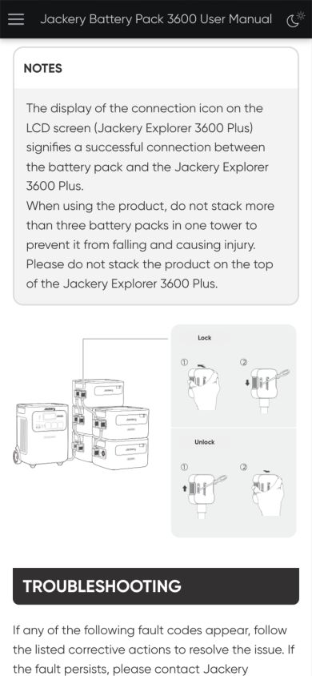
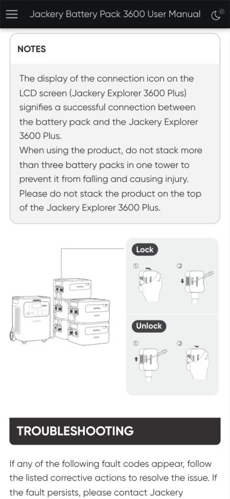
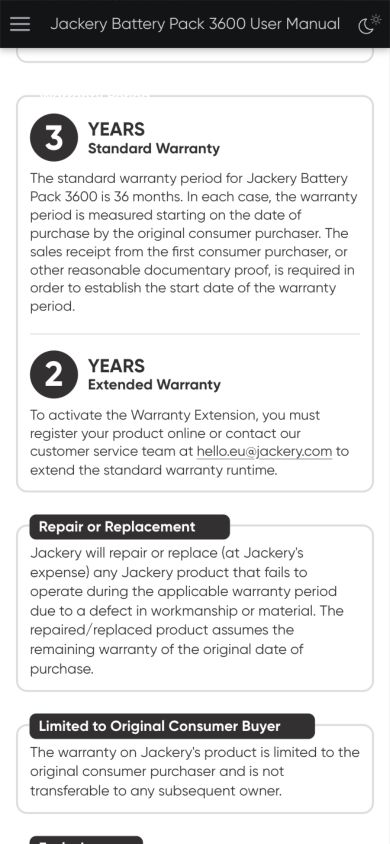
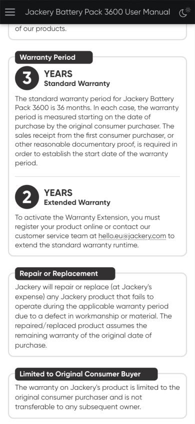

# JBP-3600A EU 候选确认材料

状态：仅供复核，未获英文新基线、原稿差异、语言准入或多语合并发布批准。已发布英文保持 `565c52a2d450d2b353e0186b22d0b230a2fb13ee`。

## 英文样式修订 r5

[候选预览](http://127.0.0.1:56059/en-web-r5/manual_jbp3600a_eu.html)、[固定 IR](web/en-r5/manual.ir.json)、[版本对照与21张图哈希](review/en-r5/comparison.json)、[浏览器测量](review/en-r5/browser-metrics.json)。

- IR SHA256：`7b9275e0b96d08e90f2c667caea47523ade27fcfa9258cdcaa23aaf88aacff03`
- HTML SHA256：`e0c89221a710785818534265dff0346e5ef160d61d083f73727d5e3f837b8f1f`
- CSS SHA256：`0319fe2d03c6963e47cec388fc0599910dcda39d39a5b530377a01a8d7425d87`

| 复核项 | 已发布英文 / 前一候选 | r5 候选行为 |
| --- | --- | --- |
| 锁扣文字 | 发布版手机文字约8px、浅底黑字 | 按原稿深底白字；手机最小14px，保留原引线和位置 |
| 普通章节跳转 | 发布版顶栏可遮挡手机标题；r4桌面仅24px留白 | 桌面64px；手机含顶栏共96px，避开 Back to top |
| 保修标题 | r4直接跳转时目标样式清空深色底，白字不可见；长标题可盖住正文 | 保留深底；手机标题参与排版，换行占据实际高度；卡片跳转112px留白 |
| 英文正文和插图 | 已发布原稿 | 三版可见正文一致；21张图哈希一致；r4/r5 Markdown逐字节一致 |

英文 r5 已通过1440×1000和390×844浏览器核验：21张图解码、无整页横向溢出、LCD两行两列、一个CSS时钟3s、六个保修标题与正文均无重叠。正常 `build.py md` 和严格 Sphinx 通过；封装Markdown在新目录构建得到相同HTML。这与八语候选的 frozen-IR 冷重放分开记录。

| 发布版手机锁扣 | r5手机锁扣 |
| --- | --- |
|  |  |

| r4保修直接跳转 | r5保修直接跳转 |
| --- | --- |
|  |  |

## 八语固定版本

所有语言的正文均来自各语原稿，没有按英文重译。FR r4、ES r2、DE r1、IT r1、UK r1、PT r1和NL r1独立内容和版面复核PASS；PL的独立原稿与视觉复核仍待完成。共用符号去底色属于单独后续，未由本轮候选验收认证。FR r4保持先前已封存CSS；其余七语使用r5候选CSS。

| 固定候选 | IR SHA256 | HTML SHA256 |
| --- | --- | --- |
| fr-r4 | `b92d4ac099bc0e0219705d76420ef40dfbcd435c258f458566a7bc8e54311390` | `a942b17d977324fade22a9c0d73fc0ec582f6e47769e92f98ee618f4068eea43` |
| es-r2 | `948f3aefddd1946b15724a579c40244cb3f3b241272b28afd6358802dc92491e` | `ea435f96c7d7a10302c597b5fd5042f49b6d146a0c3568ea80e51cf1164e9c48` |
| de-r1 | `aa0bc443e7b5f5779abe4bc357527c96f0f8085098ac0844848368772616407f` | `e76ad579cac6fbe22c9b7c32f3cb818fb26374ebe383e8d6c8a4ce8994a7501b` |
| it-r1 | `9a564c39fd42f537e8f8930eced3be793b4d71c07fe5f6a6cb1cf8e12162d375` | `8a435fb822e35f905ed24c2802477f7203c791e06d38eee77ab06e13ebafaa85` |
| uk-r1 | `ea452133014af357b5fc71a83d41caef7ca76a412cc078af334f12b96adb11db` | `dc2c0ccc70cd987b6628676981168da68e0f084fa8cda8dde6f3a2dc659c1707` |
| pt-r1 | `6ebd5988ec96e846d2278076d46b5dcdfd276fde628cb35f6119de8d45409ea6` | `c3683edd791fb497b80f427962a65e44820b9681ec412dd585989554da50df0c` |
| nl-r1 | `524e398604f4fd2add6fe3aa9ac42c7dea4fa39468d02a6ea9db0a832217c6c5` | `45549f8c51e045834a617fa8181497618c4bc38c2638460e9e5268614ab35bf8` |
| pl-r1 | `91e10c0b26f5bb87e3ce9efb74c25606e631bbed73857d5c0b701f6016f08b51` | `a69bf348da6c1aa8621999b69575bb1d0db20a2f9b8ddbd80abb82ac4f9d6095` |

[各语入口与独立报告](README.md)、[完整状态](review-status.json)。所有包和证据有各自manifest；不得覆盖封存目录，修改需新修订号。

意大利语独立验收提出的统计项 IT-META-001 已追加[计数勘误](review/copy-count-errata/README.md)，等待独立确认关闭：每语170个copy-map条目、169条evidence，另1项是保修徽标YEARS。所有旧报告和封存字节保留；此补充不改变内容验收或发布权限。

## 待确认的原稿差异

每语18张中性图沿用英文原字节，3张带本地标注的正面/左侧/LCD图来自各语原稿。裁剪页码、坐标及前后哈希位于 `copy-maps/<language>-artwork-exceptions.json`。另恢复原稿中的[共享×5连接图标](assets/shared/connection-x5-provenance.json)。这些都是候选差异，尚未进入批准的资产/语言配置。

- 德语：按原稿第31页保留手形禁止拆卸图标与 `Vermeiden Sie Hitze.`、禁火图标与 `Demontieren Sie das Produkt nicht.` 的原始配对，待人工决定是否作为原稿勘误；其他重复标题、英文残留、`C-Erweiterungsport B` 和 `≥≈200 mm` 已记录。
- 意大利语：保留 `Cavo di ricarica CA` 配拓展线图、`NFORMAZIONI`、`ucita`、`Temperatura di caricatra` 等原稿文字；保留额外 `1160A/860μs` 短路参数行。保修正文没有36个月句子，原稿3+2年徽标仍保留，未从英文补写。
- 法语/西语：原稿拼写与标点异常保留；法语 `Jackery Inc.` 权利文本保留。
- 葡语 `ON/Apagado`、荷语 `INGANGS//UITGANGSPOORTEN` 和波兰语公制优先的单位顺序保留。乌克兰语用 `uk`。
- 全语共用法规及制造商第79页在原稿即为英文，保持原文。WEEE有底杠图配设备处置，无底杠图配电池处置，未调换。

逐语原稿异常及证据见[状态记录](review-status.json)和 `review/<language>-source/source-copy-review.json`。结构试验通常9处差异，意大利语11处；CSS另行核验，不能把该试验称为零差异或基线批准。完成独立复核、人工确认和准入后，合并发布仍需另行授权。
