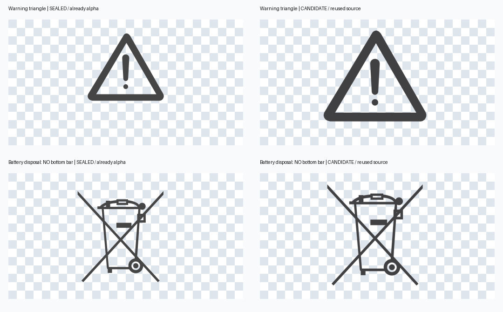

# JBP-3600A EU 新修订确认材料

Status: active

本轮完成本地候选修订和发布准备，未合并、发布、登记语言或提升资产注册表。原英语稿已由 [工程 PR1404](https://github.com/Bingboom/auto-manual/pull/1404) 与 [发布 PR170](https://github.com/Bingboom/Hello-Docs/pull/170) 上线：[英语正式页](https://ht-doc.readthedocs.io/JBP-3600A/EU/en/md/manual_jbp3600a_eu.html)。本页的 r6 等修订号是候选包标识，不是已发布版本号。

## 本轮精确变化

- 警告三角和无底杠电池回收符号换用提供的高分辨率透明素材，PNG 与输入逐字节一致。旧图也已有透明通道，所以本轮是透明素材复用提案，不能称为首次去掉旧图背景。新旧留白、分辨率及边缘像素不同，不宣称像素同一。
- 有底杠设备 WEEE 保留原字节；无底杠图仅用于电池处置。JBP 原稿最大连接 5 组，八语中的 ×5 图标保留原字节。HTE152 的 ×8 无外胶囊框，仅归档供其他型号复核，未进入任何 JBP 页面。
- 新英语 r6 沿用 r5 的锁扣深底白字、手机最小 14px、普通章节桌面 64px / 手机 96px 留白、保修标题换行和深色底。法语 r5 从旧 r4 样式同步到这份候选 CSS，其余八份 CSS 不变。
- 八语新包的 `style_contract_sha256` 改为实际候选契约哈希；旧值作为来源证据保留。这修复了前一候选修改锁扣契约后仍保留发布版哈希的问题，没有页面变化。
- 对各自前一封存版本，正文、表格、组件顺序、三张本地标注面板、原稿异常均不变。所有旧封存包与独立报告保持原字节。

[素材统计与来源](asset-inventory.json)、[历史封存哈希](historical-seals.json)、[本轮完整身份及检查](results.json)。图案相似度只是诊断，不是语义或批准门禁。

## 最终英语提案

[英语 r6 稳定预览](http://127.0.0.1:56059/en-r6/manual_jbp3600a_eu.html#meaning-of-symbols) · [IR](../../web/en-r6/manual.ir.json) · [差异记录](en-r6/comparison.json) · [桌面符号](en-r6/desktop-symbols.png) · [手机回收符号](en-r6/mobile-weee.png) · [CSS 时钟](en-r6/mobile-css-clock.png)。完整 SHA256 见本轮身份记录；本轮并未把 r6 提升为获批英语基线。

相对已发布英语，结构试验报告 10 个字段差异：两张图在组件与载体各出现一次（4），两个锁扣的颜色/底色（4），样式契约的两处哈希（2）。CSS 字节另验，不包含在该结构计数中。英文可见正文与前一候选相同。

## 九个可复核候选

| 语言 | 新候选预览 | 前一独立验收封存版 | 相对英语 r6 的结构字段差异 |
| --- | --- | --- | --- |
| 英语 | [en-r6](http://127.0.0.1:56059/en-r6/manual_jbp3600a_eu.html) | en-r5 为制作者核验提案 | 0（自比） |
| 法语 | [fr-r5](http://127.0.0.1:56059/fr-r5/manual_jbp3600a_eu_fr.html) | fr-r4 | 4 |
| 西语 | [es-r3](http://127.0.0.1:56059/es-r3/manual_jbp3600a_eu_es.html) | es-r2 | 4 |
| 德语 | [de-r2](http://127.0.0.1:56059/de-r2/manual_jbp3600a_eu_de.html) | de-r1 | 4 |
| 意语 | [it-r2](http://127.0.0.1:56059/it-r2/manual_jbp3600a_eu_it.html) | it-r1 | 6 |
| 乌克兰语 | [uk-r2](http://127.0.0.1:56059/uk-r2/manual_jbp3600a_eu_uk.html) | uk-r1 | 4 |
| 葡语 | [pt-r2](http://127.0.0.1:56059/pt-r2/manual_jbp3600a_eu_pt.html) | pt-r1 | 4 |
| 荷语 | [nl-r2](http://127.0.0.1:56059/nl-r2/manual_jbp3600a_eu_nl.html) | nl-r1 | 4 |
| 波语 | [pl-r2](http://127.0.0.1:56059/pl-r2/manual_jbp3600a_eu_pl.html) | pl-r1 | 4 |

通常 4 处是三张本地标注面板及 ×5 内联图；意语再多规格行在载体与组件各一处。相对已发布英语则是每语 14 处、意语 16 处。均为只读试验，不是“零差异”或批准。

## 这轮已验证的边界

九份均通过严格 Sphinx 构建、独立目录冷重建、实际资产哈希检查、渲染片段精确比较、桌面 1440×1000 与手机 390×844 定向核验。英语是封装 Markdown 冷重建；八语是 frozen-IR 冷重放后再构建。没有把英语误称为 frozen-IR 重放。每份冷重建的 Markdown / HTML 与原构建字节一致。

英语 21/21、八语各 22/22 图片解码；LCD 保持 2×2，CSS 时钟为 3s，八语 ×5 保留，无整页横向溢出，六个保修标题不盖正文。法语另验了桌面/手机普通章节锚点和手机长保修标题直接跳转。构建日志仅清理行末空格便于 Git 审查，原始输出同时保存在对应 `.original.log.gz` 中。截图和几何测量见各修订目录；[手机符号总览](mobile-symbols-contact-sheet.png)、[桌面回收图总览](desktop-weee-contact-sheet.png)。这些是本轮制作者的差量验证，**不重新声称 8/8 完整独立内容验收**；旧 8/8 报告继续绑定旧封存字节。

本轮未改共享代码逻辑，因此沿用既有 5075 测试 / 35 跳过与 36 项定向检查的历史证据；未重复整套单测。新数据只改变两张图、法语 CSS 和候选追溯绑定。

## 原稿差异待裁定

[逐语完整记录](../../REVIEW.md#待确认的原稿差异)和[源状态索引](../../review-status.json)继续有效。最少需要明确以下决定，不能把独立验收当成原稿勘误批准：

1. 德语原稿把禁止拆卸图配 `Vermeiden Sie Hitze.`、禁火图配 `Demontieren Sie das Produkt nicht.`。候选按原稿保留，需决定保留还是授权更正这组配对；若更正，必须另行形成可复核差量。
2. 意语拓展线原稿标 `Cavo di ricarica CA`，有额外 `1160A/860μs` 行，保修无 36 个月句子而保留 3+2 徽标。需确认原稿例外或给出改正依据。
3. 其他已列出的拼写/英文残留、PT `ON/Apagado`、NL `INGANGS//UITGANGSPOORTEN`、PL 公制优先及原稿英文法规页，继续按各语原稿保留。

## 真实发布阻断与依赖

[实时 Git/PR 快照](publication-dependencies.json)记录核查时刻和 SHA。新九份 fresh admission 的实际返回均为 `manual IR has pending source review`。单独查询八语 policy 的结果为 `prepared component applicability must be reviewed before publication: JBP-3600A/EU/<lang>`。英语 policy 的组件适用性试验无问题；它不能替代候选批准。未清除 pending 标记来获取通过结果。

- 英语 r6 的样式和两图复用尚未获操作者基线批准；八语原稿差异也未裁定。
- 八语未登记到准入契约，尚无本分支 PR。准备 PR 前要同步当前 main 并完成对应检查。核查时 main 已到 `3d42c538b2620e09ec250eaae8c85daa2031ed9e`，比本分支公共基线前进 14 个提交，Web 模块已迁至 `tools/web` 并删除旧入口；需要集成这个路径迁移后重新验证。
- [PR1409](https://github.com/Bingboom/auto-manual/pull/1409) 仍 OPEN，18 项检查成功，但未合入；本轮只读使用其英语基线比较实现，未导入分支。若按其英语继承门禁发布，应先完成该依赖的合入和基线登记。
- [PR1416](https://github.com/Bingboom/auto-manual/pull/1416) 仍 OPEN，18 项检查成功。它是共享素材复核参考，不是此次 JBP 构建的代码依赖，也不是自动资产提升授权。
- MA-234 只覆盖已经完成的 PR1404 及其英语发布。即使登记行尚显示“生效”，也不覆盖此处新英语修订或八语发布。后续需要明确的新批次合并发布授权及登记；本轮没有发起该操作。

## 最小操作者确认包与拟发布范围

先确认英语 r6 的实际页面和上述两张图，再裁定已列出的本地化例外；之后才可登记批准基线和八语适用性、同步主线、提交 PR、完成检查并单独确认九语合并发布范围。无需重做旧八语全文验收；任何裁定导致的新文字/图文配对变化须单独验证。

拟范围仅 `JBP-3600A/EU/{en,fr,es,de,it,uk,pt,nl,pl}`。英语使用现有规范网址；八语拟路由为 `https://ht-doc.readthedocs.io/JBP-3600A/EU/<lang>/md/manual_jbp3600a_eu_<lang>.html`，这些是待发布路由，不声称已经在线。正式版本号及冻结快照身份在获批后的发布准备阶段绑定，沿工程合入 → Hello-Docs 镜像同步 → `docs/publish/**` 发布 PR → RTD 提交回执 → 线上浏览器验收。Git-only 边界保持，不写飞书表、队列或 HTML_link。
