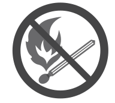
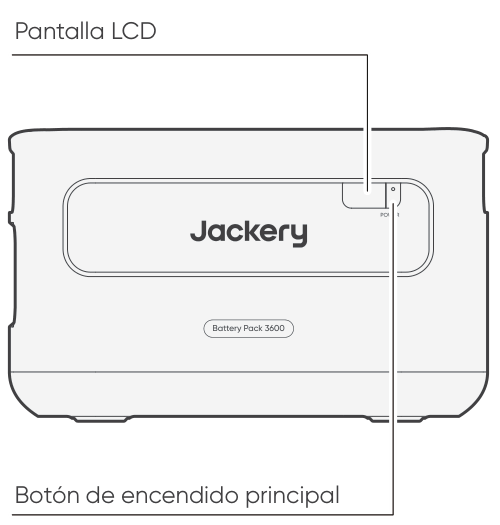
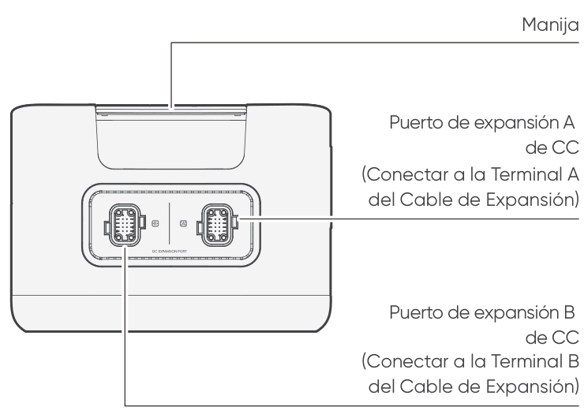

<strong>IMPORTANTE</strong>

Felicidades por su nuevo Jackery Battery Pack 3600. Lea atentamente este manual antes de utilizar el producto, en particular las precauciones pertinentes para garantizar un uso correcto. Guarde este manual en un lugar accesible para consultarlo con frecuencia.

En cumplimiento de las leyes y reglamentos, el derecho de interpretación final de este documento y de todos los documentos relacionados con este producto corresponde a la Empresa.

Tenga en cuenta que no se realizarán más notificaciones en caso de actualización, revisión o finalización.

# INFORMACIÓN IMPORTANTE DE SEGURIDAD

Se deben seguir las precauciones básicas de seguridad al utilizar este producto, incluyendo:

<ul class="simple">
<li>
Leer todas las instrucciones antes de utilizar este producto.
</li>
<li>
Se requiere una atenta supervisión cuando se utiliza este producto cerca de los niños para reducir el riesgo.
</li>
<li>
Puede haber riesgo de descarga eléctrica si se utilizan accesorios no recomendados o vendidos por fabricantes de productos no profesionales.
</li>
<li>
Cuando el producto no esté en uso, desconecte el enchufe del producto.
</li>
<li>
No desmonte el producto, ya que puede provocar riesgos imprevisibles como incendios, explosiones o descargas eléctricas.
</li>
<li>
No utilice el producto con cables o enchufes dañados, o con cables de salida dañados, ya que pueden provocar una descarga eléctrica.
</li>
<li>
Cargue el producto en un área bien ventilada y no restrinja la ventilación de ninguna manera.
</li>
<li>
Por favor, coloque el producto en un lugar ventilado y seco para evitar que la lluvia y el agua provoquen una descarga eléctrica.
</li>
<li>
No exponga el producto al fuego o a altas temperaturas (bajo la luz directa del sol o en un vehículo con mucho calor), ya que puede provocar accidentes como incendios y explosiones.
</li>
<li>
Si este producto se almacena durante un largo periodo de tiempo (3 a 6 meses) con la batería descargada, podría volverse imposible de recargar.
</li>
</ul>

# SIGNIFICADO DE LOS SÍMBOLOS

<figure aria-label="Símbolo / Significados" class="hb-symbol-signal-composition" data-component-id="HB-TABLE-SYMBOL-SIGNAL"><table class="hb-symbol-signal-table"><colgroup><col class="hb-symbol-signal-col-label"/><col class="hb-symbol-signal-col-meaning"/></colgroup><thead><tr><th class="hb-symbol-signal-label-heading" scope="col">
Símbolo
</th><th class="hb-symbol-signal-meaning-heading" scope="col">
Significados
</th></tr></thead><tbody><tr><td class="hb-symbol-signal-label-cell">⚠ADVERTENCIA</td><td class="hb-symbol-signal-meaning-cell">
Prácticas peligrosas que pueden resultar en lesiones graves, muerte y/o daños a la propiedad.
</td></tr><tr><td class="hb-symbol-signal-label-cell">⚠PRECAUCIÓN</td><td class="hb-symbol-signal-meaning-cell">
Prácticas peligrosas que pueden resultar en lesiones personales y/o daños a la propiedad.
</td></tr><tr><td class="hb-symbol-signal-label-cell">⚠NOTA</td><td class="hb-symbol-signal-meaning-cell">
Prácticas peligrosas que pueden resultar en daño al equipo, pérdida de datos, deterioro del rendimiento o resultados inesperados.
</td></tr><tr><td class="hb-symbol-signal-label-cell">⚠CONSEJOS</td><td class="hb-symbol-signal-meaning-cell">
Complementa la información importante o consejos de operación en el texto.
</td></tr></tbody></table></figure>

<figure aria-label="Símbolo / Significados" class="hb-symbol-pair-composition" data-component-id="HB-TABLE-SYMBOL-ICON">

<table class="hb-symbol-panel-table"><colgroup><col class="hb-symbol-col-icon"/><col class="hb-symbol-col-meaning"/></colgroup><thead><tr><th class="hb-symbol-icon-heading" scope="col">
<strong>Símbolo</strong>
</th><th class="hb-symbol-meaning-heading" scope="col">
<strong>Significados</strong>
</th></tr></thead><tbody><tr><td class="hb-symbol-icon"></td><td class="hb-symbol-meaning">
Precaución! El incumplimiento de los mensajes de advertencia puede provocar lesiones.
</td></tr><tr><td class="hb-symbol-icon"></td><td class="hb-symbol-meaning">
Lea el manual del operador
</td></tr><tr><td class="hb-symbol-icon"></td><td class="hb-symbol-meaning">
No desarme el producto.
</td></tr><tr><td class="hb-symbol-icon"></td><td class="hb-symbol-meaning">
No fumar ni hacer llamas abiertas
</td></tr></tbody></table>

<table class="hb-symbol-panel-table"><colgroup><col class="hb-symbol-col-icon"/><col class="hb-symbol-col-meaning"/></colgroup><thead><tr><th class="hb-symbol-icon-heading" scope="col">
<strong>Símbolo</strong>
</th><th class="hb-symbol-meaning-heading" scope="col">
<strong>Significados</strong>
</th></tr></thead><tbody><tr><td class="hb-symbol-icon"></td><td class="hb-symbol-meaning">
No se permiten niños
</td></tr><tr><td class="hb-symbol-icon"></td><td class="hb-symbol-meaning">
Este símbolo indica que el producto contiene una batería de iones de litio (Li-ion), la cual debe desecharse o reciclarse de forma adecuada.
</td></tr><tr><td class="hb-symbol-icon"></td><td class="hb-symbol-meaning">
Este símbolo indica que el producto no debe desecharse con los residuos domésticos. En su lugar, debe llevarse a un punto de recogida designado para su correcto reciclaje. El desecho y reciclaje adecuados ayudan a proteger el medioambiente. Para más información, póngase en contacto con su autoridad local, el servicio de gestión de residuos o el distribuidor del producto.
</td></tr><tr><td class="hb-symbol-icon"></td><td class="hb-symbol-meaning">
Las baterías y acumuladores no deben desecharse junto con los residuos domésticos. Como consumidor, usted está obligado por ley a desechar todas las baterías y acumuladores en los puntos de recolección designados, independientemente de si contienen sustancias peligrosas. Devuelva las baterías y acumuladores usados a un punto de recolección local, un centro de reciclaje o al minorista donde los compró. La eliminación adecuada garantiza un reciclaje responsable con el medio ambiente y evita posibles daños a la salud humana y al medio ambiente.
</td></tr></tbody></table>

</figure>

# CONTENIDO DE LA CAJA

<figure aria-label="CONTENIDO DE LA CAJA" class="hb-inbox-composition" data-card-count="3" data-component-id="HB-SPECIAL-INBOX" data-inbox-variant="three-card-responsive"><ol class="hb-inbox-grid"><li class="hb-inbox-card" data-item-number="1">

<strong>Jackery Battery Pack 3600</strong>

</li><li class="hb-inbox-card" data-item-number="2">

<strong>Cable de expansión</strong>

</li><li class="hb-inbox-card" data-item-number="3">

Manual de usuario

</li></ol></figure>

# DESCRIPCIÓN GENERAL DEL PRODUCTO

<section id="front-view">
<h2>VISTA FRONTAL</h2>

</section>

<section id="left-side-view">
<h2>VISTA LATERAL IZQUIERDA</h2>

</section>

# PANTALLA LCD

<figure aria-label="PANTALLA LCD" class="hb-reference-composition hb-reference-lcd-descriptions" data-component-id="HB-TABLE-REFERENCE" data-component-variant="lcd-descriptions" tabindex="0"><table class="hb-reference-table"><tbody><tr><td>
Porcentaje de potencia/Código de fallo
</td><td>

La potencia muestra el porcentaje del valor de potencia actual.

Cuando el sistema falla, se mostrará el correspondiente código de fallo F0-FF. Si aparece el código FF, retire la carga y el producto podrá recuperarse por sí mismo, si no, por favor contacte con atención al cliente de Jackery.En caso de que aparezca cualquier otro código, por favor contacte con atención al cliente.

</td></tr><tr><td>
Indicador de carga
</td><td>
Durante la carga se muestra el indicador y desaparece cuando está completamente cargado.
</td></tr></tbody></table></figure>

# OPERACIONES

<section id="power-on-off">
<h2>ENCENDIDO/APAGADO</h2>
<figure class="hb-operation-figure hb-operation-layout-status-right hb-base-art-live-copy" data-component-id="HB-SPECIAL-OPERATION" data-operation-id="main-power" data-source-fragment-sha256="e16e8b871273cd4be55fd3202c52cebfc363940193856bb76cf544c530ca837d" data-web-base-art-ref="power_native" data-web-presentation-mode="base-art-live-copy" data-web-replace-key="operation.main-power">

3s

<strong>Encendido</strong>

Presione una vez

<strong>Apagado</strong>

Mantén presionado durante 3 segundos

</figure>
<table class="manual-callout-table" style="width:100%; border-collapse:collapse; margin:0 0 16px 0;"><tbody><tr><td class="manual-callout-label" style="width:16%; border:1px solid #000; padding:6px 8px; vertical-align:top;">
<strong>NOTA</strong>
</td><td class="manual-callout-body" style="border:1px solid #000; padding:6px 8px; vertical-align:top;">
Cuando se usa con el Jackery Explorer 3600 Plus, se puede controlar el encendido o apagado del Jackery Battery Pack 3600 a través del "Botón de Encendido Principal" del Jackery Explorer 3600 Plus.

El producto se apagará automáticamente si no se carga o no se conectan cargos durante 2 horas.

</td></tr></tbody></table></section>

<section id="lcd-display-on-off">
<h2>ENCENDIDO/APAGADO DE LA PANTALLA LCD</h2>

Al pulsar el botón de encendido Principa o al cargar el producto, se enciende la pantalla LCD, y al pulsarlo de nuevo, se apagará la pantalla LCD.

</section>

# CONEXIONES

Se pueden usar hasta 5 juegos de estos productos junto con el Jackery Explorer 3600 Plus para cubrir las necesidades de mayor capacidad.

<table class="manual-callout-table" style="width:100%; border-collapse:collapse; margin:0 0 16px 0;"><tbody><tr><td class="manual-callout-label" style="width:16%; border:1px solid #000; padding:6px 8px; vertical-align:top;">
<strong>PRECAUCIÓN</strong>
</td><td class="manual-callout-body" style="border:1px solid #000; padding:6px 8px; vertical-align:top;">
Asegúrese de que todos los productos estén apagados antes de conectar el Explorer 3600 Plus al paquete de Jackery Battery Pack 3600.

Para asegurar el funcionamiento adecuado del producto, asegúrese de que las rejillas de entrada y salida de aire en ambos lados estén despejadas. Deje al menos 0,66 pies (200 mm) de espacio entre las rejillas y cualquier objeto para permitir una disipación de calor adecuada.

</td></tr></tbody></table>

<figure class="hb-reference-figure hb-base-art-live-copy" data-component-id="HB-SPECIAL-REFERENCE-FIGURE" data-reference-id="clearance" data-source-fragment-sha256="879a6a4053c624d9d458ed694c4431c6b56377b84b38ccfcd8c5f2926dcf4c92" data-web-base-art-ref="clearance_native" data-web-presentation-mode="base-art-live-copy" data-web-replace-key="reference.clearance">

≥0,66 pies (≈200 mm)≥0,66 pies (≈200 mm)

</figure>

<table class="manual-callout-table" style="width:100%; border-collapse:collapse; margin:0 0 16px 0;"><tbody><tr><td class="manual-callout-label" style="width:16%; border:1px solid #000; padding:6px 8px; vertical-align:top;">
<strong>Observaciones</strong>
</td><td class="manual-callout-body" style="border:1px solid #000; padding:6px 8px; vertical-align:top;">
La aparición del icono  en la pantalla LCD (Jackery Explorer 3600 Plus) indica que la conexión entre la batería y el Jackery Explorer 3600 Plus se ha realizado correctamente.

Al usar el producto, no apile más de tres paquetes de baterías en vertical para evitar que se caigan y causen lesiones.

No coloque el producto encima del Jackery Explorer 3600 Plus.

</td></tr></tbody></table>

<figure class="hb-reference-figure hb-base-art-live-copy" data-component-id="HB-SPECIAL-REFERENCE-FIGURE" data-reference-id="locking" data-source-fragment-sha256="963dc50f8724740edac0c7f025f320d4718a4c03edd48721fea5c35321a336d0" data-web-base-art-ref="locking_native" data-web-presentation-mode="base-art-live-copy" data-web-replace-key="reference.locking">

<strong>Bloquear</strong><strong>Desbloquear</strong>1212

</figure>

# RESOLUCIÓN DE PROBLEMAS

Si aparece alguno de los siguientes códigos de falla, siga las acciones correctivas listadas para resolver el problema.Si la falla persiste, por favor contacte con atención al cliente de Jackery.

<figure aria-label="Código de error / Medidas correctivas" class="hb-troubleshooting-composition" data-component-id="HB-TABLE-TROUBLESHOOTING" tabindex="0"><table class="hb-troubleshooting-table"><colgroup><col class="hb-troubleshooting-col-code"/><col class="hb-troubleshooting-col-measures"/></colgroup><thead><tr><th class="hb-troubleshooting-code" scope="col">
Código de error
</th><th class="hb-troubleshooting-measures" scope="col">
Medidas correctivas
</th></tr></thead><tbody><tr><td class="hb-troubleshooting-code">
F0
</td><td class="hb-troubleshooting-measures">
Reiniciar el producto.
</td></tr><tr><td class="hb-troubleshooting-code">
F1, F2
</td><td class="hb-troubleshooting-measures">
Contacte con atención al cliente de Jackery.
</td></tr><tr><td class="hb-troubleshooting-code">
F3
</td><td class="hb-troubleshooting-measures">
Reiniciar el producto.
</td></tr><tr><td class="hb-troubleshooting-code">
F4
</td><td class="hb-troubleshooting-measures">
Conecte el producto a cargas para descargar su batería hasta que la falla desaparezca.
</td></tr><tr><td class="hb-troubleshooting-code">
F5
</td><td class="hb-troubleshooting-measures">
Cargue el producto mediante paneles solares o toma de corriente CA hasta que la falla desaparezca.
</td></tr><tr><td class="hb-troubleshooting-code">
F6-F9, FA, FC, FE
</td><td class="hb-troubleshooting-measures">
Contacte con atención al cliente de Jackery.
</td></tr><tr><td class="hb-troubleshooting-code">
FF
</td><td class="hb-troubleshooting-measures">
Coloque el producto en un ambiente con temperatura adecuada y espere hasta que la falla desaparezca.
</td></tr></tbody></table></figure>

# CARGANDO

<section id="charging-via-ac-wall-outlet">
<h2>CARGA MEDIANTE UNA TOMA DE CORRIENTE DE PARED ALTERNA</h2>

Cuando se carga desde la red, este producto debe utilizarse con Jackery Explorer 3600 Plus.

<table class="manual-callout-table" style="width:100%; border-collapse:collapse; margin:0 0 16px 0;"><tbody><tr><td class="manual-callout-label" style="width:16%; border:1px solid #000; padding:6px 8px; vertical-align:top;">
<strong>Advertencia</strong>
</td><td class="manual-callout-body" style="border:1px solid #000; padding:6px 8px; vertical-align:top;">
Asegúrese de que todos los productos estén apagados antes de conectar el Explorer 3600 Plus al paquete de Battery Pack 3600.
</td></tr></tbody></table>
</section>

<section id="charging-via-solar-panels-sold-separately">
<h2>CARGA MEDIANTE PANELES SOLARES (SE VENDE POR SEPARADO)</h2>

Cargue su producto con paneles solares y el Jackery Explorer 3600 Plus como se muestra en la siguiente figura. Consulte el manual de usuario de Jackery Explorer 3600 Plus para obtener más información.

</section>

# ALMACENAMIENTO

Almacene el producto en un lugar seco y limpio con ventilación adecuada.Temperatura y humedad de almacenamiento:

<ul class="simple">
<li>
1 mes: -20 a 45 °C (0-60 % HR)
</li>
<li>
3 meses: 0 a 45 °C (0-60 % HR)
</li>
<li>
12 meses: 0 a 25 °C (0-60 % HR)
</li>
</ul>

Si este producto se almacena durante un período prolongado (de 3 a 6 meses) con la batería descargada, podría volverse imposible recargarlo. Para evitar esto y mantener la salud de la batería, se recomienda revisar y recargar el producto cada tres meses, y realizar un ciclo completo de carga y descarga al menos una vez cada 6 a 12 meses.

# ESPECIFICACIONES

## INFORMACIÓN GENERAL

<figure aria-label="INFORMACIÓN GENERAL" class="hb-spec-table-composition"><table class="hb-spec-table manual-table manual-spec-table"><colgroup><col class="hb-spec-col-label"/><col class="hb-spec-col-value"/></colgroup>
<tbody>
<tr>
<th class="hb-spec-label manual-spec-label" scope="row">Nombre del producto</th>
<td class="hb-spec-value manual-spec-value">Jackery Battery Pack 3600</td>
</tr>
<tr>
<th class="hb-spec-label manual-spec-label" scope="row">N° de modelo</th>
<td class="hb-spec-value manual-spec-value">JBP-3600A</td>
</tr>
<tr>
<th class="hb-spec-label manual-spec-label" scope="row">Capacidad</th>
<td class="hb-spec-value manual-spec-value">80Ah / 44,8Vdc (3584 Wh)</td>
</tr>
<tr>
<th class="hb-spec-label manual-spec-label" scope="row">Química Celular</th>
<td class="hb-spec-value manual-spec-value">LiFePO₄</td>
</tr>
<tr>
<th class="hb-spec-label manual-spec-label" scope="row">Peso</th>
<td class="hb-spec-value manual-spec-value">Aproximadamente 55.1 libras/25 kg</td>
</tr>
<tr>
<th class="hb-spec-label manual-spec-label" scope="row">Dimensiones</th>
<td class="hb-spec-value manual-spec-value">14,8 × 12,5 × 9,0 pulgadas / 37,5 × 31,7 × 22,9 cm</td>
</tr>
<tr>
<th class="hb-spec-label manual-spec-label" scope="row">Ciclo de vida</th>
<td class="hb-spec-value manual-spec-value">6000 ciclos de carga hasta 70 % + de capacidad</td>
</tr>
<tr>
<th class="hb-spec-label manual-spec-label" scope="row">Código IEC</th>
<td class="hb-spec-value manual-spec-value">IFpR41/136[14S4P]M/-20+40/90</td>
</tr>
</tbody>
</table></figure>

## PUERTOS DE ENTRADA/SALIDA

<figure aria-label="PUERTOS DE ENTRADA/SALIDA" class="hb-spec-table-composition"><table class="hb-spec-table manual-table manual-spec-table"><colgroup><col class="hb-spec-col-label"/><col class="hb-spec-col-value"/></colgroup>
<tbody>
<tr>
<th class="hb-spec-label manual-spec-label" scope="row">Puerto de Expansión de CC (Entrada)</th>
<td class="hb-spec-value manual-spec-value">36,4V-50,4V⎓60A Máx.</td>
</tr>
<tr>
<th class="hb-spec-label manual-spec-label" scope="row">Puerto de Expansión de CC (Salida)</th>
<td class="hb-spec-value manual-spec-value">36,4V-50,4V⎓100A Máx.</td>
</tr>
</tbody>
</table></figure>

## TEMPERATURA DE FUNCIONAMIENTO

<figure aria-label="TEMPERATURA DE FUNCIONAMIENTO" class="hb-spec-table-composition"><table class="hb-spec-table manual-table manual-spec-table"><colgroup><col class="hb-spec-col-label"/><col class="hb-spec-col-value"/></colgroup>
<tbody>
<tr>
<th class="hb-spec-label manual-spec-label" scope="row">Temperatura de carga</th>
<td class="hb-spec-value manual-spec-value">-20°C a 45°C</td>
</tr>
<tr>
<th class="hb-spec-label manual-spec-label" scope="row">Temperatura de descarga</th>
<td class="hb-spec-value manual-spec-value">-20°C a 45°C</td>
</tr>
</tbody>
</table></figure>

# GARANTÍA

<figure aria-label="GARANTÍA" class="hb-warranty-intro-composition" data-component-id="HB-WARRANTY-LEAD">

<strong>Solo ofrecemos nuestra garantía a clientes que compren en el sitio web oficial de Jackery, plataformas de terceros con la marca Jackery o distribuidores autorizados locales.</strong>

* El periodo de garantía y los detalles pueden variar según las leyes, regulaciones y distribuidores autorizados locales.

</figure>

<section class="warranty-section" id="limited-warranty">
<h2>Garantía limitada</h2>
<figure aria-label="Garantía limitada" class="hb-warranty-card" data-component-id="HB-WARRANTY-SECTION" data-warranty-card-index="1">
Jackery garantiza al consumidor original que el producto Jackery estará libre de defectos relativos al acabado y a los materiales en condiciones normales de uso por parte del consumidor durante el período de garantía aplicable identificado en la sección "Período de garantía" que figura a continuación, sujeto a las exclusiones que se establecen a continuación.

Esta declaración de garantía establece la obligación de garantía total y exclusiva de Jackery. No asumiremos ni autorizaremos que ninguna persona asuma por nosotros ninguna otra responsabilidad en relación con la venta de nuestros productos.
</figure>
</section>

<section class="warranty-section warranty-years" id="warranty-period">
<h2>Período de garantía</h2>
<figure aria-label="Período de garantía" class="hb-warranty-period-card" data-component-id="HB-WARRANTY-YEARS">

3
<strong class="hb-warranty-years-unit">AÑOS</strong><strong class="hb-warranty-period-label">Garantía Estándar</strong>

El periodo de garantía estándar de Jackery Battery Pack 3600 es de 36 meses. En cada caso, el período de garantía se mide a partir de la fecha de compra por parte del comprador consumidor original. Para establecer la fecha de inicio del período de garantía, se necesita el recibo de venta de la primera compra del consumidor u otra prueba documental razonable.

2
<strong class="hb-warranty-years-unit">AÑOS</strong><strong class="hb-warranty-period-label">Garantía extendida</strong>

Para activar la extensión de garantia,debe registrar su producto en línea oponerse en contacto con nuestro equipo de atención al cliente en <a class="reference external" href="mailto:hello.eu@jackery.com">hello.eu@jackery.com</a> para ampliar laduración de la garantia estándar.

</figure>
</section>

<section class="warranty-section" id="repair-or-replacement">
<h2>Reparación o reemplazo</h2>
<figure aria-label="Reparación o reemplazo" class="hb-warranty-card" data-component-id="HB-WARRANTY-SECTION" data-warranty-card-index="3">
Jackery reparará o reemplazará (a cargo de Jackery) cualquier producto Jackery que no funcione durante el periodo de garantía aplicable debido a defectos en la mano de obra o el material. El producto reparado o reemplazado asumirá el periodo restante de lagarantía desde la fecha original de compra.
</figure>
</section>

<section class="warranty-section" id="limited-to-original-consumer-buyer">
<h2>Limitado al comprador consumidor original</h2>
<figure aria-label="Limitado al comprador consumidor original" class="hb-warranty-card" data-component-id="HB-WARRANTY-SECTION" data-warranty-card-index="4">
La garantía del producto de Jackery se limita al consumidor original y no es transferible a ningún propietario posterior.
</figure>
</section>

<section class="warranty-section" id="exclusions">
<h2>Exclusiones</h2>
<figure aria-label="Exclusiones" class="hb-warranty-card" data-component-id="HB-WARRANTY-SECTION" data-warranty-card-index="5">
La garantía de Jackery no se aplica a:
<ul class="simple">
<li>
Mal uso, abuso, modificación, daño por accidente, o uso para cualquier cosa que no sea el uso normal del consumidor según lo autorizado en los folletos actuales del producto de Jackery.
</li>
<li>
Intento de reparación por cualquier persona que no sea un centro autorizado.
</li>
<li>
Cualquier producto adquirido a través de una casa de subastas en línea.
</li>
<li>
La garantía de Jackery no se aplica a la célula de la batería a menos que usted la cargue completamente en los siete días siguientes a la compra del producto y, a partir de entonces, al menos una vez cada 6 meses.
</li>
</ul></figure>
</section>

<section class="warranty-section" id="interpretation-rights">
<h2>Derechos de interpretación</h2>
<figure aria-label="Derechos de interpretación" class="hb-warranty-card" data-component-id="HB-WARRANTY-SECTION" data-warranty-card-index="6">
Jackery se reserva el derecho a la interpretación final de la política posventa de los clientes anterior.
</figure>
</section>

# EU REGULATIONS

<section id="red-declaration-of-conformity">
<h2>RED DECLARATION OF CONFORMITY</h2>

Shenzhen Hello Tech Energy Co., Ltd. hereby declares that this Jackery Battery Pack 3600 with Bluetooth and Wi-Fi JBP-3600A is in compliance with the essential requirements and other relevant provisions of the RED Directive 2014/53/EU. The full text of the EU declaration of conformity is available at the following internet address:

<a class="reference external" href="https://de.jackery.com/pages/user-guides">https://de.jackery.com/pages/user-guides</a>

</section>

<section id="manufacturer">
<h2>MANUFACTURER</h2>

SHENZHEN HELLO TECH ENERGY CO., LTD.

Address: F2-3, Bldg. 7, Jiaanda Science and technology industrial park factory, the east side of Huafan Road, Tongsheng Community, Dalang Street, Longhua District, Shenzhen, Guangdong, China

+86 400 668 9293

<a class="reference external" href="mailto:sales@hello-tech.com">sales@hello-tech.com</a>

www.hello-tech.com

</section>
