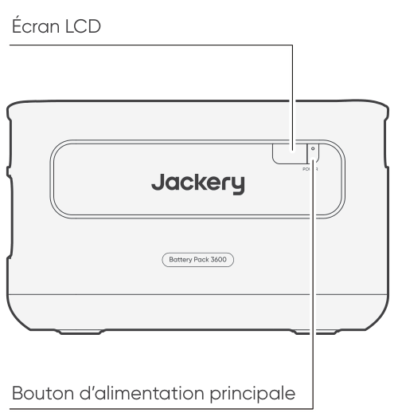
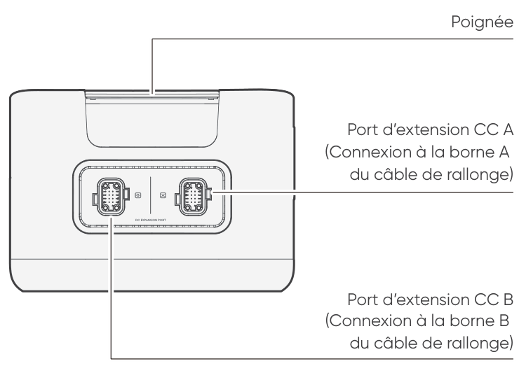
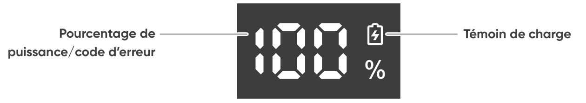
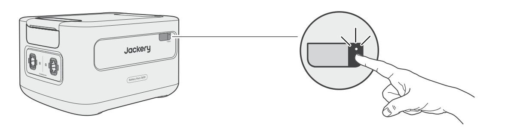
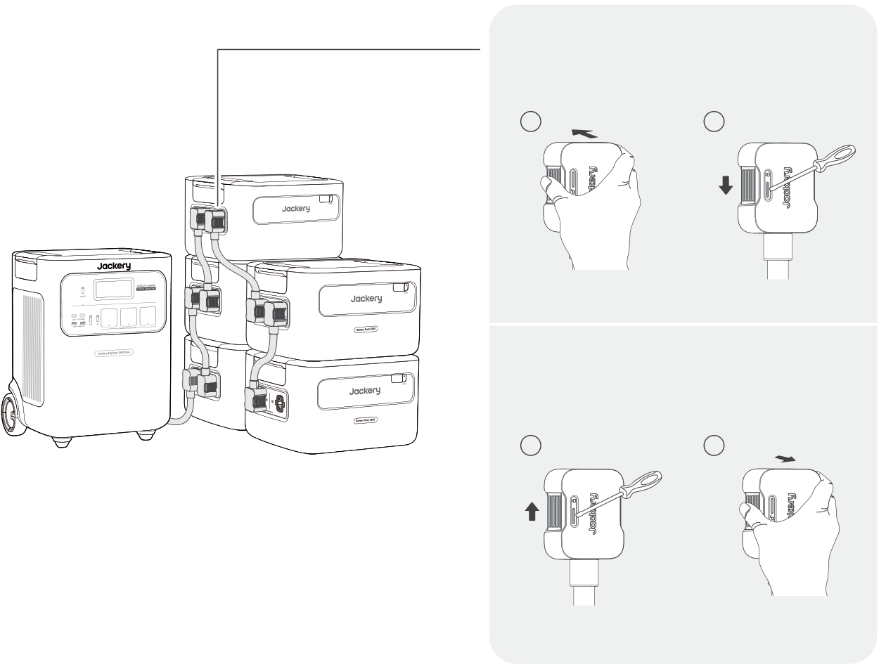

<strong>IMPORTANT</strong>

Félicitations d’avoir fait l’acquisition du nouveau Jackery Battery Pack 3600. Veuillez lire attentivement ce manuel avant d’utiliser le dispositif, en particulier les précautions à prendre afin de garantir une bonne utilisation. Conservez ce manuel dans un endroit accessible pour pouvoir vous y référer fréquemment.

Conformément aux lois et réglementations, le droit d’interprétation finale de ce document et de tous les documents relatifs à ce produit appartient à l’entreprise.

Veuillez noter qu’aucune autre notification ne sera donnée en cas de mise à jour, de révision ou de résiliation.

# INFORMATIONS DE SÉCURITÉ IMPORTANTES

Les précautions de base doivent être respectées lors de l'utilisation de ce produit, y compris :

<ul class="simple">
<li>
Veuillez lire toutes les instructions avant d'utiliser ce produit.
</li>
<li>
Une surveillance délicate est nécessaire lors de l'utilisation de ce produit à proximité d'enfants afin de réduire les risques.
</li>
<li>
L'utilisation d'accessoires recommandés ou vendus par des fabricants de produits non professionnels peut entraîner un risque d'électrocution.
</li>
<li>
Lorsque le produit n'est pas utilisé, veuillez débrancher l'alimentation de la prise du produit.
</li>
<li>
Ne pas démonter le produit, ce qui pourrait entraîner des risques imprévisibles tels qu'un incendie, une explosion ou un choc électrique.
</li>
<li>
N'utilisez pas le produit avec des cordons ou des prises endommagés, ou des câbles de sortie endommagés, ce qui pourrait provoquer un choc électrique.
</li>
<li>
Charger le produit dans un endroit bien ventilé et ne pas restreindre la ventilation de quelque manière que ce soit.
</li>
<li>
Placez le produit dans un endroit ventilé et sec afin d'éviter que la pluie et l'eau ne provoquent un choc électrique.
</li>
<li>
N'exposez pas le produit au feu ou à des températures élevées (sous la lumière directe du soleil ou dans un véhicule soumis à une forte chaleur), ce qui pourrait provoquer des accidents tels qu'un incendie ou une explosion.
</li>
<li>
Si ce produit est stocké pendant une longue période (3 mois - 6 mois) alors qu'il n'est plus alimenté, il pourrait même devenir impossible à recharger.
</li>
</ul>

# SIGNIFICATION DES SYMBOLES

<figure aria-label="Symbole / Signification" class="hb-symbol-signal-composition" data-component-id="HB-TABLE-SYMBOL-SIGNAL"><table class="hb-symbol-signal-table"><colgroup><col class="hb-symbol-signal-col-label"/><col class="hb-symbol-signal-col-meaning"/></colgroup><thead><tr><th class="hb-symbol-signal-label-heading" scope="col">
Symbole
</th><th class="hb-symbol-signal-meaning-heading" scope="col">
Signification
</th></tr></thead><tbody><tr><td class="hb-symbol-signal-label-cell">⚠AVERTISSEMENT</td><td class="hb-symbol-signal-meaning-cell">
Pratiques dangereuses pouvant entraîner des blessures graves, la mort et/ou des dommages matériels.
</td></tr><tr><td class="hb-symbol-signal-label-cell">⚠ATTENTION</td><td class="hb-symbol-signal-meaning-cell">
Pratiques dangereuses pouvant entraîner des blessures corporelles et/ou des dommages matériels.
</td></tr><tr><td class="hb-symbol-signal-label-cell">⚠REMARQUE</td><td class="hb-symbol-signal-meaning-cell">
Pratiques dangereuses pouvant entraîner des dommages à l'équipement, une perte de données, une détérioration des performances ou des résultats inattendus.
</td></tr><tr><td class="hb-symbol-signal-label-cell">⚠CONSEILS</td><td class="hb-symbol-signal-meaning-cell">
Complémente les informations importantes ou les conseils d'utilisation dans le texte.
</td></tr></tbody></table></figure>

<figure aria-label="Symbole / Signification" class="hb-symbol-pair-composition" data-component-id="HB-TABLE-SYMBOL-ICON">

<table class="hb-symbol-panel-table"><colgroup><col class="hb-symbol-col-icon"/><col class="hb-symbol-col-meaning"/></colgroup><thead><tr><th class="hb-symbol-icon-heading" scope="col">
<strong>Symbole</strong>
</th><th class="hb-symbol-meaning-heading" scope="col">
<strong>Signification</strong>
</th></tr></thead><tbody><tr><td class="hb-symbol-icon"></td><td class="hb-symbol-meaning">
Mlise en garde! Le non-respect des messages d'avertissement peut entraîner des blessures.
</td></tr><tr><td class="hb-symbol-icon"></td><td class="hb-symbol-meaning">
Lire le manuel de l'opérateur
</td></tr><tr><td class="hb-symbol-icon"></td><td class="hb-symbol-meaning">
Ne démontez pas le produit.
</td></tr><tr><td class="hb-symbol-icon"></td><td class="hb-symbol-meaning">
Ne pas fumer ni utiliser de flamme nue
</td></tr></tbody></table>

<table class="hb-symbol-panel-table"><colgroup><col class="hb-symbol-col-icon"/><col class="hb-symbol-col-meaning"/></colgroup><thead><tr><th class="hb-symbol-icon-heading" scope="col">
<strong>Symbole</strong>
</th><th class="hb-symbol-meaning-heading" scope="col">
<strong>Signification</strong>
</th></tr></thead><tbody><tr><td class="hb-symbol-icon"></td><td class="hb-symbol-meaning">
Les enfants ne sont pas admis
</td></tr><tr><td class="hb-symbol-icon"></td><td class="hb-symbol-meaning">
Ce symbole indique que le produit contient une batterie lithium-ion (Li-ion), qui doit être éliminée ou recyclée de manière appropriée.
</td></tr><tr><td class="hb-symbol-icon"></td><td class="hb-symbol-meaning">
Ce symbole indique que le produit ne doit pas être jeté avec les ordures ménagères. Il doit être apporté à un point de collecte désigné pour un recyclage approprié. Une élimination et un recyclage corrects contribuent à la protection de l’environnement. Pour plus d’informations, veuillez contacter votre autorité locale, le service de gestion des déchets ou le revendeur du produit.
</td></tr><tr><td class="hb-symbol-icon"></td><td class="hb-symbol-meaning">
Les piles et accumulateurs ne doivent pas être jetés avec les ordures ménagères. En tant que consommateur, vous êtes légalement tenu de déposer toutes les piles et accumulateurs dans des points de collecte désignés, qu'ils contiennent ou non des substances dangereuses. Veuillez rapporter les piles et accumulateurs usagés à un point de collecte local, un centre de recyclage ou au détaillant où ils ont été achetés. Une élimination appropriée garantit un recyclage respectueux de l'environnement et prévient les dommages potentiels pour la santé humaine et l'environnement.
</td></tr></tbody></table>

</figure>

# CONTENU DE LA BOÎTE

<figure aria-label="CONTENU DE LA BOÎTE" class="hb-inbox-composition" data-card-count="3" data-component-id="HB-SPECIAL-INBOX" data-inbox-variant="three-card-responsive"><ol class="hb-inbox-grid"><li class="hb-inbox-card" data-item-number="1">

<strong>Jackery Battery Pack 3600</strong>

</li><li class="hb-inbox-card" data-item-number="2">

<strong>Câble de rallonge</strong>

</li><li class="hb-inbox-card" data-item-number="3">

Manuel d’utilisation

</li></ol></figure>

# APERÇU DU PRODUIT

<section id="front-view">
<h2>VUE DE FACE</h2>

</section>

<section id="left-side-view">
<h2>VUE LATÉRALE GAUCHE</h2>

</section>

# AFFICHAGE LCD

<figure aria-label="AFFICHAGE LCD" class="hb-reference-composition hb-reference-lcd-descriptions" data-component-id="HB-TABLE-REFERENCE" data-component-variant="lcd-descriptions" tabindex="0"><table class="hb-reference-table"><tbody><tr><td>
Pourcentage de puissance/code d’erreur
</td><td>

L’affichage de la puissance représente le pourcentage de la valeur actuelle de la puissance.

En cas de défaillance du système, le code d’erreur correspondant (F0-FF) s’affiche. Si le code FF s’affiche, retirez la charge et le dispositif peut se rétablir de lui-même. Si ce n'est pas le cas, veuillez contacter le service à la clientèle de Jackery. Si un autre code apparaît, veuillez contacter notre service à la clientèle.

</td></tr><tr><td>
Témoin de charge
</td><td>
Le témoin s’affiche pendant la charge et disparaît lorsque l’appareil est complètement chargé.
</td></tr></tbody></table></figure>

# FONCTIONNEMENT

<section id="power-on-off">
<h2>MARCHE/ARRÊT</h2>
<figure class="hb-operation-figure hb-operation-layout-status-right hb-base-art-live-copy" data-component-id="HB-SPECIAL-OPERATION" data-operation-id="main-power" data-source-fragment-sha256="015517431c1253ed72277b2710d06aff2985bd288fccf421ef207da84af1162e" data-web-base-art-ref="power_native" data-web-presentation-mode="base-art-live-copy" data-web-replace-key="operation.main-power">

3s

<strong>Marche</strong>

Appuyez une fois

<strong>Arrêt</strong>

Appuyez et maintenez pendant 3 secondes

</figure>
<table class="manual-callout-table" style="width:100%; border-collapse:collapse; margin:0 0 16px 0;"><tbody><tr><td class="manual-callout-label" style="width:16%; border:1px solid #000; padding:6px 8px; vertical-align:top;">
<strong>Remarques</strong>
</td><td class="manual-callout-body" style="border:1px solid #000; padding:6px 8px; vertical-align:top;">
Lorsque vous utilisez le Jackery Explorer 3600 Plus, vous pouvez contrôler la mise sous tension ou hors tension du Jackery Battery Pack 3600 via le « bouton d’alimentation principale » du Jackery Explorer 3600 Plus.

Le dispositif s’éteint automatiquement s’il n’est pas chargé ou si aucune charge n’est connectée pendant 2 heures.

</td></tr></tbody></table></section>

<section id="lcd-display-on-off">
<h2>ACTIVATION/DÉSACTIVATION DE L’ÉCRAN LCD</h2>

Lorsque vous appuyez sur le « bouton d’alimentation principale » ou lorsque vous chargez le produit, l’écran LCD s’allume, et lorsque vous appuyez à nouveau sur ce bouton, l’écran LCD s’éteint.

</section>

# CONNEXIONS

Pour répondre à des besoins de capacité accrue, jusqu’à 5 dispositifs peuvent être utilisés avec le Jackery Explorer 3600 Plus.

<table class="manual-callout-table" style="width:100%; border-collapse:collapse; margin:0 0 16px 0;"><tbody><tr><td class="manual-callout-label" style="width:16%; border:1px solid #000; padding:6px 8px; vertical-align:top;">
<strong>Important</strong>
</td><td class="manual-callout-body" style="border:1px solid #000; padding:6px 8px; vertical-align:top;">
Assurez-vous que tous les produits sont éteints avant de connecter le Explorer 3600 Plus au(x) Jackery Battery Pack 3600.

Pour assurer le bon fonctionnement du produit, assurez-vous que les entrées et sorties d'air sur les deux côtés ne sont pas obstruées. Laissez un espace d'au moins 0,66 pied (200 mm) entre les ouvertures et tout objet pour permettre une dissipation thermique adéquate.

</td></tr></tbody></table>

<figure class="hb-reference-figure hb-base-art-live-copy" data-component-id="HB-SPECIAL-REFERENCE-FIGURE" data-reference-id="clearance" data-source-fragment-sha256="f9911423cd79fdd13ab26ec155551c97dbe0bd70fc302692f34547ce91684927" data-web-base-art-ref="clearance_native" data-web-presentation-mode="base-art-live-copy" data-web-replace-key="reference.clearance">

≥0,66 pied (≈200 mm)≥0,66 pied (≈200 mm)

</figure>

<table class="manual-callout-table" style="width:100%; border-collapse:collapse; margin:0 0 16px 0;"><tbody><tr><td class="manual-callout-label" style="width:16%; border:1px solid #000; padding:6px 8px; vertical-align:top;">
<strong>Remarques</strong>
</td><td class="manual-callout-body" style="border:1px solid #000; padding:6px 8px; vertical-align:top;">
L’apparition de l’icône  sur l’écran LCD (Jackery Explorer 3600 Plus) signifie que la connexion entre l’unité de batterie et le Jackery Explorer 3600 Plus est réussie.

Lors de l'utilisation du produit, ne superposez pas plus de trois blocs-batterie dans une même tour pour éviter qu'ils ne tombent et ne causent des blessures.

Veuillez ne pas empiler le dispositif sur le Jackery Explorer 3600 Plus.

</td></tr></tbody></table>

<figure class="hb-reference-figure hb-base-art-live-copy" data-component-id="HB-SPECIAL-REFERENCE-FIGURE" data-reference-id="locking" data-source-fragment-sha256="647292bcd8857ee4dcb7e27c391b7317a19e07943c0ccacf4cb5fe4b00035545" data-web-base-art-ref="locking_native" data-web-presentation-mode="base-art-live-copy" data-web-replace-key="reference.locking">

<strong>Verrouiller</strong><strong>Déverrouiller</strong>1212

</figure>

# DÉPANNAGE

Si l'un des codes d'erreur suivants apparaît, suivez les actions correctives indiquées pour résoudre le problème.Si l'erreur persiste, veuillez contacter le service à la clientèle de Jackery.

<figure aria-label="Code d'erreur / Mesures correctives" class="hb-troubleshooting-composition" data-component-id="HB-TABLE-TROUBLESHOOTING" tabindex="0"><table class="hb-troubleshooting-table"><colgroup><col class="hb-troubleshooting-col-code"/><col class="hb-troubleshooting-col-measures"/></colgroup><thead><tr><th class="hb-troubleshooting-code" scope="col">
Code d'erreur
</th><th class="hb-troubleshooting-measures" scope="col">
Mesures correctives
</th></tr></thead><tbody><tr><td class="hb-troubleshooting-code">
F0
</td><td class="hb-troubleshooting-measures">
Redémarrez le produit.
</td></tr><tr><td class="hb-troubleshooting-code">
F1, F2
</td><td class="hb-troubleshooting-measures">
Contacter le service à la clientèle de Jackery.
</td></tr><tr><td class="hb-troubleshooting-code">
F3
</td><td class="hb-troubleshooting-measures">
Redémarrez le produit.
</td></tr><tr><td class="hb-troubleshooting-code">
F4
</td><td class="hb-troubleshooting-measures">
Connectez le produit à des charges pour décharger sa batterie jusqu'à ce que l'erreur disparaisse.
</td></tr><tr><td class="hb-troubleshooting-code">
F5
</td><td class="hb-troubleshooting-measures">
Chargez le produit via des panneaux solaires ou une prise murale CA jusqu'à ce que l'erreur disparaisse.
</td></tr><tr><td class="hb-troubleshooting-code">
F6-F9, FA, FC, FE
</td><td class="hb-troubleshooting-measures">
Contacter le service à la clientèle de Jackery.
</td></tr><tr><td class="hb-troubleshooting-code">
FF
</td><td class="hb-troubleshooting-measures">
Placez le produit dans un environnement à température appropriée et attendez que l'erreur disparaisse.
</td></tr></tbody></table></figure>

# CHARGE

<section id="charging-via-ac-wall-outlet">
<h2>CHARGEMENT PAR PRISE MURALE CA</h2>

En cas de charge murale, ce dispositif doit être utilisé avec le Jackery Explorer 3600 Plus.

<table class="manual-callout-table" style="width:100%; border-collapse:collapse; margin:0 0 16px 0;"><tbody><tr><td class="manual-callout-label" style="width:16%; border:1px solid #000; padding:6px 8px; vertical-align:top;">
<strong>Avertissement</strong>
</td><td class="manual-callout-body" style="border:1px solid #000; padding:6px 8px; vertical-align:top;">
Assurez-vous que tous les produits sont éteints avant de connecter le Explorer 3600 Plus au(x) Battery Pack 3600.
</td></tr></tbody></table>
</section>

<section id="charging-via-solar-panels-sold-separately">
<h2>CHARGEMENT PAR PANNEAUX SOLAIRES (VENDU SÉPARÉMENT)</h2>

Rechargez votre dispositif à l’aide de panneaux solaires et du Jackery Explorer 3600 Plus, comme indiqué dans la figure ci-dessous. Pour plus d’informations, veuillez vous reporter au manuel d’utilisation du Jackery Explorer 3600 Plus.

</section>

# STOCKAGE

Conservez le produit dans un endroit propre et sec avec une ventilation adéquate.Température et humidité de stockage :

<ul class="simple">
<li>
1 mois : -20 à 45°C (0-60% HR)
</li>
<li>
3 mois : 0 à 45°C (0-60% HR)
</li>
<li>
12 mois : 0 à 25°C (0-60% HR)
</li>
</ul>

Si ce produit est stocké pendant une longue période (3 à 6 mois) avec la batterie déchargée, il peut devenir impossible de le recharger. Pour éviter cela et préserver la santé de la batterie, il est recommandé de vérifier et de recharger le produit tous les trois mois, et d'effectuer un cycle de charge et de décharge complet au moins une fois tous les 6 à 12 mois.

# SPÉCIFICATIONS

## INFORMATIONS GÉNÉRALES

<figure aria-label="INFORMATIONS GÉNÉRALES" class="hb-spec-table-composition"><table class="hb-spec-table manual-table manual-spec-table"><colgroup><col class="hb-spec-col-label"/><col class="hb-spec-col-value"/></colgroup>
<tbody>
<tr>
<th class="hb-spec-label manual-spec-label" scope="row">Nom du produit</th>
<td class="hb-spec-value manual-spec-value">Jackery Battery Pack 3600</td>
</tr>
<tr>
<th class="hb-spec-label manual-spec-label" scope="row">N° modèle</th>
<td class="hb-spec-value manual-spec-value">JBP-3600A</td>
</tr>
<tr>
<th class="hb-spec-label manual-spec-label" scope="row">Capacité</th>
<td class="hb-spec-value manual-spec-value">80Ah / 44.8Vdc (3584 Wh)</td>
</tr>
<tr>
<th class="hb-spec-label manual-spec-label" scope="row">Cellule Chimique</th>
<td class="hb-spec-value manual-spec-value">LiFePO₄</td>
</tr>
<tr>
<th class="hb-spec-label manual-spec-label" scope="row">Poids</th>
<td class="hb-spec-value manual-spec-value">Environ 55.1 lbs/25 kg</td>
</tr>
<tr>
<th class="hb-spec-label manual-spec-label" scope="row">Dimensions</th>
<td class="hb-spec-value manual-spec-value">14,8 x 12,5 x 9,0 po/37,5 x 31,7x 22,9 cm</td>
</tr>
<tr>
<th class="hb-spec-label manual-spec-label" scope="row">Durée de vie</th>
<td class="hb-spec-value manual-spec-value">Capacité de 6000 cycles à 70 % ou plus</td>
</tr>
<tr>
<th class="hb-spec-label manual-spec-label" scope="row">Code CEI</th>
<td class="hb-spec-value manual-spec-value">IFpR41/136[14S4P]M/-20+40/90</td>
</tr>
</tbody>
</table></figure>

## PORTS D’ENTRÉE/SORTIE

<figure aria-label="PORTS D’ENTRÉE/SORTIE" class="hb-spec-table-composition"><table class="hb-spec-table manual-table manual-spec-table"><colgroup><col class="hb-spec-col-label"/><col class="hb-spec-col-value"/></colgroup>
<tbody>
<tr>
<th class="hb-spec-label manual-spec-label" scope="row">Port d’extension CC (Entrée)</th>
<td class="hb-spec-value manual-spec-value">36,4V-50,4V⎓60A Max</td>
</tr>
<tr>
<th class="hb-spec-label manual-spec-label" scope="row">Port d’extension CC (Sortie)</th>
<td class="hb-spec-value manual-spec-value">36,4V-50,4V⎓100A Max</td>
</tr>
</tbody>
</table></figure>

## TEMPÉRATURE DE FONCTIONNEMENT

<figure aria-label="TEMPÉRATURE DE FONCTIONNEMENT" class="hb-spec-table-composition"><table class="hb-spec-table manual-table manual-spec-table"><colgroup><col class="hb-spec-col-label"/><col class="hb-spec-col-value"/></colgroup>
<tbody>
<tr>
<th class="hb-spec-label manual-spec-label" scope="row">Température de charge</th>
<td class="hb-spec-value manual-spec-value">-20°C à 45°C</td>
</tr>
<tr>
<th class="hb-spec-label manual-spec-label" scope="row">Température de décharge</th>
<td class="hb-spec-value manual-spec-value">-20°C à 45°C</td>
</tr>
</tbody>
</table></figure>

# GARANTIE

<figure aria-label="GARANTIE" class="hb-warranty-intro-composition" data-component-id="HB-WARRANTY-LEAD">

<strong>Nous ne fournissons notre garantie qu'aux clients qui achètent sur le site officiel de Jackery, sur des plateformes tierces portant la marque Jackery, ou auprès de revendeurs autorisés locaux.</strong>

* La durée et les détails de la garantie peuvent varier en fonction des lois, réglementations et revendeurs autorisés locaux.

</figure>

<section class="warranty-section" id="limited-warranty">
<h2>Garantie limitée</h2>
<figure aria-label="Garantie limitée" class="hb-warranty-card" data-component-id="HB-WARRANTY-SECTION" data-warranty-card-index="1">
Jackery garantit à l'acheteur et consommateur d'origine que le produit de Jackery sera exempt de tout défaut de fabrication et de matériaux dans le cadre d'une utilisation normale pendant toute la durée de la période de garantie applicable identifiée dans la section « Période de garantie » ci-dessous, sous réserve des exceptions énoncées ci-dessous.

Cette déclaration de garantie énonce les obligations totales et exclusives de garantie de Jackery. Nous n'assumerons pas et nous n'autorisons personne à assumer pour nous toute autre responsabilité en lien avec la vente de nos produits.
</figure>
</section>

<section class="warranty-section warranty-years" id="warranty-period">
<h2>Période de garantie</h2>
<figure aria-label="Période de garantie" class="hb-warranty-period-card" data-component-id="HB-WARRANTY-YEARS">

3
<strong class="hb-warranty-years-unit">ANS</strong><strong class="hb-warranty-period-label">Garantie standard</strong>

La période de garantie standard du Jackery Battery Pack 3600 est de 36 mois. Dans tous les cas, la période de garantie commence à compter de la date d'achat par l'acheteur et consommateur d'origine. La facture du premier achat du consommateur ou toute autre preuve documentaire raisonnable est nécessaire afin d'établir la date de début de la période de garantie.

2
<strong class="hb-warranty-years-unit">ANS</strong><strong class="hb-warranty-period-label">Garantie prolongée</strong>

Pour activer l'extension de garantie, vous devez enregistrer votre produit en ligne ou bien contacter notre service client à <a class="reference external" href="mailto:hello.eu@jackery.com">hello.eu@jackery.com</a> afin de prolonger la durée de la garantie standard.

</figure>
</section>

<section class="warranty-section" id="repair-or-replacement">
<h2>Réparation ou remplacement</h2>
<figure aria-label="Réparation ou remplacement" class="hb-warranty-card" data-component-id="HB-WARRANTY-SECTION" data-warranty-card-index="3">
Jackery réparera ou remplacera (aux frais de Jackery) tout produit Jackery qui cesse de fonctionner pendant la période de garantie applicable en raison d'un défaut de fabrication ou de matériau. Le produit réparé ou remplacé bénéficie de la garantie restante de la date d'achat d'origine.
</figure>
</section>

<section class="warranty-section" id="limited-to-original-consumer-buyer">
<h2>Limitée à l'acheteur et consommateur d'origine</h2>
<figure aria-label="Limitée à l'acheteur et consommateur d'origine" class="hb-warranty-card" data-component-id="HB-WARRANTY-SECTION" data-warranty-card-index="4">
La garantie d'un produit Jackery est limitée à l'acheteur et consommateur d'origine, elle ne peut pas être transférée à un autre propriétaire.
</figure>
</section>

<section class="warranty-section" id="exclusions">
<h2>Exclusions</h2>
<figure aria-label="Exclusions" class="hb-warranty-card" data-component-id="HB-WARRANTY-SECTION" data-warranty-card-index="5">
La garantie de Jackery ne s'applique pas à :
<ul class="simple">
<li>
Une utilisation incorrecte, abusée, modifiée, aux dégâts provoqués par un accident ou toute autre utilisation qui n'est pas une utilisation normale de ce produit et autorisée par la documentation actuelle du produit de Jackery.
</li>
<li>
À une réparation tentée par quelqu'un d'autre qu'un établissement agréé.
</li>
<li>
Tout autre produit acheté par l'intermédiaire d'une vente aux enchères en ligne.
</li>
<li>
La garantie de Jackery ne s'applique pas aux cellules de la batterie, sauf si vous avez entièrement chargé les cellules de la batterie dans les sept jours suivant l'achat du produit et au moins une fois tous les 6 mois par la suite.
</li>
</ul></figure>
</section>

<section class="warranty-section" id="interpretation-rights">
<h2>Droits d'interprétation</h2>
<figure aria-label="Droits d'interprétation" class="hb-warranty-card" data-component-id="HB-WARRANTY-SECTION" data-warranty-card-index="6">
Jackery Inc. se réserve le droit d'interpréter de manière définitive la politique après-vente des clients ci-dessus.
</figure>
</section>

# EU REGULATIONS

<section id="red-declaration-of-conformity">
<h2>RED DECLARATION OF CONFORMITY</h2>

Shenzhen Hello Tech Energy Co., Ltd. hereby declares that this Jackery Battery Pack 3600 with Bluetooth and Wi-Fi JBP-3600A is in compliance with the essential requirements and other relevant provisions of the RED Directive 2014/53/EU. The full text of the EU declaration of conformity is available at the following internet address:

<a class="reference external" href="https://de.jackery.com/pages/user-guides">https://de.jackery.com/pages/user-guides</a>

</section>

<section id="manufacturer">
<h2>MANUFACTURER</h2>

SHENZHEN HELLO TECH ENERGY CO., LTD.

Address: F2-3, Bldg. 7, Jiaanda Science and technology industrial park factory, the east side of Huafan Road, Tongsheng Community, Dalang Street, Longhua District, Shenzhen, Guangdong, China

+86 400 668 9293

<a class="reference external" href="mailto:sales@hello-tech.com">sales@hello-tech.com</a>

www.hello-tech.com

</section>
