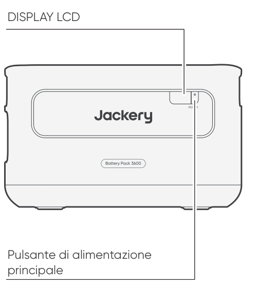
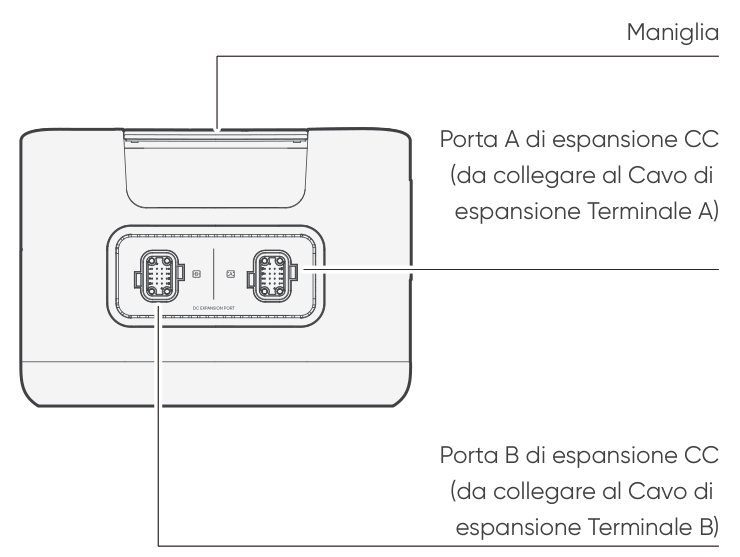

<strong>IMPORTANTE</strong>

Congratulazioni per il tuo nuovo Jackery Battery Pack 3600. Leggi attentamente questo manuale prima di utilizzare il prodotto, in particolare le precauzioni rilevanti per garantirne un uso corretto. Conserva questo manuale in un luogo accessibile per consultazioni frequenti.

In conformità con le leggi e i regolamenti, il diritto di interpretazione finale di questo documento e di tutti i documenti correlati a questo prodotto spetta all'Azienda.

Si prega di notare che non verranno fornite ulteriori notifiche in caso di aggiornamenti, revisioni o cessazioni.

# PRECAUZIONI DI SICUREZZA

Seguire sempre queste precauzioni di base durante l’utilizzo di questo prodotto.

<ul class="simple">
<li>
Leggere tutte le istruzioni prima di utilizzare il prodotto.
</li>
<li>
Non consentire ai bambini di giocare con il prodotto. È necessaria una stretta supervisione quando il prodotto viene utilizzato vicino a bambini.
</li>
<li>
Il rischio di scossa elettrica può verificarsi se si utilizzano accessori non raccomandati o non venduti da produttori professionali.
</li>
<li>
Quando il prodotto non è in uso, scollegare la spina di alimentazione dalla presa del prodotto.
</li>
<li>
Non smontare il prodotto, poiché ciò può comportare rischi imprevedibili come incendi, esplosioni o scosse elettriche.
</li>
<li>
Non utilizzare il prodotto con cavi di alimentazione, spine o cavi di uscita danneggiati, poiché ciò può causare scosse elettriche.
</li>
<li>
Caricare il prodotto in un'area ben ventilata e non ostacolare in alcun modo la ventilazione.
</li>
<li>
Posizionare il prodotto in un luogo ventilato e asciutto per evitare che pioggia o acqua possano causare scosse elettriche.
</li>
<li>
Non esporre il prodotto a fiamme o a temperature elevate (alla luce diretta del sole o all'interno di un veicolo esposto a calore elevato), poiché potrebbero verificarsi incidenti come incendi o esplosioni.
</li>
<li>
Se questo prodotto viene conservato per un lungo periodo di tempo (3-6 mesi) con la batteria scarica, potrebbe non essere più ricaricabile.
</li>
</ul>

# SIGNIFICATO DEI SIMBOLI

<figure aria-label="Simbolo / Significato" class="hb-symbol-signal-composition" data-component-id="HB-TABLE-SYMBOL-SIGNAL"><table class="hb-symbol-signal-table"><colgroup><col class="hb-symbol-signal-col-label"/><col class="hb-symbol-signal-col-meaning"/></colgroup><thead><tr><th class="hb-symbol-signal-label-heading" scope="col">
Simbolo
</th><th class="hb-symbol-signal-meaning-heading" scope="col">
Significato
</th></tr></thead><tbody><tr><td class="hb-symbol-signal-label-cell">⚠AVVERTENZA</td><td class="hb-symbol-signal-meaning-cell">
Pratiche pericolose che possono causare gravi lesioni, morte e/o danni materiali.
</td></tr><tr><td class="hb-symbol-signal-label-cell">⚠ATTENZIONE</td><td class="hb-symbol-signal-meaning-cell">
Pratiche pericolose che possono causare lesioni personali e/o danni materiali.
</td></tr><tr><td class="hb-symbol-signal-label-cell">⚠NOTA</td><td class="hb-symbol-signal-meaning-cell">
Pratiche pericolose che possono causare danni all'apparecchiatura, perdita di dati, deterioramento delle prestazioni o risultati imprevisti.
</td></tr><tr><td class="hb-symbol-signal-label-cell">⚠SUGGERIMENTO</td><td class="hb-symbol-signal-meaning-cell">
Integra le informazioni importanti o i consigli operativi presenti nel testo.
</td></tr></tbody></table></figure>

<figure aria-label="Simbolo / Significato" class="hb-symbol-pair-composition" data-component-id="HB-TABLE-SYMBOL-ICON">

<table class="hb-symbol-panel-table"><colgroup><col class="hb-symbol-col-icon"/><col class="hb-symbol-col-meaning"/></colgroup><thead><tr><th class="hb-symbol-icon-heading" scope="col">
<strong>Simbolo</strong>
</th><th class="hb-symbol-meaning-heading" scope="col">
<strong>Significato</strong>
</th></tr></thead><tbody><tr><td class="hb-symbol-icon"></td><td class="hb-symbol-meaning">
Simboli di avvertenza e cautela. Da leggere assolutamente per avvisare le persone di potenziali pericoli o rischi.
</td></tr><tr><td class="hb-symbol-icon"></td><td class="hb-symbol-meaning">
Prima dell’utilizzo, leggere il manuale d’istruzioni.
</td></tr><tr><td class="hb-symbol-icon"></td><td class="hb-symbol-meaning">
Non smontare il prodotto.
</td></tr><tr><td class="hb-symbol-icon"></td><td class="hb-symbol-meaning">
Tenere il prodotto lontano da fiamme.
</td></tr></tbody></table>

<table class="hb-symbol-panel-table"><colgroup><col class="hb-symbol-col-icon"/><col class="hb-symbol-col-meaning"/></colgroup><thead><tr><th class="hb-symbol-icon-heading" scope="col">
<strong>Simbolo</strong>
</th><th class="hb-symbol-meaning-heading" scope="col">
<strong>Significato</strong>
</th></tr></thead><tbody><tr><td class="hb-symbol-icon"></td><td class="hb-symbol-meaning">
Tenere lontano dalla portata dei bambini.
</td></tr><tr><td class="hb-symbol-icon"></td><td class="hb-symbol-meaning">
Questo simbolo indica che all’interno del prodotto è presente una batteria agli ioni di litio (Li-ion), la quale va smaltita o riciclata adeguatamente.
</td></tr><tr><td class="hb-symbol-icon"></td><td class="hb-symbol-meaning">
Questo simbolo indica che il prodotto non va smaltito come rifiuto domestico e deve essere consegnato per il riciclaggio a un centro di raccolta designato. Smaltire adeguatamente e riciclare aiuta a proteggere l’ambiente. Per maggiori informazioni riguardo lo smaltimento e il riciclaggio di questo prodotto, contattare la propria comunità locale, i servizi di smaltimento o il proprio fornitore.
</td></tr><tr><td class="hb-symbol-icon"></td><td class="hb-symbol-meaning">
Le batterie e gli accumulatori non devono essere smaltiti insieme ai rifiuti domestici. Come consumatore, sei legalmente obbligato a smaltire tutte le batterie e gli accumulatori nei punti di raccolta designati, indipendentemente dal fatto che contengano sostanze pericolose. Per favore, restituisci le batterie e gli accumulatori usati a un punto di raccolta locale, a un centro di riciclo o al rivenditore presso cui sono stati acquistati. Un corretto smaltimento garantisce un riciclo responsabile per l'ambiente e previene potenziali danni alla salute umana e all'ambiente.
</td></tr></tbody></table>

</figure>

# CONTENUTO DELLA CONFEZIONE

<figure aria-label="CONTENUTO DELLA CONFEZIONE" class="hb-inbox-composition" data-card-count="3" data-component-id="HB-SPECIAL-INBOX" data-inbox-variant="three-card-responsive"><ol class="hb-inbox-grid"><li class="hb-inbox-card" data-item-number="1">

<strong>Jackery Battery Pack 3600</strong>

</li><li class="hb-inbox-card" data-item-number="2">

<strong>Cavo di ricarica CA</strong>

</li><li class="hb-inbox-card" data-item-number="3">

Manuale d'uso

</li></ol></figure>

# PANORAMICA DEL PRODOTTO

<section id="front-view">
<h2>VISTA FRONTALE</h2>

</section>

<section id="left-side-view">
<h2>VISTA LATERALE SINISTRA</h2>

</section>

# DISPLAY LCD

<figure aria-label="DISPLAY LCD" class="hb-reference-composition hb-reference-lcd-descriptions" data-component-id="HB-TABLE-REFERENCE" data-component-variant="lcd-descriptions" tabindex="0"><table class="hb-reference-table"><tbody><tr><td>
Percentuale di potenza/Codice di errore
</td><td>

La percentuale di potenza visualizzata indica il valore di potenza attuale.

In caso di un malfunzionamento del sistema, viene visualizzato il codice di errore corrispondente F0-FF. Se appare il codice FF, rimuovere il carico e il prodotto può ripristinarsi da solo, altrimenti si prega di contattare il servizio di assistenza. In caso di comparsa di altri codici, si prega di contattare il nostro servizio di assistenza.

</td></tr><tr><td>
Indicatore di carica
</td><td>
L'indicatore viene visualizzato durante la carica e scompare quando è completamente carico.
</td></tr></tbody></table></figure>

# OPERAZIONI DI BASE

<section id="power-on-off">
<h2>ACCENSIONE/SPEGNIMENTO</h2>
<figure class="hb-operation-figure hb-operation-layout-status-right hb-base-art-live-copy" data-component-id="HB-SPECIAL-OPERATION" data-operation-id="main-power" data-source-fragment-sha256="bc4f88683c43c9480c4032de1cf6f74fcfa5c0b15ec040d63eabbe9a267ab8d8" data-web-base-art-ref="power_native" data-web-presentation-mode="base-art-live-copy" data-web-replace-key="operation.main-power">

3s

<strong>Accensione</strong>

premere una volta

<strong>Spegnimento</strong>

Tenere premuto per 3 secondi

</figure>
<table class="manual-callout-table" style="width:100%; border-collapse:collapse; margin:0 0 16px 0;"><tbody><tr><td class="manual-callout-label" style="width:16%; border:1px solid #000; padding:6px 8px; vertical-align:top;">
<strong>NOTA</strong>
</td><td class="manual-callout-body" style="border:1px solid #000; padding:6px 8px; vertical-align:top;">
Quando si utilizza con Jackery Explorer 3600 Plus, è possibile controllare l'accensione o lo spegnimento del pacco batterie Jackery 3600 tramite il "Pulsante di alimentazione principale" di Jackery Explorer 3600 Plus.

Se non c’è un ucita di scarica o un ingresso di carica, il prodotto si spegnerà automaticamente dopo 2 ore.

</td></tr></tbody></table></section>

<section id="lcd-display-on-off">
<h2>DISPLAY LCD ACCESO/SPENTO</h2>

Premendo il "pulsante di alimentazione principale", l'indicatore di funzionamento si accende e il display LCD si illumina,e quando lo premi di nuovo, e il display LCD si spegnerà.

</section>

# COME SI USA

Jackery Explorer 3600 Plus può essere utilizzato insieme a un massimo di 5 set di questo prodotto per soddisfare esigenze di maggiore capacità.

<table class="manual-callout-table" style="width:100%; border-collapse:collapse; margin:0 0 16px 0;"><tbody><tr><td class="manual-callout-label" style="width:16%; border:1px solid #000; padding:6px 8px; vertical-align:top;">
<strong>ATTENZIONE</strong>
</td><td class="manual-callout-body" style="border:1px solid #000; padding:6px 8px; vertical-align:top;">
Assicurarsi che tutti i prodotti siano spenti prima di collegare Jackery Explorer 3600 Plus al Jackery Battery Pack 3600.

Per garantire il corretto funzionamento del prodotto, assicurarsi che le griglie di aspirazione e scarico dell'aria su entrambi i lati non siano ostruite. Lasciare almeno 200 mm di spazio tra le griglie di ventilazione e qualsiasi oggetto per consentire un'adeguata dissipazione del calore.

</td></tr></tbody></table>

<figure class="hb-reference-figure hb-base-art-live-copy" data-component-id="HB-SPECIAL-REFERENCE-FIGURE" data-reference-id="clearance" data-source-fragment-sha256="a38cea2914ef213de41ce153c631e371c455028e4dabe2eaf868eaf0eae88739" data-web-base-art-ref="clearance_native" data-web-presentation-mode="base-art-live-copy" data-web-replace-key="reference.clearance">

≥200 mm≥≈200 mm

</figure>

<table class="manual-callout-table" style="width:100%; border-collapse:collapse; margin:0 0 16px 0;"><tbody><tr><td class="manual-callout-label" style="width:16%; border:1px solid #000; padding:6px 8px; vertical-align:top;">
<strong>NOTA</strong>
</td><td class="manual-callout-body" style="border:1px solid #000; padding:6px 8px; vertical-align:top;">
La visualizzazione dell'icona  sullo schermo LCD (Jackery Explorer 3600 Plus) indica che il collegamento tra il pacco batteria e Jackery Explorer 3600 Plus è stato effettuato correttamente.

Durante l'uso del prodotto, non impilare più di tre pacchi batterie in una torre per evitare che cadano e provochino lesioni.

Si prega di non impilare il prodotto sulla parte superiore di Jackery Explorer 3600 Plus.

</td></tr></tbody></table>

<figure class="hb-reference-figure hb-base-art-live-copy" data-component-id="HB-SPECIAL-REFERENCE-FIGURE" data-reference-id="locking" data-source-fragment-sha256="7e91b18a32d45dca62adbb56e54d9985f446406e165599f4aa965ba19c1fbe36" data-web-base-art-ref="locking_native" data-web-presentation-mode="base-art-live-copy" data-web-replace-key="reference.locking">

<strong>Blocco</strong><strong>Sblocco</strong>1212

</figure>

# RISOLUZIONE DEI PROBLEMI

Se viene visualizzato uno dei seguenti codici di errore, seguire le azioni correttive elencate per risolvere il problema. Se l'errore persiste, contattare l'assistenza clienti Jackery.

<figure aria-label="Codice di errore / Misure correttive" class="hb-troubleshooting-composition" data-component-id="HB-TABLE-TROUBLESHOOTING" tabindex="0"><table class="hb-troubleshooting-table"><colgroup><col class="hb-troubleshooting-col-code"/><col class="hb-troubleshooting-col-measures"/></colgroup><thead><tr><th class="hb-troubleshooting-code" scope="col">
Codice di errore
</th><th class="hb-troubleshooting-measures" scope="col">
Misure correttive
</th></tr></thead><tbody><tr><td class="hb-troubleshooting-code">
F0
</td><td class="hb-troubleshooting-measures">
Riavviare il prodotto.
</td></tr><tr><td class="hb-troubleshooting-code">
F1, F2
</td><td class="hb-troubleshooting-measures">
Contattare il distributore o l'assistenza clienti Jackery.
</td></tr><tr><td class="hb-troubleshooting-code">
F3
</td><td class="hb-troubleshooting-measures">
Riavviare il prodotto.
</td></tr><tr><td class="hb-troubleshooting-code">
F4
</td><td class="hb-troubleshooting-measures">
Collegare il prodotto ai carichi per scaricare la batteria fino a quando l'errore non scompare.
</td></tr><tr><td class="hb-troubleshooting-code">
F5
</td><td class="hb-troubleshooting-measures">
Caricare il prodotto tramite pannelli solari o Presa di corrente CA fino a quando l'errore non scompare.
</td></tr><tr><td class="hb-troubleshooting-code">
F6-F9, FA, FC, FE
</td><td class="hb-troubleshooting-measures">
Contattare il distributore o l'assistenza clienti Jackery.
</td></tr><tr><td class="hb-troubleshooting-code">
FF
</td><td class="hb-troubleshooting-measures">
Collocare il prodotto in un ambiente a temperatura adeguata e attendere che il guasto scompaia.
</td></tr></tbody></table></figure>

# RICARICA

<section id="charging-via-ac-wall-outlet">
<h2>RICARICA TRAMITE PRESA A MURO CA</h2>

Quando si carica dalla parete, questo prodotto deve essere utilizzato con Jackery Explorer 3600 Plus.

<table class="manual-callout-table" style="width:100%; border-collapse:collapse; margin:0 0 16px 0;"><tbody><tr><td class="manual-callout-label" style="width:16%; border:1px solid #000; padding:6px 8px; vertical-align:top;">
<strong>AVVERTENZA</strong>
</td><td class="manual-callout-body" style="border:1px solid #000; padding:6px 8px; vertical-align:top;">
Prima di collegare il Jackery Explorer 3600 Plus a Jackery Battery Pack 3600, assicurarsi che tutti i prodotti siano spenti.
</td></tr></tbody></table>
</section>

<section id="charging-via-solar-panels-sold-separately">
<h2>RICARICA TRAMITE PANNELLI SOLARI (VENDUTI SEPARATAMENTE)</h2>

Caricare il prodotto con i pannelli solari e il Jackery Explorer 3600 Plus come mostrato nella figura sottostante. Per ulteriori informazioni, consultare il manuale utente di Jackery Explorer 3600 Plus.

</section>

# STOCCAGGIO

Conservare il prodotto in un luogo pulito e asciutto, con una ventilazione adeguata. Temperatura e umidità di stoccaggio:

<ul class="simple">
<li>
1 mese: tra -20 °C e 45 °C (0-60% UR)
</li>
<li>
3 mesi: tra 0 °C e 45 °C (0-60% UR)
</li>
<li>
12 mesi: tra 0 °C e 25 °C (0-60% UR)
</li>
</ul>

Se il prodotto viene conservato a lungo termine (da 3 a 6 mesi) con la batteria scarica, potrebbe non essere più possibile ricaricarlo. Per evitarlo e mantenere la salute della batteria, si consiglia di controllare e ricaricare il prodotto ogni tre mesi e di eseguire almeno un ciclo completo di carica e scarica ogni 6-12 mesi.

# SPECIFICHE TECNICHE

## NFORMAZIONI GENERALI

<figure aria-label="NFORMAZIONI GENERALI" class="hb-spec-table-composition"><table class="hb-spec-table manual-table manual-spec-table"><colgroup><col class="hb-spec-col-label"/><col class="hb-spec-col-value"/></colgroup>
<tbody>
<tr>
<th class="hb-spec-label manual-spec-label" scope="row">Nome del prodotto</th>
<td class="hb-spec-value manual-spec-value">Jackery Battery Pack 3600</td>
</tr>
<tr>
<th class="hb-spec-label manual-spec-label" scope="row">Modello n.</th>
<td class="hb-spec-value manual-spec-value">JBP-3600A</td>
</tr>
<tr>
<th class="hb-spec-label manual-spec-label" scope="row">Capacità</th>
<td class="hb-spec-value manual-spec-value">80Ah / 44,8Vdc (3584 Wh)</td>
</tr>
<tr>
<th class="hb-spec-label manual-spec-label" scope="row">Chimica celle batteria</th>
<td class="hb-spec-value manual-spec-value">LiFePO4</td>
</tr>
<tr>
<th class="hb-spec-label manual-spec-label" scope="row">Peso</th>
<td class="hb-spec-value manual-spec-value">25 kg</td>
</tr>
<tr>
<th class="hb-spec-label manual-spec-label" scope="row">Dimensioni</th>
<td class="hb-spec-value manual-spec-value">37,5 × 31,7 × 22,9 cm</td>
</tr>
<tr>
<th class="hb-spec-label manual-spec-label" scope="row">Durata del ciclo</th>
<td class="hb-spec-value manual-spec-value">6000 cycles to 70%+ capacity</td>
</tr>
<tr>
<th class="hb-spec-label manual-spec-label" scope="row">Codice IEC</th>
<td class="hb-spec-value manual-spec-value">IFpR41/136[14S4P]M/-20+40/90</td>
</tr>
</tbody>
</table></figure>

## PORTE DI INGRESSO/USCITA

<figure aria-label="PORTE DI INGRESSO/USCITA" class="hb-spec-table-composition"><table class="hb-spec-table manual-table manual-spec-table"><colgroup><col class="hb-spec-col-label"/><col class="hb-spec-col-value"/></colgroup>
<tbody>
<tr>
<th class="hb-spec-label manual-spec-label" scope="row">Porta di espansione CC (Ingresso)</th>
<td class="hb-spec-value manual-spec-value">36,4V-50,4V⎓60A Max</td>
</tr>
<tr>
<th class="hb-spec-label manual-spec-label" scope="row">Porta di espansione CC (Uscita)</th>
<td class="hb-spec-value manual-spec-value">36,4V-50,4V⎓100A Max</td>
</tr>
<tr>
<th class="hb-spec-label manual-spec-label" scope="row">Corrente massima di cortocircuito e durata</th>
<td class="hb-spec-value manual-spec-value">1160A/860μs</td>
</tr></tbody>
</table></figure>

## ENVIRONMENTAL OPERATING TEMPERATURE

<figure aria-label="ENVIRONMENTAL OPERATING TEMPERATURE" class="hb-spec-table-composition"><table class="hb-spec-table manual-table manual-spec-table"><colgroup><col class="hb-spec-col-label"/><col class="hb-spec-col-value"/></colgroup>
<tbody>
<tr>
<th class="hb-spec-label manual-spec-label" scope="row">Temperatura di caricatra</th>
<td class="hb-spec-value manual-spec-value">tra -20 °C e 45 °C</td>
</tr>
<tr>
<th class="hb-spec-label manual-spec-label" scope="row">Temperatura di scarica</th>
<td class="hb-spec-value manual-spec-value">tra -20 °C e 45 °C</td>
</tr>
</tbody>
</table></figure>

# GARANZIA

<figure aria-label="GARANZIA" class="hb-warranty-intro-composition" data-component-id="HB-WARRANTY-LEAD">

<strong>Forniamo la nostra garanzia solo ai clienti che acquistano dal sito web ufficiale di Jackery, dalle piattaforme di terze parti con marchio Jackery o dai rivenditori autorizzati locali.</strong>

* Il periodo ei dettagli della garanzia possono variare in base alle leggi locali, ai regolamenti e ai rivenditori autorizzati.

</figure>

<section class="warranty-section" id="limited-warranty">
<h2>Garanzia limitata</h2>
<figure aria-label="Garanzia limitata" class="hb-warranty-card" data-component-id="HB-WARRANTY-SECTION" data-warranty-card-index="1">
Jackery garantisce all'acquirente originale che il prodotto Jackery sarà esente da difetti di fabbricazione e materiali in condizioni di normale utilizzo da parte del acquirente durante il periodo di garanzia applicabile identificato nella sezione "Periodo di garanzia" di seguito, fatte salve le esclusioni indicate di seguito.

Questa dichiarazione di garanzia stabilisce l'obbligo di garanzia totale ed esclusivo di Jackery. Non ci assumeremo, né autorizzeremo alcuna persona ad assumersi per noi, qualsiasi altra responsabilità in relazione allà vendita dei nostri prodotti.
</figure>
</section>

<section class="warranty-section warranty-years" id="warranty-period">
<h2>Periodo di garanzia</h2>
<figure aria-label="Periodo di garanzia" class="hb-warranty-period-card" data-component-id="HB-WARRANTY-YEARS">

3
<strong class="hb-warranty-years-unit">ANNI</strong><strong class="hb-warranty-period-label">Garanzia standard</strong>

Il periodo di garanzia standard per Jackery Battery Pack 3600 è misurato a partire dalla data di acquisto da parte dell'acquirente consumatore originario. Per stabilire la data di inizio del periodo di garanzia è necessaria la ricevuta del primo acquisto da parte del consumatore, o altra prova documentale ragionevole.

2
<strong class="hb-warranty-years-unit">ANNI</strong><strong class="hb-warranty-period-label">Garanzia estesa</strong>

Per attivare l'estensione della garanzia, è necessario registrare il prodotto online, oppure contattare il nostro servizio clienti all’indirizzo <a class="reference external" href="mailto:hello.eu@jackery.com">hello.eu@jackery.com</a> per estendere il periodo di garanzia standard.

</figure>
</section>

<section class="warranty-section" id="repair-or-replacement">
<h2>Sostituzione</h2>
<figure aria-label="Sostituzione" class="hb-warranty-card" data-component-id="HB-WARRANTY-SECTION" data-warranty-card-index="3">
Jackery sostituirà (a spese di Jackery) qualsiasi prodotto Jackery mal funzionante durante il periodo di garanzia applicabile a causa di difetti di fabbricazione o materiali. Un prodotto sostitutivo assume la garanzia residua del prodotto originale.
</figure>
</section>

<section class="warranty-section" id="limited-to-original-consumer-buyer">
<h2>Limitato all'acquirente consumatore originale</h2>
<figure aria-label="Limitato all'acquirente consumatore originale" class="hb-warranty-card" data-component-id="HB-WARRANTY-SECTION" data-warranty-card-index="4">
La garanzia sul prodotto Jackery è limitata all’acquirente originale e non è trasferibile a nessun proprietario successivo.
</figure>
</section>

<section class="warranty-section" id="exclusions">
<h2>Esclusioni</h2>
<figure aria-label="Esclusioni" class="hb-warranty-card" data-component-id="HB-WARRANTY-SECTION" data-warranty-card-index="5">
La garanzia di Jackery non si applica a:
<ul class="simple">
<li>
Uso improprio, abuso, modifica, danneggiamento accidentale o utilizzo diverso dal normale uso da parte del consumatore, come autorizzato nella documentazione di questo prodotto Jackery.
</li>
<li>
Tentativi di riparazione da parte di persone diverse da quelle autorizzate.
</li>
<li>
Qualsiasi prodotto acquistato tramite una casa d'aste online.
</li>
<li>
La garanzia di Jackery non si applica alla batteria, a meno che questa non venga caricata completamente dall'utente entro sette giorni dall'acquisto del prodotto, e successivamente almeno una volta ogni 6 mesi.
</li>
</ul></figure>
</section>

<section class="warranty-section" id="interpretation-rights">
<h2>Diritti di interpretazione</h2>
<figure aria-label="Diritti di interpretazione" class="hb-warranty-card" data-component-id="HB-WARRANTY-SECTION" data-warranty-card-index="6">
Jackery si riserva il diritto di interpretazione finale della politica post-vendita sopra descritta.
</figure>
</section>

# EU REGULATIONS

<section id="red-declaration-of-conformity">
<h2>RED DECLARATION OF CONFORMITY</h2>

Shenzhen Hello Tech Energy Co., Ltd. hereby declares that this Jackery Battery Pack 3600 with Bluetooth and Wi-Fi JBP-3600A is in compliance with the essential requirements and other relevant provisions of the RED Directive 2014/53/EU. The full text of the EU declaration of conformity is available at the following internet address:

<a class="reference external" href="https://de.jackery.com/pages/user-guides">https://de.jackery.com/pages/user-guides</a>

</section>

<section id="manufacturer">
<h2>MANUFACTURER</h2>

SHENZHEN HELLO TECH ENERGY CO., LTD.

Address: F2-3, Bldg. 7, Jiaanda Science and technology industrial park factory, the east side of Huafan Road, Tongsheng Community, Dalang Street, Longhua District, Shenzhen, Guangdong, China

+86 400 668 9293

<a class="reference external" href="mailto:sales@hello-tech.com">sales@hello-tech.com</a>

www.hello-tech.com

</section>
