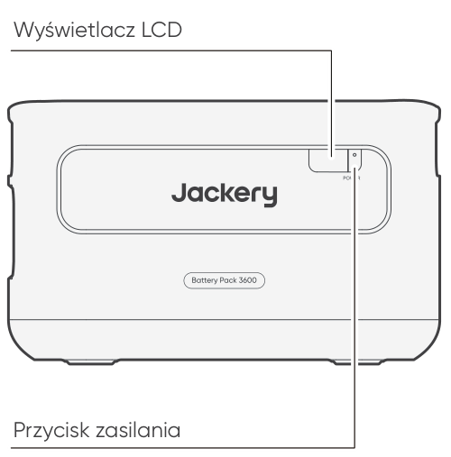
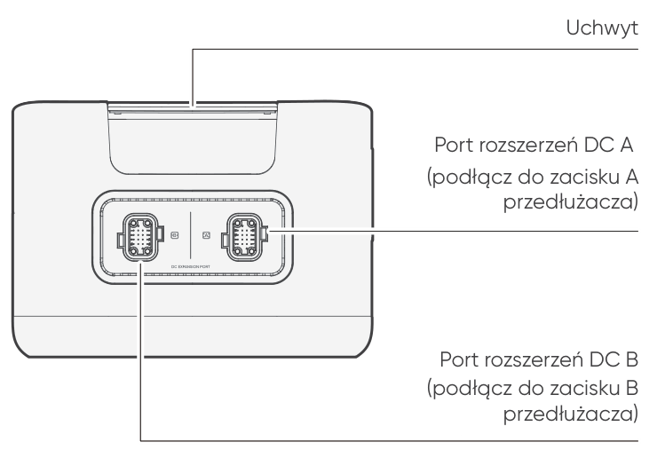
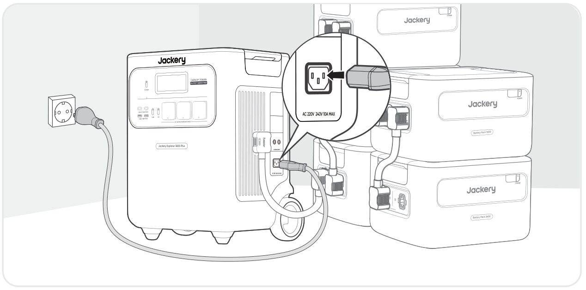
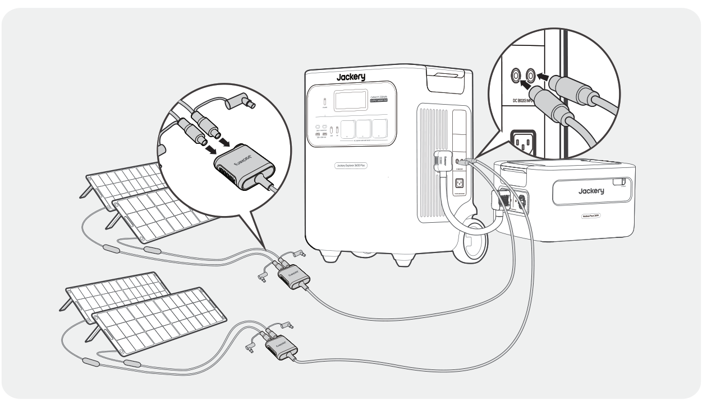

<strong>WAŻNE</strong>

Gratulujemy zakupu nowego urządzenia Jackery Battery Pack 3600. Prosimy o dokładne przeczytanie niniejszej instrukcji przed użyciem produktu, ze szczególnym uwzględnieniem środków ostrożności, aby zapewnić prawidłowe użytkowanie. Instrukcję należy przechowywać w łatwo dostępnym miejscu, aby można było po nią sięgać w przyszłości.

Zgodnie z przepisami prawo ostatecznej interpretacji niniejszego dokumentu oraz wszystkich dokumentów związanych z tym produktem przysługuje firmie.

Należy pamiętać, że w przypadku jakichkolwiek aktualizacji, zmian lub zakończenia publikacji nie będą wysyłane żadne dodatkowe powiadomienia.

# WAŻNE INFORMACJE DOTYCZĄCE BEZPIECZEŃSTWA

Podczas korzystania z produktu należy przestrzegać podstawowych środków ostrożności, w tym:

<ul class="simple">
<li>
Przed przystąpieniem do korzystania z produktu należy przeczytać wszystkie instrukcje.
</li>
<li>
W przypadku użytkowania tego produktu w pobliżu dzieci należy zapewnić im ścisły nadzór, aby ograniczyć ryzyko.
</li>
<li>
W przypadku korzystania z akcesoriów, które nie są zalecane ani sprzedawane przez producenta produktu, może występować ryzyko porażenia prądem.
</li>
<li>
Gdy produkt nie jest używany, należy odłączyć wtyczkę zasilania od gniazda produktu.
</li>
<li>
Nie wolno rozmontowywać produktu, ponieważ może to prowadzić do nieprzewidywalnych zagrożeń, takich jak pożar, wybuch lub porażenie prądem.
</li>
<li>
Nie należy używać produktu z uszkodzonymi przewodami, wtyczkami lub kablami wyjściowymi, ponieważ może to spowodować porażenie prądem.
</li>
<li>
Produkt należy ładować w dobrze wentylowanym miejscu i nie wolno w żaden sposób zasłaniać jego kanałów wentylacyjnych.
</li>
<li>
Produkt należy umieścić w wentylowanym i suchym miejscu, aby deszcz lub woda nie spowodowały porażenia prądem.
</li>
<li>
Nie wystawiać produktu na działanie ognia lub wysokiej temperatury (na przykład przez umieszczenie w miejscu bezpośrednio nasłonecznionym lub w nagrzanym wnętrzu pojazdu), ponieważ może to spowodować wypadki, takie jak pożar i wybuch.
</li>
<li>
Jeśli produkt będzie przechowywany przez długi czas (3–6 miesięcy) z rozładowaną baterią, jego naładowanie może okazać się niemożliwe.
</li>
</ul>

# ZNACZENIE SYMBOLI

<figure aria-label="Symbol / Znaczenie" class="hb-symbol-signal-composition" data-component-id="HB-TABLE-SYMBOL-SIGNAL"><table class="hb-symbol-signal-table"><colgroup><col class="hb-symbol-signal-col-label"/><col class="hb-symbol-signal-col-meaning"/></colgroup><thead><tr><th class="hb-symbol-signal-label-heading" scope="col">
Symbol
</th><th class="hb-symbol-signal-meaning-heading" scope="col">
Znaczenie
</th></tr></thead><tbody><tr><td class="hb-symbol-signal-label-cell">⚠OSTRZEŻENIE</td><td class="hb-symbol-signal-meaning-cell">
Niebezpieczne praktyki, które mogą prowadzić do poważnych obrażeń, śmierci i/lub szkód materialnych.
</td></tr><tr><td class="hb-symbol-signal-label-cell">⚠PRZESTROGA</td><td class="hb-symbol-signal-meaning-cell">
Niebezpieczne praktyki, które mogą skutkować obrażeniami ciała i/lub szkodami materialnymi.
</td></tr><tr><td class="hb-symbol-signal-label-cell">⚠Uwaga</td><td class="hb-symbol-signal-meaning-cell">
Niebezpieczne praktyki, które mogą prowadzić do uszkodzenia sprzętu, utraty danych, pogorszenia wydajności lub nieprzewidzianych wyników.
</td></tr><tr><td class="hb-symbol-signal-label-cell">⚠WSKAZÓWKA</td><td class="hb-symbol-signal-meaning-cell">
Uzupełnia ważne informacje lub wskazówki dotyczące obsługi zawarte w tekście.
</td></tr></tbody></table></figure>

<figure aria-label="Symbol / Znaczenie" class="hb-symbol-pair-composition" data-component-id="HB-TABLE-SYMBOL-ICON">

<table class="hb-symbol-panel-table"><colgroup><col class="hb-symbol-col-icon"/><col class="hb-symbol-col-meaning"/></colgroup><thead><tr><th class="hb-symbol-icon-heading" scope="col">
<strong>Symbol</strong>
</th><th class="hb-symbol-meaning-heading" scope="col">
<strong>Znaczenie</strong>
</th></tr></thead><tbody><tr><td class="hb-symbol-icon"></td><td class="hb-symbol-meaning">
Symbole ostrzeżeń i środków ostrożności. Należy koniecznie przeczytać, aby poznać potencjalne zagrożenia lub ryzyka.
</td></tr><tr><td class="hb-symbol-icon"></td><td class="hb-symbol-meaning">
Przed przystąpieniem do użytkowania przeczytaj instrukcję obsługi.
</td></tr><tr><td class="hb-symbol-icon"></td><td class="hb-symbol-meaning">
Nie rozmontowuj produktu.
</td></tr><tr><td class="hb-symbol-icon"></td><td class="hb-symbol-meaning">
Trzymaj produkt z dala od ognia.
</td></tr></tbody></table>

<table class="hb-symbol-panel-table"><colgroup><col class="hb-symbol-col-icon"/><col class="hb-symbol-col-meaning"/></colgroup><thead><tr><th class="hb-symbol-icon-heading" scope="col">
<strong>Symbol</strong>
</th><th class="hb-symbol-meaning-heading" scope="col">
<strong>Znaczenie</strong>
</th></tr></thead><tbody><tr><td class="hb-symbol-icon"></td><td class="hb-symbol-meaning">
Przechowuj w miejscu niedostępnym dla dzieci.
</td></tr><tr><td class="hb-symbol-icon"></td><td class="hb-symbol-meaning">
Ten symbol oznacza, że wewnątrz produktu znajduje się bateria litowo-jonowa (Li-ion), którą należy prawidłowo utylizować lub poddać recyklingowi.
</td></tr><tr><td class="hb-symbol-icon"></td><td class="hb-symbol-meaning">
Ten symbol oznacza, że produktu nie wolno wyrzucać razem z odpadami domowymi i należy go dostarczyć do wyznaczonego punktu zbiórki w celu recyklingu. Prawidłowa utylizacja i recykling przyczynią się do ochrony środowiska. Aby uzyskać więcej informacji na temat utylizacji i recyklingu tego produktu, skontaktuj się z lokalną gminą, firmą zajmującą się utylizacją lub sprzedawcą.
</td></tr><tr><td class="hb-symbol-icon"></td><td class="hb-symbol-meaning">
Baterii i akumulatorów nie wolno wyrzucać razem z odpadami domowymi. Jako konsument masz prawny obowiązek oddawania wszystkich baterii i akumulatorów do wyznaczonych punktów zbiórki, niezależnie od tego, czy zawierają substancje niebezpieczne. Zużyte baterie i akumulatory należy przekazać do lokalnego punktu zbiórki, centrum recyklingu lub do sprzedawcy, u którego zostały zakupione. Prawidłowa utylizacja zapewnia recykling przyjazny dla środowiska i zapobiega potencjalnym szkodom dla zdrowia ludzi i środowiska.
</td></tr></tbody></table>

</figure>

# ZAWARTOŚĆ OPAKOWANIA

<figure aria-label="ZAWARTOŚĆ OPAKOWANIA" class="hb-inbox-composition" data-card-count="3" data-component-id="HB-SPECIAL-INBOX" data-inbox-variant="three-card-responsive"><ol class="hb-inbox-grid"><li class="hb-inbox-card" data-item-number="1">

<strong>Jackery Battery Pack 3600</strong>

</li><li class="hb-inbox-card" data-item-number="2">

<strong>Przedłużacz</strong>

</li><li class="hb-inbox-card" data-item-number="3">

Instrukcja obsługi

</li></ol></figure>

# WIDOK OGÓLNY PRODUKTU

<section id="front-view">
<h2>WIDOK Z PRZODU</h2>

</section>

<section id="left-side-view">
<h2>WIDOK Z LEWEJ STRONY</h2>

</section>

# WYŚWIETLACZ LCD

<figure aria-label="WYŚWIETLACZ LCD" class="hb-reference-composition hb-reference-lcd-descriptions" data-component-id="HB-TABLE-REFERENCE" data-component-variant="lcd-descriptions" tabindex="0"><table class="hb-reference-table"><tbody><tr><td>
Procent energii / kod błędu
</td><td>

Wyświetlacz pokazuje aktualny poziom energii w procentach.

W przypadku awarii systemu na wyświetlaczu pojawi się odpowiedni kod błędu F0-FF. Jeśli pojawi się kod FF, należy odłączyć wszystkie urządzenia odbiorcze i poczekać, aż produkt samoczynnie powróci do prawidłowego stanu. W innym przypadku należy skontaktować się z działem wsparcia Jackery. W przypadku pojawienia się jakiegokolwiek innego kodu należy skontaktować się z działem obsługi klienta.

</td></tr><tr><td>
Wskaźnik ładowania
</td><td>
Wskaźnik pojawia się podczas ładowania i znika, gdy urządzenie jest w pełni naładowane.
</td></tr></tbody></table></figure>

# OBSŁUGA

<section id="power-on-off">
<h2>WŁ./WYŁ. ZASILANIA</h2>
<figure class="hb-operation-figure hb-operation-layout-status-right hb-base-art-live-copy" data-component-id="HB-SPECIAL-OPERATION" data-operation-id="main-power" data-source-fragment-sha256="bd16928a8c9577e4070b46628db5d04fb13169ef98c75c58b91f234b5db54d77" data-web-base-art-ref="power_native" data-web-presentation-mode="base-art-live-copy" data-web-replace-key="operation.main-power">

3s

<strong>Wł.</strong>

Naciśnij raz

<strong>Wył.</strong>

Naciśnij i przytrzymaj przez 3 s

</figure>
<table class="manual-callout-table" style="width:100%; border-collapse:collapse; margin:0 0 16px 0;"><tbody><tr><td class="manual-callout-label" style="width:16%; border:1px solid #000; padding:6px 8px; vertical-align:top;">
<strong>Uwaga</strong>
</td><td class="manual-callout-body" style="border:1px solid #000; padding:6px 8px; vertical-align:top;">
Podczas korzystania z produktu w połączeniu z urządzeniem Jackery Explorer 3600 Plus można kontrolować stan zasilania (włączenie lub wyłączenie) urządzenia Jackery Battery Pack 3600 za pomocą głównego przycisku POWER na urządzeniu Jackery Explorer 3600 Plus.

Produkt wyłączy się automatycznie, jeśli przez 2 godziny nie będzie ładowany, ani nie będą do niego podłączone żadne urządzenia odbiorcze.

</td></tr></tbody></table></section>

<section id="lcd-display-on-off">
<h2>WŁĄCZANIE/WYŁĄCZANIE WYŚWIETLACZA LCD</h2>

Po naciśnięciu głównego przycisku zasilania POWER lub podczas ładowania produktu wyświetlacz LCD jest podświetlony. Ponowne naciśnięcie przycisku spowoduje wyłączenie ekranu wyświetlacza LCD.

</section>

# POŁĄCZENIA

Przy większym zapotrzebowaniu na pojemność energetyczną w połączeniu Jackery Explorer 3600 Plus można używać 5 zestawów tych produktów.

<table class="manual-callout-table" style="width:100%; border-collapse:collapse; margin:0 0 16px 0;"><tbody><tr><td class="manual-callout-label" style="width:16%; border:1px solid #000; padding:6px 8px; vertical-align:top;">
<strong>PRZESTROGA</strong>
</td><td class="manual-callout-body" style="border:1px solid #000; padding:6px 8px; vertical-align:top;">
Przed podłączeniem urządzenia Jackery Explorer 3600 Plus do urządzenia Jackery Battery Pack 3600 upewnij się, że wszystkie urządzenia są wyłączone.

Aby zapewnić prawidłowe działanie produktu, upewnij się, że wlotowe i wylotowe otwory wentylacyjne po obu stronach są odsłonięte. Zachowaj co najmniej 200 mm (≈0,66 ft) odstępu między otworami wentylacyjnymi a jakimikolwiek przedmiotami, aby zapewnić prawidłowe odprowadzanie ciepła.

</td></tr></tbody></table>

<figure class="hb-reference-figure hb-base-art-live-copy" data-component-id="HB-SPECIAL-REFERENCE-FIGURE" data-reference-id="clearance" data-source-fragment-sha256="2f285d4b40162348234cd3a6aa1ec3ab6bf29882753526ac7accb69337b9719b" data-web-base-art-ref="clearance_native" data-web-presentation-mode="base-art-live-copy" data-web-replace-key="reference.clearance">

≥ 200 mm (≈ 0,66 ft)≥ 200 mm (≈ 0,66 ft)

</figure>

<table class="manual-callout-table" style="width:100%; border-collapse:collapse; margin:0 0 16px 0;"><tbody><tr><td class="manual-callout-label" style="width:16%; border:1px solid #000; padding:6px 8px; vertical-align:top;">
<strong>Uwagi</strong>
</td><td class="manual-callout-body" style="border:1px solid #000; padding:6px 8px; vertical-align:top;">
Wyświetlenie ikony  na ekranie LCD (Jackery Explorer 3600 Plus) oznacza pomyślne połączenie między zestawem baterii a urządzeniem Jackery Explorer 3600 Plus.

Podczas korzystania z produktu nie układaj więcej niż trzech zestawów baterii w jednej wieży, gdyż urządzenia mogłyby się przewrócić i spowodować obrażenia.

Produktu nie wolno układać na urządzeniu Jackery Explorer 3600 Plus.

</td></tr></tbody></table>

<figure class="hb-reference-figure hb-base-art-live-copy" data-component-id="HB-SPECIAL-REFERENCE-FIGURE" data-reference-id="locking" data-source-fragment-sha256="673bff310fb2789d71044812ea6c477147dc364219aed5ec88b87f5ecf0caa1b" data-web-base-art-ref="locking_native" data-web-presentation-mode="base-art-live-copy" data-web-replace-key="reference.locking">

<strong>Zablokowanie</strong><strong>Odblokowanie</strong>1212

</figure>

# ROZWIĄZYWANIE PROBLEMÓW

Jeśli pojawi się którykolwiek z poniższych kodów błędów, wykonaj wymienione działania naprawcze, aby rozwiązać problem. Jeśli usterka nie ustąpi, skontaktuj się z działem wsparcia Jackery.

<figure aria-label="Kod błędu / Działania naprawcze" class="hb-troubleshooting-composition" data-component-id="HB-TABLE-TROUBLESHOOTING" tabindex="0"><table class="hb-troubleshooting-table"><colgroup><col class="hb-troubleshooting-col-code"/><col class="hb-troubleshooting-col-measures"/></colgroup><thead><tr><th class="hb-troubleshooting-code" scope="col">
Kod błędu
</th><th class="hb-troubleshooting-measures" scope="col">
Działania naprawcze
</th></tr></thead><tbody><tr><td class="hb-troubleshooting-code">
F0
</td><td class="hb-troubleshooting-measures">
Uruchom produkt ponownie.
</td></tr><tr><td class="hb-troubleshooting-code">
F1, F2
</td><td class="hb-troubleshooting-measures">
Skontaktuj się z działem obsługi klienta Jackery.
</td></tr><tr><td class="hb-troubleshooting-code">
F3
</td><td class="hb-troubleshooting-measures">
Uruchom produkt ponownie.
</td></tr><tr><td class="hb-troubleshooting-code">
F4
</td><td class="hb-troubleshooting-measures">
Podłącz produkt do urządzeń odbiorczych, aby rozładować baterię, aż usterka zniknie.
</td></tr><tr><td class="hb-troubleshooting-code">
F5
</td><td class="hb-troubleshooting-measures">
Do czasu zniknięcia usterki ładuj produkt z paneli słonecznych lub gniazdka ściennego AC.
</td></tr><tr><td class="hb-troubleshooting-code">
F6-F9, FA, FC, FE
</td><td class="hb-troubleshooting-measures">
Skontaktuj się z działem obsługi klienta Jackery.
</td></tr><tr><td class="hb-troubleshooting-code">
FF
</td><td class="hb-troubleshooting-measures">
Umieść produkt w otoczeniu o odpowiedniej temperaturze i poczekaj, aż usterka zniknie.
</td></tr></tbody></table></figure>

# ŁADOWANIE

<section id="charging-via-ac-wall-outlet">
<h2>ŁADOWANIE Z SIECIOWEGO GNIAZDKA ŚCIENNEGO AC</h2>

Podczas ładowania z gniazdka ściennego ten produkt musi być używany razem z urządzeniem Jackery Explorer 3600 Plus.

<table class="manual-callout-table" style="width:100%; border-collapse:collapse; margin:0 0 16px 0;"><tbody><tr><td class="manual-callout-label" style="width:16%; border:1px solid #000; padding:6px 8px; vertical-align:top;">
<strong>OSTRZEŻENIE</strong>
</td><td class="manual-callout-body" style="border:1px solid #000; padding:6px 8px; vertical-align:top;">
Przed podłączeniem urządzenia Jackery Explorer 3600 Plus do urządzenia Jackery Battery Pack 3600 upewnij się, że wszystkie urządzenia są wyłączone.
</td></tr></tbody></table>
</section>

<section id="charging-via-solar-panels-sold-separately">
<h2>ŁADOWANIE ZA POMOCĄ PANELI SŁONECZNYCH (SPRZEDAWANE ODDZIELNIE)</h2>

Produkt można naładować z paneli słonecznych i urządzenia Jackery Explorer 3600 Plus, jak pokazano na poniższym rysunku. Więcej informacji można znaleźć w instrukcji obsługi urządzenia Jackery Explorer 3600 Plus.

</section>

# PRZECHOWYWANIE

Produkt należy przechowywać w suchym, czystym i odpowiednio wentylowanym miejscu. Temperatura i wilgotność w miejscu przechowywania:

<ul class="simple">
<li>
1 miesiąc: -20°C do 45°C (0–60% wilgotności względnej)
</li>
<li>
3 miesiące: 0°C do 45°C (0–60% wilgotności względnej)
</li>
<li>
12 miesięcy: 0°C do 25°C (0–60% wilgotności względnej)
</li>
</ul>

Jeśli produkt będzie przechowywany przez długi czas (3–6 miesięcy) z rozładowaną baterią, jego naładowanie może okazać się niemożliwe. Aby temu zapobiec i zadbać o kondycję baterii, zaleca się sprawdzanie i ładowanie produktu co trzy miesiące oraz przeprowadzanie pełnego cyklu ładowania i rozładowania co najmniej raz na 6–12 miesięcy.

# DANE TECHNICZNE

## INFORMACJE OGÓLNE

<figure aria-label="INFORMACJE OGÓLNE" class="hb-spec-table-composition"><table class="hb-spec-table manual-table manual-spec-table"><colgroup><col class="hb-spec-col-label"/><col class="hb-spec-col-value"/></colgroup>
<tbody>
<tr>
<th class="hb-spec-label manual-spec-label" scope="row">Nazwa produktu</th>
<td class="hb-spec-value manual-spec-value">Jackery Battery Pack 3600</td>
</tr>
<tr>
<th class="hb-spec-label manual-spec-label" scope="row">Numer modelu</th>
<td class="hb-spec-value manual-spec-value">JBP-3600A</td>
</tr>
<tr>
<th class="hb-spec-label manual-spec-label" scope="row">Pojemność</th>
<td class="hb-spec-value manual-spec-value">80 Ah / 44,8 V dc (3584 Wh)</td>
</tr>
<tr>
<th class="hb-spec-label manual-spec-label" scope="row">Typ ogniw</th>
<td class="hb-spec-value manual-spec-value">LiFePO₄</td>
</tr>
<tr>
<th class="hb-spec-label manual-spec-label" scope="row">Waga</th>
<td class="hb-spec-value manual-spec-value">Około 25 kg / 55,1 lbs</td>
</tr>
<tr>
<th class="hb-spec-label manual-spec-label" scope="row">Wymiary</th>
<td class="hb-spec-value manual-spec-value">37,5 × 31,7 × 22,9 cm / 14,8 × 12,5 × 9,0 in</td>
</tr>
<tr>
<th class="hb-spec-label manual-spec-label" scope="row">Żywotność</th>
<td class="hb-spec-value manual-spec-value">6000 cykli do 70%+ pojemności</td>
</tr>
<tr>
<th class="hb-spec-label manual-spec-label" scope="row">Kod IEC</th>
<td class="hb-spec-value manual-spec-value">IFpR41/136[14S4P]M/-20+40/90</td>
</tr>
</tbody>
</table></figure>

## PORTY WEJŚCIOWE/WYJŚCIOWE

<figure aria-label="PORTY WEJŚCIOWE/WYJŚCIOWE" class="hb-spec-table-composition"><table class="hb-spec-table manual-table manual-spec-table"><colgroup><col class="hb-spec-col-label"/><col class="hb-spec-col-value"/></colgroup>
<tbody>
<tr>
<th class="hb-spec-label manual-spec-label" scope="row">Port rozszerzeń DC (wejściowy)</th>
<td class="hb-spec-value manual-spec-value">36,4 V – 50,4 V ⎓ maks. 60 A</td>
</tr>
<tr>
<th class="hb-spec-label manual-spec-label" scope="row">Port rozszerzeń DC (wyjście)</th>
<td class="hb-spec-value manual-spec-value">36,4 V – 50,4 V ⎓ maks. 100 A</td>
</tr>
</tbody>
</table></figure>

## TEMPERATURA OTOCZENIA ROBOCZEGO

<figure aria-label="TEMPERATURA OTOCZENIA ROBOCZEGO" class="hb-spec-table-composition"><table class="hb-spec-table manual-table manual-spec-table"><colgroup><col class="hb-spec-col-label"/><col class="hb-spec-col-value"/></colgroup>
<tbody>
<tr>
<th class="hb-spec-label manual-spec-label" scope="row">Temperatura ładowania</th>
<td class="hb-spec-value manual-spec-value">-20°C do 45°C</td>
</tr>
<tr>
<th class="hb-spec-label manual-spec-label" scope="row">Temperatura zasilania urządzeń odbiorczych</th>
<td class="hb-spec-value manual-spec-value">-20°C do 45°C</td>
</tr>
</tbody>
</table></figure>

# GWARANCJA

<figure aria-label="GWARANCJA" class="hb-warranty-intro-composition" data-component-id="HB-WARRANTY-LEAD">

<strong>Gwarancji udzielamy wyłącznie klientom, którzy dokonali zakupu na oficjalnej stronie Jackery, na platformach zewnętrznych marki Jackery lub u lokalnych autoryzowanych sprzedawców.</strong>

* Okres i szczegóły gwarancji mogą się różnić w zależności od lokalnych przepisów prawa, regulacji oraz autoryzowanych sprzedawców.

</figure>

<section class="warranty-section" id="limited-warranty">
<h2>Ograniczona gwarancja</h2>
<figure aria-label="Ograniczona gwarancja" class="hb-warranty-card" data-component-id="HB-WARRANTY-SECTION" data-warranty-card-index="1">
Jackery gwarantuje pierwotnemu nabywcy konsumenckiemu, że produkt Jackery będzie wolny od wad wykonania i materiałowych przy normalnym użytkowaniu konsumenckim w odpowiednim okresie gwarancyjnym określonym w sekcji „Okres gwarancji” poniżej, z zastrzeżeniem wyłączeń określonych poniżej.

Niniejsze oświadczenie gwarancyjne określa wszystkie i jedyne zobowiązania gwarancyjne Jackery. Nie przyjmujemy ani nie upoważniamy żadnej osoby do przyjmowania w naszym imieniu jakiejkolwiek innej odpowiedzialności w związku ze sprzedażą naszych produktów.
</figure>
</section>

<section class="warranty-section warranty-years" id="warranty-period">
<h2>Okres gwarancji</h2>
<figure aria-label="Okres gwarancji" class="hb-warranty-period-card" data-component-id="HB-WARRANTY-YEARS">

3
<strong class="hb-warranty-years-unit">LATA</strong><strong class="hb-warranty-period-label">Gwarancja standardowa</strong>

Standardowy okres gwarancji dla urządzenia Jackery Battery Pack 3600 wynosi 36 miesięcy. W każdym przypadku okres gwarancji liczony jest od daty zakupu przez pierwotnego nabywcę konsumenckiego. W celu ustalenia daty rozpoczęcia okresu gwarancyjnego wymagany jest paragon lub inny wiarygodny dowód zakupu od pierwszego nabywcy.

2
<strong class="hb-warranty-years-unit">LATA</strong><strong class="hb-warranty-period-label">Przedłużona gwarancja</strong>

Aby aktywować przedłużenie gwarancji, należy zarejestrować produkt online lub skontaktować się z naszym zespołem obsługi klienta pod adresem <a class="reference external" href="mailto:hello.eu@jackery.com">hello.eu@jackery.com</a> w celu przedłużenia standardowego okresu gwarancji.

</figure>
</section>

<section class="warranty-section" id="repair-or-replacement">
<h2>Naprawa lub wymiana</h2>
<figure aria-label="Naprawa lub wymiana" class="hb-warranty-card" data-component-id="HB-WARRANTY-SECTION" data-warranty-card-index="3">
Jackery naprawi lub wymieni (na koszt firmy Jackery) każdy produkt Jackery, który przestanie działać w obowiązującym okresie gwarancyjnym z powodu wady wykonawczej lub materiałów. Na naprawiony lub wymieniony produkt będzie przysługiwać gwarancja na okres pozostały z pierwotnego okresu gwarancji liczonego od daty zakupu.
</figure>
</section>

<section class="warranty-section" id="limited-to-original-consumer-buyer">
<h2>Ograniczenie do pierwotnego nabywcy konsumenckiego</h2>
<figure aria-label="Ograniczenie do pierwotnego nabywcy konsumenckiego" class="hb-warranty-card" data-component-id="HB-WARRANTY-SECTION" data-warranty-card-index="4">
Gwarancja na produkt Jackery jest ograniczona do pierwotnego nabywcy konsumenckiego i nie podlega przeniesieniu na żadnego kolejnego właściciela.
</figure>
</section>

<section class="warranty-section" id="exclusions">
<h2>Wyłączenia</h2>
<figure aria-label="Wyłączenia" class="hb-warranty-card" data-component-id="HB-WARRANTY-SECTION" data-warranty-card-index="5">
Gwarancja Jackery nie obejmuje:
<ul class="simple">
<li>
Produktu, który był niewłaściwie użytkowany, używany niezgodnie z przeznaczeniem, modyfikowany, uszkodzony w wyniku wypadku lub używany do celów innych niż normalne użytkowanie konsumenckie zgodnie z aktualną dokumentacją produktową Jackery.
</li>
<li>
Prób naprawy podejmowanych przez osoby inne niż autoryzowany serwis.
</li>
<li>
Jakiegokolwiek produktu zakupionego za pośrednictwem internetowego serwisu aukcyjnego.
</li>
<li>
Gwarancja Jackery nie obejmuje ogniwa baterii, chyba że ogniwo zostanie w pełni naładowane przez użytkownika w ciągu siedmiu dni od zakupu produktu oraz co najmniej raz na 6 miesięcy w późniejszym okresie.
</li>
</ul></figure>
</section>

<section class="warranty-section" id="interpretation-rights">
<h2>Prawo do interpretacji</h2>
<figure aria-label="Prawo do interpretacji" class="hb-warranty-card" data-component-id="HB-WARRANTY-SECTION" data-warranty-card-index="6">
Jackery zastrzega sobie prawo do ostatecznej interpretacji powyższej polityki posprzedażowej względem klientów.
</figure>
</section>

# EU REGULATIONS

<section id="red-declaration-of-conformity">
<h2>RED DECLARATION OF CONFORMITY</h2>

Shenzhen Hello Tech Energy Co., Ltd. hereby declares that this Jackery Battery Pack 3600 with Bluetooth and Wi-Fi JBP-3600A is in compliance with the essential requirements and other relevant provisions of the RED Directive 2014/53/EU. The full text of the EU declaration of conformity is available at the following internet address:

<a class="reference external" href="https://de.jackery.com/pages/user-guides">https://de.jackery.com/pages/user-guides</a>

</section>

<section id="manufacturer">
<h2>MANUFACTURER</h2>

SHENZHEN HELLO TECH ENERGY CO., LTD.

Address: F2-3, Bldg. 7, Jiaanda Science and technology industrial park factory, the east side of Huafan Road, Tongsheng Community, Dalang Street, Longhua District, Shenzhen, Guangdong, China

+86 400 668 9293

<a class="reference external" href="mailto:sales@hello-tech.com">sales@hello-tech.com</a>

www.hello-tech.com

</section>
